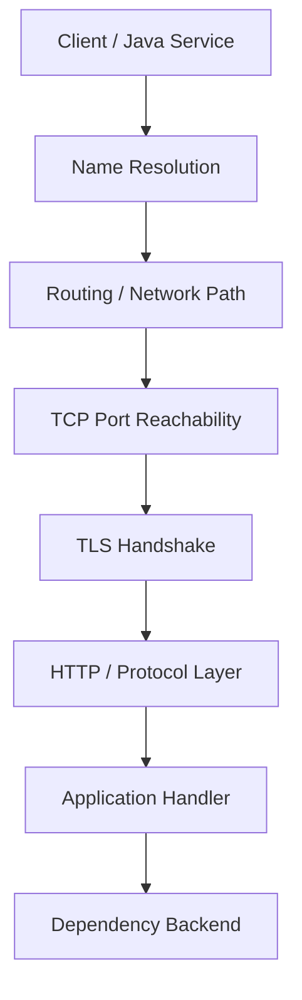
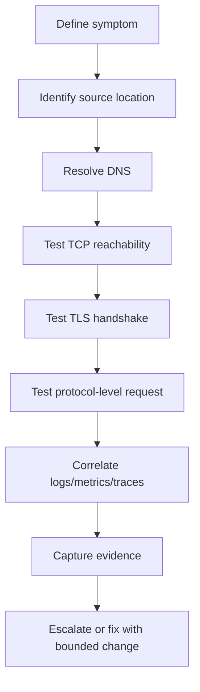

# Part 009 — Networking CLI for Backend Debugging

> Fokus part ini: membangun mental model dan workflow debugging jaringan menggunakan CLI untuk backend Java/JAX-RS, microservices, PostgreSQL, Kafka, RabbitMQ, Redis, Docker, Kubernetes, AWS/Azure, dan production operations.

Networking debugging bukan tentang menghafal `curl`, `ping`, atau `telnet`. Untuk senior backend engineer, networking CLI adalah alat untuk menjawab pertanyaan operasional:

- Apakah service bisa di-resolve oleh DNS?
- Apakah port terbuka?
- Apakah koneksi TCP bisa terbentuk?
- Apakah TLS handshake berhasil?
- Apakah HTTP request benar-benar sampai ke service yang dimaksud?
- Apakah masalah berasal dari aplikasi, DNS, TLS, routing, proxy, firewall, service mesh, Kubernetes service, ingress, network policy, atau credential?
- Apakah evidence cukup untuk eskalasi ke platform/SRE/network/security team?

Di sistem enterprise, error seperti `Connection refused`, `Connection timed out`, `UnknownHostException`, `SSLHandshakeException`, `503 Service Unavailable`, atau `No route to host` tidak boleh langsung diasumsikan sebagai bug aplikasi. Banyak error runtime Java sebenarnya adalah gejala dari lapisan networking.

---

## 1. Networking Mental Model untuk Backend Engineer

Sebelum menjalankan command, pecah masalah konektivitas menjadi beberapa layer:



Dalam praktik debugging, pertanyaan yang benar adalah:

1. Apakah hostname benar?
2. Apakah hostname resolve ke IP yang benar?
3. Apakah IP dapat dijangkau dari lokasi client?
4. Apakah port listening?
5. Apakah firewall/security group/network policy mengizinkan koneksi?
6. Apakah TLS certificate valid untuk hostname tersebut?
7. Apakah protocol yang digunakan benar?
8. Apakah application endpoint menerima request?
9. Apakah failure terjadi sebelum atau sesudah request masuk aplikasi?

Urutan ini penting karena mempercepat isolasi masalah. Jangan debug JSON payload kalau TCP handshake saja belum berhasil.

---

## 2. Kategori Failure Networking yang Sering Muncul

| Symptom | Kemungkinan Layer | Contoh Penyebab |
|---|---:|---|
| `UnknownHostException` | DNS | Hostname salah, DNS resolver gagal, service name tidak ada |
| `Connection refused` | TCP/listener | Host reachable, tapi port tidak listening atau service down |
| `Connection timed out` | Network path/firewall | Packet drop, firewall, security group, network policy |
| `No route to host` | Routing | Route tidak tersedia, subnet/network salah |
| `SSLHandshakeException` | TLS | Cert expired, wrong hostname, CA tidak trusted, mTLS mismatch |
| HTTP `404` | HTTP/app routing | Path salah, ingress rewrite, context path mismatch |
| HTTP `401/403` | Auth/authz | Token salah, scope kurang, gateway policy |
| HTTP `502/503/504` | Gateway/upstream | Service down, upstream timeout, ingress/proxy error |

Mental model penting: error message adalah clue, bukan kesimpulan final.

---

## 3. Read-Only First Principle

Untuk production debugging, mulai dari command yang tidak mengubah state:

```bash
# Aman: observasi DNS
host api.internal.example

# Aman: observasi TCP port
nc -vz api.internal.example 443

# Aman: observasi TLS handshake
openssl s_client -connect api.internal.example:443 -servername api.internal.example </dev/null

# Relatif aman: HTTP GET health/readiness endpoint
curl -v --connect-timeout 5 --max-time 10 https://api.internal.example/health
```

Hindari langsung menjalankan command yang:

- mengirim request mutating seperti `POST`, `PUT`, `PATCH`, `DELETE`;
- memakai credential production tanpa redaction;
- melakukan load test spontan;
- membuka port-forward ke resource sensitif tanpa approval;
- melakukan packet capture panjang yang bisa menangkap data sensitif;
- mengubah DNS, firewall, Kubernetes service, ingress, atau secret.

---

## 4. `ping`: Reachability Dasar, Tapi Jangan Overtrust

`ping` menggunakan ICMP. Banyak environment enterprise menonaktifkan ICMP, jadi ping gagal tidak selalu berarti service tidak reachable.

```bash
ping -c 4 api.internal.example
```

Gunakan `ping` untuk:

- indikasi kasar network reachability;
- melihat latency ICMP;
- mendeteksi packet loss sederhana.

Jangan gunakan `ping` sebagai bukti final bahwa HTTP/TCP service mati. Port 443 bisa terbuka walaupun ICMP diblokir.

### Failure mode

```text
ping: cannot resolve api.internal.example: Unknown host
```

Kemungkinan DNS failure.

```text
Request timeout for icmp_seq
```

Bisa network block, ICMP disabled, firewall, atau host unreachable.

---

## 5. `host`, `dig`, `nslookup`: DNS Debugging

Untuk backend Java, DNS failure sering muncul sebagai:

```text
java.net.UnknownHostException
```

atau intermittent connection issue jika DNS record berubah, resolver cache bermasalah, atau service discovery tidak stabil.

### `host`

```bash
host api.internal.example
```

Output sederhana:

```text
api.internal.example has address 10.20.30.40
```

### `dig`

```bash
dig api.internal.example
```

Lebih detail:

```bash
dig +short api.internal.example
```

Cek record tertentu:

```bash
dig A api.internal.example

dig AAAA api.internal.example

dig CNAME api.internal.example

dig TXT api.internal.example
```

Cek resolver tertentu:

```bash
dig @8.8.8.8 api.internal.example

dig @10.0.0.2 api.internal.example
```

### `nslookup`

```bash
nslookup api.internal.example
```

Masih sering tersedia di banyak environment, tapi `dig` biasanya lebih kaya untuk diagnosis.

---

## 6. DNS Debugging Checklist

Gunakan checklist berikut sebelum menyimpulkan aplikasi bermasalah:

- Hostname yang digunakan aplikasi sama dengan hostname yang dites dari CLI?
- Hostname resolve dari mesin developer?
- Hostname resolve dari CI runner?
- Hostname resolve dari container/pod?
- Hostname resolve ke IP yang diharapkan?
- Ada perbedaan record internal vs external DNS?
- Ada split-horizon DNS?
- TTL sangat rendah atau sangat tinggi?
- Java DNS cache ikut memengaruhi behavior?
- Kubernetes service name benar?
- Namespace Kubernetes benar?
- Search domain Kubernetes memengaruhi resolusi nama?

Contoh debugging dari dalam pod:

```bash
kubectl exec -n <namespace> deploy/<deployment-name> -- sh -lc 'getent hosts api.internal.example || nslookup api.internal.example'
```

Jika resolve dari laptop berhasil tapi dari pod gagal, masalahnya kemungkinan bukan di aplikasi, melainkan DNS resolver, namespace, network policy, atau cluster configuration.

---

## 7. `nc`: TCP Port Reachability

`nc` atau netcat berguna untuk mengecek apakah koneksi TCP ke host:port bisa dibuat.

```bash
nc -vz api.internal.example 443
```

Contoh output berhasil:

```text
Connection to api.internal.example port 443 [tcp/https] succeeded!
```

Contoh refused:

```text
connect to api.internal.example port 443 (tcp) failed: Connection refused
```

Contoh timeout:

```text
connect to api.internal.example port 443 (tcp) timed out
```

Interpretasi:

| Output | Arti Umum |
|---|---|
| succeeded | TCP handshake berhasil |
| refused | host reachable, port tidak listening atau ditolak aktif |
| timed out | packet kemungkinan drop, firewall, routing, SG, network policy |

### Untuk PostgreSQL, Kafka, RabbitMQ, Redis

```bash
nc -vz postgres.internal 5432
nc -vz kafka-broker.internal 9092
nc -vz rabbitmq.internal 5672
nc -vz redis.internal 6379
```

Ini hanya mengecek TCP reachability, bukan validasi protocol/auth.

---

## 8. Telnet Awareness

`telnet` sering dipakai lama untuk cek port:

```bash
telnet api.internal.example 443
```

Tetapi untuk modern workflow, lebih baik gunakan `nc` karena lebih jelas untuk port scanning sederhana dan lebih cocok untuk script.

Telnet awareness tetap penting karena beberapa runbook lama masih memakai telnet sebagai contoh.

---

## 9. `ss` dan `netstat`: Listening Port dan Socket State

Di Linux modern, `ss` lebih disarankan daripada `netstat`.

Cek listening port:

```bash
ss -ltnp
```

Arti flag:

- `-l`: listening
- `-t`: TCP
- `-n`: numeric, jangan resolve nama
- `-p`: tampilkan process

Cari port tertentu:

```bash
ss -ltnp | grep ':8080'
```

Cek koneksi established:

```bash
ss -tnp state established
```

Cek semua TCP state:

```bash
ss -tan
```

Jika service Java dikira listen di `8080` tapi tidak muncul di `ss`, kemungkinan:

- aplikasi belum start;
- binding ke port lain;
- binding ke `127.0.0.1` bukan `0.0.0.0`;
- container port tidak diekspos;
- process crash;
- profile/config salah.

### `netstat` awareness

```bash
netstat -ltnp
```

Di beberapa image minimal, `netstat` tidak tersedia karena bagian dari package lama seperti `net-tools`.

---

## 10. `lsof`: File dan Port Ownership

`lsof` menunjukkan file/socket yang dibuka oleh process.

Cek process yang memakai port:

```bash
lsof -i :8080
```

Cek listening TCP:

```bash
lsof -nP -iTCP -sTCP:LISTEN
```

Cek file descriptor process:

```bash
lsof -p <pid>
```

Use case backend:

- port conflict saat local development;
- terlalu banyak open files;
- connection leak;
- file log masih terbuka walaupun sudah rotated;
- process memegang file lama.

---

## 11. Binding Address: `127.0.0.1` vs `0.0.0.0`

Salah satu bug local/container paling umum:

```text
Application listens on 127.0.0.1:8080
```

Dari dalam container, service terlihat jalan. Tapi dari host atau pod lain tidak bisa connect.

Cek:

```bash
ss -ltnp | grep 8080
```

Kemungkinan output:

```text
LISTEN 0 128 127.0.0.1:8080 0.0.0.0:* users:(('java',pid=123,fd=42))
```

Artinya hanya bind ke loopback.

Jika output:

```text
LISTEN 0 128 0.0.0.0:8080 0.0.0.0:* users:(('java',pid=123,fd=42))
```

Artinya listen di semua IPv4 interface.

Untuk containerized service, biasanya aplikasi perlu bind ke `0.0.0.0`, bukan `localhost`.

---

## 12. `traceroute`: Network Path Awareness

```bash
traceroute api.internal.example
```

atau di beberapa environment:

```bash
tracepath api.internal.example
```

Gunakan untuk memahami path jaringan secara kasar. Tetapi di enterprise/cloud, banyak hop tidak merespons ICMP/UDP traceroute, jadi output `* * *` tidak selalu berarti down.

Untuk debugging cloud/private network, traceroute bisa membantu, tetapi sering perlu dikombinasikan dengan security group, route table, subnet, private endpoint, VPC/VNet, dan Kubernetes network policy.

---

## 13. `curl`: HTTP Reachability dan Header Visibility

`curl` adalah tool utama untuk HTTP-level debugging.

```bash
curl -v https://api.internal.example/health
```

`-v` menampilkan:

- DNS resolution;
- TCP connection attempt;
- TLS handshake summary;
- request header;
- response header;
- HTTP status.

Cek hanya status code:

```bash
curl -s -o /dev/null -w '%{http_code}\n' https://api.internal.example/health
```

Cek timing:

```bash
curl -s -o /dev/null \
  -w 'dns=%{time_namelookup} connect=%{time_connect} tls=%{time_appconnect} starttransfer=%{time_starttransfer} total=%{time_total}\n' \
  https://api.internal.example/health
```

Timing ini sangat berguna untuk membedakan DNS lambat, TCP lambat, TLS lambat, server processing lambat, atau response transfer lambat.

---

## 14. `wget`: Download dan Basic HTTP Check

`wget` berguna untuk download file atau artifact:

```bash
wget https://repo.internal.example/artifacts/app.jar
```

Untuk debugging API, `curl` biasanya lebih fleksibel. Namun `wget` kadang tersedia di image minimal ketika `curl` tidak tersedia.

Cek header:

```bash
wget --server-response --spider https://api.internal.example/health
```

---

## 15. TLS Debugging dengan `openssl s_client`

TLS issue sering muncul di Java sebagai:

```text
javax.net.ssl.SSLHandshakeException
PKIX path building failed
certificate_unknown
handshake_failure
No subject alternative DNS name matching ...
```

Gunakan:

```bash
openssl s_client -connect api.internal.example:443 -servername api.internal.example </dev/null
```

Hal penting:

- `-connect host:port` menentukan endpoint TCP.
- `-servername` mengirim SNI; wajib untuk banyak load balancer/ingress modern.
- `</dev/null` mencegah shell menunggu input interaktif.

Cek certificate chain:

```bash
openssl s_client -connect api.internal.example:443 -servername api.internal.example -showcerts </dev/null
```

Cek expiry:

```bash
echo | openssl s_client -connect api.internal.example:443 -servername api.internal.example 2>/dev/null \
  | openssl x509 -noout -dates -subject -issuer
```

Contoh output:

```text
notBefore=Jan  1 00:00:00 2026 GMT
notAfter=Mar 31 23:59:59 2026 GMT
subject=CN=api.internal.example
issuer=CN=Internal CA
```

---

## 16. TLS Debugging Checklist

- Hostname yang dipakai client cocok dengan SAN certificate?
- Certificate belum expired?
- Intermediate certificate lengkap?
- CA trusted oleh JVM truststore?
- Ada perbedaan truststore local vs container vs CI?
- Endpoint butuh SNI?
- Endpoint butuh mTLS/client certificate?
- TLS version/cipher suite kompatibel dengan JVM?
- Proxy/ingress melakukan TLS termination?
- Service mesh melakukan mTLS?

Untuk Java/JAX-RS client, TLS problem sering bukan karena kode HTTP client, tetapi karena:

- truststore tidak memuat internal CA;
- container image berbeda dari local JDK;
- cert rotation belum sinkron;
- hostname service berbeda dari SAN;
- mTLS secret tidak mount;
- proxy corporate intercepting TLS.

---

## 17. Proxy Debugging

Enterprise environment sering memakai HTTP proxy, corporate proxy, atau egress proxy.

Cek env var:

```bash
env | grep -i proxy
```

Umum:

```text
HTTP_PROXY=http://proxy.internal:8080
HTTPS_PROXY=http://proxy.internal:8080
NO_PROXY=localhost,127.0.0.1,.svc,.cluster.local
```

Curl dengan proxy:

```bash
curl -v -x http://proxy.internal:8080 https://api.external.example
```

Bypass proxy:

```bash
curl -v --noproxy '*' https://api.internal.example
```

Checklist:

- Apakah Java process membaca proxy env?
- Apakah JVM options mengatur proxy berbeda?
- Apakah `NO_PROXY` mencakup internal service domain?
- Apakah CI runner memakai proxy?
- Apakah Kubernetes pod memakai proxy env dari base deployment template?

---

## 18. Kubernetes Networking Context

Dalam Kubernetes, endpoint access dipengaruhi oleh:

- namespace;
- service name;
- ClusterIP;
- headless service;
- pod IP;
- ingress;
- service mesh;
- network policy;
- DNS search domain;
- readiness endpoint;
- endpoint slice;
- port name dan targetPort.

Cek service:

```bash
kubectl get svc -n <namespace>
```

Detail service:

```bash
kubectl describe svc -n <namespace> <service-name>
```

Cek endpoints:

```bash
kubectl get endpoints -n <namespace> <service-name>
```

atau:

```bash
kubectl get endpointslice -n <namespace> -l kubernetes.io/service-name=<service-name>
```

Cek dari pod:

```bash
kubectl exec -n <namespace> deploy/<deployment-name> -- sh -lc 'curl -v http://service-name:8080/health'
```

Jika service ada tapi endpoint kosong, kemungkinan pod belum ready atau selector salah.

---

## 19. Docker Networking Context

Untuk local Docker:

```bash
docker ps

docker inspect <container-name>

docker network ls

docker network inspect <network-name>
```

Cek port mapping:

```bash
docker ps --format 'table {{.Names}}\t{{.Ports}}'
```

Common issue:

- aplikasi bind ke `127.0.0.1` di container;
- port container tidak dipublish ke host;
- container tidak satu network dengan dependency;
- menggunakan `localhost` dari container untuk mengakses host/dependency yang salah;
- service name Docker Compose tidak sesuai.

Dalam Docker Compose, antar service biasanya akses pakai service name:

```text
postgres:5432
redis:6379
rabbitmq:5672
```

bukan `localhost`.

---

## 20. Database and Broker Connectivity

### PostgreSQL

TCP check:

```bash
nc -vz postgres.internal 5432
```

Protocol-level check jika `psql` tersedia:

```bash
psql 'host=postgres.internal port=5432 dbname=mydb user=myuser sslmode=require' -c 'select 1;'
```

### Redis

TCP check:

```bash
nc -vz redis.internal 6379
```

Protocol-level check:

```bash
redis-cli -h redis.internal -p 6379 PING
```

### RabbitMQ

AMQP port:

```bash
nc -vz rabbitmq.internal 5672
```

Management UI jika tersedia:

```bash
curl -v http://rabbitmq.internal:15672/api/overview
```

### Kafka

TCP check:

```bash
nc -vz kafka-broker.internal 9092
```

Kafka membutuhkan protocol-level tooling untuk validasi lebih jauh. TCP success belum membuktikan bootstrap broker, advertised listener, auth, TLS, SASL, dan topic access benar.

---

## 21. Timeout Semantics

Timeout perlu dibaca dari konteks layer:

| Timeout | Arti Umum |
|---|---|
| DNS timeout | resolver lambat/tidak bisa diakses |
| connect timeout | TCP handshake tidak selesai |
| TLS handshake timeout | handshake lambat/gagal |
| read timeout | server menerima koneksi tapi tidak mengirim response tepat waktu |
| gateway timeout | proxy/gateway timeout menunggu upstream |

Contoh curl dengan timeout eksplisit:

```bash
curl -v \
  --connect-timeout 3 \
  --max-time 10 \
  https://api.internal.example/health
```

Untuk bug report, selalu tulis timeout mana yang terjadi.

---

## 22. `tcpdump` Awareness

`tcpdump` adalah tool kuat tetapi harus dipakai hati-hati karena bisa menangkap data sensitif.

Contoh capture terbatas:

```bash
sudo tcpdump -i any host api.internal.example and port 443 -c 20
```

Capture ke file:

```bash
sudo tcpdump -i any port 443 -w capture.pcap -c 100
```

Production safety:

- gunakan filter seketat mungkin;
- batasi jumlah packet dengan `-c`;
- jangan capture payload sensitif tanpa approval;
- simpan file sesuai kebijakan security;
- redaksi atau batasi distribusi file `.pcap`.

Gunakan `tcpdump` ketika layer di atas tidak cukup menjelaskan apakah packet keluar/masuk.

---

## 23. Java/JAX-RS Impact

Networking issue memengaruhi backend Java/JAX-RS dalam beberapa bentuk:

- inbound request gagal karena ingress/proxy/service mesh;
- outbound REST client gagal karena DNS/TLS/proxy;
- database connection pool tidak bisa connect;
- Kafka/RabbitMQ client gagal bootstrap;
- Redis client timeout;
- health check gagal karena dependency transitif;
- startup lama karena dependency check blocking;
- retry storm karena connect/read timeout terlalu agresif;
- thread pool exhaustion akibat hung network call;
- circuit breaker terbuka karena upstream failure.

Senior engineer perlu mengaitkan CLI evidence dengan application behavior:

```text
curl from pod fails DNS
=> kemungkinan aplikasi juga gagal DNS
=> cek resolver/namespace/service name
=> jangan langsung ubah kode client
```

---

## 24. Observability Correlation

Networking CLI harus dikombinasikan dengan observability:

- application logs;
- access logs;
- ingress logs;
- service mesh telemetry;
- metrics latency/error rate;
- trace spans;
- deployment events;
- DNS/service discovery events;
- cloud load balancer metrics.

Contoh evidence yang kuat:

```text
10:01:12 deployment v1.42 started
10:03:05 readiness failed for quote-order-service
10:03:10 curl from pod to catalog-service: DNS resolves
10:03:12 nc to catalog-service:443 succeeds
10:03:13 openssl handshake fails: certificate verify error
10:03:20 app log shows SSLHandshakeException
```

Ini jauh lebih kuat daripada hanya berkata “API down”.

---

## 25. Failure Mode: DNS Works Locally, Fails in Pod

Kemungkinan:

- internal DNS hanya tersedia di VPN/laptop, bukan cluster;
- Kubernetes CoreDNS issue;
- namespace search domain salah;
- service name tidak fully qualified;
- network policy memblokir DNS;
- pod image tidak punya resolver config benar;
- sidecar/service mesh mengubah behavior.

Debug:

```bash
kubectl exec -n <ns> deploy/<app> -- sh -lc 'cat /etc/resolv.conf'

kubectl exec -n <ns> deploy/<app> -- sh -lc 'getent hosts <host> || nslookup <host>'
```

---

## 26. Failure Mode: TCP Refused

Artinya target aktif menolak koneksi atau tidak ada listener.

Debug:

```bash
nc -vz host 8080

ss -ltnp | grep 8080

kubectl describe svc -n <ns> <svc>

kubectl get endpoints -n <ns> <svc>
```

Kemungkinan:

- service belum start;
- port salah;
- targetPort salah;
- container port mismatch;
- listener bind ke localhost;
- pod readiness false sehingga endpoint kosong;
- wrong service selector.

---

## 27. Failure Mode: TCP Timeout

Timeout biasanya lebih sulit karena packet bisa drop di banyak tempat.

Debug:

```bash
nc -vz -w 3 host 443

curl -v --connect-timeout 3 --max-time 10 https://host/health
```

Kemungkinan:

- firewall/security group;
- Kubernetes network policy;
- route table salah;
- private endpoint tidak reachable;
- proxy/egress policy;
- wrong subnet/VPC/VNet;
- load balancer tidak reachable;
- service mesh policy.

Evidence penting: dari mana command dijalankan. Laptop, CI runner, pod, node, bastion, dan production subnet bisa punya network path berbeda.

---

## 28. Failure Mode: TLS Certificate Error

Debug:

```bash
openssl s_client -connect host:443 -servername host </dev/null

curl -v https://host/health
```

Kemungkinan:

- certificate expired;
- SAN mismatch;
- missing intermediate CA;
- JVM truststore tidak punya CA;
- cert rotation belum selesai;
- mTLS client cert salah;
- proxy terminating TLS;
- hostname yang dipakai aplikasi berbeda dari hostname cert.

Jangan langsung memakai `curl -k` sebagai solusi. `-k` hanya membuktikan bahwa bypass certificate validation membuat request lanjut. Untuk production, itu hampir selalu bukan fix yang acceptable.

---

## 29. Production-Safe Networking Debugging Workflow



Checklist:

1. Tuliskan source dan target.
2. Jalankan DNS check dari source environment yang benar.
3. Jalankan TCP check.
4. Jalankan TLS check jika HTTPS/TLS.
5. Jalankan protocol check dengan request minimal.
6. Catat timestamp, command, output, environment.
7. Redact secret/token/header sensitif.
8. Bandingkan local vs CI vs pod vs production jika perlu.
9. Jangan lakukan mutating request kecuali jelas aman dan diizinkan.

---

## 30. Command Pattern untuk Evidence Bundle

Gunakan format yang bisa direproduksi:

```bash
set -o pipefail

TARGET_HOST="api.internal.example"
TARGET_PORT="443"
TARGET_URL="https://${TARGET_HOST}/health"

printf 'timestamp=%s\n' "$(date -Iseconds)"
printf 'host=%s\n' "$(hostname)"
printf 'target=%s:%s\n' "$TARGET_HOST" "$TARGET_PORT"

printf '\n## DNS\n'
(getent hosts "$TARGET_HOST" || nslookup "$TARGET_HOST" || true) 2>&1

printf '\n## TCP\n'
(nc -vz -w 3 "$TARGET_HOST" "$TARGET_PORT" || true) 2>&1

printf '\n## TLS\n'
(echo | openssl s_client -connect "${TARGET_HOST}:${TARGET_PORT}" -servername "$TARGET_HOST" 2>&1 | head -80 || true)

printf '\n## HTTP\n'
(curl -v --connect-timeout 3 --max-time 10 "$TARGET_URL" || true) 2>&1
```

Catatan: jangan simpan token atau payload sensitif dalam evidence bundle.

---

## 31. PR Review Checklist untuk Networking Tooling

Saat mereview script, workflow, atau config yang menyentuh network:

- Apakah hostname/port configurable?
- Apakah timeout eksplisit?
- Apakah retry punya backoff dan batas maksimum?
- Apakah command aman dijalankan di production?
- Apakah secret tidak tercetak di log?
- Apakah DNS/TLS/proxy behavior terdokumentasi?
- Apakah command bisa dijalankan dari local dan CI?
- Apakah destructive action dipisah dari diagnostic action?
- Apakah error message actionable?
- Apakah script membedakan connection refused vs timeout vs TLS failure?
- Apakah Kubernetes namespace/context divalidasi?
- Apakah cloud account/subscription/profile divalidasi sebelum command?

---

## 32. Internal Verification Checklist

Verifikasi ke internal CSG/team, jangan diasumsikan:

- Hostname convention untuk service internal.
- DNS pattern untuk Kubernetes service, ingress, API gateway, dan cloud private endpoint.
- Apakah ada service mesh/mTLS.
- Apakah ada corporate proxy/egress proxy.
- Apakah pod boleh melakukan `curl`, `nc`, `dig`, `openssl`, atau `tcpdump`.
- Apakah debug image tersedia.
- Apakah production pod boleh di-`exec`.
- Network policy antar namespace/service.
- Security group/firewall ownership.
- TLS certificate issuance dan rotation process.
- Internal CA dan JVM truststore process.
- Runbook untuk PostgreSQL, Kafka, RabbitMQ, Redis connectivity.
- Escalation path ke platform/SRE/network/security.
- Standard evidence bundle untuk incident.

---

## 33. Practical Exercises

### Exercise 1 — DNS vs TCP

Ambil satu endpoint internal non-production. Dari local dan dari pod, bandingkan:

```bash
dig +short <host>

nc -vz <host> <port>
```

Tuliskan apakah failure terjadi di DNS atau TCP.

### Exercise 2 — TLS Certificate Inspection

```bash
openssl s_client -connect <host>:443 -servername <host> </dev/null \
  | openssl x509 -noout -subject -issuer -dates
```

Catat subject, issuer, expiry, dan apakah hostname sesuai.

### Exercise 3 — HTTP Timing

```bash
curl -s -o /dev/null \
  -w 'dns=%{time_namelookup} connect=%{time_connect} tls=%{time_appconnect} ttfb=%{time_starttransfer} total=%{time_total}\n' \
  https://<host>/health
```

Interpretasikan bottleneck utama.

### Exercise 4 — Kubernetes Service Endpoint

```bash
kubectl get svc -n <ns> <svc>
kubectl describe svc -n <ns> <svc>
kubectl get endpoints -n <ns> <svc>
```

Jelaskan hubungan service selector, pod readiness, dan endpoint availability.

---

## 34. Key Takeaways

- Networking debugging harus mengikuti layer: DNS → route/network → TCP → TLS → protocol → application.
- `ping` bukan bukti final service reachable.
- `nc` baik untuk TCP reachability, tetapi bukan protocol validation.
- `openssl s_client` sangat penting untuk TLS/mTLS diagnosis.
- `curl -v` memberi evidence HTTP, TLS, dan connection flow.
- Kubernetes networking perlu dicek dari dalam pod/namespace yang relevan.
- Timeout, refused, dan DNS failure punya makna berbeda.
- Production debugging harus read-only first, bounded, timestamped, dan redacted.
- Senior engineer harus bisa membedakan bug aplikasi dari failure network environment.
