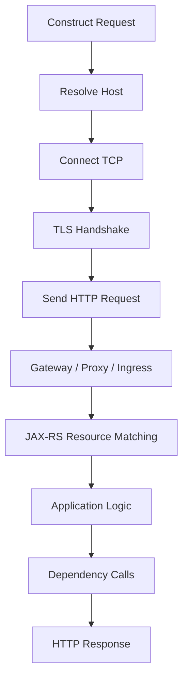

# Part 010 — HTTP/API Debugging with CLI

> Fokus part ini: menggunakan CLI, terutama `curl`, untuk membuat debugging HTTP/API yang reproducible, aman, evidence-backed, dan berguna untuk backend Java/JAX-RS enterprise services.

Untuk senior backend engineer, HTTP/API debugging bukan sekadar “coba hit endpoint”. Tujuannya adalah menghasilkan reproduksi masalah yang jelas:

- request apa yang dikirim;
- header apa yang penting;
- body apa yang dikirim;
- status code apa yang diterima;
- response header/body apa yang muncul;
- timeout terjadi di layer mana;
- apakah TLS/proxy/auth ikut berperan;
- apakah request benar-benar merepresentasikan behavior client produksi;
- apakah evidence aman dibagikan tanpa credential atau data sensitif.

Part ini memperdalam `curl` dan CLI API debugging setelah fondasi networking di Part 009.

---

## 1. HTTP/API Debugging Mental Model

HTTP debugging perlu dipisahkan menjadi beberapa lapisan:



Jika response gagal, tanya:

1. Apakah request valid secara HTTP?
2. Apakah method benar?
3. Apakah path benar?
4. Apakah query parameter benar?
5. Apakah header wajib ada?
6. Apakah content type sesuai body?
7. Apakah authentication/authorization benar?
8. Apakah request melewati gateway/proxy/ingress?
9. Apakah JAX-RS resource method match?
10. Apakah aplikasi gagal setelah handler dipanggil?
11. Apakah dependency downstream gagal?

Debugging yang buruk langsung melompat ke kode. Debugging yang baik membuktikan dulu request dan response boundary.

---

## 2. Golden Rule: Reproducible API Bug Report

Bug report API yang bagus minimal berisi:

- environment;
- timestamp;
- URL;
- method;
- request headers penting;
- request body yang sudah disanitasi;
- command `curl` yang bisa diulang;
- response status;
- response headers penting;
- response body/error body;
- correlation ID/trace ID;
- expected behavior;
- actual behavior;
- apakah request mutating atau read-only;
- apakah data sample aman dipakai.

Template ringkas:

```md
## API Reproduction

Environment: <dev/staging/prod-like>
Timestamp: <ISO-8601>
Source: <local/CI/pod/namespace>
Endpoint: <method> <url>
Correlation ID: <id>

Command:
```bash
curl ...
```

Expected:
<expected behavior>

Actual:
<status, response, error>

Notes:
<redaction, auth, data constraints>
```

---

## 3. Basic `curl` Request

GET request:

```bash
curl https://api.internal.example/health
```

Verbose request:

```bash
curl -v https://api.internal.example/health
```

Silent but show errors:

```bash
curl -sS https://api.internal.example/health
```

Recommended default for debugging:

```bash
curl -v --connect-timeout 3 --max-time 10 https://api.internal.example/health
```

Why:

- `-v` gives connection/request/response metadata;
- `--connect-timeout` prevents hanging during TCP connect;
- `--max-time` bounds total command duration.

---

## 4. HTTP Method

Explicit method:

```bash
curl -X GET https://api.internal.example/orders/123
```

For GET, `-X GET` is usually unnecessary, but can make bug report clearer.

POST:

```bash
curl -X POST https://api.internal.example/orders
```

PUT:

```bash
curl -X PUT https://api.internal.example/orders/123
```

PATCH:

```bash
curl -X PATCH https://api.internal.example/orders/123
```

DELETE:

```bash
curl -X DELETE https://api.internal.example/orders/123
```

Production safety:

- GET/HEAD should be safe by HTTP semantics, but verify internal behavior.
- PUT/DELETE are generally idempotent by semantics, but implementation may not be safe.
- POST is usually mutating and not idempotent.
- Never run mutating request in production unless explicitly approved and understood.

---

## 5. Headers

Add header:

```bash
curl -H 'Accept: application/json' https://api.internal.example/orders/123
```

Multiple headers:

```bash
curl \
  -H 'Accept: application/json' \
  -H 'X-Correlation-ID: debug-20260711-001' \
  https://api.internal.example/orders/123
```

Content-Type for JSON body:

```bash
curl \
  -X POST \
  -H 'Content-Type: application/json' \
  -H 'Accept: application/json' \
  -d '{"customerId":"CUST-001"}' \
  https://api.internal.example/quotes
```

Important headers in enterprise systems:

- `Authorization`
- `Content-Type`
- `Accept`
- `X-Correlation-ID`
- `X-Request-ID`
- tenant header
- locale/header
- idempotency key
- API version header
- client application header
- forwarded headers through gateway

Internal header names must be verified with team docs.

---

## 6. Authorization Header Safety

Bearer token example:

```bash
curl \
  -H "Authorization: Bearer ${TOKEN}" \
  https://api.internal.example/orders/123
```

Avoid putting literal tokens in shell history:

```bash
read -rsp 'Token: ' TOKEN
printf '\n'

curl -H "Authorization: Bearer ${TOKEN}" https://api.internal.example/orders/123
```

Do not paste real token into:

- chat;
- ticket;
- PR comment;
- shared docs;
- terminal recording;
- shell script committed to Git;
- log output.

Redaction pattern:

```text
Authorization: Bearer <redacted>
```

If command uses `-v`, remember `curl` may print request headers, including authorization. For shared evidence, remove or redact sensitive headers.

---

## 7. Query Parameters

Simple query:

```bash
curl 'https://api.internal.example/orders?status=OPEN&limit=10'
```

Always quote URLs with `&` to prevent shell background execution.

Bad:

```bash
curl https://api.internal.example/orders?status=OPEN&limit=10
```

The shell interprets `&` as background operator.

Encode data safely:

```bash
curl -G \
  --data-urlencode 'status=OPEN' \
  --data-urlencode 'customerName=ACME & Sons' \
  'https://api.internal.example/orders'
```

Use `-G` when you want `--data-urlencode` values appended as query parameters.

---

## 8. JSON Body

Inline JSON:

```bash
curl \
  -X POST \
  -H 'Content-Type: application/json' \
  -H 'Accept: application/json' \
  -d '{"customerId":"CUST-001","currency":"USD"}' \
  https://api.internal.example/quotes
```

Readable heredoc:

```bash
curl \
  -X POST \
  -H 'Content-Type: application/json' \
  -H 'Accept: application/json' \
  -d @- \
  https://api.internal.example/quotes <<'JSON'
{
  "customerId": "CUST-001",
  "currency": "USD",
  "items": [
    {
      "productCode": "PLAN-001",
      "quantity": 1
    }
  ]
}
JSON
```

From file:

```bash
curl \
  -X POST \
  -H 'Content-Type: application/json' \
  -H 'Accept: application/json' \
  --data-binary @request.json \
  https://api.internal.example/quotes
```

Prefer `--data-binary @file` when exact body preservation matters.

---

## 9. `-d` vs `--data-binary`

`-d` / `--data` is convenient for typical form/JSON request body, but may normalize line endings and has behavior around leading `@`.

`--data-binary` preserves body more exactly.

For API debugging:

```bash
--data-binary @request.json
```

is often safer when you want the exact same payload.

---

## 10. Form Request

```bash
curl \
  -X POST \
  -H 'Content-Type: application/x-www-form-urlencoded' \
  -d 'username=alice' \
  -d 'password=redacted' \
  https://api.internal.example/login
```

Use `--data-urlencode` when values may contain special characters:

```bash
curl \
  -X POST \
  --data-urlencode 'username=alice@example.com' \
  --data-urlencode 'redirect=https://client.example/callback?x=1&y=2' \
  https://api.internal.example/form
```

---

## 11. Multipart and File Upload

Multipart upload:

```bash
curl \
  -X POST \
  -F 'metadata={"type":"contract"};type=application/json' \
  -F 'file=@contract.pdf;type=application/pdf' \
  https://api.internal.example/documents
```

Important:

- `-F` makes curl send `multipart/form-data`.
- Do not manually set multipart boundary unless you know exactly why.
- Verify max upload size at gateway, application, and storage layers.

Failure modes:

- HTTP `413 Payload Too Large`;
- `415 Unsupported Media Type`;
- `400 Bad Request` due to wrong part name;
- backend stream handling error;
- gateway timeout for large upload.

---

## 12. Binary Download

Save response to file:

```bash
curl -L -o artifact.jar https://repo.internal.example/artifacts/app.jar
```

Fail on HTTP error:

```bash
curl -fL -o artifact.jar https://repo.internal.example/artifacts/app.jar
```

Recommended:

```bash
curl -fL --connect-timeout 5 --max-time 60 -o artifact.jar https://repo.internal.example/artifacts/app.jar
```

Validate size/checksum if available:

```bash
sha256sum artifact.jar
```

---

## 13. Response Header and Body

Show response headers and body:

```bash
curl -i https://api.internal.example/orders/123
```

Headers only:

```bash
curl -I https://api.internal.example/health
```

Be careful: `HEAD` may be handled differently from `GET` by some applications/gateways.

Save headers and body separately:

```bash
curl -sS \
  -D response.headers \
  -o response.body \
  https://api.internal.example/orders/123
```

Print status code:

```bash
curl -sS -o response.body -w '%{http_code}\n' https://api.internal.example/orders/123
```

---

## 14. HTTP Status Code Strategy for Debugging

| Status | Debug Interpretation |
|---:|---|
| 200 | Request accepted and successful |
| 201 | Resource created |
| 202 | Accepted asynchronously; check job/event state |
| 204 | Success without body |
| 301/302/307/308 | Redirect; check `Location` and method preservation |
| 400 | Request invalid; check schema, validation, required fields |
| 401 | Unauthenticated; token missing/invalid/expired |
| 403 | Authenticated but not authorized |
| 404 | Wrong path/resource/gateway route/context path |
| 409 | Conflict; domain invariant/version/state issue |
| 412 | Precondition failed; ETag/version/concurrency guard |
| 415 | Wrong media type/content type |
| 422 | Semantic validation failure if used by API |
| 429 | Rate limit/throttling |
| 500 | Application/server error |
| 502 | Gateway cannot reach upstream or bad upstream response |
| 503 | Service unavailable, no healthy upstream, maintenance |
| 504 | Gateway timeout waiting for upstream |

For JAX-RS services, `404` can mean:

- URL path wrong;
- application context path wrong;
- resource method not matched;
- path parameter pattern mismatch;
- gateway rewrite changed path;
- endpoint not deployed in this version.

---

## 15. Redirect Handling

Follow redirect:

```bash
curl -L https://api.internal.example/old-path
```

Show redirect chain:

```bash
curl -v -L https://api.internal.example/old-path
```

Limit redirects:

```bash
curl -L --max-redirs 5 https://api.internal.example/old-path
```

Debug concern:

- 301/302 may change method behavior depending client;
- 307/308 preserve method more strictly;
- auth header may not be forwarded across host redirect;
- redirect can hide gateway misconfiguration.

---

## 16. Timeout and Timing

Set connect timeout and total timeout:

```bash
curl \
  --connect-timeout 3 \
  --max-time 10 \
  https://api.internal.example/health
```

Detailed timing:

```bash
curl -sS -o /dev/null \
  -w 'dns=%{time_namelookup}\nconnect=%{time_connect}\ntls=%{time_appconnect}\npretransfer=%{time_pretransfer}\nstarttransfer=%{time_starttransfer}\ntotal=%{time_total}\n' \
  https://api.internal.example/health
```

Interpretation:

- `time_namelookup`: DNS time.
- `time_connect`: TCP connect complete.
- `time_appconnect`: TLS handshake complete.
- `time_starttransfer`: first byte received.
- `time_total`: full transfer complete.

If `time_starttransfer` dominates, server or upstream processing may be slow.

---

## 17. Retry with Care

Curl retry:

```bash
curl \
  --retry 3 \
  --retry-delay 2 \
  --retry-all-errors \
  --connect-timeout 3 \
  --max-time 10 \
  https://api.internal.example/health
```

Use retry carefully:

- fine for safe GET health checks;
- risky for mutating POST unless idempotency key is used;
- can hide intermittent failures;
- can amplify load during incident.

For production client design, retry policy belongs in application code/config with observability, backoff, jitter, and circuit breaker awareness.

---

## 18. TLS Validation

Default curl validates TLS certificate:

```bash
curl https://api.internal.example/health
```

Show TLS details:

```bash
curl -v https://api.internal.example/health
```

Use specific CA bundle:

```bash
curl --cacert internal-ca.pem https://api.internal.example/health
```

Avoid this as a “fix”:

```bash
curl -k https://api.internal.example/health
```

`-k` / `--insecure` disables certificate validation. It is useful only as a diagnostic comparison:

```text
Without -k: fails certificate validation
With -k: reaches application
=> likely trust/SAN/CA issue, not application handler issue
```

Do not normalize insecure TLS in scripts, docs, or CI unless there is a tightly controlled non-production reason.

---

## 19. Client Certificate / mTLS

If endpoint requires mTLS:

```bash
curl \
  --cert client.crt \
  --key client.key \
  --cacert ca.pem \
  https://api.internal.example/health
```

If cert and key are bundled:

```bash
curl --cert client.pem --cacert ca.pem https://api.internal.example/health
```

Checklist:

- client certificate valid?
- private key matches cert?
- CA trusted by server?
- server certificate trusted by client?
- SNI hostname correct?
- certificate not expired?
- cert mounted into pod correctly?
- file permission allows process to read it?

---

## 20. Proxy

Use proxy explicitly:

```bash
curl -x http://proxy.internal:8080 https://api.external.example/health
```

Bypass proxy:

```bash
curl --noproxy '*' https://api.internal.example/health
```

Inspect proxy env:

```bash
env | grep -i proxy
```

Common issue:

- local request goes through proxy;
- pod request bypasses proxy;
- CI request uses proxy;
- `NO_PROXY` missing `.svc` or internal domain;
- proxy strips or rewrites headers;
- proxy changes TLS behavior.

---

## 21. HTTP Version

Force HTTP/1.1:

```bash
curl --http1.1 https://api.internal.example/health
```

Force HTTP/2 if supported:

```bash
curl --http2 https://api.internal.example/health
```

Use case:

- gateway behaves differently with HTTP/2;
- gRPC/HTTP2 endpoint confusion;
- connection reuse issue;
- header casing/translation behavior;
- proxy incompatibility.

Most JAX-RS REST APIs are debugged fine over HTTP/1.1, but gateways/load balancers may terminate or upgrade protocols.

---

## 22. Cookies and Sessions

Save cookies:

```bash
curl -c cookies.txt https://api.internal.example/login
```

Send cookies:

```bash
curl -b cookies.txt https://api.internal.example/session
```

For enterprise backend API, stateless token auth is often preferred, but some admin consoles or legacy flows may still require cookies.

Security note: cookie jar files may contain secrets. Do not commit or share them.

---

## 23. Idempotency Key

For mutating request that may be retried:

```bash
curl \
  -X POST \
  -H 'Content-Type: application/json' \
  -H 'Idempotency-Key: debug-quote-20260711-001' \
  --data-binary @request.json \
  https://api.internal.example/quotes
```

Internal header name must be verified. Some systems use custom idempotency headers or domain-specific request IDs.

Why it matters:

- prevents duplicate quote/order/payment-like operations;
- makes retries safer;
- helps correlate request processing;
- supports safe reproduction in non-production.

Never assume idempotency exists. Verify implementation.

---

## 24. Correlation ID / Trace ID

Send correlation ID:

```bash
curl \
  -H 'X-Correlation-ID: debug-20260711-001' \
  https://api.internal.example/orders/123
```

Then grep logs:

```bash
kubectl logs -n <ns> deploy/<service> --since=10m | grep 'debug-20260711-001'
```

If the platform uses OpenTelemetry or trace propagation, verify header convention:

- `traceparent`
- `b3`
- `X-B3-TraceId`
- internal correlation header

Do not invent internal tracing conventions. Use team standard.

---

## 25. Pretty Print JSON with `jq`

```bash
curl -sS https://api.internal.example/orders/123 | jq .
```

Extract field:

```bash
curl -sS https://api.internal.example/orders/123 | jq -r '.status'
```

Validate array size:

```bash
curl -sS 'https://api.internal.example/orders?limit=10' | jq '.items | length'
```

Fail pipeline if invalid JSON:

```bash
curl -sS https://api.internal.example/orders/123 | jq -e . >/dev/null
```

Useful for CI smoke tests:

```bash
status=$(curl -sS https://api.internal.example/orders/123 | jq -r '.status')
[ "$status" = "OPEN" ]
```

But for production smoke tests, keep them read-only and low impact.

---

## 26. Capture Status and Body Safely

Pattern:

```bash
response_file=$(mktemp)
status=$(curl -sS \
  -o "$response_file" \
  -w '%{http_code}' \
  --connect-timeout 3 \
  --max-time 10 \
  https://api.internal.example/health)

printf 'status=%s\n' "$status"
cat "$response_file"
rm -f "$response_file"
```

With cleanup:

```bash
response_file=$(mktemp)
trap 'rm -f "$response_file"' EXIT

status=$(curl -sS -o "$response_file" -w '%{http_code}' https://api.internal.example/health)

if [ "$status" != "200" ]; then
  echo "Unexpected status: $status" >&2
  cat "$response_file" >&2
  exit 1
fi
```

---

## 27. API Smoke Test Pattern

Read-only smoke test:

```bash
#!/usr/bin/env bash
set -euo pipefail

BASE_URL="${BASE_URL:?BASE_URL is required}"

status=$(curl -sS \
  -o /tmp/health-body.$$ \
  -w '%{http_code}' \
  --connect-timeout 3 \
  --max-time 10 \
  "${BASE_URL}/health")

if [ "$status" != "200" ]; then
  echo "Health check failed: status=$status" >&2
  cat /tmp/health-body.$$ >&2 || true
  rm -f /tmp/health-body.$$
  exit 1
fi

rm -f /tmp/health-body.$$
echo "Health check OK"
```

Review concerns:

- Uses timeout.
- Fails on unexpected status.
- Avoids mutating endpoint.
- Does not print secret.
- Configurable `BASE_URL`.

---

## 28. JAX-RS Specific Debugging Concerns

JAX-RS request matching can fail because of:

- base application path mismatch;
- resource path mismatch;
- path parameter regex mismatch;
- missing `@Consumes` match;
- missing `@Produces` match;
- wrong `Content-Type`;
- wrong `Accept`;
- filter/interceptor blocking request;
- exception mapper converting exception to generic response;
- validation layer rejecting DTO;
- gateway path rewrite before request reaches app.

CLI symptoms:

| Symptom | Possible JAX-RS Concern |
|---|---|
| 404 | path/resource method not matched |
| 405 | method not allowed |
| 415 | `Content-Type` does not match `@Consumes` |
| 406 | `Accept` does not match `@Produces` |
| 400 | JSON parse/validation failure |
| 500 | unhandled exception or mapper behavior |

Test header negotiation explicitly:

```bash
curl -v \
  -H 'Accept: application/json' \
  -H 'Content-Type: application/json' \
  --data-binary @request.json \
  https://api.internal.example/quotes
```

---

## 29. Gateway/Ingress Debugging Concerns

API request may fail before app sees it.

Possible layers:

- DNS;
- cloud load balancer;
- API gateway;
- ingress controller;
- service mesh sidecar;
- auth proxy;
- WAF;
- rate limiter;
- Kubernetes service;
- application pod.

Evidence distinction:

- Gateway response header differs from application response header.
- Error body format differs from app error format.
- Correlation ID absent in app logs.
- App access logs have no request.
- Ingress logs show upstream unavailable.
- Service endpoints empty.

Curl with response headers helps:

```bash
curl -i -v https://api.internal.example/quotes/123
```

Check headers such as:

- `server`
- `via`
- `x-envoy-*`
- `x-request-id`
- `x-correlation-id`
- gateway-specific error code

Internal header conventions must be verified.

---

## 30. API Versioning Debugging

Version may appear in:

- path: `/v1/quotes`;
- header: `Accept: application/vnd.company.quote.v1+json`;
- query: `?api-version=1`;
- gateway route;
- content negotiation;
- service deployment version.

CLI check:

```bash
curl -v \
  -H 'Accept: application/vnd.example.quote.v1+json' \
  https://api.internal.example/quotes/123
```

Failure modes:

- old client calls new endpoint;
- gateway routes v1 and v2 differently;
- response schema changed without compatibility;
- header version omitted;
- documentation and deployed behavior diverge.

---

## 31. Reproducing Client Behavior

Production clients may send headers that manual curl misses:

- auth token;
- tenant ID;
- correlation ID;
- client ID;
- idempotency key;
- content type;
- accept;
- locale;
- feature flag/context header;
- user agent;
- forwarded headers.

To reproduce accurately, compare:

- application access log;
- gateway log;
- client log;
- trace span attributes;
- API documentation;
- contract test fixture.

Do not add random headers just to make request pass. Understand which headers are part of the contract.

---

## 32. Safe Redaction for Evidence

Before sharing command/output, redact:

- `Authorization`;
- cookies;
- session IDs;
- API keys;
- tokens;
- customer identifiers if sensitive;
- PII;
- internal hostnames if policy requires;
- full payload with regulated data;
- signed URLs;
- client certificates/keys.

Bad evidence:

```bash
curl -H 'Authorization: Bearer eyJhbGciOi...' ...
```

Good evidence:

```bash
curl -H 'Authorization: Bearer <redacted>' ...
```

For JSON payload, create sanitized minimal reproduction:

```json
{
  "customerId": "CUST-REDACTED",
  "items": [
    {
      "productCode": "PLAN-001",
      "quantity": 1
    }
  ]
}
```

---

## 33. API Debugging with Kubernetes Logs

Send correlation ID:

```bash
CID="debug-$(date +%Y%m%d%H%M%S)"

curl -v \
  -H "X-Correlation-ID: ${CID}" \
  https://api.internal.example/health
```

Search logs:

```bash
kubectl logs -n <ns> deploy/<service> --since=10m | grep "$CID"
```

If no logs:

- request did not reach app;
- correlation ID not propagated/logged;
- wrong namespace/service;
- logs routed elsewhere;
- endpoint served by another deployment;
- gateway rejected before app.

---

## 34. API Debugging with Port Forward

For non-production debugging:

```bash
kubectl port-forward -n <ns> svc/<service-name> 18080:8080
```

Then:

```bash
curl -v http://localhost:18080/health
```

Use carefully:

- confirm namespace/context;
- do not expose sensitive service broadly;
- bind to localhost only by default;
- avoid mutating production through port-forward;
- remember port-forward bypasses some gateway/ingress behavior.

Port-forward is useful to isolate app/service behavior from gateway behavior.

---

## 35. Comparing Gateway vs Direct Service

Gateway path:

```bash
curl -v https://api.internal.example/quotes/123
```

Direct service path through port-forward:

```bash
kubectl port-forward -n <ns> svc/quote-service 18080:8080
curl -v http://localhost:18080/quotes/123
```

Interpretation:

| Gateway | Direct | Likely Issue |
|---|---|---|
| fails | succeeds | gateway/ingress/auth/proxy/routing |
| succeeds | fails | test not equivalent or internal route issue |
| fails | fails | app/dependency/config issue |
| succeeds | succeeds | intermittent/client-specific issue |

---

## 36. API Contract Debugging

For API contract issues, capture:

- request schema;
- response schema;
- status code;
- error format;
- required/optional fields;
- enum values;
- nullability;
- date/time format;
- numeric precision;
- backward compatibility expectation;
- OpenAPI spec version if available.

CLI can validate basic response shape:

```bash
curl -sS https://api.internal.example/quotes/123 \
  | jq -e '.id and .status and .items'
```

But schema-level validation should use contract tests or OpenAPI tooling where available.

---

## 37. Common Curl Mistakes

### Mistake 1 — Unquoted URL with `&`

Bad:

```bash
curl https://api/orders?status=OPEN&limit=10
```

Good:

```bash
curl 'https://api/orders?status=OPEN&limit=10'
```

### Mistake 2 — Missing Content-Type

Bad:

```bash
curl -d '{"x":1}' https://api/resource
```

Good:

```bash
curl -H 'Content-Type: application/json' -d '{"x":1}' https://api/resource
```

### Mistake 3 — Using `-k` permanently

Bad:

```bash
curl -k https://api/health
```

Good diagnostic:

```bash
curl -v https://api/health
curl -vk https://api/health  # diagnostic comparison only
```

### Mistake 4 — Printing secrets with `-v`

Verbose mode can print request headers. Redact before sharing.

### Mistake 5 — No timeout

Bad:

```bash
curl https://api/health
```

Good:

```bash
curl --connect-timeout 3 --max-time 10 https://api/health
```

---

## 38. Failure Mode: 400 Bad Request

Likely causes:

- invalid JSON;
- wrong field name;
- wrong type;
- missing required field;
- validation failure;
- date/time format mismatch;
- enum value mismatch;
- body not sent as expected;
- wrong content type;
- gateway request validation.

Debug:

```bash
jq . request.json

curl -v \
  -H 'Content-Type: application/json' \
  -H 'Accept: application/json' \
  --data-binary @request.json \
  https://api.internal.example/resource
```

Capture response body. Many APIs include validation details there.

---

## 39. Failure Mode: 401/403

401:

- token missing;
- token expired;
- token malformed;
- wrong issuer/audience;
- gateway auth failed.

403:

- authenticated but missing permission/scope/role;
- tenant mismatch;
- resource-level authorization;
- environment policy;
- WAF/security rule.

Debug safely:

```bash
curl -v \
  -H 'Authorization: Bearer <redacted>' \
  https://api.internal.example/orders/123
```

Do not paste real JWT into shared ticket. Decode JWT only using approved internal tooling or safe local commands without leaking token.

---

## 40. Failure Mode: 404 Not Found

Could be:

- resource truly not found;
- endpoint path wrong;
- base path wrong;
- version path wrong;
- gateway rewrite issue;
- JAX-RS resource not deployed;
- path parameter mismatch;
- wrong environment;
- trailing slash behavior.

Debug:

```bash
curl -v https://api.internal.example/health
curl -v https://api.internal.example/api/health
curl -v https://api.internal.example/v1/health
```

Compare with OpenAPI/docs and deployed route configuration.

---

## 41. Failure Mode: 409 Conflict

In quote/order systems, 409 often means domain state conflict:

- quote already submitted;
- order already exists;
- version conflict;
- optimistic locking failure;
- duplicate idempotency key;
- invalid state transition;
- concurrent modification.

Debugging needs more than curl:

- request body;
- resource current state;
- version/ETag;
- idempotency key;
- correlation ID;
- domain event history if available;
- database state if allowed.

Do not retry 409 blindly.

---

## 42. Failure Mode: 502/503/504

502:

- gateway cannot talk to upstream;
- upstream closed connection;
- protocol mismatch;
- invalid upstream response.

503:

- no healthy upstream;
- service unavailable;
- readiness failed;
- maintenance;
- circuit breaker open.

504:

- gateway timed out waiting for upstream.

Debug:

```bash
curl -i -v https://api.internal.example/resource
kubectl get pods -n <ns>
kubectl get endpoints -n <ns> <service>
kubectl logs -n <ns> deploy/<service> --since=10m
```

If app logs show no request, focus on gateway/upstream routing.

---

## 43. API Debugging Script Template

```bash
#!/usr/bin/env bash
set -euo pipefail

usage() {
  cat <<'EOF'
Usage:
  api-debug.sh --base-url URL --path PATH

Example:
  api-debug.sh --base-url https://api.internal.example --path /health
EOF
}

BASE_URL=""
PATH_VALUE=""

while [ "$#" -gt 0 ]; do
  case "$1" in
    --base-url) BASE_URL="${2:?missing value}"; shift 2 ;;
    --path) PATH_VALUE="${2:?missing value}"; shift 2 ;;
    -h|--help) usage; exit 0 ;;
    *) echo "Unknown argument: $1" >&2; usage; exit 2 ;;
  esac
done

: "${BASE_URL:?--base-url is required}"
: "${PATH_VALUE:?--path is required}"

CID="debug-$(date +%Y%m%d%H%M%S)"
URL="${BASE_URL}${PATH_VALUE}"
BODY_FILE=$(mktemp)
HEADER_FILE=$(mktemp)
trap 'rm -f "$BODY_FILE" "$HEADER_FILE"' EXIT

status=$(curl -sS \
  -D "$HEADER_FILE" \
  -o "$BODY_FILE" \
  -w '%{http_code}' \
  --connect-timeout 3 \
  --max-time 10 \
  -H "X-Correlation-ID: ${CID}" \
  "$URL")

printf 'timestamp=%s\n' "$(date -Iseconds)"
printf 'url=%s\n' "$URL"
printf 'correlation_id=%s\n' "$CID"
printf 'status=%s\n' "$status"
printf '\n## response headers\n'
cat "$HEADER_FILE"
printf '\n## response body\n'
cat "$BODY_FILE"
printf '\n'

case "$status" in
  2*) exit 0 ;;
  *) exit 1 ;;
esac
```

Use this as pattern, not as universal internal script. Internal auth, headers, and redaction rules must be verified.

---

## 44. PR Review Checklist for API Debugging Scripts

When reviewing a script that calls API:

- Does it default to read-only endpoint?
- Is base URL explicit and configurable?
- Does it validate environment before running?
- Does it include timeout?
- Does it avoid printing secrets?
- Does it support correlation ID?
- Does it capture status and body separately?
- Does it fail with meaningful exit code?
- Does it avoid `-k` by default?
- Does it avoid mutating production accidentally?
- Does it document required headers/auth?
- Does it sanitize evidence output?
- Does it avoid infinite retry?
- Does it distinguish 4xx vs 5xx?
- Does it work in local and CI shell?

---

## 45. Internal Verification Checklist

Verify internally before standardizing any API debugging workflow:

- API gateway hostname and routing rules.
- Required auth mechanism.
- Required headers.
- Correlation ID/trace ID header convention.
- Tenant/context header convention.
- API versioning convention.
- mTLS/client certificate requirement.
- Internal CA/truststore process.
- Proxy/egress behavior.
- Allowed production debugging policy.
- Whether production `curl` is allowed from pod/bastion.
- Safe non-production data set for reproduction.
- Redaction policy for request/response payload.
- Error response format convention.
- OpenAPI/contract source of truth.
- Gateway vs direct service debugging process.
- Service ownership and escalation path.

---

## 46. Practical Exercises

### Exercise 1 — Build a Read-Only Repro Command

Pick a non-production health/read endpoint and create:

```bash
curl -v --connect-timeout 3 --max-time 10 \
  -H 'Accept: application/json' \
  -H 'X-Correlation-ID: debug-local-001' \
  '<url>'
```

Capture status, response header, response body, and logs by correlation ID.

### Exercise 2 — Debug Content Negotiation

Call the same endpoint with different `Accept` values:

```bash
curl -i -H 'Accept: application/json' '<url>'
curl -i -H 'Accept: text/plain' '<url>'
```

Observe whether response changes or fails with `406`.

### Exercise 3 — Debug JSON Validation

Send invalid JSON, wrong type, and missing field in non-production. Observe status code and error body.

```bash
curl -i \
  -H 'Content-Type: application/json' \
  --data-binary @invalid-request.json \
  '<url>'
```

### Exercise 4 — Compare Gateway and Direct Service

If allowed in non-production:

```bash
curl -i '<gateway-url>/health'

kubectl port-forward -n <ns> svc/<service> 18080:8080
curl -i 'http://localhost:18080/health'
```

Explain whether failure is gateway-side or app-side.

---

## 47. Key Takeaways

- API debugging must produce reproducible evidence, not one-off terminal experiments.
- Quote URLs with query parameters to avoid shell interpretation bugs.
- Always set timeout for debugging commands.
- Use `-v`, `-i`, `-D`, `-o`, and `-w` intentionally depending on evidence needed.
- Treat auth tokens, cookies, payloads, and response bodies as sensitive unless proven otherwise.
- For JAX-RS, status codes like 404, 405, 406, and 415 often reveal matching/content negotiation problems.
- Gateway, ingress, service mesh, and app can produce similar-looking errors; use headers/logs/correlation ID to isolate source.
- `curl -k` is a diagnostic comparison, not a production fix.
- Good API bug reports include command, sanitized payload, status, headers, body, timestamp, source environment, and correlation ID.
