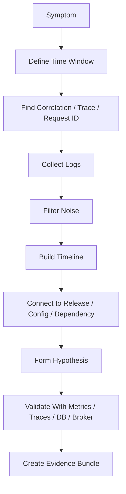
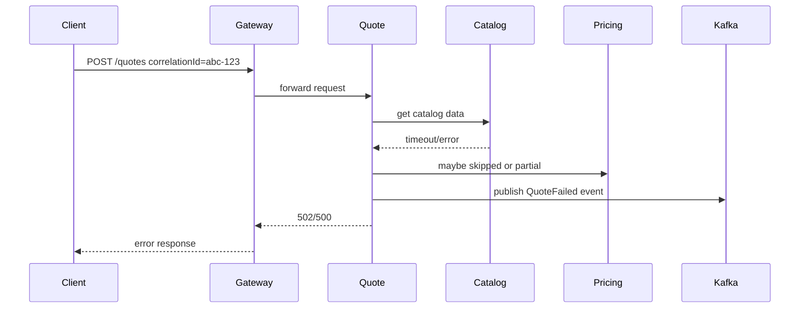

# Part 011 — Log Analysis and Evidence Capture

> Fokus part ini: menggunakan log sebagai evidence debugging yang aman, structured, reproducible, dan berguna untuk production support, RCA, PR fix, dan release decision.

Untuk senior backend engineer, log bukan sekadar teks panjang yang dicari dengan `grep`. Log adalah bukti operasional. Log membantu menjawab:

- apa yang terjadi;
- kapan terjadi;
- request/event/job mana yang terdampak;
- service mana yang melihat error lebih dulu;
- apakah failure berasal dari API boundary, business logic, dependency, database, broker, cache, container, atau infrastructure;
- apakah masalah terkait release/config/deployment tertentu;
- apakah evidence cukup aman untuk dibagikan di ticket, PR, incident channel, atau RCA.

Log analysis yang buruk mencari string error secara acak. Log analysis yang baik membangun timeline, mengikat evidence ke correlation ID, memisahkan signal dari noise, dan menjaga redaction.

---

## 1. Log as Evidence, Not Absolute Truth

Log adalah observasi dari sistem, bukan kebenaran sempurna.

Log bisa:

- tidak lengkap karena sampling;
- terlambat karena buffering;
- hilang karena container restart;
- salah timezone;
- tidak punya correlation ID;
- terlalu verbose;
- terlalu sedikit;
- mengandung pesan error misleading;
- mengandung data sensitif;
- berasal dari versi aplikasi yang berbeda dari yang diasumsikan.

Mental model yang benar:



Senior engineer tidak berhenti di “ada stack trace”. Ia bertanya: stack trace ini terjadi untuk request mana, versi mana, tenant/customer mana, deployment mana, dependency mana, dan apakah berulang.

---

## 2. Common Log Types in Backend Systems

### Application log

Log yang ditulis oleh aplikasi Java/JAX-RS:

- request handling;
- validation error;
- domain decision;
- dependency call;
- retry;
- exception;
- startup/shutdown;
- background job;
- event consumer;
- database operation summary;
- cache miss/hit jika di-log;
- audit-related event jika disediakan.

Contoh concern:

```text
2026-07-11T10:15:12.442+07:00 INFO  quote-service correlationId=abc-123 quoteId=Q-991 submitted quote for validation
2026-07-11T10:15:12.891+07:00 ERROR quote-service correlationId=abc-123 failed to calculate price reason=CATALOG_TIMEOUT
```

### Access log

Biasanya dari API gateway, ingress, reverse proxy, load balancer, atau service framework:

- method;
- path;
- status;
- latency;
- client IP;
- user agent;
- upstream service;
- request size;
- response size;
- trace/correlation ID jika propagated.

Access log berguna untuk membedakan:

- request tidak pernah sampai aplikasi;
- request sampai gateway tapi gagal di upstream;
- request sukses tapi lambat;
- error hanya pada method/path tertentu;
- traffic spike;
- client retry storm.

### Error log

Bisa berasal dari application logger, NGINX/ingress, runtime, JVM, container runtime, atau platform.

Jangan langsung percaya root cause dari error log. Error log sering menunjukkan tempat failure terlihat, bukan tempat failure berasal.

### Container log

Dalam container, stdout/stderr aplikasi biasanya menjadi sumber log utama:

```bash
docker logs <container>
docker logs --tail 200 <container>
docker logs -f <container>
```

Di Kubernetes:

```bash
kubectl logs deploy/quote-service -n <namespace>
kubectl logs pod/<pod-name> -n <namespace>
kubectl logs pod/<pod-name> -n <namespace> --previous
kubectl logs pod/<pod-name> -n <namespace> -c <container-name>
```

`--previous` penting saat container restart. Tanpa itu, evidence sebelum crash bisa hilang dari tampilan biasa.

### Kubernetes events

Events bukan log aplikasi, tetapi sering menjelaskan scheduling, image pull, restart, probe failure, OOMKill, atau mount issue:

```bash
kubectl get events -n <namespace> --sort-by=.lastTimestamp
kubectl describe pod <pod-name> -n <namespace>
```

Events menjawab pertanyaan seperti:

- apakah pod sering restart;
- apakah image gagal di-pull;
- apakah readiness/liveness probe gagal;
- apakah container terkena OOMKill;
- apakah volume/config/secret gagal di-mount.

---

## 3. Timestamp and Timezone Discipline

Log debugging sering gagal karena timestamp tidak distandarkan.

Masalah umum:

- local time berbeda dari UTC;
- aplikasi log dalam timezone Asia/Jakarta, platform log dalam UTC;
- database timestamp dalam UTC;
- browser/client timestamp dalam timezone user;
- CI log memakai timezone runner;
- log aggregator menampilkan timezone berdasarkan user preference;
- daylight saving time untuk region tertentu;
- format timestamp tidak punya offset.

Gunakan timestamp dengan offset:

```text
2026-07-11T10:15:12.442+07:00
2026-07-11T03:15:12.442Z
```

Saat membuat evidence, tulis:

```md
Incident window:
- Local timezone: Asia/Jakarta
- Start: 2026-07-11 10:10:00 +07:00
- End:   2026-07-11 10:25:00 +07:00
- UTC:   2026-07-11 03:10:00Z to 03:25:00Z
```

Command bantuan:

```bash
date
 date -u
TZ=Asia/Jakarta date
TZ=UTC date
```

Untuk log analysis, selalu mulai dari window yang eksplisit:

```bash
# Example for local file logs with ISO timestamp prefix
grep '2026-07-11T10:1' app.log
```

Untuk log aggregator, pastikan UI timezone benar sebelum menyimpulkan urutan event.

---

## 4. Correlation ID and Trace ID

Correlation ID adalah tali yang mengikat request lintas service.

Trace ID biasanya berasal dari distributed tracing system. Correlation ID bisa berasal dari gateway, client, atau aplikasi.

Idealnya setiap log penting punya:

- correlation ID;
- trace ID;
- span ID jika tracing digunakan;
- request ID;
- user/actor ID yang aman;
- tenant/customer/account ID jika relevan dan aman;
- service name;
- version/build info;
- environment;
- operation name.

Contoh structured log:

```json
{
  "timestamp": "2026-07-11T03:15:12.442Z",
  "level": "ERROR",
  "service": "quote-service",
  "version": "1.42.3",
  "environment": "staging",
  "correlationId": "abc-123",
  "traceId": "4c5e9b...",
  "operation": "SubmitQuote",
  "quoteId": "Q-991",
  "errorCode": "CATALOG_TIMEOUT",
  "message": "failed to calculate price"
}
```

Filter by correlation ID:

```bash
grep 'abc-123' app.log
```

Filter JSON log with `jq`:

```bash
jq 'select(.correlationId == "abc-123")' app.jsonl
```

Extract timeline:

```bash
jq -r 'select(.correlationId == "abc-123") | [.timestamp, .level, .service, .operation, .message] | @tsv' app.jsonl
```

Senior-level expectation: kalau sebuah service tidak mempropagate correlation ID ke dependency call, debugging multi-service akan menjadi mahal.

---

## 5. Structured vs Unstructured Logs

### Unstructured log

```text
ERROR failed to submit quote Q-991 due to timeout
```

Kelebihan:

- mudah dibaca manusia;
- sederhana;
- cepat ditulis.

Kekurangan:

- sulit difilter presisi;
- parsing rapuh;
- field bisa berubah karena wording;
- rawan kehilangan metadata.

### Structured log

```json
{"level":"ERROR","operation":"SubmitQuote","quoteId":"Q-991","errorCode":"TIMEOUT"}
```

Kelebihan:

- mudah diproses `jq`;
- lebih cocok untuk log aggregator;
- field-based query;
- lebih baik untuk alerting dan dashboard.

Kekurangan:

- butuh disiplin field;
- bisa terlalu verbose;
- masih perlu redaction;
- field cardinality bisa mahal di observability platform.

Rule praktis:

- gunakan structured fields untuk metadata penting;
- gunakan message untuk human-readable summary;
- jangan menyimpan object besar mentah di log;
- jangan log full request/response body di production kecuali ada policy dan redaction yang jelas.

---

## 6. Log Level Discipline

Log level harus punya arti operasional.

| Level | Makna Praktis | Contoh |
|---|---|---|
| TRACE | detail sangat granular untuk local/debug khusus | serialization details, branch internal |
| DEBUG | detail diagnosis non-production atau temporary | computed rule path |
| INFO | lifecycle/event penting yang normal | service started, quote submitted |
| WARN | kondisi abnormal tapi masih recoverable | retry, fallback, slow dependency |
| ERROR | operation gagal atau butuh investigasi | exception, failed command, unrecoverable dependency failure |

Anti-pattern:

- semua exception di-log sebagai ERROR walaupun expected validation failure;
- retry normal di-log ERROR sehingga alert noisy;
- log level DEBUG aktif di production tanpa kontrol;
- sensitive payload di-log karena “butuh debugging”;
- stack trace diulang di setiap layer sehingga noise tinggi.

Untuk Java/JAX-RS:

- validation error 400 biasanya bukan ERROR internal;
- 401/403 bisa menjadi security event tergantung konteks;
- 404 bisa normal atau anomali tergantung endpoint;
- 5xx harus punya correlation ID dan root exception/context yang cukup;
- dependency timeout perlu log latency, target dependency, retry count, dan final outcome.

---

## 7. Grep-Based Log Slicing

Basic search:

```bash
grep 'ERROR' app.log
```

Case-insensitive:

```bash
grep -i 'timeout' app.log
```

Show line numbers:

```bash
grep -n 'abc-123' app.log
```

Show context:

```bash
grep -n -C 5 'abc-123' app.log
```

Search multiple files:

```bash
grep -R 'CATALOG_TIMEOUT' ./logs
```

Exclude noisy files:

```bash
grep -R 'ERROR' ./logs --exclude='*.gz'
```

Count occurrences:

```bash
grep -c 'CATALOG_TIMEOUT' app.log
```

Get unique error codes:

```bash
grep 'ERROR' app.log | grep -o 'errorCode=[A-Z_]*' | sort | uniq -c | sort -nr
```

Use fixed string when pattern is not regex:

```bash
grep -F 'quoteId=Q-991' app.log
```

Failure mode: regex special characters can change result. If searching exact string, prefer `grep -F`.

---

## 8. Tail, Follow, and Live Observation

Follow logs:

```bash
tail -f app.log
```

Follow new file after rotation:

```bash
tail -F app.log
```

Last 200 lines:

```bash
tail -n 200 app.log
```

Kubernetes live logs:

```bash
kubectl logs deploy/quote-service -n <namespace> -f
```

Limit output:

```bash
kubectl logs deploy/quote-service -n <namespace> --tail=200
```

Since duration:

```bash
kubectl logs deploy/quote-service -n <namespace> --since=15m
```

Since timestamp:

```bash
kubectl logs deploy/quote-service -n <namespace> --since-time=2026-07-11T03:10:00Z
```

Important safety habit: ketika melihat log production, jangan copy/paste payload mentah ke public channel. Redact dulu.

---

## 9. JSON Log Analysis with `jq`

Pretty print:

```bash
jq . app.json
```

For JSON Lines:

```bash
cat app.jsonl | jq .
```

Filter by level:

```bash
jq 'select(.level == "ERROR")' app.jsonl
```

Filter by time requires care because string comparison only safe if ISO format consistent:

```bash
jq 'select(.timestamp >= "2026-07-11T03:10:00Z" and .timestamp <= "2026-07-11T03:25:00Z")' app.jsonl
```

Extract compact table:

```bash
jq -r '[.timestamp, .level, .correlationId, .operation, .errorCode, .message] | @tsv' app.jsonl
```

Group by error code:

```bash
jq -r 'select(.level == "ERROR") | .errorCode // "UNKNOWN"' app.jsonl \
  | sort \
  | uniq -c \
  | sort -nr
```

Extract only a specific operation:

```bash
jq 'select(.operation == "SubmitQuote")' app.jsonl
```

Handle missing fields:

```bash
jq -r '.correlationId // "NO_CORRELATION_ID"' app.jsonl
```

Rule: `jq` is excellent for structured logs, but field names must be stable. If every service uses different names for trace/correlation fields, cross-service debugging becomes painful.

---

## 10. Log Sampling and Noise Management

Sampling reduces volume but can hide rare failures.

Questions to ask:

- are ERROR logs sampled;
- are access logs sampled;
- are successful requests sampled but failures retained;
- are debug logs enabled dynamically;
- are logs dropped under high load;
- is there a rate limit in log pipeline;
- are large messages truncated;
- are multi-line stack traces preserved correctly.

Dangerous conclusion:

> “No log found, therefore it did not happen.”

Better conclusion:

> “No log found in source X for window Y using key Z. Need validate retention, sampling, ingestion delay, and whether service logged this path.”

---

## 11. Multi-Line Stack Trace Handling

Java stack traces span multiple lines. This complicates grep, JSON lines, and log aggregation.

Example:

```text
2026-07-11T03:15:12Z ERROR quote-service failed to submit quote
java.net.SocketTimeoutException: Read timed out
    at ...
    at ...
```

Issues:

- grep only shows first line unless context is added;
- log aggregator may split stack trace into multiple events;
- stack traces can duplicate across layers;
- sensitive data may appear in exception message.

Use context:

```bash
grep -n -A 40 'failed to submit quote' app.log
```

For evidence, capture:

- top exception type;
- root cause;
- service method/resource method;
- dependency/client involved;
- correlation ID;
- timestamp;
- version/build.

Do not paste full 300-line stack trace unless needed. Summarize and attach sanitized evidence if required.

---

## 12. Access Log Analysis

Access log helps answer whether a request reached the edge.

Typical fields:

```text
method path status duration upstreamStatus requestId userAgent clientIp bytes
```

Common investigations:

### Count status codes

```bash
awk '{print $9}' access.log | sort | uniq -c | sort -nr
```

Actual field depends on access log format. Verify before using.

### Find slow requests

If duration is field 10:

```bash
awk '$10 > 1000 {print}' access.log
```

### Filter endpoint

```bash
grep 'POST /quotes' access.log
```

### Find 5xx for endpoint

```bash
grep 'POST /quotes' access.log | awk '$9 ~ /^5/ {print}'
```

For API debugging, access log is especially useful when application log has no entry. That often means failure occurred before application handler: gateway, routing, auth, TLS, ingress, payload limit, or upstream selection.

---

## 13. Logs Across Microservices

In microservices, one user action may touch:

- API gateway;
- quote service;
- catalog service;
- pricing service;
- order service;
- PostgreSQL;
- Kafka/RabbitMQ;
- Redis;
- external integration;
- background consumer.

Cross-service timeline shape:



Evidence needs to show:

- first failing service;
- whether failure propagated correctly;
- whether retry happened;
- whether event was published;
- whether downstream side effect occurred;
- whether client saw correct status/error body.

Search by correlation ID across logs if available. If not, combine timestamp, request ID, entity ID, operation name, and deployment version.

---

## 14. Message Broker and Async Logs

Kafka/RabbitMQ processing introduces asynchronous delay.

Important log fields:

- topic/queue/exchange/routing key;
- partition;
- offset;
- consumer group;
- message ID;
- correlation ID;
- event type;
- retry count;
- dead-letter status;
- processing duration;
- ack/nack outcome.

Example useful log:

```json
{
  "level": "WARN",
  "service": "order-consumer",
  "operation": "ConsumeQuoteSubmitted",
  "topic": "quote-submitted",
  "partition": 3,
  "offset": 91822,
  "correlationId": "abc-123",
  "retryCount": 2,
  "message": "retrying event after transient catalog error"
}
```

Bad log:

```text
failed to process message
```

Why bad:

- no topic;
- no offset;
- no message ID;
- no correlation ID;
- no retry count;
- no failure classification.

Async debugging requires separating request timeline from event-processing timeline.

---

## 15. Evidence Bundle

Evidence bundle is a small, curated packet of facts.

Suggested structure:

```text
evidence/
  README.md
  timeline.md
  commands.sh
  api-request.redacted.txt
  api-response.redacted.txt
  logs.redacted.txt
  kubernetes-events.txt
  deployment-info.txt
  version-info.txt
```

`README.md`:

```md
# Evidence Bundle

Issue: <summary>
Environment: <env>
Window: <start/end with timezone>
Correlation ID: <id>
Service(s): <services>
Version(s): <version/tag/commit>
Prepared by: <name>
Redaction: <what was removed>

## Findings
1. <fact>
2. <fact>
3. <fact>

## Open Questions
- <question>
```

`commands.sh` should contain safe reproduction/collection commands:

```bash
#!/usr/bin/env bash
set -euo pipefail

# Read-only evidence collection commands used for this investigation.
kubectl logs deploy/quote-service -n <namespace> --since=30m > logs.redacted.txt
```

Do not include secrets, tokens, raw PII, or unrestricted production data.

---

## 16. Incident Timeline

Timeline should be factual, ordered, and timezone-explicit.

Template:

```md
# Incident Timeline

Timezone: UTC unless specified.

| Time | Source | Evidence | Interpretation |
|---|---|---|---|
| 03:10:02Z | Deployment | quote-service 1.42.3 deployed | New version active |
| 03:12:11Z | Access log | POST /quotes 500 requestId=abc | Client-visible failure |
| 03:12:12Z | App log | CATALOG_TIMEOUT correlationId=abc | Catalog dependency timeout |
| 03:12:14Z | Kafka log | QuoteFailed event published | Failure event emitted |
```

Separate evidence from interpretation:

- Evidence: “quote-service logged `CATALOG_TIMEOUT` at 03:12:12Z.”
- Interpretation: “Likely catalog dependency timeout caused quote submission failure.”

This distinction matters during RCA.

---

## 17. Redaction and Sensitive Data Handling

Logs can contain sensitive data:

- auth token;
- session cookie;
- API key;
- customer identifier;
- personal data;
- billing data;
- quote/order payload;
- address/email/phone;
- internal hostnames;
- certificate details;
- stack traces with secret in message;
- SQL query parameters.

Basic redaction with `sed`:

```bash
sed -E 's/(Authorization: Bearer )[A-Za-z0-9._-]+/\1<REDACTED>/g' request.txt
```

Redact common JSON fields with `jq`:

```bash
jq 'del(.authorization, .token, .password, .secret)' payload.json
```

Mask IDs partially:

```bash
sed -E 's/customerId=[A-Za-z0-9-]+/customerId=<REDACTED>/g' app.log
```

Rules:

- never paste tokens into chat/ticket;
- never attach raw production payload unless policy allows;
- prefer minimum necessary evidence;
- keep original raw evidence only in approved secure location if required;
- document what was redacted.

---

## 18. Log Analysis Workflow for Java/JAX-RS Issue

Example symptom:

> Client receives 500 when submitting quote.

Workflow:

1. Capture exact request metadata.
2. Identify timestamp window.
3. Find request/correlation ID from client/gateway/access log.
4. Search application log by correlation ID.
5. Identify JAX-RS resource operation.
6. Find first ERROR/WARN in request path.
7. Check downstream dependency log around same correlation ID.
8. Check whether database/broker/cache interaction happened.
9. Check deployment version.
10. Compare with previous successful request if possible.
11. Build minimal reproduction command.
12. Save sanitized evidence.

Useful commands:

```bash
# Find by correlation ID
grep -R -n 'abc-123' ./logs

# Extract errors around a time window
grep '2026-07-11T03:12' app.log | grep -E 'ERROR|WARN'

# Structured logs by operation
jq 'select(.operation == "SubmitQuote" and .level == "ERROR")' app.jsonl
```

Senior-level question:

> Is the log evidence enough to prove root cause, or only enough to form a hypothesis?

---

## 19. Docker and Kubernetes Log Concerns

### Container restarts

If a container restarted, current logs may miss crash evidence.

```bash
kubectl logs pod/<pod> -n <namespace> --previous
```

### Multiple replicas

Deployment logs may aggregate or choose pods depending on command/tooling. To inspect individual pods:

```bash
kubectl get pods -n <namespace> -l app=quote-service
kubectl logs pod/<pod-name> -n <namespace>
```

### Multiple containers in one pod

```bash
kubectl logs pod/<pod-name> -n <namespace> -c <container-name>
```

### Init containers

```bash
kubectl logs pod/<pod-name> -n <namespace> -c <init-container-name>
```

### Events around failure

```bash
kubectl describe pod <pod-name> -n <namespace>
kubectl get events -n <namespace> --sort-by=.lastTimestamp
```

Log analysis must include pod identity, namespace, container, and deployment version. Otherwise evidence can point to the wrong replica or old pod.

---

## 20. Cloud and Log Aggregator Concerns

In AWS/Azure or centralized observability platforms, check:

- log group/workspace name;
- environment;
- cluster;
- namespace;
- service;
- version;
- time range;
- timezone;
- ingestion delay;
- retention period;
- sampling;
- access permissions;
- query syntax;
- whether logs are from stdout/stderr, sidecar, agent, or application SDK.

Common failure modes:

- looking at wrong environment;
- looking at wrong region/subscription/account;
- query too narrow;
- query too broad and noisy;
- missing logs due to ingestion delay;
- assuming absence of logs means absence of execution;
- confusing old deployment logs with current version.

Internal tooling may wrap these platforms. Verify internal source of truth.

---

## 21. Failure Modes in Log Analysis

| Failure Mode | Symptom | Risk | Better Approach |
|---|---|---|---|
| Wrong time window | No relevant logs | False negative | Define exact window and timezone |
| Wrong environment | Logs do not match symptom | Misdiagnosis | Verify env/cluster/namespace |
| No correlation ID | Hard to trace | Slow investigation | Use entity ID + timestamp + operation |
| Over-filtering | Missing key events | Biased conclusion | Start broad, narrow gradually |
| Raw payload pasted | Data leak | Security incident | Redact before sharing |
| Stack trace obsession | Ignore lifecycle | Wrong root cause | Build timeline |
| No version info | Cannot link release | Weak RCA | Capture deployment/tag/commit |
| Log sampling ignored | Missing data | False confidence | Check sampling/retention |
| Multi-replica confusion | Wrong pod logs | Misleading evidence | Include pod/container identity |
| Interpretation mixed with facts | RCA dispute | Weak trust | Separate evidence and hypothesis |

---

## 22. Correctness Concerns

Log-based conclusion is correct only when:

- time window matches symptom;
- log source is correct;
- relevant service/replica/container is selected;
- correlation ID is reliable;
- message semantics are understood;
- sampling/retention limitations are known;
- interpretation is validated with another signal if needed.

Do not conclude root cause from one log line when distributed behavior is involved.

---

## 23. Productivity Concerns

Good log tooling improves productivity when:

- common queries are documented;
- logs have stable fields;
- correlation ID exists everywhere;
- service/version/env fields are consistent;
- scripts can collect evidence quickly;
- runbooks explain what to search first;
- log noise is controlled.

Bad log tooling wastes time when:

- every service uses different field names;
- logs are too verbose;
- important state changes are not logged;
- error messages lack context;
- developers need tribal knowledge to find logs;
- log queries are copy-pasted without understanding.

---

## 24. Security Concerns

Security review should ask:

- Are secrets ever logged?
- Are tokens/cookies/headers redacted?
- Are request/response bodies logged in production?
- Are customer identifiers treated correctly?
- Are logs accessible only to authorized people?
- Are log retention settings compliant?
- Are evidence bundles stored securely?
- Are incident snippets sanitized before sharing?

A debugging-friendly log that leaks secrets is not acceptable.

---

## 25. Reproducibility Concerns

Evidence should be reproducible:

- include exact command used;
- include exact time window;
- include exact source/service/pod;
- include environment;
- include version/tag/commit;
- include filters used;
- include redaction note;
- include limitation note.

Bad evidence:

```md
I saw timeout in logs.
```

Good evidence:

```md
In staging, quote-service v1.42.3 logged CATALOG_TIMEOUT for correlationId=abc-123 at 2026-07-11T03:12:12Z. Command used: kubectl logs deploy/quote-service -n staging --since-time=2026-07-11T03:10:00Z | grep abc-123. Raw token/header fields were not present in selected lines.
```

---

## 26. Release and Incident-Support Concerns

During release verification, logs answer:

- did new version start successfully;
- did migrations or startup checks pass;
- did error rate change;
- did warning patterns appear;
- are new error codes expected;
- are logs tagged with new version;
- are readiness/liveness probes stable;
- did downstream calls change behavior.

During incident, logs support:

- timeline;
- impact window;
- affected operation;
- first failing component;
- relation to deployment/config change;
- rollback validation;
- RCA evidence.

---

## 27. PR Review Checklist for Logging Changes

When reviewing PRs that add/change logs, ask:

- Is the log level appropriate?
- Does the log contain correlation ID/trace ID?
- Does it include operation name and safe business context?
- Does it avoid secrets and sensitive payload?
- Is the message actionable?
- Does it create noise in hot paths?
- Does it log both success and failure where lifecycle matters?
- Does it duplicate stack traces unnecessarily?
- Does it preserve structured fields?
- Does it help distinguish validation failure, dependency failure, and internal bug?
- Does it support incident timeline construction?
- Does it include version/env/service fields through logging framework?
- Does it avoid high-cardinality fields that may hurt observability cost?

---

## 28. Internal Verification Checklist

Verify inside CSG/team before assuming:

- Standard log format.
- Required fields for all service logs.
- Correlation ID and trace ID header names.
- Whether logs are JSON, text, or mixed.
- Log aggregation platform.
- Log retention period.
- Log sampling behavior.
- Redaction requirements.
- Sensitive-data policy.
- Access control to production logs.
- Standard incident evidence bundle format.
- Kubernetes namespace and service naming convention.
- Whether `kubectl logs` is allowed in production.
- Whether production debugging must go through approved observability tools.
- Existing runbooks and incident templates.
- Known logging gaps in quote/order services.

---

## 29. Practical Drills

### Drill 1 — Build a request timeline

Given a correlation ID, produce:

- gateway entry;
- service entry;
- dependency call;
- failure point;
- response status;
- total latency;
- version.

### Drill 2 — Redact evidence

Take a sample request/response log and remove:

- authorization header;
- cookie;
- customer data;
- payload fields not needed for debugging.

### Drill 3 — Compare successful vs failed request

For the same endpoint, compare one successful and one failed correlation ID. Identify the first divergence.

### Drill 4 — Kubernetes restart evidence

Find logs before container restart using `--previous` and combine with pod events.

### Drill 5 — Error frequency summary

From JSON logs, produce top error codes by count for a 30-minute window.

---

## 30. Part Summary

Log analysis is not about reading as many lines as possible. It is about extracting reliable evidence with minimal noise and minimal risk.

Senior backend engineers should be able to:

- define exact time windows;
- use correlation ID and trace ID;
- query structured and unstructured logs;
- inspect application, access, container, Kubernetes, and cloud logs;
- build incident timelines;
- produce sanitized evidence bundles;
- separate evidence from interpretation;
- review logging changes for correctness, productivity, security, and incident usefulness.

The next part moves from logs to Linux performance basics: CPU, memory, disk, network, load average, file descriptors, JVM/container limits, and first-response performance diagnosis.
