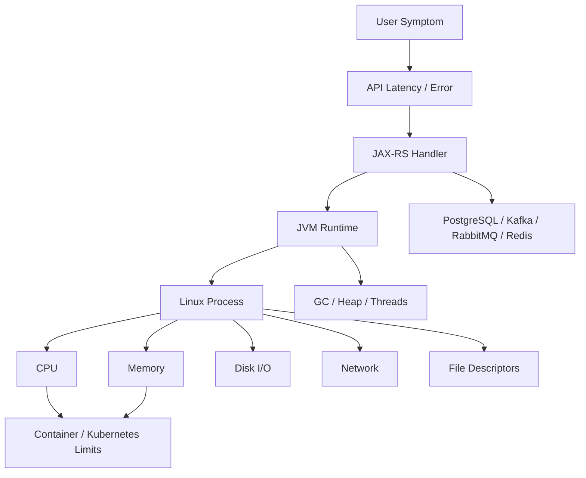

# Part 012 — Linux Performance Basics

> Fokus part ini: memahami performance Linux dari sudut pandang backend Java/JAX-RS engineer, terutama saat melakukan triage CPU, memory, disk, network, load average, file descriptor, JVM, container, dan Kubernetes resource issue.

Performance debugging tidak dimulai dari “optimasi kode”. Untuk production system, langkah pertama adalah menentukan lapisan mana yang sedang menjadi bottleneck:

- CPU;
- memory;
- disk I/O;
- network;
- file descriptor;
- JVM heap/native memory;
- GC;
- container CPU/memory limit;
- dependency latency;
- database/broker/cache;
- kernel/container runtime/Kubernetes scheduling.

Senior engineer harus bisa melakukan triage cepat, read-only first, evidence-backed, dan tidak langsung membuat perubahan berisiko.

---

## 1. Performance Mental Model

Performance issue biasanya terlihat sebagai symptom di aplikasi, tetapi penyebabnya bisa di layer berbeda.



Triage question pertama:

> Apakah service lambat karena aplikasi melakukan pekerjaan mahal, atau karena runtime environment tidak punya resource cukup, atau karena dependency lambat?

Jangan menebak. Ambil evidence.

---

## 2. Read-Only First Rule

Untuk production diagnosis, mulai dengan command read-only:

```bash
uptime
top
ps aux
free -m
df -h
du -sh <path>
ss -tulpen
lsof -p <pid>
```

Di Kubernetes:

```bash
kubectl top pods -n <namespace>
kubectl describe pod <pod> -n <namespace>
kubectl logs pod/<pod> -n <namespace> --tail=200
kubectl get events -n <namespace> --sort-by=.lastTimestamp
```

Hindari aksi mutating sebelum evidence cukup:

- restart service;
- scale deployment;
- kill process;
- delete pod;
- clear cache;
- truncate log;
- remove file;
- change config;
- increase resource limit tanpa memahami cause.

Restart dapat menghapus evidence dan menutupi root cause.

---

## 3. Symptom-to-Layer Mapping

| Symptom | Possible Layer | First Evidence |
|---|---|---|
| API latency naik | CPU, GC, DB, network, downstream | latency metrics, logs, `top`, tracing |
| 5xx spike | app exception, dependency, resource exhaustion | logs, access logs, events |
| Pod restart | OOMKill, crash, probe failure | `kubectl describe pod`, previous logs |
| Build/CI lambat | CPU, disk, network, dependency download, tests | CI timing, Maven logs |
| Connection refused | process down, port closed, wrong service | `ss`, logs, readiness |
| Timeout | network, dependency saturation, thread pool | logs, traces, `ss`, dependency metrics |
| OOMKilled | container memory limit exceeded | pod status, events, memory metrics |
| High load average | CPU runnable or I/O wait | `uptime`, `top`, `vmstat`, `iostat` |
| Too many open files | FD leak or low limit | `lsof`, `/proc`, logs |
| Disk full | logs/temp/artifacts | `df`, `du` |

A good triage narrows the layer before proposing a fix.

---

## 4. CPU Basics

CPU issue can mean:

- application code is CPU-heavy;
- too many concurrent requests;
- inefficient serialization/deserialization;
- regex or JSON processing too expensive;
- compression/encryption cost;
- logging too much;
- busy loop;
- GC consuming CPU;
- thread contention;
- CPU throttling in container.

View CPU with `top`:

```bash
top
```

Sort by CPU in `ps`:

```bash
ps -eo pid,ppid,user,%cpu,%mem,stat,cmd --sort=-%cpu | head
```

Find Java process:

```bash
ps -ef | grep '[j]ava'
```

Thread-level CPU can require JVM tooling:

```bash
jcmd <pid> Thread.print
# or, if available
jstack <pid>
```

For container/Kubernetes, high CPU inside the process may not show the full story. CPU throttling can make the service slow even when host CPU looks fine.

Check Kubernetes resource limits:

```bash
kubectl describe pod <pod> -n <namespace>
kubectl top pod <pod> -n <namespace>
```

Questions:

- Is CPU usage high continuously or in bursts?
- Is latency correlated with CPU?
- Is GC using CPU?
- Is CPU throttling present?
- Is traffic higher than usual?
- Did a recent release introduce CPU-heavy logic?

---

## 5. Load Average

`uptime` shows load average:

```bash
uptime
```

Example:

```text
10:31:22 up 12 days,  3:44,  2 users,  load average: 4.21, 3.88, 2.10
```

Load average roughly represents runnable or uninterruptible tasks over 1, 5, and 15 minutes.

Interpretation depends on CPU core count.

```bash
nproc
```

If machine has 4 cores:

- load 1: probably fine;
- load 4: fully utilized;
- load 8: contention or I/O wait likely;
- rising 1-min > 5-min > 15-min: recent worsening;
- falling 1-min < 5-min < 15-min: recovering.

But load average does not tell root cause. Use with `top`, `vmstat`, and I/O metrics.

---

## 6. `top` and `htop` Reading Discipline

`top` provides:

- CPU usage;
- memory usage;
- load average;
- process list;
- process states;
- zombie count;
- CPU steal/wait indicators depending environment.

Important fields:

- `%CPU`: process CPU usage;
- `%MEM`: memory usage;
- `RES`: resident memory;
- `VIRT`: virtual memory;
- `S`: process state;
- `TIME+`: accumulated CPU time.

Process state examples:

| State | Meaning |
|---|---|
| R | running/runnable |
| S | sleeping |
| D | uninterruptible sleep, often I/O |
| Z | zombie |
| T | stopped/traced |

If many processes are in `D` state, suspect I/O wait or storage issue.

`htop` is friendlier but may not be installed in minimal containers.

---

## 7. Memory Basics

Memory issue can mean:

- JVM heap too small;
- JVM heap leak;
- native memory leak;
- direct buffer growth;
- metaspace growth;
- too many threads;
- large request/response payload;
- cache too large;
- container memory limit too low;
- OS page cache pressure;
- memory fragmentation;
- off-heap usage not accounted by heap-only dashboards.

Check memory:

```bash
free -m
```

Example fields:

- total;
- used;
- free;
- shared;
- buff/cache;
- available.

Use `available`, not just `free`, for practical memory headroom.

Process memory:

```bash
ps -eo pid,user,%mem,rss,vsz,cmd --sort=-rss | head
```

RSS is resident set size. For Java, RSS includes heap, metaspace, thread stacks, direct buffers, JIT code cache, native libraries, and other native allocations.

JVM heap-only metrics do not equal container memory usage.

---

## 8. JVM Memory vs Container Memory

A Java process memory footprint can include:

```text
Container memory
├── Java heap
├── Metaspace
├── Code cache
├── Thread stacks
├── Direct buffers
├── GC structures
├── Native libraries
├── JVM internal memory
└── OS/runtime overhead
```

If Kubernetes memory limit is 1Gi and heap is set to 1Gi, the process can still be OOMKilled because non-heap memory needs space.

Check pod events:

```bash
kubectl describe pod <pod> -n <namespace>
```

Look for:

```text
Reason: OOMKilled
Exit Code: 137
```

JVM options to inspect:

```bash
ps -ef | grep '[j]ava'
```

If available:

```bash
jcmd <pid> VM.flags
jcmd <pid> VM.system_properties
jcmd <pid> GC.heap_info
```

Questions:

- What is container memory limit?
- What is max heap?
- Are direct buffers used heavily?
- Are there many threads?
- Is the service using large caches?
- Did request payload size increase?
- Did a release introduce large object retention?

---

## 9. Disk Space and Disk I/O

Disk issues can cause:

- slow builds;
- slow application startup;
- log write failures;
- database local storage issue;
- temp file failure;
- container image pull failure;
- Maven dependency cache issues;
- CI runner instability.

Check filesystem usage:

```bash
df -h
```

Find large directories:

```bash
du -sh * 2>/dev/null | sort -h
```

Find large files:

```bash
find . -type f -size +100M -print
```

Disk I/O overview:

```bash
vmstat 1
```

If available:

```bash
iostat -xz 1
```

Important indicators:

- high `%util`;
- high await;
- high iowait;
- many processes in `D` state;
- slow writes to log/temp/artifact directories.

In containers, apparent disk may be ephemeral and limited. In Kubernetes, volume mount behavior matters.

Check mounts:

```bash
mount | head
```

In pod:

```bash
kubectl describe pod <pod> -n <namespace>
```

Look for volumes, mounts, ephemeral storage limits, and events.

---

## 10. Network Performance Basics

Network issue can appear as:

- connection timeout;
- read timeout;
- TLS handshake delay;
- DNS slow/failure;
- connection refused;
- connection reset;
- high dependency latency;
- broker connection churn;
- database connection pool exhaustion;
- Redis latency;
- ingress/gateway timeout.

Check listening ports:

```bash
ss -tulpen
```

Check established connections:

```bash
ss -tan
```

Count connections by state:

```bash
ss -tan | awk 'NR>1 {print $1}' | sort | uniq -c | sort -nr
```

Find process using port:

```bash
lsof -i :8080
```

DNS check:

```bash
dig service-name.namespace.svc.cluster.local
nslookup service-name.namespace.svc.cluster.local
```

HTTP latency with curl:

```bash
curl -o /dev/null -sS -w 'dns=%{time_namelookup} connect=%{time_connect} tls=%{time_appconnect} starttransfer=%{time_starttransfer} total=%{time_total}\n' https://example.internal/health
```

This separates DNS/connect/TLS/server-response time.

---

## 11. File Descriptor Basics

File descriptors are used for:

- files;
- sockets;
- pipes;
- logs;
- temporary files;
- database connections;
- broker connections;
- HTTP client connections.

Symptoms of FD exhaustion:

```text
Too many open files
java.io.FileNotFoundException: ... (Too many open files)
java.net.SocketException: Too many open files
```

Check process limits:

```bash
ulimit -n
```

For a process:

```bash
cat /proc/<pid>/limits | grep 'Max open files'
```

Count open descriptors:

```bash
ls /proc/<pid>/fd | wc -l
```

Inspect descriptors:

```bash
lsof -p <pid> | head
lsof -p <pid> | wc -l
```

Find many sockets:

```bash
lsof -p <pid> | grep TCP | wc -l
```

Potential causes:

- HTTP client connection leak;
- database connection leak;
- log file leak;
- temp file leak;
- too many concurrent sockets;
- too low container/OS limit.

Fixing FD issue by only raising limit may hide leak. First determine whether usage is expected.

---

## 12. `vmstat` for Quick System View

Run:

```bash
vmstat 1
```

Important columns:

- `r`: runnable processes;
- `b`: blocked processes;
- `swpd`: swap used;
- `free`: free memory;
- `si/so`: swap in/out;
- `bi/bo`: block in/out;
- `us`: user CPU;
- `sy`: system CPU;
- `id`: idle CPU;
- `wa`: I/O wait;
- `st`: steal time in virtualized environment.

Interpretation examples:

- high `r`, low idle: CPU saturation;
- high `wa`: disk/storage wait;
- high `si/so`: swapping pressure;
- high `st`: noisy neighbor/virtualization contention;
- high `b`: blocked processes, often I/O.

`vmstat` is a quick orientation tool, not a full root-cause tool.

---

## 13. Java CPU Issue Workflow

Symptom:

- latency high;
- CPU high;
- pod CPU usage near limit;
- request throughput lower than expected.

Workflow:

1. Confirm CPU usage at pod/process level.
2. Check whether CPU throttling exists.
3. Identify Java process PID.
4. Capture thread dump if allowed.
5. Map hot threads if tooling available.
6. Check GC logs/metrics.
7. Correlate with endpoint/event/job.
8. Compare with recent release/config/traffic change.

Basic commands:

```bash
ps -ef | grep '[j]ava'
top -H -p <pid>
jcmd <pid> Thread.print > thread-dump.txt
```

`top -H -p <pid>` shows OS threads. Java thread IDs in dumps may need conversion between decimal and hex depending tooling.

High CPU causes in backend service:

- expensive loop;
- N+1 processing;
- large JSON serialization;
- excessive logging;
- regex/backtracking;
- compression/encryption;
- thread spin;
- GC pressure;
- retry storm;
- message consumer backlog catch-up.

---

## 14. Java Memory Issue Workflow

Symptom:

- OOMKilled;
- `OutOfMemoryError`;
- GC overhead limit;
- increasing latency;
- pod restarts;
- memory usage steadily climbs.

Workflow:

1. Check Kubernetes pod reason/events.
2. Check JVM logs for OOM or GC pressure.
3. Compare heap setting vs container limit.
4. Inspect thread count and direct buffer usage if possible.
5. Check recent traffic/payload/release change.
6. Capture heap dump only if policy allows and storage/security are safe.
7. Avoid dumping production heap casually because it may contain sensitive data.

Commands:

```bash
kubectl describe pod <pod> -n <namespace>
kubectl logs pod/<pod> -n <namespace> --previous
ps -ef | grep '[j]ava'
jcmd <pid> GC.heap_info
```

Heap dump caution:

```bash
jcmd <pid> GC.heap_dump /secure/path/heap.hprof
```

Only run with approval. Heap dumps can be huge and sensitive.

---

## 15. Database, Broker, and Cache Performance Signals

Linux-level evidence can indicate dependency issues but rarely fully explains them.

PostgreSQL-related symptoms:

- many established DB connections;
- request waits;
- connection pool exhaustion;
- high query latency;
- thread dump shows JDBC waits.

Kafka/RabbitMQ-related symptoms:

- consumer lag;
- publish timeout;
- connection churn;
- blocked consumer threads;
- retry storm;
- dead-letter growth.

Redis-related symptoms:

- connection timeout;
- high latency;
- cache stampede;
- many open connections;
- slow serialization.

CLI clues:

```bash
ss -tan | grep ':5432'
ss -tan | grep ':9092'
ss -tan | grep ':5672'
ss -tan | grep ':6379'
```

But final diagnosis needs application metrics, dependency metrics, traces, and logs.

---

## 16. Kubernetes Resource Limits and Performance

Kubernetes adds resource controls:

- CPU request;
- CPU limit;
- memory request;
- memory limit;
- ephemeral storage;
- QoS class;
- liveness/readiness probes;
- HPA behavior;
- node pressure;
- eviction.

Check pod:

```bash
kubectl describe pod <pod> -n <namespace>
```

Check current usage:

```bash
kubectl top pod <pod> -n <namespace>
kubectl top pods -n <namespace>
```

Failure modes:

- CPU throttling causes latency but no restart;
- memory limit causes OOMKill and restart;
- readiness probe fails under load and removes pod from service;
- liveness probe too aggressive causes restart loop;
- request too low causes poor scheduling;
- limit too low causes artificial bottleneck;
- no limit can cause noisy neighbor impact.

Senior-level review question:

> Are resource requests/limits based on measured workload, or copied from another service?

---

## 17. Performance and CI Runners

Linux performance also matters in CI.

Build/test slowness can come from:

- cold Maven cache;
- dependency download latency;
- slow disk;
- CPU-constrained runner;
- integration tests waiting on containers;
- Docker image build context too large;
- no test selection;
- test parallelism too high or too low;
- network access to artifact repository;
- snapshot dependency resolution.

Evidence:

- CI step duration;
- Maven `-X` only when needed;
- test reports;
- dependency download logs;
- Docker build timing;
- cache hit/miss logs.

Do not optimize CI blindly. Measure stage-level and step-level timing first.

---

## 18. Common Performance Anti-Patterns

### Anti-pattern 1 — Restart first

Restart may restore service but destroys evidence.

Better:

1. Capture logs/events/metrics.
2. Identify safe mitigation.
3. Restart/rollback/scale if needed.
4. Preserve evidence for RCA.

### Anti-pattern 2 — Increase limits without cause

Raising memory/CPU can be correct, but it can also hide leak or inefficient code.

Better:

- compare usage to baseline;
- identify growth pattern;
- check release changes;
- validate with profiling/metrics.

### Anti-pattern 3 — Blame database immediately

Backend latency often touches DB, but DB may be victim of app retry storm, bad pool config, or request amplification.

Better:

- inspect application threads;
- check connection pool;
- check query latency;
- check retry behavior;
- check traffic change.

### Anti-pattern 4 — Use average latency only

Average hides tail latency.

Better:

- inspect p95/p99;
- split by endpoint/operation;
- compare dependency latency;
- check outliers.

---

## 19. Performance Evidence Template

```md
# Performance Triage Evidence

Environment: <env>
Service: <service>
Version: <version/tag/commit>
Window: <start/end timezone>
Symptom: <latency/error/restart/etc>
Impact: <known impact>

## System Evidence
- CPU: <usage/throttling/load>
- Memory: <RSS/heap/container limit/OOM>
- Disk: <df/du/iowait>
- Network: <timeouts/connections/DNS/TLS>
- FD: <open files/limit>

## Application Evidence
- Endpoint/operation:
- Correlation IDs:
- Error patterns:
- GC/thread evidence:
- Dependency evidence:

## Recent Changes
- Deployment:
- Config:
- Traffic:
- Dependency:

## Hypothesis
<evidence-backed hypothesis>

## Next Safe Step
<read-only validation or approved mitigation>
```

This template prevents vague statements like “service is slow” and forces layer-based diagnosis.

---

## 20. Correctness Concerns

Performance diagnosis is correct only when:

- metrics/logs correspond to the right time window;
- pod/process identity is correct;
- container limits are considered;
- JVM heap is not confused with total memory;
- host-level metrics are not mistaken for pod-level metrics;
- averages are not used alone;
- symptom and cause are separated;
- dependency latency is validated;
- recent change correlation is not treated as proof without evidence.

---

## 21. Productivity Concerns

Good performance tooling improves productivity when:

- common commands are documented;
- dashboards show CPU/memory/disk/network per service;
- Kubernetes resource limits are visible;
- JVM metrics are available;
- thread/heap dump procedures are documented;
- runbooks define safe evidence collection;
- CI timing is visible;
- baseline performance is known.

Bad tooling causes:

- random restarts;
- repeated “works on my machine” debates;
- slow CI without ownership;
- inability to distinguish app vs infra vs dependency;
- over-reliance on senior tribal knowledge.

---

## 22. Security Concerns

Performance debugging can create security risk:

- heap dumps may contain secrets/customer data;
- thread dumps may include URLs/tokens in thread names or stack data;
- command output may reveal hostnames/internal topology;
- logs may contain sensitive payload;
- profiling agents may require elevated permissions;
- copying evidence to personal machine may violate policy.

Rules:

- collect minimum necessary evidence;
- redact before sharing;
- store dumps only in approved secure locations;
- avoid running intrusive profilers in production without approval;
- document commands used.

---

## 23. Reproducibility Concerns

Performance findings need reproducible context:

- exact service version;
- exact resource request/limit;
- exact traffic/load window;
- exact command/query used;
- environment and namespace;
- pod/container identity;
- JVM flags;
- dependency versions if relevant;
- release/config change timeline.

Without this, performance “fixes” become folklore.

---

## 24. Release Concerns

Before and after release, compare:

- CPU usage per request;
- memory baseline;
- startup time;
- GC behavior;
- p95/p99 latency;
- dependency latency;
- error rate;
- pod restart count;
- readiness/liveness stability;
- connection pool usage;
- consumer lag if async.

Release regression can be subtle: no 5xx spike, but p99 latency doubles or CPU throttling increases.

---

## 25. Observability and Incident-Support Concerns

For incident support, performance evidence should answer:

- when did degradation start;
- which service/operation degraded first;
- was there a deployment/config/traffic change;
- did CPU/memory/disk/network change;
- did pod restart;
- did dependency latency change;
- did queue lag grow;
- did rollback restore baseline;
- is there evidence for permanent fix.

Logs alone are insufficient for performance incidents. Combine logs, metrics, traces, events, deployment history, and resource config.

---

## 26. PR Review Checklist for Performance-Sensitive Changes

Ask during review:

- Does this add CPU-heavy processing in request path?
- Does this increase object allocation significantly?
- Does this parse/serialize large payloads repeatedly?
- Does this add synchronous dependency calls?
- Does this introduce unbounded collection/cache?
- Does this increase logging volume in hot path?
- Does this create file/socket/resource leaks?
- Does this change thread pool/concurrency behavior?
- Does this change retry behavior?
- Does this affect startup time?
- Does this require resource limit adjustment?
- Are performance metrics/logs added where needed?
- Is rollback safe if performance regresses?

---

## 27. Internal Verification Checklist

Verify inside CSG/team before assuming:

- Standard dashboards for service CPU/memory/latency/error.
- JVM metrics availability.
- GC log policy.
- Thread dump procedure.
- Heap dump approval and storage procedure.
- Kubernetes resource request/limit standards.
- HPA policy if used.
- Pod restart/OOMKill alerting.
- CI runner performance constraints.
- Known performance bottlenecks in quote/order flow.
- Dependency dashboards for PostgreSQL, Kafka, RabbitMQ, Redis.
- Incident runbooks for high CPU, high memory, latency spike, OOMKill, and FD exhaustion.
- Whether engineers can run `kubectl top`, `describe`, `logs`, `exec`, or debug tools in each environment.

---

## 28. Practical Drills

### Drill 1 — CPU triage

Given high latency and high CPU:

- find the pod/process;
- capture CPU evidence;
- identify whether throttling exists;
- capture thread dump if allowed;
- correlate with endpoint or job.

### Drill 2 — Memory triage

Given pod restart:

- determine whether OOMKilled;
- check previous logs;
- compare heap setting with container limit;
- identify recent release/config/traffic change.

### Drill 3 — Disk pressure

Given failed build or application write error:

- check `df -h`;
- identify large directories with `du`;
- check temp/log/artifact paths;
- avoid deleting files before understanding ownership.

### Drill 4 — FD exhaustion

Given `Too many open files`:

- find PID;
- count open descriptors;
- inspect descriptor types;
- compare with limit;
- classify leak vs legitimate load.

### Drill 5 — Network latency

Given timeout to downstream service:

- use `curl -w` timing;
- check DNS/connect/TLS/server response split;
- inspect socket states;
- correlate with dependency metrics/logs.

---

## 29. Minimal Command Reference

```bash
# System orientation
uptime
nproc
top
vmstat 1

# Process
ps -eo pid,ppid,user,%cpu,%mem,rss,vsz,stat,cmd --sort=-%cpu | head
ps -ef | grep '[j]ava'

# Memory
free -m
ps -eo pid,user,%mem,rss,vsz,cmd --sort=-rss | head

# Disk
df -h
du -sh * 2>/dev/null | sort -h
find . -type f -size +100M -print

# Network
ss -tulpen
ss -tan | awk 'NR>1 {print $1}' | sort | uniq -c | sort -nr
lsof -i :8080

# File descriptors
ulimit -n
cat /proc/<pid>/limits | grep 'Max open files'
ls /proc/<pid>/fd | wc -l
lsof -p <pid> | wc -l

# Kubernetes
kubectl top pods -n <namespace>
kubectl describe pod <pod> -n <namespace>
kubectl logs pod/<pod> -n <namespace> --previous
kubectl get events -n <namespace> --sort-by=.lastTimestamp
```

---

## 30. Part Summary

Linux performance basics give senior backend engineers a practical way to locate bottlenecks before changing code or infrastructure.

You should now be able to:

- map symptoms to CPU, memory, disk, network, FD, JVM, container, or dependency layer;
- use read-only Linux commands for first-response triage;
- interpret load average, process CPU, memory, disk usage, socket state, and file descriptor usage;
- reason about JVM heap vs container memory;
- detect OOMKill, CPU throttling, disk pressure, and FD exhaustion;
- produce performance evidence that supports incident response, release validation, and PR review;
- avoid unsafe debugging habits that destroy evidence or create security risk.

The next part starts the Git block: Git as distributed version control, commit graph, working tree, staging area, object database, branches, tags, remotes, HEAD, and senior-level source control mental model.
