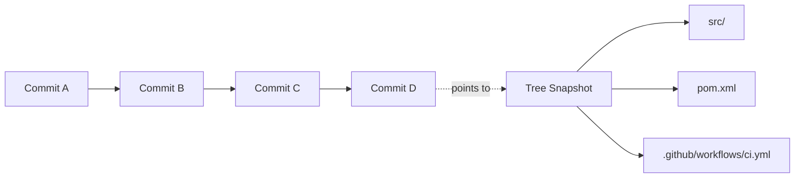
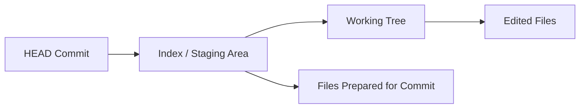
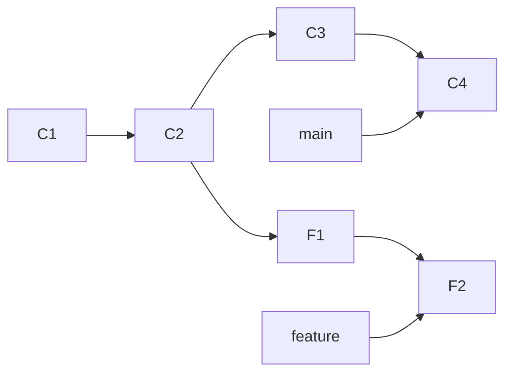
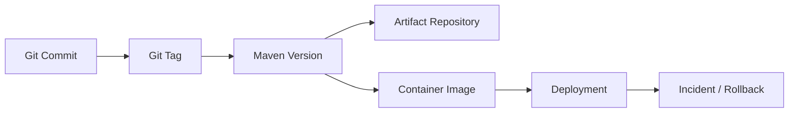
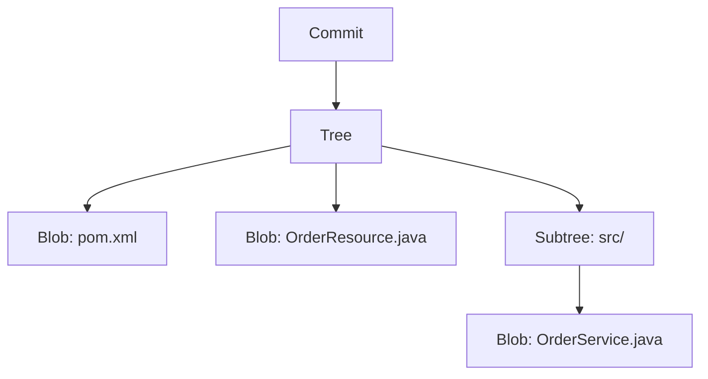
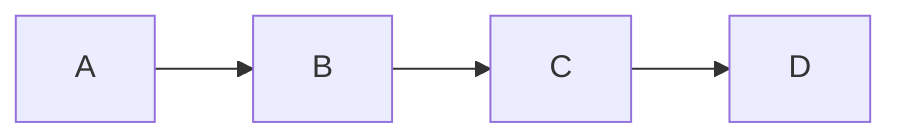
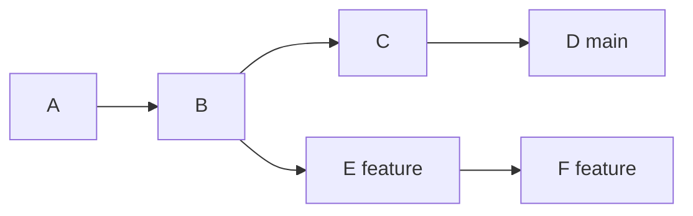
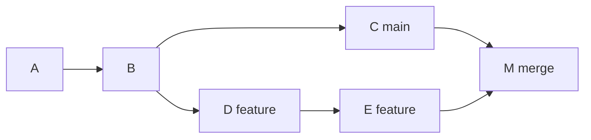
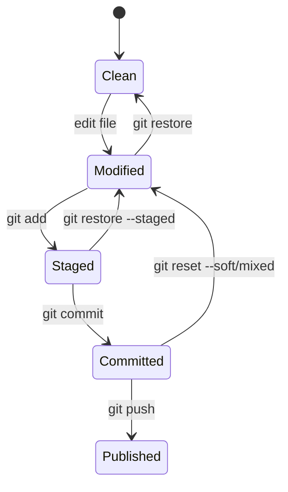
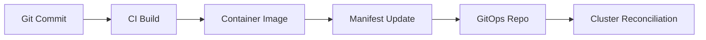

# Part 013 — Git Foundation

> Fokus part ini: memahami Git sebagai sistem data dan collaboration backbone, bukan sekadar kumpulan command. Untuk backend Java/JAX-RS enterprise system, Git adalah sumber traceability dari perubahan domain, API, database migration, Maven dependency, CI/CD workflow, Docker image, Kubernetes manifest, dan release artifact.

Git sering dipakai secara mekanis: `clone`, `pull`, `commit`, `push`. Itu cukup untuk kontribusi kecil, tetapi tidak cukup untuk senior engineer.

Senior engineer harus memahami Git sebagai:

- distributed version control system;
- object database;
- commit graph;
- snapshot history;
- collaboration protocol;
- recovery mechanism;
- forensic tool;
- release traceability anchor.

Saat terjadi regression production, pertanyaan yang muncul biasanya bukan “command Git apa yang dipakai?”, tetapi:

- commit mana yang mengubah behavior?
- PR mana yang memperkenalkan dependency baru?
- tag release mana yang sedang berjalan?
- branch mana yang menjadi sumber artifact?
- apakah hotfix sudah ada di mainline?
- apakah revert aman?
- apakah history sudah di-rewrite?
- apakah artifact bisa ditelusuri ke commit?

Kalau Git dipahami sebagai graph dan audit trail, jawaban-jawaban itu bisa ditemukan secara sistematis.

---

## 1. Core Mental Model

Git menyimpan perubahan sebagai rangkaian snapshot, bukan sebagai daftar patch linear sederhana.

Setiap commit menunjuk ke snapshot project pada satu titik waktu dan menunjuk ke parent commit sebelumnya.



Mental model penting:

- commit adalah snapshot yang punya parent;
- branch adalah pointer ke commit;
- tag adalah pointer ke commit yang biasanya dipakai untuk release;
- HEAD adalah pointer ke posisi kerja saat ini;
- working tree adalah file yang sedang terlihat di filesystem;
- index/staging area adalah calon isi commit berikutnya;
- remote adalah repository lain yang disinkronkan;
- history adalah graph, bukan selalu garis lurus.

Jika kamu hanya melihat Git sebagai command list, conflict, revert, hotfix, bisect, dan release traceability akan terasa acak. Jika kamu melihat Git sebagai graph, semuanya menjadi operasi atas pointer dan snapshot.

---

## 2. Why Git Matters for Enterprise Java/JAX-RS Systems

Dalam Java/JAX-RS service, Git tidak hanya menyimpan source code. Ia menyimpan seluruh change surface:

| Change surface | Contoh file | Risiko jika tidak traceable |
|---|---|---|
| API contract | resource/controller, OpenAPI, DTO | breaking change tidak terdeteksi |
| Domain behavior | service, validator, state transition | invariant rusak |
| Persistence | migration, repository, entity mapping | data corruption atau deploy gagal |
| Messaging | Kafka/RabbitMQ producer-consumer | event compatibility rusak |
| Build system | `pom.xml`, parent POM, Maven plugin | build/release berubah diam-diam |
| CI/CD | workflow YAML, Jenkinsfile, pipeline script | quality gate bypass |
| Runtime config | Helm values, config template | environment mismatch |
| Container | Dockerfile, entrypoint | startup/permission/security issue |
| Documentation | README, runbook, ADR | knowledge drift |

Karena itu, Git history harus bisa membantu menjawab:

- “Apa yang berubah?”
- “Kenapa berubah?”
- “Siapa yang mereview?”
- “Kapan masuk main branch?”
- “Release mana yang membawa perubahan ini?”
- “Bagaimana rollback atau revert-nya?”

---

## 3. Repository

Repository adalah database Git yang berisi object, reference, configuration, dan metadata.

Secara local, repository terdiri dari:

```text
my-service/
  .git/
    objects/
    refs/
    HEAD
    config
  src/
  pom.xml
  README.md
```

`my-service/` adalah working directory. `.git/` adalah database Git.

Hal yang perlu dipahami:

- menghapus `.git/` berarti menghapus identity repository local;
- file project tanpa `.git/` hanyalah copy file biasa;
- Git metadata tidak terlihat dalam PR kecuali melalui commit dan refs;
- repository local bisa punya branch/commit yang belum ada di remote;
- remote bisa punya branch/commit yang belum ada di local.

Command dasar:

```bash
git status
git rev-parse --show-toplevel
git rev-parse --git-dir
git remote -v
```

Gunakan `git rev-parse --show-toplevel` saat script perlu memastikan sedang dijalankan dari repository root.

Contoh script-safe pattern:

```bash
repo_root="$(git rev-parse --show-toplevel)"
cd "$repo_root"
```

Failure mode:

- script dijalankan dari directory yang salah;
- command Git mengenai repository yang salah;
- developer berada di fork, bukan upstream;
- remote `origin` tidak menunjuk ke repository yang diasumsikan;
- local branch tertinggal jauh dari remote.

---

## 4. Working Tree

Working tree adalah file nyata yang sedang kamu edit.

Git membandingkan working tree terhadap index dan commit terakhir.



`git status` adalah command paling penting untuk melihat hubungan ini.

```bash
git status --short
git diff
git diff --staged
```

Interpretasi:

- `git diff` menunjukkan perubahan working tree yang belum staged;
- `git diff --staged` menunjukkan perubahan yang sudah masuk index;
- `git status` menunjukkan file untracked, modified, staged, deleted, conflicted.

Senior workflow:

```bash
git status --short
git diff
git diff --staged
git log --oneline --decorate -5
```

Jangan commit sebelum memahami diff.

Correctness concern:

- file unrelated ikut ter-commit;
- config local masuk commit;
- generated file ikut berubah;
- permission bit berubah tanpa sadar;
- line ending berubah masif;
- whitespace-only diff menutupi perubahan sebenarnya.

---

## 5. Staging Area / Index

Index adalah area persiapan commit. Ini membuat Git berbeda dari banyak tool sederhana.

Kamu bisa memilih sebagian perubahan untuk commit:

```bash
git add src/main/java/com/example/OrderResource.java
git add -p
git diff --staged
git commit
```

`git add -p` penting untuk commit hygiene karena memungkinkan logical commit.

Contoh situasi:

```text
File A berisi:
- perubahan behavior API;
- perubahan formatting;
- tambahan log;
- refactor kecil.
```

Dengan `git add -p`, kamu bisa memisahkan:

- commit 1: refactor no behavior change;
- commit 2: behavior change;
- commit 3: observability/logging.

Kenapa ini penting?

- review lebih mudah;
- revert lebih aman;
- bisect lebih akurat;
- audit trail lebih jelas;
- conflict lebih kecil.

Failure mode:

- staging terlalu luas;
- staging sebagian tetapi commit message menggambarkan semua perubahan;
- perubahan test tidak ikut commit;
- file migration lupa masuk staging;
- file generated ikut staged karena `git add .` tanpa review.

Review habit:

```bash
git diff --staged --stat
git diff --staged
```

---

## 6. Commit

Commit adalah object Git yang biasanya berisi:

- pointer ke tree snapshot;
- parent commit;
- author;
- committer;
- timestamp;
- commit message.

Lihat commit:

```bash
git show --stat <commit>
git show <commit>
git cat-file -p <commit>
```

Commit bukan sekadar “save point”. Dalam enterprise system, commit adalah unit audit.

Commit yang baik menjawab:

- apa berubah;
- kenapa berubah;
- area mana yang terdampak;
- apakah ada migration/config/release impact;
- apakah change mudah di-revert.

Contoh commit message buruk:

```text
fix bug
```

Contoh lebih baik:

```text
Validate quote status before submitting order

Prevent order submission when the quote is already expired or cancelled.
This keeps the quote-to-order transition consistent with the domain state machine.
```

Commit hash adalah identity content-addressed. Perubahan sekecil apa pun pada commit content, parent, author metadata, atau message akan menghasilkan hash berbeda.

Implication:

- amend mengubah commit hash;
- rebase mengubah commit hash;
- cherry-pick membuat commit baru dengan hash baru;
- force push bisa mengganti history remote;
- tag release harus menunjuk ke commit yang stabil.

---

## 7. Commit Hash

Commit hash adalah identifier object. Umumnya ditampilkan pendek:

```bash
git log --oneline
```

Contoh:

```text
9f12abc Add validation for quote submission
```

Hash pendek cukup untuk command sehari-hari selama tidak ambigu. Untuk audit/release, hash penuh lebih aman.

```bash
git rev-parse HEAD
git rev-parse --short HEAD
```

Dalam CI/CD, commit hash sering dipakai untuk:

- Docker image tag;
- build metadata;
- deployment annotation;
- release provenance;
- incident correlation;
- rollback target.

Contoh image tag:

```text
quote-order-service:1.8.3-9f12abc
quote-order-service:sha-9f12abc
```

Failure mode:

- image tag `latest` tidak traceable;
- deployment tidak menyimpan commit SHA;
- artifact repository tidak menghubungkan version ke Git commit;
- release note tidak menyebut commit range;
- hotfix commit tidak jelas asalnya.

---

## 8. Branch

Branch adalah pointer bergerak ke commit.



Saat commit baru dibuat di branch aktif, pointer branch maju.

Command:

```bash
git branch
git branch --show-current
git switch feature/quote-validation
git switch -c feature/quote-validation
```

Branch bukan folder. Branch hanya reference ke commit.

Implication:

- membuat branch murah;
- menghapus branch tidak selalu menghapus commit jika masih reachable;
- branch bisa diverge;
- branch bisa di-merge, rebase, reset;
- branch remote dan branch local berbeda.

Branch naming yang baik membantu collaboration:

```text
feature/quote-expiry-validation
bugfix/order-submit-null-customer
hotfix/release-1.8.3-payment-timeout
chore/update-maven-wrapper
```

Internal detail seperti branch strategy harus diverifikasi. Jangan mengasumsikan Gitflow, trunk-based, atau release branch tertentu tanpa bukti internal.

---

## 9. HEAD

`HEAD` adalah pointer ke posisi kerja saat ini.

Biasanya `HEAD` menunjuk ke branch aktif:

```text
HEAD -> feature/quote-validation -> commit F2
```

Dalam detached HEAD, `HEAD` menunjuk langsung ke commit:

```text
HEAD -> commit 9f12abc
```

Detached HEAD tidak selalu masalah. Ia berguna untuk:

- inspect release tag;
- reproduce old build;
- test historical commit;
- bisect.

Tetapi hati-hati: commit baru di detached HEAD mudah “hilang” dari branch normal jika tidak dibuat branch.

Command:

```bash
git status
git rev-parse --abbrev-ref HEAD
git switch -c investigation/release-1.8.3
```

Failure mode:

- membuat commit saat detached HEAD;
- build dari commit lama tanpa sadar;
- CI checkout detached HEAD lalu script mengasumsikan branch name;
- release script membaca branch dari `HEAD` secara salah.

CI concern:

GitHub Actions sering checkout commit tertentu dalam mode yang tidak selalu sama dengan local branch workflow. Script CI harus explicit saat membutuhkan branch/tag name.

---

## 10. Tag

Tag adalah reference ke commit, biasanya untuk menandai release.

Ada dua jenis umum:

- lightweight tag;
- annotated tag.

Command:

```bash
git tag
git show v1.8.3
git rev-parse v1.8.3
```

Tag release harus diperlakukan sebagai audit anchor.

Hubungan ideal:



Failure mode:

- tag dipindahkan setelah release;
- tag dibuat dari commit yang belum masuk protected branch;
- Maven version tidak sesuai tag;
- Docker image tag tidak sesuai Git tag;
- release note tidak cocok dengan commit range;
- hotfix tag tidak terdokumentasi.

Topik detail tag dan release versioning dibahas di Part 018.

---

## 11. Remote

Remote adalah repository lain yang menjadi target fetch/push.

Biasanya:

```bash
git remote -v
```

Contoh:

```text
origin  git@github.com:org/quote-order-service.git (fetch)
origin  git@github.com:org/quote-order-service.git (push)
```

Remote branch adalah reference dari repository remote yang dilacak local.

```bash
git fetch origin
git branch -r
git log --oneline --decorate --graph --all -20
```

`fetch` mengambil informasi remote tanpa mengubah working tree.

`pull` biasanya setara dengan fetch + merge/rebase, tergantung config.

Senior habit:

```bash
git fetch --prune origin
git status
git log --oneline --decorate --graph --all -20
```

Failure mode:

- local branch tidak tracking remote yang benar;
- remote branch sudah dihapus tetapi local masih menyimpan reference lama;
- push ke fork bukan upstream;
- pull menghasilkan merge commit tidak diinginkan;
- rebase terhadap branch stale.

---

## 12. Git Object Database

Git menyimpan object dalam `.git/objects`.

Object utama:

| Object | Fungsi |
|---|---|
| blob | isi file |
| tree | struktur directory dan pointer ke blob/tree |
| commit | metadata commit dan pointer ke tree/parent |
| tag | metadata tag dan pointer ke object |

Mental model:



Command exploratory:

```bash
git cat-file -t HEAD
git cat-file -p HEAD
git ls-tree HEAD
git ls-tree -r --name-only HEAD | head
```

Kamu tidak perlu memanipulasi object database secara manual dalam workflow harian, tetapi memahami object model membantu menjelaskan:

- kenapa commit hash berubah;
- kenapa branch murah;
- kenapa Git bisa recover commit lewat reflog;
- kenapa file identik dapat direuse;
- kenapa history rewrite berbahaya untuk shared branch.

---

## 13. Commit Graph

Commit graph adalah struktur parent-child antar commit.

History linear:



History bercabang:



Merge commit:



Command untuk melihat graph:

```bash
git log --oneline --graph --decorate --all --date-order -30
```

Commit graph dipakai untuk:

- memahami diverged branch;
- menentukan merge-base;
- melakukan rebase;
- mencari commit range;
- membuat release note;
- bisect regression;
- menentukan apakah hotfix sudah masuk main.

Command penting:

```bash
git merge-base main feature/quote-validation
git log main..feature/quote-validation --oneline
git diff main...feature/quote-validation
```

Catatan penting:

- `A..B` berarti commit yang ada di B tetapi tidak di A;
- `A...B` sering dipakai untuk diff terhadap merge-base;
- detail ini sangat penting dalam PR review dan release note.

---

## 14. Snapshot Mental Model vs Patch Mental Model

Banyak engineer mengira Git menyimpan “diff per commit”. Secara konseptual untuk user, commit terlihat seperti diff dari parent. Tetapi secara object model, commit menunjuk ke snapshot tree.

Kenapa ini penting?

Saat kamu melihat:

```bash
git show <commit>
```

Git menampilkan diff commit terhadap parent. Tetapi commit sendiri menyimpan pointer ke snapshot.

Konsekuensi:

- checkout commit berarti mengubah working tree ke snapshot itu;
- revert membuat commit baru yang membalik patch dari commit lama;
- reset memindahkan pointer branch;
- merge menggabungkan snapshot berdasarkan merge-base;
- rebase membuat commit baru dengan parent baru.

Mental model yang aman:

```text
Commit = snapshot + parent pointer + metadata
Branch = pointer ke commit
Tag = named pointer ke commit
HEAD = posisi aktif saat ini
Index = calon snapshot commit berikutnya
Working tree = file yang terlihat sekarang
```

---

## 15. Git vs Centralized VCS

Git berbeda dari centralized VCS karena setiap clone memiliki history dan object database sendiri.

| Aspek | Centralized VCS | Git |
|---|---|---|
| History | Di server pusat | Ada di tiap clone |
| Commit | Umumnya langsung ke server | Local dulu, push kemudian |
| Branch | Bisa lebih berat | Sangat murah |
| Offline work | Terbatas | Kuat |
| Recovery local | Terbatas | Reflog/object database membantu |
| Collaboration | Server-centric | Distributed + remote sync |

Implication untuk daily work:

- commit local belum berarti shared;
- branch local belum berarti remote;
- push berarti publish;
- fetch berarti update knowledge dari remote;
- history rewrite sebelum push relatif aman;
- history rewrite setelah push perlu sangat hati-hati.

Enterprise implication:

- protected branch menjaga shared history;
- PR review menjaga collaboration boundary;
- CI menjaga quality gate;
- tag menjaga release anchor;
- branch protection mencegah destructive update.

---

## 16. Git State Transitions

Workflow Git bisa dilihat sebagai state transition.



Setiap command memindahkan data antara:

- working tree;
- index;
- local repository;
- remote repository.

Mapping command:

| Command | Area yang berubah |
|---|---|
| `git add` | working tree → index |
| `git commit` | index → local repository |
| `git push` | local repository → remote |
| `git fetch` | remote → local remote refs |
| `git pull` | remote refs + working branch |
| `git restore` | working tree atau index |
| `git reset` | branch/index/working tree tergantung mode |

Senior concern:

Sebelum menjalankan command destructive, tanyakan: area mana yang berubah?

---

## 17. Git Config

Git behavior dipengaruhi oleh config.

Level config:

```bash
git config --system --list
git config --global --list
git config --local --list
```

Config penting:

```bash
git config user.name
git config user.email
git config pull.rebase
git config init.defaultBranch
git config core.autocrlf
git config core.filemode
git config commit.gpgsign
```

Enterprise concern:

- user email harus sesuai identity perusahaan;
- signing mungkin diwajibkan;
- pull behavior harus jelas;
- line ending harus konsisten;
- file mode changes bisa menyebabkan diff noise;
- credential helper harus aman.

Internal verification checklist:

- apakah commit signing wajib?
- apakah email domain tertentu diwajibkan?
- apakah `pull.rebase` direkomendasikan?
- apakah ada `.gitattributes` untuk line ending?
- apakah ada policy file permission?

---

## 18. .gitignore and .gitattributes

`.gitignore` mencegah file tertentu masuk tracking.

Contoh umum Java/Maven:

```gitignore
target/
*.class
.idea/
*.iml
.DS_Store
.env
```

Tetapi `.gitignore` tidak menghapus file yang sudah tracked.

```bash
git rm --cached path/to/file
```

`.gitattributes` mengatur behavior file di repository, misalnya line ending dan diff strategy.

Contoh:

```gitattributes
* text=auto
*.sh text eol=lf
*.bat text eol=crlf
*.md text eol=lf
```

Correctness concern:

- secret `.env` masuk Git;
- generated files masuk PR;
- IDE files membuat noise;
- line ending berubah masif;
- shell script dengan CRLF gagal di Linux;
- executable bit hilang pada script.

Review command:

```bash
git status --ignored
git check-ignore -v .env
git diff --summary
```

---

## 19. Git and Java/JAX-RS Backend Impact

Perubahan Git dalam service Java/JAX-RS sering menyentuh lebih dari source code.

Contoh PR menambah endpoint baru:

```text
src/main/java/.../QuoteResource.java
src/main/java/.../QuoteService.java
src/test/java/.../QuoteResourceTest.java
pom.xml
openapi.yaml
README.md
```

Review harus memastikan:

- endpoint behavior sesuai contract;
- test mencakup success/failure path;
- dependency baru di POM benar-benar perlu;
- OpenAPI/documentation update;
- backward compatibility dipertimbangkan;
- observability/logging cukup;
- error code/status code konsisten;
- commit history tidak mencampur unrelated change.

Git membantu memecah reasoning:

```bash
git diff main...HEAD --stat
git diff main...HEAD -- pom.xml
git diff main...HEAD -- src/main/java
git diff main...HEAD -- src/test/java
```

---

## 20. Git and Docker/Kubernetes/AWS/Azure/GitOps Impact

Dalam environment modern, Git sering menjadi sumber kebenaran untuk deployment.

GitOps mental model:



Git change bisa berdampak ke:

- Dockerfile;
- entrypoint script;
- Helm chart;
- Kubernetes manifest;
- GitHub Actions workflow;
- Terraform/IaC;
- cloud resource config;
- deployment strategy.

Failure mode:

- source code berubah tetapi manifest tidak;
- image tag tidak menunjuk commit benar;
- GitOps repo update gagal;
- deployment memakai stale image;
- rollback GitOps tidak sama dengan rollback artifact;
- branch/tag release tidak sinkron dengan environment.

Review question:

- Apakah commit ini mengubah runtime behavior?
- Apakah pipeline akan membangun artifact baru?
- Apakah deployment manifest ikut berubah?
- Apakah rollback cukup revert Git commit?
- Apakah ada manual cloud change di luar Git?

---

## 21. Failure Modes

Git foundation failure yang sering muncul:

| Failure | Symptom | Root cause umum | Debug command |
|---|---|---|---|
| Wrong branch | Perubahan tidak muncul di PR | commit di branch lain | `git branch --show-current`, `git log --all` |
| Dirty working tree | checkout/rebase gagal | uncommitted changes | `git status` |
| Detached HEAD | commit sulit ditemukan | checkout tag/commit langsung | `git status`, `git reflog` |
| Remote mismatch | push ke repo salah | origin/fork salah | `git remote -v` |
| Stale branch | conflict besar | tidak fetch/rebase/merge lama | `git fetch`, `git log --graph --all` |
| Generated noise | PR besar | target/generated/IDE masuk Git | `git diff --stat` |
| Line ending noise | ribuan line berubah | CRLF/LF mismatch | `git diff --ignore-space-at-eol` |
| Lost commit | commit tidak terlihat | reset/rebase/detached HEAD | `git reflog` |

---

## 22. Debugging Git State Safely

Saat Git state membingungkan, jangan langsung reset hard.

Gunakan read-only diagnosis:

```bash
git status
git branch -vv
git remote -v
git log --oneline --decorate --graph --all -30
git reflog -20
git diff --stat
git diff --staged --stat
```

Safe evidence capture:

```bash
git status --short > /tmp/git-status.txt
git log --oneline --decorate --graph --all -50 > /tmp/git-graph.txt
git diff > /tmp/working-tree.diff
git diff --staged > /tmp/staged.diff
```

Sebelum destructive command:

```bash
git branch backup/$(date +%Y%m%d-%H%M%S)
```

Atau simpan patch:

```bash
git diff > /tmp/my-change.patch
git diff --staged > /tmp/my-staged-change.patch
```

Rule:

> Kalau belum bisa menjelaskan area mana yang akan berubah, jangan jalankan command destructive.

---

## 23. Correctness Concerns

Git correctness tidak hanya soal “tidak conflict”.

Concern utama:

- commit mencerminkan satu logical change;
- diff sesuai intent PR;
- test change ikut commit;
- migration/config/doc update tidak tertinggal;
- generated/unrelated file tidak ikut;
- branch base benar;
- PR diff dibandingkan merge-base yang tepat;
- commit history tidak menyembunyikan risky change;
- revert dapat dilakukan dengan jelas.

Checklist sebelum push:

```bash
git status
git diff --stat
git diff
git diff --staged --stat
git log --oneline --decorate -5
```

Checklist sebelum PR:

```bash
git fetch origin
git log --oneline origin/main..HEAD
git diff --stat origin/main...HEAD
git diff origin/main...HEAD -- pom.xml
```

Sesuaikan `main` dengan branch utama internal yang valid.

---

## 24. Productivity Concerns

Git yang digunakan buruk akan memperlambat tim.

Contoh productivity smell:

- PR terlalu besar karena commit tidak dipisah;
- commit message tidak menjelaskan intent;
- branch tertinggal terlalu lama;
- conflict diselesaikan asal-asalan;
- generated file membuat review noise;
- developer takut menggunakan Git karena pernah kehilangan change;
- review diskusi bercampur antara behavior, formatting, dan generated diff;
- tidak ada command standar untuk menyiapkan PR.

Productivity improvement:

- biasakan `git add -p`;
- gunakan branch kecil;
- fetch rutin;
- buat commit atomic;
- gunakan `.gitignore` dan `.gitattributes` dengan benar;
- dokumentasikan workflow PR;
- gunakan aliases aman untuk read-only graph/status.

Contoh alias aman:

```bash
git config --global alias.lg "log --oneline --decorate --graph --all"
git config --global alias.st "status --short --branch"
```

---

## 25. Security Concerns

Git adalah salah satu jalur leakage paling berbahaya.

Risiko:

- secret masuk commit;
- secret dihapus di commit berikutnya tetapi tetap ada di history;
- token masuk patch yang dibagikan;
- credential file tidak masuk `.gitignore`;
- internal endpoint atau customer data masuk sample file;
- commit author identity salah;
- unsigned commit pada repo yang membutuhkan signing;
- dependency update berbahaya tersembunyi dalam PR besar.

Command untuk inspeksi awal:

```bash
git diff --staged
git grep -n "password\|secret\|token\|apikey\|api_key"
git log --all --full-history -- "*.env"
```

Jika secret sudah terlanjur masuk Git, jangan hanya menghapus file di commit baru. Biasanya perlu:

- rotate secret;
- notify security/platform team;
- follow internal incident process;
- clean history jika policy mengharuskan;
- audit access.

Internal process harus diverifikasi.

---

## 26. Reproducibility Concerns

Git adalah input utama reproducible build.

Build seharusnya dapat dijawab dengan:

```text
Source commit: <sha>
Branch/tag: <ref>
Maven version: <version>
JDK version: <version>
Build command: <command>
CI run: <url/id>
Artifact hash: <hash>
Container image digest: <digest>
```

Jika commit tidak jelas, reproducibility runtuh.

Failure mode:

- build dari dirty working tree;
- build dari local commit yang belum di-push;
- artifact dibuat dari branch yang berubah;
- release dibuat tanpa tag;
- CI checkout shallow clone menyebabkan script release gagal;
- generated version tidak menyertakan commit SHA.

Useful command:

```bash
git rev-parse HEAD
git status --porcelain
git describe --tags --always --dirty
```

`--dirty` penting untuk menandai build dari working tree yang belum bersih.

---

## 27. Release Concerns

Release harus traceable ke Git.

Pertanyaan release:

- commit mana yang dirilis?
- tag mana yang dibuat?
- branch mana yang menjadi source?
- artifact apa yang dipublish?
- image digest apa yang deploy?
- environment mana yang menerima release?
- rollback target apa?

Git membantu release dengan:

- commit hash;
- annotated/signed tag;
- release branch;
- changelog commit range;
- PR merge history;
- hotfix branch;
- revert commit.

Command release-oriented:

```bash
git describe --tags --always
git log --oneline v1.8.2..v1.8.3
git diff --stat v1.8.2..v1.8.3
git branch --contains <commit>
```

Do not assume internal release strategy. Verifikasi apakah tim memakai:

- trunk-based release;
- release branch;
- GitHub Release;
- Maven release plugin;
- semantic versioning;
- calendar versioning;
- artifact promotion;
- GitOps repo tag update.

---

## 28. Observability and Incident Support Concerns

Git history sering menjadi bagian incident investigation.

Saat incident, Git digunakan untuk menemukan:

- perubahan sejak release terakhir;
- commit yang menyentuh area error;
- PR yang mengubah config/pipeline;
- migration yang deploy bersamaan;
- dependency update terakhir;
- revert candidate;
- owner perubahan.

Command useful:

```bash
git log --oneline --decorate --since="2 days ago"
git log --oneline -- path/to/file
git blame path/to/file
git show <commit>
git log --grep="quote" --oneline
```

Incident evidence harus hati-hati:

- jangan share diff yang berisi secret/customer data;
- jangan langsung blame orang;
- gunakan Git untuk timeline, bukan untuk mencari kambing hitam;
- hubungkan commit ke deploy event dan monitoring data.

---

## 29. PR Review Checklist

Gunakan checklist ini saat mereview perubahan Git-level atau PR umum.

### Scope and history

- Apakah PR berisi satu logical change?
- Apakah commit history membantu review?
- Apakah ada unrelated formatting/generated change?
- Apakah branch base benar?
- Apakah diff terlalu besar untuk review efektif?

### Source impact

- Apakah perubahan Java/JAX-RS sesuai intent?
- Apakah test ikut berubah?
- Apakah API contract terdampak?
- Apakah event/database/config terdampak?

### Build and dependency

- Apakah `pom.xml` berubah?
- Apakah dependency baru diperlukan?
- Apakah plugin/build behavior berubah?
- Apakah generated artifact terdampak?

### Runtime and release

- Apakah Docker/Kubernetes/GitOps config berubah?
- Apakah change butuh release note?
- Apakah rollback aman?
- Apakah commit bisa di-revert tanpa efek samping besar?

### Security

- Apakah ada secret/token/internal credential?
- Apakah file local masuk commit?
- Apakah dependency/action/script baru memperluas supply-chain risk?

---

## 30. Internal Verification Checklist

Karena detail workflow Git sangat team-specific, verifikasi hal-hal berikut di CSG/team/repository:

### Repository and branch

- Apa repository utama untuk service Quote & Order?
- Apa branch utama: `main`, `master`, `develop`, atau lainnya?
- Apakah branch strategy trunk-based, Gitflow, release branch, atau hybrid?
- Apakah feature branch harus mengikuti naming tertentu?
- Apakah hotfix branch punya convention khusus?

### Commit and history

- Apakah commit message convention digunakan?
- Apakah squash merge diwajibkan?
- Apakah linear history diwajibkan?
- Apakah force push dilarang atau dibatasi?
- Apakah commit signing diwajibkan?

### Remote and PR

- Apakah developer push ke branch di same repo atau fork?
- Apakah PR harus linked ke issue/story?
- Apakah CODEOWNERS menentukan reviewer?
- Apakah PR template punya checklist wajib?
- Apakah required checks harus hijau sebelum merge?

### Release and tag

- Apakah release dibuat dari branch atau tag?
- Apakah tag annotated/signed?
- Apakah Maven version sinkron dengan Git tag?
- Apakah Docker image tag memakai commit SHA?
- Apakah release note dibuat dari PR/commit range?

### Security and governance

- Apakah secret scanning aktif?
- Apa proses jika secret masuk commit?
- Apakah branch protection melarang direct push?
- Apakah admin bypass diizinkan?
- Siapa owner GitHub repository governance?

---

## 31. Practical Exercises

Latihan ini sebaiknya dilakukan di repository sandbox atau branch pribadi.

### Exercise 1 — Inspect repository state

```bash
git status --short --branch
git remote -v
git branch -vv
git log --oneline --decorate --graph --all -20
```

Tujuan:

- tahu branch aktif;
- tahu remote;
- tahu divergence;
- tahu posisi HEAD.

### Exercise 2 — Understand staged vs unstaged

```bash
echo "test" >> /tmp/git-demo-file
# copy into repo sandbox only if safe

git status
git diff
git add <file>
git diff --staged
git restore --staged <file>
git restore <file>
```

Tujuan:

- membedakan working tree dan index;
- tahu cara membatalkan staged/unstaged change.

### Exercise 3 — Read commit graph

```bash
git fetch --prune origin
git log --oneline --decorate --graph --all -50
```

Jawab:

- branch mana yang aktif?
- branch mana yang ahead/behind?
- commit mana yang belum masuk main?
- merge commit mana yang terlihat?

### Exercise 4 — Trace file history

```bash
git log --oneline -- path/to/file
git blame path/to/file
git show <commit> -- path/to/file
```

Tujuan:

- memahami evolusi file;
- menemukan commit yang mengubah behavior tertentu;
- membaca context sebelum mengubah kode.

---

## 32. Senior Engineer Heuristics

Gunakan heuristic berikut:

1. `git status` sebelum command destructive.
2. `git diff` sebelum `git add`.
3. `git diff --staged` sebelum `git commit`.
4. `git fetch` sebelum membandingkan dengan remote.
5. `git log --graph` saat branch membingungkan.
6. Backup branch sebelum reset/rebase rumit.
7. Jangan force push shared branch tanpa memahami dampaknya.
8. Jangan commit generated/unrelated/secret file.
9. Jangan release dari dirty working tree.
10. Jangan mengasumsikan branch strategy internal tanpa verifikasi.

---

## 33. Summary

Git foundation untuk senior backend engineer bukan tentang menghafal command. Intinya adalah memahami Git sebagai graph, object database, collaboration mechanism, dan release audit trail.

Yang harus kamu kuasai dari part ini:

- repository adalah database Git plus working tree;
- working tree, index, local repo, dan remote repo adalah area berbeda;
- commit adalah snapshot dengan parent dan metadata;
- branch/tag/HEAD adalah pointer;
- remote sync membutuhkan fetch/push/pull yang dipahami dengan benar;
- commit graph menentukan merge, rebase, bisect, release note, dan recovery;
- Git history memengaruhi PR review, CI/CD, release, incident support, dan security;
- detail internal branch strategy, tagging, PR rules, dan release workflow harus diverifikasi di repository/team.

Part berikutnya akan masuk ke workflow harian Git: clone, status, add, commit, diff, log, branch, switch, restore, pull, fetch, push, stash, clean, reset, amend, dan ignore.
