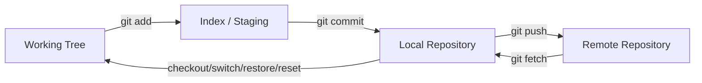

# Part 014 — Git Daily Workflow

> Fokus part ini: membangun workflow Git harian yang aman, cepat, reproducible, dan review-friendly untuk backend Java/JAX-RS enterprise systems. Tujuannya bukan sekadar tahu command, tetapi tahu kapan command aman, area Git mana yang berubah, dan failure mode apa yang harus dicegah.

Workflow Git harian yang buruk menciptakan biaya tersembunyi:

- PR berisi perubahan campur aduk;
- commit sulit direview;
- branch sering diverge;
- conflict membesar;
- local change hilang;
- build CI berbeda dari local;
- generated file masuk commit;
- secret/config lokal masuk Git;
- release traceability melemah.

Senior engineer harus punya workflow yang repeatable:

1. update knowledge dari remote;
2. mulai branch dari base yang benar;
3. edit kecil dan terarah;
4. review diff sebelum staging;
5. staging secara selektif;
6. commit atomic;
7. sync dengan remote tanpa merusak history;
8. push dan buka PR dengan evidence;
9. cleanup branch/workspace setelah selesai.

---

## 1. Daily Workflow Mental Model

Workflow harian memindahkan perubahan antar empat area:



Pertanyaan sebelum menjalankan command:

- Apakah command ini mengubah working tree?
- Apakah command ini mengubah index?
- Apakah command ini mengubah local branch pointer?
- Apakah command ini mengubah remote branch?
- Apakah command ini bisa menghapus perubahan?

Command read-only aman:

```bash
git status
git diff
git diff --staged
git log --oneline --decorate --graph --all -20
git branch -vv
git remote -v
```

Command perlu kehati-hatian:

```bash
git reset --hard
git clean -fd
git push --force
git rebase
git checkout -- <file>
git restore <file>
```

---

## 2. Clone

`git clone` membuat copy repository remote ke local.

```bash
git clone git@github.com:org/quote-order-service.git
cd quote-order-service
```

Setelah clone, jangan langsung coding. Validasi repository context:

```bash
git remote -v
git branch -vv
git status --short --branch
git log --oneline --decorate -5
```

Untuk enterprise repo, cek juga:

```bash
ls
find . -maxdepth 2 -name "README*" -o -name "CONTRIBUTING*"
find . -maxdepth 3 -name "pom.xml"
find . -maxdepth 3 -path "*/.github/workflows/*"
```

CSG/internal detail yang harus diverifikasi:

- apakah clone dari upstream repo atau fork;
- apakah SSH atau HTTPS direkomendasikan;
- apakah ada credential helper internal;
- apakah ada submodule;
- apakah ada Git LFS;
- apakah repo menggunakan sparse checkout atau monorepo convention.

Failure mode:

- clone repo salah;
- clone fork, tetapi mengira upstream;
- branch default bukan branch development utama;
- submodule tidak ter-initialize;
- file besar/LFS tidak terambil;
- credential salah sehingga fetch/push gagal.

---

## 3. Status

`git status` adalah command paling penting.

```bash
git status
git status --short
git status --short --branch
```

Contoh output short:

```text
## feature/quote-validation...origin/feature/quote-validation
 M src/main/java/com/example/QuoteResource.java
M  src/test/java/com/example/QuoteResourceTest.java
?? notes.txt
```

Makna umum:

| Marker | Meaning |
|---|---|
| ` M file` | modified di working tree, belum staged |
| `M  file` | modified dan sudah staged |
| `MM file` | staged, lalu diedit lagi |
| `?? file` | untracked |
| `A  file` | added |
| `D  file` | deleted |
| `UU file` | conflict unresolved |

Daily rule:

> Jalankan `git status --short --branch` sebelum commit, rebase, reset, switch branch, dan push.

Failure mode yang cepat terlihat dari status:

- branch salah;
- untracked file penting belum staged;
- config local tidak sengaja berubah;
- conflict belum selesai;
- working tree tidak clean sebelum rebase;
- branch ahead/behind remote.

---

## 4. Add

`git add` memindahkan perubahan dari working tree ke index.

Basic:

```bash
git add src/main/java/com/example/QuoteResource.java
git add src/test/java/com/example/QuoteResourceTest.java
```

Hati-hati dengan:

```bash
git add .
```

`git add .` berguna, tetapi bisa memasukkan:

- file generated;
- file IDE;
- `.env`;
- temporary notes;
- log output;
- unrelated formatting;
- file permission changes.

Senior habit:

```bash
git diff --stat
git diff
git add -p
git diff --staged --stat
git diff --staged
```

`git add -p` memungkinkan staging hunk per hunk:

```bash
git add -p src/main/java/com/example/QuoteService.java
```

Gunakan ini saat satu file berisi beberapa logical changes.

Failure mode:

- staging terlalu luas;
- staging hanya source tanpa test;
- staging file test tanpa update source;
- staging secret/local config;
- staging generated file besar;
- staging line-ending diff masif.

---

## 5. Commit

`git commit` membuat snapshot dari index.

```bash
git commit -m "Validate quote status before order submission"
```

Untuk commit message lebih lengkap:

```bash
git commit
```

Struktur yang disarankan:

```text
Short imperative summary

Explain why the change is needed, not only what changed.
Mention domain, API, migration, dependency, or release impact when relevant.
```

Contoh:

```text
Reject order submission for expired quotes

Expired quotes must not transition into submitted orders. This keeps the
quote-to-order lifecycle consistent and prevents downstream fulfillment from
processing invalid orders.
```

Atomic commit principle:

- satu commit = satu logical change;
- commit bisa direview sendiri;
- commit bisa di-revert sendiri;
- commit punya test/evidence yang relevan.

Sebelum commit:

```bash
git status --short
git diff --staged --stat
git diff --staged
```

Setelah commit:

```bash
git log --oneline --decorate -5
git show --stat HEAD
```

Failure mode:

- commit message tidak menjelaskan intent;
- commit berisi unrelated changes;
- commit besar sulit direview;
- commit mengubah behavior tanpa test;
- commit mengubah POM/pipeline tanpa penjelasan;
- commit tidak bisa di-revert secara aman.

---

## 6. Diff

`git diff` adalah alat review pribadi sebelum PR review publik.

Useful commands:

```bash
git diff
git diff --stat
git diff --staged
git diff --staged --stat
git diff --word-diff
git diff --name-only
```

Compare dengan branch utama:

```bash
git fetch origin
git diff origin/main...HEAD --stat
git diff origin/main...HEAD
```

Ganti `origin/main` sesuai branch utama internal.

Area-specific diff:

```bash
git diff origin/main...HEAD -- pom.xml
git diff origin/main...HEAD -- .github/workflows
git diff origin/main...HEAD -- src/main/java
git diff origin/main...HEAD -- src/test/java
```

Review diff berdasarkan risk surface:

| File berubah | Pertanyaan review |
|---|---|
| `pom.xml` | dependency/plugin/lifecycle berubah? |
| workflow YAML | quality gate/permission/secret berubah? |
| Dockerfile | user, permission, image, entrypoint berubah? |
| Kubernetes manifest | resource/secret/config/rollout berubah? |
| Java resource/controller | API contract/status code berubah? |
| migration | backward compatibility dan rollback? |
| script | idempotency, quoting, safety, dry-run? |

Failure mode:

- diff terlalu besar untuk dipahami;
- whitespace-only diff menutupi behavior change;
- generated diff ikut PR;
- dependency update tersembunyi dalam PR behavior;
- pipeline permission berubah tanpa highlight.

---

## 7. Log

`git log` membaca history.

Useful forms:

```bash
git log --oneline
git log --oneline --decorate --graph --all -30
git log --stat -5
git log --patch -1
git log -- path/to/file
```

Commit range:

```bash
git log origin/main..HEAD --oneline
git log v1.8.2..v1.8.3 --oneline
```

Search commit message:

```bash
git log --grep="quote" --oneline
```

Search content changes:

```bash
git log -S"submitOrder" --oneline -- src/main/java
```

Senior use cases:

- melihat commit yang akan masuk PR;
- membuat release note;
- mencari perubahan terakhir pada file;
- mencari kapan behavior diperkenalkan;
- mengecek apakah branch sudah sync;
- mendiagnosis regression.

Failure mode:

- membaca log branch aktif padahal perlu `--all`;
- salah memahami range `A..B`;
- mengira commit sudah di remote padahal masih local;
- tidak melihat merge commit karena format log terlalu ringkas.

---

## 8. Branch

Branch digunakan untuk isolasi perubahan.

Command:

```bash
git branch
git branch --show-current
git branch -vv
git switch -c feature/quote-expiry-validation
```

Buat branch dari base yang benar:

```bash
git fetch origin
git switch main
git pull --ff-only
git switch -c feature/quote-expiry-validation
```

Jika internal branch utama bukan `main`, gunakan branch yang benar sesuai repository.

Branch naming yang baik:

```text
feature/quote-expiry-validation
bugfix/order-submit-null-customer
chore/update-maven-wrapper
hotfix/release-1.8.3-timeout-fix
```

Failure mode:

- membuat branch dari branch lama;
- membuat branch dari branch feature lain tanpa sadar;
- terlalu lama hidup sehingga conflict besar;
- branch name tidak menjelaskan scope;
- commit hotfix tidak kembali ke mainline.

Review branch state:

```bash
git branch -vv
git log --oneline --decorate --graph --all -30
```

---

## 9. Checkout vs Switch

Git modern memisahkan beberapa fungsi lama `checkout` menjadi `switch` dan `restore`.

Untuk pindah branch:

```bash
git switch main
git switch feature/quote-validation
```

Untuk membuat branch baru:

```bash
git switch -c feature/new-validation
```

`checkout` masih sering dipakai:

```bash
git checkout main
git checkout -b feature/new-validation
git checkout <commit>
```

Tetapi `checkout` overloaded:

- pindah branch;
- checkout commit;
- restore file;
- membuat branch.

Karena itu, untuk workflow harian, prefer:

- `git switch` untuk branch;
- `git restore` untuk file.

Failure mode:

- checkout file lama tanpa sadar menghapus perubahan;
- detached HEAD karena checkout commit/tag;
- pindah branch dengan working tree dirty;
- branch dibuat dari posisi salah.

---

## 10. Restore

`git restore` digunakan untuk membatalkan perubahan working tree atau index.

Unstage file:

```bash
git restore --staged src/main/java/com/example/QuoteService.java
```

Discard perubahan working tree:

```bash
git restore src/main/java/com/example/QuoteService.java
```

Restore file dari commit tertentu:

```bash
git restore --source=HEAD~1 -- path/to/file
```

Hati-hati:

```bash
git restore .
```

Itu bisa menghapus semua perubahan unstaged.

Safe flow:

```bash
git status --short
git diff > /tmp/before-restore.diff
git restore path/to/file
```

Failure mode:

- perubahan penting hilang;
- restore file yang masih dibutuhkan;
- restore dari source commit yang salah;
- menghapus partial work saat debugging.

Rule:

> Jangan restore perubahan yang belum kamu lihat dengan `git diff`.

---

## 11. Fetch

`git fetch` mengambil update remote tanpa mengubah working tree.

```bash
git fetch origin
git fetch --prune origin
```

Setelah fetch:

```bash
git branch -vv
git log --oneline --decorate --graph --all -30
```

Fetch digunakan sebelum:

- membuat branch baru;
- membandingkan PR diff;
- rebase/merge dari main;
- membuat release note;
- mengecek tag baru;
- memastikan local tahu remote terbaru.

`--prune` membersihkan reference remote branch yang sudah dihapus.

Failure mode:

- local mengira sudah up to date padahal belum fetch;
- branch remote deleted masih terlihat;
- compare terhadap stale `origin/main`;
- release note tidak mencakup commit terbaru.

Daily habit:

```bash
git fetch --prune origin
```

---

## 12. Pull

`git pull` adalah kombinasi `fetch` + integrasi ke branch aktif.

Integrasi bisa berupa merge atau rebase tergantung config.

```bash
git pull
```

Lebih explicit:

```bash
git pull --ff-only
```

`--ff-only` aman untuk branch yang seharusnya hanya mengikuti remote, karena menolak membuat merge commit otomatis.

Untuk feature branch, tergantung policy tim:

```bash
git pull --rebase origin main
```

atau:

```bash
git merge origin/main
```

Jangan mengasumsikan policy. Verifikasi apakah tim prefer merge, rebase, squash, atau linear history.

Failure mode:

- pull membuat merge commit tidak diinginkan;
- pull rebase menyebabkan conflict dan kebingungan;
- pull di branch yang salah;
- working tree dirty membuat pull gagal;
- local history berubah tanpa dipahami.

Safe sequence:

```bash
git status --short --branch
git fetch origin
git log --oneline --decorate --graph --all -20
git pull --ff-only
```

---

## 13. Push

`git push` mengirim commit local ke remote.

```bash
git push origin feature/quote-expiry-validation
```

Untuk branch baru:

```bash
git push -u origin feature/quote-expiry-validation
```

`-u` mengatur upstream tracking.

Cek sebelum push:

```bash
git status --short --branch
git log --oneline origin/main..HEAD
git diff origin/main...HEAD --stat
```

Force push sangat berisiko di shared branch.

Jika harus update branch PR setelah rebase:

```bash
git push --force-with-lease
```

`--force-with-lease` lebih aman daripada `--force` karena menolak overwrite jika remote berubah tanpa local tahu.

Failure mode:

- push ke remote salah;
- push branch WIP tidak sengaja;
- force push menghapus commit orang lain;
- push secret;
- push commit dari email/identity salah;
- push branch yang belum sync dengan base.

Internal verification:

- apakah force push ke branch PR diizinkan?
- apakah protected branch menolak direct push?
- apakah signed commit wajib?
- apakah branch naming divalidasi?

---

## 14. Stash

`git stash` menyimpan perubahan sementara.

```bash
git stash push -m "wip quote validation"
git stash list
git stash show --stat stash@{0}
git stash show -p stash@{0}
git stash pop
```

Stash berguna saat:

- perlu pindah branch cepat;
- perlu pull/rebase dengan working tree clean;
- perlu menyimpan experiment sementara.

Tetapi stash bukan long-term storage.

Failure mode:

- lupa stash berisi perubahan penting;
- stash pop menyebabkan conflict;
- stash tanpa message membuat bingung;
- stash berisi secret/local config;
- stash hilang karena cleanup ekstrem.

Prefer commit WIP di branch pribadi jika pekerjaan akan disimpan lama.

Safer habit:

```bash
git stash push -m "wip: reproduce order timeout locally"
git stash list
git stash show -p stash@{0} | less
```

---

## 15. Clean

`git clean` menghapus untracked files.

Preview dulu:

```bash
git clean -nd
```

Hapus untracked files:

```bash
git clean -fd
```

Hapus juga ignored files:

```bash
git clean -fdx
```

`-x` sangat berbahaya karena bisa menghapus:

- local `.env`;
- IDE config;
- downloaded artifacts;
- local test data;
- generated cache;
- credential-like files jika tidak hati-hati.

Safe sequence:

```bash
git status --short --ignored
git clean -nd
git clean -fd
```

Untuk Maven project, kadang lebih aman:

```bash
mvn clean
```

Tetapi `mvn clean` hanya menghapus build output sesuai Maven lifecycle, bukan semua untracked files.

Failure mode:

- menghapus local config penting;
- menghapus generated evidence/log untuk debugging;
- menghapus file baru yang belum sempat staged;
- clean dengan `-x` di repo yang punya ignored local setup.

---

## 16. Reset

`git reset` memindahkan branch/index/working tree tergantung mode.

Mode umum:

| Mode | Branch pointer | Index | Working tree |
|---|---|---|---|
| `--soft` | berubah | tetap seperti commit lama | tetap |
| `--mixed` default | berubah | reset | tetap |
| `--hard` | berubah | reset | reset |

Contoh:

```bash
git reset --soft HEAD~1
git reset HEAD~1
git reset --hard HEAD~1
```

Use cases:

- `--soft`: undo commit tapi keep staged changes;
- mixed/default: undo commit dan unstage changes;
- `--hard`: buang commit dan working changes.

`--hard` destructive. Jangan gunakan tanpa:

```bash
git status
git log --oneline -5
git branch backup/before-reset-$(date +%Y%m%d-%H%M%S)
```

Shared branch concern:

- reset commit yang sudah pushed membuat local history diverge;
- memperbaikinya sering butuh force push;
- force push bisa merusak pekerjaan orang lain;
- untuk shared history, `git revert` biasanya lebih aman.

---

## 17. Amend

`git commit --amend` mengubah commit terakhir.

Use cases:

- memperbaiki commit message;
- menambahkan file yang lupa;
- memperbaiki typo kecil sebelum push.

```bash
git add missing-test.java
git commit --amend
```

Amend mengubah commit hash.

Aman jika commit belum dipush. Jika sudah dipush, amend membutuhkan force push untuk update remote branch.

Safer rule:

- sebelum push: amend boleh;
- setelah push ke branch pribadi: amend + `--force-with-lease` mungkin boleh jika policy mengizinkan;
- setelah merge/shared branch: jangan amend, gunakan commit baru atau revert.

Failure mode:

- amend commit yang sudah direview sehingga review context berubah;
- amend lalu force push menghapus update remote;
- amend mencampur perubahan baru ke commit lama yang berbeda intent.

Command check:

```bash
git log --oneline --decorate -3
git status --short
git diff --staged
```

---

## 18. Ignore

`.gitignore` menjaga file tertentu tidak masuk Git.

Java/Maven examples:

```gitignore
target/
*.class
*.log
.idea/
*.iml
.DS_Store
.env
```

Cek kenapa file di-ignore:

```bash
git check-ignore -v .env
```

Lihat ignored files:

```bash
git status --ignored --short
```

Penting:

- `.gitignore` tidak berlaku untuk file yang sudah tracked;
- jangan rely hanya pada `.gitignore` untuk secret safety;
- `.gitignore` harus balance: cukup mencegah noise, tidak menyembunyikan file penting.

Jika file sudah tracked dan harus dihentikan tracking:

```bash
git rm --cached path/to/file
```

Failure mode:

- `.env` belum di-ignore;
- generated directory tidak di-ignore;
- file penting tidak muncul karena pattern terlalu luas;
- IDE file masuk PR;
- secret sudah tracked sebelum `.gitignore` ditambahkan.

---

## 19. Daily Workflow for Java/JAX-RS Change

Contoh workflow untuk perubahan endpoint JAX-RS.

### 1. Sync base

```bash
git fetch --prune origin
git switch main
git pull --ff-only
```

### 2. Create branch

```bash
git switch -c feature/reject-expired-quote-submission
```

### 3. Make focused changes

Edit:

```text
QuoteResource.java
QuoteService.java
QuoteStateValidator.java
QuoteResourceTest.java
```

### 4. Inspect diff

```bash
git status --short
git diff --stat
git diff
```

### 5. Run relevant tests

```bash
./mvnw -pl quote-service -am test
```

Sesuaikan dengan internal repo structure.

### 6. Stage selectively

```bash
git add -p src/main/java/com/example/quote

git add -p src/test/java/com/example/quote
```

### 7. Commit

```bash
git diff --staged --stat
git diff --staged
git commit -m "Reject order submission for expired quotes"
```

### 8. Final check

```bash
git status --short --branch
git log --oneline origin/main..HEAD
git diff origin/main...HEAD --stat
```

### 9. Push

```bash
git push -u origin feature/reject-expired-quote-submission
```

---

## 20. Daily Workflow for Maven/POM Change

POM changes are high-risk because they alter build, classpath, tests, packaging, or release.

Before changing POM:

```bash
git diff origin/main...HEAD -- pom.xml
./mvnw dependency:tree
```

After changing dependency:

```bash
./mvnw -q -DskipTests dependency:tree > /tmp/dependency-tree.txt
./mvnw test
```

Review:

```bash
git diff -- pom.xml
```

Questions:

- Why is this dependency needed?
- Is version managed by parent POM/BOM?
- Is scope correct?
- Does this introduce transitive dependency conflict?
- Does this affect runtime classpath?
- Does this require security/license review?

Commit should highlight build/dependency impact:

```text
Add resilience4j retry dependency for downstream quote lookup

Use the managed version from the platform BOM and limit the dependency to the
service module that performs downstream quote lookup.
```

Internal verification:

- parent POM/BOM convention;
- dependency approval process;
- SCA scan behavior;
- artifact repository policy;
- CI command expected after POM change.

---

## 21. Daily Workflow for Script/Tooling Change

Script changes are deceptively risky.

Before commit:

```bash
git diff -- scripts/
shellcheck scripts/*.sh  # if available
bash -n scripts/my-script.sh
```

Review for:

- quoting;
- `set -euo pipefail` caveats;
- destructive command guard;
- dry-run support;
- logging clarity;
- idempotency;
- cross-platform assumption;
- secret leakage;
- CI/local reuse.

Staging:

```bash
git add -p scripts/my-script.sh
```

Check executable bit:

```bash
git diff --summary
```

If executable bit needed:

```bash
git update-index --chmod=+x scripts/my-script.sh
```

Failure mode:

- script works locally but not CI;
- Bash feature used under `/bin/sh`;
- unquoted variable breaks path with spaces;
- command deletes wrong path;
- script assumes GNU tools on macOS;
- script prints secrets in logs.

---

## 22. Daily Workflow for CI/CD Change

CI/CD workflow changes can bypass or break quality gates.

Before commit:

```bash
git diff -- .github/workflows
```

Review questions:

- What event triggers changed?
- Did permissions become broader?
- Did secrets exposure change?
- Are third-party actions pinned?
- Did cache key become unsafe or ineffective?
- Did required checks change name?
- Did test/scan/package step get skipped?
- Did deployment gate change?

If workflow affects Java/Maven:

```text
checkout -> setup-java -> cache -> mvn verify -> scan -> package -> image build
```

Commit message should be explicit:

```text
Run integration tests in CI before packaging service image
```

Internal verification:

- branch protection required check names;
- GitHub Actions permission policy;
- reusable workflow governance;
- deployment environment approval;
- platform/SRE reviewer requirement.

---

## 23. Working with Remote Branch Divergence

Divergence means local and remote branch both have commits the other does not.

Check:

```bash
git status --short --branch
git branch -vv
git log --oneline --decorate --graph --all -30
```

Example status:

```text
## feature/foo...origin/feature/foo [ahead 2, behind 1]
```

Possible options:

- merge remote into local;
- rebase local commits on remote;
- reset local to remote if local commits are disposable;
- coordinate with teammate if branch shared.

Do not blindly force push.

Safe analysis:

```bash
git log --oneline HEAD..origin/feature/foo
git log --oneline origin/feature/foo..HEAD
```

Interpretation:

- `HEAD..origin/feature/foo`: commits remote has, local lacks;
- `origin/feature/foo..HEAD`: commits local has, remote lacks.

Internal policy determines whether rebase/merge is preferred.

---

## 24. Handling Local Experiments

Not every local experiment belongs in clean PR history.

Safer options:

### Temporary branch

```bash
git switch -c experiment/reproduce-timeout
```

### WIP commit

```bash
git add -p
git commit -m "WIP reproduce downstream timeout"
```

Later clean with rebase/squash before PR if policy allows.

### Stash

```bash
git stash push -m "experiment timeout config"
```

Guideline:

- use branch for work that may last;
- use stash for short interruptions;
- use patch file for sharing or backup;
- avoid untracked local files as long-term storage.

Patch backup:

```bash
git diff > /tmp/experiment.patch
```

---

## 25. Safe Cleanup After PR Merge

After PR merge, cleanup local state.

```bash
git fetch --prune origin
git switch main
git pull --ff-only
git branch --merged
```

Delete local branch:

```bash
git branch -d feature/quote-expiry-validation
```

Delete remote branch if not auto-deleted and policy allows:

```bash
git push origin --delete feature/quote-expiry-validation
```

Do not delete branch if:

- PR not merged;
- branch contains unmerged commits;
- branch needed for release/hotfix;
- branch shared with teammate.

Check before delete:

```bash
git log --oneline main..feature/quote-expiry-validation
```

---

## 26. Production-Safe Git Behavior

Git commands are local most of the time, but their consequences can reach production via CI/CD.

Production-safe rules:

- never push directly to protected branch;
- never force push shared branch without coordination;
- never rewrite release tag without explicit approval;
- never commit secret, local credential, customer data, or production dump;
- never bypass CI by changing workflow casually;
- never hide dependency or release-impacting changes inside unrelated PR;
- never release from dirty working tree;
- never assume branch/tag/process without verifying repository rules.

Read-only first commands for production investigation:

```bash
git show <tag>
git log --oneline <old-tag>..<new-tag>
git diff --stat <old-tag>..<new-tag>
git branch --contains <commit>
git tag --contains <commit>
```

---

## 27. Correctness Concerns

Daily Git correctness means:

- branch starts from correct base;
- commit contains intended files only;
- staging matches logical change;
- tests/config/docs/migration included when needed;
- POM/workflow/script changes are visible and justified;
- PR diff is compared against correct merge-base;
- local branch is not stale;
- commit can be reverted without dragging unrelated changes.

Self-review checklist:

```bash
git fetch origin
git status --short --branch
git log --oneline origin/main..HEAD
git diff origin/main...HEAD --stat
git diff origin/main...HEAD -- pom.xml .github/workflows Dockerfile scripts
```

---

## 28. Productivity Concerns

Good Git workflow makes team review faster.

Bad workflow symptoms:

- “why is this file changed?” appears often in review;
- reviewers have to infer intent from diff;
- branch update causes huge conflict;
- PR includes formatting + behavior + dependency + pipeline change;
- local setup files keep appearing in PR;
- developer regularly loses changes;
- CI fails due to uncommitted generated files or missing test data.

Productivity patterns:

- small branches;
- small commits;
- self-review before push;
- `git add -p`;
- clear commit message;
- frequent fetch;
- documented local setup;
- clear `.gitignore`;
- use PR draft early for visibility if helpful.

---

## 29. Security Concerns

Daily Git workflow must prevent secret leakage.

Before commit, inspect suspicious files:

```bash
git diff --staged | grep -Ei 'password|secret|token|api[_-]?key|private key' || true
```

Better: rely on internal secret scanning if available, but do not depend solely on it.

Do not commit:

- `.env` with real secrets;
- private key;
- production config dump;
- customer data;
- access token;
- local Maven settings with credentials;
- cloud profile credentials;
- database dump;
- incident evidence containing sensitive data.

If secret accidentally committed:

- stop pushing if not pushed yet;
- remove from commit/history locally;
- if pushed, follow internal security process;
- rotate secret;
- do not assume deleting in next commit is enough.

---

## 30. Reproducibility Concerns

Daily workflow should produce reproducible PR evidence.

Include in PR when relevant:

```text
Base branch: origin/main
Commit range: origin/main..HEAD
Build command: ./mvnw verify
Test command: ./mvnw -pl <module> test
Docker command: docker build ...
Relevant logs/evidence: <redacted>
```

Useful commands:

```bash
git rev-parse HEAD
git describe --tags --always --dirty
git status --porcelain
```

Do not claim build is clean if:

```bash
git status --porcelain
```

returns output.

Build from dirty working tree can hide uncommitted changes that CI will not see.

---

## 31. Release Concerns

Daily Git workflow affects release safety.

A bad commit can make release harder if:

- it mixes many concerns;
- it lacks test;
- it changes dependency unexpectedly;
- it changes migration and behavior in inseparable way;
- it has unclear message;
- it cannot be reverted safely;
- it lands without release note for customer-visible behavior.

Before merging release-impacting PR, check:

```bash
git diff origin/main...HEAD --stat
git log --oneline origin/main..HEAD
```

Questions:

- Is this change backward compatible?
- Does it need release note?
- Does it require config/deployment change?
- Does it require migration sequencing?
- Can it be rolled back?
- Is feature flag needed?

---

## 32. Observability and Incident-Support Concerns

Good Git workflow improves incident response.

During incident, clean history helps answer:

- which commit changed this endpoint?
- when was this dependency updated?
- what PR changed pipeline behavior?
- which commit belongs to deployed image?
- which tag is safe rollback target?

Daily habits that help incidents:

- meaningful commit messages;
- PR links to issue/story;
- release tags mapped to commit;
- no unrelated changes;
- commit SHA embedded in build/deployment metadata;
- docs/runbook updated with tooling changes.

Useful incident commands:

```bash
git log --oneline -- path/to/file
git blame path/to/file
git show <commit>
git log --oneline <last-known-good>..<current>
```

---

## 33. PR Review Checklist for Daily Git Workflow

### Branch and history

- Apakah branch berasal dari base yang benar?
- Apakah branch up to date sesuai kebutuhan?
- Apakah commit range jelas?
- Apakah commit terlalu besar atau campur aduk?
- Apakah ada WIP/debug commit yang harus dibersihkan?

### Diff hygiene

- Apakah diff hanya berisi intended change?
- Apakah generated/IDE/local files masuk?
- Apakah line ending/file mode berubah tanpa alasan?
- Apakah test/docs/config ikut jika diperlukan?

### Risk surface

- Apakah POM berubah?
- Apakah CI/CD workflow berubah?
- Apakah Docker/Kubernetes/GitOps config berubah?
- Apakah script berubah?
- Apakah release behavior berubah?

### Security

- Apakah ada secret/token/customer data?
- Apakah `.env`, credentials, Maven settings, cloud profile masuk?
- Apakah dependency/action baru perlu review security?

### Reproducibility

- Apakah PR menjelaskan build/test command?
- Apakah local evidence berasal dari clean working tree?
- Apakah commit SHA dan branch base jelas?

---

## 34. Internal Verification Checklist

Verifikasi detail ini di CSG/team/repository sebelum menganggap workflow final.

### Repository setup

- Apakah clone via SSH atau HTTPS?
- Apakah fork workflow digunakan?
- Apakah submodule/LFS/sparse checkout dipakai?
- Apakah branch default sama dengan branch development utama?

### Branch workflow

- Apa nama branch utama?
- Apakah branch harus dibuat dari `main`, release branch, atau development branch?
- Apa branch naming convention?
- Apakah branch lama harus rutin rebase/merge?
- Apakah remote branch otomatis dihapus setelah merge?

### Pull/update workflow

- Apakah tim prefer merge atau rebase?
- Apakah `pull --ff-only` direkomendasikan untuk main?
- Apakah linear history diwajibkan?
- Apakah squash merge default?

### Push workflow

- Apakah direct push ke protected branch diblokir?
- Apakah force push di branch PR boleh?
- Apakah commit signing wajib?
- Apakah signed-off-by/DCO diperlukan?

### PR evidence

- Command build/test apa yang wajib dijalankan sebelum PR?
- Apakah PR template punya checklist?
- Apakah screenshot/log/evidence perlu dilampirkan?
- Apakah dependency/POM change butuh reviewer khusus?
- Apakah workflow/script change butuh platform/SRE/security reviewer?

### Security

- Apakah secret scanning aktif?
- Apa proses secret leakage?
- Apakah ada `.gitignore` template internal?
- Apakah local config harus disimpan di path tertentu?

---

## 35. Practical Daily Command Set

Command set minimum yang sebaiknya lancar:

```bash
# Context
git status --short --branch
git remote -v
git branch -vv
git log --oneline --decorate --graph --all -20

# Sync
git fetch --prune origin
git pull --ff-only

# Branch
git switch main
git switch -c feature/my-change

# Review changes
git diff --stat
git diff
git diff --staged --stat
git diff --staged

# Stage and commit
git add -p
git commit

# Compare PR range
git log --oneline origin/main..HEAD
git diff origin/main...HEAD --stat

# Push
git push -u origin feature/my-change

# Temporary work
git stash push -m "wip message"
git stash list
git stash show -p stash@{0}

# Cleanup
git clean -nd
git branch --merged
```

---

## 36. Senior Engineer Heuristics

1. Treat `git status` as situational awareness.
2. Treat `git diff` as self-review.
3. Treat `git add -p` as commit hygiene tool.
4. Treat `git fetch` as updating knowledge, not changing work.
5. Treat `git pull` as a compound operation that must be understood.
6. Treat `git push` as publishing, not saving.
7. Treat `git reset --hard` and `git clean -fdx` as destructive commands.
8. Treat force push as branch history surgery.
9. Treat POM/workflow/script diffs as high-risk even when small.
10. Treat Git history as future incident evidence.

---

## 37. Summary

Daily Git workflow for senior backend engineer is about controlling change movement safely:

- clone repository and verify remote/branch context;
- use `status`, `diff`, and `log` as read-only situational awareness;
- stage selectively with `add -p`;
- create atomic commits with useful messages;
- fetch before comparing or updating;
- understand pull as fetch + integration;
- push intentionally and avoid unsafe force push;
- use stash, clean, reset, amend with clear awareness of risk;
- keep `.gitignore` healthy;
- review POM, CI/CD, Docker/Kubernetes, and script changes as high-risk surfaces;
- keep workflow reproducible, secure, and incident-support friendly.

Part berikutnya akan membahas Git branching dan commit hygiene lebih dalam: branch strategy, feature branch, release branch, hotfix branch, trunk-based development, Gitflow awareness, atomic commit, squash, fixup, dan commit signing.
