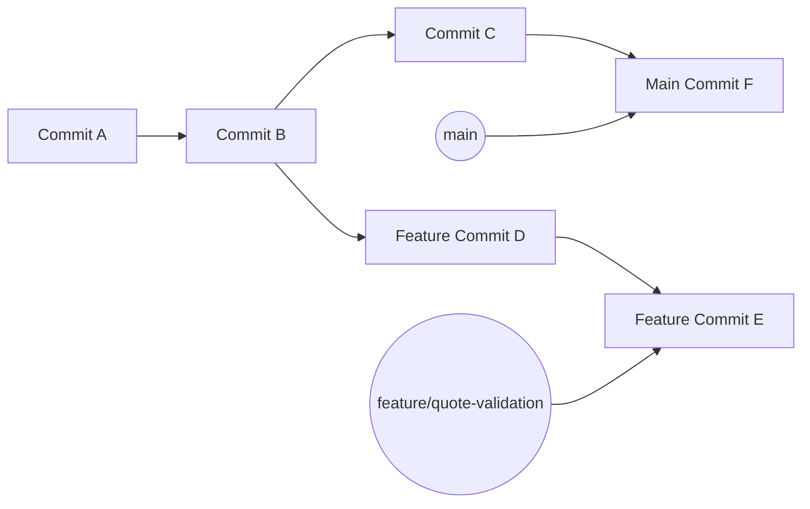
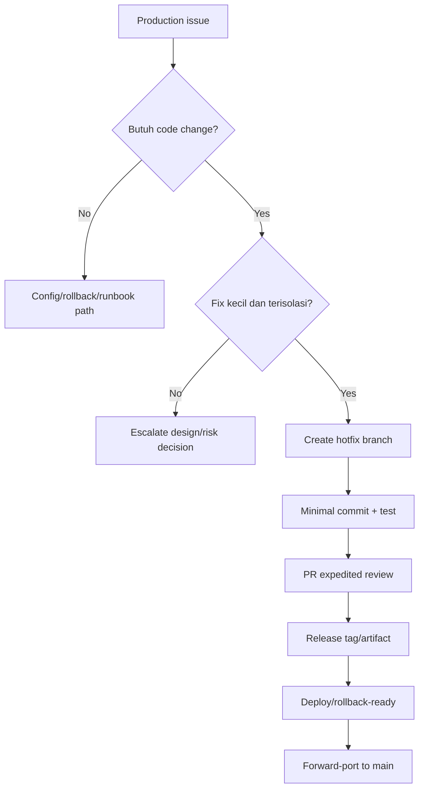
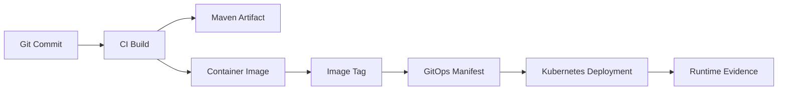

# Part 015 — Git Branching and Commit Hygiene

> Fokus part ini: membangun discipline Git yang membuat perubahan mudah direview, mudah di-debug, mudah di-release, dan aman untuk production. Branch dan commit bukan sekadar cara menyimpan pekerjaan; keduanya adalah unit koordinasi, audit trail, rollback reference, dan forensic artifact ketika terjadi regression.

Git hygiene yang buruk biasanya tidak langsung terlihat sebagai bug aplikasi. Dampaknya muncul belakangan:

- PR terlalu besar dan sulit direview;
- perubahan domain, refactor, test, formatting, dan dependency tercampur;
- hotfix sulit dipisahkan dari feature work;
- regression sulit dicari dengan `git bisect`;
- release note tidak akurat;
- cherry-pick/backport rawan conflict;
- rollback sulit karena commit tidak atomic;
- branch terlalu lama hidup dan conflict membesar;
- commit history tidak membantu incident investigation.

Senior engineer harus memperlakukan branch dan commit sebagai struktur kerja yang mendukung review, release, traceability, dan recovery.

---

## 1. Branching and Commit Hygiene Mental Model

Git menyimpan histori sebagai commit graph. Branch hanyalah nama yang menunjuk ke commit tertentu.



Implikasi penting:

- branch bukan folder;
- branch bukan copy penuh repository;
- branch pointer bisa bergerak;
- commit yang sudah masuk shared branch harus diperlakukan sebagai public history;
- commit yang belum dipush masih relatif aman untuk dirapikan;
- commit kecil dan logis membuat graph mudah dianalisis;
- commit besar dan campur aduk membuat graph kehilangan nilai forensic.

Pertanyaan senior sebelum membuat branch:

- Perubahan ini untuk feature, bugfix, hotfix, spike, refactor, atau release?
- Branch ini akan hidup berapa lama?
- Apakah branch ini perlu sering sync dengan main?
- Apakah branch ini akan masuk PR tunggal atau dipecah?
- Apakah branch ini menyentuh artifact release, schema, contract, atau deployment config?

Pertanyaan senior sebelum membuat commit:

- Apakah commit ini satu logical change?
- Apakah commit ini bisa direvert sendiri?
- Apakah commit ini bisa dijelaskan dalam satu kalimat?
- Apakah commit ini akan membantu reviewer?
- Apakah commit ini akan membantu debugging regression?
- Apakah commit ini menyertakan test/evidence yang tepat?

---

## 2. Why Branch Strategy Exists

Branch strategy ada untuk mengatur aliran perubahan dari developer ke production.

Tanpa branch strategy, tim akan mengalami:

- branch naming acak;
- PR target salah;
- hotfix masuk jalur feature biasa;
- release branch tidak jelas;
- environment promotion tidak traceable;
- perubahan production sulit dikaitkan ke commit/tag;
- merge conflict sering muncul di akhir release;
- tim tidak tahu kapan harus rebase, merge, cherry-pick, atau revert.

Branch strategy harus menjawab:

| Pertanyaan | Kenapa penting |
|---|---|
| Branch utama apa? | Menentukan base perubahan dan sumber release |
| Kapan feature branch dibuat? | Mengatur isolation perubahan |
| Kapan release branch dibuat? | Mengontrol stabilization window |
| Bagaimana hotfix dilakukan? | Mempercepat recovery production |
| Siapa boleh merge? | Menjaga governance |
| Check apa yang wajib? | Menjaga quality gate |
| Bagaimana tag dibuat? | Menjaga traceability release |

Dalam konteks enterprise Java/JAX-RS, branch strategy harus mempertimbangkan:

- API backward compatibility;
- database migration;
- event schema compatibility untuk Kafka/RabbitMQ;
- dependency version alignment;
- container image tagging;
- GitOps manifest update;
- rollback dan roll-forward;
- release note dan audit trail.

---

## 3. Mainline

Mainline adalah branch utama tempat histori integrasi terkini hidup. Nama bisa `main`, `master`, `develop`, atau nama internal lain.

Contoh command untuk melihat branch utama local:

```bash
git remote show origin
```

Contoh output yang perlu dicari:

```text
HEAD branch: main
```

Mainline yang sehat biasanya punya sifat:

- selalu buildable;
- protected;
- required checks aktif;
- tidak menerima push langsung sembarangan;
- menjadi base PR normal;
- menjadi sumber release atau sumber release branch;
- memiliki histori yang cukup bersih untuk debugging.

Failure mode:

- mainline sering merah di CI;
- mainline menerima commit tanpa review;
- mainline berisi generated/noisy changes;
- mainline tidak bisa dipakai sebagai base baru;
- mainline tidak jelas hubungannya dengan production.

Senior rule:

> Jangan anggap branch utama sebagai tempat eksperimen. Branch utama adalah integration contract tim.

Internal verification checklist:

- Branch utama internal apa?
- Apakah `main` langsung releaseable?
- Apakah ada `develop`?
- Apakah mainline protected?
- Apakah direct push dilarang?
- Apakah release dibuat dari mainline atau release branch?

---

## 4. Trunk-Based Development

Trunk-based development berarti developer mengintegrasikan perubahan kecil dan sering ke trunk/mainline.

Karakteristik:

- branch pendek umur;
- PR kecil;
- integrasi sering;
- feature besar disembunyikan dengan feature flag atau backward-compatible rollout;
- conflict kecil karena divergence pendek;
- CI menjadi quality gate utama.

Cocok untuk:

- tim dengan automated test kuat;
- CI cepat dan reliable;
- deployment/release sering;
- feature flag tersedia;
- perubahan bisa dipecah incremental.

Risiko:

- butuh discipline tinggi;
- unfinished feature bisa bocor jika tidak di-guard;
- test lemah membuat mainline mudah rusak;
- feature flag debt bisa menumpuk;
- database migration harus sangat hati-hati.

Java/JAX-RS impact:

- endpoint baru bisa dimasukkan disabled/hidden;
- perubahan contract harus backward-compatible;
- DTO/event schema harus additive lebih dulu;
- database migration harus expand/contract;
- dependency upgrade besar perlu dipecah.

Kubernetes/GitOps impact:

- image dan manifest update harus traceable;
- feature flag/config rollout harus jelas;
- rollback harus kompatibel dengan versi DB/config/event.

Internal verification checklist:

- Apakah tim memakai trunk-based development?
- Apakah feature flag tersedia?
- Apakah PR kecil menjadi norma?
- Apakah CI cukup cepat?
- Apakah release sering atau batch release?

---

## 5. Feature Branch

Feature branch dipakai untuk mengisolasi perubahan sebelum masuk mainline.

Contoh:

```bash
git switch main
git pull --ff-only
git switch -c feature/quote-validation-rules
```

Feature branch yang sehat:

- dibuat dari base yang benar;
- fokus pada satu capability;
- rutin sync dengan mainline;
- tidak hidup terlalu lama;
- tidak menjadi tempat banyak scope unrelated;
- menghasilkan PR yang bisa direview secara utuh.

Naming convention yang umum:

```text
feature/<short-topic>
bugfix/<short-topic>
hotfix/<short-topic>
chore/<short-topic>
refactor/<short-topic>
docs/<short-topic>
spike/<short-topic>
```

Tambahkan ticket ID jika tim menggunakan issue tracker:

```text
feature/QO-1234-quote-validation-rules
bugfix/QO-2345-fix-null-customer-id
```

Failure mode:

- branch dibuat dari branch lama;
- branch bercampur banyak task;
- branch hidup berminggu-minggu tanpa sync;
- branch berisi commit generated/temporary;
- branch menyentuh file migration/API/event tanpa review cukup;
- branch tidak bisa direbase/merge karena conflict terlalu besar.

Checklist sebelum push feature branch:

```bash
git status --short --branch
git diff --stat origin/main...HEAD
git log --oneline --decorate origin/main..HEAD
mvn -q test
```

Internal verification checklist:

- Naming convention branch apa yang dipakai?
- Apakah ticket ID wajib?
- Apakah branch lama otomatis dihapus?
- Apakah branch harus rebase sebelum PR?
- Apakah PR target selalu mainline atau branch lain?

---

## 6. Release Branch

Release branch digunakan untuk stabilization dan release preparation.

Contoh pola umum:

```text
release/1.8.x
release/2026.07
release/q3-2026
```

Release branch biasanya berisi:

- bugfix release;
- version bump;
- changelog/release note;
- release-specific config jika memang diperlukan;
- final hardening sebelum tag.

Hal yang harus dihindari:

- memasukkan feature besar baru;
- melakukan refactor tidak perlu;
- dependency upgrade besar tanpa alasan release;
- mengubah pipeline release mendadak;
- perubahan database besar tanpa rollback strategy.

Java/JAX-RS impact:

- release branch harus stabil secara API;
- migration harus sudah jelas urutan deploy-nya;
- compatibility dengan client dan service lain harus diverifikasi;
- artifact version harus konsisten.

GitOps/Kubernetes impact:

- release branch bisa menghasilkan image tag tertentu;
- manifest environment bisa menunjuk image/tag tertentu;
- rollback harus tahu tag/image mana yang aman.

Failure mode:

- release branch diverge terlalu jauh dari main;
- fix masuk release branch tetapi lupa forward-merge ke main;
- tag dibuat dari commit yang salah;
- release note tidak sesuai commit;
- artifact version tidak sesuai tag.

Internal verification checklist:

- Apakah CSG/team menggunakan release branch?
- Naming convention release branch apa?
- Siapa boleh membuat release branch?
- Apakah fix di release branch wajib cherry-pick/merge balik ke main?
- Bagaimana release branch dipetakan ke Maven version, image tag, dan release note?

---

## 7. Hotfix Branch

Hotfix branch digunakan untuk memperbaiki production issue dengan cepat dan terkendali.

Contoh:

```bash
git switch release/1.8.x
git pull --ff-only
git switch -c hotfix/QO-4567-fix-order-submit-timeout
```

Hotfix bukan tempat untuk:

- refactor besar;
- cleanup unrelated;
- dependency upgrade umum;
- formatting massal;
- perubahan behavior tambahan;
- eksperimen.

Hotfix yang baik:

- scope sangat kecil;
- root cause jelas atau minimal symptom fix jelas;
- test/regression evidence ada;
- rollback path jelas;
- commit mudah cherry-pick;
- release note singkat dan akurat;
- forward-port ke main direncanakan.

Decision model:



Failure mode:

- hotfix hanya diterapkan di release branch dan hilang dari main;
- hotfix tidak punya test sehingga regression berulang;
- hotfix mengubah contract diam-diam;
- hotfix memperbaiki symptom tetapi memperbesar blast radius;
- hotfix release tag tidak traceable.

Internal verification checklist:

- Hotfix dimulai dari branch/tag mana?
- Apakah ada expedited review policy?
- Apakah hotfix butuh approval release manager/SRE?
- Bagaimana forward-port ke main dilakukan?
- Bagaimana hotfix tag dan release note dibuat?

---

## 8. Gitflow Awareness

Gitflow adalah model branching dengan branch seperti `develop`, `feature/*`, `release/*`, `hotfix/*`, dan `main`.

Sifat Gitflow:

- cocok untuk release batch/terjadwal;
- memberi tempat stabilization terpisah;
- lebih banyak branch dan merge ceremony;
- bisa cocok untuk enterprise release train;
- bisa terlalu berat untuk continuous delivery.

Trade-off:

| Model | Kelebihan | Risiko |
|---|---|---|
| Trunk-based | Integrasi cepat, conflict kecil | Butuh CI/test/flag kuat |
| Feature branch sederhana | Mudah dipahami, cocok PR workflow | Branch bisa terlalu lama |
| Gitflow | Stabilization jelas | Merge overhead dan divergence |
| Release branch only | Release control jelas | Forward-port harus disiplin |

Senior engineer tidak perlu fanatik pada satu model. Yang penting:

- sesuai release cadence;
- mendukung auditability;
- conflict manageable;
- hotfix jelas;
- CI/CD selaras;
- developer mengerti aturan main.

Internal verification checklist:

- Apakah tim benar-benar memakai Gitflow atau hanya sebagian istilahnya?
- Apakah ada `develop`?
- Apakah release dari `main`, `develop`, atau `release/*`?
- Apakah dokumentasi branch strategy sesuai praktik nyata?
- Apakah GitHub branch protection mencerminkan strategy tersebut?

---

## 9. Commit Message Discipline

Commit message adalah interface manusia terhadap histori.

Format minimal yang baik:

```text
Fix quote validation for missing customer id
```

Lebih baik jika butuh context:

```text
Fix quote validation for missing customer id

Reject submit requests when customerId is absent instead of allowing
an internal NullPointerException during enrichment. This keeps the
API response deterministic and gives clients a validation error.
```

Message buruk:

```text
fix
changes
update
wip
misc
final
fix again
```

Commit message harus menjawab:

- apa yang berubah;
- kenapa berubah;
- behavior apa yang dipengaruhi;
- apakah ada migration/config/release concern;
- referensi issue jika diperlukan.

Conventional Commits awareness:

```text
fix: reject quote submit without customer id
feat: add quote validation rule audit trail
chore: pin maven surefire plugin version
docs: add local debugging guide
```

Gunakan jika tim mengadopsi format tersebut. Jangan memaksakan jika release tooling internal tidak membutuhkannya.

Internal verification checklist:

- Apakah ada commit message convention?
- Apakah ticket ID wajib di commit?
- Apakah conventional commits dipakai untuk changelog/release?
- Apakah commit signing diwajibkan?
- Apakah squash merge membuat commit message final dari PR title?

---

## 10. Atomic Commit

Atomic commit adalah commit yang mewakili satu perubahan logis dan bisa dipahami sendiri.

Contoh atomic:

```text
Add validation rule for missing customer id
Add unit tests for customer id validation
Update API error mapping for validation failure
```

Contoh tidak atomic:

```text
Add validation, refactor repository, update Maven plugin, fix logging, format all files
```

Atomic commit membantu:

- review bertahap;
- revert aman;
- bisect akurat;
- cherry-pick/backport lebih mudah;
- release note lebih tepat;
- incident forensic lebih cepat.

Atomic tidak berarti setiap baris harus commit sendiri. Atomic berarti satu reason-to-change.

Command pendukung:

```bash
git diff
git add -p
git diff --staged
git commit -m "Add quote validation for missing customer id"
```

Failure mode:

- commit berisi refactor dan behavior change sekaligus;
- test untuk perubahan A masuk commit perubahan B;
- formatting massal menyembunyikan logic change;
- generated file membuat diff sulit dibaca;
- dependency upgrade bercampur bugfix.

Senior rule:

> Pisahkan refactor, behavior change, dependency upgrade, migration, dan formatting kecuali ada alasan kuat untuk menyatukannya.

---

## 11. Logical Commit vs Mechanical Commit

Logical commit menjelaskan perubahan domain/behavior.

Mechanical commit menjelaskan perubahan mekanis seperti formatting, rename, generated code, dependency version, atau import cleanup.

Keduanya boleh ada, tetapi jangan dicampur sembarangan.

Contoh urutan sehat:

```text
chore: format quote validation package
refactor: extract quote validation service
fix: reject submit request without customer id
test: add quote validation regression tests
```

Keuntungan:

- reviewer bisa skip mechanical commit jika perlu;
- bugfix terlihat jelas;
- blame lebih informatif;
- bisect tidak berhenti di commit formatting;
- rollback lebih aman.

Risiko jika dicampur:

- reviewer kehilangan signal;
- conflict lebih luas;
- hotfix sulit cherry-pick;
- incident investigation lebih lambat.

Internal verification checklist:

- Apakah formatting otomatis dilakukan di CI?
- Apakah formatter punya dedicated commit?
- Apakah generated code harus masuk Git?
- Apakah dependency update dipisah dari behavior change?
- Apakah reviewer tim menyukai commit terpisah atau squash final?

---

## 12. Work-in-Progress Commit

WIP commit berguna secara local, tetapi harus dirapikan sebelum PR final jika tim mengharapkan histori bersih.

Contoh WIP local:

```bash
git commit -m "WIP quote validation"
```

Sebelum PR, rapikan:

```bash
git rebase -i origin/main
```

Atau gunakan fixup:

```bash
git commit --fixup <commit-sha>
git rebase -i --autosquash origin/main
```

WIP commit boleh dipush ke remote branch pribadi untuk backup/kolaborasi, tetapi jangan anggap siap review.

Failure mode:

- WIP commit masuk mainline;
- commit message tidak bermakna;
- commit mengandung debugging print/log sementara;
- secret/token ikut tercommit;
- test disabled sementara lupa dikembalikan.

Senior rule:

> Backup branch boleh berantakan; PR branch final harus reviewable.

Internal verification checklist:

- Apakah tim melakukan squash merge sehingga WIP commit kurang masalah?
- Apakah reviewer melihat commit-by-commit?
- Apakah force push ke PR branch diperbolehkan?
- Apakah ada rule melarang WIP commit message?

---

## 13. Squash and Fixup

Squash menggabungkan beberapa commit menjadi satu commit.

Fixup menandai commit kecil sebagai perbaikan untuk commit sebelumnya.

Contoh:

```bash
git add src/main/java/com/example/QuoteValidator.java
git commit --fixup abc1234

git rebase -i --autosquash origin/main
```

Gunakan squash/fixup untuk:

- menggabungkan typo fix;
- menggabungkan test fix ke commit terkait;
- merapikan WIP;
- membuat histori lebih logis;
- menyiapkan PR yang mudah direview.

Jangan squash jika:

- beberapa commit merepresentasikan step migrasi penting;
- reviewer perlu melihat transformasi bertahap;
- commit perlu bisa direvert terpisah;
- branch sudah shared dan orang lain bergantung pada commit lama;
- tim melarang rewrite PR history.

GitHub squash merge berbeda dari local squash:

- GitHub squash merge membuat satu commit final di target branch;
- local commit detail bisa hilang dari mainline;
- PR discussion tetap menjadi audit trail;
- commit message final biasanya berasal dari PR title/body.

Internal verification checklist:

- Apakah GitHub squash merge default?
- Apakah commit detail tetap penting untuk review?
- Apakah local rebase/fixup dianjurkan?
- Apakah PR title menjadi release note/changelog source?

---

## 14. Commit Signing

Commit signing membuktikan bahwa commit dibuat oleh identitas yang memiliki key tertentu.

Command umum:

```bash
git config --global commit.gpgsign true
git commit -S -m "Fix quote validation for missing customer id"
```

Signing bisa menggunakan GPG atau SSH signing, tergantung setup.

Manfaat:

- meningkatkan trust terhadap commit identity;
- membantu audit trail;
- mencegah impersonation sederhana;
- bisa menjadi requirement branch protection.

Batasan:

- tidak membuktikan code benar;
- tidak menggantikan review;
- key management bisa merepotkan;
- CI-generated commits perlu setup khusus;
- developer onboarding perlu dokumentasi jelas.

Failure mode:

- commit tidak verified sehingga PR gagal merge;
- key expired;
- email commit tidak cocok dengan GitHub identity;
- CI bot commit tidak signed;
- local Git config berbeda antar mesin.

Internal verification checklist:

- Apakah signed commit wajib?
- Apakah GPG atau SSH signing digunakan?
- Bagaimana setup key internal?
- Apakah bot/release commit signed?
- Apakah branch protection mewajibkan verified commits?

---

## 15. Branching Impact on Java/JAX-RS Backend

Branching bukan hanya source-control issue. Untuk Java/JAX-RS service, branch hygiene memengaruhi runtime behavior dan compatibility.

Perubahan yang perlu branch/commit lebih disiplin:

- endpoint baru;
- perubahan path/method/status code;
- DTO request/response;
- validation rule;
- exception mapping;
- authentication/authorization behavior;
- dependency upgrade Jersey/Jakarta/Jackson;
- database migration;
- event schema Kafka/RabbitMQ;
- Redis key format;
- config property;
- Dockerfile/base image;
- Kubernetes manifest;
- CI pipeline.

Contoh pemecahan commit untuk perubahan API:

```text
feat: add quote validation error model
test: add validation error response contract tests
feat: reject invalid quote submit request
docs: document quote validation failure response
```

Contoh pemecahan commit untuk dependency upgrade:

```text
chore: align Jersey dependencies through BOM
chore: update Maven enforcer dependency convergence rule
test: add regression coverage for resource exception mapping
```

Failure mode:

- endpoint behavior berubah di commit refactor;
- event schema breaking change tersembunyi;
- migration dan code change tidak bisa dipisahkan;
- dependency upgrade menyebabkan runtime class conflict;
- rollback code tidak rollback schema/config.

Senior rule:

> Semakin besar blast radius perubahan, semakin penting commit boundary dan branch strategy.

---

## 16. Branching Impact on Docker, Kubernetes, AWS/Azure, and GitOps

Dalam production delivery modern, commit sering menjadi asal-usul artifact:



Jika commit/branch tidak jelas, downstream traceability ikut rusak.

Yang perlu dijaga:

- commit SHA tercatat di image label;
- Maven version sesuai release branch/tag;
- image tag tidak ambigu;
- GitOps manifest menunjuk artifact yang benar;
- deployment event bisa dikaitkan ke PR/commit;
- rollback tahu commit/image/tag mana yang aman.

Branching failure mode di delivery pipeline:

- image dibuat dari branch salah;
- artifact snapshot dipakai untuk release;
- tag mutable dipakai lintas environment;
- GitOps manifest update tidak terkait PR aplikasi;
- hotfix image tidak bisa dilacak ke commit;
- rollback mengembalikan image tetapi tidak cocok dengan DB migration.

Internal verification checklist:

- Apakah image label menyimpan commit SHA?
- Apakah deployment dashboard menunjukkan commit/tag?
- Apakah GitOps repo terpisah dari app repo?
- Apakah release branch membuat artifact immutable?
- Apakah hotfix branch punya pipeline khusus?

---

## 17. Failure Modes in Branching and Commit Hygiene

Common failure modes:

| Failure mode | Symptom | Risk |
|---|---|---|
| Branch dari base salah | PR berisi commit orang lain | Review noise, merge risk |
| Branch terlalu lama | Conflict besar | Integration delay |
| Commit terlalu besar | Reviewer tidak bisa memahami | Bug lolos review |
| Refactor + behavior change | Diff sulit dipisahkan | Regression tersembunyi |
| Generated file ikut commit | Diff noisy | Conflict dan artifact drift |
| WIP commit masuk main | History tidak informatif | Forensic lemah |
| Hotfix tidak forward-port | Bug muncul lagi | Regression repeat |
| Tag/branch mismatch | Release tidak traceable | Rollback sulit |
| Force push salah | Commit hilang dari remote | Data loss/shared branch damage |
| Secret tercommit | Security incident | Credential rotation |

Command deteksi awal:

```bash
git status --short --branch
git log --oneline --decorate --graph --all -30
git diff --stat origin/main...HEAD
git diff --name-status origin/main...HEAD
git branch -vv
git merge-base HEAD origin/main
git log --oneline origin/main..HEAD
```

---

## 18. Debugging Branch Problems

### Branch berisi commit yang tidak seharusnya

Cek base:

```bash
git merge-base HEAD origin/main
git log --oneline --decorate --graph origin/main..HEAD
```

Cek file berubah:

```bash
git diff --name-status origin/main...HEAD
```

Kemungkinan penyebab:

- branch dibuat dari feature branch lain;
- belum fetch remote terbaru;
- rebase/merge salah target;
- commit cherry-pick tidak sengaja.

### Branch local diverge dari remote

```bash
git status --short --branch
git branch -vv
git log --oneline --left-right --cherry-pick HEAD...@{u}
```

Pilih tindakan berdasarkan konteks:

- fetch dulu;
- rebase jika branch pribadi dan policy mengizinkan;
- merge jika histori shared perlu dipertahankan;
- force-with-lease hanya untuk branch pribadi dan paham risiko.

### Commit terlanjur salah sebelum push

```bash
git commit --amend
git reset --soft HEAD~1
git restore --staged <file>
git add -p
```

### Commit terlanjur salah setelah push

Jika branch pribadi:

```bash
git push --force-with-lease
```

Jika shared/mainline:

```bash
git revert <commit-sha>
```

Senior rule:

> Rewrite private history boleh hati-hati. Rewrite shared history hampir selalu governance problem.

---

## 19. Trade-Offs

### Clean history vs exact historical record

Clean history:

- mudah dibaca;
- bagus untuk bisect;
- PR lebih rapi;
- sering butuh rebase/squash.

Exact historical record:

- mencatat semua step real;
- merge commit memperlihatkan integration point;
- bisa noisy;
- lebih sulit dibaca jika PR banyak WIP.

### Small commits vs too many commits

Small commits baik jika logical. Terlalu kecil bisa mengganggu jika setiap typo menjadi commit terpisah.

### Branch isolation vs integration speed

Branch panjang memberi isolation, tetapi conflict dan integration risk meningkat.

### Squash merge vs merge commit

Squash merge membuat mainline rapi, tetapi commit detail hilang dari mainline. Merge commit mempertahankan struktur branch, tetapi graph bisa lebih ramai.

### Rebase vs merge

Rebase membuat histori linear, tetapi rewrite commit. Merge mempertahankan histori, tetapi menambah merge commit.

Tidak ada strategi universal. Yang penting adalah konsistensi, dokumentasi, dan keselarasan dengan release process.

---

## 20. Correctness, Productivity, Security, Reproducibility, Release, and Incident Concerns

### Correctness concern

- Commit harus memisahkan behavior change dari refactor.
- Branch harus berasal dari base yang benar.
- Hotfix harus minimal dan forward-ported.
- API/event/schema changes harus reviewable.

### Productivity concern

- Branch terlalu lama memperlambat integrasi.
- PR besar menghambat review.
- Commit noisy meningkatkan cognitive load.
- Naming branch acak menyulitkan pencarian.

### Security concern

- Secret bisa ikut commit jika staging sembarangan.
- Signed commit mungkin diwajibkan.
- Branch protection harus mencegah bypass.
- Force push bisa menyembunyikan histori jika disalahgunakan.

### Reproducibility concern

- Commit harus cukup jelas untuk rebuild artifact.
- Release branch/tag harus menunjuk source yang tepat.
- Generated file harus dikontrol.
- Version bump harus traceable.

### Release concern

- Release branch harus stabil.
- Tag harus immutable secara praktik.
- Hotfix harus jelas asal dan targetnya.
- Changelog harus sesuai commit.

### Observability/incident-support concern

- Commit SHA harus bisa dikaitkan dengan deployment.
- PR harus menyimpan konteks perubahan.
- Bisect membutuhkan commit yang meaningful.
- Revert membutuhkan commit boundary yang aman.

---

## 21. Senior PR Review Checklist for Branching and Commit Hygiene

Gunakan checklist ini saat mereview PR:

### Branch scope

- Apakah branch/PR punya satu fokus jelas?
- Apakah PR target branch benar?
- Apakah branch dibuat dari base yang benar?
- Apakah PR terlalu lama diverge dari mainline?

### Commit hygiene

- Apakah commit atomic/logical?
- Apakah message menjelaskan what/why?
- Apakah refactor dipisah dari behavior change?
- Apakah formatting/generate/dependency update dipisah?
- Apakah WIP/debugging commit sudah dirapikan?

### Java/JAX-RS impact

- Apakah endpoint/API behavior change terlihat jelas?
- Apakah validation/error mapping/test dipisah rapi?
- Apakah dependency upgrade punya rationale?
- Apakah schema/event compatibility direview?

### Release impact

- Apakah version/tag/changelog perlu update?
- Apakah hotfix perlu forward-port?
- Apakah rollback/revert aman secara commit boundary?
- Apakah migration/config change terpisah dan traceable?

### Security and governance

- Apakah ada secret/local config masuk diff?
- Apakah commit signing sesuai policy?
- Apakah branch protection/checks terpenuhi?
- Apakah force push/rewrite history aman dalam konteks ini?

---

## 22. Internal Verification Checklist

Untuk konteks CSG/team, jangan mengarang. Verifikasi langsung:

### Branch strategy

- Branch utama apa: `main`, `develop`, atau lainnya?
- Apakah tim menggunakan trunk-based, Gitflow, atau hybrid?
- Apakah release branch digunakan?
- Apakah hotfix branch punya process khusus?
- Apakah branch naming convention wajib?

### Commit and PR convention

- Apakah commit message convention ada?
- Apakah ticket ID wajib di branch/commit/PR?
- Apakah conventional commits digunakan?
- Apakah squash merge default?
- Apakah reviewer melihat commit-by-commit?

### Governance

- Apakah signed commit wajib?
- Apakah linear history wajib?
- Apakah force push dibatasi?
- Apakah branch auto-delete aktif?
- Siapa boleh membuat release/hotfix branch?

### Release integration

- Bagaimana branch dipetakan ke Maven version?
- Bagaimana branch dipetakan ke Docker image tag?
- Bagaimana Git tag dibuat?
- Bagaimana release note dibuat?
- Bagaimana hotfix forward-port dilakukan?

### Operational traceability

- Apakah deployment menunjukkan commit SHA?
- Apakah incident notes mencatat PR/commit/tag?
- Apakah rollback berbasis tag/image/manifest?
- Apakah GitOps repo punya PR terpisah?

---

## 23. Practical Command Reference

### Create feature branch safely

```bash
git fetch origin
git switch main
git pull --ff-only
git switch -c feature/QO-1234-quote-validation
```

### Inspect branch before PR

```bash
git status --short --branch
git diff --stat origin/main...HEAD
git diff --name-status origin/main...HEAD
git log --oneline --decorate origin/main..HEAD
```

### Stage selectively

```bash
git diff
git add -p
git diff --staged
git commit -m "Fix quote validation for missing customer id"
```

### Create fixup commit

```bash
git commit --fixup <commit-sha>
git rebase -i --autosquash origin/main
```

### Compare branch divergence

```bash
git branch -vv
git log --oneline --left-right --cherry-pick HEAD...@{u}
```

### Push safely after history rewrite on private PR branch

```bash
git push --force-with-lease
```

### Never do casually

```bash
git push --force origin main
git reset --hard origin/main
git clean -fdx
git tag -f v1.2.3
git push --delete origin release/active-release
```

---

## 24. Final Mental Model

Branching dan commit hygiene adalah bentuk engineering control.

Untuk senior backend engineer, branch dan commit harus mendukung:

- review yang efektif;
- integration yang sering dan aman;
- release yang traceable;
- hotfix yang terkendali;
- rollback/revert yang realistis;
- regression hunting dengan `git bisect`;
- audit trail incident;
- dependency/build change yang bisa dipahami;
- collaboration lintas backend, platform, SRE, DevOps, security, dan QA.

Core principle:

> Buat branch untuk mengisolasi pekerjaan. Buat commit untuk mengabadikan satu keputusan perubahan yang bisa direview, diuji, dirilis, dan jika perlu dikembalikan.
