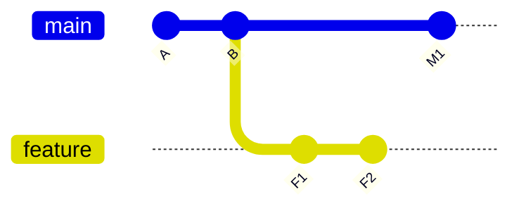
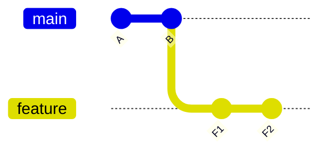
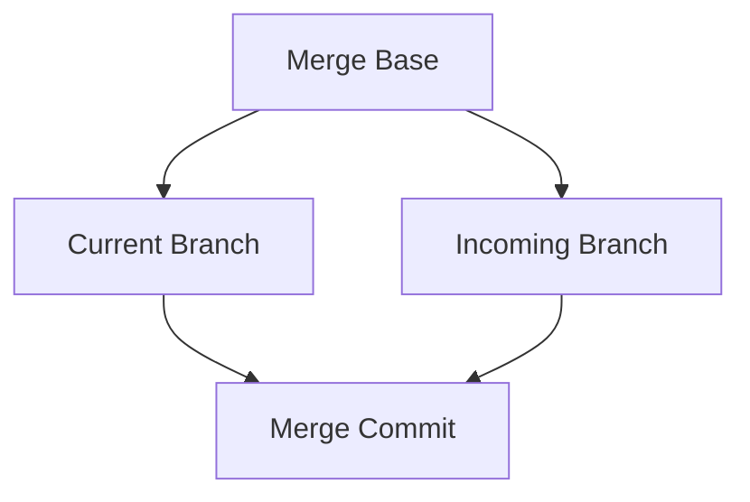
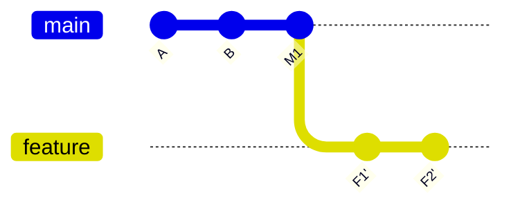

# Part 016 — Merge, Rebase, and Conflict Resolution

> Fokus part ini: memahami merge, rebase, dan conflict resolution sebagai operasi terhadap commit graph. Tujuannya bukan sekadar “menghilangkan conflict marker”, tetapi menjaga correctness, auditability, release traceability, dan shared history safety.

Conflict resolution yang buruk sering menghasilkan bug yang lebih berbahaya daripada conflict itu sendiri:

- perubahan reviewer hilang;
- test tetap hijau tetapi behavior salah;
- dependency version kembali ke versi lama;
- migration order rusak;
- API contract berubah diam-diam;
- event schema compatibility hilang;
- generated file tidak sinkron;
- shared branch history rusak karena force push salah;
- hotfix/release branch kehilangan commit penting.

Senior engineer harus memahami apa yang terjadi pada graph, bukan hanya mengikuti instruksi Git secara mekanis.

---

## 1. Merge/Rebase Mental Model

Git history adalah graph. Merge dan rebase adalah dua cara berbeda untuk mengintegrasikan perubahan.

Awal:



Ada dua branch:

- `main` punya commit `M1` setelah `B`;
- `feature` punya commit `F1`, `F2` setelah `B`.

Masalahnya: bagaimana membawa `F1/F2` ke atas `main` terbaru?

Dua pendekatan:

1. Merge: buat commit baru yang menggabungkan dua parent.
2. Rebase: replay commit feature di atas base baru.

Keduanya valid. Yang salah adalah memakai salah satu tanpa memahami konsekuensinya.

---

## 2. Fast-Forward Merge

Fast-forward merge terjadi ketika target branch belum punya commit baru sejak branch dibuat.

Sebelum:



Jika `main` masih di `B`, merge feature ke main cukup menggerakkan pointer `main` ke `F2`.

Command:

```bash
git switch main
git merge --ff-only feature/quote-validation
```

`--ff-only` berguna karena gagal jika merge butuh merge commit.

Manfaat:

- history linear;
- tidak ada merge commit tambahan;
- mudah dibaca;
- cocok untuk branch pendek.

Failure mode:

- developer mengira merge terjadi, padahal hanya pointer move;
- jika policy butuh merge commit audit, fast-forward mungkin tidak sesuai;
- jika branch sudah diverge, `--ff-only` gagal.

Senior usage:

```bash
git pull --ff-only
```

Gunakan ini untuk menghindari merge commit tidak sengaja saat update local main.

---

## 3. Three-Way Merge

Three-way merge menggunakan tiga input:

- merge base;
- current branch tip;
- branch yang digabungkan.



Command:

```bash
git switch main
git merge feature/quote-validation
```

Jika tidak conflict, Git membuat merge commit atau fast-forward tergantung graph dan option.

Merge commit punya dua parent:

```bash
git show --summary --pretty=raw <merge-commit-sha>
```

Manfaat merge commit:

- mempertahankan struktur branch;
- menunjukkan integration point;
- tidak rewrite commit feature;
- aman untuk shared branches.

Risiko:

- history lebih ramai;
- merge commit noisy jika terlalu sering;
- conflict resolution tersembunyi dalam merge commit;
- sulit bisect jika merge commit mengandung resolution bug.

Gunakan merge jika:

- branch sudah shared;
- release branch perlu mempertahankan histori;
- tim melarang rebase public branch;
- integration point penting untuk audit;
- perubahan besar perlu konteks branch.

---

## 4. Rebase

Rebase memindahkan base branch dengan cara replay commit.

Sebelum:


Setelah `git rebase main` dari branch feature:



Command:

```bash
git fetch origin
git switch feature/quote-validation
git rebase origin/main
```

Penting: commit `F1'` dan `F2'` bukan commit yang sama dengan `F1` dan `F2`. Hash berubah karena parent berubah.

Manfaat:

- history linear;
- PR lebih mudah dibaca;
- conflict diselesaikan per commit;
- bisect bisa lebih bersih;
- branch terlihat seolah dibuat dari main terbaru.

Risiko:

- rewrite history;
- berbahaya untuk branch shared;
- conflict bisa muncul berulang;
- commit hash berubah;
- force push mungkin diperlukan untuk remote PR branch.

Senior rule:

> Rebase private branch boleh. Rebase public/shared branch harus dianggap berisiko kecuali policy tim jelas mengizinkan.

---

## 5. Interactive Rebase

Interactive rebase dipakai untuk merapikan commit sebelum PR atau sebelum merge.

Command:

```bash
git rebase -i origin/main
```

Contoh todo list:

```text
pick abc1234 Add quote validation service
pick def5678 Add validation tests
pick 111aaaa fix typo
pick 222bbbb remove debug log
```

Bisa dirapikan menjadi:

```text
pick abc1234 Add quote validation service
fixup def5678 Add validation tests
fixup 111aaaa fix typo
fixup 222bbbb remove debug log
```

Action umum:

| Action | Fungsi |
|---|---|
| `pick` | pakai commit |
| `reword` | ubah commit message |
| `edit` | berhenti untuk ubah commit |
| `squash` | gabung commit dan edit message |
| `fixup` | gabung commit, buang message |
| `drop` | buang commit |

Gunakan interactive rebase untuk:

- menghapus WIP commit;
- memperbaiki commit message;
- squash typo/debug commit;
- reorder commit agar logis;
- memisahkan perubahan dengan `edit`.

Jangan gunakan sembarangan untuk:

- branch yang dipakai orang lain;
- release branch;
- hotfix branch shared;
- commit yang sudah menjadi base branch orang lain.

Internal verification checklist:

- Apakah tim mengizinkan force push ke PR branch?
- Apakah PR review dilakukan commit-by-commit?
- Apakah squash merge membuat interactive rebase kurang diperlukan?
- Apakah branch protection membatasi rewrite?

---

## 6. Squash Merge

Squash merge menggabungkan seluruh perubahan PR menjadi satu commit di target branch.

Di GitHub, squash merge biasanya menghasilkan:

- satu commit baru di target branch;
- commit message dari PR title/body atau hasil edit;
- commit detail feature branch tidak masuk mainline sebagai commit terpisah;
- PR tetap menjadi audit trail diskusi.

Manfaat:

- mainline rapi;
- revert satu PR mudah;
- WIP commit tidak mengotori mainline;
- cocok untuk PR kecil/menengah.

Risiko:

- commit detail hilang dari mainline;
- PR besar menjadi satu commit terlalu besar;
- bisect menemukan squash commit besar, bukan sub-step;
- co-authoring/attribution perlu diperhatikan;
- release note bergantung pada PR title/body.

Gunakan squash merge jika:

- PR mewakili satu logical change;
- branch berisi banyak WIP/fixup;
- tim memprioritaskan linear mainline;
- revert per PR diinginkan.

Hindari squash merge jika:

- PR berisi beberapa perubahan independen;
- commit bertahap penting untuk migration;
- reviewer butuh histori granular di mainline;
- hotfix/backport butuh cherry-pick commit tertentu.

Internal verification checklist:

- Merge strategy GitHub apa yang diizinkan?
- Apakah squash merge default?
- Apakah PR title wajib mengikuti changelog format?
- Apakah merge commit dilarang?
- Apakah rebase merge diizinkan?

---

## 7. Conflict Anatomy

Conflict terjadi ketika Git tidak bisa menggabungkan perubahan otomatis.

Contoh conflict marker:

```text
<<<<<<< HEAD
return Response.status(400).entity(error).build();
=======
return Response.status(422).entity(error).build();
>>>>>>> feature/quote-validation
```

Makna umum saat merge:

- `HEAD` = branch saat ini;
- bagian bawah = branch yang sedang digabungkan.

Tetapi saat rebase, interpretasi bisa membingungkan karena Git sedang replay commit.

Saat rebase:

- `ours` sering berarti branch base yang sedang direbase ke atasnya;
- `theirs` sering berarti commit yang sedang di-replay;
- jangan mengandalkan intuisi nama tanpa cek konteks.

Gunakan command untuk melihat state:

```bash
git status
git diff
git diff --ours
git diff --theirs
git diff --base
```

Cek file conflict:

```bash
git diff --name-only --diff-filter=U
```

Senior rule:

> Conflict marker adalah titik awal investigasi, bukan bagian yang asal dipilih salah satu.

---

## 8. Conflict Resolution Workflow

Workflow aman:

```bash
git status --short
git diff --name-only --diff-filter=U
```

Untuk setiap file conflict:

1. pahami tujuan perubahan kedua sisi;
2. baca context sekitar file;
3. cek commit yang mengubah file;
4. tentukan hasil final yang benar secara domain;
5. edit file manual;
6. jalankan test relevan;
7. stage file resolved;
8. lanjutkan merge/rebase.

Saat merge:

```bash
git add <resolved-file>
git commit
```

Saat rebase:

```bash
git add <resolved-file>
git rebase --continue
```

Abort jika salah arah:

```bash
git merge --abort
git rebase --abort
```

Cek commit yang menyebabkan conflict:

```bash
git log --oneline --decorate --graph --all -- <file>
git blame <file>
```

Untuk conflict kompleks, bandingkan tiga versi:

```bash
git show :1:<file>   # base
git show :2:<file>   # ours
git show :3:<file>   # theirs
```

Catatan: `:1:`, `:2:`, `:3:` adalah index stages saat conflict.

---

## 9. Ours and Theirs

Command yang sering digunakan tetapi rawan salah:

```bash
git checkout --ours <file>
git checkout --theirs <file>
```

Atau versi modern:

```bash
git restore --source=HEAD -- <file>
```

Masalahnya: `ours` dan `theirs` berubah makna praktis tergantung merge/rebase state.

Jangan gunakan `--ours` atau `--theirs` untuk file penting tanpa memahami:

- branch saat ini;
- operasi sedang merge atau rebase;
- file berisi domain logic atau generated output;
- apakah kedua sisi punya perubahan valid yang harus digabung manual.

Aman untuk memilih satu sisi jika:

- file generated dan bisa diregenerate;
- lockfile/version file memang harus satu sisi;
- file dokumentasi conflict trivial;
- reviewer paham alasan memilih sisi tersebut.

Tidak aman jika:

- file Java domain logic;
- API contract;
- database migration;
- Maven POM dependency version;
- Kubernetes manifest;
- security config;
- CI workflow.

Senior rule:

> Untuk code dan config penting, conflict resolution biasanya bukan choose-one-side. Resolution yang benar sering merupakan sintesis.

---

## 10. Java/JAX-RS Conflict Patterns

Conflict pada backend Java/JAX-RS sering muncul di area berikut:

- resource class;
- service class;
- DTO/model;
- exception mapper;
- validation rule;
- dependency injection config;
- integration client;
- test class;
- `pom.xml`;
- OpenAPI spec;
- migration file;
- config YAML/properties.

### Resource method conflict

Risiko:

- status code berubah;
- header hilang;
- validation hilang;
- auth check hilang;
- response model tidak sesuai contract.

Resolution checklist:

- cek endpoint method/path;
- cek request/response DTO;
- cek status code strategy;
- cek exception mapping;
- jalankan API/contract test;
- buat curl repro jika perlu.

### DTO conflict

Risiko:

- field rename breaking;
- JSON serialization berubah;
- validation annotation hilang;
- backward compatibility rusak.

Resolution checklist:

- cek Jackson/Jakarta validation annotation;
- cek nullability/default;
- cek client compatibility;
- cek snapshot/contract test.

### Test conflict

Risiko:

- test lama dihapus padahal masih valid;
- assertion melemah;
- fixture salah;
- flaky workaround masuk.

Resolution checklist:

- jangan asal accept one side;
- jalankan test class terkait;
- pastikan test mencakup behavior final;
- hapus duplicate test hanya jika overlap jelas.

---

## 11. Maven POM Conflict Patterns

`pom.xml` conflict harus sangat hati-hati karena bisa memengaruhi build, classpath, security, dan runtime.

Conflict umum:

- dependency version;
- dependency scope;
- exclusion;
- plugin version;
- parent version;
- BOM import;
- module list;
- profile;
- surefire/failsafe config;
- enforcer rule.

Jangan resolve POM conflict hanya dengan memilih sisi terbaru.

Command investigasi:

```bash
git diff -- pom.xml
mvn -q help:effective-pom
mvn -q dependency:tree
mvn -q dependency:tree -Dincludes=org.glassfish.jersey
mvn -q -DskipTests package
mvn -q test
```

Jika conflict dependency:

- cek apakah versi dikelola parent/BOM;
- cek dependency tree sebelum/sesudah;
- cek scope;
- cek exclusion;
- cek convergence;
- cek CVE/security scanner jika upgrade dependency.

Jika conflict module list:

- pastikan module baru tidak hilang;
- pastikan build reactor order benar;
- jalankan build dari root.

Internal verification checklist:

- Apakah dependency version boleh didefinisikan di child POM?
- Apakah parent POM/BOM internal mengatur version?
- Apakah enforcer dependency convergence aktif?
- Apakah ada dependency review requirement?

---

## 12. Database Migration Conflict Patterns

Database migration conflict berbahaya karena ordering dan immutability penting.

Contoh risiko:

- dua migration memakai nomor sama;
- migration lama diedit setelah pernah apply;
- migration order berubah;
- rollback script tidak sesuai;
- code deploy dan schema deploy tidak kompatibel.

Resolution checklist:

- jangan edit migration yang sudah pernah dirilis kecuali policy mengizinkan;
- buat migration baru jika perlu;
- cek ordering convention;
- cek expand/contract migration;
- cek compatibility dengan versi app lama dan baru;
- jalankan migration test jika ada;
- koordinasi dengan DBA/platform jika production impact.

Command umum tergantung tool internal, tetapi Git-side check bisa:

```bash
git diff --name-status origin/main...HEAD | grep -i migration || true
git log --oneline -- path/to/migrations
```

Internal verification checklist:

- Migration tool apa yang dipakai: Flyway, Liquibase, internal, atau lain?
- Naming/ordering convention apa?
- Apakah migration immutable setelah merge?
- Apakah rollback migration diwajibkan?
- Apakah release pipeline menjalankan migration otomatis?

---

## 13. Event Schema and Messaging Conflict Patterns

Untuk Kafka/RabbitMQ, conflict bisa terjadi di schema, routing key, topic name, exchange binding, event payload, atau consumer behavior.

Risiko:

- producer mengirim field baru yang consumer lama tidak paham;
- consumer menghapus handling event lama;
- routing key berubah;
- topic/exchange config drift;
- retry/dead-letter behavior berubah;
- idempotency logic hilang.

Resolution checklist:

- cek compatibility event;
- cek additive vs breaking change;
- cek consumer lama;
- cek serialization/deserialization behavior;
- cek idempotency key;
- cek retry/DLQ config;
- cek observability event failure.

Internal verification checklist:

- Apakah ada schema registry?
- Apakah event contract dites?
- Apakah topic/routing config ada di code, config, atau platform?
- Apakah breaking event change punya migration plan?

---

## 14. GitHub PR Merge Strategies

GitHub biasanya menyediakan beberapa strategy:

- merge commit;
- squash merge;
- rebase merge.

### Merge commit

Membuat merge commit di target branch.

Kelebihan:

- mempertahankan branch context;
- tidak rewrite commit PR;
- cocok untuk PR dengan commit meaningful.

Risiko:

- graph ramai;
- merge commits banyak;
- revert bisa butuh `-m` untuk merge commit.

### Squash merge

Satu commit per PR.

Kelebihan:

- mainline rapi;
- revert PR mudah;
- cocok jika PR kecil.

Risiko:

- detail commit hilang dari mainline;
- PR besar menjadi commit besar.

### Rebase merge

Commit PR direplay ke target branch tanpa merge commit.

Kelebihan:

- linear history;
- commit detail dipertahankan.

Risiko:

- commit hash berubah;
- conflict/verification harus hati-hati;
- commit granular buruk akan tetap masuk mainline.

Internal verification checklist:

- Strategy mana yang enabled?
- Strategy mana yang default?
- Apakah branch protection mewajibkan linear history?
- Apakah squash title/body digunakan untuk changelog?
- Apakah merge queue digunakan?

---

## 15. Avoiding History Damage

History damage terjadi ketika operasi Git mengubah shared history tanpa koordinasi.

Command rawan:

```bash
git push --force
git reset --hard origin/main
git rebase origin/main
git filter-branch
git tag -f
git push --delete origin <branch>
```

Lebih aman:

```bash
git push --force-with-lease
```

`--force-with-lease` menolak push jika remote berubah sejak local terakhir tahu. Ini tidak membuat force push aman secara universal, tetapi mengurangi risiko overwrite kerja orang lain.

Sebelum rewrite PR branch:

```bash
git fetch origin
git status --short --branch
git branch -vv
git log --oneline --left-right --cherry-pick HEAD...@{u}
```

Jangan rewrite:

- `main`;
- release branch shared;
- hotfix branch aktif;
- branch orang lain;
- branch yang menjadi base PR lain;
- branch yang sudah dipakai CI/release artifact.

Recovery jika salah force push:

```bash
git reflog
git log --oneline --decorate --all
git fsck --lost-found
```

Tetapi recovery bukan alasan untuk ceroboh.

---

## 16. Rerere Awareness

`rerere` berarti reuse recorded resolution. Git bisa mengingat cara conflict diselesaikan dan menerapkannya lagi saat conflict sama muncul.

Enable:

```bash
git config --global rerere.enabled true
```

Manfaat:

- membantu branch panjang dengan conflict berulang;
- berguna saat rebase besar;
- mengurangi kerja manual berulang.

Risiko:

- resolution lama bisa salah jika context berubah;
- developer bisa terlalu percaya otomatisasi;
- perlu tetap review diff setelah resolution.

Command terkait:

```bash
git rerere status
git rerere diff
```

Senior rule:

> Rerere membantu mengulang resolution, bukan menggantikan review correctness.

Internal verification checklist:

- Apakah tim merekomendasikan rerere?
- Apakah conflict berulang sering terjadi?
- Apakah ada tooling merge khusus?
- Apakah generated files menyebabkan conflict berulang?

---

## 17. Generated Files and Conflict Resolution

Generated file sering menjadi sumber conflict noisy.

Contoh:

- OpenAPI generated code;
- protobuf/generated schema classes;
- client SDK generated;
- lockfile;
- build metadata;
- minified output;
- generated documentation.

Decision checklist:

- Apakah generated file seharusnya masuk Git?
- Apa source of truth-nya?
- Apakah file bisa diregenerate deterministic?
- Apakah CI memvalidasi generated output up to date?
- Apakah conflict sebaiknya diselesaikan dengan regenerate, bukan manual edit?

Workflow umum:

```bash
# resolve source file first
# regenerate generated output with documented command
mvn -q generate-sources
# or internal script, if verified
./scripts/generate-api-client.sh

git diff
git add <source-file> <generated-file>
```

Internal verification checklist:

- Generated files mana yang committed?
- Command regenerate apa yang resmi?
- Apakah generated output deterministic?
- Apakah generated diff direview manual?
- Apakah CI gagal jika generated files stale?

---

## 18. Conflict Detection Before It Gets Expensive

Jangan menunggu PR besar selesai untuk tahu conflict.

Command deteksi:

```bash
git fetch origin
git switch feature/quote-validation
git status --short --branch
git log --oneline --left-right --cherry-pick HEAD...origin/main
git diff --name-only origin/main...HEAD
```

Cek file yang juga berubah di main:

```bash
git diff --name-only origin/main...HEAD > /tmp/my-files.txt
git diff --name-only HEAD...origin/main > /tmp/main-files.txt
comm -12 <(sort /tmp/my-files.txt) <(sort /tmp/main-files.txt)
```

Catatan: process substitution butuh Bash.

Praktik sehat:

- sync branch sering;
- pecah PR besar;
- hindari formatting massal saat feature besar aktif;
- koordinasi jika menyentuh POM/migration/schema bersama;
- buka draft PR lebih awal untuk visibility.

---

## 19. Debugging a Bad Merge

Gejala bad merge:

- test gagal setelah merge padahal masing-masing branch hijau;
- behavior lama hilang;
- dependency version berubah tidak sengaja;
- config key hilang;
- endpoint status code salah;
- deployment gagal setelah PR merge;
- incident terjadi tepat setelah merge.

Investigasi:

```bash
git log --oneline --decorate --graph --all -50
git show <merge-commit-sha>
git show --cc <merge-commit-sha>
git diff <parent1> <merge-commit-sha>
git diff <parent2> <merge-commit-sha>
```

Untuk merge commit, parent bisa dilihat:

```bash
git show --pretty=raw --no-patch <merge-commit-sha>
```

Jika squash merge, investigasi PR:

- cek PR diff;
- cek commit sebelum squash;
- cek review comments;
- cek CI run;
- cek final merge commit.

Recovery options:

- revert merge/squash commit;
- follow-up fix;
- hotfix branch;
- rollback deployment;
- restore lost logic dari parent/PR branch jika masih ada.

Senior rule:

> Bad merge harus dianalisis sebagai integration bug, bukan sekadar “Git conflict selesai”.

---

## 20. Revert vs Reset after Merge Problems

Untuk shared branch, gunakan revert.

Revert normal commit:

```bash
git revert <commit-sha>
```

Revert merge commit butuh parent mainline:

```bash
git revert -m 1 <merge-commit-sha>
```

`-m 1` biasanya berarti parent pertama sebagai mainline, tetapi harus diverifikasi.

Reset:

```bash
git reset --hard <commit-sha>
```

Reset menggerakkan branch pointer dan berbahaya untuk shared branch jika dipush.

Gunakan reset untuk:

- local private cleanup;
- branch pribadi sebelum push;
- disposable worktree.

Gunakan revert untuk:

- mainline;
- release branch;
- branch yang sudah dipakai orang lain;
- commit yang sudah menjadi source artifact/release.

Internal verification checklist:

- Apakah revert PR butuh approval?
- Apakah rollback deployment lebih dulu atau revert code lebih dulu?
- Apakah merge commit revert diizinkan?
- Apakah release branch punya special handling?

---

## 21. Merge/Rebase Impact on CI/CD and Release

Merge/rebase mengubah commit SHA dan graph, sehingga memengaruhi CI/CD.

Impact:

- CI status terkait commit SHA tertentu;
- rebase mengubah SHA sehingga checks harus rerun;
- artifact build dari SHA lama tidak sama dengan SHA baru;
- image tag berbasis SHA berubah;
- release note berbasis commit range berubah;
- GitOps manifest mungkin menunjuk SHA/image lama;
- signed commit verification bisa berubah setelah rebase.

Failure mode:

- PR hijau sebelum rebase, merah setelah rebase;
- artifact dari pre-rebase SHA dipakai salah;
- branch protection menolak karena checks stale;
- release tag dibuat dari commit sebelum final merge;
- changelog commit range salah.

Senior checklist sebelum release merge:

```bash
git fetch origin
git status --short --branch
git log --oneline --decorate --graph origin/main..HEAD
git diff --stat origin/main...HEAD
mvn -q verify
```

Internal verification checklist:

- Apakah checks rerun setelah rebase?
- Apakah merge queue digunakan?
- Apakah artifact dibuat sebelum atau sesudah merge?
- Apakah release tag dibuat oleh pipeline?
- Apakah image tag memakai commit SHA?

---

## 22. Production-Safe Conflict Resolution

Untuk file dengan production impact, gunakan prinsip:

1. read both sides;
2. preserve intent;
3. validate behavior;
4. capture evidence;
5. ask owner jika domain unclear;
6. avoid broad unrelated changes;
7. run targeted and full checks as appropriate.

High-risk files:

- `pom.xml`;
- migration files;
- CI workflow;
- Kubernetes manifest;
- Helm values;
- security config;
- auth/permission code;
- API resource/DTO;
- event schema;
- retry/DLQ config;
- Dockerfile/base image;
- release scripts.

Conflict resolution evidence in PR:

```text
Conflict resolution notes:
- Preserved new customerId validation from this branch.
- Preserved updated 422 status mapping from main.
- Regenerated OpenAPI output using ./scripts/generate-openapi.sh.
- Ran mvn -q -pl quote-api -am test.
```

Ini membantu reviewer fokus pada hasil final, bukan hanya marker yang hilang.

---

## 23. Correctness, Productivity, Security, Reproducibility, Release, and Incident Concerns

### Correctness concern

- Conflict resolution harus mempertahankan intent kedua sisi jika keduanya valid.
- POM/migration/API/event conflict perlu validation tambahan.
- `ours/theirs` tidak boleh digunakan membabi buta.
- Test harus membuktikan behavior final, bukan hanya compile.

### Productivity concern

- Branch pendek mengurangi conflict.
- PR kecil mengurangi merge pain.
- Formatting massal memperbesar conflict.
- Draft PR membantu koordinasi lebih awal.

### Security concern

- Conflict pada security config/auth code harus high scrutiny.
- Secret/config local bisa muncul saat conflict manual.
- Workflow permission conflict bisa membuka privilege.
- Dependency conflict bisa downgrade security fix.

### Reproducibility concern

- Rebase mengubah commit SHA.
- Generated files harus deterministic.
- Build after conflict harus dijalankan ulang.
- Artifact harus dibuat dari final commit.

### Release concern

- Release branch conflict harus diselesaikan konservatif.
- Hotfix conflict harus minimal.
- Tag harus dibuat setelah final merge/resolution.
- Changelog harus sesuai final graph.

### Observability/incident-support concern

- Conflict resolution commit bisa menjadi source regression.
- Merge commit perlu dianalisis saat incident.
- PR notes harus menjelaskan resolution high-risk.
- Deployment harus traceable ke final SHA.

---

## 24. Senior PR Review Checklist for Merge/Rebase/Conflict

### Graph and strategy

- Apakah branch up to date dengan target?
- Apakah merge/rebase strategy sesuai policy?
- Apakah commit hash/checks final sudah valid?
- Apakah PR terlalu besar sehingga conflict risk tinggi?

### Conflict resolution

- Apakah file conflict high-risk?
- Apakah resolution mempertahankan intent kedua sisi?
- Apakah ada generated file yang perlu regenerate?
- Apakah POM/dependency conflict dicek dengan dependency tree?
- Apakah migration conflict dicek ordering/immutability?

### Java/JAX-RS behavior

- Apakah resource/DTO/exception mapper final benar?
- Apakah status code/header/body tidak berubah tanpa sengaja?
- Apakah validation/auth behavior tetap benar?
- Apakah test contract/regression ada?

### CI/CD and release

- Apakah checks rerun setelah rebase/resolution?
- Apakah artifact dibuat dari final commit?
- Apakah image/tag/release note sesuai final SHA?
- Apakah rollback/revert path masih jelas?

### Security

- Apakah dependency conflict tidak downgrade security fix?
- Apakah workflow permission conflict aman?
- Apakah secret tidak muncul saat resolution?
- Apakah auth/security config direview owner?

---

## 25. Internal Verification Checklist

Untuk konteks CSG/team, verifikasi hal berikut:

### Merge strategy

- Merge strategy apa yang diizinkan di GitHub?
- Apakah squash merge default?
- Apakah merge commit diperbolehkan?
- Apakah rebase merge diperbolehkan?
- Apakah linear history diwajibkan?

### Rebase policy

- Apakah developer dianjurkan rebase branch PR?
- Apakah force push ke PR branch diizinkan?
- Apakah `--force-with-lease` menjadi standard?
- Apakah branch shared boleh direbase?
- Apakah merge queue digunakan?

### Conflict handling

- Apakah ada guideline conflict untuk POM, migration, OpenAPI, generated file?
- Apakah ada owner wajib untuk conflict pada API/event/schema/security?
- Apakah conflict resolution notes di PR diharapkan?
- Apakah generated files harus diregenerate dengan script internal?

### Release/hotfix

- Bagaimana conflict di release branch ditangani?
- Apakah hotfix conflict harus approval khusus?
- Apakah fix di release branch wajib forward-port ke main?
- Bagaimana revert merge commit dilakukan?

### CI/CD

- Apakah checks otomatis rerun setelah rebase?
- Apakah stale approvals dismissed setelah branch update?
- Apakah artifact build hanya dari merged commit?
- Apakah deployment event menampilkan final commit SHA?

---

## 26. Practical Command Reference

### Update local main safely

```bash
git fetch origin
git switch main
git pull --ff-only
```

### Rebase private feature branch

```bash
git fetch origin
git switch feature/quote-validation
git rebase origin/main
```

### Continue/abort rebase

```bash
git status
git add <resolved-file>
git rebase --continue

git rebase --abort
```

### Merge target into feature branch

```bash
git fetch origin
git switch feature/quote-validation
git merge origin/main
```

### Abort merge

```bash
git merge --abort
```

### List unresolved files

```bash
git diff --name-only --diff-filter=U
```

### Inspect conflict stages

```bash
git show :1:<file>   # base
git show :2:<file>   # ours
git show :3:<file>   # theirs
```

### Show merge commit resolution

```bash
git show --cc <merge-commit-sha>
```

### Push rewritten private PR branch safely

```bash
git push --force-with-lease
```

### Revert merge commit carefully

```bash
git show --pretty=raw --no-patch <merge-commit-sha>
git revert -m 1 <merge-commit-sha>
```

---

## 27. Final Mental Model

Merge dan rebase bukan command kosmetik. Keduanya membentuk sejarah perubahan, memengaruhi CI/CD, menentukan artifact lineage, dan bisa membantu atau merusak incident investigation.

Gunakan prinsip berikut:

- merge mempertahankan graph dan aman untuk shared history;
- rebase membuat history linear tetapi rewrite commit;
- conflict resolution harus menjaga intent, bukan memilih sisi sembarangan;
- high-risk files butuh validation tambahan;
- final commit SHA adalah source of truth untuk build, artifact, image, deployment, dan release evidence;
- shared history harus diperlakukan sebagai audit trail.

Core principle:

> Conflict selesai bukan ketika marker hilang. Conflict selesai ketika behavior final benar, build/test valid, release impact jelas, dan history tetap aman untuk tim.
