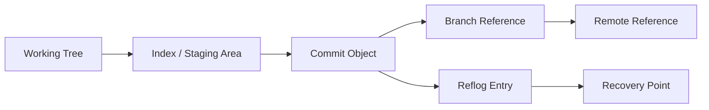
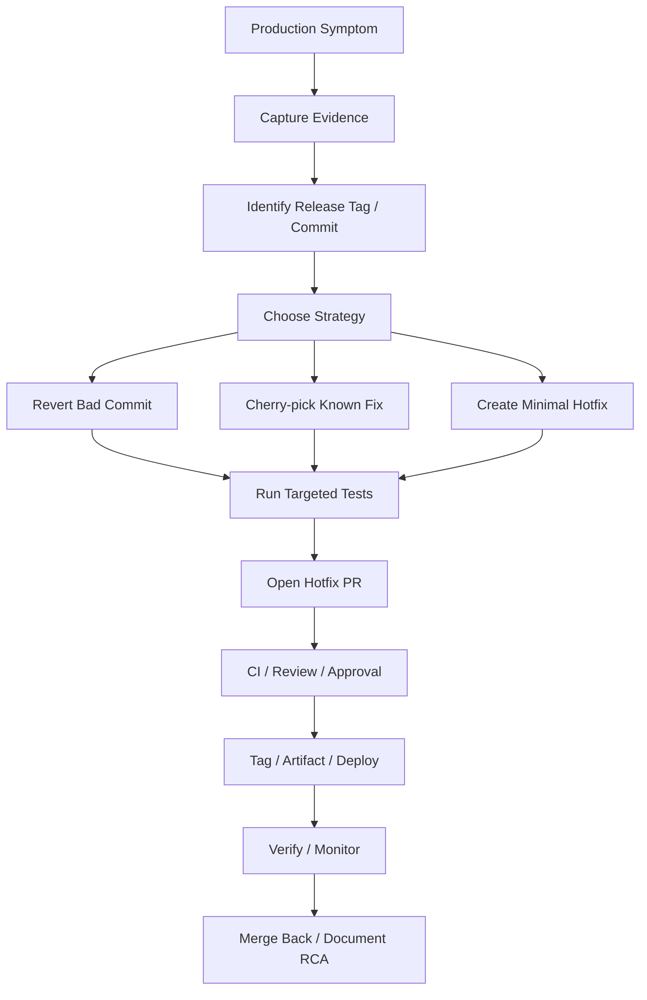
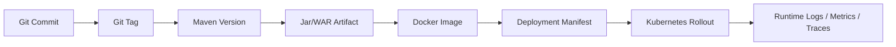

# Part 017 — Git Recovery and Forensics

> Fokus part ini: memakai Git sebagai alat recovery dan forensic investigation. Senior backend engineer harus bisa menyelamatkan commit yang hilang, membalik perubahan yang salah, menemukan commit penyebab regression, membaca histori secara evidential, dan memilih strategi recovery yang aman untuk shared branch, release branch, dan production hotfix.

Git recovery bukan hanya kemampuan “undo”. Git recovery adalah kemampuan menjaga integritas source history ketika ada kesalahan manusia, regression, conflict, release mistake, atau production incident.

Masalah yang sering muncul:

- commit lokal hilang setelah `reset` atau rebase;
- file penting terhapus atau berubah tanpa sengaja;
- branch diverged setelah rebase/pull yang salah;
- bad commit sudah masuk `main`;
- production perlu hotfix cepat dari commit tertentu;
- release branch perlu cherry-pick fix dari main;
- regression muncul tetapi commit penyebab tidak jelas;
- reviewer perlu tahu siapa mengubah invariant tertentu;
- rollback harus dilakukan tanpa merusak shared history;
- force push menghilangkan referensi commit dari remote branch.

Di sistem enterprise Java/JAX-RS, Git forensic berdampak langsung ke:

- API compatibility;
- database migration;
- event contract Kafka/RabbitMQ;
- dependency upgrade Maven;
- Docker image provenance;
- Kubernetes deployment traceability;
- CI/CD rollback;
- incident RCA.

---

## 1. Mental Model: Git Hampir Selalu Menyimpan Jejak

Git adalah object database. Selama object commit belum benar-benar dihapus oleh garbage collection, banyak perubahan yang terlihat “hilang” sebenarnya masih bisa ditemukan.



Konsep penting:

| Konsep | Fungsi forensic |
|---|---|
| Commit object | Snapshot perubahan yang bisa dipulihkan |
| Branch ref | Pointer bernama ke commit tertentu |
| HEAD | Pointer ke posisi kerja saat ini |
| Reflog | Catatan pergerakan HEAD dan branch lokal |
| Remote ref | Referensi posisi branch di remote terakhir fetch |
| Tag | Anchor release/hotfix yang seharusnya stabil |
| Stash | Penyimpanan sementara berbasis commit internal |
| Index | Area staging yang bisa berbeda dari working tree |

Prinsip recovery:

- jangan panik dan jangan menjalankan command destruktif lanjutan;
- capture state dulu sebelum memperbaiki;
- cari commit reference dengan `reflog`, `log`, `fsck`, atau remote ref;
- buat branch backup sebelum operasi besar;
- gunakan `revert` untuk shared/public history;
- gunakan `reset` hanya untuk local/private history atau setelah yakin;
- gunakan `cherry-pick` untuk membawa perubahan spesifik lintas branch;
- gunakan `bisect` untuk regression hunting yang sistematis.

---

## 2. First Rule of Git Recovery: Capture Current State

Sebelum melakukan recovery, senior engineer harus tahu posisi saat ini.

```bash
pwd
git status --short --branch
git branch --show-current
git rev-parse --show-toplevel
git rev-parse HEAD
git log --oneline --decorate --graph -20
git diff
git diff --staged
```

Untuk situasi risk tinggi, buat backup branch langsung:

```bash
git branch backup/recovery-$(date +%Y%m%d-%H%M%S)
```

Atau simpan patch:

```bash
git diff > /tmp/working-tree-before-recovery.patch
git diff --staged > /tmp/staged-before-recovery.patch
```

Kalau ada perubahan belum dicommit dan ingin diamankan:

```bash
git stash push -u -m "before recovery attempt"
```

Penjelasan opsi:

| Opsi | Arti |
|---|---|
| `-u` | ikut menyimpan untracked files |
| `-a` | ikut menyimpan ignored files, gunakan hati-hati |
| `-m` | memberi pesan stash agar mudah ditemukan |

Jangan langsung menjalankan:

```bash
git reset --hard
git clean -fd
git rebase --abort
git merge --abort
git push --force
```

Command di atas kadang benar, tetapi harus dipakai setelah state dipahami.

---

## 3. `reflog`: Black Box Recorder untuk Local Git

`reflog` mencatat pergerakan HEAD dan branch lokal.

```bash
git reflog
```

Contoh output:

```text
9f8a123 HEAD@{0}: reset: moving to HEAD~1
7a6b234 HEAD@{1}: commit: Add quote validation guard
3c2d345 HEAD@{2}: checkout: moving from main to feature/quote-validation
```

Makna:

- `HEAD@{0}` adalah posisi sekarang;
- `HEAD@{1}` adalah posisi sebelumnya;
- commit `7a6b234` mungkin commit yang “hilang” setelah reset;
- selama commit object masih ada, commit dapat dipulihkan.

Recovery commit dari reflog:

```bash
git branch recovery/quote-validation 7a6b234
```

Atau kembali ke posisi tertentu:

```bash
git switch -c recovery/before-reset HEAD@{1}
```

Melihat reflog branch tertentu:

```bash
git reflog show feature/quote-validation
```

Melihat detail commit:

```bash
git show 7a6b234
```

Prinsip senior:

- buat branch recovery dulu, jangan langsung reset balik;
- validasi diff commit sebelum merge/cherry-pick;
- jangan mengandalkan reflog untuk remote recovery karena reflog lokal tidak dibagikan ke semua orang;
- reflog bisa expire, jadi recovery harus dilakukan segera.

---

## 4. `reset`: Memindahkan Branch Pointer

`git reset` memindahkan branch pointer dan dapat memengaruhi index serta working tree.

| Mode | Branch pointer | Index | Working tree | Risiko |
|---|---|---|---|---|
| `--soft` | berubah | tetap berisi perubahan | tetap | relatif aman |
| `--mixed` default | berubah | reset | tetap | unstages changes |
| `--hard` | berubah | reset | reset | destruktif untuk local changes |

Contoh:

```bash
git reset --soft HEAD~1
```

Gunanya:

- membatalkan commit terakhir tetapi menjaga perubahan tetap staged;
- cocok jika commit message salah atau commit perlu dipecah.

```bash
git reset HEAD~1
```

Gunanya:

- membatalkan commit terakhir;
- perubahan kembali ke working tree, tidak staged.

```bash
git reset --hard HEAD~1
```

Gunanya:

- membuang commit terakhir dan working tree changes;
- hanya aman untuk local/private branch atau setelah backup.

Anti-pattern:

```bash
git reset --hard origin/main
```

Ini sering digunakan untuk “bersihkan branch”, tetapi bisa membuang perubahan lokal. Sebelum menjalankan:

```bash
git status --short
git log --oneline --decorate --graph --left-right HEAD...origin/main
git branch backup/before-hard-reset
```

Untuk shared branch, `reset` biasanya salah. Gunakan `revert`.

---

## 5. `revert`: Membuat Commit Pembalik yang Aman untuk Shared History

`git revert` tidak menghapus histori. Ia membuat commit baru yang membalik perubahan commit sebelumnya.

```bash
git revert <commit>
```

Contoh:

```bash
git revert 7a6b234
```

Untuk beberapa commit:

```bash
git revert --no-commit abc123 def456 ghi789
git commit -m "Revert quote validation changes causing production failure"
```

Kapan pakai revert:

- bad commit sudah masuk `main`;
- commit sudah dipull oleh orang lain;
- release branch butuh membatalkan perubahan dengan audit trail;
- production hotfix perlu cepat dan traceable;
- branch dilindungi branch protection;
- ingin preserve histori untuk RCA.

Kapan revert sulit:

- commit terlalu besar dan mencampur banyak perubahan;
- commit sudah diikuti commit lain yang bergantung padanya;
- revert terhadap merge commit butuh `-m`;
- revert database migration tidak selalu aman;
- revert event schema/API contract bisa butuh compatibility handling.

Revert merge commit:

```bash
git revert -m 1 <merge-commit>
```

`-m 1` memilih parent utama. Ini harus dipahami benar. Jangan revert merge commit besar tanpa melihat graph:

```bash
git show --summary <merge-commit>
git log --oneline --graph --decorate --parents -20
```

---

## 6. Revert vs Reset

| Situasi | Pilihan umum | Alasan |
|---|---|---|
| Commit belum dipush | `reset` atau interactive rebase | private history masih aman dirapikan |
| Commit sudah dipush ke feature branch pribadi | `reset` + `push --force-with-lease` jika policy mengizinkan | masih relatif private, tetapi perlu hati-hati |
| Commit sudah masuk shared branch | `revert` | tidak merusak histori orang lain |
| Commit sudah masuk release branch | `revert` | audit trail dan release traceability |
| Production regression | `revert` atau hotfix commit | aman untuk governance dan RCA |
| Salah commit message lokal | `commit --amend` | private history |
| Salah file staged | `restore --staged` | tidak perlu rewrite history |

Rule praktis:

> Reset mengubah masa lalu branch. Revert menambahkan masa depan yang membalik masa lalu.

Dalam enterprise workflow, `revert` lebih defensible untuk branch yang sudah menjadi dasar CI/CD, release, atau deployment.

---

## 7. Restore Old File Without Reverting Whole Commit

Kadang hanya satu file yang perlu dikembalikan dari commit lama.

Melihat file di commit lama:

```bash
git show <commit>:path/to/file
```

Mengembalikan file dari commit tertentu:

```bash
git restore --source <commit> -- path/to/file
```

Versi lama:

```bash
git checkout <commit> -- path/to/file
```

Contoh:

```bash
git restore --source origin/main -- pom.xml
```

Gunakan ketika:

- file config tidak sengaja berubah;
- dependency version perlu dikembalikan;
- generated file ikut tercommit;
- satu test fixture rusak;
- bagian kecil dari commit perlu diambil tanpa revert penuh.

Setelah restore:

```bash
git diff -- path/to/file
git add path/to/file
git commit -m "Restore Maven dependency alignment"
```

Checklist:

- validasi diff hanya file yang dimaksud;
- jalankan test terkait;
- pastikan tidak mengembalikan bug lama;
- jelaskan alasan restore di commit message.

---

## 8. `cherry-pick`: Membawa Commit Spesifik ke Branch Lain

`cherry-pick` mengambil patch dari commit tertentu dan menerapkannya ke branch saat ini sebagai commit baru.

```bash
git cherry-pick <commit>
```

Use case:

- backport fix dari `main` ke release branch;
- membawa hotfix dari release branch ke main;
- mengambil commit kecil dari branch eksperimen;
- memisahkan fix penting dari feature branch besar.

Contoh backport:

```bash
git switch release/2026.07
git pull --ff-only
git cherry-pick abc123
```

Jika conflict:

```bash
git status
git diff
# resolve conflict
git add <files>
git cherry-pick --continue
```

Abort:

```bash
git cherry-pick --abort
```

Cherry-pick tanpa commit langsung:

```bash
git cherry-pick --no-commit abc123
```

Gunanya:

- ingin menyesuaikan patch sebelum commit;
- ingin combine beberapa commit menjadi satu backport commit.

Risiko cherry-pick:

- commit dependency tidak ikut terbawa;
- patch compile tetapi behavior incomplete;
- backport melewati migration/config/event contract lain;
- duplicate fix muncul di histori;
- release branch menyimpang dari main.

Checklist cherry-pick senior:

- pahami commit dependency;
- baca `git show` commit target;
- jalankan test relevan di branch target;
- pastikan issue/release note mencatat backport;
- pastikan fix nanti tidak konflik saat merge balik.

---

## 9. `bisect`: Regression Hunting Berbasis Binary Search

`git bisect` mencari commit pertama yang memperkenalkan bug dengan binary search.

Flow dasar:

```bash
git bisect start
git bisect bad
git bisect good <known-good-commit>
```

Git akan checkout commit tengah. Jalankan test manual:

```bash
mvn -q -DskipITs test
```

Jika bug muncul:

```bash
git bisect bad
```

Jika bug tidak muncul:

```bash
git bisect good
```

Selesai:

```bash
git bisect reset
```

Kapan sangat berguna:

- regression tidak jelas setelah banyak PR;
- bug muncul di release tertentu;
- performance turun setelah rentang commit panjang;
- test existing tidak langsung menunjukkan commit penyebab;
- ingin evidence kuat sebelum menyalahkan perubahan tertentu.

Automated bisect:

```bash
git bisect start
git bisect bad
git bisect good v1.8.2
git bisect run ./scripts/reproduce-quote-bug.sh
```

Script bisect harus exit:

| Exit code | Arti |
|---|---|
| `0` | good |
| `1` sampai `127` kecuali `125` | bad |
| `125` | skip commit |

Contoh script:

```bash
#!/usr/bin/env bash
set -euo pipefail

mvn -q -DskipITs test -Dtest=QuoteValidationTest#rejectsExpiredPromotion
```

Jika test gagal karena compile error unrelated, bisa skip:

```bash
#!/usr/bin/env bash
set -uo pipefail

mvn -q -DskipITs test -Dtest=QuoteValidationTest#rejectsExpiredPromotion
status=$?

if [[ "$status" -eq 0 ]]; then
  exit 0
fi

# Kalau project tidak bisa compile pada commit lama tertentu,
# mungkin commit itu tidak valid untuk test saat ini.
if grep -q "Compilation failure" target/bisect.log 2>/dev/null; then
  exit 125
fi

exit 1
```

Catatan: automated bisect paling efektif jika test reproduksi kecil, deterministic, dan tidak tergantung external service tidak stabil.

---

## 10. `blame`: Melihat Histori Baris, Bukan Menyalahkan Orang

`git blame` menunjukkan commit terakhir yang mengubah setiap baris.

```bash
git blame path/to/file.java
```

Dengan range:

```bash
git blame -L 120,180 src/main/java/com/example/QuoteService.java
```

Dengan commit detail:

```bash
git show <commit>
```

Gunakan blame untuk:

- menemukan konteks perubahan invariant;
- melihat issue/PR asal perubahan;
- memahami kenapa guard clause ada;
- menemukan perubahan config atau dependency;
- investigasi regression.

Jangan gunakan blame untuk:

- mencari kambing hitam;
- mempermalukan developer;
- mengganti diskusi desain dengan tuduhan personal.

Untuk formatting-only commits, gunakan ignore revs:

```bash
git blame --ignore-revs-file .git-blame-ignore-revs path/to/file.java
```

Internal teams yang sering melakukan mass formatting sebaiknya punya `.git-blame-ignore-revs`.

---

## 11. `fsck` Awareness: Lost and Dangling Objects

Jika commit tidak muncul di reflog, kadang masih ada dangling object.

```bash
git fsck --lost-found
```

Atau:

```bash
git fsck --no-reflogs --lost-found
```

Output bisa berisi:

```text
dangling commit 7a6b234...
```

Lihat commit:

```bash
git show 7a6b234
```

Pulihkan:

```bash
git branch recovery/dangling-commit 7a6b234
```

Catatan:

- ini advanced recovery;
- tidak selalu berhasil;
- garbage collection bisa menghapus object unreachable;
- lebih baik gunakan reflog dan backup branch sedini mungkin.

---

## 12. Recovering Common Mistakes

### 12.1 Saya baru saja menghapus file tanpa sengaja

```bash
git status --short
git restore path/to/file
```

Jika sudah staged:

```bash
git restore --staged path/to/file
git restore path/to/file
```

### 12.2 Saya commit ke branch yang salah

```bash
git log --oneline -3
```

Buat branch di commit saat ini:

```bash
git switch -c feature/correct-branch
```

Kembali ke branch lama dan reset jika commit belum dipush:

```bash
git switch wrong-branch
git reset --hard HEAD~1
```

Jika commit sudah dipush ke shared branch, jangan reset. Gunakan revert.

### 12.3 Saya reset commit lokal dan commit hilang

```bash
git reflog
git branch recovery/lost-commit <commit-from-reflog>
```

### 12.4 Saya amend commit tetapi ingin versi sebelumnya

```bash
git reflog
git show HEAD@{1}
git branch recovery/before-amend HEAD@{1}
```

### 12.5 Saya melakukan rebase dan branch jadi kacau

Cari posisi sebelum rebase:

```bash
git reflog
```

Biasanya terlihat:

```text
HEAD@{5}: rebase (start): checkout main
HEAD@{8}: checkout: moving from main to feature/foo
```

Buat recovery branch:

```bash
git branch recovery/before-rebase HEAD@{8}
```

### 12.6 Saya ingin membatalkan merge yang belum selesai

```bash
git status
git merge --abort
```

Jika abort gagal, capture dulu:

```bash
git diff > /tmp/merge-conflict-state.patch
```

### 12.7 Saya ingin membatalkan rebase yang belum selesai

```bash
git status
git rebase --abort
```

### 12.8 Saya ingin menghapus untracked file hasil build

Lihat dulu:

```bash
git clean -nd
```

Eksekusi jika benar:

```bash
git clean -fd
```

Untuk ignored files:

```bash
git clean -ndx
```

Hati-hati: `-x` bisa menghapus file local config, cache, atau artifact yang belum dibackup.

---

## 13. Bad Commit Diagnosis

Sebelum menyimpulkan commit tertentu buruk, kumpulkan evidence.

Checklist:

```bash
git show --stat <commit>
git show <commit>
git log --oneline --decorate --graph --all --max-count=50
git branch --contains <commit>
git tag --contains <commit>
```

Pertanyaan forensic:

- commit masuk branch apa?
- commit masuk release tag apa?
- commit masuk artifact/image apa?
- apakah commit ini sudah deployed?
- apakah ada migration terkait?
- apakah ada config change di commit lain?
- apakah failure muncul hanya setelah deployment atau setelah traffic pattern tertentu?
- apakah ada dependency upgrade transitive?
- apakah ada event/API contract change?

Untuk melihat commit yang menyentuh file tertentu:

```bash
git log --oneline -- path/to/file
```

Untuk melihat perubahan fungsi/class tertentu secara kasar:

```bash
git log -p -- src/main/java/com/example/QuoteService.java
```

Untuk mencari string yang pernah ada di histori:

```bash
git log -S 'calculateQuoteTotal' -- src/main/java
```

Untuk mencari perubahan berdasarkan regex:

```bash
git log -G 'timeout|retry|circuit' -- src/main/java
```

`-S` mencari perubahan jumlah kemunculan string. `-G` mencari patch yang match regex.

---

## 14. Regression Hunting for Java/JAX-RS Services

Regression di service enterprise jarang hanya “unit test gagal”. Sering kali regression muncul sebagai:

- endpoint berubah status code;
- response schema berubah;
- header hilang;
- validation terlalu ketat atau terlalu longgar;
- database query berubah cardinality;
- event Kafka/RabbitMQ berubah payload;
- Redis key TTL berubah;
- retry behavior berubah;
- dependency upgrade mengubah runtime behavior;
- timeout muncul di environment tertentu.

Strategi regression hunting:

1. Definisikan symptom secara executable.
2. Cari known good version.
3. Cari known bad version.
4. Buat test/command reproduksi minimal.
5. Gunakan `bisect` jika rentang commit besar.
6. Validasi commit culprit dengan membaca diff.
7. Cek commit dependency dan PR context.
8. Pilih fix, revert, atau rollback.

Contoh reproduksi API:

```bash
curl -sS -D /tmp/headers.txt \
  -H 'Content-Type: application/json' \
  -H 'X-Correlation-Id: bisect-quote-validation' \
  -X POST http://localhost:8080/quotes \
  --data @/tmp/quote-request.json \
  -o /tmp/response.json

jq '.status,.errors' /tmp/response.json
```

Untuk automated bisect, bungkus command tersebut di script yang exit non-zero jika behavior salah.

---

## 15. Production Hotfix Recovery Workflow

Hotfix production membutuhkan speed dan discipline.



Hotfix decision matrix:

| Situation | Candidate action |
|---|---|
| Single bad commit, easy to revert | `git revert` |
| Fix already exists on main | `git cherry-pick` to release branch |
| Bad config only | config rollback via approved process |
| Migration caused issue | follow DB rollback/forward plan, not blind Git revert |
| Contract compatibility broken | compatibility hotfix, often not simple revert |
| Dependency upgrade caused runtime issue | revert dependency change or pin safe version |
| Container image wrong | redeploy previous known-good image if process allows |

Hotfix branch example:

```bash
git fetch --all --tags
git switch -c hotfix/quote-timeout-fix release/2026.07
# apply revert/cherry-pick/fix
mvn -q verify
git push -u origin hotfix/quote-timeout-fix
```

Senior concerns:

- minimal change;
- high confidence test;
- explicit rollback plan;
- clear release note;
- trace to incident/ticket;
- merge-forward/backport plan;
- no unrelated cleanup.

---

## 16. Force Push Safety

Kadang feature branch perlu rewrite history setelah rebase/squash.

Gunakan:

```bash
git push --force-with-lease
```

Bukan:

```bash
git push --force
```

`--force-with-lease` menolak push jika remote branch sudah berubah oleh orang lain sejak fetch terakhir.

Sebelum force-with-lease:

```bash
git fetch origin
git log --oneline --decorate --graph --left-right HEAD...origin/feature/foo
```

Gunakan force-with-lease hanya jika:

- branch milik sendiri atau tim setuju;
- belum menjadi basis kerja orang lain;
- policy repository mengizinkan;
- PR reviewer paham histori diubah;
- tidak dilakukan pada `main`, release branch, atau protected branch.

Internal verification penting:

- apakah force push disabled di branch tertentu?
- apakah branch protection melarang rewrite?
- apakah CI/release memakai branch tersebut sebagai source?

---

## 17. Remote Recovery

Jika remote branch berubah salah, beberapa sumber recovery:

- local reflog milik developer yang pernah punya commit;
- remote tracking branch di clone lain;
- CI checkout log/artifact;
- PR commit list;
- GitHub UI commit URL;
- release tag;
- fork atau mirror;
- deployment artifact metadata.

Command yang berguna:

```bash
git fetch origin
git branch -r --contains <commit>
git tag --contains <commit>
git ls-remote --heads origin
git ls-remote --tags origin
```

Jika commit hash diketahui:

```bash
git fetch origin <commit>
```

Tidak semua server mengizinkan fetch by SHA. Jika tidak bisa, cari ref yang masih menunjuk ke commit tersebut.

---

## 18. Forensics Across Git, Maven, Docker, and Kubernetes

Git commit hanya satu bagian dari chain.



Saat incident, tanyakan:

- commit apa yang sedang running?
- tag release apa?
- Maven version apa?
- artifact repository mana?
- image digest apa?
- manifest/Helm chart version apa?
- deployment time kapan?
- config berubah bersamaan?
- migration berjalan bersamaan?
- feature flag berubah bersamaan?

Git command tidak cukup jika artifact pipeline tidak menyimpan metadata. Senior engineer harus mendorong traceability dari commit sampai runtime.

---

## 19. Failure Modes

| Failure mode | Gejala | Deteksi | Recovery |
|---|---|---|---|
| Local commit lost after reset | commit tidak muncul di branch | `git reflog` | branch dari reflog |
| Bad commit on main | CI/prod regression | `git log`, PR, CI | `git revert` |
| Wrong branch commit | commit ada di branch salah | `git log --all` | branch baru + reset/revert |
| Rebase gone wrong | history berubah tidak sesuai | `git reflog` | recovery branch |
| Cherry-pick incomplete | compile/test/runtime fail | test + diff review | revert cherry-pick or add dependency commit |
| Conflict resolved wrong | behavior regression | tests, diff, blame | fix commit/revert |
| Force push overwrote work | commit hilang dari remote | reflog clone lain, PR refs | restore ref |
| Wrong release tag | artifact trace salah | compare tag/artifact | create corrected release process, do not silently retag |
| Bisect unreliable | culprit berubah-ubah | flaky repro | make deterministic test |

---

## 20. Correctness Concerns

Dalam recovery, correctness lebih penting dari sekadar “build green”.

Periksa:

- apakah revert membatalkan invariant yang benar?
- apakah cherry-pick membawa semua dependency commit?
- apakah conflict resolution mempertahankan domain rule?
- apakah file generated ikut berubah?
- apakah API/event contract tetap compatible?
- apakah database migration perlu forward fix, bukan revert?
- apakah dependency downgrade aman?
- apakah tag dan artifact tetap traceable?

Untuk Java/JAX-RS:

- jalankan unit test untuk domain rule;
- jalankan integration test endpoint;
- cek OpenAPI/contract jika ada;
- cek serialization/deserialization behavior;
- cek error status dan response body;
- cek retry/timeout logic;
- cek startup config.

---

## 21. Productivity Concerns

Git recovery yang buruk menghabiskan waktu tim.

Tanda workflow tidak produktif:

- developer sering kehilangan commit;
- branch hidup terlalu lama;
- conflict besar menjadi normal;
- PR terlalu besar untuk direview;
- rollback selalu manual dan panik;
- release tag tidak dipercaya;
- bisect sulit karena commit tidak atomic;
- local setup tidak bisa menjalankan test reproduksi.

Perbaikan produktivitas:

- commit kecil dan logis;
- PR kecil;
- branch sync rutin;
- script reproduksi bug;
- branch backup sebelum operasi risk tinggi;
- documented recovery playbook;
- `.git-blame-ignore-revs` untuk formatting;
- consistent tag/release convention.

---

## 22. Security Concerns

Git recovery bisa memperburuk security incident jika salah langkah.

Jika secret tercommit:

- jangan hanya `reset` atau hapus file;
- secret harus dianggap leaked;
- rotate credential;
- gunakan secret scanning/remediation process;
- rewrite history hanya dengan approval dan process jelas;
- audit clone/fork/artifact/log yang mungkin menyimpan secret.

Command untuk menemukan kemungkinan secret di history tidak cukup sebagai satu-satunya kontrol:

```bash
git log -S 'SECRET_KEY' --all
```

Security-sensitive recovery harus melibatkan security/platform sesuai policy internal.

---

## 23. Reproducibility Concerns

Recovery harus bisa diulang dan dijelaskan.

Catat:

- branch source;
- commit source;
- command yang dijalankan;
- test yang dijalankan;
- artifact yang dihasilkan;
- release tag/image digest;
- alasan revert/cherry-pick;
- evidence sebelum/sesudah.

Anti-pattern:

- “saya fix manual di branch release” tanpa commit jelas;
- retag release lama diam-diam;
- force push release branch;
- cherry-pick tanpa PR;
- tidak mencatat commit penyebab incident;
- tidak menghubungkan hotfix ke main.

---

## 24. Release Concerns

Release branch dan tag harus diperlakukan lebih ketat dari feature branch.

Untuk release branch:

- hindari rewrite history;
- gunakan PR untuk hotfix;
- gunakan `revert`/`cherry-pick` dengan evidence;
- pastikan release note jelas;
- pastikan tag dibuat dari commit yang benar;
- pastikan artifact publish sesuai tag;
- pastikan merge-back ke main atau forward fix.

Untuk tag:

- jangan menghapus/memindahkan tag release tanpa process resmi;
- gunakan annotated/signed tag jika policy meminta;
- simpan mapping tag → artifact → image → deployment.

---

## 25. Observability and Incident-Support Concerns

Git forensic harus terhubung ke runtime evidence.

Saat incident, kumpulkan:

- commit/tag deployed;
- deployment time;
- logs by correlation ID;
- metrics around deployment window;
- trace/error sample;
- config/migration/feature flag change;
- PR/release note;
- commit diff culprit candidate;
- command reproduksi.

Git saja tidak membuktikan causality. Git membantu membentuk hypothesis yang harus divalidasi dengan runtime evidence.

---

## 26. PR Review Checklist for Git Recovery Changes

Gunakan checklist ini saat mereview PR revert/hotfix/backport/recovery.

### Scope

- Apakah PR hanya melakukan recovery/hotfix yang dimaksud?
- Apakah ada cleanup/refactor tidak terkait?
- Apakah commit yang direvert/cherry-pick disebut jelas?
- Apakah issue/incident/release ticket dilink?

### Correctness

- Apakah revert membatalkan perubahan yang tepat?
- Apakah cherry-pick membawa dependency commit yang diperlukan?
- Apakah conflict resolution terlihat benar?
- Apakah API/event/database compatibility dicek?

### Build and Test

- Apakah targeted test dijalankan?
- Apakah integration/regression test relevan ada?
- Apakah CI green di branch target?
- Apakah test flaky dipisahkan dari signal utama?

### Release

- Apakah branch target benar?
- Apakah release note perlu diupdate?
- Apakah tag/artifact/image impact jelas?
- Apakah merge-back/forward plan ada?

### Security

- Apakah recovery melibatkan secret/security issue?
- Apakah credential rotation dibutuhkan?
- Apakah history rewrite dibutuhkan dan disetujui?

### Operations

- Apakah rollback/roll-forward plan jelas?
- Apakah evidence incident dilampirkan?
- Apakah monitoring/verifikasi pasca-deploy jelas?

---

## 27. Internal Verification Checklist

Hal yang harus diverifikasi di CSG/team, bukan diasumsikan:

### Git and Branch Policy

- Branch utama apa: `main`, `master`, `develop`, atau naming lain?
- Apakah release branch digunakan?
- Apakah hotfix branch punya naming convention?
- Apakah force push dilarang di branch tertentu?
- Apakah branch protection mencegah reset/rewrite?

### Revert and Hotfix Process

- Apakah bad commit di main harus direvert via PR?
- Siapa yang approve hotfix?
- Apakah hotfix harus masuk release branch dulu atau main dulu?
- Apakah ada merge-back/forward policy?
- Apakah release manager/platform/SRE perlu dilibatkan?

### Tag and Artifact Traceability

- Apakah Git tag immutable?
- Apakah tag dibuat manual atau pipeline?
- Apakah artifact Maven dan Docker image mencatat commit SHA?
- Apakah deployment manifest menyimpan image digest?
- Apakah release note mengacu ke PR/commit/tag?

### Incident and RCA

- Apakah incident notes mencatat commit/tag deployed?
- Apakah deployment event tersedia di observability tool?
- Apakah RCA membutuhkan Git forensic evidence?
- Apakah ada post-incident action untuk test/regression coverage?

### Security

- Apa proses jika secret masuk Git?
- Siapa yang boleh menjalankan history rewrite?
- Apakah secret scanning aktif?
- Apakah commit signing wajib?

---

## 28. Command Reference

### Inspect State

```bash
git status --short --branch
git log --oneline --decorate --graph -20
git diff
git diff --staged
git rev-parse HEAD
```

### Reflog Recovery

```bash
git reflog
git show HEAD@{1}
git branch recovery/before-reset HEAD@{1}
```

### Reset

```bash
git reset --soft HEAD~1
git reset HEAD~1
git reset --hard HEAD~1
```

### Revert

```bash
git revert <commit>
git revert --no-commit <commit1> <commit2>
git revert -m 1 <merge-commit>
```

### Restore File

```bash
git restore path/to/file
git restore --staged path/to/file
git restore --source <commit> -- path/to/file
```

### Cherry-pick

```bash
git cherry-pick <commit>
git cherry-pick --no-commit <commit>
git cherry-pick --continue
git cherry-pick --abort
```

### Bisect

```bash
git bisect start
git bisect bad
git bisect good <commit>
git bisect run ./scripts/reproduce.sh
git bisect reset
```

### Blame and Search History

```bash
git blame -L 120,180 path/to/file
git log --oneline -- path/to/file
git log -S 'someString' -- path/to/file
git log -G 'regex' -- path/to/file
```

---

## 29. Senior Engineer Heuristics

- Sebelum recovery, capture state.
- Sebelum reset hard, buat backup branch.
- Untuk shared branch, pilih revert, bukan reset.
- Untuk release branch, jangan rewrite history tanpa process resmi.
- Untuk hotfix, minimal change lebih penting dari clean refactor.
- Untuk regression, buat reproduksi executable sebelum bisect.
- Untuk cherry-pick, cek dependency commit.
- Untuk blame, cari konteks, bukan orang untuk disalahkan.
- Untuk secret leak, rotate secret; Git cleanup saja tidak cukup.
- Untuk tag release, treat as audit artifact.

---

## 30. Part Summary

Git recovery dan forensic adalah skill senior karena menyentuh reliability engineering, release safety, incident response, dan collaboration trust.

Setelah part ini, kamu harus mampu:

- menggunakan `reflog` untuk memulihkan commit;
- membedakan `reset` dan `revert`;
- mengembalikan file dari commit lama;
- melakukan cherry-pick/backport dengan aman;
- menjalankan `bisect` untuk regression hunting;
- memakai `blame` sebagai alat investigasi;
- mendukung production hotfix dengan Git discipline;
- menjaga tag, artifact, dan deployment tetap traceable;
- mereview PR recovery/hotfix secara senior.

Part berikutnya akan membahas **Git Tags and Release Versioning**: bagaimana tag, semantic versioning, snapshot/release version, build metadata, changelog, dan release traceability menghubungkan source code ke artifact dan deployment.
