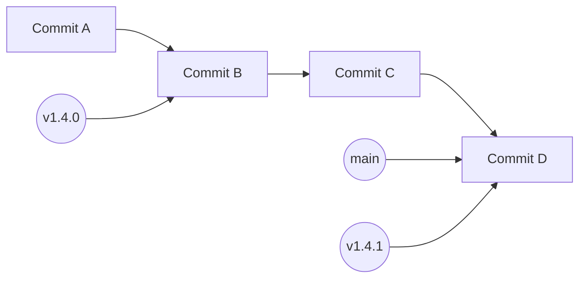
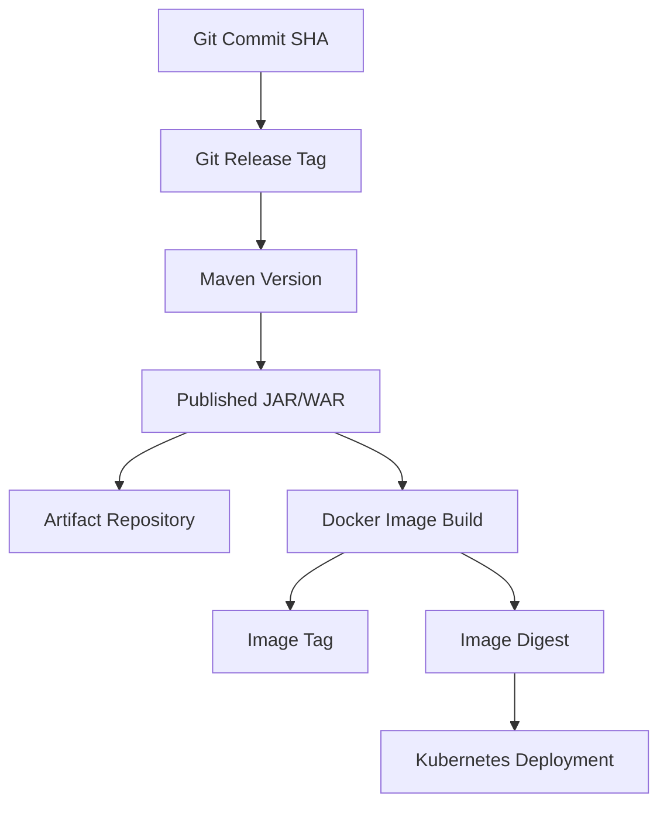
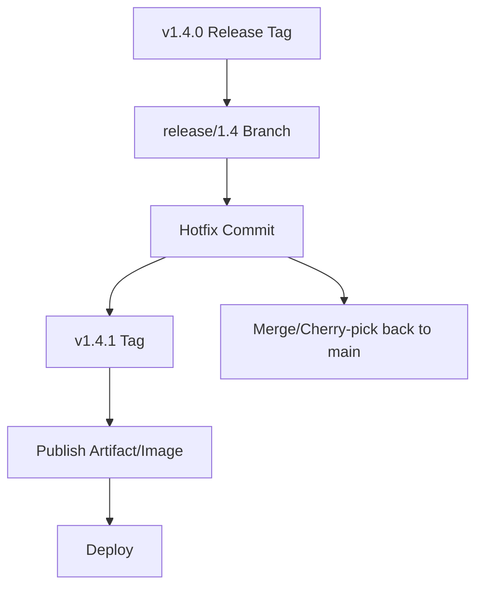

# Part 018 — Git Tags and Release Versioning

> Fokus part ini: memahami tag dan versioning sebagai fondasi release traceability. Senior backend engineer harus bisa menjelaskan hubungan antara Git commit, Git tag, Maven version, changelog, artifact repository, Docker image tag/digest, deployment manifest, dan production runtime.

Tag dan versioning bukan kosmetik. Dalam enterprise system, keduanya menjawab pertanyaan operasional penting:

- source code mana yang membentuk release ini?
- artifact mana yang berasal dari commit ini?
- image mana yang dideploy ke environment ini?
- release note mana yang menjelaskan behavior ini?
- hotfix ini berbasis release apa?
- apakah production menjalankan versi yang benar?
- jika rollback, versi mana yang aman?
- apakah tag bisa dipercaya sebagai audit artifact?

Di Java/JAX-RS microservices, release versioning juga terkait dengan:

- Maven artifact version;
- dependency alignment;
- API compatibility;
- event schema compatibility;
- database migration version;
- container image tag;
- Helm/Kubernetes manifest;
- CI/CD environment promotion;
- security vulnerability triage.

---

## 1. Mental Model: Tag sebagai Anchor, Version sebagai Identity

Git branch bergerak. Git tag seharusnya stabil.



Perbedaan:

| Konsep | Sifat | Fungsi |
|---|---|---|
| Branch | mutable pointer | alur development |
| Tag | intended immutable pointer | anchor release |
| Maven version | artifact identity | dependency dan publishing |
| Docker image tag | image label | deployment reference, tetapi bisa mutable jika tidak dijaga |
| Image digest | content-addressed identity | runtime artifact identity yang kuat |
| Changelog | human-readable release story | komunikasi perubahan |

Senior principle:

> Branch menjawab “sedang dikembangkan di mana”. Tag menjawab “release ini berasal dari commit mana”. Version menjawab “artifact ini dikenali sebagai apa”. Digest/checksum menjawab “bit artifact ini persis yang mana”.

---

## 2. Why Tags Exist

Tanpa tag, release hanya berupa “commit yang kira-kira digunakan waktu deploy”. Itu tidak cukup untuk production system.

Tag memberi:

- anchor stabil untuk release;
- referensi untuk rollback;
- basis hotfix branch;
- traceability ke release note;
- mapping ke artifact Maven dan Docker image;
- forensic evidence saat incident;
- boundary untuk changelog;
- dasar comparison antar release.

Command umum:

```bash
git tag

git tag --list 'v1.4.*'

git show v1.4.0

git log --oneline v1.4.0..v1.4.1
```

Melihat tag yang mengandung commit:

```bash
git tag --contains <commit>
```

Melihat commit dari tag:

```bash
git rev-parse v1.4.0
```

---

## 3. Lightweight Tag vs Annotated Tag vs Signed Tag

### Lightweight Tag

Lightweight tag hanya pointer ke commit.

```bash
git tag v1.4.0
```

Kelebihan:

- sederhana;
- cepat;
- cukup untuk local marker.

Kelemahan:

- tidak punya metadata tagger/message;
- kurang cocok untuk release audit;
- tidak bisa ditandatangani sebagai tag object.

### Annotated Tag

Annotated tag membuat tag object dengan metadata.

```bash
git tag -a v1.4.0 -m "Release v1.4.0"
```

Kelebihan:

- punya tagger, tanggal, message;
- lebih baik untuk release;
- bisa dilihat detailnya dengan `git show`.

### Signed Tag

Signed tag memakai GPG/SSH signing sesuai setup.

```bash
git tag -s v1.4.0 -m "Release v1.4.0"
```

Verifikasi:

```bash
git tag -v v1.4.0
```

Kelebihan:

- meningkatkan trust;
- berguna untuk supply-chain integrity;
- mendukung compliance/audit.

Hal yang harus diverifikasi internal:

- apakah release tag harus annotated?
- apakah signed tag diwajibkan?
- siapa yang boleh membuat tag?
- apakah pipeline membuat tag otomatis?
- apakah tag protection aktif?

---

## 4. Release Tag Naming

Format umum:

```text
v1.4.0
v1.4.1
service-a-v1.4.0
quote-order-v2026.07.3
release-2026.07.11
```

Tidak ada format universal. Yang penting adalah konsistensi dan traceability.

Kriteria tag naming yang baik:

- mudah dibaca manusia;
- sortable jika memungkinkan;
- tidak ambigu antar service;
- sesuai Maven artifact version atau release train;
- tidak bertabrakan di monorepo;
- bisa dipakai automation;
- jelas membedakan release dan non-release marker.

Contoh untuk polyrepo service:

```text
v2.8.0
v2.8.1
v2.8.1-hotfix.1
```

Contoh untuk monorepo multi-service:

```text
quote-service/v2.8.0
order-service/v1.12.3
platform-bom/v2026.07.0
```

Internal verification penting karena CSG/team bisa punya convention sendiri. Jangan mengarang.

---

## 5. Semantic Versioning Awareness

Semantic versioning biasanya berbentuk:

```text
MAJOR.MINOR.PATCH
```

Makna umum:

| Bagian | Arti umum |
|---|---|
| MAJOR | perubahan breaking/incompatible |
| MINOR | fitur baru backward-compatible |
| PATCH | bugfix backward-compatible |

Contoh:

```text
1.4.0
1.4.1
2.0.0
```

Untuk library, SemVer sangat penting karena consumer memilih dependency version.

Untuk service deployable, SemVer masih berguna tetapi harus dikaitkan dengan:

- API compatibility;
- event compatibility;
- database migration;
- feature flag;
- environment promotion;
- container image;
- release cadence.

Caveat enterprise:

- tidak semua organisasi memakai SemVer murni;
- release train bisa memakai date-based version;
- internal service mungkin memakai build number;
- Maven snapshot/release punya aturan sendiri;
- Docker image tag kadang memakai commit SHA.

Senior engineer harus paham SemVer, tetapi tidak boleh memaksakan jika process internal memakai model lain. Yang wajib adalah traceability dan compatibility discipline.

---

## 6. Snapshot Version vs Release Version in Maven

Maven mengenal convention `SNAPSHOT`.

```xml
<version>1.4.0-SNAPSHOT</version>
```

Makna praktis:

- snapshot adalah versi development yang bisa berubah;
- release version seharusnya immutable;
- snapshot dapat dipublish ulang dengan content berbeda;
- release artifact tidak boleh diam-diam diganti.

Contoh lifecycle:

```text
1.4.0-SNAPSHOT  -> development
1.4.0           -> release
1.4.1-SNAPSHOT  -> next patch development
```

Command Maven terkait:

```bash
mvn -q help:evaluate -Dexpression=project.version -DforceStdout
```

Cek artifact coordinates:

```bash
mvn -q help:evaluate -Dexpression=project.groupId -DforceStdout
mvn -q help:evaluate -Dexpression=project.artifactId -DforceStdout
mvn -q help:evaluate -Dexpression=project.version -DforceStdout
```

Risiko snapshot:

- CI build tidak reproducible;
- dependency snapshot berubah tanpa POM berubah;
- local cache berbeda dari CI;
- artifact sulit diaudit;
- rollback tidak jelas;
- hotfix sulit dibandingkan.

Rule praktis:

- snapshot boleh untuk active development;
- release artifact harus fixed;
- production tidak sebaiknya bergantung pada snapshot kecuali ada process khusus yang jelas;
- internal repository policy harus diverifikasi.

---

## 7. Git Tag, Maven Version, and Artifact Identity

Idealnya release memiliki mapping jelas:



Contoh mapping:

| Layer | Example |
|---|---|
| Git commit | `abc1234` |
| Git tag | `v1.4.0` |
| Maven version | `1.4.0` |
| Artifact | `quote-service-1.4.0.jar` |
| Docker image tag | `quote-service:1.4.0` |
| Image digest | `sha256:...` |
| Deployment | staging/prod rollout referencing digest/tag |

Anti-pattern:

- Git tag `v1.4.0`, Maven version `1.3.9`;
- Docker image `latest` digunakan production;
- artifact release dipublish ulang dengan version sama;
- tag dipindahkan setelah release;
- deployment manifest tidak menyimpan commit/image digest;
- changelog tidak sesuai commit range.

---

## 8. Build Metadata and Commit SHA

Build metadata membantu menghubungkan runtime ke source.

Contoh informasi yang berguna:

- Git commit SHA;
- Git tag;
- branch name;
- build number/run ID;
- build timestamp;
- Maven version;
- image digest;
- Java version;
- CI workflow URL.

Untuk Java service, informasi ini bisa muncul di:

- `/actuator/info` jika Spring-based;
- custom `/info` endpoint;
- startup log;
- manifest `META-INF/MANIFEST.MF`;
- container labels;
- deployment annotations;
- CI artifact metadata.

Untuk JAX-RS/Jakarta REST service non-Spring, endpoint metadata bisa dibuat sendiri, tetapi harus mengikuti security policy dan tidak membocorkan informasi sensitif.

Contoh manifest entry:

```text
Implementation-Version: 1.4.0
Build-Commit: abc1234
Build-Time: 2026-07-11T10:15:00Z
```

Caveat reproducibility:

- build timestamp bisa membuat artifact tidak deterministic;
- jika reproducible build diperlukan, timestamp harus dikontrol;
- commit SHA metadata harus berasal dari CI checkout yang benar.

---

## 9. Changelog and Release Notes

Changelog menjawab “apa yang berubah”. Tag menjawab “di mana batas perubahannya”.

Command untuk melihat commit range:

```bash
git log --oneline v1.4.0..v1.4.1
```

Dengan PR merge commit:

```bash
git log --first-parent --oneline v1.4.0..v1.4.1
```

Dengan file stats:

```bash
git diff --stat v1.4.0..v1.4.1
```

Dengan detail:

```bash
git diff v1.4.0..v1.4.1
```

Changelog yang baik memisahkan:

- features;
- bug fixes;
- breaking changes;
- database migrations;
- API changes;
- event contract changes;
- dependency upgrades;
- security fixes;
- operational changes;
- known issues;
- rollback notes.

Untuk backend enterprise, release note harus menjawab:

- apakah ada config baru?
- apakah ada migration?
- apakah ada feature flag?
- apakah ada dependency eksternal baru?
- apakah ada perubahan observability?
- apakah ada perubahan resource requirement?
- apakah ada compatibility concern untuk consumer?

---

## 10. Hotfix Tags

Hotfix tag harus jelas menunjukkan hubungan dengan release asal.

Contoh:

```text
v1.4.1
v1.4.1-hotfix.1
v1.4.2
```

Pilihan yang lebih umum:

- naikkan PATCH version: `v1.4.1` → `v1.4.2`;
- gunakan suffix hotfix jika internal process memakai itu;
- gunakan release train/date version jika organisasi memakai model tersebut.

Senior concern:

- hotfix tag harus berasal dari commit yang sudah direview;
- artifact harus dibangun dari tag/commit yang sama;
- hotfix harus dicatat di release note;
- fix harus dimasukkan ke main atau branch masa depan;
- jangan membuat hotfix hanya di release branch lalu lupa merge-back.

Flow hotfix:



---

## 11. Tag Immutability

Release tag seharusnya immutable.

Artinya:

- setelah `v1.4.0` dibuat dan dipublish, jangan dipindahkan;
- jangan delete lalu recreate tag tanpa process resmi;
- jangan publish artifact berbeda dengan version yang sama;
- jangan reassign image tag untuk release yang sudah dideploy tanpa trace.

Command berbahaya:

```bash
git tag -d v1.4.0
git push origin :refs/tags/v1.4.0
git tag v1.4.0 <different-commit>
git push origin v1.4.0
```

Kadang tag salah memang terjadi. Recovery harus formal:

- hentikan release jika belum deployed;
- komunikasikan tag mistake;
- buat corrected tag/version jika perlu;
- catat audit trail;
- jangan silently retag;
- cek artifact/image yang sudah terpublish;
- cek environment yang mungkin sudah deploy tag lama.

Lebih aman membuat:

```text
v1.4.0-recalled
v1.4.1
```

Atau mengikuti internal release correction policy.

---

## 12. Docker Image Tags Are Not Enough

Docker image tag bisa mutable.

```text
quote-service:1.4.0
quote-service:latest
quote-service:abc1234
```

Tag seperti `latest` sangat lemah untuk production traceability.

Lebih kuat:

- image tag berbasis version;
- image tag berbasis commit SHA;
- deployment memakai image digest;
- labels menyimpan source metadata.

Contoh label OCI:

```dockerfile
LABEL org.opencontainers.image.revision=$GIT_COMMIT
LABEL org.opencontainers.image.version=$APP_VERSION
LABEL org.opencontainers.image.source=$REPO_URL
```

Kubernetes manifest idealnya bisa ditelusuri ke digest:

```text
image: registry.example.com/quote-service@sha256:...
```

Internal verification:

- apakah production memakai tag atau digest?
- apakah `latest` dilarang?
- apakah image promotion rebuild atau promote same digest?
- apakah image labels berisi commit SHA?

---

## 13. Release Versioning Strategies

### 13.1 Semantic Versioning

```text
v2.4.7
```

Cocok untuk:

- libraries;
- shared modules;
- API/client SDK;
- components dengan compatibility contract kuat.

### 13.2 Date-Based Versioning

```text
2026.07.11
2026.07.11.1
```

Cocok untuk:

- release train;
- scheduled deployment;
- enterprise delivery cadence.

### 13.3 Build Number Versioning

```text
1.4.0-build.5821
```

Cocok untuk:

- CI artifacts;
- internal candidate builds;
- trace ke pipeline run.

### 13.4 Commit SHA Versioning

```text
abc1234
```

Cocok untuk:

- image tag tambahan;
- deployment trace;
- non-human comparison.

Best practice biasanya kombinasi:

```text
Version: 1.4.0
Commit: abc1234
Build: 5821
Image digest: sha256:...
```

---

## 14. Release Candidate Tags

Beberapa tim memakai release candidate:

```text
v1.4.0-rc.1
v1.4.0-rc.2
v1.4.0
```

Manfaat:

- candidate bisa diuji di staging/UAT;
- release final jelas;
- bugfix candidate bisa dicatat;
- tidak mencampur snapshot dengan release final.

Risiko:

- terlalu banyak candidate tanpa cleanup;
- candidate dideploy production tanpa label jelas;
- artifact RC dianggap final;
- release note tidak membedakan RC dan final.

Senior checklist:

- apakah RC artifact immutable?
- apakah final release rebuild dari commit yang sama atau promote artifact RC?
- apakah tag final menunjuk commit yang sama dengan RC terakhir?
- apakah testing evidence terkait candidate tertentu?

---

## 15. Comparing Releases

Command penting:

```bash
git log --oneline v1.4.0..v1.4.1
```

Melihat merge PR di first-parent history:

```bash
git log --first-parent --oneline v1.4.0..v1.4.1
```

Melihat file yang berubah:

```bash
git diff --name-status v1.4.0..v1.4.1
```

Melihat statistik:

```bash
git diff --stat v1.4.0..v1.4.1
```

Melihat perubahan POM:

```bash
git diff v1.4.0..v1.4.1 -- pom.xml '**/pom.xml'
```

Melihat database migration:

```bash
git diff --name-status v1.4.0..v1.4.1 -- '*migration*' 'db/**' 'src/main/resources/db/**'
```

Melihat API/resource changes:

```bash
git diff --name-status v1.4.0..v1.4.1 -- 'src/main/java/**/resource/**' 'src/main/java/**/controller/**'
```

Melihat event/schema changes:

```bash
git diff --name-status v1.4.0..v1.4.1 -- 'src/main/resources/**schema**' 'src/main/avro/**' 'src/main/proto/**'
```

Path pattern harus disesuaikan dengan repo internal.

---

## 16. Versioning and API Compatibility

Version naik bukan berarti semua consumer aman.

Untuk JAX-RS API, cek:

- endpoint path baru/hilang;
- method berubah;
- status code berubah;
- request field required berubah;
- response field hilang/rename;
- enum value berubah;
- pagination/sorting/filtering berubah;
- error response berubah;
- authentication/authorization behavior berubah.

Mapping version impact:

| Change | Compatibility risk |
|---|---|
| Add optional response field | rendah |
| Add required request field | tinggi/breaking |
| Remove response field | tinggi/breaking |
| Change status code semantics | medium/high |
| Tighten validation | medium/high |
| Change default sorting | medium |
| Change endpoint path | high |

Jika service memakai external API versioning, Git/Maven release version tidak selalu sama dengan API version. Jangan mencampur keduanya.

---

## 17. Versioning and Event Compatibility

Untuk Kafka/RabbitMQ/event-driven integration, release version harus mempertimbangkan schema compatibility.

Cek:

- topic/exchange/routing key berubah?
- event type berubah?
- required field baru?
- field dihapus?
- enum berubah?
- semantics berubah?
- consumer lama masih bisa membaca?
- producer/consumer deployment order aman?

Event compatibility sering lebih sulit dari HTTP karena consumer asynchronous bisa tertinggal versi.

Release note harus menyebut:

- schema change;
- compatibility mode;
- required consumer action;
- dual-write/dual-read period;
- migration/deprecation timeline.

---

## 18. Versioning and Database Migration

Database migration bukan sekadar file dalam commit.

Release version harus menjawab:

- migration apa yang ikut release?
- apakah migration backward-compatible?
- apakah app versi lama bisa berjalan setelah migration?
- apakah rollback app aman setelah migration?
- apakah migration bisa diulang/idempotent?
- apakah migration membutuhkan downtime?
- apakah data backfill diperlukan?

Git diff migration:

```bash
git diff --name-status v1.4.0..v1.4.1 -- 'db/**' 'src/main/resources/db/**'
```

Release note harus menandai migration berisiko.

Anti-pattern:

- rollback application tanpa memikirkan schema state;
- revert Git commit migration setelah migration sudah applied;
- tag release tidak mencerminkan migration yang dipakai;
- migration manual tidak dicatat di release artifact.

---

## 19. Versioning and Dependency Upgrades

Dependency upgrade dapat mengubah behavior runtime tanpa banyak perubahan kode.

Cek dependency change antar tag:

```bash
git diff v1.4.0..v1.4.1 -- pom.xml '**/pom.xml'
```

Gunakan Maven dependency tree untuk release candidate:

```bash
mvn -q dependency:tree > /tmp/dependency-tree.txt
```

Hal yang perlu dicatat di release note:

- major library upgrade;
- Jakarta/Jersey upgrade;
- JDBC driver upgrade;
- Kafka/RabbitMQ client upgrade;
- Redis client upgrade;
- logging framework upgrade;
- security patch upgrade;
- transitive dependency conflict fix.

Senior concern:

- dependency upgrade bisa memperbaiki CVE tetapi membawa breaking behavior;
- transitive drift bisa terjadi tanpa dependency direct berubah;
- BOM alignment harus dicek;
- release artifact harus reproducible.

---

## 20. CI/CD Tagging Patterns

Beberapa pola umum:

### Manual Tag, Pipeline Builds Release

```text
Developer creates tag -> CI detects tag -> build/test/scan/package/publish/deploy
```

Kelebihan:

- tag menjadi trigger release jelas;
- mudah trace.

Risiko:

- tag salah commit;
- tag dibuat sebelum CI green;
- permission tag perlu dikontrol.

### Pipeline Creates Tag

```text
Release workflow selects commit/version -> pipeline validates -> creates tag -> builds artifact
```

Kelebihan:

- kontrol lebih kuat;
- bisa enforce checks.

Risiko:

- automation lebih kompleks;
- credential/tag permission sensitif.

### PR Merge Creates Candidate, Promotion Creates Release

```text
Merge -> candidate artifact -> staging promotion -> production release tag
```

Kelebihan:

- artifact promotion lebih traceable;
- cocok enterprise release gates.

Risiko:

- butuh metadata disiplin;
- jangan rebuild artifact berbeda di tiap environment tanpa alasan.

Internal process harus diverifikasi.

---

## 21. Protected Tags and Permissions

Tag protection mencegah tag penting dibuat/dihapus sembarangan.

Hal yang perlu dikontrol:

- siapa boleh create release tag;
- siapa boleh delete tag;
- pattern tag yang protected;
- apakah signed tag required;
- apakah release pipeline memakai token dengan permission minimal;
- apakah audit log tersedia.

GitHub/Git platform biasanya punya mekanisme ruleset/protection berbeda tergantung plan dan konfigurasi. Jangan asumsi. Verifikasi di repository settings atau tanya platform team.

---

## 22. Wrong Tag Recovery

Skenario:

- tag dibuat di commit salah;
- tag sudah dipush;
- artifact sudah dipublish;
- image sudah dibuild;
- deployment mungkin sudah terjadi.

Langkah aman:

1. Stop promotion/deployment jika masih bisa.
2. Capture current tag target:

```bash
git rev-parse v1.4.0
git show v1.4.0
```

3. Cek artifact/image yang sudah dibuat.
4. Komunikasikan ke release owner/team.
5. Ikuti internal correction policy.
6. Prefer buat version/tag baru daripada silent retag.
7. Update release note/audit trail.

Jangan langsung:

```bash
git push origin :refs/tags/v1.4.0
```

Kecuali memang process resmi meminta dan semua downstream artifact sudah dipahami.

---

## 23. Release Traceability Checklist

Untuk setiap release, seharusnya bisa menjawab:

| Pertanyaan | Evidence |
|---|---|
| Commit source apa? | commit SHA |
| Release tag apa? | Git tag |
| Artifact version apa? | Maven version |
| Artifact binary mana? | artifact repository URL/checksum |
| Image mana? | image tag + digest |
| Manifest mana? | Helm/Kustomize/GitOps commit |
| Environment mana? | deployment record |
| Kapan deploy? | deployment event |
| Apa yang berubah? | changelog/release note |
| Test apa yang green? | CI run/report |
| Scan apa yang lulus? | SCA/SAST/container scan |
| Rollback ke mana? | previous known-good tag/image |

Jika salah satu tidak bisa dijawab, release traceability belum matang.

---

## 24. Failure Modes

| Failure mode | Gejala | Deteksi | Mitigasi |
|---|---|---|---|
| Tag menunjuk commit salah | release berisi perubahan tidak sesuai | `git show <tag>` | correction policy, new tag/version |
| Tag dipindahkan diam-diam | artifact tidak cocok dengan source | compare tag SHA, artifact metadata | tag protection, audit |
| Maven version mismatch | artifact name tidak cocok release | inspect POM/artifact | release validation |
| Snapshot deployed | behavior sulit direproduksi | artifact metadata | ban snapshot for prod |
| Docker `latest` deployed | runtime source tidak jelas | deployment manifest | use version/digest |
| Changelog tidak akurat | reviewer/operator bingung | compare tag range | generate/review changelog |
| Hotfix tidak merge-back | bug muncul lagi release berikutnya | branch compare | merge-forward policy |
| Dependency upgrade tidak dicatat | runtime/security surprise | POM diff | dependency release checklist |
| Migration tidak dicatat | rollback gagal | migration diff | release migration checklist |

---

## 25. Correctness Concerns

Release version harus merepresentasikan behavior yang benar.

Cek:

- apakah tag dibuat setelah semua commit masuk?
- apakah branch target benar?
- apakah artifact dibangun dari tag/commit yang sama?
- apakah tests/scans dijalankan terhadap commit yang ditag?
- apakah Maven version sesuai release tag?
- apakah image digest berasal dari artifact yang benar?
- apakah changelog sesuai tag range?
- apakah hotfix ada di branch masa depan?

Untuk Java/JAX-RS:

- cek endpoint contract;
- cek serialization behavior;
- cek dependency upgrade;
- cek DB migration;
- cek event compatibility;
- cek runtime config changes.

---

## 26. Productivity Concerns

Versioning yang buruk membuat developer membuang waktu.

Tanda buruk:

- sulit tahu versi apa yang sedang running;
- release note perlu dibuat manual dari ingatan;
- rollback butuh mencari image secara manual;
- PR tidak tahu masuk release mana;
- dependency internal tidak jelas compatible version-nya;
- hotfix sering hilang dari main;
- artifact repository penuh versi ambigu.

Perbaikan:

- standard tag naming;
- generated release note dengan review manusia;
- artifact metadata otomatis;
- image label commit/version;
- dashboard deployment version;
- release checklist;
- protected tag;
- clear snapshot/release policy.

---

## 27. Security Concerns

Release tags dan versioning adalah bagian supply chain.

Risiko:

- attacker atau insider memindahkan tag;
- compromised CI token membuat release palsu;
- artifact dipublish ulang dengan version sama;
- third-party action unpinned mengubah release build;
- secret bocor di release note/log;
- vulnerable dependency masuk release tanpa triage;
- unsigned/unverified artifact sulit dipercaya.

Mitigasi:

- protected tags;
- signed tags/commits jika diwajibkan;
- least privilege CI token;
- action SHA pinning;
- artifact checksum/provenance;
- SBOM;
- vulnerability scanning;
- audit log;
- release approval gate.

---

## 28. Reproducibility Concerns

Release harus bisa dibangun ulang atau minimal diverifikasi sumbernya.

Masalah yang merusak reproducibility:

- snapshot dependency;
- floating plugin version;
- Docker base image tag mutable;
- build timestamp tidak dikontrol;
- generated code tidak deterministic;
- build butuh network resource tidak pinned;
- local cache memengaruhi hasil;
- environment variable rahasia mengubah artifact;
- OS/locale/timezone memengaruhi output.

Checklist:

- dependency/plugin pinned;
- release build dari clean checkout;
- CI logs disimpan;
- artifact checksum dicatat;
- image digest dicatat;
- build metadata mencatat commit;
- release process tidak rebuild berbeda untuk tiap environment tanpa trace.

---

## 29. Release Concerns

Saat release, versioning harus membantu operasi:

- promote artifact yang sama antar environment;
- rollback ke previous known-good;
- compare release dengan jelas;
- hotfix dari base yang benar;
- communicate breaking changes;
- track migrations;
- track feature flags;
- track dependency/security fixes.

Release review questions:

- Apa tag release?
- Apa commit SHA?
- Apa Maven version?
- Apa image digest?
- Apa changelog?
- Apa migration?
- Apa rollback target?
- Apa verification command?
- Apa monitoring signal setelah deploy?

---

## 30. Observability and Incident-Support Concerns

Runtime harus bisa mengatakan versi yang sedang berjalan.

Minimal evidence:

- startup log mencatat version dan commit;
- metrics label atau info endpoint mencatat version;
- deployment annotation mencatat tag/SHA;
- dashboard menunjukkan deployment event;
- log correlation bisa dikaitkan dengan release window.

Jika incident terjadi, operator harus bisa menjawab dalam menit, bukan jam:

```text
Production currently runs quote-service v1.4.1, commit abc1234, image digest sha256:..., deployed at 2026-07-11T10:15Z.
```

Jika jawaban itu tidak tersedia, version observability perlu diperbaiki.

---

## 31. PR Review Checklist for Tagging and Versioning

### Git Tag

- Apakah tag naming sesuai convention?
- Apakah tag menunjuk commit yang benar?
- Apakah tag annotated/signed jika diwajibkan?
- Apakah tag dibuat oleh process yang benar?
- Apakah tag immutable/protected?

### Maven Version

- Apakah POM version sesuai release?
- Apakah snapshot tidak masuk production?
- Apakah dependency internal memakai release version yang benar?
- Apakah BOM/parent version konsisten?
- Apakah artifact repository target benar?

### Artifact and Image

- Apakah artifact dibangun dari commit/tag yang sama?
- Apakah image tag/digest tercatat?
- Apakah image label punya commit/version?
- Apakah image promotion tidak rebuild tanpa trace?

### Changelog and Release Note

- Apakah changelog sesuai tag range?
- Apakah breaking/API/event/migration/dependency changes disebut?
- Apakah rollback notes ada?
- Apakah known issues disebut?

### CI/CD

- Apakah tag trigger aman?
- Apakah release pipeline punya permission minimal?
- Apakah scan/test/report tersedia?
- Apakah environment gate sesuai policy?

### Hotfix

- Apakah hotfix berasal dari base release yang benar?
- Apakah patch minimal?
- Apakah tag hotfix jelas?
- Apakah merge-back/forward plan ada?

---

## 32. Internal Verification Checklist

Hal yang harus dicek di CSG/team, bukan diasumsikan:

### Tagging Strategy

- Format release tag resmi apa?
- Apakah tag per service, per repo, atau per release train?
- Apakah tag dibuat manual atau pipeline?
- Apakah tag harus annotated/signed?
- Apakah tag deletion/reassignment dilarang?

### Versioning Strategy

- Apakah memakai SemVer, date-based, release train, build number, atau kombinasi?
- Bagaimana Maven version ditentukan?
- Bagaimana snapshot/release version dipakai?
- Apakah production boleh memakai snapshot?
- Bagaimana hotfix version diberi nomor?

### Artifact Repository

- Apakah memakai Nexus, Artifactory, GitHub Packages, atau repository internal lain?
- Apakah release artifact immutable?
- Apakah snapshot retention policy ada?
- Apakah artifact checksum/provenance tersedia?
- Siapa yang boleh publish artifact?

### Docker/Image/Deployment

- Apakah image tag memakai app version, commit SHA, build number, atau digest?
- Apakah production memakai digest?
- Apakah `latest` dilarang?
- Apakah image labels menyimpan commit/version?
- Bagaimana mapping image ke Kubernetes deployment dicatat?

### CI/CD and Release

- Apa trigger release pipeline?
- Apakah tag trigger build/deploy?
- Apakah pipeline membuat tag?
- Apakah release approval required?
- Apakah release note otomatis/manual?

### Security and Governance

- Apakah protected tag/ruleset aktif?
- Apakah signed commit/tag required?
- Apakah release token permission minimal?
- Apakah SBOM dibuat per release?
- Apakah vulnerability scan blocking atau advisory?

### Incident Support

- Bagaimana mengetahui versi yang sedang running?
- Apakah runtime endpoint/log mencatat version/commit?
- Apakah deployment event mudah dilihat?
- Apakah rollback target terdokumentasi?
- Apakah RCA mencatat tag/commit/image digest?

---

## 33. Command Reference

### List Tags

```bash
git tag
git tag --list 'v1.4.*'
```

### Create Tags

```bash
git tag v1.4.0
git tag -a v1.4.0 -m "Release v1.4.0"
git tag -s v1.4.0 -m "Release v1.4.0"
```

### Push Tags

```bash
git push origin v1.4.0
git push origin --tags
```

Prefer push specific tag for release:

```bash
git push origin v1.4.0
```

### Inspect Tags

```bash
git show v1.4.0
git rev-parse v1.4.0
git tag --contains <commit>
```

### Compare Releases

```bash
git log --oneline v1.4.0..v1.4.1
git log --first-parent --oneline v1.4.0..v1.4.1
git diff --stat v1.4.0..v1.4.1
git diff --name-status v1.4.0..v1.4.1
```

### Maven Version

```bash
mvn -q help:evaluate -Dexpression=project.version -DforceStdout
mvn -q help:evaluate -Dexpression=project.groupId -DforceStdout
mvn -q help:evaluate -Dexpression=project.artifactId -DforceStdout
```

### Dependency Difference Clue

```bash
git diff v1.4.0..v1.4.1 -- pom.xml '**/pom.xml'
mvn -q dependency:tree
```

### Dangerous Tag Operations

```bash
git tag -d v1.4.0
git push origin :refs/tags/v1.4.0
```

Jangan jalankan untuk release tag tanpa approval/process resmi.

---

## 34. Senior Engineer Heuristics

- Treat release tags as audit artifacts.
- Jangan gunakan `latest` sebagai production identity.
- Snapshot bukan release.
- Maven version, Git tag, artifact, image, dan deployment harus bisa dipetakan.
- Jangan silently retag release.
- Hotfix harus merge-back/forward.
- Changelog harus berdasarkan tag range, bukan ingatan.
- Build metadata harus cukup untuk incident response.
- Release versioning harus mendukung rollback, bukan hanya branding.
- Internal convention lebih penting dari preferensi pribadi, selama traceability dan safety terpenuhi.

---

## 35. Part Summary

Tag dan versioning adalah tulang punggung release traceability.

Setelah part ini, kamu harus mampu:

- membedakan lightweight, annotated, dan signed tag;
- memahami kenapa release tag harus immutable;
- membaca hubungan Git tag, Maven version, artifact, Docker image, dan deployment;
- membedakan snapshot dan release version;
- membuat changelog berbasis tag range;
- mengevaluasi hotfix tag dan release candidate;
- mendeteksi mismatch version/artifact/image;
- mereview release PR dari sisi traceability, security, reproducibility, dan rollback;
- menyusun internal verification checklist untuk tagging/versioning CSG/team.

Part berikutnya akan masuk ke **GitHub Foundation**: repository, organization, team, permission, branch protection, PR, issue, release, action, secret, environment, CODEOWNERS, dan GitHub governance surface.
