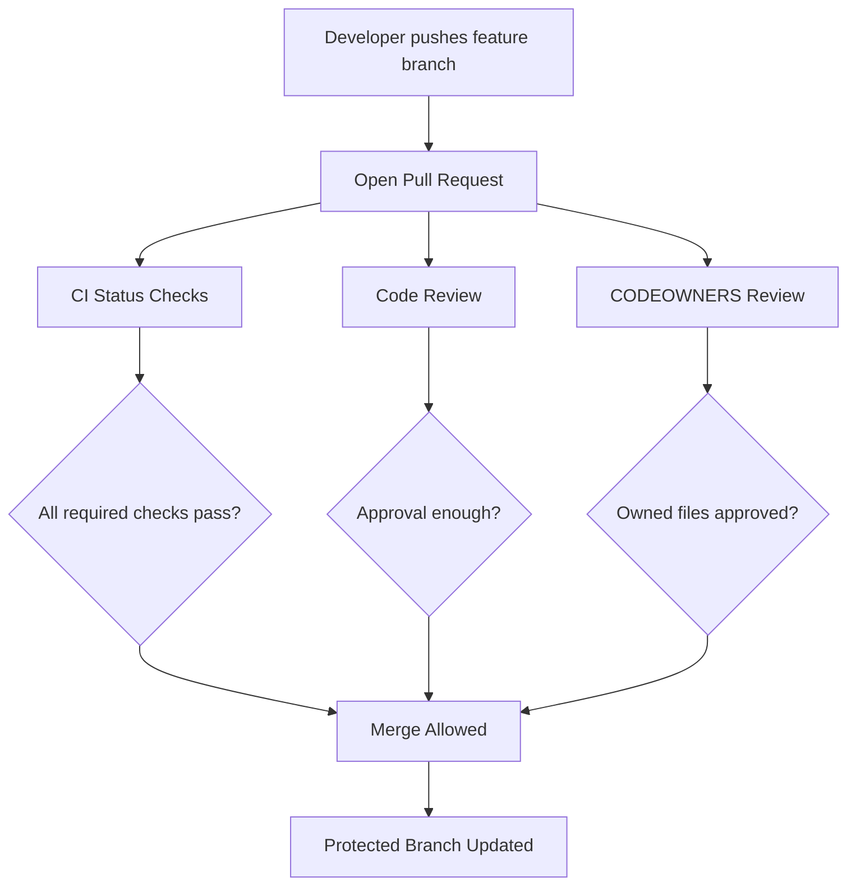
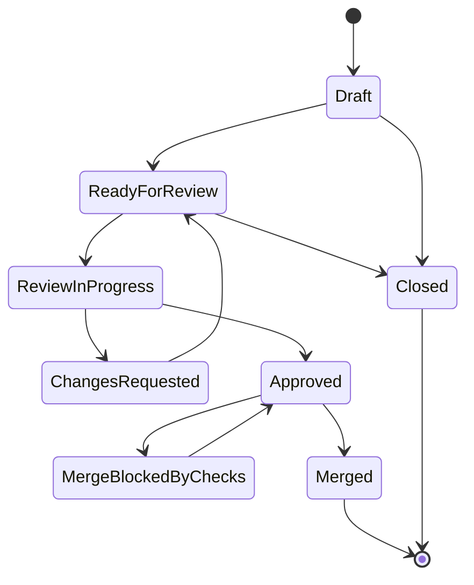
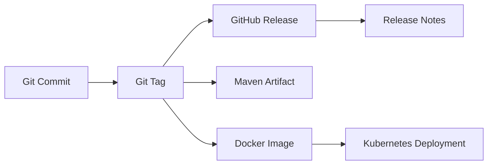
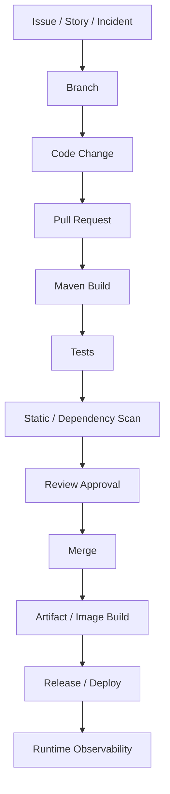

# Part 019 — GitHub Foundation

> Fokus part ini: memahami GitHub bukan hanya sebagai tempat menyimpan repository, tetapi sebagai **collaboration platform, governance layer, audit surface, CI/CD entry point, security control plane, dan release coordination tool** untuk sistem Java/JAX-RS enterprise.

Untuk senior backend engineer, GitHub adalah tempat banyak keputusan engineering menjadi nyata:

- siapa boleh mengubah branch penting;
- siapa wajib mereview area tertentu;
- check apa yang wajib hijau sebelum merge;
- workflow apa yang berjalan saat push/PR/tag;
- secret apa yang tersedia untuk pipeline;
- environment mana yang butuh approval;
- release mana yang dipublikasikan;
- vulnerability/dependency alert mana yang harus ditindaklanjuti;
- audit trail apa yang tersedia ketika terjadi incident.

Dalam konteks Java/JAX-RS microservices, GitHub sering menjadi titik temu antara:

- source code service;
- Maven build;
- dependency management;
- Docker image build;
- Kubernetes deployment manifest;
- GitOps repository;
- PR review;
- CI status checks;
- security scanning;
- release note;
- issue/story tracking;
- operational documentation.

GitHub foundation yang kuat membantu kamu membaca repository bukan hanya sebagai folder code, tetapi sebagai **sistem kerja tim**.

---

## 1. Mental Model: Git vs GitHub

Git adalah distributed version control system. GitHub adalah platform kolaborasi di atas Git.

| Area | Git | GitHub |
|---|---|---|
| Core model | Commit graph, branch, tag, object database | Repository, PR, review, issue, workflow, permission |
| Berjalan di | Local machine dan remote Git server | Web platform + API + automation runner |
| Fokus utama | Version history | Collaboration, governance, automation, visibility |
| Control point | Commit, merge, tag, remote | Branch protection, required checks, CODEOWNERS, Actions, environments |
| Failure mode | Lost commit, bad merge, wrong rebase | Unsafe merge, bypassed review, weak permission, exposed secret, broken workflow |

Senior principle:

> Git menjawab “apa histori perubahan source code”. GitHub menjawab “bagaimana perubahan itu dikolaborasikan, divalidasi, diizinkan, dan dilacak”.

GitHub bukan pengganti disiplin Git. GitHub memperbesar dampak disiplin Git karena setiap branch, PR, check, review, dan release menjadi bagian dari engineering process.

---

## 2. Repository as Engineering Boundary

Repository bukan hanya tempat code. Repository biasanya menjadi boundary untuk:

- ownership;
- build lifecycle;
- CI/CD workflow;
- release cadence;
- dependency policy;
- security scanning;
- operational documentation;
- issue tracking;
- code review responsibility.

Dalam enterprise Java/JAX-RS service, satu repository bisa berupa:

| Repository shape | Contoh | Risiko utama |
|---|---|---|
| Single service repo | satu JAX-RS microservice | dependency drift, duplicated tooling |
| Multi-module service repo | service + shared modules | module boundary blur, slow build |
| Library repo | internal Java library | backward compatibility, versioning |
| GitOps repo | deployment manifests | manual drift, wrong environment change |
| Monorepo | banyak service/module | ownership, build isolation, CI scalability |
| Platform tooling repo | shared workflows/scripts | blast radius besar |

Saat masuk repository baru, jangan langsung membaca seluruh code. Baca “control surfaces” terlebih dahulu:

```text
README.md
CONTRIBUTING.md
.github/
.github/workflows/
.github/CODEOWNERS
pom.xml
mvnw
scripts/
docker*/
helm*/
k8s*/
docs/
adr/
```

Tujuannya adalah menjawab:

- bagaimana service dibuild?
- bagaimana test dijalankan?
- siapa owner area tertentu?
- apa required workflow sebelum merge?
- bagaimana release dibuat?
- bagaimana deploy terjadi?
- mana dokumentasi debugging/onboarding?

---

## 3. Organization, Team, and Permission

GitHub organization biasanya merepresentasikan perusahaan, unit, atau platform engineering boundary. Di dalam organization ada team, repository, permission, policy, secret, dan governance.

Permission umum di repository:

| Permission | Kemampuan umum | Risiko jika terlalu luas |
|---|---|---|
| Read | clone, lihat issue/PR | exposure code jika scope salah |
| Triage | manage issue/PR tanpa push | noise atau mislabeling |
| Write | push branch, create PR, update issue | branch pollution, accidental push |
| Maintain | manage repository tanpa admin penuh | policy drift |
| Admin | ubah setting/security/access | bypass governance, secret exposure |

Hal yang perlu dipahami senior engineer:

- permission harus mengikuti least privilege;
- admin bypass adalah risiko governance;
- team membership memengaruhi review routing;
- CODEOWNERS biasanya berbasis team;
- environment approval bisa dikaitkan dengan team;
- repository secret dapat berdampak ke deployment;
- akses ke GitHub sering berarti akses ke supply chain.

Internal verification checklist:

- siapa admin repository?
- team mana yang punya write/maintain/admin?
- apakah akses diberikan per individu atau team?
- apakah offboarding access otomatis?
- siapa boleh mengubah branch protection, Actions secret, dan environment rule?

---

## 4. Branch Protection as Safety Barrier

Branch protection adalah salah satu kontrol terpenting di GitHub.

Tanpa branch protection, branch utama dapat rusak oleh:

- direct push tanpa review;
- force push;
- merge saat CI merah;
- merge tanpa owner approval;
- unresolved conversation;
- commit tidak signed jika policy mewajibkan signing;
- bypass oleh admin.

Branch protection biasanya mencakup:

- require pull request before merging;
- require approvals;
- require review from CODEOWNERS;
- dismiss stale approvals;
- require status checks;
- require branches to be up to date;
- require conversation resolution;
- require signed commits;
- require linear history;
- restrict who can push;
- prevent force pushes;
- prevent deletion.



Branch protection bukan bureaucracy. Ia adalah executable governance.

Untuk backend production system, branch protection melindungi:

- API compatibility;
- database migration safety;
- event schema compatibility;
- dependency hygiene;
- test gate;
- security scanning;
- release traceability;
- operational stability.

---

## 5. Pull Request as Change Container

Pull request adalah container untuk perubahan engineering.

PR yang baik tidak hanya berisi diff. PR yang baik berisi:

- intent;
- scope;
- context;
- risk;
- validation evidence;
- compatibility note;
- rollback consideration;
- operational impact;
- linked issue/story;
- reviewer routing;
- resolved discussion.

PR lifecycle umum:



PR harus menjawab pertanyaan reviewer:

- apa yang berubah?
- kenapa berubah?
- apa yang sengaja tidak diubah?
- bagaimana divalidasi?
- apa risiko production?
- bagaimana rollback?
- apakah butuh migration/config/feature flag?

Untuk Java/JAX-RS service, PR sering perlu menjelaskan:

- endpoint baru/diubah;
- HTTP status/header/body contract;
- DTO/schema compatibility;
- Maven dependency change;
- database migration;
- Kafka/RabbitMQ message compatibility;
- Redis key/cache behavior;
- Docker/Kubernetes config impact;
- observability/logging/metrics impact.

---

## 6. Review, Conversation, and Approval

Review di GitHub adalah mekanisme quality control dan knowledge transfer.

Jenis review outcome umum:

| Outcome | Makna | Kapan digunakan |
|---|---|---|
| Comment | masukan tanpa blocking | pertanyaan, saran, minor improvement |
| Approve | reviewer setuju merge | setelah correctness dan risk cukup jelas |
| Request changes | blocking issue | bug, security risk, unsafe migration, missing validation |

Senior reviewer tidak hanya mencari bug kecil. Ia mencari risiko sistemik:

- invariant domain dilanggar;
- API breaking change tidak disadari;
- event compatibility rusak;
- migration tidak backward compatible;
- dependency conflict tersembunyi;
- logging membocorkan data sensitif;
- retry/idempotency salah;
- rollback tidak mungkin;
- pipeline hanya hijau karena test kurang;
- observability tidak cukup untuk incident.

Conversation resolution penting karena menjaga audit trail:

- diskusi blocking sudah ditangani;
- reviewer dan author punya shared understanding;
- keputusan trade-off tercatat;
- perubahan tambahan tidak tersembunyi.

---

## 7. CODEOWNERS

`CODEOWNERS` adalah file yang memetakan path ke owner/reviewer wajib.

Contoh umum:

```text
# Global owner
* @org/backend-team

# CI workflow owned by platform
.github/workflows/ @org/platform-team

# Maven build ownership
pom.xml @org/backend-platform
**/pom.xml @org/backend-platform

# Deployment manifests
k8s/ @org/sre-team
helm/ @org/sre-team

# Security-sensitive code
src/main/java/com/example/security/ @org/security-reviewers
```

CODEOWNERS membantu memastikan perubahan sensitif direview oleh orang yang tepat.

Area yang sering layak punya owner khusus:

- CI/CD workflow;
- deployment manifest;
- Dockerfile/base image;
- Maven parent POM;
- shared scripts;
- security/auth module;
- database migration;
- API contract;
- event schema;
- production runbook;
- GitOps config.

Failure mode CODEOWNERS:

- owner terlalu luas sehingga review menjadi formalitas;
- owner terlalu sempit sehingga PR sering blocked;
- team tidak aktif;
- generated files memicu reviewer salah;
- sensitive path tidak tercakup;
- branch protection tidak mewajibkan CODEOWNERS review;
- ownership tidak selaras dengan real responsibility.

Internal verification checklist:

- apakah repository punya CODEOWNERS?
- apakah CODEOWNERS diwajibkan branch protection?
- path mana yang paling sensitif?
- siapa owner POM, CI, deployment, security, migration?
- apakah owner masih aktif dan relevan?

---

## 8. Issues, Projects, and Milestones

GitHub Issues bisa digunakan untuk bug, task, improvement, investigation, release work, atau operational follow-up. Namun di enterprise, issue tracking bisa saja berada di Jira/Azure DevOps/ServiceNow, sementara GitHub PR hanya menautkan issue/story eksternal.

Hal yang penting bukan tool-nya, tetapi traceability.

Good traceability menjawab:

- perubahan ini berasal dari requirement/bug mana?
- siapa meminta perubahan?
- keputusan apa yang dibuat?
- acceptance criteria apa?
- release mana yang membawa perubahan?
- incident atau customer escalation mana yang terkait?

Milestone dapat mewakili release boundary. Project dapat mewakili planning board. Label dapat membantu routing.

Label yang sering berguna:

```text
type:bug
type:feature
type:maintenance
area:build
area:ci
area:api
area:database
area:security
area:observability
risk:high
needs-platform-review
needs-security-review
```

Senior habit:

> Jangan biarkan PR production-relevant berdiri sendiri tanpa context. Minimal harus ada issue/story/incident/change request yang bisa ditelusuri.

---

## 9. GitHub Releases

GitHub Releases adalah presentation layer di atas Git tag. Tidak semua tim menggunakannya, tetapi jika digunakan, release page dapat menjadi artifact komunikasi penting.

GitHub Release biasanya berisi:

- tag;
- release title;
- changelog;
- binary/source artifact;
- release note;
- link ke PR/issue;
- pre-release marker;
- latest release marker.

Untuk Java/JAX-RS service, GitHub Release harus dipahami bersama artifact lain:



GitHub Release bukan pengganti Maven repository atau container registry. Ia adalah human-facing release coordination artifact.

Internal verification checklist:

- apakah tim menggunakan GitHub Releases?
- apakah release dibuat manual atau otomatis?
- apakah release note berasal dari PR title, changelog, atau release tool?
- apakah release dikaitkan dengan Maven artifact/container image?
- apakah pre-release digunakan untuk RC/beta/internal validation?

---

## 10. GitHub Actions as Automation Surface

GitHub Actions menjalankan automation dari repository.

Contoh event trigger:

- pull request opened/synchronized;
- push ke branch;
- tag created;
- release published;
- manual workflow dispatch;
- scheduled cron;
- reusable workflow call.

Workflow dapat melakukan:

- build Maven;
- run unit/integration tests;
- static analysis;
- dependency scanning;
- Docker image build;
- publish artifact;
- deploy to environment;
- generate release note;
- comment PR;
- validate formatting;
- run security checks.

GitHub Actions adalah powerful, sehingga juga berisiko:

- secret leakage;
- overly broad token permission;
- unpinned third-party actions;
- unsafe PR from fork behavior;
- deployment from wrong branch;
- cache poisoning;
- artifact tampering;
- workflow bypass;
- runner compromise.

Dalam GitHub foundation, cukup pahami bahwa Actions bukan sekadar CI. Ia adalah automation execution layer yang harus direview seperti production code.

---

## 11. Secrets and Environments

GitHub secrets menyimpan nilai sensitif untuk workflow. GitHub environments dapat memberi boundary deployment, secret scope, dan approval gate.

Jenis secret yang mungkin muncul:

- artifact repository credential;
- container registry credential;
- cloud deployment role/token;
- signing key;
- scanner token;
- webhook token;
- package registry token.

Risiko secret:

- tersedia ke workflow terlalu luas;
- bisa diakses dari branch/fork tidak dipercaya;
- dicetak di log;
- digunakan oleh third-party action tidak dipin;
- tidak dirotasi;
- shared antar environment;
- permission token terlalu besar.

GitHub environment dapat digunakan untuk:

- memisahkan `dev`, `staging`, `production`;
- require approval sebelum deploy;
- membatasi secret per environment;
- mencatat deployment history;
- mencegah workflow langsung deploy production.

Internal verification checklist:

- secret apa yang ada di repo/org/environment?
- workflow mana yang bisa membaca secret?
- apakah production deploy butuh approval?
- apakah OIDC federation digunakan dibanding long-lived secret?
- siapa bisa mengubah secret/environment?

---

## 12. Security Alerts and Dependency Visibility

GitHub dapat menjadi surface untuk security posture:

- Dependabot alerts;
- Dependabot version updates;
- Dependabot security updates;
- dependency graph;
- dependency review;
- code scanning;
- secret scanning;
- security advisory;
- branch protection/security policy.

Untuk Maven service, dependency graph dan Dependabot dapat membantu menemukan vulnerable dependency. Namun alert bukan keputusan final.

Senior engineer harus menilai:

- apakah dependency direct atau transitive?
- apakah vulnerable code path reachable?
- apakah upgrade breaking?
- apakah parent BOM mengatur version?
- apakah exclusion/shading memengaruhi hasil scan?
- apakah fix harus di service POM, parent POM, atau platform BOM?
- apakah release/hotfix dibutuhkan?

GitHub security signal harus dikaitkan dengan Maven dependency tree dan CI/SCA tool internal.

---

## 13. Repository Settings You Should Understand

Saat mereview repository, pahami setting yang memengaruhi engineering behavior:

| Setting | Dampak |
|---|---|
| Default branch | target PR dan base release |
| Merge strategy | squash/rebase/merge commit behavior |
| Branch protection | merge safety |
| Rulesets | governance reusable/centralized |
| Actions permissions | workflow security |
| Workflow token permission | supply-chain risk |
| Secrets/environments | deployment/security boundary |
| CODEOWNERS | review routing |
| Discussions/issues | collaboration mode |
| Security features | alert visibility |
| Pages/wiki | documentation exposure |

Tidak semua engineer boleh mengubah setting ini, tetapi senior engineer harus bisa membaca dampaknya.

---

## 14. GitHub CLI Basics

GitHub CLI (`gh`) sering mempercepat workflow harian.

Contoh command:

```bash
gh auth status

gh repo view

gh pr status

gh pr list --state open

gh pr view 123 --web

gh pr checkout 123

gh pr checks 123

gh run list

gh run view --log
```

Untuk review/debugging:

```bash
# checkout PR untuk review local
gh pr checkout 123

# lihat status checks
gh pr checks 123

# lihat workflow run terbaru
gh run list --limit 10

# lihat log run
gh run view <run-id> --log
```

Caution:

- pastikan repo benar;
- pastikan account benar;
- jangan menjalankan command merge/close/delete tanpa niat jelas;
- hati-hati dengan command yang memicu rerun/deploy;
- token `gh` di local adalah credential sensitif.

---

## 15. GitHub in Java/JAX-RS Backend Workflow

Untuk backend Java/JAX-RS, GitHub biasanya mengikat lifecycle berikut:



Change yang tampak kecil di PR dapat berdampak ke banyak layer:

| Change | GitHub surface yang perlu dicek |
|---|---|
| Ubah dependency Maven | CI, dependency review, security alert, reviewer platform |
| Ubah API JAX-RS | PR description, contract test, docs, client compatibility |
| Ubah Dockerfile | CODEOWNERS, image scan, deployment pipeline |
| Ubah GitHub workflow | required checks, permissions, secret exposure |
| Ubah migration DB | reviewer database/domain, rollback plan |
| Ubah Kafka/RabbitMQ message | compatibility review, consumer impact |
| Ubah runbook | docs review, incident support validation |

---

## 16. Failure Modes

GitHub failure mode sering bukan technical error tunggal, tetapi process/control failure.

| Failure mode | Gejala | Dampak |
|---|---|---|
| Direct push ke main | commit masuk tanpa PR | review bypass |
| Required check tidak lengkap | PR merge walau test penting tidak jalan | regression |
| CODEOWNERS tidak aktif | file sensitif tidak direview owner | architecture/security drift |
| Admin bypass | merge/deploy tanpa kontrol | audit gap |
| Secret tersedia terlalu luas | workflow bisa membaca secret tidak perlu | leakage risk |
| Third-party action unpinned | action berubah tanpa kontrol | supply-chain risk |
| Merge strategy tidak konsisten | histori sulit ditelusuri | release/debugging pain |
| PR tidak linked ke issue | context hilang | audit/maintenance pain |
| Release note tidak akurat | perubahan tidak jelas | production support pain |
| Branch protection longgar | unsafe change masuk | production incident risk |

---

## 17. Debugging GitHub Problems

Saat masalah terjadi di GitHub, bedakan area masalahnya.

### PR tidak bisa merge

Cek:

```bash
gh pr checks <pr-number>
gh pr view <pr-number>
```

Kemungkinan:

- required check gagal;
- required check pending;
- branch out of date;
- review belum cukup;
- CODEOWNERS belum approve;
- conversation belum resolved;
- merge conflict;
- branch protection/ruleset menolak merge.

### Workflow tidak jalan

Cek:

- event trigger salah;
- path filter tidak match;
- workflow disabled;
- YAML invalid;
- branch tidak sesuai;
- permission tidak cukup;
- runner unavailable.

### Secret tidak tersedia

Cek:

- secret level: repository/org/environment;
- environment belum selected;
- event dari fork;
- permission workflow;
- typo secret name;
- approval belum diberikan.

### Reviewer tidak otomatis muncul

Cek:

- CODEOWNERS syntax;
- path match;
- team permission;
- branch protection require CODEOWNERS;
- file generated/path moved.

---

## 18. Correctness Concerns

GitHub correctness bukan hanya “CI hijau”. Correctness berarti proses GitHub benar-benar memvalidasi perubahan yang relevan.

Pertanyaan review:

- apakah required checks mencakup build/test yang tepat?
- apakah check berjalan untuk semua path penting?
- apakah path filter melewatkan perubahan berisiko?
- apakah PR base branch benar?
- apakah review owner sesuai area perubahan?
- apakah deployment workflow memakai artifact dari commit yang direview?
- apakah release tag mengarah ke commit yang benar?
- apakah environment approval sesuai risiko?

CI hijau tidak cukup jika check yang wajib tidak tepat.

---

## 19. Security Concerns

GitHub adalah supply-chain surface. Security concern penting:

- token permission default terlalu besar;
- secret leakage di logs;
- third-party action tidak dipin SHA;
- workflow dapat dimodifikasi tanpa platform review;
- fork PR dapat mengeksekusi workflow berbahaya;
- release artifact tidak terhubung ke commit yang benar;
- branch protection bisa dibypass;
- admin terlalu banyak;
- CODEOWNERS tidak melindungi path security-sensitive;
- Dependabot alert diabaikan.

Senior posture:

> Treat workflow YAML, CODEOWNERS, branch protection, secrets, and release config as production-sensitive code.

---

## 20. Productivity Concerns

Governance yang terlalu lemah berbahaya. Governance yang terlalu berat juga menciptakan bottleneck.

Trade-off yang perlu dijaga:

| Terlalu longgar | Terlalu ketat |
|---|---|
| Regression mudah masuk | PR stuck lama |
| Security bypass | Review fatigue |
| Release tidak traceable | Banyak approval formalitas |
| Ownership kabur | Owner bottleneck |
| CI tidak cukup | CI terlalu lambat |

GitHub setup yang baik:

- required checks relevan, bukan asal banyak;
- CODEOWNERS tepat sasaran;
- PR template membantu, bukan mengganggu;
- automation mempercepat evidence capture;
- branch protection melindungi branch penting;
- emergency bypass jelas dan diaudit;
- CI cepat untuk feedback awal, lengkap untuk merge gate.

---

## 21. PR Review Checklist for GitHub Foundation

Saat mereview repository atau perubahan GitHub setup, tanyakan:

- Apakah default branch benar?
- Apakah branch utama protected?
- Apakah direct push dan force push dicegah?
- Apakah required checks mencakup build/test/scan penting?
- Apakah CODEOWNERS ada dan relevan?
- Apakah workflow YAML direview owner yang tepat?
- Apakah secret scope minimal?
- Apakah environment production butuh approval?
- Apakah merge strategy selaras dengan release/debugging?
- Apakah release/tag workflow traceable?
- Apakah security scanning aktif?
- Apakah repository punya README/CONTRIBUTING/runbook?

---

## 22. Internal Verification Checklist

Untuk CSG/team, jangan mengarang. Verifikasi:

- repository utama untuk Quote & Order service;
- apakah repo polyrepo, monorepo, atau multi-module;
- default branch dan branch naming convention;
- branch protection/ruleset;
- required status checks;
- required reviewer count;
- CODEOWNERS dan owner path sensitif;
- merge strategy yang diizinkan;
- GitHub Actions workflow utama;
- secrets dan environments yang digunakan;
- apakah deployment dilakukan dari GitHub, Jenkins, GitLab, ArgoCD, atau tool lain;
- apakah GitHub Issues/Projects dipakai atau hanya Jira/story eksternal;
- release/tag convention;
- security scanning/Dependabot policy;
- admin/maintainer repository;
- emergency bypass process;
- runbook untuk failed CI, failed deploy, dan incident support.

---

## 23. Practical Repository Reading Routine

Saat masuk repo baru, lakukan urutan ini:

```bash
# 1. identitas repo
gh repo view

# 2. branch dan PR aktif
git branch -a
gh pr list --state open

# 3. file kontrol engineering
ls -la
ls -la .github || true
ls -la .github/workflows || true
cat .github/CODEOWNERS 2>/dev/null || true

# 4. build identity
ls -la pom.xml mvnw 2>/dev/null || true

# 5. workflow docs
sed -n '1,200p' README.md 2>/dev/null || true
sed -n '1,200p' CONTRIBUTING.md 2>/dev/null || true
```

Lalu jawab:

- bagaimana branch dilindungi?
- bagaimana PR divalidasi?
- siapa owner area sensitif?
- bagaimana build/test berjalan?
- bagaimana release/deploy dilakukan?
- bagaimana incident/debugging didokumentasikan?

---

## 24. Senior Engineer Takeaways

GitHub foundation yang harus kamu kuasai:

- repository adalah boundary engineering;
- organization/team/permission adalah access control layer;
- branch protection adalah safety barrier;
- PR adalah change container;
- review adalah quality gate dan knowledge transfer;
- CODEOWNERS adalah ownership routing;
- Actions adalah automation execution surface;
- secrets/environments adalah security/deployment boundary;
- releases/tags adalah traceability artifact;
- security alerts adalah supply-chain signal;
- GitHub settings adalah governance configuration.

Sebagai senior backend engineer, kamu tidak harus menjadi GitHub admin. Tetapi kamu harus bisa membaca apakah repository setup mendukung correctness, security, reproducibility, release hygiene, developer productivity, dan production support.

---

## 25. Connection to Next Part

Part berikutnya masuk ke **Pull Request Workflow** secara lebih detail:

- bagaimana membuat PR yang reviewable;
- bagaimana menulis PR description yang berguna;
- bagaimana mengelola draft/ready/review/request changes;
- bagaimana required checks dan conversation resolution memengaruhi merge;
- bagaimana menjaga PR kecil, aman, dan production-aware.
