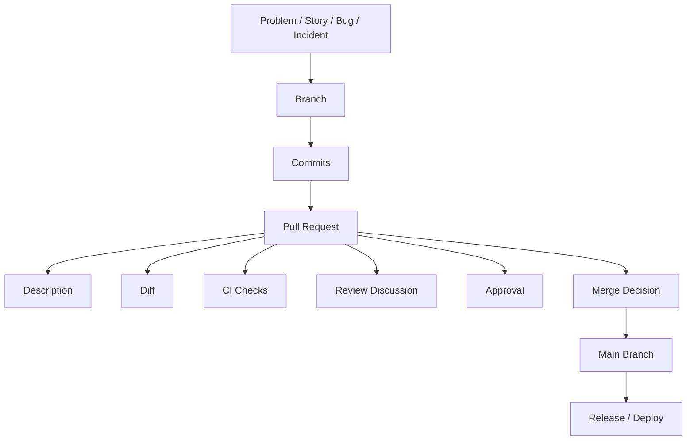
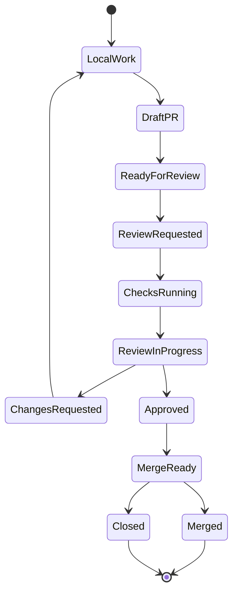
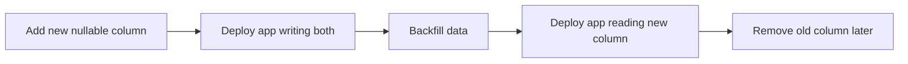

# Part 020 — Pull Request Workflow

> Fokus part ini: memahami Pull Request sebagai **unit perubahan engineering** yang harus reviewable, testable, traceable, reversible, dan production-aware. PR bukan hanya diff. PR adalah paket keputusan, evidence, risk, validation, dan collaboration.

Dalam tim backend enterprise, PR adalah salah satu titik kontrol paling penting sebelum perubahan masuk ke branch utama dan akhirnya ke release.

PR yang buruk dapat membuat:

- reviewer kehilangan konteks;
- bug lolos karena scope terlalu besar;
- migration tidak aman;
- dependency conflict tidak terlihat;
- API breaking change tidak dibahas;
- event compatibility rusak;
- CI hijau tetapi coverage tidak relevan;
- release note tidak akurat;
- rollback sulit;
- incident support kekurangan evidence.

PR yang baik membantu:

- reviewer memahami intent cepat;
- CI memvalidasi perubahan tepat;
- owner path sensitif terlibat;
- risiko production terlihat sejak awal;
- decision trail tercatat;
- release traceability lebih kuat;
- knowledge tersebar ke tim.

---

## 1. Mental Model: PR as Change Container

Pull Request menggabungkan beberapa elemen:



PR harus menjawab lima hal:

1. **Intent** — kenapa perubahan ini ada?
2. **Scope** — apa saja yang berubah dan tidak berubah?
3. **Correctness** — bagaimana kita tahu perubahan ini benar?
4. **Risk** — apa dampak ke runtime, data, API, dependency, deployment, security?
5. **Recovery** — bagaimana rollback/roll-forward jika salah?

Senior principle:

> PR bukan tempat menyembunyikan kompleksitas. PR adalah tempat membuat kompleksitas cukup eksplisit agar bisa direview dengan benar.

---

## 2. PR Lifecycle

Lifecycle umum:



Tahap penting:

| Stage | Tujuan | Output yang baik |
|---|---|---|
| Local work | implementasi awal | commit lokal, test relevan |
| Draft PR | early visibility | context awal, design discussion |
| Ready for review | meminta review serius | description lengkap, CI berjalan |
| Review | validasi correctness/risk | komentar actionable |
| Changes requested | perbaikan wajib | update kecil, jelas, re-run test |
| Approved | siap merge secara review | approval + checks hijau |
| Merge | masuk branch utama | histori sesuai policy |

Draft PR sangat berguna untuk perubahan besar, refactor, build/pipeline change, migration, atau design yang butuh feedback awal.

---

## 3. PR Scope Discipline

Scope adalah faktor terbesar yang menentukan kualitas review.

PR yang terlalu besar biasanya gagal karena reviewer tidak bisa membangun mental model penuh.

PR ideal punya satu tujuan utama:

- fix satu bug;
- tambah satu behavior;
- ubah satu endpoint;
- update satu dependency group;
- refactor satu area;
- tambah satu migration;
- perbaiki satu pipeline stage.

Bad scope examples:

```text
- Refactor service layer + update dependencies + change API response + fix tests + rename packages.
- Add feature + reformat entire module.
- Update Maven parent + change Dockerfile + modify GitHub Actions + adjust runtime config.
```

Better split:

```text
PR 1: mechanical formatting/refactor only.
PR 2: dependency update with CI validation.
PR 3: behavior change with tests.
PR 4: deployment/runtime config change.
```

Scope split decision:

| Jika perubahan... | Sebaiknya... |
|---|---|
| Mechanical dan behavioral tercampur | pisahkan |
| Banyak file berubah karena format | pisahkan formatting PR |
| Dependency update + code change | update dependency dulu jika aman |
| Migration + code compatibility | pastikan backward-compatible, bisa 2-step PR |
| API contract berubah | PR khusus dengan compatibility discussion |
| CI workflow berubah | minta platform review |
| Shared tooling berubah | perlakukan sebagai platform change |

Senior habit:

> Optimize PR for review correctness, not author convenience.

---

## 4. Branch Naming

Branch name bukan hal terpenting, tetapi membantu traceability.

Contoh format:

```text
feature/quote-validation-rule
fix/order-status-timeout
bugfix/null-catalog-price
hotfix/release-2.8.1-cache-key
chore/update-jersey-version
ci/maven-cache-fix
docs/local-setup-guide
```

Branch name yang baik:

- singkat;
- menjelaskan intent;
- tidak mengandung data sensitif;
- dapat dikaitkan ke issue/story jika diperlukan;
- tidak menggunakan nama environment/customer sensitif jika policy melarang.

Jika tim punya convention internal, ikuti itu.

Internal verification checklist:

- apakah branch harus menyertakan ticket ID?
- apakah prefix tertentu diwajibkan?
- apakah hotfix branch punya format khusus?
- apakah branch lama dibersihkan otomatis?

---

## 5. Commit Hygiene inside PR

PR bisa di-merge dengan squash, rebase, atau merge commit. Namun commit tetap penting saat review.

Commit yang baik membantu reviewer:

- mengikuti urutan perubahan;
- membedakan mechanical vs behavioral;
- checkout intermediate state jika perlu;
- menjalankan bisect setelah merge jika commit dipertahankan.

Pattern commit yang sehat:

```text
1. Add validation model for quote rule
2. Wire validation into order submission flow
3. Add unit tests for rule combinations
4. Add integration test for invalid quote submission
5. Document validation behavior
```

Pattern buruk:

```text
fix
more fix
wip
try again
review comment
final final
```

Jika tim memakai squash merge, commit internal PR boleh kurang sempurna, tetapi final squash commit message harus kuat.

Checklist commit:

- apakah commit terlalu besar?
- apakah generated file tercampur?
- apakah formatting noise dipisah?
- apakah secret/debug code tidak masuk?
- apakah final commit message menjelaskan intent?

---

## 6. PR Description That Actually Helps

PR description harus membuat reviewer tidak perlu menebak.

Template praktis:

```md
## Summary
Explain the change in 2-5 bullets.

## Why
Link to story/bug/incident and explain the problem.

## What Changed
- API:
- Domain logic:
- Persistence:
- Messaging:
- Config:
- Build/CI:

## Validation
- [ ] Unit tests
- [ ] Integration tests
- [ ] Manual curl command
- [ ] Local Docker/Kubernetes check
- [ ] CI checks

## Risk / Rollback
Explain production risk and rollback path.

## Internal Verification
Mention configs, runbooks, owners, or platform/security checks needed.
```

Untuk perubahan kecil, description boleh ringkas. Untuk perubahan berisiko, description wajib eksplisit.

Contoh ringkas:

```md
## Summary
Fixes null handling when catalog price is absent during quote preview.

## Validation
- Added unit test for missing catalog price.
- Ran `mvn -pl quote-service -am test`.

## Risk / Rollback
Low risk. Change is limited to quote preview mapping. Rollback by reverting this PR.
```

Contoh untuk perubahan production-sensitive:

```md
## Summary
Adds timeout and retry configuration for outbound order submission client.

## Why
The service currently can wait indefinitely when the downstream order API stalls, causing request thread exhaustion.

## What Changed
- Adds connect/read timeout configuration.
- Adds bounded retry for transient 5xx and connection reset.
- Adds metrics for retry count and timeout failures.
- Adds integration test using mocked downstream timeout.

## Validation
- `mvn verify`
- Manual test with delayed downstream response
- Checked log/correlation ID behavior

## Risk / Rollback
Risk: retry may increase downstream traffic under partial outage.
Mitigation: bounded retry count and timeout.
Rollback: revert PR or set retry count to zero through config if supported.
```

---

## 7. Linked Issue, Story, Incident, or Change Request

Every meaningful PR should have context.

Linking matters because six months later someone may ask:

- why was this behavior changed?
- which customer/incident/story drove it?
- what alternatives were considered?
- was this a temporary workaround?
- does this need cleanup?

Common references:

```md
Fixes #123
Closes #456
Related to #789
Jira: QO-1234
Incident: INC-2026-07-001
ADR: docs/adr/0042-timeout-policy.md
```

For production-sensitive change, link to:

- ticket/story;
- incident/RCA;
- ADR;
- migration plan;
- rollout plan;
- runbook update;
- dependency/security advisory.

No link is sometimes acceptable for tiny cleanup. But for behavior/release/security/build/deploy changes, missing context is a review smell.

---

## 8. PR Checklist

Checklist membantu author dan reviewer melihat readiness.

Generic checklist:

```md
- [ ] Scope is focused and reviewable
- [ ] Tests added/updated or explicitly not needed
- [ ] CI passes
- [ ] Documentation updated if behavior changed
- [ ] No secrets or sensitive data added
- [ ] Rollback path understood
```

Backend Java/JAX-RS checklist:

```md
- [ ] API contract reviewed
- [ ] HTTP status/header/body behavior considered
- [ ] Validation/error response covered
- [ ] Unit/integration tests updated
- [ ] Maven dependency changes reviewed
- [ ] Database migration is backward compatible
- [ ] Kafka/RabbitMQ message compatibility considered
- [ ] Redis/cache key impact considered
- [ ] Logs/metrics/traces updated if needed
- [ ] Config/env changes documented
- [ ] Docker/Kubernetes impact checked
```

Tooling/CI checklist:

```md
- [ ] Workflow permissions are minimal
- [ ] Secrets are not exposed to untrusted contexts
- [ ] Third-party actions are pinned according to policy
- [ ] Required checks are not accidentally bypassed
- [ ] Local and CI commands remain consistent
- [ ] Failure logs are useful
- [ ] Caching does not hide correctness issues
```

---

## 9. Review Request Strategy

Do not request review randomly. Route review based on risk area.

| Change area | Reviewer to consider |
|---|---|
| Domain logic | domain/backend owner |
| JAX-RS API contract | API/client owner |
| Maven parent/dependency | backend platform/build owner |
| Database migration | DB/domain senior engineer |
| Kafka/RabbitMQ event | producer/consumer owner |
| Redis/cache behavior | backend owner with cache context |
| Docker/Kubernetes | platform/SRE/DevOps |
| GitHub Actions | platform/CI owner |
| Security/auth/secrets | security reviewer |
| Release process | release owner |
| Runbook/docs | operational owner |

Request review when:

- PR description is complete enough;
- CI has started or passed basic checks;
- known TODOs are clear;
- risky areas are called out;
- author has self-reviewed the diff.

Avoid review spam:

- don't request many reviewers “just in case”;
- don't ask senior/platform/security review for trivial code unless policy requires;
- don't mark ready if still full of unresolved local cleanup.

---

## 10. Draft PR vs Ready for Review

Draft PR is useful when you want early feedback without asking for final approval.

Use Draft PR for:

- large refactor planning;
- migration strategy discussion;
- CI/CD workflow change;
- dependency upgrade with unknown impact;
- API contract proposal;
- incident hotfix visibility;
- design spike with code.

A good draft PR includes:

```md
## Draft Goal
What feedback is needed now?

## Not Ready Because
- tests incomplete
- migration strategy under discussion
- waiting for platform input

## Specific Questions
- Is this module boundary acceptable?
- Is this rollout strategy safe?
- Should this be split into smaller PRs?
```

Do not use Draft PR as permanent parking lot. Close or convert once direction is clear.

---

## 11. Required Checks

Required checks are merge gates.

Common checks:

- Maven compile;
- unit tests;
- integration tests;
- formatting/lint;
- static analysis;
- dependency scan;
- container build;
- image scan;
- contract tests;
- migration validation;
- coverage threshold;
- PR title/conventional commit check.

Failure modes:

| Failure | Meaning |
|---|---|
| Check missing | workflow did not run or name changed |
| Check pending forever | runner issue, stuck job, approval needed |
| Check skipped | path filter/event condition mismatch |
| Check green but irrelevant | validation does not cover changed area |
| Flaky check | trust in CI decreases |
| Required check obsolete | old workflow name still required |

Debug command:

```bash
gh pr checks <pr-number>
gh run list --branch <branch-name>
gh run view <run-id> --log
```

Senior review question:

> Are the checks validating the risk introduced by this PR, or merely giving a false sense of safety?

---

## 12. Conversation Resolution

Conversation resolution is not just UI cleanup. It is part of decision closure.

Resolve a conversation only when:

- comment was addressed;
- decision was documented;
- suggestion was intentionally rejected with reason;
- follow-up issue was created;
- reviewer agrees it is non-blocking.

Bad behavior:

- resolving reviewer concern without response;
- pushing large changes after approval without re-requesting review;
- hiding risky decision in collapsed thread;
- marking resolved while CI still failing for related reason.

Good response pattern:

```md
Good catch. I changed the timeout to be configurable and added a test for the default value.
```

```md
I kept the current behavior intentionally because existing clients depend on this response shape. Added a TODO issue for the v2 contract cleanup: QO-1234.
```

---

## 13. Handling Review Feedback

Review feedback can be:

- correctness issue;
- missing test;
- naming/readability;
- architecture concern;
- security concern;
- operational concern;
- preference.

Respond based on category.

| Feedback type | Response |
|---|---|
| Correctness bug | fix or explain why not bug |
| Missing test | add test or justify coverage |
| Architecture concern | discuss trade-off, maybe ADR/follow-up |
| Security concern | treat as blocking unless proven safe |
| Operational concern | add log/metric/runbook/config note |
| Style preference | follow team convention |
| Non-blocking idea | create follow-up if useful |

Avoid:

- arguing without evidence;
- changing silently without replying;
- batching unrelated changes into review fix;
- dismissing concerns as “edge case” without impact analysis;
- accepting all suggestions blindly if they worsen design.

Senior author behavior:

> Treat review as collaborative risk reduction, not personal criticism.

---

## 14. Merge Strategy

Common GitHub merge strategies:

| Strategy | Result | Pros | Cons |
|---|---|---|---|
| Merge commit | preserves PR branch commits | complete branch history | noisy graph |
| Squash merge | one commit on main | clean history, simple revert | loses commit granularity |
| Rebase merge | replay commits on main | linear history, preserves commits | can obscure PR boundary |

Which is best depends on team policy.

For enterprise backend, key questions:

- can we easily revert the PR?
- can we map commit to PR/story/release?
- can we bisect regressions?
- does history help or hurt debugging?
- are commit messages meaningful?
- does branch protection require linear history?

Squash merge is common for PR-based workflow because one PR maps to one main commit. But it requires a good final commit message.

Good squash title:

```text
Add bounded retry and timeout for order submission client
```

Bad squash title:

```text
fix review comments
```

---

## 15. Keeping PRs Up to Date

When base branch changes, your PR may need update.

Options:

```bash
# merge main into feature branch
git fetch origin
git switch feature/my-change
git merge origin/main

# or rebase feature branch on main
git fetch origin
git switch feature/my-change
git rebase origin/main
```

Use the team-approved strategy.

Caution:

- do not rebase shared branches without coordination;
- use `--force-with-lease`, not blind `--force`, if force push is allowed;
- re-run relevant tests after conflict resolution;
- inspect diff after update;
- notify reviewers if the diff changed significantly.

Command to review final diff:

```bash
git diff origin/main...HEAD
```

---

## 16. PR Size and Reviewability

PR size is not only line count. It is cognitive complexity.

A 500-line generated file may be easier than a 50-line concurrency bug.

Reviewability depends on:

- number of concepts changed;
- number of modules touched;
- whether mechanical and behavioral changes are mixed;
- whether tests explain intent;
- whether PR description gives context;
- whether generated files are separated;
- whether reviewers own the changed areas.

Signals PR is too large:

- reviewer says “hard to tell what changed”;
- many unrelated comments;
- CI failure fixes keep adding scope;
- review takes days because no one can own it;
- rollback would revert too much;
- release note is vague;
- author cannot summarize risk in five bullets.

Split strategy:

1. Extract mechanical refactor.
2. Add tests that describe current behavior.
3. Introduce new behavior.
4. Remove old behavior.
5. Update docs/runbook.

---

## 17. Production-Aware PRs

A production-aware PR explicitly considers runtime behavior.

For backend service, ask:

- Does this change request/response contract?
- Does it change persistence schema or data interpretation?
- Does it affect retries, timeout, idempotency, or transaction boundary?
- Does it change Kafka/RabbitMQ event shape or ordering?
- Does it alter Redis cache key, TTL, invalidation, or serialization?
- Does it add config/env/secret?
- Does it affect Docker image, Kubernetes resource, health check, or startup?
- Does it create new operational alert/log/metric need?
- Is rollback safe after partial rollout?

Example PR risk note:

```md
## Production Risk
This changes retry behavior for outbound catalog calls. Under downstream latency, the service may hold threads longer than before. Timeout is bounded at 2s and retry count is capped at 1. Added metric `catalog_client_retry_total` for visibility.
```

---

## 18. API/JAX-RS PR Concerns

For Java/JAX-RS API changes, review:

- HTTP method semantics;
- path and query parameter compatibility;
- request body validation;
- response status code;
- response header;
- error body shape;
- content type;
- authentication/authorization;
- pagination/sorting/filtering behavior;
- idempotency;
- timeout behavior;
- client compatibility.

PR description should mention breaking changes explicitly.

```md
## API Compatibility
No breaking change. Adds optional query parameter `includeInactive=false` with default preserving existing behavior.
```

```md
## API Compatibility
Breaking change: response field `statusCode` is renamed to `status`. Requires client migration. This PR should not merge until client compatibility plan is approved.
```

Senior rule:

> Optional additive API changes are usually safer than changing existing semantics. But even additive changes need validation, docs, and observability.

---

## 19. Maven/Dependency PR Concerns

Dependency PRs are often underestimated.

Review:

- direct vs transitive dependency;
- version managed by parent/BOM or child POM;
- dependency scope;
- exclusions;
- convergence;
- duplicate classes;
- CVE motivation;
- license impact;
- runtime compatibility;
- Jakarta namespace compatibility;
- test coverage that exercises changed dependency.

Useful commands:

```bash
mvn dependency:tree
mvn dependency:tree -Dincludes=groupId:artifactId
mvn -DskipTests compile
mvn test
mvn verify
```

PR description should include:

```md
## Dependency Change
- Upgrades Jersey from x.y.z to a.b.c.
- Version is managed in parent POM.
- Verified dependency tree for duplicate Jakarta/Jersey artifacts.
- Ran unit and integration tests for API resources.
```

Internal verification:

- does dependency version belong in service POM or parent POM?
- does platform team own version alignment?
- is SCA/security approval required?

---

## 20. CI/CD and Workflow PR Concerns

Changes to `.github/workflows`, Jenkinsfile, GitLab CI, deployment scripts, or release scripts are production-sensitive.

Review:

- trigger events;
- path filters;
- job permissions;
- secrets exposure;
- third-party action pinning;
- runner type;
- cache keys;
- artifact upload/download;
- environment approvals;
- deployment target;
- rollback path;
- whether required checks change name or disappear.

Dangerous examples:

```yaml
permissions: write-all
```

```yaml
pull_request_target:
```

```yaml
run: curl https://example.com/install.sh | bash
```

These are not always forbidden, but they require careful review.

PR description for CI change should say:

```md
## CI/CD Impact
This changes Maven cache key to include `pom.xml` hash. It should reduce stale dependency cache issues without changing build behavior.

## Validation
Tested on this PR run and compared logs with previous run.
```

---

## 21. Database/Migration PR Concerns

For database changes, review:

- backward compatibility;
- deploy order;
- migration execution mechanism;
- lock risk;
- data volume;
- rollback feasibility;
- index creation impact;
- nullable/default behavior;
- application compatibility with old/new schema;
- read/write path transition.

Safe migration often uses expand/contract:



PR should not hide migration risk.

```md
## Database Impact
Adds nullable column `quote_version`. No existing read path depends on it. Backfill will be handled separately. Rollback safe because old app ignores the new column.
```

---

## 22. Messaging and Cache PR Concerns

Kafka/RabbitMQ/Redis changes require compatibility thinking.

Messaging review:

- event schema compatibility;
- new required field risk;
- consumer version skew;
- ordering assumptions;
- retry/dead-letter behavior;
- idempotency;
- message key/partitioning;
- correlation ID propagation.

Redis/cache review:

- key format;
- TTL;
- invalidation;
- serialization compatibility;
- stale data risk;
- cache stampede;
- rollback behavior if serialized value changes.

PR description example:

```md
## Messaging Compatibility
Adds optional field `quoteSource` to event payload. Existing consumers should ignore unknown fields. No existing field semantics changed.
```

---

## 23. Documentation and Runbook Updates

Docs are part of PR completeness when behavior, setup, release, or operations change.

Update docs when PR changes:

- local setup;
- env variable/config;
- API behavior;
- dependency version policy;
- build command;
- test command;
- CI workflow;
- deployment process;
- rollback process;
- troubleshooting steps;
- operational alerts/logs/metrics.

Documentation review smell:

- new env var added but README unchanged;
- new script added without `--help`;
- new failure mode without troubleshooting note;
- release process changed but release guide unchanged;
- runbook command no longer works.

---

## 24. PR Hygiene Before Requesting Review

Before requesting review, author should self-review.

Checklist:

```bash
# See all changed files
git diff --name-only origin/main...HEAD

# Review actual diff
git diff origin/main...HEAD

# Check staged/uncommitted state
git status

# Run relevant tests
mvn test
# or
mvn verify
```

Author checklist:

- remove debug print/log noise;
- remove commented-out code;
- remove local-only config;
- ensure no secret/token/sample credential;
- ensure generated files intentional;
- ensure tests pass;
- ensure PR title is clear;
- ensure description explains validation;
- ensure risk/rollback is documented if relevant;
- ensure reviewers are appropriate.

---

## 25. Merge Readiness Checklist

A PR is merge-ready when:

- scope is understood;
- CI required checks pass;
- required reviewers approve;
- CODEOWNERS approval is satisfied;
- blocking conversations resolved;
- author addressed review feedback;
- latest diff after review is still understood;
- tests are adequate;
- docs/runbook updated if needed;
- release/rollback impact understood;
- no known hidden dependency on manual step unless documented.

For production-sensitive PR:

- deployment order is clear;
- config/secret exists in target environment;
- migration/backfill plan exists;
- feature flag/default behavior is safe;
- rollback/roll-forward path is known;
- observability exists for new failure mode;
- support team has enough context.

---

## 26. Common PR Failure Modes

| Failure mode | Symptom | Consequence |
|---|---|---|
| Huge PR | slow/no review | bugs missed |
| Weak description | reviewer guesses intent | wrong approval basis |
| CI green but irrelevant | required behavior untested | regression |
| Reviewers wrong | owner not involved | architecture/security drift |
| Mixed refactor + behavior | hard to isolate risk | bad revert/debugging |
| Unresolved conversations | concerns hidden | audit gap |
| Late large push after approval | approval stale | unsafe merge |
| Dependency update unexplained | runtime conflict | production failure |
| Migration not backward-compatible | deploy breaks | rollback hard |
| Secret in diff/log | security incident | credential rotation |
| Config change undocumented | deploy/runtime mismatch | incident/support pain |

---

## 27. Debugging PR Workflow Problems

### PR check stuck

Check:

```bash
gh pr checks <pr-number>
gh run list --branch <branch>
gh run view <run-id> --log
```

Possible causes:

- runner unavailable;
- workflow waiting for approval;
- workflow file invalid;
- required check name changed;
- branch protection expects old check;
- path filter skipped workflow;
- external CI status not reporting.

### PR cannot merge

Check:

- merge conflict;
- stale branch;
- missing review;
- CODEOWNERS not approved;
- required check failed/missing;
- unresolved conversation;
- branch protection/ruleset restriction.

### Reviewer not requested automatically

Check:

- CODEOWNERS path match;
- team permission;
- branch protection setting;
- file path moved;
- syntax issue in CODEOWNERS.

### CI passes locally but fails in PR

Check:

- Java/Maven version mismatch;
- profile difference;
- missing secret;
- runner OS difference;
- test order/flakiness;
- timezone/locale;
- Docker service dependency;
- network access;
- private artifact repository credential.

---

## 28. Trade-Offs

PR workflow is a balance.

| Decision | Benefit | Cost |
|---|---|---|
| Require many approvals | safety | slower review, bottleneck |
| Squash merge | clean history | commit granularity lost |
| Require branch up-to-date | avoids stale base | extra CI load |
| Strict CODEOWNERS | right owner review | blocked if owner unavailable |
| Small PRs | easier review | more coordination |
| Draft PR early | early feedback | noise if unmanaged |
| Heavy PR template | context complete | author fatigue |
| Many CI checks | confidence | slow feedback |

Senior engineer goal is not “maximum process”. Goal is right-sized control for risk.

---

## 29. Internal Verification Checklist

Untuk CSG/team, verifikasi:

- PR template resmi;
- required fields dalam PR description;
- linked story/issue convention;
- branch naming convention;
- reviewer count requirement;
- CODEOWNERS behavior;
- required checks;
- merge strategy yang diizinkan;
- squash commit message convention;
- rebase/update branch expectation;
- stale approval policy;
- conversation resolution policy;
- who can bypass branch protection;
- CI failure triage owner;
- platform/security review triggers;
- database migration review process;
- dependency update review process;
- release note/changelog expectation;
- hotfix PR process;
- emergency approval/bypass process;
- whether GitHub is integrated with Jira/ServiceNow/other tracking tool.

---

## 30. Senior-Level PR Author Checklist

Before opening PR:

- Can I summarize the change in one sentence?
- Is the scope reviewable?
- Did I separate mechanical and behavioral changes?
- Did I run the right tests?
- Did I inspect my own diff?
- Did I remove debug/local-only changes?
- Did I avoid secret leakage?
- Did I document risk and rollback?
- Did I update docs/runbook if needed?
- Did I request the right reviewers?

Before merging:

- Are all required checks green?
- Are approvals valid after latest push?
- Are conversations resolved honestly?
- Is deployment/release impact clear?
- Is rollback/roll-forward possible?
- Is the final commit/PR title meaningful?

---

## 31. Senior-Level PR Reviewer Checklist

When reviewing:

- Do I understand the intent?
- Is the scope appropriate?
- Are tests validating the important behavior?
- Is CI meaningful for this change?
- Are domain invariants preserved?
- Is API/event/database compatibility safe?
- Are dependency/build changes justified?
- Are config/secrets/deployment impacts clear?
- Is observability enough for new failure modes?
- Is rollback safe?
- Are docs/runbooks updated?
- Are comments actionable and respectful?

For high-risk PR:

- ask for rollout plan;
- ask for rollback plan;
- ask for operational evidence;
- ask for owner/platform/security review;
- ask whether this should be split;
- ask whether ADR is needed.

---

## 32. Practical PR Command Workflow

```bash
# Start from updated main
git fetch origin
git switch main
git pull --ff-only

# Create branch
git switch -c feature/clear-change-name

# Work, test, commit
git status
git diff
git add <files>
git commit -m "Add clear behavior summary"

# Push and create PR
git push -u origin feature/clear-change-name
gh pr create --draft

# Inspect PR checks
gh pr checks

# Mark ready when description and validation are complete
gh pr ready

# Checkout PR for review
gh pr checkout <pr-number>

# Update branch if needed
git fetch origin
git rebase origin/main
# or merge based on team policy

# Push safely after rebase
git push --force-with-lease
```

Use commands deliberately. Do not optimize for speed until the workflow is safe.

---

## 33. Final Takeaways

PR workflow mastery means:

- PR has clear intent and bounded scope;
- description carries context, validation, risk, and rollback;
- linked issue/story preserves traceability;
- reviewer routing matches changed area;
- required checks validate the actual risk;
- review discussion closes decisions explicitly;
- merge strategy supports debugging and release hygiene;
- production-sensitive changes include operational thinking;
- PR author and reviewer both act as risk reducers.

For senior backend engineer, a PR is not “my code waiting for approval”. It is a controlled change package moving toward production.

---

## 34. Connection to Next Part

Part berikutnya masuk ke **Senior-Level PR Review** secara lebih dalam:

- correctness review;
- domain invariant review;
- API/event compatibility review;
- database migration review;
- security review;
- observability review;
- performance review;
- rollback review;
- actionable feedback and review tone.
