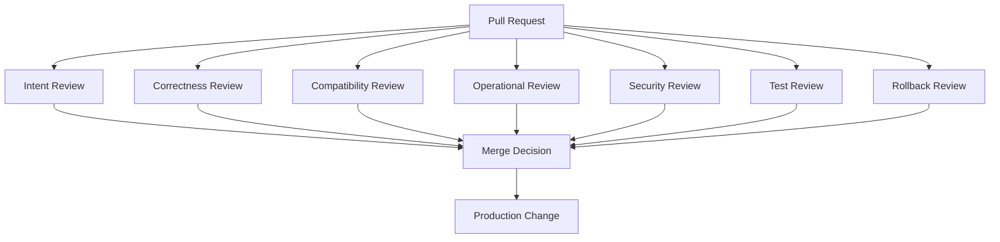
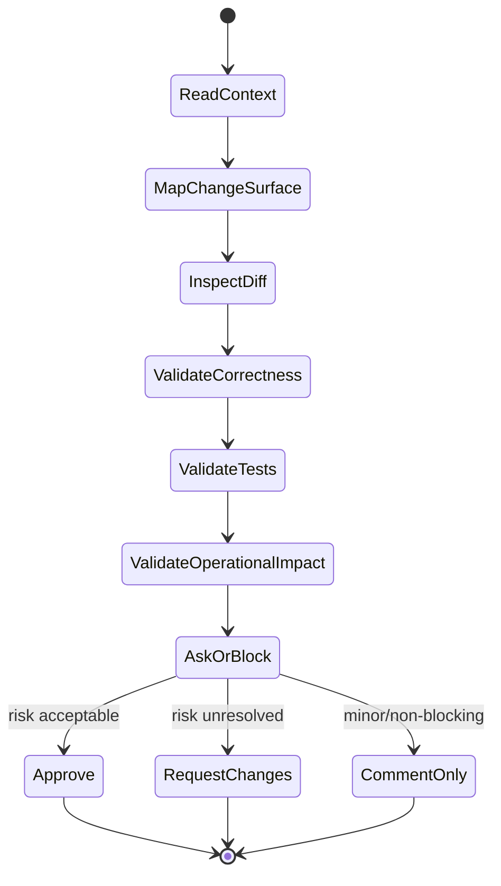

# Part 021 — Senior-Level PR Review

> Fokus part ini: mengubah code review dari aktivitas membaca diff menjadi **quality gate engineering**. Senior-level PR review tidak hanya bertanya “apakah kodenya jalan?”, tetapi juga “apakah perubahan ini benar, aman, compatible, observable, testable, deployable, reversible, dan maintainable?”

Dalam sistem enterprise Java/JAX-RS, PR bisa menyentuh banyak surface sekaligus:

- API contract;
- domain invariant;
- persistence behavior;
- event publishing/consuming;
- dependency graph Maven;
- database migration;
- Redis/Kafka/RabbitMQ integration;
- Kubernetes runtime config;
- CI/CD pipeline;
- release behavior;
- observability;
- security posture.

Review senior harus menangkap risiko lintas layer tersebut.

---

## 1. Mental Model: PR Review as Risk Reduction

PR review bukan hanya pencarian typo atau style issue. PR review adalah proses mengurangi risiko sebelum perubahan menjadi production behavior.



Senior reviewer membaca PR melalui beberapa pertanyaan inti:

| Pertanyaan | Kenapa penting |
|---|---|
| Apa intent perubahan ini? | Menghindari review diff tanpa konteks |
| Apa invariant yang harus tetap benar? | Mencegah bug domain/business rule |
| Apa contract yang berubah? | Mencegah breaking change downstream |
| Apa failure mode baru? | Mencegah incident yang bisa diprediksi |
| Apa evidence correctness? | Menghindari merge berdasarkan asumsi |
| Apa rollback path? | Memastikan recovery ketika release gagal |

Prinsip senior:

> PR review yang baik membuat risiko eksplisit sebelum risiko itu menjadi incident.

---

## 2. Review Lifecycle

Review senior biasanya mengikuti lifecycle berikut:



Urutan yang disarankan:

1. Baca title, description, linked issue, dan acceptance criteria.
2. Identifikasi surface perubahan: API, domain, DB, event, build, pipeline, runtime config, dependency.
3. Baca diff secara top-down untuk intent.
4. Baca diff secara bottom-up untuk edge case.
5. Cocokkan test dengan risiko utama.
6. Cek observability dan rollback.
7. Tulis komentar yang actionable.
8. Putuskan: approve, comment, atau request changes.

Anti-pattern:

```text
- Langsung komentar style sebelum memahami intent.
- Approve hanya karena CI hijau.
- Request changes tanpa menjelaskan risiko.
- Mengulang opini pribadi yang tidak terkait correctness.
- Tidak mengecek test ketika behavior berubah.
- Tidak mengecek migration ketika schema berubah.
```

---

## 3. Correctness Review

Correctness berarti implementasi benar terhadap requirement dan invariant.

Dalam backend Java/JAX-RS, correctness tidak hanya berarti method mengembalikan response yang benar pada happy path.

Correctness mencakup:

- validasi input;
- state transition;
- error handling;
- transaction boundary;
- concurrency behavior;
- idempotency;
- retry behavior;
- persistence consistency;
- API response contract;
- event emission timing;
- cache invalidation;
- authorization boundary.

Checklist correctness:

```text
[ ] Requirement/story dipahami dan tercermin di code.
[ ] Happy path benar.
[ ] Invalid input ditangani.
[ ] Missing resource ditangani.
[ ] Duplicate request ditangani jika relevan.
[ ] State transition valid.
[ ] Transaction boundary benar.
[ ] Retry tidak menyebabkan double effect.
[ ] Error response tidak misleading.
[ ] Tidak ada silent failure.
```

Contoh pertanyaan review:

```text
Apa yang terjadi jika request yang sama dikirim dua kali?
Apakah transition dari QUOTED ke ORDERED selalu valid?
Apakah failure setelah DB commit tetapi sebelum event publish ditangani?
Apakah cache Redis invalidated ketika entity berubah?
Apakah timeout dependency menyebabkan response yang benar?
```

Senior reviewer harus mencari **missing branch of logic**, bukan hanya bug eksplisit.

---

## 4. Domain Invariant Review

Domain invariant adalah aturan yang harus selalu benar, terlepas dari flow mana yang memodifikasi data.

Dalam domain quote/order/CPQ/telco BSS, contoh invariant umum:

- quote tidak boleh submitted tanpa required items;
- order tidak boleh created dari quote yang expired;
- price calculation harus konsisten dengan catalog version;
- state transition harus mengikuti lifecycle resmi;
- line item parent-child relationship tidak boleh rusak;
- customer/account reference harus valid;
- event keluar harus merepresentasikan state yang committed.

Catatan penting:

> Detail invariant CSG tidak boleh diasumsikan. Semua contoh domain harus diverifikasi ke codebase, documentation, product owner, domain expert, atau senior engineer.

Review domain invariant:

```text
[ ] Apakah PR mengubah business rule?
[ ] Apakah rule tersebut berlaku di semua entry point?
[ ] Apakah validation ada di layer yang tepat?
[ ] Apakah batch/job/event consumer juga mengikuti rule yang sama?
[ ] Apakah backward compatibility data lama dipertimbangkan?
[ ] Apakah test mencakup invalid state?
```

Red flag:

```java
// Red flag: validation hanya di resource layer,
// tetapi service method juga dipakai oleh consumer/job lain.
@POST
public Response submitQuote(SubmitQuoteRequest request) {
    validate(request);
    quoteService.submit(request.quoteId());
    return Response.ok().build();
}
```

Pertanyaan review:

```text
Apakah invariant ini harus ditegakkan di resource layer, service layer, entity/domain layer, database constraint, atau kombinasi?
```

---

## 5. API Compatibility Review

API compatibility penting untuk JAX-RS service karena consumer bisa berupa UI, service lain, partner integration, batch, atau external gateway.

Perubahan API yang harus direview ketat:

- path berubah;
- HTTP method berubah;
- required header berubah;
- request field mandatory berubah;
- response field dihapus/rename;
- enum value berubah;
- status code berubah;
- error payload berubah;
- pagination/filter/sort behavior berubah;
- timeout atau retry contract berubah.

Compatibility checklist:

```text
[ ] Existing endpoint tetap compatible.
[ ] Field baru bersifat optional jika consumer lama harus tetap jalan.
[ ] Field lama tidak dihapus tanpa deprecation plan.
[ ] Status code change tidak mematahkan consumer.
[ ] Error payload masih bisa diparse consumer.
[ ] Enum baru tidak mematahkan switch/case consumer.
[ ] OpenAPI/contract docs diperbarui jika digunakan.
[ ] Integration test/contract test diperbarui.
```

Risk pattern:

```text
Backend menambahkan enum value baru.
Consumer lama menganggap enum exhaustive.
Consumer gagal parse atau masuk default error path.
```

Review question:

```text
Apakah perubahan ini additive, backward-compatible, atau breaking?
Jika breaking, siapa consumer-nya dan apa migration plan-nya?
```

---

## 6. Event Compatibility Review

Untuk microservices dengan Kafka/RabbitMQ, event compatibility sama pentingnya dengan API compatibility.

Surface yang perlu dicek:

- topic/queue/exchange/routing key;
- event name/type;
- schema field;
- required vs optional field;
- enum value;
- ordering assumption;
- deduplication key;
- correlation ID;
- retry/DLQ behavior;
- publisher timing relative to DB commit;
- consumer idempotency.

Event review checklist:

```text
[ ] Event schema change backward-compatible.
[ ] Field baru optional atau punya default aman.
[ ] Consumer lama tidak rusak.
[ ] Producer tidak publish event sebelum state committed.
[ ] Consumer idempotent terhadap redelivery.
[ ] Retry tidak menyebabkan duplicate side effect.
[ ] DLQ behavior diketahui.
[ ] Correlation/trace ID ikut terbawa.
[ ] Event versioning strategy jelas jika ada breaking change.
```

Failure mode umum:

```text
- Producer publish event setelah partial update.
- Consumer menerima event duplicate dan membuat order duplicate.
- Field baru dianggap mandatory oleh consumer baru tetapi producer lama belum mengirim.
- Retry broker menyebabkan side effect non-idempotent.
- Event order diasumsikan tetapi tidak dijamin.
```

Review question:

```text
Jika event ini diproses dua kali, apakah hasil akhirnya tetap benar?
```

---

## 7. Database Migration Review

Database migration adalah salah satu area PR yang paling sering menciptakan production risk.

Review migration harus mencakup:

- backward compatibility;
- expand/contract strategy;
- locking risk;
- data volume;
- index creation cost;
- default value behavior;
- nullable vs non-nullable;
- rollback feasibility;
- application version skew;
- migration order relative to deployment.

Checklist migration:

```text
[ ] Migration backward-compatible dengan versi aplikasi lama dan baru.
[ ] Tidak menghapus/rename column yang masih dipakai.
[ ] Non-null column baru punya safe rollout path.
[ ] Index creation mempertimbangkan table besar.
[ ] Data backfill aman, batchable, observable.
[ ] Migration bisa diulang atau punya guard.
[ ] Rollback/roll-forward strategy jelas.
[ ] Test migration tersedia jika framework mendukung.
```

Pattern aman:

```text
Step 1: Add nullable column.
Step 2: Deploy app yang menulis column baru dan masih membaca column lama.
Step 3: Backfill data.
Step 4: Deploy app yang membaca column baru.
Step 5: Setelah aman, drop old column di release terpisah.
```

Red flag:

```sql
ALTER TABLE orders DROP COLUMN legacy_status;
```

Pertanyaan review:

```text
Apakah versi aplikasi lama masih bisa berjalan setelah migration ini diterapkan?
Apakah versi aplikasi baru masih bisa berjalan sebelum migration ini diterapkan?
```

---

## 8. Security Review

Security review tidak hanya untuk PR bertema security. Perubahan biasa dapat membuka risiko security.

Area yang perlu dicek:

- authentication;
- authorization;
- tenant/account boundary;
- input validation;
- output encoding;
- sensitive logging;
- secret handling;
- dependency vulnerability;
- SSRF/path traversal awareness;
- deserialization risk;
- token scope;
- CI secret exposure;
- GitHub workflow permission.

Security checklist:

```text
[ ] Authorization dicek di boundary yang tepat.
[ ] User tidak bisa mengakses resource tenant/account lain.
[ ] Input tidak langsung digunakan untuk path, URL, shell command, SQL, atau broker routing tanpa validation.
[ ] Sensitive data tidak masuk log/error response.
[ ] Secret tidak ditulis ke repository, env dump, shell history, atau CI log.
[ ] Dependency baru punya alasan dan dicek vulnerability/license.
[ ] GitHub Actions permission minimal.
[ ] External endpoint access aman dari SSRF jika relevan.
```

Contoh red flag:

```java
log.info("Payment request: {}", request); // bisa bocor PII/secret/token
```

Pertanyaan review:

```text
Data apa yang paling sensitif dalam flow ini?
Siapa yang boleh melihat/mengubah resource ini?
Apakah log baru aman jika masuk centralized logging?
```

---

## 9. Observability Review

Perubahan yang benar tetapi tidak observable akan menyulitkan incident support.

Observability review mencakup:

- log placement;
- log level;
- correlation ID;
- trace propagation;
- metric;
- error classification;
- alert impact;
- dashboard impact;
- audit event jika dibutuhkan;
- sensitive data redaction.

Checklist observability:

```text
[ ] Failure path penting punya log yang cukup.
[ ] Log tidak terlalu noisy.
[ ] Correlation ID/trace ID tidak hilang.
[ ] Error log menyertakan context aman.
[ ] Metric ditambahkan untuk behavior penting jika relevan.
[ ] Alert tidak menjadi noisy karena perubahan ini.
[ ] Dashboard/runbook diperbarui jika behavior operasional berubah.
[ ] Sensitive data tidak bocor.
```

Review question:

```text
Jika perubahan ini gagal di production, evidence apa yang akan kita punya dalam 5 menit pertama?
```

---

## 10. Performance Review

Performance review tidak berarti premature optimization. Artinya memastikan perubahan tidak jelas-jelas membuat sistem lebih lambat, boros, atau tidak scalable.

Surface performance:

- query database;
- N+1 call;
- cache hit/miss;
- blocking I/O;
- thread pool saturation;
- serialization/deserialization;
- large payload;
- broker consumer throughput;
- memory allocation;
- connection pool usage;
- retry storm;
- CI build time.

Checklist performance:

```text
[ ] Tidak ada loop yang melakukan query/call remote per item tanpa alasan.
[ ] Query baru punya index yang sesuai jika diperlukan.
[ ] Payload size masih masuk akal.
[ ] Retry punya backoff dan limit.
[ ] Cache invalidation/hit behavior dipahami.
[ ] Thread pool/connection pool tidak mudah exhausted.
[ ] Test atau benchmark tersedia untuk path kritikal jika relevan.
```

Red flag:

```java
for (LineItem item : quote.getItems()) {
    priceRepository.findByProductId(item.productId()); // potensi N+1 query
}
```

Review question:

```text
Bagaimana behavior ini berubah ketika data 10x lebih besar atau consumer traffic 10x lebih tinggi?
```

---

## 11. Test Review

CI hijau bukan berarti test memadai.

Test review bertanya:

- apakah test menutupi risiko utama?
- apakah test mengecek behavior, bukan implementasi internal semata?
- apakah edge case penting diuji?
- apakah failure path diuji?
- apakah integration boundary diuji?
- apakah test deterministik?
- apakah test terlalu fragile?

Checklist test:

```text
[ ] Test baru sesuai perubahan behavior.
[ ] Test mencakup negative path.
[ ] Test mencakup boundary condition.
[ ] Test mencakup compatibility jika API/event berubah.
[ ] Test tidak hanya mengejar coverage angka.
[ ] Test tidak bergantung pada waktu/random/order tanpa kontrol.
[ ] Test failure message cukup jelas.
[ ] Flaky risk rendah.
```

Mapping risiko ke test:

| Risiko | Test yang relevan |
|---|---|
| Business rule berubah | Unit/domain/service test |
| API contract berubah | Resource/API/contract test |
| DB query berubah | Repository/integration test |
| Event publish berubah | Producer/consumer integration test |
| Retry/idempotency berubah | Duplicate/retry scenario test |
| Migration berubah | Migration test/backward compatibility test |
| Pipeline berubah | CI dry-run atau validation workflow |

Senior principle:

> Test yang baik adalah evidence untuk risiko paling penting, bukan dekorasi untuk coverage.

---

## 12. Rollback and Roll-forward Review

Setiap PR yang bisa mencapai production harus punya recovery story.

Rollback review mencakup:

- apakah perubahan backward-compatible?
- apakah DB migration bisa di-rollback?
- apakah event/API change bisa coexist dengan versi lama?
- apakah feature flag tersedia?
- apakah config bisa dikembalikan?
- apakah image/artifact lama masih tersedia?
- apakah data yang sudah berubah bisa dipulihkan?

Checklist rollback:

```text
[ ] Rollback aplikasi aman terhadap schema/data baru.
[ ] Rollback tidak mematahkan event/API consumer.
[ ] Feature flag/config bisa men-disable behavior baru jika relevan.
[ ] Data migration irreversible dijelaskan.
[ ] Release note menyebut risiko recovery.
[ ] Smoke test setelah rollback diketahui.
```

Red flag:

```text
PR mengubah schema, data, producer event, dan consumer logic sekaligus tanpa rollout plan.
```

Review question:

```text
Jika deploy ini gagal 30 menit setelah release, apakah kita rollback, roll-forward, disable flag, atau run repair script?
```

---

## 13. Maintainability Review

Maintainability adalah kemampuan tim memahami, mengubah, dan men-debug code di masa depan.

Checklist maintainability:

```text
[ ] Nama class/method/variable menggambarkan domain intent.
[ ] Logic kompleks punya struktur yang mudah diikuti.
[ ] Tidak ada abstraction yang terlalu dini.
[ ] Tidak ada duplication berbahaya.
[ ] Boundary antar layer jelas.
[ ] Error handling konsisten.
[ ] Komentar menjelaskan alasan, bukan mengulang code.
[ ] Dokumentasi diperbarui jika behavior/tooling berubah.
```

Trade-off:

| Pilihan | Kelebihan | Risiko |
|---|---|---|
| Simple explicit code | Mudah dibaca | Bisa ada sedikit duplication |
| Generic abstraction | Reuse | Bisa menyembunyikan domain intent |
| Fast tactical fix | Cepat unblock | Debt jika tidak dicatat |
| Refactor besar | Membersihkan struktur | Review sulit, regression risk |

Senior reviewer harus membedakan:

```text
- issue blocking: correctness/security/release risk;
- issue important but non-blocking: naming, minor structure;
- personal preference: style yang tidak berdampak.
```

---

## 14. Build, Dependency, and Maven Review

Untuk Java/JAX-RS service, PR sering mengubah POM tanpa reviewer sadar dampaknya.

Maven review checklist:

```text
[ ] Dependency baru benar-benar dibutuhkan.
[ ] Version dikelola oleh dependencyManagement/BOM jika policy tim demikian.
[ ] Scope benar: compile/provided/runtime/test.
[ ] Tidak ada transitive conflict signifikan.
[ ] Exclusion punya alasan jelas.
[ ] Plugin version dipin atau dikelola oleh pluginManagement.
[ ] Build tetap reproducible.
[ ] Dependency vulnerability/license dicek.
[ ] CI command tetap konsisten dengan local command.
```

Command yang sering berguna:

```bash
mvn dependency:tree
mvn dependency:tree -Dincludes=groupId:artifactId
mvn help:effective-pom
mvn -U clean verify
```

Review question:

```text
Apakah perubahan POM ini mengubah runtime classpath, hanya test classpath, atau hanya build behavior?
```

---

## 15. CI/CD and Workflow Review

Perubahan workflow GitHub Actions/Jenkins/GitLab CI harus direview sebagai production-impacting change.

Checklist CI/CD review:

```text
[ ] Trigger workflow sesuai kebutuhan.
[ ] Required checks tidak bisa dibypass secara tidak sengaja.
[ ] Secrets tidak terekspos ke PR tidak trusted.
[ ] Permission token minimal.
[ ] Cache key tidak menyebabkan stale dependency berbahaya.
[ ] Artifact yang dipublish traceable ke commit/tag.
[ ] Deployment gate/approval tetap terjaga.
[ ] Failure log cukup jelas.
[ ] Pipeline tidak terlalu lambat tanpa alasan.
```

Red flag:

```yaml
permissions: write-all
```

Review question:

```text
Apakah perubahan pipeline ini bisa membuat code yang belum tervalidasi masuk release path?
```

---

## 16. Review Tone and Actionable Feedback

Senior reviewer bukan hanya benar secara teknis. Senior reviewer membuat tim lebih kuat.

Komentar review yang baik:

- spesifik;
- menjelaskan risiko;
- memberi opsi;
- membedakan blocking vs suggestion;
- tidak menyerang orang;
- tidak memperdebatkan preference kecil secara berlebihan.

Format komentar yang efektif:

```text
[Blocking] Ini terlihat bisa mematahkan consumer lama karena field `status` berubah dari string ke object.
Bisakah kita buat perubahan ini additive dulu, misalnya menambahkan `statusDetail` dan mempertahankan `status` sampai consumer selesai migrasi?
```

```text
[Suggestion] Nama `process()` agak terlalu umum untuk flow ini. `submitQuote()` mungkin lebih jelas, tapi ini tidak blocking.
```

```text
[Question] Apakah consumer RabbitMQ ini idempotent saat message redelivered? Saya belum melihat guard berdasarkan message ID/order ID.
```

Anti-pattern review tone:

```text
- "Ini jelek."
- "Kenapa begini?"
- "Harusnya jelas."
- "Saya lebih suka style X." tanpa dampak correctness/maintainability.
```

Senior principle:

> Komentar review harus membantu author memperbaiki perubahan, bukan sekadar menunjukkan reviewer lebih tahu.

---

## 17. Decision Matrix: Approve, Comment, or Request Changes

Tidak semua masalah harus memblokir merge.

| Temuan | Keputusan umum |
|---|---|
| Correctness bug | Request changes |
| Security issue | Request changes |
| Breaking API/event tanpa plan | Request changes |
| Migration unsafe | Request changes |
| Test tidak menutupi behavior utama | Request changes atau comment tergantung risiko |
| Minor naming issue | Comment/suggestion |
| Style preference non-policy | Usually avoid blocking |
| Missing doc untuk behavior penting | Comment atau request changes jika operational risk |
| CI flaky unrelated | Investigate, jangan ignore otomatis |

Gunakan label mental:

```text
Blocking: harus diperbaiki sebelum merge.
Non-blocking: sebaiknya diperbaiki, tapi tidak menghalangi.
Question: butuh clarification.
Nit: kecil, optional.
Praise: tandai keputusan baik agar pattern tersebar.
```

---

## 18. Failure Modes in PR Review

Failure mode review senior:

```text
1. Reviewer hanya fokus style dan melewatkan invariant.
2. Reviewer approve karena author senior.
3. Reviewer percaya CI hijau tanpa membaca test relevance.
4. Reviewer tidak melihat compatibility consumer.
5. Reviewer tidak mengecek migration lock/backward compatibility.
6. Reviewer mengabaikan observability.
7. Reviewer tidak bertanya rollback.
8. Reviewer memberi komentar terlalu banyak untuk hal kecil sehingga risiko besar tenggelam.
9. Reviewer tidak memahami pipeline/dependency impact.
10. Reviewer tidak meminta internal verification untuk hal yang team-specific.
```

Cara mendeteksi review lemah:

```text
- PR besar approve dalam waktu sangat singkat.
- Tidak ada komentar tentang risk pada PR high-risk.
- Tidak ada test discussion pada behavior change.
- Tidak ada migration discussion pada schema change.
- Tidak ada compatibility discussion pada API/event change.
- Review hanya formatting/naming.
```

---

## 19. Senior PR Review Checklist

Gunakan checklist ini saat mereview PR penting.

```text
Context
[ ] Saya memahami problem/intent PR.
[ ] Scope PR jelas dan tidak terlalu luas.
[ ] Linked issue/story/incidents relevan.

Correctness
[ ] Happy path benar.
[ ] Edge case penting ditangani.
[ ] Error handling konsisten.
[ ] Idempotency/retry dipertimbangkan.
[ ] Transaction boundary benar.

Domain
[ ] Domain invariant tidak rusak.
[ ] State transition valid.
[ ] Validation berada di layer yang tepat.

Compatibility
[ ] API backward-compatible atau migration plan jelas.
[ ] Event backward-compatible atau versioning plan jelas.
[ ] DB migration backward-compatible.

Security
[ ] Authorization boundary aman.
[ ] Sensitive data tidak bocor.
[ ] Dependency/workflow/secret risk dicek.

Observability
[ ] Log/metric/trace cukup untuk debugging.
[ ] Correlation ID tidak hilang.
[ ] Sensitive log redacted.

Performance
[ ] Tidak ada N+1 obvious.
[ ] Query/index/payload/retry aman.
[ ] Resource usage masuk akal.

Testing
[ ] Test menutupi risiko utama.
[ ] Failure path diuji.
[ ] Test deterministik.

Release
[ ] Rollback/roll-forward story jelas.
[ ] Feature flag/config gate ada jika relevan.
[ ] Release note/docs diperbarui jika perlu.

Maintainability
[ ] Struktur code mudah dipahami.
[ ] Naming menggambarkan intent.
[ ] Abstraction tidak berlebihan.

Decision
[ ] Komentar actionable.
[ ] Blocking vs non-blocking jelas.
[ ] Approval diberikan hanya jika risiko acceptable.
```

---

## 20. Internal Verification Checklist

Untuk konteks CSG/team, jangan mengarang aturan internal. Verifikasi hal berikut:

```text
Repository and workflow
[ ] Apa branch strategy resmi?
[ ] Apa merge strategy yang digunakan: squash, rebase, atau merge commit?
[ ] Apa PR template wajib?
[ ] Apa required checks sebelum merge?
[ ] Siapa CODEOWNERS untuk area tertentu?

Domain and architecture
[ ] Apa domain invariant utama Quote & Order?
[ ] Apa state machine quote/order resmi?
[ ] Apa API compatibility policy?
[ ] Apa event schema/versioning policy?
[ ] Apa migration strategy yang diterima?

Testing and CI
[ ] Test apa yang wajib untuk behavior change?
[ ] Apakah contract/integration test tersedia?
[ ] Apakah flaky test punya process khusus?
[ ] Apakah coverage threshold digunakan?

Security and compliance
[ ] Apa secure coding checklist internal?
[ ] Apa policy dependency vulnerability?
[ ] Apa policy secret/log redaction?
[ ] Apa approval tambahan untuk security-sensitive changes?

Release and operations
[ ] Apa release checklist internal?
[ ] Apa rollback process?
[ ] Apa incident/runbook template?
[ ] Apa observability standard?
[ ] Siapa yang perlu approve perubahan release/pipeline/deployment?
```

---

## 21. Practical Review Flow for Daily Use

Saat membuka PR, gunakan flow ringkas ini:

```text
1. Baca deskripsi dan linked issue.
2. Tentukan risk category: low, medium, high.
3. Cek files changed untuk surface area.
4. Review behavior utama.
5. Review test yang membuktikan behavior.
6. Review compatibility dan rollback jika production-impacting.
7. Review observability/security jika runtime-impacting.
8. Tulis komentar actionable.
9. Approve hanya jika risk acceptable.
```

Risk category:

| Risk | Contoh |
|---|---|
| Low | comment/doc, test-only, minor refactor |
| Medium | behavior kecil, dependency patch, endpoint internal |
| High | DB migration, API contract, event schema, security, pipeline, release, shared library |

Senior habit:

```text
Untuk PR high-risk, jangan review dari diff saja. Review dari lifecycle perubahan sampai production.
```

---

## 22. Key Takeaways

- Senior-level PR review adalah risk reduction, bukan style policing.
- Correctness harus dibaca melalui domain invariant, lifecycle, failure mode, dan recovery path.
- API/event/database compatibility adalah area paling mahal jika salah.
- CI hijau bukan bukti cukup; test harus relevan terhadap risiko.
- Security, observability, performance, dan rollback harus muncul dalam review production-impacting.
- Komentar review harus actionable, jelas blocking/non-blocking, dan membantu tim belajar.
- Semua detail CSG/team-specific harus diverifikasi lewat repository, docs, pipeline, runbook, dan diskusi dengan owner terkait.

