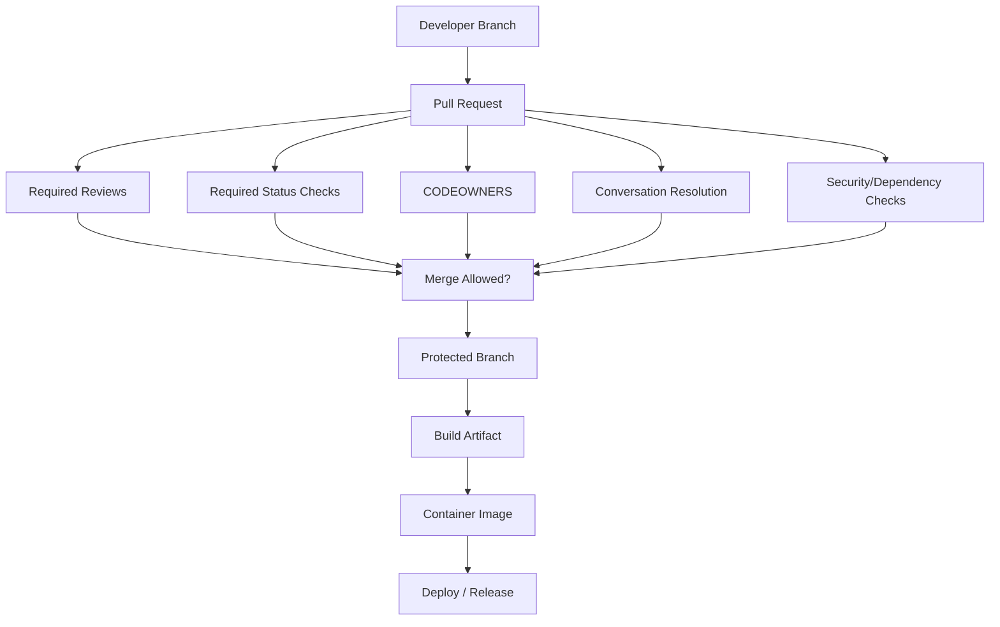
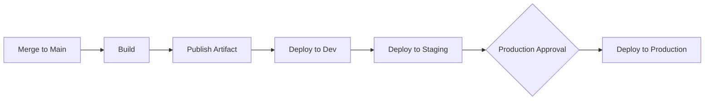

# Part 022 — GitHub Branch Protection and Governance

> Fokus part ini: memahami GitHub branch protection dan governance sebagai **control system** untuk mencegah perubahan berisiko masuk ke branch/release path tanpa review, test, ownership, dan approval yang tepat.

Dalam engineering team yang membangun backend Java/JAX-RS enterprise, branch utama bukan sekadar tempat menyimpan code. Branch utama adalah entry point menuju build artifact, container image, deployment, dan production behavior.

Jika branch utama tidak dilindungi, risiko yang muncul:

- code belum direview bisa masuk main;
- CI gagal tetapi tetap merge;
- migration unsafe masuk release;
- dependency vulnerable masuk artifact;
- pipeline berubah tanpa owner review;
- admin bypass terjadi tanpa audit discipline;
- conversation penting belum resolved;
- deployment ke environment sensitif terjadi tanpa approval.

Branch protection adalah guardrail, bukan birokrasi.

---

## 1. Mental Model: Branch as Release Boundary

Protected branch harus dipahami sebagai batas kontrol perubahan.



Governance principle:

> Semakin dekat sebuah branch ke release/production, semakin kuat guardrail yang diperlukan.

Branch protection menjawab:

- siapa boleh merge?
- kapan merge boleh dilakukan?
- validasi apa yang wajib hijau?
- reviewer mana yang wajib approve?
- apakah history boleh diubah?
- apakah conversation harus selesai?
- apakah deployment butuh approval tambahan?

---

## 2. Protected Branch

Protected branch adalah branch yang memiliki aturan khusus sebelum perubahan bisa masuk.

Branch yang biasanya dilindungi:

```text
main
master
trunk
develop
release/*
hotfix/*
```

Namun nama branch dan strategy internal harus diverifikasi. Jangan mengasumsikan CSG memakai branch tertentu.

Kontrol umum:

- require pull request before merging;
- require approvals;
- require status checks;
- require branches to be up to date;
- require conversation resolution;
- require signed commits;
- require linear history;
- restrict who can push;
- restrict who can dismiss reviews;
- restrict force push;
- restrict branch deletion.

Review question:

```text
Apakah branch ini adalah branch kerja biasa, integration branch, release branch, atau production path?
```

---

## 3. Required Status Checks

Required status checks memastikan validasi otomatis harus berhasil sebelum merge.

Untuk Java/Maven backend, required checks umum:

```text
- compile
- unit test
- integration test
- maven verify
- static analysis
- formatting/linting
- dependency vulnerability scan
- license scan
- container build
- image scan
- contract test
- migration validation
```

Required check harus dipilih hati-hati.

Jika terlalu sedikit:

```text
Bug lolos karena pipeline non-wajib gagal tapi PR tetap merge.
```

Jika terlalu banyak dan flaky:

```text
Developer terbiasa bypass, rerun tanpa analisis, atau mencari admin override.
```

Checklist required checks:

```text
[ ] Check wajib benar-benar mengurangi risiko production.
[ ] Check tidak mudah flaky.
[ ] Check punya nama stabil.
[ ] Check berjalan pada event PR yang tepat.
[ ] Check tidak bisa dilewati oleh perubahan path tertentu tanpa alasan.
[ ] Check security/dependency relevan masuk required jika policy mengharuskan.
[ ] Check release/deploy tidak bercampur dengan PR validation tanpa gate jelas.
```

Failure mode:

```text
Workflow diganti nama, branch protection masih menunggu check lama, PR stuck.
```

Debugging:

```text
- Cek nama check di PR.
- Cek branch protection required check list.
- Cek workflow trigger.
- Cek apakah workflow skipped karena path filter.
- Cek permission workflow.
```

---

## 4. Required Review

Required review memaksa perubahan dibaca oleh manusia sebelum merge.

Konfigurasi umum:

- minimum approval count;
- require review from CODEOWNERS;
- dismiss stale approvals after new commits;
- require approval from someone other than author;
- restrict who can dismiss review;
- require last push approval.

Review bukan formalitas. Review adalah validation terhadap hal yang tidak bisa sepenuhnya diketahui CI:

- correctness domain;
- API compatibility;
- event semantics;
- migration safety;
- rollback path;
- maintainability;
- operational risk;
- security context.

Checklist review rule:

```text
[ ] Jumlah approval cukup untuk risiko repo.
[ ] CODEOWNERS aktif untuk path penting.
[ ] Approval stale otomatis dismissed setelah commit baru jika policy perlu.
[ ] Author tidak bisa self-approve.
[ ] Review dismissal dibatasi.
[ ] High-risk area punya reviewer owner.
```

Trade-off:

| Rule | Manfaat | Risiko |
|---|---|---|
| 1 approval | Cepat | Bisa kurang untuk area kritikal |
| 2 approvals | Lebih kuat | Bisa memperlambat flow |
| CODEOWNERS wajib | Ownership jelas | Bottleneck jika owner sedikit |
| Dismiss stale review | Review valid terhadap diff terbaru | Bisa banyak re-approval untuk commit kecil |

---

## 5. CODEOWNERS

CODEOWNERS menghubungkan path repository dengan owner review.

Contoh area yang sering perlu owner:

```text
.github/workflows/*
pom.xml
**/pom.xml
Dockerfile
helm/**
k8s/**
scripts/**
db/migration/**
api/openapi/**
events/schema/**
security/**
```

CODEOWNERS berguna untuk:

- memastikan perubahan build/pipeline direview platform owner;
- memastikan migration direview backend/database owner;
- memastikan API contract direview service owner;
- memastikan security-sensitive path direview security/platform owner;
- mengurangi tribal routing.

Checklist CODEOWNERS:

```text
[ ] Path penting punya owner.
[ ] Owner masih aktif dan responsif.
[ ] Pattern tidak terlalu luas sehingga semua PR bottleneck.
[ ] Pattern tidak terlalu sempit sehingga path penting terlewat.
[ ] Ownership shared tooling jelas.
[ ] CODEOWNERS diuji dengan PR nyata.
```

Failure mode:

```text
- CODEOWNERS terlalu luas: semua PR butuh platform approval.
- CODEOWNERS terlalu sempit: workflow/pipeline bisa berubah tanpa owner.
- Owner sudah pindah tim: PR stuck.
- Pattern tidak match karena path/case salah.
```

Review question:

```text
Jika file ini berubah, siapa yang akan menanggung incident jika salah?
Orang/tim itulah kandidat owner review.
```

---

## 6. Dismiss Stale Review

Dismiss stale review berarti approval lama dibatalkan ketika ada commit baru.

Manfaat:

- reviewer approval selalu mengacu pada diff terbaru;
- author tidak bisa menambahkan perubahan berisiko setelah approval;
- mengurangi risiko “approve lalu diff berubah total”.

Risiko:

- commit kecil seperti typo bisa memaksa re-approval;
- memperlambat PR besar;
- bisa membuat developer menghindari update kecil setelah approval.

Senior interpretation:

```text
Jika branch protection dismiss stale review aktif, pastikan author memahami bahwa setiap push setelah approval membuka ulang review risk.
```

Checklist:

```text
[ ] Dismiss stale review cocok dengan risk profile repo.
[ ] Tim tahu kapan harus push fixup sebelum/after approval.
[ ] Reviewer mengecek diff sejak approval terakhir.
[ ] Auto-format commit setelah approval dihindari.
```

---

## 7. Required Conversation Resolution

Required conversation resolution memastikan thread review yang belum selesai tidak tenggelam sebelum merge.

Manfaat:

- blocking concern tidak terabaikan;
- keputusan review terekam;
- author dan reviewer menyepakati resolution;
- audit trail lebih jelas.

Namun, conversation resolution bukan pengganti review quality.

Anti-pattern:

```text
- Resolve comment sendiri tanpa menjawab concern.
- Resolve thread dengan "done" tetapi code tidak berubah.
- Resolve blocking concern tanpa reviewer confirmation.
- Menggunakan resolve untuk menyembunyikan disagreement.
```

Checklist:

```text
[ ] Semua blocking thread benar-benar selesai.
[ ] Non-blocking thread diberi keputusan jelas.
[ ] Disagreement penting dicatat.
[ ] Reviewer memverifikasi fix jika risk tinggi.
```

Review question:

```text
Apakah thread ini selesai secara teknis, atau hanya disembunyikan dari UI?
```

---

## 8. Linear History

Require linear history mencegah merge commit dan menjaga history sebagai garis lurus.

Manfaat:

- history lebih mudah dibaca;
- bisect lebih sederhana;
- release notes dari commits lebih bersih;
- revert lebih mudah jika squash commit digunakan konsisten.

Risiko:

- rebase wajib bisa membingungkan developer;
- conflict resolution terjadi di branch author;
- force-with-lease workflow harus dipahami;
- commit context bisa hilang jika squash terlalu agresif.

Pilihan merge strategy:

| Strategy | Kelebihan | Risiko |
|---|---|---|
| Merge commit | Preserve branch history | History ramai |
| Squash merge | Main bersih, satu PR satu commit | Commit granular hilang |
| Rebase merge | Linear dan commit granular | Butuh commit hygiene tinggi |

Checklist linear history:

```text
[ ] Merge strategy sesuai release/debugging kebutuhan tim.
[ ] Developer paham rebase/force-with-lease jika diperlukan.
[ ] Commit message squash cukup informatif.
[ ] Revert workflow diketahui.
[ ] Bisect strategy tetap masuk akal.
```

Internal detail harus diverifikasi: apakah CSG/team memakai squash, merge commit, rebase merge, atau kombinasi.

---

## 9. Signed Commits and Tag Integrity

Signed commit/tag membantu membuktikan bahwa commit/tag dibuat oleh identity yang dipercaya.

Use case:

- compliance;
- audit trail;
- supply-chain security;
- release tag integrity;
- mencegah impersonation di commit author.

Checklist:

```text
[ ] Commit signing policy jelas.
[ ] Tag signing policy jelas untuk release.
[ ] Developer tahu setup GPG/SSH signing jika diwajibkan.
[ ] CI/bot signing behavior jelas.
[ ] Unsigned commit behavior dipahami.
```

Trade-off:

```text
Signed commit meningkatkan integrity, tetapi menambah onboarding friction jika setup tidak didokumentasikan.
```

Review question:

```text
Apakah repo ini membutuhkan cryptographic identity untuk commit/tag karena release atau compliance?
```

---

## 10. Admin Bypass Risk

Admin bypass adalah kemampuan admin melewati branch protection.

Kadang diperlukan untuk emergency. Tetapi tanpa discipline, bypass menghancurkan governance.

Risiko bypass:

- code masuk tanpa CI;
- review dilewati;
- audit trail tidak cukup;
- release branch berubah tanpa approval;
- incident recovery makin sulit;
- tim kehilangan trust pada guardrail.

Checklist admin bypass:

```text
[ ] Siapa yang bisa bypass diketahui.
[ ] Bypass punya policy dan alasan sah.
[ ] Emergency bypass dicatat.
[ ] Post-bypass validation wajib dilakukan.
[ ] Bypass tidak digunakan untuk kenyamanan sehari-hari.
[ ] Audit log bisa diperiksa.
```

Emergency bypass minimal harus menjawab:

```text
- Kenapa bypass diperlukan?
- Risiko apa yang diterima?
- Siapa yang approve?
- Check apa yang akan dijalankan setelahnya?
- Bagaimana audit trail disimpan?
```

Senior principle:

> Bypass adalah exception path, bukan productivity shortcut.

---

## 11. Repository Rulesets

Repository rulesets memungkinkan aturan yang lebih terpusat dan konsisten untuk branch/tag/repository policy.

Ruleset dapat digunakan untuk:

- branch pattern;
- tag pattern;
- required status checks;
- required reviews;
- signed commits;
- restrict deletion;
- restrict force push;
- deployment-related constraints;
- organization-level consistency.

Governance benefit:

```text
Branch protection yang tersebar per repo sering drift.
Ruleset membantu standardisasi across repositories.
```

Checklist ruleset:

```text
[ ] Ruleset branch utama jelas.
[ ] Ruleset release branch jelas.
[ ] Ruleset tag/release jelas jika digunakan.
[ ] Exception documented.
[ ] Ruleset tidak konflik dengan workflow release.
[ ] Perubahan ruleset direview owner governance/platform.
```

Failure mode:

```text
Ruleset baru diterapkan organization-wide dan memblokir release karena required check tidak ada di sebagian repo.
```

Debugging:

```text
- Cek rule mana yang blocking merge.
- Cek pattern branch/tag yang match.
- Cek required check name.
- Cek apakah repo punya inherited organization ruleset.
- Cek exception/bypass actor.
```

---

## 12. Environment Protection and Deployment Approval

GitHub environment dapat digunakan untuk mengontrol deployment ke environment tertentu.

Environment protection dapat mencakup:

- required reviewers;
- wait timer;
- environment secrets;
- deployment branch restriction;
- approval sebelum job deploy berjalan.

Untuk enterprise CI/CD, environment protection penting karena branch merge dan deploy bukan selalu hal yang sama.



Checklist environment protection:

```text
[ ] Environment dev/staging/prod terpisah jelas.
[ ] Secret scoped ke environment yang tepat.
[ ] Production deployment butuh approval jika policy mengharuskan.
[ ] Branch restriction mencegah deploy dari branch tidak sah.
[ ] Deployment approval tidak bisa dilakukan oleh actor yang tidak tepat.
[ ] Audit trail deployment tersedia.
```

Failure mode:

```text
Secret production tersedia di job PR validation sehingga bisa terekspos oleh workflow yang tidak trusted.
```

Review question:

```text
Apakah secret dan permission ini tersedia hanya pada stage yang benar-benar membutuhkan?
```

---

## 13. Secrets and Workflow Permissions Governance

Branch protection tidak cukup jika workflow memiliki permission terlalu luas.

Governance harus mencakup:

- repository secrets;
- organization secrets;
- environment secrets;
- GitHub token permissions;
- OIDC federation;
- third-party action usage;
- fork PR behavior;
- artifact access;
- deployment credentials.

Checklist permission:

```text
[ ] Workflow memakai least privilege.
[ ] `permissions` didefinisikan eksplisit untuk workflow/job sensitif.
[ ] Secret tidak tersedia untuk event yang tidak trusted.
[ ] OIDC trust policy membatasi repo/branch/environment.
[ ] Third-party action dipin sesuai policy.
[ ] Deployment credential tidak tersedia di PR validation.
```

Red flag:

```yaml
permissions: write-all
```

Better pattern:

```yaml
permissions:
  contents: read
  pull-requests: read
```

Untuk deployment job, permission mungkin lebih tinggi, tetapi harus scoped dan justified.

---

## 14. Tag Protection and Release Governance

Release governance tidak hanya branch. Tag juga penting karena tag sering menjadi trigger release artifact.

Risiko tag tanpa protection:

- tag release bisa dibuat dari commit salah;
- tag bisa dihapus/dipindah;
- release artifact tidak traceable;
- hotfix tag tidak mengikuti approval;
- malicious atau accidental tag memicu deploy.

Checklist tag governance:

```text
[ ] Release tag pattern jelas.
[ ] Siapa boleh membuat release tag jelas.
[ ] Tag immutability dijaga.
[ ] Signed tag digunakan jika policy mengharuskan.
[ ] Pipeline release memvalidasi tag source.
[ ] Wrong tag recovery process diketahui.
```

Review question:

```text
Apakah membuat tag ini sama dengan memulai release process?
Jika ya, tag harus diperlakukan sebagai production-impacting action.
```

---

## 15. Governance for High-Risk Paths

Tidak semua file punya risiko yang sama.

High-risk paths:

```text
.github/workflows/**
Dockerfile
helm/**
k8s/**
terraform/**
infra/**
pom.xml
**/pom.xml
db/migration/**
api/openapi/**
events/schema/**
scripts/deploy*.sh
scripts/release*.sh
```

Untuk path ini, governance harus lebih kuat:

- CODEOWNERS;
- required review owner;
- required CI checks;
- security scan;
- deployment approval;
- ADR untuk perubahan besar;
- internal verification checklist.

Checklist:

```text
[ ] Path high-risk teridentifikasi.
[ ] Owner high-risk path jelas.
[ ] Required checks relevan.
[ ] Review checklist khusus tersedia.
[ ] Emergency change process jelas.
```

---

## 16. Failure Modes of Weak Governance

Weak governance sering tidak terlihat sampai terjadi incident.

Failure mode:

```text
1. Main branch bisa dipush langsung.
2. Required CI tidak mencakup integration test penting.
3. Workflow security scan non-required sehingga diabaikan.
4. CODEOWNERS tidak mencakup pipeline/deployment files.
5. Admin bypass dipakai untuk mempercepat merge rutin.
6. Conversation unresolved tetap merge.
7. Release tag bisa dipindah tanpa audit.
8. Production deployment tidak butuh approval.
9. Workflow punya permission write-all.
10. Secret production tersedia di PR dari fork.
```

Dampak:

- regression production;
- supply-chain exposure;
- broken release;
- audit gap;
- incident recovery sulit;
- developer trust turun;
- governance tambahan yang lebih berat setelah incident.

---

## 17. Debugging Blocked Merge

Ketika PR tidak bisa merge, jangan langsung minta admin bypass. Debug dulu.

Checklist blocked merge:

```text
[ ] Apakah required checks belum selesai?
[ ] Apakah check gagal atau skipped?
[ ] Apakah branch perlu update dari base?
[ ] Apakah approval kurang?
[ ] Apakah CODEOWNERS review belum ada?
[ ] Apakah stale review dismissed karena commit baru?
[ ] Apakah conversation belum resolved?
[ ] Apakah branch terkena ruleset organization?
[ ] Apakah merge conflict ada?
[ ] Apakah actor tidak punya permission merge?
```

Command Git lokal yang membantu:

```bash
git fetch origin
git status
git log --oneline --decorate --graph --max-count=20
git branch -vv
git diff origin/main...HEAD
```

Pertanyaan sebelum bypass:

```text
Apakah masalah ini governance bug, CI bug, atau memang perubahan belum layak merge?
```

---

## 18. Trade-offs: Safety vs Flow

Governance yang baik tidak berarti semua hal diperlambat.

| Kontrol | Safety gain | Flow cost | Cara menyeimbangkan |
|---|---|---|---|
| Required checks banyak | Validasi kuat | CI lama | Pilih check relevan dan stabil |
| CODEOWNERS luas | Owner awareness | Bottleneck | Owner path spesifik |
| 2 approvals | Review kuat | Waiting time | Terapkan ke branch/path kritikal |
| Dismiss stale review | Diff terbaru tervalidasi | Re-approval friction | Edukasi author dan reviewer |
| Production approval | Deployment control | Lead time | Gunakan untuk env sensitif |
| Signed commits | Audit/integrity | Setup friction | Dokumentasi onboarding jelas |

Senior governance principle:

> Guardrail harus cukup kuat untuk mencegah incident yang masuk akal, tetapi cukup ringan agar developer tidak terdorong mencari bypass.

---

## 19. Branch Protection Review Checklist

Gunakan checklist ini saat menilai repo baru atau mereview governance change.

```text
Branch and merge
[ ] Branch utama terlindungi.
[ ] Direct push dibatasi.
[ ] Force push dibatasi.
[ ] Branch deletion dibatasi.
[ ] Merge strategy sesuai policy.

Review
[ ] PR wajib sebelum merge.
[ ] Approval minimum sesuai risk profile.
[ ] CODEOWNERS aktif untuk path penting.
[ ] Stale review policy jelas.
[ ] Conversation resolution wajib jika policy mengharuskan.

Checks
[ ] Required checks mencakup build/test/scan penting.
[ ] Check names stabil.
[ ] Flaky required checks ditangani.
[ ] Path filter tidak membuat validasi penting skipped.

Security
[ ] Workflow permission least privilege.
[ ] Secrets scoped benar.
[ ] Third-party action policy jelas.
[ ] OIDC/deployment trust dibatasi.

Release
[ ] Release branch/tag governance jelas.
[ ] Production deployment butuh gate jika policy mengharuskan.
[ ] Artifact traceability dijaga.

Operations
[ ] Admin bypass policy jelas.
[ ] Audit trail tersedia.
[ ] Emergency path documented.
```

---

## 20. Internal Verification Checklist

Untuk konteks CSG/team, verifikasi detail berikut, jangan diasumsikan.

```text
Repository governance
[ ] Branch utama apa yang digunakan: main/master/trunk/develop?
[ ] Branch release/hotfix pattern apa yang digunakan?
[ ] Apakah repository ruleset diterapkan dari organization?
[ ] Apakah branch protection per repo atau centralized?

PR and review
[ ] Berapa approval wajib?
[ ] Apakah CODEOWNERS wajib?
[ ] Siapa owner path high-risk?
[ ] Apakah stale review dismissed?
[ ] Apakah conversation resolution wajib?

CI/CD
[ ] Check apa yang required?
[ ] Apakah security scan required?
[ ] Apakah integration/contract test required?
[ ] Apakah workflow path filter bisa skip validasi penting?
[ ] Apakah deployment trigger dari branch, tag, atau manual approval?

Security
[ ] Apakah commit/tag signing diwajibkan?
[ ] Apakah third-party GitHub Actions harus dipin?
[ ] Apa default GitHub token permission?
[ ] Bagaimana secret production di-scope?
[ ] Apakah OIDC federation digunakan?

Release
[ ] Siapa boleh membuat release tag?
[ ] Apakah tag protected/immutable?
[ ] Apa policy wrong tag?
[ ] Apa environment approval untuk staging/prod?
[ ] Bagaimana audit deployment dilakukan?

Exception
[ ] Siapa bisa admin bypass?
[ ] Kapan bypass diperbolehkan?
[ ] Bagaimana bypass dicatat?
[ ] Apa post-bypass validation wajib?
```

---

## 21. Practical Governance Review Flow

Saat masuk repository baru, lakukan audit ringan:

```text
1. Lihat branch default.
2. Lihat branch protection/ruleset.
3. Lihat required checks.
4. Lihat CODEOWNERS.
5. Lihat PR template.
6. Lihat workflow deployment.
7. Lihat secret/environment usage.
8. Lihat release tag pattern.
9. Lihat siapa bisa merge/admin.
10. Bandingkan dengan actual PR/release history.
```

Output audit yang berguna:

```text
- Branch utama terlindungi? Ya/Tidak.
- Required checks cukup? Ya/Tidak/Gap.
- CODEOWNERS mencakup high-risk path? Ya/Tidak/Gap.
- Deployment gate aman? Ya/Tidak/Unknown.
- Tag release protected? Ya/Tidak/Unknown.
- Bypass policy jelas? Ya/Tidak/Unknown.
```

---

## 22. Key Takeaways

- Branch protection adalah guardrail untuk production change control.
- Required checks harus relevan, stabil, dan benar-benar required.
- Required review dan CODEOWNERS menjaga ownership dan domain/platform expertise masuk ke PR.
- Conversation resolution, stale review dismissal, dan linear history meningkatkan integrity jika dipakai dengan discipline.
- Admin bypass harus menjadi exception path dengan audit dan post-validation.
- Environment protection dan deployment approval memisahkan merge governance dari deployment governance.
- Workflow permission, secret scoping, OIDC, dan action pinning adalah bagian dari GitHub governance, bukan detail sekunder.
- Tag governance penting jika tag memicu release.
- Semua detail branch strategy, ruleset, CODEOWNERS, CI/CD, deployment approval, dan release tag di CSG harus diverifikasi secara internal.

