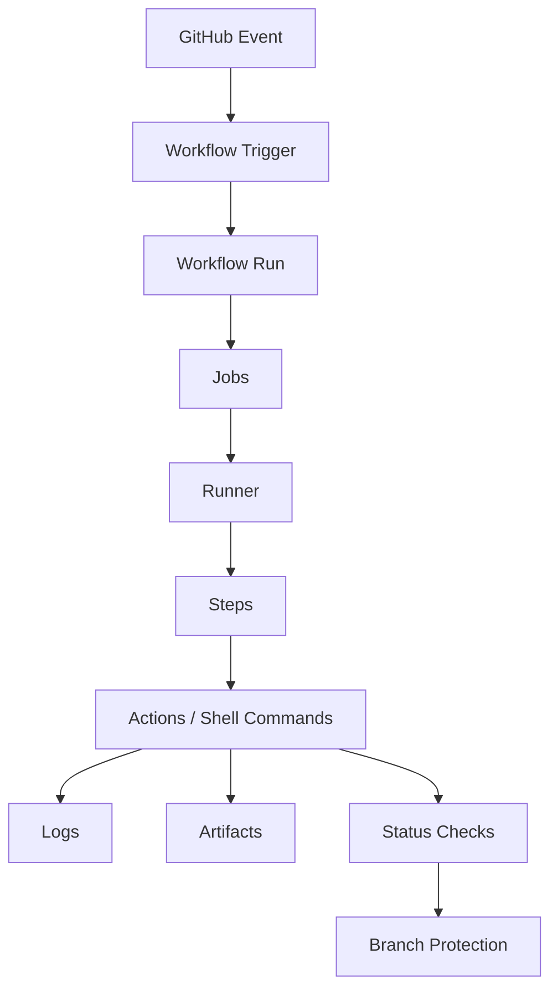
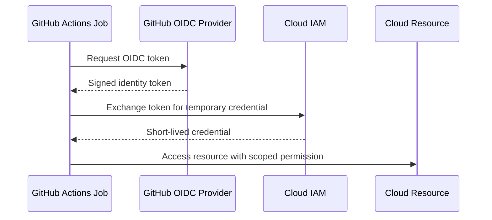

# Part 023 — GitHub Actions Foundation

> Fokus part ini: memahami GitHub Actions sebagai **automation control plane** untuk validasi PR, build, scan, packaging, deployment trigger, dan governance. Tujuannya bukan sekadar bisa menulis YAML, tetapi mampu membaca workflow sebagai sistem eksekusi yang punya lifecycle, permission model, failure mode, security boundary, dan audit trail.

Dalam backend Java/JAX-RS enterprise, GitHub Actions biasanya berada di jalur kritis:

```text
commit -> pull request -> CI validation -> merge -> build artifact -> image -> deployment trigger -> release evidence
```

Jika workflow CI/CD salah, dampaknya bukan hanya build gagal. Dampaknya bisa berupa:

- PR yang seharusnya gagal menjadi mergeable;
- artifact dibangun dari commit yang salah;
- dependency vulnerable lolos;
- secret bocor ke log;
- deployment berjalan dari event yang salah;
- cache menyebabkan build tidak reproducible;
- pipeline terlalu flaky sehingga developer kehilangan trust;
- environment production bisa disentuh dengan permission terlalu luas.

GitHub Actions harus diperlakukan sebagai bagian dari production engineering surface.

---

## 1. Mental Model: GitHub Actions as Event-Driven Workflow Engine

GitHub Actions berjalan berdasarkan event.



Event bisa berupa:

```text
push
pull_request
workflow_dispatch
schedule
release
create tag
deployment
repository_dispatch
workflow_call
```

Senior-level understanding:

> Workflow bukan command list. Workflow adalah graph eksekusi yang dipicu oleh event, berjalan di runner, memakai permission, mengakses secret, menghasilkan status check, artifact, dan audit trail.

Pertanyaan inti saat membaca workflow:

```text
Event apa yang memicu workflow ini?
Commit/ref mana yang dipakai?
Permission apa yang diberikan?
Secret apa yang tersedia?
Artifact apa yang dihasilkan?
Status check apa yang dikirim ke PR?
Apakah workflow ini bisa memengaruhi release/deployment?
```

---

## 2. Workflow File Anatomy

Workflow GitHub Actions biasanya berada di:

```text
.github/workflows/<name>.yml
.github/workflows/<name>.yaml
```

Struktur dasar:

```yaml
name: java-ci

on:
  pull_request:
    branches: [ main ]
  push:
    branches: [ main ]

permissions:
  contents: read

jobs:
  build:
    runs-on: ubuntu-latest
    steps:
      - name: Checkout
        uses: actions/checkout@v4

      - name: Run build
        run: ./mvnw verify
```

Komponen penting:

| Komponen | Fungsi | Failure Mode |
|---|---|---|
| `name` | Nama workflow/status context | Nama berubah, branch protection menunggu check lama |
| `on` | Event trigger | Workflow tidak jalan atau jalan di event salah |
| `permissions` | Permission token default | Terlalu luas atau terlalu sempit |
| `jobs` | Unit eksekusi utama | Dependency antar job salah |
| `runs-on` | Runner target | Tooling/OS berbeda dari asumsi |
| `steps` | Command/action dalam job | Step gagal, secret bocor, path salah |
| `uses` | Reusable action | Supply-chain risk jika tidak dipin |
| `run` | Shell command | Quoting, exit code, env mismatch |

Checklist workflow anatomy:

```text
[ ] Workflow punya nama stabil.
[ ] Trigger eksplisit dan sesuai lifecycle.
[ ] Permission didefinisikan eksplisit.
[ ] Runner jelas.
[ ] Step diberi nama yang mudah dibaca.
[ ] Action pihak ketiga direview.
[ ] Command shell aman dan reproducible.
```

---

## 3. Event Trigger Semantics

Trigger adalah sumber banyak bug CI/CD.

Contoh trigger PR:

```yaml
on:
  pull_request:
    branches:
      - main
```

Artinya workflow berjalan saat PR menuju `main`, bukan saat branch source bernama `main`.

Contoh trigger push:

```yaml
on:
  push:
    branches:
      - main
```

Artinya workflow berjalan saat commit masuk ke branch `main`.

Contoh manual trigger:

```yaml
on:
  workflow_dispatch:
    inputs:
      environment:
        description: "Target environment"
        required: true
        type: choice
        options:
          - dev
          - staging
```

Manual trigger berguna untuk operasi yang butuh kontrol manusia, tetapi berbahaya jika input tidak divalidasi.

Common trigger pitfalls:

```text
- Workflow hanya jalan di push, bukan pull_request.
- Workflow PR jalan tetapi push ke main tidak divalidasi ulang.
- Path filter terlalu agresif sehingga check penting skipped.
- Tag trigger terlalu luas dan memicu release dari tag salah.
- workflow_dispatch bisa deploy environment sensitif tanpa approval.
- schedule workflow berjalan dengan stale dependency atau permission terlalu luas.
```

Review questions:

```text
Apakah trigger ini valid untuk PR validation, merge validation, release, atau deployment?
Apakah event ini berjalan pada ref/commit yang benar?
Apakah branch protection mensyaratkan check dari workflow ini?
```

---

## 4. Pull Request Event Risk

`pull_request` adalah event umum untuk CI. Namun security model-nya perlu dipahami, terutama untuk repository public atau contribution dari fork.

Risk surface:

```text
PR code tidak trusted.
Workflow menjalankan code dari PR.
Secret tidak boleh tersedia sembarangan.
Token permission harus minimal.
```

Secara prinsip:

```text
PR validation boleh menjalankan build/test.
PR validation tidak boleh punya deployment secret.
PR validation tidak boleh publish artifact release final.
PR validation tidak boleh punya write permission tanpa alasan kuat.
```

Hindari pola:

```yaml
permissions: write-all
```

Lebih aman:

```yaml
permissions:
  contents: read
  checks: write
```

Atau untuk build/test saja:

```yaml
permissions:
  contents: read
```

Internal context:

> Untuk repository private enterprise, risk model berbeda dari public fork, tetapi prinsip least privilege tetap berlaku. Jangan menganggap private repo otomatis aman.

---

## 5. Job and Step Execution Model

Workflow terdiri dari satu atau banyak job.

```yaml
jobs:
  test:
    runs-on: ubuntu-latest
    steps:
      - run: ./mvnw test

  package:
    needs: test
    runs-on: ubuntu-latest
    steps:
      - run: ./mvnw package
```

Default behavior:

```text
- Job berjalan paralel kecuali memakai needs.
- Step dalam job berjalan berurutan.
- Step gagal membuat job gagal kecuali continue-on-error digunakan.
- Job punya filesystem runner sendiri.
- State antar job tidak otomatis terbawa kecuali lewat artifact/cache/output.
```

Failure mode umum:

```text
Job package mengasumsikan hasil build dari job test masih ada di filesystem.
```

Padahal job berbeda biasanya runner berbeda.

Solusi:

```text
- Build ulang di job berikutnya; atau
- upload/download artifact; atau
- gabungkan dalam job yang sama jika lifecycle memang satu unit.
```

Review checklist:

```text
[ ] Dependency antar job memakai needs.
[ ] Artifact dibawa eksplisit antar job.
[ ] Tidak ada asumsi filesystem shared antar job.
[ ] continue-on-error tidak menyembunyikan failure penting.
[ ] Timeout job didefinisikan untuk mencegah workflow menggantung.
```

---

## 6. Runner Mental Model

Runner adalah mesin tempat job berjalan.

Jenis runner:

```text
GitHub-hosted runner
self-hosted runner
larger runner
containerized job runner
```

Untuk backend Java/Maven, runner memengaruhi:

- OS behavior;
- shell behavior;
- installed tools;
- Java version;
- Maven version;
- Docker availability;
- network access;
- access ke artifact repository;
- credential dan secret boundary;
- performance build.

Contoh:

```yaml
runs-on: ubuntu-latest
```

Risk:

```text
ubuntu-latest bisa berubah versi OS di masa depan.
```

Lebih deterministic:

```yaml
runs-on: ubuntu-24.04
```

Self-hosted runner risk:

```text
- state tersisa dari job sebelumnya;
- local cache memengaruhi build;
- credential tersimpan di mesin;
- network access lebih luas;
- maintenance responsibility internal;
- concurrency dan isolation harus dikontrol.
```

Review questions:

```text
Runner ini ephemeral atau persistent?
Tooling apa yang sudah preinstalled?
Apakah runner punya akses network ke repository/artifact/cloud internal?
Apakah runner bisa menjadi lateral movement risk jika workflow compromised?
```

---

## 7. Actions: Marketplace, Internal, Composite, Reusable

Step bisa memakai `run` atau `uses`.

```yaml
steps:
  - uses: actions/checkout@v4
  - uses: actions/setup-java@v4
    with:
      distribution: temurin
      java-version: '21'
  - run: ./mvnw verify
```

Jenis action:

| Jenis | Contoh | Kegunaan | Risiko |
|---|---|---|---|
| Official action | `actions/checkout` | Common platform task | Tetap perlu versi jelas |
| Marketplace action | third-party | Reuse cepat | Supply-chain risk |
| Internal action | org/repo/action | Standard internal | Ownership/versioning wajib |
| Composite action | Wrapper steps | Reuse logic kecil | Debugging bisa tersembunyi |
| Reusable workflow | `workflow_call` | Standard pipeline | Contract dan permission harus jelas |

Pinning practice:

```yaml
uses: actions/checkout@v4
```

Lebih kuat untuk high-security workflow:

```yaml
uses: actions/checkout@<full-commit-sha>
```

Trade-off:

| Pinning | Manfaat | Risiko |
|---|---|---|
| Major version | Mudah update | Supply-chain drift lebih besar |
| Full SHA | Integrity kuat | Update maintenance lebih berat |
| Internal wrapper | Standardized | Bisa menyembunyikan behavior |

Internal verification diperlukan untuk action pinning policy.

---

## 8. Shell Execution in Actions

Step `run` dieksekusi oleh shell default sesuai OS.

Di Linux runner, default umumnya Bash-like shell.

```yaml
- name: Run tests
  run: ./mvnw test
```

Masalah umum:

```text
- command multi-line kehilangan strict mode;
- variable tidak di-quote;
- secret tercetak ke log;
- pipe failure tidak tertangkap;
- command menggunakan tool yang tidak tersedia;
- working directory salah;
- script executable bit hilang.
```

Lebih aman:

```yaml
- name: Run tests
  shell: bash
  run: |
    set -euo pipefail
    ./mvnw --batch-mode test
```

Untuk command yang kompleks, pertimbangkan script di repo:

```text
scripts/ci-test.sh
```

Keuntungan script di repo:

- bisa dijalankan local;
- bisa direview dengan lebih baik;
- bisa punya help/logging;
- mengurangi YAML noise;
- behavior CI dan local lebih dekat.

Review question:

```text
Apakah logic ini sebaiknya berada di workflow YAML, atau dijadikan script reusable di repository?
```

---

## 9. Environment Variables, Secrets, and Configuration

GitHub Actions memiliki beberapa level environment variable:

```yaml
env:
  MAVEN_OPTS: "-Xmx2g"

jobs:
  build:
    env:
      CI: "true"
    steps:
      - run: echo "$CI"
```

Secret digunakan seperti:

```yaml
- name: Login
  env:
    TOKEN: ${{ secrets.INTERNAL_TOKEN }}
  run: |
    some-command --token "$TOKEN"
```

Security principles:

```text
[ ] Secret hanya tersedia di job yang membutuhkan.
[ ] Secret tidak dicetak ke log.
[ ] Secret tidak diteruskan ke tool yang verbose tanpa masking.
[ ] Secret tidak dimasukkan ke artifact/cache.
[ ] Secret tidak dipakai untuk PR untrusted.
```

Common mistake:

```yaml
- run: echo "token=${{ secrets.MY_TOKEN }}"
```

Walaupun GitHub mencoba masking, jangan mengandalkan masking sebagai kontrol utama.

For Java/Maven:

```text
- Credential artifact repository mungkin ada di settings.xml.
- Token container registry mungkin diperlukan untuk image push.
- Cloud credential sebaiknya memakai OIDC jika tersedia.
- MAVEN_OPTS/JAVA_TOOL_OPTIONS bisa mengubah behavior test/build.
```

---

## 10. Permissions and GITHUB_TOKEN

Setiap workflow bisa memiliki `GITHUB_TOKEN` otomatis.

Permission harus dibuat eksplisit.

Minimal untuk checkout/build:

```yaml
permissions:
  contents: read
```

Untuk menulis check atau comment mungkin butuh:

```yaml
permissions:
  contents: read
  checks: write
  pull-requests: write
```

Untuk publish package/image/release bisa butuh permission tambahan, tetapi harus scoped.

Anti-pattern:

```yaml
permissions: write-all
```

Senior review principle:

> Permission workflow harus mengikuti job purpose, bukan dibuat luas agar pipeline cepat hijau.

Checklist permission:

```text
[ ] Permission didefinisikan di workflow atau job level.
[ ] Default permission org/repo diketahui.
[ ] PR validation tidak punya write permission tanpa alasan kuat.
[ ] Release/deploy job dipisahkan dari build/test job.
[ ] Third-party action tidak menerima token dengan permission berlebihan.
```

Failure mode:

```text
Pipeline gagal dengan 403 karena permission terlalu sempit.
```

Correct response:

```text
Tambahkan permission minimal yang diperlukan, jangan langsung write-all.
```

---

## 11. Matrix Strategy

Matrix menjalankan job dengan kombinasi parameter.

```yaml
strategy:
  matrix:
    java: [17, 21]

steps:
  - uses: actions/setup-java@v4
    with:
      distribution: temurin
      java-version: ${{ matrix.java }}
```

Use cases:

```text
- Test beberapa versi Java.
- Test beberapa OS.
- Test beberapa database version.
- Split module/service test.
```

Risiko matrix:

```text
- Build time meningkat drastis.
- Flaky test multiply.
- Required status checks menjadi banyak dan sulit dikelola.
- Cache key salah antar matrix variant.
```

Review questions:

```text
Apakah semua kombinasi matrix benar-benar diperlukan?
Apakah matrix ini guardrail atau hanya nice-to-have?
Apakah hasil matrix menjadi required check?
Apakah cache key menyertakan dimensi matrix yang relevan?
```

---

## 12. Cache vs Artifact

Cache dan artifact sering tertukar.

| Mekanisme | Tujuan | Contoh | Jangan Dipakai Untuk |
|---|---|---|---|
| Cache | Mempercepat run berikutnya | Maven local repo cache | Release evidence final |
| Artifact | Membawa/menyimpan output run | Test report, jar, SBOM | Dependency cache mutable |

Maven cache contoh:

```yaml
- uses: actions/setup-java@v4
  with:
    distribution: temurin
    java-version: '21'
    cache: maven
```

Artifact contoh:

```yaml
- name: Upload test reports
  uses: actions/upload-artifact@v4
  if: always()
  with:
    name: surefire-reports
    path: '**/target/surefire-reports/**'
```

Cache risks:

```text
- Corrupted cache menyebabkan failure aneh.
- Cache key terlalu luas menyebabkan dependency salah reuse.
- Cache key terlalu sempit membuat cache tidak efektif.
- Cache membuat build tampak cepat tetapi menyembunyikan network/dependency issue.
```

Artifact risks:

```text
- Artifact berisi secret/log sensitif.
- Artifact retention terlalu panjang.
- Artifact tidak diberi nama yang traceable.
- Artifact dari PR untrusted dipakai untuk release.
```

---

## 13. Job Outputs and Workflow Data Flow

Job output memungkinkan data kecil dibawa ke job lain.

```yaml
jobs:
  version:
    runs-on: ubuntu-latest
    outputs:
      app_version: ${{ steps.extract.outputs.version }}
    steps:
      - id: extract
        run: echo "version=1.2.3" >> "$GITHUB_OUTPUT"

  build:
    needs: version
    runs-on: ubuntu-latest
    steps:
      - run: echo "${{ needs.version.outputs.app_version }}"
```

Gunakan output untuk:

```text
- calculated version;
- image tag;
- artifact coordinate;
- deployment target;
- changed module list.
```

Jangan gunakan output untuk:

```text
- secret;
- data besar;
- sensitive response;
- binary artifact.
```

Review question:

```text
Apakah data flow antar job eksplisit, kecil, dan aman?
```

---

## 14. Environments and Deployment Gates

GitHub Environment bisa memberi gate untuk deployment.

```yaml
jobs:
  deploy-staging:
    environment: staging
    runs-on: ubuntu-latest
    steps:
      - run: ./scripts/deploy-staging.sh
```

Environment bisa mengontrol:

```text
- required reviewer;
- environment secrets;
- wait timer;
- deployment audit;
- branch/tag restrictions.
```

Deployment workflow harus dibedakan dari PR validation.

```text
PR validation: build/test/scan code candidate.
Deployment: mengubah environment runtime.
```

Failure mode:

```text
Secret production tersedia di job PR validation karena env/secret scoping salah.
```

Review checklist:

```text
[ ] Environment staging/prod didefinisikan jelas.
[ ] Secret environment hanya tersedia untuk deployment job.
[ ] Production deploy butuh approval jika policy internal mengharuskan.
[ ] Deployment trigger jelas: branch/tag/manual/promotion.
[ ] Job deployment tidak berjalan dari PR untrusted.
```

---

## 15. OIDC Federation

OIDC memungkinkan workflow mendapatkan cloud credential sementara tanpa menyimpan long-lived cloud secret di GitHub.

Mental model:



Keuntungan:

- tidak menyimpan long-lived access key;
- credential short-lived;
- trust bisa dibatasi berdasarkan repo, branch, workflow, environment;
- audit lebih baik.

Risiko:

```text
Trust policy terlalu luas, misalnya semua branch bisa assume role deploy.
```

OIDC checklist:

```text
[ ] Trust policy membatasi repository.
[ ] Trust policy membatasi branch/tag/environment jika perlu.
[ ] Job butuh permission id-token: write.
[ ] Cloud role permission least privilege.
[ ] Deployment environment punya approval gate jika diperlukan.
```

Internal verification wajib karena cloud provider dan IAM/RBAC policy CSG/team tidak boleh diasumsikan.

---

## 16. Reusable Workflow

Reusable workflow dipanggil dengan `workflow_call`.

Reusable workflow provider:

```yaml
on:
  workflow_call:
    inputs:
      java-version:
        required: true
        type: string
```

Caller:

```yaml
jobs:
  ci:
    uses: org/shared-workflows/.github/workflows/java-ci.yml@v1
    with:
      java-version: '21'
```

Manfaat:

```text
- Standardisasi pipeline antar repo.
- Centralized improvement.
- Security policy lebih mudah diterapkan.
- Mengurangi copy-paste YAML.
```

Risiko:

```text
- Perubahan shared workflow memengaruhi banyak repo.
- Debugging lebih jauh karena logic tersembunyi.
- Versioning/compatibility shared workflow lemah.
- Repo consumer tidak paham kontrol yang berjalan.
```

Review checklist:

```text
[ ] Shared workflow dipin ke version/tag/commit yang jelas.
[ ] Input/output contract terdokumentasi.
[ ] Permission contract jelas.
[ ] Breaking change punya migration path.
[ ] Consumer bisa override hanya bagian yang aman.
```

---

## 17. Composite Action

Composite action membungkus beberapa step menjadi satu action reusable.

```yaml
runs:
  using: "composite"
  steps:
    - shell: bash
      run: ./mvnw --batch-mode verify
```

Cocok untuk:

```text
- setup internal tooling;
- repeated shell command sequence;
- common Maven build wrapper;
- common reporting step.
```

Kurang cocok untuk:

```text
- pipeline orchestration besar;
- complex deployment approval;
- behavior yang butuh banyak job;
- logic yang lebih jelas sebagai reusable workflow.
```

Senior review question:

```text
Apakah abstraction ini memperjelas workflow atau justru menyembunyikan risk?
```

---

## 18. Concurrency and Cancellation

Concurrency mencegah workflow run yang tidak perlu berjalan bersamaan.

```yaml
concurrency:
  group: ci-${{ github.ref }}
  cancel-in-progress: true
```

Use cases:

```text
- PR CI: cancel run lama saat commit baru push.
- Deployment: mencegah dua deployment ke environment sama berjalan paralel.
- Release: memastikan hanya satu release job aktif per version.
```

Risk:

```text
- Cancel build yang sedang publish artifact.
- Cancel deployment di tengah proses tanpa rollback handling.
- Concurrency group terlalu luas sehingga workflow unrelated saling membatalkan.
```

Review checklist:

```text
[ ] PR validation boleh cancel-in-progress.
[ ] Release/deployment cancellation dipikirkan hati-hati.
[ ] Group key cukup spesifik.
[ ] Long-running job punya timeout.
[ ] Deployment job punya rollback/retry discipline.
```

---

## 19. Status Checks and Branch Protection

Workflow menghasilkan check pada PR.

Branch protection dapat mewajibkan check tertentu.

Failure mode penting:

```text
Workflow name atau job name berubah, required check lama tidak pernah muncul, PR stuck.
```

Status check naming harus stabil.

Contoh:

```yaml
name: java-ci

jobs:
  build-and-test:
    name: Build and Test
```

Check yang mungkin terlihat:

```text
java-ci / Build and Test
```

Review questions:

```text
Apakah job name stabil?
Apakah required check mengacu pada check yang masih ada?
Apakah path filter bisa menyebabkan required check tidak muncul?
Apakah workflow skipped tetapi branch protection tetap menunggu?
```

Jika menggunakan required checks, perubahan nama job/workflow harus dianggap governance change.

---

## 20. Debugging GitHub Actions Failure

Debug workflow dengan urutan evidence-first.

```text
1. Baca event yang memicu workflow.
2. Baca ref/sha yang dipakai.
3. Baca job yang gagal.
4. Baca step pertama yang gagal.
5. Cek exit code dan command.
6. Cek environment variable relevant.
7. Cek permission error.
8. Cek secret/environment availability.
9. Cek cache/artifact issue.
10. Bandingkan local vs CI reproduction.
```

Common error classes:

| Symptom | Kemungkinan Penyebab | Debugging |
|---|---|---|
| Workflow tidak jalan | Trigger salah, path filter, branch mismatch | Cek `on`, event, branch, path |
| Check stuck | Required check lama, workflow skipped | Cek branch protection dan check name |
| 403 permission | `GITHUB_TOKEN` permission kurang | Tambah permission minimal |
| Secret kosong | Secret tidak tersedia untuk event/env | Cek secret scope dan environment |
| Maven dependency gagal | repo credential/cache/network | Cek settings.xml, repository access |
| Docker build gagal | context/path/cache/auth | Cek Dockerfile, context, registry login |
| Test CI-only gagal | OS/env/timezone/resource | Cek runner, env, services, timezone |
| Cache aneh | cache corrupt/key salah | Clear/bump cache key |

Gunakan `if: always()` untuk meng-upload report saat test gagal:

```yaml
- name: Upload test reports
  if: always()
  uses: actions/upload-artifact@v4
  with:
    name: test-reports
    path: '**/target/*-reports/**'
```

---

## 21. Java/JAX-RS Backend Impact

GitHub Actions untuk Java/JAX-RS biasanya memvalidasi:

```text
- compile correctness;
- unit test;
- integration test;
- API contract;
- dependency security;
- static analysis;
- packaging artifact;
- Docker image build;
- release artifact traceability;
- deployment manifest compatibility.
```

CI yang baik membantu menemukan:

- dependency conflict sebelum runtime;
- missing generated source;
- test yang bergantung local environment;
- Java version mismatch;
- Maven profile mismatch;
- API behavior regression;
- container image build issue;
- security scanning failure.

CI yang buruk menciptakan false confidence:

```text
Build hijau, tetapi artifact tidak sama dengan yang dideploy.
```

Atau:

```text
PR check hijau, tetapi integration test penting tidak berjalan karena path filter/profile salah.
```

---

## 22. Docker, Kubernetes, AWS, Azure, and GitOps Impact

GitHub Actions sering menjadi jembatan antara source control dan platform runtime.

Typical integration points:

```text
GitHub Actions -> Maven artifact repository
GitHub Actions -> container registry
GitHub Actions -> image scanning
GitHub Actions -> deployment manifest update
GitHub Actions -> GitOps repository PR
GitHub Actions -> cloud OIDC role
GitHub Actions -> Kubernetes deployment trigger
```

Risk boundary:

```text
Build job boleh menghasilkan artifact.
Publish job boleh push artifact/image.
Deploy job boleh mengubah environment.
GitOps job boleh mengubah desired state.
```

Setiap boundary butuh permission berbeda.

Review principle:

> Jangan campur build validation, artifact publishing, dan deployment mutation dalam satu job besar dengan permission maksimal.

Lebih baik dipisah:

```text
validate -> package -> publish -> deploy/promotion
```

Dengan gates yang jelas.

---

## 23. Failure Modes to Watch

| Area | Failure Mode | Impact |
|---|---|---|
| Trigger | Workflow tidak jalan di PR | Bug masuk tanpa CI |
| Trigger | Release trigger terlalu luas | Release dari tag salah |
| Permission | Token terlalu luas | Supply-chain/security risk |
| Secret | Secret tersedia di PR job | Secret exposure |
| Runner | Self-hosted runner polluted | Non-reproducible build |
| Cache | Cache corrupt | Failure sulit direproduksi |
| Artifact | Artifact salah dipakai release | Wrong binary deployed |
| Matrix | Check explosion/flakiness | PR velocity turun |
| Reusable workflow | Breaking change shared | Banyak repo gagal |
| Deployment | No environment approval | Production mutation tanpa gate |
| OIDC | Trust policy terlalu luas | Cloud access dari ref salah |
| Naming | Required check berubah | PR stuck atau guardrail hilang |

---

## 24. PR Review Checklist for GitHub Actions

Gunakan checklist ini saat mereview perubahan `.github/workflows/*`.

```text
Trigger
[ ] Event sesuai tujuan workflow.
[ ] Branch/tag/path filter tidak melemahkan validasi penting.
[ ] PR validation dan deployment trigger dipisahkan.

Permissions
[ ] permissions didefinisikan eksplisit.
[ ] Permission minimal untuk tiap job.
[ ] Tidak memakai write-all tanpa alasan kuat.
[ ] Third-party action tidak diberi token berlebihan.

Secrets
[ ] Secret hanya tersedia di job yang membutuhkan.
[ ] Secret tidak tercetak ke log.
[ ] Secret tidak masuk cache/artifact.
[ ] Environment secret tidak tersedia untuk PR untrusted.

Runner
[ ] runs-on sesuai dan deterministic jika perlu.
[ ] Self-hosted runner risk dipahami.
[ ] Timeout job ada untuk job panjang.

Build
[ ] Command shell aman.
[ ] Maven/Java version jelas.
[ ] Artifact/cache usage benar.
[ ] Test report tetap diupload saat gagal.

Governance
[ ] Check name stabil jika required.
[ ] Deployment environment punya gate jika diperlukan.
[ ] OIDC trust policy perlu diverifikasi.
[ ] Reusable workflow/action dipin dan punya owner.
```

---

## 25. Internal Verification Checklist

Untuk konteks CSG/team, verifikasi detail berikut.

```text
Repository workflow
[ ] Workflow apa saja yang ada di .github/workflows?
[ ] Workflow mana untuk PR validation?
[ ] Workflow mana untuk push/merge validation?
[ ] Workflow mana untuk release/deployment?
[ ] Apakah ada reusable workflow internal?

Runner
[ ] Apakah memakai GitHub-hosted atau self-hosted runner?
[ ] OS runner apa yang digunakan?
[ ] Apakah runner punya Docker daemon?
[ ] Apakah runner punya network access ke artifact repo/internal services?
[ ] Bagaimana isolation self-hosted runner dijaga?

Permission and security
[ ] Default GITHUB_TOKEN permission apa?
[ ] Apakah workflow permission didefinisikan eksplisit?
[ ] Apakah third-party actions harus dipin SHA?
[ ] Apakah secret scanning/code scanning/dependency review aktif?
[ ] Apakah OIDC federation digunakan untuk AWS/Azure?

CI behavior
[ ] Check mana yang required di branch protection?
[ ] Apakah path filter bisa skip required validation?
[ ] Apakah CI memakai Maven wrapper?
[ ] Java version apa yang digunakan CI?
[ ] Apakah test report/coverage artifact disimpan?

Deployment/release
[ ] Apakah tag memicu release workflow?
[ ] Apakah workflow bisa deploy ke environment?
[ ] Apakah environment protection aktif?
[ ] Apakah deploy melalui GitOps repo atau direct deploy?
[ ] Bagaimana audit deployment dilakukan?
```

---

## 26. Key Takeaways

- GitHub Actions adalah event-driven workflow engine dengan security, permission, artifact, and governance implications.
- Workflow harus dibaca dari event, ref, runner, job, step, permission, secret, artifact, dan status check.
- PR validation, artifact publishing, dan deployment mutation sebaiknya dipisahkan secara jelas.
- `GITHUB_TOKEN` permission harus eksplisit dan minimal.
- Secret scoping adalah bagian dari workflow design, bukan detail konfigurasi kecil.
- Cache mempercepat build, tetapi bisa merusak reproducibility jika tidak dikontrol.
- Artifact adalah evidence/output workflow dan tidak boleh berisi secret.
- Reusable workflow dan composite action membantu standardisasi, tetapi butuh ownership dan versioning.
- Environment gate dan OIDC federation penting untuk deployment yang aman.
- Semua detail runner, branch protection, required checks, deployment trigger, secret, OIDC, dan workflow internal CSG harus diverifikasi secara internal.
