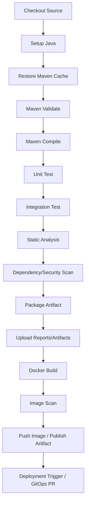

# Part 024 — GitHub Actions for Java/Maven Services

> Fokus part ini: menerapkan mental model GitHub Actions ke service Java/JAX-RS berbasis Maven. Kita akan membahas pipeline CI yang memvalidasi source, dependency, test, package, artifact, container image, dan deployment trigger secara aman, reproducible, dan reviewable.

Dalam sistem enterprise, pipeline Java/Maven bukan hanya menjalankan:

```bash
mvn test
```

Pipeline harus menjawab:

```text
Apakah code compile?
Apakah unit test dan integration test benar-benar berjalan?
Apakah dependency aman dan konsisten?
Apakah artifact yang dibuat traceable ke commit?
Apakah Docker image dibangun dari artifact yang sama?
Apakah hasil test/log/report tersedia untuk debugging?
Apakah workflow aman dari secret leakage dan permission abuse?
Apakah deployment trigger terpisah dari PR validation?
```

Part ini tidak mengasumsikan detail internal CSG. Semua branch, runner, artifact repository, registry, deployment, GitOps, dan release process harus diverifikasi internal.

---

## 1. Reference Pipeline Mental Model

Untuk Java/Maven service, pipeline umum bisa dipikirkan seperti ini:



Namun tidak semua tahap harus berjalan di setiap event.

PR validation biasanya:

```text
checkout -> setup java -> mvn verify -> reports -> scan enough to block unsafe merge
```

Push to main bisa:

```text
checkout -> setup java -> mvn verify -> package -> build image -> publish candidate artifact
```

Release/tag workflow bisa:

```text
checkout tag -> verify -> package release artifact -> push image -> release notes -> deployment/promotion trigger
```

Senior principle:

> Pipeline harus dibagi berdasarkan lifecycle: validation, packaging, publishing, deployment. Jangan membuat satu workflow superbesar yang melakukan semuanya di semua event.

---

## 2. Minimal Java/Maven CI Skeleton

Contoh skeleton PR CI:

```yaml
name: java-maven-ci

on:
  pull_request:
    branches:
      - main

permissions:
  contents: read

jobs:
  verify:
    name: Maven Verify
    runs-on: ubuntu-24.04
    timeout-minutes: 30

    steps:
      - name: Checkout
        uses: actions/checkout@v4

      - name: Set up Java
        uses: actions/setup-java@v4
        with:
          distribution: temurin
          java-version: '21'
          cache: maven

      - name: Verify
        shell: bash
        run: |
          set -euo pipefail
          ./mvnw --batch-mode --no-transfer-progress verify

      - name: Upload test reports
        if: always()
        uses: actions/upload-artifact@v4
        with:
          name: test-reports
          path: |
            **/target/surefire-reports/**
            **/target/failsafe-reports/**
```

Hal yang sengaja ada:

```text
- permissions eksplisit;
- runner OS spesifik;
- timeout;
- setup-java dengan Maven cache;
- Maven wrapper;
- batch mode;
- no-transfer-progress agar log tidak noisy;
- upload report walaupun test gagal.
```

Hal yang perlu diverifikasi internal:

```text
- Java version;
- Maven wrapper availability;
- test command resmi;
- internal artifact repository credentials;
- required status check name;
- runner OS.
```

---

## 3. Checkout Correctness

Step checkout menentukan source yang dibuild.

```yaml
- name: Checkout
  uses: actions/checkout@v4
```

Untuk PR validation, default biasanya cukup. Tetapi beberapa workflow membutuhkan history lebih lengkap.

Contoh butuh tags/history:

```yaml
- uses: actions/checkout@v4
  with:
    fetch-depth: 0
```

Use cases `fetch-depth: 0`:

```text
- version dihitung dari Git tags;
- changelog generation;
- Maven release/version plugin membutuhkan tag/history;
- git diff terhadap base branch kompleks;
- static analysis butuh blame/history.
```

Risiko:

```text
- Checkout commit salah.
- Tag tidak tersedia sehingga version calculation salah.
- Workflow release berjalan dari branch HEAD, bukan tag SHA.
- PR workflow checkout merge commit vs head commit tidak dipahami.
```

Review questions:

```text
Apakah workflow membuild commit/ref yang benar?
Apakah release workflow checkout tag yang immutable?
Apakah versioning membutuhkan full history?
Apakah shallow clone cukup?
```

---

## 4. Setup Java Correctly

Java version harus eksplisit.

```yaml
- name: Set up Java
  uses: actions/setup-java@v4
  with:
    distribution: temurin
    java-version: '21'
    cache: maven
```

Yang harus diselaraskan:

```text
- JDK version di CI;
- JDK version local developer;
- compiler release flag di Maven;
- runtime JDK di Docker image;
- target Java version service;
- toolchain plugin jika digunakan.
```

Failure mode:

```text
Local build pakai Java 21, CI pakai Java 17.
```

Atau:

```text
CI compile sukses, runtime container memakai JRE/JDK berbeda dan gagal karena class file version mismatch.
```

Checklist:

```text
[ ] Java version eksplisit di workflow.
[ ] Distribution jelas.
[ ] Maven compiler release/source/target konsisten.
[ ] Docker runtime JDK/JRE konsisten.
[ ] README local setup menyebut version yang sama.
[ ] Toolchain plugin diverifikasi jika dipakai.
```

---

## 5. Maven Wrapper Discipline

Gunakan Maven wrapper jika repository menyediakannya.

```bash
./mvnw --version
./mvnw --batch-mode verify
```

Keuntungan:

```text
- Maven version lebih konsisten.
- Developer dan CI memakai versi yang sama.
- Mengurangi dependency pada Maven preinstalled runner.
- Membantu reproducibility.
```

Risiko jika tidak memakai wrapper:

```text
Runner Maven version berubah.
Local Maven version berbeda.
Plugin behavior berubah halus.
Build failure sulit direproduksi.
```

Command CI yang disarankan:

```bash
./mvnw --batch-mode --no-transfer-progress verify
```

Kenapa:

```text
--batch-mode            menghindari interactive behavior.
--no-transfer-progress  mengurangi noise download di log CI.
verify                  menjalankan lifecycle sampai verification, termasuk integration test jika dikonfigurasi.
```

Internal verification:

```text
[ ] Apakah repo punya mvnw?
[ ] Apakah mvnw executable?
[ ] Apakah .mvn/wrapper dikomit?
[ ] Apakah CI memakai ./mvnw atau mvn global?
[ ] Apakah Maven version sesuai policy internal?
```

---

## 6. Maven Cache Strategy

Cache mempercepat dependency resolution.

Dengan `actions/setup-java`:

```yaml
with:
  cache: maven
```

Cache manual bisa memakai `actions/cache`, tetapi biasanya setup-java cukup untuk kasus standar.

Cache key harus mempertimbangkan:

```text
- OS;
- Java version;
- pom.xml hash;
- Maven settings jika relevan;
- dependency lock/alignment jika ada.
```

Cache risk:

```text
- Corrupted dependency di local repository cache.
- SNAPSHOT dependency stale.
- Cache dari branch lama memengaruhi build.
- Dependency resolution issue tersembunyi karena cache selalu hit.
```

Debugging cache issue:

```text
1. Re-run dengan cache disabled jika workflow mendukung.
2. Ubah cache key sementara.
3. Tambahkan mvn -U hanya jika memang perlu update snapshot.
4. Cek dependency resolution log.
5. Cek internal artifact repository availability.
```

Jangan jadikan `mvn -U` default tanpa alasan. Itu bisa memperlambat build dan membuat dependency resolution lebih network-dependent.

---

## 7. Maven Command Selection

Command Maven berbeda menghasilkan validasi berbeda.

| Command | Cocok Untuk | Catatan |
|---|---|---|
| `mvn validate` | Validasi POM/config awal | Tidak compile/test |
| `mvn test` | Unit test cepat | Integration test biasanya tidak jalan |
| `mvn package` | Build package | Bisa belum menjalankan verification penuh |
| `mvn verify` | CI PR utama | Validasi paling umum sebelum merge |
| `mvn install` | Local multi-module install | Tidak selalu perlu di CI |
| `mvn deploy` | Publish artifact | Hanya release/publish workflow |

Untuk PR CI, default yang sehat biasanya:

```bash
./mvnw --batch-mode --no-transfer-progress verify
```

Untuk release artifact:

```bash
./mvnw --batch-mode --no-transfer-progress deploy
```

Namun `deploy` harus hanya berjalan dalam workflow publish/release dengan credential dan permission tepat.

Anti-pattern:

```yaml
- run: ./mvnw deploy
```

Dalam PR workflow tanpa gate jelas.

Review checklist:

```text
[ ] PR workflow memakai command yang cukup kuat.
[ ] Publish command hanya di workflow yang tepat.
[ ] deploy tidak berjalan di PR untrusted.
[ ] skip tests tidak dipakai tanpa alasan jelas.
[ ] Maven profile yang aktif eksplisit.
```

---

## 8. Unit Test and Integration Test Separation

Maven umum memakai:

```text
Surefire -> unit test
Failsafe -> integration test
```

Naming convention umum:

```text
*Test.java       -> unit test
*IT.java         -> integration test
*ITCase.java     -> integration test
```

Pipeline perlu tahu apakah `mvn verify` benar-benar menjalankan integration test.

Contoh command:

```bash
./mvnw --batch-mode test
./mvnw --batch-mode verify
```

`test` mungkin hanya menjalankan Surefire. `verify` dapat menjalankan Failsafe jika plugin dikonfigurasi.

Risk:

```text
Pipeline hijau karena integration test tidak pernah jalan.
```

Checklist:

```text
[ ] Surefire plugin dikonfigurasi untuk unit test.
[ ] Failsafe plugin dikonfigurasi untuk integration test.
[ ] Naming convention test dipatuhi.
[ ] CI command menjalankan test yang diharapkan.
[ ] Test report diupload dari surefire/failsafe reports.
```

---

## 9. Service Dependencies in CI

Java/JAX-RS service enterprise sering butuh dependency untuk integration test:

```text
PostgreSQL
Kafka
RabbitMQ
Redis
external HTTP mock
schema registry
object storage emulator
```

Pilihan umum:

| Approach | Manfaat | Risiko |
|---|---|---|
| Testcontainers | Dekat dengan runtime, test self-contained | Butuh Docker di runner, lebih lambat |
| GitHub service containers | Mudah untuk DB/broker sederhana | Config terbatas, lifecycle external ke test |
| Mock/stub | Cepat dan deterministic | Bisa kurang menangkap integration bug |
| Shared test environment | Realistic | Flaky, state leakage, contention |

Contoh service container PostgreSQL:

```yaml
services:
  postgres:
    image: postgres:16
    env:
      POSTGRES_USER: app
      POSTGRES_PASSWORD: app
      POSTGRES_DB: app_test
    ports:
      - 5432:5432
    options: >-
      --health-cmd pg_isready
      --health-interval 10s
      --health-timeout 5s
      --health-retries 5
```

Review questions:

```text
Apakah integration test dependency isolated per run?
Apakah test state dibersihkan?
Apakah port conflict mungkin terjadi?
Apakah runner mendukung Docker?
Apakah external service credential aman?
```

---

## 10. Test Reports and Failure Evidence

Test failure tanpa report membuat CI sulit dipakai.

Upload report walaupun build gagal:

```yaml
- name: Upload test reports
  if: always()
  uses: actions/upload-artifact@v4
  with:
    name: test-reports
    path: |
      **/target/surefire-reports/**
      **/target/failsafe-reports/**
```

Evidence yang berguna:

```text
- surefire reports;
- failsafe reports;
- coverage report;
- static analysis report;
- dependency scan report;
- generated SBOM;
- container image scan report;
- build logs with Maven command;
- effective POM if needed;
- dependency tree if needed.
```

Hati-hati:

```text
Artifact bisa berisi secret, token, request body sensitif, customer data, atau internal endpoint.
```

Checklist:

```text
[ ] Artifact report diupload dengan if: always().
[ ] Artifact path tidak terlalu luas.
[ ] Artifact tidak mengandung secret/sensitive data.
[ ] Artifact name traceable.
[ ] Retention sesuai policy.
```

---

## 11. Coverage and Static Analysis

Coverage dan static analysis bisa masuk pipeline, tetapi harus diposisikan benar.

Contoh tools:

```text
JaCoCo
Checkstyle
Spotless
PMD
SpotBugs
SonarQube/SonarCloud
Error Prone awareness
ArchUnit tests
```

Use cases:

```text
- enforce formatting;
- detect common bug patterns;
- track coverage regression;
- enforce architecture rules;
- block security smells;
- create PR annotations.
```

Risk:

```text
- Rule terlalu noisy sehingga developer mengabaikan hasil.
- Coverage threshold mengejar angka, bukan meaningful test.
- Static analysis butuh token write/comment terlalu luas.
- Scan tidak required sehingga hasil diabaikan.
```

Review checklist:

```text
[ ] Static analysis punya owner.
[ ] Rule noisy ditangani.
[ ] Coverage threshold realistis.
[ ] Report tersedia untuk PR review.
[ ] Permission untuk PR annotation minimal.
[ ] Check required jika memang policy mengharuskan.
```

---

## 12. Dependency and Security Scan

Java/Maven pipeline perlu memperhatikan dependency supply chain.

Scan umum:

```text
Maven dependency tree
Maven Enforcer dependency convergence
OWASP Dependency-Check awareness
SCA tools internal
GitHub dependency review
Dependabot alerts
SBOM generation
License scanning
```

Contoh Maven dependency tree evidence:

```bash
./mvnw --batch-mode dependency:tree
```

Untuk CI, jangan selalu dump dependency tree penuh ke log jika terlalu besar. Lebih baik upload sebagai artifact saat dibutuhkan.

Security scan placement:

```text
PR workflow       -> dependency review / SCA enough to block unsafe change
main workflow     -> full scan/report
release workflow  -> SBOM + artifact/image scan evidence
```

Review questions:

```text
Apakah scan berjalan di event yang tepat?
Apakah hasil scan blocking atau informational?
Apakah false positive punya triage path?
Apakah license policy diperiksa?
Apakah SBOM dipublish/disimpan sebagai release evidence?
```

---

## 13. Packaging Java Artifact

Maven packaging bisa menghasilkan:

```text
jar
war
ear
source jar
javadoc jar
custom distribution
```

Untuk JAX-RS service modern, bisa berupa executable JAR, WAR ke app server, atau image-based service. Jangan asumsi; verifikasi internal.

Command packaging:

```bash
./mvnw --batch-mode --no-transfer-progress package
```

Artifact path umum:

```text
target/*.jar
target/*.war
```

Risk:

```text
- Artifact dibangun ulang di job berbeda dengan environment berbeda.
- Artifact dari PR dipakai untuk release.
- Artifact tidak traceable ke commit/tag.
- Build timestamp membuat artifact tidak deterministic.
- Classifier/profile salah menghasilkan artifact berbeda.
```

Checklist:

```text
[ ] Artifact name/version sesuai Maven coordinates.
[ ] Artifact traceable ke commit SHA.
[ ] Artifact dari release workflow berasal dari tag/commit yang benar.
[ ] Artifact disimpan/publish ke repository yang benar.
[ ] Artifact tidak berisi secret/config environment-specific.
```

---

## 14. Docker Build from Maven Output

Docker build sering menjadi tahap setelah Maven package.

Common flow:

```text
mvn verify/package -> target/app.jar -> docker build -> image scan -> push registry
```

Contoh:

```yaml
- name: Build image
  shell: bash
  run: |
    set -euo pipefail
    docker build \
      --build-arg APP_VERSION="${GITHUB_SHA}" \
      -t "example/app:${GITHUB_SHA}" \
      .
```

Hal penting:

```text
- Dockerfile path benar.
- Build context tidak terlalu luas.
- .dockerignore benar.
- Artifact yang dimasukkan image adalah artifact hasil build yang sama.
- Image tag traceable.
- Base image trusted dan dipin sesuai policy.
- Secret tidak dimasukkan sebagai build arg atau layer.
```

Anti-pattern:

```dockerfile
COPY . .
RUN mvn package
```

Ini tidak selalu salah, tetapi perlu dipahami trade-off-nya:

- build di Docker lebih isolated;
- cache Docker bisa kompleks;
- Maven credential dalam Docker build berisiko;
- hasil build bisa berbeda dari CI Maven job;
- dependency download terjadi di image build.

Review question:

```text
Apakah source of truth artifact adalah Maven job atau Docker build stage?
```

---

## 15. Image Tagging and Registry Push

Image tag harus traceable.

Tag umum:

```text
<service>:<git-sha>
<service>:<semver>
<service>:<semver>-<build>
<service>:<branch>-<sha>
```

Hindari mengandalkan `latest` sebagai release identity.

```text
latest boleh sebagai convenience, bukan audit identity.
```

Push image membutuhkan login registry.

```yaml
- name: Login to registry
  uses: docker/login-action@v3
  with:
    registry: ${{ env.REGISTRY }}
    username: ${{ secrets.REGISTRY_USERNAME }}
    password: ${{ secrets.REGISTRY_TOKEN }}
```

Security considerations:

```text
[ ] Registry credential hanya tersedia di publish job.
[ ] Publish job tidak berjalan pada PR untrusted.
[ ] Image tag tidak bisa ditimpa tanpa policy jelas.
[ ] Image digest dicatat sebagai deployment evidence.
[ ] Image scan dilakukan sebelum promotion jika policy mengharuskan.
```

Internal verification:

```text
CSG/team mungkin memakai internal registry, cloud registry, Artifactory, Nexus, GHCR, ECR, ACR, atau mekanisme lain. Jangan asumsikan.
```

---

## 16. Deployment Trigger and GitOps Boundary

CI workflow Java/Maven bisa memicu deployment, tetapi harus jelas boundary-nya.

Model umum:

```text
Direct deploy:
GitHub Actions -> cloud/Kubernetes deploy command

GitOps:
GitHub Actions -> update manifest repo -> PR/merge -> GitOps controller sync

Artifact promotion:
GitHub Actions -> publish artifact/image -> separate CD system promotes
```

GitOps-friendly flow:

```text
1. Build image.
2. Push image with immutable tag/digest.
3. Create PR to deployment manifest repo updating image digest.
4. Human/platform approval if required.
5. GitOps controller applies desired state.
```

Risk direct deploy:

```text
- Workflow permission can mutate environment immediately.
- Audit may be weaker if not captured.
- Manual rollback path must be documented.
```

Risk GitOps:

```text
- Two-repo coordination complexity.
- Manifest PR stuck.
- Image exists but deployment not updated.
- Desired state drift if manual kubectl changes occur.
```

Review checklist:

```text
[ ] Deployment trigger separated from PR validation.
[ ] Environment approval exists if required.
[ ] Image digest/version passed explicitly.
[ ] Rollback path documented.
[ ] GitOps repo ownership clear.
[ ] No production mutation from untrusted event.
```

---

## 17. Multi-Module Maven CI

Untuk multi-module repo, pipeline bisa mahal jika selalu build semua.

Options:

```bash
./mvnw verify
./mvnw -pl module-a -am verify
./mvnw -pl module-a -amd verify
```

Meaning:

```text
-pl   pilih project/module
-am   also make dependencies upstream
-amd  also make dependents downstream
```

Optimization temptation:

```text
Build hanya changed module.
```

Risk:

```text
Cross-module regression tidak tertangkap.
Dependency downstream tidak divalidasi.
Path detection salah.
Required checks skipped.
```

Safe approach:

```text
- PR small: partial build boleh sebagai fast feedback.
- Required merge check: full verify atau affected graph verify yang sangat dipercaya.
- Nightly/main: full build.
```

Review questions:

```text
Apakah module selection benar-benar memahami dependency graph Maven?
Apakah generated source/config/shared module diperhitungkan?
Apakah full build tetap berjalan pada main/nightly?
```

---

## 18. Workflow Optimization Without Weakening Validation

Optimasi pipeline harus mengurangi waste, bukan mengurangi confidence.

Optimization tools:

```text
- Maven cache;
- Docker layer cache;
- parallel jobs;
- matrix only when needed;
- test split;
- affected module detection;
- concurrency cancellation;
- timeout;
- reusable workflow;
- local script reuse;
- dependency prefetch only if safe.
```

Dangerous optimization:

```text
- skip tests by default;
- skip integration tests on PR tanpa compensating check;
- path filter yang tidak memahami shared code;
- using latest images/tools tanpa pinning;
- ignoring flaky tests instead of fixing/quarantining with owner;
- continue-on-error for critical checks.
```

Review principle:

> Pipeline cepat yang tidak menangkap regression adalah liability, bukan productivity improvement.

Checklist:

```text
[ ] Optimasi punya measurement baseline.
[ ] Confidence tidak turun tanpa sadar.
[ ] Required checks tetap meaningful.
[ ] Flaky tests punya owner dan remediation.
[ ] Cache tidak mengorbankan reproducibility.
```

---

## 19. CI Reproducibility Concerns

CI harus sedekat mungkin dengan local command dan release command.

Reproducibility risks:

```text
- Java version tidak dipin.
- Maven global version berbeda.
- Plugin version tidak dipin.
- Dependency SNAPSHOT berubah.
- Profile CI berbeda tanpa dokumentasi.
- Locale/timezone berbeda.
- Test bergantung clock/current date.
- Test bergantung order atau shared state.
- External service tidak deterministic.
- Cache menyembunyikan dependency availability.
```

Useful CI diagnostics:

```bash
java -version
./mvnw --version
./mvnw help:effective-pom
./mvnw dependency:tree
```

Jangan selalu menjalankan diagnostics mahal pada setiap run. Gunakan saat debugging atau upload artifact jika perlu.

Checklist:

```text
[ ] Java/Maven version tercetak di log.
[ ] Command CI bisa dijalankan local.
[ ] Profile CI terdokumentasi.
[ ] Timezone/locale sensitive test dikontrol.
[ ] External dependency untuk test isolated.
```

---

## 20. Security Hardening for Java/Maven Workflow

Security baseline:

```text
[ ] permissions minimal.
[ ] PR validation tidak punya deployment secret.
[ ] Third-party actions dipin sesuai policy.
[ ] Dependency scan berjalan.
[ ] Secret tidak dicetak.
[ ] Artifact tidak menyimpan sensitive data.
[ ] Registry/cloud credential scoped ke job publish/deploy.
[ ] OIDC dipakai jika tersedia dan policy mendukung.
[ ] Docker build tidak menerima secret via ARG/layer.
[ ] SBOM/image scan disimpan jika release policy mengharuskan.
```

Risk example:

```yaml
- name: Debug env
  run: env
```

Ini berisiko karena environment bisa berisi data sensitif atau internal endpoint. Gunakan debug selektif.

Better:

```yaml
- name: Print tool versions
  run: |
    java -version
    ./mvnw --version
```

Supply-chain risk:

```text
Workflow Java/Maven tidak hanya mengambil dependency Maven. Ia juga mengambil GitHub Actions, base Docker image, OS packages, plugins, scanners, dan registry credentials.
```

---

## 21. Common Failure Modes

| Symptom | Likely Cause | Debugging Move |
|---|---|---|
| `./mvnw: Permission denied` | Executable bit hilang | `git update-index --chmod=+x mvnw` |
| `Unsupported class file major version` | Java version mismatch | Cek setup-java, compiler release, runtime image |
| Dependency cannot resolve | Artifact repo credential/network | Cek settings.xml, secret, repository URL |
| Tests pass local fail CI | env/timezone/resource/service dependency | Compare env, logs, reports, runner |
| Integration tests skipped | Failsafe/naming/profile salah | Cek plugin config dan lifecycle command |
| Docker build cannot find jar | Build artifact path salah | Cek target path dan Docker context |
| Registry push denied | Credential/permission salah | Cek secret scope dan registry role |
| Required check missing | Workflow skipped/name changed | Cek branch protection dan workflow trigger |
| Workflow slow | Cache miss/test split poor | Measure stage duration |
| Flaky CI | shared state/timing/external dependency | Isolate test, capture logs, quarantine with owner |

---

## 22. PR Review Checklist for Java/Maven GitHub Actions

Gunakan saat mereview workflow CI Java/Maven.

```text
Trigger and lifecycle
[ ] PR validation, main validation, release, publish, deploy dipisahkan jelas.
[ ] Trigger branch/tag/path sesuai tujuan.
[ ] Workflow tidak deploy dari PR untrusted.

Java/Maven setup
[ ] Java version eksplisit.
[ ] Maven wrapper digunakan jika tersedia.
[ ] Maven command sesuai lifecycle: test/verify/package/deploy.
[ ] Maven profile eksplisit dan terdokumentasi.
[ ] Maven cache aman dan tidak menyembunyikan issue.

Testing
[ ] Unit test berjalan.
[ ] Integration test berjalan jika wajib.
[ ] Surefire/Failsafe report diupload dengan if: always().
[ ] Testcontainers/service dependency didukung runner.
[ ] Flaky test tidak ditutup dengan continue-on-error sembarangan.

Security
[ ] permissions minimal.
[ ] Secret scoped ke job yang butuh.
[ ] Registry/cloud credential tidak tersedia di PR job.
[ ] Dependency/security scan sesuai policy.
[ ] Artifact/report tidak mengandung secret.

Artifact and image
[ ] Artifact traceable ke commit/tag.
[ ] Docker build memakai artifact yang benar.
[ ] Image tag/digest traceable.
[ ] Image push hanya di workflow publish/release.
[ ] Deployment trigger punya gate dan audit trail.

Reproducibility
[ ] Runner OS cukup deterministic.
[ ] Tool versions terlihat di log.
[ ] Local command mirip dengan CI command.
[ ] Build tidak bergantung state runner yang tersembunyi.
```

---

## 23. Internal Verification Checklist

Untuk konteks CSG/team, verifikasi detail berikut.

```text
Java and Maven
[ ] Java version resmi service apa?
[ ] Apakah repo wajib memakai Maven wrapper?
[ ] Command CI resmi apa: test, verify, package, deploy?
[ ] Profile Maven apa yang aktif di CI?
[ ] Apakah ada parent POM/BOM internal yang mengatur plugin/dependency?

Testing
[ ] Apakah unit dan integration test dipisah?
[ ] Apakah Testcontainers digunakan?
[ ] Apakah CI runner mendukung Docker untuk integration test?
[ ] Apakah ada test report/coverage convention?
[ ] Bagaimana flaky test ditangani?

Artifact
[ ] Artifact repository apa yang digunakan: Nexus, Artifactory, GitHub Packages, atau internal lain?
[ ] Bagaimana credential Maven repository disediakan?
[ ] Snapshot vs release repository apa?
[ ] Apakah mvn deploy dipakai atau ada publisher internal?
[ ] Bagaimana artifact traceability dijaga?

Container
[ ] Registry apa yang digunakan?
[ ] Image tag convention apa?
[ ] Apakah image digest dicatat?
[ ] Apakah image scan wajib?
[ ] Base image berasal dari mana?

CI/CD and deployment
[ ] Workflow mana required check?
[ ] Workflow mana publish image/artifact?
[ ] Apakah deployment direct atau GitOps?
[ ] Apakah environment approval aktif?
[ ] Apakah OIDC digunakan untuk AWS/Azure?

Security
[ ] Permission default GITHUB_TOKEN apa?
[ ] Secret apa yang tersedia untuk workflow?
[ ] Apakah third-party actions harus dipin SHA?
[ ] Apakah SCA/SBOM/license scan wajib?
[ ] Siapa owner workflow CI/CD?
```

---

## 24. Practical Review Flow

Saat masuk repo Java/Maven baru, review workflow dengan urutan ini:

```text
1. Buka .github/workflows.
2. Identifikasi workflow PR, main, release, deploy.
3. Cek trigger masing-masing workflow.
4. Cek permissions.
5. Cek runner dan Java setup.
6. Cek apakah memakai ./mvnw.
7. Cek Maven command dan profile.
8. Cek test report artifact.
9. Cek dependency/security scan.
10. Cek package/publish/image push.
11. Cek deployment trigger/environment gate.
12. Cocokkan check name dengan branch protection.
```

Output review yang berguna:

```text
- CI validates compile/test? Yes/No/Partial.
- Integration test runs? Yes/No/Unknown.
- Maven command reproducible local? Yes/No.
- Java version aligned with runtime? Yes/No/Unknown.
- Security scan blocking? Yes/No/Unknown.
- Artifact/image traceable? Yes/No/Unknown.
- Deployment separated from PR? Yes/No.
- Internal gaps to verify: <list>.
```

---

## 25. Key Takeaways

- GitHub Actions untuk Java/Maven service harus dibangun berdasarkan lifecycle: validate, test, scan, package, publish, deploy.
- `mvn verify` sering menjadi command PR CI yang lebih kuat daripada `mvn test`, tetapi konfigurasi Surefire/Failsafe harus diverifikasi.
- Java version, Maven wrapper, compiler release, dan Docker runtime image harus selaras.
- Cache mempercepat build, tetapi tidak boleh menjadi sumber non-reproducibility.
- Test report harus tersedia saat failure agar debugging tidak bergantung pada log mentah.
- Integration test dependency seperti PostgreSQL, Kafka, RabbitMQ, dan Redis harus isolated dan deterministic.
- Artifact dan image harus traceable ke commit/tag, dan tidak boleh bercampur dengan secret/config environment-specific.
- PR validation, artifact publishing, dan deployment trigger harus dipisahkan dari sisi event, permission, secret, dan environment gate.
- Semua detail internal terkait runner, artifact repository, registry, image tag, GitOps, cloud credential, dan release process CSG/team harus diverifikasi secara internal.
