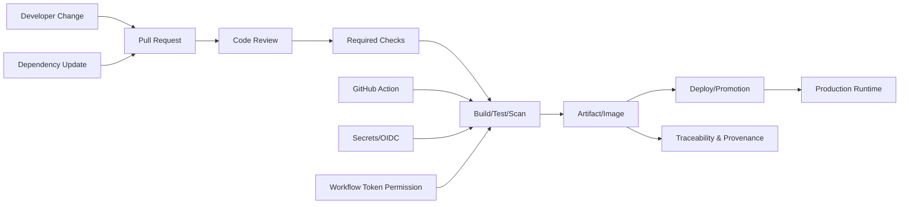
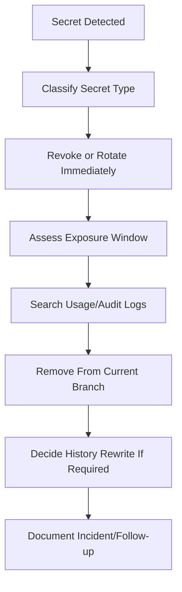
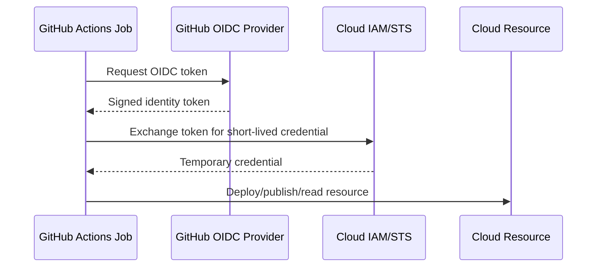

# GitHub Security and Supply Chain

## 1. Core Idea

GitHub bukan hanya tempat menyimpan source code dan membuat pull request. Dalam sistem enterprise modern, GitHub sering menjadi **control plane** untuk software supply chain:

- source code masuk melalui branch dan PR,
- dependency berubah melalui POM dan lock/config file,
- workflow CI/CD berjalan dari repository,
- secrets dipakai untuk test, publish, dan deploy,
- artifact dibangun dan dipublikasikan,
- container image dibangun dan dipush,
- release dibuat dari tag atau GitHub Release,
- security scanning memberi sinyal risiko sebelum perubahan masuk production.

Untuk senior backend engineer, security di GitHub bukan hanya urusan security team. Setiap perubahan pada repository, workflow, dependency, action, secret, token permission, artifact, dan release process dapat membuka jalur risiko ke production.

Mental model yang harus dipakai:



Supply-chain security berarti menjaga semua edge di graph tersebut agar tidak menjadi jalur masuk bug, malware, secret leakage, privilege escalation, atau untraceable release.

---

## 2. Why This Exists

Dalam aplikasi Java/JAX-RS enterprise, sebagian besar kode yang berjalan di production bukan hanya kode yang ditulis tim:

- dependency Maven langsung,
- transitive dependency,
- Maven plugin,
- GitHub Action pihak ketiga,
- base image Docker,
- OS package di image,
- generated code,
- test/container utility,
- CI script,
- deployment tooling,
- shared workflow internal,
- shared library internal.

Risiko tidak hanya muncul dari business logic. Risiko juga bisa datang dari:

- dependency vulnerable,
- transitive dependency yang tidak terlihat,
- token GitHub Actions terlalu luas,
- workflow berjalan pada event yang salah,
- pull request dari fork mendapat akses secret,
- third-party action tidak dipin ke commit SHA,
- artifact tidak traceable ke commit,
- image tag mutable,
- secret tercetak di log,
- dependency update otomatis tanpa review domain impact,
- scanning hanya ada tetapi tidak dipakai sebagai quality gate.

Senior engineer perlu bisa membedakan antara **security signal** dan **security theater**. Mengaktifkan banyak scanner tidak otomatis aman jika alert tidak ditriage, workflow token terlalu powerful, dan release artifact tidak bisa ditelusuri ke commit.

---

## 3. Supply Chain Surface in GitHub

### 3.1 Source Code Surface

Source code surface meliputi:

- branch,
- PR,
- commit,
- tag,
- review,
- merge strategy,
- CODEOWNERS,
- branch protection,
- required checks.

Risikonya:

- malicious change masuk lewat PR kecil yang tampak harmless,
- review tidak mencakup build/script/workflow,
- branch protection bisa dibypass admin,
- CODEOWNERS tidak mencakup file sensitif,
- required checks tidak berjalan pada path tertentu,
- tag release bisa dibuat ulang atau dipindah.

### 3.2 Dependency Surface

Untuk Java/Maven, dependency surface meliputi:

- `pom.xml`,
- parent POM,
- BOM,
- `dependencyManagement`,
- Maven plugin,
- transitive dependency,
- repository remote,
- artifact repository,
- snapshot dependency,
- shaded dependency.

Risikonya:

- dependency vulnerable masuk tanpa terlihat,
- transitive dependency membawa CVE,
- dependency version drift antar module,
- plugin version tidak dipin,
- snapshot dependency berubah tanpa traceability,
- dependency dari repository tidak terpercaya,
- exclusion menghilangkan library penting,
- shading menyembunyikan duplicate classes.

### 3.3 Workflow Surface

Workflow surface meliputi:

- `.github/workflows/*.yml`,
- reusable workflow,
- composite action,
- third-party action,
- workflow trigger,
- matrix,
- cache,
- artifact upload/download,
- runner,
- environment,
- secrets,
- permissions.

Risikonya:

- action pihak ketiga berubah karena tag mutable,
- workflow token punya write permission padahal tidak perlu,
- cache poisoning,
- artifact dari job untrusted dipakai oleh deploy job,
- fork PR mendapat akses secret,
- script shell mengeksekusi input dari PR,
- deployment trigger bisa dijalankan dari branch tidak tepercaya.

### 3.4 Runtime Delivery Surface

Runtime delivery surface meliputi:

- Maven artifact,
- Docker image,
- image tag,
- SBOM,
- checksum,
- release note,
- deployment manifest,
- GitOps repo,
- environment approval,
- cloud identity/OIDC,
- registry permission.

Risikonya:

- artifact tidak bisa ditelusuri ke commit,
- image tag mutable seperti `latest`,
- SBOM tidak dibuat atau tidak disimpan,
- deployment menggunakan artifact yang bukan hasil CI,
- manifest berubah manual di luar GitOps,
- credential long-lived dipakai untuk deploy,
- role deployment terlalu luas.

---

## 4. Dependabot

Dependabot membantu mendeteksi dan mengajukan update dependency atau GitHub Actions. Untuk Maven service, Dependabot biasanya relevan untuk:

- Maven dependencies,
- GitHub Actions versions,
- Docker base image,
- npm dependencies jika repository juga punya frontend/tooling JS,
- Terraform atau IaC dependency jika ada.

Contoh area konfigurasi:

```yaml
version: 2
updates:
  - package-ecosystem: "maven"
    directory: "/"
    schedule:
      interval: "weekly"

  - package-ecosystem: "github-actions"
    directory: "/"
    schedule:
      interval: "weekly"
```

Dependabot bukan autopilot. Dependabot adalah **change generator**. Setiap PR tetap perlu review.

### Failure Mode Dependabot

| Failure mode | Dampak |
|---|---|
| Update major version digabung tanpa review | Breaking change runtime |
| Transitive dependency berubah | Classpath conflict |
| Update action tanpa SHA pinning | Supply-chain risk |
| Terlalu banyak PR | Alert fatigue dan PR fatigue |
| Hanya patch version diupdate | Major vulnerability mungkin tertunda |
| Security alert ditutup tanpa alasan | Audit trail buruk |

### Senior Review Questions

Saat mereview PR Dependabot Maven:

- Apakah ini direct dependency atau transitive dependency?
- Apakah dependency dipakai di runtime, test, plugin, atau build only?
- Apakah ada breaking change release note?
- Apakah update memengaruhi Jakarta/Jersey/Jackson/Hibernate/Netty/Logging stack?
- Apakah dependency ini masuk ke container image production?
- Apakah test coverage cukup untuk area yang terkena?
- Apakah dependency ini dipakai oleh module lain?
- Apakah perlu update BOM/parent POM, bukan direct version di child module?

---

## 5. Code Scanning

Code scanning mencari pola bug/security risk di source code. Di GitHub, ini sering menggunakan CodeQL atau tool lain.

Untuk Java/JAX-RS backend, scanning dapat mendeteksi pola seperti:

- injection risk,
- path traversal,
- unsafe deserialization,
- insecure random,
- hardcoded credential,
- weak crypto,
- unsafe XML parsing,
- log injection,
- tainted input flow.

Code scanning harus dipahami sebagai **signal**, bukan bukti final. False positive dan false negative tetap ada.

### Practical Use

Workflow senior engineer:

1. Baca alert.
2. Identifikasi source, sink, dan data flow.
3. Cocokkan dengan endpoint/API/domain path.
4. Validasi apakah input benar-benar attacker-controlled.
5. Cek existing validation, authorization, canonicalization, escaping.
6. Buat fix kecil dengan test.
7. Dokumentasikan reasoning di PR.

### Failure Mode

| Failure mode | Dampak |
|---|---|
| Alert di-ignore tanpa triage | Risk nyata lolos |
| Scanner jadi required check tetapi sering flaky | PR bottleneck |
| Rule terlalu umum | Noise tinggi |
| Custom framework tidak dipahami scanner | False negative |
| Generated code ikut discan tanpa filter | Noise |

---

## 6. Secret Scanning

Secret scanning mendeteksi credential yang tidak sengaja masuk GitHub. Surface paling umum:

- `.env`,
- config local,
- test fixture,
- CI log,
- shell history yang tercommit,
- sample curl command,
- temporary script,
- private key,
- token,
- connection string,
- cloud credential,
- artifact repository credential.

Secret leakage adalah incident, bukan sekadar lint failure. Jika secret sudah pernah masuk Git history, menghapus file pada commit baru tidak cukup. Secret harus dianggap compromised.

### Response Flow



### Common Mistakes

- Menghapus secret dari file tetapi tidak rotate credential.
- Menganggap private repo aman untuk menyimpan secret.
- Menaruh token dalam sample command.
- Menaruh secret di GitHub Actions output.
- Echo environment variable saat debugging.
- Menyimpan `.env` production di repository.

---

## 7. Dependency Review

Dependency review melihat perubahan dependency dalam PR. Untuk Maven, perubahan dependency tidak selalu eksplisit. Satu perubahan versi BOM dapat mengubah banyak transitive dependency.

Yang perlu direview:

- dependency baru,
- dependency yang dihapus,
- version upgrade/downgrade,
- license,
- vulnerability,
- transitive tree,
- scope,
- repository source,
- duplicate library family,
- Jakarta vs javax namespace,
- logging binding,
- serialization library,
- HTTP client library,
- crypto/security library.

### Maven-Specific Review Command

```bash
mvn -q dependency:tree
mvn -q dependency:tree -Dincludes=groupId:artifactId
mvn -q dependency:analyze
mvn -q versions:display-dependency-updates
mvn -q versions:display-plugin-updates
```

Gunakan output sebagai evidence, bukan sekadar menjalankan command.

### Red Flags

- Dependency tanpa versi di tempat yang tidak dikelola parent/BOM.
- `system` scope.
- Snapshot dependency di release path.
- Exclusion besar tanpa alasan.
- Dependency logging baru yang bisa konflik dengan SLF4J/Logback/Log4j bridge.
- Library HTTP client baru padahal stack sudah punya standard client.
- Test dependency masuk compile/runtime scope.
- Dependency internal tanpa owner jelas.

---

## 8. Security Advisory and Vulnerability Triage

Tidak semua CVE memiliki dampak yang sama. Senior engineer perlu menilai exploitability dalam konteks aplikasi.

Triage minimal:

- package affected,
- version affected,
- direct/transitive,
- runtime/test/build scope,
- reachable code path,
- exposed endpoint/path,
- required attacker capability,
- available fix version,
- breaking change risk,
- temporary mitigation,
- release urgency.

### Triage Matrix

| Condition | Response |
|---|---|
| Runtime dependency, remotely exploitable, exposed endpoint | Urgent fix/hotfix |
| Runtime dependency, exploit requires unused feature | Validate reachability, schedule fix |
| Test-only dependency | Lower priority, still update if easy |
| Build plugin vulnerability | Assess CI runner exposure and artifact trust |
| Transitive dependency | Prefer BOM/direct override if safe |
| No fixed version | Mitigation, config hardening, monitor advisory |

### Evidence to Capture

- current dependency tree,
- vulnerable package path,
- scanner/advisory link internally,
- affected service/module,
- reason reachable/not reachable,
- fix version,
- test result,
- deployment/release plan.

---

## 9. GitHub Token Permission

GitHub Actions menyediakan token otomatis. Risiko muncul saat token punya permission lebih luas dari kebutuhan job.

Principle:

```yaml
permissions: read-all
```

Lalu naikkan permission hanya pada job yang butuh.

Contoh:

```yaml
permissions:
  contents: read
  packages: write
```

Deployment job mungkin butuh OIDC:

```yaml
permissions:
  contents: read
  id-token: write
```

### Failure Mode

| Permission issue | Risiko |
|---|---|
| `contents: write` di semua job | PR workflow bisa mengubah repo/tag/release |
| `pull-requests: write` tidak perlu | Bot/comment abuse |
| `packages: write` terlalu luas | Artifact/image overwrite |
| `id-token: write` pada job tidak perlu | Cloud role assumption risk |
| Default permission tidak eksplisit | Behavior berubah mengikuti org/repo setting |

### Senior Review Rule

Setiap workflow harus bisa menjawab:

- Job ini perlu membaca apa?
- Job ini perlu menulis apa?
- Job ini perlu secret apa?
- Job ini boleh berjalan dari event apa?
- Job ini boleh berjalan dari fork PR atau tidak?
- Job ini boleh deploy atau publish artifact atau tidak?

---

## 10. Workflow Permission and Event Safety

Trigger event sangat penting. Perbedaan `pull_request` dan `pull_request_target` bisa kritikal.

- `pull_request`: menjalankan workflow dalam konteks PR; lebih aman untuk kode untrusted.
- `pull_request_target`: berjalan dalam konteks base repository; berbahaya jika checkout dan menjalankan kode PR tanpa guard.

Red flag:

```yaml
on: pull_request_target
# lalu checkout kode PR dan menjalankan script dari PR
```

Itu dapat membuka secret atau write token ke kode dari contributor yang belum dipercaya.

### Safe Pattern

- Untuk build/test PR: gunakan `pull_request`.
- Untuk label/comment automation yang tidak menjalankan kode PR: `pull_request_target` bisa dipertimbangkan dengan hati-hati.
- Jangan expose secrets ke untrusted code.
- Jangan menjalankan shell script dari PR dengan privileged token.
- Pisahkan validate job dan deploy/publish job.

---

## 11. OIDC Federation

OIDC memungkinkan GitHub Actions mendapatkan token cloud jangka pendek tanpa menyimpan long-lived cloud secret di GitHub.

Mental model:



OIDC lebih aman daripada static secrets jika policy cloud benar.

### Risks

- Trust policy terlalu luas.
- Semua branch boleh assume deploy role.
- Semua workflow boleh assume role.
- Environment protection tidak digunakan.
- Role punya permission terlalu luas.
- Audit condition tidak mencakup repository, branch, tag, environment.

### Review Questions

- Role cloud bisa di-assume dari repository mana?
- Branch/tag/environment mana yang diizinkan?
- Apakah deployment butuh approval?
- Apakah OIDC job punya `id-token: write` hanya di job yang perlu?
- Apakah role cloud least privilege?
- Apakah ada audit trail dari commit ke cloud deployment?

---

## 12. Third-Party Action Pinning

GitHub Actions dapat dipanggil dengan branch, tag, atau commit SHA:

```yaml
uses: actions/checkout@v4
uses: docker/login-action@v3
uses: some/action@main
uses: some/action@a1b2c3d4...
```

Untuk supply-chain hardening, action pihak ketiga idealnya dipin ke commit SHA, terutama pada workflow sensitif seperti release, publish, deploy, signing, atau secret handling.

### Trade-Off

| Approach | Pros | Cons |
|---|---|---|
| `@main` | Selalu terbaru | Sangat tidak stabil dan risky |
| `@v3` tag | Mudah dibaca | Tag bisa mutable tergantung maintainer/security posture |
| full SHA | Immutable | Perlu update manual/Dependabot support |

### Senior Guidance

- Official GitHub actions masih perlu review, tetapi risikonya lebih rendah daripada action random.
- Action yang memproses secrets, tokens, artifacts, atau deployment harus lebih ketat.
- Composite action internal juga perlu ownership dan versioning.
- Jangan menjalankan curl-pipe-shell dari internet di CI.

---

## 13. Artifact Integrity

Artifact integrity menjawab pertanyaan:

> Artifact yang dideploy ke environment ini dibangun dari commit mana, oleh workflow mana, dengan dependency apa, dan apakah artifact tersebut berubah setelah build?

Untuk Java/JAX-RS, artifact bisa berupa:

- JAR/WAR,
- Docker image,
- SBOM,
- test report,
- coverage report,
- migration bundle,
- deployment manifest,
- Helm chart,
- generated client/server artifact.

### Integrity Controls

- artifact name mengandung version/commit SHA,
- image tag immutable atau digest-based deploy,
- checksum disimpan,
- SBOM dibuat,
- build provenance jika tersedia,
- release note link ke commit/PR,
- artifact hanya dipublish oleh CI trusted branch/tag,
- registry permission dibatasi.

### Failure Mode

| Failure mode | Dampak |
|---|---|
| Deploy by mutable tag `latest` | Tidak traceable |
| Artifact diupload manual | Chain of custody hilang |
| Build ulang tag lama menghasilkan artifact berbeda | Reproducibility failure |
| Test artifact dari PR untrusted dipakai deploy | Supply-chain risk |
| Registry overwrite allowed | Release integrity rusak |

---

## 14. SBOM Generation

SBOM atau Software Bill of Materials adalah daftar komponen software dalam artifact. Untuk Java/Maven service, SBOM berguna untuk:

- vulnerability impact analysis,
- audit/compliance,
- incident response,
- license review,
- dependency ownership,
- runtime inventory.

SBOM bisa dibuat pada fase CI/release menggunakan tool seperti CycloneDX Maven plugin atau tool enterprise internal.

Contoh command awareness:

```bash
mvn org.cyclonedx:cyclonedx-maven-plugin:makeAggregateBom
```

Dalam enterprise, jangan asal menambahkan plugin tanpa memverifikasi standard internal. SBOM format, upload location, retention, dan policy biasanya perlu mengikuti platform/security process.

### SBOM Review Questions

- SBOM dibuat per module atau aggregate?
- SBOM merepresentasikan runtime artifact atau seluruh repo?
- Apakah test-only dependency ikut?
- Apakah SBOM disimpan bersama artifact release?
- Apakah SBOM dikirim ke vulnerability management platform?
- Apakah SBOM mencakup container base image dan OS packages?

---

## 15. Impact on Java/JAX-RS Backend

GitHub supply-chain security berdampak langsung ke Java/JAX-RS service:

- JAX-RS endpoint menerima input eksternal, sehingga vulnerable dependency di serialization, JSON binding, XML, validation, auth, HTTP client, atau logging bisa menjadi runtime risk.
- Maven transitive dependency dapat mengubah classpath tanpa perubahan source code besar.
- GitHub Actions menentukan command Maven yang dijalankan; salah command dapat skip integration test atau security scan.
- Artifact yang tidak traceable membuat incident debugging sulit.
- Dependency update dapat mengubah behavior HTTP client, TLS, Jackson serialization, Jakarta namespace, connection pool, atau database driver.

Senior engineer harus menilai security change dari sisi runtime behavior, bukan hanya dari label “patch update”.

---

## 16. Impact on Docker, Kubernetes, AWS, Azure, and GitOps

Supply chain tidak berhenti di GitHub.

### Docker

- base image harus dipin dan discan,
- image tag harus traceable,
- build context tidak boleh membawa secret,
- Dockerfile harus menghindari curl remote script tanpa verification,
- final image harus minimal dan non-root bila memungkinkan.

### Kubernetes

- deployment manifest harus menunjuk image yang benar,
- secret/config change harus traceable,
- imagePullPolicy dan tag strategy memengaruhi reproducibility,
- rollout harus bisa dikaitkan ke commit/release.

### AWS/Azure

- OIDC trust policy harus terbatas,
- registry permission harus minimal,
- cloud deployment role tidak boleh global admin,
- environment approval harus sesuai criticality.

### GitOps

- deployment change harus melalui Git,
- manual kubectl edit adalah exception yang perlu audit,
- manifest repo harus punya branch protection,
- image update automation harus traceable.

---

## 17. Debugging Security and Supply Chain Failures

### Case 1: Dependabot PR breaks build

Triage:

```bash
git checkout dependabot-branch
mvn -q -DskipTests dependency:tree > dependency-tree.txt
mvn -U clean verify
```

Check:

- dependency conflict,
- plugin version conflict,
- transitive downgrade/upgrade,
- Java version mismatch,
- test failure caused by behavior change,
- BOM alignment issue.

### Case 2: Secret detected

Steps:

1. Stop using the secret.
2. Rotate/revoke immediately.
3. Identify exposure window.
4. Remove from active branch.
5. Search logs and Git history if required.
6. Document follow-up.

Do not just “delete and force push” without coordination.

### Case 3: Workflow permission denied

Check:

- top-level `permissions`,
- job-level `permissions`,
- org/repo default token permission,
- branch protection,
- environment protection,
- OIDC trust condition,
- package registry permission.

### Case 4: Artifact cannot be trusted

Check:

- workflow run ID,
- commit SHA,
- tag,
- artifact checksum/digest,
- registry push event,
- deploy event,
- release note,
- GitOps commit.

---

## 18. Correctness Concerns

- Security scanner result harus dipahami dalam konteks actual code path.
- Dependency update tidak boleh hanya “green build”; harus dilihat runtime behavior-nya.
- GitHub Actions workflow harus deterministik dan tidak bergantung pada mutable remote script.
- Artifact release harus berasal dari commit yang direview.
- Required checks harus benar-benar mencakup path dan event yang relevan.
- Branch protection harus mencegah bypass perubahan sensitif.

---

## 19. Productivity Concerns

Security control yang buruk dapat memperlambat tim tanpa meningkatkan keamanan.

Contoh buruk:

- scanner noisy tanpa owner,
- Dependabot membuat puluhan PR tanpa grouping policy,
- required check flaky,
- security approval manual untuk semua perubahan kecil,
- action pinning tanpa mekanisme update,
- vulnerability alert tanpa severity/impact triage.

Senior engineer perlu membantu membuat security workflow yang:

- jelas owner-nya,
- jelas SLA-nya,
- bisa diautomasi,
- punya escalation path,
- minim false blocking,
- tetap menjaga production safety.

---

## 20. Security Concerns

Checklist security utama:

- secret tidak masuk Git,
- secret tidak muncul di log,
- token permission least privilege,
- workflow event aman,
- OIDC trust policy sempit,
- third-party action dipin,
- dependency vulnerable ditriage,
- artifact traceable,
- release tag tidak mutable,
- fork PR tidak mendapat secret,
- cache/artifact dari untrusted job tidak dipakai deploy,
- CODEOWNERS mencakup workflow/security files.

---

## 21. Reproducibility Concerns

Supply-chain security dan reproducibility saling terkait.

Hal yang merusak reproducibility:

- action `@main`,
- dependency snapshot,
- unpinned plugin,
- mutable Docker tag,
- build yang download script saat runtime,
- artifact manual upload,
- build timestamp tidak dikontrol,
- environment-specific hidden behavior,
- CI cache yang memengaruhi hasil build.

Pertanyaan penting:

> Bisakah kita membangun ulang artifact yang sama dari commit/tag yang sama dengan hasil yang dapat dipercaya?

---

## 22. Release Concerns

Release aman membutuhkan:

- branch/tag protected,
- release workflow hanya berjalan dari tag/branch yang disetujui,
- artifact immutable,
- changelog/release note jelas,
- SBOM tersimpan,
- vulnerability status diketahui,
- deployment role least privilege,
- approval gate sesuai environment,
- rollback path tersedia.

Red flag release:

- manual publish dari laptop,
- image tag mutable,
- release note tidak menyebut commit/PR,
- artifact repository menerima overwrite,
- deployment bisa dijalankan dari branch feature,
- secret release disimpan sebagai long-lived credential tanpa rotation.

---

## 23. Observability and Incident Support Concerns

Saat incident, security/supply-chain metadata membantu menjawab:

- versi apa yang jalan,
- commit mana yang dideploy,
- dependency apa yang ada di artifact,
- image digest apa yang digunakan,
- workflow mana yang membangun artifact,
- siapa approve deployment,
- apakah ada dependency/security alert sebelum incident,
- apakah ada secret leak terkait,
- apakah base image berubah,
- apakah GitOps manifest berubah.

Tanpa traceability, RCA akan berubah menjadi spekulasi.

---

## 24. PR Review Checklist

Gunakan checklist ini saat PR menyentuh GitHub security atau supply chain.

### Dependency

- [ ] Apakah dependency baru benar-benar diperlukan?
- [ ] Apakah scope sudah benar?
- [ ] Apakah versi dikelola via parent/BOM?
- [ ] Apakah dependency tree sudah dicek?
- [ ] Apakah ada vulnerability atau license concern?
- [ ] Apakah ada Jakarta/Jersey/Jackson/logging conflict?

### Workflow

- [ ] Apakah trigger aman?
- [ ] Apakah workflow menjalankan kode untrusted?
- [ ] Apakah permission least privilege?
- [ ] Apakah secret hanya tersedia pada job yang perlu?
- [ ] Apakah third-party action dipin?
- [ ] Apakah artifact upload/download aman?

### Release/Artifact

- [ ] Apakah artifact traceable ke commit?
- [ ] Apakah image tag/digest strategy jelas?
- [ ] Apakah SBOM dibuat jika diwajibkan?
- [ ] Apakah publish hanya dari branch/tag trusted?
- [ ] Apakah deployment approval sesuai environment?

### Governance

- [ ] Apakah CODEOWNERS mencakup file sensitif?
- [ ] Apakah branch protection tetap efektif?
- [ ] Apakah admin bypass tidak diperlukan?
- [ ] Apakah security alert memiliki owner?

---

## 25. Internal Verification Checklist

Verifikasi hal-hal berikut di repository dan proses internal CSG/team. Jangan asumsikan detail internal tanpa bukti.

### GitHub Security

- [ ] Apakah Dependabot aktif untuk Maven?
- [ ] Apakah Dependabot aktif untuk GitHub Actions?
- [ ] Apakah code scanning aktif?
- [ ] Apakah secret scanning aktif?
- [ ] Apakah dependency review aktif sebagai required check?
- [ ] Apakah security advisory ditriage oleh tim atau security platform?

### Workflow Security

- [ ] Apakah workflow memiliki `permissions` eksplisit?
- [ ] Apakah default token permission read-only?
- [ ] Apakah ada penggunaan `pull_request_target`?
- [ ] Apakah workflow release/deploy dibatasi branch/tag/environment?
- [ ] Apakah third-party actions dipin ke SHA atau minimal trusted tag?
- [ ] Apakah reusable workflow internal punya owner?

### Secret and Identity

- [ ] Apakah secret disimpan di GitHub Secrets, environment, vault, atau cloud secret manager?
- [ ] Apakah OIDC dipakai untuk AWS/Azure deployment?
- [ ] Apakah long-lived cloud credential masih digunakan?
- [ ] Apakah deployment role least privilege?
- [ ] Apakah secret rotation process jelas?

### Artifact and SBOM

- [ ] Apakah Maven artifact dipublish ke Nexus/Artifactory/GitHub Packages/internal repo?
- [ ] Apakah Docker image tag immutable?
- [ ] Apakah image digest digunakan di deployment manifest?
- [ ] Apakah SBOM dibuat dan disimpan?
- [ ] Apakah artifact bisa ditelusuri ke commit, workflow run, dan release tag?

### Release and Governance

- [ ] Apakah release tag protected?
- [ ] Apakah GitHub Release digunakan?
- [ ] Apakah release note mencantumkan PR/commit?
- [ ] Apakah approval environment diwajibkan?
- [ ] Apakah branch protection mencakup workflow/security-critical files?

---

## 26. Practical Senior Engineer Heuristics

Gunakan heuristik berikut:

1. **Every workflow is code.** Review workflow seperti production code.
2. **Every dependency is executable trust.** Dependency bukan sekadar library name.
3. **Every token is blast radius.** Token permission harus sekecil mungkin.
4. **Every artifact needs lineage.** Artifact tanpa lineage adalah audit risk.
5. **Every scanner needs ownership.** Alert tanpa owner akan menjadi noise.
6. **Every secret leak is compromise until proven otherwise.** Rotate dulu, debat nanti.
7. **Every release must be reproducible enough to investigate.** Minimal commit, tag, artifact, image, workflow run harus terhubung.

---

## 27. Summary

GitHub security dan supply-chain discipline adalah bagian inti dari engineering tooling untuk Java/JAX-RS enterprise systems. Senior backend engineer harus mampu membaca risiko dari dependency, workflow, token, action, secret, artifact, release, dan deployment path.

Tujuan akhirnya bukan hanya “lulus scanner”, tetapi memastikan perubahan software memiliki:

- review path yang jelas,
- dependency hygiene,
- least privilege execution,
- secret safety,
- artifact integrity,
- release traceability,
- reproducible investigation,
- production-safe deployment.

Jika GitHub adalah gerbang dari source ke production, maka supply-chain security adalah cara memastikan gerbang itu tidak menjadi blind spot terbesar dalam sistem engineering.
