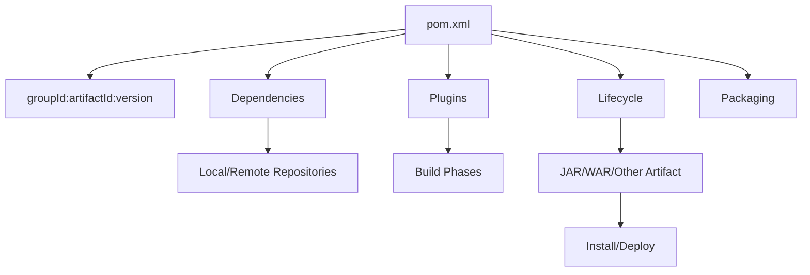
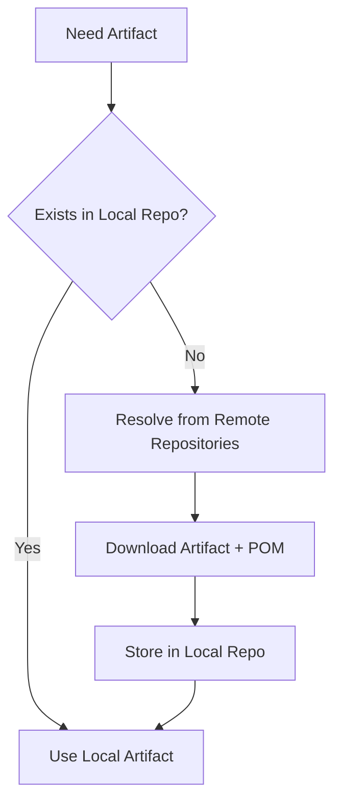
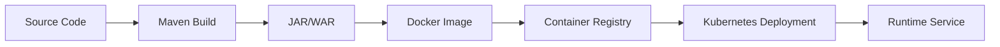

# Maven Foundation

## 1. Core Idea

Maven adalah build system dan project management tool untuk Java. Dalam backend enterprise, Maven bukan hanya command `mvn clean install`. Maven menentukan:

- identitas artifact,
- dependency graph,
- plugin yang menjalankan build behavior,
- lifecycle build,
- test execution,
- package output,
- artifact publishing,
- repository resolution,
- parent/child project structure,
- versioning dan release hygiene.

Untuk Java/JAX-RS service, Maven adalah salah satu sumber kebenaran utama tentang **apa yang dibuild**, **bagaimana dibuild**, **dependency apa yang ikut**, dan **artifact apa yang dipublish**.

Mental model sederhana:



Maven harus dipahami sebagai **declarative build model with lifecycle execution**, bukan hanya command runner.

---

## 2. Why Maven Exists

Tanpa build system, Java project akan menghadapi masalah berikut:

- classpath manual,
- dependency manual,
- compile command manual,
- test execution manual,
- packaging manual,
- artifact naming tidak konsisten,
- release version tidak disiplin,
- local dan CI berbeda,
- dependency transitive tidak terlihat,
- plugin/tooling tersebar di script tidak standar.

Maven menyelesaikan ini dengan konvensi:

- project descriptor: `pom.xml`,
- standard coordinates: `groupId`, `artifactId`, `version`,
- standard lifecycle: `validate`, `compile`, `test`, `package`, `verify`, `install`, `deploy`,
- standard repository model,
- dependency transitivity,
- plugin binding,
- multi-module reactor.

Trade-off Maven adalah: ia sangat powerful, tetapi banyak behavior tersembunyi di parent POM, plugin default, transitive dependency, profile, dan lifecycle binding. Senior engineer harus bisa membuka hidden behavior tersebut.

---

## 3. POM as Build Contract

`pom.xml` adalah Project Object Model. Ia adalah kontrak build project.

POM bisa berisi:

- project coordinates,
- packaging,
- parent POM,
- modules,
- properties,
- dependencies,
- dependency management,
- build plugins,
- plugin management,
- profiles,
- repositories,
- distribution management,
- reporting,
- SCM metadata,
- organization/license metadata.

Contoh minimal:

```xml
<project xmlns="http://maven.apache.org/POM/4.0.0"
         xmlns:xsi="http://www.w3.org/2001/XMLSchema-instance"
         xsi:schemaLocation="http://maven.apache.org/POM/4.0.0 https://maven.apache.org/xsd/maven-4.0.0.xsd">
  <modelVersion>4.0.0</modelVersion>

  <groupId>com.example</groupId>
  <artifactId>quote-service</artifactId>
  <version>1.0.0-SNAPSHOT</version>
  <packaging>jar</packaging>
</project>
```

Dalam enterprise repo, POM jarang sesederhana ini. Biasanya ada parent POM, managed dependency, plugins, profiles, dan module structure.

---

## 4. Project Coordinates

Maven coordinates adalah identitas artifact.

```text
groupId:artifactId:version[:packaging][:classifier]
```

Komponen utama:

- `groupId`: namespace organisasi/domain.
- `artifactId`: nama artifact/module.
- `version`: versi artifact.
- `packaging`: tipe artifact, misalnya `jar`, `war`, `pom`.
- `classifier`: varian artifact, misalnya `sources`, `javadoc`, `tests`.

Contoh:

```text
com.company.quote:quote-order-service:2.14.0:jar
```

Coordinates penting karena dipakai oleh:

- dependency resolution,
- artifact repository,
- CI/CD publish,
- release notes,
- SBOM,
- vulnerability scanning,
- internal library consumption.

### Failure Mode Coordinates

| Problem | Dampak |
|---|---|
| `artifactId` tidak konsisten | Sulit dicari di repository/artifact store |
| Version tidak sesuai release | Traceability rusak |
| groupId salah | Artifact masuk namespace salah |
| Snapshot digunakan di release | Build tidak reproducible |
| Artifact lama dioverwrite | Audit dan rollback berisiko |

---

## 5. groupId

`groupId` biasanya merepresentasikan organisasi, domain, atau namespace package. Ia bukan sekadar formalitas.

Contoh:

```xml
<groupId>com.example.platform</groupId>
```

Dalam enterprise, `groupId` membantu:

- membedakan artifact internal dan external,
- mengelompokkan ownership,
- mengatur repository permission,
- mendukung dependency governance,
- mempermudah scanning dan inventory.

Internal detail seperti naming convention CSG harus diverifikasi, bukan diasumsikan.

---

## 6. artifactId

`artifactId` adalah nama artifact/module. Untuk service Java/JAX-RS, artifactId sering merepresentasikan service atau module.

Contoh:

```xml
<artifactId>quote-api</artifactId>
<artifactId>quote-service</artifactId>
<artifactId>quote-domain</artifactId>
<artifactId>quote-integration-test</artifactId>
```

Good artifactId harus:

- jelas,
- stabil,
- tidak terlalu generic,
- sesuai module boundary,
- mudah dicari di CI/artifact repository/log/release note.

Red flag:

- `common`, `utils`, `core` tanpa konteks,
- artifactId tidak cocok dengan fungsi module,
- artifactId berubah tanpa migration plan,
- artifactId berbeda jauh dari Docker image/service name tanpa mapping jelas.

---

## 7. version

Version menentukan lifecycle artifact.

Umum:

```xml
<version>1.2.3-SNAPSHOT</version>
<version>1.2.3</version>
```

### Snapshot Version

`SNAPSHOT` berarti artifact masih berubah. Maven dapat mengambil versi terbaru dari remote snapshot repository tergantung update policy.

Kelebihan:

- mudah untuk development antar module/service,
- tidak perlu release formal setiap eksperimen.

Risiko:

- tidak reproducible,
- artifact dapat berubah tanpa perubahan coordinate,
- debugging release sulit,
- CI bisa berubah hasilnya karena snapshot remote berubah.

### Release Version

Release version seharusnya immutable.

Kelebihan:

- traceable,
- reproducible,
- cocok untuk production release,
- bisa dipetakan ke Git tag dan artifact repository.

Risiko jika buruk:

- release artifact dioverwrite,
- tag tidak cocok dengan artifact,
- changelog tidak sinkron,
- hotfix membingungkan.

---

## 8. Packaging

`packaging` menentukan tipe artifact dan default lifecycle binding.

Umum:

```xml
<packaging>jar</packaging>
<packaging>war</packaging>
<packaging>pom</packaging>
```

### `jar`

Umum untuk microservice modern, library, dan executable application.

### `war`

Masih relevan untuk deployment ke application server/servlet container tertentu. Untuk JAX-RS/Jakarta RESTful Services legacy/enterprise, WAR masih bisa ditemukan.

### `pom`

Dipakai untuk parent POM atau aggregator POM, terutama multi-module project.

Failure mode packaging:

- module aggregator memakai `jar` padahal harus `pom`,
- service deployable memakai packaging tidak sesuai runtime,
- plugin binding berubah karena packaging,
- CI mengasumsikan output JAR padahal WAR.

---

## 9. Maven Lifecycle

Maven lifecycle adalah urutan fase build. Lifecycle utama:

- `clean`,
- `default`,
- `site`.

Default lifecycle memiliki fase penting:

```text
validate -> compile -> test -> package -> verify -> install -> deploy
```

Saat menjalankan:

```bash
mvn package
```

Maven menjalankan semua fase sampai `package`:

```text
validate -> compile -> test -> package
```

Saat menjalankan:

```bash
mvn verify
```

Maven menjalankan sampai `verify`, biasanya termasuk integration test jika Failsafe dikonfigurasi.

### Senior Rule

Jangan menganggap `mvn install` selalu command terbaik. Untuk CI, sering kali `mvn verify` lebih tepat untuk validasi karena tidak perlu menulis artifact ke local repository, kecuali ada alasan khusus.

---

## 10. Phase vs Goal

Maven membedakan **phase** dan **goal**.

### Phase

Phase adalah titik dalam lifecycle:

```bash
mvn compile
mvn test
mvn package
mvn verify
```

### Goal

Goal adalah tugas spesifik dari plugin:

```bash
mvn dependency:tree
mvn surefire:test
mvn compiler:compile
```

Format goal:

```text
plugin-prefix:goal
```

Contoh:

```bash
mvn dependency:tree
```

`dependency` adalah plugin prefix, `tree` adalah goal.

### Why This Matters

Saat menjalankan phase, Maven menjalankan banyak plugin goal yang terikat ke phase tersebut. Saat menjalankan goal langsung, Maven hanya menjalankan goal itu dan dependency execution yang diperlukan.

Failure mode:

- developer menjalankan goal langsung dan mengira seluruh lifecycle sudah jalan,
- CI menjalankan `package` tetapi integration test ada di `verify`,
- plugin goal custom berjalan hanya pada profile tertentu,
- build lokal berbeda dari CI karena command berbeda.

---

## 11. Maven Plugins

Maven core tidak melakukan semua pekerjaan sendiri. Maven menggunakan plugin.

Plugin umum:

- `maven-compiler-plugin`,
- `maven-surefire-plugin`,
- `maven-failsafe-plugin`,
- `maven-jar-plugin`,
- `maven-war-plugin`,
- `maven-dependency-plugin`,
- `maven-enforcer-plugin`,
- `jacoco-maven-plugin`,
- `maven-shade-plugin`,
- formatting/lint plugin,
- container/image plugin jika digunakan.

Contoh plugin config:

```xml
<build>
  <plugins>
    <plugin>
      <groupId>org.apache.maven.plugins</groupId>
      <artifactId>maven-compiler-plugin</artifactId>
      <version>3.13.0</version>
      <configuration>
        <release>17</release>
      </configuration>
    </plugin>
  </plugins>
</build>
```

Plugin adalah executable dependency. Plugin version harus dipin atau dikelola via `pluginManagement`.

---

## 12. Dependencies

Dependency adalah library yang dibutuhkan project.

Contoh:

```xml
<dependencies>
  <dependency>
    <groupId>jakarta.ws.rs</groupId>
    <artifactId>jakarta.ws.rs-api</artifactId>
    <version>3.1.0</version>
    <scope>provided</scope>
  </dependency>
</dependencies>
```

Dependency punya:

- groupId,
- artifactId,
- version,
- scope,
- optional,
- exclusions.

Maven dependency bersifat transitive. Satu dependency dapat membawa dependency lain.

Untuk Java/JAX-RS, dependency penting biasanya mencakup:

- Jakarta REST API,
- implementation framework seperti Jersey/RESTEasy jika digunakan,
- JSON serialization,
- validation,
- DI/container library,
- logging,
- database driver,
- Kafka/RabbitMQ/Redis client,
- HTTP client,
- test framework,
- Testcontainers,
- observability libraries.

---

## 13. Repository Model

Maven mencari artifact dari repository.

### Local Repository

Default:

```text
~/.m2/repository
```

Local repository menyimpan dependency dan artifact hasil install lokal.

### Remote Repository

Remote repository bisa berupa:

- Maven Central,
- internal Nexus,
- internal Artifactory,
- GitHub Packages,
- vendor repository,
- private artifact repository.

### Resolution Flow



### Failure Mode Repository

| Failure | Common Cause |
|---|---|
| Dependency cannot resolve | Wrong version, missing repo, credential missing |
| Works locally but fails CI | Local cache hides missing remote dependency |
| CI works but local fails | Missing settings.xml/credential |
| Snapshot stale | Update policy/cache issue |
| Wrong artifact resolved | Repository order/mirror/config issue |
| Build slow | Remote repo latency/cache miss |

---

## 14. settings.xml

`settings.xml` adalah konfigurasi Maven di luar POM. Biasanya berada di:

```text
~/.m2/settings.xml
```

Ia dapat berisi:

- server credential,
- mirror,
- proxy,
- profile,
- repository config,
- plugin repository config.

Contoh server credential pattern:

```xml
<settings>
  <servers>
    <server>
      <id>internal-releases</id>
      <username>${env.MAVEN_REPO_USER}</username>
      <password>${env.MAVEN_REPO_TOKEN}</password>
    </server>
  </servers>
</settings>
```

Credential jangan ditaruh di repository. Untuk CI, settings biasanya digenerate dari secret atau disediakan oleh runner/platform.

Internal CSG/team detail harus diverifikasi.

---

## 15. Maven in Local Workflow

Command umum:

```bash
mvn -version
mvn clean
mvn compile
mvn test
mvn verify
mvn package
mvn install
mvn dependency:tree
```

Untuk local development, hindari kebiasaan blind command:

```bash
mvn clean install -DskipTests
```

Itu sering dipakai karena “cepat”, tetapi bisa menyembunyikan:

- test failure,
- integration failure,
- stale generated source,
- dependency problem,
- lifecycle misunderstanding.

Gunakan command sesuai tujuan:

| Tujuan | Command |
|---|---|
| Cek compile cepat | `mvn compile` |
| Jalankan unit test | `mvn test` |
| Validasi lengkap sebelum PR | `mvn verify` |
| Buat package | `mvn package` |
| Install artifact ke local repo | `mvn install` |
| Lihat dependency graph | `mvn dependency:tree` |

---

## 16. Maven in CI/CD

Dalam CI/CD, Maven biasanya dipakai untuk:

- validate POM,
- compile,
- unit test,
- integration test,
- static analysis,
- dependency scan,
- package,
- generate SBOM,
- publish artifact,
- build Docker image,
- attach test report/coverage.

CI command harus eksplisit dan konsisten.

Contoh conceptual CI flow:


Red flag:

- CI menjalankan command berbeda dari README,
- CI skip test tanpa alasan,
- CI tidak memakai Maven wrapper padahal repo menyediakannya,
- Java version di CI berbeda dari local dan container runtime,
- dependency scan tidak fail atau tidak punya owner,
- artifact publish tidak dikaitkan ke Git tag/commit.

---

## 17. Maven and Java/JAX-RS Backend

Untuk Java/JAX-RS backend, Maven memengaruhi:

- API dependency Jakarta REST,
- implementation framework alignment,
- JSON provider,
- servlet/container packaging,
- test framework,
- generated OpenAPI/client/server code,
- database migration tooling,
- messaging client versions,
- observability agent/library,
- Docker image content,
- runtime classpath.

Kesalahan Maven bisa muncul sebagai runtime bug:

- `ClassNotFoundException`,
- `NoSuchMethodError`,
- `NoClassDefFoundError`,
- duplicate classes,
- incompatible Jakarta/javax namespace,
- wrong JSON serialization behavior,
- logging binding conflict,
- driver version mismatch,
- test pass locally but fail in CI,
- package berbeda dari yang dideploy.

---

## 18. Maven and Docker/Kubernetes/AWS/Azure/GitOps

Maven menghasilkan artifact yang sering masuk Docker image.



Jika Maven build tidak reproducible, maka Docker image juga tidak reliable. Jika artifact version tidak traceable, maka deployment juga sulit diaudit.

Impact area:

- Dockerfile harus tahu path artifact Maven,
- CI harus memastikan artifact yang dibuild sama dengan yang masuk image,
- GitOps manifest harus menunjuk image/artifact version yang traceable,
- cloud registry harus menerima artifact dari trusted CI,
- SBOM harus mencakup Maven dependencies dan image content,
- rollback butuh versi artifact/image yang jelas.

---

## 19. Common Failure Modes

### 19.1 Dependency Resolution Failure

Symptom:

```text
Could not resolve dependencies for project ...
```

Possible causes:

- dependency version salah,
- repository credential missing,
- artifact belum dipublish,
- network/proxy issue,
- internal repository down,
- local cache corrupt,
- snapshot stale.

Debug:

```bash
mvn -U dependency:tree
mvn -X dependency:resolve
```

### 19.2 Compilation Failure

Possible causes:

- Java version mismatch,
- missing generated source,
- dependency API changed,
- annotation processor not running,
- module dependency missing.

Debug:

```bash
mvn -version
mvn clean compile
```

### 19.3 Test Failure

Possible causes:

- test data mismatch,
- env variable missing,
- profile not active,
- database/broker unavailable,
- test order dependency,
- flaky test,
- Surefire/Failsafe misconfiguration.

Debug:

```bash
mvn test
mvn -Dtest=SomeTest test
mvn -DskipITs verify
```

### 19.4 Runtime Classpath Failure

Symptom:

```text
java.lang.NoSuchMethodError
java.lang.ClassNotFoundException
java.lang.NoClassDefFoundError
```

Possible causes:

- dependency conflict,
- provided scope incorrect,
- transitive version mismatch,
- shaded dependency issue,
- WAR/container library conflict.

Debug:

```bash
mvn dependency:tree
mvn dependency:tree -Dverbose
mvn dependency:tree -Dincludes=groupId:artifactId
```

---

## 20. Trade-Offs

### Convention vs Flexibility

Maven memberi convention kuat. Ini bagus untuk consistency, tetapi bisa terasa rigid.

### Parent POM Centralization vs Local Clarity

Parent POM membuat version dan plugin konsisten, tetapi behavior bisa tersembunyi dari module.

### Transitive Dependency Convenience vs Hidden Risk

Transitive dependency mengurangi manual work, tetapi menyembunyikan runtime classpath risk.

### Snapshot Speed vs Reproducibility

Snapshot mempercepat development, tetapi buruk untuk release traceability.

### Profile Flexibility vs Build Drift

Profile membantu variasi build, tetapi bisa membuat local/CI/prod berbeda diam-diam.

---

## 21. Correctness Concerns

Maven correctness berarti build menghasilkan artifact yang benar, test yang benar, dan dependency yang benar.

Checklist:

- source compile dengan Java version yang benar,
- test berjalan pada phase yang benar,
- integration test tidak terlewat,
- dependency scope sesuai runtime,
- plugin version dikontrol,
- generated source dibuat sebelum compile,
- artifact packaging sesuai deployment target,
- parent/BOM alignment benar,
- release version immutable.

---

## 22. Productivity Concerns

Maven bisa menjadi productivity enabler atau bottleneck.

Pain point umum:

- build lambat,
- dependency download lambat,
- test terlalu lama,
- command tidak terdokumentasi,
- local setup butuh settings manual,
- CI-only failure sulit direpro,
- multi-module build selalu full build,
- developer sering pakai `-DskipTests` karena feedback loop buruk.

Improvement:

- Maven wrapper,
- documented commands,
- partial build dengan `-pl` dan `-am`,
- test split unit/integration,
- caching CI,
- local script/task runner,
- dependency hygiene,
- clear profile usage.

---

## 23. Security Concerns

Maven security concern:

- vulnerable dependency,
- vulnerable Maven plugin,
- dependency confusion,
- untrusted repository,
- credential leakage di `settings.xml`,
- snapshot artifact berubah,
- plugin menjalankan arbitrary code,
- dependency dengan license incompatible,
- shaded vulnerable library tersembunyi,
- generated source dari untrusted input.

Senior engineer harus memperlakukan dependency dan plugin sebagai executable trust boundary.

---

## 24. Reproducibility Concerns

Build reproducibility terganggu oleh:

- snapshot dependency,
- unpinned plugin,
- range version,
- OS-specific behavior,
- local cache dependency,
- profile auto activation,
- generated timestamp,
- network-dependent build,
- repository mirror berbeda,
- Java/Maven version mismatch.

Baseline:

```bash
./mvnw -version
./mvnw clean verify
```

Jika repo punya Maven wrapper, gunakan wrapper untuk mengurangi tool version drift.

---

## 25. Release Concerns

Maven release concern:

- version bump,
- snapshot to release transition,
- tag alignment,
- artifact repository deploy,
- changelog/release note,
- artifact immutability,
- rollback version,
- dependency freeze,
- SBOM generation,
- CI trusted publish.

Release artifact harus bisa menjawab:

- source commit mana,
- POM version apa,
- dependency tree apa,
- plugin version apa,
- CI run mana,
- artifact repository path mana,
- container image mana.

---

## 26. Observability and Incident-Support Concerns

Saat production incident, Maven metadata membantu menjawab:

- versi service yang jalan,
- dependency version yang ada,
- apakah CVE relevan,
- apakah artifact dari tag tertentu,
- apakah driver/client library berubah,
- apakah packaging berubah,
- apakah runtime classpath sesuai ekspektasi.

Jika artifact tidak traceable, debugging incident menjadi lebih sulit.

---

## 27. Essential Maven Commands

### Inspect Maven Version

```bash
mvn -version
./mvnw -version
```

### Clean Build

```bash
mvn clean verify
./mvnw clean verify
```

### Skip Tests Awareness

```bash
mvn package -DskipTests
mvn package -Dmaven.test.skip=true
```

Perbedaan penting:

- `-DskipTests`: test tidak dijalankan, tetapi test source masih bisa dikompilasi.
- `-Dmaven.test.skip=true`: test compile dan execution dilewati.

Gunakan dengan hati-hati.

### Dependency Tree

```bash
mvn dependency:tree
mvn dependency:tree -Dincludes=org.postgresql:postgresql
```

### Effective POM

```bash
mvn help:effective-pom
```

Ini penting untuk melihat hasil gabungan parent POM, plugin management, profile, dan default config.

### Effective Settings

```bash
mvn help:effective-settings
```

Gunakan untuk debugging repository, mirror, server, proxy, dan profile dari settings.

---

## 28. Internal Verification Checklist

Verifikasi detail internal CSG/team berikut. Jangan mengarang atau mengasumsikan.

### Project and POM

- [ ] Di mana root POM berada?
- [ ] Apakah project single-module atau multi-module?
- [ ] Apakah ada parent POM internal?
- [ ] Apakah parent POM berasal dari platform/shared engineering team?
- [ ] Apa convention `groupId`, `artifactId`, dan `version`?
- [ ] Packaging utama service: JAR, WAR, atau lainnya?

### Build Command

- [ ] Command build resmi di README apa?
- [ ] Command CI apa?
- [ ] Apakah local command sama dengan CI command?
- [ ] Apakah `mvn verify` digunakan?
- [ ] Apakah ada profile wajib untuk integration test?
- [ ] Apakah ada script wrapper di `scripts/`, `Makefile`, atau Taskfile?

### Java and Maven Version

- [ ] Java version yang diwajibkan?
- [ ] Maven version yang diwajibkan?
- [ ] Apakah repo punya `mvnw`?
- [ ] Apakah ada `.mvn/maven.config`?
- [ ] Apakah build JDK sama dengan runtime JDK?

### Repository and Credentials

- [ ] Artifact repository internal apa yang digunakan?
- [ ] Apakah menggunakan Nexus, Artifactory, GitHub Packages, atau lainnya?
- [ ] Bagaimana `settings.xml` disediakan untuk developer?
- [ ] Bagaimana CI mendapat credential repository?
- [ ] Apakah snapshot dan release repository dipisah?

### Dependency Governance

- [ ] Apakah dependency version dikelola di parent/BOM?
- [ ] Apakah direct version di child module diperbolehkan?
- [ ] Apakah dependency convergence dicek?
- [ ] Apakah ada SCA/dependency scan?
- [ ] Apakah ada license scan?

### Release

- [ ] Bagaimana Maven artifact dipublish?
- [ ] Apakah artifact immutable?
- [ ] Bagaimana version bump dilakukan?
- [ ] Apakah Git tag dibuat otomatis?
- [ ] Apakah release artifact dikaitkan ke Docker image?

---

## 29. PR Review Checklist

Saat PR menyentuh POM atau Maven config:

### Coordinates and Packaging

- [ ] Apakah artifact identity berubah?
- [ ] Apakah version change sesuai release process?
- [ ] Apakah packaging sesuai runtime deployment?

### Dependency

- [ ] Apakah dependency baru diperlukan?
- [ ] Apakah scope benar?
- [ ] Apakah version dikelola parent/BOM?
- [ ] Apakah transitive impact dicek?
- [ ] Apakah ada vulnerability/license concern?

### Plugin

- [ ] Apakah plugin version dipin/dikelola?
- [ ] Apakah plugin goal terikat ke phase yang benar?
- [ ] Apakah plugin mengubah artifact output?
- [ ] Apakah plugin aman untuk CI?

### Build Behavior

- [ ] Apakah command local/CI tetap konsisten?
- [ ] Apakah profile baru membuat hidden behavior?
- [ ] Apakah test tetap berjalan di phase yang benar?
- [ ] Apakah reproducibility terganggu?

### Release/CI

- [ ] Apakah artifact publish path berubah?
- [ ] Apakah Docker image build terdampak?
- [ ] Apakah SBOM/security scan terdampak?
- [ ] Apakah release note perlu update?

---

## 30. Practical Senior Engineer Heuristics

1. **Never review POM as XML only.** Review it as build behavior.
2. **Always ask what lifecycle phase is affected.** Plugin config tanpa phase understanding berbahaya.
3. **Dependency scope is runtime design.** Scope salah bisa menjadi production bug.
4. **Parent POM hides power.** Gunakan effective POM untuk melihat real config.
5. **Local cache can lie.** Build yang sukses lokal belum tentu dependency benar.
6. **Snapshot is not release material.** Snapshot mempercepat development tetapi merusak traceability release.
7. **Maven plugin is executable supply chain.** Plugin perlu version governance dan security review.
8. **Maven command is part of contract.** README, CI, dan release process harus konsisten.

---

## 31. Summary

Maven adalah fondasi build untuk banyak sistem Java enterprise. Untuk senior backend engineer, Maven harus dipahami sebagai sistem yang menghubungkan source code, dependency, plugin, lifecycle, artifact, CI/CD, security scanning, release, dan production runtime.

Kemampuan minimal setelah part ini:

- membaca POM sebagai build contract,
- memahami coordinates dan packaging,
- membedakan lifecycle phase dan plugin goal,
- memahami dependency dan repository model,
- mengetahui role local repository dan remote repository,
- memahami dampak Maven ke Java/JAX-RS runtime,
- mengenali failure mode Maven dasar,
- melakukan review awal perubahan POM dengan benar.

Part berikutnya akan masuk lebih dalam ke **Maven Lifecycle and Build Phases**, karena banyak bug build, CI, test, dan release berasal dari salah paham tentang fase Maven.
