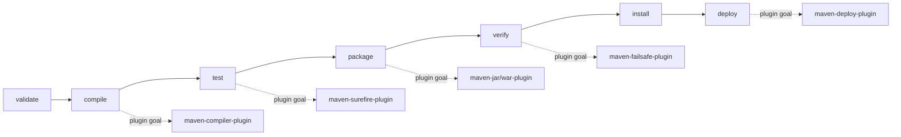
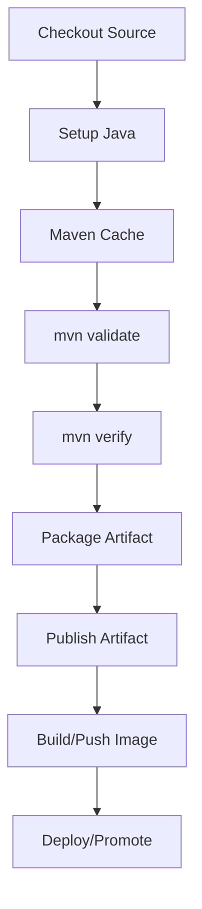
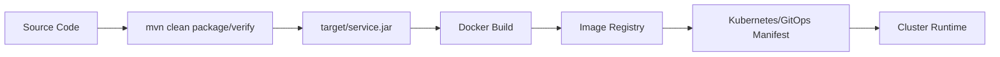

# Maven Lifecycle and Build Phases

## 1. Core Idea

Maven lifecycle adalah urutan fase standar yang mengubah source code menjadi artifact yang bisa diuji, dipackage, dipublish, dan akhirnya dideploy.

Untuk senior backend engineer, lifecycle Maven penting karena banyak masalah build dan release bukan berasal dari Java code, tetapi dari salah paham tentang **phase mana yang berjalan**, **plugin goal mana yang terikat ke phase tersebut**, dan **command Maven apa yang dipakai local vs CI**.

Command seperti ini terlihat sederhana:

```bash
mvn test
mvn package
mvn verify
mvn install
mvn deploy
```

Tetapi masing-masing menjalankan rangkaian fase yang berbeda.

Mental model sederhana:



Maven lifecycle adalah **contract of execution order**. Plugin adalah **behavior attached to lifecycle phases**.

---

## 2. Why Lifecycle Exists

Tanpa lifecycle standar, setiap Java project akan punya build sequence sendiri:

- compile manual,
- test manual,
- package manual,
- integration test manual,
- publish manual,
- release manual,
- scan manual,
- report manual.

Masalahnya, project enterprise tidak cukup hanya bisa dibuild di laptop satu developer. Build harus:

- bisa dijalankan di CI,
- bisa dipahami reviewer,
- bisa dipublish ke artifact repository,
- bisa dikaitkan ke Git commit/tag,
- bisa diuji sebelum release,
- bisa diulang saat incident atau audit,
- bisa dijadikan dasar Docker image,
- bisa dikontrol oleh security/compliance checks.

Lifecycle Maven memberi urutan standar agar semua project berbicara dengan grammar build yang sama.

---

## 3. Maven Has Multiple Lifecycles

Maven memiliki beberapa lifecycle, bukan hanya default lifecycle.

Lifecycle utama:

1. `default`
2. `clean`
3. `site`

### `default` lifecycle

Lifecycle utama untuk build artifact.

Fase yang sering dipakai:

```text
validate -> compile -> test -> package -> verify -> install -> deploy
```

### `clean` lifecycle

Lifecycle untuk membersihkan output build.

Command umum:

```bash
mvn clean
```

Biasanya menghapus direktori `target/`.

### `site` lifecycle

Lifecycle untuk membuat dokumentasi/reporting site Maven.

Command umum:

```bash
mvn site
```

Di banyak enterprise backend service, `site` jarang dipakai sehari-hari, tetapi masih relevan untuk reporting, plugin documentation, atau compliance artifact tertentu.

---

## 4. Default Lifecycle Overview

Default lifecycle Maven sangat panjang, tetapi senior engineer biasanya perlu memahami fase inti berikut:

| Phase | Purpose | Typical Artifact/Effect |
|---|---|---|
| `validate` | Validasi project structure/config | Fail early jika config tidak valid |
| `compile` | Compile source utama | `target/classes` |
| `test` | Jalankan unit test | Surefire reports |
| `package` | Package compiled code | JAR/WAR |
| `verify` | Jalankan verification/integration checks | Failsafe reports, quality gate |
| `install` | Install artifact ke local repo | `~/.m2/repository` |
| `deploy` | Publish artifact ke remote repo | Nexus/Artifactory/GitHub Packages/etc. |

Yang sering dilupakan:

> Saat menjalankan Maven sampai sebuah phase, semua phase sebelumnya ikut berjalan.

Contoh:

```bash
mvn package
```

Akan menjalankan fase sebelum `package`, termasuk `validate`, `compile`, dan `test`.

```bash
mvn verify
```

Akan menjalankan sampai `verify`, termasuk `package`.

```bash
mvn deploy
```

Akan menjalankan sampai `deploy`, termasuk `install`-equivalent build path dan semua test/verification yang terikat sebelum deploy.

---

## 5. Phase vs Goal

Ini perbedaan yang wajib jelas.

### Phase

Phase adalah titik dalam lifecycle.

Contoh:

```text
compile
test
package
verify
install
deploy
```

Phase tidak melakukan pekerjaan sendiri. Ia hanya titik eksekusi.

### Goal

Goal adalah task aktual dari plugin.

Contoh:

```text
compiler:compile
surefire:test
jar:jar
failsafe:integration-test
failsafe:verify
deploy:deploy
```

### Binding

Binding adalah hubungan antara phase dan goal.

Contoh mental model:

```text
phase: compile  -> goal: compiler:compile
phase: test     -> goal: surefire:test
phase: package  -> goal: jar:jar
phase: verify   -> goal: failsafe:verify
phase: deploy   -> goal: deploy:deploy
```

Jika PR mengubah plugin binding, ia mengubah perilaku build meskipun command CI tetap sama.

---

## 6. Direct Goal Invocation vs Lifecycle Phase Invocation

Ada dua cara menjalankan Maven:

### Menjalankan phase

```bash
mvn verify
```

Artinya: jalankan lifecycle sampai phase `verify`.

Ini menjalankan semua fase sebelumnya.

### Menjalankan goal langsung

```bash
mvn dependency:tree
mvn versions:display-dependency-updates
mvn help:effective-pom
```

Artinya: jalankan goal plugin tertentu.

Goal langsung tidak selalu menjalankan lifecycle penuh, kecuali plugin goal tersebut memerlukan lifecycle tertentu atau dikombinasikan dengan phase.

Contoh kombinasi:

```bash
mvn clean verify dependency:tree
```

Ini menjalankan `clean`, lifecycle sampai `verify`, lalu goal `dependency:tree` sesuai urutan eksekusi Maven.

Senior engineer harus hati-hati membaca command CI karena command panjang bisa menggabungkan lifecycle phase dan direct goal.

---

## 7. `validate` Phase

`validate` adalah fase awal untuk memastikan project valid sebelum compile.

Biasanya dipakai untuk:

- Maven Enforcer rules,
- Java version check,
- Maven version check,
- dependency convergence check,
- banned dependency check,
- required property check,
- license header check jika dikonfigurasi di fase awal.

Contoh:

```bash
mvn validate
```

Useful untuk fail fast.

Contoh plugin binding:

```xml
<plugin>
  <groupId>org.apache.maven.plugins</groupId>
  <artifactId>maven-enforcer-plugin</artifactId>
  <version>3.5.0</version>
  <executions>
    <execution>
      <id>enforce-build-rules</id>
      <phase>validate</phase>
      <goals>
        <goal>enforce</goal>
      </goals>
      <configuration>
        <rules>
          <requireJavaVersion>
            <version>[17,)</version>
          </requireJavaVersion>
        </rules>
      </configuration>
    </execution>
  </executions>
</plugin>
```

### Failure Mode

`validate` bisa gagal karena:

- Java version salah,
- Maven version salah,
- banned dependency,
- dependency convergence error,
- missing required property,
- profile tidak aktif,
- parent POM tidak resolved.

### Debugging

```bash
mvn validate -X
mvn help:effective-pom
mvn help:active-profiles
mvn dependency:tree
```

---

## 8. `compile` Phase

`compile` meng-compile source utama dari `src/main/java` ke `target/classes`.

Command:

```bash
mvn compile
```

Plugin umum:

```text
maven-compiler-plugin
```

Hal penting:

- source/target/release Java version,
- annotation processor,
- generated source,
- module path/classpath,
- dependency scope compile/provided,
- Jakarta namespace compatibility,
- compiler warnings/error policy.

Contoh compiler plugin:

```xml
<plugin>
  <groupId>org.apache.maven.plugins</groupId>
  <artifactId>maven-compiler-plugin</artifactId>
  <version>3.13.0</version>
  <configuration>
    <release>17</release>
  </configuration>
</plugin>
```

### Failure Mode

Compile failure biasanya berasal dari:

- Java version mismatch,
- missing dependency,
- wrong dependency scope,
- generated source belum dibuat,
- annotation processor tidak jalan,
- package rename `javax.*` vs `jakarta.*`,
- method/class tidak ada karena dependency version drift,
- multi-module build order salah saat build partial.

### Debugging

```bash
mvn compile -e
mvn compile -X
mvn -version
mvn dependency:tree
mvn help:effective-pom
```

Untuk multi-module:

```bash
mvn -pl service-module -am compile
```

---

## 9. `test` Phase

`test` menjalankan unit test, umumnya dengan `maven-surefire-plugin`.

Command:

```bash
mvn test
```

Default input:

```text
src/test/java
```

Default output:

```text
target/test-classes
target/surefire-reports
```

### Test Naming Convention

Surefire biasanya mengenali pola seperti:

```text
**/Test*.java
**/*Test.java
**/*Tests.java
**/*TestCase.java
```

Konfigurasi bisa berbeda di project internal.

### Failure Mode

`test` bisa gagal karena:

- unit test assertion failure,
- test fixture tidak stabil,
- port conflict,
- timezone/locale mismatch,
- dependency test scope hilang,
- test order dependency,
- static state leak,
- flaky test,
- parallel test race,
- environment variable lokal tidak tersedia di CI,
- secret/config dipakai unit test padahal seharusnya mock.

### Debugging

```bash
mvn test
mvn test -Dtest=QuoteServiceTest
mvn test -Dtest=QuoteServiceTest#shouldRejectInvalidQuote
mvn test -Dsurefire.printSummary=true
ls target/surefire-reports
cat target/surefire-reports/*.txt
```

Untuk debugging JVM test:

```bash
mvn -Dmaven.surefire.debug test
```

Lalu attach debugger ke port yang ditampilkan.

---

## 10. `package` Phase

`package` membuat artifact dari compiled output.

Command:

```bash
mvn package
```

Output umum:

```text
target/<artifactId>-<version>.jar
target/<artifactId>-<version>.war
```

Plugin yang sering terlibat:

- `maven-jar-plugin`,
- `maven-war-plugin`,
- `maven-shade-plugin`,
- Spring Boot plugin jika service Spring,
- Jib/Docker plugin jika image build di Maven,
- custom packaging plugin internal jika ada.

Untuk Java/JAX-RS, packaging bisa berupa:

- executable JAR,
- WAR untuk app server,
- library JAR,
- distribution archive,
- generated client/server artifact.

### Failure Mode

`package` bisa gagal karena:

- test sebelumnya gagal,
- duplicate resources,
- invalid manifest,
- missing main class,
- shade conflict,
- duplicate classes,
- WAR packaging salah,
- resource filtering error,
- generated artifact tidak ada,
- Docker/image plugin gagal jika terikat ke package.

### Debugging

```bash
mvn package -DskipTests
jar tf target/*.jar | head
jar tf target/*.jar | grep application
mvn help:effective-pom
```

Catatan: `-DskipTests` bisa berguna untuk isolasi packaging issue, tetapi tidak boleh menjadi default release practice.

---

## 11. `verify` Phase

`verify` adalah fase penting untuk CI enterprise.

Command:

```bash
mvn verify
```

`verify` biasanya dipakai untuk:

- integration test,
- quality gate,
- coverage verification,
- dependency convergence,
- static analysis,
- generated contract validation,
- API compatibility check,
- license scan,
- vulnerability scan,
- container test,
- smoke-like local verification.

Plugin yang sering terlibat:

- `maven-failsafe-plugin`,
- `jacoco-maven-plugin`,
- `maven-enforcer-plugin`,
- `spotless-maven-plugin`,
- `checkstyle`,
- `pmd`,
- `spotbugs`,
- dependency-check/SCA plugin,
- custom enterprise plugin.

### Why `verify` Matters

Untuk CI, `mvn verify` lebih kuat daripada `mvn test` karena ia mencakup packaging dan verification setelah package.

Dalam banyak backend enterprise, standard CI command seharusnya lebih dekat ke:

```bash
mvn clean verify
```

daripada hanya:

```bash
mvn test
```

Tetapi detail final harus mengikuti standard internal team.

### Failure Mode

`verify` bisa gagal karena:

- integration test gagal,
- service dependency tidak tersedia,
- Testcontainers gagal start,
- Docker daemon tidak tersedia,
- coverage threshold tidak terpenuhi,
- static analysis violation,
- dependency convergence failure,
- vulnerability scan fail,
- generated API contract mismatch,
- flaky external dependency.

### Debugging

```bash
mvn verify -e
mvn verify -X
mvn -DskipITs verify
mvn -DskipTests verify
mvn -DskipTests -DskipITs package
ls target/failsafe-reports
cat target/failsafe-reports/*.txt
```

Gunakan skip flag hanya untuk isolasi penyebab, bukan untuk menyembunyikan quality failure.

---

## 12. `install` Phase

`install` menaruh artifact ke local Maven repository.

Command:

```bash
mvn install
```

Output utama:

```text
~/.m2/repository/<groupId path>/<artifactId>/<version>/
```

Fungsi `install`:

- membuat artifact tersedia untuk project lokal lain,
- membantu development multi-repo,
- menguji packaging sebelum deploy,
- mengisi local cache.

### Risk

`mvn install` bisa membuat local machine terlihat sehat padahal CI gagal, karena dependency lokal sudah tersedia dari build sebelumnya.

Contoh masalah:

- local artifact versi snapshot ada di `~/.m2`, tetapi remote repo tidak punya,
- dependency internal belum dipublish,
- build sukses karena artifact stale,
- project lain memakai artifact lokal yang tidak sesuai commit/tag.

### Debugging

```bash
mvn install
ls ~/.m2/repository/com/example/quote-service
mvn dependency:purge-local-repository
mvn -U clean verify
```

Untuk isolasi local repo:

```bash
mvn -Dmaven.repo.local=/tmp/m2-clean clean verify
```

Ini membantu mengecek apakah build bergantung pada local cache.

---

## 13. `deploy` Phase

`deploy` mempublish artifact ke remote repository.

Command:

```bash
mvn deploy
```

Biasanya digunakan di CI/release pipeline, bukan local developer workflow biasa.

Remote repository dikontrol oleh:

- `distributionManagement`,
- settings Maven,
- repository credentials,
- CI secret,
- artifact repository policy,
- snapshot vs release repository.

Contoh `distributionManagement`:

```xml
<distributionManagement>
  <snapshotRepository>
    <id>internal-snapshots</id>
    <url>https://repo.example.com/snapshots</url>
  </snapshotRepository>
  <repository>
    <id>internal-releases</id>
    <url>https://repo.example.com/releases</url>
  </repository>
</distributionManagement>
```

### Failure Mode

`deploy` bisa gagal karena:

- credential tidak tersedia,
- repository ID tidak cocok dengan `settings.xml`,
- artifact release sudah ada dan immutable,
- network/proxy issue,
- TLS/certificate issue,
- permission denied,
- wrong snapshot/release repository,
- version policy violation,
- staging repository close/release failure.

### Debugging

```bash
mvn deploy -e
mvn deploy -X
mvn help:effective-settings
mvn help:effective-pom
```

Jangan mencetak credential di log. Jangan upload release artifact dari laptop kecuali process internal memang mengizinkan.

---

## 14. `clean` Lifecycle

`clean` menghapus output build sebelumnya.

Command:

```bash
mvn clean
```

Biasanya menghapus:

```text
target/
```

Common command:

```bash
mvn clean verify
```

### Why Clean Helps

`clean` membantu menghindari:

- stale class,
- stale generated source,
- stale resource,
- stale test report,
- stale packaged artifact.

### Why Clean Is Not Always Free

`clean` memperlambat build karena semua harus dibangun ulang.

Di local workflow, kadang cukup:

```bash
mvn test
```

Tetapi untuk CI/release, clean build lebih defensible.

### Failure Mode

`clean` bisa gagal karena:

- file terkunci oleh process lain,
- permission issue,
- path terlalu panjang di Windows,
- generated file dimiliki user berbeda,
- Docker bind mount permission mismatch.

---

## 15. `site` Lifecycle

`site` membuat project documentation/report.

Command:

```bash
mvn site
```

Bisa menghasilkan:

- dependency report,
- plugin report,
- project info,
- Javadocs,
- test report,
- static analysis report,
- license report.

Di banyak service modern, reporting lebih sering dipindahkan ke CI artifacts, code scanning, dashboard, atau security platform. Tetapi `site` tetap perlu dikenali saat ada legacy Maven reporting setup.

---

## 16. Packaging Type Changes Lifecycle Binding

Maven behavior default bergantung pada `packaging`.

Contoh:

```xml
<packaging>jar</packaging>
```

vs

```xml
<packaging>war</packaging>
```

vs

```xml
<packaging>pom</packaging>
```

### `jar`

Umum untuk service executable atau library.

### `war`

Umum untuk aplikasi yang dideploy ke servlet container/application server.

### `pom`

Umum untuk parent POM atau aggregator multi-module.

Packaging mengubah default plugin binding. Jadi perubahan packaging bukan perubahan metadata kecil; ia bisa mengubah output artifact dan lifecycle behavior.

---

## 17. Plugin Binding

Plugin bisa terikat ke phase secara default atau explicit.

### Default Binding

Jika packaging `jar`, Maven secara default tahu bahwa phase `package` perlu membuat JAR.

### Explicit Binding

Project bisa menambahkan binding sendiri.

Contoh:

```xml
<execution>
  <id>run-format-check</id>
  <phase>verify</phase>
  <goals>
    <goal>check</goal>
  </goals>
</execution>
```

Ini berarti setiap `mvn verify` menjalankan check tersebut.

### Review Concern

Saat PR menambahkan plugin execution, tanyakan:

- phase mana yang dipilih?
- apakah phase itu berjalan di local command?
- apakah phase itu berjalan di CI command?
- apakah plugin butuh network?
- apakah plugin menghasilkan file?
- apakah plugin deterministic?
- apakah plugin aman untuk parallel build?
- apakah plugin version dipin?

---

## 18. Build Order in Multi-Module Projects

Dalam multi-module project, Maven reactor menentukan urutan build berdasarkan dependency antar module.

Contoh struktur:

```text
root
├── pom.xml
├── quote-api
├── quote-domain
├── quote-service
└── quote-adapter-postgres
```

Jika `quote-service` bergantung pada `quote-domain`, Maven harus build `quote-domain` lebih dulu.

Command umum:

```bash
mvn clean verify
```

Build semua module.

Partial build:

```bash
mvn -pl quote-service -am verify
```

Artinya build `quote-service` dan dependency module yang dibutuhkan.

### Failure Mode

- module dependency tidak dideklarasikan,
- build partial gagal karena generated source dari module lain,
- local repo menyembunyikan missing module dependency,
- test module bergantung pada side effect module lain,
- order terlihat benar lokal tetapi gagal di clean CI.

---

## 19. Common Commands and What They Actually Mean

### `mvn test`

Compile main source, compile test source, run unit tests.

Good for fast local feedback.

Not enough for full release confidence.

### `mvn package`

Run up to package. Biasanya menjalankan unit tests lalu membuat artifact.

Good untuk memastikan artifact bisa dibuat.

### `mvn verify`

Run up to verify. Biasanya termasuk integration test dan quality gates.

Good candidate untuk CI validation.

### `mvn install`

Run up to install. Menaruh artifact ke local repo.

Good untuk local multi-repo development.

Risky jika membuat developer lupa bahwa artifact belum dipublish remote.

### `mvn deploy`

Publish artifact ke remote repo.

Harus dikontrol CI/release process.

### `mvn clean verify`

Clean build plus verification.

Good default untuk CI validation jika pipeline tidak punya alasan khusus lain.

---

## 20. Skipping Tests: Useful Tool, Dangerous Habit

Ada beberapa flag yang sering digunakan:

```bash
mvn package -DskipTests
mvn package -Dmaven.test.skip=true
mvn verify -DskipITs
```

### `-DskipTests`

Biasanya compile test source tetapi tidak menjalankan tests.

### `-Dmaven.test.skip=true`

Biasanya melewati compile test source dan test execution.

Ini lebih berbahaya karena error compile test pun tidak terlihat.

### `-DskipITs`

Umumnya dipakai untuk melewati integration tests jika Failsafe dikonfigurasi untuk menghormati property ini.

### Senior Rule

Skipping tests boleh untuk diagnosis atau local iteration, tetapi harus jelas:

- test apa yang dilewati,
- kenapa dilewati,
- apakah CI tetap menjalankannya,
- apakah release pipeline tetap menjalankannya,
- apakah skip flag masuk ke dokumentasi resmi atau hanya debug command sementara.

### Failure Mode

- bug lolos karena test dilewati,
- CI command diwariskan dari local shortcut,
- release artifact dibuat tanpa verification,
- integration test tidak pernah berjalan karena property salah,
- flaky test disembunyikan, bukan diperbaiki.

---

## 21. Unit Test vs Integration Test Lifecycle

Maven convention yang sehat:

```text
unit test        -> test phase      -> surefire
integration test -> integration-test/verify -> failsafe
```

Typical naming:

```text
*Test.java  -> unit test
*IT.java    -> integration test
```

Failsafe biasanya punya dua goal penting:

```text
failsafe:integration-test
failsafe:verify
```

Kenapa ada dua?

- `integration-test` menjalankan integration tests.
- `verify` mengevaluasi hasilnya dan menggagalkan build jika ada failure.

Jika hanya menjalankan `failsafe:integration-test` tanpa `failsafe:verify`, failure bisa tidak memfailkan build dengan benar tergantung konfigurasi.

---

## 22. Lifecycle and CI/CD

Dalam CI/CD, command Maven adalah bagian dari contract.

Pipeline Java/Maven biasanya berisi:



Tetapi implementasi bisa berbeda:

- satu command `mvn clean verify`,
- separate job untuk unit/integration test,
- matrix build,
- separate security scan,
- deploy hanya di branch/tag tertentu,
- artifact publish hanya di release pipeline.

Yang penting: command Maven di CI harus eksplisit dan bisa dijelaskan.

---

## 23. Lifecycle and Java/JAX-RS Backend

Untuk Java/JAX-RS service, lifecycle Maven berdampak pada:

- compile compatibility Java/Jakarta,
- generated JAX-RS client/server code,
- resource packaging,
- dependency scope ke runtime container,
- WAR vs JAR packaging,
- API contract test,
- integration test dengan HTTP endpoint,
- packaging untuk Docker image,
- artifact version yang dipakai deployment.

Contoh failure:

- `mvn test` sukses, tetapi `mvn package` gagal karena resource filtering.
- `mvn package` sukses, tetapi `mvn verify` gagal karena integration test HTTP endpoint gagal.
- `mvn install` sukses lokal, tetapi CI gagal karena parent POM tidak resolved dari remote repo.
- `mvn deploy` gagal karena release artifact version sudah pernah dipublish.

---

## 24. Lifecycle and Docker/Kubernetes/GitOps

Maven output sering menjadi input Docker build.



Jika Maven lifecycle salah, downstream juga salah:

- JAR belum dibuat,
- JAR stale,
- test dilewati,
- artifact version tidak sinkron dengan image tag,
- generated config tidak masuk package,
- dependency runtime tidak ada,
- SBOM tidak sesuai artifact final.

Dalam GitOps, artifact identity harus traceable:

```text
Git commit -> Maven artifact -> Docker image digest -> Deployment manifest -> Running pod
```

---

## 25. Lifecycle and Release Discipline

Release discipline membutuhkan Maven lifecycle yang jelas.

Questions:

- phase apa yang wajib sebelum release?
- apakah `verify` wajib?
- apakah integration test wajib?
- apakah scan terjadi sebelum publish?
- apakah artifact dipublish setelah tag atau sebelum tag?
- apakah version bump terjadi otomatis?
- apakah release artifact immutable?
- apakah release bisa direproduksi dari tag?

Common release command tidak boleh disalin tanpa paham:

```bash
mvn clean deploy
```

Pertanyaan senior:

- deploy ke repository mana?
- snapshot atau release?
- credential dari mana?
- apakah build sudah diverifikasi?
- apakah Git tag dibuat?
- apakah changelog dibuat?
- apakah artifact sudah discan?
- apakah build deterministic?

---

## 26. Failure Mode Map

| Symptom | Likely Area | Diagnostic Command |
|---|---|---|
| `package does not exist` | compile dependency/classpath | `mvn dependency:tree` |
| `invalid target release` | Java/compiler config | `mvn -version`, `help:effective-pom` |
| Unit test tidak jalan | Surefire includes/excludes | `mvn test -X` |
| Integration test tidak jalan | Failsafe binding/naming | `mvn verify -X` |
| Artifact tidak ada | packaging/plugin binding | `mvn package`, `ls target` |
| CI gagal, local sukses | env/profile/cache mismatch | `help:active-profiles`, clean repo |
| Deploy gagal 401/403 | credential/permission | `help:effective-settings` |
| Release artifact exists | immutable release repo | check repo policy/version |
| Docker build gagal copy JAR | artifact name/path mismatch | `ls target/*.jar` |
| Test skip tidak bekerja | property/plugin config mismatch | `help:effective-pom` |

---

## 27. Debugging Maven Lifecycle

### Start With the Exact Command

Jangan mulai dari asumsi. Cari command aktual:

- di README,
- di GitHub Actions/Jenkins/GitLab pipeline,
- di Makefile/Taskfile,
- di release script,
- di developer notes,
- di PR comment.

### Print Maven and Java Version

```bash
mvn -version
java -version
```

### See Effective POM

```bash
mvn help:effective-pom > effective-pom.xml
```

### See Active Profiles

```bash
mvn help:active-profiles
```

### Run With Error Detail

```bash
mvn clean verify -e
```

### Run With Debug Detail

```bash
mvn clean verify -X
```

`-X` sangat verbose. Gunakan untuk diagnosis, bukan default CI.

### Isolate Local Cache

```bash
mvn -Dmaven.repo.local=/tmp/m2-clean clean verify
```

### Force Snapshot Update

```bash
mvn -U clean verify
```

---

## 28. Correctness Concerns

Lifecycle correctness berarti command yang dipakai benar-benar membuktikan hal yang diklaim.

Contoh klaim bermasalah:

> “Build sudah aman karena `mvn package -DskipTests` sukses.”

Itu hanya membuktikan artifact bisa dipackage tanpa menjalankan test.

Contoh klaim lebih defensible:

> “PR sudah menjalankan `mvn clean verify` di CI, termasuk unit test, integration test, static analysis, dan dependency convergence sesuai binding POM.”

Checklist correctness:

- [ ] Apakah phase yang dipakai cukup untuk klaim kualitas?
- [ ] Apakah test benar-benar berjalan?
- [ ] Apakah integration test berjalan di `verify`?
- [ ] Apakah plugin check berjalan di phase yang dipakai CI?
- [ ] Apakah local command sama dengan CI command?
- [ ] Apakah artifact yang dipackage adalah artifact yang diuji?

---

## 29. Productivity Concerns

Lifecycle terlalu berat bisa membuat developer menghindari command resmi.

Contoh anti-pattern:

- local build selalu 30 menit,
- semua test integration jalan untuk perubahan kecil,
- clean selalu wajib padahal tidak selalu perlu,
- CI mem-build semua module walau PR menyentuh satu module,
- tidak ada command fast feedback,
- tidak ada dokumentasi test filtering.

Senior engineer perlu membedakan:

- fast local feedback,
- pre-push confidence,
- CI validation,
- release validation.

Contoh command tiering:

```bash
# Fast feedback
mvn test

# Module-level verification
mvn -pl quote-service -am verify

# Full repo confidence
mvn clean verify
```

Detail final harus mengikuti repo internal.

---

## 30. Security Concerns

Maven lifecycle bisa menjalankan plugin yang mengambil network resource, membaca file, menghasilkan artifact, atau mempublish output.

Security concerns:

- plugin version tidak dipin,
- plugin dari source tidak terpercaya,
- credential Maven dicetak di log,
- deploy phase bisa dijalankan lokal tanpa guard,
- generated artifact menyertakan secret,
- dependency scan tidak berjalan di lifecycle CI,
- SBOM dibuat sebelum artifact final,
- release deploy memakai token terlalu luas,
- profile release aktif tidak sengaja.

Review plugin execution seperti executable code.

---

## 31. Reproducibility Concerns

Build reproducibility dipengaruhi oleh lifecycle.

Risiko:

- local cache menyembunyikan dependency hilang,
- plugin version floating,
- generated source timestamp-dependent,
- test order tidak deterministic,
- profile aktif berdasarkan OS/JDK/env,
- network access saat build,
- snapshot dependency berubah,
- artifact dibuat tanpa clean,
- release command berbeda dari CI command.

Praktik defensible:

```bash
mvn -Dmaven.repo.local=/tmp/m2-clean clean verify
```

untuk cek dependency resolution dari nol.

---

## 32. Observability and Incident Support Concerns

Maven lifecycle terlihat jauh dari production incident, tetapi build metadata sering diperlukan saat incident.

Pertanyaan incident:

- artifact apa yang berjalan?
- dibuild dari commit/tag apa?
- phase apa yang dijalankan sebelum publish?
- test/scan apa yang berjalan?
- apakah artifact sama dengan yang diuji?
- apakah artifact dipublish ulang?
- apakah snapshot berubah?
- apakah dependency berubah tanpa code change?

CI logs, Maven artifact metadata, Git tag, image digest, dan deployment manifest harus saling terhubung.

---

## 33. Internal Verification Checklist

Untuk CSG/team, jangan mengarang. Verifikasi langsung:

### Maven Command

- [ ] Command Maven apa yang dipakai untuk local build?
- [ ] Command Maven apa yang dipakai untuk PR validation?
- [ ] Command Maven apa yang dipakai untuk release?
- [ ] Apakah `clean` wajib di CI?
- [ ] Apakah `verify` dipakai atau hanya `test/package`?

### Lifecycle Binding

- [ ] Plugin apa saja yang terikat ke `validate`?
- [ ] Plugin apa saja yang terikat ke `test`?
- [ ] Plugin apa saja yang terikat ke `verify`?
- [ ] Plugin apa saja yang terikat ke `package`?
- [ ] Plugin apa saja yang terikat ke `deploy`?

### Testing

- [ ] Unit test berjalan di phase apa?
- [ ] Integration test berjalan di phase apa?
- [ ] Naming convention unit/integration test apa?
- [ ] Bagaimana skip unit/integration test diatur?
- [ ] Apakah CI mengizinkan skip test?

### Release

- [ ] Siapa yang menjalankan `mvn deploy`?
- [ ] Apakah deploy hanya boleh dari CI?
- [ ] Artifact repository apa yang digunakan?
- [ ] Apakah release artifact immutable?
- [ ] Bagaimana tag/version/artifact dihubungkan?

### Local vs CI

- [ ] Apakah local command sama dengan CI command?
- [ ] Apakah profile local berbeda dari CI?
- [ ] Apakah ada private settings.xml requirement?
- [ ] Apakah local cache sering menyembunyikan masalah?
- [ ] Apakah ada script wrapper untuk command resmi?

---

## 34. PR Review Checklist

Saat PR mengubah Maven lifecycle, plugin, POM, CI command, atau build script:

### Phase and Goal

- [ ] Phase apa yang terdampak?
- [ ] Goal plugin apa yang dijalankan?
- [ ] Apakah execution id jelas?
- [ ] Apakah binding terjadi di phase yang tepat?
- [ ] Apakah command CI menjalankan phase tersebut?

### Test and Verification

- [ ] Apakah unit test tetap berjalan?
- [ ] Apakah integration test tetap berjalan?
- [ ] Apakah quality gate tetap berjalan?
- [ ] Apakah skip flag berubah?
- [ ] Apakah report tetap dipublish?

### Artifact

- [ ] Apakah artifact output berubah?
- [ ] Apakah artifact yang diuji sama dengan artifact yang dipublish?
- [ ] Apakah Docker build path terdampak?
- [ ] Apakah generated file masuk package?
- [ ] Apakah artifact name/version berubah?

### CI/CD

- [ ] Apakah CI command berubah?
- [ ] Apakah cache behavior berubah?
- [ ] Apakah release pipeline terdampak?
- [ ] Apakah deploy/publish behavior berubah?
- [ ] Apakah credential/secret exposure berubah?

### Reproducibility and Safety

- [ ] Apakah build tetap deterministic?
- [ ] Apakah plugin/dependency version dipin?
- [ ] Apakah build bergantung pada local cache?
- [ ] Apakah network dependency baru muncul?
- [ ] Apakah command destructive punya guard?

---

## 35. Senior Engineer Heuristics

1. **Prefer `verify` for confidence, `test` for fast feedback.** Jangan campur klaimnya.
2. **A phase is a promise only if plugin binding exists.** `verify` tidak otomatis berarti integration test berjalan jika Failsafe tidak dikonfigurasi.
3. **Skipping tests is a diagnostic technique, not a quality strategy.**
4. **Build command is production policy.** Perubahan command CI adalah perubahan governance.
5. **Local cache is not source of truth.** Clean repo dan clean local Maven repo sering membuka masalah tersembunyi.
6. **Deploy phase belongs to controlled automation.** Publish artifact dari laptop biasanya harus dihindari kecuali process internal jelas.
7. **Artifact tested must be artifact shipped.** Jangan build ulang secara berbeda setelah test.
8. **Plugin binding is executable behavior.** Review seperti mereview code.

---

## 36. Summary

Maven lifecycle adalah kerangka eksekusi build Java. Senior backend engineer harus memahami phase, goal, plugin binding, dan command Maven sebagai bagian dari engineering control system.

Setelah part ini, kemampuan minimal yang harus dimiliki:

- membedakan phase dan goal,
- memahami default lifecycle Maven,
- tahu apa yang dijalankan oleh `test`, `package`, `verify`, `install`, dan `deploy`,
- memahami risiko skip tests,
- memahami relasi lifecycle dengan CI/CD dan release,
- mendiagnosis failure per phase,
- mereview perubahan plugin/lifecycle dengan benar,
- menjaga build tetap reproducible dan production-safe.

Part berikutnya membahas **Maven Dependencies**, karena dependency graph adalah sumber besar runtime bug, security risk, classpath conflict, dan build instability di Java enterprise systems.
