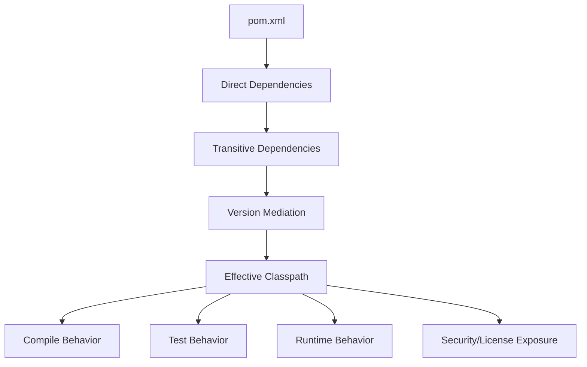
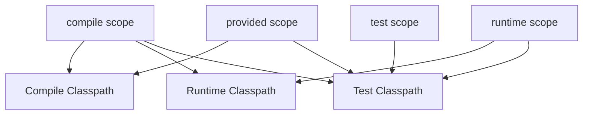

# Maven Dependencies

## 1. Core Idea

Maven dependency bukan hanya daftar library. Dependency menentukan **classpath compile**, **classpath test**, **classpath runtime**, **artifact transitive**, **security exposure**, **license exposure**, dan kadang **production behavior**.

Di Java/JAX-RS enterprise service, dependency kecil bisa berdampak besar:

- class tidak ditemukan saat runtime,
- method tidak ditemukan karena version conflict,
- dependency vulnerable masuk transitively,
- duplicate classes,
- Jakarta/Jersey namespace conflict,
- logging binding conflict,
- test dependency bocor ke runtime,
- library internal tidak compatible,
- Docker image membesar,
- startup gagal karena SPI/provider conflict.

Mental model:



Senior engineer harus membaca dependency sebagai graph, bukan sebagai list.

---

## 2. Why Dependency Management Matters

Modern Java backend jarang berdiri sendiri. Service biasanya memakai:

- JAX-RS/Jakarta REST framework,
- JSON library,
- HTTP client,
- database driver,
- connection pool,
- Kafka client,
- RabbitMQ client,
- Redis client,
- logging framework,
- metrics/tracing library,
- security/auth library,
- internal shared library,
- testing framework,
- Testcontainers,
- static analysis tools,
- generated client/server contracts.

Setiap library membawa dependency lain. Dependency lain membawa dependency lain lagi.

Masalahnya, Maven harus memilih satu versi saat ada konflik.

Jika engineer hanya menambahkan dependency tanpa melihat graph, ia bisa mengubah runtime behavior seluruh service.

---

## 3. Direct vs Transitive Dependency

### Direct Dependency

Dependency yang ditulis langsung di POM.

```xml
<dependency>
  <groupId>org.postgresql</groupId>
  <artifactId>postgresql</artifactId>
  <version>42.7.3</version>
</dependency>
```

### Transitive Dependency

Dependency yang ikut masuk karena dependency lain membutuhkannya.

Contoh:

```text
service -> jersey-client -> hk2-locator -> jakarta.inject-api
```

`jakarta.inject-api` mungkin tidak ditulis langsung di service POM, tetapi tetap masuk classpath.

### Senior Concern

Dependency transitive tetap bisa:

- membawa CVE,
- membawa license risk,
- mengubah runtime classpath,
- menyebabkan duplicate classes,
- menyebabkan method/class conflict,
- memperbesar artifact/container image,
- memicu behavior auto-discovery via SPI.

Jadi review dependency tidak cukup hanya melihat direct dependency baru.

---

## 4. Dependency Coordinates

Dependency Maven diidentifikasi oleh coordinates:

```text
groupId:artifactId:version[:packaging][:classifier]
```

Contoh:

```text
org.postgresql:postgresql:42.7.3
jakarta.ws.rs:jakarta.ws.rs-api:3.1.0
org.glassfish.jersey.core:jersey-server:3.1.8
```

Coordinates menentukan artifact yang diambil dari repository.

Review concern:

- apakah group/artifact benar?
- apakah artifact official atau fork?
- apakah version dikelola parent/BOM?
- apakah artifact masih maintained?
- apakah artifact compatible dengan Java/Jakarta version service?
- apakah classifier diperlukan?

---

## 5. Dependency Scope Overview

Scope menentukan kapan dependency tersedia.

| Scope | Compile | Test | Runtime | Packaged/Transitive Intent |
|---|---:|---:|---:|---|
| `compile` | yes | yes | yes | Default; dibutuhkan compile dan runtime |
| `provided` | yes | yes | no | Disediakan runtime/container |
| `runtime` | no | yes | yes | Tidak dibutuhkan compile, dibutuhkan runtime |
| `test` | no | yes | no | Hanya test |
| `system` | yes | yes | maybe | Anti-pattern; local file dependency |
| `import` | n/a | n/a | n/a | Khusus BOM di dependencyManagement |

Scope adalah design decision. Scope salah bisa menjadi production bug.

---

## 6. `compile` Scope

`compile` adalah default scope.

```xml
<dependency>
  <groupId>com.fasterxml.jackson.core</groupId>
  <artifactId>jackson-databind</artifactId>
  <version>2.17.2</version>
</dependency>
```

Dependency compile tersedia untuk:

- compile main source,
- compile test source,
- runtime application,
- consumers transitively jika artifact adalah library.

### Use When

Gunakan `compile` jika code utama langsung memakai API dependency dan dependency dibutuhkan saat runtime.

### Failure Mode

- terlalu banyak dependency compile membuat transitive exposure besar,
- library module mengekspos dependency yang seharusnya internal,
- runtime conflict karena compile dependency membawa transitive lama,
- dependency compile seharusnya `provided` di WAR/app server scenario.

---

## 7. `provided` Scope

`provided` artinya dependency dibutuhkan saat compile, tetapi disediakan oleh runtime environment.

Contoh klasik:

```xml
<dependency>
  <groupId>jakarta.servlet</groupId>
  <artifactId>jakarta.servlet-api</artifactId>
  <version>6.0.0</version>
  <scope>provided</scope>
</dependency>
```

Use case:

- Servlet API disediakan app server,
- Jakarta EE API disediakan runtime,
- container/application server menyediakan implementation,
- compile-time API tidak boleh dipackage ke WAR.

### Java/JAX-RS Concern

Untuk JAX-RS service, scope `provided` bisa benar atau salah tergantung deployment model:

- WAR di app server: API tertentu mungkin `provided`.
- Executable JAR/container self-contained: dependency mungkin harus `compile`/runtime.

Jangan menebak. Verifikasi deployment model internal.

### Failure Mode

- `ClassNotFoundException` saat runtime karena dependency ternyata tidak disediakan,
- duplicate implementation karena dependency dipackage padahal runtime juga punya,
- version mismatch antara compile API dan runtime-provided API,
- test sukses dengan dependency tersedia, production gagal.

---

## 8. `runtime` Scope

`runtime` artinya dependency tidak dibutuhkan untuk compile, tetapi dibutuhkan saat runtime.

Contoh:

```xml
<dependency>
  <groupId>org.postgresql</groupId>
  <artifactId>postgresql</artifactId>
  <version>42.7.3</version>
  <scope>runtime</scope>
</dependency>
```

Use case:

- JDBC driver,
- logging implementation,
- database driver,
- optional runtime provider,
- implementation yang dipilih via SPI/config.

### Failure Mode

- code mulai memakai class driver secara langsung, tetapi scope tetap runtime sehingga compile gagal,
- runtime dependency tidak masuk package/image,
- test tidak merepresentasikan runtime classpath,
- multiple runtime implementations conflict.

---

## 9. `test` Scope

`test` hanya tersedia untuk compile dan runtime test.

Contoh:

```xml
<dependency>
  <groupId>org.junit.jupiter</groupId>
  <artifactId>junit-jupiter</artifactId>
  <version>5.10.3</version>
  <scope>test</scope>
</dependency>
```

Use case:

- JUnit,
- Mockito,
- AssertJ,
- Testcontainers,
- WireMock,
- in-memory database untuk test,
- test utility internal.

### Failure Mode

- test utility dipakai main source sehingga compile main gagal,
- test dependency bocor ke runtime karena shading/package salah,
- Testcontainers dependency terlalu berat untuk unit test module,
- dependency test membawa transitive vulnerable yang tetap discan sebagai risk tergantung policy.

---

## 10. `system` Scope Anti-Pattern

`system` scope menunjuk file lokal.

Contoh anti-pattern:

```xml
<dependency>
  <groupId>com.vendor</groupId>
  <artifactId>legacy-sdk</artifactId>
  <version>1.0</version>
  <scope>system</scope>
  <systemPath>${project.basedir}/lib/legacy-sdk.jar</systemPath>
</dependency>
```

Kenapa berbahaya:

- tidak portable,
- tidak resolved dari repository,
- sulit discan,
- tidak punya metadata transitive,
- CI bisa gagal jika file tidak ada,
- release traceability buruk,
- license/security governance lemah.

Senior rule: hindari `system` scope kecuali ada alasan legacy sangat kuat dan terdokumentasi.

Lebih baik publish artifact ke repository internal dengan metadata yang benar.

---

## 11. `import` Scope for BOM

`import` scope hanya valid di `dependencyManagement` untuk mengimpor BOM.

Contoh:

```xml
<dependencyManagement>
  <dependencies>
    <dependency>
      <groupId>org.glassfish.jersey</groupId>
      <artifactId>jersey-bom</artifactId>
      <version>3.1.8</version>
      <type>pom</type>
      <scope>import</scope>
    </dependency>
  </dependencies>
</dependencyManagement>
```

`import` tidak menambahkan dependency ke classpath. Ia hanya mengimpor version management.

---

## 12. Optional Dependency

Optional dependency menandai dependency sebagai tidak otomatis ditransitive-kan ke consumer.

```xml
<dependency>
  <groupId>com.example</groupId>
  <artifactId>optional-adapter</artifactId>
  <version>1.2.0</version>
  <optional>true</optional>
</dependency>
```

Use case:

- library mendukung beberapa adapter,
- consumer harus memilih dependency sendiri,
- menghindari transitive bloat,
- fitur opsional.

### Failure Mode

- service mengira dependency akan ikut transitively, tetapi tidak,
- runtime class missing,
- optional dependency dipakai sebagai workaround bukan design,
- dokumentasi consumer tidak jelas.

Untuk service application, optional dependency biasanya lebih jarang diperlukan dibanding library module.

---

## 13. Exclusions

Exclusion menghapus transitive dependency tertentu.

```xml
<dependency>
  <groupId>com.example</groupId>
  <artifactId>some-library</artifactId>
  <version>1.0.0</version>
  <exclusions>
    <exclusion>
      <groupId>commons-logging</groupId>
      <artifactId>commons-logging</artifactId>
    </exclusion>
  </exclusions>
</dependency>
```

Exclusion adalah alat kuat tetapi berisiko.

### Use When

- transitive dependency membawa CVE dan diganti versi direct/managed,
- duplicate logging binding,
- dependency lama conflict dengan platform BOM,
- transitive dependency tidak dibutuhkan dan merusak runtime,
- library membawa implementation yang tidak diinginkan.

### Failure Mode

- menghapus dependency yang ternyata dibutuhkan runtime,
- test tidak mencakup path yang butuh dependency tersebut,
- exclusion tersebar di banyak module,
- exclusion menyembunyikan root cause version alignment,
- upgrade library gagal karena exclusion lama tidak relevan lagi.

### Senior Rule

Setiap exclusion harus punya alasan eksplisit.

Komentar kadang berguna:

```xml
<!-- Exclude old logging bridge; logging is standardized through slf4j/logback managed by parent BOM. -->
<exclusion>
  <groupId>commons-logging</groupId>
  <artifactId>commons-logging</artifactId>
</exclusion>
```

---

## 14. Transitive Dependency Graph

Dependency graph bisa bercabang.

Contoh:

```text
quote-service
├── jersey-server:3.1.8
│   ├── jersey-common:3.1.8
│   └── jakarta.ws.rs-api:3.1.0
├── kafka-clients:3.7.0
│   └── slf4j-api:1.7.x
└── internal-platform-logging:2.0.0
    └── slf4j-api:2.0.x
```

Jika dua path membawa `slf4j-api` versi berbeda, Maven harus memilih satu.

Pilihan itu bisa memengaruhi runtime.

---

## 15. Dependency Mediation

Maven memilih versi dependency conflict dengan aturan utama:

> Nearest definition wins.

Jika jarak dependency ke root lebih dekat, versi itu menang.

Jika jaraknya sama, urutan deklarasi bisa berpengaruh.

Contoh:

```text
A -> B -> C:1.0
A -> D -> E -> C:2.0
```

`C:1.0` menang karena lebih dekat.

Contoh lain:

```text
A -> B -> C:1.0
A -> D -> C:2.0
```

Jika jarak sama, order dependency bisa memengaruhi hasil.

### Why This Is Dangerous

- perubahan dependency unrelated bisa mengubah versi transitive,
- urutan dependency bisa mengubah classpath,
- upgrade library bisa downgrade dependency lain,
- runtime error muncul jauh dari dependency yang diubah.

Solusi enterprise biasanya memakai `dependencyManagement`/BOM dan enforcer convergence rules.

---

## 16. Nearest Definition Example

POM:

```xml
<dependencies>
  <dependency>
    <groupId>com.example</groupId>
    <artifactId>library-a</artifactId>
    <version>1.0.0</version>
  </dependency>
  <dependency>
    <groupId>com.example</groupId>
    <artifactId>library-b</artifactId>
    <version>1.0.0</version>
  </dependency>
</dependencies>
```

Graph:

```text
service
├── library-a
│   └── common-lib:1.0
└── library-b
    └── helper-lib
        └── common-lib:2.0
```

`common-lib:1.0` kemungkinan menang karena lebih dekat.

Jika `common-lib:2.0` dibutuhkan oleh `helper-lib`, runtime bisa gagal dengan:

```text
java.lang.NoSuchMethodError
java.lang.NoClassDefFoundError
```

---

## 17. Dependency Tree Command

Command paling penting:

```bash
mvn dependency:tree
```

Untuk dependency tertentu:

```bash
mvn dependency:tree -Dincludes=org.slf4j
mvn dependency:tree -Dincludes=com.fasterxml.jackson.core:jackson-databind
mvn dependency:tree -Dincludes=jakarta.ws.rs
```

Verbose conflict view:

```bash
mvn dependency:tree -Dverbose
```

Output ke file:

```bash
mvn dependency:tree -DoutputFile=dependency-tree.txt
```

Untuk CI artifact, dependency tree file bisa sangat berguna saat debugging dependency drift.

---

## 18. Effective POM and Effective Dependency

Dependency final bisa berasal dari:

- current POM,
- parent POM,
- dependencyManagement,
- imported BOM,
- active profile,
- plugin dependency,
- transitive dependency.

Command:

```bash
mvn help:effective-pom > effective-pom.xml
mvn help:active-profiles
```

Untuk dependency issue, jangan hanya baca `pom.xml` lokal. Baca effective POM dan dependency tree.

---

## 19. Dependency Convergence

Dependency convergence berarti graph tidak punya versi konflik untuk dependency yang sama.

Contoh conflict:

```text
jackson-databind:2.15.0
jackson-databind:2.17.2
```

Maven bisa memilih salah satu, tetapi enterprise build mungkin ingin fail jika ada conflict.

Maven Enforcer bisa dipakai:

```xml
<plugin>
  <groupId>org.apache.maven.plugins</groupId>
  <artifactId>maven-enforcer-plugin</artifactId>
  <version>3.5.0</version>
  <executions>
    <execution>
      <id>enforce-dependency-convergence</id>
      <goals>
        <goal>enforce</goal>
      </goals>
      <configuration>
        <rules>
          <dependencyConvergence/>
        </rules>
      </configuration>
    </execution>
  </executions>
</plugin>
```

### Trade-off

Strict convergence meningkatkan predictability, tetapi bisa membuat upgrade lebih sulit karena banyak transitive conflict harus diselesaikan eksplisit.

---

## 20. Dependency Scope and Classpath

Classpath berbeda antara compile, test, dan runtime.



Masalah umum:

- compile sukses, runtime gagal,
- test sukses, production gagal,
- dependency ada di test classpath tetapi tidak di runtime,
- provided dependency tersedia di app server tetapi tidak di local container,
- runtime dependency tidak masuk image.

---

## 21. Common Runtime Errors from Dependency Problems

### `ClassNotFoundException`

Class tidak ada di runtime classpath.

Possible causes:

- dependency missing,
- wrong scope,
- dependency excluded,
- artifact not packaged,
- provided dependency tidak tersedia di runtime.

### `NoClassDefFoundError`

Class ada saat compile, tetapi tidak tersedia/failed saat runtime initialization.

Possible causes:

- missing transitive dependency,
- static initializer error,
- classpath packaging issue,
- version mismatch.

### `NoSuchMethodError`

Code memanggil method yang tidak ada di versi class runtime.

Possible causes:

- compile memakai versi lebih baru,
- runtime membawa versi lebih lama,
- dependency mediation memilih versi salah,
- container menyediakan library lama.

### `ClassCastException`

Bisa terjadi karena:

- class loaded dari classloader berbeda,
- duplicate classes,
- dependency conflict,
- app server/container library conflict.

### `ServiceConfigurationError`

Sering terkait Java SPI/provider discovery.

Possible causes:

- provider class missing,
- duplicate provider,
- incompatible implementation,
- shading memindahkan class tanpa memperbaiki service descriptor.

---

## 22. Jakarta vs Javax Namespace Conflict

Untuk JAX-RS/Jakarta ecosystem, namespace migration penting.

Legacy Java EE memakai:

```text
javax.ws.rs.*
javax.servlet.*
```

Jakarta EE modern memakai:

```text
jakarta.ws.rs.*
jakarta.servlet.*
```

Mixing dependency bisa menyebabkan:

- compile error,
- runtime class missing,
- API/implementation mismatch,
- server compatibility issue,
- dependency tree terlihat mirip tetapi package namespace berbeda.

Review concern:

- Jersey/Jakarta version alignment,
- servlet API version,
- app server/runtime compatibility,
- generated client/server code namespace,
- internal library masih `javax` atau sudah `jakarta`.

---

## 23. Logging Dependency Conflicts

Logging adalah sumber conflict umum.

Komponen umum:

- `slf4j-api`,
- logging implementation seperti Logback/Log4j2,
- bridge seperti `jul-to-slf4j`, `jcl-over-slf4j`,
- legacy logging dependency,
- container logging integration.

Failure mode:

- multiple SLF4J bindings,
- no provider found,
- log tidak muncul,
- log double,
- incompatible SLF4J 1.7 vs 2.x,
- logging bridge loop.

Debug:

```bash
mvn dependency:tree -Dincludes=org.slf4j
mvn dependency:tree -Dincludes=ch.qos.logback
mvn dependency:tree -Dincludes=org.apache.logging.log4j
```

---

## 24. Database, Kafka, RabbitMQ, Redis Dependency Concerns

### PostgreSQL

Concerns:

- JDBC driver version,
- Java compatibility,
- SSL/TLS behavior,
- SCRAM/auth support,
- connection pool compatibility.

Debug:

```bash
mvn dependency:tree -Dincludes=org.postgresql
```

### Kafka

Concerns:

- broker/client compatibility,
- transitive compression libraries,
- security protocol dependencies,
- logging dependency,
- schema registry client if used.

Debug:

```bash
mvn dependency:tree -Dincludes=org.apache.kafka
```

### RabbitMQ

Concerns:

- client version,
- TLS support,
- recovery behavior,
- transitive Netty/SLF4J conflicts if framework wraps client.

Debug:

```bash
mvn dependency:tree -Dincludes=com.rabbitmq
```

### Redis

Concerns:

- client implementation,
- Netty dependency,
- TLS support,
- cluster/sentinel support,
- reactive vs blocking client transitive graph.

Debug examples:

```bash
mvn dependency:tree -Dincludes=redis.clients
mvn dependency:tree -Dincludes=io.lettuce
mvn dependency:tree -Dincludes=io.netty
```

---

## 25. Internal Libraries

Internal libraries need stronger discipline than external dependencies because they often encode platform conventions.

Concerns:

- backward compatibility,
- transitive dependency exposure,
- version alignment across services,
- release cadence,
- snapshot usage,
- deprecation policy,
- ownership,
- migration guide,
- security scanning,
- changelog quality.

Failure mode:

- internal library upgrade changes default timeout,
- logging/tracing context changes,
- HTTP client behavior changes,
- dependency transitive upgrade breaks service,
- snapshot version changes without traceability,
- shared library creates tight coupling across services.

---

## 26. Dependency Review Workflow

Saat PR menambahkan atau mengubah dependency:

### Step 1: Identify direct change

```bash
git diff -- pom.xml '**/pom.xml'
```

### Step 2: Print dependency tree before/after

```bash
mvn dependency:tree -DoutputFile=dependency-tree-after.txt
```

Jika perlu, bandingkan dengan branch base.

### Step 3: Check scope

Pastikan scope sesuai:

- compile,
- provided,
- runtime,
- test.

### Step 4: Check version source

Apakah version:

- explicit di dependency,
- managed parent POM,
- managed BOM,
- inherited dari profile,
- transitively selected?

### Step 5: Check security/license

- CVE,
- license,
- maintenance status,
- internal approval.

### Step 6: Check runtime impact

- classpath,
- package size,
- Docker image,
- startup behavior,
- config defaults,
- observability/logging.

---

## 27. Dependency Debugging Playbook

### Symptom: Compile Error

```text
package X does not exist
cannot find symbol
```

Check:

```bash
mvn dependency:tree -Dincludes=groupId:artifactId
mvn help:effective-pom
mvn compile -X
```

Likely causes:

- dependency missing,
- wrong scope runtime/test,
- profile inactive,
- parent/BOM not applied,
- generated source missing.

### Symptom: Runtime Class Missing

```text
ClassNotFoundException
NoClassDefFoundError
```

Check:

```bash
mvn dependency:tree
jar tf target/*.jar | grep SomeClass
```

Likely causes:

- provided scope wrong,
- exclusion removed needed dependency,
- dependency not packaged,
- runtime image missing artifact.

### Symptom: Method Missing

```text
NoSuchMethodError
```

Check:

```bash
mvn dependency:tree -Dverbose -Dincludes=problem.group
```

Likely causes:

- version conflict,
- dependency mediation selected older version,
- container-provided library conflict,
- direct dependency not managed.

### Symptom: Works Local, Fails CI

Check:

```bash
mvn -Dmaven.repo.local=/tmp/m2-clean clean verify
mvn help:active-profiles
mvn -version
```

Likely causes:

- local cache artifact,
- Java/Maven version mismatch,
- missing private repo credential,
- profile/env mismatch,
- snapshot update issue.

---

## 28. Dependency and Docker/Kubernetes Runtime

Dependency graph affects container runtime.

For executable JAR:

```text
Maven dependency graph -> packaged JAR/libs -> Docker image -> Kubernetes pod
```

For WAR/app server:

```text
Maven dependency graph -> WAR -> container/app server provided libs -> runtime classloader
```

Risks:

- dependency present in Maven but not copied to image,
- dependency scope provided but runtime does not provide it,
- app server provides incompatible version,
- image layer has stale artifact,
- dependency update changes image size/startup time,
- vulnerability scanner reports transitive dependency in image.

Debug:

```bash
jar tf target/*.jar | grep dependency-name

docker run --rm image-name java -jar app.jar

docker exec -it container sh
```

Exact command depends on packaging style.

---

## 29. Dependency and CI/CD

CI/CD should protect dependency changes.

Useful controls:

- dependency tree artifact,
- dependency convergence check,
- vulnerability scan,
- license scan,
- SBOM generation,
- dependency review bot,
- Dependabot/Renovate policy,
- required review for POM changes,
- release notes for dependency upgrades,
- integration test for critical dependency upgrades.

Questions:

- does CI fail on high/critical CVE?
- does CI detect convergence conflict?
- does CI generate SBOM from final artifact?
- are dependency upgrades grouped or isolated?
- are internal library upgrades reviewed by owners?

---

## 30. Security Concerns

Dependency security risks:

- known CVE,
- malicious package,
- abandoned package,
- compromised transitive dependency,
- overly broad dependency for small feature,
- dependency with risky license,
- dependency executing code at build time via plugin/annotation processor,
- vulnerable runtime library in final image,
- test dependency still flagged by policy.

Senior review questions:

- why is this dependency needed?
- is there already an internal/platform-approved library?
- is version managed?
- what transitive dependencies are introduced?
- does it add CVE/license risk?
- is it runtime or test only?
- does it execute code during build?

---

## 31. Reproducibility Concerns

Dependency reproducibility requires stable versions and repositories.

Risks:

- snapshot dependency,
- floating version range,
- unmanaged plugin/dependency version,
- dependency only available in local repo,
- private repo credential hidden in developer machine,
- repository mirror different between local and CI,
- dependency overwritten in non-immutable repository,
- transitive dependency version changes after parent/BOM upgrade.

Avoid version ranges for production builds:

```xml
<!-- Avoid for production reproducibility -->
<version>[1.0,2.0)</version>
```

Prefer explicit managed versions.

---

## 32. Productivity Concerns

Dependency hygiene also affects productivity.

Bad dependency practices cause:

- slow builds,
- huge dependency tree,
- noisy vulnerability alerts,
- repeated classpath conflicts,
- flaky tests,
- local/CI mismatch,
- long Docker image build,
- slow application startup,
- difficult upgrades.

Good practices:

- use BOM/parent for alignment,
- keep dependency changes small,
- isolate major upgrades,
- document exclusions,
- remove unused dependencies,
- monitor dependency tree growth,
- avoid adding large libraries for tiny utility needs.

---

## 33. Observability and Incident Support Concerns

During incident, dependency questions may appear:

- did a library upgrade change HTTP timeout?
- did Kafka client version change retry behavior?
- did JSON library upgrade change serialization?
- did PostgreSQL driver upgrade change TLS/auth behavior?
- did Redis client upgrade change pooling/reconnect behavior?
- did logging/tracing dependency change correlation ID propagation?
- did a transitive dependency introduce runtime error?

Evidence needed:

```bash
git diff <previous-tag>..<current-tag> -- '**/pom.xml'
mvn dependency:tree -DoutputFile=dependency-tree.txt
```

For deployed artifact, ideally dependency/SBOM is attached to release artifact.

---

## 34. Correctness Concerns

Dependency correctness means the selected graph matches the intended design.

Checklist:

- [ ] Is the dependency needed by main code, runtime only, or test only?
- [ ] Is the scope correct?
- [ ] Is version controlled by parent/BOM?
- [ ] Are transitive dependencies understood?
- [ ] Are exclusions justified?
- [ ] Are internal libraries compatible?
- [ ] Does dependency match Java/Jakarta version?
- [ ] Does it affect serialization, HTTP, DB, messaging, cache, logging, tracing, or security?
- [ ] Are tests covering the runtime path affected?

---

## 35. Internal Verification Checklist

Untuk CSG/team, verifikasi langsung:

### Dependency Governance

- [ ] Apakah versi dependency dikelola parent POM atau BOM internal?
- [ ] Apakah ada approved dependency list?
- [ ] Apakah ada policy untuk dependency baru?
- [ ] Apakah ada owner untuk internal libraries?
- [ ] Apakah dependency upgrade harus lewat security/platform review?

### Maven Configuration

- [ ] Apakah `dependencyManagement` digunakan?
- [ ] Apakah `maven-enforcer-plugin` aktif?
- [ ] Apakah convergence check aktif?
- [ ] Apakah unused/duplicate dependency check dipakai?
- [ ] Apakah dependency tree dipublish sebagai CI artifact?

### Security and License

- [ ] SCA tool apa yang dipakai?
- [ ] Apakah CVE threshold memfailkan CI?
- [ ] Apakah license scanning aktif?
- [ ] Apakah SBOM dibuat?
- [ ] Siapa yang triage vulnerability?

### Runtime Alignment

- [ ] Java version service apa?
- [ ] Jakarta/JAX-RS/Jersey version apa?
- [ ] Packaging JAR atau WAR?
- [ ] Runtime menyediakan dependency tertentu atau service self-contained?
- [ ] App server/container library apa yang perlu diperhitungkan?

### Repository and Release

- [ ] Artifact repository apa yang dipakai?
- [ ] Apakah snapshot dependency diizinkan?
- [ ] Apakah release dependency immutable?
- [ ] Apakah internal library punya changelog?
- [ ] Bagaimana dependency upgrade dicatat di release note?

---

## 36. PR Review Checklist

Saat PR mengubah dependency:

### Intent

- [ ] Masalah apa yang diselesaikan dependency ini?
- [ ] Apakah dependency baru benar-benar dibutuhkan?
- [ ] Apakah ada library yang sudah tersedia di platform/internal stack?
- [ ] Apakah dependency terlalu besar untuk kebutuhan kecil?

### Scope

- [ ] Scope benar?
- [ ] Dependency test tidak masuk runtime?
- [ ] Dependency runtime tidak salah menjadi compile?
- [ ] Dependency provided benar-benar disediakan runtime?
- [ ] Tidak ada `system` scope tanpa alasan kuat?

### Version and Alignment

- [ ] Version dikelola parent/BOM?
- [ ] Tidak ada version drift?
- [ ] Tidak ada downgrade transitive tersembunyi?
- [ ] Jakarta/Jersey/Java version compatible?
- [ ] Internal library version compatible?

### Transitive Impact

- [ ] Dependency tree dicek?
- [ ] CVE/license impact dicek?
- [ ] Duplicate logging binding dicek?
- [ ] Duplicate class/shading risk dicek?
- [ ] Docker image size/startup impact dipertimbangkan?

### Exclusions

- [ ] Exclusion punya alasan jelas?
- [ ] Exclusion tidak menghapus runtime dependency penting?
- [ ] Exclusion lebih baik diselesaikan via BOM/dependencyManagement?
- [ ] Tests menutup path yang terdampak exclusion?

### Runtime and Release

- [ ] Runtime path diuji?
- [ ] Integration test relevan dijalankan?
- [ ] Release note perlu menyebut dependency upgrade?
- [ ] SBOM/security scan akan mencakup dependency final?
- [ ] Rollback path jelas jika dependency upgrade bermasalah?

---

## 37. Practical Commands

### Full dependency tree

```bash
mvn dependency:tree
```

### Filter dependency group

```bash
mvn dependency:tree -Dincludes=org.slf4j
```

### Output to file

```bash
mvn dependency:tree -DoutputFile=dependency-tree.txt
```

### Analyze dependencies

```bash
mvn dependency:analyze
```

Catatan: `dependency:analyze` bisa memberi false positive/negative, terutama dengan reflection, annotation processing, runtime SPI, atau framework magic.

### Show effective POM

```bash
mvn help:effective-pom > effective-pom.xml
```

### Show active profiles

```bash
mvn help:active-profiles
```

### Clean local resolution test

```bash
mvn -Dmaven.repo.local=/tmp/m2-clean clean verify
```

### Force snapshot update

```bash
mvn -U clean verify
```

---

## 38. Senior Engineer Heuristics

1. **Every dependency is production surface unless proven otherwise.** Even test dependencies can affect CI and security noise.
2. **Scope is architecture.** `provided`, `runtime`, and `test` are not cosmetic labels.
3. **Transitive dependency is still your dependency.** Production does not care whether it was direct or transitive.
4. **Exclusion is a scalpel, not a broom.** Document the reason.
5. **Nearest definition can betray intent.** Use BOM/dependencyManagement for alignment.
6. **Dependency upgrade is behavior change.** Especially for DB, messaging, HTTP, security, serialization, logging, and tracing libraries.
7. **Local cache can lie.** Test resolution from a clean local repo when behavior is suspicious.
8. **Dependency tree belongs in evidence.** For difficult runtime bugs, capture it with the incident/PR.
9. **Internal libraries need product thinking.** They are platform contracts, not just shared code.
10. **Do not solve one missing class by randomly adding libraries.** Find the graph reason.

---

## 39. Summary

Maven dependencies form the effective classpath and runtime surface of Java/JAX-RS services. Senior backend engineers must understand scope, transitivity, mediation, exclusions, dependency tree analysis, convergence, and security/runtime implications.

Setelah part ini, kemampuan minimal yang harus dimiliki:

- membedakan direct dan transitive dependency,
- memilih scope dependency dengan benar,
- membaca dependency tree,
- memahami nearest-definition mediation,
- mendiagnosis classpath/runtime error,
- mereview exclusions secara hati-hati,
- memahami dependency impact ke Docker/Kubernetes/CI/CD,
- menghubungkan dependency change dengan security, release, dan incident risk,
- membuat dependency review yang evidence-based.

Part berikutnya membahas **Maven Dependency Management and BOM**, karena dependency graph baru benar-benar stabil jika version alignment dikelola secara terpusat dan konsisten.
