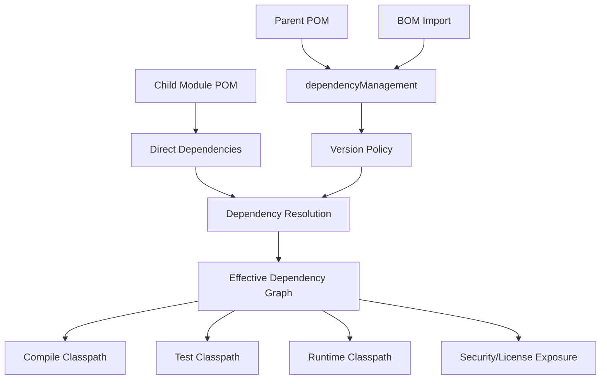

# Maven Dependency Management and BOM

## 1. Core Idea

`dependencyManagement` bukan tempat menambahkan dependency ke classpath. Ia adalah tempat mengatur **policy versi dependency**.

Di project Maven enterprise, terutama Java/JAX-RS service dengan banyak internal library, external framework, Kafka/RabbitMQ/Redis/PostgreSQL client, test tools, dan observability agent, dependency management adalah mekanisme untuk menjaga agar dependency graph tetap:

- konsisten,
- predictable,
- reviewable,
- reproducible,
- compatible,
- secure,
- dan tidak berubah diam-diam karena transitive dependency.

Mental model utama:



Senior engineer harus memisahkan dua pertanyaan:

1. **Apakah dependency ini dibutuhkan?**  
   Dijawab oleh `<dependencies>`.

2. **Versi dependency ini dikontrol dari mana?**  
   Dijawab oleh `<dependencyManagement>`, parent POM, BOM, atau direct version.

Kesalahan umum adalah mengira dependency yang ditulis di `dependencyManagement` otomatis dipakai. Tidak. Ia hanya mengatur versi jika dependency tersebut muncul sebagai direct atau transitive dependency yang membutuhkan mediation.

---

## 2. Why This Matters in Enterprise Java/JAX-RS Systems

Java enterprise service biasanya tidak hanya punya satu POM sederhana. Ia bisa punya:

- parent POM internal,
- service POM,
- multi-module reactor,
- internal library,
- platform BOM,
- Jakarta/Jersey BOM,
- testing BOM,
- observability dependencies,
- database driver,
- messaging client,
- security/auth library,
- Docker/image plugin,
- Maven Enforcer rules,
- dependency scanning tools,
- release/publishing plugin.

Tanpa dependency management yang disiplin, failure mode muncul seperti:

- local build berhasil, CI gagal,
- module A memakai Jackson versi berbeda dari module B,
- Jersey/Jakarta dependency tidak selaras,
- Kafka client berubah karena transitive dependency,
- CVE fix ditambahkan di satu module tetapi module lain tetap memakai versi lama,
- duplicate classes,
- `NoSuchMethodError`,
- `ClassNotFoundException`,
- `LinkageError`,
- test passing tetapi runtime gagal,
- container image membawa dependency yang tidak disadari,
- artifact library mengekspos API dependency yang tidak stabil.

Dependency management adalah salah satu control point untuk mencegah itu.

---

## 3. Direct Dependency vs Managed Dependency

### Direct Dependency

Direct dependency adalah dependency yang benar-benar diminta oleh module.

```xml
<dependencies>
  <dependency>
    <groupId>org.postgresql</groupId>
    <artifactId>postgresql</artifactId>
  </dependency>
</dependencies>
```

Jika version tidak ditulis, Maven akan mencari version dari `dependencyManagement` di POM saat ini, parent POM, atau imported BOM.

### Managed Dependency

Managed dependency adalah dependency yang versinya dideklarasikan sebagai policy.

```xml
<dependencyManagement>
  <dependencies>
    <dependency>
      <groupId>org.postgresql</groupId>
      <artifactId>postgresql</artifactId>
      <version>42.7.3</version>
    </dependency>
  </dependencies>
</dependencyManagement>
```

Ini tidak memasukkan PostgreSQL driver ke classpath.

Dependency baru masuk classpath jika ada di `<dependencies>` atau masuk secara transitif.

### Rule of Thumb

- `<dependencies>` menjawab: **pakai apa?**
- `<dependencyManagement>` menjawab: **kalau dipakai, pakai versi berapa?**

---

## 4. Example: Managed Version Without Direct Version

Contoh parent POM:

```xml
<dependencyManagement>
  <dependencies>
    <dependency>
      <groupId>com.fasterxml.jackson.core</groupId>
      <artifactId>jackson-databind</artifactId>
      <version>2.17.2</version>
    </dependency>
  </dependencies>
</dependencyManagement>
```

Contoh service POM:

```xml
<dependencies>
  <dependency>
    <groupId>com.fasterxml.jackson.core</groupId>
    <artifactId>jackson-databind</artifactId>
  </dependency>
</dependencies>
```

Maven akan memakai version `2.17.2`.

Keuntungannya:

- version tidak tersebar di semua module,
- upgrade bisa dilakukan dari satu tempat,
- module tetap eksplisit menyatakan dependency yang dipakai,
- PR dependency upgrade lebih reviewable.

---

## 5. Parent POM as Build Policy

Parent POM biasanya menyimpan policy build bersama:

- dependency version,
- plugin version,
- Java version,
- compiler config,
- test plugin config,
- enforcer rules,
- repositories,
- distribution management,
- shared properties,
- common profiles,
- organization metadata.

Contoh child module:

```xml
<parent>
  <groupId>com.company.platform</groupId>
  <artifactId>java-service-parent</artifactId>
  <version>3.12.0</version>
</parent>
```

### Senior Concern

Parent POM adalah coupling point. Mengubah parent version bisa mengubah banyak hal sekaligus:

- dependency graph,
- plugin behavior,
- compiler release,
- test execution,
- static analysis,
- repository resolution,
- release publishing,
- CI output.

Jadi upgrade parent POM harus direview seperti platform change, bukan seperti dependency kecil.

---

## 6. BOM: Bill of Materials

BOM adalah POM khusus yang mengelola versi satu set dependency yang saling terkait.

Contoh concept:

```xml
<dependencyManagement>
  <dependencies>
    <dependency>
      <groupId>org.glassfish.jersey</groupId>
      <artifactId>jersey-bom</artifactId>
      <version>3.1.8</version>
      <type>pom</type>
      <scope>import</scope>
    </dependency>
  </dependencies>
</dependencyManagement>
```

BOM dipakai agar dependency dalam satu ecosystem selaras.

Contoh ecosystem:

- Jersey modules,
- Jakarta APIs,
- Jackson modules,
- Netty modules,
- Testcontainers modules,
- Micrometer modules,
- OpenTelemetry modules,
- cloud SDK modules,
- internal platform libraries.

### Why BOM Exists

Framework modern terdiri dari banyak artifact.

Contoh JAX-RS/Jersey service bisa memakai:

- `jersey-server`,
- `jersey-container-servlet`,
- `jersey-media-json-jackson`,
- `jersey-hk2`,
- `jakarta.ws.rs-api`,
- `jakarta.inject-api`,
- `jakarta.validation-api`.

Jika versinya tidak aligned, runtime error bisa muncul walaupun compile sukses.

BOM mengurangi risiko versi campur.

---

## 7. `import` Scope

`import` scope hanya valid di `dependencyManagement` dan hanya untuk dependency dengan `type=pom`.

```xml
<dependency>
  <groupId>org.testcontainers</groupId>
  <artifactId>testcontainers-bom</artifactId>
  <version>1.20.1</version>
  <type>pom</type>
  <scope>import</scope>
</dependency>
```

Ia berarti:

> Import managed dependency versions dari BOM tersebut ke dependencyManagement project ini.

Ia bukan runtime dependency.

Ia bukan test dependency.

Ia bukan compile dependency.

Ia hanya version policy.

---

## 8. Platform BOM vs Framework BOM

### Framework BOM

Framework BOM biasanya dikelola vendor/open-source project.

Contoh category:

- Jersey BOM,
- Jackson BOM,
- Testcontainers BOM,
- Netty BOM,
- OpenTelemetry BOM.

Tujuannya menjaga alignment internal framework.

### Platform BOM

Platform BOM biasanya dikelola organisasi atau platform team.

Tujuannya bisa mencakup:

- dependency version yang approved,
- CVE-fixed versions,
- compatibility baseline,
- internal library versions,
- common observability stack,
- common security stack,
- dependency yang disarankan untuk semua service.

### Senior Concern

Jika ada platform BOM internal, jangan override version sembarangan di service POM.

Override bisa valid, tetapi harus jelas:

- kenapa perlu override,
- apakah compatible,
- apakah ada CVE/security reason,
- apakah akan diangkat ke platform BOM,
- apakah service lain terdampak,
- apakah rollback mudah.

---

## 9. Version Alignment

Version alignment berarti dependency yang satu ecosystem memakai versi yang compatible.

Contoh alignment:

```text
jersey-server                 3.1.x
jersey-container-servlet      3.1.x
jersey-media-json-jackson     3.1.x
jersey-hk2                    3.1.x
jakarta.ws.rs-api             compatible Jakarta EE generation
```

Bukan berarti semua version number harus sama. Yang penting adalah compatibility matrix.

### Failure Mode

- `NoSuchMethodError`
- `NoClassDefFoundError`
- provider tidak ditemukan
- JSON serialization berubah
- injection binding gagal
- app startup gagal
- runtime behavior berbeda local vs CI
- test dependency menutupi runtime dependency

### Detection

Gunakan dependency tree:

```bash
mvn dependency:tree
```

Fokus pada specific group:

```bash
mvn dependency:tree -Dincludes=org.glassfish.jersey
mvn dependency:tree -Dincludes=jakarta.*
mvn dependency:tree -Dincludes=com.fasterxml.jackson.core
```

Gunakan verbose dependency plugin jika perlu melihat mediation:

```bash
mvn dependency:tree -Dverbose
```

Catatan: output verbose bisa sangat besar. Simpan ke file untuk review.

```bash
mvn dependency:tree -Dverbose > dependency-tree.txt
```

---

## 10. Effective POM

Effective POM adalah POM final setelah Maven menggabungkan:

- current POM,
- parent POM,
- super POM,
- profiles aktif,
- dependencyManagement,
- pluginManagement,
- properties.

Command:

```bash
mvn help:effective-pom
```

Simpan ke file:

```bash
mvn help:effective-pom -Doutput=effective-pom.xml
```

### Use Cases

Gunakan effective POM untuk menjawab:

- version dependency ini berasal dari mana?
- plugin version ini siapa yang set?
- profile apa yang mengubah build?
- repository apa yang aktif?
- property finalnya apa?
- parent POM memberi config apa?

### Senior Concern

POM yang terlihat di module sering tidak cukup. Behavior build nyata ada di effective POM.

---

## 11. `pluginManagement`

`pluginManagement` mirip `dependencyManagement`, tetapi untuk plugin Maven.

Ia mengatur version/config default plugin, tetapi tidak selalu mengeksekusi plugin jika plugin tersebut tidak terikat lifecycle atau tidak dideklarasikan.

Contoh:

```xml
<build>
  <pluginManagement>
    <plugins>
      <plugin>
        <groupId>org.apache.maven.plugins</groupId>
        <artifactId>maven-compiler-plugin</artifactId>
        <version>3.13.0</version>
        <configuration>
          <release>17</release>
        </configuration>
      </plugin>
    </plugins>
  </pluginManagement>
</build>
```

### Why It Matters

Plugin version yang tidak dipin bisa berubah karena Maven default atau parent changes.

Plugin memengaruhi:

- compilation,
- tests,
- integration tests,
- packaging,
- code generation,
- coverage,
- static analysis,
- Docker image build,
- artifact publication.

Dependency hygiene tanpa plugin hygiene tetap berisiko.

---

## 12. Properties for Versions

Banyak POM memakai properties untuk version:

```xml
<properties>
  <jackson.version>2.17.2</jackson.version>
  <jersey.version>3.1.8</jersey.version>
</properties>
```

Lalu:

```xml
<dependency>
  <groupId>com.fasterxml.jackson.core</groupId>
  <artifactId>jackson-databind</artifactId>
  <version>${jackson.version}</version>
</dependency>
```

### Good Use

Properties berguna untuk:

- satu version dipakai banyak artifact,
- membuat upgrade lebih mudah,
- menjaga alignment manual.

### Risk

Properties bisa menjadi sulit dibaca jika:

- terlalu banyak tersebar,
- di-override oleh profile,
- child module override parent property,
- property name tidak jelas,
- version property dipakai lintas ecosystem yang tidak harus sama.

### Review Rule

Saat melihat property version berubah, cari semua pemakainya.

```bash
grep -R "jackson.version" -n .
```

---

## 13. Managed Dependency Does Not Mean Approved Usage

Ini penting dalam enterprise.

Dependency yang ada di BOM atau `dependencyManagement` belum tentu berarti boleh dipakai sembarangan.

Ia bisa hanya disediakan untuk:

- compatibility,
- transitive mediation,
- legacy module,
- migration,
- temporary CVE override,
- shared platform support.

Approval usage tetap bergantung pada:

- architecture guideline,
- security policy,
- license policy,
- team convention,
- production supportability.

### Example

Sebuah BOM internal mungkin mengatur versi beberapa HTTP client:

- Apache HttpClient,
- OkHttp,
- Java HTTP Client,
- Jersey Client.

Bukan berarti service boleh menambah HTTP client baru tanpa alasan. Bisa jadi tim ingin standardisasi pada satu client untuk observability, timeout, retry, dan TLS behavior.

---

## 14. Direct Version in Child POM

Kadang child POM menulis version langsung:

```xml
<dependency>
  <groupId>com.fasterxml.jackson.core</groupId>
  <artifactId>jackson-databind</artifactId>
  <version>2.18.0</version>
</dependency>
```

Ini override policy parent/BOM.

### When It May Be Valid

- emergency CVE fix,
- compatibility test untuk migration,
- module khusus butuh version lebih baru,
- parent/BOM belum update,
- temporary workaround.

### Why It Is Risky

- alignment rusak,
- module lain tetap versi lama,
- runtime conflict,
- dependency scan berbeda antar module,
- upgrade parent nanti menghasilkan behavior tidak terduga,
- reviewer sulit tahu apakah override sengaja atau lupa.

### Review Expectation

Direct version override harus punya alasan di PR description atau komentar POM.

Contoh komentar yang baik:

```xml
<!-- Temporary override for CVE-XXXX-YYYY until platform BOM >= 3.13.0 is adopted. -->
```

---

## 15. Transitive Version Drift

Transitive version drift terjadi ketika dependency graph membawa versi berbeda dari dependency yang sama.

Contoh:

```text
service
├─ library-a -> jackson-databind:2.15.0
└─ library-b -> jackson-databind:2.17.2
```

Maven memilih satu versi berdasarkan mediation rules.

Jika tidak dikontrol, pilihan Maven bisa mengejutkan.

### Dependency Mediation Refresher

Maven cenderung memilih dependency dengan jarak terdekat dari root. Jika jarak sama, urutan deklarasi bisa berpengaruh.

`dependencyManagement` bisa override versi yang dipilih.

### Detection

```bash
mvn dependency:tree -Dincludes=com.fasterxml.jackson.core:jackson-databind
```

Atau untuk seluruh Jackson:

```bash
mvn dependency:tree -Dincludes=com.fasterxml.jackson
```

---

## 16. Dependency Convergence

Dependency convergence berarti dependency graph tidak mengandung konflik versi untuk artifact yang sama.

Maven Enforcer bisa dipakai untuk mendeteksi ini.

Contoh concept:

```xml
<plugin>
  <groupId>org.apache.maven.plugins</groupId>
  <artifactId>maven-enforcer-plugin</artifactId>
  <executions>
    <execution>
      <id>enforce-dependency-convergence</id>
      <goals>
        <goal>enforce</goal>
      </goals>
      <configuration>
        <rules>
          <dependencyConvergence />
        </rules>
      </configuration>
    </execution>
  </executions>
</plugin>
```

### Senior Concern

Convergence rule bagus untuk safety, tetapi bisa menimbulkan noise pada repo besar.

Trade-off:

- strict convergence meningkatkan predictability,
- tetapi bisa memperlambat upgrade jika banyak legacy dependency,
- exclusion berlebihan untuk memuaskan convergence bisa merusak runtime,
- suppression harus didokumentasikan.

---

## 17. Jakarta/Jersey Dependency Alignment

Untuk Java/JAX-RS service, alignment Jakarta/Jersey penting karena transisi `javax.*` ke `jakarta.*` bisa menghasilkan konflik besar.

### Common Risk Areas

- `javax.ws.rs` vs `jakarta.ws.rs`,
- Servlet API generation mismatch,
- Jersey 2.x vs Jersey 3.x,
- Jakarta Validation API mismatch,
- Jackson/Jersey media module mismatch,
- dependency internal yang masih membawa `javax.*`,
- app server/container menyediakan API berbeda dari compile dependency.

### Symptoms

- compile error karena package berubah,
- runtime `ClassNotFoundException`,
- deployment gagal,
- resource class tidak terdeteksi,
- injection/provider binding error,
- serialization/deserialization error,
- test passing tapi container runtime gagal.

### Review Command

```bash
mvn dependency:tree | grep -E "javax\.|jakarta\."
```

Lebih baik filter dengan includes jika groupId jelas:

```bash
mvn dependency:tree -Dincludes=jakarta.ws.rs
mvn dependency:tree -Dincludes=javax.ws.rs
mvn dependency:tree -Dincludes=org.glassfish.jersey
```

### Internal Verification

Jangan asumsikan CSG memakai versi tertentu. Cek:

- parent POM,
- platform BOM,
- service POM,
- Docker/runtime base,
- app server atau embedded server,
- internal shared library,
- CI dependency scan.

---

## 18. Dependency Management in Multi-Module Project

Dalam multi-module project, dependency management biasanya diletakkan di parent/root POM agar semua module consistent.

Contoh:

```text
root-pom
├─ api-module
├─ service-module
├─ persistence-module
├─ messaging-module
└─ integration-test-module
```

Root POM mengatur version policy.

Child module menyatakan dependency yang benar-benar dipakai.

### Good Pattern

Root POM:

```xml
<dependencyManagement>
  <dependencies>
    <!-- versions here -->
  </dependencies>
</dependencyManagement>
```

Child POM:

```xml
<dependencies>
  <dependency>
    <groupId>org.postgresql</groupId>
    <artifactId>postgresql</artifactId>
  </dependency>
</dependencies>
```

### Bad Pattern

- setiap module menulis version sendiri,
- module override version tanpa alasan,
- dependencyManagement tersebar di banyak child POM,
- parent POM mencampur direct dependency yang membuat semua module membawa library tidak perlu,
- dependency test diletakkan di parent dependencies sehingga semua module mendapat test stack yang tidak dipakai.

---

## 19. Parent `<dependencies>` vs Parent `<dependencyManagement>`

Ini sering menjadi sumber bug.

Jika parent POM punya:

```xml
<dependencies>
  <dependency>
    <groupId>org.slf4j</groupId>
    <artifactId>slf4j-api</artifactId>
    <version>2.0.13</version>
  </dependency>
</dependencies>
```

Maka child module bisa mewarisi dependency tersebut.

Jika parent POM punya:

```xml
<dependencyManagement>
  <dependencies>
    <dependency>
      <groupId>org.slf4j</groupId>
      <artifactId>slf4j-api</artifactId>
      <version>2.0.13</version>
    </dependency>
  </dependencies>
</dependencyManagement>
```

Maka child module tidak otomatis mendapatkan `slf4j-api` kecuali mendeklarasikannya.

### Review Rule

Parent POM sebaiknya hati-hati memakai `<dependencies>`.

Gunakan `<dependencyManagement>` untuk policy version. Gunakan `<dependencies>` di parent hanya jika semua child module benar-benar harus mendapat dependency tersebut.

---

## 20. Import Order and Multiple BOMs

Project enterprise bisa import beberapa BOM.

Contoh:

```xml
<dependencyManagement>
  <dependencies>
    <dependency>
      <groupId>com.company.platform</groupId>
      <artifactId>company-platform-bom</artifactId>
      <version>5.4.0</version>
      <type>pom</type>
      <scope>import</scope>
    </dependency>
    <dependency>
      <groupId>org.testcontainers</groupId>
      <artifactId>testcontainers-bom</artifactId>
      <version>1.20.1</version>
      <type>pom</type>
      <scope>import</scope>
    </dependency>
  </dependencies>
</dependencyManagement>
```

### Senior Concern

Jika dua BOM mengelola artifact yang sama, hasilnya harus diverifikasi melalui effective POM dan dependency tree.

Jangan mengandalkan intuisi.

```bash
mvn help:effective-pom -Doutput=effective-pom.xml
mvn dependency:tree -Dincludes=groupId:artifactId
```

### Practical Policy

- platform BOM biasanya menjadi source of truth,
- framework BOM digunakan untuk ecosystem-specific alignment,
- direct override harus jarang dan eksplisit,
- PR upgrade BOM harus menyertakan dependency tree diff atau summary impact.

---

## 21. Dependency Tree Diff for PR Review

Dependency upgrade PR sebaiknya tidak hanya menunjukkan perubahan POM.

Tambahkan evidence:

```bash
mvn dependency:tree > dependency-tree-before.txt
# apply change
mvn dependency:tree > dependency-tree-after.txt
diff -u dependency-tree-before.txt dependency-tree-after.txt > dependency-tree.diff
```

Untuk module spesifik:

```bash
mvn -pl service-module dependency:tree > service-deps.txt
```

Untuk fokus pada satu group:

```bash
mvn dependency:tree -Dincludes=com.fasterxml.jackson > jackson-tree.txt
```

### PR Description Should Answer

- Dependency apa yang berubah?
- Apakah direct atau transitive?
- Apakah version berasal dari parent/BOM/direct override?
- Apakah ada CVE/license reason?
- Apakah ada breaking change?
- Apakah test yang relevan sudah jalan?
- Apakah runtime module terdampak?
- Apakah Docker image atau artifact berubah signifikan?

---

## 22. Dependency Management and Security

Dependency management membantu security karena version bisa dipatch dari satu tempat.

Contoh:

- update Jackson version untuk CVE,
- update Netty karena vulnerability,
- update PostgreSQL driver,
- update Kafka/RabbitMQ client,
- update transitive compression/XML/parser library,
- update logging framework.

### But Be Careful

Security fix bisa membawa breaking change.

CVE triage harus mempertimbangkan:

- apakah dependency reachable,
- apakah digunakan runtime atau test only,
- apakah vulnerable code path aktif,
- apakah exploitability relevan dengan service,
- apakah upgrade compatible,
- apakah mitigation sementara tersedia,
- apakah semua module terdampak sudah aligned.

### Internal Verification

Cek tool SCA internal dan policy security. Jangan mengarang apakah CSG memakai tool tertentu.

---

## 23. Dependency Management and Runtime Packaging

Dependency graph memengaruhi artifact dan container image.

Dalam Java backend, dependency bisa masuk ke:

- executable JAR,
- WAR,
- Docker image layer,
- application server lib,
- plugin-generated package,
- test-only classpath,
- integration test container.

### Review Concern

- dependency compile masuk runtime padahal tidak perlu,
- dependency test bocor ke package,
- provided dependency salah sehingga runtime missing class,
- duplicate logging binding,
- shaded dependency menyembunyikan vulnerability,
- dependency besar membuat image membengkak.

Command yang berguna:

```bash
mvn dependency:tree
mvn dependency:analyze
mvn package
jar tf target/*.jar | head
```

Untuk fat JAR, cek isi artifact secara eksplisit.

---

## 24. Dependency Management and CI/CD

CI/CD harus menjadi tempat validasi dependency policy.

Pipeline idealnya menjalankan:

- build clean,
- dependency convergence/enforcer,
- unit test,
- integration test,
- SCA/vulnerability scan,
- license scan jika diwajibkan,
- SBOM generation jika diwajibkan,
- artifact/package validation,
- image scan,
- publish artifact only after checks pass.

### Failure Mode

- local build sukses karena cache, CI gagal karena dependency tidak resolve,
- dependency available di developer machine tapi tidak di runner,
- private repository credential hilang,
- SNAPSHOT berubah,
- plugin version tidak pin,
- profile CI berbeda dari local,
- scanner menemukan CVE setelah artifact publish.

---

## 25. Debugging Dependency Management Issues

Gunakan urutan ini.

### Step 1: Identify Symptom

Contoh symptom:

- compile failure,
- runtime class missing,
- method missing,
- test suddenly fails,
- dependency resolution failure,
- CVE scanner fails,
- license scanner fails,
- duplicate classes,
- package size changed.

### Step 2: Inspect Effective POM

```bash
mvn help:effective-pom -Doutput=effective-pom.xml
```

Cari dependency/plugin/property yang relevan.

### Step 3: Inspect Dependency Tree

```bash
mvn dependency:tree -Dverbose > dependency-tree.txt
```

Filter dependency target.

```bash
mvn dependency:tree -Dincludes=groupId:artifactId
```

### Step 4: Check Parent/BOM

Cari sumber version:

```bash
grep -R "artifactId" -n pom.xml **/pom.xml
```

Jika terlalu besar, gunakan ripgrep jika tersedia:

```bash
rg "artifactId|dependencyManagement|pluginManagement|bom" .
```

### Step 5: Compare Local vs CI

Cek:

- Java version,
- Maven version,
- active profiles,
- repository credentials,
- settings.xml,
- environment variables,
- cache behavior,
- command CI sebenarnya.

### Step 6: Produce Evidence

Lampirkan:

- dependency tree relevant section,
- effective POM relevant section,
- failing stack trace,
- Maven command,
- Java/Maven version,
- CI run link atau log snippet,
- proposed fix.

---

## 26. Common Anti-Patterns

### Anti-Pattern 1: Version Everywhere

Setiap module menulis version sendiri.

Akibat:

- upgrade sulit,
- drift tinggi,
- conflict sulit dideteksi.

### Anti-Pattern 2: Parent POM Adds Too Many Dependencies

Parent POM memasukkan dependency runtime untuk semua module.

Akibat:

- classpath gemuk,
- module boundary kabur,
- security exposure membesar.

### Anti-Pattern 3: Exclusion Without Evidence

Menambahkan exclusion hanya agar build hijau.

Akibat:

- runtime class missing,
- transitive dependency yang dibutuhkan hilang,
- bug muncul jauh dari PR.

### Anti-Pattern 4: Direct Override Without Comment

Child module override BOM version tanpa alasan.

Akibat:

- reviewer tidak tahu apakah intentional,
- future upgrade makin berbahaya.

### Anti-Pattern 5: Ignoring Effective POM

Engineer hanya membaca `pom.xml` lokal.

Akibat:

- salah memahami plugin/dependency version,
- profile effect terlewat,
- parent behavior tidak terlihat.

### Anti-Pattern 6: Test Dependency Used by Main Code

Main code compile karena IDE classpath atau module leakage, tetapi CI/runtime gagal.

Akibat:

- hidden dependency,
- inconsistent build.

---

## 27. Correctness Concerns

Dependency management menyentuh correctness karena version menentukan API dan behavior.

Review questions:

- Apakah dependency version compatible dengan source code?
- Apakah transitive dependency berubah?
- Apakah API behavior berubah?
- Apakah serialization/deserialization berubah?
- Apakah HTTP client timeout/retry behavior berubah?
- Apakah driver DB mengubah protocol/default behavior?
- Apakah messaging client mengubah consumer/producer semantics?
- Apakah library internal backward compatible?

---

## 28. Productivity Concerns

Dependency management buruk membuat developer lambat.

Symptoms:

- build sering gagal karena dependency resolution,
- setiap developer memakai workaround lokal,
- onboarding butuh banyak manual setting,
- CI-only failure sering terjadi,
- dependency upgrade selalu menakutkan,
- PR dependency sulit direview.

Good dependency management membuat:

- upgrade terpusat,
- PR kecil dan jelas,
- dependency tree predictable,
- local dan CI konsisten,
- debugging classpath lebih mudah.

---

## 29. Security Concerns

Dependency management buruk membuat security patch sulit.

Risiko:

- CVE transitive tidak terlihat,
- version override menahan patch,
- shaded dependency tidak terdeteksi scanner,
- dependency lama tetap hidup di module tertentu,
- license incompatible masuk melalui transitive dependency,
- test dependency vulnerable disalahpahami sebagai runtime vulnerability atau sebaliknya.

Review harus membedakan:

- compile/runtime/test scope,
- reachable vs non-reachable vulnerability,
- direct vs transitive dependency,
- patched version source,
- artifact yang benar-benar dipublish.

---

## 30. Reproducibility Concerns

Build reproducibility membutuhkan dependency version jelas.

Risiko:

- SNAPSHOT dependency berubah,
- dynamic version/range,
- plugin version tidak pin,
- repository mirror berbeda,
- local cache menyembunyikan missing dependency,
- parent POM berubah tanpa service POM berubah,
- profile mengaktifkan dependency berbeda.

Review questions:

- Apakah semua version penting pin?
- Apakah SNAPSHOT digunakan di release path?
- Apakah parent/BOM version immutable?
- Apakah CI build dari clean environment?
- Apakah dependency tersedia di repository resmi/internal?

---

## 31. Release Concerns

Release harus traceable dari:

```text
Git commit -> POM version -> dependency graph -> build artifact -> container image -> deployment manifest -> environment
```

Dependency management memengaruhi semua titik tersebut.

Release checklist:

- dependency graph final disimpan atau dapat direproduksi,
- artifact version jelas,
- parent/BOM version jelas,
- no unexpected SNAPSHOT,
- SCA/license scan pass,
- release notes menyebut dependency upgrade signifikan,
- rollback plan memahami dependency compatibility.

---

## 32. Observability and Incident Support Concerns

Dependency upgrade bisa memengaruhi observability:

- logging format berubah,
- trace propagation berubah,
- metrics name berubah,
- HTTP client instrumentation berubah,
- Kafka/RabbitMQ instrumentation berubah,
- Redis client metrics berubah,
- error classification berubah.

Saat incident setelah dependency upgrade, evidence yang perlu dicari:

- dependency diff,
- release tag,
- deployment event,
- stack trace,
- log format changes,
- metric changes,
- config changes,
- driver/client version changes.

---

## 33. PR Review Checklist

Gunakan checklist ini untuk PR yang menyentuh parent POM, BOM, dependencyManagement, pluginManagement, atau dependency version.

### Dependency Intent

- [ ] Apakah dependency baru benar-benar dibutuhkan?
- [ ] Apakah dependency direct atau hanya version policy?
- [ ] Apakah dependency seharusnya ada di parent/BOM atau module lokal?
- [ ] Apakah scope benar?
- [ ] Apakah optional/exclusion digunakan dengan alasan jelas?

### Version Source

- [ ] Apakah version berasal dari parent POM?
- [ ] Apakah version berasal dari BOM?
- [ ] Apakah ada direct override?
- [ ] Jika override, apakah alasannya tertulis?
- [ ] Apakah effective POM sudah dicek?

### Compatibility

- [ ] Apakah dependency satu ecosystem aligned?
- [ ] Apakah Jakarta/Jersey generation compatible?
- [ ] Apakah Java version compatible?
- [ ] Apakah internal library backward compatible?
- [ ] Apakah transitive dependency berubah signifikan?

### Security and Compliance

- [ ] Apakah SCA/vulnerability scan pass?
- [ ] Apakah license acceptable?
- [ ] Apakah CVE fix reachability dipahami?
- [ ] Apakah shaded/relocated dependency terlihat scanner?
- [ ] Apakah dependency berasal dari repository terpercaya?

### Build and Release

- [ ] Apakah local clean build pass?
- [ ] Apakah CI pass?
- [ ] Apakah integration test relevan dijalankan?
- [ ] Apakah artifact package berubah expected?
- [ ] Apakah release notes perlu menyebut upgrade ini?

### Evidence

- [ ] Dependency tree before/after tersedia jika perubahan signifikan.
- [ ] Effective POM dicek jika parent/BOM/plugin berubah.
- [ ] Stack trace atau failure linked jika PR memperbaiki bug.
- [ ] Internal verification item jelas jika bergantung process/team.

---

## 34. Internal Verification Checklist

Untuk konteks CSG/team, jangan mengarang detail internal. Verifikasi hal berikut:

- [ ] Apakah ada parent POM internal standar?
- [ ] Apakah ada platform BOM internal?
- [ ] Apakah service memakai Jersey/Jakarta BOM tertentu?
- [ ] Apakah dependency version harus didefinisikan hanya di parent/BOM?
- [ ] Apakah child module boleh override version?
- [ ] Apakah ada policy untuk dependency baru?
- [ ] Apakah ada approved dependency list?
- [ ] Apakah ada license policy?
- [ ] Apakah SCA tool wajib pass sebelum merge?
- [ ] Apakah SBOM generated dalam CI?
- [ ] Apakah Maven Enforcer digunakan?
- [ ] Apakah dependency convergence rule aktif?
- [ ] Apakah private Maven repository memakai Nexus, Artifactory, GitHub Packages, atau lainnya?
- [ ] Apakah SNAPSHOT dependency boleh di branch tertentu?
- [ ] Apakah release artifact boleh bergantung pada SNAPSHOT?
- [ ] Apakah ada runbook untuk dependency resolution failure?
- [ ] Apakah ada known Jakarta/Jersey namespace migration issue?
- [ ] Apakah dependency upgrade harus dikonsultasikan dengan platform/security team?

---

## 35. Senior Mental Model

Dependency management adalah **policy layer** di atas dependency graph.

Saat melihat perubahan POM, jangan hanya bertanya:

> Build masih hijau?

Tanyakan:

- Apa graph yang berubah?
- Version dikontrol dari mana?
- Siapa consumer perubahan ini?
- Apakah runtime classpath berubah?
- Apakah security exposure berubah?
- Apakah observability berubah?
- Apakah release traceability tetap jelas?
- Apakah override ini temporary atau policy baru?
- Apakah perubahan ini harus naik ke parent/BOM?

Senior engineer yang kuat di Maven tidak hanya bisa menambahkan dependency. Ia bisa menjaga agar dependency ecosystem tetap stabil, aman, dan bisa dioperasikan.
