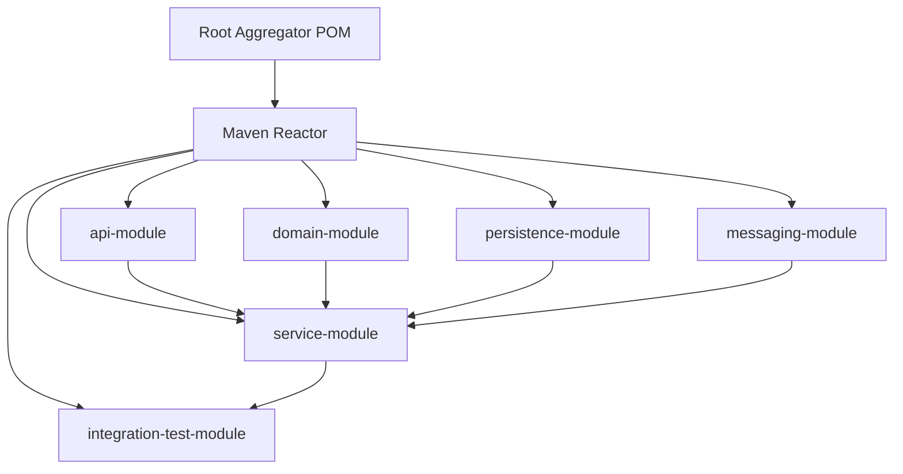

# Maven Multi-Module and Reactor

## 1. Core Idea

Maven multi-module bukan sekadar banyak folder dalam satu repository. Ia adalah cara Maven membangun sekumpulan project yang saling terkait dalam satu **reactor build**.

Dalam enterprise Java/JAX-RS system, multi-module sering dipakai untuk memisahkan:

- API contract,
- domain model,
- application/service layer,
- persistence adapter,
- messaging adapter,
- REST/JAX-RS resource layer,
- client library,
- test fixtures,
- integration tests,
- shared utilities,
- generated code,
- deployment/helper modules.

Mental model:



Maven reactor menentukan build order berdasarkan dependency antar module, bukan hanya urutan folder.

Senior engineer harus memahami multi-module sebagai kombinasi dari:

- repository structure,
- module boundary,
- dependency graph,
- build lifecycle,
- CI optimization,
- release artifact strategy,
- ownership model.

---

## 2. Why Multi-Module Exists

Multi-module Maven membantu ketika satu codebase memiliki beberapa artifact yang harus dibangun bersama.

Alasan umum:

- menjaga API/domain/service separation,
- menghasilkan beberapa artifact dari satu repo,
- membagi responsibility antar module,
- mempercepat partial build,
- menjalankan test sesuai boundary,
- mengontrol dependency antar layer,
- memisahkan runtime artifact dari test/support artifact,
- mempermudah reuse internal module,
- menjaga dependencyManagement di satu tempat,
- mengurangi copy-paste POM.

Namun multi-module juga membawa kompleksitas:

- build lebih lambat,
- dependency antar module bisa membentuk coupling buruk,
- partial build bisa membingungkan,
- CI matrix lebih kompleks,
- module boundary bisa menjadi ilusi,
- release versioning bisa lebih sulit,
- IDE import bisa bermasalah,
- cyclic dependency harus dihindari.

---

## 3. Aggregator POM

Aggregator POM adalah POM yang mendeklarasikan daftar module.

Contoh:

```xml
<project>
  <modelVersion>4.0.0</modelVersion>
  <groupId>com.company.quoteorder</groupId>
  <artifactId>quote-order-parent</artifactId>
  <version>1.24.0-SNAPSHOT</version>
  <packaging>pom</packaging>

  <modules>
    <module>quote-order-api</module>
    <module>quote-order-domain</module>
    <module>quote-order-persistence</module>
    <module>quote-order-service</module>
    <module>quote-order-it</module>
  </modules>
</project>
```

`packaging` biasanya `pom`.

Aggregator menjawab:

> Module apa saja yang ikut dibangun saat command Maven dijalankan dari root?

---

## 4. Parent POM vs Aggregator POM

Parent POM dan aggregator POM sering digabung di root POM, tetapi konsepnya berbeda.

### Parent POM

Parent POM diwarisi oleh child module.

Ia mengatur:

- dependencyManagement,
- pluginManagement,
- properties,
- repositories,
- common config,
- organization metadata.

Child menunjuk parent:

```xml
<parent>
  <groupId>com.company.quoteorder</groupId>
  <artifactId>quote-order-parent</artifactId>
  <version>1.24.0-SNAPSHOT</version>
</parent>
```

### Aggregator POM

Aggregator POM mengumpulkan module untuk reactor build.

Ia punya:

```xml
<modules>
  <module>module-a</module>
  <module>module-b</module>
</modules>
```

### They Can Be Separate

Ada project yang memiliki:

- parent POM internal dari platform team,
- aggregator POM service repo.

Contoh:

```xml
<parent>
  <groupId>com.company.platform</groupId>
  <artifactId>java-service-parent</artifactId>
  <version>3.12.0</version>
</parent>

<artifactId>quote-order-aggregator</artifactId>
<packaging>pom</packaging>

<modules>
  <module>api</module>
  <module>service</module>
</modules>
```

### Senior Concern

Jangan menganggap root POM selalu source of truth semua policy. Verifikasi apakah parent berasal dari repo yang sama atau artifact parent internal yang dipublish.

---

## 5. Child Module POM

Child module biasanya punya POM sendiri.

Contoh:

```xml
<project>
  <modelVersion>4.0.0</modelVersion>

  <parent>
    <groupId>com.company.quoteorder</groupId>
    <artifactId>quote-order-parent</artifactId>
    <version>1.24.0-SNAPSHOT</version>
  </parent>

  <artifactId>quote-order-service</artifactId>
  <packaging>jar</packaging>

  <dependencies>
    <dependency>
      <groupId>com.company.quoteorder</groupId>
      <artifactId>quote-order-domain</artifactId>
      <version>${project.version}</version>
    </dependency>
  </dependencies>
</project>
```

Child module menentukan artifact sendiri.

Artifact identity:

```text
groupId:artifactId:version
```

Dalam multi-module repo, `version` sering sama lewat `${project.version}`.

---

## 6. Maven Reactor

Reactor adalah mekanisme Maven yang membangun semua module dalam urutan yang benar.

Ketika menjalankan:

```bash
mvn clean verify
```

di root aggregator, Maven akan:

1. membaca root POM,
2. menemukan module,
3. membaca POM tiap module,
4. membangun dependency graph antar module,
5. menentukan build order,
6. menjalankan lifecycle phase untuk setiap module sesuai urutan.

Contoh output:

```text
Reactor Build Order:

quote-order-parent
quote-order-api
quote-order-domain
quote-order-persistence
quote-order-service
quote-order-it
```

Build order ditentukan oleh dependency relation. Jika `service` bergantung pada `domain`, maka `domain` dibangun dulu.

---

## 7. Reactor Build Order

Maven tidak hanya mengikuti urutan `<modules>` secara buta. Dependency antar module memengaruhi order.

Contoh:

```text
service -> persistence -> domain
```

Maka order minimal:

```text
domain
persistence
service
```

### Why It Matters

Jika module boundary tidak benar, build order akan menunjukkan coupling yang tidak diinginkan.

Contoh smell:

- `domain` bergantung pada `persistence`,
- `api` bergantung pada `service implementation`,
- test fixture masuk ke production module,
- module adapter saling bergantung,
- circular dependency design muncul.

Maven akan menolak cyclic dependency antar module.

---

## 8. Common Module Layout Patterns

### Pattern 1: Simple Service Split

```text
quote-order/
├─ pom.xml
├─ api/
├─ domain/
├─ service/
├─ persistence/
└─ app/
```

Use case:

- ingin layer separation,
- app module menjadi runtime artifact,
- module lain sebagai internal compile dependency.

### Pattern 2: API and Client Library

```text
quote-order/
├─ api-contract/
├─ server/
└─ client/
```

Use case:

- service publish client library,
- contract shared dengan consumer,
- versioning API perlu jelas.

### Pattern 3: Integration Test Module

```text
quote-order/
├─ service/
├─ app/
└─ integration-tests/
```

Use case:

- integration tests butuh packaged app,
- Testcontainers dependency tidak masuk runtime module,
- test lifecycle lebih eksplisit.

### Pattern 4: Generated Code Module

```text
quote-order/
├─ openapi-generated-client/
├─ generated-model/
└─ service/
```

Use case:

- generated source dipisahkan,
- source generation lebih mudah di-cache/review,
- dependency generated code jelas.

### Pattern 5: Library plus Applications

```text
platform-tooling/
├─ common-core/
├─ common-observability/
├─ common-test/
└─ sample-service/
```

Use case:

- internal library repository,
- shared module memiliki consumer banyak.

---

## 9. Module Boundary

Module boundary adalah kontrak dependency antar bagian codebase.

Boundary yang baik membuat arah dependency jelas.

Contoh desirable direction:

```text
app -> rest -> service -> domain
app -> persistence -> domain
app -> messaging -> domain
```

Domain idealnya tidak bergantung pada infrastructure.

### Bad Boundary Examples

- domain bergantung pada JDBC/JPA detail,
- domain bergantung pada Kafka/RabbitMQ client,
- API contract bergantung pada persistence entity,
- test helper masuk main artifact,
- REST resource module bergantung langsung pada database adapter tanpa service boundary,
- module common menjadi dumping ground.

### Senior Review Question

Saat melihat dependency antar module baru, tanyakan:

> Apakah arah dependency ini memperjelas arsitektur atau membuat coupling makin kabur?

---

## 10. Inter-Module Dependencies

Dependency antar module ditulis seperti dependency Maven biasa.

```xml
<dependency>
  <groupId>com.company.quoteorder</groupId>
  <artifactId>quote-order-domain</artifactId>
  <version>${project.version}</version>
</dependency>
```

### Good Practice

- gunakan `${project.version}` jika semua module dirilis bersama,
- jangan pakai SNAPSHOT external untuk module dalam reactor,
- jaga dependency direction,
- hindari dependency test module ke main module secara tidak jelas,
- hindari module common yang terlalu besar.

### Failure Mode

- module tidak ditemukan karena tidak ikut reactor,
- module version mismatch,
- build dari subdirectory gagal,
- cyclic dependency,
- artifact lama dari local repository dipakai tanpa sadar,
- CI berbeda dari local karena partial build.

---

## 11. Full Reactor Build

Command umum:

```bash
mvn clean verify
```

Ini menjalankan build seluruh module sampai phase `verify`.

Gunakan untuk:

- validasi sebelum PR besar,
- dependency upgrade,
- parent POM change,
- release candidate,
- perubahan module boundary,
- perubahan shared test fixture,
- perubahan plugin/lifecycle.

### Trade-Off

Full build lebih aman tetapi lebih lambat.

Senior engineer harus tahu kapan full build wajib dan kapan partial build cukup.

---

## 12. Partial Build with `-pl`

`-pl` berarti project list. Ia memilih module yang ingin dibangun.

Contoh:

```bash
mvn -pl quote-order-service test
```

Build hanya module `quote-order-service`.

Jika module itu butuh dependency dari module lain yang belum ada di local repo, build bisa gagal.

---

## 13. Build Dependencies Too with `-am`

`-am` berarti also make. Ia membangun module yang dibutuhkan oleh module target.

```bash
mvn -pl quote-order-service -am test
```

Jika `quote-order-service` bergantung pada `domain` dan `api`, Maven juga membangun dependency modules tersebut.

Mental model:

```text
Build target + upstream dependencies
```

Use case:

- cepat test module tertentu,
- tetap membangun dependency internal yang diperlukan,
- menghindari artifact stale dari local repo.

---

## 14. Build Dependents Too with `-amd`

`-amd` berarti also make dependents. Ia membangun module yang bergantung pada module target.

```bash
mvn -pl quote-order-domain -amd test
```

Jika `service`, `persistence`, dan `app` bergantung pada `domain`, Maven juga membangun module tersebut.

Mental model:

```text
Build target + downstream dependents
```

Use case:

- mengubah shared module,
- validasi impact ke consumers dalam reactor,
- mengecek apakah API internal change memecahkan module lain.

---

## 15. Combining `-pl`, `-am`, and `-amd`

Contoh:

```bash
mvn -pl quote-order-domain -am -amd verify
```

Ini bisa membangun:

- target module,
- dependency module yang dibutuhkan target,
- module lain yang bergantung pada target.

Pada repo besar, kombinasi ini bisa sangat membantu tetapi harus dipahami.

### Review Tip

Jika PR mengubah module shared, jangan hanya test module itu. Jalankan dependents.

```bash
mvn -pl changed-module -amd verify
```

Jika PR mengubah module leaf, `-am` sering cukup.

```bash
mvn -pl leaf-module -am test
```

---

## 16. Resume Failed Build with `-rf`

Jika reactor build gagal di module tertentu, Maven bisa resume dari module tersebut.

```bash
mvn -rf :quote-order-service verify
```

Format `:artifactId` sering dipakai.

Use case:

- full reactor build panjang,
- gagal di tengah karena test failure,
- setelah memperbaiki module gagal, lanjut dari module itu.

### Caveat

`-rf` tidak selalu aman jika module sebelumnya berubah setelah failure.

Jika fix mengubah upstream module, full atau partial build dengan `-am` mungkin lebih tepat.

---

## 17. Building from Subdirectory

Kadang engineer masuk ke module dan menjalankan:

```bash
mvn test
```

Ini bisa berbeda dari menjalankan command di root.

Risiko:

- parent POM relative path tidak resolve,
- module dependency tidak dibangun reactor,
- artifact lama dari local repo dipakai,
- plugin/profile root tidak aktif sesuai harapan,
- CI command berbeda.

### Safer Pattern

Dari root:

```bash
mvn -pl module-name -am test
```

Ini membuat context reactor lebih jelas.

---

## 18. Local Repository Staleness

Maven local repository (`~/.m2/repository`) bisa menyembunyikan masalah multi-module.

Contoh:

- module A berubah,
- module B bergantung pada A,
- engineer build B dari subdirectory,
- Maven memakai artifact A lama dari local repo,
- test B passing padahal full reactor gagal.

### Detection

Jika curiga stale artifact:

```bash
mvn clean verify
```

Atau build target dengan upstream:

```bash
mvn -pl module-b -am clean verify
```

Hindari langsung menghapus seluruh `~/.m2` kecuali perlu. Itu mahal dan sering bukan diagnosis yang presisi.

---

## 19. Versioning Strategy in Multi-Module

Ada dua strategi umum.

### Same Version for All Modules

Semua module memakai `${project.version}`.

Kelebihan:

- release lebih sederhana,
- module dalam repo selalu aligned,
- dependency antar module mudah,
- cocok untuk service repo.

Kekurangan:

- module kecil ikut bump version walau tidak berubah,
- artifact churn lebih banyak.

### Independent Module Versions

Setiap module punya version sendiri.

Kelebihan:

- cocok untuk library repo dengan consumer berbeda,
- release lebih granular.

Kekurangan:

- dependency management lebih rumit,
- release orchestration sulit,
- compatibility matrix perlu disiplin tinggi.

### Senior Recommendation

Untuk service repo, same version biasanya lebih sederhana. Untuk shared library/platform repo, independent version bisa valid tetapi membutuhkan governance lebih kuat.

Internal process harus diverifikasi.

---

## 20. Multi-Module and Dependency Management

Root/parent POM biasanya menjadi tempat:

- dependencyManagement,
- pluginManagement,
- common properties,
- Java version,
- test plugin config,
- enforcer rules.

Child module sebaiknya mendeklarasikan dependency yang benar-benar dipakai.

### Good Pattern

```text
root POM:
  manage versions
child POM:
  declare usage
```

### Bad Pattern

```text
root POM:
  adds all dependencies to everyone
child POM:
  hidden implicit classpath
```

Masalah implicit classpath:

- module terlihat compile tanpa dependency jelas,
- dependency analysis sulit,
- module boundary kabur,
- security exposure membesar.

---

## 21. Multi-Module and Maven Profiles

Profiles bisa aktif di root atau child module.

Risiko:

- profile root tidak aktif saat build dari subdirectory,
- child profile mengubah dependency/plugin sendiri,
- CI profile berbeda dari local,
- integration test module hanya jalan dengan profile tertentu,
- release profile mengubah module set atau plugin behavior.

### Detection

```bash
mvn help:active-profiles
mvn help:effective-pom -Doutput=effective-pom.xml
```

Untuk module tertentu:

```bash
mvn -pl module-name help:active-profiles
```

### Review Question

Apakah module behavior sama saat dibangun:

- dari root,
- dari subdirectory,
- di CI,
- saat release,
- saat profile tertentu aktif?

---

## 22. Multi-Module and Tests

Test strategy multi-module perlu jelas.

Common options:

### Unit Tests in Each Module

Setiap module punya unit test sendiri.

```text
domain/src/test
service/src/test
persistence/src/test
```

### Integration Tests in Dedicated Module

```text
integration-tests/src/test
```

Dedicated module bisa bergantung pada packaged app atau test fixture.

### Contract Tests in API Module

API/contract module bisa punya compatibility tests.

### Risks

- integration test tidak jalan di default lifecycle,
- tests hanya jalan di module tertentu,
- test fixture bocor ke production dependency,
- flaky test memperlambat full reactor,
- CI hanya partial build sehingga impact tidak terdeteksi.

---

## 23. Multi-Module and CI Optimization

CI untuk multi-module sering perlu optimasi.

Strategi:

- full build untuk main branch,
- partial build untuk PR kecil,
- changed-module detection,
- dependency-aware test selection,
- cache Maven repository,
- split unit/integration tests,
- matrix jobs per module group,
- artifact sharing antar jobs,
- fail-fast untuk compile/test awal,
- nightly full verification.

### Senior Concern

CI optimization tidak boleh mengorbankan correctness.

Jika changed-module detection salah, PR bisa merge tanpa membangun consumer terdampak.

Untuk shared module change, downstream tests harus ikut jalan.

---

## 24. Multi-Module and Docker Image Build

Biasanya tidak semua module menjadi Docker image.

Contoh:

```text
api              -> jar library
service          -> jar library
persistence      -> jar library
app              -> executable jar / container image
integration-test -> test only
```

Docker build seharusnya memakai artifact runtime yang benar.

### Risks

- image build memakai artifact stale,
- Docker context terlalu besar,
- test module ikut masuk image,
- generated files tidak ada saat image build,
- multi-stage Dockerfile tidak align dengan Maven build,
- CI package step dan Docker build step memakai command berbeda.

### Review Question

Artifact apa yang sebenarnya masuk container image?

Command evidence:

```bash
mvn -pl app-module -am package
jar tf app-module/target/*.jar | head
```

---

## 25. Multi-Module and GitOps/Deployment

Multi-module repository bisa menghasilkan satu atau lebih deployable artifact.

Scenarios:

- satu repo menghasilkan satu service image,
- satu repo menghasilkan beberapa service image,
- satu repo menghasilkan library dan sample app,
- satu repo menghasilkan deployment manifests/Helm chart,
- deployment config hidup di repo GitOps terpisah.

### Release Traceability

Traceability harus jelas:

```text
commit -> module version -> artifact -> image -> manifest -> environment
```

Jika repo menghasilkan banyak artifact, release note harus menyebut artifact mana yang berubah.

---

## 26. Multi-Module and IDE

IDE seperti IntelliJ/Eclipse bisa meng-import multi-module sebagai project.

Risiko:

- IDE classpath berbeda dari Maven,
- generated sources belum dikenali,
- annotation processing belum aktif,
- module dependency terlihat benar di IDE tetapi Maven gagal,
- test runner IDE memakai classpath berbeda,
- JDK IDE berbeda dari Maven toolchain.

### Senior Rule

IDE green bukan bukti Maven build benar.

Validasi tetap dengan command Maven yang sama seperti CI.

---

## 27. Multi-Module Failure Modes

### Failure Mode 1: Cyclic Dependency

Module A bergantung pada B, B bergantung pada A.

Maven akan gagal membangun.

Architectural smell: boundary tidak jelas.

### Failure Mode 2: Missing Module in Aggregator

Module ada foldernya tetapi tidak tercantum di `<modules>`.

Akibat:

- tidak ikut full build,
- CI tidak menguji,
- release tidak publish.

### Failure Mode 3: Wrong Inter-Module Version

Child module bergantung pada versi lama module lain.

Akibat:

- local artifact stale,
- runtime mismatch,
- release inconsistent.

### Failure Mode 4: Parent Resolution Failure

Child POM tidak bisa resolve parent.

Penyebab:

- wrong relativePath,
- parent belum install,
- private repo credential hilang,
- build dari subdirectory.

### Failure Mode 5: Hidden Dependency from Parent

Parent dependencies membuat module compile tanpa deklarasi dependency sendiri.

Akibat:

- dependency analysis buruk,
- module boundary kabur.

### Failure Mode 6: Partial Build Misses Downstream Breakage

Engineer hanya test module yang diubah.

Consumer module gagal setelah merge.

Gunakan `-amd` untuk shared module.

---

## 28. Debugging Reactor Build Failure

Gunakan workflow ini.

### Step 1: Read Reactor Summary

Maven biasanya menampilkan:

```text
Reactor Summary:
module-a SUCCESS
module-b FAILURE
module-c SKIPPED
```

Fokus pada module pertama yang `FAILURE`.

Module setelahnya `SKIPPED` sering hanya dampak dari failure sebelumnya.

### Step 2: Isolate Module

Bangun module gagal dengan dependencies:

```bash
mvn -pl failed-module -am verify
```

### Step 3: Check If Failure Is Upstream or Local

Jika dependency module berubah, jalankan upstream.

```bash
mvn -pl failed-module -am clean verify
```

### Step 4: Resume Carefully

Jika sudah fix dan upstream tidak berubah:

```bash
mvn -rf :failed-module verify
```

### Step 5: Compare CI Command

Pastikan command local sama dengan CI:

- phase,
- profiles,
- Java version,
- Maven version,
- environment variable,
- settings.xml,
- repository credentials.

---

## 29. Useful Commands

### Full Build

```bash
mvn clean verify
```

### Build One Module

```bash
mvn -pl module-name test
```

### Build One Module plus Upstream Dependencies

```bash
mvn -pl module-name -am test
```

### Build Downstream Dependents

```bash
mvn -pl module-name -amd verify
```

### Resume from Failed Module

```bash
mvn -rf :artifact-id verify
```

### Show Reactor Build Order

```bash
mvn validate
```

Read the `Reactor Build Order` section.

### Effective POM for Module

```bash
mvn -pl module-name help:effective-pom -Doutput=effective-pom.xml
```

### Dependency Tree for Module

```bash
mvn -pl module-name dependency:tree
```

### Active Profiles for Module

```bash
mvn -pl module-name help:active-profiles
```

---

## 30. Module Boundary Review Checklist

When reviewing a new module or inter-module dependency:

- [ ] Does the module have a clear responsibility?
- [ ] Is the module name meaningful?
- [ ] Does dependency direction match architecture?
- [ ] Does domain depend on infrastructure?
- [ ] Does API contract depend on implementation?
- [ ] Does test fixture leak into runtime module?
- [ ] Is common module becoming a dumping ground?
- [ ] Are generated sources isolated correctly?
- [ ] Is module dependency needed or can it be inverted?
- [ ] Is there a cyclic dependency risk?

---

## 31. Build Review Checklist

For PRs changing multi-module build:

- [ ] Did full reactor build pass if parent/root POM changed?
- [ ] Did downstream modules run if shared module changed?
- [ ] Did integration tests run if runtime artifact changed?
- [ ] Did Docker image build use the correct module artifact?
- [ ] Did CI build the same modules as local validation?
- [ ] Are Maven profiles consistent root vs submodule?
- [ ] Are plugin changes inherited as expected?
- [ ] Are module versions aligned?
- [ ] Are dependency changes visible in dependency tree?
- [ ] Is release artifact mapping clear?

---

## 32. Correctness Concerns

Multi-module correctness is about more than compile success.

Ask:

- Does each module expose the right API?
- Are internal classes leaking across boundaries?
- Does runtime module include all required dependencies?
- Are tests validating the right layer?
- Does integration test cover module wiring?
- Does module split preserve domain invariants?
- Does module dependency direction preserve architecture?

A module split that compiles but weakens boundaries is not necessarily a good design.

---

## 33. Productivity Concerns

Good multi-module design improves productivity:

- faster partial builds,
- clearer ownership,
- smaller PR scope,
- better test selection,
- easier code navigation,
- better IDE module separation,
- better CI parallelism.

Bad multi-module design hurts productivity:

- slow full builds,
- unclear dependencies,
- fragile partial builds,
- frequent stale local repo issues,
- duplicated config,
- over-fragmented modules,
- `common` module chaos.

Senior engineer must evaluate whether a new module reduces complexity or just redistributes it.

---

## 34. Security Concerns

Module boundary affects security exposure.

Examples:

- security/auth library should be centralized or consistently configured,
- test dependency should not enter runtime artifact,
- secret/config helper should not be reused unsafely,
- internal library should not expose sensitive implementation detail,
- generated client should not hardcode endpoint/credential,
- vulnerable dependency in shared module can affect all consumers.

Review dependency tree per module, not only root.

```bash
mvn -pl module-name dependency:tree
```

---

## 35. Reproducibility Concerns

Multi-module build reproducibility depends on:

- stable module list,
- clear parent version,
- no stale local artifacts,
- aligned module versions,
- pinned plugin versions,
- consistent profiles,
- deterministic generated sources,
- CI command matching local guidance,
- release process building from clean checkout.

If a module can only build after undocumented local install steps, reproducibility is broken.

---

## 36. Release Concerns

Multi-module release questions:

- Are all modules released together?
- Are some modules internal only?
- Which module produces deployable artifact?
- Which module publishes library artifact?
- Are version numbers aligned?
- Are tags per repo or per module?
- Does release note mention module-level changes?
- Does rollback require artifact downgrade, image rollback, or both?
- Are generated artifacts reproducible?

Internal release process must be verified.

---

## 37. Observability and Incident Support Concerns

Module boundaries influence incident debugging.

If runtime error happens, you need to know:

- which module contains REST endpoint,
- which module contains business logic,
- which module contains DB access,
- which module contains Kafka/RabbitMQ handler,
- which module contains Redis integration,
- which module packages the final artifact,
- which module owns logging/tracing configuration.

Good module structure shortens incident diagnosis.

Bad module structure makes stack trace navigation slower.

---

## 38. Internal Verification Checklist

Untuk konteks CSG/team, verifikasi:

- [ ] Apakah repository service adalah single-module atau multi-module?
- [ ] Jika multi-module, module apa saja yang ada?
- [ ] Apakah root POM sekaligus parent dan aggregator?
- [ ] Apakah parent POM berasal dari repo yang sama atau parent internal terpisah?
- [ ] Apakah semua module dirilis dengan version yang sama?
- [ ] Module mana yang menghasilkan deployable artifact?
- [ ] Module mana yang publish library artifact?
- [ ] Apakah ada integration-test module?
- [ ] Apakah ada generated-code module?
- [ ] Apakah ada module boundary guideline?
- [ ] Apakah ada `common` module dan apa ownership-nya?
- [ ] Apakah CI selalu full build atau partial build?
- [ ] Apakah changed-module detection dipakai?
- [ ] Apakah Docker image build dari module tertentu?
- [ ] Apakah GitOps/deployment manifest mereferensikan artifact/image tertentu?
- [ ] Apakah release notes menyebut module-level impact?
- [ ] Apakah ada known stale local repository issue?
- [ ] Apakah ada command resmi untuk build module tertentu?

---

## 39. Senior Mental Model

Maven multi-module adalah alat untuk mengelola complexity. Ia bukan tujuan.

Module yang baik memiliki:

- responsibility jelas,
- dependency direction jelas,
- artifact identity jelas,
- test responsibility jelas,
- release impact jelas,
- ownership jelas,
- build behavior predictable.

Saat mereview multi-module change, jangan hanya lihat apakah Maven build hijau.

Tanyakan:

- Apakah boundary makin baik?
- Apakah coupling turun atau naik?
- Apakah partial build tetap aman?
- Apakah CI masih valid?
- Apakah release artifact jelas?
- Apakah runtime packaging berubah?
- Apakah downstream module ikut diuji?
- Apakah developer baru bisa memahami struktur ini?

Multi-module yang sehat mempercepat engineering. Multi-module yang buruk menciptakan build labyrinth.
