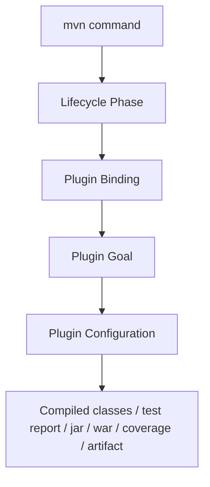
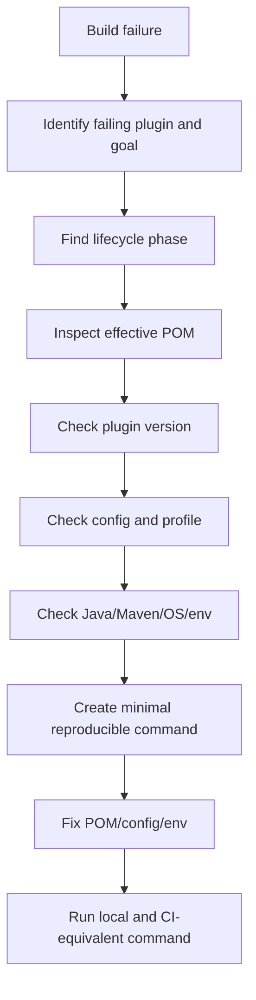

# Maven Plugins

## 1. Core Idea

Maven plugin adalah komponen yang benar-benar menjalankan pekerjaan build.

POM mendeklarasikan project, dependency, lifecycle, dan konfigurasi. Namun saat Maven melakukan compile, test, package, coverage, static analysis, dependency check, atau deploy, pekerjaan itu dilakukan oleh **plugin goal**.

Mental model yang harus dipegang:



Contoh:

```bash
mvn test
```

Command ini tidak berarti Maven sendiri tahu cara menjalankan test. Ia menjalankan phase `test`, lalu phase tersebut biasanya memanggil goal dari `maven-surefire-plugin`.

Senior engineer harus memahami plugin karena banyak masalah build enterprise berasal dari:

- plugin version tidak dipin,
- plugin behavior berubah setelah upgrade,
- plugin config berbeda antara parent dan child POM,
- plugin goal berjalan di phase yang salah,
- plugin menghasilkan artifact berbeda antara local dan CI,
- plugin skip silently,
- plugin menggunakan dependency transitive yang rentan,
- plugin terlalu lambat atau tidak cache-friendly,
- plugin membuat build tidak reproducible.

---

## 2. Why Maven Plugins Exist

Maven lifecycle memberi struktur umum, tetapi setiap project butuh pekerjaan yang berbeda.

Plugin ada untuk mengisi pekerjaan spesifik seperti:

- compile Java source,
- menjalankan unit test,
- menjalankan integration test,
- membuat JAR/WAR,
- membuat shaded/fat JAR,
- menganalisis dependency,
- enforce Java version atau dependency convergence,
- menghitung coverage,
- menjalankan style/format check,
- generate source,
- package container image,
- publish artifact,
- membuat report.

Plugin membuat Maven extensible.

Namun extensibility ini berarti build behavior tersebar di banyak tempat:

- lifecycle default binding,
- parent POM,
- pluginManagement,
- build/plugins,
- profile,
- command-line property,
- CI parameter,
- plugin default behavior.

Senior concern:

> Ketika build gagal atau artifact berubah, jangan hanya lihat command `mvn`. Lihat plugin mana yang sebenarnya berjalan, dengan konfigurasi apa, dari source konfigurasi mana.

---

## 3. Plugin Coordinates and Configuration

Plugin memiliki coordinates seperti dependency.

Contoh:

```xml
<plugin>
  <groupId>org.apache.maven.plugins</groupId>
  <artifactId>maven-compiler-plugin</artifactId>
  <version>3.13.0</version>
  <configuration>
    <release>17</release>
  </configuration>
</plugin>
```

Bagian penting:

- `groupId`: group plugin.
- `artifactId`: nama plugin.
- `version`: versi plugin.
- `configuration`: parameter behavior.
- `executions`: goal mana dijalankan pada phase mana.
- `dependencies`: dependency tambahan khusus plugin.

Plugin dapat dideklarasikan di:

```xml
<build>
  <pluginManagement>
    ...
  </pluginManagement>
  <plugins>
    ...
  </plugins>
</build>
```

Perbedaan penting:

- `pluginManagement` mengatur default config/version untuk child, tetapi tidak selalu mengeksekusi plugin.
- `plugins` mendeklarasikan plugin yang aktif digunakan dalam project.

---

## 4. pluginManagement vs plugins

### pluginManagement

`pluginManagement` adalah tempat mengontrol versi dan konfigurasi default plugin.

Contoh:

```xml
<build>
  <pluginManagement>
    <plugins>
      <plugin>
        <groupId>org.apache.maven.plugins</groupId>
        <artifactId>maven-surefire-plugin</artifactId>
        <version>3.2.5</version>
      </plugin>
    </plugins>
  </pluginManagement>
</build>
```

Ini tidak otomatis berarti plugin pasti berjalan karena didefinisikan di `pluginManagement`.

### plugins

`plugins` adalah deklarasi penggunaan plugin.

```xml
<build>
  <plugins>
    <plugin>
      <groupId>org.apache.maven.plugins</groupId>
      <artifactId>maven-surefire-plugin</artifactId>
    </plugin>
  </plugins>
</build>
```

Jika version tidak disebutkan di `plugins`, Maven bisa mengambil dari `pluginManagement`.

### Enterprise Pattern

Biasanya parent POM internal mengatur:

- plugin version,
- baseline compiler config,
- surefire/failsafe default,
- enforcer rule,
- coverage plugin,
- formatting/static analysis plugin,
- release plugin config.

Child module hanya mengaktifkan atau override jika perlu.

### Failure Mode

Build lokal dan CI berbeda karena:

- child module override plugin config,
- profile mengubah plugin execution,
- plugin version implicit,
- parent POM berbeda version,
- CI menjalankan goal tambahan,
- module tertentu tidak inherit parent yang sama.

---

## 5. Plugin Version Pinning

Plugin version harus dipin.

Bad:

```xml
<plugin>
  <artifactId>maven-compiler-plugin</artifactId>
</plugin>
```

Better:

```xml
<plugin>
  <groupId>org.apache.maven.plugins</groupId>
  <artifactId>maven-compiler-plugin</artifactId>
  <version>${maven.compiler.plugin.version}</version>
</plugin>
```

Atau dipin di parent `pluginManagement`.

Alasan version pinning:

- menjaga reproducible build,
- menghindari perubahan behavior mendadak,
- mempermudah audit security,
- mempermudah rollback plugin upgrade,
- membuat build CI/local konsisten.

Review question:

> Jika build dijalankan 6 bulan lagi, apakah plugin yang sama masih akan dipakai?

Jika jawabannya tidak jelas, build belum cukup reproducible.

---

## 6. Maven Compiler Plugin

`maven-compiler-plugin` mengatur compile Java source.

Contoh umum:

```xml
<plugin>
  <groupId>org.apache.maven.plugins</groupId>
  <artifactId>maven-compiler-plugin</artifactId>
  <version>3.13.0</version>
  <configuration>
    <release>17</release>
    <compilerArgs>
      <arg>-Xlint:unchecked</arg>
      <arg>-Xlint:deprecation</arg>
    </compilerArgs>
  </configuration>
</plugin>
```

Konsep penting:

- `source`: source language level.
- `target`: generated bytecode target.
- `release`: lebih aman untuk target platform karena mengikat API platform juga.
- annotation processor path.
- compiler arguments.
- incremental compilation behavior.

Untuk Java modern, `release` sering lebih defensible daripada kombinasi `source`/`target`.

### Impact ke Java/JAX-RS

Compiler plugin memengaruhi:

- language feature yang boleh dipakai,
- bytecode compatibility,
- runtime JDK compatibility,
- annotation processing,
- generated code,
- warning visibility,
- build failure strictness.

### Failure Mode

- build local sukses, container runtime gagal karena JDK mismatch,
- compile error hanya di CI karena JDK berbeda,
- annotation processor tidak jalan,
- generated source tidak masuk compile path,
- warning penting tersembunyi,
- module memakai Java feature yang tidak kompatibel dengan runtime.

### Debug Command

```bash
mvn -X compile
mvn help:effective-pom
mvn help:effective-pom | grep -n "maven-compiler-plugin" -A 40
java -version
mvn -version
```

---

## 7. Maven Surefire Plugin

`maven-surefire-plugin` menjalankan unit test pada phase `test`.

Contoh:

```xml
<plugin>
  <groupId>org.apache.maven.plugins</groupId>
  <artifactId>maven-surefire-plugin</artifactId>
  <version>3.2.5</version>
  <configuration>
    <includes>
      <include>**/*Test.java</include>
      <include>**/*Tests.java</include>
    </includes>
    <failIfNoTests>false</failIfNoTests>
  </configuration>
</plugin>
```

Surefire biasanya untuk:

- unit test cepat,
- test tanpa external dependency berat,
- test yang bisa jalan di setiap PR,
- test deterministik.

### Common Commands

```bash
mvn test
mvn -Dtest=QuoteValidatorTest test
mvn -Dtest=QuoteValidatorTest#shouldRejectExpiredQuote test
```

### Failure Mode

- test tidak terdeteksi karena naming convention salah,
- test dilewati karena property skip,
- test flaky karena parallel execution,
- test lokal sukses tapi CI gagal karena timezone/locale/env,
- report tidak dipublish ke CI,
- forked JVM crash.

### Debug Checklist

- cek `target/surefire-reports`,
- cek naming convention,
- cek `-DskipTests` vs `-Dmaven.test.skip=true`,
- cek Java version,
- cek timezone,
- cek environment variable test,
- cek parallel test config,
- cek dependency test runtime.

---

## 8. Maven Failsafe Plugin

`maven-failsafe-plugin` biasanya menjalankan integration test pada phase `integration-test` dan mengevaluasi hasil pada phase `verify`.

Contoh:

```xml
<plugin>
  <groupId>org.apache.maven.plugins</groupId>
  <artifactId>maven-failsafe-plugin</artifactId>
  <version>3.2.5</version>
  <executions>
    <execution>
      <goals>
        <goal>integration-test</goal>
        <goal>verify</goal>
      </goals>
    </execution>
  </executions>
  <configuration>
    <includes>
      <include>**/*IT.java</include>
      <include>**/*IntegrationTest.java</include>
    </includes>
  </configuration>
</plugin>
```

Failsafe berbeda dari Surefire karena integration test sering butuh setup/teardown external resource.

Pola umum:

```bash
mvn verify
mvn -Dit.test=QuoteOrderFlowIT verify
```

### Why `verify` Matters

Jika hanya menjalankan:

```bash
mvn integration-test
```

hasil integration test belum tentu dievaluasi dengan benar. Failsafe dirancang agar failure dievaluasi pada goal `verify`.

Senior rule:

> Untuk integration test Maven, biasakan `mvn verify`, bukan hanya `mvn integration-test`.

### Failure Mode

- integration test tidak jalan karena naming convention salah,
- test jalan tapi failure tidak diproses karena phase salah,
- Docker/Testcontainers tidak tersedia,
- port conflict,
- database/broker belum siap,
- test order dependent,
- cleanup gagal,
- CI timeout.

---

## 9. Maven JAR Plugin

`maven-jar-plugin` membuat JAR artifact.

Contoh:

```xml
<plugin>
  <groupId>org.apache.maven.plugins</groupId>
  <artifactId>maven-jar-plugin</artifactId>
  <version>3.4.2</version>
  <configuration>
    <archive>
      <manifest>
        <addDefaultImplementationEntries>true</addDefaultImplementationEntries>
        <addDefaultSpecificationEntries>true</addDefaultSpecificationEntries>
      </manifest>
    </archive>
  </configuration>
</plugin>
```

Untuk library module, JAR plugin memengaruhi artifact yang dikonsumsi module/service lain.

Untuk service executable, JAR plugin mungkin bekerja bersama plugin lain seperti shade, assembly, spring boot plugin, atau image plugin, tergantung stack.

### Review Concern

- Apakah manifest berisi version/build info yang benar?
- Apakah generated resources ikut masuk?
- Apakah secret/config local ikut ter-package?
- Apakah artifact deterministic?
- Apakah classifier dipakai dengan jelas?

### Failure Mode

- class/resource hilang dari artifact,
- wrong manifest,
- duplicate resource,
- generated files tidak ikut,
- artifact berbeda antara local dan CI,
- build timestamp membuat hash selalu berubah.

---

## 10. Maven WAR Plugin

`maven-war-plugin` dipakai jika aplikasi dikemas sebagai WAR.

Contoh:

```xml
<plugin>
  <groupId>org.apache.maven.plugins</groupId>
  <artifactId>maven-war-plugin</artifactId>
  <version>3.4.0</version>
</plugin>
```

Dalam konteks Java/JAX-RS enterprise, WAR mungkin relevan jika service dideploy ke application server atau servlet container external.

Untuk container-native microservice modern, banyak service dikemas sebagai executable JAR atau image, tetapi WAR tetap harus dipahami karena enterprise platform sering punya variasi deployment lama dan baru.

### Review Concern

- Apakah dependency `provided` benar untuk servlet/Jakarta APIs?
- Apakah application server menyediakan dependency tertentu?
- Apakah WAR membawa dependency yang seharusnya tidak dibawa?
- Apakah packaging sesuai runtime deployment model?

### Failure Mode

- `ClassNotFoundException` di app server,
- duplicate Jakarta/Servlet classes,
- namespace conflict `javax.*` vs `jakarta.*`,
- dependency yang harus `provided` malah masuk artifact,
- dependency yang dibutuhkan runtime malah tidak masuk.

---

## 11. Maven Shade Plugin

`maven-shade-plugin` membuat shaded/fat JAR dan dapat melakukan relocation package.

Contoh:

```xml
<plugin>
  <groupId>org.apache.maven.plugins</groupId>
  <artifactId>maven-shade-plugin</artifactId>
  <version>3.5.3</version>
  <executions>
    <execution>
      <phase>package</phase>
      <goals>
        <goal>shade</goal>
      </goals>
    </execution>
  </executions>
</plugin>
```

Shade berguna untuk:

- executable artifact,
- dependency isolation,
- relocation library conflict,
- CLI tool packaging.

Namun shade berisiko tinggi di enterprise service.

### Risk

- duplicate classes,
- service loader metadata rusak,
- signature file conflict,
- license file handling,
- dependency vulnerability tersembunyi,
- observability agent conflict,
- larger image/artifact,
- relocation yang memecahkan reflection.

### Java/JAX-RS Concern

JAX-RS/Jakarta stack sering memakai reflection, annotation scanning, service loader, dan classpath discovery. Shading dapat merusak discovery jika konfigurasi transformer tidak benar.

Review question:

> Apakah shaded artifact benar-benar diperlukan, atau image/container layering sudah cukup?

---

## 12. Maven Dependency Plugin

`maven-dependency-plugin` membantu menganalisis, menyalin, dan memverifikasi dependency.

Common commands:

```bash
mvn dependency:tree
mvn dependency:tree -Dincludes=org.glassfish.jersey
mvn dependency:analyze
mvn dependency:copy-dependencies
mvn dependency:go-offline
```

Use cases:

- mencari transitive dependency,
- menemukan conflict version,
- mempersiapkan offline build,
- mengecek dependency declared tapi tidak digunakan,
- mengecek dependency digunakan tapi belum declared langsung.

### Failure Mode

- `dependency:analyze` false positive karena reflection,
- generated code tidak terbaca analyzer,
- dependency test/runtime disalahartikan,
- copy-dependencies menghasilkan artifact tidak digunakan,
- go-offline tidak menangkap semua plugin dependency.

### Senior Review

Jangan menambah exclusion tanpa melihat `dependency:tree`.

Gunakan evidence:

```bash
mvn dependency:tree -Dverbose
mvn dependency:tree -Dincludes=groupId:artifactId
```

---

## 13. Maven Enforcer Plugin

`maven-enforcer-plugin` dipakai untuk memaksa rule build.

Contoh:

```xml
<plugin>
  <groupId>org.apache.maven.plugins</groupId>
  <artifactId>maven-enforcer-plugin</artifactId>
  <version>3.5.0</version>
  <executions>
    <execution>
      <id>enforce</id>
      <goals>
        <goal>enforce</goal>
      </goals>
      <configuration>
        <rules>
          <requireJavaVersion>
            <version>[17,)</version>
          </requireJavaVersion>
          <dependencyConvergence />
        </rules>
      </configuration>
    </execution>
  </executions>
</plugin>
```

Rule umum:

- require Java version,
- require Maven version,
- dependency convergence,
- ban duplicate classes,
- ban certain dependencies,
- require plugin versions,
- require release deps.

### Why It Matters

Enforcer mengubah best practice menjadi hard guardrail.

Tanpa enforcer, masalah seperti Java version mismatch, dependency conflict, dan plugin version drift sering baru terlihat saat CI/release/production.

### Failure Mode

- rule terlalu ketat dan menghambat migrasi,
- rule terlalu longgar dan tidak berguna,
- exclusion dipakai untuk bypass rule tanpa memahami risk,
- rule hanya aktif di profile tertentu,
- CI menjalankan enforcer tapi local tidak.

---

## 14. Maven Versions Plugin

`versions-maven-plugin` membantu melihat dan mengubah versi dependency/plugin.

Common commands:

```bash
mvn versions:display-dependency-updates
mvn versions:display-plugin-updates
mvn versions:display-property-updates
mvn versions:set -DnewVersion=1.25.0-SNAPSHOT
```

Use cases:

- dependency upgrade review,
- plugin upgrade planning,
- version bump release,
- dependency drift audit,
- parent/BOM update planning.

### Senior Concern

Upgrade bukan sekadar menaikkan angka versi.

Perlu dicek:

- breaking changes,
- transitive dependency impact,
- Jakarta/Jersey compatibility,
- CVE remediation,
- license change,
- test coverage,
- runtime behavior,
- rollback path.

### Failure Mode

- property update terlalu agresif,
- transitive dependency berubah tanpa disadari,
- plugin update mengubah default behavior,
- generated POM changes terlalu besar,
- dependency upgrade memperkenalkan binary incompatibility.

---

## 15. JaCoCo Plugin

`jacoco-maven-plugin` dipakai untuk coverage.

Contoh:

```xml
<plugin>
  <groupId>org.jacoco</groupId>
  <artifactId>jacoco-maven-plugin</artifactId>
  <version>0.8.12</version>
  <executions>
    <execution>
      <goals>
        <goal>prepare-agent</goal>
      </goals>
    </execution>
    <execution>
      <id>report</id>
      <phase>verify</phase>
      <goals>
        <goal>report</goal>
      </goals>
    </execution>
  </executions>
</plugin>
```

Coverage berguna, tetapi bukan pengganti correctness.

### Senior Interpretation

Coverage menjawab:

> Kode mana yang dieksekusi test?

Coverage tidak menjawab:

> Apakah behavior yang diuji benar?

### Review Concern

- Apakah threshold masuk akal?
- Apakah generated code dikecualikan?
- Apakah integration test coverage dihitung?
- Apakah coverage turun karena refactor wajar atau test gap?
- Apakah coverage mendorong test dangkal?

### Failure Mode

- coverage agent conflict dengan argLine lain,
- report tidak ter-publish di CI,
- threshold gagal karena generated code,
- multi-module aggregate report salah,
- test parallel/forking membuat data coverage hilang.

---

## 16. Checkstyle, Spotless, and Formatting Plugins

Formatting/style plugin menjaga consistency.

Contoh Spotless:

```xml
<plugin>
  <groupId>com.diffplug.spotless</groupId>
  <artifactId>spotless-maven-plugin</artifactId>
  <version>2.43.0</version>
  <configuration>
    <java>
      <googleJavaFormat />
    </java>
  </configuration>
</plugin>
```

Common commands:

```bash
mvn spotless:check
mvn spotless:apply
mvn checkstyle:check
```

### Why It Matters

Style automation mengurangi review noise.

Reviewer senior harus fokus ke:

- correctness,
- domain invariant,
- transaction boundary,
- API compatibility,
- failure mode,
- rollback,
- observability,
- security.

Bukan debat spasi/import.

### Failure Mode

- formatter berbeda antara IDE dan CI,
- plugin version berbeda,
- generated code ikut diformat,
- style rule terlalu noisy,
- auto-format mengubah file besar dan mengganggu blame.

---

## 17. Docker/Image Plugin If Used

Beberapa project menggunakan Maven plugin untuk build image, misalnya Jib, fabric8/docker-maven-plugin, atau plugin internal.

Contoh konsep Jib:

```xml
<plugin>
  <groupId>com.google.cloud.tools</groupId>
  <artifactId>jib-maven-plugin</artifactId>
  <version>3.4.3</version>
</plugin>
```

Potential use cases:

- build image tanpa Docker daemon,
- reproducible image layers,
- push image dari CI,
- set JVM flags/container metadata,
- build image sebagai bagian dari Maven lifecycle.

### Senior Concern

Image build via Maven menyatukan build artifact dan container packaging. Ini bisa bagus untuk reproducibility, tetapi bisa juga mencampur responsibility.

Review questions:

- Apakah image tag traceable ke Git commit dan Maven version?
- Apakah base image dipin?
- Apakah image mengandung secret atau local config?
- Apakah user non-root?
- Apakah JVM flags sesuai container limit?
- Apakah Maven build dan image build bisa dipisah saat debugging?

### Internal Verification

Jangan asumsikan plugin image tertentu digunakan. Verifikasi di POM, CI workflow, Dockerfile, dan platform guide internal.

---

## 18. Plugin Executions and Phase Binding

Plugin bisa dikaitkan ke phase tertentu.

Contoh:

```xml
<executions>
  <execution>
    <id>enforce-rules</id>
    <phase>validate</phase>
    <goals>
      <goal>enforce</goal>
    </goals>
  </execution>
</executions>
```

Ini berarti saat Maven mencapai phase `validate`, goal `enforce` dijalankan.

### Lifecycle Placement Matters

- validation rules cocok di `validate`,
- generated source biasanya sebelum `compile`,
- unit tests di `test`,
- integration tests di `integration-test`/`verify`,
- packaging di `package`,
- artifact publishing di `deploy`.

### Failure Mode

- goal berjalan terlalu awal sebelum file tersedia,
- goal berjalan terlalu lambat sehingga failure terlambat,
- goal berjalan di semua module padahal hanya perlu root,
- goal berjalan dua kali karena inheritance/profile,
- goal hanya aktif jika command tertentu dipakai.

Debug:

```bash
mvn -X verify
mvn help:effective-pom
mvn help:describe -Dplugin=org.apache.maven.plugins:maven-surefire-plugin -Ddetail
```

---

## 19. Effective POM as Source of Truth

Saat bingung plugin config berasal dari mana, gunakan effective POM.

```bash
mvn help:effective-pom > effective-pom.xml
```

Effective POM menggabungkan:

- super POM,
- parent POM,
- current POM,
- active profiles,
- pluginManagement,
- dependencyManagement.

Untuk profile tertentu:

```bash
mvn -Pci help:effective-pom > effective-pom-ci.xml
```

Untuk debug plugin tertentu:

```bash
grep -n "maven-surefire-plugin" effective-pom.xml -A 80
```

Senior workflow:

1. Jangan menebak.
2. Generate effective POM.
3. Cari plugin config aktual.
4. Bandingkan local vs CI profile.
5. Baru ubah POM.

---

## 20. Maven Plugin Debugging Workflow

Jika build gagal karena plugin, gunakan alur berikut.



Useful commands:

```bash
mvn -X verify
mvn -e verify
mvn help:effective-pom
mvn help:active-profiles
mvn help:describe -Dplugin=<plugin-coordinates> -Ddetail
mvn -pl module-name -am verify
```

Avoid:

```bash
mvn clean install -DskipTests
```

as a default debugging command.

It is too broad, slow, and may hide the real failure.

---

## 21. Plugin Impact on CI/CD

CI/CD often executes plugin goals that developers do not run locally.

Examples:

- static analysis,
- coverage threshold,
- dependency scan,
- license check,
- artifact signing,
- Docker image build,
- SBOM generation,
- deploy/publish.

This creates CI-only failure risk.

### Senior Practice

Every CI-only plugin should have a documented local reproduction command.

Example:

```bash
mvn -Pci verify
mvn -Psecurity verify
mvn -Prelease package
```

The goal is not that every developer always runs everything locally. The goal is that failures are reproducible when needed.

### Review Concern

- Is the CI command documented?
- Does local environment support reproducing failure?
- Are plugin reports archived as CI artifacts?
- Are plugin versions pinned?
- Are secrets needed only in deploy/publish steps?

---

## 22. Plugin Impact on Release

Release builds are sensitive to plugin behavior.

Plugins may affect:

- artifact content,
- manifest metadata,
- source/javadoc artifacts,
- signing,
- version stamping,
- changelog generation,
- container image creation,
- SBOM generation,
- artifact deployment.

Failure mode:

- released artifact differs from tested artifact,
- tag points to source but artifact built with different profile,
- version metadata missing,
- source artifact not published,
- release plugin mutates POM unexpectedly,
- publish step uses stale local artifact,
- CI rerun overwrites mutable tag/artifact.

Senior release question:

> Can we trace this production artifact back to Git commit, Maven version, plugin config, CI run, container image digest, and deployment event?

If not, release tooling is weak.

---

## 23. Plugin Security Concerns

Plugins are executable code in the build pipeline.

Security concerns:

- plugin version not pinned,
- plugin downloaded from untrusted repository,
- third-party plugin has broad execution capability,
- plugin reads environment variables/secrets,
- plugin uploads artifacts externally,
- plugin executes shell commands,
- plugin dependency has vulnerability,
- plugin behavior changed after version upgrade.

Review checklist:

- Is plugin needed?
- Is plugin trusted?
- Is plugin version pinned?
- Is plugin repository controlled?
- Does plugin run in PR from fork?
- Does plugin access secrets?
- Does plugin publish artifacts?
- Is plugin configured differently in CI?

Build security is supply-chain security.

---

## 24. Plugin Performance Concerns

Plugins can dominate build time.

Common slow areas:

- integration tests,
- annotation processing,
- static analysis,
- dependency scanning,
- coverage instrumentation,
- Docker image build,
- large dependency tree analysis,
- generated source,
- multi-module repeated executions.

Optimization options:

- run expensive plugins only in appropriate phase/profile,
- avoid running root-only checks in every module,
- cache dependency and plugin artifacts,
- split unit/integration/security jobs,
- parallelize safe modules,
- publish reports for diagnosis,
- avoid unnecessary `clean`,
- use partial build with `-pl -am`.

Senior trade-off:

> Faster CI is valuable only if it does not remove the checks that prevent production incidents.

---

## 25. Plugin Review Checklist

Saat mereview perubahan POM yang menyentuh plugin, tanyakan:

### Correctness

- Plugin goal apa yang akan berjalan?
- Berjalan di phase mana?
- Apakah goal itu sesuai lifecycle?
- Apakah config efektifnya sudah dicek?
- Apakah module yang terdampak jelas?

### Reproducibility

- Apakah version plugin dipin?
- Apakah config tergantung OS/env/local path?
- Apakah hasil artifact deterministic?
- Apakah local dan CI memakai command/profile yang sama?

### Security

- Apakah plugin trusted?
- Apakah plugin punya akses secret?
- Apakah plugin publish artifact atau call external endpoint?
- Apakah plugin dependency rentan?

### Productivity

- Apakah plugin memperlambat build signifikan?
- Apakah ada local reproduction command?
- Apakah error message cukup jelas?
- Apakah report dipublish?

### Release

- Apakah artifact content berubah?
- Apakah version metadata berubah?
- Apakah release/tag/publish flow terdampak?
- Apakah rollback jelas?

### Operations

- Apakah plugin memengaruhi container image?
- Apakah plugin memengaruhi runtime config/resource?
- Apakah observability metadata ikut berubah?

---

## 26. Internal Verification Checklist

Verifikasi di lingkungan internal CSG/team sebelum menganggap praktik tertentu berlaku.

### POM and Parent

- Di mana parent POM berasal?
- Apakah parent POM internal dipublish ke artifact repository?
- Plugin apa saja yang dikelola di `pluginManagement`?
- Plugin apa saja yang aktif di `build/plugins`?
- Apakah child module override plugin config?

### CI/CD

- Command Maven apa yang dijalankan CI?
- Profile apa yang aktif di CI?
- Plugin apa yang hanya jalan di CI?
- Apakah test report, coverage, scan report, dan build artifact dipublish?
- Apakah plugin deploy/publish hanya jalan di protected branch/tag?

### Release

- Plugin apa yang membuat artifact release?
- Apakah source/javadoc/signing/SBOM dipakai?
- Bagaimana version bump dilakukan?
- Apakah release plugin dipakai atau ada pipeline custom?
- Bagaimana artifact traceability diverifikasi?

### Security

- Apakah ada allowed-list plugin?
- Apakah third-party plugin harus direview security/platform?
- Apakah plugin version harus dipin?
- Apakah plugin boleh mengakses secret?
- Apakah plugin scanning aktif?

### Developer Workflow

- Command lokal apa yang disarankan?
- Apakah ada wrapper script untuk Maven?
- Apakah ada profile `local`, `ci`, `it`, `release`, atau `security`?
- Apakah developer bisa reproduce CI-only failure?
- Apakah plugin failure terdokumentasi di troubleshooting guide?

---

## 27. Practical Senior Heuristics

Beberapa heuristic yang berguna:

1. **Every plugin is executable build code.** Treat it like code, not decoration.
2. **Pin plugin versions.** Unpinned plugin is uncontrolled build behavior.
3. **Use effective POM before arguing.** Effective POM is closer to truth than memory.
4. **Do not hide plugin failure with skip flags.** Understand first, skip only intentionally.
5. **Separate unit and integration behavior.** Surefire and Failsafe exist for a reason.
6. **Make CI failures reproducible locally.** Even if not cheap, it must be possible.
7. **Treat release plugin changes as high risk.** Artifact behavior and traceability can change.
8. **Prefer guardrails over tribal knowledge.** Enforcer/check plugins are useful when tuned well.
9. **Beware plugin inheritance.** Parent/child/profile interactions are subtle.
10. **Document non-obvious plugin config.** Future debugging depends on it.

---

## 28. Part Summary

Maven plugin adalah execution layer dari Maven build.

Untuk senior backend engineer, memahami plugin berarti mampu menjawab:

- apa yang sebenarnya berjalan saat `mvn verify`,
- plugin mana yang compile/test/package/scan/publish,
- bagaimana plugin dikonfigurasi,
- dari mana config diwarisi,
- bagaimana plugin memengaruhi artifact,
- bagaimana plugin membuat CI/local/release berbeda,
- bagaimana plugin failure didiagnosis,
- bagaimana plugin change direview dari sisi correctness, security, performance, reproducibility, dan release safety.

Dalam enterprise Java/JAX-RS system, plugin bukan detail build kecil. Plugin adalah bagian dari engineering control plane.
