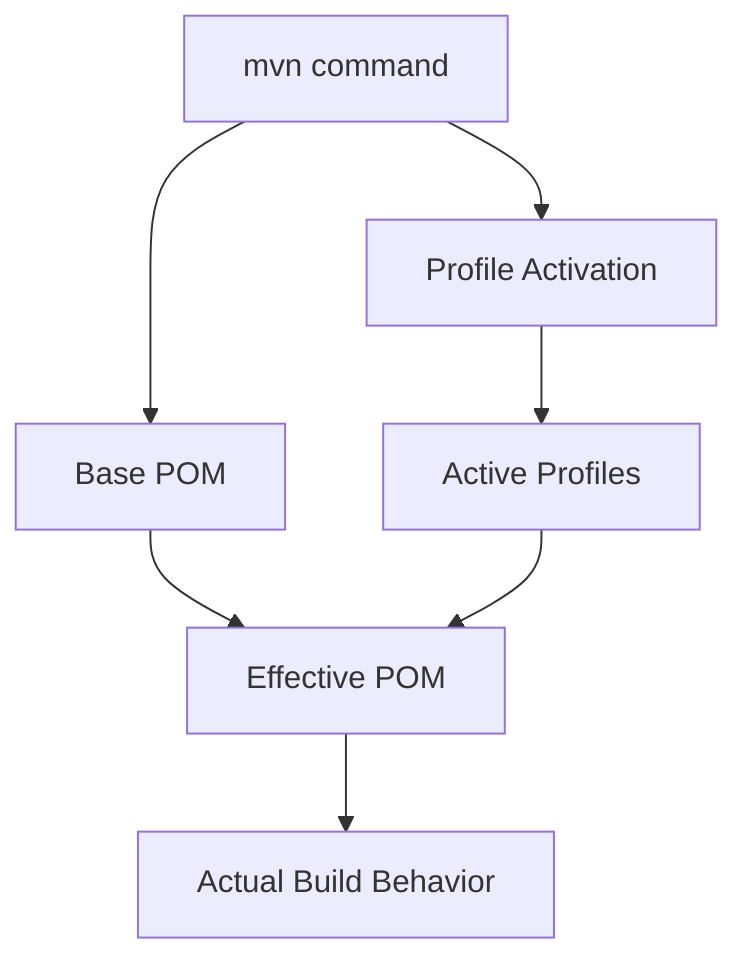
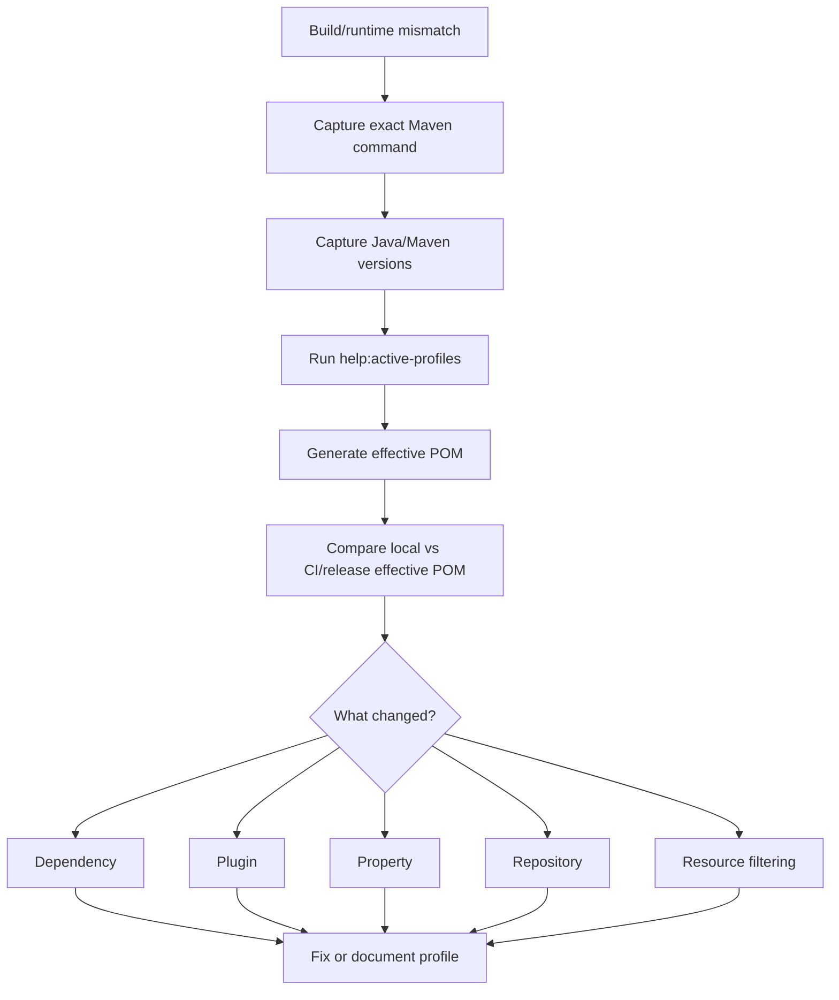

# Maven Profiles and Environment Build

## 1. Core Idea

Maven profile adalah mekanisme untuk mengubah build berdasarkan konteks tertentu.

Profile bisa mengaktifkan atau mengubah:

- dependency,
- plugin,
- plugin execution,
- property,
- repository,
- resource filtering,
- test behavior,
- packaging behavior,
- release behavior,
- environment-specific build behavior.

Mental model:



Profile bukan sekadar shortcut. Profile mengubah effective POM.

Senior engineer harus berhati-hati karena profile dapat menciptakan hidden build difference:

- local build berbeda dari CI,
- CI build berbeda dari release,
- developer A berbeda dari developer B,
- Linux build berbeda dari macOS/Windows,
- Java 17 build berbeda dari Java 21,
- branch build berbeda dari tag build,
- module tertentu aktif/skip tanpa terlihat jelas.

---

## 2. Why Maven Profiles Exist

Profile ada karena satu project kadang perlu variasi build.

Use case yang valid:

- menjalankan integration test hanya saat diminta,
- mengaktifkan security scan di CI,
- mengaktifkan release signing saat release,
- memakai repository internal tertentu,
- membedakan local development helper dari production artifact,
- mengaktifkan generated code step tertentu,
- membedakan packaging JAR/WAR/image jika memang diperlukan,
- mengatur testcontainers atau external integration environment,
- membuat build cloud/container-specific.

Namun profile sering disalahgunakan untuk:

- menyembunyikan environment-specific behavior,
- membuat artifact berbeda untuk environment berbeda,
- mengganti dependency runtime berdasarkan environment,
- bypass test/check,
- memperbaiki masalah lokal tanpa memperbaiki root cause,
- mengganti config aplikasi yang seharusnya runtime config,
- mencampur build-time dan deploy-time concern.

Senior rule:

> Profile boleh mengubah cara build diverifikasi atau dipackage, tetapi harus sangat hati-hati jika profile mengubah behavior artifact runtime.

---

## 3. Basic Profile Structure

Contoh profile sederhana:

```xml
<profiles>
  <profile>
    <id>ci</id>
    <properties>
      <skip.integration.tests>false</skip.integration.tests>
    </properties>
  </profile>
</profiles>
```

Aktivasi manual:

```bash
mvn -Pci verify
```

Multiple profiles:

```bash
mvn -Pci,security verify
```

Deactivate profile:

```bash
mvn -P!local verify
```

Pada beberapa shell, `!` perlu di-escape atau di-quote.

```bash
mvn -P'!local' verify
```

---

## 4. Profile Can Change Many Things

Profile bisa mengubah banyak bagian POM.

Contoh dependency hanya untuk profile:

```xml
<profile>
  <id>it</id>
  <dependencies>
    <dependency>
      <groupId>org.testcontainers</groupId>
      <artifactId>postgresql</artifactId>
      <version>${testcontainers.version}</version>
      <scope>test</scope>
    </dependency>
  </dependencies>
</profile>
```

Contoh plugin execution hanya untuk profile:

```xml
<profile>
  <id>coverage</id>
  <build>
    <plugins>
      <plugin>
        <groupId>org.jacoco</groupId>
        <artifactId>jacoco-maven-plugin</artifactId>
        <executions>
          <execution>
            <goals>
              <goal>prepare-agent</goal>
              <goal>report</goal>
            </goals>
          </execution>
        </executions>
      </plugin>
    </plugins>
  </build>
</profile>
```

Contoh property:

```xml
<profile>
  <id>release</id>
  <properties>
    <maven.test.skip>false</maven.test.skip>
    <gpg.skip>false</gpg.skip>
  </properties>
</profile>
```

Karena profile dapat mengubah banyak hal, effective POM wajib dicek saat debugging.

---

## 5. Profile Activation Types

Profile bisa aktif karena beberapa mekanisme.

### Explicit Activation

```bash
mvn -Pci verify
```

Paling jelas dan paling mudah diaudit.

### Active by Default

```xml
<activation>
  <activeByDefault>true</activeByDefault>
</activation>
```

Berbahaya jika banyak profile karena profile default dapat nonaktif saat profile lain diaktifkan.

### Activation by Property

```xml
<activation>
  <property>
    <name>runITs</name>
    <value>true</value>
  </property>
</activation>
```

Command:

```bash
mvn -DrunITs=true verify
```

### Activation by JDK

```xml
<activation>
  <jdk>[17,)</jdk>
</activation>
```

Risk: build berubah saat developer/CI mengganti JDK.

### Activation by OS

```xml
<activation>
  <os>
    <family>unix</family>
  </os>
</activation>
```

Risk: local macOS/Linux/Windows berbeda.

### Activation by File

```xml
<activation>
  <file>
    <exists>.enable-local-profile</exists>
  </file>
</activation>
```

Risk: invisible local state.

---

## 6. Active Profiles Debugging

Gunakan command berikut:

```bash
mvn help:active-profiles
```

Untuk melihat effective POM:

```bash
mvn help:effective-pom > effective-pom.xml
```

Untuk profile tertentu:

```bash
mvn -Pci help:effective-pom > effective-pom-ci.xml
mvn -Pci,security help:effective-pom > effective-pom-ci-security.xml
```

Bandingkan:

```bash
diff -u effective-pom.xml effective-pom-ci.xml | less
```

Untuk melihat property efektif:

```bash
mvn help:effective-settings
```

Debug senior workflow:

1. Reproduce command yang gagal.
2. Cek active profiles.
3. Generate effective POM dengan profile yang sama.
4. Cek plugin/dependency/property yang berubah.
5. Bandingkan dengan local/CI/release command.
6. Baru ubah POM atau pipeline.

---

## 7. Property and Profile Interaction

Maven property bisa berasal dari:

- POM properties,
- parent POM,
- profile properties,
- command-line `-D`,
- settings.xml,
- environment variable via `${env.NAME}`,
- plugin default.

Command-line property sering menang dalam praktik troubleshooting:

```bash
mvn -DskipTests verify
```

Tapi ini bisa membuat command tidak representatif.

### Common Dangerous Properties

```bash
-DskipTests
-Dmaven.test.skip=true
-DskipITs
-Dcheckstyle.skip=true
-Dspotless.check.skip=true
-Denforcer.skip=true
-Ddependency-check.skip=true
```

Senior concern:

> Skip flag boleh dipakai untuk eksperimen lokal cepat, tetapi tidak boleh menjadi default workflow yang melewati quality gate tanpa alasan jelas.

### `-DskipTests` vs `-Dmaven.test.skip=true`

- `-DskipTests` biasanya skip eksekusi test, tetapi test source masih bisa dikompilasi.
- `-Dmaven.test.skip=true` dapat skip compile test juga.

Yang kedua lebih berisiko karena compile error di test tidak terlihat.

---

## 8. Local Profile

Local profile sering dipakai untuk developer convenience.

Contoh use case valid:

- default local port,
- local generated config untuk test,
- local testcontainers switch,
- local mock service endpoint untuk integration test,
- skip expensive non-critical report saat local.

Namun local profile berbahaya jika:

- artifact local berbeda dari CI artifact,
- dependency runtime lokal berbeda,
- test lokal melewati validation penting,
- local config masuk artifact,
- profile aktif otomatis berdasarkan file lokal,
- command dokumentasi tidak menyebut profile yang wajib.

### Better Pattern

Dokumentasikan command eksplisit:

```bash
mvn -Plocal verify
```

Daripada magic activation yang sulit terlihat.

### Review Question

> Apakah developer baru bisa tahu profile ini aktif dan efeknya apa hanya dari README/POM?

Jika tidak, profile menciptakan hidden behavior.

---

## 9. CI Profile

CI profile biasanya dipakai untuk quality gate yang lebih lengkap.

Contoh:

```bash
mvn -Pci verify
```

CI profile dapat mengaktifkan:

- strict enforcer,
- coverage report,
- static analysis,
- integration tests,
- dependency scan,
- license check,
- fail-on-warning behavior,
- reproducibility check.

### Good CI Profile Properties

CI profile harus:

- eksplisit,
- documented,
- reproducible locally,
- tidak bergantung pada invisible runner state,
- tidak membutuhkan secret untuk PR validation kecuali step tertentu,
- menghasilkan report sebagai artifact,
- konsisten dengan release validation.

### Failure Mode

- CI profile tidak bisa dijalankan lokal,
- CI profile terlalu lambat sehingga developer mengabaikannya,
- CI profile mengaktifkan plugin tanpa version pinning,
- CI-only dependency tidak tersedia local,
- CI profile memakai environment variable rahasia untuk build biasa,
- PR dari fork gagal karena secret tidak tersedia.

---

## 10. Test Profile

Test profile mengontrol scope test.

Common split:

- unit test: default `mvn test`,
- integration test: `mvn -Pit verify`,
- contract test: `mvn -Pcontract verify`,
- smoke test: `mvn -Psmoke verify`,
- performance test: biasanya tidak di default Maven lifecycle.

Example:

```xml
<profile>
  <id>it</id>
  <properties>
    <skipITs>false</skipITs>
  </properties>
  <build>
    <plugins>
      <plugin>
        <groupId>org.apache.maven.plugins</groupId>
        <artifactId>maven-failsafe-plugin</artifactId>
        <executions>
          <execution>
            <goals>
              <goal>integration-test</goal>
              <goal>verify</goal>
            </goals>
          </execution>
        </executions>
      </plugin>
    </plugins>
  </build>
</profile>
```

### Senior Concern

Test profiles harus menjawab:

- test apa yang jalan,
- dependency eksternal apa yang dibutuhkan,
- berapa lama kira-kira,
- apakah aman untuk PR,
- apakah butuh Docker/Testcontainers,
- apakah butuh credential,
- apakah failure menghasilkan report.

---

## 11. Integration Test Profile

Integration test profile sering butuh PostgreSQL, Kafka, RabbitMQ, Redis, HTTP mock, atau Docker/Testcontainers.

Untuk Java/JAX-RS service, integration test bisa mencakup:

- REST resource behavior,
- persistence integration,
- transaction boundary,
- message publishing/consuming,
- cache behavior,
- external service client behavior,
- schema migration compatibility.

### Environment Concern

Integration test profile harus jelas apakah menggunakan:

- Testcontainers,
- Docker Compose,
- shared dev environment,
- in-memory substitute,
- mocked service,
- real cloud dependency.

Semakin dekat ke real dependency, semakin tinggi fidelity, tetapi semakin tinggi cost/flakiness.

### Failure Mode

- port conflict,
- Docker daemon tidak jalan,
- container image tidak bisa ditarik,
- test bergantung pada network external,
- Kafka/RabbitMQ startup race,
- Redis state bocor antar test,
- database schema tidak bersih,
- timezone/locale mismatch.

### Debug Command

```bash
mvn -Pit verify
mvn -Pit -Dtestcontainers.reuse.enable=true verify
mvn -Pit -Dit.test=QuoteOrderFlowIT verify
```

Verifikasi property aktual di tim sebelum menggunakan command reuse atau property spesifik.

---

## 12. Release Profile

Release profile harus diperlakukan sebagai high-risk build path.

Release profile mungkin mengaktifkan:

- source/javadoc artifact,
- signing,
- changelog generation,
- SBOM generation,
- license report,
- vulnerability scan,
- artifact deploy,
- Docker image publish,
- release metadata stamping.

Example concept:

```bash
mvn -Prelease verify
mvn -Prelease deploy
```

### Senior Concerns

- Apakah release profile membangun artifact yang sama dengan artifact yang dites?
- Apakah release profile menambah file ke artifact?
- Apakah version/tag/commit tercatat?
- Apakah signing key hanya tersedia di protected environment?
- Apakah release profile bisa dijalankan dari branch biasa?
- Apakah deploy step terpisah dari verify step?

### Failure Mode

- release artifact berbeda dari CI artifact,
- signing gagal karena secret missing,
- deploy ke repository salah,
- release profile skip test secara tidak sengaja,
- generated metadata tidak deterministic,
- version bump tidak sinkron dengan Git tag.

---

## 13. Security Profile

Security profile dapat mengaktifkan:

- dependency vulnerability scan,
- license scan,
- secret scan helper,
- SBOM generation,
- banned dependency rules,
- duplicate class check,
- dependency convergence enforcement.

Example:

```bash
mvn -Psecurity verify
```

### Good Practice

Security profile sebaiknya:

- bisa dijalankan di CI,
- punya local reproduction path,
- menghasilkan report,
- tidak membutuhkan secret untuk scanning dependency biasa,
- punya severity threshold yang jelas,
- punya suppression policy yang auditable.

### Failure Mode

- false positive tidak dikelola,
- suppression tanpa expiry/reason,
- scan hanya jalan saat release terlambat,
- CVE triage tidak punya owner,
- dependency scan tidak melihat shaded/transitive risk,
- SBOM berbeda dari artifact final.

---

## 14. Native or Container Profile If Relevant

Beberapa project memiliki profile untuk container atau native build.

Contoh use case:

- build image,
- generate container metadata,
- set classifier artifact,
- GraalVM native image,
- platform-specific packaging,
- build with different resource set.

Senior caution:

> Container/native profile sering mengubah artifact atau runtime assumptions. Treat it as release-impacting.

Review questions:

- Apakah profile ini menghasilkan artifact berbeda?
- Apakah profile ini dipakai CI atau hanya local?
- Apakah runtime dependency berbeda?
- Apakah image build traceable ke Maven artifact?
- Apakah profile ini documented di release guide?
- Apakah ada fallback/rollback path?

Internal verification wajib karena tidak semua tim menggunakan native/container profile dalam Maven. Bisa saja image build dilakukan via Dockerfile/GitHub Actions/kaniko/buildkit/GitOps pipeline, bukan Maven.

---

## 15. Environment-Specific Build Is Usually a Smell

Build artifact idealnya environment-agnostic.

Bad pattern:

```bash
mvn -Pdev package
mvn -Pstaging package
mvn -Pprod package
```

Jika profile menghasilkan artifact berbeda untuk dev/staging/prod, maka ada risiko:

- artifact yang dites bukan artifact yang dirilis,
- prod artifact sulit direproduce,
- config environment masuk artifact,
- rollback lebih rumit,
- audit trail melemah,
- secret bisa ter-package,
- behavior antar environment berbeda tanpa kontrol deployment.

Better pattern:

- build once,
- package once,
- promote same artifact,
- inject environment config at deploy/runtime,
- use Kubernetes ConfigMap/Secret or platform config,
- use feature flags for behavior rollout,
- keep Maven profile for validation/packaging, not runtime environment behavior.

Senior rule:

> Build-time profile should not replace runtime configuration management.

---

## 16. Config Precedence and Maven Filtering

Maven resource filtering dapat mengganti placeholder di resource.

Example:

```xml
<resources>
  <resource>
    <directory>src/main/resources</directory>
    <filtering>true</filtering>
  </resource>
</resources>
```

Risk:

- secret masuk artifact,
- environment-specific value baked into artifact,
- local value accidentally released,
- resource changes invisible in source,
- artifact differs by profile,
- binary/resource filtering merusak file.

### Safer Pattern

Gunakan filtering untuk metadata build yang aman, seperti:

- application version,
- commit hash,
- build timestamp jika memang diperlukan dan reproducibility impact diterima,
- artifact name.

Hindari filtering untuk:

- password,
- token,
- endpoint production rahasia,
- tenant-specific config,
- environment-specific operational value.

Untuk runtime config, gunakan mekanisme aplikasi/platform.

---

## 17. Profiles and Multi-Module Builds

Dalam multi-module project, profile bisa aktif di parent, child, atau module tertentu.

Risk:

- profile aktif di module A tapi tidak di module B,
- plugin execution inherited ke semua module padahal hanya root,
- dependency test hanya ada di satu module,
- partial build tidak menjalankan profile yang sama,
- CI command dari root berbeda dari developer command di module.

Debug:

```bash
mvn help:active-profiles
mvn -pl module-a help:active-profiles
mvn -Pci -pl module-a help:effective-pom
mvn -Pci -pl module-a -am verify
```

Senior review:

- Apakah profile didefinisikan di parent atau child?
- Apakah inheritance disengaja?
- Apakah profile root-only?
- Apakah plugin execution harus aggregator-only?
- Apakah partial build tetap valid?

---

## 18. Profiles and Repository Resolution

Profile dapat mengubah repository.

Example:

```xml
<profile>
  <id>internal-repo</id>
  <repositories>
    <repository>
      <id>company-releases</id>
      <url>https://repo.example.invalid/releases</url>
    </repository>
  </repositories>
</profile>
```

Repository profile berisiko karena dependency resolution berubah berdasarkan profile.

Concerns:

- dependency resolve lokal tapi gagal CI,
- CI resolve dari mirror internal tapi local dari public repository,
- artifact dengan coordinates sama berbeda repository,
- snapshot update behavior berbeda,
- credential missing,
- repository order memengaruhi resolution.

Enterprise biasanya mengatur repository melalui:

- internal mirror,
- `settings.xml`,
- artifact repository manager,
- parent POM policy.

Internal verification wajib. Jangan menebak repository CSG/team.

---

## 19. Profiles in settings.xml

Profile tidak hanya ada di POM. Bisa juga ada di Maven `settings.xml`.

Lokasi umum:

```bash
~/.m2/settings.xml
```

Dan global Maven settings.

`settings.xml` bisa berisi:

- server credential,
- mirrors,
- repositories,
- plugin repositories,
- profiles,
- activeProfiles.

Risk:

- build sukses hanya di mesin tertentu,
- credential/repository tersembunyi,
- active profile tidak terlihat di repository,
- developer baru gagal build,
- CI menggunakan settings berbeda.

Debug:

```bash
mvn help:effective-settings
mvn help:active-profiles
```

Senior rule:

> Jika build membutuhkan settings.xml tertentu, dokumentasikan minimal contract-nya tanpa membocorkan secret.

---

## 20. Hidden Build Difference

Hidden build difference terjadi ketika command yang terlihat sama menghasilkan behavior berbeda.

Examples:

```bash
mvn verify
```

bisa berbeda karena:

- activeByDefault profile,
- local `settings.xml`,
- JDK activation,
- OS activation,
- env var,
- file activation,
- Maven version,
- parent POM snapshot,
- local repository cache,
- command alias/wrapper,
- CI injected property.

Symptoms:

- "works on my machine",
- CI-only failure,
- release-only failure,
- dependency resolved differently,
- tests skipped unexpectedly,
- plugin runs locally but not CI,
- artifact checksum differs.

Senior response:

1. Capture exact command.
2. Capture `mvn -version`.
3. Capture `java -version`.
4. Capture active profiles.
5. Capture effective POM.
6. Capture effective settings carefully without exposing secrets.
7. Compare environment.

---

## 21. CI vs Local Mismatch

CI/local mismatch adalah salah satu profile-related failure paling umum.

Common causes:

- CI runs `mvn -Pci verify`, local runs `mvn test`,
- CI uses different Java/Maven version,
- CI has different settings.xml,
- CI activates profile via env var,
- CI has no Docker daemon,
- local has cached snapshot,
- CI has stricter enforcer rule,
- CI has timezone/locale difference,
- CI has read-only filesystem behavior,
- CI lacks credential for private repo.

### Better Documentation

README should provide:

```bash
# Fast local unit test
./mvnw test

# CI-equivalent validation
./mvnw -Pci verify

# Integration tests
./mvnw -Pit verify

# Security scan if available
./mvnw -Psecurity verify
```

Actual command names/profiles must be verified internally.

---

## 22. Profile Misuse Patterns

### Misuse 1: Environment-Specific Runtime Dependency

```xml
<profile>
  <id>prod</id>
  <dependencies>
    <dependency>...</dependency>
  </dependencies>
</profile>
```

Risk: prod artifact differs from tested artifact.

### Misuse 2: Default Skip Tests

```xml
<properties>
  <skipTests>true</skipTests>
</properties>
```

Risk: test gate silently disappears.

### Misuse 3: File-Based Local Magic

```xml
<exists>/Users/someone/local.flag</exists>
```

Risk: non-reproducible build.

### Misuse 4: Profile as Secret Injection

Risk: secrets enter effective POM, logs, resource files, or artifacts.

### Misuse 5: Profile Explosion

Too many profiles:

- `local`, `dev`, `qa`, `sit`, `uat`, `staging`, `prod`, `ci`, `release`, `docker`, `security`, `fast`, `full`, `legacy`, `new`.

Risk: nobody knows valid combinations.

Senior fix:

- reduce profile count,
- document valid combinations,
- move runtime config out of build,
- keep CI/release paths explicit,
- add enforcer/validation if needed.

---

## 23. Profile Combination Matrix

If profiles must combine, document the matrix.

Example:

| Command | Purpose | Expected Use |
|---|---|---|
| `./mvnw test` | Fast unit test | Local development |
| `./mvnw -Pit verify` | Integration test | Before PR / debugging |
| `./mvnw -Pci verify` | CI-equivalent validation | Before pushing risky changes |
| `./mvnw -Psecurity verify` | Dependency/security checks | Dependency upgrades |
| `./mvnw -Prelease deploy` | Release publishing | Protected CI only |

Avoid undocumented combinations like:

```bash
mvn -Pprod,fast,skip-it,legacy deploy
```

If a combination exists, it needs an owner and purpose.

---

## 24. Profiles and Secrets

Secrets should not be baked into Maven build artifacts.

Risky patterns:

```xml
<property>
  <db.password>${env.DB_PASSWORD}</db.password>
</property>
```

combined with resource filtering or plugin logging.

Potential leak paths:

- effective POM output,
- build logs,
- generated resources,
- packaged artifact,
- test report,
- Docker image layer,
- shell history,
- CI artifact.

Safer principles:

- keep secrets in CI secret store or runtime secret manager,
- pass secrets only to steps that need them,
- do not print effective settings with secrets in public logs,
- do not filter secrets into resources,
- avoid using Maven profile as secret management.

---

## 25. Profiles and Release Traceability

Release traceability requires knowing:

- Git commit,
- Git tag,
- Maven version,
- active profiles,
- plugin versions,
- dependency versions,
- CI run,
- artifact checksum,
- image digest,
- deployment environment.

If release uses profile:

```bash
mvn -Prelease deploy
```

then release record should include that profile.

Failure mode:

- artifact built with `-Prelease` but tested with `-Pci`,
- `release` profile disables a check unintentionally,
- release profile changes resource filtering,
- release profile uses different repository,
- release profile generates non-deterministic metadata.

Senior review:

> A release profile must increase rigor, not bypass rigor.

---

## 26. Debugging Profile-Related Failures

Use this decision flow:



Useful command bundle:

```bash
./mvnw -version
java -version
./mvnw help:active-profiles
./mvnw -Pci help:active-profiles
./mvnw -Pci help:effective-pom > effective-pom-ci.xml
./mvnw help:effective-pom > effective-pom-default.xml
diff -u effective-pom-default.xml effective-pom-ci.xml | less
```

For multi-module:

```bash
./mvnw -Pci -pl service-module help:effective-pom > service-effective-pom-ci.xml
```

---

## 27. Impact on Java/JAX-RS Backend

Profiles can affect Java/JAX-RS backend through:

- JAX-RS implementation dependency,
- Jakarta API version,
- servlet container dependency scope,
- test server setup,
- generated OpenAPI/client code,
- resource filtering,
- logging config included in artifact,
- integration test dependencies,
- packaging JAR/WAR,
- annotation processing,
- compiler release level.

Risk examples:

- `javax.*` vs `jakarta.*` dependency activated only in one profile,
- local profile uses in-memory database while CI uses PostgreSQL,
- integration profile skips messaging broker tests,
- release profile packages different config,
- test profile hides JAX-RS provider scanning issue.

Senior rule:

> If profile affects runtime classpath, treat it as architecture-impacting.

---

## 28. Impact on Docker, Kubernetes, AWS, Azure, and GitOps

Maven profile should align with deployment model.

### Docker

Profile may affect:

- artifact packaged into image,
- image build plugin,
- JVM flags metadata,
- resource files in artifact.

### Kubernetes

Runtime config should usually come from:

- ConfigMap,
- Secret,
- environment variable,
- mounted file,
- Helm/Kustomize/GitOps manifest,
- platform config service.

Not from environment-specific Maven build.

### AWS/Azure

Cloud-specific values should generally be deploy/runtime configuration, not baked into Maven artifact.

### GitOps

If GitOps deploys immutable artifact/image, Maven profile should not create per-environment artifact drift.

Senior check:

> Does GitOps promote the same image/artifact across environments, or does Maven rebuild per environment?

Same artifact promotion is usually more traceable.

---

## 29. Profile Review Checklist

Saat mereview perubahan profile, tanyakan:

### Purpose

- Kenapa profile ini perlu?
- Apakah masalahnya bisa diselesaikan dengan runtime config atau CI step saja?
- Siapa pengguna profile ini?
- Apakah profile ini documented?

### Activation

- Bagaimana profile aktif?
- Manual, property, JDK, OS, file, default?
- Apakah activation terlihat jelas?
- Apakah bisa aktif tanpa disadari?

### Build Behavior

- Dependency apa yang berubah?
- Plugin apa yang berubah?
- Property apa yang berubah?
- Repository apa yang berubah?
- Resource filtering apa yang berubah?

### Reproducibility

- Apakah local/CI/release bisa menghasilkan hasil sama?
- Apakah command reproduksi tersedia?
- Apakah active profiles dicatat di CI logs?
- Apakah effective POM bisa dibandingkan?

### Security

- Apakah profile membaca secret?
- Apakah secret bisa masuk log/artifact?
- Apakah profile mengubah repository atau plugin source?
- Apakah profile mengaktifkan publish/deploy?

### Release

- Apakah artifact berubah?
- Apakah profile hanya boleh di protected branch/tag?
- Apakah release profile meningkatkan quality gate?
- Apakah rollback path jelas?

### Productivity

- Apakah profile mempercepat local workflow tanpa menyembunyikan failure penting?
- Apakah nama profile jelas?
- Apakah kombinasi profile terbatas dan documented?

---

## 30. Internal Verification Checklist

Verifikasi di repository dan proses internal sebelum menyimpulkan profile strategy.

### Repository

- Profile apa saja yang ada di root POM?
- Profile apa saja yang ada di child module?
- Apakah ada profile di parent POM internal?
- Apakah ada `activeByDefault`?
- Apakah ada activation by JDK/OS/file/property?

### CI/CD

- Profile apa yang dipakai CI?
- Profile apa yang dipakai release?
- Apakah CI mencetak active profiles?
- Apakah local reproduction command tersedia?
- Apakah profile security/release hanya berjalan di protected context?

### Dependency and Plugin

- Dependency apa yang hanya aktif di profile tertentu?
- Plugin execution apa yang hanya aktif di profile tertentu?
- Apakah profile mengubah repository?
- Apakah profile mengubah resource filtering?
- Apakah profile mengubah packaging artifact?

### Runtime and Deployment

- Apakah ada `dev/staging/prod` Maven profile?
- Apakah artifact berbeda per environment?
- Apakah runtime config dikelola oleh Kubernetes/GitOps/platform?
- Apakah secret pernah masuk Maven property/resource?
- Apakah Docker image dibangun dengan profile tertentu?

### Documentation

- Apakah README menjelaskan profile yang valid?
- Apakah release guide menjelaskan release profile?
- Apakah troubleshooting guide menjelaskan CI/local mismatch?
- Apakah onboarding guide menyebut required settings.xml?
- Apakah profile lama/deprecated masih ada?

---

## 31. Practical Senior Heuristics

1. **Prefer explicit profile activation.** Magic activation creates hidden behavior.
2. **Build once, promote same artifact.** Avoid `dev/staging/prod` build artifacts unless justified.
3. **Use profiles for verification modes, not secret management.** Secrets belong in runtime/CI secret systems.
4. **Document every non-obvious profile.** Name, purpose, command, owner, and risk.
5. **Compare effective POMs.** Profile debugging without effective POM is guesswork.
6. **Keep profile combinations small.** Too many combinations mean no one knows what is valid.
7. **Release profile should be stricter, not weaker.** It should not skip quality gates.
8. **CI profile must be reproducible locally.** Even if slower, it must be diagnosable.
9. **Avoid OS/JDK/file activation unless there is a strong reason.** They are common sources of mismatch.
10. **Treat runtime classpath changes as architecture changes.** Profile dependency changes can change production behavior.

---

## 32. Part Summary

Maven profiles are powerful because they change the effective build.

They are dangerous for the same reason.

For senior backend engineers, the goal is not to avoid profiles entirely, but to use them deliberately:

- explicit activation,
- documented purpose,
- minimal combinations,
- reproducible local/CI behavior,
- no secret leakage,
- no hidden environment-specific artifacts,
- release-safe profile design,
- effective POM based debugging,
- clear ownership.

In Java/JAX-RS enterprise systems, profiles can affect classpath, plugin execution, test strategy, artifact packaging, image creation, and release traceability. Treat profile changes as build architecture changes, not cosmetic POM edits.
