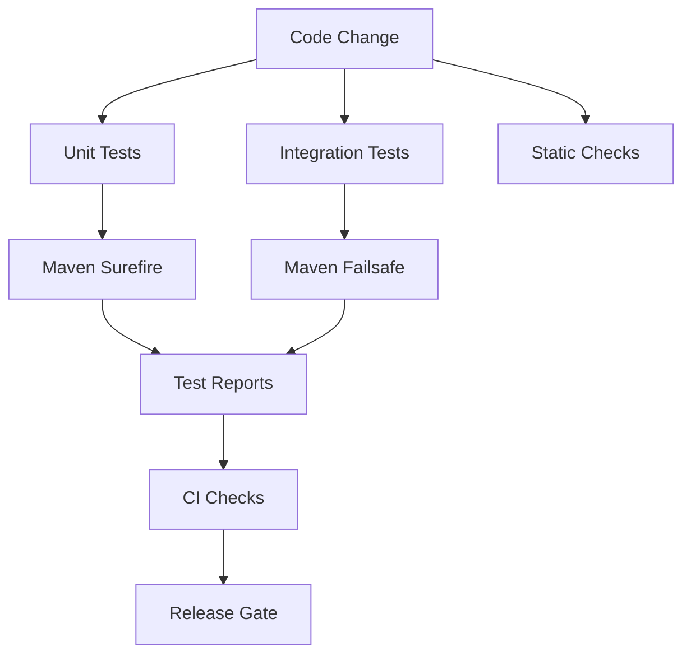
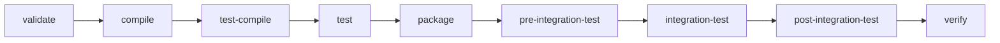

# Maven Testing Strategy

## 1. Core Idea

Testing strategy di Maven bukan hanya pertanyaan "test apa yang dijalankan".

Untuk senior backend engineer, Maven testing strategy adalah kontrak antara:

- correctness aplikasi,
- feedback speed developer,
- confidence CI,
- reproducibility build,
- release safety,
- dependency integration,
- database/message broker behavior,
- containerized environment,
- dan production support readiness.

Mental model:



Testing strategy yang buruk biasanya terlihat seperti ini:

- semua test dicampur dalam satu phase,
- integration test berjalan kadang-kadang tanpa naming convention,
- test butuh service eksternal yang tidak jelas,
- CI berbeda dari local,
- flaky test dianggap normal,
- skip test menjadi kebiasaan,
- test report tidak dibaca,
- coverage diperlakukan sebagai angka kosmetik,
- test lambat tanpa segmentasi.

Testing strategy yang baik memisahkan concern:

- unit test cepat dan deterministic,
- integration test eksplisit dan isolated,
- contract/API test menjaga compatibility,
- database/broker test punya lifecycle jelas,
- report mudah dibaca di CI,
- failure mudah direproduksi secara lokal,
- release tidak bergantung pada asumsi manual.

---

## 2. Why Maven Testing Strategy Matters for Java/JAX-RS Services

Java/JAX-RS backend biasanya punya banyak integration surface:

- HTTP endpoint,
- request/response DTO,
- validation,
- authentication/authorization,
- persistence layer,
- transaction boundary,
- PostgreSQL schema/query,
- Kafka/RabbitMQ producer-consumer,
- Redis cache,
- external API client,
- configuration profile,
- container image,
- Kubernetes deployment config.

Unit test saja tidak cukup.

Namun integration test tanpa discipline juga berbahaya karena bisa:

- lambat,
- flaky,
- sulit dijalankan local,
- bergantung pada shared environment,
- gagal karena network/data race,
- membuat developer sering skip test,
- membuat CI mahal dan tidak dipercaya.

Senior rule:

> Test suite harus memberi confidence yang sepadan dengan cost-nya. Test yang lambat, flaky, dan tidak reproducible menurunkan quality karena orang akan menghindarinya.

---

## 3. Maven Test Lifecycle

Maven default lifecycle punya beberapa phase penting untuk testing:

```bash
mvn test
mvn verify
```

Secara umum:

- `test` menjalankan unit test melalui Surefire.
- `verify` menjalankan seluruh verification lifecycle, termasuk integration test melalui Failsafe jika dikonfigurasi.

Simplified lifecycle:



Kenapa `verify` penting?

Karena Failsafe biasanya melakukan dua step:

1. menjalankan integration test pada phase `integration-test`,
2. mengevaluasi hasilnya pada phase `verify`.

Jika hanya menjalankan phase `integration-test`, cleanup atau failure evaluation bisa tidak berjalan sesuai harapan.

Command yang lebih aman untuk full verification:

```bash
mvn clean verify
```

Untuk CI release gate, `verify` biasanya lebih tepat daripada hanya `test`.

---

## 4. Surefire vs Failsafe

Maven punya dua plugin testing utama:

| Plugin | Fungsi utama | Phase umum | Test type |
|---|---|---|---|
| `maven-surefire-plugin` | menjalankan unit test | `test` | cepat, isolated |
| `maven-failsafe-plugin` | menjalankan integration test | `integration-test` + `verify` | external/container/integration |

Naming convention default yang umum:

Surefire:

- `*Test.java`
- `Test*.java`
- `*Tests.java`
- `*TestCase.java`

Failsafe:

- `*IT.java`
- `*ITCase.java`

Contoh struktur:

```text
src/test/java/
  com/example/quote/PricingServiceTest.java
  com/example/quote/QuoteRepositoryIT.java
```

Prinsip penting:

- unit test tidak boleh diam-diam membutuhkan PostgreSQL/Kafka/Redis external,
- integration test harus terlihat dari nama/class/path/profile,
- CI harus jelas kapan unit test saja dan kapan full verification.

---

## 5. Basic Surefire Configuration

Contoh konfigurasi eksplisit:

```xml
<plugin>
  <groupId>org.apache.maven.plugins</groupId>
  <artifactId>maven-surefire-plugin</artifactId>
  <version>${maven-surefire-plugin.version}</version>
  <configuration>
    <useModulePath>false</useModulePath>
    <includes>
      <include>**/*Test.java</include>
      <include>**/*Tests.java</include>
    </includes>
  </configuration>
</plugin>
```

Hal yang perlu direview:

- versi plugin dipin,
- include/exclude pattern jelas,
- parallel execution disengaja,
- JVM argLine tidak override JaCoCo,
- test report tidak dimatikan,
- skip property tidak disalahgunakan.

Command umum:

```bash
mvn test
```

Menjalankan satu test class:

```bash
mvn -Dtest=PricingServiceTest test
```

Menjalankan satu method:

```bash
mvn -Dtest=PricingServiceTest#calculatesRecurringCharge test
```

---

## 6. Basic Failsafe Configuration

Contoh konfigurasi Failsafe:

```xml
<plugin>
  <groupId>org.apache.maven.plugins</groupId>
  <artifactId>maven-failsafe-plugin</artifactId>
  <version>${maven-failsafe-plugin.version}</version>
  <executions>
    <execution>
      <goals>
        <goal>integration-test</goal>
        <goal>verify</goal>
      </goals>
    </execution>
  </executions>
  <configuration>
    <includes>
      <include>**/*IT.java</include>
      <include>**/*ITCase.java</include>
    </includes>
  </configuration>
</plugin>
```

Command full integration verification:

```bash
mvn verify
```

Menjalankan satu integration test:

```bash
mvn -Dit.test=QuoteRepositoryIT verify
```

Menjalankan satu method integration test:

```bash
mvn -Dit.test=QuoteRepositoryIT#persistsQuoteWithItems verify
```

Anti-pattern:

```bash
mvn integration-test
```

Ini sering tidak ideal karena phase `verify` bisa terlewat.

---

## 7. Test Naming Convention

Naming convention bukan kosmetik. Naming convention menentukan:

- plugin mana yang menjalankan test,
- phase mana yang menjalankan test,
- apakah test masuk CI cepat atau full CI,
- apakah developer bisa memilih test dengan akurat,
- apakah test report mudah dibaca.

Rekomendasi umum:

| Test type | Naming | Tool |
|---|---|---|
| Unit test | `SomethingTest` | Surefire |
| Integration test | `SomethingIT` | Failsafe |
| Contract test | `SomethingContractTest` atau profile khusus | Surefire/Failsafe sesuai design |
| End-to-end test | `SomethingE2EIT` | Failsafe atau pipeline terpisah |

Untuk Java/JAX-RS service:

```text
QuoteResourceTest       -> unit-ish resource test with mocked dependencies
QuoteResourceIT         -> HTTP-level integration test
QuoteRepositoryIT       -> PostgreSQL integration test
QuoteEventPublisherIT   -> Kafka/RabbitMQ integration test
```

Senior review question:

> Dari nama test saja, apakah kita tahu cost, dependency, dan Maven phase test ini?

---

## 8. Unit Test Strategy

Unit test harus cepat, deterministic, dan isolated.

Cocok untuk:

- domain rule,
- pricing calculation,
- validation logic,
- mapper kecil,
- state transition,
- error handling branch,
- idempotency logic,
- retry/backoff decision,
- authorization decision pure function,
- API input validation rule tanpa server penuh.

Tidak cocok untuk:

- real database query,
- real Kafka/RabbitMQ roundtrip,
- real Redis behavior,
- real HTTP server behavior,
- Kubernetes/cloud behavior.

Command:

```bash
mvn test
```

Expected property:

- bisa dijalankan sering,
- tidak perlu network,
- tidak perlu Docker,
- tidak perlu secret,
- tidak tergantung waktu real tanpa kontrol,
- tidak tergantung test order.

Failure mode unit test:

- hidden dependency ke timezone/locale,
- random/clock tidak dikontrol,
- static mutable state bocor antar test,
- mock terlalu banyak sampai test tidak menguji behavior nyata,
- test hanya mengunci implementation detail,
- assertion terlalu lemah.

---

## 9. Integration Test Strategy

Integration test menguji boundary antar komponen nyata.

Untuk backend Java/JAX-RS, integration test biasanya mencakup:

- HTTP request ke resource endpoint,
- serialization/deserialization JSON,
- validation error shape,
- database transaction,
- repository query,
- migration compatibility,
- Kafka/RabbitMQ publish/consume,
- Redis cache behavior,
- external client contract melalui stub/mock server,
- security filter chain,
- config binding.

Integration test harus menjawab:

- dependency eksternal apa yang dibutuhkan?
- siapa yang membuat dependency itu?
- siapa yang membersihkan dependency itu?
- apakah test bisa berjalan parallel?
- apakah test bisa berjalan local dan CI?
- apakah failure memberi evidence yang cukup?

Command:

```bash
mvn verify
```

Dengan profile jika tim memisahkan integration test:

```bash
mvn -Pit verify
```

Internal detail seperti nama profile harus diverifikasi di repo/team.

---

## 10. Testcontainers Awareness

Testcontainers sering digunakan untuk integration test yang butuh dependency nyata:

- PostgreSQL,
- Kafka,
- RabbitMQ,
- Redis,
- LocalStack,
- WireMock/stub service,
- custom container.

Manfaat:

- local dan CI lebih konsisten,
- tidak bergantung shared database,
- test data isolated,
- version dependency eksplisit,
- reproducibility meningkat.

Trade-off:

- butuh Docker,
- startup lebih lambat,
- CI runner harus support container,
- image pull bisa lambat/flaky,
- parallel test bisa berat,
- network/DNS dalam container bisa membingungkan.

Failure mode:

- Docker daemon tidak jalan,
- image tidak bisa di-pull,
- port conflict jika salah konfigurasi,
- container belum ready tapi test sudah mulai,
- reuse container mencemari state,
- test terlalu banyak start container baru.

Review checklist:

- image version dipin,
- readiness strategy jelas,
- data cleanup jelas,
- secret tidak hardcoded,
- CI support Docker mode yang digunakan,
- log container bisa diakses saat failure.

---

## 11. Test Data Discipline

Test data adalah sumber flaky test yang sering diremehkan.

Masalah umum:

- test bergantung pada urutan eksekusi,
- test menggunakan ID hardcoded yang sama,
- cleanup tidak berjalan saat failure,
- database sequence tidak reset,
- shared schema dipakai banyak test,
- test data terlalu mirip production data sensitif,
- message broker queue/topic tidak dibersihkan,
- cache Redis bocor antar test.

Prinsip:

- setiap test harus punya data ownership,
- data harus bisa dibangun ulang,
- cleanup harus reliable,
- parallel execution harus dipikirkan,
- test tidak boleh bergantung pada sisa state test lain.

Pattern:

```text
Arrange -> Act -> Assert -> Cleanup
```

Untuk integration test yang memakai database:

- gunakan transaction rollback jika cocok,
- gunakan schema/container isolated jika perlu,
- gunakan unique test prefix,
- hindari shared mutable fixture global,
- simpan seed minimal.

---

## 12. Test Filtering

Test filtering penting untuk productivity.

Unit test class:

```bash
mvn -Dtest=PricingServiceTest test
```

Unit test method:

```bash
mvn -Dtest=PricingServiceTest#calculatesDiscount test
```

Multiple unit tests:

```bash
mvn -Dtest=PricingServiceTest,QuoteValidatorTest test
```

Integration test class:

```bash
mvn -Dit.test=QuoteRepositoryIT verify
```

Skip unit tests but compile tests:

```bash
mvn -DskipTests package
```

Skip compiling/running tests:

```bash
mvn -Dmaven.test.skip=true package
```

Senior warning:

> `-DskipTests` dan `-Dmaven.test.skip=true` bukan interchangeable. Yang kedua lebih berbahaya karena test source tidak dikompilasi.

Use case valid skip:

- local packaging cepat untuk eksperimen,
- debug Dockerfile build tertentu,
- pipeline stage yang sudah menjalankan test sebelumnya,
- emergency hotfix dengan approval jelas.

Use case buruk:

- menghindari flaky test tanpa RCA,
- release artifact tanpa verification,
- menyembunyikan failing test dari reviewer.

---

## 13. Parallel Test Execution

Parallel test bisa mempercepat build, tetapi menambah complexity.

Yang perlu dicek:

- apakah test punya shared mutable state?
- apakah database/container bisa menerima parallel access?
- apakah port dialokasikan dinamis?
- apakah test menggunakan static singleton?
- apakah message queue/topic unique per test?
- apakah file temp path unique?
- apakah clock/random/thread pool dikontrol?

Contoh Surefire parallel config harus direview hati-hati:

```xml
<configuration>
  <parallel>classes</parallel>
  <threadCount>4</threadCount>
</configuration>
```

Failure mode parallel:

- test pass sendiri tapi gagal bersama,
- intermittent timeout,
- race condition di static cache,
- port collision,
- shared database row collision,
- file lock conflict.

Senior rule:

> Jangan mengaktifkan parallel test hanya untuk mengejar speed jika test isolation belum matang.

---

## 14. Flaky Test Management

Flaky test adalah test yang hasilnya tidak deterministic untuk input/code yang sama.

Penyebab umum:

- timing assumption,
- async processing tanpa await yang benar,
- dependency eksternal unstable,
- shared state,
- order dependency,
- timezone/locale,
- random data collision,
- network timeout terlalu agresif,
- resource starvation di CI,
- container readiness belum benar.

Cara diagnosis:

```bash
mvn -Dtest=SomeFlakyTest test
```

Loop lokal:

```bash
for i in $(seq 1 50); do
  echo "Run $i"
  mvn -q -Dtest=SomeFlakyTest test || exit 1
done
```

Untuk integration test:

```bash
for i in $(seq 1 20); do
  echo "Run $i"
  mvn -q -Dit.test=SomeFlakyIT verify || exit 1
done
```

Flaky test response yang benar:

- capture logs,
- identify nondeterminism,
- isolate shared state,
- improve await/readiness,
- pin environment,
- quarantine hanya jika perlu dan dengan tracking issue,
- jangan sekadar retry tanpa RCA.

Retry dapat menjadi mitigation sementara, bukan root fix.

---

## 15. Coverage

Coverage berguna sebagai signal, bukan bukti correctness.

JaCoCo umum digunakan untuk Java Maven project.

Coverage bisa menjawab:

- area mana yang tidak tersentuh test,
- apakah critical path punya test minimum,
- apakah PR mengurangi coverage drastis,
- apakah branch error handling diuji.

Coverage tidak membuktikan:

- assertion benar,
- behavior sesuai domain,
- integration boundary aman,
- concurrency aman,
- migration aman,
- rollback aman.

Review coverage dengan pertanyaan:

- Apakah critical domain rule diuji?
- Apakah negative case diuji?
- Apakah API error response diuji?
- Apakah backward compatibility diuji?
- Apakah failure mode dependency diuji?

Anti-pattern:

- mengejar angka coverage dengan test tanpa assertion bermakna,
- menolak PR kecil hanya karena coverage global turun trivial,
- mengabaikan critical untested path karena coverage global tinggi.

---

## 16. Mutation Testing Awareness

Mutation testing mengubah kode secara otomatis untuk melihat apakah test menangkap perubahan behavior.

Tujuan:

- mengukur kekuatan assertion,
- menemukan test yang hanya mengeksekusi kode tanpa memverifikasi behavior,
- meningkatkan confidence domain logic.

Trade-off:

- lebih lambat,
- tidak selalu cocok dijalankan di setiap PR,
- butuh tuning scope,
- bisa menghasilkan noise jika test suite belum mature.

Use case yang baik:

- pricing logic,
- eligibility rule,
- state transition,
- validation,
- idempotency logic,
- financial/charging-related calculation,
- policy decision.

Untuk enterprise backend, mutation testing biasanya lebih cocok sebagai scheduled quality gate atau targeted local analysis, bukan wajib untuk setiap commit kecil.

---

## 17. Test Report and CI Evidence

Test report adalah artifact debugging.

Maven Surefire/Failsafe biasanya menghasilkan report di:

```text
target/surefire-reports/
target/failsafe-reports/
```

Di multi-module repo:

```text
module-a/target/surefire-reports/
module-b/target/failsafe-reports/
```

Saat CI gagal, jangan hanya baca headline.

Baca:

- failing class,
- failing method,
- assertion error,
- stack trace root cause,
- stdout/stderr,
- container logs jika ada,
- timing/timeout,
- module tempat failure terjadi,
- apakah failure pertama menyebabkan cascade failure.

Command lokal untuk mencari failure:

```bash
find . -path '*/target/surefire-reports/*.txt' -print
find . -path '*/target/failsafe-reports/*.txt' -print
```

Cari failure:

```bash
grep -R "FAILURE\|ERROR" ./*/target/surefire-reports ./*/target/failsafe-reports
```

---

## 18. Java/JAX-RS Testing Concern

Untuk JAX-RS service, test harus mencakup layer yang benar.

Unit-level concern:

- resource method mapping logic,
- DTO validation helper,
- service/domain rule,
- exception mapper behavior secara isolated,
- request-to-command mapper.

Integration-level concern:

- HTTP method/path,
- query/path parameter binding,
- JSON serialization/deserialization,
- validation error shape,
- HTTP status code,
- headers,
- auth filter,
- exception mapper end-to-end,
- OpenAPI/contract compatibility jika digunakan.

Common failure:

- unit test pass tapi endpoint gagal karena serialization,
- DTO field rename memecah client,
- validation annotation tidak aktif di runtime,
- exception mapper tidak terdaftar,
- content-type mismatch,
- auth filter berbeda di test/runtime,
- test tidak mengecek status code dan response shape.

Senior review question:

> Apakah test ini menguji behavior yang akan dilihat consumer API, atau hanya implementation detail internal?

---

## 19. Database, Broker, and Cache Testing Concern

PostgreSQL concern:

- migration compatibility,
- transaction boundary,
- isolation level,
- constraint violation,
- index-sensitive query,
- timezone/timestamp behavior,
- pagination/sorting correctness.

Kafka/RabbitMQ concern:

- message schema,
- routing key/topic,
- retry behavior,
- idempotency,
- duplicate delivery,
- poison message handling,
- consumer offset/ack behavior.

Redis concern:

- TTL,
- cache key design,
- stale data behavior,
- serialization compatibility,
- cache miss fallback,
- eviction assumptions.

Testing strategy harus membedakan:

- pure unit logic,
- adapter integration,
- contract compatibility,
- end-to-end flow.

Jangan memaksa semua concern diuji dalam satu giant integration test.

---

## 20. Docker/Kubernetes/Cloud Impact

Maven test strategy berdampak ke container dan Kubernetes karena:

- CI test menentukan artifact yang masuk image,
- integration test mungkin butuh Docker daemon,
- Testcontainers butuh runner support,
- environment variable di test bisa berbeda dari container runtime,
- service dependency di Kubernetes punya DNS/TLS/security behavior berbeda,
- cloud-managed PostgreSQL/Kafka/Redis mungkin tidak identik dengan local container.

Prinsip:

- local integration test harus mendekati behavior dependency, tetapi tidak perlu meng-copy production sepenuhnya,
- production-like test harus jelas scope dan cost-nya,
- smoke test setelah deploy harus terpisah dari Maven unit test,
- cloud credential tidak boleh diperlukan untuk unit test.

---

## 21. Failure Mode Map

| Symptom | Kemungkinan penyebab | Diagnosis awal |
|---|---|---|
| Test pass local, fail CI | Java/Maven version, timezone, resource limit, missing service | cek CI env, reports, tool version |
| Test fail local, pass CI | local config/cache berbeda | cek env var, local repo, Docker state |
| `No tests to run` | naming convention salah | cek Surefire/Failsafe include |
| Integration test tidak jalan | Failsafe tidak bound ke lifecycle | cek plugin execution |
| `ClassNotFoundException` saat test | dependency scope salah | cek dependency tree |
| Timeout | readiness/async/flaky/resource | cek logs dan timing |
| Random failure | shared state/order dependency | loop test, isolate data |
| Coverage hilang | JaCoCo argLine override | cek plugin config |
| Test skip tidak sengaja | property aktif dari profile/CI | cek effective POM dan command |

---

## 22. Debugging Workflow

Step-by-step saat Maven test failure:

1. Identifikasi module gagal.
2. Identifikasi plugin: Surefire atau Failsafe.
3. Baca test report, bukan hanya console log.
4. Jalankan test spesifik secara lokal.
5. Reproduksi dengan Java/Maven version yang sama dengan CI.
6. Cek environment variable dan active profile.
7. Cek dependency tree jika error classpath.
8. Cek container/dependency logs jika integration test.
9. Loop test jika dicurigai flaky.
10. Fix root cause atau quarantine dengan issue jika emergency.

Command useful:

```bash
mvn -X -Dtest=SomeTest test
```

```bash
mvn help:active-profiles
```

```bash
mvn help:effective-pom
```

```bash
mvn dependency:tree
```

---

## 23. PR Review Checklist

Saat mereview perubahan test/Maven testing:

- Apakah test type jelas: unit, integration, contract, e2e?
- Apakah naming convention sesuai Surefire/Failsafe?
- Apakah test bisa dijalankan lokal dengan command jelas?
- Apakah test butuh dependency eksternal?
- Apakah dependency eksternal dibuat/dibersihkan secara deterministic?
- Apakah test data isolated?
- Apakah test bisa berjalan parallel?
- Apakah ada risk flaky?
- Apakah assertion cukup kuat?
- Apakah negative case diuji?
- Apakah API status/body/header diuji untuk JAX-RS endpoint?
- Apakah database/broker/cache behavior diuji di level yang tepat?
- Apakah test report akan muncul di CI?
- Apakah skip test property aman?
- Apakah coverage config tidak rusak?
- Apakah test menambah confidence yang sepadan dengan cost?

---

## 24. Internal Verification Checklist

Untuk CSG/team, jangan asumsi. Verifikasi:

- naming convention unit test dan integration test,
- plugin Surefire/Failsafe version/config,
- apakah integration test memakai profile khusus,
- apakah Testcontainers dipakai dan didukung CI,
- Java version dan Maven version di CI,
- command resmi untuk unit test,
- command resmi untuk full verification,
- command resmi untuk partial module build,
- apakah flaky test punya tracking/quarantine process,
- coverage threshold dan JaCoCo config,
- test report publishing di CI,
- dependency service untuk integration test: PostgreSQL, Kafka, RabbitMQ, Redis,
- apakah test membutuhkan credential internal,
- apakah smoke test/deployment test terpisah dari Maven test,
- policy penggunaan `-DskipTests` pada PR/release.

---

## 25. Senior Mental Model

Maven testing strategy yang matang harus menjawab lima pertanyaan:

1. **Apa yang diuji?**  
   Domain logic, API contract, persistence, messaging, cache, integration, atau deployment smoke?

2. **Kapan diuji?**  
   Local, PR CI, merge CI, nightly, release, post-deploy?

3. **Dengan dependency apa?**  
   Mock, fake, stub, container, shared environment, cloud-managed service?

4. **Bagaimana failure dibaca?**  
   Report, logs, trace, container output, artifact CI?

5. **Apa release consequence-nya?**  
   Blocking gate, warning, quarantine, manual approval, rollback trigger?

Test suite bukan tujuan akhir. Tujuannya adalah confidence yang actionable.

---

## 26. Key Takeaways

- `mvn test` dan `mvn verify` punya konsekuensi lifecycle berbeda.
- Surefire cocok untuk unit test; Failsafe cocok untuk integration test.
- Naming convention menentukan apakah test dijalankan di phase yang benar.
- Testcontainers meningkatkan reproducibility tetapi menambah operational cost.
- Flaky test adalah quality debt, bukan noise biasa.
- Coverage adalah signal, bukan bukti correctness.
- Test report adalah evidence artifact yang harus bisa dibaca di CI.
- Senior engineer mereview testing strategy dari sisi correctness, speed, reproducibility, security, dan release safety.
