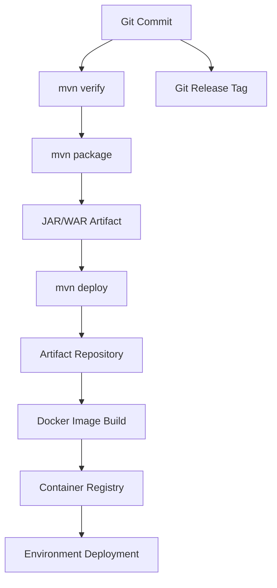
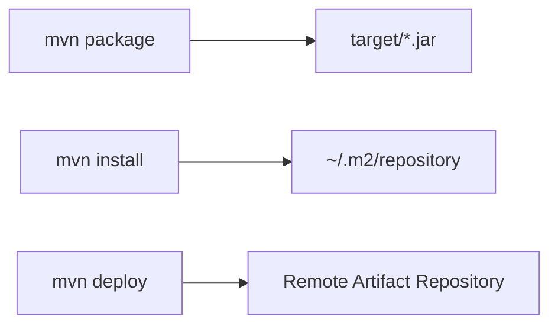
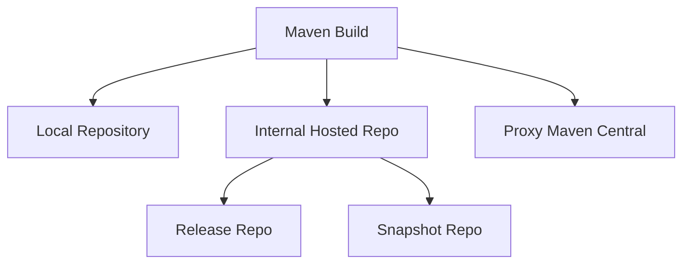
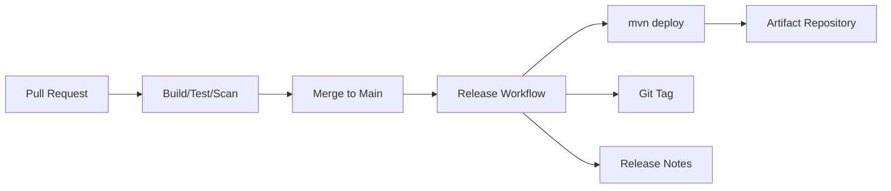
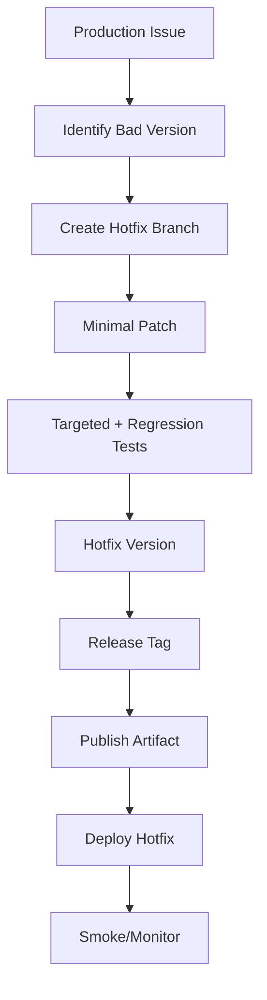

# Maven Release and Artifact Publishing

## 1. Core Idea

Maven release dan artifact publishing adalah proses mengubah source code menjadi artifact yang bisa dikonsumsi, dideploy, diaudit, dan direproduksi.

Untuk backend Java/JAX-RS enterprise, artifact bisa berupa:

- JAR,
- WAR,
- test artifact,
- source JAR,
- javadoc JAR,
- internal library,
- service package,
- Maven dependency untuk service lain,
- input untuk Docker image,
- metadata SBOM/provenance,
- release note/changelog.

Mental model:



Senior engineer harus memahami hubungan antara:

- Git commit,
- Git tag,
- Maven version,
- Maven artifact,
- artifact repository,
- Docker image tag,
- deployment manifest,
- release note,
- rollback path.

Jika hubungan ini kabur, release menjadi sulit diaudit dan sulit di-rollback.

---

## 2. Why Artifact Publishing Matters

Artifact publishing bukan hanya upload file.

Ia menjawab pertanyaan production-critical:

- source commit mana yang menghasilkan artifact ini?
- test dan scan apa yang sudah dilewati?
- dependency versi apa yang masuk artifact?
- siapa/apa yang melakukan publish?
- kapan artifact dibuat?
- apakah artifact immutable?
- apakah artifact bisa dipromosikan antar environment?
- apakah artifact bisa dihapus/ditimpa?
- bagaimana rollback ke versi sebelumnya?
- apakah artifact punya provenance/SBOM?

Dalam enterprise system, artifact adalah audit boundary.

Source code belum tentu sama dengan artifact yang berjalan di environment. Yang berjalan adalah artifact atau image yang dibangun dari source.

---

## 3. Snapshot Version vs Release Version

Maven membedakan dua jenis versi umum:

```xml
<version>1.4.0-SNAPSHOT</version>
```

```xml
<version>1.4.0</version>
```

Snapshot:

- mutable secara konsep,
- mewakili development version,
- bisa dipublish berkali-kali,
- repository dapat menyimpan timestamped snapshot,
- tidak ideal untuk production release,
- berguna untuk integration antar module/library yang masih aktif berubah.

Release:

- immutable secara prinsip,
- mewakili versi final,
- harus traceable ke commit/tag,
- tidak boleh dipublish ulang dengan isi berbeda,
- cocok untuk production dan dependency stabil.

Senior rule:

> Artifact release harus immutable. Jika versi yang sama bisa menunjuk isi berbeda, audit dan rollback rusak.

---

## 4. Maven Coordinates as Artifact Identity

Artifact Maven diidentifikasi oleh coordinates:

```text
groupId:artifactId:version:packaging:classifier
```

Contoh:

```xml
<groupId>com.example.quote</groupId>
<artifactId>quote-order-service</artifactId>
<version>1.4.0</version>
<packaging>jar</packaging>
```

Coordinates harus stabil dan bermakna.

Review concern:

- Apakah `groupId` sesuai namespace organisasi?
- Apakah `artifactId` jelas membedakan service/library?
- Apakah versioning konsisten?
- Apakah classifier digunakan dengan jelas?
- Apakah artifact lama tetap bisa di-resolve?

Anti-pattern:

- mengganti `groupId` tanpa migration plan,
- artifactId terlalu generik,
- version manual tidak sinkron dengan tag,
- release artifact masih `SNAPSHOT`,
- library internal menggunakan versi mutable.

---

## 5. Maven Package vs Install vs Deploy

Command Maven berbeda konsekuensi:

```bash
mvn package
```

Membuat artifact di `target/`, tetapi belum memasukkan ke local repository.

```bash
mvn install
```

Membuat artifact dan memasukkan ke local Maven repository (`~/.m2/repository`).

```bash
mvn deploy
```

Membuat artifact dan mempublish ke remote artifact repository.

Mental model:



Kapan dipakai:

| Command | Use case |
|---|---|
| `mvn package` | local build artifact cepat |
| `mvn install` | konsumsi artifact oleh project lokal lain |
| `mvn deploy` | publish artifact ke repository untuk CI/release/consumer |

Senior caution:

- `mvn install` bisa menyembunyikan dependency yang belum dipublish remote.
- Build local bisa pass karena local repository berisi artifact yang tidak tersedia di CI.
- `mvn deploy` harus dikontrol oleh CI/release pipeline, bukan kebiasaan manual sembarang.

---

## 6. Artifact Repository

Artifact repository adalah tempat Maven resolve dan publish artifact.

Common options:

- Nexus Repository,
- JFrog Artifactory,
- GitHub Packages,
- cloud artifact registry,
- internal enterprise repository.

Repository biasanya dipisahkan:

- snapshot repository,
- release repository,
- proxy repository untuk Maven Central,
- hosted internal repository,
- staging repository,
- promotion repository.

Mental model:



Review concern:

- repository mana untuk snapshots?
- repository mana untuk releases?
- siapa boleh deploy?
- apakah release artifact immutable?
- apakah repository melakukan retention cleanup?
- apakah repository menjadi source of truth dependency internal?

---

## 7. Distribution Management

Maven publish target sering didefinisikan dengan `distributionManagement`.

Contoh konseptual:

```xml
<distributionManagement>
  <repository>
    <id>internal-releases</id>
    <url>https://repo.example.com/releases</url>
  </repository>
  <snapshotRepository>
    <id>internal-snapshots</id>
    <url>https://repo.example.com/snapshots</url>
  </snapshotRepository>
</distributionManagement>
```

Hal penting:

- `id` harus match credential di Maven settings,
- URL harus sesuai repository release/snapshot,
- credential tidak boleh ditaruh di POM,
- CI secret harus digunakan dengan permission minimal,
- parent POM mungkin mengatur ini secara shared.

Internal detail harus diverifikasi karena setiap organisasi bisa berbeda.

---

## 8. Maven Settings and Credentials

Credential biasanya berada di `settings.xml`, bukan di POM.

Contoh bentuk umum:

```xml
<settings>
  <servers>
    <server>
      <id>internal-releases</id>
      <username>${env.MAVEN_REPO_USERNAME}</username>
      <password>${env.MAVEN_REPO_PASSWORD}</password>
    </server>
  </servers>
</settings>
```

Di CI, settings bisa:

- generated saat workflow berjalan,
- berasal dari secret store,
- disediakan oleh base image/runner,
- dikelola platform team.

Security concern:

- jangan commit `settings.xml` berisi secret,
- jangan echo password ke log,
- jangan gunakan personal token untuk release pipeline jangka panjang,
- gunakan least privilege,
- rotate credential,
- audit siapa/apa yang bisa publish.

---

## 9. Release Versioning Strategy

Versioning harus menjawab compatibility dan traceability.

Common pattern:

```text
MAJOR.MINOR.PATCH
```

Contoh:

```text
1.8.3
```

Meaning umum:

- MAJOR: breaking change,
- MINOR: backward-compatible feature,
- PATCH: backward-compatible fix.

Namun enterprise team bisa punya convention internal yang berbeda.

Yang penting:

- version bump konsisten,
- artifact version sinkron dengan Git tag,
- changelog/release note sinkron,
- hotfix version jelas,
- pre-release/build metadata jika dipakai harus dipahami,
- snapshot menuju release punya lifecycle jelas.

Untuk service yang hanya dideploy internal, SemVer sering tetap berguna sebagai communication tool, tetapi deployment version kadang mengikuti release train atau build number.

Verifikasi internal process.

---

## 10. Version Bump Workflow

Workflow umum release Maven:

1. Mulai dari development version:

```xml
<version>1.5.0-SNAPSHOT</version>
```

2. Release menjadi:

```xml
<version>1.5.0</version>
```

3. Build, verify, publish artifact.
4. Buat Git tag:

```bash
git tag -a v1.5.0 -m "Release 1.5.0"
```

5. Setelah release, bump ke next snapshot:

```xml
<version>1.5.1-SNAPSHOT</version>
```

atau:

```xml
<version>1.6.0-SNAPSHOT</version>
```

Bergantung release plan.

Senior concern:

- Apakah version bump dilakukan manual atau otomatis?
- Apakah tag dibuat sebelum atau sesudah artifact publish?
- Apakah failed release meninggalkan POM version setengah berubah?
- Apakah branch release dilindungi?
- Apakah artifact publish atomic?

---

## 11. Maven Release Plugin Awareness

Maven Release Plugin historically sering dipakai untuk:

- prepare release,
- update POM version,
- commit release version,
- create tag,
- bump next snapshot,
- perform deploy.

Command umum:

```bash
mvn release:prepare
mvn release:perform
```

Namun banyak modern CI/CD workflow mengganti atau membatasi penggunaannya karena:

- terlalu stateful,
- bisa sulit di-debug,
- melakukan Git operation otomatis,
- kurang cocok dengan protected branch/PR workflow,
- kurang cocok dengan container image release modern,
- bisa bertabrakan dengan CI automation.

Senior stance:

> Pahami Maven Release Plugin, tetapi jangan mengasumsikan tim menggunakannya. Banyak enterprise pipeline memakai release automation custom.

Internal verification checklist wajib untuk mengetahui mekanisme release aktual.

---

## 12. CI-Controlled Publishing

Di enterprise environment, publish artifact sebaiknya dilakukan oleh CI/CD, bukan manual local machine.

Alasan:

- environment lebih controlled,
- credential tidak tersebar,
- audit trail jelas,
- build command konsisten,
- test/scan gate bisa diwajibkan,
- artifact provenance lebih kuat,
- tag/release event bisa dilacak.

Typical pipeline:



Review concern:

- Apakah `mvn deploy` hanya berjalan pada branch/tag tertentu?
- Apakah PR dari fork bisa mengakses secret?
- Apakah release workflow butuh manual approval?
- Apakah workflow permission minimal?
- Apakah third-party action dipin?

---

## 13. Artifact Immutability

Release artifact harus immutable.

Artinya:

- `com.example:quote-service:1.5.0` tidak boleh berubah isi setelah publish,
- tag `v1.5.0` tidak boleh dipindahkan,
- Docker image release tag tidak boleh silently overwritten,
- changelog/release note harus menunjuk versi yang sama.

Kenapa?

Karena rollback dan audit membutuhkan referensi stabil.

Bad scenario:

```text
v1.5.0 published Monday
v1.5.0 republished Tuesday with different code
production incident Wednesday
```

Pertanyaan sulit:

- versi mana yang sebenarnya running?
- commit mana yang menyebabkan bug?
- artifact mana yang harus dirollback?
- test apa yang benar-benar berjalan?

Senior rule:

> Jika harus memperbaiki release, buat versi baru. Jangan rewrite release lama.

---

## 14. Snapshot Publishing Risk

Snapshot berguna, tetapi punya risiko.

Risiko:

- dependency resolve ke build terbaru tanpa terlihat di POM,
- CI result berubah tanpa code change,
- local cache berbeda dari remote,
- reproducibility lemah,
- consumer service sulit mengaudit versi yang dipakai.

Mitigation:

- gunakan snapshot hanya untuk development/internal integration,
- jangan pakai snapshot untuk production release,
- pin release version untuk stable dependency,
- bersihkan snapshot dependency sebelum release,
- gunakan timestamp/build metadata jika perlu traceability,
- batasi lifetime snapshot repository.

Command untuk memaksa update snapshot:

```bash
mvn -U clean verify
```

Gunakan dengan sadar. `-U` dapat menyembunyikan root cause version drift jika dipakai otomatis tanpa analisis.

---

## 15. Changelog and Release Notes

Artifact tanpa release note sulit dikonsumsi.

Release note harus menjawab:

- apa yang berubah?
- kenapa berubah?
- apakah ada breaking change?
- apakah ada migration step?
- apakah ada config change?
- apakah ada database migration?
- apakah ada dependency/security update?
- apakah rollback aman?
- apakah ada known issue?

Untuk Java/JAX-RS service, release note perlu menyorot:

- API contract change,
- DTO field change,
- status code behavior,
- event schema change,
- DB migration,
- cache key/TTL change,
- broker topic/queue/routing change,
- config/env var baru,
- security permission change.

Changelog bukan sekadar daftar commit.

---

## 16. Artifact Promotion

Beberapa organisasi tidak rebuild artifact untuk setiap environment. Mereka mempromosikan artifact yang sama:

```text
build once -> test -> promote to staging -> promote to production
```

Ini lebih baik untuk reproducibility karena artifact production sama dengan artifact yang diuji.

Alternative yang berisiko:

```text
build for dev -> rebuild for staging -> rebuild for prod
```

Risiko rebuild per environment:

- dependency resolve berbeda,
- timestamp/generated output berbeda,
- build tool berbeda,
- environment profile berbeda,
- artifact hash berbeda,
- bug muncul hanya di prod artifact.

Senior rule:

> Build once, promote many adalah default yang lebih aman untuk release artifact.

Jika environment membutuhkan config berbeda, config sebaiknya runtime/deployment concern, bukan rebuild artifact berbeda.

---

## 17. Reproducible Release

Release yang reproducible harus bisa menjawab:

- command apa yang digunakan?
- JDK/Maven versi apa?
- dependency/plugin version apa?
- source commit/tag apa?
- environment variable apa yang memengaruhi build?
- apakah generated source deterministic?
- apakah timestamp masuk artifact?
- apakah artifact hash dicatat?

Useful commands:

```bash
mvn -version
```

```bash
mvn help:effective-pom
```

```bash
mvn dependency:tree
```

```bash
sha256sum target/*.jar
```

Untuk CI, artifact metadata sebaiknya mencatat:

- commit SHA,
- build number/run ID,
- branch/tag,
- Maven version,
- Java version,
- artifact checksum,
- publish timestamp,
- SBOM/provenance jika tersedia.

---

## 18. Rollback Release

Rollback bukan hanya deploy versi lama.

Rollback harus mempertimbangkan:

- artifact lama masih tersedia?
- Docker image lama masih tersedia?
- database migration backward-compatible?
- event schema backward-compatible?
- cache format compatible?
- config lama masih valid?
- feature flag bisa dimatikan?
- dependency service compatible?
- client sudah menerima contract baru?

Maven artifact publishing mendukung rollback jika:

- artifact immutable,
- version traceable,
- release note jelas,
- deployment manifest menunjuk versi eksplisit,
- repository retention tidak menghapus artifact terlalu cepat.

Anti-pattern:

- rollback ke tag yang artifact-nya sudah overwritten,
- rollback tanpa cek migration,
- rollback ke image `latest`,
- rollback dengan rebuild manual dari laptop.

---

## 19. Hotfix Release

Hotfix release membutuhkan discipline lebih tinggi karena waktunya sempit.

Typical flow:



Hotfix principles:

- minimal change,
- clear root symptom,
- explicit version,
- traceable tag,
- required tests not silently bypassed,
- rollback/roll-forward plan,
- post-incident follow-up for broader fix.

Version example:

```text
1.5.0 -> 1.5.1
```

Jangan campur hotfix dengan unrelated refactor.

---

## 20. Publishing Internal Libraries

Internal library punya risiko berbeda dari service artifact.

Library release berdampak ke consumer.

Review concern:

- backward compatibility,
- binary compatibility,
- source compatibility,
- transitive dependency impact,
- semantic versioning,
- deprecation policy,
- migration guide,
- consumer test,
- dependency convergence,
- shaded/relocated classes,
- Jakarta namespace compatibility.

Library release harus lebih hati-hati karena bug bisa menyebar ke banyak service.

Internal verification:

- siapa owner library?
- siapa consumer utama?
- bagaimana consumer diberi tahu?
- apakah ada compatibility test?
- apakah versi lama masih didukung?

---

## 21. Publishing Service Artifacts

Service artifact biasanya langsung masuk container image atau deployment pipeline.

Concern:

- artifact version harus masuk image label/tag,
- commit SHA harus masuk metadata,
- config tidak boleh dibake jika seharusnya runtime config,
- dependency vulnerability scan harus dilakukan,
- test/scan gate harus selesai sebelum publish image,
- image digest lebih kuat daripada tag mutable.

Pattern yang baik:

```text
Maven artifact -> Docker image -> image digest -> deployment manifest -> environment
```

Traceability minimal:

```text
commit SHA -> Maven version -> artifact checksum -> image digest -> deployment event
```

---

## 22. Security and Supply Chain Concern

Release publishing adalah supply-chain sensitive operation.

Risiko:

- credential repository bocor,
- artifact dipublish oleh actor tidak sah,
- dependency malicious masuk release,
- third-party CI action compromised,
- artifact tampered,
- release tag dipindahkan,
- SBOM tidak tersedia,
- license violation,
- vulnerable dependency tidak ditriage.

Controls:

- CI-only publishing,
- least privilege token,
- branch protection,
- tag protection jika tersedia,
- signed commit/tag jika policy mewajibkan,
- action pinning,
- dependency scanning,
- SBOM generation,
- artifact checksum/provenance,
- audit log review.

---

## 23. Failure Mode Map

| Symptom | Kemungkinan penyebab | Diagnosis awal |
|---|---|---|
| `mvn deploy` unauthorized | credential/settings mismatch | cek server id dan CI secret |
| Artifact masuk snapshot repo | version masih `-SNAPSHOT` | cek POM version |
| Release repo menolak deploy | artifact version sudah ada | cek immutability dan duplicate release |
| Consumer tidak bisa resolve artifact | repo tidak dikonfigurasi atau permission salah | cek settings/repository mirror |
| CI release berbeda dari local | Java/Maven/profile/env berbeda | cek build metadata |
| Docker image tidak cocok artifact | image build memakai artifact lama | cek Docker build context/cache |
| Rollback gagal | artifact/image lama hilang atau migration incompatible | cek retention dan migration notes |
| Tag tidak cocok artifact | tag dibuat dari commit berbeda | cek commit SHA dan release workflow |
| Dependency snapshot berubah | snapshot mutable/update | cek `mvn -U`, timestamped snapshot |

---

## 24. Debugging Publishing Failure

Step-by-step:

1. Pastikan command yang gagal: `deploy`, release workflow, image build, atau promotion.
2. Cek Maven version dan Java version.
3. Cek POM version: snapshot atau release.
4. Cek `distributionManagement` atau parent POM.
5. Cek `settings.xml` server id.
6. Cek credential CI secret.
7. Cek repository permission.
8. Cek apakah artifact version sudah pernah dipublish.
9. Cek proxy/mirror config.
10. Cek CI log untuk masking secret dan HTTP status.
11. Cek artifact repository UI/API jika punya akses.
12. Jangan republish release version lama dengan isi berbeda.

Useful command:

```bash
mvn -X deploy
```

Gunakan hati-hati karena debug log bisa berisi detail sensitif. Pastikan secret tetap masked.

Cek effective settings jika memungkinkan:

```bash
mvn help:effective-settings
```

---

## 25. Release Review Checklist

Saat mereview release/Maven publishing change:

- Apakah artifact version benar?
- Apakah snapshot tidak masuk release production?
- Apakah release artifact immutable?
- Apakah Git tag sinkron dengan artifact?
- Apakah changelog/release note jelas?
- Apakah `mvn deploy` hanya dilakukan oleh pipeline yang tepat?
- Apakah credential tidak ada di POM/script/log?
- Apakah repository target benar?
- Apakah artifact checksum/provenance dicatat?
- Apakah SBOM/security scan dilakukan?
- Apakah Docker image dibangun dari artifact yang benar?
- Apakah deployment manifest menunjuk versi/digest eksplisit?
- Apakah rollback path jelas?
- Apakah DB migration/event schema/API compatibility dipertimbangkan?
- Apakah hotfix process tidak bypass kontrol utama tanpa approval?

---

## 26. Internal Verification Checklist

Untuk CSG/team, verifikasi detail berikut:

- artifact repository yang digunakan: Nexus, Artifactory, GitHub Packages, atau platform internal,
- repository untuk snapshot dan release,
- siapa/apa yang boleh menjalankan `mvn deploy`,
- apakah deploy manual dari laptop diperbolehkan atau dilarang,
- Maven `distributionManagement` ada di service POM atau parent POM,
- mekanisme credential CI,
- release versioning convention,
- Git tag convention,
- tag protection policy,
- release branch strategy,
- changelog/release note format,
- apakah Maven Release Plugin digunakan,
- apakah release automation custom digunakan,
- hubungan Maven artifact dengan Docker image,
- image tag/digest strategy,
- artifact promotion antar environment,
- rollback dan hotfix runbook,
- SBOM/provenance/security scan process,
- retention policy artifact lama.

---

## 27. Java/JAX-RS Backend Release Concern

Untuk service Java/JAX-RS, release artifact publishing harus mempertimbangkan:

- API backward compatibility,
- request/response schema,
- error response shape,
- validation behavior,
- authentication/authorization changes,
- database migration,
- transaction behavior,
- message schema,
- consumer compatibility,
- cache key format,
- config/env var baru,
- observability/log/metric changes,
- startup/shutdown behavior,
- container health check.

Release artifact bukan hanya binary. Ia membawa behavior.

Senior review question:

> Apa behavior customer/system yang berubah ketika artifact version ini dideploy?

---

## 28. Docker, Kubernetes, AWS, Azure, and GitOps Impact

Maven release biasanya tidak berhenti di artifact repository.

Dalam modern platform:

```text
Maven artifact -> container image -> registry -> GitOps manifest -> Kubernetes rollout -> cloud runtime
```

Concern:

- Docker build harus memakai artifact yang baru diverifikasi,
- image tag harus traceable,
- image digest sebaiknya dicatat,
- GitOps PR harus menunjuk versi yang benar,
- Kubernetes rollout harus bisa dilacak ke release,
- AWS/Azure registry permission harus minimal,
- secret/config tidak boleh dibake ke artifact,
- rollback harus tahu image digest/artifact version.

Jangan mencampur build-time config dan runtime config kecuali memang ada alasan kuat.

---

## 29. Principal-Level Release Discipline

Di level principal/senior, pertanyaan terpenting bukan hanya "bisa publish atau tidak".

Pertanyaan yang harus dijawab:

- Apakah release artifact bisa dipercaya?
- Apakah artifact bisa diaudit?
- Apakah artifact bisa direproduksi?
- Apakah artifact bisa dirollback?
- Apakah artifact bisa dipromosikan tanpa rebuild?
- Apakah dependency dan plugin version terkunci?
- Apakah credential publishing aman?
- Apakah consumer tahu perubahan yang relevan?
- Apakah failed release meninggalkan state yang aman?
- Apakah release process mengurangi risiko atau hanya memindahkan risiko ke manual step?

Release discipline adalah engineering control, bukan ceremony.

---

## 30. Key Takeaways

- `package`, `install`, dan `deploy` punya scope berbeda.
- Snapshot mutable; release harus immutable.
- Artifact repository adalah audit boundary untuk Java/Maven ecosystem.
- Release version, Git tag, artifact checksum, image digest, dan deployment event harus traceable.
- CI-controlled publishing lebih aman daripada manual publishing.
- Build once, promote many lebih reproducible daripada rebuild per environment.
- Rollback hanya aman jika artifact lama, image lama, config, migration, dan compatibility masih valid.
- Internal release process tidak boleh diasumsikan; harus diverifikasi dari repo, pipeline, runbook, dan senior/platform team.
