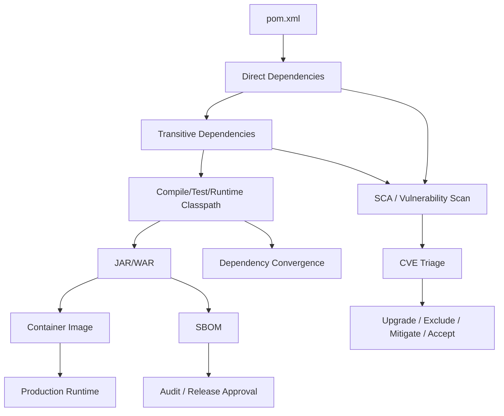
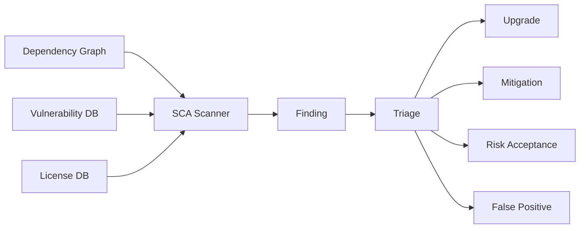
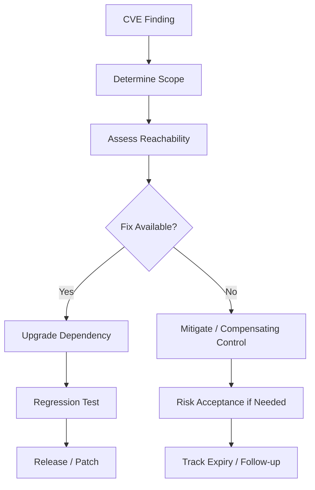
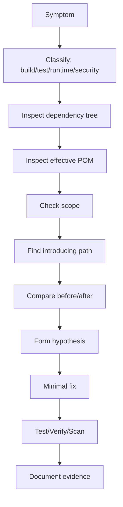

# Maven Security and Dependency Hygiene

## 1. Core Idea

Maven dependency hygiene adalah disiplin menjaga dependency graph agar aman, stabil, konsisten, dapat diaudit, dan tidak merusak runtime behavior.

Untuk Java/JAX-RS enterprise service, dependency bukan hanya library helper. Dependency ikut menentukan:

- classpath runtime,
- HTTP stack behavior,
- JSON serialization behavior,
- TLS behavior,
- database driver behavior,
- Kafka/RabbitMQ/Redis client behavior,
- logging behavior,
- test behavior,
- container image vulnerability surface,
- license exposure,
- release approval risk,
- incident blast radius.

Dependency hygiene berarti senior engineer tidak hanya bertanya:

> "Build-nya hijau?"

Tetapi juga:

> "Dependency graph-nya aman, konsisten, kompatibel, traceable, dan tidak menyembunyikan risiko production?"

Mental model:



Dependency change kecil bisa menjadi production issue besar karena efeknya menyebar ke classpath, runtime, security posture, dan compatibility contract.

---

## 2. Why Dependency Hygiene Matters

Dependency hygiene penting karena Java ecosystem sangat bergantung pada transitive dependencies.

Satu dependency langsung bisa membawa puluhan dependency tidak langsung.

Contoh kategori risiko:

- vulnerability masuk lewat transitive dependency,
- versi library berbeda antara module,
- duplicate classes menyebabkan class loading ambiguity,
- dependency lama menahan upgrade framework,
- library mengubah behavior serialization,
- dependency test bocor ke runtime artifact,
- exclusion menghilangkan class yang dibutuhkan runtime,
- shaded dependency menyembunyikan CVE,
- license tidak kompatibel dengan policy enterprise,
- Jakarta/Javax namespace conflict memecahkan runtime JAX-RS.

Dalam sistem enterprise, dependency graph adalah bagian dari architecture surface.

Ia memengaruhi:

- security,
- compliance,
- release gate,
- performance,
- runtime correctness,
- operability,
- upgrade path,
- developer productivity.

---

## 3. Dependency Graph as Runtime Contract

Maven dependency graph bukan hanya build-time data.

Ia menjadi runtime contract.

Hal yang ikut dipengaruhi dependency graph:

- class mana yang tersedia saat aplikasi jalan,
- versi API mana yang dipakai,
- versi implementation mana yang dipakai,
- method signature yang tersedia,
- default configuration library,
- transitive logging binding,
- transitive JSON provider,
- transitive HTTP client,
- transitive Netty/Jetty/Servlet/Jersey behavior,
- transitive TLS/crypto provider,
- transitive database driver,
- transitive broker client.

Command dasar:

```bash
mvn dependency:tree
mvn dependency:tree -Dverbose
mvn dependency:tree -Dincludes=org.glassfish.jersey
mvn dependency:tree -Dincludes=com.fasterxml.jackson.core
mvn dependency:tree -Dscope=runtime
mvn dependency:tree -Dscope=test
```

Review dependency harus melihat scope, owner, alasan, version alignment, dan runtime impact.

---

## 4. Direct Dependency vs Transitive Dependency

Direct dependency adalah dependency yang ditulis eksplisit di `pom.xml`.

Transitive dependency adalah dependency yang dibawa oleh dependency lain.

Contoh:

```xml
<dependency>
  <groupId>org.glassfish.jersey.core</groupId>
  <artifactId>jersey-server</artifactId>
</dependency>
```

Dependency ini bisa membawa dependency lain seperti Jersey common, injection library, Jakarta APIs, dan utility libraries.

Masalah umum:

- engineer hanya melihat dependency langsung,
- CVE muncul dari dependency transitive,
- runtime error berasal dari version conflict transitive,
- exclusion dibuat tanpa memahami dependency yang sebenarnya membutuhkan library tersebut.

Senior review harus bertanya:

- dependency ini direct atau transitive?
- jika direct, mengapa service membutuhkan dependency ini?
- jika transitive, siapa yang membawanya?
- apakah versi dikontrol oleh BOM/parent POM?
- apakah ada dependency lain membawa versi berbeda?
- apakah dependency masuk compile, runtime, atau test classpath?

---

## 5. Vulnerability Scanning

Vulnerability scanning adalah proses mendeteksi dependency yang memiliki vulnerability publik atau internal.

Tools bisa berbeda antar organisasi, tetapi konsepnya sama:

- baca dependency graph,
- cocokkan artifact/version dengan vulnerability database,
- laporkan severity,
- sarankan upgrade atau mitigation,
- simpan evidence untuk release/security review.

Kategori tool:

- SCA platform enterprise,
- GitHub Dependabot/dependency review,
- OWASP Dependency-Check awareness,
- Maven plugin internal,
- container image scanner,
- SBOM scanner,
- artifact repository scanner.

Contoh command lokal awareness:

```bash
mvn dependency:tree
mvn dependency:resolve
mvn versions:display-dependency-updates
```

Jika OWASP Dependency-Check tersedia:

```bash
mvn org.owasp:dependency-check-maven:check
```

Jangan mengasumsikan tool ini pasti dipakai di CSG. Verifikasi tool resmi internal.

---

## 6. SCA Mental Model

SCA berarti Software Composition Analysis.

SCA mencoba menjawab:

- dependency apa yang dipakai?
- versi apa yang dipakai?
- license apa yang melekat?
- vulnerability apa yang diketahui?
- transitive path mana yang membawa dependency itu?
- artifact/release mana yang terdampak?
- fix version apa yang tersedia?
- apakah vulnerability reachable atau tidak?

Mental model:



SCA result bukan otomatis keputusan engineering.

Ia adalah input untuk triage.

Senior engineer harus bisa membedakan:

- vulnerable and reachable,
- vulnerable but not reachable,
- false positive,
- test-only exposure,
- build-time-only exposure,
- runtime exposure,
- container image exposure,
- deployable artifact exposure.

---

## 7. SBOM

SBOM berarti Software Bill of Materials.

SBOM adalah daftar komponen software yang membentuk artifact atau image.

Tujuannya:

- audit dependency,
- incident response vulnerability,
- release compliance,
- supply-chain traceability,
- impact analysis saat CVE baru muncul.

SBOM yang berguna harus menjawab:

- artifact apa yang dianalisis?
- build commit/tag apa?
- dependency apa saja?
- versi apa?
- transitive relationship apa?
- license apa?
- checksum/provenance apa?
- waktu build apa?

Common formats:

- CycloneDX,
- SPDX.

Contoh Maven plugin jika digunakan:

```bash
mvn org.cyclonedx:cyclonedx-maven-plugin:makeAggregateBom
```

Contoh output yang biasanya dicari:

```text
target/bom.xml
target/bom.json
```

Internal verification penting karena format, tool, dan storage SBOM biasanya ditentukan oleh security/platform/release process.

---

## 8. License Scanning

License scanning mendeteksi license dependency.

Risiko license berbeda dari risiko CVE.

Sebuah dependency bisa aman secara security tetapi bermasalah secara license policy.

Hal yang perlu diperiksa:

- license dependency langsung,
- license dependency transitive,
- license generated code,
- license shaded dependency,
- license test dependency jika artifact test dipublish,
- license container image package,
- license dari tool build jika bundled.

Senior review harus menghindari asumsi:

> "Open source berarti boleh dipakai."

Pertanyaan yang tepat:

- apakah license diizinkan oleh policy perusahaan?
- apakah dependency hanya test atau runtime?
- apakah dependency dipaketkan ke deliverable?
- apakah ada kewajiban attribution?
- apakah ada license conflict dengan model distribusi produk?

Internal verification wajib dilakukan dengan security/legal/compliance process yang berlaku.

---

## 9. Dependency Pinning

Dependency pinning berarti versi dependency ditentukan secara eksplisit dan terkendali.

Tujuan:

- build stabil,
- dependency drift dicegah,
- vulnerability impact jelas,
- upgrade bisa direview,
- release artifact traceable.

Maven biasanya melakukan pinning melalui:

- parent POM,
- `dependencyManagement`,
- BOM import,
- direct dependency version,
- pluginManagement untuk plugin,
- Maven wrapper untuk Maven version,
- toolchain untuk JDK.

Contoh managed dependency:

```xml
<dependencyManagement>
  <dependencies>
    <dependency>
      <groupId>com.fasterxml.jackson</groupId>
      <artifactId>jackson-bom</artifactId>
      <version>2.x.y</version>
      <type>pom</type>
      <scope>import</scope>
    </dependency>
  </dependencies>
</dependencyManagement>
```

Contoh child dependency tanpa version karena dikelola BOM:

```xml
<dependency>
  <groupId>com.fasterxml.jackson.core</groupId>
  <artifactId>jackson-databind</artifactId>
</dependency>
```

Anti-pattern:

```xml
<dependency>
  <groupId>com.fasterxml.jackson.core</groupId>
  <artifactId>jackson-databind</artifactId>
  <version>2.different.version</version>
</dependency>
```

Jika versi sudah dikelola oleh BOM, override lokal harus punya alasan kuat.

---

## 10. Dependency Version Drift

Version drift terjadi ketika module atau service memakai versi dependency berbeda tanpa alasan sadar.

Contoh dampak:

- module A compile dengan API versi baru,
- module B runtime dengan implementation versi lama,
- test hijau di module tertentu tetapi gagal saat packaged service jalan,
- classpath memuat versi yang tidak diharapkan,
- vulnerability scanner melaporkan versi lama yang masih terbawa transitive.

Deteksi:

```bash
mvn dependency:tree -Dverbose
mvn dependency:tree -Dincludes=groupId:artifactId
mvn enforcer:enforce
```

Jika Maven Enforcer digunakan, rule yang relevan antara lain:

- dependency convergence,
- require upper bound deps,
- ban duplicate classes melalui plugin terpisah jika tersedia,
- require explicit plugin versions,
- require Maven/Java version.

Internal verification: cek enforcer rule aktual di parent POM internal.

---

## 11. Exclusion Risk

Maven exclusion digunakan untuk menghapus transitive dependency tertentu.

Contoh:

```xml
<dependency>
  <groupId>example.group</groupId>
  <artifactId>example-client</artifactId>
  <exclusions>
    <exclusion>
      <groupId>commons-logging</groupId>
      <artifactId>commons-logging</artifactId>
    </exclusion>
  </exclusions>
</dependency>
```

Exclusion bisa benar jika:

- dependency memang tidak dibutuhkan,
- diganti dengan implementation lain,
- menghapus duplicate binding,
- menghilangkan vulnerable transitive dependency yang tidak dipakai,
- memperbaiki version alignment dengan dependency lain.

Tetapi exclusion berisiko karena:

- class hilang saat runtime,
- library parent mengasumsikan dependency tersebut ada,
- test tidak mencakup path yang membutuhkan class itu,
- exclusion memperbaiki satu conflict tetapi membuat conflict lain,
- vulnerability seolah hilang tetapi functionality rusak.

Failure mode umum:

```text
java.lang.ClassNotFoundException
java.lang.NoClassDefFoundError
java.lang.NoSuchMethodError
java.lang.NoSuchFieldError
ServiceConfigurationError
```

Review exclusion harus selalu meminta alasan dan evidence.

---

## 12. Shading Risk

Shading adalah memaketkan dependency ke dalam artifact, sering dengan relocation package.

Maven Shade Plugin berguna untuk:

- executable fat JAR,
- menghindari dependency conflict,
- membundle tool/CLI,
- relocate dependency agar tidak bentrok.

Tetapi shading berisiko:

- duplicate classes,
- service loader metadata rusak,
- signature file conflict,
- vulnerability scanner gagal mengenali dependency,
- dependency version tersembunyi,
- license attribution terlupakan,
- jar size membengkak,
- runtime behavior berbeda dari classpath normal,
- CVE remediation lebih sulit.

Contoh plugin:

```xml
<plugin>
  <groupId>org.apache.maven.plugins</groupId>
  <artifactId>maven-shade-plugin</artifactId>
  <version>${maven-shade-plugin.version}</version>
</plugin>
```

Senior review harus bertanya:

- mengapa shading diperlukan?
- apakah relocation dipakai?
- apakah service loader resource digabung dengan benar?
- apakah scanner tetap melihat komponen yang dishade?
- apakah license/SBOM tetap akurat?
- apakah artifact ini service artifact atau library artifact?

Untuk service backend, shading harus dipakai hati-hati. Banyak service cukup memakai normal dependency resolution atau container packaging.

---

## 13. Duplicate Classes

Duplicate classes terjadi ketika class dengan fully qualified name sama muncul dari lebih dari satu JAR.

Efeknya berbahaya karena classpath order menentukan class mana yang dimuat.

Masalah yang muncul:

- behavior berbeda antara local dan CI,
- runtime memakai class lama,
- method tidak ditemukan,
- library tampak benar di dependency tree tetapi class sebenarnya diambil dari JAR lain,
- test lewat karena classpath test berbeda dari runtime.

Gejala:

```text
NoSuchMethodError
NoSuchFieldError
ClassCastException
LinkageError
IncompatibleClassChangeError
```

Deteksi bisa melalui:

- dependency tree,
- duplicate finder plugin jika tersedia,
- Maven Enforcer custom rule,
- inspection artifact,
- classpath print,
- `jar tf`.

Contoh inspeksi JAR:

```bash
jar tf target/my-service.jar | grep 'SomeClass.class'
```

Jika menggunakan dependency copy:

```bash
mvn dependency:copy-dependencies -DincludeScope=runtime
find target/dependency -name '*.jar' -print
```

Internal verification: cek apakah ada duplicate-class detection di pipeline.

---

## 14. Dependency Convergence

Dependency convergence berarti satu artifact dependency tidak muncul dalam banyak versi yang bertentangan.

Contoh masalah:

```text
A -> C:1.0
B -> C:2.0
Service -> A
Service -> B
```

Maven dependency mediation memilih berdasarkan nearest definition.

Tetapi pilihan Maven belum tentu pilihan yang benar secara compatibility.

Maven Enforcer dapat membantu:

```xml
<plugin>
  <groupId>org.apache.maven.plugins</groupId>
  <artifactId>maven-enforcer-plugin</artifactId>
  <executions>
    <execution>
      <goals>
        <goal>enforce</goal>
      </goals>
      <configuration>
        <rules>
          <dependencyConvergence />
        </rules>
      </configuration>
    </execution>
  </executions>
</plugin>
```

Namun convergence rule juga bisa menghasilkan noise. Enterprise parent POM biasanya menyesuaikan rule agar useful.

Senior engineer perlu menilai:

- conflict ini real atau benign?
- dependency mana yang menentukan runtime behavior?
- apakah BOM bisa menyelaraskan versi?
- apakah upgrade aman untuk semua consumer?
- apakah exclusion diperlukan atau justru berbahaya?

---

## 15. CVE Triage

CVE triage adalah proses memutuskan tindakan terhadap vulnerability finding.

Triage tidak boleh hanya berdasarkan severity headline.

Checklist triage:

- artifact apa yang terdampak?
- dependency direct atau transitive?
- scope compile/runtime/test?
- apakah dependency masuk artifact production?
- apakah dependency masuk container image?
- apakah vulnerable code path reachable?
- apakah service expose vector yang relevan?
- apakah ada exploit known?
- apakah fix version tersedia?
- apakah upgrade breaking?
- apakah mitigation tersedia?
- apakah compensating control ada?
- apakah risk acceptance perlu?
- apakah release harus diblokir?

Decision options:



Senior engineer harus menghindari dua ekstrem:

- panic upgrade tanpa regression analysis,
- dismiss finding tanpa evidence.

---

## 16. Vulnerability Fix Strategies

Strategi memperbaiki dependency vulnerability:

### 16.1 Direct Upgrade

Upgrade dependency langsung ke versi aman.

```xml
<dependency>
  <groupId>example</groupId>
  <artifactId>vulnerable-lib</artifactId>
  <version>safe.version</version>
</dependency>
```

Cocok jika dependency direct dan compatibility jelas.

### 16.2 BOM Upgrade

Upgrade BOM agar seluruh family dependency selaras.

Cocok untuk:

- Jackson,
- Jersey,
- Netty,
- Spring family jika ada,
- cloud SDK family,
- Jakarta platform family.

### 16.3 Parent POM Upgrade

Upgrade parent POM internal yang mengelola dependency dan plugin.

Cocok jika banyak service memakai baseline yang sama.

### 16.4 Managed Override

Override versi via `dependencyManagement`.

Harus hati-hati agar tidak melawan platform BOM tanpa alasan.

### 16.5 Exclusion + Replacement

Exclude vulnerable transitive dependency dan tambahkan replacement version.

Harus disertai dependency tree dan regression test.

### 16.6 Mitigation Without Upgrade

Kadang upgrade belum tersedia atau breaking.

Mitigation bisa berupa:

- disable vulnerable feature,
- restrict input vector,
- network isolation,
- WAF/API gateway rule,
- configuration hardening,
- privilege reduction,
- runtime flag,
- temporary risk acceptance.

Semua mitigation harus terdokumentasi dan punya expiry/follow-up.

---

## 17. Jakarta Namespace Conflict

Untuk Java/JAX-RS/Jakarta RESTful services, namespace conflict adalah risiko nyata.

Perubahan besar:

- legacy Java EE menggunakan `javax.*`,
- Jakarta EE modern menggunakan `jakarta.*`.

Conflict muncul ketika dependency graph mencampur library yang mengharapkan namespace berbeda.

Contoh gejala:

```text
ClassNotFoundException: javax.ws.rs.core.Application
ClassNotFoundException: jakarta.ws.rs.core.Application
NoSuchMethodError pada Jersey/Jakarta API
Provider tidak terdaftar
Injection gagal
Servlet initialization gagal
```

Area rawan:

- JAX-RS API,
- Jersey implementation,
- Servlet API,
- JSON-B/Jackson provider,
- CDI/injection integration,
- Bean Validation,
- JAXB,
- Jakarta annotation,
- testing libraries,
- application server/container runtime.

Senior review harus bertanya:

- service ini masih `javax` atau sudah `jakarta`?
- Jersey version family apa yang dipakai?
- Servlet container/runtime compatible dengan namespace apa?
- dependency transitive membawa API lama atau baru?
- BOM sudah align?
- test integration benar-benar boot runtime JAX-RS?

Internal verification penting karena stack aktual CSG/team harus dicek dari POM, runtime container, dan deployment artifact.

---

## 18. Logging Dependency Hygiene

Logging dependency sering menjadi sumber konflik.

Komponen yang perlu dibedakan:

- logging API,
- logging implementation,
- bridge,
- binding,
- encoder,
- appender.

Contoh family:

- SLF4J API,
- Logback,
- Log4j2,
- JUL bridge,
- JCL bridge.

Masalah umum:

- multiple SLF4J bindings,
- bridge loop,
- vulnerable logging implementation,
- logging config tidak cocok dengan versi implementation,
- JSON encoder version conflict,
- test dependency membawa binding berbeda.

Gejala:

```text
SLF4J: Class path contains multiple SLF4J bindings
NoClassDefFoundError logging class
Log format berubah setelah upgrade
Structured logging field hilang
```

Review dependency logging harus hati-hati karena observability dan incident support bergantung pada log yang stabil.

---

## 19. JSON and Serialization Dependency Hygiene

JAX-RS service sering bergantung pada JSON provider.

Risiko dependency JSON:

- Jackson version drift,
- JSON-B provider conflict,
- provider auto-discovery berubah,
- date/time serialization berubah,
- enum serialization berubah,
- unknown property behavior berubah,
- polymorphic deserialization vulnerability,
- object mapper config tidak diterapkan,
- client/server JSON mismatch.

Dependency hygiene harus mempertimbangkan API compatibility.

Upgrade serializer bukan sekadar security fix. Ia bisa mengubah contract API.

Review checklist:

- apakah response JSON berubah?
- apakah request deserialization berubah?
- apakah error payload berubah?
- apakah date/time format berubah?
- apakah backward compatibility diuji?
- apakah consumer contract test ada?

---

## 20. Database Driver Dependency Hygiene

Database driver seperti PostgreSQL JDBC memengaruhi runtime behavior:

- TLS connection,
- authentication method,
- prepared statement behavior,
- timestamp/timezone handling,
- connection property support,
- error code handling,
- performance,
- compatibility dengan server version.

Upgrade driver harus diuji dengan:

- connection pool,
- migration tool,
- transaction behavior,
- timezone-sensitive tests,
- TLS config,
- failover behavior jika relevan.

CVE fix pada driver tetap membutuhkan regression test karena koneksi database adalah critical path.

---

## 21. Messaging Client Dependency Hygiene

Kafka, RabbitMQ, dan Redis clients juga bagian dari dependency risk.

Area rawan:

- protocol compatibility,
- broker version compatibility,
- TLS/SASL/auth behavior,
- retry behavior,
- timeout default,
- serialization/deserialization,
- connection pooling,
- heartbeat,
- backpressure,
- thread usage,
- metrics integration.

Upgrade messaging client bisa mengubah:

- reconnect behavior,
- error classification,
- default timeout,
- consumer group behavior,
- publisher confirm behavior,
- Redis cluster behavior.

Dependency review harus melibatkan integration test dan staging validation jika client berada di hot path.

---

## 22. Test Dependency Hygiene

Test dependency juga perlu hygiene.

Masalah umum:

- test dependency membawa runtime dependency versi lain,
- integration test jalan dengan classpath berbeda dari production,
- test container library membawa transitive library vulnerable,
- mock library menyembunyikan behavior real client,
- old test framework menahan upgrade JDK,
- test-only CVE membuat pipeline noisy.

Pertanyaan review:

- dependency ini test-only atau runtime?
- apakah test dependency ikut dipublish?
- apakah test classpath berbeda signifikan dari runtime?
- apakah integration test cukup realistis?
- apakah scanner membedakan test/runtime scope?

Jangan langsung ignore CVE test dependency tanpa memahami policy internal.

---

## 23. Build Plugin Security

Dependency security bukan hanya application dependencies.

Maven plugin juga supply-chain surface.

Risiko plugin:

- plugin version tidak dipin,
- plugin mengunduh artifact tambahan,
- plugin mengeksekusi code saat build,
- plugin punya vulnerability,
- plugin membaca secret/env,
- plugin publish artifact ke repository,
- plugin generate source yang masuk artifact,
- plugin berbeda antara local dan CI.

Review plugin harus mencakup:

- version pinning,
- source/trust plugin,
- execution phase,
- required permissions,
- network access,
- generated output,
- compatibility dengan Maven/JDK,
- reproducibility impact.

Command:

```bash
mvn help:effective-pom
mvn help:effective-settings
mvn dependency:resolve-plugins
```

---

## 24. Effective POM for Security Review

`pom.xml` yang terlihat bukan seluruh konfigurasi build.

Parent POM, profiles, dependencyManagement, pluginManagement, dan inherited configuration membentuk effective POM.

Command:

```bash
mvn help:effective-pom -Doutput=target/effective-pom.xml
mvn help:effective-settings -Doutput=target/effective-settings.xml
```

Gunakan effective POM untuk menjawab:

- versi dependency sebenarnya dari mana?
- plugin apa yang benar-benar berjalan?
- repository mana yang dipakai?
- profile apa yang aktif?
- property apa yang resolve ke versi tertentu?
- parent POM membawa rule apa?

Untuk review security, effective POM sering lebih jujur daripada POM child.

---

## 25. Repository and Artifact Source Hygiene

Maven repository adalah bagian dari supply chain.

Pertanyaan penting:

- artifact diambil dari repository mana?
- apakah repository internal proxy/cache?
- apakah artifact disetujui sebelum digunakan?
- apakah snapshot repository dipakai di release build?
- apakah repository credentials aman?
- apakah repository mirror dikontrol?
- apakah checksum diverifikasi?
- apakah artifact bisa berubah setelah publish?

Command untuk melihat settings:

```bash
mvn help:effective-settings
```

File yang relevan:

```text
~/.m2/settings.xml
.mvn/settings.xml
pom.xml
parent pom
CI secret/config
```

Jangan commit credential repository ke Git.

---

## 26. Snapshot Dependency Risk

Snapshot dependency berubah seiring waktu.

Risiko:

- build hari ini berbeda dari build kemarin,
- CI dan local memakai snapshot berbeda,
- release artifact tidak reproducible,
- rollback sulit karena dependency tidak immutable,
- security scan berubah tanpa POM berubah,
- bug masuk dari dependency yang belum release.

Rule umum:

- snapshot boleh untuk development tertentu,
- release artifact tidak boleh bergantung pada snapshot kecuali ada policy khusus,
- snapshot usage harus terlihat dan dibatasi,
- CI harus jelas kapan update snapshot dilakukan.

Command:

```bash
mvn dependency:tree | grep SNAPSHOT
mvn versions:display-dependency-updates
```

Internal verification: cek policy snapshot dependency dan repository behavior.

---

## 27. Dependency Upgrade Strategy

Dependency upgrade yang baik harus incremental, evidence-backed, dan rollback-aware.

Langkah umum:

1. Identifikasi dependency dan alasan upgrade.
2. Baca release notes/changelog jika tersedia.
3. Cek breaking changes.
4. Cek dependency tree sebelum/sesudah.
5. Jalankan unit test.
6. Jalankan integration test.
7. Cek API/serialization behavior jika relevan.
8. Cek runtime smoke test.
9. Cek scanner result.
10. Dokumentasikan risk dan rollback path di PR.

Command sebelum/sesudah:

```bash
mvn dependency:tree -DoutputFile=target/dependency-tree-before.txt
# change version
mvn dependency:tree -DoutputFile=target/dependency-tree-after.txt
diff -u target/dependency-tree-before.txt target/dependency-tree-after.txt
```

Untuk dependency besar, jangan campur dengan refactor domain.

---

## 28. PR Pattern for Dependency Changes

PR dependency change harus mudah direview.

Isi PR yang baik:

- dependency yang berubah,
- alasan perubahan,
- CVE atau issue terkait,
- direct/transitive path,
- before/after dependency tree,
- scope impact,
- compatibility notes,
- test evidence,
- scan evidence,
- rollback plan,
- internal verification yang sudah dilakukan.

PR buruk:

- "bump dependencies" tanpa detail,
- banyak upgrade tidak terkait,
- menggabungkan upgrade dengan refactor besar,
- menghapus exclusion tanpa evidence,
- menambahkan exclusion tanpa alasan,
- mengabaikan failing scanner tanpa triage,
- update BOM besar tanpa regression test.

---

## 29. Failure Modes

Dependency hygiene failure mode yang umum:

### 29.1 Build Failure

- dependency tidak resolve,
- repository credential salah,
- version tidak ada,
- plugin conflict,
- enforcer rule gagal.

### 29.2 Test Failure

- API berubah,
- serialization berubah,
- mock library behavior berubah,
- test runtime classpath berubah.

### 29.3 Runtime Failure

- class not found,
- method not found,
- provider tidak ditemukan,
- service loader gagal,
- logging binding conflict,
- DB/broker client behavior berubah.

### 29.4 Security Failure

- vulnerable dependency masuk runtime,
- scanner false negative karena shading,
- secret muncul di build log,
- unsafe plugin execution.

### 29.5 Release Failure

- scan gate blocked,
- license gate blocked,
- SBOM tidak lengkap,
- artifact tidak traceable,
- snapshot dependency masuk release.

---

## 30. Detection Techniques

Gunakan beberapa lapis detection.

### 30.1 Dependency Tree

```bash
mvn dependency:tree
mvn dependency:tree -Dverbose
mvn dependency:tree -Dscope=runtime
mvn dependency:tree -Dincludes=groupId:artifactId
```

### 30.2 Effective POM

```bash
mvn help:effective-pom -Doutput=target/effective-pom.xml
```

### 30.3 Enforcer

```bash
mvn enforcer:enforce
```

### 30.4 Test and Verify

```bash
mvn test
mvn verify
```

### 30.5 Scanner

Tool tergantung internal:

```bash
# contoh jika tersedia
mvn org.owasp:dependency-check-maven:check
mvn org.cyclonedx:cyclonedx-maven-plugin:makeAggregateBom
```

### 30.6 Artifact Inspection

```bash
jar tf target/*.jar | less
```

### 30.7 CI Evidence

- dependency review result,
- SCA result,
- code scanning result,
- test report,
- SBOM artifact,
- release gate logs.

---

## 31. Debugging Dependency Issues

Alur debugging dependency issue:



Useful questions:

- kapan mulai gagal?
- commit mana mengubah dependency graph?
- apakah failure local-only atau CI-only?
- apakah failure test-only atau runtime?
- apakah dependency direct atau transitive?
- apakah dependency version di-manage parent/BOM?
- apakah profile tertentu mengubah graph?
- apakah repository/cache memberi artifact berbeda?

---

## 32. Java/JAX-RS Impact

Dependency hygiene memengaruhi JAX-RS service di banyak titik:

- resource class discovery,
- provider registration,
- dependency injection,
- JSON serialization,
- exception mapping,
- filters/interceptors,
- HTTP client behavior,
- Bean Validation,
- Servlet integration,
- OpenAPI generation jika digunakan,
- logging and tracing integration,
- metrics instrumentation.

Contoh risk:

- upgrade Jersey mengubah provider discovery,
- upgrade Jackson mengubah JSON contract,
- upgrade validation API mengubah error behavior,
- upgrade HTTP client mengubah timeout default,
- Jakarta/Javax mismatch membuat service gagal boot,
- logging dependency conflict membuat trace ID hilang.

Senior engineer harus melihat dependency change sebagai API/runtime compatibility change.

---

## 33. Docker/Kubernetes/AWS/Azure/GitOps Impact

Dependency hygiene tidak berhenti di Maven.

Dampak ke container dan platform:

- vulnerable library masuk image,
- SBOM image harus sesuai artifact,
- image scanner mendeteksi OS package dan Java dependency,
- runtime JDK/JRE compatibility dengan compiled dependency,
- container startup gagal karena classpath,
- Kubernetes rollout gagal karena readiness probe,
- GitOps deployment mempromosikan image yang gagal security gate,
- AWS/Azure registry policy menolak image,
- release environment gate menolak artifact tanpa scan.

Review harus menghubungkan:

```text
POM -> Maven artifact -> Docker image -> Registry -> Deployment manifest -> Runtime pod
```

Jika dependency vulnerability diperbaiki di POM tetapi image lama tetap dideploy, risk belum hilang.

---

## 34. Correctness Concerns

Dependency change bisa merusak correctness tanpa compile error.

Contoh:

- serialization field order/format berubah,
- date/time conversion berubah,
- retry default berubah,
- connection timeout berubah,
- validation annotation behavior berubah,
- SQL driver handling berubah,
- broker client offset/ack behavior berubah,
- cache client serialization berubah,
- security library default berubah.

Correctness review harus menguji behavior, bukan hanya build.

---

## 35. Productivity Concerns

Dependency hygiene buruk membuat developer lambat.

Gejala:

- build sering gagal karena dependency resolution,
- local dan CI berbeda,
- dependency tree sulit dipahami,
- upgrade kecil selalu menyebabkan konflik besar,
- dependency version tersebar di banyak module,
- scanner noise tinggi,
- false positive tidak dikelola,
- test lambat karena dependency berat,
- onboarding gagal karena credential repository.

Solusi biasanya:

- parent POM lebih rapi,
- BOM alignment,
- enforcer rule yang tepat,
- documented dependency policy,
- reusable scan workflow,
- dependency update cadence,
- PR template dependency change.

---

## 36. Security Concerns

Security concern utama:

- vulnerable runtime dependency,
- vulnerable build plugin,
- unpinned plugin/dependency,
- third-party repository tidak terpercaya,
- shaded dependency tersembunyi,
- SBOM tidak akurat,
- license tidak sesuai,
- dependency confusion risk,
- leaked repository credentials,
- broad CI token permission,
- artifact tampering.

Dependency hygiene harus terhubung dengan GitHub security, CI/CD permission, artifact repository, dan release gate.

---

## 37. Reproducibility Concerns

Dependency hygiene memengaruhi reproducibility.

Risiko:

- version range,
- snapshot dependency,
- plugin version tidak dipin,
- repository mirror berbeda,
- local cache stale,
- transitive dependency berubah karena upstream metadata,
- profile mengaktifkan dependency berbeda,
- generated source berubah,
- build timestamp masuk artifact.

Reproducible build membutuhkan dependency graph yang terkunci dan bisa dijelaskan.

---

## 38. Release Concerns

Release dependency change harus memperhatikan:

- scan gate,
- SBOM generation,
- artifact checksum,
- release note,
- compatibility with consumers,
- rollback version,
- hotfix branch,
- tag immutability,
- artifact promotion,
- deployment image rebuild,
- environment validation.

Jangan merge dependency upgrade besar dekat release cutoff tanpa alasan kuat dan regression evidence.

---

## 39. Observability and Incident Support Concerns

Saat incident terjadi karena dependency:

- dependency tree release harus tersedia,
- SBOM harus bisa dicari,
- Git commit/tag harus jelas,
- release artifact harus traceable,
- logs harus menunjukkan version/build info jika memungkinkan,
- dependency upgrade PR harus punya evidence,
- rollback target harus diketahui.

Dependency hygiene membantu incident response karena tim dapat menjawab:

- dependency version apa yang ada di production?
- kapan dependency berubah?
- service mana terdampak CVE?
- apakah image yang berjalan sudah berisi fix?
- apakah rollback mengembalikan dependency lama?

---

## 40. Practical Command Cheatsheet

### Dependency tree

```bash
mvn dependency:tree
mvn dependency:tree -Dverbose
mvn dependency:tree -Dscope=runtime
mvn dependency:tree -Dscope=test
mvn dependency:tree -Dincludes=com.fasterxml.jackson.core
```

### Effective POM/settings

```bash
mvn help:effective-pom -Doutput=target/effective-pom.xml
mvn help:effective-settings -Doutput=target/effective-settings.xml
```

### Updates

```bash
mvn versions:display-dependency-updates
mvn versions:display-plugin-updates
mvn versions:display-property-updates
```

### Resolve dependencies/plugins

```bash
mvn dependency:resolve
mvn dependency:resolve-plugins
```

### Copy runtime dependencies

```bash
mvn dependency:copy-dependencies -DincludeScope=runtime
```

### Verify

```bash
mvn clean verify
```

### Generate SBOM if plugin is available

```bash
mvn org.cyclonedx:cyclonedx-maven-plugin:makeAggregateBom
```

### Scan if OWASP plugin is available

```bash
mvn org.owasp:dependency-check-maven:check
```

---

## 41. PR Review Checklist

For every Maven dependency/security change, ask:

- What dependency changed?
- Is it direct or transitive?
- What is the reason?
- Is it security, bugfix, feature, compatibility, or cleanup?
- Is the version controlled by parent POM/BOM?
- Does this override managed version?
- Is the scope correct?
- Does it affect runtime classpath?
- Does it affect test classpath only?
- Does it introduce a new license?
- Does it introduce a new CVE?
- Does it fix a CVE?
- Is the CVE reachable?
- Is SBOM updated?
- Did scanner pass?
- Did unit/integration tests pass?
- Did API contract behavior change?
- Did serialization behavior change?
- Did logging/observability behavior change?
- Did DB/broker/Redis client behavior change?
- Is rollback easy?
- Is release note needed?

---

## 42. Internal Verification Checklist

Verify the following in the internal CSG/team context:

- official SCA/security scanning tool,
- GitHub Dependabot/dependency review usage,
- code scanning and secret scanning settings,
- OWASP dependency-check usage or replacement,
- SBOM format and generation process,
- artifact repository scanner,
- container image scanner,
- license policy,
- CVE triage workflow,
- risk acceptance workflow,
- parent POM and BOM ownership,
- dependency version alignment policy,
- Maven Enforcer rules,
- snapshot dependency policy,
- artifact repository and mirror setup,
- approved Maven repositories,
- policy for third-party dependencies,
- process for dependency upgrade PRs,
- process for emergency CVE hotfix,
- Jakarta/Javax version baseline,
- Jersey/JAX-RS stack version family,
- logging stack policy,
- dependency review owner or security reviewer,
- release gate requirements.

Do not infer these details. Read internal docs, POMs, workflow files, security dashboards, release notes, and ask senior engineer/platform/SRE/security if unclear.

---

## 43. Common Anti-Patterns

Avoid these patterns:

- adding dependency because it is convenient without checking existing alternatives,
- adding dependency for one helper method,
- overriding BOM version casually,
- excluding transitive dependency without evidence,
- ignoring scanner result without triage,
- upgrading many unrelated dependencies in one PR,
- mixing dependency upgrade with domain refactor,
- using snapshot dependency in release artifact,
- relying on local Maven cache,
- leaving plugin versions unpinned,
- adding repository URL directly in child POM without governance,
- shading dependency without SBOM/license awareness,
- assuming test-only dependency has zero risk,
- dismissing Jakarta/Javax mismatch as compile-only issue,
- merging dependency PR without runtime smoke evidence.

---

## 44. Senior Engineer Heuristics

Use these heuristics:

- Treat dependency graph as production architecture.
- Prefer BOM/parent alignment over local version overrides.
- Prefer small, focused dependency PRs.
- Require before/after dependency tree for meaningful changes.
- Do not use exclusion as first instinct.
- Do not trust scanner severity without triage.
- Do not dismiss scanner severity without evidence.
- Check runtime scope first for production exposure.
- Check test scope separately for pipeline/security noise.
- Check plugin dependencies, not only application dependencies.
- Check artifact/image actually deployed, not only POM.
- Keep dependency upgrade evidence in PR.
- Make rollback path explicit.

---

## 45. Practice Exercises

### Exercise 1: Inspect Dependency Graph

Run:

```bash
mvn dependency:tree -DoutputFile=target/dependency-tree.txt
```

Identify:

- top 10 direct dependencies,
- most important runtime dependencies,
- dependency families managed by BOM,
- any duplicate version family,
- any snapshot dependency.

### Exercise 2: Trace a Transitive Dependency

Pick one dependency from scanner output.

Find:

- who introduced it,
- scope,
- version source,
- whether it is runtime reachable,
- possible fix.

### Exercise 3: Review an Exclusion

Find an existing Maven exclusion.

Document:

- why it exists,
- what dependency path it removes,
- whether tests cover it,
- whether it is still needed.

### Exercise 4: Generate Evidence for Dependency PR

Create before/after dependency tree and summarize changes.

Do not merge anything. Practice evidence creation.

---

## 46. Summary

Maven security and dependency hygiene is a senior engineering discipline.

It sits at the intersection of:

- Java runtime correctness,
- JAX-RS compatibility,
- build reliability,
- supply-chain security,
- license compliance,
- CI/CD gatekeeping,
- release traceability,
- incident response.

A senior backend engineer should be able to answer:

- what dependency changed,
- why it changed,
- where the version comes from,
- what transitive impact exists,
- what security/license risk exists,
- what tests prove safety,
- what runtime behavior could change,
- what rollback path exists,
- what internal policy must be verified.

Dependency hygiene is not bureaucracy. It is production risk management encoded into everyday engineering workflow.
