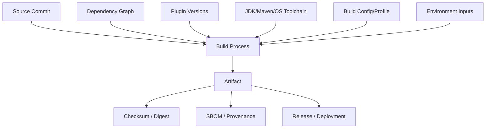
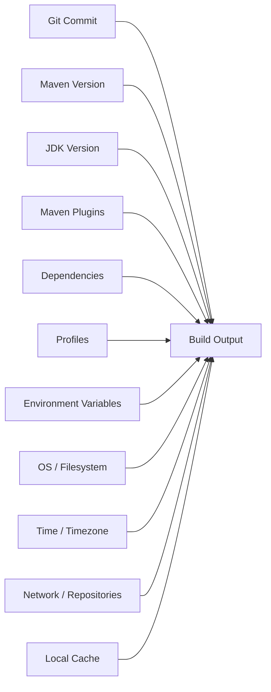
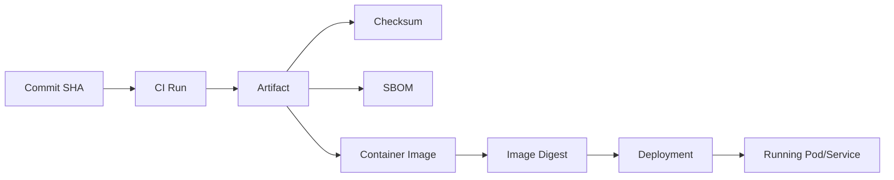
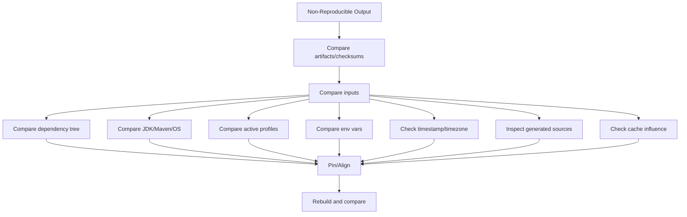

# Build Reproducibility and Determinism

## 1. Core Idea

Build reproducibility berarti source input yang sama, dependency input yang sama, toolchain yang sama, dan environment build yang sama menghasilkan artifact yang sama atau setidaknya dapat dijelaskan secara deterministic.

Build determinism berarti hasil build tidak bergantung pada faktor tersembunyi seperti:

- waktu build,
- local machine state,
- Maven cache yang kebetulan ada,
- OS developer,
- locale,
- timezone,
- file ordering,
- network availability,
- snapshot dependency yang berubah,
- plugin version floating,
- generated source tidak stabil,
- environment variable tidak terdokumentasi,
- CI runner image yang berubah diam-diam.

Mental model:



Senior engineer harus bisa menjawab:

> "Kalau kita rebuild commit ini minggu depan di CI yang bersih, apakah artifact-nya sama atau explainably equivalent?"

Jika jawabannya tidak jelas, release traceability dan rollback confidence lemah.

---

## 2. Why Reproducibility Matters

Build reproducibility penting untuk:

- release trust,
- incident investigation,
- rollback confidence,
- supply-chain security,
- artifact provenance,
- vulnerability response,
- compliance/audit,
- CI reliability,
- developer productivity,
- debugging local-vs-CI mismatch.

Tanpa reproducibility:

- artifact sulit dikaitkan ke commit,
- release tidak bisa diverifikasi,
- bug sulit direproduksi,
- CVE fix sulit dipastikan masuk artifact,
- rollback bisa mengembalikan artifact yang tidak diketahui isinya,
- local build dan CI build berbeda,
- developer menghabiskan waktu mengejar build failure yang tidak deterministik.

Reproducibility adalah fondasi release discipline.

---

## 3. Deterministic vs Reproducible

Ada perbedaan praktis:

### Deterministic Build

Input sama menghasilkan output sama.

Contoh:

- commit sama,
- dependency sama,
- plugin sama,
- JDK sama,
- OS sama,
- command sama,
- output checksum sama.

### Reproducible Build

Build bisa diulang oleh pihak/environment lain dengan hasil sama atau dapat diverifikasi setara.

Dalam enterprise, sering kali target realistis adalah:

- artifact traceable,
- input terkunci,
- build environment terdokumentasi,
- perbedaan output dapat dijelaskan,
- checksum/digest disimpan,
- SBOM/provenance tersedia.

Tidak semua build harus byte-for-byte reproducible sejak hari pertama, tetapi hidden non-determinism harus dikurangi dan diketahui.

---

## 4. Build Input Model

Build output dipengaruhi oleh banyak input.



Reproducibility work berarti mengidentifikasi input mana yang:

- explicit,
- pinned,
- inherited,
- implicit,
- mutable,
- environment-specific,
- not documented.

Senior engineer harus membuat hidden inputs menjadi visible inputs.

---

## 5. Locked Dependency Versions

Dependency version harus terkunci.

Risiko muncul jika menggunakan:

- version range,
- snapshot dependency,
- unpinned transitive override,
- dependency yang dikontrol repository metadata berubah,
- BOM floating version,
- parent POM floating version.

Contoh version range anti-pattern:

```xml
<version>[1.0,2.0)</version>
```

Untuk enterprise release, version range membuat build sulit diprediksi.

Lebih baik:

```xml
<version>1.2.3</version>
```

Atau dikelola melalui BOM/parent POM:

```xml
<dependencyManagement>
  <dependencies>
    <dependency>
      <groupId>example</groupId>
      <artifactId>example-bom</artifactId>
      <version>1.2.3</version>
      <type>pom</type>
      <scope>import</scope>
    </dependency>
  </dependencies>
</dependencyManagement>
```

Kuncinya bukan semua child menulis version eksplisit, tetapi version source harus jelas dan immutable untuk release.

---

## 6. Plugin Version Pinning

Maven plugin adalah executable build logic.

Jika plugin version tidak dipin, build bisa berubah saat plugin default berubah atau parent POM berubah.

Contoh anti-pattern:

```xml
<plugin>
  <groupId>org.apache.maven.plugins</groupId>
  <artifactId>maven-compiler-plugin</artifactId>
</plugin>
```

Lebih baik version dipin melalui `pluginManagement`:

```xml
<pluginManagement>
  <plugins>
    <plugin>
      <groupId>org.apache.maven.plugins</groupId>
      <artifactId>maven-compiler-plugin</artifactId>
      <version>3.x.y</version>
    </plugin>
  </plugins>
</pluginManagement>
```

Plugin yang sangat memengaruhi reproducibility:

- compiler plugin,
- surefire plugin,
- failsafe plugin,
- jar plugin,
- war plugin,
- shade plugin,
- source plugin,
- javadoc plugin,
- dependency plugin,
- enforcer plugin,
- docker/image plugin,
- OpenAPI/codegen plugin,
- annotation processing plugin,
- formatter/linter plugin.

Command review:

```bash
mvn help:effective-pom -Doutput=target/effective-pom.xml
mvn versions:display-plugin-updates
mvn dependency:resolve-plugins
```

---

## 7. Maven Wrapper and Build Tool Version

Maven version sendiri memengaruhi build.

Gunakan Maven Wrapper jika repository mengharapkan Maven version tertentu:

```bash
./mvnw -version
./mvnw clean verify
```

File terkait:

```text
mvnw
mvnw.cmd
.mvn/wrapper/maven-wrapper.properties
.mvn/maven.config
```

Risiko tanpa wrapper:

- developer memakai Maven berbeda,
- CI memakai Maven berbeda,
- plugin compatibility berbeda,
- dependency resolution behavior berbeda,
- output metadata berbeda,
- troubleshooting sulit.

Internal verification:

- apakah tim wajib memakai `./mvnw`?
- versi Maven apa yang disetujui?
- apakah CI memakai wrapper atau Maven dari runner image?

---

## 8. JDK Version and Toolchains

JDK version memengaruhi:

- compilation,
- bytecode version,
- annotation processing,
- generated code,
- test runtime,
- TLS/crypto defaults,
- locale/time behavior,
- class library behavior,
- performance.

Command:

```bash
java -version
javac -version
./mvnw -version
```

Compiler config penting:

```xml
<plugin>
  <groupId>org.apache.maven.plugins</groupId>
  <artifactId>maven-compiler-plugin</artifactId>
  <configuration>
    <release>17</release>
  </configuration>
</plugin>
```

`<release>` lebih aman daripada hanya `source` dan `target` karena mengontrol API platform yang tersedia saat compile.

Maven Toolchains bisa dipakai jika build perlu JDK tertentu:

```xml
<plugin>
  <groupId>org.apache.maven.plugins</groupId>
  <artifactId>maven-toolchains-plugin</artifactId>
</plugin>
```

Internal verification:

- build JDK berapa?
- runtime JDK berapa?
- apakah compiler release sesuai runtime target?
- apakah CI dan Docker image memakai JDK/JRE yang sama family?

---

## 9. Build Timestamp Problems

Timestamp sering membuat artifact tidak deterministic.

Contoh sumber timestamp:

- JAR manifest `Build-Time`,
- generated file,
- OpenAPI generated docs,
- source generation,
- packaged resource,
- Docker image layer metadata,
- release note generation,
- test snapshot output.

Maven mendukung property untuk output timestamp dalam beberapa plugin:

```xml
<properties>
  <project.build.outputTimestamp>${git.commit.time}</project.build.outputTimestamp>
</properties>
```

Atau timestamp tetap:

```xml
<properties>
  <project.build.outputTimestamp>2026-01-01T00:00:00Z</project.build.outputTimestamp>
</properties>
```

Namun value final harus mengikuti release policy. Jangan mengarang internal policy.

Pertanyaan review:

- apakah JAR output mengandung timestamp build sekarang?
- apakah timestamp diperlukan untuk debugging?
- apakah timestamp membuat checksum berubah?
- apakah build metadata lebih baik disimpan sebagai separate provenance daripada mengubah artifact?

---

## 10. Generated Sources

Generated source adalah sumber non-determinism yang umum.

Contoh:

- OpenAPI client/server generation,
- JAXB generation,
- annotation processing,
- MapStruct generated code,
- QueryDSL generated code,
- gRPC/protobuf generation,
- build-info generation,
- version class generation.

Risiko:

- generated output berubah karena tool version,
- file ordering tidak stabil,
- timestamp masuk generated file,
- absolute path masuk generated file,
- OS line ending berbeda,
- generated code tidak di-commit tetapi dibutuhkan IDE,
- generated code di-commit tetapi tidak sync dengan source spec.

Review checklist:

- generator version dipin?
- generated source masuk Git atau target directory?
- output deterministic?
- ada timestamp/header volatile?
- spec input versioned?
- CI clean build menghasilkan output sama?

---

## 11. OS-Dependent Builds

Build bisa bergantung pada OS.

Perbedaan umum:

- path separator `/` vs `\\`,
- file permission,
- executable bit,
- symlink support,
- case-sensitive filesystem,
- line ending,
- shell command availability,
- GNU vs BSD tool behavior,
- Docker Desktop behavior,
- filesystem ordering,
- default locale/timezone.

Contoh anti-pattern di Maven plugin/script:

```bash
cp target/*.jar /tmp/app.jar
sed -i 's/a/b/g' file
find . -name "*.java" | xargs grep Something
```

Di macOS, `sed -i` behavior berbeda dari GNU sed.

Jika script dipakai di CI Linux, local macOS, dan WSL, cross-platform behavior harus dipikirkan.

Internal verification:

- OS developer yang umum,
- OS CI runner,
- apakah script hanya didukung di Linux,
- apakah WSL didukung,
- apakah line ending policy jelas.

---

## 12. Locale and Timezone Dependency

Build/test bisa bergantung pada locale/timezone.

Risiko:

- date formatting berbeda,
- sorting berbeda,
- decimal separator berbeda,
- text collation berbeda,
- tests gagal hanya di CI,
- generated docs berbeda,
- snapshot output berbeda.

Command check:

```bash
date
locale
echo "$TZ"
```

CI dapat menetapkan environment:

```bash
export TZ=UTC
export LANG=C.UTF-8
export LC_ALL=C.UTF-8
```

Namun jangan menetapkan sembarangan tanpa memahami aplikasi. Untuk test date/time, explicit timezone biasanya lebih baik daripada bergantung global environment.

Review question:

- apakah test bergantung default timezone?
- apakah generated artifact bergantung locale?
- apakah sort order stabil?
- apakah release artifact menyimpan timestamp lokal?

---

## 13. Network-Dependent Build

Build yang butuh network bisa tidak reproducible.

Network dependency bisa muncul dari:

- Maven dependency resolution,
- plugin download,
- generated client download schema,
- integration test ke service eksternal,
- container image pull,
- license/scanner DB update,
- codegen dari URL remote,
- downloading binaries in script.

Risiko:

- remote resource berubah,
- service down,
- rate limit,
- credential expired,
- proxy berbeda,
- DNS issue,
- repository mirror berbeda,
- unreviewed artifact masuk build.

Lebih baik:

- dependency diambil dari artifact repository internal/proxy,
- schema/spec versioned di repo atau artifact,
- integration test external diberi profile/gate jelas,
- scanner DB update dipisah dari deterministic package step jika perlu,
- container base image digest dipin untuk release.

---

## 14. Local Cache Dependency

Maven local repository di `~/.m2/repository` sering menyembunyikan masalah.

Build bisa hijau di local karena dependency ada di cache, tetapi gagal di CI clean runner.

Atau sebaliknya, local gagal karena cache corrupt.

Command:

```bash
ls ~/.m2/repository
mvn -U clean verify
mvn dependency:purge-local-repository
```

Gunakan dengan hati-hati:

```bash
rm -rf ~/.m2/repository/group/path
```

Jangan biasakan `rm -rf ~/.m2` sebagai default. Itu mahal dan tidak selalu menjelaskan root cause.

Pertanyaan debugging:

- apakah dependency tersedia di repository remote?
- apakah credential benar?
- apakah local cache stale/corrupt?
- apakah CI runner clean?
- apakah snapshot update behavior berbeda?

---

## 15. Maven Profiles and Hidden Inputs

Maven profile bisa mengubah dependency, plugin, property, resource, dan test behavior.

Risiko reproducibility:

- profile aktif otomatis by OS/JDK/env,
- local dan CI menjalankan profile berbeda,
- release profile mengubah artifact,
- integration profile mengubah test set,
- profile mengaktifkan dependency tambahan,
- profile mengubah repository.

Command:

```bash
mvn help:active-profiles
mvn help:all-profiles
mvn help:effective-pom -Doutput=target/effective-pom.xml
```

Review:

- profile apa yang aktif di local?
- profile apa yang aktif di CI?
- profile apa yang aktif saat release?
- apakah activation eksplisit atau implicit?
- apakah profile documented?

---

## 16. Environment Variables as Build Inputs

Environment variable bisa mengubah build.

Contoh:

- `JAVA_HOME`,
- `MAVEN_OPTS`,
- `MAVEN_CONFIG`,
- `CI`,
- `TZ`,
- `LANG`,
- repository credentials,
- proxy variables,
- feature flags for tests,
- Docker host variables,
- cloud credentials,
- profile activation env.

Command:

```bash
env | sort
./mvnw -version
./mvnw help:active-profiles
```

Security note: jangan paste full `env` ke PR/chat/log karena bisa mengandung secret.

Untuk evidence, redact sensitive values.

---

## 17. Build Artifact Hash

Artifact hash membantu membuktikan artifact identity.

Command:

```bash
sha256sum target/*.jar
shasum -a 256 target/*.jar
```

Untuk container image:

```bash
docker image inspect my-image:tag --format '{{.Id}}'
docker image inspect my-image:tag --format '{{index .RepoDigests 0}}'
```

Hash berguna untuk:

- release evidence,
- artifact comparison,
- rollback verification,
- supply-chain audit,
- incident investigation.

Namun hash berubah jika artifact mengandung timestamp atau non-deterministic ordering.

Jika byte-for-byte reproducibility belum tercapai, simpan setidaknya:

- source commit,
- build command,
- Maven/JDK version,
- dependency tree,
- SBOM,
- artifact checksum,
- CI run ID,
- container digest.

---

## 18. Artifact Provenance

Provenance menjawab asal-usul artifact.

Artifact provenance minimal mencakup:

- Git repository,
- commit SHA,
- branch/tag,
- CI run ID,
- build actor/system,
- build timestamp,
- command/stage,
- JDK/Maven version,
- dependency graph/SBOM,
- artifact checksum,
- container image digest,
- deployment environment.

Mental model:



Without provenance, release investigation becomes guesswork.

---

## 19. Reproducible JAR Concerns

JAR files can be non-deterministic because of:

- entry timestamps,
- file ordering,
- manifest fields,
- generated resources,
- build user/path,
- compression metadata,
- plugin version behavior.

Maven JAR plugin and related archiver support reproducibility options in modern versions.

Review:

- is `project.build.outputTimestamp` configured?
- are plugin versions modern and pinned?
- does manifest include volatile data?
- are generated resources stable?
- is file ordering deterministic?

Command comparison:

```bash
sha256sum target/app.jar
jar tf target/app.jar | head
unzip -l target/app.jar | head
```

A changed hash is not automatically wrong, but unexplained changed hash is a reproducibility smell.

---

## 20. Reproducible Docker Image Concerns

Even if Maven artifact is stable, Docker image may not be.

Sources of non-determinism:

- floating base image tag,
- `apt-get update` without pinned package versions,
- downloading binary during build,
- copying files with changing timestamps,
- build args not recorded,
- layer ordering,
- Docker builder version,
- OS package repository changes,
- timezone/locale,
- multi-stage build pulling latest tool image.

Bad:

```dockerfile
FROM eclipse-temurin:17
RUN apt-get update && apt-get install -y curl
```

More reproducible direction:

- pin base image by digest for release-critical builds,
- avoid unnecessary package install,
- use controlled internal base image,
- copy known artifact from CI,
- record image digest,
- scan final image,
- avoid downloading unpinned external files.

Internal verification: check base image policy and registry rules.

---

## 21. CI Runner Determinism

CI runner affects build.

Variables:

- runner OS,
- runner image version,
- installed JDK/Maven,
- workspace cleanliness,
- cache restore behavior,
- network access,
- credentials,
- timezone/locale,
- CPU/memory,
- parallelism.

Review CI config:

- is JDK setup explicit?
- is Maven version explicit?
- does CI use `./mvnw`?
- are caches keyed correctly?
- can cache hide dependency issue?
- are environment variables documented?
- are build artifacts uploaded?
- is CI run linked to release artifact?

CI should be the canonical build environment for release.

Local builds are for developer feedback; release confidence should come from controlled CI.

---

## 22. Cache Strategy and Reproducibility

Cache improves speed but can reduce determinism if unmanaged.

Caches:

- Maven local repository cache,
- GitHub Actions cache,
- Docker layer cache,
- test cache,
- generated source cache,
- scanner DB cache.

Risks:

- stale dependency,
- corrupted artifact,
- cache key too broad,
- cache key too narrow,
- cache hit hides missing dependency,
- cache behavior differs by branch,
- snapshot dependency stale.

Good cache strategy:

- key includes OS, JDK, Maven, lock-relevant files,
- cache is optimization, not correctness requirement,
- clean build possible,
- release build can be validated from clean or controlled cache,
- cache miss does not fail build.

---

## 23. Dependency Resolution Determinism

Maven dependency resolution depends on:

- POM,
- parent POM,
- BOM,
- settings.xml,
- mirrors,
- repositories,
- local cache,
- snapshot update policy,
- plugin repositories,
- active profiles.

Command evidence:

```bash
./mvnw help:effective-pom -Doutput=target/effective-pom.xml
./mvnw help:effective-settings -Doutput=target/effective-settings.xml
./mvnw dependency:tree -DoutputFile=target/dependency-tree.txt
```

For release investigation, keep dependency tree and effective POM as artifacts if internal process allows.

Do not expose credentials from effective settings.

---

## 24. Test Determinism

Tests can be non-deterministic even when build artifact is stable.

Causes:

- test order dependency,
- shared static state,
- current time,
- random data without seed,
- external service dependency,
- race condition,
- async timing,
- port conflict,
- filesystem temp conflict,
- Docker/Testcontainers pull variance,
- database state leakage,
- timezone/locale,
- parallel execution.

Controls:

- isolate test data,
- use deterministic clock,
- seed randomness,
- avoid fixed ports,
- clean containers/databases,
- separate unit and integration tests,
- avoid sleeps; use await conditions,
- capture logs and reports,
- document flaky tests.

Test determinism is part of build determinism because CI signal must be trustworthy.

---

## 25. File Ordering and Archive Determinism

Some build outputs depend on file ordering.

Risks:

- filesystem returns files in different order,
- `find` output not sorted,
- generated resource order changes,
- archive entry order changes,
- service loader file merge order changes.

Safer shell pattern:

```bash
find src/main/resources -type f | sort
```

If script builds archives manually, ensure deterministic ordering.

Maven plugins usually handle common cases better than custom scripts, but generated resources and custom packaging still need review.

---

## 26. Line Endings and File Modes

Line ending differences can affect:

- shell scripts,
- generated files,
- checksum,
- tests comparing golden files,
- Docker build,
- Git diff noise.

File mode differences can affect:

- executable scripts,
- Docker entrypoint,
- CI scripts,
- package artifacts.

Relevant files:

```text
.gitattributes
.gitignore
.editorconfig
scripts/*.sh
mvnw
Dockerfile
```

Review:

- are shell scripts executable?
- are line endings normalized?
- are generated files stable?
- does Windows/WSL workflow preserve file modes?

---

## 27. Build Metadata

Build metadata can be useful but must be controlled.

Examples:

- commit SHA,
- branch,
- tag,
- build number,
- CI run URL,
- build time,
- artifact version.

Risks:

- metadata makes artifact non-reproducible,
- metadata includes local path/user,
- metadata includes secret/env,
- metadata differs local vs CI,
- metadata not exposed where needed.

Better approach:

- include stable commit/tag/version,
- avoid volatile local machine data,
- put detailed provenance in external metadata/artifact where possible,
- expose build info endpoint only if security policy allows,
- ensure runtime logs include safe version identity.

---

## 28. Build Number vs Version

Do not confuse:

- Maven version,
- Git tag,
- CI build number,
- Docker image tag,
- image digest,
- deployment revision,
- application runtime version.

A robust release system maps these together.

Example mapping:

```text
Git commit: abc123
Git tag: service-1.8.4
Maven version: 1.8.4
JAR checksum: sha256:...
Docker image tag: service:1.8.4
Docker image digest: sha256:...
Deployment revision: rollout-...
```

If only image tag is known but digest is not, tag mutability can weaken traceability.

If only CI build number is known but commit/tag is not, debugging gets harder.

---

## 29. Release Build vs Developer Build

Developer build optimizes feedback speed.

Release build optimizes trust.

Developer build may allow:

- skipping integration tests,
- using local services,
- using caches,
- debug profile,
- faster partial builds.

Release build should require:

- clean controlled environment,
- pinned tools,
- full verification,
- security scans,
- SBOM/provenance,
- artifact publishing,
- immutable artifact,
- traceable deployment.

Do not design release build around local convenience.

Do not force every local command to be as heavy as release build.

Separate workflows clearly.

---

## 30. Build Reproducibility in GitOps

In GitOps-oriented environments, desired state is stored in Git.

Reproducibility concerns:

- source repo commit,
- image digest in deployment manifest,
- config repo commit,
- Helm chart version,
- Kustomize overlay,
- environment values,
- secret version,
- rollout controller behavior.

A reproducible application release requires more than Maven build reproducibility.

It requires traceability across:

```text
app source commit -> artifact -> image digest -> deployment config commit -> cluster state
```

Internal verification:

- does deployment use image tag or digest?
- how are Helm chart versions pinned?
- how are environment values versioned?
- how are config changes audited?

---

## 31. Build Reproducibility in Cloud Context

AWS/Azure impact:

- container registry tag mutability,
- artifact repository retention,
- secret versioning,
- build runner image,
- IAM/RBAC permissions,
- object storage artifact retention,
- audit log availability,
- regional repository differences,
- private endpoint/network dependencies.

Questions:

- are artifacts immutable after publish?
- are image tags mutable?
- is digest recorded?
- is artifact retained long enough for audit/rollback?
- are build logs retained?
- are release approvals traceable?

---

## 32. Failure Modes

### 32.1 Same Commit, Different Artifact

Likely causes:

- timestamp,
- plugin version drift,
- dependency drift,
- generated source,
- file order,
- locale/timezone,
- OS difference.

### 32.2 Local Build Passes, CI Fails

Likely causes:

- local cache,
- different JDK/Maven,
- missing env var,
- different profile,
- OS difference,
- missing credential,
- test order/timing,
- network access.

### 32.3 CI Passes, Release Fails

Likely causes:

- release profile differs,
- scan gate differs,
- artifact repository permission,
- version already exists,
- snapshot dependency,
- tag/version mismatch,
- SBOM missing,
- signing/provenance issue.

### 32.4 Rebuild Cannot Reproduce Old Artifact

Likely causes:

- dependency no longer available,
- snapshot changed,
- plugin changed,
- base image changed,
- build runner changed,
- generated resource changed,
- repository retention issue.

---

## 33. Detection Techniques

### 33.1 Capture Tool Versions

```bash
java -version
javac -version
./mvnw -version
uname -a
```

### 33.2 Capture Maven Inputs

```bash
./mvnw help:active-profiles
./mvnw help:effective-pom -Doutput=target/effective-pom.xml
./mvnw dependency:tree -DoutputFile=target/dependency-tree.txt
```

### 33.3 Capture Artifact Hash

```bash
sha256sum target/*.jar
```

### 33.4 Compare Builds

```bash
mkdir -p /tmp/build-a /tmp/build-b
# build twice in clean workspaces if practical
sha256sum /tmp/build-a/*.jar /tmp/build-b/*.jar
```

### 33.5 Inspect Archive

```bash
jar tf target/*.jar | head -50
unzip -l target/*.jar | head -50
```

### 33.6 Check Profiles

```bash
./mvnw help:active-profiles
```

### 33.7 Check Environment Carefully

```bash
env | sort
```

Redact secret values before sharing.

---

## 34. Debugging Non-Reproducible Build

Workflow:



Triage questions:

- what exactly differs?
- artifact hash or runtime behavior?
- same workspace or clean workspace?
- same JDK/Maven?
- same dependency tree?
- same active profiles?
- same environment?
- same timestamp behavior?
- same generated sources?
- same base image?

Do not start by deleting everything. First capture evidence.

---

## 35. Correctness Concerns

Non-deterministic build can become correctness issue.

Examples:

- generated API model differs,
- build profile changes resource filtering,
- timezone changes test baseline,
- dependency drift changes runtime behavior,
- local cache hides missing dependency,
- Docker base image changes OS library,
- JDK changes TLS/cert behavior.

Correctness means the artifact you tested is the artifact you release.

If build output changes after tests, test evidence is weakened.

---

## 36. Productivity Concerns

Poor reproducibility causes:

- "works on my machine",
- CI-only failures,
- slow onboarding,
- random retry culture,
- excessive cache cleaning,
- unclear release failure,
- distrust in pipeline,
- large investigation cost.

Developer productivity improves when:

- tools are versioned,
- commands are documented,
- CI and local are close enough,
- release workflow is deterministic,
- failure evidence is easy to collect,
- cache behavior is predictable.

---

## 37. Security Concerns

Reproducibility is supply-chain security.

Risks:

- dependency confusion,
- artifact tampering,
- unpinned plugin execution,
- mutable image tag,
- snapshot dependency in release,
- build from untrusted repository,
- generated source from remote URL,
- untracked binary checked into repo,
- secret in build metadata,
- artifact cannot be tied to commit.

Security review should ask:

- can we prove what source produced this artifact?
- can we prove what dependency versions were included?
- can we prove scan result matches deployed artifact?
- can we prove image digest matches deployment?

---

## 38. Release Concerns

Release process depends on reproducibility.

Release checklist:

- version final and immutable,
- Git tag created correctly,
- Maven artifact published once,
- artifact checksum recorded,
- SBOM generated,
- image built from correct artifact,
- image digest recorded,
- deployment manifest references correct version/digest,
- release note references commit/tag,
- rollback target known,
- build logs retained.

If artifact is rebuilt during promotion, ensure rebuild is controlled or avoid rebuild by promoting immutable artifact.

Promotion should prefer moving the same artifact forward, not creating a similar artifact repeatedly.

---

## 39. Observability and Incident Support Concerns

During incident, reproducibility helps answer:

- what version is running?
- which commit produced it?
- what dependency versions are inside?
- what config/deployment manifest was used?
- what image digest is running?
- can we rebuild it?
- can we rollback to known-good artifact?

Runtime should expose safe version identity through one or more channels if approved:

- startup log,
- health/info endpoint,
- metric label,
- deployment annotation,
- image label,
- release dashboard.

Do not expose sensitive build metadata publicly.

---

## 40. Practical Maven Commands

### Clean verify with wrapper

```bash
./mvnw clean verify
```

### Show Maven and Java version

```bash
./mvnw -version
java -version
```

### Active profiles

```bash
./mvnw help:active-profiles
```

### Effective POM

```bash
./mvnw help:effective-pom -Doutput=target/effective-pom.xml
```

### Dependency tree

```bash
./mvnw dependency:tree -DoutputFile=target/dependency-tree.txt
```

### Plugin updates

```bash
./mvnw versions:display-plugin-updates
```

### Dependency updates

```bash
./mvnw versions:display-dependency-updates
```

### Artifact hash

```bash
sha256sum target/*.jar
```

### Inspect JAR

```bash
jar tf target/*.jar | less
```

---

## 41. Reproducibility Evidence Bundle

For important release/build investigation, capture:

```text
Git commit SHA
Git branch/tag
CI run ID
Build command
JDK version
Maven version
OS/runner image
Active Maven profiles
Effective POM
Dependency tree
SBOM
Artifact checksum
Container image digest
Relevant environment variables, redacted
Build logs
Test reports
Scanner results
```

Do not include secrets.

Evidence bundle should be attached to release artifact or accessible through CI/release system if internal policy allows.

---

## 42. PR Review Checklist

For changes affecting reproducibility, ask:

- Does this change dependency versions?
- Does this change plugin versions?
- Does this change parent POM/BOM?
- Does this add generated source?
- Does this add build timestamp or metadata?
- Does this add OS-specific script?
- Does this rely on local cache?
- Does this rely on network resource?
- Does this change Maven profiles?
- Does this change Docker base image?
- Does this change CI runner/tool setup?
- Does this change release artifact content?
- Is build command documented?
- Is CI using wrapper or pinned tools?
- Is artifact checksum/provenance preserved?
- Does rollback still use immutable artifact?
- Are secrets excluded from build logs/metadata?

---

## 43. Internal Verification Checklist

Verify the following in the internal CSG/team context:

- official Maven version,
- whether Maven Wrapper is mandatory,
- official JDK build version,
- official runtime JDK/JRE version,
- compiler release target,
- parent POM and pluginManagement owner,
- dependency/BOM version alignment policy,
- snapshot dependency policy,
- release build command,
- CI runner OS/image,
- CI cache strategy,
- active Maven profiles in CI/release,
- artifact repository policy,
- artifact immutability policy,
- SBOM/provenance requirement,
- artifact checksum retention,
- Docker base image policy,
- image tag mutability policy,
- image digest recording,
- GitOps deployment versioning approach,
- release evidence retention,
- build metadata exposure policy,
- incident process for identifying deployed version.

Do not infer these details. Verify from README, CONTRIBUTING, POM, parent POM, `.mvn`, workflow files, Dockerfile, deployment manifests, artifact repository, release guide, and senior/platform/SRE/security discussion.

---

## 44. Common Anti-Patterns

Avoid:

- relying on globally installed Maven,
- relying on unspecified JDK,
- unpinned Maven plugin versions,
- version ranges in release dependency,
- snapshot dependencies in release artifact,
- generated source with timestamps,
- build scripts downloading latest binaries,
- Dockerfile using floating base image for release-critical path,
- CI cache required for correctness,
- local-only profile for production-like build,
- environment variables silently changing artifact,
- release builds from dirty working tree,
- rebuilding artifact during promotion instead of promoting immutable artifact,
- image tags without digest traceability,
- release note without commit/artifact mapping,
- artifact without checksum/SBOM/provenance.

---

## 45. Senior Engineer Heuristics

Use these heuristics:

- Make build inputs explicit.
- Pin executable build logic.
- Prefer wrapper over global tool assumptions.
- Prefer immutable artifacts over rebuild-per-environment.
- Treat CI release build as canonical.
- Treat local build as feedback, not release proof.
- Capture dependency tree for meaningful release/debug work.
- Do not let cache become correctness dependency.
- Make generated source deterministic or clearly controlled.
- Record image digest, not only tag.
- Keep build metadata safe and useful.
- Investigate non-determinism with evidence, not superstition.

---

## 46. Practice Exercises

### Exercise 1: Capture Build Inputs

Run:

```bash
./mvnw -version
java -version
./mvnw help:active-profiles
./mvnw help:effective-pom -Doutput=target/effective-pom.xml
./mvnw dependency:tree -DoutputFile=target/dependency-tree.txt
```

Summarize build inputs.

### Exercise 2: Build Twice and Compare

In two clean workspaces, run:

```bash
./mvnw clean package
sha256sum target/*.jar
```

Compare hashes and investigate differences.

### Exercise 3: Inspect Generated Sources

Find generated source/resource directories.

Check whether output contains:

- timestamp,
- absolute path,
- random ID,
- unordered files,
- environment-specific value.

### Exercise 4: Compare Local and CI

Compare:

- JDK version,
- Maven version,
- active profiles,
- command,
- environment,
- dependency tree,
- test reports.

Document mismatch.

---

## 47. Summary

Build reproducibility and determinism are not academic concerns.

They directly affect:

- release confidence,
- rollback safety,
- CVE response,
- artifact audit,
- local-vs-CI debugging,
- incident investigation,
- developer productivity,
- supply-chain security.

A senior backend engineer should be able to identify build inputs, pin critical versions, detect hidden non-determinism, capture release evidence, and review changes that affect artifact trust.

The goal is simple:

> The artifact we test, scan, publish, deploy, observe, and rollback should be traceable to known inputs and reproducible enough to trust.
