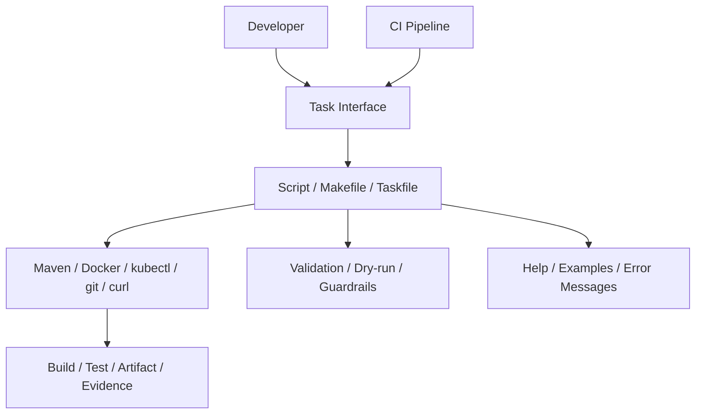

# Automation Scripts and Task Runners

## 1. Core Idea

Automation scripts dan task runners adalah interface operasional untuk repository.

Mereka menjawab:

- bagaimana build dijalankan,
- bagaimana test dijalankan,
- bagaimana dependency lokal dinyalakan,
- bagaimana database di-reset,
- bagaimana format/lint dijalankan,
- bagaimana image dibuat,
- bagaimana release helper dijalankan,
- bagaimana command CI direproduksi lokal.

Senior engineer harus melihat script bukan sebagai shortcut pribadi, tetapi sebagai contract antara repository dan engineer.

Mental model:



Automation yang baik meningkatkan:

- speed,
- consistency,
- onboarding,
- reproducibility,
- CI parity,
- debugging,
- release hygiene.

Automation yang buruk menciptakan:

- hidden behavior,
- unsafe destructive command,
- environment-specific failures,
- secret leakage,
- build mismatch,
- production incidents.

---

## 2. Why Automation Matters

Manual command yang panjang akan disalin, dimodifikasi, dilupakan, dan akhirnya menyimpang.

Automation membantu ketika:

- command punya banyak argument,
- urutan langkah penting,
- prerequisite harus divalidasi,
- cleanup harus konsisten,
- output harus distandardisasi,
- CI dan local harus share command,
- developer baru butuh path cepat,
- operational task perlu guardrail.

Contoh masalah tanpa automation:

```bash
mvn clean verify -Pci -DskipITs=false -Dsome.flag=true
```

Sebagian engineer akan menjalankan:

```bash
mvn test
```

Sebagian lain:

```bash
mvn clean install -DskipTests
```

Sebagian lagi memakai Maven global dan JDK berbeda.

Task runner bisa menyatukan interface:

```bash
./scripts/test-ci-local.sh
```

atau:

```bash
make verify
```

atau:

```bash
task verify
```

---

## 3. Script as Repository API

Script harus diperlakukan seperti API.

API yang baik:

- nama jelas,
- input jelas,
- output jelas,
- error jelas,
- backward compatible bila dipakai banyak orang,
- documented,
- tested minimal dengan smoke check,
- safe by default.

Contoh nama yang baik:

```bash
./scripts/bootstrap.sh
./scripts/test-unit.sh
./scripts/test-integration.sh
./scripts/run-local.sh
./scripts/reset-local-db.sh
./scripts/build-image.sh
./scripts/debug-env.sh
```

Contoh nama yang buruk:

```bash
./scripts/doit.sh
./scripts/run.sh
./scripts/new.sh
./scripts/fix.sh
```

Nama buruk menyembunyikan intention dan blast radius.

---

## 4. Bash Script Structure

Struktur script Bash yang layak untuk repository enterprise:

```bash
#!/usr/bin/env bash
set -Eeuo pipefail

script_dir="$(cd "$(dirname "${BASH_SOURCE[0]}")" && pwd)"
repo_root="$(cd "$script_dir/.." && pwd)"

usage() {
  cat <<'USAGE'
Usage: scripts/test-unit.sh [--help]

Run unit tests using the repository Maven wrapper.
USAGE
}

log() {
  printf '[%s] %s\n' "$(date -u +%Y-%m-%dT%H:%M:%SZ)" "$*"
}

main() {
  case "${1:-}" in
    -h|--help)
      usage
      exit 0
      ;;
  esac

  cd "$repo_root"
  log "Running unit tests"
  ./mvnw test
}

main "$@"
```

Elemen penting:

- shebang jelas,
- strict mode sadar caveat,
- path dihitung relatif ke script,
- `usage`,
- `main`,
- logging sederhana,
- quote variable,
- `./mvnw`, bukan asumsi `mvn`,
- exit code natural dari command utama.

---

## 5. Strict Mode Caveat

`set -euo pipefail` berguna, tetapi bukan magic safety.

```bash
set -Eeuo pipefail
```

Makna umum:

- `-e`: exit saat command gagal,
- `-u`: error saat variable belum didefinisikan,
- `pipefail`: pipeline gagal jika salah satu command gagal,
- `-E`: trap ERR diwariskan ke function/subshell tertentu.

Caveat:

- `set -e` punya behavior mengejutkan dalam conditional,
- command yang boleh gagal harus ditangani eksplisit,
- pipeline dengan `grep` yang tidak menemukan hasil bisa dianggap failure,
- cleanup tetap perlu `trap`,
- strict mode tidak menggantikan validasi input.

Contoh handling command yang boleh gagal:

```bash
if grep -q 'pattern' file.txt; then
  echo "found"
else
  echo "not found"
fi
```

Bukan:

```bash
grep -q 'pattern' file.txt
# script bisa berhenti di sini dengan set -e
```

---

## 6. Input Validation

Script harus menolak input tidak valid sedini mungkin.

Contoh:

```bash
required_env() {
  local name="$1"
  if [[ -z "${!name:-}" ]]; then
    echo "Missing required environment variable: $name" >&2
    exit 1
  fi
}

required_env "APP_ENV"
required_env "DATABASE_URL"
```

Untuk path destructive:

```bash
safe_rm_rf() {
  local target="$1"

  if [[ -z "$target" || "$target" == "/" || "$target" == "$HOME" ]]; then
    echo "Refusing to delete unsafe path: $target" >&2
    exit 1
  fi

  rm -rf -- "$target"
}
```

Untuk environment selection:

```bash
case "${APP_ENV:-}" in
  local|dev|test)
    ;;
  *)
    echo "APP_ENV must be local, dev, or test for this script" >&2
    exit 1
    ;;
esac
```

Rule:

> Validate before doing work, especially before deleting, deploying, publishing, tagging, or mutating shared state.

---

## 7. Idempotency

Script idempotent bisa dijalankan berkali-kali tanpa merusak state.

Contoh idempotent:

```bash
mkdir -p build/reports
```

Contoh tidak idempotent:

```bash
mkdir build/reports
```

Jika directory sudah ada, command gagal.

Idempotency penting untuk:

- bootstrap,
- local dependency setup,
- database migration,
- CI retry,
- release preparation,
- cleanup,
- Kubernetes apply,
- cloud resource tagging,
- evidence capture.

Namun idempotency bukan berarti semua efek diabaikan. Untuk destructive reset, idempotency harus disertai guardrail.

Contoh reset local DB:

```bash
if [[ "${APP_ENV:-}" != "local" ]]; then
  echo "Refusing to reset database unless APP_ENV=local" >&2
  exit 1
fi

./mvnw -Pdb-reset flyway:clean flyway:migrate
```

---

## 8. Dry-run Mode

Dry-run sangat penting untuk script yang:

- menghapus data,
- membuat tag,
- publish artifact,
- push image,
- menjalankan deployment,
- mengubah Kubernetes resource,
- memanggil cloud API,
- mengirim notification.

Pattern sederhana:

```bash
DRY_RUN=false

while [[ $# -gt 0 ]]; do
  case "$1" in
    --dry-run)
      DRY_RUN=true
      shift
      ;;
    *)
      echo "Unknown argument: $1" >&2
      exit 1
      ;;
  esac
done

run() {
  echo "+ $*"
  if [[ "$DRY_RUN" == "false" ]]; then
    "$@"
  fi
}

run ./mvnw clean verify
```

Dry-run output harus cukup akurat untuk direview.

Bad dry-run:

```text
Would deploy.
```

Good dry-run:

```text
Would run: kubectl --context dev --namespace quote-order apply -f deploy/service.yaml
Would use image: registry.example.com/service:1.2.3
Would target environment: dev
```

---

## 9. Safety Prompts

Safety prompt berguna untuk destructive local script, tetapi tidak boleh dipakai sebagai satu-satunya guard.

Contoh:

```bash
confirm() {
  local prompt="$1"
  read -r -p "$prompt [y/N] " answer
  case "$answer" in
    y|Y|yes|YES) ;;
    *) echo "Aborted"; exit 1 ;;
  esac
}

confirm "This will delete local database data. Continue?"
```

Untuk CI, interactive prompt harus bisa dinonaktifkan dengan flag eksplisit:

```bash
--yes
```

Namun `--yes` harus tetap hanya diizinkan untuk target aman.

Rule:

> Prompt bukan pengganti environment validation, context validation, permission validation, dan dry-run.

---

## 10. Logging and Observability for Scripts

Script yang baik menghasilkan output yang membantu debugging.

Logging harus menunjukkan:

- step yang sedang dijalankan,
- command penting,
- target environment,
- artifact/tag/image yang digunakan,
- lokasi output report,
- error context.

Contoh:

```bash
log() {
  printf '[%s] %s\n' "$(date -u +%Y-%m-%dT%H:%M:%SZ)" "$*"
}

log "Building Maven project"
./mvnw clean verify
log "Build completed"
```

Hindari:

- mencetak secret,
- mencetak full env tanpa redaction,
- output terlalu noisy sehingga error utama tenggelam,
- command silent tanpa konteks.

Untuk evidence:

```bash
mkdir -p build/evidence
./mvnw test | tee build/evidence/test-output.log
```

Pastikan evidence tidak berisi secret/PII sebelum dibagikan.

---

## 11. Makefile as Task Interface

Makefile sering dipakai sebagai task runner sederhana.

Contoh:

```makefile
.PHONY: help build test verify run clean

help:
	@grep -E '^[a-zA-Z_-]+:.*?## ' $(MAKEFILE_LIST) | sort | awk 'BEGIN {FS = ":.*?## "}; {printf "%-20s %s\n", $$1, $$2}'

build: ## Build the service
	./mvnw -DskipTests package

test: ## Run unit tests
	./mvnw test

verify: ## Run full verification
	./mvnw clean verify

run: ## Run locally
	./scripts/run-local.sh

clean: ## Clean build output
	./mvnw clean
```

Kelebihan Makefile:

- familiar,
- tersedia luas di Linux/macOS,
- bagus untuk command pendek,
- bisa menjadi daftar task repo.

Kekurangan:

- syntax tab-sensitive,
- portability Windows perlu perhatian,
- shell behavior bisa mengejutkan,
- dependency antar task bisa disalahgunakan,
- kurang ekspresif untuk logic kompleks.

Rule:

> Makefile cocok sebagai thin wrapper, bukan tempat business logic automation yang kompleks.

---

## 12. Taskfile Awareness

Taskfile adalah alternatif task runner yang lebih eksplisit berbasis YAML.

Contoh konseptual:

```yaml
version: '3'

tasks:
  test:
    desc: Run unit tests
    cmds:
      - ./mvnw test

  verify:
    desc: Run full verification
    cmds:
      - ./mvnw clean verify

  run:
    desc: Run service locally
    cmds:
      - ./scripts/run-local.sh
```

Kelebihan:

- deskripsi task jelas,
- cross-platform lebih baik jika distandardisasi,
- task dependencies lebih eksplisit,
- output lebih rapi.

Kekurangan:

- butuh tool tambahan,
- belum tentu tersedia di CI runner,
- perlu governance agar tidak menjadi layer baru yang membingungkan.

Jika tim memakai Taskfile, pastikan README menjelaskan install dan usage.

---

## 13. npm Scripts Awareness

Walaupun service utama Java/Maven, beberapa repo enterprise memakai `package.json` untuk:

- frontend asset,
- OpenAPI generation,
- lint docs,
- local tooling,
- markdown validation,
- generated client,
- wrapper task.

Contoh:

```json
{
  "scripts": {
    "lint:docs": "markdownlint '**/*.md'",
    "generate:api": "openapi-generator-cli generate ..."
  }
}
```

Risiko:

- Java engineer tidak sadar Node dependency diperlukan,
- Node version tidak dipin,
- package lock berubah tanpa review,
- npm script menduplikasi Maven/script behavior,
- CI dan local berbeda.

Internal verification perlu memastikan apakah Node/npm benar-benar bagian dari build atau hanya helper opsional.

---

## 14. Maven Wrapper as Automation Boundary

Untuk Java service, Maven wrapper adalah automation boundary penting.

Script sebaiknya memanggil:

```bash
./mvnw clean verify
```

bukan:

```bash
mvn clean verify
```

Kecuali ada alasan internal.

Manfaat:

- Maven version konsisten,
- onboarding lebih mudah,
- CI/local lebih mirip,
- mengurangi dependency pada global tool.

Script juga harus menjaga argument Maven tetap visible.

Buruk:

```bash
./scripts/build.sh
```

tanpa output command dan tanpa dokumentasi.

Lebih baik:

```bash
log "Running: ./mvnw clean verify -Pci"
./mvnw clean verify -Pci
```

---

## 15. CI Reuse vs Local Reuse

Automation terbaik sering dipakai oleh local dan CI.

Contoh:

```bash
./scripts/verify.sh
```

Dipakai di local:

```bash
./scripts/verify.sh
```

Dipakai di CI:

```yaml
- name: Verify
  run: ./scripts/verify.sh
```

Kelebihan:

- command tidak drift,
- CI behavior bisa direproduksi lokal,
- bug script cepat ketahuan,
- documentation lebih sederhana.

Risiko:

- script terlalu banyak branch `if CI then ...`,
- local script jadi lambat karena mengikuti full CI,
- CI butuh non-interactive behavior,
- local butuh ergonomic output.

Solusi:

- shared core script,
- flag eksplisit,
- mode local/ci jelas,
- no hidden environment magic.

Contoh:

```bash
./scripts/verify.sh --mode local
./scripts/verify.sh --mode ci
```

---

## 16. Automation for Build, Test, Run

Task minimal untuk Java/JAX-RS service:

```text
bootstrap       prepare local machine/repo prerequisites
build           package service without full verification
test            run unit tests
verify          run full local verification
run-local       run service locally
run-debug       run service with debug port
format          apply code formatting
lint            run static checks
clean           clean build output
```

Command example:

```bash
make bootstrap
make test
make verify
make run
```

atau:

```bash
./scripts/bootstrap.sh
./scripts/test-unit.sh
./scripts/verify.sh
./scripts/run-local.sh
```

Senior review concern:

- apakah task name stabil,
- apakah task terlalu banyak sehingga membingungkan,
- apakah task overlap,
- apakah task menjalankan command yang sama dengan CI,
- apakah task output jelas.

---

## 17. Automation for Local Dependencies

Task dependency lokal bisa mencakup:

```text
up              start local dependencies
down            stop local dependencies
reset-db        reset local database
migrate-db      run migration
seed-db         insert seed data
logs            tail local dependency logs
status          show local dependency status
```

Contoh:

```bash
./scripts/local-up.sh
./scripts/local-status.sh
./scripts/reset-local-db.sh --dry-run
./scripts/reset-local-db.sh --yes
```

Safety concern:

- pastikan target local,
- jangan gunakan production credential,
- jangan hardcode secret real,
- jangan flush shared environment,
- tampilkan target sebelum destructive action.

Contoh output yang baik:

```text
Target database: localhost:5432/app
Environment: local
Action: drop and recreate schema
```

---

## 18. Automation for Docker and Kubernetes

Docker/Kubernetes automation harus extra hati-hati.

Contoh task aman:

```bash
./scripts/build-image.sh --tag local
./scripts/k8s-logs.sh --namespace dev --app quote-service
./scripts/k8s-port-forward.sh --namespace dev --service quote-service --local-port 8080
```

Risiko besar:

- context Kubernetes salah,
- namespace salah,
- image tag salah,
- apply manual melanggar GitOps,
- delete resource shared,
- secret tercetak,
- command destructive tanpa dry-run.

Guardrail penting:

```bash
current_context="$(kubectl config current-context)"
echo "Kubernetes context: $current_context"

case "$current_context" in
  *prod*)
    echo "Refusing to run this script against production context" >&2
    exit 1
    ;;
esac
```

Namun jangan hanya mengandalkan string `prod`. Verifikasi internal naming convention harus dilakukan.

---

## 19. Automation for Release Helpers

Release helper script berisiko tinggi.

Tugas yang mungkin diotomasi:

- validate clean working tree,
- validate branch,
- compute version,
- update changelog,
- create release branch,
- create tag,
- build artifact,
- publish artifact,
- build/push image,
- generate release note.

Safety requirement:

- dry-run wajib,
- branch validation,
- clean working tree validation,
- remote status validation,
- version validation,
- tag existence check,
- explicit confirmation,
- no secret logging,
- audit output.

Contoh clean tree check:

```bash
if [[ -n "$(git status --porcelain)" ]]; then
  echo "Working tree is not clean" >&2
  git status --short
  exit 1
fi
```

Contoh tag check:

```bash
if git rev-parse "v$VERSION" >/dev/null 2>&1; then
  echo "Tag already exists: v$VERSION" >&2
  exit 1
fi
```

Release automation harus mengikuti process internal, bukan membuat process baru diam-diam.

---

## 20. Error Handling and Exit Codes

Script harus mengembalikan exit code yang benar.

CI bergantung pada exit code.

Buruk:

```bash
./mvnw test || true
```

Ini menyembunyikan failure.

Lebih baik jika failure boleh terjadi dalam mode tertentu:

```bash
if ! ./mvnw test; then
  echo "Tests failed. See report in target/surefire-reports" >&2
  exit 1
fi
```

Jika script mengumpulkan beberapa failure:

```bash
status=0
./scripts/lint.sh || status=1
./scripts/test-unit.sh || status=1
exit "$status"
```

Exit code convention:

- `0`: success,
- non-zero: failure,
- error message ke stderr,
- output machine-readable jika dipakai automation lain.

---

## 21. Portability and Shell Choice

Script harus jelas apakah menggunakan Bash atau POSIX shell.

Jika memakai Bash feature:

```bash
#!/usr/bin/env bash
```

Jika memakai POSIX sh:

```bash
#!/bin/sh
```

Jangan memakai Bash feature dalam `/bin/sh` script.

Bash-specific examples:

- arrays,
- `[[ ... ]]`,
- `${BASH_SOURCE[0]}`,
- process substitution,
- associative arrays.

Portability concerns:

- GNU vs BSD `sed`,
- GNU vs BSD `date`,
- `readlink -f` tidak tersedia di macOS default,
- path separator di Windows,
- line endings CRLF,
- executable bit hilang,
- Docker Desktop file mount behavior.

Untuk enterprise team, dokumentasikan supported environment.

---

## 22. Documentation for Scripts

Setiap script penting harus punya:

- purpose,
- usage,
- arguments,
- examples,
- prerequisites,
- side effects,
- safety notes,
- owner.

Minimal:

```bash
./scripts/run-local.sh --help
```

Output contoh:

```text
Usage: scripts/run-local.sh [--debug] [--profile local]

Run the service locally using the repository Maven wrapper.

Options:
  --debug          Enable Java debug port 5005
  --profile NAME   Runtime profile. Default: local
  -h, --help       Show this help
```

README cukup menunjuk ke script:

```markdown
## Common Commands

- `./scripts/bootstrap.sh` — install/validate local prerequisites
- `./scripts/test-unit.sh` — run unit tests
- `./scripts/verify.sh` — run CI-like verification locally
- `./scripts/run-local.sh --debug` — run service with debugger enabled
```

---

## 23. Security Concerns

Automation sering memproses secret.

Risiko:

- `set -x` mencetak token,
- command dengan token masuk shell history,
- script print `printenv`,
- CI logs menyimpan credential,
- artifact evidence berisi secret,
- `.env` ter-commit,
- release script memakai token terlalu luas,
- workflow script mengizinkan command injection dari input.

Hindari:

```bash
set -x
curl -H "Authorization: Bearer $TOKEN" ...
```

Jika debug tracing perlu, matikan saat memproses secret:

```bash
set +x
# secret-sensitive operation
set -x
```

Input dari user harus di-quote:

```bash
kubectl logs "deployment/$app" -n "$namespace"
```

Bukan:

```bash
kubectl logs deployment/$app -n $namespace
```

---

## 24. Failure Modes

Failure mode umum automation:

| Failure | Cause | Prevention |
|---|---|---|
| Script jalan di directory salah | relative path asumtif | compute repo root |
| Secret muncul di log | `set -x`/print env | redact, disable tracing |
| CI hijau tapi local gagal | command berbeda | shared script |
| Local hijau tapi CI gagal | local skip checks | `verify` CI-like command |
| Delete path salah | variable kosong | validate path |
| Kubernetes context salah | no context guard | print/validate context |
| Tag release salah | no version validation | validate tag/branch |
| Script hanya jalan di macOS | BSD/GNU mismatch | documented support/test |
| Error tersembunyi | `|| true` | explicit handling |
| Pipeline stuck | interactive prompt di CI | non-interactive mode |

---

## 25. PR Review Checklist

Saat mereview script/task runner, tanyakan:

- Apa purpose script ini?
- Apakah namanya jelas?
- Apakah ada `--help`?
- Apakah argument divalidasi?
- Apakah variable di-quote?
- Apakah path destructive aman?
- Apakah ada dry-run untuk mutation besar?
- Apakah script idempotent?
- Apakah script bisa dipakai CI/local tanpa drift?
- Apakah output cukup untuk debugging?
- Apakah exit code benar?
- Apakah secret bisa bocor?
- Apakah shell choice jelas?
- Apakah cross-platform concern diketahui?
- Apakah script menduplikasi logic lain?
- Apakah command Maven memakai `./mvnw`?
- Apakah Kubernetes/cloud context divalidasi?
- Apakah release/publish/tagging mengikuti process internal?

---

## 26. Internal Verification Checklist

Untuk konteks CSG/team, verifikasi:

- apakah repo menggunakan Bash scripts, Makefile, Taskfile, npm scripts, atau kombinasi,
- script utama untuk bootstrap/build/test/run,
- apakah command local dipakai ulang di CI,
- apakah CI menjalankan script repo atau command inline,
- apakah Maven wrapper wajib,
- apakah ada script reset DB lokal,
- apakah ada script untuk Kafka/RabbitMQ/Redis lokal,
- apakah ada Docker Compose workflow resmi,
- apakah ada release helper script,
- apakah ada deployment helper script,
- apakah GitOps melarang apply manual,
- apakah dry-run tersedia untuk destructive operation,
- apakah secret handling script sudah aman,
- apakah script punya owner,
- apakah script diuji atau minimal smoke-tested,
- apakah ada known script-related incident,
- apakah platform/SRE/security punya review requirement untuk automation changes.

---

## 27. Senior Engineer Operating Habit

Senior engineer harus memperlakukan automation sebagai shared engineering infrastructure.

Kebiasaan yang perlu dibangun:

- jangan membuat script pribadi untuk proses tim tanpa dokumentasi,
- jangan menyembunyikan behavior penting di alias lokal,
- ubah command berulang menjadi task yang jelas,
- pastikan task punya guardrail,
- gunakan dry-run untuk mutation,
- jaga CI/local parity,
- review script dengan standar production safety,
- hapus automation lama yang misleading,
- dokumentasikan failure mode umum,
- ajarkan engineer lain membaca script, bukan hanya menjalankannya.

Automation yang baik membuat tim lebih cepat. Automation yang buruk membuat tim lebih percaya diri saat melakukan hal yang salah.
