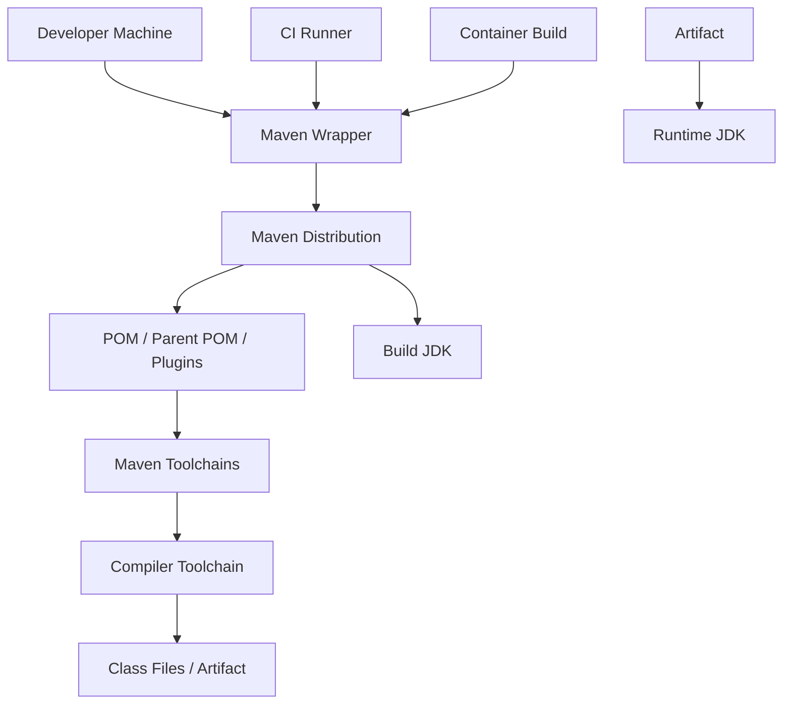
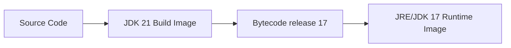
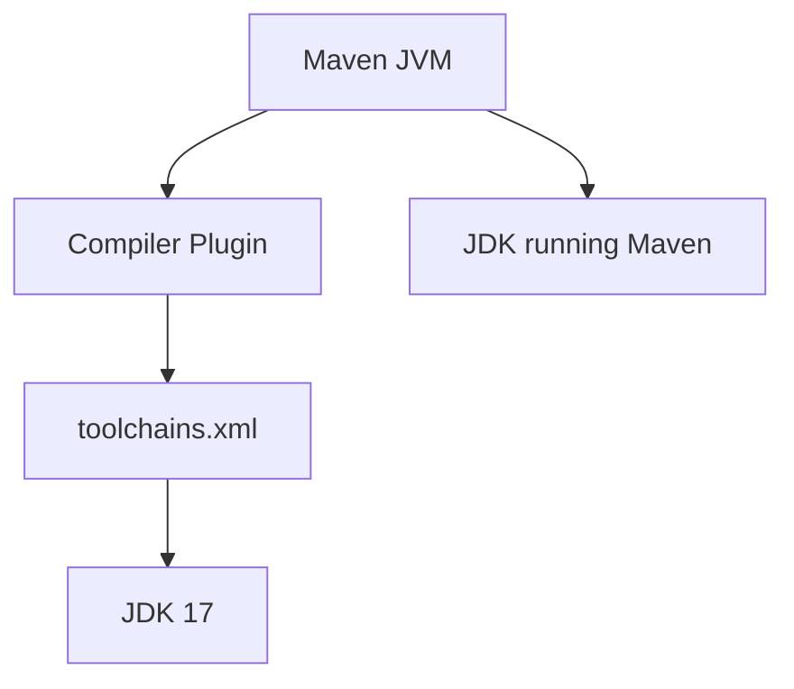

# Maven Wrapper and Tool Version Management

## 1. Core Idea

Tool version management adalah discipline untuk memastikan semua engineer, CI runner, container build, dan release pipeline memakai toolchain yang kompatibel dan dapat diprediksi.

Dalam backend Java/JAX-RS enterprise, versi tool bukan detail kecil. Versi tool menentukan:

- bytecode yang dihasilkan,
- plugin Maven yang dieksekusi,
- dependency resolution behavior,
- test execution behavior,
- compiler warning/error,
- compatibility dengan runtime JVM,
- reproducibility build,
- parity antara local dan CI,
- kemampuan rollback/rebuild artifact.

Mental model:



Senior engineer harus bisa menjawab:

- versi Java apa yang dipakai untuk build?
- versi Java apa yang dipakai untuk runtime?
- versi Maven apa yang dipakai?
- apakah developer memakai `./mvnw` atau Maven global?
- apakah compiler target dikunci?
- apakah CI dan local memakai command yang sama?
- apakah IDE memakai JDK yang sama dengan command line?
- apakah build tergantung pada konfigurasi tersembunyi di mesin lokal?

Prinsip utama: **toolchain harus menjadi contract repository, bukan preferensi mesin developer**.

---

## 2. Why Tool Versions Matter

Masalah tool version sering terlihat seperti bug aplikasi, padahal akar masalahnya adalah environment mismatch.

Contoh symptom:

- build sukses di local, gagal di CI,
- test sukses di IDE, gagal via Maven,
- artifact jalan di staging, gagal di runtime container,
- dependency resolve di satu mesin, gagal di mesin lain,
- error `invalid target release`,
- error `UnsupportedClassVersionError`,
- annotation processor menghasilkan source berbeda,
- plugin Maven behave berbeda karena versi Maven berbeda,
- Docker image memakai JDK runtime berbeda dari JDK build,
- release artifact tidak bisa direproduksi.

Contoh failure klasik:

```text
java.lang.UnsupportedClassVersionError:
  com/example/Service has been compiled by a more recent version of the Java Runtime
```

Maknanya:

- class dikompilasi dengan Java yang lebih baru,
- runtime JVM lebih lama,
- pipeline tidak mengunci build/runtime compatibility,
- review release tidak mendeteksi mismatch.

Tool version management mencegah masalah seperti ini sebelum masuk CI atau production.

---

## 3. Tool Version Surfaces

Versi tool muncul di banyak tempat.

| Surface | Contoh | Risiko |
|---|---|---|
| Local shell | `java`, `mvn`, `PATH`, `JAVA_HOME` | Developer memakai versi berbeda |
| Maven Wrapper | `./mvnw`, `.mvn/wrapper` | Wrapper tidak digunakan atau rusak |
| Maven config | `.mvn/maven.config`, `.mvn/jvm.config` | Hidden flag membuat build berbeda |
| POM | compiler plugin, surefire, failsafe, enforcer | Plugin tidak dipin atau target bytecode tidak jelas |
| Toolchains | `~/.m2/toolchains.xml` | Build tergantung file lokal |
| CI workflow | setup-java, cache, runner image | CI tidak sama dengan local |
| Dockerfile | build stage/runtime stage JDK | Build JDK dan runtime JDK mismatch |
| IDE | Project SDK, language level | IDE compile/test beda dengan Maven |
| Container runtime | base image Java version | Artifact tidak cocok runtime |
| Documentation | README/local setup guide | Instruksi stale menyebabkan drift |

Senior engineer perlu mencari semua surface ini saat debugging build/runtime mismatch.

---

## 4. Maven Wrapper

Maven Wrapper membuat repository bisa menentukan Maven distribution yang digunakan untuk build.

File umum:

```text
mvnw
mvnw.cmd
.mvn/wrapper/maven-wrapper.properties
.mvn/wrapper/maven-wrapper.jar
```

Contoh command:

```bash
./mvnw -version
./mvnw clean verify
```

Jangan default ke:

```bash
mvn clean verify
```

kecuali tim memang menetapkan Maven global sebagai standard.

Perbedaan penting:

| Command | Makna |
|---|---|
| `mvn` | Maven dari PATH lokal |
| `./mvnw` | Maven distribution yang ditentukan repo |
| `./mvnw -version` | Mengecek Maven version, Java version, OS, dan runtime JVM untuk build |

Output yang perlu dibaca:

```bash
./mvnw -version
```

Contoh informasi penting:

```text
Apache Maven 3.9.x
Java version: 17.x
Java home: /path/to/jdk
Default locale: en_US
OS name: linux
```

Yang harus dipastikan:

- Maven version sesuai ekspektasi repository,
- Java version sesuai ekspektasi build,
- Java home tidak menunjuk JRE/JDK yang salah,
- OS tidak menghasilkan behavior berbeda yang tidak disengaja.

---

## 5. Maven Wrapper as Repository Contract

Maven Wrapper sebaiknya dianggap sebagai bagian dari repository API.

Jika README berkata:

```bash
./mvnw clean verify
```

maka CI juga idealnya memakai:

```bash
./mvnw clean verify
```

Bukan:

```bash
mvn clean verify
```

Alasannya:

- local dan CI memakai Maven yang sama,
- onboarding lebih sederhana,
- build tidak tergantung Maven global,
- debugging CI bisa direproduksi lokal,
- upgrade Maven bisa dilakukan lewat PR dan direview.

PR yang mengubah wrapper harus direview seperti perubahan build infrastructure.

Review points:

- apakah Maven version berubah?
- apakah wrapper distribution URL dipercaya?
- apakah checksum diverifikasi jika policy internal mengharuskan?
- apakah CI masih memakai wrapper?
- apakah dokumentasi local setup diperbarui?
- apakah cache CI masih valid?

---

## 6. `.mvn` Directory

Direktori `.mvn` dapat mengandung konfigurasi repository-level untuk Maven.

Contoh:

```text
.mvn/
  wrapper/
    maven-wrapper.properties
  maven.config
  jvm.config
  extensions.xml
```

### `.mvn/maven.config`

Berisi argument Maven default.

Contoh:

```text
-T 1C
-Dstyle.color=always
-Dmaven.test.failure.ignore=false
```

Risiko:

- flag tersembunyi mengubah build,
- developer tidak sadar profile aktif,
- CI punya flag tambahan yang conflict,
- command dokumentasi tidak lengkap.

Hindari memasukkan behavior berbahaya seperti:

```text
-DskipTests
```

ke konfigurasi default repository.

### `.mvn/jvm.config`

Berisi argument JVM untuk Maven process.

Contoh:

```text
-Xmx2g
-Dfile.encoding=UTF-8
```

Ini memengaruhi JVM yang menjalankan Maven, bukan selalu JVM untuk aplikasi.

Risiko:

- memory Maven terlalu kecil/besar,
- encoding berbeda,
- locale/timezone tidak eksplisit,
- local dan CI berbeda.

### `.mvn/extensions.xml`

Bisa memuat Maven build extension.

Ini kuat dan berisiko karena bisa mengubah behavior Maven secara global untuk project.

Review khusus diperlukan untuk:

- build cache extension,
- custom repository extension,
- telemetry extension,
- corporate build extension,
- plugin resolution behavior.

---

## 7. Java Version Management

Java version management harus menjawab dua hal berbeda:

1. JDK apa yang dipakai untuk menjalankan build?
2. Bytecode level apa yang dihasilkan untuk runtime?

Contoh command:

```bash
java -version
javac -version
./mvnw -version
```

Jangan hanya cek `java -version`. Maven bisa memakai Java berbeda tergantung `JAVA_HOME`.

Cek:

```bash
echo "$JAVA_HOME"
which java
which javac
./mvnw -version
```

Masalah umum:

```bash
java -version
# Java 21

./mvnw -version
# Java version: 17
```

atau sebaliknya.

Yang penting bukan hanya versi yang tampil di terminal, tetapi versi yang benar-benar dipakai Maven.

---

## 8. SDKMAN, jEnv, asdf, and `.java-version`

Beberapa tim menggunakan tool version manager.

Contoh:

- SDKMAN,
- jEnv,
- asdf,
- mise,
- direnv,
- `.java-version`,
- `.tool-versions`.

File umum:

```text
.java-version
.tool-versions
.sdkmanrc
```

Contoh `.java-version`:

```text
17
```

Contoh `.tool-versions`:

```text
java temurin-17.0.10+7
maven 3.9.6
```

Poin penting:

- file tersebut bukan standard Java universal,
- behavior bergantung tool lokal,
- CI mungkin tidak membacanya otomatis,
- README harus menjelaskan tool yang diharapkan,
- Maven Wrapper tetap lebih kuat untuk Maven version,
- Java version masih harus dikunci oleh CI dan POM.

Internal team harus memutuskan apakah version manager ini official atau hanya personal productivity.

---

## 9. Maven Compiler Configuration

Untuk Java service, compiler configuration sangat penting.

Contoh yang lebih aman untuk modern Maven Compiler Plugin:

```xml
<plugin>
  <groupId>org.apache.maven.plugins</groupId>
  <artifactId>maven-compiler-plugin</artifactId>
  <version>3.13.0</version>
  <configuration>
    <release>17</release>
  </configuration>
</plugin>
```

`<release>` lebih kuat daripada hanya `<source>` dan `<target>` karena juga membatasi API JDK yang boleh dipakai.

Contoh risiko dengan `source/target` saja:

```xml
<source>17</source>
<target>17</target>
```

Jika build berjalan di JDK lebih baru, developer bisa tidak sengaja memakai API JDK baru yang tidak tersedia di runtime target, tergantung konfigurasi bootclasspath/toolchain.

Rule praktis:

- gunakan `release` bila memungkinkan,
- pin versi compiler plugin,
- pastikan runtime JDK mendukung bytecode target,
- pastikan CI memverifikasi compile/test dengan JDK yang benar,
- jangan membiarkan IDE language level berbeda dari Maven.

---

## 10. Build JDK vs Runtime JDK

Build JDK dan runtime JDK bisa berbeda.

Contoh:



Ini bisa valid jika compiler release dikunci dengan benar.

Tapi berbahaya jika:

- compiler target tidak jelas,
- annotation processor menghasilkan code tergantung JDK baru,
- test hanya berjalan di build JDK, bukan runtime JDK,
- Docker runtime image memakai Java lebih lama,
- library menggunakan API yang tidak tersedia di runtime.

Checklist:

```bash
./mvnw -version
./mvnw help:effective-pom | grep -A5 -i maven-compiler-plugin
java -version
```

Untuk container:

```bash
docker run --rm image-name java -version
```

Untuk Kubernetes:

```bash
kubectl exec -n <namespace> <pod> -- java -version
```

Gunakan command read-only terlebih dahulu.

---

## 11. Maven Toolchains Plugin

Maven Toolchains memungkinkan build memilih JDK tertentu untuk plugin tertentu tanpa bergantung langsung pada `JAVA_HOME`.

Konsep:



Dengan toolchains, Maven bisa dijalankan oleh satu JDK, tetapi compile memakai JDK lain.

Contoh use case:

- build berjalan di JDK 21,
- source harus dikompilasi untuk Java 17,
- beberapa module butuh JDK berbeda,
- enterprise build harus konsisten di local/CI.

Risiko:

- `~/.m2/toolchains.xml` lokal tidak tersedia di CI,
- path JDK hard-coded,
- developer baru gagal build,
- dokumentasi tidak lengkap,
- toolchain terlalu kompleks untuk kebutuhan sederhana.

Jika memakai toolchains, pastikan:

- README menjelaskan setup,
- CI menyediakan toolchain file,
- POM mendeklarasikan requirement,
- failure message jelas,
- tidak bergantung pada path lokal pribadi.

---

## 12. Enforcing Java and Maven Versions

Maven Enforcer Plugin dapat membantu memblok build jika versi tool salah.

Contoh konsep:

```xml
<plugin>
  <groupId>org.apache.maven.plugins</groupId>
  <artifactId>maven-enforcer-plugin</artifactId>
  <version>3.5.0</version>
  <executions>
    <execution>
      <id>enforce-java</id>
      <goals>
        <goal>enforce</goal>
      </goals>
      <configuration>
        <rules>
          <requireJavaVersion>
            <version>[17,18)</version>
          </requireJavaVersion>
          <requireMavenVersion>
            <version>[3.9.0,)</version>
          </requireMavenVersion>
        </rules>
      </configuration>
    </execution>
  </executions>
</plugin>
```

Manfaat:

- failure cepat,
- error lebih jelas,
- developer tidak debugging symptom palsu,
- CI tidak silently memakai versi salah.

Trade-off:

- terlalu ketat bisa menghambat upgrade,
- terlalu longgar tidak memberi perlindungan,
- range version harus disepakati,
- parent POM/shared build governance perlu jelas.

---

## 13. CI Tool Version Pinning

CI harus explicit.

Contoh GitHub Actions concept:

```yaml
- uses: actions/setup-java@v4
  with:
    distribution: temurin
    java-version: '17'
    cache: maven

- name: Build
  run: ./mvnw clean verify
```

Yang perlu direview:

- Java distribution,
- Java version,
- Maven command,
- penggunaan wrapper,
- cache key,
- OS runner,
- architecture runner,
- profile Maven,
- environment variable build,
- secret/repository credentials.

Jangan mengandalkan runner default.

Bad smell:

```yaml
- run: mvn clean install
```

tanpa setup Java yang jelas dan tanpa wrapper.

---

## 14. Docker Build and Runtime Version

Dockerfile sering memperkenalkan version mismatch.

Contoh multi-stage:

```dockerfile
FROM eclipse-temurin:17-jdk AS build
WORKDIR /workspace
COPY . .
RUN ./mvnw clean package

FROM eclipse-temurin:17-jre
WORKDIR /app
COPY --from=build /workspace/target/app.jar /app/app.jar
ENTRYPOINT ["java", "-jar", "/app/app.jar"]
```

Checklist:

- build image JDK version jelas,
- runtime image JRE/JDK version jelas,
- compiler release sesuai runtime,
- Maven wrapper tersedia dalam build context,
- dependency tidak diambil dari local machine,
- build tidak butuh secret yang masuk image layer,
- runtime image tidak membawa tool build yang tidak perlu.

Risiko umum:

- build stage memakai JDK 21, runtime JDK 17, compiler release tidak dikunci,
- local build jar lalu Docker copy jar dari host tanpa reproducibility,
- Docker cache menyembunyikan dependency issue,
- base image tag floating seperti `latest`,
- image digest tidak dipin untuk release-sensitive environments.

---

## 15. IDE Alignment

IDE bisa menjadi sumber mismatch.

Contoh mismatch:

- IDE project SDK Java 21,
- Maven build Java 17,
- compiler release 17,
- runtime container Java 17.

IDE mungkin memberi auto-complete API Java 21 yang tidak valid untuk runtime target.

Yang harus diselaraskan:

- Project SDK,
- language level,
- Maven importer JDK,
- annotation processing setting,
- test runner: IDE runner vs Maven runner,
- environment variables untuk run configuration,
- working directory.

Untuk bug serius, reproduksi via command line lebih dipercaya:

```bash
./mvnw clean verify
```

Bukan hanya "works in IDE".

---

## 16. Version Mismatch Failure Modes

### 16.1 `UnsupportedClassVersionError`

Kemungkinan:

- bytecode dikompilasi lebih baru dari runtime,
- runtime Docker image salah,
- deployment memakai image lama,
- module tertentu dikompilasi dengan target berbeda.

Debug:

```bash
java -version
javap -verbose target/classes/com/example/App.class | grep "major"
```

Mapping major version harus dipahami minimal secara praktis:

- Java 8: major 52,
- Java 11: major 55,
- Java 17: major 61,
- Java 21: major 65.

### 16.2 `invalid target release`

Kemungkinan:

- Maven compiler target lebih tinggi dari JDK build,
- CI setup Java salah,
- IDE memakai JDK beda.

Debug:

```bash
./mvnw -version
./mvnw help:effective-pom
```

### 16.3 Local Works, CI Fails

Kemungkinan:

- local Maven global berbeda,
- local JDK berbeda,
- `.mvn` config tidak dipahami,
- CI profile berbeda,
- CI tidak punya toolchain,
- dependency cache berbeda,
- repository credentials tidak tersedia.

Debug:

```bash
./mvnw -version
./mvnw help:active-profiles
./mvnw help:effective-settings
./mvnw -X clean verify
```

### 16.4 CI Works, Local Fails

Kemungkinan:

- local JDK salah,
- developer tidak memakai wrapper,
- private repo credential belum setup,
- local `.m2` corrupted,
- OS-specific script,
- missing Docker dependency.

Debug:

```bash
which java
java -version
./mvnw -version
./mvnw dependency:tree
```

---

## 17. Effective POM and Effective Settings

Saat ada mismatch, jangan hanya baca POM mentah.

Gunakan:

```bash
./mvnw help:effective-pom
./mvnw help:effective-settings
./mvnw help:active-profiles
```

Kenapa:

- parent POM bisa menambahkan plugin,
- profile bisa mengubah property,
- settings.xml bisa mengubah repository,
- dependencyManagement bisa mengatur versi,
- pluginManagement bisa mengatur versi plugin,
- mirror internal bisa mengubah resolution.

Untuk file output:

```bash
./mvnw help:effective-pom -Doutput=target/effective-pom.xml
./mvnw help:effective-settings -Doutput=target/effective-settings.xml
```

Jangan commit file ini kecuali memang digunakan sebagai evidence sementara dalam issue/incident dan sudah disanitasi.

---

## 18. Security Concerns

Tool version management juga security concern.

Risiko:

- Maven wrapper download dari URL tidak dipercaya,
- Maven distribution tidak diverifikasi,
- third-party build extension menjalankan code saat build,
- plugin version floating,
- repository credentials bocor lewat effective settings,
- `settings.xml` berisi secret,
- debug log `-X` mencetak informasi sensitif,
- CI cache membawa artifact tidak dipercaya,
- local tool manager download binary dari sumber tidak disetujui.

Rule:

- jangan paste full `effective-settings` tanpa redaction,
- jangan commit `settings.xml` pribadi,
- pin plugin version,
- gunakan wrapper dari sumber yang disetujui,
- audit perubahan `.mvn/extensions.xml`,
- batasi secret dalam build log.

---

## 19. Reproducibility Concerns

Build tidak reproducible jika bergantung pada:

- Maven global,
- JDK global,
- PATH lokal,
- file di home directory,
- timestamp,
- locale,
- timezone,
- OS-specific behavior,
- dependency snapshot yang berubah,
- floating base image,
- profile auto-activation yang tidak jelas,
- remote repository state.

Tool version management membantu dengan:

- Maven Wrapper,
- explicit JDK version,
- compiler release,
- Enforcer rule,
- pinned plugin versions,
- CI setup explicit,
- Docker base image explicit,
- documented local setup,
- wrapper-based task runner.

---

## 20. Productivity Concerns

Tool version management yang terlalu berat bisa mengganggu produktivitas.

Bad pattern:

- developer harus install banyak tool manual,
- error setup tidak jelas,
- README tidak update,
- CI punya setup magic yang tidak bisa direproduksi,
- local build butuh credential tanpa dokumentasi,
- toolchain file harus dibuat manual tanpa template,
- script gagal tanpa menjelaskan versi yang dibutuhkan.

Good pattern:

```bash
./scripts/doctor.sh
```

Output ideal:

```text
[OK] Java: 17.0.x
[OK] Maven Wrapper: 3.9.x
[OK] Docker available
[OK] Required env vars present
[WARN] Optional AWS profile not configured
[FAIL] Missing access to internal Maven repository
```

Tooling yang baik memberi diagnosis, bukan hanya gagal.

---

## 21. Practical Debugging Flow

Saat ada build/version mismatch, pakai urutan ini:

```bash
pwd
git status --short
git rev-parse --show-toplevel
git rev-parse --short HEAD

which java
java -version
javac -version
echo "$JAVA_HOME"

./mvnw -version
./mvnw help:active-profiles
./mvnw help:effective-pom -Doutput=target/effective-pom.xml
./mvnw clean verify
```

Jika CI failure:

1. Ambil log CI.
2. Catat runner OS, Java version, Maven version.
3. Catat command Maven persis.
4. Reproduce local dengan `./mvnw`.
5. Bandingkan active profiles.
6. Bandingkan effective POM.
7. Cek repository credentials.
8. Cek Docker/runtime JDK bila failure muncul saat run.

Jangan langsung `rm -rf ~/.m2/repository` kecuali ada evidence local cache corrupted. Itu bisa menyembunyikan root cause dan membuang waktu.

---

## 22. PR Review Checklist

Gunakan checklist ini untuk perubahan tool version:

- Apakah PR mengubah `mvnw`, `mvnw.cmd`, atau `.mvn/wrapper`?
- Apakah Maven version berubah?
- Apakah Java version berubah?
- Apakah compiler `release` berubah?
- Apakah CI setup Java berubah?
- Apakah Docker build/runtime image berubah?
- Apakah Maven Enforcer rule berubah?
- Apakah parent POM mengubah plugin/dependency behavior?
- Apakah README/local setup guide diperbarui?
- Apakah IDE settings atau `.java-version` berubah?
- Apakah build JDK dan runtime JDK masih compatible?
- Apakah test cukup mewakili runtime target?
- Apakah release artifact masih reproducible?
- Apakah secret atau credential tidak bocor di config/log?

---

## 23. Internal Verification Checklist

Untuk konteks CSG/team, jangan mengarang. Verifikasi:

- Java version resmi untuk service.
- Maven version resmi.
- Apakah wajib memakai Maven Wrapper.
- Apakah ada parent POM internal.
- Apakah ada BOM internal.
- Apakah ada Maven Enforcer rule internal.
- Apakah ada toolchains requirement.
- Apakah developer memakai SDKMAN, jEnv, asdf, mise, atau tool lain.
- Apakah `.java-version`, `.tool-versions`, atau `.sdkmanrc` dianggap official.
- Java version di GitHub Actions/Jenkins/GitLab pipeline.
- Java version di Docker build image.
- Java version di runtime container.
- Artifact repository yang dipakai.
- Credential setup untuk repository internal.
- Base image policy.
- Version upgrade approval process.
- Known issue terkait Java/Maven mismatch.

---

## 24. Senior Engineer Heuristics

Gunakan heuristik ini:

- Jika command penting, jalankan via wrapper.
- Jika versi penting, pin dan dokumentasikan.
- Jika local dan CI berbeda, anggap CI sebagai source of truth sementara, lalu buat local bisa mereproduksinya.
- Jika runtime JDK berbeda dari build JDK, pastikan compiler release dan tests menutup gap.
- Jika toolchain terlalu kompleks, ukur apakah kompleksitasnya membayar risk reduction.
- Jika build hanya sukses di satu mesin, build belum reliable.
- Jika README tidak menyebut versi tool, onboarding akan bergantung pada tribal knowledge.
- Jika PR tooling tidak punya rollback story, PR itu belum matang.

---

## 25. Part Summary

Tool version management adalah fondasi reproducible engineering workflow.

Yang harus dikuasai:

- Maven Wrapper sebagai repository contract,
- Java build version vs runtime version,
- `.mvn` configuration,
- compiler `release`,
- Maven Toolchains,
- Enforcer rule,
- CI setup Java,
- Docker build/runtime JDK,
- IDE alignment,
- debugging version mismatch,
- review checklist untuk perubahan toolchain.

Senior backend engineer tidak hanya menjalankan `mvn clean install`. Senior engineer memastikan command itu berarti hal yang sama di local, CI, container build, release pipeline, dan production runtime.
