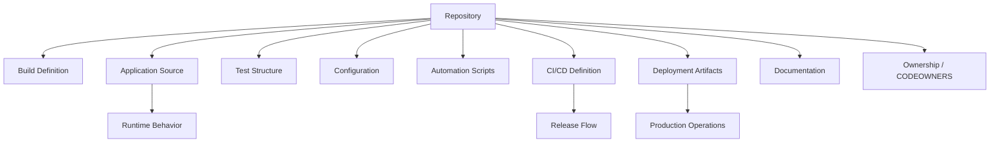

# Repository Structure and Codebase Navigation

## 1. Core Idea

Repository structure adalah peta operasional sebuah service atau platform.

Senior engineer membaca repository bukan hanya sebagai kumpulan file source code, tetapi sebagai representasi dari:

- build system,
- runtime behavior,
- deployment model,
- ownership,
- integration boundaries,
- testing strategy,
- release process,
- operational runbook,
- governance dan review surface.

Mental model:



Repository yang baik mempercepat engineer menjawab:

- bagaimana service dibuild?
- bagaimana service dijalankan lokal?
- bagaimana test dijalankan?
- dependency apa yang dipakai?
- module mana yang bertanggung jawab atas behavior tertentu?
- config mana yang dipakai di environment tertentu?
- pipeline mana yang memvalidasi perubahan?
- artifact apa yang dirilis?
- siapa owner area tertentu?
- runbook mana yang dipakai saat incident?

Codebase navigation bukan skill pencarian file semata. Ini adalah skill membangun mental model sistem dari struktur repository.

---

## 2. First Principle: Find the System Boundaries

Saat masuk repository baru, cari boundary dulu sebelum membaca detail.

Boundary yang harus ditemukan:

| Boundary | Pertanyaan |
|---|---|
| Repository boundary | Ini service repo, library repo, monorepo, atau deployment repo? |
| Module boundary | Module apa saja dan dependency antar module bagaimana? |
| Runtime boundary | Entry point service di mana? |
| API boundary | Resource/controller/API contract di mana? |
| Integration boundary | Client DB, Kafka, RabbitMQ, Redis, external HTTP di mana? |
| Config boundary | Config local/CI/staging/prod berada di mana? |
| Test boundary | Unit/integration/contract test dipisah bagaimana? |
| Deployment boundary | Docker/Kubernetes/Helm/GitOps artifact di mana? |
| Ownership boundary | CODEOWNERS atau owner module siapa? |

Jika boundary belum jelas, membaca class detail akan cepat membingungkan.

---

## 3. Monorepo, Polyrepo, Service Repo, Library Repo

### Monorepo

Satu repository berisi banyak service/module/library.

Kelebihan:

- perubahan lintas module lebih mudah dilihat,
- dependency internal bisa dikoordinasikan,
- refactor lintas boundary lebih mudah,
- CI bisa menjalankan impact analysis.

Risiko:

- build lambat,
- ownership kabur,
- PR terlalu besar,
- dependency antar module jadi terlalu mudah dan tidak disiplin,
- tooling navigation lebih kompleks.

### Polyrepo

Banyak repository terpisah per service/library.

Kelebihan:

- ownership jelas,
- build lebih kecil,
- release independent,
- permission lebih granular.

Risiko:

- perubahan lintas service lebih sulit,
- version compatibility harus dikelola ketat,
- shared library update bisa lambat,
- discovery repository lebih sulit.

### Service Repo

Repository untuk satu deployable service.

Cari:

- entry point aplikasi,
- POM/build file,
- Dockerfile,
- deployment manifest,
- local run guide,
- test structure,
- API docs,
- operational runbook.

### Library Repo

Repository untuk artifact yang dikonsumsi service lain.

Cari:

- public API package,
- versioning policy,
- backward compatibility rule,
- changelog,
- release artifact,
- consumer migration guide,
- deprecation policy.

---

## 4. Standard Java/Maven Repository Landmarks

Landmark umum:

```text
pom.xml
mvnw
mvnw.cmd
.mvn/
src/main/java/
src/main/resources/
src/test/java/
src/test/resources/
target/
```

Untuk service enterprise, sering ada juga:

```text
src/integration-test/java/
src/it/java/
docker/
Dockerfile
docker-compose.yml
compose.yaml
k8s/
helm/
charts/
deploy/
infra/
.github/workflows/
scripts/
bin/
docs/
README.md
CONTRIBUTING.md
CODEOWNERS
```

Jangan mengasumsikan semua repo punya struktur ini. Gunakan sebagai checklist awal.

---

## 5. Fast Repository Scan

Command awal:

```bash
pwd
git rev-parse --show-toplevel
git status --short
ls -la
find . -maxdepth 2 -type f | sort | sed 's#^./##' | head -200
```

Jika tersedia `tree`:

```bash
tree -a -L 3 -I 'target|.git|node_modules|build|dist'
```

Jika tersedia `rg`:

```bash
rg --files | sed -n '1,200p'
```

Cari file penting:

```bash
find . -maxdepth 4 \( \
  -name 'pom.xml' -o \
  -name 'Dockerfile' -o \
  -name 'docker-compose.yml' -o \
  -name 'compose.yaml' -o \
  -name '*.yaml' -o \
  -name '*.yml' -o \
  -name 'README.md' -o \
  -name 'CONTRIBUTING.md' -o \
  -name 'CODEOWNERS' \
\) | sort
```

Tujuan scan bukan membaca semua file. Tujuannya menemukan peta.

---

## 6. Maven Multi-Module Navigation

Untuk Maven multi-module, mulai dari root `pom.xml`.

Cari:

```xml
<packaging>pom</packaging>
<modules>
  <module>...</module>
</modules>
```

Command:

```bash
./mvnw -q help:evaluate -Dexpression=project.modules -DforceStdout
./mvnw -q help:evaluate -Dexpression=project.groupId -DforceStdout
./mvnw -q help:evaluate -Dexpression=project.artifactId -DforceStdout
./mvnw -q help:evaluate -Dexpression=project.version -DforceStdout
```

Untuk dependency antar module:

```bash
./mvnw dependency:tree -Dincludes=com.example
```

Untuk build sebagian:

```bash
./mvnw -pl module-a -am test
```

Pertanyaan penting:

- root POM hanya aggregator, parent, atau keduanya?
- module mana deployable service?
- module mana shared library?
- module mana test/support only?
- apakah module dependency searah dan masuk akal?
- apakah ada cyclic conceptual dependency?
- apakah module name mencerminkan boundary domain atau hanya technical layering?

---

## 7. Source Code Layout for Java/JAX-RS

Untuk service Java/JAX-RS/Jakarta RESTful, cari beberapa landmark:

- class `Application` atau subclass `jakarta.ws.rs.core.Application`,
- resource class dengan annotation `@Path`,
- provider/filter/mapper seperti `ContainerRequestFilter`, `ExceptionMapper`, `MessageBodyReader`, `MessageBodyWriter`,
- client HTTP integration,
- service/domain layer,
- repository/DAO layer,
- config bootstrap,
- health/readiness endpoint,
- metrics/tracing integration.

Command pencarian:

```bash
rg "@Path" src/main/java
rg "Application" src/main/java
rg "ExceptionMapper|ContainerRequestFilter|ContainerResponseFilter" src/main/java
rg "DataSource|EntityManager|JdbcTemplate|Repository" src/main/java
rg "Kafka|Rabbit|Redis|PostgreSQL|DataSource" src/main/java src/main/resources
```

Jangan langsung mengubah file resource/API sebelum memahami:

- API compatibility,
- validation behavior,
- exception mapping,
- auth/authz filter,
- serialization/deserialization,
- error response contract,
- correlation ID propagation,
- observability behavior.

---

## 8. Configuration Navigation

Config bisa tersebar di banyak tempat.

Cari:

```bash
find . -maxdepth 5 \( \
  -name '*.properties' -o \
  -name '*.yaml' -o \
  -name '*.yml' -o \
  -name '*.json' -o \
  -name '*.xml' \
\) | sort
```

Cari environment variable usage:

```bash
rg "System\.getenv|\$\{|env:|ENV |ARG " .
```

Cari profile:

```bash
rg "profile|environment|staging|production|prod|local|test" .
```

Yang harus dipahami:

- config default,
- config local,
- config test,
- config CI,
- config container,
- config Kubernetes,
- secret source,
- config override precedence,
- config yang tidak boleh commit ke repo.

Bad smell:

- file `application-prod.yml` berisi secret,
- config production ada di local-only script,
- env var wajib tidak terdokumentasi,
- default config bisa connect ke real shared environment,
- profile name tidak jelas,
- CI config berbeda jauh dari local.

---

## 9. Script Directory Navigation

Cari script:

```bash
find . -maxdepth 4 -type f \( \
  -path './scripts/*' -o \
  -path './bin/*' -o \
  -name '*.sh' -o \
  -name 'Makefile' -o \
  -name 'Taskfile.yml' \
\) | sort
```

Baca entry point, bukan semua script sekaligus.

Pertanyaan:

- script mana untuk bootstrap?
- script mana untuk build?
- script mana untuk test?
- script mana untuk run local?
- script mana destructive?
- script mana dipakai CI?
- script mana obsolete?
- script punya `--help`?
- script memakai `./mvnw`?
- script aman terhadap path dengan spasi?
- script idempotent?

Command cepat:

```bash
rg "mvn|mvnw|docker|kubectl|helm|aws|az|psql|redis|kafka|rabbit" scripts bin .github -g '!target'
```

---

## 10. CI/CD Directory Navigation

Untuk GitHub Actions:

```bash
ls -la .github/workflows
rg "mvn|mvnw|setup-java|docker|kubectl|helm|aws|azure|deploy|release" .github/workflows
```

Untuk Jenkins/GitLab jika ada:

```bash
find . -maxdepth 4 \( \
  -name 'Jenkinsfile' -o \
  -name '.gitlab-ci.yml' -o \
  -name 'azure-pipelines.yml' \
\) | sort
```

Yang dicari:

- trigger pipeline,
- build command,
- test command,
- scan step,
- artifact publish,
- Docker image build,
- deployment trigger,
- environment approval,
- secrets usage,
- cache behavior,
- release/tag behavior.

Pertanyaan senior:

- apakah CI menjalankan command yang sama dengan local?
- apakah CI memvalidasi module yang berubah saja atau seluruh repo?
- apakah required check cukup?
- apakah security scan blocking?
- apakah artifact dari CI yang sama dipromosikan sampai deploy?
- apakah pipeline melakukan deploy langsung dari branch?
- apakah GitOps repository terpisah?

---

## 11. Deployment Artifact Navigation

Cari deployment files:

```bash
find . -maxdepth 5 \( \
  -name 'Dockerfile' -o \
  -name 'docker-compose.yml' -o \
  -name 'compose.yaml' -o \
  -name 'Chart.yaml' -o \
  -name 'values.yaml' -o \
  -name 'deployment.yaml' -o \
  -name 'kustomization.yaml' -o \
  -name '*.tf' \
\) | sort
```

Yang harus dipahami:

- image build location,
- runtime base image,
- exposed port,
- health check,
- resource request/limit,
- environment variables,
- ConfigMap/Secret reference,
- volume mount,
- service account,
- network policy,
- ingress/API gateway integration,
- GitOps sync path.

Untuk backend Java/JAX-RS, deployment artifact sering menentukan:

- JVM memory behavior,
- port binding,
- graceful shutdown,
- readiness/liveness behavior,
- logging destination,
- config source,
- dependency endpoint.

---

## 12. Documentation Navigation

Dokumentasi adalah tooling.

Cari:

```bash
find . -maxdepth 4 \( \
  -name 'README.md' -o \
  -name 'CONTRIBUTING.md' -o \
  -name '*RUNBOOK*' -o \
  -name '*runbook*' -o \
  -name '*ADR*' -o \
  -path './docs/*' \
\) | sort
```

Baca urutan ini:

1. README.
2. Local setup guide.
3. Build/test commands.
4. Run local guide.
5. Architecture notes.
6. API docs.
7. Deployment guide.
8. Runbook/troubleshooting guide.
9. ADR/decision logs.
10. Release guide.

Evaluasi dokumentasi:

- apakah command masih valid?
- apakah versi Java/Maven disebut?
- apakah env var wajib disebut?
- apakah local dependency dijelaskan?
- apakah troubleshooting punya evidence command?
- apakah runbook read-only-first?
- apakah docs sinkron dengan pipeline?

---

## 13. Ownership Navigation

Ownership menentukan siapa perlu diajak review.

Cari:

```bash
find . -maxdepth 3 \( \
  -name 'CODEOWNERS' -o \
  -name '*OWNERS*' -o \
  -name '*owners*' \
\) | sort
```

Untuk GitHub:

```text
.github/CODEOWNERS
CODEOWNERS
docs/CODEOWNERS
```

Hal yang perlu dipahami:

- owner module,
- owner API contract,
- owner DB migration,
- owner CI/CD workflow,
- owner security config,
- owner deployment manifest,
- owner shared library,
- owner generated code.

Bad smell:

- semua file dimiliki satu group besar,
- file kritikal tidak punya owner,
- owner tidak lagi aktif,
- CODEOWNERS tidak sesuai real review practice,
- perubahan build/deploy tidak melibatkan platform/SRE/security.

---

## 14. Generated Code and Build Artifacts

Generated code perlu dikenali agar tidak salah review.

Cari tanda:

```bash
rg "generated|do not edit|autogenerated|openapi|swagger|protobuf|jaxb|annotation processor" .
```

Kemungkinan source generated:

- OpenAPI generator,
- protobuf/gRPC,
- JAXB/XSD,
- annotation processor,
- MapStruct,
- JPA metamodel,
- build plugin custom,
- internal codegen.

Pertanyaan:

- generated code dicommit atau dibuild?
- generator version dipin?
- input schema/API spec di mana?
- bagaimana regenerate?
- apakah generated diff harus direview manual?
- apakah generated code memengaruhi API compatibility?

Bad smell:

- generated code diedit manual,
- generator version floating,
- output generated berbeda antar OS,
- source spec tidak dicommit,
- generated code besar menutupi perubahan logic di PR.

---

## 15. Test Structure Navigation

Cari test layout:

```bash
find . -maxdepth 5 -type d \( \
  -path '*/src/test/java' -o \
  -path '*/src/integration-test/java' -o \
  -path '*/src/it/java' -o \
  -name '*test*' \
\) | sort
```

Cari framework:

```bash
rg "JUnit|AssertJ|Mockito|Testcontainers|WireMock|RestAssured|Failsafe|Surefire" pom.xml .
```

Pertanyaan:

- unit test dan integration test dipisah?
- test naming convention apa?
- integration test butuh Docker?
- test butuh PostgreSQL/Kafka/RabbitMQ/Redis?
- test bisa jalan offline?
- test punya profile khusus?
- flaky test didokumentasikan?
- CI menjalankan semua test atau subset?

Senior engineer harus bisa menemukan test yang paling relevan untuk perubahan tertentu, bukan selalu menjalankan seluruh suite secara buta.

---

## 16. Dependency and Integration Navigation

Untuk menemukan dependency runtime, gunakan kombinasi POM dan source search.

Command:

```bash
./mvnw dependency:tree
rg "postgres|jdbc|datasource|kafka|rabbit|redis|http|client|url|endpoint|topic|queue" src/main src/test . -g '!target'
```

Cari integration surface:

- PostgreSQL connection,
- Kafka producer/consumer,
- RabbitMQ publisher/listener,
- Redis client/cache,
- outbound HTTP client,
- inbound REST API,
- auth provider,
- object storage,
- messaging topic/queue names,
- schema/migration files.

Pertanyaan:

- integration config berada di mana?
- names topic/queue/table berasal dari mana?
- retry/timeout/backoff di mana?
- serialization format apa?
- idempotency key ada?
- observability untuk integration ada?
- test integration tersedia?

---

## 17. Database and Migration Navigation

Cari migration:

```bash
find . -maxdepth 6 \( \
  -iname '*flyway*' -o \
  -iname '*liquibase*' -o \
  -path '*migration*' -o \
  -path '*db*' \
\) | sort
```

Cari SQL:

```bash
find . -maxdepth 6 -name '*.sql' | sort
```

Pertanyaan:

- migration tool apa?
- migration dijalankan oleh service, CI, atau deployment pipeline?
- rollback migration didukung?
- migration backward compatible?
- migration diuji di integration test?
- data fix script ada?
- siapa owner schema?

Untuk sistem enterprise, database migration bukan sekadar file SQL. Itu release risk.

---

## 18. Event and Messaging Navigation

Cari event/message usage:

```bash
rg "Kafka|Producer|Consumer|@Kafka|Rabbit|Queue|Exchange|Topic|Listener|Redis|Stream" src/main src/test . -g '!target'
```

Yang perlu ditemukan:

- topic/queue/exchange name,
- producer code,
- consumer/listener code,
- serializer/deserializer,
- schema registry usage jika ada,
- retry/dead-letter behavior,
- idempotency handling,
- ordering assumption,
- consumer group,
- integration tests.

Pertanyaan senior:

- apakah event contract backward compatible?
- apakah consumer tolerant terhadap field tambahan/hilang?
- apakah retry bisa menyebabkan duplicate processing?
- apakah DLQ/runbook tersedia?
- apakah trace/correlation ID dipropagasi?

---

## 19. API Navigation

Cari REST API surface:

```bash
rg "@Path|@GET|@POST|@PUT|@PATCH|@DELETE|@Consumes|@Produces" src/main/java
```

Cari DTO:

```bash
rg "record |class .*Request|class .*Response|JsonProperty|JsonCreator|NotNull|Valid" src/main/java
```

Cari exception mapping:

```bash
rg "ExceptionMapper|WebApplicationException|Response\.status|Problem|ErrorResponse" src/main/java
```

Yang perlu dipahami:

- endpoint path,
- method semantics,
- request/response DTO,
- validation,
- auth/authz,
- error response contract,
- pagination/filtering,
- idempotency,
- compatibility,
- generated OpenAPI docs jika ada.

Jangan mengubah DTO/API tanpa mengecek consumer impact.

---

## 20. Observability Navigation

Cari logging/metrics/tracing:

```bash
rg "Logger|log\.|MDC|traceId|correlation|Metric|Counter|Timer|OpenTelemetry|Micrometer|Prometheus" src/main src/test . -g '!target'
```

Cari config observability:

```bash
rg "logging|metrics|tracing|opentelemetry|otel|prometheus|micrometer" . -g '!target'
```

Pertanyaan:

- correlation ID dibuat atau diteruskan?
- trace ID masuk log?
- metric apa yang tersedia?
- error log punya context cukup?
- sensitive data disanitasi?
- health/readiness endpoint jelas?
- dashboard/runbook link ada?

Observability files sering tersebar antara source, config, deployment, dan docs.

---

## 21. Navigation by Question

Gunakan pertanyaan sebagai strategi navigasi.

### “Bagaimana build service ini?”

Cari:

```bash
ls -la
cat README.md
find . -name 'pom.xml'
ls .github/workflows 2>/dev/null
```

### “Bagaimana run local?”

Cari:

```bash
rg "run local|docker compose|localhost|mvnw.*run|java -jar" README.md docs scripts . -g '!target'
```

### “Endpoint ini di mana?”

Cari:

```bash
rg "@Path|/api/path|resourceName" src/main/java
```

### “Config ini berasal dari mana?”

Cari:

```bash
rg "CONFIG_NAME|property.name|ENV_VAR_NAME" . -g '!target'
```

### “Pipeline melakukan apa?”

Cari:

```bash
rg "mvn|docker|deploy|release|tag|artifact" .github workflows . -g '!target'
```

### “Siapa harus review?”

Cari:

```bash
cat CODEOWNERS 2>/dev/null || cat .github/CODEOWNERS 2>/dev/null
```

---

## 22. First Hour / First Day / First Week

### First Hour

Tujuan: peta kasar.

- Baca README.
- Lihat root files.
- Identifikasi build system.
- Identifikasi module/service.
- Jalankan `./mvnw -version`.
- Lihat CI workflow.
- Lihat Docker/deployment artifact.
- Cari CODEOWNERS.

### First Day

Tujuan: bisa build/test/run lokal.

- Jalankan build dasar.
- Jalankan unit test.
- Jalankan service lokal jika memungkinkan.
- Pahami config/env var wajib.
- Pahami dependency lokal: DB, broker, Redis.
- Baca scripts utama.
- Baca test structure.

### First Week

Tujuan: siap review dan kontribusi.

- Pahami module boundary.
- Pahami API/event/database integration.
- Pahami CI/CD stages.
- Pahami release path.
- Baca incident/runbook lama.
- Identifikasi area ownership.
- Dokumentasikan gap onboarding yang ditemukan.

---

## 23. Failure Modes in Repository Structure

### 23.1 Hidden Entry Points

Service bisa punya banyak entry point:

- local run script,
- Docker entrypoint,
- Maven plugin run,
- IDE run config,
- test bootstrap,
- Kubernetes command override.

Jika tidak selaras, local dan production behavior berbeda.

### 23.2 Duplicate Build Commands

README berkata:

```bash
mvn clean install
```

CI memakai:

```bash
./mvnw clean verify -Pci
```

Script memakai:

```bash
./scripts/build.sh
```

Tanpa penjelasan, engineer tidak tahu mana source of truth.

### 23.3 Stale Documentation

Docs stale lebih berbahaya daripada tidak ada docs karena memberi confidence palsu.

Tanda docs stale:

- command gagal,
- nama module tidak ada,
- Java version salah,
- pipeline berubah tetapi docs tidak,
- env var lama masih disebut,
- screenshot dashboard tidak relevan.

### 23.4 Ownership Ambiguity

File kritikal tanpa owner:

- CI workflow,
- Dockerfile,
- Helm chart,
- parent POM,
- shared script,
- security config,
- migration scripts.

Ini menyebabkan review lemah.

### 23.5 Generated Code Confusion

Reviewer menghabiskan waktu pada generated diff dan melewatkan input spec yang berubah.

### 23.6 Config Scattering

Config tersebar di source, script, Dockerfile, Helm values, CI env, dan secret manager tanpa precedence jelas.

---

## 24. Repository Review Checklist

Gunakan checklist ini saat review repo baru atau PR yang mengubah struktur:

- Apakah root repository jelas?
- Apakah build entry point jelas?
- Apakah `./mvnw` tersedia dan digunakan?
- Apakah module structure jelas?
- Apakah deployable module bisa dibedakan dari library module?
- Apakah source/test/config/script/docs/CI/deploy directory jelas?
- Apakah generated code dikenali?
- Apakah config production tidak bercampur dengan local insecure defaults?
- Apakah scripts punya nama dan help jelas?
- Apakah CI command selaras dengan local command?
- Apakah deployment artifact jelas?
- Apakah CODEOWNERS tersedia?
- Apakah README cukup untuk onboarding?
- Apakah runbook/troubleshooting guide tersedia?
- Apakah module boundary dilanggar?
- Apakah repository structure mendukung review kecil dan release aman?

---

## 25. Internal Verification Checklist

Untuk konteks CSG/team, verifikasi secara internal:

- Apakah repo yang digunakan monorepo, polyrepo, service repo, library repo, atau GitOps repo.
- Struktur module resmi dan owner masing-masing module.
- Parent POM dan BOM internal yang digunakan.
- Entry point service resmi.
- Local setup guide terbaru.
- Command build/test yang dianggap source of truth.
- Script yang masih aktif vs obsolete.
- CI/CD workflow resmi.
- Deployment artifact resmi: Dockerfile, Helm chart, Kustomize, GitOps path, atau pipeline deployment lain.
- Config source dan precedence internal.
- Secret management mechanism.
- CODEOWNERS atau reviewer wajib.
- Runbook production support.
- Incident notes yang relevan dengan repo.
- Release guide dan artifact publishing flow.

Jangan mengasumsikan branch strategy, repository layout, release process, atau deployment mechanism internal tanpa verifikasi.

---

## 26. Senior Engineer Heuristics

- Baca struktur dulu, detail kemudian.
- Cari source of truth, bukan hanya file pertama yang ditemukan.
- Jika ada dua command untuk hal yang sama, cari mana yang dipakai CI.
- Jika docs berbeda dari pipeline, pipeline biasanya lebih dekat ke real behavior, tetapi docs tetap perlu diperbaiki.
- Jika generated code berubah, review input generator terlebih dahulu.
- Jika module boundary tidak jelas, PR review akan melemah.
- Jika ownership tidak jelas, perubahan kritikal perlu escalation.
- Jika local setup sulit, onboarding cost adalah bug tooling.
- Jika repository tidak punya runbook, incident support akan bergantung pada orang, bukan sistem.

---

## 27. Part Summary

Repository structure adalah peta kerja senior engineer.

Yang harus dikuasai:

- membedakan monorepo, polyrepo, service repo, dan library repo,
- membaca Maven multi-module structure,
- menemukan source/API/config/test/script/CI/deploy/docs/ownership surface,
- menggunakan CLI untuk navigasi cepat,
- memahami generated code,
- menemukan integration boundary,
- membaca repo dari pertanyaan operasional,
- mendeteksi failure mode struktur repository,
- melakukan review struktur dari sisi productivity, correctness, security, reproducibility, release, dan incident support.

Senior backend engineer yang efektif tidak tersesat di codebase besar. Ia membangun peta mental repository, lalu menggunakan peta itu untuk debugging, review, onboarding, dan production support.
