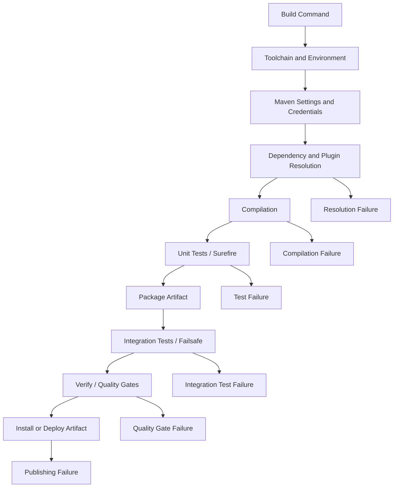
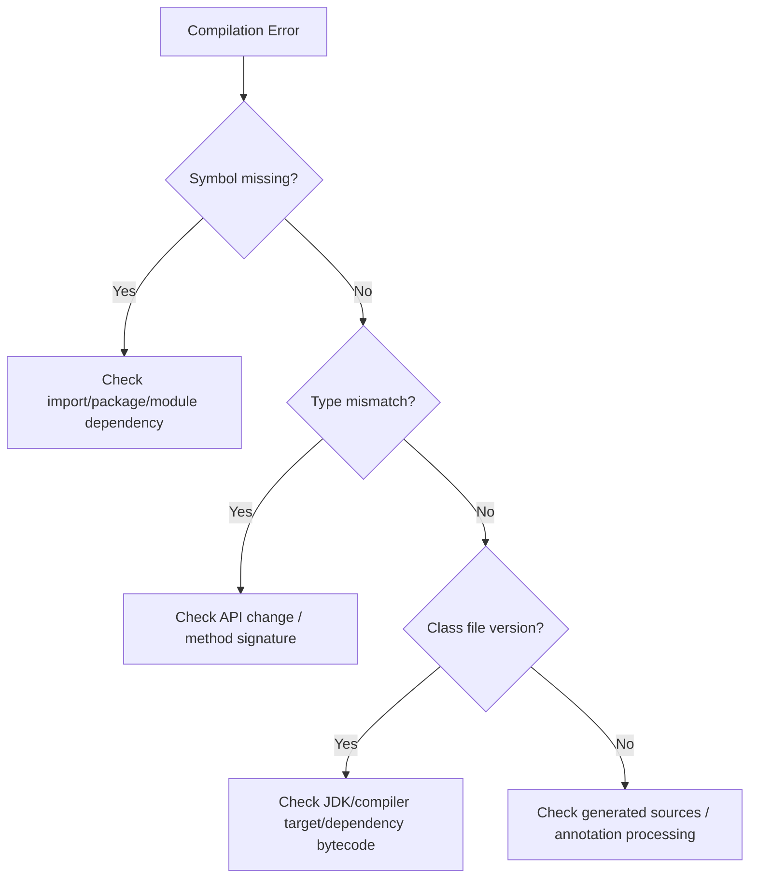
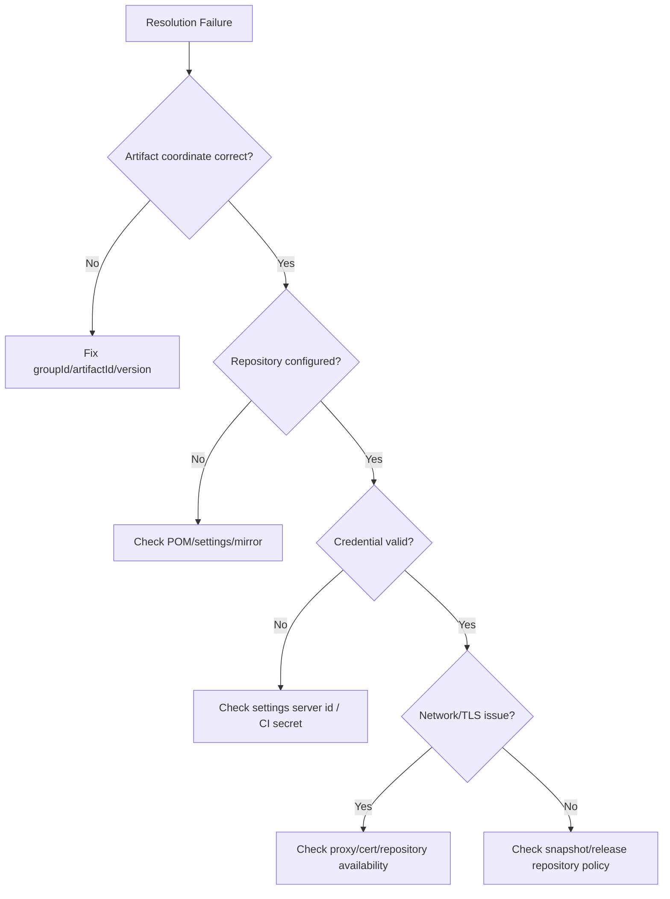

# Debugging Build Failures

## 1. Core Idea

Build failure bukan sekadar "Maven error".

Untuk senior backend engineer, build failure adalah sinyal bahwa salah satu contract berikut sedang rusak:

- source code contract,
- compiler contract,
- dependency contract,
- plugin contract,
- test contract,
- toolchain contract,
- repository credential contract,
- CI runner contract,
- artifact publishing contract,
- reproducibility contract.

Debugging build failure berarti menemukan contract mana yang gagal, di fase mana, dengan evidence apa, dan apakah failure tersebut local-only, CI-only, deterministic, flaky, atau environment-dependent.

Build failure harus diperlakukan sebagai diagnosis sistem, bukan ritual acak seperti:

```bash
mvn clean install
rm -rf ~/.m2
rerun CI
skip tests
```

Command tersebut kadang membantu, tetapi jika dijalankan tanpa diagnosis, ia menghapus evidence dan membuat masalah berulang.

Mental model:



Senior engineer tidak bertanya "kenapa Maven merah?".

Senior engineer bertanya:

- command apa yang dijalankan?
- phase Maven mana yang gagal?
- plugin mana yang sedang berjalan?
- apakah dependency/plugin gagal resolve?
- apakah compiler gagal karena source change atau toolchain mismatch?
- apakah test gagal karena logic, environment, timing, data, atau external dependency?
- apakah failure sama di local dan CI?
- apakah failure deterministic atau flaky?
- apakah failure terjadi setelah dependency, plugin, Java version, profile, atau pipeline berubah?

---

## 2. First Rule: Preserve the Evidence

Saat build gagal, jangan langsung membersihkan workspace.

Simpan dulu evidence:

```bash
./mvnw -v
java -version
git status --short
git rev-parse --short HEAD
git branch --show-current
```

Jika failure dari Maven:

```bash
./mvnw -e verify
```

Jika butuh detail tambahan:

```bash
./mvnw -X verify
```

Gunakan `-X` secara selektif. Output `-X` sangat besar dan bisa mengandung path lokal atau informasi environment. Jangan asal paste ke channel publik tanpa redaction.

Untuk CI, simpan:

- link workflow/job,
- commit SHA,
- branch,
- command yang dijalankan,
- runner OS,
- Java version,
- Maven version,
- profile aktif,
- first failing step,
- first relevant error,
- test report artifact,
- dependency scan report jika terkait.

Build debugging yang baik selalu punya evidence yang bisa direproduksi.

---

## 3. Build Failure Taxonomy

| Failure Type | Typical Symptom | Likely Area | First Diagnostic Move |
|---|---|---|---|
| Compilation failure | `cannot find symbol`, incompatible type | Source/API/compiler | Cari module dan class pertama yang gagal |
| Test failure | Assertion failed, timeout, NPE in test | Test/data/behavior | Baca Surefire/Failsafe report |
| Dependency resolution failure | Could not resolve artifact | POM/repository/credential/network | `dependency:tree`, settings, repository access |
| Plugin resolution failure | Plugin not found or goal failed | Plugin config/version | Cek effective POM dan pluginManagement |
| Surefire failure | Unit test process crash | JVM/test runner/fork | Baca dump dan report |
| Failsafe failure | Integration test gagal | External dependency/container/profile | Cek pre-integration dan post-integration behavior |
| Java version mismatch | Unsupported class file major version | Toolchain/JDK | `java -version`, `mvn -v`, compiler config |
| Maven version mismatch | Plugin/lifecycle behavior beda | Wrapper/tool version | Gunakan `./mvnw` dan cek wrapper |
| Repository credential missing | 401/403 resolve artifact | settings.xml/secret/CI env | Cek server id dan credential injection |
| Corrupted local repo | Bad checksum, unreadable jar | Local cache | Hapus artifact spesifik, bukan semua `~/.m2` |
| Snapshot issue | Stale dependency, missing snapshot | Snapshot repo/cache | Cek `-U`, timestamp, repository policy |
| CI-only failure | Local green, CI red | runner/env/profile/cache | Bandingkan env, command, OS, JDK, profile |
| Local-only failure | CI green, local red | local setup/cache/tool | Recreate with wrapper and clean workspace |

Tujuannya bukan menghafal semua error, tetapi mengklasifikasikan failure agar diagnosis tidak liar.

---

## 4. Minimum Build Diagnosis Command Set

### Identity and context

```bash
pwd
git status --short
git rev-parse --show-toplevel
git rev-parse HEAD
git branch --show-current
```

### Toolchain

```bash
java -version
./mvnw -v
mvn -v
```

Jika `./mvnw -v` dan `mvn -v` berbeda, gunakan wrapper kecuali tim secara eksplisit mengatakan sebaliknya.

### Maven execution with error detail

```bash
./mvnw -e verify
./mvnw -X verify
```

Gunakan `-e` untuk stack trace Maven yang lebih jelas. Gunakan `-X` jika butuh debug-level information.

### Dependency tree

```bash
./mvnw dependency:tree
./mvnw dependency:tree -Dverbose
./mvnw dependency:tree -Dincludes=group.id:artifact-id
```

### Effective POM

```bash
./mvnw help:effective-pom
```

Untuk module tertentu:

```bash
./mvnw -pl module-name help:effective-pom
```

### Effective settings

```bash
./mvnw help:effective-settings
```

Hati-hati: output settings dapat mengandung informasi sensitif. Jangan publish tanpa redaction.

### Partial module build

```bash
./mvnw -pl module-name -am verify
```

Artinya:

- `-pl`: build selected project list,
- `-am`: also make required upstream modules.

### Resume failed reactor build

```bash
./mvnw -rf :artifact-id verify
```

Gunakan setelah failure di multi-module build untuk melanjutkan dari module yang gagal.

---

## 5. Read Maven Output Like an Execution Trace

Maven output biasanya memiliki struktur:

```text
[INFO] Reactor Build Order:
[INFO] --- plugin:goal (execution-id) @ artifact ---
[ERROR] ...
[INFO] Reactor Summary:
```

Saat gagal, cari:

1. module pertama yang gagal,
2. plugin goal yang sedang berjalan,
3. error pertama yang meaningful,
4. stack trace root cause,
5. apakah module lain hanya `SKIPPED` karena upstream failure.

Jangan tertipu oleh error terakhir. Error terakhir sering hanya summary.

Contoh mental parsing:

```text
[INFO] --- maven-compiler-plugin:3.11.0:compile (default-compile) @ quote-service ---
[ERROR] /src/main/java/.../QuoteResource.java:[42,19] cannot find symbol
```

Ini bukan dependency resolution failure. Ini compile failure di module `quote-service`, saat goal `compile` dari `maven-compiler-plugin`.

Contoh lain:

```text
[ERROR] Failed to execute goal org.apache.maven.plugins:maven-surefire-plugin:...
[ERROR] There are test failures.
[ERROR] Please refer to target/surefire-reports
```

Ini bukan compile failure. Ini unit test failure. Evidence utama ada di `target/surefire-reports`.

---

## 6. Compilation Failure

Compilation failure berarti source code yang sedang dibuild tidak konsisten dengan compile-time classpath dan compiler settings.

Common symptoms:

```text
cannot find symbol
package ... does not exist
method ... cannot be applied to given types
incompatible types
class file has wrong version
```

Diagnosis flow:



### Checklist

- Apakah class/package memang ada?
- Apakah module yang membutuhkan class tersebut punya dependency yang benar?
- Apakah import menunjuk package lama?
- Apakah method signature berubah?
- Apakah dependency version berubah?
- Apakah generated source belum dibuat?
- Apakah annotation processor tidak jalan?
- Apakah compiler source/target/release sesuai?

Command yang berguna:

```bash
./mvnw -pl module-name -am compile
./mvnw -pl module-name dependency:tree
./mvnw -pl module-name help:effective-pom
```

Untuk mencari symbol:

```bash
grep -R "class Quote" -n src
find . -name '*Quote*.java'
```

Jika package berubah karena migration Jakarta/Javax, cari import lama:

```bash
grep -R "javax\." -n src/main/java src/test/java
grep -R "jakarta\." -n src/main/java src/test/java
```

### Senior-level concern

Compilation failure sering bukan sekadar salah import. Dalam service Java/JAX-RS, ia bisa menunjukkan:

- API internal berubah tanpa migration consumer,
- shared library update tidak backward compatible,
- generated source pipeline tidak deterministic,
- dependency alignment rusak,
- module boundary dilanggar,
- Java/Jakarta namespace conflict.

---

## 7. Test Failure: Surefire vs Failsafe

Maven umumnya memisahkan:

| Test Type | Plugin | Typical Phase | Typical Naming |
|---|---|---|---|
| Unit test | Surefire | `test` | `*Test` |
| Integration test | Failsafe | `integration-test`, `verify` | `*IT`, `*ITCase` |

Jika build gagal karena Surefire:

```text
Please refer to target/surefire-reports
```

Jika gagal karena Failsafe:

```text
Please refer to target/failsafe-reports
```

Command:

```bash
find . -path '*/target/surefire-reports/*' -type f
find . -path '*/target/failsafe-reports/*' -type f
```

Baca report:

```bash
less module-name/target/surefire-reports/*.txt
less module-name/target/failsafe-reports/*.txt
```

Run satu test:

```bash
./mvnw -pl module-name -Dtest=QuoteServiceTest test
```

Run satu method:

```bash
./mvnw -pl module-name -Dtest=QuoteServiceTest#shouldRejectExpiredQuote test
```

Run integration test tertentu:

```bash
./mvnw -pl module-name -Dit.test=QuoteIntegrationIT verify
```

Nama property bisa berbeda tergantung konfigurasi Failsafe. Verifikasi di POM internal.

### Test failure diagnosis

| Symptom | Likely Cause |
|---|---|
| Assertion failed | Behavior change or wrong expectation |
| Timeout | Deadlock, slow external dependency, resource starvation |
| Port already in use | Test uses fixed port |
| Random failure | Flaky test, ordering, time, race condition |
| Works alone, fails in suite | Shared state, test pollution |
| Works local, fails CI | OS/JDK/timezone/profile/resource difference |
| Docker/Testcontainers fail | Docker daemon, image pull, network, permission |

### Rule

Jangan skip test untuk membuat PR hijau sebelum memahami failure.

Perbedaan penting:

```bash
-DskipTests
```

biasanya compile test code tetapi tidak menjalankan test.

```bash
-Dmaven.test.skip=true
```

biasanya skip compile dan execution test.

Keduanya punya risiko berbeda. Dalam PR/release, penggunaan skip harus eksplisit dan disetujui sesuai policy tim.

---

## 8. Dependency Resolution Failure

Dependency resolution failure terjadi sebelum compile jika Maven tidak bisa menemukan atau mengunduh dependency/plugin.

Common symptoms:

```text
Could not resolve dependencies
Could not find artifact
Failed to collect dependencies
Transfer failed
Return code is: 401
Return code is: 403
PKIX path building failed
```

Diagnosis flow:



Checklist:

- Apakah coordinate benar?
- Apakah version tersedia di artifact repository?
- Apakah dependency snapshot dicari di release repository?
- Apakah release dependency dicari di snapshot repository?
- Apakah `settings.xml` punya `server` id yang cocok dengan repository id?
- Apakah CI secret tersedia?
- Apakah corporate proxy/TLS certificate diperlukan?
- Apakah mirror internal menggantikan Maven Central?

Command:

```bash
./mvnw -e dependency:resolve
./mvnw dependency:tree
./mvnw help:effective-settings
./mvnw help:effective-pom
```

Untuk force update snapshot:

```bash
./mvnw -U verify
```

Gunakan `-U` jika memang mencurigai snapshot stale. Jangan jadikan default tanpa alasan karena dapat memperlambat build dan menyembunyikan dependency hygiene issue.

---

## 9. Plugin Failure

Plugin failure berbeda dari dependency failure.

Contoh:

```text
Failed to execute goal org.apache.maven.plugins:maven-compiler-plugin:compile
Failed to execute goal org.apache.maven.plugins:maven-surefire-plugin:test
Failed to execute goal org.apache.maven.plugins:maven-enforcer-plugin:enforce
```

Plugin adalah code yang menjalankan build behavior. Maka failure bisa berasal dari:

- plugin version,
- plugin configuration,
- lifecycle binding,
- input file,
- generated source,
- Java version,
- OS path,
- permission,
- external tool,
- quality rule.

### Compiler plugin

Cek:

- `source`, `target`, atau `release`,
- annotation processor,
- generated source,
- module-info/JPMS jika ada,
- Java version dependency.

### Surefire/Failsafe plugin

Cek:

- includes/excludes,
- fork count,
- argLine,
- memory setting,
- test report,
- parallel execution,
- system properties,
- environment variables.

### Enforcer plugin

Cek:

- dependency convergence,
- banned dependency,
- Java version,
- Maven version,
- require plugin versions,
- duplicate classes.

### Shade plugin

Cek:

- duplicate classes,
- relocation,
- service resource transformers,
- dependency minimization risk,
- runtime classpath conflict.

### Versions plugin

Cek:

- update proposal,
- parent/BOM compatibility,
- Jakarta/Jersey alignment,
- security patch vs breaking change.

---

## 10. Java Version Mismatch

Common symptoms:

```text
Unsupported class file major version 61
class file has wrong version 65.0, should be 61.0
invalid target release: 17
release version 21 not supported
```

Diagnosis:

```bash
java -version
javac -version
./mvnw -v
```

Perhatikan bahwa `mvn -v` menampilkan Java yang dipakai Maven. Bisa berbeda dari `JAVA_HOME` yang Anda kira.

Cek compiler config:

```bash
./mvnw help:effective-pom | grep -n "maven-compiler-plugin" -A 40
```

Cek `.mvn`:

```bash
find .mvn -type f -maxdepth 2 -print -exec sed -n '1,160p' {} \;
```

Common root cause:

- local JDK terlalu lama,
- CI setup Java salah version,
- dependency dicompile dengan Java lebih baru,
- compiler `release` tidak selaras dengan runtime image,
- Maven toolchains config tidak cocok,
- IDE memakai JDK berbeda dari terminal.

Senior-level concern:

Build JDK dan runtime JDK harus dipahami sebagai dua contract berbeda. Build bisa sukses dengan JDK 21, tetapi artifact dijalankan di runtime JDK 17 dan gagal jika bytecode tidak compatible.

---

## 11. Maven Version Mismatch

Jika repository menyediakan Maven Wrapper, gunakan:

```bash
./mvnw verify
```

Bukan:

```bash
mvn verify
```

kecuali ada alasan jelas.

Maven version mismatch dapat menyebabkan:

- plugin behavior berbeda,
- dependency resolution berbeda,
- profile activation berbeda,
- TLS/repository behavior berbeda,
- extension compatibility issue.

Diagnosis:

```bash
./mvnw -v
mvn -v
```

Cek wrapper:

```bash
ls -la mvnw .mvn/wrapper
cat .mvn/wrapper/maven-wrapper.properties
```

Internal verification checklist:

- Apakah wrapper wajib digunakan?
- Apakah CI menggunakan wrapper atau Maven global?
- Apakah Maven version pinning ada di parent build policy?
- Apakah wrapper update punya review khusus?

---

## 12. Missing Repository Credential

Private Maven repository biasanya membutuhkan credential.

Symptoms:

```text
401 Unauthorized
403 Forbidden
Not authorized
Could not transfer artifact
```

Maven menggunakan repository id untuk mencocokkan credential di `settings.xml`.

Contoh konsep:

```xml
<repositories>
  <repository>
    <id>internal-releases</id>
    <url>https://artifact.example/repository/releases</url>
  </repository>
</repositories>
```

Credential harus punya `server` id yang sama:

```xml
<servers>
  <server>
    <id>internal-releases</id>
    <username>...</username>
    <password>...</password>
  </server>
</servers>
```

Jangan mengarang URL atau credential internal. Verifikasi di dokumen internal.

Diagnosis:

```bash
./mvnw help:effective-settings
```

Redact output sebelum dibagikan.

Di CI, cek:

- secret tersedia di environment yang benar,
- secret tidak dibatasi fork PR,
- repository environment approval tidak menahan secret,
- server id cocok,
- token belum expired,
- permission token cukup untuk read package.

---

## 13. Corrupted Local Repository

Kadang local `~/.m2/repository` rusak karena download terputus atau artifact partial.

Symptoms:

```text
zip END header not found
invalid LOC header
checksum validation failed
error reading ...jar
```

Jangan langsung hapus semua `~/.m2`.

Lebih aman hapus artifact spesifik:

```bash
rm -rf ~/.m2/repository/group/path/artifact/version
./mvnw verify
```

Jika tidak tahu path artifact:

```bash
find ~/.m2/repository -name '*artifact-id*'
```

Menghapus seluruh `~/.m2`:

- memperlambat rebuild,
- dapat menutupi root cause repository instability,
- bisa memicu rate limit atau load ke artifact repository,
- menghapus evidence.

Gunakan sebagai langkah terakhir, bukan default.

---

## 14. Snapshot Update Issue

Snapshot dependency bersifat mutable. Ini berguna untuk integrasi cepat, tetapi buruk untuk reproducibility jika tidak dikontrol.

Symptoms:

- local build memakai snapshot lama,
- CI memakai snapshot baru,
- artifact snapshot hilang,
- behavior berubah tanpa commit di repository Anda,
- test tiba-tiba gagal setelah dependency snapshot dipublish.

Command:

```bash
./mvnw -U verify
```

Cek dependency snapshot:

```bash
./mvnw dependency:tree | grep SNAPSHOT
```

Senior-level concern:

Snapshot dependency dalam release path harus sangat hati-hati. Untuk production release, artifact harus traceable dan ideally immutable.

Internal verification checklist:

- Apakah snapshot dependency boleh dipakai di service repo?
- Apakah release build melarang snapshot dependency?
- Apakah Maven Enforcer mengecek snapshot?
- Bagaimana mapping snapshot ke upstream commit?
- Apakah artifact repository punya retention policy yang memengaruhi snapshot?

---

## 15. CI-Only Failure

CI-only failure berarti local green tetapi CI red.

Kemungkinan besar perbedaannya ada pada:

| Dimension | Local | CI |
|---|---|---|
| OS | macOS/Linux/Windows | Runner Linux/Windows |
| JDK | Developer-selected | setup-java / runner image |
| Maven | Global/wrapper | wrapper/global |
| Env var | Shell profile | workflow env/secret |
| Profile | Manual | CI default |
| Timezone | Local timezone | UTC or runner default |
| Locale | Local locale | runner default |
| File system | Case-insensitive possible | Usually case-sensitive |
| Network | Developer network | CI network/proxy |
| Cache | Local `.m2` | CI cache |
| Docker | Local daemon | CI service/container |

Diagnosis:

1. Copy exact CI command.
2. Match Java/Maven version.
3. Match profile and env var.
4. Disable or inspect cache if dependency issue.
5. Read first failing test/report.
6. Check OS-sensitive paths, line endings, executable bits.
7. Check secret availability.

Useful CI step to add temporarily in a PR, if allowed:

```bash
java -version
./mvnw -v
git status --short
printenv | sort
```

Redact secrets. Do not print raw secrets.

---

## 16. Local-Only Failure

Local-only failure berarti CI green tetapi developer machine red.

Common causes:

- wrong JDK,
- wrong Maven,
- missing wrapper usage,
- stale local repository,
- missing local config,
- missing Docker daemon,
- wrong environment variable,
- local port conflict,
- uncommitted generated files,
- IDE build differs from Maven build,
- OS-specific behavior.

Diagnosis:

```bash
git status --short
./mvnw -v
java -version
./mvnw clean verify
```

Jika `clean verify` gagal, bandingkan dengan CI command.

Jika IDE gagal tapi Maven CLI berhasil, problem mungkin IDE configuration, annotation processing, generated sources, atau JDK setting.

Jika Maven CLI gagal tapi IDE berhasil, problem mungkin IDE menyembunyikan missing dependency/config.

---

## 17. Build Failure in Multi-Module Repository

Dalam multi-module repository, failure bisa berasal dari upstream module.

Gunakan reactor summary:

```text
[INFO] module-a ................ SUCCESS
[INFO] module-b ................ FAILURE
[INFO] module-c ................ SKIPPED
```

`module-c` belum tentu bermasalah. Ia skipped karena `module-b` gagal.

Command:

```bash
./mvnw -pl module-b -am verify
```

Jika sudah memperbaiki dan ingin resume:

```bash
./mvnw -rf :module-b verify
```

Untuk melihat dependency antar module, gunakan POM dan dependency tree.

Senior-level concern:

Jika perubahan kecil memaksa build banyak module yang tidak terkait, mungkin module boundary terlalu coupled atau dependency internal terlalu luas.

---

## 18. Docker or Container Build Failure

Build Java service sering menjadi bagian dari Docker build.

Symptoms:

- Maven build sukses local, Docker build gagal,
- Docker build sukses local, CI Docker build gagal,
- artifact tidak ditemukan di Docker context,
- permission denied saat copy/run,
- wrong JDK/runtime image,
- `.dockerignore` mengecualikan file penting.

Diagnosis:

```bash
docker build --no-cache -t service-debug .
docker build --progress=plain -t service-debug .
```

Cek:

- Dockerfile stage mana yang gagal,
- apakah `mvnw` executable,
- apakah `.mvn` ikut tercopy,
- apakah `settings.xml` dibutuhkan,
- apakah artifact path sesuai,
- apakah build stage dan runtime stage pakai Java compatible,
- apakah `.dockerignore` membuang file penting.

Build failure dalam Docker harus direview sebagai reproducibility issue, bukan hanya Dockerfile issue.

---

## 19. Quality Gate Failure

Quality gate bisa berupa:

- Checkstyle,
- Spotless,
- PMD,
- Error Prone,
- SpotBugs,
- Jacoco coverage,
- mutation testing,
- dependency convergence,
- banned dependency,
- license check,
- vulnerability scan,
- SBOM generation.

Rule:

Jangan bypass quality gate tanpa memahami kenapa gate ada.

Contoh:

```bash
./mvnw spotless:apply
./mvnw checkstyle:check
./mvnw jacoco:report
./mvnw enforcer:enforce
```

Command tergantung plugin internal. Verifikasi di POM.

Senior-level review:

- Apakah failure menunjukkan aturan benar-benar dilanggar?
- Apakah rule terlalu noisy?
- Apakah baseline berubah?
- Apakah plugin version berubah?
- Apakah generated code ikut discan padahal seharusnya exclude?
- Apakah coverage turun karena test hilang atau threshold terlalu kaku?

---

## 20. Reproducible Build Failure Report

Saat meminta bantuan, jangan hanya tulis:

> Build error, ada yang tahu?

Tulis report seperti ini:

```md
## Build Failure Report

Service/repo: <name>
Branch: <branch>
Commit: <sha>
Command: `./mvnw -pl <module> -am verify`
Environment: local / CI
Java: `<java -version>`
Maven: `<./mvnw -v>`
Failure phase: compile / test / verify / deploy
Failing module: <module>
Failing plugin: <plugin:goal>
First relevant error:

```text
<redacted error>
```

What changed recently:
- dependency update?
- plugin update?
- Java version update?
- profile change?
- CI runner change?
- source change?

What I tried:
- <commands>

Sensitive data redacted: yes/no
```
```

Build failure report yang baik mempercepat debugging dan mencegah orang lain mengulang diagnosis dari nol.

---

## 21. Production and Release Concerns

Build failure dekat dengan release safety.

Concern utama:

- build yang hanya hijau di local tapi merah di CI tidak boleh dipaksa masuk,
- test failure tidak boleh di-skip diam-diam,
- dependency resolution terhadap snapshot mutable mengurangi traceability,
- Maven profile yang berbeda antara CI dan release bisa menghasilkan artifact berbeda,
- plugin version floating membuat build berubah tanpa code change,
- corrupted cache bisa menyembunyikan artifact repository issue,
- release artifact harus bisa dihubungkan ke commit, tag, dependency set, dan pipeline run.

Senior engineer harus bertanya:

- apakah command release sama dengan command CI?
- apakah artifact yang ditest sama dengan artifact yang dipublish?
- apakah dependency snapshot diblokir?
- apakah build logs cukup untuk audit?
- apakah failure yang sekarang menunjukkan systemic weakness?

---

## 22. Security Concerns

Build debugging sering menyentuh credential dan secret.

Risiko:

- mencetak `settings.xml` dengan token,
- mencetak env var CI,
- paste log dengan repository credential,
- menambahkan credential ke POM,
- hardcode token di script,
- menggunakan insecure repository URL,
- disable TLS verification,
- menggunakan untrusted plugin/action.

Safe practice:

- gunakan redaction sebelum share log,
- jangan commit `settings.xml`,
- jangan print raw secret,
- gunakan least privilege token,
- cek repository id dan server id tanpa mengekspos password,
- verifikasi plugin source dan version pinning.

---

## 23. Correctness and Productivity Concerns

Build yang reliable adalah productivity multiplier.

Correctness concern:

- test yang tidak jalan memberi false confidence,
- dependency conflict bisa compile sukses tapi runtime gagal,
- profile misuse bisa membuat artifact berbeda,
- generated source yang tidak deterministic bisa memicu flaky build,
- local-only workaround bisa merusak CI.

Productivity concern:

- build lambat membuat engineer skip validation,
- error message tidak jelas memperpanjang onboarding,
- command berbeda antara README dan CI menciptakan confusion,
- script tidak idempotent membuat developer takut menjalankan automation,
- cache terlalu agresif membuat failure sulit dipahami.

Build system harus mudah dipahami, bukan hanya "jalan di mesin senior tertentu".

---

## 24. PR Review Checklist for Build Changes

Gunakan checklist ini saat PR mengubah POM, CI, plugin, dependency, test config, atau script build.

### Scope

- Apakah perubahan build punya alasan jelas?
- Apakah perubahan dibatasi pada module yang relevan?
- Apakah ada migration note untuk developer?

### Maven

- Apakah dependency/plugin version dipin?
- Apakah perubahan masuk parent POM, child POM, atau BOM dengan alasan tepat?
- Apakah dependency scope benar?
- Apakah exclusion aman dan dijelaskan?
- Apakah effective POM berubah sesuai ekspektasi?

### Tests

- Apakah test masih dijalankan di phase yang benar?
- Apakah Surefire/Failsafe config tidak membuat test hilang?
- Apakah skip test tidak diselipkan?
- Apakah test report masih dipublish di CI?

### CI

- Apakah command CI sama atau compatible dengan local guide?
- Apakah cache key aman?
- Apakah secret tidak diekspos?
- Apakah required checks tetap meaningful?

### Release

- Apakah artifact release tetap traceable?
- Apakah snapshot dependency diblokir jika release path?
- Apakah version/tagging impact dipahami?

### Security

- Apakah repository credential tidak hardcoded?
- Apakah plugin/action dipercaya dan dipin?
- Apakah dependency scan tetap berjalan?

---

## 25. Internal Verification Checklist

Untuk konteks CSG/team, jangan mengarang detail internal. Verifikasi hal-hal berikut:

### Repository and build

- Command build resmi apa?
- Apakah wajib menggunakan `./mvnw`?
- Maven version berapa?
- Java build version berapa?
- Java runtime version berapa?
- Apakah repo multi-module?
- Module mana yang deployable service dan mana library?

### Maven configuration

- Parent POM internal apa?
- BOM apa yang digunakan?
- Artifact repository apa yang digunakan?
- Apakah snapshot dependency diperbolehkan?
- Apakah Maven Enforcer digunakan?
- Plugin quality apa saja yang wajib?

### CI/CD

- CI platform apa yang digunakan?
- Command CI build/test/verify apa?
- Required checks apa saja?
- Bagaimana cache Maven dikonfigurasi?
- Apakah test report/coverage dipublish?
- Bagaimana credential repository diinjeksi?

### Failure handling

- Build failure paling sering apa?
- Ada runbook build failure?
- Siapa owner build tooling?
- Kapan boleh skip test?
- Kapan harus escalate ke platform/DevOps/SRE?
- Bagaimana menangani flaky test?

### Release

- Release artifact dipublish ke mana?
- Tagging strategy apa?
- Apakah release build harus clean environment?
- Bagaimana rollback jika artifact salah?

---

## 26. Anti-Patterns

Hindari:

- selalu menjalankan `rm -rf ~/.m2` sebagai langkah pertama,
- skip test untuk membuat PR hijau,
- menambahkan dependency tanpa membaca tree,
- menambahkan exclusion tanpa memahami transitive impact,
- mengubah parent POM tanpa impact analysis,
- memakai Maven global ketika wrapper tersedia,
- mengabaikan CI-only failure sebagai "runner problem",
- menganggap local green berarti aman,
- mencetak secret dalam debug log,
- menghapus cache CI tanpa memahami root cause,
- force update snapshot terus-menerus tanpa governance,
- mengubah pipeline dan POM dalam PR besar tanpa checklist.

---

## 27. Practical Senior Engineer Habit

Saat build gagal, gunakan urutan ini:

1. Identify command.
2. Identify environment.
3. Identify failing phase.
4. Identify failing module.
5. Identify failing plugin.
6. Capture first relevant error.
7. Classify failure type.
8. Reproduce minimally.
9. Compare local vs CI.
10. Fix root cause.
11. Add guard if failure can recur.
12. Document if it affected onboarding or release.

Build failure yang sama muncul dua kali adalah sinyal bahwa tim butuh tooling, documentation, guardrail, atau test strategy yang lebih baik.
