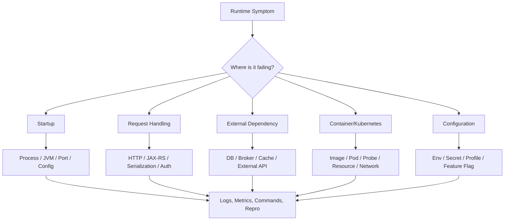
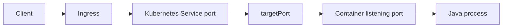
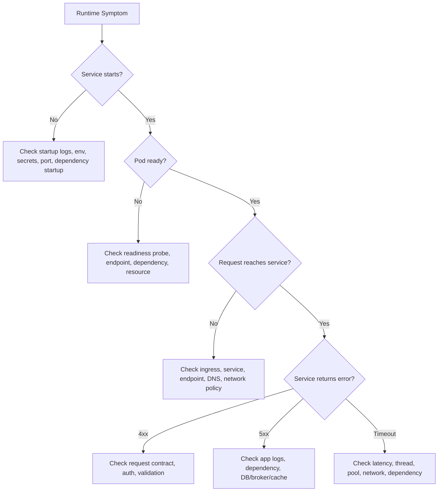

# Debugging Runtime Issues with Tooling

## 1. Core Idea

Runtime issue adalah kegagalan aplikasi saat sudah berjalan atau mencoba berjalan.

Untuk backend Java/JAX-RS enterprise, runtime issue jarang hanya "bug code". Ia bisa berasal dari:

- process tidak hidup,
- port conflict,
- environment variable salah,
- config precedence salah,
- secret tidak tersedia,
- DNS gagal,
- TLS handshake gagal,
- HTTP gateway/proxy issue,
- database connection issue,
- Kafka/RabbitMQ connectivity issue,
- Redis connectivity issue,
- container image issue,
- Kubernetes scheduling/probe issue,
- resource limit,
- deployment/config drift,
- dependency eksternal degraded,
- release artifact salah.

Senior engineer harus bisa mengubah symptom menjadi evidence.

Mental model:



Debugging runtime yang baik bukan menjalankan banyak command. Debugging runtime yang baik adalah memilih command yang membedakan hipotesis.

---

## 2. Production-Safe Debugging Principles

Sebelum command apa pun, pegang prinsip berikut:

1. Read-only first.
2. Minimal blast radius.
3. Capture evidence before changing state.
4. Verify context before action.
5. Prefer reproduction outside production if possible.
6. Redact secrets and sensitive data.
7. Keep audit trail.
8. Know rollback path before risky change.

Contoh unsafe pattern:

```bash
kubectl delete pod <pod>
```

tanpa memahami apakah pod restart akan menghapus evidence, memperburuk outage, atau memicu thundering herd.

Contoh safer first step:

```bash
kubectl describe pod <pod>
kubectl logs <pod> --previous
kubectl get events --sort-by=.lastTimestamp
```

Jika perlu restart, lakukan sesuai runbook dan approval internal.

---

## 3. Runtime Failure Taxonomy

| Symptom | Possible Area | First Evidence |
|---|---|---|
| Service tidak start | JVM/config/secret/port/dependency startup | startup logs, exit code, pod events |
| CrashLoopBackOff | process exits repeatedly | `kubectl logs --previous`, describe pod |
| 5xx meningkat | app error/dependency/gateway | app logs, trace ID, metrics |
| 4xx unexpected | request contract/auth/validation | access log, curl repro, headers |
| Timeout | network/dependency/thread/resource | latency metric, thread dump, client timeout |
| Connection refused | service not listening/port wrong/network | `ss`, `lsof`, endpoint check |
| DNS failure | resolver/service name/search domain | `dig`, `nslookup`, pod DNS test |
| TLS failure | cert/CA/SNI/mTLS/protocol | `openssl s_client`, curl verbose |
| DB connection failure | credential/network/pool/schema | logs, connection config, DB reachability |
| Kafka/RabbitMQ failure | broker DNS/TLS/auth/topic/queue | broker client logs, port test |
| Redis failure | DNS/auth/TLS/max connection | logs, redis-cli if allowed |
| OOMKilled | memory limit/JVM heap/native memory | pod status, events, metrics |
| High CPU | loop, GC, hot code, traffic spike | metrics, top, thread dump |
| Config mismatch | wrong env/profile/ConfigMap/Secret | env dump, mounted files, deployment manifest |

---

## 4. Start with Context: What Changed?

Runtime issue after a change is usually tied to one of these:

- new commit,
- new release tag,
- new container image,
- config change,
- secret rotation,
- database migration,
- dependency version change,
- infrastructure change,
- DNS/certificate change,
- feature flag change,
- traffic pattern change,
- scaling/resource change.

Minimum context checklist:

```bash
git rev-parse HEAD
git log --oneline -5
```

In Kubernetes:

```bash
kubectl rollout history deployment/<deployment>
kubectl describe deployment/<deployment>
kubectl get pods -l app=<app> -o wide
```

If using GitOps, verify desired state in the GitOps repository rather than making assumptions from live objects only.

Internal verification required:

- deployment tool,
- GitOps repo/path,
- image tag convention,
- release notes,
- feature flag system,
- config ownership.

---

## 5. Java Process Diagnosis

If running locally or in a VM/container with process access:

```bash
ps -ef | grep java
pgrep -af java
```

Check process tree:

```bash
ps -o pid,ppid,stat,etime,cmd -p <pid>
```

Check resource usage:

```bash
top -p <pid>
```

Check open files and ports:

```bash
lsof -p <pid> | head
lsof -Pan -p <pid> -i
```

Check Java tooling if available:

```bash
jcmd <pid> VM.version
jcmd <pid> VM.command_line
jcmd <pid> VM.system_properties
jcmd <pid> Thread.print
jcmd <pid> GC.heap_info
```

Not every container image includes `jcmd`. Distroless or slim runtime images may not have debugging tools. That is a platform/tooling decision, not simply a developer inconvenience.

### Runtime concern

Java process diagnosis helps answer:

- is the process alive?
- how long has it been alive?
- what command started it?
- what JVM options are active?
- what ports are open?
- are threads stuck?
- is heap constrained?
- is CPU high?

Internal verification checklist:

- Are Java diagnostic tools available in runtime image?
- Is `kubectl debug` allowed?
- Are thread dumps allowed in production?
- Where should diagnostic dumps be stored?
- Do dumps contain sensitive data?

---

## 6. Port Conflict and Listening Socket Diagnosis

Symptoms:

```text
Address already in use
Connection refused
Cannot bind to port
```

Local commands:

```bash
ss -ltnp
lsof -i :8080
```

Inside container/pod, if tools exist:

```bash
ss -ltnp
```

Check expected port:

- app config,
- JAX-RS server config,
- container `EXPOSE`,
- Kubernetes containerPort,
- Service targetPort,
- ingress route,
- readiness/liveness probe port.

Mental model:



If any mapping is wrong, traffic fails even if Java process is healthy.

Checklist:

```bash
kubectl get svc <service> -o yaml
kubectl get endpoints <service> -o yaml
kubectl describe pod <pod>
```

Internal verification required:

- service port convention,
- gateway/ingress configuration,
- health check endpoint and port,
- local vs container port mapping.

---

## 7. Environment and Configuration Mismatch

Symptoms:

- works local but fails in CI/container,
- staging differs from production,
- wrong endpoint called,
- wrong database/schema,
- missing feature flag,
- unexpected profile active,
- property value not what code expects.

Local:

```bash
printenv | sort
echo "$JAVA_HOME"
echo "$MAVEN_OPTS"
```

Container/Kubernetes:

```bash
kubectl describe pod <pod>
kubectl exec <pod> -- printenv | sort
```

Be careful: `printenv` may expose secrets. Do not paste raw output to public channels.

Check mounted config:

```bash
kubectl exec <pod> -- ls -la /path/to/config
kubectl exec <pod> -- cat /path/to/config/file
```

Only do this if allowed and after considering secret exposure.

Configuration debugging questions:

- What config sources exist?
- What is precedence order?
- Which profile is active?
- Are env vars overriding file config?
- Are ConfigMap/Secret versions current?
- Was config updated without rollout?
- Is the pod using old config because it has not restarted?

Internal verification checklist:

- config source convention,
- profile naming,
- secret injection method,
- ConfigMap/Secret rollout mechanism,
- feature flag source,
- safe way to inspect config.

---

## 8. Secret Missing or Wrong

Symptoms:

```text
authentication failed
password authentication failed
401 Unauthorized
403 Forbidden
invalid credentials
secret not found
```

Do not debug secrets by printing them.

Safer checks:

```bash
kubectl get secret <secret-name>
kubectl describe pod <pod>
```

Check whether secret exists, key exists, and pod references it. Avoid printing secret values.

Questions:

- Is secret mounted as env var or file?
- Is the key name correct?
- Was secret rotated?
- Did pod restart after secret change?
- Does service account have access?
- Is this environment allowed to access that dependency?
- Did CI have access to deployment secret?

If value validation is required, use approved internal method. Never paste secret values into chat, issue, PR, or logs.

---

## 9. DNS Debugging

DNS failure symptoms:

```text
UnknownHostException
Name or service not known
Temporary failure in name resolution
no such host
```

Commands:

```bash
dig example.internal
nslookup example.internal
host example.internal
```

Inside Kubernetes pod:

```bash
kubectl exec <pod> -- nslookup <service-name>
kubectl exec <pod> -- cat /etc/resolv.conf
```

If tool not present, use debug pod according to internal policy.

Kubernetes DNS questions:

- Is service name correct?
- Is namespace correct?
- Is FQDN needed?
- Are endpoints populated?
- Is CoreDNS healthy?
- Is network policy blocking?
- Is private DNS configured for cloud resources?

Command:

```bash
kubectl get svc -n <namespace>
kubectl get endpoints -n <namespace> <service>
```

DNS debugging should distinguish:

- name does not resolve,
- name resolves to wrong IP,
- name resolves but port unreachable,
- service has no endpoints,
- endpoint exists but application not ready.

---

## 10. TLS Debugging

TLS symptoms:

```text
PKIX path building failed
certificate verify failed
handshake_failure
no subject alternative names matching
unable to find valid certification path
```

Commands:

```bash
openssl s_client -connect host:443 -servername host
curl -v https://host/path
```

Check:

- certificate chain,
- expiration,
- SAN matches hostname,
- CA trusted by runtime,
- SNI required,
- mTLS client certificate required,
- TLS protocol/cipher compatibility,
- proxy interception.

For Java, TLS failure can depend on truststore:

- JVM default truststore,
- custom truststore,
- container image CA bundle,
- mounted certificate,
- system property like `javax.net.ssl.trustStore`,
- application-specific HTTP client config.

Internal verification checklist:

- certificate ownership,
- CA distribution method,
- mTLS requirement,
- truststore update process,
- certificate rotation process,
- approved TLS debug commands.

---

## 11. HTTP and JAX-RS Runtime Debugging

HTTP symptoms:

- unexpected 400,
- 401/403,
- 404 route not found,
- 405 method not allowed,
- 409 conflict,
- 415 unsupported media type,
- 422 validation error,
- 500 internal error,
- timeout,
- wrong response body.

Use reproducible curl:

```bash
curl -v \
  -X POST "https://host/api/quotes" \
  -H "Content-Type: application/json" \
  -H "Accept: application/json" \
  -H "X-Correlation-Id: debug-$(date +%s)" \
  --data @request.json
```

Capture:

- request method,
- URL,
- headers,
- body,
- status code,
- response headers,
- response body,
- correlation ID,
- timestamp,
- environment.

Save response:

```bash
curl -sS -D response.headers -o response.body.json \
  -H "Accept: application/json" \
  "https://host/api/resource"

jq . response.body.json
```

JAX-RS-specific questions:

- Is path correct?
- Is HTTP method correct?
- Is `Content-Type` correct?
- Is `Accept` correct?
- Is request body valid JSON?
- Is auth header present?
- Is validation failure expected?
- Is exception mapper hiding root cause?
- Is gateway rewriting path/header?
- Is correlation ID propagated?

Internal verification checklist:

- API gateway path convention,
- auth header convention,
- correlation ID header name,
- error response standard,
- exception mapping standard,
- API versioning rule.

---

## 12. Database Connection Issue

Symptoms:

```text
Connection refused
Connection timed out
password authentication failed
database does not exist
relation does not exist
too many connections
SSL error
```

First classify:

| Symptom | Likely Area |
|---|---|
| Unknown host | DNS |
| Connection refused | host reachable, port closed/no listener |
| Timeout | network/firewall/routing/security group |
| Auth failed | credential/user/password |
| DB does not exist | config/database name |
| Relation does not exist | schema/migration/search path |
| Too many connections | pool sizing/leak/DB limit |
| SSL error | TLS mode/cert/trust |

Connectivity check:

```bash
nc -vz db-host 5432
```

If `psql` is available and allowed:

```bash
psql "host=<host> port=5432 dbname=<db> user=<user> sslmode=require"
```

Do not expose password in shell history. Prefer prompting or approved secret method.

Java service questions:

- Is JDBC URL correct?
- Is pool config correct?
- Is schema migration applied?
- Is credential rotated?
- Is SSL mode required?
- Is DB reachable from pod namespace?
- Is connection pool exhausted?
- Is transaction stuck?

Internal verification checklist:

- PostgreSQL host/port naming,
- migration tool used,
- schema ownership,
- connection pool settings,
- SSL requirement,
- approved DB debugging access.

---

## 13. Kafka Connectivity Issue

Symptoms:

```text
TimeoutException
Failed to update metadata
Connection to node could not be established
Topic authorization failed
SASL authentication failed
SSL handshake failed
```

Classify:

- bootstrap server DNS/port,
- broker advertised listener,
- TLS truststore,
- SASL credential,
- topic exists,
- ACL authorization,
- consumer group issue,
- serialization issue,
- schema registry issue if used,
- lag/backpressure issue.

Connectivity check:

```bash
nc -vz broker-host 9092
```

If `kcat`/`kafkacat` is approved and available:

```bash
kcat -b broker-host:9092 -L
```

Do not assume tool availability in production.

Java service questions:

- Is bootstrap server correct for environment?
- Is security protocol correct?
- Are truststore/keystore mounted?
- Is topic name correct?
- Is consumer group correct?
- Is deserializer compatible?
- Did event schema change?
- Is producer idempotence or transaction config relevant?

Internal verification checklist:

- Kafka cluster per environment,
- topic naming convention,
- ACL request process,
- schema registry usage,
- consumer group convention,
- approved Kafka CLI/debug method.

---

## 14. RabbitMQ Connectivity Issue

Symptoms:

```text
connection refused
authentication failure
vhost not found
queue not found
channel closed
precondition failed
```

Classify:

- host/port/DNS,
- TLS requirement,
- username/password,
- virtual host,
- exchange/queue/binding exists,
- permission,
- declaration mismatch,
- message TTL/dead-letter config,
- consumer prefetch/backpressure.

Connectivity:

```bash
nc -vz rabbit-host 5672
```

HTTP management API may exist, but do not assume it is enabled or accessible. Verify internally.

Java service questions:

- Is vhost correct?
- Is exchange type expected?
- Is queue declaration compatible with existing queue?
- Is TLS enabled?
- Is credential rotated?
- Are consumers running?
- Is dead-letter queue growing?

Internal verification checklist:

- RabbitMQ cluster/environment mapping,
- vhost naming,
- exchange/queue ownership,
- permission model,
- management UI/API access,
- approved debug commands.

---

## 15. Redis Connectivity Issue

Symptoms:

```text
Connection refused
Connection timed out
NOAUTH Authentication required
WRONGPASS invalid username-password pair
MOVED
READONLY You can't write against a read only replica
```

Classify:

- DNS/port,
- auth,
- TLS,
- standalone vs cluster,
- wrong DB index,
- max connections,
- read/write endpoint mismatch,
- eviction/memory pressure,
- serialization/key format issue.

Connectivity:

```bash
nc -vz redis-host 6379
```

If `redis-cli` is approved:

```bash
redis-cli -h redis-host -p 6379 PING
```

Be careful with commands that inspect keys in production. Avoid broad `KEYS *`; it can be dangerous on large datasets. Prefer safe, approved diagnostics.

Java service questions:

- Is Redis used as cache, lock, session, rate limit, or temporary state?
- Is data loss tolerable?
- Is TTL correct?
- Is connection pool exhausted?
- Is cluster redirection handled?
- Is serialization compatible after deployment?

Internal verification checklist:

- Redis mode,
- auth/TLS requirement,
- key naming convention,
- safe production commands,
- ownership of cache invalidation.

---

## 16. Container Runtime Issue

Symptoms:

- container exits immediately,
- file permission error,
- missing file,
- wrong working directory,
- wrong user,
- missing CA certificate,
- missing shell/debug tool,
- image tag points to unexpected artifact,
- app works local but not in image.

Commands:

```bash
docker run --rm -it <image> sh
docker inspect <image>
docker history <image>
docker logs <container>
docker exec -it <container> sh
```

If image has no shell, use approved debug approach.

Check:

- entrypoint,
- command,
- working directory,
- user,
- file permissions,
- environment variables,
- exposed/listening port,
- CA bundle,
- artifact path,
- JVM options,
- healthcheck.

Internal verification checklist:

- base image policy,
- root vs non-root requirement,
- image tagging convention,
- debug image availability,
- CA/cert injection method.

---

## 17. Kubernetes Runtime Issue

Key commands:

```bash
kubectl get pods -o wide
kubectl describe pod <pod>
kubectl logs <pod>
kubectl logs <pod> --previous
kubectl get events --sort-by=.lastTimestamp
kubectl get deploy <deployment> -o yaml
kubectl rollout status deployment/<deployment>
kubectl rollout history deployment/<deployment>
```

For services:

```bash
kubectl get svc
kubectl describe svc <service>
kubectl get endpoints <service> -o yaml
```

For probes:

```bash
kubectl describe pod <pod> | grep -A5 -B5 -i probe
```

Common Kubernetes symptoms:

| Symptom | Possible Cause |
|---|---|
| Pending | scheduling/resource/node affinity/PVC |
| ImagePullBackOff | registry credential/image tag/network |
| CrashLoopBackOff | app exits/startup failure |
| OOMKilled | memory limit/JVM/native memory |
| Unready | readiness probe failure/dependency startup |
| 503 from service | no ready endpoints |
| Restart spike | crash/probe/resource pressure |

Senior-level concern:

Do not confuse liveness and readiness.

- Readiness controls whether pod receives traffic.
- Liveness controls whether kubelet restarts pod.

Bad liveness probe can turn slow startup or dependency issue into restart loop.

Internal verification checklist:

- namespace convention,
- deployment owner,
- readiness/liveness endpoints,
- resource request/limit policy,
- HPA behavior,
- GitOps reconciliation behavior,
- rollout/rollback runbook.

---

## 18. Repro Command Design

A good runtime repro command is:

- minimal,
- explicit,
- redacted,
- environment-specific,
- repeatable,
- includes timeout,
- includes correlation ID,
- captures response headers/body separately.

Example:

```bash
CORRELATION_ID="debug-$(date +%Y%m%d%H%M%S)"

curl -sS -v \
  --connect-timeout 5 \
  --max-time 30 \
  -X POST "https://host/api/quotes" \
  -H "Content-Type: application/json" \
  -H "Accept: application/json" \
  -H "X-Correlation-Id: ${CORRELATION_ID}" \
  --data @request.json \
  -D response.headers \
  -o response.body

echo "correlation_id=${CORRELATION_ID}"
```

This allows log search by correlation ID.

Adapt header names to internal standards. Do not invent CSG-specific header names; verify them.

---

## 19. Incident Evidence Bundle

For serious runtime issue, collect evidence bundle:

```text
incident-id/
  summary.md
  timeline.md
  request-curl.txt
  response.headers
  response.body.redacted.json
  app-logs.redacted.txt
  pod-describe.redacted.txt
  events.txt
  deployment-revision.txt
  config-diff.redacted.txt
  git-commit.txt
  release-tag.txt
```

`summary.md` should include:

- symptom,
- environment,
- first observed time,
- affected service,
- affected endpoint/flow,
- recent changes,
- current hypothesis,
- evidence links,
- mitigation taken,
- remaining risk.

Redaction is mandatory if logs contain:

- access token,
- password,
- customer data,
- PII,
- internal hostnames that should not be shared broadly,
- request body with sensitive domain data.

---

## 20. Runtime Debugging Decision Tree

Use this high-level flow:



This tree prevents jumping straight to the database when the pod is not even ready, or debugging JAX-RS routing when ingress is not forwarding traffic.

---

## 21. Correctness Concerns

Runtime debugging must protect correctness.

Risks:

- using production data to test destructive endpoint,
- replaying non-idempotent request,
- creating duplicate order/quote/message,
- triggering downstream workflow,
- changing feature flags without understanding impact,
- manually editing live Kubernetes objects under GitOps,
- deleting pods and hiding evidence,
- using admin credentials for normal diagnosis.

For quote/order systems, always ask:

- Is this command read-only?
- If not, is operation idempotent?
- Could it create duplicate business transaction?
- Could it publish Kafka/RabbitMQ event?
- Could it change customer-visible state?
- Is there an audit trail?
- Is rollback possible?

---

## 22. Security Concerns

Runtime debugging often exposes sensitive information.

Risks:

- printing env vars with secrets,
- copying request payload with customer data,
- dumping heap/thread data with sensitive values,
- sharing internal URLs/tokens broadly,
- running debug container with excessive privilege,
- using personal token in automation,
- storing incident evidence insecurely,
- disabling TLS validation as workaround.

Safer practice:

- redact before sharing,
- use approved secret access tools,
- avoid raw `printenv` in public logs,
- use least privilege debug access,
- document who accessed what,
- prefer short-lived credentials,
- never commit debug credentials.

---

## 23. Reproducibility Concerns

A runtime bug that cannot be reproduced is expensive.

Improve reproducibility by capturing:

- exact request,
- exact timestamp,
- correlation ID,
- environment,
- service version,
- image tag,
- config version,
- dependency endpoint,
- feature flags,
- database migration version,
- message/event ID if relevant,
- user/tenant/account context if allowed and redacted.

For async systems, also capture:

- Kafka topic/partition/offset,
- RabbitMQ exchange/routing key/queue/message ID,
- retry count,
- dead-letter status,
- consumer group,
- event schema version.

Do not invent internal event metadata conventions. Verify with team.

---

## 24. Release and Rollback Concerns

Runtime issue diagnosis must connect behavior to release.

Questions:

- What version is currently deployed?
- What changed from previous good version?
- Is rollback available?
- Is roll-forward safer?
- Is config rollback enough?
- Is database migration backward compatible?
- Are events backward compatible?
- Are consumers/producers version-compatible?
- Did image tag move?
- Did GitOps apply expected manifest?

Commands:

```bash
kubectl rollout history deployment/<deployment>
kubectl describe deployment/<deployment>
```

If rollback is needed:

- follow internal runbook,
- confirm impact,
- confirm database/event compatibility,
- capture evidence first,
- communicate clearly.

Do not execute rollback command unless explicitly authorized by internal process.

---

## 25. Observability Concerns

CLI debugging is not a replacement for observability.

CLI is good for:

- immediate inspection,
- reproducing request,
- checking environment,
- validating connectivity,
- capturing focused evidence.

Observability is needed for:

- trends,
- latency distribution,
- error rates,
- dependency saturation,
- throughput,
- traces across services,
- alert context,
- incident timeline.

Runtime debugging should connect CLI evidence to:

- logs,
- metrics,
- traces,
- deployment events,
- release notes,
- feature flag changes,
- infrastructure events.

Senior engineer should not rely on SSH/kubectl heroics as the primary operating model.

---

## 26. PR Review Checklist for Runtime Debuggability

When reviewing PRs that affect runtime behavior, ask:

### Startup

- Does service fail fast with clear error if config missing?
- Are startup logs useful but not secret-leaking?
- Are dependency startup failures distinguishable?

### HTTP/JAX-RS

- Are errors mapped consistently?
- Are status codes correct?
- Is validation failure clear?
- Is correlation ID propagated?
- Is request/response logging safe?

### Dependencies

- Are DB/broker/cache timeouts explicit?
- Are retries bounded?
- Is backoff used?
- Are connection pool limits sane?
- Are credentials/config externalized?

### Kubernetes

- Are readiness/liveness probes correct?
- Are resource requests/limits reasonable?
- Are ports consistent?
- Does shutdown handle SIGTERM?

### Observability

- Are logs structured enough?
- Are metrics/traces added for important flows?
- Are failure modes observable?
- Can on-call identify affected tenant/request/message safely?

### Safety

- Are operations idempotent where retries can happen?
- Is rollback safe?
- Are secrets protected?
- Are debug commands documented?

---

## 27. Internal Verification Checklist

Untuk konteks CSG/team, verifikasi sebelum membuat asumsi:

### Service runtime

- Bagaimana service Java/JAX-RS dijalankan?
- Server/runtime apa yang digunakan?
- Port default apa?
- Health/readiness/liveness endpoint apa?
- Graceful shutdown behavior bagaimana?

### Configuration

- Config source apa saja?
- Precedence config bagaimana?
- Profile environment apa saja?
- Secret disuntikkan via env, file, vault, atau mekanisme lain?
- Feature flag system apa?

### Observability

- Log format apa?
- Correlation ID header apa?
- Trace ID convention apa?
- Metrics dashboard mana?
- Trace system apa?
- Incident evidence disimpan di mana?

### Dependencies

- PostgreSQL connection standard apa?
- Kafka cluster/topic/ACL process apa?
- RabbitMQ vhost/exchange/queue ownership apa?
- Redis usage pattern apa?
- External API gateway/proxy/mTLS requirement apa?

### Platform

- Kubernetes namespace convention apa?
- Siapa boleh `kubectl exec`?
- Apakah `kubectl debug` boleh?
- Apakah manual patch live object boleh atau GitOps-only?
- Rollback command/process apa?

### Security

- Data apa yang tidak boleh masuk log/evidence?
- Bagaimana redaction dilakukan?
- Siapa boleh akses secret?
- Apakah diagnostic dump boleh dibuat di production?

---

## 28. Anti-Patterns

Hindari:

- langsung restart pod tanpa membaca logs/events,
- menggunakan production endpoint untuk non-idempotent test,
- print semua env var ke public CI/log/channel,
- disable TLS verification sebagai fix permanen,
- mengedit live Kubernetes object yang dikelola GitOps tanpa koordinasi,
- menganggap 500 selalu bug code,
- menganggap timeout selalu network issue,
- menganggap `Connection refused` sama dengan auth failure,
- menggunakan `KEYS *` di Redis production,
- menjalankan broker/database admin command tanpa approval,
- membuat curl repro tanpa timeout,
- share request body berisi data sensitif,
- lupa mencatat image tag/release version saat incident.

---

## 29. Practical Runtime Debugging Habit

Gunakan urutan berikut:

1. Confirm environment and scope.
2. Identify affected version/release.
3. Check service/pod status.
4. Read logs and events before mutation.
5. Reproduce request with correlation ID.
6. Classify failure: startup, HTTP, config, dependency, platform, resource.
7. Validate config/secret without exposing values.
8. Check network/DNS/TLS only if symptom points there.
9. Check dependency-specific evidence.
10. Capture evidence bundle.
11. Decide mitigation: config fix, rollback, roll-forward, scaling, dependency recovery, or code fix.
12. Document learned guardrail.

Runtime debugging maturity is not measured by how many commands you know. It is measured by how quickly and safely you reduce uncertainty without increasing production risk.
