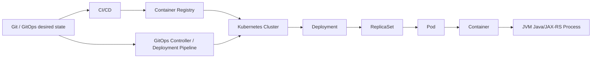

# Part 043 — CLI Workflow for Docker and Kubernetes

## 1. Core idea

Docker dan Kubernetes CLI bukan sekadar alat untuk menjalankan container. Untuk senior backend engineer, keduanya adalah **operational inspection layer**: cara melihat bagaimana artifact Java/JAX-RS benar-benar dijalankan, dikonfigurasi, diekspos, di-restart, dan gagal di runtime environment.

Di sistem enterprise, terutama microservices yang melibatkan PostgreSQL, Kafka, RabbitMQ, Redis, API gateway, service mesh, Kubernetes, GitOps, AWS/Azure, dan CI/CD, banyak bug tidak terlihat dari source code saja. Bug muncul karena kombinasi:

- image salah,
- environment variable salah,
- config mount tidak ada,
- secret belum terpasang,
- port tidak match,
- readiness probe gagal,
- DNS service salah,
- resource limit terlalu kecil,
- container crash loop,
- deployment belum rollout,
- pod jalan di node yang bermasalah,
- atau perubahan manual yang tidak selaras dengan GitOps source of truth.

CLI yang baik membantu menjawab pertanyaan operasional:

- Artifact apa yang sedang berjalan?
- Image tag/digest mana yang dipakai?
- Pod mana yang sehat dan mana yang gagal?
- Container restart karena apa?
- Config apa yang masuk ke container?
- Log menunjukkan failure apa?
- Apakah service bisa diakses dari dalam cluster?
- Apakah rollout sukses atau tertahan?
- Apakah perubahan manual aman, atau justru melanggar GitOps?

Prinsip utamanya: **inspect before mutate**. Dalam production-grade environment, command pertama sebaiknya read-only, evidence-oriented, dan context-aware.

---

## 2. Docker and Kubernetes mental model

### 2.1 Docker mental model

Docker memberi model packaging dan execution untuk aplikasi:

```text
Source code -> build artifact -> image -> container -> logs/runtime state
```

Untuk Java/JAX-RS service, flow umumnya:

```text
Maven package -> JAR/WAR -> Docker image -> registry -> Kubernetes Deployment -> Pod -> Container -> JVM process
```

Yang perlu dipahami:

- **Image** adalah template immutable.
- **Container** adalah instance runtime dari image.
- **Layer** memengaruhi cache build dan image size.
- **Entrypoint/CMD** menentukan process utama.
- **Environment variable** memengaruhi runtime config.
- **Volume mount** memengaruhi file/config/secret yang terlihat di container.
- **Network namespace** memengaruhi port dan connectivity.
- **Logs** umumnya berasal dari stdout/stderr process utama.

### 2.2 Kubernetes mental model

Kubernetes bukan sekadar tempat menjalankan container. Kubernetes adalah control plane yang terus mencoba menyesuaikan actual state dengan desired state.



Important objects:

- **Deployment**: desired rollout behavior untuk stateless workload.
- **ReplicaSet**: manages pod replicas untuk revision tertentu.
- **Pod**: smallest deployable unit, berisi satu atau lebih container.
- **Container**: runtime process.
- **Service**: stable network identity untuk pod.
- **ConfigMap**: non-secret configuration.
- **Secret**: sensitive configuration.
- **Ingress/Gateway**: external HTTP entry point.
- **Namespace**: logical isolation boundary.
- **Node**: host tempat pod dijalankan.
- **Event**: operational history pendek dari scheduler/kubelet/controller.

---

## 3. CLI safety model

Sebelum memakai `docker` atau `kubectl`, senior engineer harus selalu memastikan konteks.

### 3.1 Context-first discipline

Untuk Kubernetes:

```bash
kubectl config current-context
kubectl config get-contexts
kubectl config view --minify
```

Jangan pernah menjalankan command mutating sebelum yakin:

- cluster yang aktif benar,
- namespace benar,
- user/role benar,
- environment benar,
- command memang diperlukan,
- dan tidak ada GitOps controller yang akan mengembalikan perubahan manual.

Gunakan namespace eksplisit:

```bash
kubectl -n quote-order get pods
```

Lebih aman daripada mengandalkan default namespace.

### 3.2 Read-only first

Urutan aman saat debugging:

1. `get`
2. `describe`
3. `logs`
4. `events`
5. `top`
6. `exec` read-only command
7. `port-forward` untuk reproduksi terbatas
8. baru pertimbangkan command mutating dengan approval/process yang benar

Command yang perlu extra caution:

```bash
kubectl delete ...
kubectl apply ...
kubectl patch ...
kubectl edit ...
kubectl scale ...
kubectl rollout restart ...
kubectl set image ...
```

Dalam GitOps environment, perubahan manual seperti `kubectl edit` atau `kubectl set image` sering menjadi anti-pattern kecuali runbook mengizinkan untuk emergency.

### 3.3 Evidence before action

Sebelum mengubah sesuatu, capture evidence:

```bash
kubectl -n quote-order get deploy,rs,pod,svc
kubectl -n quote-order describe pod <pod-name>
kubectl -n quote-order logs <pod-name> --timestamps --tail=300
kubectl -n quote-order get events --sort-by=.lastTimestamp
```

Evidence penting untuk:

- RCA,
- rollback decision,
- escalation ke SRE/platform,
- PR fix,
- dan audit trail.

---

## 4. Docker CLI workflow

## 4.1 `docker build`

Build image dari Dockerfile:

```bash
docker build -t quote-order-service:local .
```

Dengan Dockerfile path eksplisit:

```bash
docker build -f docker/Dockerfile -t quote-order-service:local .
```

Dengan build arg:

```bash
docker build \
  --build-arg JAR_FILE=target/quote-order-service.jar \
  -t quote-order-service:local \
  .
```

Senior-level concerns:

- Apakah build context terlalu besar?
- Apakah `.dockerignore` benar?
- Apakah image memakai pinned base image?
- Apakah artifact Maven yang masuk image benar?
- Apakah build reproducible?
- Apakah image berjalan sebagai non-root?
- Apakah secret tidak masuk image layer?

Check image:

```bash
docker image ls quote-order-service
docker image inspect quote-order-service:local
```

### Failure modes

| Symptom | Possible cause | Debug command |
|---|---|---|
| Build lambat | context besar, cache miss | `docker build --progress=plain .` |
| File tidak ditemukan | wrong build context, wrong COPY path | cek Dockerfile dan `.dockerignore` |
| Secret masuk layer | ARG/COPY salah | `docker history --no-trunc <image>` |
| Runtime JDK salah | base image mismatch | `docker run --rm <image> java -version` |
| Permission denied | non-root user tidak punya akses | `docker run --rm <image> id` |

---

## 4.2 `docker run`

Run image lokal:

```bash
docker run --rm -p 8080:8080 quote-order-service:local
```

Dengan environment variable:

```bash
docker run --rm \
  -p 8080:8080 \
  -e APP_PROFILE=local \
  -e DB_HOST=host.docker.internal \
  quote-order-service:local
```

Dengan file env:

```bash
docker run --rm --env-file .env.local -p 8080:8080 quote-order-service:local
```

Dengan JVM options:

```bash
docker run --rm \
  -e JAVA_TOOL_OPTIONS="-Xms256m -Xmx512m" \
  -p 8080:8080 \
  quote-order-service:local
```

### Java/JAX-RS concerns

Saat service gagal di container tetapi berhasil di IDE, cek:

- working directory,
- classpath,
- environment variable,
- config file path,
- exposed port,
- JVM version,
- timezone,
- DNS dependency,
- database/broker hostname,
- file permission,
- container memory limit.

Useful commands:

```bash
docker run --rm quote-order-service:local java -version
docker run --rm quote-order-service:local pwd
docker run --rm quote-order-service:local ls -lah
docker run --rm quote-order-service:local env | sort
```

Jangan print env di environment yang mengandung secret kecuali sudah jelas aman.

---

## 4.3 `docker exec`

Masuk ke container yang sedang berjalan:

```bash
docker ps
docker exec -it <container-id> sh
```

Jika image punya Bash:

```bash
docker exec -it <container-id> bash
```

Read-only checks inside container:

```bash
id
pwd
ls -lah
ps aux
env | sort
ss -lntp
cat /etc/os-release
java -version
```

Production caution:

- Jangan install package di running container production sebagai fix permanen.
- Jangan mengedit file manual sebagai solusi jangka panjang.
- Jangan menjalankan command destructive tanpa approval.
- Treat container as ephemeral.

---

## 4.4 `docker logs`

Lihat logs:

```bash
docker logs <container-id>
docker logs -f <container-id>
docker logs --tail=200 <container-id>
docker logs --since=30m <container-id>
```

Dengan timestamp:

```bash
docker logs --timestamps --tail=300 <container-id>
```

Untuk Java service, log harus membantu menjawab:

- service startup sampai mana,
- port bind berhasil atau tidak,
- dependency connection gagal ke mana,
- profile/config apa yang aktif,
- error stack trace apa,
- correlation ID apa,
- health endpoint status apa.

Failure mode umum:

| Symptom | Likely direction |
|---|---|
| No logs | process tidak start, logging config salah, entrypoint gagal |
| Logs berhenti setelah startup | deadlock, blocked dependency, health check failure |
| Repeated startup logs | restart loop |
| Stack trace config missing | env/config mount issue |
| Connection refused | dependency unavailable atau wrong host/port |
| UnknownHostException | DNS/service name issue |
| SSLHandshakeException | TLS/cert/truststore issue |

---

## 4.5 `docker inspect`

Inspect container/image metadata:

```bash
docker inspect <container-id>
docker image inspect <image-name>:<tag>
```

Useful filtering:

```bash
docker inspect <container-id> --format '{{.State.Status}}'
docker inspect <container-id> --format '{{.State.ExitCode}}'
docker inspect <container-id> --format '{{json .Config.Env}}' | jq
```

Caution: env may contain secrets. Jangan paste output mentah ke ticket/Slack.

Inspect berguna untuk:

- entrypoint/CMD,
- exposed ports,
- env vars,
- mounts,
- network,
- restart status,
- image digest,
- labels.

---

## 4.6 Docker Compose workflow

Untuk local dependency stack:

```bash
docker compose up -d
docker compose ps
docker compose logs -f
docker compose down
```

Rebuild service:

```bash
docker compose up -d --build quote-order-service
```

Run command inside service:

```bash
docker compose exec postgres psql -U app appdb
```

Local enterprise stack sering melibatkan:

- PostgreSQL,
- Kafka,
- RabbitMQ,
- Redis,
- local service dependencies,
- mock external API,
- schema migration container,
- seed data.

Review concerns:

- Apakah port host bentrok?
- Apakah volume persistent membuat state lokal stale?
- Apakah seed data idempotent?
- Apakah credentials hanya untuk local?
- Apakah compose file terlalu jauh dari Kubernetes runtime?

Clean state carefully:

```bash
docker compose down
```

Destructive:

```bash
docker compose down -v
```

`-v` menghapus volume. Jangan jalankan tanpa sadar karena bisa menghapus database lokal yang masih dibutuhkan.

---

## 5. Kubernetes CLI workflow

## 5.1 Namespace and context

Always start with:

```bash
kubectl config current-context
kubectl get ns
kubectl -n quote-order get all
```

Set namespace temporarily:

```bash
kubectl config set-context --current --namespace=quote-order
```

Namun untuk command penting, lebih aman tetap eksplisit:

```bash
kubectl -n quote-order get pods
```

---

## 5.2 `kubectl get`

Basic inspection:

```bash
kubectl -n quote-order get pods
kubectl -n quote-order get deploy
kubectl -n quote-order get rs
kubectl -n quote-order get svc
kubectl -n quote-order get ingress
kubectl -n quote-order get configmap
kubectl -n quote-order get secret
```

Wide output:

```bash
kubectl -n quote-order get pods -o wide
```

YAML output:

```bash
kubectl -n quote-order get deploy quote-order-service -o yaml
```

JSON with jq:

```bash
kubectl -n quote-order get pods -o json | jq '.items[] | {name: .metadata.name, phase: .status.phase}'
```

Useful custom columns:

```bash
kubectl -n quote-order get pods \
  -o custom-columns='NAME:.metadata.name,PHASE:.status.phase,NODE:.spec.nodeName,RESTARTS:.status.containerStatuses[*].restartCount'
```

Common interpretation:

| Status | Meaning |
|---|---|
| Running | Pod scheduled and containers running, not always healthy |
| Pending | Scheduling/image/volume/resource issue |
| CrashLoopBackOff | Container repeatedly exits |
| ImagePullBackOff | Image cannot be pulled |
| ErrImagePull | Registry/image/tag/auth issue |
| Completed | Process finished successfully, expected for Job not service |
| OOMKilled | Container killed due memory limit |

---

## 5.3 `kubectl describe`

Describe gives object-level detail and events:

```bash
kubectl -n quote-order describe pod <pod-name>
kubectl -n quote-order describe deploy quote-order-service
kubectl -n quote-order describe svc quote-order-service
```

For a failing pod, check:

- image,
- container state,
- last state,
- restart count,
- exit code,
- reason,
- env sources,
- mounts,
- readiness/liveness probe,
- resource request/limit,
- node,
- events.

Example failure interpretation:

| Evidence | Direction |
|---|---|
| `Reason: OOMKilled` | Memory limit/JVM heap mismatch |
| `Readiness probe failed` | App not ready, wrong path/port, dependency blocking |
| `Back-off pulling image` | Registry credential/tag/digest problem |
| `MountVolume.SetUp failed` | ConfigMap/Secret/volume issue |
| `0/10 nodes available` | Scheduling/resource/taint/node selector issue |

---

## 5.4 `kubectl logs`

Basic logs:

```bash
kubectl -n quote-order logs <pod-name>
```

Follow:

```bash
kubectl -n quote-order logs -f <pod-name>
```

Tail and timestamps:

```bash
kubectl -n quote-order logs <pod-name> --tail=300 --timestamps
```

Previous container logs after crash:

```bash
kubectl -n quote-order logs <pod-name> --previous --timestamps
```

Specific container:

```bash
kubectl -n quote-order logs <pod-name> -c app --tail=300
```

By label:

```bash
kubectl -n quote-order logs -l app=quote-order-service --tail=300 --timestamps
```

Important for CrashLoopBackOff:

```bash
kubectl -n quote-order logs <pod-name> --previous --tail=500 --timestamps
```

Without `--previous`, you may only see logs from the newest failed attempt, or miss the crash evidence.

### Log debugging pattern

Use correlation ID:

```bash
kubectl -n quote-order logs deploy/quote-order-service --since=30m --timestamps \
  | grep 'correlation-id-value'
```

Structured logs:

```bash
kubectl -n quote-order logs deploy/quote-order-service --since=30m \
  | jq 'select(.traceId == "...")'
```

Only use `jq` if logs are valid JSON lines.

---

## 5.5 `kubectl exec`

Run command inside container:

```bash
kubectl -n quote-order exec -it <pod-name> -- sh
```

Specific container:

```bash
kubectl -n quote-order exec -it <pod-name> -c app -- sh
```

Read-only checks:

```bash
kubectl -n quote-order exec <pod-name> -- pwd
kubectl -n quote-order exec <pod-name> -- ls -lah /app
kubectl -n quote-order exec <pod-name> -- id
kubectl -n quote-order exec <pod-name> -- java -version
kubectl -n quote-order exec <pod-name> -- ss -lntp
```

Connectivity checks from pod perspective:

```bash
kubectl -n quote-order exec <pod-name> -- sh -c 'nc -vz postgres 5432'
kubectl -n quote-order exec <pod-name> -- sh -c 'nc -vz redis 6379'
kubectl -n quote-order exec <pod-name> -- sh -c 'nc -vz rabbitmq 5672'
```

If `nc` is unavailable, use available tools. Minimal/distroless images may not include shell at all. In that case use `kubectl debug` ephemeral container if allowed.

Security concern:

- `exec` into production may be logged/audited.
- Avoid printing secrets.
- Avoid changing files.
- Avoid ad-hoc fixes inside pod.
- Prefer reproducible command and evidence capture.

---

## 5.6 `kubectl port-forward`

Forward local port to pod/service:

```bash
kubectl -n quote-order port-forward svc/quote-order-service 8080:8080
```

Then test locally:

```bash
curl -i http://localhost:8080/health
```

Use cases:

- reproduce internal API behavior,
- inspect admin/health endpoint,
- debug service not exposed externally,
- compare service response bypassing gateway.

Cautions:

- Port-forward bypasses normal ingress/gateway path.
- It may bypass auth/proxy behavior depending endpoint.
- It should not be used as production workaround.
- It can create false confidence if external failure is actually gateway/TLS/routing.

---

## 5.7 `kubectl rollout`

Check rollout status:

```bash
kubectl -n quote-order rollout status deploy/quote-order-service
```

History:

```bash
kubectl -n quote-order rollout history deploy/quote-order-service
```

Undo:

```bash
kubectl -n quote-order rollout undo deploy/quote-order-service
```

Important: in GitOps environments, manual `rollout undo` may be overwritten by GitOps controller unless desired state is also changed. Treat it as emergency action only if runbook allows.

Rollout debugging:

```bash
kubectl -n quote-order get deploy quote-order-service
kubectl -n quote-order describe deploy quote-order-service
kubectl -n quote-order get rs -l app=quote-order-service
kubectl -n quote-order get pods -l app=quote-order-service
```

Typical rollout failures:

| Symptom | Likely cause |
|---|---|
| New pods pending | insufficient resources, node selector, taint, PVC issue |
| New pods crash | app/config/image failure |
| Old pods not terminating | PDB, stuck termination, finalizer, long shutdown |
| Rollout timeout | readiness never becomes true |
| Wrong version live | image tag/digest/GitOps sync issue |

---

## 5.8 `kubectl top`

Resource usage:

```bash
kubectl -n quote-order top pods
kubectl top nodes
```

If metrics server is available:

```bash
kubectl -n quote-order top pod <pod-name> --containers
```

Use it to detect:

- CPU saturation,
- memory pressure,
- container using unexpected resources,
- pod near memory limit,
- node pressure.

But `kubectl top` is not full observability. For real incident analysis, combine with metrics dashboard, logs, traces, JVM metrics, and deployment events.

---

## 5.9 `kubectl events`

Events are short-lived operational clues:

```bash
kubectl -n quote-order get events --sort-by=.lastTimestamp
```

Filter by involved object:

```bash
kubectl -n quote-order get events --field-selector involvedObject.name=<pod-name>
```

Useful for:

- scheduling failure,
- image pull issue,
- health probe failure,
- volume mount failure,
- node pressure,
- backoff behavior.

Caveat: events expire. Capture them early during incidents.

---

## 5.10 `kubectl debug`

Ephemeral debug container:

```bash
kubectl -n quote-order debug -it <pod-name> --image=busybox --target=app -- sh
```

Use cases:

- app image is distroless,
- no shell/tools inside container,
- need network inspection from same pod namespace,
- need minimal read-only debugging.

Cautions:

- Requires cluster feature and RBAC permission.
- May be disallowed in controlled environments.
- Should not mutate app filesystem/state.
- Must follow audit/security process.

---

## 6. Debugging common Kubernetes failure scenarios

## 6.1 CrashLoopBackOff

Workflow:

```bash
kubectl -n quote-order get pod <pod-name>
kubectl -n quote-order describe pod <pod-name>
kubectl -n quote-order logs <pod-name> --previous --timestamps --tail=500
kubectl -n quote-order get events --field-selector involvedObject.name=<pod-name> --sort-by=.lastTimestamp
```

Check:

- exit code,
- last state reason,
- stack trace,
- config/env missing,
- dependency unavailable,
- JVM heap vs memory limit,
- migration/startup failure,
- readiness/liveness killing too early.

## 6.2 ImagePullBackOff

Workflow:

```bash
kubectl -n quote-order describe pod <pod-name>
kubectl -n quote-order get pod <pod-name> -o jsonpath='{.spec.containers[*].image}'
```

Check:

- image tag exists,
- registry credential,
- image pull secret,
- wrong registry path,
- deleted image,
- private registry access,
- image digest mismatch.

## 6.3 Readiness probe failure

Workflow:

```bash
kubectl -n quote-order describe pod <pod-name>
kubectl -n quote-order logs <pod-name> --tail=300 --timestamps
kubectl -n quote-order get deploy quote-order-service -o yaml | grep -A20 readinessProbe
```

Check:

- wrong path,
- wrong port,
- startup too slow,
- dependency blocking readiness,
- auth required by health endpoint,
- liveness/readiness semantics mixed,
- probe timeout too aggressive.

## 6.4 Service not reachable

Workflow:

```bash
kubectl -n quote-order get svc quote-order-service -o yaml
kubectl -n quote-order get endpoints quote-order-service
kubectl -n quote-order get pods -l app=quote-order-service
```

Check:

- selector mismatch,
- pod not ready,
- targetPort mismatch,
- container not listening,
- network policy,
- DNS issue,
- service name/namespace wrong.

## 6.5 ConfigMap/Secret mismatch

Workflow:

```bash
kubectl -n quote-order describe pod <pod-name>
kubectl -n quote-order get configmap <name> -o yaml
kubectl -n quote-order get secret <name> -o yaml
```

Do not decode or paste secret values unless explicitly authorized.

Check:

- key name mismatch,
- missing config map,
- missing secret,
- stale mounted config,
- deployment not restarted after config change,
- wrong namespace.

---

## 7. Java/JAX-RS container debugging concerns

## 7.1 JVM memory and container limit

Modern JVMs are container-aware, but misconfiguration still happens.

Check resource limits:

```bash
kubectl -n quote-order get pod <pod-name> -o json | jq '.spec.containers[] | {name, resources}'
```

Check OOMKilled:

```bash
kubectl -n quote-order describe pod <pod-name> | grep -i -A5 oom
```

Watch for:

- `-Xmx` greater than container memory limit,
- no headroom for metaspace/native memory/thread stack,
- memory limit too low for traffic/test load,
- sidecar consuming shared pod resources,
- container killed before heap dump captured.

## 7.2 Port binding

Kubernetes Service maps `port` to `targetPort`. App must listen on expected container port.

Check deployment:

```bash
kubectl -n quote-order get deploy quote-order-service -o yaml | grep -A10 ports
```

Inside pod:

```bash
kubectl -n quote-order exec <pod-name> -- ss -lntp
```

Common mismatch:

```text
Service targetPort: 8080
App listens on: 8081
Readiness probe points to: 8080
```

## 7.3 Health endpoint semantics

Health endpoint must distinguish:

- process alive,
- HTTP server started,
- app ready for traffic,
- downstream dependency readiness,
- degraded but acceptable state.

Bad pattern:

- liveness fails because database is temporarily slow,
- pod gets restarted unnecessarily,
- restart storm worsens outage.

Review health checks carefully.

---

## 8. GitOps interaction

If deployment is managed by GitOps, Kubernetes actual state should be derived from Git desired state.

Dangerous pattern:

```bash
kubectl -n quote-order edit deploy quote-order-service
```

Why dangerous:

- manual change may be overwritten,
- audit trail moves outside Git,
- reviewer cannot see change,
- rollback path becomes unclear,
- drift between cluster and repository appears.

Safer pattern:

1. Inspect cluster.
2. Capture evidence.
3. Identify desired state source.
4. Change manifest/values in Git.
5. Let GitOps reconcile.
6. Monitor rollout.

Emergency exceptions must follow internal runbook.

---

## 9. Evidence bundle template

When escalating Docker/Kubernetes issue, include:

```text
Environment:
- cluster/context:
- namespace:
- service:
- deployment:
- image tag/digest:
- time window:

Observed symptom:
- user impact:
- endpoint/job affected:
- error rate/status:

Commands run:
- kubectl get ...
- kubectl describe ...
- kubectl logs ...
- kubectl get events ...

Evidence:
- pod status:
- restart count:
- exit code:
- readiness/liveness result:
- relevant log lines:
- deployment event:

Initial hypothesis:
- config/env:
- dependency:
- image:
- resource:
- network:
- rollout:

Safety notes:
- no mutating command run / mutating command run with approval:
- secrets redacted:
```

---

## 10. PR review checklist for Docker/Kubernetes CLI and manifests

When reviewing PR touching Docker/Kubernetes/runtime tooling, ask:

### Dockerfile

- Is base image pinned and approved?
- Is the image running as non-root?
- Is `.dockerignore` correct?
- Are secrets excluded from image layers?
- Is JVM version aligned with build/runtime requirement?
- Are file permissions correct?
- Is entrypoint clear and signal-friendly?
- Is image size reasonable?

### Kubernetes manifests

- Are resource requests/limits defined?
- Are readiness and liveness probes semantically correct?
- Are config maps/secrets referenced correctly?
- Are service ports and target ports aligned?
- Are labels/selectors consistent?
- Are rollout strategy and termination grace period appropriate?
- Are securityContext settings appropriate?
- Are changes compatible with GitOps flow?

### Operational safety

- Can the change be rolled back?
- Is the image tag immutable or digest-pinned where required?
- Is observability preserved?
- Are logs sufficient for debugging?
- Does the change require runbook update?
- Does the change require SRE/platform review?

---

## 11. Internal verification checklist

Verify internally before assuming anything:

- Which Kubernetes clusters/environments exist?
- What is the naming convention for namespaces?
- What is the safe way to switch context?
- Which commands are allowed in dev/stage/prod?
- Is `kubectl exec` allowed in production?
- Is `kubectl debug` allowed?
- Is manual `kubectl edit/apply/patch` forbidden by GitOps policy?
- Which GitOps tool is used, if any?
- Where are Helm charts/Kustomize/manifests stored?
- How are image tags/digests promoted?
- Where are deployment events visible?
- What is the standard evidence bundle for incidents?
- What is the escalation path to SRE/platform/DevOps?
- What is the approved process for rollback?
- What is the policy for decoding Kubernetes secrets?
- Which Docker base images are approved?
- Are services required to run as non-root?
- Are resource limits standardized?
- Are health check endpoints standardized?

---

## 12. Practical command reference

Read-only Kubernetes triage:

```bash
NS=quote-order
APP=quote-order-service

kubectl config current-context
kubectl -n "$NS" get deploy,rs,pod,svc
kubectl -n "$NS" get pods -l app="$APP" -o wide
kubectl -n "$NS" describe deploy "$APP"
kubectl -n "$NS" get events --sort-by=.lastTimestamp | tail -50
kubectl -n "$NS" logs deploy/"$APP" --tail=300 --timestamps
```

CrashLoop triage:

```bash
NS=quote-order
POD=<pod-name>

kubectl -n "$NS" describe pod "$POD"
kubectl -n "$NS" logs "$POD" --previous --tail=500 --timestamps
kubectl -n "$NS" get events --field-selector involvedObject.name="$POD" --sort-by=.lastTimestamp
```

Docker local image triage:

```bash
IMAGE=quote-order-service:local

docker image inspect "$IMAGE"
docker run --rm "$IMAGE" java -version
docker run --rm "$IMAGE" id
docker run --rm -p 8080:8080 "$IMAGE"
```

---

## 13. Key takeaways

- Docker CLI helps inspect image/container behavior before Kubernetes adds orchestration complexity.
- Kubernetes CLI should be used with context-safety, namespace explicitness, and read-only-first discipline.
- `get`, `describe`, `logs`, `events`, and `top` are the core inspection commands.
- `exec`, `debug`, `port-forward`, and rollout commands require more operational caution.
- For Java/JAX-RS services, many runtime failures are actually config, port, DNS, TLS, resource, or health check failures.
- In GitOps environments, manual cluster mutation can create drift and audit gaps.
- Senior engineers should produce evidence bundles, not just command output fragments.

