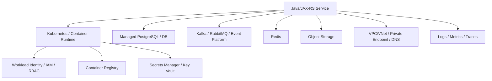

# Part 044 — CLI Workflow for Cloud Debugging

## 1. Core idea

Cloud CLI adalah operational lens untuk melihat resource yang berada di luar source code dan di luar Kubernetes manifest: account, subscription, region, IAM/RBAC, container registry, object storage, secrets, network, private endpoint, DNS, load balancer, managed database, managed messaging, logs, metrics, dan deployment integration.

Untuk senior backend engineer, AWS CLI dan Azure CLI bukan alat untuk “klik resource lewat terminal”. Keduanya dipakai untuk menjawab pertanyaan production-grade:

- Apakah saya sedang melihat account/subscription yang benar?
- Apakah resource ada di region yang benar?
- Apakah service identity punya permission yang benar?
- Apakah secret/config tersedia dan versinya benar?
- Apakah container image ada di registry?
- Apakah network path ke database/broker/cache tersedia?
- Apakah private endpoint/DNS bekerja?
- Apakah deployment gagal karena cloud permission, bukan karena aplikasi?
- Apakah logs/metrics menunjukkan resource pressure atau access denial?

Prinsip utamanya: **cloud context mistakes are high-blast-radius mistakes**.

Salah cluster Kubernetes berbahaya. Salah cloud account/subscription/region bisa lebih berbahaya karena dapat menyentuh shared infrastructure, secrets, identity, registry, storage, dan production data.

---

## 2. Cloud debugging mental model

Cloud debugging sering berada di antara application layer dan platform layer.



Saat service gagal, penyebabnya bisa berada di salah satu layer:

- application config,
- Kubernetes deployment,
- identity/permission,
- secret reference,
- container registry,
- private networking,
- DNS,
- TLS/certificate,
- managed service firewall,
- region/account mismatch,
- quota/limit,
- atau deployment pipeline credential.

Cloud CLI membantu mengisolasi layer mana yang gagal.

---

## 3. Safety model for cloud CLI

## 3.1 Account/subscription/tenant first

Jangan pernah menjalankan command cloud tanpa memverifikasi identity dan target environment.

AWS:

```bash
aws sts get-caller-identity
aws configure list
```

Azure:

```bash
az account show
az account list --output table
```

Minimum yang harus jelas:

- user/service principal/role yang aktif,
- account/subscription/tenant,
- region/location,
- environment target,
- permission scope,
- command read-only atau mutating.

## 3.2 Region/location explicitness

AWS region sering implicit dari config/env:

```bash
aws configure get region
export AWS_REGION=ap-southeast-1
```

Lebih aman eksplisit:

```bash
aws eks describe-cluster --name <cluster-name> --region ap-southeast-1
```

Azure location/resource group sering ditentukan lewat resource group:

```bash
az group show --name <resource-group>
```

Always verify:

- AWS region,
- Azure subscription,
- Azure resource group,
- naming convention environment,
- tags/labels environment.

## 3.3 Read-only first

Prefer command yang membaca state:

AWS examples:

```bash
aws sts get-caller-identity
aws eks describe-cluster --name <cluster>
aws ecr describe-repositories
aws logs describe-log-groups
```

Azure examples:

```bash
az account show
az aks show --resource-group <rg> --name <cluster>
az acr repository list --name <registry>
az monitor log-analytics workspace list --resource-group <rg>
```

High-risk commands:

```bash
aws iam put-role-policy ...
aws secretsmanager put-secret-value ...
aws ecr batch-delete-image ...
aws s3 rm ... --recursive
az role assignment create ...
az keyvault secret set ...
az acr repository delete ...
az group delete ...
```

Do not run mutating commands unless:

- runbook says so,
- target is verified,
- blast radius is understood,
- approval exists if required,
- rollback is known,
- and command is logged/auditable.

---

## 4. Authentication and identity

## 4.1 AWS identity

Check caller:

```bash
aws sts get-caller-identity
```

Example output fields:

- `Account`
- `Arn`
- `UserId`

Interpretation questions:

- Is this production or non-production account?
- Is this human identity or assumed role?
- Is the role expected for this task?
- Is the account ID expected?

Profiles:

```bash
aws configure list-profiles
aws configure list --profile <profile>
aws sts get-caller-identity --profile <profile>
```

Use explicit profile:

```bash
AWS_PROFILE=<profile> aws sts get-caller-identity
```

## 4.2 Azure identity

Check account:

```bash
az account show --output table
az account show --query '{name:name, id:id, tenantId:tenantId, user:user.name}'
```

Set subscription:

```bash
az account set --subscription <subscription-id-or-name>
```

Check again:

```bash
az account show --output table
```

Interpretation questions:

- Is the tenant correct?
- Is the subscription correct?
- Is this production or non-production?
- Is the signed-in identity expected?
- Is RBAC assignment sufficient?

---

## 5. Resource lookup discipline

Cloud resource names are often environment-specific. Avoid guessing.

AWS examples:

```bash
aws resourcegroupstaggingapi get-resources \
  --tag-filters Key=Environment,Values=dev \
  --region ap-southeast-1
```

ECR repositories:

```bash
aws ecr describe-repositories --region ap-southeast-1
```

EKS clusters:

```bash
aws eks list-clusters --region ap-southeast-1
```

Azure examples:

```bash
az resource list --resource-group <rg> --output table
az resource list --tag Environment=dev --output table
az aks list --output table
az acr list --output table
```

Useful Azure JMESPath query:

```bash
az resource list --resource-group <rg> \
  --query '[].{name:name,type:type,location:location}' \
  --output table
```

Cloud CLI output can be large. Use query/filtering to reduce noise and avoid leaking sensitive data.

---

## 6. Container registry debugging

## 6.1 AWS ECR

Login usually handled by CI/CD, but debugging may require verifying image existence.

List repositories:

```bash
aws ecr describe-repositories --region <region>
```

List images:

```bash
aws ecr list-images \
  --repository-name <repo> \
  --region <region>
```

Describe image detail:

```bash
aws ecr describe-images \
  --repository-name <repo> \
  --image-ids imageTag=<tag> \
  --region <region>
```

Check:

- tag exists,
- digest matches deployment,
- image pushed to correct account/region,
- lifecycle policy did not delete image,
- CI role had push permission,
- cluster node/runtime has pull permission.

## 6.2 Azure Container Registry

List registries:

```bash
az acr list --output table
```

List repositories:

```bash
az acr repository list --name <registry> --output table
```

List tags:

```bash
az acr repository show-tags \
  --name <registry> \
  --repository <repo> \
  --output table
```

Show manifests:

```bash
az acr manifest list-metadata \
  --registry <registry> \
  --name <repo> \
  --output table
```

Check:

- AKS pull permission,
- managed identity role assignment,
- tag/digest used by deployment,
- image retention policy,
- repository path convention.

---

## 7. Kubernetes cloud integration debugging

## 7.1 AWS EKS

Describe cluster:

```bash
aws eks describe-cluster --name <cluster> --region <region>
```

Update kubeconfig:

```bash
aws eks update-kubeconfig --name <cluster> --region <region> --profile <profile>
```

Caution: this changes kubeconfig context. Always verify after:

```bash
kubectl config current-context
kubectl get ns
```

EKS failure directions:

- IAM role cannot access cluster,
- kubeconfig points to wrong cluster,
- AWS auth mapping issue,
- OIDC provider issue,
- node role cannot pull image,
- security group/network issue,
- private endpoint access issue.

## 7.2 Azure AKS

Show cluster:

```bash
az aks show --resource-group <rg> --name <cluster>
```

Get credentials:

```bash
az aks get-credentials --resource-group <rg> --name <cluster>
```

Caution: this updates kubeconfig. Verify context immediately.

```bash
kubectl config current-context
kubectl get ns
```

AKS failure directions:

- wrong subscription,
- missing AKS RBAC/Azure RBAC,
- ACR pull permission missing,
- managed identity issue,
- private cluster network access,
- DNS/private endpoint issue.

---

## 8. Logs and metrics via cloud CLI

## 8.1 AWS CloudWatch Logs

List log groups:

```bash
aws logs describe-log-groups --region <region>
```

List streams:

```bash
aws logs describe-log-streams \
  --log-group-name <log-group> \
  --order-by LastEventTime \
  --descending \
  --region <region>
```

Get log events:

```bash
aws logs get-log-events \
  --log-group-name <log-group> \
  --log-stream-name <log-stream> \
  --limit 100 \
  --region <region>
```

CloudWatch Logs Insights can be invoked via CLI, but use carefully because query cost and scope matter.

Debugging questions:

- Are logs arriving?
- Is log group correct?
- Is timestamp timezone interpreted correctly?
- Are application logs, ingress logs, and platform logs separated?
- Are logs delayed?

## 8.2 Azure Monitor / Log Analytics

List workspaces:

```bash
az monitor log-analytics workspace list --resource-group <rg> --output table
```

Query logs:

```bash
az monitor log-analytics query \
  --workspace <workspace-id> \
  --analytics-query "ContainerLog | take 10"
```

Use precise time windows and filters. Avoid broad queries during incident unless necessary.

Debugging questions:

- Which workspace contains AKS/application logs?
- Are logs delayed?
- Are container logs and app logs normalized?
- Is correlation ID searchable?
- Are logs redacted?

---

## 9. Secrets and configuration debugging

Secrets are sensitive. The goal is usually to verify existence, version, access policy, and reference path — not to print values.

## 9.1 AWS Secrets Manager

List secrets carefully:

```bash
aws secretsmanager list-secrets --region <region>
```

Describe secret metadata:

```bash
aws secretsmanager describe-secret \
  --secret-id <secret-id> \
  --region <region>
```

Avoid:

```bash
aws secretsmanager get-secret-value --secret-id <secret-id>
```

unless explicitly authorized. It can expose secret material to terminal history, logs, scrollback, screenshots, or copied text.

Check:

- secret exists,
- correct region/account,
- correct version stage,
- access policy/role,
- rotation state,
- Kubernetes ExternalSecret/CSI mapping if used.

## 9.2 Azure Key Vault

List vaults:

```bash
az keyvault list --output table
```

List secret names:

```bash
az keyvault secret list --vault-name <vault> --query '[].name' --output table
```

Show metadata:

```bash
az keyvault secret show --vault-name <vault> --name <secret-name> \
  --query '{name:name, enabled:attributes.enabled, updated:attributes.updated, expires:attributes.expires}'
```

Avoid printing secret values unless authorized.

Check:

- vault name and environment,
- secret name,
- enabled/expired status,
- access policy/RBAC,
- managed identity permission,
- CSI/ExternalSecret mapping,
- rotation timing.

---

## 10. IAM/RBAC debugging

## 10.1 AWS IAM debugging

Common symptom:

```text
AccessDeniedException
not authorized to perform
User/role is not authorized
```

Debug identity:

```bash
aws sts get-caller-identity
```

Inspect role/policy only if permitted:

```bash
aws iam get-role --role-name <role-name>
aws iam list-attached-role-policies --role-name <role-name>
```

For EKS workload identity, verify:

- service account annotation,
- IAM role trust policy,
- OIDC provider,
- pod service account,
- SDK credential resolution,
- environment variable overrides.

Kubernetes side:

```bash
kubectl -n <ns> get sa <service-account> -o yaml
kubectl -n <ns> get pod <pod> -o jsonpath='{.spec.serviceAccountName}'
```

## 10.2 Azure RBAC debugging

Common symptom:

```text
AuthorizationFailed
The client does not have authorization
Forbidden
```

Check account:

```bash
az account show
```

List role assignments for current user may require permission:

```bash
az role assignment list --assignee <principal-id> --output table
```

For AKS/workload identity/managed identity, verify:

- managed identity attached,
- federated credential if used,
- role assignment scope,
- Key Vault access model,
- ACR pull role,
- subscription/resource group mismatch.

---

## 11. Network and private endpoint debugging

Cloud network failures often look like application failures.

Common symptoms:

- timeout,
- connection refused,
- DNS resolution failure,
- TLS handshake failure,
- private endpoint unreachable,
- database firewall denies connection,
- service works in one environment but not another.

## 11.1 Debugging dimensions

Check:

- source identity/location,
- destination hostname,
- DNS resolution,
- private/public IP expectation,
- route table,
- security group/NSG,
- firewall rule,
- private endpoint state,
- Kubernetes network policy,
- TLS certificate hostname.

## 11.2 AWS directions

Depending on service and permissions:

```bash
aws ec2 describe-security-groups --region <region>
aws ec2 describe-route-tables --region <region>
aws ec2 describe-vpcs --region <region>
aws ec2 describe-subnets --region <region>
aws ec2 describe-vpc-endpoints --region <region>
```

For managed DB, Kafka, Redis, or messaging service, use service-specific describe commands if available internally.

## 11.3 Azure directions

```bash
az network nsg list --resource-group <rg> --output table
az network private-endpoint list --resource-group <rg> --output table
az network private-dns zone list --resource-group <rg> --output table
az network vnet list --resource-group <rg> --output table
```

For AKS/network issues:

- check node subnet,
- private DNS zone link,
- managed identity permission,
- NSG rules,
- private endpoint approval state.

## 11.4 Combine with Kubernetes perspective

From app pod:

```bash
kubectl -n <ns> exec <pod> -- nslookup <host>
kubectl -n <ns> exec <pod> -- nc -vz <host> <port>
kubectl -n <ns> exec <pod> -- openssl s_client -connect <host>:443 -servername <host>
```

If the container lacks tools, use an approved debug pod/ephemeral container.

---

## 12. Object storage debugging

Cloud object storage is often used for exports, imports, artifacts, reports, attachments, or batch integrations.

## 12.1 AWS S3

List buckets may be restricted:

```bash
aws s3 ls
```

List prefix:

```bash
aws s3 ls s3://<bucket>/<prefix>/
```

Head object:

```bash
aws s3api head-object --bucket <bucket> --key <key>
```

Avoid downloading production data casually. Verify data classification first.

Debugging questions:

- Does object exist?
- Is key/path correct?
- Is region correct?
- Is role allowed?
- Is object encrypted with KMS?
- Is lifecycle policy deleting objects?
- Is application using wrong prefix/environment?

## 12.2 Azure Blob Storage

List storage accounts:

```bash
az storage account list --resource-group <rg> --output table
```

List containers:

```bash
az storage container list --account-name <account> --auth-mode login --output table
```

List blobs:

```bash
az storage blob list \
  --account-name <account> \
  --container-name <container> \
  --prefix <prefix> \
  --auth-mode login \
  --output table
```

Check:

- identity permission,
- container name,
- prefix convention,
- private endpoint/firewall,
- encryption/key access,
- retention/lifecycle policy.

---

## 13. Database, broker, and cache cloud integration

This series avoids inventing CSG-specific managed services. Verify internally whether PostgreSQL, Kafka, RabbitMQ, Redis, or related platforms are self-managed, vendor-managed, cloud-managed, or internal-platform-managed.

Debugging dimensions are stable:

- hostname,
- port,
- DNS,
- TLS,
- auth/secret,
- firewall/security group/NSG,
- private endpoint,
- service identity,
- certificate truststore,
- connection pool config,
- quota/limit,
- failover/maintenance window,
- region/zone mismatch.

Cloud CLI may help inspect:

- resource existence,
- endpoint address,
- network rule,
- private endpoint,
- secret location,
- metric/log availability,
- maintenance event,
- IAM/RBAC permission.

Application CLI from Kubernetes pod confirms runtime perspective:

```bash
kubectl -n <ns> exec <pod> -- nc -vz <db-host> 5432
kubectl -n <ns> exec <pod> -- nc -vz <redis-host> 6379
kubectl -n <ns> exec <pod> -- nc -vz <rabbitmq-host> 5672
kubectl -n <ns> exec <pod> -- nc -vz <kafka-bootstrap> 9092
```

---

## 14. CI/CD cloud permission debugging

Deployment pipeline often fails because CI identity cannot access cloud resource.

Common failure points:

- cannot push image,
- cannot pull base image,
- cannot assume role,
- OIDC federation misconfigured,
- cannot read secret,
- cannot deploy to cluster,
- cannot update GitOps repo,
- cannot access artifact storage,
- cannot write release artifact.

Debugging checklist:

- Which identity does CI use?
- Is it long-lived secret or OIDC?
- What is the permission scope?
- Which account/subscription is targeted?
- Which region/resource group?
- Does the action/job have minimal token permission?
- Is branch/environment allowed to deploy?
- Are production approvals required?

GitHub Actions OIDC example direction:

- verify workflow permissions,
- verify cloud trust relationship,
- verify subject claim branch/environment,
- verify role assignment,
- verify job actually requests id-token permission.

Do not “fix” by giving broad admin permission. That hides the root cause and increases blast radius.

---

## 15. Cloud CLI output hygiene

Cloud CLI output can contain sensitive data:

- ARNs/resource IDs,
- subscription IDs,
- tenant IDs,
- endpoint hostnames,
- secret names,
- tags,
- user names,
- IP addresses,
- policy documents,
- connection strings,
- SAS tokens,
- temporary credentials.

Before sharing output:

- redact secrets,
- remove tokens,
- remove customer data,
- reduce output with query/filter,
- include only relevant fields,
- preserve timestamps and resource IDs when needed for investigation,
- follow internal data handling rules.

Prefer structured safe summaries:

```text
Identity:
- account/subscription verified: yes
- role type: workload deployment role
- environment: staging

Resource:
- registry repo exists: yes
- image tag exists: no
- region/location: verified

Evidence:
- image tag requested by deployment: 1.42.3
- latest pushed tag: 1.42.2
- likely issue: CI publish step did not push 1.42.3
```

---

## 16. Troubleshooting playbooks

## 16.1 Image exists locally but Kubernetes cannot pull

Check:

1. Is image pushed to registry?
2. Is tag/digest correct?
3. Is deployment pointing to correct registry/repo?
4. Is cluster allowed to pull?
5. Is image pull secret/identity correct?
6. Is registry in same cloud/account/subscription expected?
7. Was image deleted by lifecycle policy?

Commands:

AWS:

```bash
aws ecr describe-images --repository-name <repo> --image-ids imageTag=<tag> --region <region>
```

Azure:

```bash
az acr repository show-tags --name <registry> --repository <repo> --output table
```

Kubernetes:

```bash
kubectl -n <ns> describe pod <pod>
```

## 16.2 Service cannot read secret

Check:

1. Secret exists in cloud secret store.
2. Version is enabled/current.
3. Workload identity has permission.
4. Kubernetes mapping exists.
5. Secret mounted/injected under expected key.
6. Application config references correct env/key/path.
7. No environment mismatch.

Avoid printing value.

## 16.3 Database timeout from app

Check:

1. App config hostname/port.
2. DNS resolution from pod.
3. TCP connectivity from pod.
4. DB firewall/security group/NSG.
5. Private endpoint/DNS.
6. TLS/cert requirement.
7. Credentials/secret.
8. DB availability/maintenance.
9. Connection pool saturation.

## 16.4 CI deployment permission denied

Check:

1. CI identity.
2. Branch/environment gate.
3. OIDC trust/sub claim.
4. Role assignment/scope.
5. Cloud account/subscription.
6. Target resource path.
7. Token permissions in workflow.
8. Recent governance/policy changes.

---

## 17. PR review checklist for cloud CLI and cloud automation

When reviewing scripts/workflows that use AWS CLI/Azure CLI:

### Context safety

- Does the script print active account/subscription before action?
- Is region/location explicit?
- Is environment explicit?
- Does it fail closed when context is missing?
- Does it avoid relying on developer default profile accidentally?

### Security

- Does it avoid printing secrets?
- Does it avoid broad wildcard permissions?
- Does it use OIDC/workload identity where appropriate?
- Are tokens short-lived?
- Are third-party actions pinned if used?
- Is least privilege preserved?

### Reproducibility

- Are CLI versions controlled or documented?
- Are query filters deterministic?
- Are resource names passed as arguments, not hardcoded incorrectly?
- Does the script have dry-run/read-only mode?
- Is output machine-readable where needed?

### Production safety

- Are destructive commands guarded?
- Is there confirmation for production?
- Is rollback known?
- Does it respect GitOps desired state?
- Does it write evidence/logs?
- Does it require approval where needed?

### Operability

- Are errors actionable?
- Does it distinguish auth failure, missing resource, wrong region, and permission denied?
- Does it produce evidence useful for SRE/platform escalation?
- Does it document required roles and scopes?

---

## 18. Internal verification checklist

Verify internally before applying any cloud CLI assumption:

- Which cloud providers are used for the relevant service: AWS, Azure, both, or internal platform abstraction?
- Which accounts/subscriptions map to dev, test, staging, production?
- What are official naming conventions for resource groups, regions, registries, clusters, secrets, and network resources?
- How should engineers authenticate locally?
- Are long-lived credentials forbidden?
- Is OIDC federation used by CI/CD?
- Which CLI commands are allowed for backend engineers?
- Which commands require SRE/platform approval?
- Where are cloud runbooks stored?
- Where are cloud logs and metrics viewed?
- Which registry is authoritative for service images?
- How are image tags/digests promoted?
- Where are secrets stored: cloud secret manager, Kubernetes secret, external secret operator, vault, or internal platform?
- What is the policy for reading secret values?
- How are PostgreSQL, Kafka, RabbitMQ, and Redis provisioned and accessed?
- Are private endpoints used?
- What DNS zones are used internally?
- Who owns IAM/RBAC changes?
- How are emergency access and break-glass actions audited?
- How are cloud incidents escalated?

---

## 19. Practical command templates

## 19.1 AWS context and EKS check

```bash
PROFILE=<profile>
REGION=<region>
CLUSTER=<cluster>

AWS_PROFILE="$PROFILE" aws sts get-caller-identity
AWS_PROFILE="$PROFILE" aws eks describe-cluster \
  --name "$CLUSTER" \
  --region "$REGION" \
  --query 'cluster.{name:name,status:status,endpoint:endpoint,version:version}'
```

## 19.2 AWS ECR image check

```bash
PROFILE=<profile>
REGION=<region>
REPO=<repo>
TAG=<tag>

AWS_PROFILE="$PROFILE" aws ecr describe-images \
  --repository-name "$REPO" \
  --image-ids imageTag="$TAG" \
  --region "$REGION" \
  --query 'imageDetails[0].{digest:imageDigest,pushedAt:imagePushedAt,tags:imageTags}'
```

## 19.3 Azure context and AKS check

```bash
SUB=<subscription>
RG=<resource-group>
CLUSTER=<cluster>

az account set --subscription "$SUB"
az account show --query '{name:name,id:id,tenantId:tenantId,user:user.name}'
az aks show \
  --resource-group "$RG" \
  --name "$CLUSTER" \
  --query '{name:name,location:location,kubernetesVersion:kubernetesVersion,powerState:powerState.code}'
```

## 19.4 Azure ACR image check

```bash
REGISTRY=<registry>
REPO=<repo>
TAG=<tag>

az acr repository show-tags \
  --name "$REGISTRY" \
  --repository "$REPO" \
  --query "[?@=='$TAG']" \
  --output table
```

---

## 20. Key takeaways

- Cloud CLI debugging starts with identity, account/subscription, region/location, and environment verification.
- Many “application failures” are actually cloud identity, secret, registry, network, DNS, or private endpoint failures.
- AWS CLI and Azure CLI should be used read-only first, with explicit profile/subscription and region/resource group.
- Never print secret values casually; verify metadata, access, version, and mapping first.
- CI/CD cloud failures should be solved with least privilege, not broad admin permissions.
- Cloud CLI output must be redacted before sharing.
- Senior engineers should understand cloud debugging enough to produce evidence, isolate layer ownership, and escalate cleanly to platform/SRE/security.

