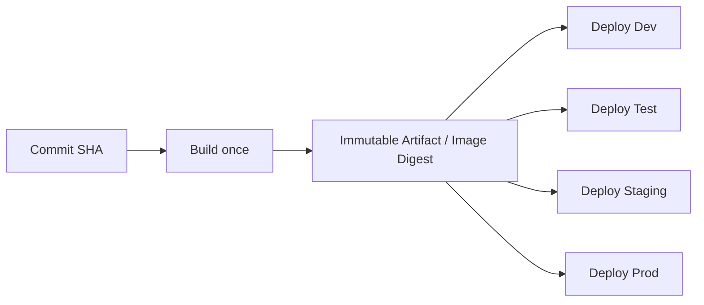

# Part 045 — CI/CD Pipeline Mental Model

## 1. Core idea

CI/CD pipeline adalah **change-delivery control system**. Ia bukan sekadar automation untuk menjalankan `mvn test` lalu deploy. Untuk senior backend engineer, pipeline adalah mekanisme yang menjawab pertanyaan production-grade:

- Source code mana yang sedang dibangun?
- Commit mana yang menghasilkan artifact ini?
- Test dan scan apa yang sudah melewati artifact ini?
- Artifact mana yang dipublish?
- Image digest mana yang dideploy?
- Environment mana yang sudah menerima perubahan?
- Siapa atau sistem apa yang memberi approval?
- Secret dan permission apa yang dipakai pipeline?
- Bagaimana rollback dilakukan jika perubahan bermasalah?
- Evidence apa yang tersedia untuk incident, audit, dan RCA?

Pipeline yang baik membuat perubahan menjadi **traceable, repeatable, reviewable, auditable, recoverable, dan secure**.

Pipeline yang buruk biasanya terlihat produktif di awal, tetapi diam-diam menyimpan risiko:

- artifact tidak bisa ditelusuri ke commit,
- build local berbeda dengan build CI,
- test mudah di-skip tanpa konsekuensi,
- deployment memakai tag mutable seperti `latest`,
- secret terlalu luas,
- approval hanya formalitas,
- rollback tidak pernah diuji,
- smoke test tidak membuktikan service benar-benar sehat,
- pipeline failure diselesaikan dengan retry tanpa diagnosis.

Untuk konteks Java/JAX-RS enterprise, CI/CD harus dipahami sebagai jembatan antara **source code, Maven artifact, container image, Kubernetes manifest, cloud resource, GitOps state, dan production behavior**.

---

## 2. Pipeline mental model

Pipeline mengubah perubahan source code menjadi perubahan runtime environment.

```mermaid
flowchart LR
    Dev[Developer Change] --> PR[Pull Request]
    PR --> Source[Source Commit]
    Source --> Build[Build]
    Build --> Test[Test]
    Test --> Scan[Scan]
    Scan --> Package[Package]
    Package --> Publish[Publish Artifact/Image]
    Publish --> Deploy[Deploy]
    Deploy --> Smoke[Smoke Test]
    Smoke --> Promote[Promote]
    Promote --> Operate[Operate]
    Operate --> Rollback[Rollback / Roll-forward]
```



Setiap edge dalam diagram harus memiliki evidence. Jika tidak, pipeline hanya terlihat otomatis tetapi tidak defensible.

Contoh evidence minimum:

| Stage | Evidence yang diharapkan |
|---|---|
| Source | commit SHA, branch, PR number, author, review approvals |
| Build | build ID, runner, JDK/Maven version, command, logs |
| Test | test report, coverage report, failed/flaky test evidence |
| Scan | SAST/SCA/container scan result, severity, waiver jika ada |
| Package | JAR/WAR checksum, Maven coordinates, generated metadata |
| Publish | artifact repository URL, image digest, SBOM/provenance |
| Deploy | environment, manifest diff, deploy actor, timestamp |
| Smoke | endpoint checked, status, response validation, trace ID |
| Promote | approval, gate result, release note, deployment event |
| Rollback | previous known-good version, rollback command/result |

Senior engineer tidak hanya bertanya “pipeline hijau atau merah?”. Pertanyaan yang lebih tepat adalah: **apa yang dibuktikan oleh pipeline ini, dan apa yang belum dibuktikan?**

---

## 3. Source stage

Source stage adalah titik awal pipeline. Input utamanya biasanya:

- commit push,
- pull request event,
- tag creation,
- manual dispatch,
- scheduled run,
- release event,
- upstream pipeline trigger.

Untuk PR workflow, pipeline harus membuktikan bahwa perubahan aman untuk merge. Untuk release workflow, pipeline harus membuktikan bahwa artifact bisa dipublish dan dideploy. Untuk scheduled workflow, pipeline mungkin membuktikan dependency scan, nightly integration test, atau environment drift detection.

### 3.1 Source correctness concerns

Beberapa pertanyaan penting:

- Apakah pipeline berjalan pada commit yang benar?
- Apakah event trigger terlalu luas?
- Apakah workflow dari fork boleh mengakses secret?
- Apakah tag release bisa dibuat oleh semua orang?
- Apakah branch protection memastikan required checks benar-benar wajib?
- Apakah rerun pipeline menggunakan source yang sama atau source terbaru?

### 3.2 Common source-stage failure modes

| Failure mode | Gejala | Risiko |
|---|---|---|
| Trigger terlalu luas | Pipeline berjalan untuk perubahan tidak relevan | biaya CI tinggi, noise, delay |
| Trigger terlalu sempit | Perubahan penting tidak menjalankan check | defect lolos |
| Wrong branch | Artifact dibangun dari branch salah | release salah versi |
| Mutable tag | Deployment memakai tag yang bisa berubah | rollback/traceability rusak |
| Secret exposed on fork PR | Workflow fork mengakses secret | supply-chain/security incident |

### 3.3 Internal verification checklist

- Cek event trigger workflow: `push`, `pull_request`, `workflow_dispatch`, `release`, `schedule`, atau trigger lain.
- Cek branch/tag pattern yang memicu release.
- Cek apakah PR dari fork diperbolehkan.
- Cek required checks di branch protection.
- Cek policy siapa yang boleh membuat tag/release.
- Cek apakah pipeline membedakan PR validation, merge validation, dan release pipeline.

---

## 4. Build stage

Build stage mengubah source code menjadi build output awal. Untuk Java/Maven service, stage ini biasanya menjalankan command seperti:

```bash
./mvnw -B -ntp clean compile
./mvnw -B -ntp verify
```

Build stage harus explicit terhadap:

- JDK version,
- Maven version,
- Maven settings,
- repository credentials,
- active profiles,
- build flags,
- OS/runner image,
- cache strategy,
- generated source behavior.

### 4.1 Build is a contract

Build bukan hanya “compile sukses”. Build adalah contract bahwa source code bisa diproses menjadi artifact dengan toolchain tertentu.

Untuk service Java/JAX-RS, build failure bisa berasal dari:

- Java version mismatch,
- Jakarta/Jersey dependency conflict,
- missing generated source,
- annotation processor failure,
- Maven plugin version drift,
- dependency repository unavailable,
- parent POM/BOM mismatch,
- profile yang aktif hanya di CI,
- local cache yang menyembunyikan masalah.

### 4.2 Build reproducibility rules

Pipeline build sebaiknya:

- menggunakan wrapper jika tersedia (`./mvnw`),
- pin JDK version,
- pin Maven plugin versions,
- tidak bergantung pada local runner state,
- tidak mengandalkan dependency floating version,
- menghasilkan artifact metadata yang traceable,
- memisahkan dependency cache dari source artifact,
- tidak menyembunyikan failure dengan `|| true`.

### 4.3 Build anti-patterns

```bash
mvn clean install -DskipTests
```

Command di atas sering terlihat praktis, tetapi dalam pipeline bisa menjadi masalah jika dipakai sebagai default release path. `install` menulis ke local repository runner, sedangkan `deploy` mempublish ke remote repository. `-DskipTests` melemahkan evidence jika tidak dikontrol.

Anti-pattern lain:

- build command berbeda antara README dan CI,
- JDK version tidak disebutkan,
- Maven settings diambil dari runner global tanpa dokumentasi,
- dependency cache dianggap artifact,
- retry menyembunyikan dependency resolution issue,
- build menghasilkan artifact dengan timestamp/non-deterministic content tanpa kebutuhan jelas.

### 4.4 Internal verification checklist

- Cek command build utama di CI.
- Cek apakah memakai `mvnw` atau Maven preinstalled.
- Cek JDK version dan Maven version.
- Cek active Maven profiles.
- Cek Maven settings dan repository credentials.
- Cek cache strategy.
- Cek apakah build command sama dengan local setup guide.

---

## 5. Test stage

Test stage membuktikan correctness pada tingkat yang disepakati. Untuk Java/Maven, biasanya ada beberapa kategori:

- unit test,
- integration test,
- contract test,
- component test,
- database migration test,
- API compatibility test,
- event compatibility test,
- smoke test,
- end-to-end test jika relevan.

Tidak semua test harus berjalan di setiap pipeline. Tetapi setiap test yang tidak berjalan harus ada alasan eksplisit.

### 5.1 Unit vs integration test in Maven

Umumnya:

```bash
./mvnw -B -ntp test
./mvnw -B -ntp verify
```

`test` biasanya menjalankan unit tests via Surefire. `verify` dapat menjalankan integration tests via Failsafe jika dikonfigurasi.

Senior engineer harus tahu command mana yang benar-benar menjalankan integration test. Banyak repo terlihat punya integration test tetapi pipeline tidak pernah menjalankannya karena naming convention atau plugin config salah.

### 5.2 Test evidence

Test stage yang baik menghasilkan:

- test report,
- failure logs,
- coverage report jika digunakan,
- timing data,
- flaky indicator,
- integration dependency logs jika ada,
- artifacts untuk debugging.

Jika test gagal, pipeline harus membantu diagnosis, bukan hanya menampilkan `Process completed with exit code 1`.

### 5.3 Test-stage failure modes

| Failure mode | Kemungkinan penyebab | Debugging direction |
|---|---|---|
| Test pass local, fail CI | env mismatch, timezone, locale, parallelism, missing service | compare env, runner OS, active profile |
| Test fail only sometimes | flaky test, timing issue, shared state, async race | rerun with seed/logs, isolate test |
| Integration test skipped | naming/plugin config salah | cek Surefire/Failsafe config |
| DB test fail | migration/order/data conflict | cek container logs, migration logs |
| Kafka/RabbitMQ test fail | broker not ready, port conflict, topic state | cek Testcontainers/log readiness |

### 5.4 Internal verification checklist

- Cek test command di CI.
- Cek Surefire/Failsafe plugin config.
- Cek naming convention unit/integration test.
- Cek Testcontainers usage.
- Cek flaky test handling.
- Cek apakah test report dipublish sebagai artifact.

---

## 6. Scan stage

Scan stage menjaga security, compliance, dan supply-chain hygiene. Biasanya meliputi:

- dependency vulnerability scanning,
- license scanning,
- secret scanning,
- static code analysis,
- container image scanning,
- IaC scanning,
- SBOM generation,
- dependency review,
- policy gate.

Scan stage bukan hanya checklist compliance. Ia harus memberi signal yang bisa ditindaklanjuti.

### 6.1 Scan gate design

Pertanyaan penting:

- Severity mana yang block merge?
- Severity mana yang block release?
- Apakah false positive punya waiver process?
- Apakah waiver punya expiry?
- Apakah scan dilakukan di PR, main, release, atau semua?
- Apakah dependency scan melihat transitive dependency?
- Apakah container scan melihat base image?
- Apakah secret scanning berjalan sebelum secret masuk history?

### 6.2 Security failure modes

| Failure mode | Risiko |
|---|---|
| Scan hanya warning dan tidak pernah dibaca | vulnerability masuk release |
| Gate terlalu agresif tanpa triage path | delivery berhenti karena false positive |
| Waiver permanen | risk acceptance tidak pernah direview |
| Token permission terlalu luas | compromised workflow bisa mutate resource |
| Third-party action tidak dipin | supply-chain attack surface meningkat |
| SBOM tidak dikaitkan ke artifact | compliance artifact tidak berguna |

### 6.3 Internal verification checklist

- Cek tools scanning yang digunakan.
- Cek severity threshold.
- Cek waiver/exception process.
- Cek token permission workflow.
- Cek third-party action pinning.
- Cek SBOM dan artifact provenance jika ada.

---

## 7. Package stage

Package stage menghasilkan unit deployable. Untuk Java/JAX-RS service, bentuknya bisa:

- JAR,
- WAR,
- shaded JAR,
- Docker image,
- Helm chart,
- deployment manifest,
- bundle release.

Maven package tidak selalu sama dengan release package. `mvn package` menghasilkan artifact lokal di `target/`, sedangkan release-ready artifact harus jelas identity, version, checksum, dan metadata-nya.

### 7.1 Artifact identity

Artifact harus bisa dijawab dengan tepat:

- groupId/artifactId/version apa?
- commit SHA mana?
- build number mana?
- branch/tag mana?
- dependency/BOM version mana?
- JDK/Maven version mana?
- checksum mana?
- SBOM mana?

### 7.2 Container image packaging

Untuk containerized service, image identity sebaiknya menggunakan digest, bukan hanya tag.

```bash
docker image inspect <image>:<tag> --format '{{json .RepoDigests}}'
```

Tag berguna untuk manusia. Digest berguna untuk determinisme.

Contoh tag yang sering dipakai:

- semantic version: `1.8.3`,
- git SHA: `sha-abc1234`,
- build number: `build-1042`,
- environment alias: `staging`, `prod`.

Environment alias bersifat mutable dan harus diperlakukan hati-hati. Untuk deployment traceability, digest lebih kuat.

### 7.3 Internal verification checklist

- Cek artifact type service.
- Cek Maven coordinates.
- Cek Docker image naming convention.
- Cek tag vs digest usage.
- Cek metadata build yang disisipkan ke artifact.
- Cek apakah package stage menghasilkan SBOM/checksum.

---

## 8. Publish stage

Publish stage memindahkan artifact dari runner ke repository yang bisa dikonsumsi stage berikutnya.

Target publish bisa berupa:

- Maven repository,
- container registry,
- GitHub Packages,
- Nexus,
- Artifactory,
- AWS ECR,
- Azure Container Registry,
- object storage,
- release page,
- GitOps repository.

### 8.1 Publish is a boundary

Setelah artifact dipublish, artifact harus diperlakukan immutable. Jika artifact dengan version/tag sama bisa berubah, traceability rusak.

Pertanyaan review:

- Apakah repository membedakan snapshot dan release?
- Apakah release artifact immutable?
- Apakah image tag bisa dioverwrite?
- Apakah artifact bisa dihapus?
- Siapa yang punya permission publish?
- Apakah publish hanya dari protected branch/tag?
- Apakah artifact punya checksum/provenance?

### 8.2 Publish failure modes

| Failure mode | Gejala | Dampak |
|---|---|---|
| Credential missing | 401/403 publish failure | release blocked |
| Version already exists | deploy artifact gagal | release rerun tidak idempotent |
| Mutable image tag overwritten | deployment tidak traceable | rollback risk |
| Registry unavailable | image push fail | deploy blocked |
| Wrong repository target | artifact publish ke repo salah | environment contamination |
| Snapshot used in release | non-deterministic production | audit/recovery lemah |

### 8.3 Internal verification checklist

- Cek artifact repository yang digunakan.
- Cek registry yang digunakan.
- Cek publish permission.
- Cek immutability policy.
- Cek snapshot/release separation.
- Cek apakah rerun release pipeline aman.

---

## 9. Deploy stage

Deploy stage mengubah desired state environment. Dalam Kubernetes/GitOps world, deploy bisa terjadi lewat dua pola utama:

1. Pipeline langsung memanggil deployment API/CLI.
2. Pipeline mengubah GitOps repository, lalu controller melakukan sync.

Keduanya valid, tetapi memiliki trade-off.

| Model | Kelebihan | Risiko |
|---|---|---|
| Direct deploy | cepat, sederhana, mudah dipahami | pipeline credential kuat, drift lebih mungkin |
| GitOps deploy | audit trail kuat, desired state jelas, rollback via Git | latency sync, butuh governance repo terpisah |

### 9.1 Deployment evidence

Deploy stage harus mencatat:

- environment target,
- service name,
- version/image digest,
- manifest diff,
- deploy actor,
- timestamp,
- approval gate,
- deployment status,
- rollout result,
- rollback target.

### 9.2 Kubernetes deploy concerns

Untuk Kubernetes service, cek:

- deployment manifest,
- image tag/digest,
- ConfigMap/Secret reference,
- resource requests/limits,
- readiness/liveness probe,
- termination grace period,
- rolling update strategy,
- HPA behavior,
- migration job jika ada,
- service/ingress/gateway routing.

### 9.3 Internal verification checklist

- Cek apakah deployment direct atau GitOps.
- Cek deployment manifest source.
- Cek environment promotion rule.
- Cek readiness/liveness gate.
- Cek rollback command atau GitOps revert process.
- Cek manual approval requirement.

---

## 10. Smoke test stage

Smoke test adalah validasi minimal setelah deploy. Ia bukan pengganti integration test atau E2E test lengkap. Fungsinya adalah menjawab: **apakah deployment ini cukup sehat untuk menerima traffic atau lanjut ke promosi berikutnya?**

Smoke test yang terlalu dangkal memberi rasa aman palsu. Smoke test yang terlalu berat membuat deployment lambat dan flaky.

### 10.1 Good smoke test properties

Smoke test sebaiknya:

- cepat,
- deterministic,
- read-only atau safe write dengan cleanup,
- memvalidasi dependency kritikal,
- memvalidasi routing/auth basic,
- menghasilkan logs dan trace ID,
- punya timeout jelas,
- gagal dengan pesan yang actionable.

Contoh smoke test HTTP:

```bash
curl -fsS \
  --max-time 10 \
  -H "X-Correlation-Id: smoke-${BUILD_ID}" \
  "https://<service-host>/health/ready"
```

Untuk JAX-RS service, smoke test bisa mencakup:

- readiness endpoint,
- version endpoint,
- one safe domain read endpoint,
- dependency health jika endpoint memang dirancang untuk itu,
- validation bahwa deployed version sama dengan expected artifact version.

### 10.2 Smoke test failure modes

| Failure mode | Kemungkinan penyebab |
|---|---|
| Health endpoint OK tapi API gagal | smoke terlalu dangkal |
| Smoke flaky | dependency unstable, timeout terlalu rendah, eventual consistency |
| Smoke destructive | test menulis data tanpa cleanup |
| Smoke tidak validasi version | environment menjalankan artifact lama |
| Smoke pakai credential terlalu kuat | security risk |

### 10.3 Internal verification checklist

- Cek smoke test command.
- Cek endpoint yang dites.
- Cek credential yang dipakai.
- Cek apakah smoke test memvalidasi version/digest.
- Cek apakah smoke test output menyertakan correlation ID.

---

## 11. Promotion stage

Promotion adalah perpindahan artifact yang sama ke environment berikutnya. Prinsip penting: **promote artifact, do not rebuild artifact**.

Jika setiap environment membangun ulang artifact dari source, maka yang diuji di staging belum tentu sama dengan yang berjalan di production.

Pipeline ideal:



### 11.1 Environment gates

Gate bisa berupa:

- required test pass,
- security scan pass,
- manual approval,
- change ticket,
- release window,
- deployment freeze check,
- SRE/platform approval,
- customer impact approval,
- automated policy check.

Gate yang baik bukan sekadar tombol approve. Gate harus memiliki information set yang cukup:

- apa yang berubah,
- risiko apa,
- rollback path apa,
- evidence test/scan apa,
- apakah dependency/migration berubah,
- apakah ada feature flag,
- siapa owner.

### 11.2 Promotion failure modes

| Failure mode | Risiko |
|---|---|
| Rebuild per environment | environment drift |
| Approval tanpa context | governance theater |
| Staging config terlalu beda | false confidence |
| Manual copy-paste version | wrong version deployed |
| Promotion tidak mencatat evidence | audit lemah |

### 11.3 Internal verification checklist

- Cek apakah artifact dibangun sekali atau rebuild per environment.
- Cek environment promotion process.
- Cek approval gate dan required evidence.
- Cek staging/prod config differences.
- Cek freeze window dan change management rule jika ada.

---

## 12. Rollback and roll-forward stage

Rollback bukan aktivitas panik. Rollback adalah bagian dari design pipeline.

Pertanyaan minimum sebelum release:

- Apa previous known-good version?
- Bagaimana rollback dieksekusi?
- Apakah rollback juga rollback config?
- Apakah rollback aman jika ada database migration?
- Apakah rollback aman jika event schema berubah?
- Apakah rollback aman jika message sudah dipublish?
- Apakah rollback perlu approval?
- Bagaimana memastikan rollback berhasil?

### 12.1 Rollback vs roll-forward

| Strategy | Cocok ketika | Risiko |
|---|---|---|
| Rollback | version sebelumnya masih compatible | migration/event/config incompatibility |
| Roll-forward | fix kecil jelas dan cepat | butuh confidence tinggi dan pipeline cepat |
| Disable feature flag | perubahan dilindungi flag | flag harus sudah didesain sebelumnya |
| Traffic shift/canary revert | deployment progressive | butuh platform support |

### 12.2 Rollback failure modes

- previous image sudah tidak tersedia,
- tag mutable menunjuk image berbeda,
- schema database sudah maju dan tidak backward-compatible,
- event consumer tidak compatible,
- config/secret berubah bersamaan dengan code,
- rollback command tidak pernah diuji,
- GitOps revert menimbulkan conflict,
- rollback tidak memperbaiki data yang sudah terlanjur salah.

### 12.3 Internal verification checklist

- Cek rollback mechanism.
- Cek previous known-good lookup.
- Cek database migration rollback/compatibility rule.
- Cek feature flag usage.
- Cek apakah rollback pernah diuji.
- Cek production incident yang menggunakan rollback.

---

## 13. Pipeline secrets and permissions

Pipeline sering memiliki permission lebih kuat daripada developer individual. Karena itu, pipeline adalah security boundary.

### 13.1 Secret categories

Pipeline secret bisa meliputi:

- Maven repository credential,
- container registry credential,
- cloud provider credential,
- Kubernetes credential,
- deployment token,
- signing key,
- scanning tool token,
- notification webhook,
- database migration credential.

### 13.2 Permission design

Prinsip senior-level:

- least privilege,
- environment-specific credentials,
- short-lived credentials jika memungkinkan,
- OIDC federation dibanding static long-lived secret jika platform mendukung,
- secret tidak diekspos ke untrusted PR,
- default token permission minimal,
- deploy permission dipisah dari build permission,
- production deploy butuh protection gate.

### 13.3 Pipeline permission anti-patterns

- `GITHUB_TOKEN` diberi write-all tanpa alasan.
- Cloud access key disimpan sebagai long-lived secret.
- Semua environment memakai credential yang sama.
- PR validation punya akses publish/deploy.
- Secret dicetak di debug log.
- Deployment ke production bisa dilakukan dari branch non-protected.
- Approval hanya di pipeline UI, tetapi credential bisa dipakai dari workflow lain.

### 13.4 Internal verification checklist

- Cek secret list per environment.
- Cek workflow permissions.
- Cek OIDC usage.
- Cek branch/environment protection.
- Cek apakah credential build dan deploy dipisah.
- Cek siapa bisa edit workflow yang punya production credential.

---

## 14. CI/CD impact on Java/JAX-RS backend

Untuk Java/JAX-RS service, pipeline memengaruhi correctness lewat beberapa surface:

- Maven lifecycle,
- dependency resolution,
- generated sources,
- test separation,
- API contract validation,
- OpenAPI generation jika ada,
- container image construction,
- JVM runtime flags,
- config/profile injection,
- database migration,
- message schema compatibility,
- release version endpoint,
- observability metadata.

Pipeline harus menjaga agar artifact yang dideploy memiliki metadata cukup untuk debugging:

- application version,
- commit SHA,
- build timestamp,
- image digest,
- dependency version/BOM jika relevan,
- environment name,
- feature flag state jika relevant.

Contoh version endpoint yang berguna:

```json
{
  "service": "quote-order-service",
  "version": "1.14.2",
  "commit": "abc1234",
  "buildId": "1042",
  "imageDigest": "sha256:...",
  "builtAt": "2026-07-11T03:22:10Z"
}
```

Detail field aktual harus mengikuti standard internal tim, bukan dikarang sendiri.

---

## 15. CI/CD impact on Docker, Kubernetes, AWS, Azure, and GitOps

Pipeline adalah penghubung antara artifact dan infrastructure runtime.

### 15.1 Docker

Pipeline harus memastikan:

- base image version jelas,
- image build reproducible,
- image scan berjalan,
- image digest dicatat,
- non-root user jika policy mewajibkan,
- labels/metadata disisipkan,
- Dockerfile tidak leak secret.

### 15.2 Kubernetes

Pipeline harus memastikan:

- manifest valid,
- image digest/tag benar,
- rollout status dibaca,
- readiness gate dipakai,
- namespace/context benar,
- config/secret reference benar,
- resource limit tidak berubah tanpa review.

### 15.3 AWS/Azure

Pipeline harus memastikan:

- account/subscription/region benar,
- registry target benar,
- identity permission minimal,
- secret source benar,
- private endpoint/network dependency tidak diasumsikan,
- deployment event tercatat.

### 15.4 GitOps

Pipeline GitOps harus memastikan:

- PR/change ke config repo jelas,
- manifest diff reviewable,
- sync status terlihat,
- drift detection tersedia,
- rollback via Git revert jelas,
- manual hotfix di cluster tidak menjadi hidden drift.

---

## 16. Debugging CI/CD pipeline failures

Debug pipeline seperti debug distributed system. Ada input, state, permission, dependency eksternal, execution environment, dan output.

### 16.1 Debugging order

1. Identifikasi stage yang gagal.
2. Identifikasi command yang gagal.
3. Identifikasi exit code.
4. Bandingkan runner environment dengan expected environment.
5. Cek apakah failure deterministic atau flaky.
6. Cek dependency eksternal: repository, registry, cloud, network.
7. Cek permission/credential.
8. Cek recent changes to workflow, POM, Dockerfile, manifest, secrets, branch rules.
9. Ambil evidence: logs, artifacts, test reports, scan reports.
10. Perbaiki root cause, bukan hanya retry.

### 16.2 Useful questions

- Apakah pipeline pernah hijau untuk commit sebelumnya?
- Apakah rerun gagal di step yang sama?
- Apakah hanya branch ini yang gagal?
- Apakah failure terjadi setelah dependency update?
- Apakah workflow file berubah?
- Apakah credential expired/rotated?
- Apakah runner image berubah?
- Apakah remote repository/registry sedang bermasalah?
- Apakah cache corrupt?
- Apakah test flaky atau environment-dependent?

### 16.3 Evidence to capture

- workflow run URL,
- commit SHA,
- branch/tag,
- failing job/step,
- command,
- exit code,
- relevant log excerpt,
- test report artifact,
- dependency tree if relevant,
- Maven effective POM if relevant,
- runner OS/JDK/Maven version,
- recent config/workflow changes.

---

## 17. CI/CD PR review checklist

Gunakan checklist ini saat mereview perubahan pipeline, workflow, script, POM, Dockerfile, deployment manifest, atau release automation.

### Correctness

- Apakah trigger sesuai dengan intent?
- Apakah command build/test benar-benar membuktikan hal yang diklaim?
- Apakah artifact yang dipublish berasal dari commit yang benar?
- Apakah environment target eksplisit?
- Apakah pipeline menangani failure dengan exit code yang benar?

### Reproducibility

- Apakah JDK/Maven/tool version dipin?
- Apakah dependency/plugin version dipin?
- Apakah artifact immutable?
- Apakah cache tidak menjadi source of truth?
- Apakah build local dan CI bisa direkonsiliasi?

### Security

- Apakah secret hanya tersedia di stage yang membutuhkan?
- Apakah token permission minimal?
- Apakah third-party action dipin?
- Apakah workflow dari PR untrusted tidak punya akses secret?
- Apakah publish/deploy hanya dari branch/tag protected?

### Release safety

- Apakah artifact traceability jelas?
- Apakah smoke test cukup meaningful?
- Apakah promotion memakai artifact yang sama?
- Apakah rollback path jelas?
- Apakah database/event/config compatibility diperhatikan?

### Productivity

- Apakah pipeline terlalu lambat tanpa alasan?
- Apakah failure message actionable?
- Apakah artifacts/logs membantu debugging?
- Apakah workflow menghindari duplicate work?
- Apakah retry/cache dipakai untuk mengurangi noise tanpa menyembunyikan root cause?

---

## 18. Internal verification checklist for CSG/team

Detail berikut harus diverifikasi di internal CSG/team, karena tidak boleh diasumsikan dari luar:

- CI/CD platform utama: GitHub Actions, Jenkins, GitLab CI, Azure DevOps, atau kombinasi.
- Branch yang memicu PR validation, merge validation, dan release pipeline.
- Required status checks untuk merge.
- JDK/Maven version resmi.
- Maven repository internal dan credential mechanism.
- Container registry internal.
- Image tag/digest convention.
- Deployment model: direct deploy, GitOps, Helm, Argo CD, Flux, atau internal tool.
- Environment list dan promotion path.
- Manual approval requirement.
- Security scan tools dan severity gate.
- SBOM/provenance requirement.
- Rollback mechanism.
- Hotfix process.
- Release note/changelog source.
- Incident evidence expected from pipeline.
- Who owns pipeline failures: backend team, platform, DevOps, SRE, security, atau shared ownership.

---

## 19. Senior heuristics

Beberapa heuristik yang berguna:

1. **A green pipeline is not proof of safety; it is proof that selected checks passed.**
2. **Build once, promote the same artifact.**
3. **Mutable tags are convenient for humans but weak for audit.**
4. **Every pipeline permission should have a reason and a boundary.**
5. **Every release should have a known rollback or roll-forward story.**
6. **Do not fix pipeline failure with retry until you know whether it is flaky, environmental, or deterministic.**
7. **Pipeline logs are operational evidence; treat them as production-support artifacts.**
8. **If local and CI commands differ, someone will debug the difference later.**
9. **Pipeline changes deserve serious review because they change how all future changes are validated.**
10. **The most dangerous pipeline is one that silently skips checks while still looking successful.**

---

## 20. Practical exercises

1. Ambil satu workflow CI di repository internal. Gambar stage-nya dari source sampai publish/deploy.
2. Cari commit SHA, build ID, Maven artifact version, image tag, dan image digest untuk satu deployment terakhir.
3. Bandingkan command Maven di README, local script, dan CI. Catat perbedaannya.
4. Identifikasi secret atau permission yang digunakan pipeline. Tandai mana yang build-only dan mana yang deploy-capable.
5. Ambil satu pipeline failure lama. Susun evidence: stage, command, exit code, root cause, dan prevention.
6. Cek apakah rollback path terdokumentasi dan apakah artifact previous version masih tersedia.

---

## 21. Summary

CI/CD pipeline adalah sistem kontrol perubahan. Untuk senior backend engineer, pipeline harus dipahami sebagai kombinasi dari automation, quality gate, security boundary, artifact factory, deployment orchestrator, audit trail, dan incident evidence generator.

Pipeline yang matang tidak hanya membuat delivery lebih cepat. Ia membuat delivery lebih bisa dipercaya.

Target penguasaan part ini:

- mampu membaca pipeline end-to-end,
- mampu menemukan gap evidence,
- mampu mereview pipeline change,
- mampu mendiagnosis failure,
- mampu menjaga artifact traceability,
- mampu membedakan build/test/scan/package/publish/deploy/promote/rollback,
- dan mampu berdiskusi dengan backend, platform, DevOps, SRE, dan security team dengan bahasa yang tepat.
