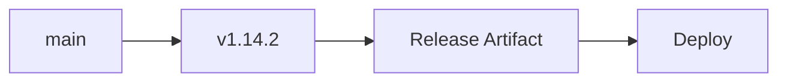
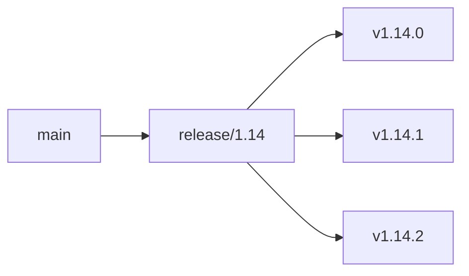
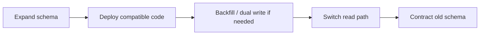

# Part 046 — Release Engineering

## 1. Core idea

Release engineering adalah discipline untuk mengubah perubahan software menjadi perubahan customer/runtime secara aman, traceable, reversible, dan operationally defensible.

Untuk senior Java backend engineer, release bukan hanya “merge PR lalu deploy”. Release adalah lifecycle yang mengikat:

- Git branch,
- Git tag,
- Maven version,
- artifact repository,
- container image,
- deployment manifest,
- environment promotion,
- release note,
- feature flag,
- database migration,
- event/API compatibility,
- smoke test,
- rollback/roll-forward,
- incident evidence.

Release engineering yang baik menjawab:

- Apa yang berubah?
- Kenapa perubahan ini dirilis?
- Artifact mana yang dirilis?
- Commit mana yang menjadi sumbernya?
- Environment mana yang sudah menerima perubahan?
- Risiko compatibility apa yang ada?
- Bagaimana validasi dilakukan?
- Bagaimana rollback dilakukan?
- Siapa yang menyetujui?
- Apa evidence-nya?

Release yang buruk biasanya gagal bukan karena “deploy command salah”, tetapi karena lifecycle tidak dijaga:

- version tidak jelas,
- tag mutable atau dibuat dari commit salah,
- artifact dibangun ulang per environment,
- changelog tidak akurat,
- migration tidak backward-compatible,
- feature flag tidak siap,
- rollback tidak mungkin,
- release note tidak membantu support,
- hotfix mem-bypass governance.

---

## 2. Release lifecycle mental model

```mermaid
flowchart LR
    Scope[Release Scope] --> Freeze[Stabilization / Freeze]
    Freeze --> Version[Version Decision]
    Version --> Build[Build Artifact]
    Build --> Tag[Git Tag / Release Tag]
    Tag --> Publish[Publish Artifact/Image]
    Publish --> Notes[Release Notes]
    Notes --> DeployLower[Deploy Lower Env]
    DeployLower --> Validate[Validate / Smoke / Regression]
    Validate --> Approve[Approval / Gate]
    Approve --> DeployProd[Deploy Production]
    DeployProd --> Monitor[Monitor]
    Monitor --> Recover[Rollback / Roll-forward / Hotfix]
```



Tidak semua organisasi memakai semua tahap dengan nama yang sama. Tetapi setiap release process yang matang memiliki versi dari konsep berikut:

- scope control,
- version identity,
- artifact creation,
- traceability,
- environment validation,
- approval/gate,
- production deployment,
- post-deploy monitoring,
- recovery path.

---

## 3. Release unit

Sebelum membahas branch/tag/version, definisikan dulu **unit release**.

Unit release bisa berupa:

- satu microservice,
- satu library internal,
- satu set service yang harus kompatibel,
- satu Helm chart,
- satu GitOps manifest change,
- satu product bundle,
- satu database migration package,
- satu API/event contract version,
- satu customer-visible capability.

Dalam enterprise CPQ/Quote-to-Order/telco-style system, release sering melibatkan banyak dependency:

- backend service,
- catalog/config data,
- database migration,
- Kafka/RabbitMQ schema/event behavior,
- Redis cache behavior,
- API gateway config,
- UI/client consumer,
- external integration,
- feature flag,
- operational runbook.

Senior engineer harus hati-hati: **repository boundary tidak selalu sama dengan release boundary**.

Contoh:

- Satu repo bisa menghasilkan beberapa artifact.
- Satu artifact bisa dipakai banyak service.
- Satu release bisa butuh perubahan di banyak repo.
- Satu database migration bisa membatasi rollback banyak service.
- Satu event schema change bisa memengaruhi consumer yang tidak ikut release.

### Internal verification checklist

- Cek apa unit release resmi tim.
- Cek apakah service dirilis independen atau sebagai bundle.
- Cek hubungan release service dengan database migration.
- Cek dependency release antar service.
- Cek apakah release scope dikontrol oleh ticket, milestone, branch, tag, atau release train.

---

## 4. Versioning

Versioning adalah bahasa untuk menyatakan identity dan compatibility artifact.

Untuk Maven, version muncul di POM:

```xml
<groupId>com.example</groupId>
<artifactId>quote-order-service</artifactId>
<version>1.14.2</version>
```

Untuk container image, version muncul di tag/digest:

```text
registry.example.com/quote-order-service:1.14.2
registry.example.com/quote-order-service@sha256:...
```

Untuk Git, version sering muncul sebagai tag:

```bash
git tag -a v1.14.2 -m "Release v1.14.2"
```

### 4.1 Semantic versioning awareness

Semantic versioning biasanya memakai pola:

```text
MAJOR.MINOR.PATCH
```

Interpretasi umum:

- `MAJOR`: breaking change,
- `MINOR`: backward-compatible feature,
- `PATCH`: backward-compatible fix.

Namun dalam enterprise internal service, semantic versioning harus diverifikasi. Tidak semua tim menerapkan semver secara ketat. Kadang version hanya release train number, sprint number, build number, atau product-specific version.

Yang penting: version harus bisa menjawab compatibility expectation.

### 4.2 Snapshot vs release version

Maven `SNAPSHOT` berarti artifact masih bisa berubah untuk version yang sama.

```text
1.14.2-SNAPSHOT
```

Release version seharusnya immutable:

```text
1.14.2
```

Production sebaiknya tidak bergantung pada SNAPSHOT artifact karena sulit diaudit dan tidak deterministic.

### 4.3 Build metadata

Build metadata bisa mencakup:

- commit SHA,
- build number,
- build timestamp,
- branch,
- tag,
- image digest,
- CI run URL,
- SBOM reference.

Version manusia seperti `1.14.2` bagus untuk komunikasi. Metadata teknis seperti commit SHA dan digest bagus untuk debugging dan audit.

### Internal verification checklist

- Cek versioning convention service.
- Cek apakah semver benar-benar dipakai.
- Cek snapshot/release policy.
- Cek apakah production pernah memakai snapshot.
- Cek metadata build yang tersedia di artifact atau endpoint version.

---

## 5. Release branch strategy

Release branch adalah branch yang dipakai untuk stabilisasi, patch, atau preparation release. Tidak semua tim memakai release branch. Beberapa tim trunk-based langsung release dari main dengan tag.

Model umum:

### 5.1 Trunk-based release



Kelebihan:

- sederhana,
- mengurangi long-lived branch,
- cepat,
- cocok dengan feature flag dan CI kuat.

Risiko:

- butuh main selalu releasable,
- butuh test/gate kuat,
- butuh disiplin feature flag,
- hotfix harus jelas.

### 5.2 Release branch



Kelebihan:

- stabilisasi lebih terkendali,
- patch line jelas,
- cocok untuk release train atau customer-specific support.

Risiko:

- branch drift,
- backport overhead,
- conflict meningkat,
- perubahan fix harus sinkron ke main.

### 5.3 Hotfix branch

Hotfix branch biasanya dibuat dari tag/branch release tertentu untuk perbaikan cepat.

```bash
git checkout -b hotfix/1.14.3 v1.14.2
```

Hal kritikal: hotfix harus kembali ke main/release branch yang relevan agar fix tidak hilang di release berikutnya.

### Internal verification checklist

- Cek apakah tim memakai trunk-based, release branch, Gitflow-like, atau release train.
- Cek naming convention branch release/hotfix.
- Cek rule backport hotfix ke main.
- Cek branch protection untuk release branch.
- Cek siapa yang boleh cut release branch.

---

## 6. Release tags

Release tag mengikat commit tertentu dengan release identity. Tag adalah anchor traceability.

### 6.1 Tag types

- Lightweight tag: pointer sederhana ke commit.
- Annotated tag: object tag dengan metadata dan message.
- Signed tag: tag dengan cryptographic signature.

Untuk release, annotated atau signed tag lebih kuat daripada lightweight tag.

```bash
git tag -a v1.14.2 -m "Release v1.14.2"
git push origin v1.14.2
```

### 6.2 Tag immutability

Release tag seharusnya immutable. Menghapus dan membuat ulang tag dengan nama sama adalah tindakan berbahaya karena:

- artifact traceability rusak,
- deployment history ambigu,
- audit trail melemah,
- rollback bisa menunjuk source berbeda,
- engineer lain bisa memiliki tag lama di local.

Jika tag salah, strategi yang lebih aman biasanya:

- buat version/tag baru,
- dokumentasikan tag salah,
- revoke artifact jika perlu,
- ikuti process internal.

### 6.3 Tag and artifact alignment

Idealnya:

```text
Git tag v1.14.2
Maven version 1.14.2
Image tag 1.14.2
Release note v1.14.2
Deployment manifest references image digest built from v1.14.2
```

Tag, artifact, dan deployment tidak selalu harus sama formatnya, tetapi mapping-nya harus jelas.

### Internal verification checklist

- Cek tag naming convention.
- Cek annotated/signed tag requirement.
- Cek siapa boleh push/delete tag.
- Cek apakah tag creation memicu release pipeline.
- Cek mapping tag ke Maven version dan image tag.

---

## 7. Changelog and release notes

Changelog dan release notes berbeda fungsi.

| Artifact | Audience | Isi utama |
|---|---|---|
| Changelog | engineer/internal technical audience | daftar perubahan teknis, PR, bug fix, breaking change |
| Release notes | support, ops, product, customer-facing/internal stakeholder | impact, capability, risk, migration, known issue, action needed |

Changelog buruk biasanya hanya dump commit message. Release notes buruk biasanya terlalu marketing dan tidak membantu support.

### 7.1 Good release note content

Release note yang berguna mencakup:

- version,
- release date,
- artifact/image reference,
- summary,
- features,
- fixes,
- breaking changes,
- database migration,
- API/event compatibility notes,
- config changes,
- operational notes,
- feature flags,
- rollback notes,
- known issues,
- verification steps,
- owner/contact/escalation.

### 7.2 For Java/JAX-RS backend

Release notes untuk backend service sebaiknya menandai:

- endpoint baru/berubah/deprecated,
- HTTP status behavior change,
- request/response schema change,
- authentication/authorization change,
- idempotency behavior change,
- timeout/retry behavior change,
- Kafka/RabbitMQ event schema/semantics change,
- DB migration impact,
- cache invalidation behavior,
- observability/logging changes.

### Internal verification checklist

- Cek template release notes.
- Cek apakah changelog otomatis atau manual.
- Cek apakah PR title/label dipakai generate release note.
- Cek siapa reviewer release notes.
- Cek apakah support/SRE memakai release note untuk incident triage.

---

## 8. Artifact release

Release artifact adalah hasil build yang dipakai untuk deployment atau konsumsi dependency.

Untuk Java service:

- Maven artifact bisa berupa JAR/WAR.
- Docker image biasanya menjadi unit deployment.
- Helm chart/manifest bisa menjadi deployment package.
- SBOM/provenance bisa menjadi compliance artifact.

### 8.1 Artifact immutability

Artifact release harus immutable. Jika artifact `1.14.2` bisa berubah, maka version tidak lagi berarti.

Checkpoints:

- Maven release repository immutable?
- Docker image tag immutable?
- Image digest dicatat?
- Artifact checksum tersedia?
- SBOM sesuai artifact?
- Build provenance tersedia?

### 8.2 Build once, promote many

Prinsip release penting:

```text
Build once. Test once enough. Promote same artifact.
```

Artinya artifact yang sama dipindahkan dari dev/test/staging/prod, bukan dibangun ulang dari source untuk tiap environment.

Jika rebuild per environment, maka:

- dependency terbaru bisa ikut tanpa disadari,
- plugin behavior bisa berubah,
- base image bisa berubah,
- generated source bisa berbeda,
- artifact hash berbeda,
- evidence staging tidak lagi berlaku untuk production.

### Internal verification checklist

- Cek apakah release artifact dibangun sekali atau rebuild per environment.
- Cek immutability Maven repository/registry.
- Cek checksum/digest capture.
- Cek artifact retention policy.
- Cek apakah release artifact bisa direproduksi.

---

## 9. Deployment manifest and environment promotion

Release tidak selesai ketika artifact dipublish. Artifact harus masuk environment dengan manifest/config yang benar.

Deployment manifest bisa berupa:

- Kubernetes YAML,
- Helm values,
- Kustomize overlay,
- Argo CD Application,
- Flux Kustomization,
- Terraform output,
- internal deployment descriptor.

### 9.1 Manifest diff matters

Saat release, yang berubah bukan hanya image version. Bisa juga:

- environment variable,
- ConfigMap,
- Secret reference,
- resource requests/limits,
- probes,
- replica count,
- ingress/gateway route,
- service account,
- feature flag config,
- migration job.

Manifest diff harus reviewable.

### 9.2 Promotion path

Promotion path umum:

```text
Dev → QA/Test → Staging/UAT → Production
```

Tetapi detail internal bisa berbeda. Yang perlu dipahami:

- apakah environment memiliki data representatif,
- apakah staging dekat dengan production,
- apakah approval gate berbeda per environment,
- apakah deploy bisa partial/canary,
- apakah production release window ada,
- apakah rollback per environment independen.

### Internal verification checklist

- Cek deployment manifest source.
- Cek GitOps repo jika digunakan.
- Cek environment overlay/value files.
- Cek promotion path.
- Cek manifest diff review process.
- Cek apakah config change dirilis bersama code atau terpisah.

---

## 10. Feature flags and release decoupling

Feature flag memisahkan deployment dari activation.

Tanpa feature flag:

```text
Deploy = behavior visible
```

Dengan feature flag:

```text
Deploy code → Enable flag gradually → Monitor → Roll back flag if needed
```

### 10.1 When feature flags help

Feature flag berguna untuk:

- risky feature,
- staged rollout,
- customer-specific enablement,
- A/B test,
- kill switch,
- backward-compatible migration,
- decoupling deploy from business launch.

### 10.2 Feature flag risks

Feature flag bukan gratis. Risiko:

- branch logic kompleks,
- kombinasi flag tidak dites,
- stale flag menumpuk,
- flag default berbeda per environment,
- rollback flag tidak sama dengan rollback data,
- flag state tidak tercatat di release evidence.

### 10.3 Senior-level flag review

Tanyakan:

- Apa default value?
- Siapa owner flag?
- Kapan flag dihapus?
- Apakah kedua path dites?
- Apakah flag bisa dimatikan tanpa redeploy?
- Apakah flag state masuk incident evidence?
- Apakah flag memengaruhi API/event/database behavior?

### Internal verification checklist

- Cek feature flag platform yang digunakan.
- Cek naming/ownership convention.
- Cek flag cleanup process.
- Cek audit log perubahan flag.
- Cek apakah flag changes masuk release note atau incident timeline.

---

## 11. Database migration and release safety

Database migration adalah salah satu sumber terbesar release risk untuk backend systems.

### 11.1 Backward-compatible migration pattern

Pattern umum untuk perubahan aman:

1. Expand: tambahkan kolom/table/index baru tanpa memutus code lama.
2. Deploy code yang menulis/membaca format baru secara compatible.
3. Backfill jika perlu.
4. Switch read path jika aman.
5. Contract: hapus kolom/behavior lama setelah semua consumer aman.



### 11.2 Migration rollback reality

Tidak semua migration bisa rollback dengan aman. Misalnya:

- data destructive migration,
- column drop,
- data type narrowing,
- backfill partial,
- irreversible transformation,
- migration that changes semantics.

Karena itu release review harus bertanya:

- apakah migration backward-compatible?
- apakah old code bisa berjalan setelah migration?
- apakah new code bisa berjalan sebelum migration?
- apakah migration idempotent?
- apakah migration punya lock/performance risk?
- apakah ada data backup/restore plan?

### Internal verification checklist

- Cek migration tool yang digunakan.
- Cek migration ordering.
- Cek rollback policy untuk DB migration.
- Cek apakah migration dijalankan oleh app startup, pipeline, atau manual process.
- Cek migration incident/slow query/lock history.

---

## 12. API and event compatibility

Release backend jarang berdiri sendiri. Ia punya consumer:

- UI,
- mobile app,
- downstream service,
- external customer/integration,
- Kafka/RabbitMQ consumer,
- reporting/analytics,
- operational tools.

### 12.1 API compatibility

Breaking changes bisa berupa:

- endpoint removed,
- method changed,
- required field added,
- response field removed/renamed,
- enum value changed,
- HTTP status changed,
- auth scope changed,
- idempotency behavior changed,
- error format changed.

Backward-compatible changes biasanya:

- optional response field added,
- new endpoint added,
- optional request field added with safe default,
- additional enum value only if consumers tolerate it.

### 12.2 Event compatibility

Event-driven release risk:

- event field removed,
- required field added,
- event meaning changed,
- ordering assumption changed,
- idempotency key changed,
- topic/queue/exchange/routing key changed,
- retry/dead-letter behavior changed,
- consumer lag impact.

### Internal verification checklist

- Cek API contract/OpenAPI process.
- Cek event schema registry jika ada.
- Cek consumer compatibility review.
- Cek versioning/deprecation policy.
- Cek release coordination dengan dependent teams.

---

## 13. Rollback, roll-forward, and recovery

Release engineering harus mendesain recovery sebelum release dilakukan.

### 13.1 Rollback checklist

Sebelum production deploy, jawab:

- Apa previous known-good artifact?
- Apakah previous image digest tersedia?
- Bagaimana rollback command/process?
- Apakah rollback butuh approval?
- Apakah DB migration compatible dengan rollback?
- Apakah event schema compatible dengan rollback?
- Apakah config/secret change juga perlu rollback?
- Apakah feature flag bisa memitigasi tanpa redeploy?
- Bagaimana validasi rollback berhasil?

### 13.2 Roll-forward checklist

Roll-forward cocok jika:

- root cause jelas,
- patch kecil,
- pipeline cepat,
- test coverage relevant,
- data impact minimal,
- rollback lebih berisiko daripada forward fix.

Risiko roll-forward:

- patch tergesa-gesa,
- testing kurang,
- memperburuk incident,
- menambah perubahan saat state belum stabil.

### 13.3 Recovery evidence

Saat rollback/roll-forward, capture:

- release version yang bermasalah,
- symptom,
- start time,
- decision time,
- rollback/forward command,
- target version,
- validation result,
- residual risk,
- follow-up task.

### Internal verification checklist

- Cek rollback runbook.
- Cek siapa decision maker rollback.
- Cek rollback approval path.
- Cek previous known-good lookup.
- Cek rollback testing history.

---

## 14. Hotfix discipline

Hotfix adalah release cepat untuk memperbaiki issue penting. Hotfix bukan alasan untuk membuang discipline.

### 14.1 Hotfix lifecycle

```mermaid
flowchart LR
    Incident[Incident / Critical Bug] --> Scope[Minimal Fix Scope]
    Scope --> Branch[Hotfix Branch]
    Branch --> Patch[Patch]
    Patch --> Test[Targeted Test]
    Test --> Review[Expedited Review]
    Review --> Tag[Hotfix Tag]
    Tag --> Deploy[Deploy]
    Deploy --> Monitor[Monitor]
    Monitor --> Backmerge[Backmerge to Main]
```



### 14.2 Hotfix rules

Hotfix harus:

- minimal,
- targeted,
- reviewable,
- traceable,
- tested sesuai risk,
- punya rollback/roll-forward path,
- punya post-hotfix cleanup,
- di-backmerge ke main/release branch.

### 14.3 Hotfix anti-patterns

- direct commit ke production branch tanpa review,
- patch tidak di-backmerge,
- version/tag tidak jelas,
- test dilewati tanpa risk acceptance,
- config change manual tidak tercatat,
- hotfix mengandung unrelated refactor,
- incident pressure dijadikan alasan untuk menonaktifkan audit trail.

### Internal verification checklist

- Cek hotfix process resmi.
- Cek approval exception saat incident.
- Cek versioning hotfix.
- Cek backmerge policy.
- Cek contoh hotfix terakhir dan evidence-nya.

---

## 15. Release monitoring

Release tidak selesai saat deployment sukses. Release selesai setelah behavior runtime tervalidasi.

Post-release monitoring harus melihat:

- error rate,
- latency,
- throughput,
- saturation,
- JVM memory/GC,
- thread pool,
- DB connection pool,
- Kafka/RabbitMQ consumer lag,
- Redis error/latency,
- HTTP 4xx/5xx distribution,
- business/domain metrics,
- logs with correlation IDs,
- traces for critical paths.

### 15.1 Release health window

Tentukan window observasi:

- immediate smoke: menit pertama,
- early stability: 15–60 menit,
- business cycle: beberapa jam/hari tergantung domain,
- batch/job window jika service punya scheduled processing.

### 15.2 Monitoring anti-patterns

- hanya cek pod running,
- hanya cek health endpoint,
- tidak cek downstream dependency,
- tidak cek domain metric,
- alert threshold tidak terkait release,
- no owner watching after deploy,
- release di luar jam support tanpa mitigasi.

### Internal verification checklist

- Cek dashboard release.
- Cek deployment markers di observability tool.
- Cek alert yang relevan untuk service.
- Cek domain/business metric yang harus dipantau.
- Cek post-deploy watch ownership.

---

## 16. Release failure modes

| Failure mode | Gejala | Prevention |
|---|---|---|
| Wrong artifact deployed | version endpoint tidak sesuai | artifact traceability, digest pinning |
| Tag from wrong commit | changelog tidak match behavior | protected tag process, release checklist |
| DB migration breaks old code | rollback gagal | expand/contract migration |
| Event schema breaks consumer | downstream error/lag | compatibility review, schema validation |
| Config missing | startup failure | config validation, environment checklist |
| Secret wrong/expired | auth failure | secret rotation process, preflight check |
| Image pull failure | pods ImagePullBackOff | registry permission and image existence check |
| Smoke test too shallow | deploy “success” tapi API fail | meaningful smoke test |
| Hotfix not backmerged | bug muncul lagi | hotfix lifecycle discipline |
| Rollback impossible | incident prolonged | rollback design before release |

---

## 17. Release review checklist

Gunakan checklist ini untuk PR/release decision.

### Scope

- Apa perubahan utama?
- Apakah ada unrelated change?
- Apakah scope cukup kecil untuk direview dan rollback?
- Apakah release note menjelaskan impact?

### Artifact

- Commit SHA mana?
- Git tag mana?
- Maven version mana?
- Image tag/digest mana?
- SBOM/checksum/provenance tersedia?

### Compatibility

- Ada API breaking change?
- Ada event breaking change?
- Ada DB migration?
- Ada config/secret change?
- Ada dependency version change?
- Ada behavior idempotency/retry/timeout yang berubah?

### Validation

- Test apa yang berjalan?
- Smoke test apa yang dilakukan?
- Apakah staging cukup representatif?
- Apakah known issue didokumentasikan?

### Deployment

- Environment target mana?
- Promotion path apa?
- Approval siapa?
- Release window apa?
- Apakah GitOps/direct deploy sesuai process?

### Recovery

- Previous known-good version apa?
- Rollback command/process apa?
- Apakah rollback compatible dengan DB/event/config?
- Apakah feature flag bisa jadi mitigation?
- Siapa decision maker jika rollback diperlukan?

### Operations

- Dashboard apa yang dipantau?
- Alert apa yang relevan?
- Siapa on watch?
- Apa escalation path?
- Apa post-release evidence yang perlu disimpan?

---

## 18. Internal verification checklist for CSG/team

Detail berikut harus diverifikasi di internal CSG/team:

- Release cadence: on-demand, sprint-based, release train, customer-specific, atau hybrid.
- Branch strategy release/hotfix.
- Tag naming convention.
- Maven versioning convention.
- Artifact repository dan registry.
- Artifact immutability policy.
- Image tag/digest policy.
- Deployment model: direct, GitOps, Helm, internal deployment tooling.
- Environment promotion path.
- Approval gate.
- Release note/changelog template.
- Database migration process.
- API/event compatibility process.
- Feature flag platform dan audit.
- Rollback/roll-forward process.
- Hotfix process.
- Post-release monitoring expectations.
- Incident handoff dari release ke support/SRE.

---

## 19. Senior heuristics

1. **Release identity must be boringly clear.** Jika orang bingung version mana yang jalan, release process belum matang.
2. **Build once, promote the same artifact.** Jangan menguji artifact A lalu deploy artifact B.
3. **A tag is a traceability anchor, not a casual label.**
4. **Rollback must be designed before release, not discovered during incident.**
5. **Database and event compatibility decide whether rollback is real or imaginary.**
6. **Feature flags reduce activation risk but increase state complexity.**
7. **Hotfix must be minimal and backmerged.** Jika tidak, defect akan kembali.
8. **Release notes are operational tooling.** Support dan incident response bergantung pada kualitasnya.
9. **A release without monitoring is an unobserved experiment.**
10. **The release process should make the safe path easier than the dangerous shortcut.**

---

## 20. Practical exercises

1. Ambil satu release terakhir. Trace dari Git tag ke Maven artifact, image digest, deployment manifest, dan environment production.
2. Bandingkan changelog dengan PR yang masuk release. Cari missing risk notes.
3. Cek apakah artifact dibangun sekali atau rebuild per environment.
4. Ambil satu database migration terakhir. Nilai apakah rollback compatible.
5. Cari satu hotfix terakhir. Cek apakah fix di-backmerge ke main.
6. Cek version endpoint service. Apakah cukup untuk mengidentifikasi commit, build, dan image?
7. Simulasikan release review: apa rollback path, smoke test, dashboard, dan decision owner?

---

## 21. Summary

Release engineering adalah discipline yang menyatukan source control, build system, artifact management, deployment process, compatibility review, observability, dan recovery.

Untuk senior backend engineer, targetnya bukan hanya bisa “ikut release”, tetapi mampu:

- memahami release lifecycle end-to-end,
- menjaga version/tag/artifact traceability,
- mereview compatibility risk,
- memastikan artifact immutable,
- memahami promotion dan approval gate,
- menyiapkan rollback/roll-forward,
- menjaga hotfix tetap disciplined,
- dan membuat release lebih aman tanpa membuat delivery tidak produktif.

Release yang baik tidak bergantung pada heroics. Release yang baik bergantung pada system, checklist, evidence, dan discipline.
