# Part 047 — Incident Support Tooling

## 1. Core idea

Incident support tooling adalah discipline untuk mengubah kondisi production yang kacau menjadi evidence yang bisa dipakai untuk mengambil keputusan aman.

Dalam incident, masalah utamanya jarang hanya “bug belum ketemu”. Masalah yang lebih berbahaya adalah:

- orang tidak tahu versi apa yang sedang berjalan,
- log tidak bisa dikorelasikan,
- deployment event tidak jelas,
- config change tidak tercatat,
- rollback command tidak siap,
- evidence tercecer di chat,
- timeline dibuat setelah ingatan orang mulai bias,
- command debugging menambah blast radius,
- data sensitif bocor saat evidence dibagikan,
- RCA berakhir sebagai opini, bukan fakta.

Senior backend engineer harus mampu memakai tooling untuk menjawab pertanyaan incident secara cepat dan defensible:

- Apa symptom yang terlihat?
- Kapan mulai terjadi?
- Scope impact-nya apa?
- Service mana yang terlibat?
- Version/tag/commit mana yang sedang berjalan?
- Deployment/config/migration/feature flag apa yang berubah?
- Dependency eksternal mana yang abnormal?
- Apakah issue masih aktif atau sudah recovery?
- Apa mitigation paling aman?
- Evidence apa yang cukup untuk RCA?

Incident support bukan hero debugging. Incident support adalah **evidence-driven coordination under pressure**.

---

## 2. Incident lifecycle mental model

```mermaid
flowchart LR
    Detect[Detect Symptom] --> Triage[Initial Triage]
    Triage --> Scope[Scope Impact]
    Scope --> Stabilize[Stabilize / Mitigate]
    Stabilize --> Investigate[Investigate Root / Contributing Factors]
    Investigate --> Recover[Recover / Rollback / Roll-forward]
    Recover --> Validate[Validate Recovery]
    Validate --> Communicate[Communicate Status]
    Communicate --> RCA[RCA / Post-Incident Review]
    RCA --> Prevent[Prevent Recurrence]
```



Tooling berbeda dibutuhkan di tiap tahap:

| Tahap | Pertanyaan | Tooling utama |
|---|---|---|
| Detect | Ada apa? | Alert, dashboard, logs, synthetic check |
| Triage | Seberapa buruk? | Metrics, traces, error rate, saturation, queue lag |
| Scope | Siapa terdampak? | Tenant/customer dimension, endpoint, service map |
| Stabilize | Apa mitigasi aman? | Feature flag, rollback, scaling, traffic shift |
| Investigate | Kenapa terjadi? | Logs, traces, deployment diff, Git, DB migration, config diff |
| Recover | Bagaimana balik sehat? | Rollback command, deployment pipeline, GitOps revert |
| Validate | Sudah selesai? | Smoke test, SLO metric, canary metric, logs |
| RCA | Apa faktanya? | Timeline, evidence bundle, PR/release mapping |
| Prevent | Apa perubahan sistemik? | Action items, runbook update, tests, guardrails |

---

## 3. Read-only first principle

Dalam production incident, default posture senior engineer adalah:

> Observe first. Change later. Change only with intent, approval, and rollback path.

Read-only first berarti mulai dari command yang tidak mengubah state:

```bash
kubectl get pods -n <namespace>
kubectl describe pod <pod> -n <namespace>
kubectl logs <pod> -n <namespace> --since=30m
kubectl get events -n <namespace> --sort-by=.lastTimestamp
```

Untuk Docker/local:

```bash
docker ps
docker logs --since 30m <container>
docker inspect <container>
```

Untuk Linux process:

```bash
ps -ef | grep java
ss -ltnp
lsof -i :8080
```

Untuk HTTP/API:

```bash
curl -sS -D headers.txt -o body.json \
  --connect-timeout 3 \
  --max-time 10 \
  "https://example.internal/health"
```

Command yang mengubah state harus diperlakukan sebagai controlled operation:

```bash
kubectl delete pod ...
kubectl rollout restart ...
kubectl scale ...
kubectl patch ...
aws ... delete ...
az ... delete ...
psql -c "update ..."
```

### Senior rule

Jika command dapat mengubah traffic, data, deployment, permission, secret, config, message offset, database row, atau queue state, command tersebut bukan “debug command”. Itu adalah **production change**.

---

## 4. Evidence capture

Evidence capture adalah proses mengumpulkan fakta dalam bentuk yang bisa diaudit dan direproduksi.

Evidence yang baik memiliki karakteristik:

- timestamp jelas,
- timezone jelas,
- environment jelas,
- service jelas,
- command atau query jelas,
- output relevan,
- data sensitif sudah di-redact,
- tidak hanya screenshot tanpa context,
- bisa ditautkan ke incident timeline,
- bisa dipakai untuk RCA.

### Evidence minimum untuk backend incident

- Incident start time dan detection time.
- Alert atau symptom pertama.
- Affected environment.
- Affected service/version.
- Affected endpoint/job/event/consumer.
- Recent deployment event.
- Recent config/secret/feature flag change.
- Error logs dengan correlation ID.
- Metrics sebelum/saat/setelah incident.
- Trace sample jika tersedia.
- Queue lag atau database symptom jika relevan.
- Mitigation action dan timestamp.
- Recovery validation evidence.

### Evidence bundle structure

Contoh struktur evidence lokal:

```text
incident-2026-07-11-quote-api-5xx/
  00-summary.md
  01-timeline.md
  02-commands.md
  03-logs/
    quote-api-error-sample-redacted.log
    quote-api-correlation-ids.txt
  04-metrics/
    error-rate-notes.md
    latency-notes.md
  05-traces/
    trace-samples.md
  06-release/
    deployed-version.txt
    git-commit.txt
    release-tag.txt
  07-config/
    relevant-config-diff-redacted.md
  08-mitigation/
    rollback-command.md
    validation.md
  09-rca-inputs.md
```

Buat evidence bundle hanya jika sesuai dengan policy internal. Jangan mengekspor log production ke mesin lokal jika data policy melarangnya.

### Command capture pattern

```bash
mkdir -p incident-$(date -u +%Y%m%dT%H%M%SZ)/logs

{
  echo "# Command"
  echo "kubectl get pods -n quote-prod"
  echo
  echo "# Timestamp UTC"
  date -u +%Y-%m-%dT%H:%M:%SZ
  echo
  echo "# Output"
  kubectl get pods -n quote-prod
} > incident-*/pods.txt
```

Untuk workflow yang lebih disciplined, catat command di `commands.md`:

```md
## 2026-07-11T03:42:10Z

Command:

```bash
kubectl logs deploy/quote-service -n prod --since=15m | grep 'ORDER-123'
```

Purpose:

- Check whether failing quote request reached quote-service.

Result:

- Found 3 error entries with same trace_id.
```

---

## 5. Timeline discipline

Timeline adalah artifact paling penting dalam incident.

Timeline buruk:

```text
- Something failed around morning.
- We checked logs.
- We rolled back.
- It worked.
```

Timeline baik:

```text
2026-07-11T02:13:40Z — Deployment quote-service v1.42.0 completed in prod.
2026-07-11T02:17:05Z — 5xx alert fired for /quotes/{id}/submit, error rate 7.8%.
2026-07-11T02:19:22Z — On-call acknowledged alert.
2026-07-11T02:23:10Z — Logs show NullPointerException in PriceAdjustmentMapper for requests with discountType=null.
2026-07-11T02:29:44Z — Feature flag quote.new-discount-engine disabled.
2026-07-11T02:32:18Z — Error rate returned below alert threshold.
2026-07-11T02:41:03Z — Smoke test quote submission passed for sample enterprise account.
```

### Timeline fields

| Field | Why it matters |
|---|---|
| Timestamp UTC | Avoid timezone confusion |
| Actor/system | Know who or what acted |
| Event | What happened |
| Evidence link | Source of truth |
| Impact | User/system effect |
| Decision | Why action was taken |
| Follow-up | What remains unresolved |

### Timezone rule

Gunakan UTC untuk incident timeline. Jika memakai local timezone, tulis offset eksplisit.

Bad:

```text
10:30 issue started
```

Better:

```text
2026-07-11T03:30:00Z issue started
2026-07-11T10:30:00+07:00 Jakarta local time
```

---

## 6. Logs during incident

Logs menjawab “apa yang aplikasi katakan terjadi”. Tetapi logs bisa menyesatkan jika tidak dikorelasikan dengan metric, trace, deployment, dan config.

### Useful log dimensions

- service name,
- environment,
- instance/pod,
- timestamp,
- level,
- logger/class,
- request ID,
- correlation ID,
- trace ID/span ID,
- tenant/customer/account jika aman,
- endpoint/operation,
- exception class,
- error code,
- dependency name,
- duration,
- retry count,
- response status.

### Kubernetes log commands

```bash
kubectl logs deploy/quote-service -n prod --since=30m
kubectl logs deploy/quote-service -n prod --since=30m --all-containers=true
kubectl logs pod/<pod-name> -n prod --previous
```

`--previous` penting untuk container yang restart. Banyak incident kehilangan evidence karena engineer hanya membaca log container baru.

### Grep by correlation ID

```bash
kubectl logs deploy/quote-service -n prod --since=1h \
  | grep 'correlationId=abc-123'
```

Untuk structured JSON log:

```bash
kubectl logs deploy/quote-service -n prod --since=1h \
  | jq -c 'select(.correlationId == "abc-123")'
```

### Error aggregation quick check

```bash
kubectl logs deploy/quote-service -n prod --since=30m \
  | grep -E 'ERROR|Exception' \
  | sed -E 's/[0-9a-f]{8}-[0-9a-f-]{27,}/<uuid>/g' \
  | sort \
  | uniq -c \
  | sort -nr \
  | head -20
```

Tujuannya bukan menggantikan observability platform, tetapi memberi quick signal saat debugging.

### Log failure modes

- Timestamp memakai local timezone tanpa offset.
- Correlation ID tidak dipropagasi ke downstream service.
- Error log terlalu generic.
- Stack trace hilang karena logging pattern salah.
- Log terlalu noisy sehingga signal tenggelam.
- Sensitive data muncul di log.
- Log level production salah.
- Container restart menghapus konteks jika log retention buruk.

---

## 7. Metrics during incident

Metrics menjawab “seberapa besar dan ke arah mana sistem bergerak”.

Logs cocok untuk contoh detail. Metrics cocok untuk scope dan trend.

### Backend metrics yang relevan

- request rate,
- error rate,
- latency p50/p95/p99,
- saturation CPU/memory/thread pool,
- JVM heap/non-heap,
- GC pause,
- database connection pool usage,
- HTTP client latency/error,
- Kafka consumer lag,
- RabbitMQ queue depth,
- Redis latency/error,
- retry rate,
- timeout rate,
- circuit breaker state,
- pod restart count,
- Kubernetes CPU throttling,
- deployment replica availability.

### Golden signals

Gunakan empat pertanyaan awal:

1. **Traffic:** apakah volume berubah?
2. **Errors:** apakah error rate naik?
3. **Latency:** apakah latency naik?
4. **Saturation:** apakah resource atau queue penuh?

### Metric interpretation pitfalls

- Average latency menutupi tail latency.
- Error rate terlihat kecil tetapi impact customer besar karena endpoint critical.
- Per-service metric terlihat sehat tetapi dependency downstream rusak.
- Dashboard memakai aggregation window terlalu besar.
- Counter reset setelah pod restart terlihat seperti drop traffic.
- Metric label cardinality terlalu tinggi membuat query lambat atau mahal.
- Alert firing bukan incident start time; itu detection time.

### Evidence note example

```md
## Metric evidence

Time window: 2026-07-11T02:00:00Z to 2026-07-11T03:00:00Z
Environment: production
Service: quote-service

Observed:
- 5xx rate increased from <0.1% to 7.8% at 02:17Z.
- p95 latency increased from 240ms to 2.1s.
- Traffic volume remained normal.
- CPU and memory remained within normal range.

Interpretation:
- Likely correctness/dependency failure, not capacity spike.
```

---

## 8. Traces during incident

Distributed tracing menjawab “request melewati path mana dan span mana yang gagal/lambat”.

Untuk microservices, traces sering lebih cepat daripada membaca log manual karena satu request bisa melewati:

- API gateway,
- auth service,
- quote service,
- pricing service,
- catalog service,
- PostgreSQL,
- Redis,
- Kafka producer,
- external integration.

### Trace questions

- Span mana yang paling lambat?
- Error terjadi di service mana?
- Apakah retry terjadi?
- Apakah downstream call timeout?
- Apakah database query lambat?
- Apakah trace ID muncul di logs?
- Apakah trace sample representatif atau outlier?

### Trace-to-log workflow

1. Ambil trace ID dari failed request.
2. Buka trace di observability tool.
3. Identifikasi failing span.
4. Cari logs dengan trace ID yang sama.
5. Cocokkan timestamp, exception, dependency, dan request metadata.
6. Simpan link/evidence sesuai policy internal.

### Failure modes

- Trace sampling terlalu rendah saat incident kecil.
- Propagation header hilang di service tertentu.
- Async processing tidak terkorelasi dengan original trace.
- Kafka/RabbitMQ consumer tidak melanjutkan trace context.
- Trace ID tidak muncul di application logs.
- Sensitive attributes masuk span.

---

## 9. Deployment event correlation

Banyak incident dimulai dari perubahan. Tidak semua perubahan adalah code deploy.

Perubahan yang perlu dikorelasikan:

- application deploy,
- container image update,
- Helm chart change,
- GitOps manifest change,
- config map change,
- secret rotation,
- feature flag change,
- database migration,
- dependency service deploy,
- network policy change,
- certificate rotation,
- autoscaling change,
- cloud infrastructure change,
- data/config/catalog import.

### Deployment evidence

Untuk Kubernetes:

```bash
kubectl rollout history deploy/quote-service -n prod
kubectl describe deploy/quote-service -n prod
kubectl get rs -n prod -l app=quote-service
kubectl get events -n prod --sort-by=.lastTimestamp
```

Untuk image identity:

```bash
kubectl get deploy quote-service -n prod \
  -o jsonpath='{.spec.template.spec.containers[*].image}'

echo
```

Untuk GitOps, cek commit manifest:

```bash
git log --oneline --decorate -- path/to/quote-service/values-prod.yaml
git diff <previous>..<current> -- path/to/quote-service/values-prod.yaml
```

### Key question

> Apakah incident mulai setelah perubahan? Jika iya, perubahan mana yang paling plausible secara causal?

Korelasi bukan kausalitas, tetapi dalam incident mitigation, recent change adalah suspect yang wajib diperiksa cepat.

---

## 10. Git commit, release tag, and artifact identity

Incident debugging menjadi lambat jika tidak jelas software version mana yang running.

Idealnya service punya endpoint atau log startup yang menampilkan:

- application name,
- version,
- Git commit SHA,
- Git tag,
- build timestamp,
- CI build/run ID,
- image digest,
- Java version,
- dependency BOM/platform version jika relevan.

Contoh startup log yang berguna:

```text
service=quote-service version=1.42.0 commit=8f31c9a tag=v1.42.0 imageDigest=sha256:abc... build=gha-123456 java=21.0.4
```

### Git inspection commands

```bash
git show --stat v1.42.0
git log --oneline v1.41.3..v1.42.0
git diff v1.41.3..v1.42.0 -- pom.xml src/main/resources
```

### Release comparison

```bash
git log --oneline --first-parent v1.41.3..v1.42.0
```

Untuk PR mapping:

```bash
git log --merges --oneline v1.41.3..v1.42.0
```

Jika squash merge digunakan, PR number biasanya muncul di commit message. Jika tidak, perlu GitHub release/PR query atau internal release tooling.

### Internal verification checklist

- Apakah service expose version endpoint?
- Apakah startup log mencetak commit/tag/build?
- Apakah image digest bisa ditrace ke CI run?
- Apakah release tag immutable?
- Apakah GitOps manifest mencatat image digest atau hanya mutable tag?

---

## 11. Config change and feature flag evidence

Tidak semua incident berasal dari code. Dalam enterprise system, config dan feature flag bisa mengubah behavior sebesar deploy.

### Config change examples

- timeout value berubah,
- retry count berubah,
- endpoint downstream berubah,
- Kafka topic name berubah,
- RabbitMQ routing key berubah,
- Redis TTL berubah,
- database pool size berubah,
- feature flag default berubah,
- tenant-specific config berubah,
- catalog/rule config berubah,
- auth/client credential berubah.

### Config evidence questions

- Apa config efektif yang sedang dipakai service?
- Dari mana config berasal?
- Siapa yang mengubah?
- Kapan berubah?
- Apakah change audited?
- Apakah config sama di semua pod/replica?
- Apakah config berbeda antara staging dan production?

### Kubernetes config commands

```bash
kubectl get configmap -n prod
kubectl describe configmap quote-service-config -n prod
kubectl get secret -n prod
```

Jangan dump secret ke terminal/log/chat. Untuk secret, cukup cek metadata, version, mounted path, atau hash/fingerprint jika policy membolehkan.

### Feature flag evidence

Catat:

- flag name,
- old value,
- new value,
- scope: global/tenant/user/environment,
- actor,
- timestamp,
- reason,
- expected effect,
- rollback value.

Contoh:

```md
2026-07-11T02:29:44Z — Disabled feature flag `quote.new-discount-engine` for production/global.
Reason: mitigate 5xx on quote submission.
Expected effect: route discount calculation to legacy engine.
Validation: 5xx rate dropped from 7.8% to 0.2% within 3 minutes.
```

---

## 12. Database migration and data-state evidence

Database changes sering menjadi incident multiplier karena rollback aplikasi tidak selalu rollback schema/data.

### Migration questions

- Migration apa yang terakhir dijalankan?
- Apakah migration backward-compatible?
- Apakah ada destructive DDL?
- Apakah ada long-running lock?
- Apakah ada data backfill?
- Apakah aplikasi versi lama masih kompatibel dengan schema baru?
- Apakah migration idempotent?
- Apakah rollback script tersedia?

### Safe inspection examples

PostgreSQL examples:

```sql
select now();
select version();
select * from flyway_schema_history order by installed_rank desc limit 10;
select * from databasechangelog order by dateexecuted desc limit 10;
```

Gunakan nama table sesuai migration tool yang dipakai.

Connection pool symptom:

```sql
select state, count(*)
from pg_stat_activity
where datname = current_database()
group by state
order by count(*) desc;
```

Long-running transaction:

```sql
select pid, state, now() - xact_start as xact_age, wait_event_type, wait_event, query
from pg_stat_activity
where xact_start is not null
order by xact_age desc
limit 10;
```

### Safety warning

Query `select` bisa tetap berbahaya jika:

- table sangat besar,
- query tidak pakai filter/index,
- dijalankan di primary production,
- output mengandung data sensitif,
- query mengunci object tertentu,
- dijalankan berulang saat database sedang degraded.

Selalu verifikasi policy production database access internal.

---

## 13. Queue and stream evidence

Untuk Kafka/RabbitMQ, incident sering terlihat sebagai lag, backlog, redelivery, poison message, atau consumer crash loop.

### Kafka evidence

Pertanyaan:

- Topic mana terdampak?
- Consumer group mana lag?
- Partition mana bermasalah?
- Apakah consumer masih running?
- Apakah offset bergerak?
- Apakah ada poison message?
- Apakah producer error meningkat?

Command umum, tergantung tooling internal:

```bash
kafka-consumer-groups --bootstrap-server <broker> \
  --describe \
  --group <consumer-group>
```

Jangan reset offset tanpa approval. Reset offset adalah production data-processing change.

### RabbitMQ evidence

Pertanyaan:

- Queue mana backlog?
- Ready vs unacked berapa?
- Consumer count berubah?
- Redelivery naik?
- Dead-letter queue meningkat?
- Binding/routing key berubah?

RabbitMQ management/API atau CLI internal biasanya lebih aman daripada exec langsung ke broker. Verifikasi tooling tim.

### Message system failure modes

- Consumer crash loop.
- Poison message berhenti di item tertentu.
- Retry storm membebani downstream.
- DLQ penuh tetapi tidak ada alert.
- Offset reset salah.
- Consumer group name berubah karena config deploy.
- Routing key mismatch.
- Schema/event compatibility break.

---

## 14. Rollback and mitigation tooling

Mitigation bukan selalu rollback.

Mitigation bisa berupa:

- disable feature flag,
- rollback application version,
- roll forward hotfix,
- scale replicas,
- pause consumer,
- drain traffic,
- disable scheduled job,
- reduce concurrency,
- increase timeout sementara,
- circuit-break downstream,
- route traffic ke fallback,
- restore config,
- revert GitOps commit,
- apply database remediation script.

### Rollback decision checklist

Sebelum rollback aplikasi:

- Apakah versi sebelumnya kompatibel dengan schema database sekarang?
- Apakah event schema sudah berubah?
- Apakah data baru sudah ditulis dalam format yang versi lama tidak paham?
- Apakah image/artifact sebelumnya masih tersedia?
- Apakah deployment manifest sebelumnya diketahui?
- Apakah rollback menghilangkan mitigation lain?
- Apakah ada approval yang dibutuhkan?
- Apakah rollback lebih aman daripada feature flag disable?

### Kubernetes rollback examples

```bash
kubectl rollout history deploy/quote-service -n prod
kubectl rollout undo deploy/quote-service -n prod
kubectl rollout status deploy/quote-service -n prod
```

Command ini hanya contoh. Dalam GitOps environment, rollback manual bisa dilawan oleh controller atau melanggar policy. Jika GitOps dipakai, rollback biasanya berupa revert commit manifest.

### GitOps revert example

```bash
git revert <bad-manifest-commit>
git push origin main
```

Atau buat PR emergency sesuai policy internal.

---

## 15. Communication artifacts

Incident support tidak hanya command. Communication adalah tooling sosial untuk menjaga koordinasi.

Artifact penting:

- incident channel,
- incident commander note,
- timeline,
- status update,
- decision log,
- customer/support update,
- mitigation note,
- handoff note,
- RCA document.

### Status update template

```md
Status: Investigating / Mitigating / Monitoring / Resolved
Time: 2026-07-11T02:35:00Z
Impact: Quote submission endpoint returning elevated 5xx for subset of requests.
Scope: Production, quote-service, requests with discount flow enabled.
Current evidence: Error rate started after v1.42.0 deploy; logs show NPE in discount mapper.
Action taken: Disabled feature flag quote.new-discount-engine at 02:29Z.
Next step: Monitor 5xx and validate quote submission smoke tests.
Owner: <name/team>
Next update: <time>
```

### Decision log template

```md
Decision: Disable feature flag quote.new-discount-engine
Time: 2026-07-11T02:29:44Z
Decision owner: <name/role>
Reason: Mitigate 5xx while preserving current deployment.
Evidence: Error isolated to new discount engine path.
Expected outcome: Route requests to legacy discount engine.
Rollback of decision: Re-enable flag after fix and validation.
Risk: Some users may lose new discount behavior temporarily.
```

---

## 16. RCA support

RCA bukan tempat mencari kambing hitam. RCA adalah mechanism untuk memahami system failure dan memperbaiki guardrail.

### RCA input categories

- What happened?
- What was the impact?
- How was it detected?
- What changed recently?
- Why did existing controls not catch it?
- What mitigated it?
- What delayed detection/recovery?
- What action items reduce recurrence?

### Evidence-backed RCA

Bad:

```text
The issue happened because the code was bad.
```

Better:

```text
The incident was triggered by release v1.42.0, which introduced a new discount mapping path. Requests with null discountType caused NullPointerException. Unit tests covered standard discount types but did not cover null discountType from legacy catalog records. The feature flag allowed mitigation without full rollback.
```

### Action item quality

Weak action item:

```text
Be more careful.
```

Strong action item:

```text
Add contract test covering legacy catalog records with null discountType before enabling quote.new-discount-engine globally.
```

Strong action items are:

- specific,
- owned,
- time-bounded,
- testable,
- tied to failure mode,
- not purely manual process,
- not only documentation unless documentation was the actual gap.

---

## 17. Incident tooling for Java/JAX-RS services

For Java/JAX-RS backend, incident support should include application-level evidence.

### Useful service endpoints

Common examples:

- `/health`,
- `/ready`,
- `/live`,
- `/metrics`,
- `/version`,
- `/openapi` or API docs if exposed internally,
- actuator-style endpoints if framework provides them,
- custom diagnostic endpoint if approved.

Do not expose sensitive debug endpoints publicly.

### Java-specific evidence

- JVM version,
- heap usage,
- GC behavior,
- thread count,
- blocked threads,
- connection pool state,
- executor queue depth,
- classpath/dependency version,
- system properties,
- active profiles,
- startup config summary,
- application version.

### Thread dump awareness

Thread dump can help when:

- service is stuck,
- CPU high,
- request hangs,
- deadlock suspected,
- thread pool exhausted.

But thread dump may contain sensitive information in thread names or stack-local string values depending on framework/logging. Follow internal policy.

### Heap dump warning

Heap dump is highly sensitive. It can contain:

- secrets,
- tokens,
- customer data,
- request payloads,
- database records,
- PII.

Never take, download, or share heap dump without explicit approval and secure handling process.

---

## 18. Production-safe command checklist

Before running a command during incident:

- Am I in the correct cluster/account/subscription/namespace?
- Is this read-only?
- If not read-only, who approved it?
- What is the blast radius?
- What is the rollback command?
- Will this command leak secrets to shell history/log/chat?
- Will this command overload the system?
- Am I querying primary database safely?
- Is the output safe to share?
- Is this command recorded in the timeline?

### Context verification pattern

```bash
kubectl config current-context
kubectl config view --minify --output 'jsonpath={..namespace}'
aws sts get-caller-identity
az account show --query '{name:name, id:id, tenantId:tenantId}'
```

### Shell history safety

For commands with tokens or sensitive parameters, avoid putting secrets directly in command line. Prefer files, environment injection via approved tooling, or secure secret manager integration.

---

## 19. PR review checklist for incident tooling changes

Saat mereview perubahan yang menyentuh incident tooling, runbook, observability, release, atau debug script, tanyakan:

### Evidence and observability

- Apakah change meningkatkan ability to detect, diagnose, atau recover?
- Apakah log memiliki correlation ID/trace ID?
- Apakah metric punya label yang berguna tanpa cardinality explosion?
- Apakah error message actionable?
- Apakah dashboard/alert ikut diperbarui?

### Safety

- Apakah script default read-only?
- Apakah destructive action punya confirmation/guard?
- Apakah command memverifikasi environment/context?
- Apakah output meredact secret/PII?
- Apakah rollback path terdokumentasi?

### Incident lifecycle

- Apakah runbook mencakup detection, triage, mitigation, validation?
- Apakah command contoh bisa langsung dipakai?
- Apakah timestamp/timezone jelas?
- Apakah evidence capture dijelaskan?
- Apakah escalation path jelas?

### Java/JAX-RS/backend specifics

- Apakah health/readiness behavior benar?
- Apakah error mapping API jelas?
- Apakah dependency failure terlihat di logs/metrics/traces?
- Apakah database/message-broker failure mode terdokumentasi?
- Apakah version endpoint atau startup log cukup untuk traceability?

---

## 20. Internal verification checklist for CSG/team

Detail berikut harus diverifikasi di internal CSG/team:

- Incident management process dan severity level.
- On-call/escalation policy.
- Observability platform yang digunakan.
- Standard dashboard untuk service.
- Standard alert naming dan ownership.
- Correlation ID/trace ID convention.
- Log format dan redaction policy.
- Evidence export policy.
- Production database access policy.
- Kubernetes/cluster access policy.
- Cloud account/subscription access policy.
- Feature flag audit process.
- Deployment event source of truth.
- Release/tag/image traceability process.
- Rollback/roll-forward process.
- Emergency approval process.
- RCA/postmortem template.
- Action item tracking mechanism.
- Runbook repository dan ownership.
- Customer/support communication handoff.

---

## 21. Senior heuristics

1. **In an incident, facts decay quickly. Capture evidence early.**
2. **Alert time is not always start time.** Distinguish detection from onset.
3. **Recent change is a suspect, not automatically root cause.**
4. **Rollback without compatibility check is gambling.**
5. **Feature flags are mitigation tools, but also incident sources.**
6. **Screenshots are weak evidence unless paired with timestamp, query, and context.**
7. **A command that changes state is production change, not casual debugging.**
8. **The best RCA action item changes the system, not only human behavior.**
9. **If version identity is unclear during incident, fix release traceability after incident.**
10. **Good incident tooling reduces panic by making the next safe step obvious.**

---

## 22. Practical exercises

1. Ambil satu service internal. Cari cara mengetahui version, Git commit, image, dan deployment timestamp yang sedang running.
2. Buat template `incident-timeline.md` pribadi dengan format UTC.
3. Ambil satu endpoint JAX-RS. Simulasikan failed request dan susun evidence dari curl, log, trace, dan metric.
4. Cari satu deployment terakhir. Trace dari Git commit ke image dan environment.
5. Cek apakah service punya correlation ID di semua log penting.
6. Cek runbook rollback. Apakah menyebut database migration compatibility?
7. Cek satu alert. Apakah alert message memberi next debugging step yang jelas?
8. Buat daftar command read-only yang aman untuk triage service.
9. Cari satu post-incident document. Klasifikasikan action item: test, guardrail, observability, automation, documentation, process.
10. Review satu script operational. Tandai command yang mengubah state dan butuh guard.

---

## 23. Summary

Incident support tooling adalah kemampuan untuk menjaga clarity saat production berada dalam kondisi tidak jelas.

Target senior backend engineer bukan hanya bisa membaca log atau menjalankan `kubectl`, tetapi mampu:

- mengumpulkan evidence yang akurat,
- membuat timeline yang defensible,
- menghubungkan symptom dengan deploy/config/migration/flag,
- membaca logs/metrics/traces secara konsisten,
- menjaga command tetap production-safe,
- mendukung mitigation dan rollback dengan risiko terukur,
- membantu RCA yang menghasilkan prevention nyata,
- dan memperbaiki tooling agar incident berikutnya lebih mudah didiagnosis.

Dalam sistem enterprise Java/JAX-RS, incident tooling adalah bagian dari architecture. Jika service tidak bisa diobservasi, tidak bisa ditrace ke artifact, tidak bisa dirollback, atau tidak punya runbook, maka service belum production-ready.
