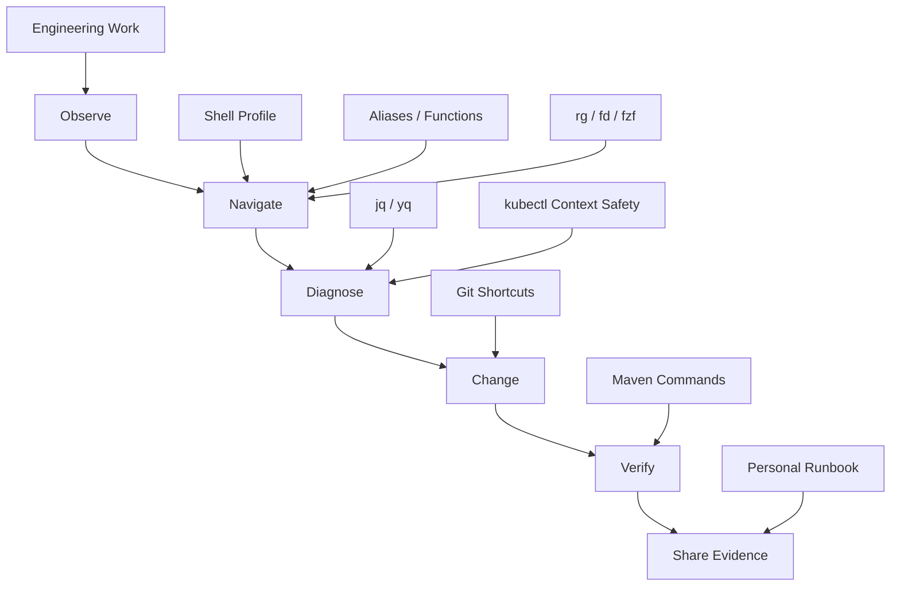
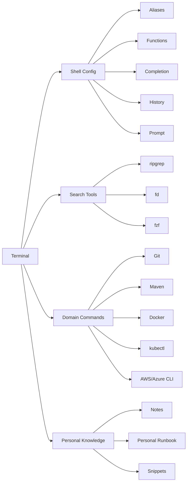

# Part 049 — Developer Productivity and Personal Workflow

## 1. Core idea

Developer productivity untuk senior backend engineer bukan berarti mengetik command lebih cepat.

Produktivitas yang benar berarti:

- waktu dari symptom ke evidence lebih pendek,
- waktu dari repo baru ke local running lebih pendek,
- waktu dari PR ke review berkualitas lebih pendek,
- waktu dari build failure ke root cause lebih pendek,
- waktu dari incident signal ke safe next action lebih pendek,
- risiko command salah environment lebih kecil,
- context switching lebih terkendali,
- debugging steps lebih reproducible,
- knowledge pribadi berubah menjadi reusable workflow.

Senior engineer tidak boleh bergantung pada ingatan command random. Senior engineer butuh personal operating system: shell profile, aliases, functions, fuzzy search, notes, snippets, command templates, personal runbook, dan safety guard.

Personal workflow yang baik bukan sekadar cepat. Ia harus:

- safe,
- explainable,
- portable,
- team-compatible,
- reproducible,
- security-aware,
- production-aware.

---

## 2. Productivity mental model



Workflow pribadi bekerja sebagai lapisan di atas tool resmi tim.

Lapisan ini tidak boleh menggantikan:

- README,
- CONTRIBUTING,
- Makefile/Taskfile,
- CI pipeline,
- release guide,
- runbook resmi,
- security policy.

Lapisan pribadi hanya mempercepat interaksi dengan sistem tersebut.

Prinsipnya:

> Personal workflow boleh mempercepat, tetapi tidak boleh membuat proses resmi menjadi invisible.

---

## 3. Tooling vs habit

Ada dua jenis productivity improvement.

### 3.1 Tooling improvement

Contoh:

- alias `gst` untuk `git status --short --branch`,
- function `kctx` untuk menampilkan Kubernetes context saat ini,
- script `./scripts/test-one.sh` untuk menjalankan test tertentu,
- `rg` untuk mencari endpoint JAX-RS,
- `jq` untuk memformat JSON response,
- snippet curl untuk API debugging.

Tooling improvement mengurangi friction.

### 3.2 Habit improvement

Contoh:

- selalu baca `git diff` sebelum commit,
- selalu cek Kubernetes context sebelum command mutating,
- selalu simpan command reproduksi bug,
- selalu capture timestamp dan correlation ID,
- selalu jalankan test relevan sebelum PR,
- selalu tulis assumption di PR description.

Habit improvement mengurangi risk.

Senior productivity muncul dari kombinasi keduanya.

Tool tanpa habit akan mempercepat kesalahan.

Habit tanpa tool akan lambat dan sulit dipertahankan.

---

## 4. Personal workflow architecture

Personal workflow dapat dipikirkan sebagai beberapa layer.



Setiap layer harus punya batas tanggung jawab.

- Shell config: mempercepat environment.
- Alias: memperpendek command yang aman dan sering dipakai.
- Function: membungkus command yang butuh argument/safety logic.
- Search tools: mempercepat codebase navigation.
- Domain commands: Git/Maven/Kubernetes/cloud workflow.
- Notes/runbook: menyimpan knowledge yang terbukti berguna.

---

## 5. Shell profile discipline

Shell profile adalah entry point personal workflow.

File umum:

- `~/.bashrc`,
- `~/.bash_profile`,
- `~/.zshrc`,
- `~/.profile`,
- file terpisah seperti `~/.shell/aliases.sh`,
- file terpisah seperti `~/.shell/functions.sh`.

Untuk engineer enterprise, shell profile sebaiknya tidak menjadi file besar yang sulit diaudit.

Struktur yang lebih sehat:

```bash
~/.shell/
  aliases.sh
  functions.sh
  git.sh
  maven.sh
  kubernetes.sh
  cloud.sh
  prompt.sh
  safety.sh
  private.sh
```

Lalu di shell profile utama:

```bash
for file in "$HOME"/.shell/*.sh; do
  [ -r "$file" ] && . "$file"
done
```

Catatan penting:

- jangan source file dari lokasi yang tidak dipercaya,
- jangan commit file berisi secret,
- pisahkan config publik dan privat,
- jangan membuat shell startup lambat,
- jangan override command umum secara mengejutkan.

Bad pattern:

```bash
alias rm='rm -rf'
alias kubectl='kubectl --context prod-cluster'
export TOKEN='real-production-token'
```

Better pattern:

```bash
alias ll='ls -lah'
alias gst='git status --short --branch'

current_kube_context() {
  kubectl config current-context 2>/dev/null
}
```

---

## 6. Alias discipline

Alias cocok untuk command pendek, sering dipakai, dan tidak butuh logic kompleks.

Contoh aman:

```bash
alias gst='git status --short --branch'
alias glog='git log --oneline --decorate --graph --all -n 30'
alias gd='git diff'
alias gds='git diff --staged'
alias mvnt='mvn test'
alias mvnv='mvn verify'
alias kctx='kubectl config current-context'
alias kns='kubectl config view --minify --output jsonpath={..namespace}'
```

Alias tidak cocok untuk command yang:

- destructive,
- perlu validasi argument,
- perlu konfirmasi environment,
- punya side effect besar,
- dipakai di script non-interactive,
- bisa menyembunyikan command asli.

Untuk command semacam itu, gunakan function atau script dengan guard.

Bad alias:

```bash
alias kdelpod='kubectl delete pod --all'
alias deployprod='./deploy.sh prod'
alias cleanall='git clean -fdx && mvn clean'
```

Masalahnya:

- terlalu mudah dijalankan,
- tidak ada context check,
- tidak ada confirmation,
- tidak ada dry-run,
- tidak ada logging intent.

---

## 7. Shell functions untuk workflow yang butuh safety

Function cocok ketika command perlu argument, validasi, atau guard.

Contoh: guard Kubernetes context.

```bash
require_non_prod_context() {
  local ctx
  ctx="$(kubectl config current-context 2>/dev/null)"

  case "$ctx" in
    *prod*|*production*)
      echo "Refusing to run against production context: $ctx" >&2
      return 1
      ;;
    "")
      echo "No Kubernetes context selected" >&2
      return 1
      ;;
  esac
}

klogs_app() {
  require_non_prod_context || return 1
  kubectl logs -l app="$1" --tail=200
}
```

Contoh: Maven command dengan standard flags.

```bash
mvnq() {
  mvn -ntp "$@"
}

mvn_test_one() {
  local test_name="$1"
  [ -z "$test_name" ] && {
    echo "Usage: mvn_test_one TestClassName" >&2
    return 2
  }
  mvn -ntp -Dtest="$test_name" test
}
```

Catatan:

- function pribadi boleh membantu,
- tetapi command resmi repo sebaiknya tetap didokumentasikan,
- jangan membuat workflow hanya bisa jalan di mesin pribadi.

---

## 8. Prompt sebagai safety instrument

Shell prompt bukan hanya aesthetic.

Prompt yang baik membantu melihat:

- current directory,
- Git branch,
- dirty state,
- exit status command terakhir,
- Python/Node/Java env jika relevan,
- Kubernetes context,
- cloud profile/account,
- production warning.

Untuk backend enterprise, prompt bisa mencegah kesalahan mahal.

Contoh informasi penting:

```text
repo-name git:feature/quote-validation ✗ kube:dev-us-east aws:dev
$
```

Tetapi prompt juga bisa berlebihan.

Prompt yang terlalu berat dapat:

- memperlambat shell,
- menjalankan command eksternal setiap prompt render,
- memanggil cloud/kubectl terlalu sering,
- membuat terminal lambat di repo besar.

Guideline:

- tampilkan context yang benar-benar mencegah kesalahan,
- cache informasi mahal,
- beri warna/peringatan jelas untuk prod,
- jangan leak account/token/secret,
- jangan bergantung pada prompt sebagai satu-satunya safety guard.

---

## 9. Command history sebagai memory dan risk surface

Shell history mempercepat kerja, tetapi juga security risk.

Manfaat:

- mengulang command debug,
- menemukan command Maven/Kubernetes lama,
- menyusun runbook dari command yang terbukti,
- mempercepat reproduksi issue.

Risiko:

- token tersimpan,
- password tersimpan,
- connection string tersimpan,
- customer ID atau data sensitive tersimpan,
- command destructive bisa terulang tidak sengaja.

Praktik aman:

```bash
# Bash example
export HISTCONTROL=ignoreboth:erasedups
export HISTSIZE=50000
export HISTFILESIZE=100000
```

Gunakan leading space untuk command sensitif jika shell mendukung `ignorespace`.

```bash
 export TEMP_TOKEN='do-not-store-this'
```

Namun jangan bergantung pada ini sebagai security control utama.

Better:

- jangan paste secret ke terminal,
- gunakan secret manager/credential helper,
- gunakan file temp dengan permission aman jika benar-benar perlu,
- rotate secret jika sudah masuk history,
- audit history secara berkala.

---

## 10. History search workflow

History search yang baik mempercepat debugging.

Teknik dasar:

```bash
history | grep mvn
history | grep kubectl
history | grep curl
```

Dengan reverse search:

```text
Ctrl+r
```

Dengan fuzzy finder jika tersedia:

```bash
# contoh umum, tergantung setup lokal
history | fzf
```

Gunakan history untuk menemukan command, bukan untuk blindly execute.

Safe flow:

1. cari command lama,
2. copy ke editor/terminal,
3. cek context dan argument,
4. ubah environment/namespace/date/token,
5. jalankan mode read-only dulu,
6. baru jalankan command final.

Risky flow:

```text
Ctrl+r -> enter -> ternyata command lama delete resource di namespace lain
```

---

## 11. Fuzzy finder awareness

`fzf` membantu memilih file, branch, commit, command history, process, atau Kubernetes resource secara cepat.

Contoh use case:

- pilih Git branch,
- cari file endpoint JAX-RS,
- cari command lama,
- pilih process lokal,
- pilih log file,
- pilih test class,
- pilih Kubernetes pod.

Contoh pattern:

```bash
git branch --all | fzf
```

```bash
rg -l '@Path|@GET|@POST' src | fzf
```

```bash
find . -name '*Test.java' | fzf
```

Kelebihan:

- mengurangi waktu navigasi,
- bagus untuk repo besar,
- membantu eksplorasi.

Risiko:

- output fuzzy bisa masuk command mutating,
- pemilihan salah resource,
- tidak cocok untuk script non-interactive,
- environment production perlu guard tambahan.

Gunakan `fzf` terutama untuk navigation dan inspection. Untuk mutating operation, tetap tambahkan confirmation.

---

## 12. ripgrep awareness

`rg` atau ripgrep adalah search tool cepat untuk codebase besar.

Contoh mencari JAX-RS endpoint:

```bash
rg '@Path|@GET|@POST|@PUT|@DELETE' src/main/java
```

Mencari config key:

```bash
rg 'DB_URL|KAFKA_BOOTSTRAP|RABBIT|REDIS' .
```

Mencari usage class:

```bash
rg 'QuoteValidationService'
```

Mencari TODO/FIXME:

```bash
rg 'TODO|FIXME|HACK' src
```

Mencari dependency atau plugin di POM:

```bash
rg '<artifactId>|<groupId>|<plugin>' -g 'pom.xml'
```

Kenapa `rg` penting untuk senior engineer:

- menemukan boundary service,
- menemukan config source,
- menemukan endpoint,
- menemukan event producer/consumer,
- menemukan migration,
- menemukan script hidden,
- menemukan duplicated logic,
- mempercepat PR review.

Guideline:

- gunakan pattern spesifik,
- gunakan `-g` untuk membatasi file,
- gunakan `--hidden` jika perlu membaca dotfiles,
- hindari search seluruh repo tanpa scope pada monorepo besar,
- jangan grep binary/generated directory kecuali perlu.

---

## 13. fd awareness

`fd` adalah alternatif modern untuk `find` yang lebih ergonomis.

Contoh:

```bash
fd 'pom.xml'
fd '.*Test.java' src
fd 'application.*' .
fd 'Dockerfile|docker-compose.yml'
```

Use case:

- menemukan semua POM,
- menemukan test class,
- menemukan config file,
- menemukan migration file,
- menemukan workflow YAML,
- menemukan script executable.

Contoh gabungan dengan Maven:

```bash
fd '.*Test.java' src/test/java | sed 's#src/test/java/##; s#/#.#g; s#.java$##'
```

`fd` bagus untuk interactive discovery. Untuk script portable, pertimbangkan apakah tool ini tersedia di semua environment.

---

## 14. jq workflow

`jq` penting untuk API debugging, log analysis, cloud CLI, Kubernetes JSON output, dan CI evidence.

Contoh format response:

```bash
curl -s http://localhost:8080/api/quotes/123 | jq .
```

Ambil field spesifik:

```bash
curl -s http://localhost:8080/api/quotes/123 | jq -r '.status'
```

Filter array:

```bash
jq '.items[] | select(.status == "FAILED") | {id, reason}' response.json
```

Kubernetes JSON:

```bash
kubectl get pods -o json | jq -r '.items[] | [.metadata.name, .status.phase] | @tsv'
```

Structured logs:

```bash
jq -r 'select(.traceId == "abc-123") | [.timestamp, .level, .message] | @tsv' app.log
```

Senior usage:

- buat output evidence ringkas,
- hindari screenshot JSON panjang,
- parse command output secara repeatable,
- buat bug report dengan field relevan.

Risk:

- query salah bisa menyembunyikan data penting,
- `jq -r` dapat menghilangkan quoting,
- log dengan non-JSON line akan gagal,
- jangan print field sensitive.

---

## 15. yq workflow

`yq` membantu membaca YAML:

- Kubernetes manifest,
- GitHub Actions workflow,
- Helm values,
- Docker Compose,
- application YAML.

Contoh:

```bash
yq '.services' docker-compose.yml
```

```bash
yq '.jobs | keys' .github/workflows/ci.yml
```

```bash
yq '.spec.template.spec.containers[].image' deployment.yaml
```

Use case senior:

- review image tag,
- review env var,
- review secret reference,
- review resource request/limit,
- review workflow permission,
- review deployment strategy.

Caveat:

- ada beberapa implementasi `yq` yang syntax-nya berbeda,
- jangan assume tersedia di CI,
- dokumentasikan versi jika dipakai di script.

---

## 16. tmux awareness

`tmux` berguna untuk long-running workflow dan context separation.

Use case:

- satu pane untuk app logs,
- satu pane untuk Maven test,
- satu pane untuk curl repro,
- satu pane untuk Git diff,
- satu pane untuk Kubernetes logs,
- session khusus incident/debugging.

Pattern:

```text
session: quote-debug
  pane 1: mvn -Dtest=QuoteValidationServiceTest test
  pane 2: docker compose logs -f postgres kafka redis
  pane 3: curl repro commands
  pane 4: rg/jq investigation
```

Manfaat:

- mengurangi context switching,
- menjaga command history per session,
- memudahkan reconnect ke remote machine,
- bagus untuk incident war-room pribadi.

Risiko:

- command lama tetap hidup tanpa disadari,
- session berisi output sensitive,
- lupa context cluster/account,
- copy-paste antar pane bisa salah.

Prinsip:

- beri nama session jelas,
- tutup session setelah selesai,
- jangan biarkan token/log sensitive terlihat lama,
- gunakan read-only command untuk production debugging.

---

## 17. IDE terminal integration

IDE terminal berguna karena dekat dengan code, test, dan Git.

Manfaat:

- menjalankan test dari context file,
- melihat diff dan terminal berdampingan,
- copy class/method name untuk Maven test filtering,
- menjalankan curl sambil membaca endpoint,
- cepat membuka file hasil grep.

Risiko:

- terminal IDE memakai environment berbeda dari terminal sistem,
- PATH/JAVA_HOME/MAVEN_OPTS berbeda,
- shell login/non-login behavior berbeda,
- plugin IDE menyembunyikan command build sebenarnya,
- test lewat IDE tidak sama dengan CI.

Checklist:

```bash
which java
java -version
which mvn
mvn -version
echo "$JAVA_HOME"
echo "$MAVEN_OPTS"
```

Selalu bedakan:

- command yang berjalan di IDE,
- command yang berjalan di terminal,
- command yang berjalan di CI,
- command yang berjalan di container.

---

## 18. Notes sebagai engineering memory

Senior engineer menghadapi terlalu banyak context untuk diingat semua.

Personal notes membantu menyimpan:

- command yang berhasil,
- issue pattern,
- service dependency,
- build failure pattern,
- PR review heuristics,
- incident timeline pribadi,
- pertanyaan untuk senior/platform/SRE,
- decision yang belum terdokumentasi resmi.

Struktur notes yang sehat:

```text
notes/
  daily/
  services/
    quote-service.md
    order-service.md
  commands/
    maven.md
    git.md
    kubectl.md
    curl.md
  incidents/
  pr-review/
  questions/
```

Catatan penting:

- jangan simpan secret,
- jangan simpan data customer sensitive,
- pisahkan notes pribadi dan dokumentasi resmi,
- promosi notes yang stabil menjadi README/runbook/ADR,
- beri timestamp dan sumber evidence.

---

## 19. Personal runbook

Personal runbook adalah kumpulan langkah yang sering dipakai dan sudah terbukti.

Contoh topik:

- cara setup repo baru,
- cara menjalankan service lokal,
- cara menjalankan test tertentu,
- cara debug dependency resolution,
- cara mencari endpoint JAX-RS,
- cara mengambil log berdasarkan trace ID,
- cara cek Kubernetes pod restart,
- cara cek image tag yang sedang running,
- cara membuat curl repro,
- cara memeriksa Git branch divergence,
- cara review POM dependency change.

Template personal runbook:

```markdown
# Debug: Maven dependency conflict

## Symptom
Build gagal dengan `NoSuchMethodError` atau dependency convergence error.

## First checks
- `mvn -q dependency:tree -Dincludes=group:artifact`
- `rg '<artifactId>artifact</artifactId>' -g pom.xml`

## Evidence to capture
- Maven command
- Java/Maven version
- dependency tree excerpt
- failing stack trace

## Safe commands
...

## Escalation
Ask platform/build owner if parent POM manages this dependency.
```

Personal runbook harus menjadi staging area untuk dokumentasi resmi.

Jika runbook pribadi dipakai lebih dari beberapa kali, pertimbangkan untuk mengubahnya menjadi team docs.

---

## 20. Snippets

Snippet adalah reusable text kecil yang menghindari penulisan ulang.

Contoh snippet PR description:

```markdown
## What changed

## Why

## Validation

## Risk

## Rollback

## Internal verification needed
```

Contoh snippet curl:

```bash
curl -sS \
  -X GET "${BASE_URL}/api/quotes/${QUOTE_ID}" \
  -H "Accept: application/json" \
  -H "X-Correlation-Id: ${CID}" \
  --connect-timeout 5 \
  --max-time 20 \
  | jq .
```

Contoh snippet incident evidence:

```markdown
## Timeline
- Timezone:
- First symptom:
- Affected service:
- Release/tag:
- Correlation IDs:
- Logs checked:
- Metrics checked:
- Current hypothesis:
- Next safe action:
```

Snippet yang baik:

- punya placeholder jelas,
- tidak mengandung secret,
- menyertakan timeout untuk network command,
- menyertakan correlation ID jika relevan,
- mengingatkan risk/rollback.

---

## 21. Reusable commands

Reusable command berbeda dari random command.

Random command:

```bash
kubectl logs pod-abc | grep error
```

Reusable command:

```bash
kubectl logs -l app="$APP" --since=30m \
  | jq -r 'select(.traceId == env.TRACE_ID) | [.timestamp, .level, .message] | @tsv'
```

Reusable command punya:

- variable input,
- clear intent,
- constrained scope,
- safe defaults,
- output yang mudah dibaca,
- bisa ditempel ke runbook.

Contoh command set untuk Java/JAX-RS service:

```bash
# Search endpoints
rg '@Path|@GET|@POST|@PUT|@DELETE' src/main/java

# Run one unit test
mvn -ntp -Dtest=QuoteValidationServiceTest test

# Run one integration test
mvn -ntp -Dit.test=QuoteResourceIT verify

# Inspect dependency
mvn -ntp dependency:tree -Dincludes=org.glassfish.jersey

# Show recent branch graph
git log --oneline --decorate --graph --all -n 40
```

---

## 22. Git productivity workflow

Git aliases atau functions harus mempercepat review dan recovery.

Useful aliases:

```bash
alias gs='git status --short --branch'
alias gd='git diff'
alias gds='git diff --staged'
alias gl='git log --oneline --decorate --graph -n 30'
alias gla='git log --oneline --decorate --graph --all -n 50'
alias gb='git branch --sort=-committerdate'
```

Useful review commands:

```bash
# Files changed compared to main
git diff --name-status origin/main...HEAD

# Commits in current branch not in main
git log --oneline origin/main..HEAD

# Review staged changes
git diff --staged

# Find who changed a line
git blame path/to/File.java
```

Safety habits:

- run `git status` before branch switch,
- run `git diff` before commit,
- use `--force-with-lease`, not blind `--force`,
- prefer `revert` for shared history,
- check branch before tagging/releasing,
- write commit messages for future debugging.

---

## 23. Maven productivity workflow

Maven productivity bukan sekadar `mvn clean install` untuk semua hal.

Command yang lebih tepat:

```bash
# Fast compile check
mvn -ntp -DskipTests compile

# Unit tests only
mvn -ntp test

# Full verification
mvn -ntp verify

# One test class
mvn -ntp -Dtest=QuoteServiceTest test

# One integration test
mvn -ntp -Dit.test=QuoteResourceIT verify

# Module build with dependencies
mvn -ntp -pl quote-service -am verify

# Dependency tree for one artifact
mvn -ntp dependency:tree -Dincludes=org.postgresql:postgresql
```

Senior rule:

> Choose the smallest command that gives sufficient confidence for the current change.

Examples:

- config-only change: targeted config validation + relevant smoke check,
- service logic change: unit test + relevant integration test,
- dependency change: dependency tree + full verify + runtime smoke,
- POM parent change: broader module verify,
- release change: full CI path.

Avoid defaulting to `mvn clean install` every time. It is sometimes necessary, but often hides the actual requirement.

---

## 24. Kubernetes productivity workflow

Kubernetes productivity harus sangat safety-aware.

Useful read-only commands:

```bash
kubectl config current-context
kubectl get ns
kubectl get pods
kubectl get deploy
kubectl describe pod <pod>
kubectl logs <pod> --tail=200
kubectl get events --sort-by=.lastTimestamp
kubectl rollout status deploy/<deployment>
```

Commands requiring extra caution:

```bash
kubectl delete ...
kubectl apply ...
kubectl edit ...
kubectl scale ...
kubectl rollout undo ...
kubectl exec ...
kubectl debug ...
```

Personal guard suggestions:

- always show current context,
- require explicit namespace,
- separate aliases for read-only commands,
- avoid aliasing destructive commands,
- use `--dry-run=server` when possible,
- never bypass GitOps flow without explicit process.

---

## 25. Cloud CLI productivity workflow

AWS/Azure CLI productivity depends on account safety.

Minimum context checks:

```bash
# AWS
aws sts get-caller-identity
aws configure list

# Azure
az account show --output table
```

Before running mutating command:

- check account/subscription,
- check region,
- check role,
- check resource group/project,
- check environment label,
- check whether GitOps/IaC should be source of truth.

Avoid:

- persistent broad admin credentials,
- ambiguous default profile,
- copy-pasting production commands into dev terminal,
- command without `--region` when region matters,
- command output that prints secret.

---

## 26. PR review productivity

Personal workflow can speed up PR review.

Review sequence:

```bash
# See changed files
git diff --name-status origin/main...HEAD

# See summary
git diff --stat origin/main...HEAD

# Search risky areas
rg 'TODO|FIXME|System.out|Thread.sleep|skipTests|password|secret' .

# Inspect POM changes
git diff origin/main...HEAD -- '**/pom.xml'

# Inspect workflows
git diff origin/main...HEAD -- '.github/workflows/**'
```

PR review snippets:

```markdown
Blocking because this changes release/build behavior and needs evidence from CI/full verify.

Non-blocking suggestion: this command would be safer with explicit namespace/context validation.

Question: is this dependency version managed by parent POM/BOM, or intentionally overridden here?
```

Goal:

- reduce review friction,
- catch build/security/tooling risks,
- ask precise questions,
- avoid vague comments.

---

## 27. Incident support productivity

During incident, personal workflow must optimize for evidence and safety.

Useful personal shortcuts:

- command to get current time in UTC/local,
- template incident timeline,
- command to fetch logs by trace ID,
- command to show deployed image tag,
- command to show recent events,
- command to show last Git tag/release,
- command to check current cluster/account,
- command to redact sensitive fields.

Incident rule:

> Speed during incident is useful only if it reduces uncertainty without increasing blast radius.

Do not use incident pressure as excuse to:

- run unreviewed destructive command,
- bypass GitOps/IaC without process,
- paste secrets into shared chat,
- share customer data in screenshots,
- change production config without audit trail,
- rely on memory instead of evidence.

---

## 28. Personal command library

A personal command library can be simple markdown.

Example:

```markdown
# Maven

## Run one unit test
mvn -ntp -Dtest=<TestClass> test

## Inspect dependency tree
mvn -ntp dependency:tree -Dincludes=<groupId>:<artifactId>

# Kubernetes

## Current context
kubectl config current-context

## Recent events
kubectl get events --sort-by=.lastTimestamp
```

Better if every command includes:

- intent,
- required variables,
- safe scope,
- sample output,
- danger level,
- related internal runbook.

---

## 29. Dotfiles governance

Dotfiles are personal, but they can affect work quality and security.

Good dotfiles practice:

- keep public and private config separate,
- never commit tokens/keys,
- document dependencies,
- avoid company-specific secrets,
- avoid overriding common commands dangerously,
- test shell startup performance,
- make functions readable,
- prefer explicit names over clever abbreviations.

Example separation:

```text
dotfiles/
  shell/
    aliases.sh
    git.sh
    maven.sh
    kubernetes.sh
  README.md

private/
  work-local.sh   # not committed
```

Security checklist:

```bash
rg 'token|password|secret|apikey|BEGIN .*PRIVATE KEY' ~/dotfiles
```

---

## 30. Productivity anti-patterns

### 30.1 Clever aliases nobody understands

Bad:

```bash
alias yolo='git add . && git commit -m wip && git push --force'
```

Problem:

- hides risky behavior,
- normalizes bad commit hygiene,
- can damage shared branch.

### 30.2 Personal workflow replaces team workflow

Bad:

```bash
# Only works on your machine
run-service-prod-like
```

No one else can reproduce it.

### 30.3 Automation without documentation

If a script is important, it needs help text or README.

### 30.4 Fast but unsafe Kubernetes shortcuts

Bad:

```bash
alias k='kubectl'
alias kprod='kubectl --context prod'
alias kdel='kubectl delete'
```

Fast path to wrong-cluster mistakes.

### 30.5 Screenshot-driven debugging

Prefer command output and text evidence that can be searched, redacted, and pasted into issue/PR/RCA.

---

## 31. Java/JAX-RS productivity patterns

Useful searches:

```bash
# Find resource classes
rg '@Path' src/main/java

# Find HTTP methods
rg '@GET|@POST|@PUT|@DELETE|@PATCH' src/main/java

# Find exception mappers
rg 'ExceptionMapper|@Provider' src/main/java

# Find filters/interceptors
rg 'ContainerRequestFilter|ContainerResponseFilter|ReaderInterceptor|WriterInterceptor' src/main/java

# Find config keys
rg 'System.getenv|getProperty|@ConfigProperty|Configuration' src/main/java
```

Useful Maven test filters:

```bash
mvn -ntp -Dtest=QuoteValidationServiceTest test
mvn -ntp -Dtest=QuoteValidationServiceTest#shouldRejectInvalidQuote test
```

Useful API debug pattern:

```bash
CID="debug-$(date +%Y%m%d-%H%M%S)"

curl -sS \
  -H "X-Correlation-Id: $CID" \
  -H "Accept: application/json" \
  --connect-timeout 5 \
  --max-time 20 \
  "$BASE_URL/api/quotes/$QUOTE_ID" \
  | jq .

echo "Correlation ID: $CID"
```

---

## 32. Microservices productivity patterns

For microservices, productivity means navigating dependency boundaries.

Questions to encode in notes/runbook:

- service owns which API?
- service consumes which Kafka topic?
- service publishes which event?
- service calls which downstream HTTP service?
- service uses which PostgreSQL schema/table?
- service uses which Redis key pattern?
- service depends on which RabbitMQ exchange/queue?
- service has which health endpoint?
- service emits which metrics/log fields?

Useful search patterns:

```bash
rg 'bootstrap.servers|topic|Kafka|Rabbit|exchange|queue|Redis|DataSource|jdbc' .
```

Evidence pattern:

```markdown
## Dependency involved
- Upstream:
- Downstream:
- Protocol:
- Endpoint/topic/queue:
- Correlation ID:
- Timeout/retry behavior:
- Last successful call/event:
```

---

## 33. Productivity and reproducibility

A productivity shortcut is valuable only if the result can be reproduced.

Bad:

```text
I clicked around and somehow fixed local setup.
```

Better:

```markdown
Local setup failed because PostgreSQL container had old volume.
Fix:
1. `docker compose down`
2. `docker volume ls | grep quote`
3. remove only the stale dev volume
4. `docker compose up -d postgres`
5. rerun migration
```

Best:

- add script or doc update,
- add diagnostic command,
- add FAQ entry,
- add guard to setup script.

---

## 34. Productivity and security

Productivity shortcuts often create security risk.

Common examples:

- storing token in shell profile,
- hardcoding credentials in alias,
- printing env vars wholesale,
- uploading raw logs to PR/issue,
- storing production curl with Authorization header,
- keeping kubeconfig with broad access unmanaged,
- using global cloud profile ambiguously,
- installing random CLI plugin without review.

Safer alternatives:

- use credential helper,
- use secret manager,
- use placeholders in snippets,
- redact logs before sharing,
- scope cloud/kube commands explicitly,
- document approved tools,
- rotate token if exposed.

---

## 35. Productivity and correctness

Fast workflow can bypass correctness checks.

Examples:

- running only one test when full integration test is needed,
- skipping test because local setup slow,
- using stale local dependency cache,
- using branch with outdated main,
- deploying image built from unclean workspace,
- applying Kubernetes manifest manually outside GitOps,
- relying on local profile different from CI.

Senior heuristic:

> Optimize the path to the right check, not the path around the check.

---

## 36. Productivity and observability

Good personal workflow improves observability usage.

Useful habits:

- always generate correlation ID for manual API call,
- always capture request timestamp and timezone,
- always record release tag/image digest,
- always link logs/metrics/traces if internal tools allow,
- always include command used to reproduce,
- always include expected vs actual behavior.

Bug report template:

```markdown
## Repro command

## Expected

## Actual

## Environment

## Time window

## Correlation ID / Trace ID

## Logs / Metrics checked

## Suspected component

## Next verification
```

---

## 37. Internal verification checklist

Verifikasi hal berikut di CSG/team sebelum membuat personal workflow terlalu jauh:

- Shell yang didukung untuk local setup: Bash, Zsh, PowerShell, WSL.
- OS developer yang umum: Linux, macOS, Windows.
- Approved CLI tools: `jq`, `yq`, `rg`, `fd`, `fzf`, `tmux`.
- Recommended Java version manager: SDKMAN, jEnv, asdf, manual install, corporate image.
- Required Maven command untuk build/test.
- Maven wrapper usage policy.
- Docker Compose atau local dependency strategy.
- Kubernetes context/namespace naming convention.
- Cloud account/subscription naming convention.
- Git branch naming convention.
- PR template dan validation expectation.
- Runbook resmi untuk production debugging.
- Security policy untuk local notes, logs, screenshots, dan command sharing.
- Policy untuk dotfiles atau personal scripts yang menyentuh internal systems.
- Approved location untuk team snippets/scripts.

---

## 38. PR review checklist untuk productivity tooling

Saat mereview perubahan yang menyentuh developer productivity, tanyakan:

- Apakah workflow ini mempercepat path yang benar, bukan bypass kontrol?
- Apakah command/script bisa dijalankan ulang oleh engineer lain?
- Apakah ada dokumentasi dan contoh output?
- Apakah ada guard untuk environment production?
- Apakah ada dry-run untuk command mutating?
- Apakah secret bisa bocor ke logs/history/output?
- Apakah tool tambahan tersedia di local/CI runner?
- Apakah command cross-platform atau jelas hanya Linux/macOS?
- Apakah script memakai quoting dan error handling yang benar?
- Apakah workflow local konsisten dengan CI?
- Apakah failure message actionable?
- Apakah shortcut terlalu clever dan sulit dipahami?

---

## 39. Practical exercises

1. Buat daftar 20 command yang paling sering dipakai minggu ini.
2. Kelompokkan command menjadi Git, Maven, Docker/Kubernetes, HTTP, logs, search, cloud.
3. Ubah 5 command yang aman dan sering dipakai menjadi alias.
4. Ubah 2 command yang butuh argument/safety menjadi shell function.
5. Buat personal runbook untuk satu build failure yang pernah terjadi.
6. Buat snippet curl dengan timeout dan correlation ID.
7. Buat snippet PR description dengan validation/risk/rollback.
8. Review shell history dan pastikan tidak ada secret.
9. Cek apakah prompt menunjukkan Git branch dan kube/cloud context.
10. Ambil satu command pribadi yang berguna dan ubah menjadi dokumentasi team jika relevan.

---

## 40. Senior heuristics

1. **Typing faster is not the same as engineering faster.**
2. **The best shortcut preserves context and safety.**
3. **A command worth repeating is worth documenting.**
4. **A command used during incident should be reproducible.**
5. **Aliases are for convenience; functions are for safety.**
6. **Never optimize around tests; optimize the path to the right tests.**
7. **Your local workflow should not become hidden team dependency.**
8. **If a workflow only works on your machine, it is not engineering tooling yet.**
9. **History is useful, but it is also a secret leak surface.**
10. **Productivity improvements should reduce both time and risk.**

---

## 41. Summary

Developer productivity untuk senior backend engineer adalah kemampuan membangun personal workflow yang mempercepat observasi, navigasi, diagnosis, perubahan, verifikasi, dan sharing evidence.

Target setelah part ini:

- punya shell profile yang rapi dan aman,
- memakai alias hanya untuk command aman dan sering dipakai,
- memakai function untuk command yang perlu guard,
- memahami prompt sebagai safety instrument,
- menggunakan history search tanpa membocorkan secret,
- memakai `rg`, `fd`, `fzf`, `jq`, dan `yq` untuk navigasi/debugging,
- menggunakan tmux/IDE terminal secara sadar,
- menyimpan notes, snippets, dan personal runbook,
- membangun reusable command yang aman dan reproducible,
- dan mengubah knowledge pribadi yang stabil menjadi dokumentasi atau tooling team.

Dalam enterprise Java/JAX-RS system, produktivitas bukan hanya tentang local speed. Produktivitas adalah kemampuan bergerak cepat di atas Git, Maven, CI/CD, Docker, Kubernetes, cloud, dan production evidence tanpa kehilangan correctness, security, reproducibility, atau auditability.
