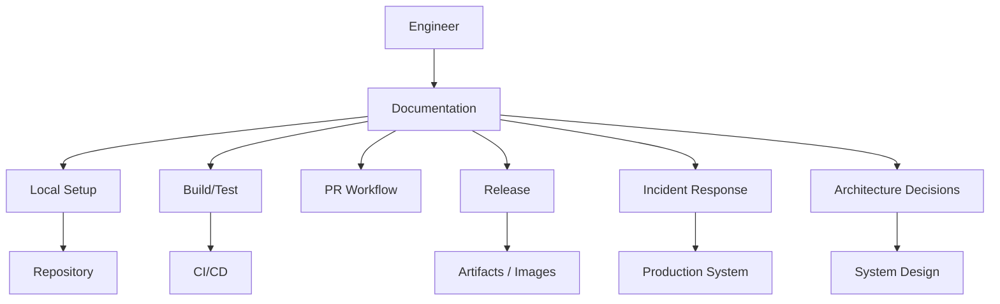
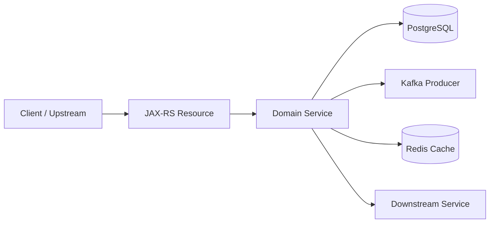
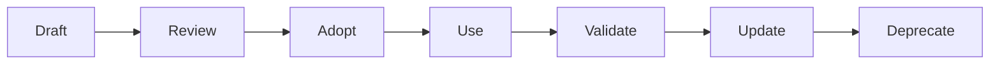
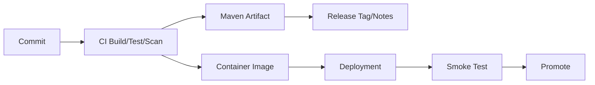

# Part 050 — Documentation as Tooling

## 1. Core idea

Documentation is tooling.

Dokumentasi bukan dekorasi setelah engineering selesai. Dokumentasi adalah interface operasional antara manusia dan sistem.

Dalam sistem enterprise Java/JAX-RS, dokumentasi yang baik membantu engineer:

- setup local environment,
- memahami repo structure,
- menjalankan build/test,
- membuat PR yang benar,
- mereview dependency/POM/workflow change,
- menjalankan release,
- mendiagnosis incident,
- memahami architecture decision,
- menjaga audit trail,
- mengurangi tribal knowledge.

Dokumentasi yang buruk menciptakan hidden cost:

- onboarding lambat,
- local setup sering gagal,
- command berbeda antar engineer,
- CI failure sulit didiagnosis,
- release bergantung pada orang tertentu,
- incident response kacau,
- PR review berulang memperdebatkan hal yang sama,
- keputusan arsitektur hilang konteksnya.

Senior engineer harus memperlakukan dokumentasi seperti tooling production: punya owner, lifecycle, review, failure mode, dan quality bar.

---

## 2. Documentation as an engineering interface



Dokumentasi adalah adapter antara intent manusia dan mekanisme teknis.

Jika dokumentasi salah, engineer menjalankan mekanisme yang salah.

Jika dokumentasi tidak lengkap, engineer menebak.

Jika dokumentasi tidak dipercaya, engineer bertanya ke orang, lalu tribal knowledge makin kuat.

---

## 3. Documentation categories

Untuk tooling engineering, kategori dokumentasi utama adalah:

1. README,
2. CONTRIBUTING,
3. local setup guide,
4. build/test guide,
5. architecture notes,
6. ADR,
7. runbook,
8. troubleshooting guide,
9. release guide,
10. PR template,
11. issue template,
12. script help,
13. command examples,
14. decision log,
15. incident/postmortem artifact.

Setiap kategori punya fungsi berbeda. Menggabungkan semuanya ke README tunggal biasanya membuat README terlalu panjang dan cepat usang.

---

## 4. README sebagai entry point

README adalah landing page repository.

README yang baik menjawab:

- service ini apa,
- owner-nya siapa,
- domain/boundary-nya apa,
- cara setup local,
- cara build,
- cara test,
- cara run,
- dependency external apa saja,
- link ke docs lebih detail,
- link ke runbook/release/troubleshooting,
- status production/support.

README tidak harus memuat semua detail, tetapi harus mengarahkan ke tempat yang benar.

Skeleton:

```markdown
# Service Name

## Purpose

## Ownership

## Architecture Context

## Prerequisites

## Local Setup

## Build and Test

## Run Locally

## External Dependencies

## Configuration

## Operational Links

## Troubleshooting

## Release

## Contributing
```

README failure mode:

- hanya berisi nama repo,
- setup command tidak pernah diverifikasi,
- dependency tidak lengkap,
- environment variable tidak dijelaskan,
- link ke dokumen mati,
- tidak menjelaskan service boundary,
- command berbeda dari CI,
- tidak menyebut owner/escalation path.

---

## 5. CONTRIBUTING sebagai workflow contract

CONTRIBUTING menjelaskan cara berkontribusi dengan benar.

Untuk backend enterprise, CONTRIBUTING sebaiknya mencakup:

- branch naming,
- commit message convention,
- PR size expectation,
- PR description expectation,
- local validation sebelum PR,
- test requirement,
- code style/linting,
- dependency change rule,
- POM change rule,
- database migration rule,
- event/API compatibility rule,
- security/secret handling,
- review expectation,
- merge strategy.

Contoh section:

```markdown
## Before opening a PR

- Rebase/update from main.
- Run relevant unit tests.
- Run integration tests if API/database/messaging behavior changed.
- Include validation evidence in PR description.
- Document rollback if change affects runtime behavior.
```

CONTRIBUTING membantu PR review tidak mengulang penjelasan dasar.

---

## 6. Local setup guide

Local setup guide adalah salah satu dokumen paling berdampak terhadap onboarding.

Harus menjawab:

- OS yang didukung,
- Java version,
- Maven version atau wrapper,
- Docker/Docker Compose requirement,
- database setup,
- Kafka/RabbitMQ/Redis setup,
- seed data,
- environment variables,
- secrets untuk local,
- command run service,
- debug mode,
- smoke test,
- reset local environment,
- common failures.

Good pattern:

````markdown
## Verify prerequisites

```bash
java -version
./mvnw -version
docker version
docker compose version
```

## Start dependencies

```bash
docker compose up -d postgres kafka redis
```

## Run service

```bash
./mvnw -pl quote-service -am compile
./scripts/run-local.sh
```

## Smoke test

```bash
curl -sS http://localhost:8080/health | jq .
```
````

Local setup guide harus diuji oleh engineer baru, bukan hanya penulisnya.

---

## 7. Build and test guide

Build/test guide menjelaskan command yang benar untuk situasi berbeda.

Contoh matrix:

| Situation | Command | Notes |
|---|---|---|
| Compile only | `./mvnw -ntp -DskipTests compile` | Fast syntax/type check |
| Unit tests | `./mvnw -ntp test` | Default local confidence |
| Integration tests | `./mvnw -ntp verify` | Runs Failsafe if configured |
| One unit test | `./mvnw -ntp -Dtest=ClassName test` | Useful for TDD/debugging |
| One module | `./mvnw -ntp -pl module -am verify` | Multi-module partial build |
| Dependency tree | `./mvnw -ntp dependency:tree` | Dependency debugging |

Guide harus menjelaskan:

- Surefire vs Failsafe,
- test naming convention,
- Testcontainers/local dependency requirement,
- flaky test handling,
- when not to skip tests,
- CI command parity.

Build/test doc failure mode:

- semua command memakai `mvn clean install`,
- tidak jelas bedanya `test` dan `verify`,
- test skipping dinormalisasi,
- CI menjalankan command berbeda tanpa penjelasan,
- tidak ada troubleshooting untuk dependency resolution.

---

## 8. Architecture notes

Architecture notes menjelaskan system context tanpa harus menjadi full formal ADR.

Untuk service Java/JAX-RS, architecture notes bisa mencakup:

- service responsibility,
- domain boundary,
- main resources/endpoints,
- external dependencies,
- database ownership,
- messaging topics/queues,
- cache usage,
- major runtime flows,
- failure handling,
- observability signals,
- deployment topology.

Contoh Mermaid context:



Architecture notes tidak boleh mengarang detail production. Jika belum pasti, tandai sebagai assumption atau internal verification needed.

---

## 9. ADR: Architecture Decision Record

ADR merekam keputusan penting, bukan semua diskusi.

ADR cocok untuk:

- mengganti dependency besar,
- mengubah branch/release strategy,
- mengubah CI/CD workflow,
- memilih messaging pattern,
- mengubah data migration strategy,
- mengadopsi shared library,
- mengubah Docker base image,
- mengubah deployment mechanism,
- mengubah API compatibility policy,
- mengubah observability standard.

Template ADR:

```markdown
# ADR-YYYY-MM-DD: Title

## Status
Proposed | Accepted | Superseded | Deprecated

## Context

## Decision

## Consequences

## Alternatives considered

## Rollout plan

## Rollback plan

## Security/reliability impact

## References
```

ADR yang baik menjawab kenapa keputusan dibuat, bukan hanya apa hasilnya.

---

## 10. Runbook

Runbook adalah dokumentasi operasional untuk melakukan tindakan tertentu secara aman.

Runbook dapat mencakup:

- service restart procedure,
- rollback procedure,
- incident triage,
- dependency outage handling,
- log retrieval,
- database migration verification,
- Kafka/RabbitMQ consumer lag diagnosis,
- Redis cache issue diagnosis,
- release validation,
- emergency contact/escalation.

Runbook harus memiliki:

- purpose,
- scope,
- prerequisites,
- environment warning,
- read-only first checks,
- mutating steps with confirmation,
- expected output,
- rollback/undo,
- escalation path,
- evidence to capture.

Runbook template:

```markdown
# Runbook: Diagnose Quote Service 5xx spike

## Scope

## Symptoms

## Safety notes

## Read-only checks

## Evidence to capture

## Possible causes

## Mitigation options

## Rollback / recovery

## Escalation

## References
```

---

## 11. Troubleshooting guide

Troubleshooting guide berbeda dari runbook.

Runbook biasanya action-oriented untuk situasi operasional tertentu.

Troubleshooting guide biasanya symptom-oriented.

Contoh structure:

```markdown
# Troubleshooting

## Local setup fails

### Symptom

### Likely causes

### Checks

### Fixes

### Escalate when

## Maven dependency cannot resolve

## Test fails only in CI

## Service cannot connect to PostgreSQL

## Kafka consumer not receiving messages

## Kubernetes pod CrashLoopBackOff
```

Troubleshooting guide yang baik mencegah engineer melakukan random retry/clean/delete.

---

## 12. Release guide

Release guide adalah production change-control document.

Harus menjelaskan:

- release cadence,
- release branch strategy,
- versioning convention,
- tag convention,
- Maven artifact publishing,
- container image tag/digest,
- changelog/release note,
- CI/CD pipeline entry point,
- environment promotion,
- manual approval,
- smoke test,
- rollback/roll-forward,
- hotfix procedure,
- post-release verification.

Release guide harus memisahkan:

- general concept,
- internal team process,
- environment-specific instruction,
- emergency exception process.

Failure mode:

- release hanya diketahui satu orang,
- tag dibuat manual tanpa rule,
- artifact tidak traceable ke commit,
- rollback tidak diuji,
- release note tidak menjelaskan risk,
- production hotfix tidak punya audit trail.

---

## 13. PR template

PR template membantu reviewer melihat risk dengan cepat.

Template untuk backend enterprise:

```markdown
## Summary

## Why

## What changed

## Validation
- [ ] Unit tests
- [ ] Integration tests
- [ ] Local smoke test
- [ ] CI passed

## Risk

## Rollback

## Compatibility impact
- API:
- Events:
- Database:
- Config:

## Operational impact
- Logs:
- Metrics:
- Alerts:
- Runbook/docs:

## Internal verification needed
```

PR template yang terlalu panjang bisa diabaikan. Tetapi PR template yang tidak menanyakan risk/rollback akan melemahkan review quality.

---

## 14. Issue template

Issue template membantu intake problem.

Bug template:

```markdown
## Symptom

## Expected behavior

## Actual behavior

## Environment

## Time window

## Correlation ID / Trace ID

## Reproduction steps

## Evidence

## Suspected area

## Impact
```

Tooling issue template:

```markdown
## Workflow affected

## Command run

## Output/error

## OS / shell / Java / Maven version

## Repo/module

## Expected behavior

## Workaround

## Proposed fix
```

Good issue templates reduce back-and-forth and improve triage speed.

---

## 15. Script help as documentation

Every non-trivial script should document itself.

Example:

```bash
#!/usr/bin/env bash
set -euo pipefail

usage() {
  cat <<'EOF'
Usage: ./scripts/run-local.sh [--profile PROFILE] [--debug]

Starts the service locally with required environment checks.

Options:
  --profile PROFILE   Runtime profile. Default: local
  --debug             Enable JVM debug port
  -h, --help          Show this help

Examples:
  ./scripts/run-local.sh
  ./scripts/run-local.sh --debug
EOF
}
```

Script help is critical because scripts become command-line interfaces for the repo.

Checklist:

- `--help` exists,
- examples are realistic,
- required env vars listed,
- destructive behavior warned,
- dry-run documented,
- exit codes meaningful,
- output readable.

---

## 16. Command examples

Command examples are executable documentation.

Good examples:

```bash
./mvnw -ntp -Dtest=QuoteValidationServiceTest test
```

```bash
curl -sS \
  -H "X-Correlation-Id: local-debug-001" \
  -H "Accept: application/json" \
  http://localhost:8080/api/quotes/123 \
  | jq .
```

Bad examples:

```bash
mvn clean install
curl http://server/api
kubectl delete pod xxx
```

Why bad:

- too vague,
- not environment-safe,
- no timeout/header,
- no expected output,
- no scope.

Good command examples include:

- purpose,
- command,
- expected output,
- failure output,
- environment assumptions,
- safety notes.

---

## 17. Decision log

Decision log is lighter than ADR.

Useful for:

- small tooling decisions,
- temporary workaround,
- deprecation note,
- script behavior change,
- CI setting change,
- ownership clarification.

Example:

```markdown
# Decision Log

## 2026-07-11 — Use `./mvnw -ntp verify` as local pre-PR full check

Reason:
- Matches CI Maven version.
- Suppresses transfer progress noise.
- Runs unit and integration tests through lifecycle.

Notes:
- For fast iteration, use targeted `-Dtest` command.
```

Decision log prevents repeated rediscovery.

---

## 18. Documentation lifecycle

Documentation has lifecycle like code.



Lifecycle questions:

- siapa owner dokumen ini,
- kapan terakhir diuji,
- apakah command masih valid,
- apakah link masih hidup,
- apakah process berubah,
- apakah dokumen punya audience jelas,
- apakah dokumen perlu archived/deprecated.

Dokumentasi tanpa lifecycle akan membusuk.

---

## 19. Documentation freshness

Freshness problem biasanya lebih parah dari missing documentation.

Dokumentasi lama berbahaya karena tampak authoritative tetapi salah.

Signal dokumen stale:

- command gagal,
- screenshot UI lama,
- branch name tidak ada,
- Java/Maven version salah,
- service dependency berubah,
- pipeline name berubah,
- release process berubah,
- owner sudah pindah,
- link mati,
- runbook menyebut tool yang tidak dipakai lagi.

Mitigation:

- tambahkan `Last validated` field,
- tambahkan owner,
- review docs saat PR mengubah workflow,
- hapus/arsipkan docs lama,
- otomatis cek link jika memungkinkan,
- jadikan doc update bagian Definition of Done.

---

## 20. Documentation ownership

Dokumen tanpa owner cenderung mati.

Ownership bisa berupa:

- team owner,
- CODEOWNERS path,
- module owner,
- platform owner,
- release owner,
- runbook owner.

Example metadata:

```markdown
---
owner: quote-order-backend
lastValidated: 2026-07-11
appliesTo:
  - local-development
  - maven-build
  - quote-service
---
```

Owner bukan berarti satu orang harus menulis semua. Owner berarti ada pihak yang bertanggung jawab menjaga akurasi.

---

## 21. Documentation review in PR

Docs harus direview ketika perubahan menyentuh:

- setup local,
- build command,
- test command,
- dependency requirement,
- CI/CD workflow,
- release process,
- runtime config,
- environment variable,
- API behavior,
- event contract,
- database migration,
- operational runbook,
- troubleshooting steps.

PR review question:

> Apakah perubahan ini membuat README/runbook/release guide/CONTRIBUTING menjadi salah?

Jika iya, PR belum selesai.

---

## 22. Docs and CI/CD

Dokumentasi dapat diperkuat oleh automation.

Examples:

- lint markdown,
- check broken links,
- validate Mermaid syntax,
- run command snippets in controlled environment,
- generate CLI help from scripts,
- publish docs site,
- ensure PR template exists,
- check ADR format,
- check docs updated when workflow files change.

CI docs checks tidak harus kompleks. Bahkan markdown lint dan link checker sederhana bisa mengurangi decay.

---

## 23. Docs and GitHub

GitHub menyediakan beberapa docs surfaces:

- README,
- wiki jika digunakan,
- `/docs` directory,
- issue templates,
- PR templates,
- CODEOWNERS,
- Discussions jika digunakan,
- Releases,
- GitHub Pages/Sites jika digunakan,
- workflow summaries.

Gunakan surface sesuai tujuan.

Recommended:

- README sebagai entry point,
- `/docs` untuk detail,
- PR template untuk review quality,
- issue template untuk intake quality,
- Releases untuk release note,
- CODEOWNERS untuk ownership.

Avoid:

- informasi sama tersebar di lima tempat,
- wiki terpisah yang tidak direview via PR,
- release note yang tidak link ke tag/commit/artifact,
- docs penting di chat ephemeral saja.

---

## 24. Docs for Java/JAX-RS services

Dokumentasi service Java/JAX-RS sebaiknya mencakup:

- base path,
- major resource classes,
- authentication/authorization expectation,
- common headers,
- correlation ID behavior,
- error response shape,
- validation behavior,
- exception mapping,
- config keys,
- health/readiness endpoints,
- test strategy,
- local API examples.

Tidak perlu menggantikan OpenAPI jika sudah ada. Tetapi docs harus menjelaskan operational behavior yang sering tidak cukup jelas dari API spec.

Example:

````markdown
## Correlation ID

The service accepts `X-Correlation-Id` from upstream. If missing, the gateway/platform may generate one.
For local debugging, pass an explicit value:

```bash
curl -H "X-Correlation-Id: local-debug-001" ...
```

Internal verification needed: confirm actual header name and gateway behavior.
````

---

## 25. Docs for Maven/build

Maven docs should explain:

- required Java version,
- Maven wrapper usage,
- parent POM relation,
- module build command,
- test phases,
- integration test requirement,
- profile usage,
- dependency management rules,
- artifact publishing flow,
- common build failures.

Example:

```markdown
## Maven profiles

Use profiles only when necessary. The default local build should match CI as closely as possible.

Common profiles:
- `local`: local runtime configuration
- `it`: integration test dependencies
- `release`: release-specific artifact metadata

Internal verification needed: confirm actual profile names in the repository.
```

---

## 26. Docs for CI/CD

CI/CD docs should explain:

- workflow triggers,
- required checks,
- build/test/scan stages,
- artifact output,
- image output,
- environment promotion,
- secrets and permissions at high level,
- manual approval,
- rollback entry point,
- where to find logs/artifacts.

Do not expose secrets or sensitive infrastructure detail.

Example:

```markdown
## CI checks

Pull requests must pass:
- build
- unit tests
- integration tests
- dependency/security scan
- formatting/static analysis

If a check fails, inspect the workflow logs and attach the relevant excerpt to the PR discussion.
```

---

## 27. Docs for Docker/Kubernetes

Docs should explain:

- how image is built,
- Dockerfile location,
- local Docker Compose usage,
- container ports,
- environment variables,
- health/readiness behavior,
- resource request/limit awareness,
- logs access,
- rollout/rollback reference,
- GitOps source of truth.

Avoid documenting manual production mutation unless it is an approved emergency runbook.

Kubernetes docs must emphasize context safety:

````markdown
Before running any Kubernetes command, confirm context and namespace:

```bash
kubectl config current-context
kubectl config view --minify --output 'jsonpath={..namespace}'
```
````

---

## 28. Docs for cloud operations

Cloud docs should be careful.

Should include:

- account/subscription naming convention,
- region convention,
- access request process,
- read-only diagnostic commands,
- links to official dashboards/logs,
- escalation path,
- safety warnings,
- IaC/GitOps source of truth.

Should not include:

- long-lived credentials,
- secret values,
- broad admin commands without guard,
- copy-paste destructive command without approval process,
- customer-sensitive output.

---

## 29. Documentation and security

Docs can leak sensitive information.

Never include:

- real tokens,
- passwords,
- private keys,
- customer data,
- production connection strings,
- full internal network topology if restricted,
- unredacted logs,
- screenshots with secret headers,
- privileged command output.

Use placeholders:

```bash
export TOKEN="<token-from-approved-secret-manager>"
```

Use redaction:

```text
Authorization: Bearer <redacted>
```

Docs should also teach secure behavior:

- do not paste secrets into shell,
- do not commit `.env`,
- do not upload raw logs,
- rotate leaked secret,
- use least privilege.

---

## 30. Documentation and auditability

Enterprise systems often need auditability.

Docs support auditability by recording:

- why a process exists,
- who approves release,
- what checks are required,
- what artifact was deployed,
- where release notes live,
- how rollback is performed,
- how incident evidence is captured,
- how security exceptions are handled.

Good docs make process defensible.

Bad docs make production changes look informal, even when engineers acted carefully.

---

## 31. Documentation and onboarding

Onboarding docs should be task-oriented.

New engineer needs:

1. get access,
2. clone repo,
3. install tools,
4. build project,
5. run service,
6. run tests,
7. make small change,
8. open PR,
9. understand CI failure,
10. know where to ask questions.

Onboarding docs should not assume internal vocabulary is already known.

Use glossary for team-specific terms.

Example:

```markdown
## Glossary

- CPQ: Configure, Price, Quote.
- Quote-to-Order: lifecycle from quote creation to order submission.
- Internal verification needed: confirm exact internal terminology used by the team.
```

---

## 32. Documentation and incident support

During incident, docs must be concise and action-oriented.

Good incident docs:

- start with read-only checks,
- list evidence to capture,
- warn about dangerous actions,
- specify escalation path,
- include rollback reference,
- mention data sensitivity,
- include command examples with placeholders,
- define when to stop and escalate.

Bad incident docs:

- long architecture essay,
- outdated screenshots,
- ambiguous command like `restart service`,
- no environment warning,
- no expected output,
- no rollback section,
- no owner.

---

## 33. Documentation and PR review

Docs improve PR review by making expectations explicit.

Examples:

- dependency changes require dependency tree evidence,
- API changes require compatibility note,
- event changes require consumer impact note,
- database migrations require rollback/forward strategy,
- CI workflow changes require security review,
- release changes require release guide update.

Without docs, reviewer comments become inconsistent.

With docs, review can reference stable standard:

```markdown
Please update the release guide because this changes image tagging behavior.
```

---

## 34. Documentation quality bar

Good documentation is:

- accurate,
- current,
- discoverable,
- task-oriented,
- concise,
- specific,
- safe,
- example-driven,
- owner-backed,
- reviewable,
- linked to source of truth.

Bad documentation is:

- generic,
- stale,
- duplicated,
- too verbose,
- missing commands,
- missing expected output,
- full of assumptions,
- not reviewed,
- stored only in chat,
- impossible to find.

---

## 35. Documentation anti-patterns

### 35.1 README as dumping ground

README becomes unusable when it tries to contain every detail.

Better: README as index, `/docs` for details.

### 35.2 Chat-only documentation

Chat is useful for discussion, not durable knowledge.

Promote stable answers into docs.

### 35.3 Screenshot-only docs

Screenshots age quickly and are not searchable.

Prefer text commands plus expected output.

### 35.4 No expected output

A command without expected output leaves reader unsure whether it worked.

### 35.5 No failure path

Docs that only explain happy path do not help production systems.

### 35.6 Internal process invented in docs

Never document guessed internal CSG/team process as fact. Mark it as internal verification needed.

---

## 36. Minimal documentation set for a serious backend repo

At minimum, a serious backend service repo should have:

```text
README.md
CONTRIBUTING.md
docs/
  architecture.md
  local-development.md
  build-and-test.md
  configuration.md
  troubleshooting.md
  release.md
  runbooks/
    incident-triage.md
  adr/
    ADR-0001-example.md
.github/
  pull_request_template.md
  ISSUE_TEMPLATE/
```

This structure can vary, but the responsibilities should exist somewhere discoverable.

---

## 37. Documentation update triggers

Update docs when changing:

- Java version,
- Maven version,
- Maven wrapper,
- POM parent/BOM,
- module structure,
- build command,
- test command,
- profile behavior,
- environment variable,
- Docker Compose setup,
- Dockerfile/base image,
- GitHub Actions workflow,
- branch protection/release process,
- deployment manifest,
- API behavior,
- event contract,
- database migration process,
- secret/config source,
- runbook steps,
- ownership.

If PR changes developer behavior, docs probably need update.

---

## 38. Internal verification checklist

Verifikasi di CSG/team:

- Repository README standard.
- CONTRIBUTING standard.
- PR template dan issue template.
- ADR format atau architecture decision process.
- Location of internal docs: repo `/docs`, wiki, Confluence, GitHub Pages, internal portal, etc.
- Local setup guide source of truth.
- Build/test command source of truth.
- Maven parent POM/BOM documentation.
- CI/CD workflow documentation.
- Release guide and tagging strategy.
- Artifact repository documentation.
- Docker/Kubernetes/GitOps runbook.
- AWS/Azure account/subscription access docs.
- Incident management process and RCA template.
- Security policy for logs/secrets/screenshots.
- Ownership model for docs.
- Process for deprecating stale docs.

---

## 39. PR review checklist for documentation

Saat mereview dokumentasi, cek:

- Apakah audience jelas?
- Apakah command bisa dijalankan?
- Apakah prerequisite disebutkan?
- Apakah expected output ada?
- Apakah failure mode dibahas?
- Apakah environment/context jelas?
- Apakah command aman untuk copy-paste?
- Apakah secret/data sensitive ter-redact?
- Apakah link valid?
- Apakah docs menduplikasi sumber lain?
- Apakah owner jelas?
- Apakah ada tanggal validasi jika proses rawan berubah?
- Apakah detail internal yang belum pasti ditandai sebagai internal verification needed?
- Apakah perubahan code/workflow membuat docs lain perlu update?

---

## 40. Documentation examples for tooling changes

### 40.1 Change: Maven version upgraded

Docs to update:

- README prerequisites,
- local setup guide,
- build/test guide,
- CI/CD docs,
- Maven wrapper docs,
- troubleshooting guide.

PR evidence:

```markdown
Validation:
- `./mvnw -version`
- `./mvnw -ntp verify`
- CI build passed
```

### 40.2 Change: GitHub Actions workflow refactored

Docs to update:

- CI/CD docs,
- PR template if checks changed,
- troubleshooting guide for failed checks,
- security notes if permissions changed.

### 40.3 Change: local Docker Compose dependency added

Docs to update:

- local setup guide,
- troubleshooting guide,
- architecture dependency notes,
- environment config docs.

---

## 41. Docs as reusable evidence

Good docs reduce repeated explanations.

Instead of writing the same PR comment repeatedly:

```text
Please run verify because integration tests are bound to Maven verify phase.
```

Create docs:

```markdown
## Test phases
Unit tests run in `test`. Integration tests run in `verify` through Failsafe.
```

Then PR comment becomes:

```markdown
Please include `./mvnw -ntp verify` evidence as described in build-and-test.md.
```

This makes review less personal and more systematic.

---

## 42. Docs and diagrams

Use diagrams when they reduce cognitive load.

Good diagram use cases:

- service dependency map,
- request flow,
- release flow,
- CI/CD pipeline flow,
- incident triage flow,
- config precedence,
- Maven module relationship.

Prefer Mermaid for repo documentation because it is text-reviewable.

Example release flow:



Avoid diagrams that are pretty but not maintained.

---

## 43. Documentation storage strategy

Choose storage based on change coupling.

### Repo docs

Best for:

- build/test commands,
- local setup,
- code architecture,
- runbooks tied to service,
- ADRs tied to repo,
- PR templates.

Reason: versioned with code and reviewed by PR.

### Internal wiki/portal

Best for:

- cross-team process,
- access request,
- org-level release process,
- security policy,
- platform-wide runbooks.

### Chat

Best for:

- temporary coordination,
- asking questions,
- live incident notes before formal writeup.

Not best for durable source of truth.

---

## 44. Documentation and source of truth

Every document should either be source of truth or link to source of truth.

Dangerous phrase:

```text
See also some notes in chat.
```

Better:

```markdown
Source of truth:
- Release process: <internal release guide>
- Pipeline config: `.github/workflows/release.yml`
- Artifact version: `pom.xml`
- Deployment desired state: GitOps repository path `<internal verification needed>`
```

When multiple docs disagree, fix the disagreement. Do not add another explanation.

---

## 45. Documentation for internal verification

Because internal CSG/team details are not available from outside, docs must explicitly separate known facts and verification items.

Pattern:

```markdown
## Internal verification checklist

- Confirm branch protection rule for `main`.
- Confirm release tag convention.
- Confirm artifact repository path.
- Confirm whether production deployment is GitOps-only.
- Confirm owner for this runbook.
```

This prevents invented process from becoming false authority.

---

## 46. Practical exercises

1. Open one service README and identify missing entry points.
2. Run local setup docs exactly as written. Record first failure.
3. Compare README build command with CI build command.
4. Check whether test docs explain unit vs integration test.
5. Review PR template. Does it ask for validation, risk, rollback, compatibility?
6. Find one stale doc and propose removal/update.
7. Convert one repeated Slack/chat answer into repo documentation.
8. Create a troubleshooting entry for one real build/runtime failure.
9. Review one script and add `--help` if missing.
10. Create an ADR draft for a non-trivial tooling decision.

---

## 47. Senior heuristics

1. **Documentation is part of the system interface.**
2. **A command without expected output is incomplete documentation.**
3. **A runbook that starts with mutating action is dangerous.**
4. **Stale docs are worse than missing docs.**
5. **If the same PR comment appears repeatedly, create or fix documentation.**
6. **Docs should reduce dependency on specific people.**
7. **Architecture decisions need context, alternatives, and consequences.**
8. **Local setup docs should be tested by new engineers.**
9. **Release docs should support rollback, not just deployment.**
10. **Never document guessed internal process as fact.**

---

## 48. Summary

Documentation as tooling berarti memperlakukan README, CONTRIBUTING, local setup guide, build/test guide, ADR, runbook, troubleshooting guide, release guide, templates, script help, command examples, dan decision log sebagai bagian dari engineering system.

Target setelah part ini:

- mampu menilai kualitas dokumentasi tooling,
- mampu membuat README sebagai entry point yang efektif,
- mampu membedakan README, CONTRIBUTING, ADR, runbook, troubleshooting guide, dan release guide,
- mampu menulis command example yang aman dan executable,
- mampu menjaga docs tetap fresh melalui PR review,
- mampu memakai docs untuk memperkuat onboarding, release, incident support, dan auditability,
- mampu menghindari docs yang mengarang detail internal,
- dan mampu mengubah knowledge berulang menjadi reusable team tooling.

Dalam enterprise Java/JAX-RS system, dokumentasi bukan pekerjaan tambahan setelah code selesai. Dokumentasi adalah mekanisme agar build, test, release, debugging, production support, security, dan onboarding bisa dilakukan secara konsisten oleh banyak engineer tanpa bergantung pada tribal knowledge.
