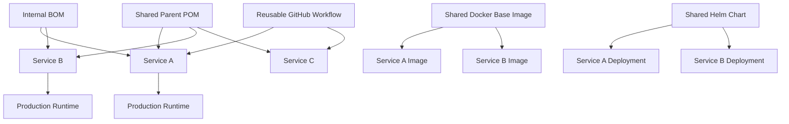
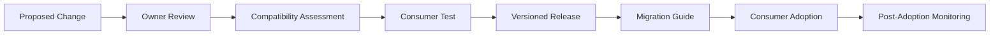
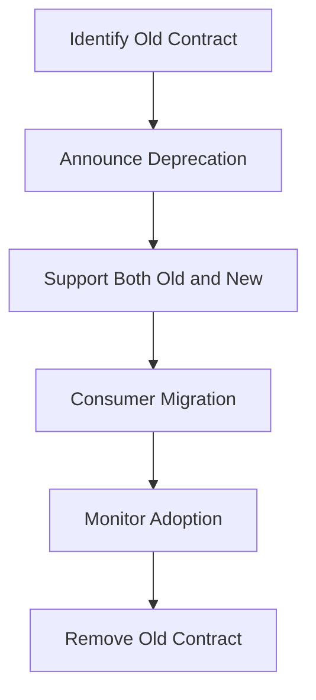

# Part 051 — Internal Library and Shared Tooling Governance

## 1. Core idea

Shared tooling is production infrastructure.

Internal library, shared Maven module, parent POM, BOM, shared Bash script, reusable GitHub workflow, Docker base image, Helm chart, CI template, and deployment helper are not "small convenience utilities". In enterprise systems, they are **cross-service contracts**.

A bad change in one shared artifact can break many repositories, many services, many pipelines, many teams, or many deployments.

Senior backend engineer harus bisa membedakan:

- tooling lokal milik satu repo,
- helper script kecil yang low-risk,
- shared contract yang dipakai banyak service,
- platform artifact yang menjadi bagian dari release/deployment path,
- governance object yang harus punya owner, versioning, compatibility policy, dan deprecation path.

Dalam konteks Java/JAX-RS enterprise, shared tooling biasanya muncul sebagai:

- shared Maven parent POM,
- internal BOM,
- internal Java library,
- shared validation/security/observability module,
- shared CI workflow,
- shared Docker base image,
- shared Helm chart atau deployment template,
- shared Makefile/Taskfile/script,
- shared GitHub Action,
- shared code generation tool,
- shared release helper,
- shared dependency scanning configuration.

Masalahnya: shared tooling memberi leverage besar, tetapi juga blast radius besar.

---

## 2. Why shared tooling exists

Shared tooling biasanya lahir karena beberapa alasan yang valid:

1. Mengurangi duplikasi antar service.
2. Menstandarkan build/test/release workflow.
3. Menjaga security baseline.
4. Menjaga observability baseline.
5. Menyederhanakan onboarding.
6. Mengurangi konfigurasi manual.
7. Menyediakan reusable integration pattern.
8. Menjaga dependency alignment.
9. Mempercepat platform adoption.
10. Memusatkan perbaikan bug di satu tempat.

Contoh:

- Semua service Java menggunakan parent POM yang sama agar compiler plugin, surefire, failsafe, jacoco, enforcer, dan dependency scanning konsisten.
- Semua service menggunakan reusable workflow agar CI punya langkah build/test/scan/publish yang sama.
- Semua service menggunakan base image internal agar OS patching, certificate, timezone, non-root user, dan runtime defaults dikontrol platform.
- Semua service menggunakan Helm chart standar agar readiness/liveness, resource limit, environment injection, and deployment strategy konsisten.

Ini bagus jika governance-nya kuat.

Ini berbahaya jika shared artifact berubah tanpa compatibility discipline.

---

## 3. Shared tooling as a dependency graph

Shared tooling membentuk dependency graph lintas repo.



Semakin banyak consumer, semakin penting:

- semantic versioning,
- changelog,
- release note,
- compatibility testing,
- migration guide,
- rollback strategy,
- ownership clarity,
- adoption tracking.

A shared artifact tanpa consumer map adalah hidden systemic risk.

---

## 4. Shared artifact categories

### 4.1 Internal Java library

Internal Java library biasanya berisi reusable logic seperti:

- domain utility,
- client wrapper,
- error model,
- security helper,
- validation helper,
- audit helper,
- observability helper,
- serialization/deserialization config,
- integration adapter,
- test utility.

Risiko utamanya:

- API breaking change,
- transitive dependency drift,
- binary incompatibility,
- behavior change tanpa version bump jelas,
- dependency conflict dengan service consumer,
- excessive abstraction,
- leaking internal assumptions,
- hidden runtime configuration,
- logging/security behavior berubah diam-diam.

Review internal library tidak cukup hanya memastikan code compile. Harus dicek consumer impact.

### 4.2 Shared Maven module

Shared Maven module bisa berupa module dalam monorepo atau artifact terpisah.

Hal yang perlu dijaga:

- module boundary,
- artifact coordinates,
- dependency scope,
- versioning,
- dependencyManagement,
- pluginManagement,
- release process,
- API compatibility,
- test coverage,
- consumer migration.

Anti-pattern umum:

- shared module menjadi dumping ground,
- module terlalu banyak dependency,
- module menarik framework berat ke semua consumer,
- module mengandung behavior runtime yang sulit dimatikan,
- module berubah sering tanpa compatibility guarantee.

### 4.3 Shared parent POM

Parent POM biasanya mengontrol:

- Java version,
- plugin version,
- compiler setting,
- surefire/failsafe config,
- enforcer rules,
- dependency/plugin management,
- build profiles,
- quality gates,
- repository config,
- release config.

Parent POM sangat powerful karena bisa mengubah build behavior banyak repo.

Failure mode:

- plugin update membuat CI gagal di banyak repo,
- enforcer rule baru memblokir build lama,
- Java version berubah tanpa migration path,
- profile activation menyebabkan local/CI mismatch,
- repository config berubah dan artifact tidak resolve,
- dependencyManagement override mengubah transitive runtime behavior.

### 4.4 Internal BOM

BOM mengontrol version alignment dependency.

BOM berguna untuk:

- mengunci Jakarta/Jersey ecosystem,
- mengunci testing stack,
- mengunci observability stack,
- mengunci logging stack,
- menghindari transitive drift,
- membuat upgrade wave lebih terkendali.

BOM risk:

- upgrade dependency memicu runtime regression,
- version alignment tidak cocok dengan service tertentu,
- CVE fix menyebabkan compatibility issue,
- BOM terlalu besar dan mengontrol dependency yang tidak relevan,
- consumer tidak tahu dependency mana yang managed.

### 4.5 Shared GitHub workflow

Reusable workflow bisa mengontrol:

- checkout,
- setup Java,
- Maven cache,
- build,
- test,
- scan,
- package,
- publish artifact,
- Docker image build,
- deployment trigger.

Risiko:

- permission terlalu luas,
- secret exposure,
- action dependency tidak dipin,
- cache key salah,
- build command tidak cocok semua service,
- workflow update memecah banyak repo,
- environment gate bypass,
- output artifact berubah tanpa notice.

### 4.6 Shared Docker base image

Base image mengontrol runtime substrate:

- OS distribution,
- JDK/JRE version,
- CA certificates,
- timezone data,
- non-root user,
- shell/tooling availability,
- package patch level,
- filesystem layout,
- entrypoint pattern.

Risiko:

- JDK patch mengubah TLS/default behavior,
- certificate bundle berubah,
- user/group berubah dan file permission pecah,
- package removed sehingga debug script gagal,
- image digest berubah tanpa traceability,
- CVE patch membuat behavior berbeda.

### 4.7 Shared Helm chart or deployment template

Helm chart atau template deployment mengontrol:

- deployment metadata,
- labels/annotations,
- readiness/liveness/startup probe,
- resource request/limit,
- env injection,
- secret/config mount,
- service account,
- network policy,
- ingress/service,
- rollout strategy,
- pod security context,
- sidecar/init container,
- observability annotations.

Risiko:

- readiness probe berubah dan rollout gagal,
- resource default salah,
- secret mount path berubah,
- pod security context memblokir write directory,
- deployment strategy berubah dan downtime muncul,
- label berubah dan monitoring/routing pecah.

### 4.8 Shared scripts

Shared scripts bisa membantu setup, build, test, release, deploy, migrate, debug.

Risiko:

- destructive default,
- tidak idempotent,
- tidak ada dry-run,
- hardcoded environment,
- silent failure,
- secret leak,
- shell portability issue,
- command berbeda dari CI,
- tidak ada owner.

---

## 5. Governance model

Shared tooling butuh governance yang eksplisit.

Minimum governance model:



Governance bukan berarti birokrasi berlebihan. Governance berarti perubahan dengan blast radius besar tidak dilakukan secara gelap.

Pertanyaan governance utama:

- Siapa owner artifact ini?
- Siapa consumer-nya?
- Bagaimana versioning-nya?
- Bagaimana breaking change didefinisikan?
- Bagaimana consumer diberi tahu?
- Bagaimana migration dilakukan?
- Bagaimana rollback dilakukan?
- Bagaimana compatibility diuji?
- Bagaimana security patch diprioritaskan?
- Bagaimana deprecation diumumkan?

---

## 6. Ownership model

Shared artifact tanpa owner akan membusuk.

Owner bertanggung jawab atas:

- roadmap,
- release cadence,
- compatibility policy,
- review quality,
- issue triage,
- security response,
- documentation,
- migration support,
- consumer communication,
- deprecation.

Ownership bisa berupa:

- platform team,
- build/release engineering team,
- backend foundation team,
- SRE/DevOps team,
- security team,
- domain team tertentu,
- working group lintas tim.

Yang penting bukan namanya, tetapi clarity-nya.

Bad ownership signal:

- semua orang bisa merge,
- tidak ada CODEOWNERS,
- issue tidak di-triage,
- breaking change tidak ada reviewer khusus,
- release tidak punya note,
- consumer bertanya di chat karena docs tidak jelas,
- orang takut upgrade karena tidak tahu impact.

---

## 7. Versioning discipline

Shared tooling harus versioned.

Bentuk versioning tergantung artifact:

| Artifact | Versioning mechanism |
|---|---|
| Maven library | Maven artifact version |
| Parent POM | Maven artifact version |
| BOM | Maven artifact version |
| GitHub workflow | Git ref/tag/SHA |
| GitHub Action | Tag/SHA |
| Docker base image | tag + digest |
| Helm chart | chart version + app version |
| Script package | release tag / package version |
| Template repository | release tag / template version |

Versioning principle:

- consumer harus bisa memilih kapan upgrade,
- release harus traceable,
- breaking change harus visible,
- rollback harus mungkin,
- artifact immutable lebih aman daripada mutable tag.

Mutable reference seperti `main`, `latest`, atau floating tag bisa praktis tetapi berbahaya untuk production path.

Untuk shared workflow/action, pinning ke tag lebih baik daripada branch. Untuk high-security path, SHA pinning lebih kuat.

Untuk container image, tag saja tidak cukup jika tag mutable. Digest memberi traceability lebih kuat.

---

## 8. Compatibility policy

Compatibility harus didefinisikan per artifact.

### 8.1 Source compatibility

Source compatibility berarti consumer source code tetap compile tanpa perubahan.

Contoh breaking source change:

```java
// before
client.quote(id);

// after
client.quote(id, context);
```

### 8.2 Binary compatibility

Binary compatibility berarti artifact compiled lama tetap bisa berjalan dengan library baru.

Breaking binary change bisa muncul karena:

- method removed,
- method signature changed,
- class moved,
- field removed,
- return type incompatible,
- dependency version menyebabkan linkage error.

### 8.3 Behavioral compatibility

Behavioral compatibility sering paling berbahaya karena compile tetap sukses.

Contoh:

- retry default berubah,
- timeout default berubah,
- error mapping berubah,
- logging field berubah,
- serialization format berubah,
- header propagation berubah,
- validation rule berubah,
- default profile berubah.

### 8.4 Operational compatibility

Operational compatibility berarti deployment/runtime tetap sesuai ekspektasi.

Contoh breaking operational change:

- base image user berubah dari root ke non-root tanpa file permission migration,
- Helm chart mengubah mount path,
- workflow mengubah artifact name,
- parent POM mengubah Java target version,
- script mengubah default environment.

Senior review harus mengecek semua jenis compatibility, bukan hanya compile.

---

## 9. Deprecation lifecycle

Deprecation yang baik memberi waktu kepada consumer.



Lifecycle yang sehat:

1. Tandai API/tooling lama sebagai deprecated.
2. Jelaskan alasan deprecation.
3. Berikan replacement.
4. Berikan migration guide.
5. Berikan timeline.
6. Track adoption.
7. Hapus setelah consumer siap.

Bad deprecation:

- langsung remove,
- tidak ada replacement,
- tidak ada migration guide,
- timeline tidak jelas,
- consumer tidak diketahui,
- breaking change disamarkan sebagai refactor.

---

## 10. Consumer migration discipline

Shared tooling change belum selesai saat artifact dirilis. Selesai ketika consumer berhasil migrate.

Migration plan harus mencakup:

- affected consumers,
- required code/config changes,
- compatibility notes,
- test command,
- rollback path,
- expected warnings/errors,
- owner/support channel,
- deadline jika ada.

Contoh migration guide:

```markdown
# Migration: shared-parent-pom 2.x to 3.x

## Why
Java 17 baseline, updated surefire/failsafe, stricter dependency convergence.

## Required changes
- Use JDK 17 locally and in CI.
- Remove explicit surefire plugin version from child POM.
- Fix dependency convergence failures reported by Maven Enforcer.

## Validation
mvn -U clean verify
mvn dependency:tree

## Rollback
Revert parent version to 2.x if CI fails before merge.
```

Migration guide harus cukup konkret agar consumer tidak menebak.

---

## 11. Release notes for shared tooling

Release note shared tooling harus lebih jelas daripada release note aplikasi biasa karena consumer perlu memahami impact.

Minimum fields:

- version,
- date,
- owner,
- summary,
- breaking changes,
- security fixes,
- dependency upgrades,
- behavior changes,
- migration steps,
- known issues,
- rollback note.

Contoh:

```markdown
## shared-ci-workflow v1.8.0

### Changed
- Maven cache key now includes Java version and pom hash.
- Dependency scan runs before Docker build.

### Security
- Reduced default GITHUB_TOKEN permission to read-only.

### Migration
- Repositories that publish packages must explicitly request packages:write.

### Rollback
- Pin workflow to v1.7.2 if package publishing fails.
```

Release note yang baik mencegah surprise failure.

---

## 12. Testing shared tooling

Shared tooling perlu test yang sesuai bentuk artifact.

### 12.1 Library test

- unit test,
- integration test,
- compatibility test,
- contract test,
- dependency convergence check,
- serialization compatibility test,
- consumer sample test.

### 12.2 Parent POM/BOM test

- sample project build,
- multi-module sample build,
- dependency tree validation,
- plugin execution validation,
- Java version validation,
- CI dry-run.

### 12.3 Shared workflow test

- test repository,
- matrix service type,
- permission test,
- secret handling test,
- artifact output test,
- failure path test.

### 12.4 Base image test

- Java starts,
- non-root user works,
- certificate trust works,
- timezone works,
- file permission works,
- vulnerability scan passes,
- smoke test runs.

### 12.5 Helm chart test

- template rendering,
- values validation,
- dry-run apply,
- schema validation,
- deployment smoke test,
- readiness/liveness probe validation,
- rollback validation.

Shared tooling tanpa test sering hanya diuji oleh consumer di waktu terburuk: ketika mereka merge, release, atau deploy.

---

## 13. Change classification

Tidak semua perubahan shared tooling sama risikonya.

| Change type | Risk | Example |
|---|---:|---|
| Documentation only | Low | clarify setup command |
| Additive feature | Medium | new optional workflow input |
| Default behavior change | High | timeout default changed |
| Version baseline change | High | Java 11 to Java 17 |
| Security permission change | High | token permission reduced |
| Deployment template change | High | readiness probe changed |
| Breaking API removal | Critical | remove public method |
| Mutable release reference | Critical | retag base image |

Rule praktis:

- additive optional change biasanya aman,
- default behavior change harus dicurigai,
- removal harus melalui deprecation,
- baseline upgrade harus punya migration plan,
- permission/security change harus diuji pada consumer nyata,
- deployment/runtime change harus punya rollback path.

---

## 14. PR review for shared tooling

Review shared tooling harus menanyakan impact lintas consumer.

Checklist inti:

- Apa artifact yang berubah?
- Siapa consumer-nya?
- Apakah change additive atau breaking?
- Apakah default behavior berubah?
- Apakah version/reference immutable?
- Apakah ada migration guide?
- Apakah ada release note?
- Apakah test consumer tersedia?
- Apakah rollback jelas?
- Apakah security permission berubah?
- Apakah observability berubah?
- Apakah failure mode sudah dijelaskan?

Contoh comment review yang baik:

```markdown
This changes the default JVM base image tag used by all services consuming the template.
Before merging, can we confirm:

1. which services consume this template,
2. whether the tag is immutable or digest-pinned,
3. whether non-root file permissions were tested,
4. what rollback path consumers should use if startup fails?
```

Review seperti ini tajam karena menyasar blast radius, bukan preferensi personal.

---

## 15. Shared Maven module review checklist

Saat mereview shared Maven module atau library:

- Apakah public API berubah?
- Apakah dependency baru diperlukan semua consumer?
- Apakah dependency scope benar?
- Apakah ada transitive dependency berisiko?
- Apakah dependency version managed oleh BOM?
- Apakah ada binary compatibility concern?
- Apakah serialization format berubah?
- Apakah exception type berubah?
- Apakah logging behavior berubah?
- Apakah security behavior berubah?
- Apakah timeout/retry/default berubah?
- Apakah tests mencakup compatibility?
- Apakah release note menyebut migration?

Command yang berguna:

```bash
mvn -q dependency:tree
mvn -q dependency:analyze
mvn -q enforcer:enforce
mvn clean verify
```

Untuk consumer sample:

```bash
mvn -U -Dshared.version=<new-version> clean verify
```

---

## 16. Shared GitHub workflow review checklist

Untuk reusable workflow:

- Trigger apa yang berubah?
- Input/secret apa yang berubah?
- Permission apa yang berubah?
- Apakah `GITHUB_TOKEN` minimal?
- Apakah third-party action dipin?
- Apakah cache key aman?
- Apakah artifact name/path berubah?
- Apakah output workflow berubah?
- Apakah matrix behavior berubah?
- Apakah deployment gate berubah?
- Apakah workflow bisa digunakan oleh repo lama?
- Apakah failure message actionable?

Contoh risiko:

```yaml
permissions: write-all
```

Ini red flag. Lebih baik eksplisit:

```yaml
permissions:
  contents: read
  packages: write
  id-token: write
```

Tetap harus diverifikasi sesuai kebutuhan workflow internal.

---

## 17. Shared Docker base image review checklist

Untuk base image:

- Apa base image sebelumnya dan baru?
- Apakah digest dipin?
- Apakah JDK/JRE version berubah?
- Apakah OS package berubah?
- Apakah CA certificate berubah?
- Apakah user/group berubah?
- Apakah filesystem permission berubah?
- Apakah timezone/locale berubah?
- Apakah shell/tool debugging tersedia atau sengaja distroless?
- Apakah vulnerability scan membaik?
- Apakah startup command consumer tetap valid?
- Apakah image size berubah signifikan?
- Apakah rollback image tersedia?

Validasi minimal:

```bash
docker build -t service:test .
docker run --rm service:test java -version
docker run --rm service:test id
docker run --rm service:test sh -c 'ls -la /app || true'
```

Jika image distroless, command shell mungkin tidak tersedia. Itu bukan bug jika memang policy-nya begitu, tetapi debugging strategy harus jelas.

---

## 18. Shared Helm chart review checklist

Untuk chart/template deployment:

- Apakah rendered manifest berubah seperti yang diharapkan?
- Apakah label/selector berubah?
- Apakah readiness/liveness/startup probe berubah?
- Apakah resource request/limit berubah?
- Apakah secret/config mount berubah?
- Apakah service account berubah?
- Apakah security context berubah?
- Apakah ingress/service berubah?
- Apakah deployment strategy berubah?
- Apakah annotations observability berubah?
- Apakah GitOps diff aman?
- Apakah rollback chart version tersedia?

Command review:

```bash
helm template ./chart -f values.yaml > rendered.yaml
diff -u old-rendered.yaml rendered.yaml
```

Untuk GitOps environment, jangan langsung apply manual kecuali memang runbook memperbolehkan. Render/diff dulu.

---

## 19. Shared script review checklist

Untuk script yang dipakai banyak repo:

- Apakah script punya shebang benar?
- Apakah shell assumption jelas?
- Apakah variable di-quote?
- Apakah destructive action punya guard?
- Apakah ada dry-run?
- Apakah idempotent?
- Apakah output log jelas?
- Apakah secret bisa bocor ke log/history?
- Apakah error handling jelas?
- Apakah exit code benar?
- Apakah compatible dengan Linux/macOS/CI runner?
- Apakah command dependency dicek di awal?
- Apakah help/usage tersedia?

Pattern yang sehat:

```bash
#!/usr/bin/env bash
set -Eeuo pipefail

usage() {
  cat <<'EOF'
Usage: ./release-helper.sh --version <version> [--dry-run]
EOF
}
```

Shared script harus memprioritaskan clarity daripada cleverness.

---

## 20. Consumer impact analysis

Sebelum merge shared tooling change, buat consumer impact analysis.

Minimal format:

```markdown
## Consumer Impact

### Consumers
- service-a
- service-b
- service-c

### Change type
Default behavior change.

### Expected impact
Services using the default Maven build command will now run dependency convergence checks.

### Required consumer action
Fix dependency conflicts or temporarily pin workflow to previous version.

### Validation
Tested against service-a and service-b sample branches.

### Rollback
Pin workflow to v1.4.3.
```

Jika tidak tahu consumer-nya, itu sendiri adalah risiko governance.

---

## 21. Rollout strategies

Shared tooling rollout bisa dilakukan beberapa cara.

### 21.1 Opt-in rollout

Consumer memilih upgrade.

Cocok untuk:

- parent POM,
- BOM,
- library,
- workflow tagged version,
- chart version.

Kelebihan:

- safer,
- consumer punya waktu test,
- rollback mudah.

Kekurangan:

- adoption lambat,
- versi tersebar,
- security fix bisa lama menyebar.

### 21.2 Central forced rollout

Perubahan otomatis berlaku untuk consumer.

Cocok hanya jika:

- compatibility sangat tinggi,
- change low-risk,
- emergency security patch,
- consumer map jelas,
- monitoring kuat,
- rollback cepat.

Risiko:

- break banyak repo sekaligus,
- consumer tidak siap,
- incident lintas tim.

### 21.3 Wave rollout

Upgrade bertahap per kelompok consumer.

Cocok untuk:

- Java baseline upgrade,
- parent POM major upgrade,
- base image migration,
- Helm chart major change,
- workflow permission tightening.

Wave rollout biasanya paling sehat untuk enterprise.

---

## 22. Security governance

Shared tooling sering membawa security baseline.

Hal yang perlu dikontrol:

- default token permission,
- OIDC trust boundary,
- secret usage,
- dependency scanning,
- base image CVE,
- action pinning,
- artifact integrity,
- SBOM generation,
- license scanning,
- container user/security context,
- script secret handling.

Security improvement tetap bisa breaking.

Contoh:

- Mengurangi token permission bisa membuat publish step gagal.
- Mengaktifkan enforcer rule bisa memblokir build lama.
- Mengubah base image ke non-root bisa membuat app gagal menulis file.
- Mengaktifkan secret scanning push protection bisa mengubah developer workflow.

Security change perlu migration communication, bukan hanya merge.

---

## 23. Observability governance

Shared tooling juga mengontrol observability baseline:

- logging format,
- correlation ID propagation,
- metrics labels,
- tracing config,
- health endpoints,
- deployment annotations,
- dashboard naming,
- alert labels.

Breaking observability change bisa membuat incident response lebih buruk.

Contoh:

- label metric berubah sehingga alert tidak fire,
- log field berubah sehingga query runbook tidak bekerja,
- trace propagation header berubah,
- deployment annotation hilang dari dashboard,
- health check path berubah.

Review harus menanyakan:

- apakah dashboard/alert/runbook terdampak,
- apakah query observability perlu diubah,
- apakah incident response tetap bisa mencari evidence.

---

## 24. Failure modes

Shared tooling failure mode utama:

1. Many services fail to build.
2. Many services fail in CI.
3. Runtime starts but behavior changes.
4. Deployment fails because manifest changed.
5. Security permission blocks pipeline.
6. Secret leaks through shared script/workflow.
7. Dependency upgrade causes classpath conflict.
8. Base image update changes TLS/cert behavior.
9. Consumer cannot rollback because reference is mutable.
10. Documentation missing, so teams invent local workaround.

Failure mode paling mahal biasanya bukan build failure. Build failure terlihat cepat. Yang lebih berbahaya adalah behavior change yang lolos ke runtime.

---

## 25. Debugging shared tooling regressions

Saat banyak consumer tiba-tiba gagal, tanya:

- Artifact shared apa yang baru berubah?
- Apakah failure muncul setelah version bump atau floating reference update?
- Apakah semua consumer gagal atau hanya subset?
- Apa common denominator-nya?
- Apakah failure build, test, scan, package, deploy, atau runtime?
- Apakah rollback reference tersedia?
- Apakah ada changelog/release note?
- Apakah issue terkait permission, dependency, image, atau chart?

Command investigation:

```bash
git log --oneline --decorate -- path/to/shared/workflow.yml
git diff <old>..<new> -- path/to/shared/workflow.yml
mvn dependency:tree
helm template ./chart -f values.yaml
docker image inspect internal-base:tag
```

Untuk GitHub workflow consumer:

```bash
gh run list --workflow <workflow-name>
gh run view <run-id> --log
```

Tetap verifikasi apakah `gh` CLI tersedia dan diizinkan di environment internal.

---

## 26. Internal verification checklist

Untuk konteks CSG/team, jangan mengarang detail internal. Verifikasi:

### Artifact inventory

- Shared Maven parent POM apa yang digunakan?
- BOM internal apa yang digunakan?
- Internal Java library apa yang umum dipakai?
- Shared GitHub workflow apa yang dipakai?
- Shared Docker base image apa yang dipakai?
- Shared Helm chart/deployment template apa yang dipakai?
- Shared script/task runner apa yang dipakai?

### Ownership

- Siapa owner tiap shared artifact?
- Apakah CODEOWNERS jelas?
- Apakah ada support channel?
- Apakah ada release cadence?

### Versioning

- Apakah artifact dipin ke version/tag/digest?
- Apakah ada floating reference seperti `main` atau `latest`?
- Apakah rollback version tersedia?

### Compatibility

- Apakah ada compatibility policy?
- Apakah breaking change didefinisikan?
- Apakah migration guide tersedia?

### Consumer map

- Service mana yang memakai artifact ini?
- Apakah ada dashboard/adoption tracker?
- Apakah ada test consumer?

### Release process

- Bagaimana shared artifact dirilis?
- Apakah release note wajib?
- Apakah security fix punya jalur khusus?

### Incident history

- Pernah ada build break lintas repo?
- Pernah ada base image regression?
- Pernah ada shared workflow permission issue?
- Pernah ada dependency/BOM upgrade incident?

---

## 27. Practical senior engineer stance

Ketika melihat shared tooling change, jangan langsung bertanya "apakah code-nya benar?".

Tanya dulu:

- Ini dipakai siapa?
- Apa kontraknya?
- Apa yang berubah untuk consumer?
- Apakah consumer bisa memilih waktu upgrade?
- Apa rollback-nya?
- Bagaimana kita tahu ini aman?

Senior engineer yang baik bukan anti-shared-tooling. Justru sebaliknya: shared tooling yang sehat adalah accelerator besar.

Tetapi shared tooling harus diperlakukan sebagai product internal, bukan script liar.

---

## 28. Anti-patterns

Anti-pattern yang perlu dihindari:

- shared library menjadi dumping ground,
- parent POM mengandung terlalu banyak behavior tersembunyi,
- workflow dipanggil dari `main` tanpa pinning,
- Docker image memakai `latest`,
- Helm chart major change tanpa migration guide,
- script shared tanpa owner,
- breaking change diberi label refactor,
- consumer tidak diketahui,
- release note kosong,
- security permission terlalu luas karena "biar jalan",
- rollback tidak mungkin karena artifact mutable,
- dokumentasi upgrade hanya ada di chat.

---

## 29. PR checklist

Gunakan checklist ini saat mereview shared tooling:

- [ ] Artifact yang berubah jelas.
- [ ] Owner jelas.
- [ ] Consumer impact dijelaskan.
- [ ] Change type diklasifikasikan.
- [ ] Breaking change ditandai.
- [ ] Version/reference immutable jika production path.
- [ ] Test terhadap sample consumer dilakukan.
- [ ] Security permission minimal.
- [ ] Dependency impact dicek.
- [ ] Runtime/deployment impact dicek.
- [ ] Observability impact dicek.
- [ ] Migration guide tersedia jika perlu.
- [ ] Release note tersedia.
- [ ] Rollback path jelas.
- [ ] Internal process CSG/team diverifikasi, bukan diasumsikan.

---

## 30. Mastery checkpoint

Setelah memahami part ini, kamu harus mampu:

- membedakan local helper dan shared platform contract,
- membaca shared tooling sebagai dependency graph,
- menilai blast radius perubahan shared artifact,
- mereview Maven parent/BOM/shared library dengan compatibility lens,
- mereview reusable workflow dengan security/permission lens,
- mereview base image dengan runtime/operations lens,
- mereview Helm chart dengan deployment safety lens,
- meminta migration guide dan rollback path yang konkret,
- menghindari perubahan shared tooling yang diam-diam memecah banyak consumer.

Prinsip akhirnya:

> Shared tooling is leverage. Governance makes that leverage safe.
