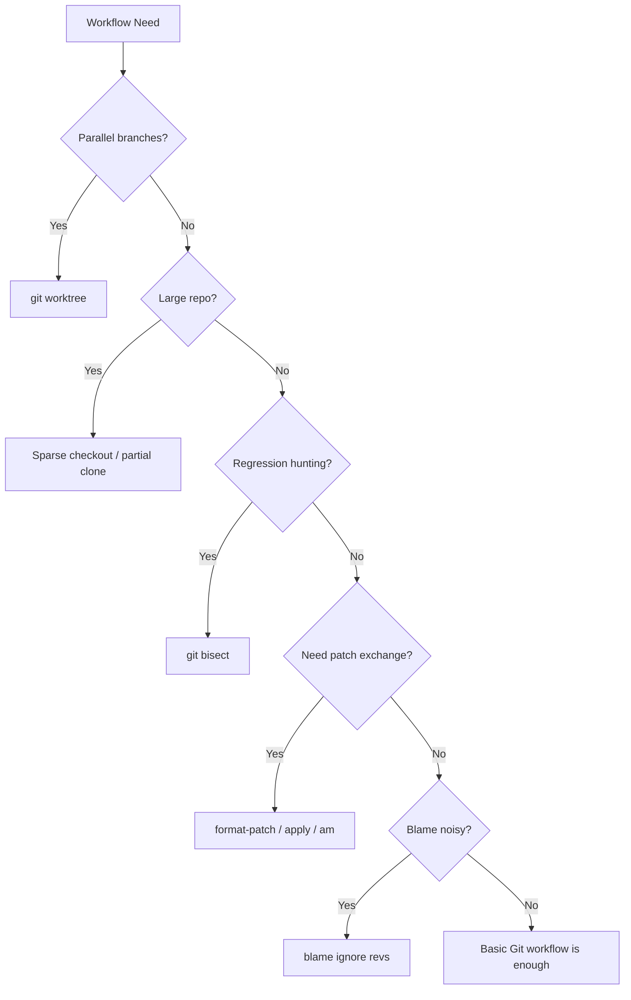

# Part 052 — Advanced Git Workflows

## 1. Core idea

Advanced Git workflow is not about using obscure commands.

Tujuannya adalah mengelola kompleksitas repository besar, parallel work, hotfix, backport, regression hunting, patch exchange, monorepo navigation, large binary assets, and history forensics dengan aman.

Git advanced commands berguna ketika workflow dasar mulai tidak cukup:

- perlu kerja di beberapa branch paralel,
- repo sangat besar,
- hanya perlu sebagian directory,
- perlu mencari commit penyebab bug secara otomatis,
- perlu mengirim patch tanpa push branch,
- perlu memisahkan dependency external,
- perlu mengabaikan commit formatting saat blame,
- perlu menangani large files,
- perlu backport/hotfix dengan presisi,
- perlu menjaga local workspace tetap bersih.

Senior engineer harus memahami fitur advanced Git sebagai **surgical tools**. Gunakan ketika ada alasan jelas. Jangan jadikan workflow kompleks sebagai default untuk semua orang.

---

## 2. Advanced Git decision model



Rule praktis:

- gunakan basic Git jika cukup,
- gunakan advanced Git untuk mengurangi risk/latency,
- dokumentasikan command advanced jika digunakan dalam team workflow,
- jangan memaksa semua developer memakai workflow advanced tanpa kebutuhan nyata.

---

## 3. Git worktree

`git worktree` memungkinkan satu repository memiliki beberapa working tree pada branch berbeda.

Ini berguna ketika kamu perlu:

- mengerjakan feature branch,
- sambil review PR lain,
- sambil membuat hotfix,
- tanpa stash bolak-balik,
- tanpa clone repository berkali-kali.

Contoh:

```bash
# dari repo utama
git worktree add ../repo-hotfix hotfix/urgent-release

git worktree add ../repo-review main
```

List worktree:

```bash
git worktree list
```

Remove worktree:

```bash
git worktree remove ../repo-hotfix
```

Prune metadata yang stale:

```bash
git worktree prune
```

Mental model:

- object database tetap shared,
- working tree berbeda,
- branch yang sedang dipakai di satu worktree tidak bisa checkout di worktree lain,
- setiap worktree punya index/workspace sendiri.

---

## 4. Worktree use cases for senior backend work

### 4.1 Hotfix tanpa mengganggu feature work

```bash
git worktree add ../service-hotfix release/2026.07
cd ../service-hotfix
git switch -c hotfix/fix-null-order-status
```

Kamu bisa memperbaiki hotfix tanpa stash perubahan di feature branch utama.

### 4.2 PR review clean workspace

```bash
git worktree add ../service-review main
cd ../service-review
gh pr checkout 123
mvn test
```

Workspace review bersih, tidak bercampur dengan perubahan lokal.

### 4.3 Compare branch behavior

Satu worktree menjalankan branch lama, satu branch baru.

```bash
# terminal 1
cd ../service-main
mvn test

# terminal 2
cd ../service-feature
mvn test
```

Berguna untuk debugging regression.

---

## 5. Worktree failure modes

Failure mode:

- lupa worktree sedang di branch apa,
- menghapus directory worktree manual tanpa `git worktree remove`,
- mencoba checkout branch yang sedang dipakai worktree lain,
- IDE indexing bingung karena banyak directory repo,
- environment file lokal berbeda antar worktree,
- port conflict saat menjalankan service dari dua worktree.

Checklist:

```bash
git worktree list
git status
git branch --show-current
```

Jangan menjalankan destructive command sebelum memastikan directory dan branch benar.

---

## 6. Sparse checkout

Sparse checkout memungkinkan working tree hanya memuat subset path tertentu.

Berguna untuk:

- monorepo besar,
- hanya bekerja pada satu service/module,
- mengurangi noise file,
- mempercepat checkout/navigation.

Contoh:

```bash
git clone --sparse git@github.com:org/monorepo.git
cd monorepo
git sparse-checkout set services/quote-order libs/common-build
```

Menambah path:

```bash
git sparse-checkout add tools/ci
```

Melihat config:

```bash
git sparse-checkout list
```

Kembali full checkout:

```bash
git sparse-checkout disable
```

Sparse checkout bukan security boundary. Ini hanya working tree filter.

---

## 7. Sparse checkout risks

Risiko sparse checkout:

- build butuh file yang tidak ada di sparse set,
- script mengasumsikan repo lengkap,
- IDE tidak melihat module dependency,
- grep/search kehilangan context,
- generated file path tidak muncul,
- CI tidak sama dengan local sparse environment.

Gunakan sparse checkout jika repo memang besar dan module boundary jelas.

Untuk Maven multi-module, pastikan root POM dan module dependency yang dibutuhkan ikut tersedia.

Contoh masalah:

```bash
mvn -pl services/quote-order -am test
```

Command ini bisa gagal jika parent POM, shared module, atau build plugin config tidak masuk sparse set.

---

## 8. Partial clone

Partial clone mengurangi object yang didownload dari remote.

Contoh:

```bash
git clone --filter=blob:none git@github.com:org/large-repo.git
```

Artinya blob file tidak langsung di-download semua; Git mengambil blob saat diperlukan.

Berguna untuk:

- repo sangat besar,
- koneksi terbatas,
- CI optimization tertentu,
- monorepo dengan history besar.

Risiko:

- command tertentu bisa memicu lazy fetch besar,
- tooling lama mungkin tidak kompatibel,
- offline workflow terganggu,
- debugging object/history bisa membingungkan.

Partial clone sering dikombinasikan dengan sparse checkout.

```bash
git clone --filter=blob:none --sparse git@github.com:org/monorepo.git
cd monorepo
git sparse-checkout set services/order
```

---

## 9. Shallow clone

Shallow clone mengambil history terbatas.

```bash
git clone --depth 1 git@github.com:org/repo.git
```

Di CI, ini mempercepat checkout.

Namun shallow clone membatasi:

- `git blame`,
- `git bisect`,
- tag resolution,
- changelog generation,
- merge-base calculation,
- versioning tool yang butuh history.

Dalam GitHub Actions, `fetch-depth: 1` sering default. Untuk release/changelog/tag-based versioning, mungkin perlu:

```yaml
- uses: actions/checkout@v4
  with:
    fetch-depth: 0
```

Internal verification: cek apakah pipeline membutuhkan full history untuk versioning, release notes, Sonar blame, atau changelog.

---

## 10. Git submodule

Submodule memasukkan repository lain sebagai pointer commit di repo utama.

Contoh:

```bash
git submodule add git@github.com:org/shared-contracts.git contracts
git submodule update --init --recursive
```

Mental model:

- repo utama menyimpan pointer commit submodule,
- submodule punya Git repository sendiri,
- update submodule berarti mengubah pointer commit di parent repo.

Use case:

- external contract repository,
- shared test data,
- dependency source yang harus pin ke commit tertentu,
- vendor code dengan lifecycle terpisah.

Risiko:

- developer lupa init/update,
- CI tidak checkout submodule,
- pointer submodule detached,
- permission remote berbeda,
- nested submodule kompleks,
- PR review harus cek repo parent dan submodule.

Command umum:

```bash
git submodule status
git submodule update --init --recursive
git submodule update --remote --merge
```

Submodule memberi pinning kuat, tetapi usability cost tinggi.

---

## 11. Git subtree

Subtree memasukkan repository lain ke subdirectory tanpa membuat repo nested.

Use case:

- vendor source,
- shared tool yang ingin disalin dengan history,
- sinkronisasi antar repo yang tidak ingin pakai submodule.

Contoh konsep:

```bash
git subtree add --prefix=vendor/shared-tool git@github.com:org/shared-tool.git main --squash
```

Update:

```bash
git subtree pull --prefix=vendor/shared-tool git@github.com:org/shared-tool.git main --squash
```

Kelebihan dibanding submodule:

- clone biasa langsung dapat file,
- tidak perlu init submodule,
- CI lebih sederhana.

Kekurangan:

- history bisa berat,
- update flow kurang familiar,
- kontribusi balik ke upstream lebih kompleks,
- conflict subtree bisa sulit.

Untuk enterprise team, subtree harus didokumentasikan jelas jika digunakan.

---

## 12. Submodule vs subtree decision

| Dimension | Submodule | Subtree |
|---|---|---|
| Pin exact external commit | Strong | Possible but embedded |
| Developer simplicity | Lower | Higher |
| CI simplicity | Lower | Higher |
| Repo size | Smaller parent | Larger parent |
| Upstream sync | Explicit | Explicit but less common |
| Accidental drift risk | Medium | Medium |
| Best for | Separate lifecycle dependency | Vendored/shared code copy |

Rule praktis:

- Jika dependency harus tetap repo terpisah dan dipin kuat, submodule masuk akal.
- Jika ingin file tersedia langsung tanpa nested Git, subtree bisa lebih nyaman.
- Jika hanya butuh Java dependency, Maven artifact biasanya lebih baik daripada submodule/subtree.

Untuk Java/JAX-RS enterprise, jangan gunakan submodule/subtree untuk menggantikan dependency management tanpa alasan kuat.

---

## 13. Git LFS

Git LFS menangani large binary files dengan menyimpan pointer di Git dan konten besar di LFS storage.

Use case:

- large test fixtures,
- binary sample payload,
- generated artifacts yang perlu versioned,
- media/data besar untuk test.

Setup:

```bash
git lfs install
git lfs track "*.zip"
git add .gitattributes
git add sample.zip
git commit -m "Add large test fixture"
```

Risiko:

- developer belum install Git LFS,
- CI tidak fetch LFS objects,
- storage/quota issue,
- clone lambat,
- binary file sulit direview,
- secret accidentally stored in LFS tetap leak.

Cek LFS:

```bash
git lfs ls-files
git lfs status
```

Jangan masukkan build artifact besar ke Git hanya karena LFS tersedia.

---

## 14. Patch files

Patch file berguna untuk mengirim perubahan tanpa push branch.

Use case:

- sharing fix cepat,
- applying vendor patch,
- moving changes between environments,
- code review outside normal PR temporarily,
- preserving diff as evidence.

Membuat patch dari unstaged/staged diff:

```bash
git diff > fix.patch
git diff --staged > staged.patch
```

Apply patch:

```bash
git apply fix.patch
```

Cek patch tanpa apply:

```bash
git apply --check fix.patch
```

Patch dari diff tidak membawa metadata commit.

Untuk patch yang membawa metadata commit, gunakan `format-patch`.

---

## 15. format-patch, apply, and am

`git format-patch` membuat patch dari commit lengkap dengan metadata author, subject, message.

```bash
git format-patch -1 HEAD
```

Membuat patch beberapa commit:

```bash
git format-patch main..feature/order-fix
```

Apply sebagai commit:

```bash
git am 0001-fix-order-status.patch
```

Jika conflict:

```bash
git status
git am --continue
git am --abort
```

Perbedaan:

| Command | Use |
|---|---|
| `git apply` | apply diff ke working tree |
| `git am` | apply patch sebagai commit |
| `git cherry-pick` | ambil commit dari branch/repo yang tersedia |
| `format-patch` | export commit menjadi patch file |

Untuk backport internal, cherry-pick biasanya lebih mudah jika branch tersedia. `format-patch` berguna jika akses remote terbatas atau perlu mengirim patch file.

---

## 16. Bisect automation

`git bisect` mencari commit penyebab regression dengan binary search.

Manual flow:

```bash
git bisect start
git bisect bad
git bisect good <known-good-commit>
```

Lalu di setiap step:

```bash
mvn test
# if fail
git bisect bad
# if pass
git bisect good
```

Automation:

```bash
git bisect run ./scripts/repro-regression.sh
```

Script harus return:

- `0` jika good,
- non-zero jika bad,
- `125` jika commit tidak bisa dites dan harus skip.

Contoh:

```bash
#!/usr/bin/env bash
set -Eeuo pipefail

mvn -q -pl services/order -am test -Dtest=OrderStatusRegressionTest
```

Reset setelah selesai:

```bash
git bisect reset
```

Bisect sangat efektif jika regression punya automated test atau repro command yang deterministik.

---

## 17. Bisect failure modes

Bisect bisa misleading jika:

- test flaky,
- build tidak reproducible,
- dependency snapshot berubah,
- test bergantung waktu/network,
- migration schema tidak kompatibel antar commit,
- script tidak membedakan infra failure dan regression,
- known good commit salah,
- branch history sudah squash sehingga granularity hilang.

Untuk Java/Maven service, pastikan:

```bash
mvn -U clean test -Dtest=SpecificTest
```

Namun `-U` bisa memperkenalkan variability jika snapshot berubah. Gunakan hati-hati.

Lebih baik repro command minimal, cepat, dan stabil.

---

## 18. Blame ignore revs

Formatting commit membuat `git blame` noisy.

Solusi: gunakan ignore revs file.

```bash
echo <formatting-commit-sha> >> .git-blame-ignore-revs
git config blame.ignoreRevsFile .git-blame-ignore-revs
```

Command:

```bash
git blame path/to/File.java
```

GitHub juga dapat menghormati `.git-blame-ignore-revs` untuk tampilan blame jika file ada di repo.

Use case:

- mass formatting,
- package rename,
- import sorting,
- generated code reformat,
- mechanical migration.

Rule:

- hanya masukkan commit mechanical,
- jangan sembunyikan commit behavior change,
- dokumentasikan alasan commit di file atau PR.

---

## 19. Advanced blame and history forensics

Command berguna:

```bash
# lihat history file termasuk rename
git log --follow -- path/to/File.java

# blame dengan line range
git blame -L 50,120 path/to/File.java

# cari commit yang menambah/menghapus string
git log -S"OrderStatus" -- path/to/File.java

# cari commit dengan regex diff
git log -G"validate.*quote" -- services/order

# lihat patch dari commit
git show <commit>
```

`-S` mencari perubahan jumlah occurrence string. `-G` mencari patch line yang match regex.

Ini berguna untuk menjawab:

- kapan behavior ini diperkenalkan,
- kenapa validation berubah,
- siapa mengubah mapping error,
- commit mana mengubah timeout,
- apakah perubahan datang dari refactor atau feature.

---

## 20. Monorepo workflow

Dalam monorepo, tantangannya:

- repo besar,
- banyak service/module,
- build mahal,
- ownership tersebar,
- CI perlu path filtering,
- dependency graph kompleks,
- PR bisa menyentuh banyak area,
- sparse checkout mungkin diperlukan.

Senior workflow:

1. Cari ownership.
2. Pahami affected paths.
3. Jalankan test subset yang benar.
4. Pastikan dependency graph module benar.
5. Pastikan CI path filter tidak melewatkan affected module.
6. Pastikan change shared module diuji oleh consumer.
7. Gunakan worktree/sparse checkout jika membantu.

Command berguna:

```bash
git diff --name-only main...HEAD
git diff --stat main...HEAD
git log --oneline -- services/order
grep -R "artifactId>shared-module" -n .
```

Untuk Maven reactor:

```bash
mvn -pl services/order -am test
```

---

## 21. Large repo performance

Large repo pain point:

- clone lambat,
- checkout lambat,
- status lambat,
- IDE indexing berat,
- grep lambat,
- history query lambat,
- CI checkout mahal.

Mitigation:

- partial clone,
- sparse checkout,
- path-limited log/diff,
- `ripgrep` untuk search,
- worktree untuk parallel work tanpa clone ulang,
- cleanup untracked/generated files,
- avoid committing generated/binary artifacts,
- use Git LFS only when justified.

Command:

```bash
git status --short
git diff --name-only
git clean -ndx
```

`git clean -fdx` destructive. Selalu preview dulu:

```bash
git clean -ndx
```

---

## 22. Patch-based backport workflow

Backport umum dalam release branch/hotfix.

Preferred jika commit tersedia:

```bash
git switch release/2026.07
git cherry-pick <commit-sha>
```

Jika commit tidak bisa langsung dipakai:

```bash
git format-patch -1 <commit-sha>
git switch release/2026.07
git am 0001-fix.patch
```

Backport checklist:

- Apakah fix relevan untuk release branch?
- Apakah dependency/API berbeda?
- Apakah test tersedia di branch itu?
- Apakah migration diperlukan?
- Apakah changelog/release note diperbarui?
- Apakah tag hotfix nanti traceable?

Jangan cherry-pick besar tanpa memahami context. Backport harus minimal dan auditable.

---

## 23. Rerere awareness

`rerere` berarti reuse recorded resolution.

Aktifkan:

```bash
git config --global rerere.enabled true
```

Git akan mengingat conflict resolution dan mencoba menerapkannya lagi jika conflict serupa muncul.

Berguna untuk:

- long-running branch,
- repeated rebase,
- backport wave,
- dependency upgrade branch yang sering sync.

Risiko:

- conflict resolution lama salah tetapi dipakai ulang,
- developer tidak sadar Git auto-resolve,
- review tetap wajib.

Gunakan jika kamu sering menghadapi conflict berulang dan paham cara memverifikasi hasilnya.

---

## 24. Advanced reset/reflog safety reminder

Advanced workflow sering memakai command yang kuat. Ingat prinsip:

- `reset --hard` menghapus perubahan working tree/index.
- `clean -fdx` menghapus untracked/ignored files.
- force push bisa merusak branch orang lain.
- patch apply bisa overwrite context jika tidak dicek.
- rebase public branch bisa merusak shared history.

Safety commands:

```bash
git status
git diff
git diff --staged
git branch --show-current
git reflog
```

Sebelum destructive operation:

```bash
git branch backup/$(date +%Y%m%d-%H%M%S)
```

Atau simpan patch:

```bash
git diff > /tmp/wip.patch
```

---

## 25. Advanced Git in CI

CI sering menggunakan Git advanced behavior:

- shallow checkout,
- fetch-depth,
- sparse checkout,
- submodule checkout,
- LFS checkout,
- tag fetch,
- merge commit simulation,
- PR head vs base ref,
- detached HEAD.

Failure mode CI:

- changelog kosong karena history shallow,
- tag tidak tersedia,
- submodule tidak ter-checkout,
- LFS file pointer bukan file asli,
- versioning plugin gagal karena no `.git`,
- diff path filter salah karena base ref tidak fetched,
- build berjalan di detached HEAD dan script branch detection gagal.

GitHub Actions example:

```yaml
- uses: actions/checkout@v4
  with:
    fetch-depth: 0
    submodules: recursive
    lfs: true
```

Jangan copy config ini membabi buta. Full history/submodule/LFS bisa memperlambat CI. Gunakan sesuai kebutuhan.

---

## 26. Production debugging and Git history

Saat incident, Git advanced command membantu traceability.

Pertanyaan:

- Commit apa yang running di production?
- Tag release mana yang deploy?
- Perubahan apa antara last good dan current?
- File mana yang berubah di area terkait?
- Commit mana mengubah config/timeouts/migration?
- Apakah perubahan shared tooling ikut masuk?

Command:

```bash
git log --oneline <last-good>..<current>
git diff --name-only <last-good>..<current>
git diff <last-good>..<current> -- services/order
git tag --contains <commit>
git branch -r --contains <commit>
```

Untuk release traceability, commit/tag/artifact/image/deployment harus bisa dirantai.

---

## 27. Internal verification checklist

Untuk konteks CSG/team, verifikasi sebelum mengadopsi advanced workflow:

### Worktree

- Apakah aman menggunakan beberapa checkout lokal?
- Apakah local env/port/config mendukung multi-worktree?
- Apakah IDE setup tim kompatibel?

### Sparse/partial clone

- Apakah repo monorepo/large repo?
- Apakah build script mengasumsikan full checkout?
- Apakah Maven parent/module dependency ikut tersedia?
- Apakah CI menggunakan sparse checkout?

### Submodule/subtree/LFS

- Apakah repo memakai submodule?
- Apakah CI checkout submodule recursive?
- Apakah Git LFS digunakan?
- Apakah developer onboarding mencakup Git LFS?

### Patch/backport

- Apakah backport menggunakan cherry-pick, patch, atau PR khusus?
- Apakah release branch menerima patch langsung?
- Apakah hotfix punya approval khusus?

### Bisect

- Apakah test cukup deterministik untuk bisect?
- Apakah repo history cukup granular?
- Apakah build antar commit lama masih bisa jalan?

### Blame ignore revs

- Apakah repo punya `.git-blame-ignore-revs`?
- Apakah formatting/migration commits sudah dimasukkan?

### CI checkout

- Apakah Actions/Jenkins/GitLab checkout shallow?
- Apakah tag/history dibutuhkan untuk versioning?
- Apakah submodule/LFS/fetch-depth dikonfigurasi benar?

---

## 28. Advanced Git PR review checklist

Saat PR menyentuh Git workflow/tooling:

- [ ] Apakah command advanced benar-benar diperlukan?
- [ ] Apakah ada alternatif sederhana?
- [ ] Apakah command destructive punya guard?
- [ ] Apakah branch/history safety dijelaskan?
- [ ] Apakah CI checkout behavior cocok?
- [ ] Apakah shallow clone memengaruhi changelog/versioning?
- [ ] Apakah submodule/LFS/sparse checkout didokumentasikan?
- [ ] Apakah backport/hotfix flow traceable?
- [ ] Apakah patch workflow menjaga author/commit metadata jika perlu?
- [ ] Apakah command bekerja di Linux/macOS/CI runner?
- [ ] Apakah internal team process diverifikasi?

---

## 29. Common anti-patterns

Anti-pattern:

- memakai submodule untuk hal yang seharusnya Maven dependency,
- memakai LFS untuk build artifact biasa,
- shallow clone di release pipeline yang butuh tag history,
- force push tanpa `--force-with-lease`,
- bisect dengan flaky test,
- sparse checkout tanpa dokumentasi module dependency,
- patch file sebagai pengganti PR permanen,
- worktree banyak tetapi branch/context tidak jelas,
- memasukkan behavior change ke `.git-blame-ignore-revs`,
- mengandalkan command Git advanced yang tidak dipahami reviewer.

Advanced Git harus mengurangi risiko, bukan membuat workflow misterius.

---

## 30. Practical command reference

### Worktree

```bash
git worktree add ../repo-hotfix release/2026.07
git worktree list
git worktree remove ../repo-hotfix
git worktree prune
```

### Sparse checkout

```bash
git clone --sparse <repo-url>
git sparse-checkout set services/order libs/common
git sparse-checkout list
git sparse-checkout disable
```

### Partial clone

```bash
git clone --filter=blob:none <repo-url>
```

### Submodule

```bash
git submodule status
git submodule update --init --recursive
```

### LFS

```bash
git lfs install
git lfs track "*.zip"
git lfs ls-files
```

### Patch

```bash
git diff > fix.patch
git apply --check fix.patch
git apply fix.patch
git format-patch -1 HEAD
git am 0001-something.patch
```

### Bisect

```bash
git bisect start
git bisect bad
git bisect good <commit>
git bisect run ./scripts/repro.sh
git bisect reset
```

### Forensics

```bash
git log --follow -- path/to/File.java
git log -S"OrderStatus" -- services/order
git log -G"validate.*quote" -- services/order
git blame -L 50,120 path/to/File.java
```

---

## 31. Mastery checkpoint

Setelah memahami part ini, kamu harus mampu:

- menggunakan worktree untuk parallel feature/review/hotfix tanpa stash chaos,
- memakai sparse checkout/partial clone untuk repo besar secara sadar,
- memahami trade-off submodule vs subtree vs Maven dependency,
- menggunakan Git LFS hanya saat memang dibutuhkan,
- membuat dan menerapkan patch dengan benar,
- menjalankan bisect otomatis untuk regression hunting,
- menggunakan blame/log advanced untuk forensics,
- memahami CI checkout behavior dan dampaknya ke release/versioning,
- mereview perubahan Git workflow dengan safety lens.

Prinsip akhirnya:

> Advanced Git is useful when it reduces operational risk or cognitive load. If it only looks clever, do not use it.
