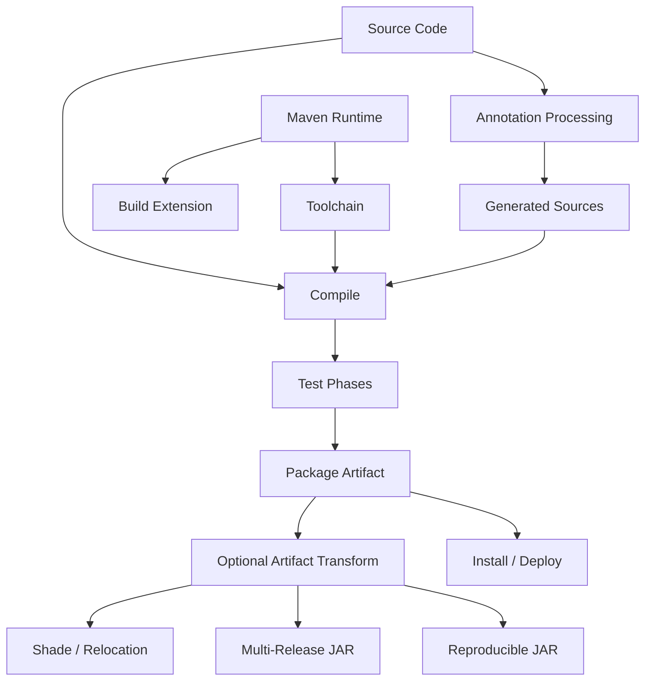
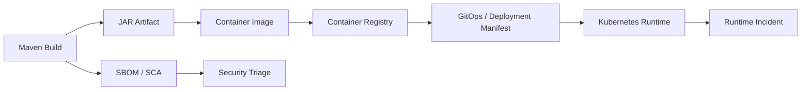

# Part 053 — Advanced Maven Topics

## 1. Core idea

Advanced Maven topics adalah area yang biasanya tidak disentuh setiap hari, tetapi ketika salah konfigurasi, dampaknya bisa besar: build tidak reproducible, artifact salah, generated code tidak sinkron, classpath rusak, dependency terduplikasi, CI lebih lambat, atau runtime behavior berbeda dari local.

Untuk senior backend engineer, Maven advanced bukan tentang menghafal plugin langka. Fokusnya adalah memahami **build as a production system**:

- source code berubah menjadi compiled classes,
- annotation processor dapat membuat source tambahan,
- plugin dapat mengubah artifact,
- build extension dapat mengubah Maven runtime behavior,
- toolchain dapat memisahkan JDK yang menjalankan Maven dari JDK yang dipakai compile,
- shading dapat mengubah namespace class,
- multi-release JAR dapat membawa class berbeda untuk Java version berbeda,
- generated artifact harus bisa ditelusuri,
- build performance improvement tidak boleh mengorbankan determinism,
- CI optimization tidak boleh membuat artifact tidak dapat dipercaya.

Dalam sistem enterprise Java/JAX-RS, area ini sering muncul pada library internal, generated API client, generated model, annotation framework, tracing/metrics instrumentation, shared parent POM, dan build pipeline release.

---

## 2. Advanced Maven mental model



Maven build terdiri dari beberapa layer:

1. **Project model** — POM, parent, dependency management, plugin management.
2. **Execution model** — lifecycle, phase, goal, plugin execution.
3. **Dependency model** — scope, transitive dependency, mediation, repository.
4. **Generated model** — annotation processing, generated sources, generated resources.
5. **Artifact model** — JAR/WAR, shaded JAR, source JAR, test JAR, SBOM, image metadata.
6. **Runtime model** — Maven runtime, JDK runtime, toolchains, local repository, settings.
7. **Optimization model** — daemon, cache, parallel build, CI cache, remote cache.

Advanced Maven problem biasanya muncul ketika dua layer di atas tidak konsisten.

Contoh:

- source compile pakai Java 17, tetapi runtime container pakai Java 11,
- annotation processor jalan di local tetapi tidak di CI,
- generated source masuk Git tetapi generator version berubah,
- shaded dependency menyembunyikan CVE scanning,
- plugin version berubah karena tidak dipin,
- build extension mengubah behavior Maven tanpa terlihat jelas,
- remote cache mengembalikan output lama karena input key tidak lengkap.

---

## 3. Custom Maven plugin

Custom Maven plugin adalah plugin yang dibuat sendiri untuk menjalankan logic build tertentu.

Use case:

- generate code dari internal schema,
- validate internal convention,
- enforce metadata artifact,
- generate deployment descriptor,
- produce internal documentation,
- validate service contract,
- publish build metadata,
- run internal compliance check.

Struktur umum plugin:

```java
@Mojo(name = "validate-service-metadata", defaultPhase = LifecyclePhase.VALIDATE)
public class ValidateServiceMetadataMojo extends AbstractMojo {
    @Parameter(property = "service.name", required = true)
    private String serviceName;

    @Override
    public void execute() throws MojoExecutionException {
        if (serviceName == null || serviceName.isBlank()) {
            throw new MojoExecutionException("service.name is required");
        }
    }
}
```

Pemakaian di POM:

```xml
<plugin>
  <groupId>com.company.build</groupId>
  <artifactId>service-build-plugin</artifactId>
  <version>1.4.2</version>
  <executions>
    <execution>
      <phase>validate</phase>
      <goals>
        <goal>validate-service-metadata</goal>
      </goals>
    </execution>
  </executions>
</plugin>
```

Senior review concern:

- plugin harus versioned,
- execution phase harus jelas,
- failure message harus actionable,
- input/output harus deterministic,
- tidak boleh diam-diam melakukan network call tanpa alasan,
- tidak boleh membaca environment lokal yang tidak tersedia di CI,
- tidak boleh membuat release artifact berbeda antar mesin,
- harus aman ketika dijalankan parallel build,
- harus kompatibel dengan multi-module reactor.

---

## 4. Custom plugin failure modes

Failure mode umum:

- plugin hanya bekerja di local developer tertentu,
- plugin bergantung pada current working directory yang salah,
- plugin menulis file ke lokasi yang tidak dibersihkan oleh `mvn clean`,
- plugin membuat output berdasarkan timestamp tanpa konfigurasi reproducible,
- plugin melakukan network call ke service internal yang tidak stabil,
- plugin tidak thread-safe tetapi build dijalankan dengan `-T`,
- plugin gagal di partial build karena mengasumsikan semua module dibuild,
- plugin tidak kompatibel dengan Maven/JDK version terbaru,
- plugin error message terlalu generic.

Debugging command:

```bash
mvn -X validate
mvn help:effective-pom
mvn help:describe -Dplugin=com.company.build:service-build-plugin -Ddetail
```

Review checklist:

- Apakah plugin wajib untuk semua service atau hanya service tertentu?
- Apakah plugin dikonfigurasi di parent POM atau child POM?
- Apakah plugin version dipin?
- Apakah plugin punya documentation?
- Apakah plugin output masuk target directory?
- Apakah plugin aman untuk CI dan release?

---

## 5. Annotation processing

Annotation processing memungkinkan compiler menjalankan processor yang membaca annotation dan menghasilkan source/resource tambahan.

Contoh penggunaan di Java ecosystem:

- Lombok,
- MapStruct,
- Immutables,
- AutoValue,
- JPA static metamodel,
- OpenAPI/JAX-RS related generators jika dipasang sebagai processor,
- internal code generation.

Konfigurasi compiler plugin:

```xml
<plugin>
  <groupId>org.apache.maven.plugins</groupId>
  <artifactId>maven-compiler-plugin</artifactId>
  <version>3.13.0</version>
  <configuration>
    <release>17</release>
    <annotationProcessorPaths>
      <path>
        <groupId>org.mapstruct</groupId>
        <artifactId>mapstruct-processor</artifactId>
        <version>${mapstruct.version}</version>
      </path>
    </annotationProcessorPaths>
  </configuration>
</plugin>
```

Kenapa `annotationProcessorPaths` penting:

- memisahkan processor dari runtime dependency,
- mengurangi classpath pollution,
- membuat processor version eksplisit,
- membantu reproducibility,
- mengurangi risiko processor tidak sengaja ikut artifact runtime.

---

## 6. Annotation processing failure modes

Failure mode:

- generated source tidak muncul di CI,
- IDE compile berhasil tetapi Maven compile gagal,
- Maven compile berhasil tetapi IDE tidak mengenali generated source,
- processor version tidak align dengan annotation library,
- processor masuk runtime classpath tanpa perlu,
- incremental compile menghasilkan output stale,
- generated code berbeda antar OS/JDK,
- processor membaca file system path absolut,
- processor menghasilkan source dengan timestamp.

Diagnosis:

```bash
mvn -X compile
mvn dependency:tree | grep -i processor
find target/generated-sources -maxdepth 4 -type f | sort
```

Yang harus dicek:

- apakah generated source berada di `target/generated-sources/...`,
- apakah source tersebut masuk compile roots,
- apakah IDE import Maven model dengan benar,
- apakah processor version dikelola di parent/BOM,
- apakah CI memakai JDK yang sama.

---

## 7. Generated sources

Generated sources adalah source code yang dibuat saat build.

Contoh:

- generated API client,
- generated OpenAPI server stub,
- generated protobuf classes,
- generated Avro classes,
- generated database metamodel,
- generated mapping classes,
- generated configuration metadata,
- generated internal contract model.

Decision penting: generated sources disimpan di Git atau tidak?

### 7.1 Generated sources tidak disimpan di Git

Kelebihan:

- menghindari noise diff,
- source of truth tetap schema/spec,
- mengurangi merge conflict,
- build lebih bersih secara konseptual.

Risiko:

- build wajib punya generator,
- generator harus deterministic,
- IDE setup harus mendukung generated source,
- CI harus punya semua input.

### 7.2 Generated sources disimpan di Git

Kelebihan:

- mudah dibaca tanpa menjalankan generator,
- build bisa lebih sederhana,
- review perubahan generated output eksplisit.

Risiko:

- PR diff besar,
- konflik tinggi,
- output bisa stale dari source spec,
- developer bisa edit generated file manual,
- generator version drift sulit dideteksi.

Rule senior:

> Generated source boleh disimpan di Git hanya jika tim punya alasan kuat dan ada mekanisme validasi bahwa generated output sinkron dengan source-of-truth.

---

## 8. Generated source review checklist

Saat PR menyentuh generated code, tanyakan:

- Apa source-of-truth generator?
- Apa command reproducible untuk regenerate?
- Generator version berapa?
- Output deterministic atau mengandung timestamp/path lokal?
- Apakah generated file diedit manual?
- Apakah CI memvalidasi generated output up-to-date?
- Apakah generated output memengaruhi API/event compatibility?
- Apakah generated output masuk artifact runtime?
- Apakah generated source menyebabkan binary incompatibility?

Command validasi:

```bash
mvn clean generate-sources

git diff -- target/generated-sources
```

Jika generated files disimpan di repository:

```bash
mvn clean generate-sources

git diff --exit-code
```

Interpretasi:

- exit code 0 berarti generated output sinkron,
- non-zero berarti ada generated output yang berubah dan harus direview.

---

## 9. Maven toolchains

Maven toolchains memungkinkan build memilih tool JDK untuk compile/test tanpa bergantung pada JDK yang menjalankan Maven.

Ini berguna ketika:

- Maven berjalan dengan JDK 17,
- module tertentu harus compile dengan JDK 11,
- project migrasi Java version,
- CI runner punya beberapa JDK,
- build harus menghindari mismatch developer machine.

Contoh plugin:

```xml
<plugin>
  <groupId>org.apache.maven.plugins</groupId>
  <artifactId>maven-toolchains-plugin</artifactId>
  <version>3.2.0</version>
  <executions>
    <execution>
      <goals>
        <goal>toolchain</goal>
      </goals>
    </execution>
  </executions>
  <configuration>
    <toolchains>
      <jdk>
        <version>17</version>
      </jdk>
    </toolchains>
  </configuration>
</plugin>
```

Contoh `~/.m2/toolchains.xml`:

```xml
<toolchains>
  <toolchain>
    <type>jdk</type>
    <provides>
      <version>17</version>
      <vendor>any</vendor>
    </provides>
    <configuration>
      <jdkHome>/path/to/jdk-17</jdkHome>
    </configuration>
  </toolchain>
</toolchains>
```

Senior concern:

- jangan hanya mengandalkan `JAVA_HOME`,
- bedakan build JDK, compile target, dan runtime JDK,
- dokumentasikan toolchain requirement,
- pastikan CI punya toolchain yang sama,
- gunakan `maven-compiler-plugin` `release` flag untuk target Java yang eksplisit.

---

## 10. Build JDK vs runtime JDK

Tiga hal ini sering tertukar:

| Concern | Maksud | Contoh |
|---|---|---|
| Maven runtime JDK | JDK yang menjalankan Maven | `mvn -version` |
| Compile target | bytecode/API target yang dihasilkan | `<release>17</release>` |
| Runtime JDK | JDK di container/production | Docker base image Java 17 |

Command cek:

```bash
mvn -version
java -version
javap -verbose target/classes/com/example/App.class | grep "major"
```

Contoh major version:

| Java | Class major version |
|---:|---:|
| 8 | 52 |
| 11 | 55 |
| 17 | 61 |
| 21 | 65 |

Failure mode:

- `UnsupportedClassVersionError`,
- local test pass tetapi container crash,
- CI compile pakai JDK lebih baru dari runtime,
- dependency baru butuh Java version lebih tinggi,
- Docker image masih memakai runtime lama.

---

## 11. Build extensions

Build extension dapat mengubah Maven behavior pada level lebih dalam daripada plugin biasa.

Contoh penggunaan:

- custom repository transport,
- build cache extension,
- artifact resolution customization,
- flatten POM behavior,
- corporate build convention.

Konfigurasi:

```xml
<build>
  <extensions>
    <extension>
      <groupId>com.company.build</groupId>
      <artifactId>company-maven-extension</artifactId>
      <version>2.1.0</version>
    </extension>
  </extensions>
</build>
```

Build extension harus direview lebih ketat daripada plugin biasa karena bisa memengaruhi:

- dependency resolution,
- artifact publishing,
- lifecycle behavior,
- repository access,
- caching,
- logging,
- build reproducibility.

Failure mode:

- build tidak bisa jalan jika extension repository tidak bisa diakses,
- extension mengubah artifact metadata,
- extension tidak kompatibel dengan Maven version baru,
- extension membuat behavior local berbeda dari CI,
- extension menambah network dependency tersembunyi.

---

## 12. Shade plugin and relocation

`maven-shade-plugin` membuat artifact yang memasukkan dependency ke dalam satu JAR dan dapat melakukan relocation package.

Use case valid:

- CLI standalone,
- library perlu menghindari dependency conflict dengan host runtime,
- internal tool packaging,
- plugin packaging.

Contoh relocation:

```xml
<plugin>
  <groupId>org.apache.maven.plugins</groupId>
  <artifactId>maven-shade-plugin</artifactId>
  <version>3.6.0</version>
  <executions>
    <execution>
      <phase>package</phase>
      <goals>
        <goal>shade</goal>
      </goals>
      <configuration>
        <relocations>
          <relocation>
            <pattern>com.fasterxml.jackson</pattern>
            <shadedPattern>com.company.shaded.jackson</shadedPattern>
          </relocation>
        </relocations>
      </configuration>
    </execution>
  </executions>
</plugin>
```

Senior warning:

> Shading adalah power tool. Ia bisa menyelesaikan conflict, tetapi juga bisa menyembunyikan dependency, CVE, duplicate class, service loader file, license, dan runtime behavior.

---

## 13. Shade plugin failure modes

Failure mode:

- duplicate classes tidak terdeteksi,
- service loader file tidak digabung dengan benar,
- logging binding ikut ter-shade,
- security scanner tidak melihat dependency asli,
- CVE triage menjadi sulit,
- license attribution hilang,
- relocation memecahkan reflection,
- framework mencari class by name dan gagal,
- artifact membesar drastis,
- dependency yang seharusnya provided ikut masuk artifact.

Debugging:

```bash
jar tf target/*.jar | sort | less

mvn dependency:tree

mvn -DskipTests package
```

Cek duplicate class:

```bash
jar tf target/*.jar | grep '\.class$' | sort | uniq -d
```

Review checklist:

- Kenapa shading diperlukan?
- Dependency apa yang dimasukkan?
- Apakah relocation memengaruhi reflection/JAX-RS provider/service loader?
- Apakah license tetap jelas?
- Apakah SBOM mencerminkan dependency sebenarnya?
- Apakah artifact size acceptable?

---

## 14. Multi-release JAR

Multi-release JAR memungkinkan satu JAR berisi class berbeda untuk Java version berbeda.

Struktur:

```text
my-lib.jar
├── com/company/Foo.class
└── META-INF/versions/17/com/company/Foo.class
```

Runtime Java 17 dapat memakai class di `META-INF/versions/17`, sedangkan runtime lama memakai class base.

Use case:

- library ingin mendukung beberapa Java version,
- implementasi optimal untuk Java baru,
- compatibility layer.

Risiko:

- behavior berbeda antar runtime JDK,
- testing harus mencakup semua supported JDK,
- debugging lebih sulit karena source class yang aktif tergantung runtime,
- packaging lebih kompleks,
- static analysis bisa salah membaca class.

Untuk backend service biasa, multi-release JAR jarang diperlukan. Lebih sering relevan untuk shared library atau platform library.

---

## 15. JPMS and module-info awareness

JPMS adalah Java Platform Module System. Banyak enterprise Java service masih berjalan di classpath biasa, tetapi `module-info.java` bisa muncul pada dependency atau library internal.

Senior engineer tidak harus selalu memakai JPMS, tetapi harus sadar dampaknya:

- split package problem,
- automatic module name,
- reflective access warning/error,
- dependency yang punya module metadata,
- test framework yang butuh access khusus,
- framework JAX-RS/Jakarta yang mengandalkan reflection,
- native image atau stricter runtime yang butuh metadata explicit.

Failure mode:

- classpath vs module path mismatch,
- reflection access gagal,
- package tidak exported/opened,
- duplicate module name,
- dependency automatic module name berubah,
- IDE dan Maven berbeda behavior.

Checklist:

```bash
jar --describe-module --file target/my-lib.jar
jdeps --multi-release 17 target/my-lib.jar
```

Review concern:

- Apakah service benar-benar memakai module path?
- Apakah framework reflection masih berjalan?
- Apakah package yang perlu reflective access sudah `opens`?
- Apakah dependency masih kompatibel dengan classpath deployment?

---

## 16. Reproducible JAR

Reproducible JAR berarti artifact yang dibuat dari input sama menghasilkan output yang sama atau setidaknya metadata yang terkontrol.

Sumber non-determinism:

- timestamp file,
- file ordering,
- generated build metadata,
- OS path separator,
- locale,
- timezone,
- username/hostname,
- absolute path,
- dependency snapshot berubah,
- plugin version tidak dipin.

Konfigurasi umum:

```xml
<properties>
  <project.build.outputTimestamp>2026-01-01T00:00:00Z</project.build.outputTimestamp>
</properties>
```

Atau di release pipeline, output timestamp bisa diikat ke commit time/release time yang deterministic.

Validasi sederhana:

```bash
mvn clean package
sha256sum target/*.jar

mvn clean package
sha256sum target/*.jar
```

Jika hash berubah tanpa source/input berubah, build belum deterministic.

---

## 17. Dependency lock alternatives in Maven

Maven tidak punya lockfile standar seperti beberapa package manager lain. Karena itu reproducibility Maven biasanya dijaga melalui kombinasi:

- explicit dependency versions,
- `dependencyManagement`,
- imported BOM,
- parent POM,
- pluginManagement,
- enforcer rules,
- dependency convergence checks,
- repository immutability,
- no dynamic version,
- no changing release artifact,
- controlled snapshot usage.

Hal yang harus dihindari:

```xml
<version>LATEST</version>
<version>RELEASE</version>
<version>[1.0,)</version>
```

Snapshot juga harus diperlakukan hati-hati:

- boleh untuk development internal tertentu,
- berisiko untuk reproducible release,
- harus jelas repository dan update policy-nya,
- jangan menjadi dependency release production tanpa approval.

---

## 18. Maven daemon awareness

Maven daemon seperti `mvnd` dapat mempercepat build dengan daemon process dan caching internal.

Kelebihan:

- build lokal lebih cepat,
- JVM warmup berkurang,
- feedback loop developer membaik.

Risiko:

- behavior berbeda dari Maven standar,
- daemon state memengaruhi hasil diagnosis,
- plugin tertentu mungkin tidak kompatibel,
- CI biasanya tetap memakai Maven biasa,
- build failure bisa hilang setelah daemon restart.

Rule praktis:

- boleh untuk local productivity,
- jangan jadikan satu-satunya path validasi,
- reproduksi bug build dengan `./mvnw`,
- dokumentasikan jika team mendukung `mvnd`,
- jangan menyimpulkan build benar hanya karena `mvnd` berhasil.

Debugging:

```bash
mvnd --stop
./mvnw clean verify
```

---

## 19. Remote cache awareness

Remote cache untuk build dapat mempercepat CI atau local build dengan memakai output yang sudah pernah dibuat.

Risiko utama adalah cache key yang tidak lengkap.

Input yang harus masuk cache key:

- source files,
- POM effective model,
- plugin versions,
- dependency versions,
- generated source inputs,
- JDK version,
- OS/architecture jika relevan,
- environment yang memengaruhi build,
- compiler flags,
- test inputs.

Failure mode:

- output stale dipakai ulang,
- test pass karena cache padahal source berubah,
- artifact salah dipublish,
- generated source lama ikut package,
- CI failure tidak bisa direproduksi local,
- cache poisoning dari branch yang tidak trusted.

Rule senior:

> Cache adalah optimization, bukan source of truth. Build harus tetap benar ketika cache dimatikan.

Validasi:

```bash
mvn clean verify
# jalankan ulang dengan cache disabled jika tooling mendukung
```

---

## 20. Java/JAX-RS backend impact

Advanced Maven topic berdampak langsung ke backend service:

- annotation processor dapat menghasilkan mapper DTO/entity,
- generated OpenAPI/JAX-RS artifact dapat menentukan contract API,
- toolchain mismatch dapat membuat service crash di runtime,
- shade relocation dapat memengaruhi provider discovery,
- service loader merge dapat memengaruhi JAX-RS providers,
- reproducible JAR mendukung release audit,
- dependency lock alternative memengaruhi runtime classpath,
- build extension dapat memengaruhi artifact yang masuk container,
- remote cache dapat menyembunyikan stale generated code,
- JPMS/reflection issue dapat memengaruhi serialization, injection, dan framework scanning.

Review PR pada service JAX-RS harus melihat bukan hanya source code, tetapi juga build behavior yang membentuk artifact final.

---

## 21. Docker, Kubernetes, AWS, Azure, and GitOps impact

Advanced Maven build tidak berhenti di `target/*.jar`.

Artifact build akan masuk ke:

- Docker image,
- Kubernetes deployment,
- GitOps manifest,
- artifact repository,
- image registry,
- SBOM,
- vulnerability scanner,
- release note,
- incident traceability.

Failure propagation:



Jika build artifact salah, semua layer setelahnya ikut salah.

Contoh:

- wrong Java target → container crash,
- generated code stale → API behavior salah,
- shaded vulnerable dependency → scanner miss,
- non-deterministic build → sulit audit incident,
- cache stale → image berisi code lama,
- version metadata salah → rollback membingungkan.

---

## 22. Advanced Maven debugging playbook

Gunakan urutan berikut saat build advanced bermasalah:

### Step 1 — Reproduce clean

```bash
./mvnw -version
./mvnw clean verify
```

### Step 2 — Inspect effective model

```bash
./mvnw help:effective-pom -Doutput=target/effective-pom.xml
./mvnw help:effective-settings -Doutput=target/effective-settings.xml
```

### Step 3 — Inspect dependency and plugin tree

```bash
./mvnw dependency:tree
./mvnw help:describe -Dplugin=org.apache.maven.plugins:maven-compiler-plugin -Ddetail
```

### Step 4 — Inspect generated output

```bash
find target/generated-sources -type f | sort | head -100
find target/generated-resources -type f | sort | head -100
```

### Step 5 — Inspect artifact

```bash
jar tf target/*.jar | sort | less
sha256sum target/*.jar
```

### Step 6 — Compare local vs CI

Bandingkan:

- Maven version,
- JDK version,
- OS/architecture,
- active profiles,
- environment variables,
- settings.xml,
- repository access,
- cache behavior,
- plugin/dependency versions.

---

## 23. PR review checklist

Gunakan checklist berikut untuk PR yang menyentuh advanced Maven behavior:

- Apakah perubahan ada di parent POM, plugin management, atau build extension?
- Apakah plugin/dependency version dipin?
- Apakah annotation processor dipisahkan dari runtime dependency?
- Apakah generated source deterministic?
- Apakah generated source disimpan di Git atau dibuat saat build? Kenapa?
- Apakah toolchain/JDK target konsisten dengan runtime container?
- Apakah shade/relocation benar-benar diperlukan?
- Apakah service loader/resource transformer dikonfigurasi jika shading?
- Apakah SBOM dan scanner tetap melihat dependency yang relevan?
- Apakah build tetap benar tanpa cache?
- Apakah build bisa jalan dengan `./mvnw clean verify`?
- Apakah perubahan memengaruhi CI time secara signifikan?
- Apakah perubahan memengaruhi release artifact traceability?
- Apakah rollback strategy jelas jika build tooling menyebabkan incident?

---

## 24. Internal verification checklist

Untuk konteks CSG/team, jangan mengarang detail internal. Verifikasi hal berikut langsung dari repository, pipeline, atau diskusi dengan senior/platform/SRE/security:

- Apakah ada custom Maven plugin internal?
- Apakah ada build extension internal?
- Apakah parent POM mengatur annotation processors?
- Apakah generated sources disimpan di Git atau tidak?
- Apa command resmi untuk regenerate code?
- Apakah ada OpenAPI/protobuf/Avro/schema generation?
- Apakah service memakai Maven toolchains?
- Java version apa yang dipakai untuk build, compile target, dan runtime container?
- Apakah ada shading/relocation di service atau library internal?
- Apakah ada multi-release JAR atau JPMS/module-info?
- Apakah build reproducibility divalidasi?
- Apakah ada remote cache atau Maven daemon recommendation?
- Apakah CI cache bisa dimatikan untuk diagnosis?
- Apakah SBOM mencakup shaded/transitive dependency?
- Apakah release artifact punya checksum/provenance?

---

## 25. Senior operating principles

Prinsip kerja senior untuk advanced Maven:

1. **Prefer boring build unless there is a real need.** Build sederhana lebih mudah direview dan direproduksi.
2. **Pin versions.** Plugin dan dependency version yang implisit adalah future incident.
3. **Generated output must have a source of truth.** Jangan biarkan generated code menjadi artifact misterius.
4. **Cache is not correctness.** Cache hanya optimization.
5. **Shading must be justified.** Jangan sembunyikan dependency tanpa alasan kuat.
6. **Build JDK, target JDK, runtime JDK must align.** Banyak runtime issue berasal dari mismatch ini.
7. **Effective POM is the truth.** Jangan hanya membaca POM lokal; baca model final.
8. **CI is the contract.** Local optimization boleh, tetapi CI/release path harus authoritative.
9. **Build changes need production thinking.** POM change bisa berdampak sebesar code change.
10. **Document advanced behavior.** Jika tidak bisa dijelaskan, terlalu berisiko untuk menjadi team workflow.

---

## 26. Master checklist

Sebelum meng-approve perubahan Maven advanced, pastikan:

- [ ] Tujuan perubahan jelas.
- [ ] Tidak ada plugin/dependency version floating.
- [ ] Effective POM sudah dicek.
- [ ] Build bersih berhasil dengan `./mvnw clean verify`.
- [ ] Generated sources deterministic.
- [ ] Toolchain/JDK target konsisten.
- [ ] Shading/relocation punya alasan kuat.
- [ ] Artifact final sudah diinspeksi.
- [ ] SBOM/security scanning tetap valid.
- [ ] CI behavior tidak berbeda diam-diam dari local.
- [ ] Cache bukan satu-satunya alasan build cepat/berhasil.
- [ ] Release traceability tidak rusak.
- [ ] Dokumentasi/update README tersedia jika workflow berubah.

---

## 27. Closing thought

Advanced Maven adalah area di mana perubahan kecil bisa menciptakan dampak sistemik.

Senior engineer yang kuat tidak hanya bertanya “apakah build berhasil?”, tetapi:

- artifact apa yang sebenarnya dibuat,
- dengan JDK apa,
- dari input apa,
- lewat plugin apa,
- dengan dependency apa,
- apakah output deterministic,
- apakah scanner melihat risiko yang benar,
- apakah CI dan local menjalankan hal yang sama,
- apakah artifact dapat ditelusuri saat incident.

Itulah perbedaan antara sekadar menjalankan Maven dan memahami Maven sebagai bagian dari production engineering system.
