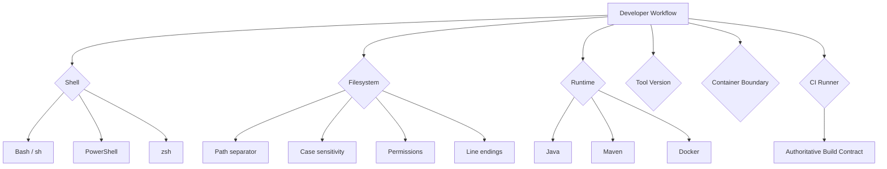

# Part 054 — Cross-Platform Tooling

## 1. Core idea

Cross-platform tooling adalah kemampuan membuat workflow engineering yang tetap benar ketika dijalankan di environment berbeda:

- Linux laptop,
- macOS laptop,
- Windows laptop,
- WSL,
- Docker container,
- Kubernetes pod,
- CI runner Linux,
- CI runner Windows,
- enterprise managed workstation.

Tujuannya bukan membuat semua script mendukung semua OS tanpa batas. Tujuannya adalah membuat boundary yang jelas:

- command mana yang portable,
- command mana yang Linux-only,
- command mana yang membutuhkan Bash,
- command mana yang membutuhkan PowerShell,
- command mana yang harus dijalankan dalam container,
- command mana yang menjadi contract resmi local/CI,
- failure apa yang muncul jika OS berbeda.

Dalam enterprise Java/JAX-RS system, cross-platform issue sering terlihat sebagai:

- build jalan di macOS tetapi gagal di Linux CI,
- test pass di Windows tetapi gagal di container,
- script Bash gagal di WSL karena path conversion,
- line ending CRLF merusak shell script,
- file permission hilang setelah checkout di Windows,
- Docker volume behavior berbeda,
- case-insensitive filesystem menyembunyikan bug import/resource,
- command `sed`/`date` berbeda antara GNU dan BSD.

Senior engineer harus bisa membedakan **portability requirement** dari **accidental local assumption**.

---

## 2. Cross-platform mental model



Cross-platform bug biasanya terjadi karena satu dari hal berikut diasumsikan universal:

- path separator,
- shell syntax,
- command option,
- newline format,
- executable bit,
- case sensitivity,
- default encoding,
- locale,
- timezone,
- file locking,
- symlink support,
- Docker volume semantics,
- Java/Maven version,
- tool availability.

---

## 3. Define the support matrix

Sebelum membuat tooling lintas platform, definisikan support matrix.

Contoh support matrix:

| Surface | Supported? | Contract |
|---|---:|---|
| Linux | Yes | Primary local and CI-compatible environment |
| macOS | Yes | Supported for local dev with documented caveats |
| Windows native | Partial | Use WSL or container for Bash-heavy workflows |
| WSL2 | Yes | Recommended Windows path |
| Docker container | Yes | Used for dependency services and isolated tooling |
| CI Linux runner | Yes | Authoritative validation path |
| CI Windows runner | No/Optional | Only if product requires Windows behavior |

Rule senior:

> Jangan biarkan support matrix menjadi asumsi informal. Tulis di README atau CONTRIBUTING.

Jika repository hanya mendukung Linux/macOS, katakan jelas. Jika Windows harus lewat WSL, katakan jelas. Ambiguity menciptakan onboarding pain.

---

## 4. Linux vs macOS vs Windows vs WSL

### 4.1 Linux

Kelebihan:

- paling mirip CI/container/Kubernetes,
- GNU tools biasanya tersedia,
- permission dan symlink behavior production-like,
- Docker behavior lebih direct.

Risiko:

- distro berbeda punya package manager berbeda,
- tool version bisa berbeda,
- system OpenSSL/curl berbeda,
- developer machine security policy bisa membatasi tool.

### 4.2 macOS

Kelebihan:

- umum untuk developer workstation,
- Unix-like shell environment,
- Homebrew memudahkan install tool,
- cukup dekat dengan Linux untuk banyak workflow.

Risiko:

- BSD `sed`, `date`, `stat`, `find` berbeda dari GNU,
- filesystem default biasanya case-insensitive,
- Docker berjalan via VM,
- file permission dan volume performance berbeda,
- system Java/Maven bisa tidak sama dengan CI.

### 4.3 Windows native

Kelebihan:

- enterprise workstation bisa Windows-managed,
- PowerShell kuat untuk automation Windows,
- Docker Desktop/WSL integration tersedia.

Risiko:

- path separator berbeda,
- CRLF default,
- Bash tidak native kecuali Git Bash/MSYS/WSL,
- executable bit tidak reliable,
- symlink butuh konfigurasi/permission,
- command Unix tidak selalu tersedia,
- case-insensitive filesystem menyembunyikan bug.

### 4.4 WSL2

Kelebihan:

- Linux user space di Windows,
- lebih cocok untuk Bash/Maven/Docker Linux workflow,
- mendekati CI Linux,
- mengurangi path dan shell mismatch.

Risiko:

- interop path `/mnt/c/...` bisa lambat,
- file ownership/permission bisa membingungkan,
- Docker Desktop integration perlu konfigurasi,
- line ending masih bisa bocor dari editor Windows,
- credential helper Git bisa berbeda.

---

## 5. Path differences

Path adalah sumber bug paling klasik.

Linux/macOS:

```text
/home/user/project
/Users/user/project
```

Windows:

```text
C:\Users\user\project
```

WSL:

```text
/home/user/project
/mnt/c/Users/user/project
```

Masalah umum:

- script hardcode `/tmp` atau `/Users/...`,
- script menggabungkan path dengan `/` lalu dipakai di Windows native,
- path mengandung spasi,
- command tidak quote variable,
- Docker mount memakai path host yang berbeda,
- Maven property mengandung path OS-specific,
- generated source berisi absolute path.

Bad pattern:

```bash
java -jar $APP_HOME/tools/generator.jar --input $PWD/spec/api.yaml
```

Better:

```bash
java -jar "$APP_HOME/tools/generator.jar" --input "$(pwd)/spec/api.yaml"
```

Untuk script Bash, quote path sebagai default.

```bash
rm -rf "$target_dir"
cp "$source_file" "$target_dir/"
```

---

## 6. Path safety checklist

- Jangan hardcode home directory developer.
- Jangan asumsi path tidak mengandung spasi.
- Quote semua variable path di Bash.
- Gunakan repository root detection yang jelas.
- Jangan menulis generated file dengan absolute path lokal.
- Hindari path host dalam artifact release.
- Dokumentasikan path Docker volume untuk Windows/WSL jika berbeda.
- Gunakan Maven property untuk path build yang stabil.
- Pastikan CI menjalankan path dari clean workspace.

Repository root pattern:

```bash
repo_root="$(git rev-parse --show-toplevel)"
cd "$repo_root"
```

---

## 7. Line endings: LF vs CRLF

Line ending:

- LF: Unix/Linux/macOS standard,
- CRLF: Windows standard.

Shell script dengan CRLF bisa gagal:

```text
/usr/bin/env: 'bash\r': No such file or directory
```

Git config penting:

```bash
git config --get core.autocrlf
git config --get core.eol
```

Gunakan `.gitattributes` untuk contract repository:

```gitattributes
* text=auto
*.sh text eol=lf
*.bash text eol=lf
*.md text eol=lf
*.yml text eol=lf
*.yaml text eol=lf
*.java text eol=lf
*.bat text eol=crlf
*.ps1 text eol=crlf
```

Review concern:

- file script harus LF,
- file Windows batch/PowerShell boleh CRLF sesuai convention,
- generated files harus consistent,
- jangan biarkan line ending berubah masif dalam PR kecil.

Diagnosis:

```bash
file scripts/build.sh
cat -v scripts/build.sh | head
```

Jika terlihat `^M`, ada CRLF.

---

## 8. Shell differences

Shell tidak sama:

| Shell | Platform umum | Notes |
|---|---|---|
| `sh` | Linux/macOS | POSIX-ish, fitur terbatas |
| `bash` | Linux/macOS/WSL/Git Bash | Banyak fitur scripting umum |
| `zsh` | macOS default interactive | Tidak sama dengan Bash untuk script |
| PowerShell | Windows/Linux/macOS | Object pipeline, syntax berbeda |
| `cmd.exe` | Windows | Legacy, hindari untuk workflow kompleks |

Shebang penting:

```bash
#!/usr/bin/env bash
```

Jangan mengandalkan shell interactive developer.

Bad pattern:

```bash
# script tanpa shebang, lalu dijalankan bergantung shell user
./scripts/build
```

Better:

```bash
#!/usr/bin/env bash
set -euo pipefail
```

Atau panggil eksplisit:

```bash
bash scripts/build.sh
```

---

## 9. GNU vs BSD command differences

macOS menggunakan banyak BSD tools. Linux CI biasanya GNU tools.

Contoh perbedaan:

### 9.1 `sed -i`

GNU sed:

```bash
sed -i 's/foo/bar/g' file.txt
```

BSD sed:

```bash
sed -i '' 's/foo/bar/g' file.txt
```

Portable approach:

```bash
tmp="$(mktemp)"
sed 's/foo/bar/g' file.txt > "$tmp"
mv "$tmp" file.txt
```

### 9.2 `date`

GNU date:

```bash
date -d 'yesterday' +%F
```

BSD date:

```bash
date -v-1d +%F
```

Portable approach:

- gunakan Python/Java untuk date logic kompleks,
- atau jalankan tooling dalam container Linux.

### 9.3 `find`

Option `find` bisa berbeda. Hindari command yang terlalu bergantung pada extension non-portable jika script harus lintas OS.

---

## 10. PowerShell awareness

PowerShell bukan Bash versi Windows. Ia punya object pipeline dan syntax berbeda.

Contoh PowerShell:

```powershell
Get-ChildItem -Recurse -Filter *.java | Select-Object FullName
```

HTTP request:

```powershell
Invoke-RestMethod -Method Get -Uri "http://localhost:8080/health"
```

Environment variable:

```powershell
$env:JAVA_HOME
$env:APP_ENV = "local"
```

Jika tim mendukung Windows native, sediakan script PowerShell terpisah daripada memaksa Bash script jalan setengah kompatibel.

Contoh struktur:

```text
scripts/
  build.sh
  build.ps1
  test.sh
  test.ps1
```

Atau tetapkan contract:

```text
Windows developers should use WSL2 for repository scripts.
```

Yang penting: eksplisit.

---

## 11. File permission differences

Unix punya executable bit.

```bash
chmod +x scripts/build.sh
```

Git menyimpan executable bit untuk file:

```bash
git ls-files -s scripts/build.sh
```

Mode `100755` berarti executable, `100644` berarti tidak.

Masalah umum:

- script kehilangan executable bit setelah edit di Windows,
- PR tidak sengaja mengubah permission banyak file,
- container tidak bisa execute entrypoint,
- CI gagal dengan `Permission denied`,
- file secret/config terlalu permissive.

Diagnosis:

```bash
ls -l scripts/build.sh
git diff --summary
```

Jika PR menunjukkan:

```text
mode change 100755 => 100644 scripts/build.sh
```

Itu harus direview.

---

## 12. Symlink differences

Symlink bekerja normal di Linux/macOS, tetapi di Windows bisa butuh permission atau Git config khusus.

Masalah:

- symlink berubah menjadi file teks berisi target,
- checkout Windows tidak membuat symlink benar,
- Docker build context berbeda,
- Maven resource path rusak,
- script mengandalkan symlink yang tidak portable.

Diagnosis:

```bash
ls -l path/to/link
git ls-files -s path/to/link
```

Review concern:

- Apakah symlink benar-benar perlu?
- Apakah CI Linux memvalidasi?
- Apakah Windows/WSL developer terdampak?
- Apakah alternatif copy/generated file lebih aman?

---

## 13. Case-sensitive vs case-insensitive filesystem

Linux biasanya case-sensitive.

macOS dan Windows default sering case-insensitive.

Bug contoh:

```text
src/main/resources/config.yaml
src/main/resources/Config.yaml
```

Di macOS/Windows, ini bisa terlihat seperti file sama. Di Linux CI/container, keduanya berbeda.

Java impact:

- resource loading gagal di Linux,
- package/import case mismatch,
- Docker build gagal,
- generated file overwrite tidak terlihat di local,
- Git rename hanya beda case tidak terdeteksi dengan benar.

Diagnosis:

```bash
git ls-files | sort -f | uniq -d
```

Untuk rename case-only:

```bash
git mv OldName.java tmp-name.java
git mv tmp-name.java oldname.java
```

---

## 14. File locking and process differences

Windows sering lebih ketat soal file locking.

Masalah umum:

- `mvn clean` gagal karena file masih dibuka IDE/process,
- test gagal delete temp file,
- Docker volume file tidak bisa dihapus,
- log file terkunci,
- antivirus/endpoint security memperlambat build.

Mitigasi:

- tutup process yang memegang file,
- gunakan temp directory unik per test,
- pastikan stream/file handle ditutup,
- hindari test yang delete file sebelum resource close,
- jangan asumsi Unix-style delete-open-file behavior.

Diagnosis:

Windows:

```powershell
Get-Process | Where-Object { $_.ProcessName -like "*java*" }
```

Linux/macOS:

```bash
lsof +D target 2>/dev/null | head
```

---

## 15. Docker on macOS/Windows

Docker di Linux biasanya native. Docker di macOS/Windows berjalan lewat VM atau WSL2 integration.

Dampak:

- bind mount lebih lambat,
- file permission berbeda,
- path conversion diperlukan,
- networking berbeda,
- `localhost` behavior bisa membingungkan,
- resource limit Docker Desktop memengaruhi test,
- line ending masuk container dari host.

Contoh problem:

- Testcontainers lambat di macOS/Windows,
- PostgreSQL volume corrupt karena path/permission,
- Kafka/RabbitMQ local compose lambat start,
- Redis container jalan tetapi port conflict,
- service dalam container tidak bisa akses host service.

Checklist:

```bash
docker version
docker info
docker compose version
docker ps
```

Cek resource Docker Desktop:

- CPU,
- memory,
- disk,
- WSL integration,
- file sharing.

---

## 16. Docker path and volume safety

Bad pattern:

```bash
docker run -v $PWD:/app my-image
```

Better:

```bash
docker run --rm -v "$(pwd):/app" -w /app my-image
```

Compose path should be relative to compose file when possible:

```yaml
services:
  app:
    volumes:
      - .:/workspace
```

Untuk Windows/WSL, dokumentasikan apakah command dijalankan dari:

- PowerShell,
- Git Bash,
- WSL shell,
- IDE terminal,
- Docker container.

Context berbeda menghasilkan path berbeda.

---

## 17. CI runner OS as the contract

Dalam banyak backend service, CI Linux runner adalah contract authoritative.

Artinya:

- local workflow boleh berbeda untuk kenyamanan,
- tetapi PR harus pass di CI,
- script yang dipakai CI harus deterministic,
- local helper tidak boleh menggantikan CI validation,
- command documented harus menyebut environment yang diharapkan.

Cek CI runner:

```yaml
runs-on: ubuntu-latest
```

atau self-hosted:

```yaml
runs-on: [self-hosted, linux, x64]
```

Senior concern:

- `ubuntu-latest` bisa berubah versi OS,
- self-hosted runner bisa punya state lama,
- Windows/macOS runner butuh command berbeda,
- tool install/cache bisa menyembunyikan dependency.

Jika OS runner penting, pin atau dokumentasikan.

---

## 18. Java and Maven cross-platform concerns

Java relatif portable, tetapi build/test tidak selalu portable.

Concern:

- default charset,
- default timezone,
- file separator,
- path separator,
- locale,
- filesystem case sensitivity,
- temp directory,
- line ending dalam expected test files,
- clock precision,
- process spawning,
- shell command dalam test,
- native library dependency.

Bad Java pattern:

```java
String path = baseDir + "/config/app.yaml";
```

Better:

```java
Path path = baseDir.resolve("config").resolve("app.yaml");
```

Test concern:

- jangan assert line ending tanpa normalisasi jika tidak penting,
- jangan pakai absolute path developer,
- jangan asumsikan `/tmp`,
- gunakan `@TempDir` atau equivalent,
- tutup file handle sebelum delete.

---

## 19. JAX-RS/backend runtime impact

Cross-platform issue bisa berdampak ke service Java/JAX-RS:

- resource file tidak ditemukan karena case mismatch,
- generated OpenAPI file punya CRLF/LF diff,
- local TLS cert path berbeda,
- curl command di README tidak jalan di PowerShell,
- Docker Compose dependency service behave berbeda,
- test upload/download binary gagal karena newline transformation,
- config path di env var tidak portable,
- script start service gagal karena permission atau shebang,
- Maven profile aktif berbeda karena OS activation.

Review PR harus melihat apakah perubahan tooling membuat developer tertentu tidak bisa build/test/reproduce issue.

---

## 20. Shell script portability patterns

Jika script targetnya Bash di Linux/macOS/WSL:

```bash
#!/usr/bin/env bash
set -euo pipefail

repo_root="$(git rev-parse --show-toplevel)"
cd "$repo_root"
```

Gunakan:

- quoted variables,
- `mktemp`,
- `trap` cleanup,
- explicit command checks,
- clear error message,
- no OS-specific flags without guard.

Command existence check:

```bash
require_cmd() {
  command -v "$1" >/dev/null 2>&1 || {
    echo "Missing required command: $1" >&2
    exit 1
  }
}

require_cmd git
require_cmd java
require_cmd mvn
```

OS detection:

```bash
os_name="$(uname -s)"
case "$os_name" in
  Linux*) os="linux" ;;
  Darwin*) os="macos" ;;
  MINGW*|MSYS*|CYGWIN*) os="windows-git-bash" ;;
  *) os="unknown" ;;
esac
```

Gunakan OS detection hanya ketika benar-benar perlu.

---

## 21. Prefer containerized tooling when portability is expensive

Jika toolchain terlalu OS-specific, container bisa menjadi boundary.

Contoh:

```bash
docker run --rm \
  -v "$(pwd):/workspace" \
  -w /workspace \
  eclipse-temurin:17 \
  ./mvnw clean verify
```

Kelebihan:

- Linux environment konsisten,
- tool version bisa dipin,
- mengurangi host pollution,
- CI-like local execution.

Risiko:

- Docker required,
- volume performance berbeda di macOS/Windows,
- credential mount perlu hati-hati,
- file ownership output bisa bermasalah,
- network access berbeda.

Rule praktis:

- gunakan container untuk tool yang sulit distandarkan,
- jangan mount secret sembarangan,
- dokumentasikan UID/GID issue,
- tetap sediakan command non-container jika team membutuhkannya.

---

## 22. Git configuration for cross-platform teams

Cek konfigurasi:

```bash
git config --list --show-origin | grep -E 'autocrlf|filemode|ignorecase|eol'
```

Concern:

- `core.autocrlf`,
- `core.filemode`,
- `core.ignorecase`,
- `.gitattributes`,
- executable bit,
- symlink behavior,
- case-only rename.

Recommended repository-level contract:

- `.gitattributes` mengatur line endings,
- script executable bit disimpan benar,
- README menjelaskan Windows/WSL support,
- CI memvalidasi file format jika penting,
- lint script memeriksa CRLF untuk `.sh`.

Contoh check sederhana:

```bash
if grep -RIl $'\r' scripts --include='*.sh' | grep .; then
  echo "CRLF detected in shell scripts" >&2
  exit 1
fi
```

---

## 23. Cross-platform testing strategy

Tidak semua repo perlu test di semua OS. Pilih berdasarkan risk.

### 23.1 Linux-only validation

Cukup jika:

- service production jalan di Linux container,
- developer Windows memakai WSL,
- scripts documented as Bash/Linux,
- no native OS-specific behavior.

### 23.2 Linux + macOS validation

Berguna jika:

- banyak developer macOS,
- local tooling sering dipakai,
- script harus jalan di macOS tanpa container,
- command GNU/BSD rawan berbeda.

### 23.3 Linux + Windows validation

Perlu jika:

- product/library harus mendukung Windows,
- tooling resmi mendukung Windows native,
- path/file behavior bagian dari correctness,
- developer base Windows besar dan tidak memakai WSL.

GitHub Actions matrix contoh:

```yaml
strategy:
  matrix:
    os: [ubuntu-latest, macos-latest]

runs-on: ${{ matrix.os }}
```

Jangan menambah matrix OS tanpa alasan. CI cost dan maintenance akan naik.

---

## 24. Common failure modes

Cross-platform failure yang sering terjadi:

- `Permission denied` saat menjalankan script,
- `/usr/bin/env: bash\r` karena CRLF,
- `sed: illegal option` di macOS,
- `date: illegal option` di macOS,
- Docker volume path tidak ditemukan,
- Maven test gagal karena path separator,
- resource loading gagal karena case mismatch,
- generated file diff hanya karena line ending,
- test gagal delete file di Windows,
- symlink tidak dibuat benar,
- CI Linux gagal padahal local macOS pass,
- script berjalan di zsh padahal ditulis untuk Bash,
- `mvn clean` gagal karena file terkunci,
- Git tidak mendeteksi case-only rename,
- `.sh` tidak executable setelah checkout.

---

## 25. Cross-platform debugging playbook

### Step 1 — Identify execution surface

```bash
uname -a
pwd
shell_name="${SHELL:-unknown}"
echo "$shell_name"
```

Windows PowerShell:

```powershell
$PSVersionTable
Get-Location
```

### Step 2 — Check Java/Maven/tool versions

```bash
java -version
./mvnw -version
git --version
docker version
```

### Step 3 — Check line endings and permissions

```bash
file scripts/*.sh
ls -l scripts/*.sh
git diff --summary
```

### Step 4 — Check path and case issues

```bash
git ls-files | sort -f | uniq -d
find . -name '*[A-Z]*' | head
```

### Step 5 — Reproduce in CI-like environment

```bash
docker run --rm -v "$(pwd):/workspace" -w /workspace eclipse-temurin:17 ./mvnw clean verify
```

### Step 6 — Compare local vs CI

Bandingkan:

- OS,
- shell,
- JDK,
- Maven,
- active Maven profile,
- path,
- environment variables,
- line ending,
- file permission,
- Docker version,
- Git config.

---

## 26. PR review checklist

Untuk PR yang menyentuh script, README, build, generated files, Docker Compose, Maven profile, atau local workflow:

- Apakah support matrix disebut jelas?
- Apakah script butuh Bash, sh, atau PowerShell?
- Apakah shebang benar?
- Apakah variable path di-quote?
- Apakah command memakai GNU-specific option?
- Apakah `.gitattributes` menjaga line endings?
- Apakah executable bit berubah?
- Apakah ada symlink baru?
- Apakah ada case-only rename?
- Apakah Docker volume path portable?
- Apakah test memakai OS-specific path separator?
- Apakah generated output mengandung absolute local path?
- Apakah CI runner OS sesuai dengan workflow yang didokumentasikan?
- Apakah Windows/WSL developer terdampak?
- Apakah README/CONTRIBUTING diperbarui?

---

## 27. Internal verification checklist

Untuk konteks CSG/team, verifikasi langsung, jangan mengarang:

- OS apa yang officially supported untuk developer?
- Apakah Windows developer wajib WSL2?
- Apakah macOS workflow officially supported?
- CI runner memakai OS apa?
- Apakah runner GitHub-hosted atau self-hosted?
- Apakah ada `.gitattributes` repository standard?
- Apakah line ending policy sudah ada?
- Apakah script wajib Bash atau POSIX sh?
- Apakah ada PowerShell script resmi?
- Apakah Docker Desktop/WSL setup didokumentasikan?
- Apakah Testcontainers digunakan dan punya setup note untuk macOS/Windows?
- Apakah ada issue onboarding terkait path, permission, line ending, atau Docker volume?
- Apakah repo punya lint check untuk scripts?
- Apakah executable bit pernah menjadi sumber CI failure?
- Apakah generated files disimpan dengan line ending tertentu?
- Apakah internal security policy membatasi shell tools tertentu?

---

## 28. Documentation template for cross-platform workflow

Contoh section README yang baik:

```md
## Supported local development environments

Primary supported environment:
- Linux x86_64
- macOS with Homebrew
- Windows via WSL2

Windows native PowerShell is not the primary path for repository scripts.
Use WSL2 for Bash-based workflows.

Required tools:
- Java 17
- Maven Wrapper (`./mvnw`)
- Docker Desktop or Docker Engine
- Git
- jq

Canonical validation command:

```bash
./mvnw clean verify
```

Shell scripts require LF line endings and executable bit.
If scripts fail with `bash\r`, check Git line ending configuration.
```

Dokumentasi seperti ini mengurangi ambiguity dan mempercepat onboarding.

---

## 29. Senior operating principles

Prinsip senior untuk cross-platform tooling:

1. **Define the contract.** Jangan biarkan OS support menjadi tebakan.
2. **CI is authoritative, but local must be usable.** Developer perlu feedback loop cepat.
3. **Prefer explicit shell.** Script harus punya shebang dan documented shell.
4. **Quote paths.** Path tanpa spasi hanya kebetulan.
5. **Control line endings.** CRLF/LF bukan detail kecil untuk script.
6. **Avoid accidental GNU/BSD assumptions.** macOS dan Linux tidak identik.
7. **Use containers for hard portability problems.** Tapi dokumentasikan volume, credential, dan performance caveats.
8. **Review file mode changes.** Permission change bisa merusak CI/container.
9. **Normalize generated output.** Generated diff harus meaningful.
10. **Document escape hatches.** Ketika workflow gagal di OS tertentu, harus ada path diagnosis.

---

## 30. Master checklist

Sebelum menganggap tooling cross-platform siap:

- [ ] Support matrix tertulis.
- [ ] Canonical build/test command tertulis.
- [ ] `.gitattributes` mengatur line endings penting.
- [ ] Shell scripts punya shebang.
- [ ] Shell scripts executable.
- [ ] Path variables di-quote.
- [ ] GNU/BSD command differences ditangani atau didokumentasikan.
- [ ] Windows/WSL story jelas.
- [ ] Docker volume/path behavior dijelaskan.
- [ ] CI runner OS diketahui.
- [ ] Java/Maven version distandarkan.
- [ ] Generated files tidak membawa local absolute path.
- [ ] Permission/line-ending/case-only rename direview.
- [ ] README/CONTRIBUTING mencerminkan workflow nyata.

---

## 31. Closing thought

Cross-platform tooling bukan tentang mengejar kompatibilitas sempurna. Dalam enterprise backend system, yang paling penting adalah **kejelasan contract**.

Senior engineer harus bisa mengatakan:

- environment mana yang didukung,
- environment mana yang best-effort,
- command mana yang canonical,
- CI apa yang authoritative,
- kapan memakai WSL/container,
- failure mode apa yang umum,
- bagaimana developer baru bisa recover tanpa tribal knowledge.

Tooling yang baik bukan hanya berjalan di mesin pembuatnya. Tooling yang baik berjalan di environment yang disepakati, gagal dengan pesan yang jelas, dan membantu tim bergerak lebih cepat tanpa membuat production risk baru.
