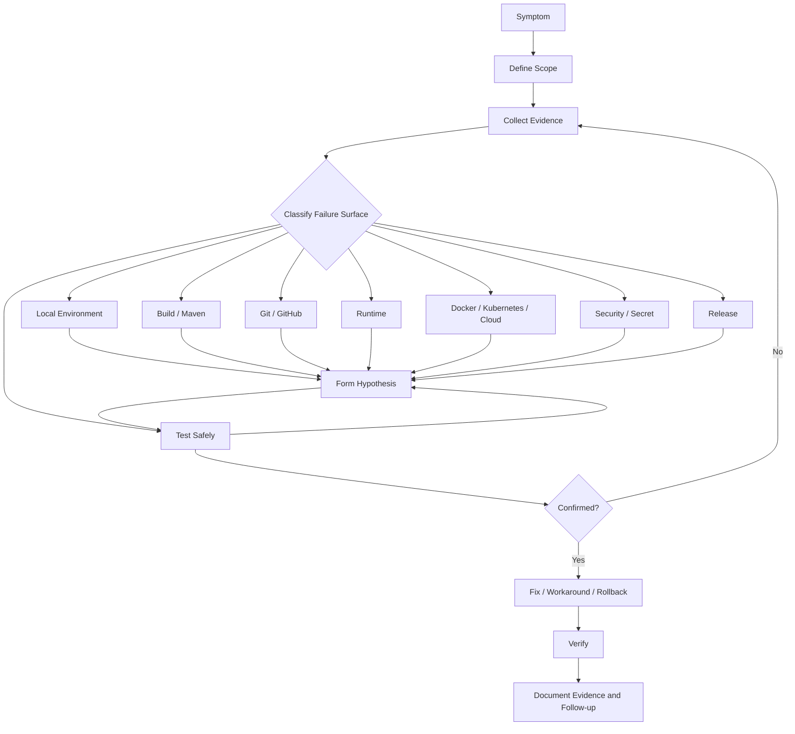
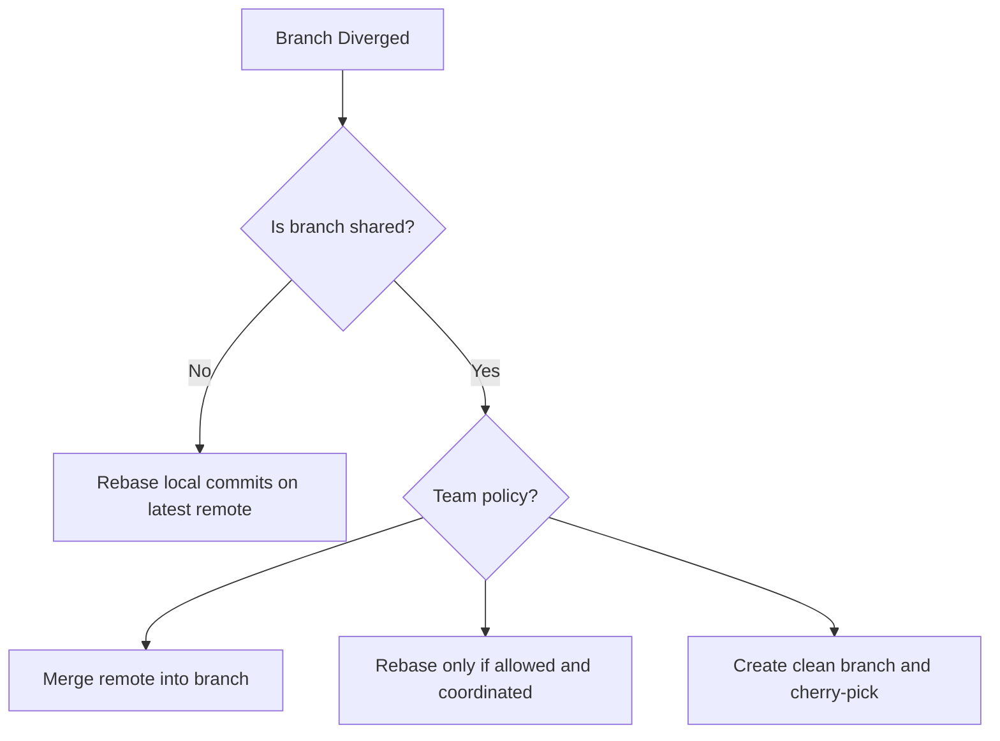
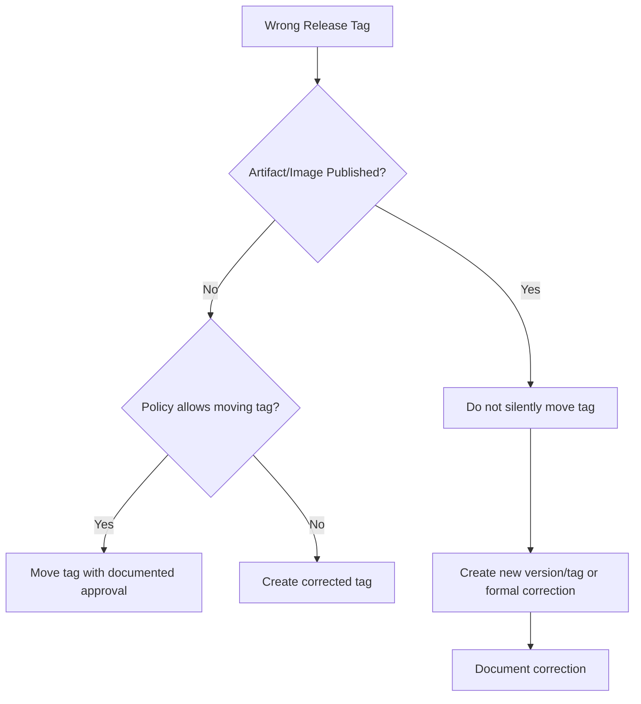

# Part 055 — Troubleshooting Playbook

## 1. Core idea

Troubleshooting bukan aktivitas mencoba command secara acak sampai masalah hilang. Troubleshooting yang matang adalah proses mengubah symptom menjadi evidence, evidence menjadi hypothesis, hypothesis menjadi test, lalu test menjadi decision.

Untuk senior backend engineer, playbook troubleshooting harus menjaga empat hal sekaligus:

- **correctness**: akar masalah dipahami, bukan hanya symptom hilang sementara,
- **safety**: command tidak memperluas blast radius,
- **reproducibility**: orang lain bisa menjalankan ulang diagnosis,
- **traceability**: keputusan dan perubahan bisa diaudit.

Dalam sistem enterprise Java/JAX-RS, masalah tooling sering muncul di area berikut:

- local setup gagal,
- Maven build gagal,
- test gagal local atau hanya CI,
- dependency tidak resolve,
- branch Git diverged,
- merge conflict terlalu besar,
- PR check stuck,
- GitHub Actions permission denied,
- Docker build gagal,
- Kubernetes command gagal,
- cloud CLI access denied,
- secret bocor,
- release tag salah.

Playbook ini bukan kumpulan command final. Ini adalah pola berpikir agar command yang dipilih punya alasan.

---

## 2. Troubleshooting operating principles

### 2.1 Evidence first

Sebelum mengubah apa pun, kumpulkan evidence minimal:

- command yang dijalankan,
- exact error message,
- timestamp,
- branch/commit/tag,
- environment,
- tool version,
- relevant log snippet,
- recent change,
- scope impact.

Contoh:

```bash
pwd
git rev-parse --show-toplevel
git status --short
git rev-parse --short HEAD
java -version
./mvnw -version
```

Tujuannya bukan membuat ritual command. Tujuannya memastikan diagnosis tidak berdiri di atas asumsi yang salah.

### 2.2 Read-only first

Mulai dari command observasi:

```bash
git status
mvn -v
kubectl get pods
kubectl describe pod <pod>
kubectl logs <pod>
docker inspect <container>
```

Tunda command mutating seperti:

```bash
git reset --hard
git clean -fdx
kubectl delete pod
kubectl rollout restart deployment/<name>
docker system prune
rm -rf ~/.m2/repository
```

Command mutating boleh dilakukan jika:

- scope jelas,
- backup/recovery jelas,
- environment benar,
- efek samping dipahami,
- approval sudah sesuai proses tim.

### 2.3 One hypothesis at a time

Jangan mengubah Java version, Maven cache, branch, dependency, env var, dan Docker image sekaligus. Jika masalah hilang setelah lima perubahan, akar masalah tetap tidak diketahui.

Pattern yang lebih baik:

```text
Symptom: build fails in CI but passes locally.
Hypothesis 1: Java version mismatch.
Test: compare java -version in local and CI.
Result: mismatch found.
Action: align toolchain or workflow setup-java version.
```

### 2.4 Minimize blast radius

Untuk production atau shared environment:

- pilih read-only command dulu,
- gunakan namespace/context yang eksplisit,
- hindari wildcard destructive,
- hindari manual hotfix tanpa traceability,
- gunakan rollback path yang sudah disetujui,
- dokumentasikan command yang dijalankan.

### 2.5 Prefer reproducible command over verbal explanation

Bug report yang baik berisi command yang bisa dijalankan ulang:

```bash
curl -sS \
  -H 'Accept: application/json' \
  -H 'X-Correlation-ID: debug-2026-07-11-001' \
  'https://example.internal/api/quotes/123' \
  | jq .
```

Lebih baik daripada:

```text
API quote kadang error kalau saya hit dari local.
```

### 2.6 Stop condition

Troubleshooting harus punya stop condition. Contoh:

- root cause confirmed,
- workaround confirmed,
- rollback executed,
- escalation needed,
- data access/security risk detected,
- change requires approval,
- evidence insufficient.

Senior engineer tidak memaksa semua masalah selesai dengan akses dan informasi yang terbatas.

---

## 3. Troubleshooting mental model



Failure surface yang salah menghasilkan debugging yang lama. Contoh: error `Connection refused` bisa karena aplikasi mati, port salah, container belum expose port, NetworkPolicy, service discovery, atau local proxy. Jangan langsung menyimpulkan bug Java.

---

## 4. Minimal triage packet

Gunakan format ini saat meminta bantuan atau membuat issue internal.

```mdx
## Symptom
Apa yang gagal?

## Impact
Siapa/apa yang terdampak? Local, CI, staging, production, satu service, semua service?

## First Seen
Kapan mulai terjadi? Sertakan timezone.

## Environment
OS, branch, commit, Java version, Maven version, Docker/Kubernetes/cloud context.

## Reproduction
Command minimal untuk reproduce.

## Expected
Apa behavior yang seharusnya?

## Actual
Exact error/log/status.

## Recent Change
Commit, dependency bump, pipeline change, config change, deployment, secret rotation.

## Evidence
Log snippet, screenshot jika perlu, CI run URL, artifact, command output.

## Actions Already Tried
Apa yang sudah dicoba dan hasilnya.

## Current Hypothesis
Dugaan sementara dan confidence level.

## Risk / Constraints
Hal yang tidak boleh dilakukan, data sensitif, production risk, approval requirement.
```

Triage packet membuat diskusi tidak berputar-putar.

---

## 5. Playbook: local setup fails

### 5.1 Typical symptoms

- repository tidak bisa build setelah clone,
- script setup gagal,
- Docker Compose tidak start,
- local database/broker tidak reachable,
- env var missing,
- Java/Maven version mismatch,
- permission denied pada script,
- port conflict.

### 5.2 First checks

```bash
pwd
git status --short
git rev-parse --show-toplevel
uname -a
java -version
./mvnw -version
```

Cek executable bit:

```bash
ls -l ./mvnw
ls -l scripts/ 2>/dev/null || true
```

Cek port umum:

```bash
lsof -i :8080
lsof -i :5432
lsof -i :6379
```

Cek Docker:

```bash
docker version
docker compose version
docker ps
```

### 5.3 Common causes

| Symptom | Likely cause | Safer next step |
|---|---|---|
| `Permission denied: ./mvnw` | executable bit missing | `chmod +x ./mvnw`, then check Git file mode policy |
| Java class version error | JDK mismatch | compare required Java version with local version |
| port already allocated | local process conflict | identify owning process before killing |
| database connection refused | dependency service not running | check compose service status/log |
| script fails on macOS | GNU/BSD command difference | check script portability |
| config not found | missing local env/profile | compare README with actual config source |

### 5.4 Unsafe shortcuts

Avoid immediately running:

```bash
rm -rf ~/.m2/repository
docker system prune -af
git clean -fdx
```

These commands may remove useful evidence, cached artifacts, local work, or unrelated containers/images.

### 5.5 Senior-level fix expectation

A good fix does not only unblock one developer. It improves the onboarding surface:

- update README,
- add setup validation script,
- improve error message,
- add `.env.example`,
- pin tool versions,
- add `doctor` command,
- document OS caveats.

---

## 6. Playbook: Maven build fails

### 6.1 Classify the failure

Before fixing, classify:

- compilation failure,
- dependency resolution failure,
- plugin execution failure,
- unit test failure,
- integration test failure,
- packaging failure,
- install/deploy failure,
- environment/toolchain mismatch.

Run with useful detail:

```bash
./mvnw -V -e clean verify
```

Use debug only when needed because it is noisy and may print sensitive paths/config:

```bash
./mvnw -X clean verify
```

### 6.2 Compilation failure

Evidence to collect:

```bash
./mvnw -V -e compile
```

Check:

- Java source/target/release mismatch,
- missing generated source,
- annotation processor failure,
- dependency not on compile classpath,
- package rename issue,
- Jakarta vs javax namespace mismatch.

Senior question:

> Did the compile failure reveal a real contract break or only a local tool mismatch?

### 6.3 Dependency resolution failure

Commands:

```bash
./mvnw -U -e dependency:tree
./mvnw -e dependency:go-offline
```

Check:

- repository credential,
- internal repository outage,
- snapshot metadata stale,
- dependency version typo,
- removed artifact,
- mirror/proxy misconfiguration,
- local repository corruption,
- parent POM not resolvable.

Do not delete entire `~/.m2` first. Narrow the affected artifact:

```bash
rm -rf ~/.m2/repository/com/example/problem-artifact
```

### 6.4 Plugin failure

Check:

```bash
./mvnw -e help:effective-pom
./mvnw -e help:effective-settings
```

Look for:

- plugin version not pinned,
- plugin inherited from parent POM,
- plugin execution bound to unexpected phase,
- profile-specific plugin config,
- missing tool binary,
- OS-dependent plugin behavior.

### 6.5 Build failure checklist

- Is the failure local-only or CI-only?
- Is Java version aligned?
- Is Maven wrapper used?
- Is the failing phase known?
- Is the failing module known?
- Is the dependency/plugin inherited?
- Is a profile active unexpectedly?
- Is a generated source missing?
- Is the failure deterministic?
- Is there a recent dependency or plugin change?

---

## 7. Playbook: test fails locally

### 7.1 First rule

Do not immediately skip tests. A failing test is either:

- valid signal,
- environment mismatch,
- flaky test,
- bad test isolation,
- bad fixture,
- hidden dependency on local state.

### 7.2 Narrow the test

```bash
./mvnw -Dtest=SomeTest test
./mvnw -Dtest=SomeTest#specificMethod test
```

For integration tests:

```bash
./mvnw -Dit.test=SomeIT verify
./mvnw -Dit.test=SomeIT#specificMethod verify
```

### 7.3 Check test surface

- Does it need database?
- Does it need Kafka/RabbitMQ/Redis?
- Does it need Testcontainers?
- Does it depend on timezone?
- Does it depend on locale?
- Does it depend on test order?
- Does it assume port availability?
- Does it read external config?
- Does it use real clock/randomness?

### 7.4 Evidence

Collect:

```bash
ls -la target/surefire-reports 2>/dev/null || true
ls -la target/failsafe-reports 2>/dev/null || true
```

Inspect:

```bash
less target/surefire-reports/*.txt
less target/failsafe-reports/*.txt
```

### 7.5 Fix direction

Good fixes usually improve isolation:

- deterministic clock,
- isolated temp directory,
- unique database schema/container,
- explicit test fixture,
- no dependency on test order,
- no real external service unless integration test boundary is intentional,
- clear naming convention for unit vs integration tests.

---

## 8. Playbook: test fails only in CI

### 8.1 Treat CI as evidence, not enemy

CI-only failure often reveals hidden local assumption:

- OS difference,
- Java version difference,
- Maven version difference,
- timezone/locale difference,
- CPU/memory constraint,
- slower IO,
- missing env var,
- different active profile,
- clean workspace,
- no local cache,
- parallelism.

### 8.2 Compare local vs CI

Add or inspect existing diagnostic steps:

```bash
java -version
./mvnw -version
uname -a
locale
date
pwd
find . -maxdepth 2 -type f | sort | head -100
```

In GitHub Actions, check:

- runner image,
- `actions/setup-java` version and distribution,
- Maven cache key,
- active profile,
- secret availability,
- working directory,
- matrix values.

### 8.3 Common CI-only causes

| Symptom | Likely cause |
|---|---|
| test times out | slower runner, missing service, deadlock, network wait |
| file not found | case-sensitive filesystem, missing generated file |
| permission denied | executable bit missing |
| dependency cannot resolve | repository credential not available |
| integration test fails | service container not ready |
| different snapshot used | cache or snapshot update behavior |

### 8.4 Senior review rule

If a test only passes on one developer machine, the test is not trustworthy enough for release confidence.

---

## 9. Playbook: dependency cannot resolve

### 9.1 Identify the exact coordinate

Look for:

```text
groupId:artifactId:packaging:version
```

Then inspect:

```bash
./mvnw -e dependency:tree -Dincludes=groupId:artifactId
./mvnw -e help:effective-pom
./mvnw -e help:effective-settings
```

### 9.2 Check resolution path

Resolution may involve:

- local repository,
- corporate mirror,
- internal repository,
- public Maven Central,
- snapshot repository,
- release repository,
- proxy settings,
- credentials,
- parent POM,
- BOM.

### 9.3 Common failure modes

- dependency version exists locally but not in clean CI,
- snapshot was overwritten or expired,
- release artifact not promoted,
- repository credentials missing,
- artifact published under different groupId,
- dependency declared only in `dependencyManagement` but not as actual dependency,
- transitive dependency excluded too broadly,
- parent POM version mismatch.

### 9.4 Safer cleanup

Prefer deleting one artifact path:

```bash
rm -rf ~/.m2/repository/com/example/problem-artifact
```

Avoid broad cleanup unless you understand the cost:

```bash
rm -rf ~/.m2/repository
```

---

## 10. Playbook: Git branch diverged

### 10.1 Symptom

Git says local and remote have diverged, or pull requires merge/rebase strategy.

First checks:

```bash
git status
git branch -vv
git log --oneline --graph --decorate --max-count=30 --all
git fetch --prune
```

### 10.2 Decision model



### 10.3 Safe options

If branch is personal:

```bash
git fetch origin
git rebase origin/main
```

If branch is shared:

```bash
git fetch origin
git merge origin/main
```

If history is messy:

```bash
git switch -c clean-branch origin/main
git cherry-pick <commit1> <commit2>
```

### 10.4 Avoid

Avoid force push to shared branch unless explicitly allowed:

```bash
git push --force
```

Prefer safer form when rewriting your own remote branch:

```bash
git push --force-with-lease
```

---

## 11. Playbook: merge conflict too large

### 11.1 Why conflict becomes too large

Common causes:

- branch lived too long,
- PR too large,
- generated files committed,
- formatting mixed with logic change,
- dependency/POM churn,
- multiple teams editing same config,
- release branch divergence,
- cherry-pick across incompatible history.

### 11.2 First checks

```bash
git status
git diff --name-only --diff-filter=U
git diff --check
```

Inspect conflict file list:

```bash
git diff --name-only --diff-filter=U | sort
```

### 11.3 Strategy

1. Separate mechanical changes from logical changes.
2. Resolve high-risk files manually: POM, migration, generated config, API schema.
3. Regenerate generated files if generator is authoritative.
4. Run targeted tests after resolving each risky area.
5. Do not blindly choose ours/theirs for domain logic.

### 11.4 Command awareness

```bash
git checkout --ours path/to/file
git checkout --theirs path/to/file
git add path/to/file
git rebase --continue
```

During rebase, `ours` and `theirs` can feel reversed relative to intuition. Verify before applying broadly.

### 11.5 Senior prevention

- keep PR small,
- rebase/merge regularly,
- avoid unrelated formatting,
- isolate generated artifacts,
- define ownership for high-conflict files,
- use lockstep review for release/config/POM changes.

---

## 12. Playbook: PR check stuck

### 12.1 Classify stuck state

A PR check may be:

- queued,
- waiting for runner,
- waiting for approval,
- blocked by concurrency group,
- blocked by environment protection,
- cancelled,
- skipped due to path filter,
- not triggered due to event mismatch,
- waiting on required external check,
- failing silently because workflow syntax is invalid.

### 12.2 First checks

In GitHub UI, inspect:

- Checks tab,
- Actions tab,
- workflow run status,
- job logs,
- skipped jobs,
- required checks in branch protection,
- commit SHA associated with run.

From CLI if available:

```bash
gh pr checks
gh run list --limit 10
gh run view <run-id> --log
```

### 12.3 Common causes

| Symptom | Likely cause |
|---|---|
| required check expected but absent | workflow not triggered, check renamed, branch protection stale |
| job waiting forever | runner capacity or environment approval |
| job skipped | path filter, branch filter, conditional expression |
| workflow not visible | YAML syntax error or wrong directory |
| rerun does not help | permission/config issue, not transient failure |

### 12.4 Senior fix expectation

If required check is stale after workflow rename, fix governance config, not only rerun CI.

---

## 13. Playbook: GitHub Actions permission denied

### 13.1 Common symptoms

- cannot push tag,
- cannot publish package,
- cannot upload artifact,
- cannot request OIDC token,
- cannot comment on PR,
- cannot read secret/environment,
- cannot deploy to protected environment.

### 13.2 Check permission model

Inspect workflow:

```yaml
permissions:
  contents: read
  packages: write
  id-token: write
```

Check:

- workflow-level permissions,
- job-level permissions,
- repository default token permission,
- fork PR restrictions,
- environment protection,
- secret availability,
- OIDC trust policy,
- organization policy.

### 13.3 Safety concern

Do not solve permission denied by giving broad permissions blindly:

```yaml
permissions: write-all
```

Prefer least privilege and document why each permission is needed.

### 13.4 Review questions

- What resource is the job trying to access?
- Is this read or write?
- Is it needed for all jobs or only one job?
- Does it run on untrusted PR code?
- Are secrets exposed to forked PRs?
- Can OIDC replace long-lived cloud secrets?

---

## 14. Playbook: Docker build fails

### 14.1 Classify failure

- Dockerfile syntax failure,
- base image pull failure,
- dependency download failure,
- Maven build failure inside image,
- missing file due to build context,
- permission issue,
- architecture mismatch,
- network/proxy issue,
- layer cache issue.

### 14.2 First checks

```bash
docker version
docker build --progress=plain -t debug-image .
docker images | head
docker system df
```

Check build context:

```bash
find . -maxdepth 2 -type f | sort | head -100
cat .dockerignore 2>/dev/null || true
```

### 14.3 Common causes

| Symptom | Likely cause |
|---|---|
| file missing in build | `.dockerignore` excludes it or wrong context |
| permission denied | non-root user cannot access path |
| dependency download fails | proxy, credential, repository outage |
| works local but not CI | BuildKit/cache/architecture difference |
| image runs but app fails | runtime env/config missing |

### 14.4 Senior review questions

- Is the image build reproducible?
- Is base image pinned enough?
- Does build leak secrets into layers?
- Is Maven cache handled safely?
- Does runtime image run as non-root?
- Are build-time and runtime dependencies separated?

---

## 15. Playbook: Kubernetes command fails

### 15.1 First safety check

Before any Kubernetes action:

```bash
kubectl config current-context
kubectl config get-contexts
kubectl get ns
```

Never assume context.

### 15.2 Read-only diagnosis

```bash
kubectl get pods -n <namespace>
kubectl describe pod <pod> -n <namespace>
kubectl logs <pod> -n <namespace>
kubectl get events -n <namespace> --sort-by='.lastTimestamp'
```

For deployment:

```bash
kubectl get deploy -n <namespace>
kubectl describe deploy <deployment> -n <namespace>
kubectl rollout status deploy/<deployment> -n <namespace>
```

### 15.3 Common failure surfaces

- wrong context,
- wrong namespace,
- RBAC denied,
- pod not found because rollout changed name,
- container name required,
- image pull backoff,
- crash loop,
- readiness probe failing,
- secret/configmap missing,
- network policy,
- resource quota,
- node scheduling issue.

### 15.4 Mutating command caution

Commands like these require strong context certainty:

```bash
kubectl delete pod <pod>
kubectl rollout restart deploy/<deployment>
kubectl scale deploy/<deployment> --replicas=0
kubectl apply -f file.yaml
```

In GitOps environments, manual `kubectl apply` may be overwritten or violate process.

---

## 16. Playbook: cloud CLI access denied

### 16.1 First checks

For AWS:

```bash
aws sts get-caller-identity
aws configure list
```

For Azure:

```bash
az account show
az account list --output table
```

Check:

- account/subscription/tenant,
- profile,
- region,
- role/group assignment,
- resource scope,
- MFA/session expiry,
- environment selection,
- private network requirement.

### 16.2 Common causes

- wrong account/profile,
- expired SSO login,
- missing role assignment,
- resource exists in different region/subscription,
- conditional access policy,
- network path blocked,
- private endpoint only reachable from VPN/VNet,
- insufficient permission for write operation,
- least-privilege policy working as designed.

### 16.3 Senior behavior

Do not request broad admin access as first response. Ask for the specific action and resource scope:

```text
Need read access to container registry image metadata for service X in environment Y.
```

This is more reviewable than:

```text
Please give me access to AWS/Azure.
```

---

## 17. Playbook: secret leaked accidentally

### 17.1 Treat as incident, not cleanup task

If a secret is committed, pasted into logs, pushed to GitHub, printed in CI, or shared in chat, assume it is compromised.

Immediate goals:

1. stop further exposure,
2. notify according to process,
3. rotate/revoke secret,
4. identify blast radius,
5. remove exposure where appropriate,
6. document timeline,
7. prevent recurrence.

### 17.2 Do not rely only on history rewrite

Removing a secret from Git history does not guarantee the secret was not copied, cached, indexed, or downloaded. Rotation is mandatory.

### 17.3 Evidence to capture

- what secret type,
- where exposed,
- when exposed,
- who/what could access it,
- whether it was used after exposure,
- rotation status,
- downstream systems affected.

### 17.4 Common unsafe reactions

Avoid:

- deleting evidence before security review,
- silently force-pushing history,
- rotating without coordinating consumers,
- sharing the secret again in screenshots/logs,
- assuming private repository means safe.

### 17.5 Prevention

- pre-commit secret scanning,
- GitHub secret scanning,
- least-privilege tokens,
- short-lived credentials,
- OIDC instead of long-lived cloud keys,
- redacted logs,
- documented rotation runbook.

---

## 18. Playbook: release tag wrong

### 18.1 Why this is serious

A release tag may be connected to:

- Maven artifact version,
- Docker image tag,
- deployment manifest,
- release note,
- customer-visible release,
- rollback target,
- audit trail.

Wrong tag can break traceability even if code still works.

### 18.2 First checks

```bash
git fetch --tags --prune
git show <tag>
git rev-list -n 1 <tag>
git log --oneline --decorate --max-count=20
```

Check:

- is tag lightweight or annotated,
- who created it,
- when created,
- which commit it points to,
- whether artifact/image already published,
- whether deployment already happened.

### 18.3 Decision model



### 18.4 Senior rule

If tag has been consumed by CI, artifact repository, deployment, or external team, treat it as immutable unless release governance explicitly allows correction.

---

## 19. Production-safe troubleshooting steps

Use this flow for any high-risk environment.

### 19.1 Confirm context

```bash
whoami
hostname
date
kubectl config current-context 2>/dev/null || true
aws sts get-caller-identity 2>/dev/null || true
az account show 2>/dev/null || true
```

### 19.2 Confirm scope

- Which service?
- Which environment?
- Which tenant/customer/region if relevant?
- Which version/tag/commit?
- Which dependency?
- Is this active incident or normal investigation?

### 19.3 Start read-only

- inspect logs,
- inspect metrics,
- inspect deployment state,
- inspect config reference,
- inspect recent changes,
- inspect health endpoint,
- inspect CI/release history.

### 19.4 Mutate only with reason

For every mutating action, write:

```text
Action:
Reason:
Expected effect:
Rollback:
Approval:
Timestamp:
Operator:
```

This looks bureaucratic until a production incident needs reconstruction.

---

## 20. Internal verification checklist

Verify these inside the actual CSG/team context rather than assuming them.

### Local setup

- Official setup guide.
- Supported OS matrix.
- Required Java/Maven versions.
- Docker Compose/local dependency setup.
- Common onboarding failures.

### Maven/build

- Parent POM and BOM source.
- Internal artifact repository.
- Snapshot/release policy.
- Known dependency conflicts.
- CI Maven command and active profiles.

### Git/GitHub

- Branch strategy.
- Merge strategy.
- Force push policy.
- Branch protection rules.
- Required checks.
- CODEOWNERS.

### CI/CD

- GitHub Actions/Jenkins/GitLab pipeline source.
- Runner environment.
- Secret management.
- Artifact/image publishing flow.
- Deployment trigger and approval gates.

### Kubernetes/cloud

- Cluster/context naming convention.
- Namespace ownership.
- RBAC limits.
- GitOps process.
- Cloud account/subscription mapping.
- Network/private endpoint requirements.

### Incident/security

- Incident escalation process.
- RCA template.
- Secret leak response process.
- Approved evidence-sharing channels.
- Command restrictions in production.

---

## 21. PR review checklist

When reviewing a troubleshooting fix or runbook update, ask:

### Correctness

- Does the fix address root cause or only symptom?
- Is the diagnosis evidence-backed?
- Are reproduction steps included?
- Are environment assumptions explicit?

### Safety

- Are destructive commands guarded?
- Is production context handled safely?
- Is rollback documented?
- Are secrets redacted?

### Reproducibility

- Can another engineer reproduce the issue?
- Are versions and context captured?
- Is command output deterministic enough?
- Are local/CI differences explained?

### Productivity

- Does the fix reduce future debugging time?
- Is the error message improved?
- Is documentation updated?
- Is there a `doctor`/validation command opportunity?

### Security

- Does the playbook avoid leaking secrets?
- Are permissions least-privilege?
- Are logs safe to share?
- Is incident/security escalation clear?

---

## 22. Key takeaways

- Troubleshooting is controlled learning under uncertainty.
- Read-only first protects evidence and limits blast radius.
- The right failure surface matters more than the number of commands executed.
- CI-only failures usually reveal hidden local assumptions.
- Secret leaks are security incidents, not simple cleanup tasks.
- Release tag mistakes are traceability problems, not merely Git mistakes.
- A senior engineer improves the system so the same class of issue becomes easier to diagnose next time.
