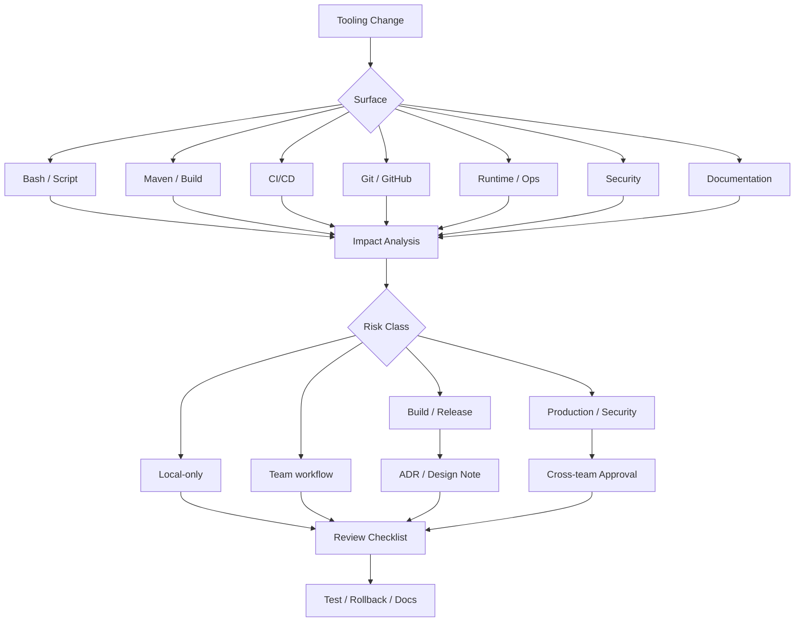

# Part 056 — PR Review and Architecture Decision Checklist

## 1. Core idea

Tooling change often looks small:

- edit one shell script,
- bump one Maven plugin,
- add one GitHub Actions step,
- change one Dockerfile line,
- modify one deployment command,
- add one dependency exclusion,
- rename one branch protection check.

But tooling change can affect every engineer, every build, every release, every rollback, and every incident response. That is why senior-level review for tooling must be stricter than normal code-style review.

The goal of this part is to provide a review framework for changes that touch:

- Bash scripts,
- Linux commands,
- Git workflow,
- GitHub workflow,
- Maven POM,
- dependencies,
- build reproducibility,
- CI/CD,
- release process,
- security,
- local developer workflow,
- operational tooling,
- documentation,
- ADR and architecture decisions.

A good tooling review asks:

> Does this change make the system easier to build, test, release, debug, secure, and recover?

Not merely:

> Does this command work on my machine?

---

## 2. Tooling review mental model



A tooling PR is not just a diff. It is a change to an operating system for engineers.

---

## 3. Risk classification

### 3.1 Low risk

Examples:

- add helper alias documentation,
- improve README command example,
- add non-default local convenience script,
- improve script help text.

Review focus:

- clarity,
- correctness,
- no hidden side effect.

### 3.2 Medium risk

Examples:

- change local setup script,
- change test command,
- add Makefile target,
- update GitHub PR template,
- update Maven plugin minor version.

Review focus:

- backward compatibility,
- local/CI alignment,
- cross-platform behavior,
- developer productivity.

### 3.3 High risk

Examples:

- change CI required check,
- alter Maven parent POM behavior,
- change artifact publishing step,
- change Docker image build,
- change dependency management/BOM,
- modify release script.

Review focus:

- release safety,
- reproducibility,
- rollback,
- security,
- governance.

### 3.4 Critical risk

Examples:

- change production deployment mechanism,
- change cloud credentials/OIDC trust,
- change branch protection bypass,
- change secret handling,
- change signing/provenance/SBOM process,
- change shared workflow used by many repositories.

Review focus:

- cross-team approval,
- security review,
- platform/SRE involvement,
- auditability,
- incident rollback,
- migration plan.

---

## 4. Universal tooling PR checklist

Use this for every tooling PR.

### 4.1 Purpose

- What problem does this change solve?
- Is the problem real and evidenced?
- Is this fixing root cause or symptom?
- Is the target audience clear: local dev, CI, release, production support, security, platform?

### 4.2 Scope

- Which repositories/modules/services are affected?
- Is the change local-only or shared?
- Does it affect CI or release?
- Does it affect production operation?
- Does it affect onboarding?

### 4.3 Compatibility

- Does it work on supported OSes?
- Does it work with Maven wrapper?
- Does it work with required Java version?
- Does it preserve existing commands?
- Does it require migration?

### 4.4 Safety

- Can it delete, overwrite, publish, deploy, revoke, rotate, or mutate shared state?
- Does it have dry-run mode if destructive?
- Does it check environment/context before acting?
- Does it fail closed or fail open?
- Does it have rollback steps?

### 4.5 Observability

- Are logs clear?
- Are error messages actionable?
- Does it print enough context without leaking secrets?
- Does CI expose artifacts/test reports?
- Can failure be diagnosed quickly?

### 4.6 Security

- Does it expose secrets?
- Does it broaden token permissions?
- Does it use third-party actions/tools?
- Are versions pinned?
- Are credentials short-lived where possible?
- Does it run untrusted code with secrets?

### 4.7 Reproducibility

- Are tool versions pinned?
- Is output deterministic enough?
- Does it depend on local cache?
- Does it depend on network availability?
- Does it behave differently local vs CI?

### 4.8 Documentation

- Is README/CONTRIBUTING updated?
- Is help text available?
- Are examples included?
- Are failure modes documented?
- Are internal verification items listed?

---

## 5. Bash script review checklist

### 5.1 Structure

- Has a correct shebang?
- Is Bash required, or would POSIX `sh` be enough?
- Does the file have executable bit if intended to run directly?
- Are functions named clearly?
- Is there a `usage`/`help` function?
- Are arguments validated?

Example:

```bash
#!/usr/bin/env bash
set -Eeuo pipefail

usage() {
  cat <<'EOF'
Usage: ./scripts/build.sh [--clean] [--skip-tests]
EOF
}
```

### 5.2 Strict mode and caveats

- Is `set -e` used safely?
- Is `pipefail` enabled where pipeline failure matters?
- Are expected non-zero commands handled explicitly?
- Are unset variables guarded?
- Are traps used for cleanup?

Bad:

```bash
grep "$pattern" file.txt | head -1
```

Better when no match is acceptable:

```bash
match="$(grep "$pattern" file.txt | head -1 || true)"
```

### 5.3 Quoting and expansion

- Are variables quoted?
- Are arrays used for command arguments?
- Are globs intentional?
- Are paths with spaces handled?
- Is command substitution safe?

Bad:

```bash
rm -rf $TARGET_DIR
```

Better:

```bash
: "${TARGET_DIR:?TARGET_DIR is required}"
rm -rf -- "$TARGET_DIR"
```

### 5.4 Safety and idempotency

- Can the script run twice safely?
- Does it check current state before mutating?
- Does it support dry-run for risky operations?
- Does it confirm production/shared environment?
- Does it avoid broad wildcard deletion?

### 5.5 Logging

- Does it log major steps?
- Does it separate info/warn/error?
- Does it avoid leaking secrets?
- Does it print commands only when safe?

### 5.6 Review decision

Block the PR if:

- destructive command has no guard,
- secret can be printed,
- script behavior depends on undocumented env var,
- script silently ignores critical failure,
- local and CI behavior diverge without reason.

---

## 6. Linux command review checklist

When a PR adds Linux command to README, script, CI, Dockerfile, or runbook, review:

### 6.1 Portability

- Is command GNU-specific?
- Does it work on macOS/BSD tools?
- Is it Linux-only by design?
- Is containerized execution preferable?

### 6.2 Safety

- Does it mutate files, process, network, or cluster state?
- Does it require root?
- Does it operate recursively?
- Does it follow symlinks?
- Does it handle missing files?

### 6.3 Correctness

- Does it handle whitespace?
- Does it handle empty result?
- Does it handle many files?
- Does it preserve exit code?
- Does it handle timezone/locale?

### 6.4 Production support

- Is it read-only first?
- Does it include namespace/context flags?
- Does it have example output?
- Does it show how to capture evidence?
- Does it avoid exposing sensitive data?

Example risky command:

```bash
kubectl delete pod $(kubectl get pod | grep quote | awk '{print $1}')
```

Safer pattern:

```bash
kubectl get pods -n "$NAMESPACE" -l app=quote-service
# If approved:
kubectl delete pod -n "$NAMESPACE" -l app=quote-service
```

---

## 7. Git workflow review checklist

Review changes that affect branch, commit, tag, rebase, merge, or release flow.

### 7.1 Branching

- Does this align with internal branch strategy?
- Does it affect release/hotfix branch?
- Does it require force push?
- Does it preserve audit history?

### 7.2 Commit hygiene

- Are commits atomic?
- Are generated files separated from logic changes?
- Is formatting separated from behavior change?
- Is commit message meaningful?

### 7.3 History rewriting

- Is rebase/squash safe for this branch?
- Is the branch shared?
- Is force-with-lease used instead of force?
- Is the risk communicated?

### 7.4 Tags

- Is tag immutable after publishing?
- Is annotated/signed tag required?
- Does tag match artifact version?
- Does release note map to tag?

Block the PR/process if it normalizes silent tag movement after artifact publication.

---

## 8. GitHub workflow review checklist

### 8.1 Pull request process

- Does PR template still capture risk, testing, rollback, and migration?
- Are required reviewers appropriate?
- Are CODEOWNERS still accurate?
- Are review rules bypassed?

### 8.2 Branch protection and ruleset

- Are required checks renamed or removed?
- Is conversation resolution required?
- Is stale review dismissal appropriate?
- Is linear history policy preserved if required?
- Is admin bypass controlled?

### 8.3 Permissions

- Does repository permission change affect least privilege?
- Are teams mapped correctly?
- Are deployment environment approvals intact?

### 8.4 Auditability

- Can we reconstruct who approved and merged?
- Are release artifacts linked to PR/commit/tag?
- Are manual approvals logged?

---

## 9. GitHub Actions review checklist

### 9.1 Trigger

- Does workflow trigger on correct events?
- Does it run on PR, push, tag, release, or manual dispatch intentionally?
- Are branch/path filters correct?
- Could a critical check be skipped accidentally?

### 9.2 Jobs and dependencies

- Are job dependencies explicit via `needs`?
- Are build/test/scan/package/deploy separated?
- Does deploy depend on successful build and scan?
- Are matrix combinations controlled?

### 9.3 Runner

- Is runner OS explicit?
- Is runner trusted?
- Are self-hosted runners isolated?
- Does job require Docker or privileged mode?

### 9.4 Cache

- Is cache key correct?
- Can cache hide dependency issue?
- Is cache scoped safely?
- Is restore key too broad?

### 9.5 Artifacts

- Are artifacts named clearly?
- Are test reports uploaded?
- Are artifacts retained long enough?
- Are sensitive files excluded?

### 9.6 Permissions and secrets

- Are permissions least-privilege?
- Is `id-token: write` only where OIDC is used?
- Are secrets unavailable to untrusted PR code?
- Are third-party actions pinned?

Bad:

```yaml
permissions: write-all
```

Better:

```yaml
permissions:
  contents: read
  packages: write
  id-token: write
```

Only if each permission is needed.

---

## 10. Maven POM review checklist

### 10.1 Coordinates and packaging

- Are `groupId`, `artifactId`, `version` consistent?
- Is packaging correct: `jar`, `war`, `pom`?
- Does artifact identity align with release process?

### 10.2 Parent and inheritance

- Is parent POM version intentional?
- Is inherited config understood?
- Does child override parent safely?
- Is aggregator vs parent role clear?

### 10.3 Lifecycle impact

- Which phase is affected?
- Does `mvn verify` still run required tests/checks?
- Does package/deploy behavior change?
- Does install/deploy publish different artifact?

### 10.4 Plugin config

- Are plugin versions pinned or managed?
- Is plugin execution bound to correct phase?
- Does plugin behave differently by profile?
- Does plugin require external binary?

### 10.5 Effective POM

For non-trivial change, inspect:

```bash
./mvnw help:effective-pom
```

Review the effective result, not only the small diff.

---

## 11. Dependency review checklist

### 11.1 Direct dependency

- Why is this dependency needed?
- Is it used directly in code?
- Is scope correct?
- Is version managed centrally?
- Is there a lighter existing dependency?

### 11.2 Transitive impact

Run:

```bash
./mvnw dependency:tree
```

Check:

- new transitive dependencies,
- version conflicts,
- duplicate libraries,
- logging framework conflicts,
- Jakarta/javax namespace conflicts,
- dependency convergence,
- classpath size.

### 11.3 Exclusions

Review every exclusion carefully.

Questions:

- What conflict is being solved?
- What runtime behavior depends on excluded library?
- Is exclusion local or should version be aligned in dependency management?
- Are tests covering the affected path?

### 11.4 Security and license

- Any known CVE?
- Is license acceptable?
- Is dependency maintained?
- Is it from trusted source?
- Does it require SBOM update?

Block dependency PRs that add heavy or risky libraries without clear need.

---

## 12. Build reproducibility review checklist

### 12.1 Version pinning

- Java version pinned?
- Maven version pinned via wrapper?
- Maven plugins pinned?
- Dependencies pinned or managed?
- Docker base image pinned appropriately?

### 12.2 Hidden inputs

- Does build depend on local files outside repo?
- Does build depend on current timestamp?
- Does build depend on network without cache/repository control?
- Does build depend on OS locale/timezone?
- Does build depend on generated source not committed/reproducible?

### 12.3 Output determinism

- Is artifact name stable?
- Is artifact content stable enough?
- Is build metadata intentional?
- Is checksum/provenance generated if required?

### 12.4 CI authority

- Is CI the authoritative build?
- Can local build reproduce CI failure?
- Are local and CI commands aligned?

---

## 13. CI/CD review checklist

### 13.1 Pipeline stage integrity

- Source checkout correct?
- Build uses intended commit SHA?
- Tests run before package/publish?
- Scans run before deploy?
- Artifact published once?
- Deployment consumes immutable artifact?

### 13.2 Environment promotion

- Is promotion explicit?
- Are dev/staging/prod gates clear?
- Are approvals required where needed?
- Are environment-specific variables controlled?
- Is rollback path defined?

### 13.3 Failure behavior

- Does pipeline fail fast where appropriate?
- Are failures visible?
- Are partial publishes possible?
- Are deploy and publish atomic enough?
- Are retries safe?

### 13.4 Traceability

- Can artifact be traced to commit?
- Can deployment be traced to artifact?
- Can release note be traced to PRs?
- Are tags and versions consistent?

---

## 14. Release review checklist

### 14.1 Versioning

- Is version bump correct?
- Does Maven version match Git tag/release note?
- Is snapshot/release boundary respected?
- Is hotfix versioning clear?

### 14.2 Artifacts

- Is Maven artifact published to correct repository?
- Is container image tagged immutably?
- Is deployment manifest referencing intended image/artifact?
- Is SBOM/provenance generated if required?

### 14.3 Rollback and roll-forward

- Is rollback command/process documented?
- Is database migration backward compatible?
- Are feature flags available if needed?
- Is config rollback considered?
- Is the release observable after deploy?

### 14.4 Communication

- Is release note clear?
- Are breaking changes documented?
- Are downstream consumers notified?
- Are support/runbook updates included?

---

## 15. Security review checklist

### 15.1 Secrets

- Are secrets removed from logs?
- Are secrets avoided in env where policy discourages it?
- Are secrets unavailable to untrusted PRs?
- Are secret names not revealing sensitive structure?
- Is rotation process documented?

### 15.2 Tokens and permissions

- Are tokens least-privilege?
- Are long-lived credentials avoided?
- Is OIDC used where appropriate?
- Are workflow permissions scoped by job?
- Are cloud roles scoped by resource/environment?

### 15.3 Supply chain

- Are third-party actions pinned?
- Are external scripts downloaded safely?
- Are dependencies scanned?
- Is SBOM generated if required?
- Is artifact integrity preserved?

### 15.4 Local machine hygiene

- Does documentation avoid telling engineers to store secrets in shell history?
- Does it avoid copying production credentials into local files?
- Does it explain credential helper or approved secret access?

---

## 16. Local workflow review checklist

### 16.1 Onboarding

- Can a new engineer follow the guide?
- Are required tools listed?
- Are versions explicit?
- Are environment variables documented?
- Are dependency services documented?

### 16.2 Developer experience

- Are common tasks one command?
- Are errors actionable?
- Is setup idempotent?
- Is cleanup safe?
- Is command naming consistent?

### 16.3 Local/CI alignment

- Does local `test` map to CI `test`?
- Does local `verify` approximate CI enough?
- Are integration tests clearly separated?
- Are profile differences explicit?

### 16.4 Cross-platform

- Does workflow support documented OS matrix?
- Are WSL/macOS caveats written?
- Are line endings/executable bits handled?

---

## 17. Operational tooling review checklist

### 17.1 Read-only first

- Does runbook start with inspect commands?
- Are mutating commands clearly separated?
- Are production commands marked with warnings?
- Is namespace/context explicit?

### 17.2 Evidence capture

- Does it capture timestamps?
- Does it capture correlation/trace ID?
- Does it capture commit/tag/version?
- Does it capture deployment event?
- Does it redact sensitive data?

### 17.3 Blast radius

- Does command target one service/namespace/resource?
- Are wildcards avoided?
- Are label selectors precise?
- Are destructive actions approved?

### 17.4 Recovery

- Is rollback documented?
- Is roll-forward documented?
- Is escalation path included?
- Is post-action verification included?

---

## 18. Documentation review checklist

### 18.1 Completeness

- Does documentation answer what, why, when, how, and failure modes?
- Are prerequisites listed?
- Are examples copy-paste safe?
- Are expected outputs shown where useful?

### 18.2 Maintenance

- Is owner clear?
- Is doc linked from README/CONTRIBUTING?
- Does it duplicate another source of truth?
- Does it age well?

### 18.3 Safety

- Are environment names clear?
- Are production commands guarded?
- Are secrets redacted?
- Are destructive commands explained?

### 18.4 Internal verification

- Does the doc clearly mark what is internal process and must be verified?
- Does it avoid inventing team-specific rules?
- Does it point to actual source of truth?

---

## 19. ADR for tooling decisions

Not every tooling change needs an ADR. But use ADR or design note when the decision:

- affects many repositories,
- changes release process,
- changes CI/CD architecture,
- changes artifact publishing,
- changes security model,
- introduces shared workflow/library,
- changes developer setup significantly,
- has non-obvious trade-offs,
- is hard to reverse.

### 19.1 ADR template

```mdx
# ADR: <Decision Title>

## Status
Proposed | Accepted | Deprecated | Superseded

## Context
What problem exists? What constraints matter?

## Decision
What are we changing?

## Alternatives Considered
What options were rejected and why?

## Consequences
Positive and negative consequences.

## Rollout Plan
How will this be introduced safely?

## Rollback Plan
How can we revert if it fails?

## Security Considerations
Secrets, permissions, supply chain, auditability.

## Reproducibility Considerations
Tool versions, cache, deterministic output, local/CI parity.

## Operational Considerations
Debugging, observability, incident support, release impact.

## Internal Verification Checklist
Which internal team/process/repository must be verified?
```

### 19.2 Good ADR behavior

A good ADR makes trade-offs visible. It does not pretend a tooling choice has no cost.

Example trade-offs:

- faster CI vs weaker isolation,
- shared workflow vs repository autonomy,
- strict branch protection vs hotfix speed,
- dependency centralization vs service flexibility,
- local Docker dependencies vs setup complexity,
- reproducible build vs build duration.

---

## 20. Questions senior engineers should ask

### 20.1 For scripts

- What happens if this runs twice?
- What happens if a variable is empty?
- What happens if command in the middle fails?
- What happens on macOS/Windows/WSL?
- What happens if run from wrong directory?
- What does it print if it fails?

### 20.2 For Maven/build

- Which lifecycle phase changed?
- Is the effective POM what we expect?
- Does this affect all modules or one module?
- Does this change artifact identity?
- Does this make build less reproducible?
- Does it hide a dependency conflict?

### 20.3 For CI/CD

- Is this running trusted or untrusted code?
- Does this job need write permission?
- What happens if it fails halfway?
- Can it publish/deploy twice?
- Is artifact immutable?
- Is rollback possible?

### 20.4 For GitHub governance

- Are required checks still meaningful?
- Can CODEOWNERS be bypassed?
- Are stale approvals dismissed when relevant?
- Is admin bypass controlled?
- Is release approval auditable?

### 20.5 For production tooling

- Is context explicit?
- Is namespace/account/subscription explicit?
- Is command read-only or mutating?
- Is blast radius bounded?
- Is evidence captured?
- Is rollback documented?

### 20.6 For security

- Can secret leak into logs?
- Does this broaden access?
- Is the token short-lived?
- Are third-party components pinned?
- Is the action/dependency maintained?
- Is incident response clear?

---

## 21. Decision examples

### 21.1 Example: adding `make test`

Good review asks:

- Does `make test` call Maven wrapper?
- Does it run unit test only or full verify?
- Is naming clear?
- Does it work on supported OSes?
- Does CI use the same command or equivalent?
- Does failure output point to reports?

Potential decision:

```makefile
.PHONY: test
 test:
	./mvnw test
```

But if integration tests are important, maybe:

```makefile
.PHONY: verify
verify:
	./mvnw verify
```

The command name should not mislead.

### 21.2 Example: adding Maven dependency exclusion

Good review asks:

- What conflict is being solved?
- Is exclusion too broad?
- Should version be aligned via dependencyManagement instead?
- Are runtime paths tested?
- Does dependency tree after exclusion look correct?

### 21.3 Example: changing GitHub Actions permission

Good review asks:

- Why does this job need write permission?
- Can permission be scoped to one job?
- Does it run on PR from fork?
- Is OIDC trust policy limited to branch/environment?
- Are secrets protected by environment approval?

### 21.4 Example: changing release tag process

Good review asks:

- Who creates tags?
- Are tags signed/annotated?
- Can tags be moved?
- Does CI publish artifact from tag?
- What happens if tag is wrong?
- Is correction process documented?

---

## 22. Internal verification checklist

Verify these internally before enforcing any recommendation.

### Repository governance

- Branch protection rules.
- Repository rulesets.
- CODEOWNERS.
- Required checks.
- Merge strategy.
- Admin bypass policy.

### Build governance

- Parent POM ownership.
- BOM/version alignment policy.
- Maven plugin management policy.
- Dependency/SCA/license policy.
- Artifact repository publishing rules.

### CI/CD governance

- CI platform used: GitHub Actions, Jenkins, GitLab, or other.
- Runner ownership.
- Secret management.
- Deployment approval gates.
- OIDC/cloud trust policy.
- Artifact/image promotion flow.

### Release governance

- Versioning strategy.
- Tagging strategy.
- Release branch/hotfix branch process.
- Changelog/release note ownership.
- Rollback/roll-forward policy.

### Operational governance

- Production access policy.
- Kubernetes RBAC rules.
- Cloud account/subscription mapping.
- Incident escalation path.
- Approved runbook locations.

### Security governance

- Secret scanning tool.
- Dependency scanning tool.
- SBOM/provenance requirement.
- Commit signing requirement.
- Credential rotation process.

---

## 23. Review comment patterns

### 23.1 Weak review comment

```text
This script looks risky.
```

### 23.2 Strong review comment

```text
This script runs `rm -rf "$TARGET_DIR"` without validating that TARGET_DIR is non-empty and inside the repository workspace. Please add a guard, print the resolved path, and support `--dry-run` because this target may be run locally and in CI.
```

### 23.3 Weak review comment

```text
Why did you change the POM?
```

### 23.4 Strong review comment

```text
This adds a direct dependency version in the child module while the same family is managed by the parent BOM. Please either move version alignment into dependencyManagement or explain why this module intentionally diverges. Also include `mvn dependency:tree` output for the affected dependency family.
```

### 23.5 Weak review comment

```text
CI permission seems too much.
```

### 23.6 Strong review comment

```text
This job sets `contents: write` and `packages: write`, but only the publish job appears to need package write access. Please scope permissions at job level and keep build/test jobs read-only. Also confirm whether this workflow can run on forked PRs.
```

Good review comments identify the risk, explain the consequence, and propose a concrete direction.

---

## 24. Blocker vs non-blocker

### 24.1 Blocker examples

Block when:

- secret exposure risk exists,
- destructive command lacks guard,
- CI required check can be skipped accidentally,
- release artifact traceability is broken,
- dependency introduces known critical vulnerability without justification,
- branch protection is weakened without approval,
- production command lacks context safety,
- rollback path is missing for high-risk release change.

### 24.2 Non-blocker examples

Non-blocking suggestions:

- naming improvement,
- extra README example,
- minor log formatting,
- future refactor of duplicate helper,
- optional productivity alias.

Senior discipline means not everything becomes a blocker. Reserve blocking for correctness, safety, security, reproducibility, and release risk.

---

## 25. Key takeaways

- Tooling PRs change how engineers build, test, release, debug, and recover systems.
- Review the operational impact, not only syntax.
- Scripts require safety guards, idempotency, clear failure behavior, and secret hygiene.
- Maven changes require effective POM, dependency tree, lifecycle, and reproducibility awareness.
- CI/CD changes require permission, artifact, trigger, and rollback review.
- GitHub governance changes require auditability and bypass-risk review.
- High-risk tooling decisions deserve ADRs.
- Senior review is precise, evidence-based, and actionable.
