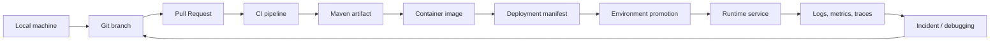

# Part 057 — 30/60/90-Day Tooling Onboarding Plan

> Fokus part ini bukan membuat checklist onboarding generik. Fokusnya adalah membuat rencana kerja 90 hari untuk memahami **tooling yang benar-benar menentukan efektivitas senior backend engineer**: local setup, repository navigation, Maven build, Git/GitHub workflow, CI/CD, release discipline, debugging scripts, incident tooling, dan internal verification.

Di tim enterprise seperti CSG Quote & Order, kemampuan coding saja tidak cukup. Senior engineer harus cepat memahami:

- bagaimana service dibangun;
- bagaimana dependency dikontrol;
- bagaimana PR masuk ke main branch;
- bagaimana artifact dipublish;
- bagaimana deployment dipromosikan;
- bagaimana failure didiagnosis;
- bagaimana perubahan tooling tidak merusak produktivitas tim atau safety production.

Part ini memberi peta 30/60/90 hari untuk masuk ke codebase dan workflow tanpa bergantung penuh pada tribal knowledge.

---

## 1. Core Mental Model

Onboarding tooling adalah proses menjawab satu pertanyaan besar:

> “Dari laptop saya sampai production incident, command, repository, pipeline, artifact, dan runbook apa saja yang benar-benar mengendalikan lifecycle service?”

Untuk senior engineer, onboarding tidak boleh berhenti di “project bisa jalan local”. Itu hanya baseline. Target sebenarnya adalah memahami **change lifecycle**.



Setiap node punya tooling, permission, failure mode, dan owner yang berbeda. Onboarding yang baik membuat semua node itu terlihat.

---

## 2. Why This Plan Exists

Tanpa rencana onboarding tooling, biasanya engineer baru mengalami pola buruk berikut:

1. Bisa menjalankan service local, tetapi tidak paham pipeline release.
2. Bisa membuat PR, tetapi tidak paham required checks dan governance.
3. Bisa menjalankan `mvn test`, tetapi tidak paham perbedaan local test, CI test, integration test, dan release verification.
4. Bisa membaca logs, tetapi tidak tahu correlation ID, trace ID, retention, atau redaction rule.
5. Bisa menjalankan `kubectl logs`, tetapi tidak tahu boundary antara safe read-only diagnosis dan unsafe mutation.
6. Bisa memperbaiki bug, tetapi tidak tahu bagaimana rollback atau release note dibuat.

Senior engineer perlu naik satu level: dari “menggunakan tool” menjadi “memahami operating model”.

---

## 3. 90-Day Outcome

Setelah 90 hari, target kemampuan konkret adalah:

- mampu setup service local dari nol dengan dokumentasi yang ada;
- mampu menjelaskan repository layout dan module boundary;
- mampu menjalankan build/test/package dengan Maven secara benar;
- mampu membaca dependency tree dan menemukan version drift;
- mampu membuat PR yang sesuai governance tim;
- mampu membaca pipeline CI/CD dan menemukan stage yang gagal;
- mampu menghubungkan commit, tag, artifact, image, deployment, dan release note;
- mampu debugging issue local, CI, container, Kubernetes, dan cloud access secara evidence-first;
- mampu membaca runbook incident dan membuat evidence bundle;
- mampu mengusulkan improvement tooling yang kecil, aman, dan berdampak.

---

## 4. First 30 Days — Establish Local and Repository Fluency

### Primary goal

Dalam 30 hari pertama, targetnya adalah **menjadi produktif secara aman**. Bukan harus tahu semua arsitektur, tetapi harus tahu cara membangun, menjalankan, mengetes, menavigasi, dan mengirim PR kecil tanpa merusak workflow tim.

### What to understand

- repository utama yang relevan;
- service yang dimiliki tim;
- local setup flow;
- Java/Maven version;
- dependency lokal seperti PostgreSQL, Kafka, RabbitMQ, Redis;
- Docker Compose atau local dependency runner jika ada;
- Git branch dan PR convention;
- basic CI checks;
- log format dan correlation ID dasar;
- dokumentasi onboarding yang valid dan yang sudah stale.

### Recommended sequence

#### Week 1 — Local environment and repository map

Target minggu pertama adalah menjawab:

> “Apa saja yang harus ada di mesin saya agar service bisa build, test, dan run?”

Checklist:

- Clone repository yang relevan.
- Baca `README`, `CONTRIBUTING`, `docs/`, `scripts/`, `.github/workflows`, `pom.xml`, dan `docker-compose.yml` jika ada.
- Catat required Java version.
- Catat required Maven version atau penggunaan Maven Wrapper.
- Jalankan command build yang resmi didokumentasikan.
- Jalankan unit test minimal.
- Jalankan service local jika tersedia.
- Identifikasi dependency external local.
- Catat command yang gagal dan penyebabnya.

Command yang biasanya berguna:

```bash
pwd
ls -la
find . -maxdepth 3 -type f \( -name "README*" -o -name "CONTRIBUTING*" -o -name "pom.xml" -o -name "docker-compose*.yml" \)
./mvnw -version
./mvnw -q -DskipTests package
./mvnw test
```

Jangan langsung membuat script baru di minggu pertama. Pahami dulu existing workflow.

#### Week 2 — Build and test workflow

Target minggu kedua adalah menjawab:

> “Apa perbedaan build local, build CI, test cepat, integration test, dan release verification?”

Checklist:

- Pahami Maven lifecycle yang digunakan tim.
- Cek apakah CI memakai `test`, `verify`, `package`, atau command custom.
- Cek Surefire dan Failsafe config.
- Cek test naming convention.
- Cek profile Maven yang aktif di CI.
- Cek test yang membutuhkan PostgreSQL/Kafka/RabbitMQ/Redis.
- Cek apakah Testcontainers digunakan.

Command yang biasanya berguna:

```bash
./mvnw -q help:active-profiles
./mvnw -q help:effective-pom > /tmp/effective-pom.xml
./mvnw -q dependency:tree > /tmp/dependency-tree.txt
./mvnw test
./mvnw verify
```

Evidence yang harus dicatat:

- command build canonical;
- command test cepat;
- command integration test;
- profile yang dibutuhkan;
- dependency local yang wajib hidup;
- failure umum saat setup.

#### Week 3 — Git and PR workflow

Target minggu ketiga adalah menjawab:

> “Bagaimana tim mengharapkan saya membuat branch, commit, PR, dan merespons review?”

Checklist:

- Cek branch utama.
- Cek branch naming convention.
- Cek commit message convention.
- Cek PR template.
- Cek required checks.
- Cek CODEOWNERS.
- Cek merge strategy: squash, rebase, atau merge commit.
- Cek apakah signed commit diperlukan.
- Cek apakah linear history diwajibkan.

Command yang biasanya berguna:

```bash
git remote -v
git branch -a
git log --oneline --decorate --graph -n 30
git status
git diff
git diff --staged
```

Prinsip minggu ketiga:

- buat PR kecil;
- jelaskan scope;
- lampirkan test evidence;
- jangan mengubah build/tooling tanpa reviewer yang tepat;
- jangan force push ke branch shared.

#### Week 4 — Basic runtime and log fluency

Target minggu keempat adalah menjawab:

> “Ketika service gagal local atau staging, evidence apa yang pertama saya cari?”

Checklist:

- Pahami startup command service.
- Pahami port service.
- Pahami health endpoint.
- Pahami environment variable wajib.
- Pahami log format.
- Pahami correlation ID/trace ID convention.
- Pahami cara melihat container logs jika local dependency memakai Docker.
- Pahami troubleshooting dasar connection error ke PostgreSQL/Kafka/RabbitMQ/Redis.

Command yang biasanya berguna:

```bash
ps aux | grep java
lsof -i :8080
curl -v http://localhost:8080/health
curl -v http://localhost:8080/actuator/health
 docker ps
 docker logs <container>
```

Catatan: endpoint health aktual harus diverifikasi internal. Jangan mengasumsikan path tertentu.

---

## 5. Days 31–60 — Understand CI/CD, Dependency, Governance, and Debugging Scripts

### Primary goal

Pada fase 31–60 hari, targetnya adalah **menjadi efektif dalam change delivery**. Anda tidak hanya membuat PR, tetapi memahami bagaimana PR divalidasi, dibangun, dipublish, dan dipromosikan.

### What to understand

- CI/CD workflow;
- GitHub Actions/Jenkins/GitLab pipeline jika digunakan;
- Maven dependency management;
- parent POM dan BOM;
- artifact repository;
- container image build;
- security scanning;
- release tag dan versioning;
- branch protection;
- automation scripts;
- local vs CI mismatch.

### Recommended sequence

#### Weeks 5–6 — CI/CD pipeline reading

Target:

> “Saya bisa membaca pipeline dari trigger sampai artifact/deployment.”

Checklist:

- Baca workflow YAML atau pipeline definition.
- Identifikasi trigger: PR, push, tag, manual dispatch, schedule.
- Identifikasi runner.
- Identifikasi environment variables dan secrets.
- Identifikasi build/test/scan/package stages.
- Identifikasi artifact upload/download.
- Identifikasi Docker build dan image push.
- Identifikasi deployment trigger.
- Identifikasi approval gate.

Pertanyaan penting:

- Apakah pipeline PR sama dengan pipeline main branch?
- Apakah release pipeline dipicu tag?
- Apakah artifact immutable?
- Apakah image tag memakai Git SHA, semantic version, atau build number?
- Apakah deployment menggunakan GitOps atau direct deploy?
- Apakah rollback dilakukan lewat redeploy image lama, revert manifest, atau release mechanism lain?

Failure mode umum:

| Failure | Kemungkinan penyebab | Evidence |
|---|---|---|
| CI-only test failure | env/profile berbeda, clock/timezone, test order, resource limit | CI logs, test report, active profile |
| Dependency cannot resolve | credential, repository outage, wrong version, snapshot expiry | Maven error, settings.xml, repository config |
| Docker build fails | wrong build context, missing file, base image unavailable | Docker logs, Dockerfile stage |
| Deployment blocked | approval gate, environment protection, failed smoke test | pipeline UI, environment logs |

#### Weeks 7–8 — Maven dependency and build governance

Target:

> “Saya bisa menjelaskan kenapa dependency tertentu ada dan siapa yang mengontrol versinya.”

Checklist:

- Baca parent POM.
- Baca `dependencyManagement`.
- Baca imported BOM.
- Baca `pluginManagement`.
- Jalankan dependency tree.
- Identifikasi direct dependency vs transitive dependency.
- Identifikasi dependency yang rawan conflict: Jakarta/Jersey, logging, JSON library, Kafka/RabbitMQ clients, database drivers, test libs.
- Cek Maven Enforcer rules jika ada.
- Cek dependency scanning result.

Command berguna:

```bash
./mvnw -q help:effective-pom > /tmp/effective-pom.xml
./mvnw -q dependency:tree > /tmp/dependency-tree.txt
./mvnw -q dependency:tree -Dincludes=jakarta.*
./mvnw -q dependency:tree -Dincludes=org.glassfish.jersey.*
./mvnw -q dependency:tree -Dverbose
```

Review stance:

- Jangan menambah dependency hanya karena mempercepat implementasi kecil.
- Jangan exclusion transitive dependency tanpa memahami consumer lain.
- Jangan upgrade library kritikal tanpa membaca compatibility dan runtime impact.
- Jangan mengandalkan “build green” sebagai satu-satunya bukti aman.

#### Weeks 8–9 — GitHub governance and review discipline

Target:

> “Saya tahu rule apa yang melindungi main branch dan kenapa rule itu ada.”

Checklist:

- Cek branch protection.
- Cek required checks.
- Cek required review count.
- Cek CODEOWNERS.
- Cek stale review dismissal.
- Cek conversation resolution requirement.
- Cek signed commit requirement.
- Cek admin bypass policy.
- Cek environment protection.

Pertanyaan ke senior/platform:

- Perubahan apa yang harus minta reviewer platform?
- Perubahan apa yang harus minta reviewer security?
- Perubahan apa yang harus minta reviewer database?
- Perubahan apa yang dianggap release-risky?
- Apakah dependency change punya approval khusus?

---

## 6. Days 61–90 — Improve Automation, Runbooks, and Release Safety

### Primary goal

Pada fase 61–90 hari, targetnya adalah **mulai memberi leverage ke tim**. Bukan membuat perubahan besar, tetapi mengurangi friction nyata: setup yang rapuh, script yang berbahaya, command yang tidak terdokumentasi, build yang lambat, atau runbook yang tidak lengkap.

### What to improve

- documentation gap;
- setup script yang tidak idempotent;
- command build/test yang tidak konsisten;
- pipeline step yang sulit didiagnosis;
- missing test report;
- dependency drift;
- release checklist yang tidak eksplisit;
- incident evidence template;
- local debugging command;
- PR template/checklist.

### Recommended sequence

#### Weeks 9–10 — Find high-leverage tooling pain

Cari pain point yang memenuhi tiga kriteria:

1. Sering terjadi.
2. Membuat engineer kehilangan waktu.
3. Bisa diperbaiki dengan perubahan kecil dan aman.

Contoh improvement yang baik:

- menambah dokumentasi command setup yang benar;
- menambah `--help` ke script internal;
- membuat script dry-run untuk command destructive;
- memperbaiki error message script;
- menambah Maven wrapper usage ke README;
- menambah troubleshooting section untuk dependency resolution;
- menambah command untuk menjalankan subset integration test;
- memperbaiki PR template agar test evidence eksplisit.

Contoh improvement yang terlalu besar untuk awal:

- mengganti branch strategy;
- mengganti build system;
- mengganti CI/CD platform;
- mengubah release process tanpa sponsor;
- menghapus shared dependency tanpa impact analysis;
- memperkenalkan tool baru yang belum ada ownernya.

#### Weeks 11–12 — Propose and ship small tooling improvements

Gunakan PR kecil dengan struktur:

```md
## Problem
Apa friction atau risiko yang diamati?

## Change
Apa perubahan kecil yang dilakukan?

## Why safe
Kenapa perubahan ini aman?

## Validation
Command apa yang dijalankan?

## Rollback
Bagaimana mengembalikan jika bermasalah?

## Internal verification
Siapa/apa yang sudah diverifikasi?
```

Untuk perubahan script/pipeline, lampirkan evidence:

```bash
./scripts/setup.sh --help
./scripts/setup.sh --dry-run
./mvnw test
./mvnw verify
```

Untuk perubahan dokumentasi, lampirkan before/after clarity:

- command sebelumnya ambigu;
- command baru eksplisit;
- expected output ditambahkan;
- common failure ditambahkan;
- owner/escalation ditambahkan.

---

## 7. Questions to Ask Senior Engineers

Pertanyaan yang bagus bukan “repo ini cara jalannya gimana?”, tetapi lebih struktural:

1. Service apa yang paling kritikal di tim ini?
2. Failure tooling apa yang paling sering menghambat tim?
3. Bagian pipeline mana yang paling rapuh?
4. Dependency mana yang paling sensitif untuk diubah?
5. Apa contoh PR yang dianggap ideal?
6. Apa contoh PR yang pernah menyebabkan regression?
7. Bagaimana tim melakukan hotfix?
8. Bagaimana rollback dilakukan?
9. Bagaimana release note dibuat?
10. Apa yang tidak boleh saya ubah tanpa diskusi dulu?

---

## 8. Questions to Ask Platform / DevOps / SRE

1. CI runner berjalan di mana?
2. Runner ephemeral atau long-lived?
3. Bagaimana secret disuntikkan ke pipeline?
4. Artifact repository apa yang digunakan?
5. Container registry apa yang digunakan?
6. Apakah deployment direct atau GitOps?
7. Bagaimana environment promotion bekerja?
8. Bagaimana observability diakses?
9. Command `kubectl` apa yang diizinkan untuk developer?
10. Apa escalation path saat deployment gagal?

---

## 9. Questions to Ask Security

1. Apakah commit signing diwajibkan?
2. Bagaimana secret leak harus dilaporkan?
3. Apakah dependency vulnerability punya SLA?
4. Apakah third-party GitHub Actions harus di-pin SHA?
5. Apakah SBOM wajib dibuat?
6. Bagaimana policy license dependency?
7. Apakah local credentials boleh disimpan di credential helper tertentu?
8. Apa rule untuk sharing logs/evidence?
9. Data apa yang harus di-redact?
10. Siapa approver untuk perubahan CI permission?

---

## 10. Documents to Find

Minimal dokumen yang harus ditemukan:

- README service;
- CONTRIBUTING;
- local setup guide;
- architecture overview;
- API documentation;
- deployment guide;
- release guide;
- runbook incident;
- troubleshooting guide;
- PR template;
- issue template;
- ADR;
- dependency/versioning policy;
- security handling guide;
- coding standard;
- observability guide.

Jika dokumen tidak ada, itu bukan alasan untuk langsung menulis ulang semua. Catat gap, validasi dengan tim, lalu usulkan improvement kecil.

---

## 11. Scripts to Study

Cari script yang mengontrol lifecycle penting:

```bash
find . -maxdepth 4 -type f \( \
  -name "*.sh" -o \
  -name "Makefile" -o \
  -name "Taskfile.yml" -o \
  -name "docker-compose*.yml" -o \
  -name "*.yaml" -o \
  -name "*.yml" \
\)
```

Prioritaskan script yang melakukan:

- setup local;
- build;
- test;
- lint/format;
- generate code;
- start dependency local;
- package artifact;
- build image;
- deploy;
- release;
- rollback;
- database migration;
- seed data;
- cleanup.

Untuk setiap script, jawab:

- Apa input-nya?
- Apa output-nya?
- Apakah idempotent?
- Apakah destructive?
- Apakah punya dry-run?
- Apakah error handling jelas?
- Apakah secret bisa bocor?
- Apakah bisa dipakai local dan CI?
- Siapa owner-nya?

---

## 12. Pipelines to Inspect

Pipeline minimal yang perlu dipahami:

- PR validation pipeline;
- main branch build pipeline;
- release/tag pipeline;
- artifact publish pipeline;
- container image build pipeline;
- deployment pipeline;
- rollback pipeline;
- security scanning pipeline;
- scheduled dependency scan;
- smoke test pipeline.

Untuk setiap pipeline, jawab:

```md
- Trigger:
- Runner:
- Required secrets:
- Build command:
- Test command:
- Scan step:
- Artifact output:
- Image output:
- Deployment target:
- Approval gate:
- Rollback path:
- Owner:
```

---

## 13. Incidents to Study

Cari 3–5 incident atau production issue lama yang terkait tooling:

- bad release;
- wrong artifact;
- missing config;
- dependency regression;
- migration failure;
- image tag confusion;
- secret/config mismatch;
- CI green but runtime broken;
- rollback failed;
- log evidence incomplete;
- environment drift.

Untuk setiap incident, pelajari:

- commit atau PR penyebab;
- pipeline yang meloloskan perubahan;
- signal awal;
- evidence yang digunakan;
- rollback atau mitigation;
- post-incident action;
- tooling gap yang terlihat.

---

## 14. 30/60/90 Onboarding Matrix

| Period | Main theme | Concrete outcome |
|---|---|---|
| Days 1–30 | Local and repository fluency | Bisa build, test, run local, membuat PR kecil, membaca repo dan logs dasar |
| Days 31–60 | CI/CD, dependency, governance | Bisa membaca pipeline, Maven dependency, branch protection, required checks, dan release artifact flow |
| Days 61–90 | Tooling improvement and operational leverage | Bisa mengusulkan improvement kecil untuk automation, docs, runbook, build reliability, atau release safety |

---

## 15. Failure Modes During Onboarding

### Failure mode 1 — Setup success illusion

Service bisa jalan local, tetapi hanya karena state mesin kebetulan sudah benar.

Detection:

- setup tidak bisa diulang oleh engineer lain;
- command tidak terdokumentasi;
- dependency harus diinstall manual tanpa catatan;
- environment variable tersembunyi di shell profile.

Mitigation:

- dokumentasikan required tools;
- gunakan wrapper;
- gunakan setup validation script;
- pisahkan required vs optional config.

### Failure mode 2 — CI as black box

Engineer hanya melihat green/red, tetapi tidak tahu tahap apa yang gagal.

Detection:

- tidak bisa menjelaskan pipeline stage;
- retry menjadi default response;
- test report tidak dibaca;
- dependency error dianggap network issue tanpa evidence.

Mitigation:

- baca pipeline YAML;
- mapping stage ke command;
- simpan command reproduksi local;
- pelajari artifact/log output.

### Failure mode 3 — PR without operational evidence

PR terlihat benar secara code, tetapi tidak menunjukkan evidence build/test/rollback.

Detection:

- deskripsi PR minim;
- tidak ada test evidence;
- config/dependency/migration change tidak dijelaskan;
- rollback tidak dipikirkan.

Mitigation:

- gunakan PR template dengan evidence;
- tambahkan risk section;
- tambahkan rollback note;
- minta reviewer domain/platform/security sesuai scope.

### Failure mode 4 — Tooling improvement too large too early

Engineer baru langsung mengusulkan perubahan besar sebelum memahami constraint internal.

Detection:

- solusi lebih besar dari problem;
- belum tahu owner;
- belum tahu existing incident context;
- belum tahu compliance/release implication.

Mitigation:

- mulai dari docs/script kecil;
- validasi pain point;
- buat PR kecil;
- cari sponsor internal.

---

## 16. Correctness Concerns

Onboarding tooling harus menjaga correctness:

- Jangan mengubah build command tanpa memahami lifecycle.
- Jangan mengubah dependency tanpa dependency tree dan compatibility check.
- Jangan mengubah CI condition tanpa memahami branch/release impact.
- Jangan mengubah script setup jika dapat menghapus data lokal tanpa guard.
- Jangan mengubah release documentation tanpa validasi dengan owner release.

Correctness berarti command menghasilkan output yang benar, di context yang benar, dengan input yang benar, dan failure yang jelas.

---

## 17. Productivity Concerns

Produktivitas bukan sekadar command pendek. Produktivitas yang sehat berarti:

- setup bisa diulang;
- failure mudah dipahami;
- command punya help;
- logs mudah difilter;
- test subset jelas;
- CI failure actionable;
- PR review tidak tersendat karena informasi kurang;
- dokumentasi tidak stale.

Tooling yang “cepat” tetapi tidak aman bukan productivity. Itu technical debt.

---

## 18. Security Concerns

Selama onboarding, risiko security sering muncul dari:

- copy-paste token ke terminal;
- secret masuk shell history;
- log evidence berisi PII/credential;
- local config dicommit tidak sengaja;
- pipeline secret dipakai di job yang terlalu luas;
- cloud context salah;
- Kubernetes namespace salah;
- artifact dari source yang tidak jelas.

Prinsip aman:

```bash
# Hindari command yang mengekspos secret di history
export TOKEN="..."     # risky jika shell history/config tidak aman

# Lebih baik gunakan mekanisme credential resmi internal
# Detail harus diverifikasi ke security/platform team.
```

---

## 19. Reproducibility Concerns

Selalu tanyakan:

- Apakah command ini bisa dijalankan oleh engineer lain?
- Apakah output-nya sama di local dan CI?
- Apakah versi Java/Maven dikunci?
- Apakah dependency external jelas?
- Apakah environment variable terdokumentasi?
- Apakah seed data tersedia?
- Apakah timezone/locale memengaruhi test?
- Apakah local cache memengaruhi build?

Reproducibility adalah fondasi debugging. Jika failure tidak bisa direproduksi, investigation menjadi mahal.

---

## 20. Release Concerns

Dalam 90 hari pertama, minimal pahami:

- kapan branch dipotong;
- kapan tag dibuat;
- siapa membuat release;
- bagaimana version bump dilakukan;
- artifact mana yang dipublish;
- image tag apa yang dipakai;
- manifest mana yang diubah;
- bagaimana environment promotion dilakukan;
- bagaimana rollback dilakukan;
- bagaimana release note dibuat.

Jangan membuat perubahan pada release pipeline tanpa validasi eksplisit.

---

## 21. Observability and Incident-Support Concerns

Minimal pahami:

- di mana logs dilihat;
- bagaimana correlation ID dicari;
- bagaimana trace ID dipakai;
- metric apa yang menunjukkan service health;
- dashboard apa yang digunakan saat incident;
- bagaimana deployment event dicari;
- bagaimana config change dilacak;
- bagaimana evidence di-redact;
- bagaimana timeline incident dibuat.

Senior engineer harus bisa membantu incident dengan evidence, bukan noise.

---

## 22. Internal Verification Checklist

Gunakan checklist ini sepanjang 90 hari.

### Repository and local setup

- [ ] Repository utama sudah diidentifikasi.
- [ ] README dibaca.
- [ ] CONTRIBUTING dibaca.
- [ ] Local setup guide dibaca.
- [ ] Required Java version diketahui.
- [ ] Required Maven version diketahui.
- [ ] Maven Wrapper usage diketahui.
- [ ] Local dependency setup diketahui.
- [ ] Known setup issue dicatat.

### Maven and dependency

- [ ] Root POM dipahami.
- [ ] Parent POM dipahami.
- [ ] BOM/import dipahami.
- [ ] `dependencyManagement` dipahami.
- [ ] `pluginManagement` dipahami.
- [ ] Dependency tree dijalankan.
- [ ] SCA/dependency scan process diketahui.

### Git/GitHub

- [ ] Branch strategy diketahui.
- [ ] PR template diketahui.
- [ ] Required checks diketahui.
- [ ] CODEOWNERS diketahui.
- [ ] Merge strategy diketahui.
- [ ] Branch protection diketahui.
- [ ] Review expectation diketahui.

### CI/CD and release

- [ ] PR pipeline dipahami.
- [ ] Main branch pipeline dipahami.
- [ ] Release pipeline dipahami.
- [ ] Artifact repository diketahui.
- [ ] Container registry diketahui.
- [ ] Deployment flow diketahui.
- [ ] Rollback path diketahui.

### Runtime and incident

- [ ] Health endpoint diketahui.
- [ ] Logging format diketahui.
- [ ] Correlation/trace ID convention diketahui.
- [ ] Observability dashboard diketahui.
- [ ] Runbook incident ditemukan.
- [ ] Escalation path diketahui.
- [ ] Redaction rule diketahui.

---

## 23. Senior Engineer Review Questions

Saat mereview perubahan tooling, tanyakan:

1. Apakah perubahan ini memperjelas lifecycle atau menyembunyikan kompleksitas?
2. Apakah command bisa direproduksi di local dan CI?
3. Apakah failure message actionable?
4. Apakah destructive operation punya guard?
5. Apakah script idempotent?
6. Apakah secret bisa bocor?
7. Apakah dependency baru justified?
8. Apakah pipeline permission terlalu luas?
9. Apakah release traceability tetap terjaga?
10. Apakah rollback path tersedia?
11. Apakah dokumentasi ikut diperbarui?
12. Apakah owner perubahan jelas?

---

## 24. Final Practical Output of This Part

Pada akhir 90 hari, Anda sebaiknya punya personal artifact seperti ini:

```md
# Personal Tooling Map

## Repositories
- Service repo:
- Shared library repo:
- Deployment/GitOps repo:

## Local setup
- Required Java:
- Required Maven:
- Main setup command:
- Common failure:

## Build/test
- Fast test command:
- Full verify command:
- Integration test command:

## CI/CD
- PR workflow:
- Main workflow:
- Release workflow:

## Release
- Versioning:
- Tagging:
- Artifact:
- Image:
- Rollback:

## Debugging
- Logs:
- Metrics:
- Traces:
- Kubernetes namespace:
- Common commands:

## People
- Backend owner:
- Platform owner:
- SRE owner:
- Security contact:
```

Ini bukan dokumen publik wajib. Ini adalah personal operating map agar Anda cepat efektif dan tidak bergantung penuh pada ingatan orang lain.

---

## 25. Closing Principle

30/60/90 onboarding yang baik bukan tentang menghafal semua command. Tujuannya adalah membangun **situational awareness**:

- tahu command apa yang aman;
- tahu command apa yang berbahaya;
- tahu pipeline apa yang authoritative;
- tahu artifact apa yang dirilis;
- tahu evidence apa yang dibutuhkan;
- tahu kapan harus bertanya;
- tahu siapa owner yang tepat;
- tahu bagaimana membuat improvement kecil yang tidak menciptakan risiko besar.

Senior engineer yang kuat bukan hanya cepat menulis code. Ia membuat sistem kerja tim lebih jelas, lebih aman, lebih reproducible, dan lebih mudah di-debug.
