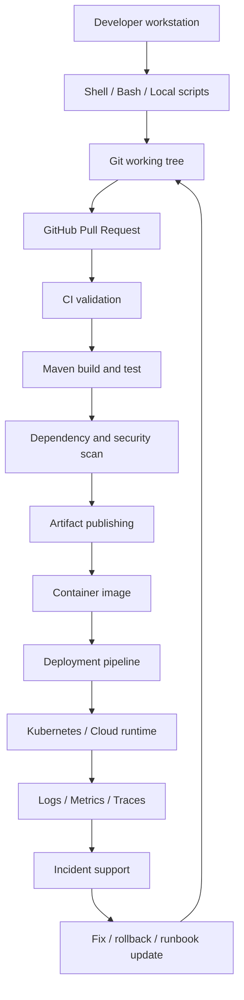
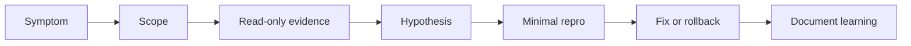
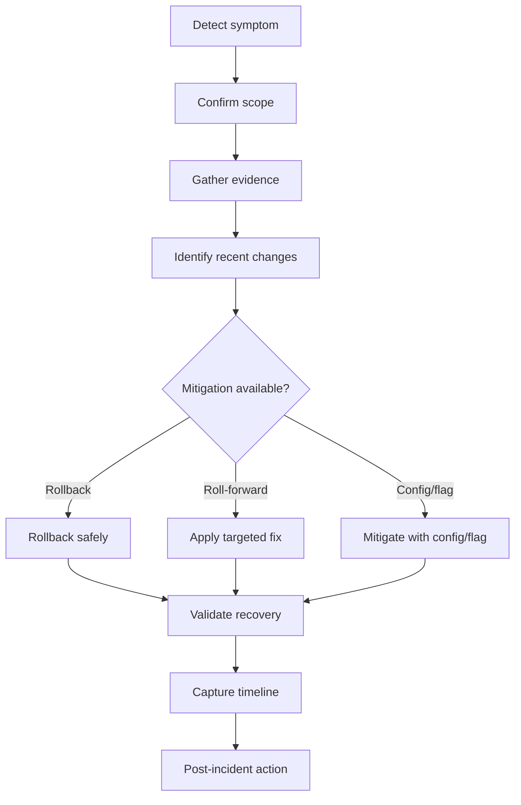

# Part 058 — Final Part: Engineering Tooling Mastery Map for Senior Backend Engineer

> Ini adalah final part dari seri **Cheatsheet Engineering Tooling for Enterprise Java/JAX-RS Systems**. Tujuannya adalah mengikat semua topik: Bash, Linux, Git, GitHub, Maven, automation, CI/CD, debugging, release, security, documentation, dan incident support menjadi satu mastery map untuk senior backend engineer.

Tooling mastery bukan berarti hafal ratusan command. Tooling mastery berarti mampu menjawab:

- apa yang terjadi dari source code sampai production;
- command mana yang authoritative;
- evidence apa yang diperlukan;
- failure mode apa yang mungkin terjadi;
- bagaimana mendiagnosis tanpa memperbesar blast radius;
- bagaimana menjaga correctness, security, reproducibility, dan release safety;
- kapan perubahan tooling harus dianggap architecture decision.

---

## 1. Complete Tooling Mental Model

Senior backend engineer harus melihat tooling sebagai **control plane** untuk engineering work.



Setiap edge di diagram adalah potensi failure:

- local script tidak reproducible;
- Git history tidak reviewable;
- PR kurang evidence;
- CI berbeda dari local;
- Maven dependency drift;
- artifact tidak traceable;
- deployment tidak punya rollback;
- logs tidak cukup untuk RCA;
- incident fix tidak masuk dokumentasi.

Tooling mastery adalah kemampuan melihat edge-edge ini sebelum menjadi incident.

---

## 2. The Senior Tooling Invariants

Gunakan invariant berikut sebagai north star.

### Invariant 1 — Reproducibility before speed

Command cepat tetapi tidak bisa diulang adalah jebakan. Build, test, debug, release, dan rollback harus bisa direproduksi oleh engineer lain dan oleh CI.

### Invariant 2 — Evidence before opinion

Debugging harus berbasis logs, metrics, traces, exit code, diff, commit, artifact, config, dan command output. Senior engineer tidak menebak lebih lama dari yang diperlukan.

### Invariant 3 — Read-only first in production-like environments

Saat menyentuh staging/production, mulai dari command observasi: `get`, `describe`, `logs`, `curl`, `dig`, `ss`, `lsof`, dashboard, trace. Mutasi harus punya approval, rollback path, dan audit trail.

### Invariant 4 — Small automation beats heroic manual work

Automation yang kecil, jelas, idempotent, dan terdokumentasi lebih bernilai daripada runbook panjang yang bergantung pada ingatan manusia.

### Invariant 5 — Tooling changes are product changes for engineers

Mengubah build, pipeline, script, branch rule, dependency management, atau release process dapat memengaruhi seluruh tim. Perlakukan sebagai engineering product dengan user, risk, migration, documentation, dan ownership.

---

## 3. Linux Mastery Checklist

Linux mastery untuk backend engineer bukan menjadi kernel engineer. Targetnya adalah memahami Linux sebagai runtime substrate untuk Java service, container, CI runner, dan Kubernetes node.

### Must understand

- kernel vs user space;
- process, PID, parent, zombie, orphan;
- signal: SIGTERM, SIGKILL, SIGHUP;
- exit code;
- file descriptor;
- filesystem, symlink, mount, permission;
- user/group/umask;
- environment variable;
- DNS and network stack basics;
- logs and service manager awareness;
- resource visibility: CPU, memory, disk, network;
- containerized Linux limitations.

### Must be able to do

```bash
ps aux | grep java
kill -TERM <pid>
kill -KILL <pid>
lsof -i :8080
ss -ltnp
df -h
du -sh *
free -m
top
```

### Failure modes to recognize

| Symptom | Likely area |
|---|---|
| `Permission denied` | file ownership, mode, user, volume mount |
| `Address already in use` | port conflict, stale process, wrong config |
| process killed unexpectedly | OOMKill, signal, supervisor restart |
| disk full | logs, temp files, artifact cache, volume |
| file not found in container | wrong image path, mount mismatch, working directory |
| local works but container fails | filesystem, env, user, shell, package difference |

### Senior review questions

- Apakah service berjalan sebagai non-root user?
- Apakah writable directory minimal?
- Apakah signal termination ditangani graceful?
- Apakah JVM resource setting selaras dengan container limit?
- Apakah logs masuk stdout/stderr atau file tersembunyi?

---

## 4. Bash and Shell Mastery Checklist

Shell mastery berarti paham bagaimana command diparse dan dieksekusi.

### Must understand

- quoting;
- expansion;
- glob;
- variable;
- command substitution;
- pipe and redirection;
- exit status;
- subshell;
- strict mode caveats;
- trap and cleanup;
- idempotency;
- dry-run;
- safe destructive operation.

### Safe script skeleton

```bash
#!/usr/bin/env bash
set -Eeuo pipefail

usage() {
  cat <<'USAGE'
Usage: ./script.sh [--dry-run]
USAGE
}

log() {
  printf '[%s] %s\n' "$(date -u +%Y-%m-%dT%H:%M:%SZ)" "$*"
}

fail() {
  printf 'ERROR: %s\n' "$*" >&2
  exit 1
}

DRY_RUN=false

for arg in "$@"; do
  case "$arg" in
    --dry-run) DRY_RUN=true ;;
    -h|--help) usage; exit 0 ;;
    *) fail "Unknown argument: $arg" ;;
  esac
done

run() {
  log "+ $*"
  if [ "$DRY_RUN" = false ]; then
    "$@"
  fi
}

main() {
  log "starting"
  # run command args here
}

main "$@"
```

### Script review checklist

- [ ] Shebang jelas.
- [ ] Variable di-quote.
- [ ] Error handling jelas.
- [ ] Exit code meaningful.
- [ ] Ada help/usage.
- [ ] Ada dry-run untuk operasi berisiko.
- [ ] Idempotent atau jelas tidak idempotent.
- [ ] Tidak mencetak secret.
- [ ] Tidak menghapus file tanpa guard.
- [ ] Bisa berjalan di shell/OS target.

---

## 5. CLI Debugging Mastery Checklist

CLI debugging yang baik membangun evidence secara bertahap.



### Core command groups

#### Text and logs

```bash
grep
awk
sed
sort
uniq
wc
find
xargs
jq
yq
diff
patch
```

#### Network

```bash
curl
nc
ss
lsof
dig
nslookup
traceroute
ping
openssl s_client
tcpdump
```

#### Runtime

```bash
ps
top
htop
free
df
du
vmstat
iostat
journalctl
```

#### Containers and Kubernetes

```bash
docker ps
docker logs
docker inspect
kubectl get
kubectl describe
kubectl logs
kubectl exec
kubectl port-forward
kubectl rollout status
kubectl events
```

### Debugging principles

- Start from symptom and scope.
- Capture exact command and output.
- Prefer read-only inspection first.
- Avoid changing multiple variables at once.
- Redact sensitive data.
- Convert ad-hoc findings into runbook improvements.

---

## 6. Git Mastery Checklist

Git mastery means understanding history as a graph, not as a linear command log.

### Must understand

- working tree;
- staging area/index;
- commit object;
- commit hash;
- branch pointer;
- tag;
- HEAD;
- remote tracking branch;
- merge commit;
- rebase rewrite;
- reflog;
- revert vs reset;
- cherry-pick;
- bisect;
- blame.

### Must be able to do

```bash
git status
git diff
git diff --staged
git log --oneline --decorate --graph --all -n 50
git fetch --all --prune
git switch -c feature/small-change
git rebase origin/main
git reflog
git revert <sha>
git cherry-pick <sha>
git bisect start
```

### Senior Git invariants

- Shared history must not be rewritten casually.
- Commit should be logical and reviewable.
- Revert is safer than reset for public history.
- Force push should use `--force-with-lease` and only on personal branches.
- Release tags should be immutable unless there is an explicit emergency process.
- Git history is part of production forensics.

### Git PR review questions

- Apakah commit scope logical?
- Apakah generated files masuk tidak sengaja?
- Apakah rebase/merge merusak history?
- Apakah revert path jelas?
- Apakah tag/release impact dipahami?

---

## 7. GitHub PR Mastery Checklist

GitHub adalah collaboration and governance layer.

### Must understand

- repository permission;
- team ownership;
- CODEOWNERS;
- branch protection;
- required checks;
- required reviews;
- conversation resolution;
- merge strategy;
- PR template;
- issue linkage;
- release page;
- environment protection;
- repository rulesets.

### High-quality PR structure

```md
## Summary
What changed?

## Why
Why is this needed?

## Scope
What is included and excluded?

## Validation
Commands/tests/evidence.

## Risk
Compatibility, data, config, dependency, release, security.

## Rollback
How to revert or disable safely.

## Internal verification
What team-specific assumption was checked?
```

### Senior PR review checklist

- [ ] Correctness.
- [ ] Domain invariant.
- [ ] API compatibility.
- [ ] Event/message compatibility.
- [ ] Database migration safety.
- [ ] Dependency impact.
- [ ] Security impact.
- [ ] Observability impact.
- [ ] Test evidence.
- [ ] Rollback path.
- [ ] Release note need.
- [ ] Documentation update.

---

## 8. GitHub Actions Mastery Checklist

GitHub Actions mastery means understanding execution, permission, cache, artifacts, and security boundary.

### Must understand

- workflow trigger;
- job;
- step;
- runner;
- matrix;
- cache;
- artifact;
- secret;
- environment;
- workflow permission;
- OIDC;
- reusable workflow;
- composite action;
- third-party action risk.

### Java/Maven CI baseline

A mature Java/Maven CI usually includes:

- checkout;
- setup Java;
- Maven cache;
- compile;
- unit test;
- integration test;
- test report;
- static analysis;
- dependency/security scan;
- package;
- artifact upload;
- Docker image build;
- image push;
- deployment trigger or GitOps update.

### CI review checklist

- [ ] Trigger is correct.
- [ ] Runner is appropriate.
- [ ] Permissions are least-privilege.
- [ ] Secrets only available where needed.
- [ ] Third-party actions are pinned appropriately.
- [ ] Cache cannot poison build correctness.
- [ ] Test reports are uploaded.
- [ ] Artifact is traceable to commit.
- [ ] Release/deploy steps are gated.

---

## 9. Maven Mastery Checklist

Maven mastery means knowing how source becomes test result, artifact, dependency graph, and deployable package.

### Must understand

- POM;
- coordinates: groupId, artifactId, version;
- packaging;
- lifecycle;
- phase;
- goal;
- plugin;
- plugin binding;
- dependency;
- scope;
- transitive dependency;
- dependency mediation;
- dependencyManagement;
- pluginManagement;
- parent POM;
- BOM;
- multi-module reactor;
- profile;
- local and remote repository.

### Must be able to do

```bash
./mvnw -version
./mvnw test
./mvnw verify
./mvnw package
./mvnw install
./mvnw deploy
./mvnw help:active-profiles
./mvnw help:effective-pom
./mvnw dependency:tree
```

### Maven review checklist

- [ ] Version is managed in the right place.
- [ ] Dependency scope is correct.
- [ ] Exclusion is justified.
- [ ] Plugin versions are pinned.
- [ ] Parent/BOM alignment is preserved.
- [ ] Profiles do not hide build differences.
- [ ] Unit and integration tests are separated.
- [ ] Release artifact is reproducible.
- [ ] Snapshot/release versioning is correct.

---

## 10. Dependency Hygiene Checklist

Dependency hygiene is production safety.

### Review every dependency change for

- direct vs transitive need;
- scope correctness;
- version source;
- BOM alignment;
- transitive conflict;
- duplicate class risk;
- Jakarta/Jersey namespace compatibility;
- CVE status;
- license policy;
- shading/relocation need;
- runtime footprint;
- classpath impact;
- test-only vs production dependency.

### Dependency evidence commands

```bash
./mvnw dependency:tree > /tmp/dependency-tree.txt
./mvnw dependency:tree -Dincludes=group.id:artifact-id
./mvnw help:effective-pom > /tmp/effective-pom.xml
```

### Red flags

- dependency version added directly while parent/BOM should manage it;
- `system` scope;
- broad exclusion without explanation;
- adding library for trivial code;
- upgrading framework dependency without compatibility notes;
- dependency used only in test but scope is compile;
- dependency introduces logging or JSON stack conflict.

---

## 11. Build Reproducibility Checklist

Build reproducibility asks:

> “Can we rebuild the same source into the same meaningful artifact under controlled conditions?”

Checklist:

- [ ] Java version is pinned.
- [ ] Maven version is pinned or wrapper used.
- [ ] Plugin versions are pinned.
- [ ] Dependency versions are pinned or managed.
- [ ] No hidden local dependency.
- [ ] No accidental network dependency beyond repository resolution.
- [ ] Generated source is deterministic.
- [ ] Build timestamp is controlled if relevant.
- [ ] Locale/timezone dependence is avoided.
- [ ] CI and local commands are aligned.
- [ ] Artifact has traceability metadata.

Failure signals:

- build works only on one machine;
- CI and local output differ;
- rebuild produces unexplained diff;
- dependency resolves differently over time;
- snapshot dependency changes unexpectedly;
- generated code changes without source change.

---

## 12. CI/CD Mastery Checklist

A senior engineer should be able to draw the pipeline from memory after studying it.

### Pipeline stages to identify

- source trigger;
- build;
- test;
- scan;
- package;
- publish artifact;
- build image;
- push image;
- update deployment manifest;
- deploy;
- smoke test;
- promote;
- rollback;
- notify;
- release note.

### CI/CD review questions

- What source event triggers this?
- What commit SHA is being built?
- What artifact is produced?
- Where is it stored?
- What image tag maps to it?
- What environment receives it?
- What approval is required?
- What smoke test validates it?
- What rollback path exists?
- What audit trail remains?

---

## 13. Release Mastery Checklist

Release mastery connects source, version, artifact, image, deployment, and customer impact.

### Must understand

- release branch;
- release tag;
- semantic versioning or internal versioning;
- snapshot vs release;
- artifact repository;
- container image tag;
- changelog;
- release note;
- environment promotion;
- feature flag;
- rollback;
- roll-forward;
- hotfix;
- post-release validation.

### Release review checklist

- [ ] Version is correct.
- [ ] Tag points to intended commit.
- [ ] Artifact maps to tag/commit.
- [ ] Image maps to artifact/commit.
- [ ] Deployment manifest references intended image.
- [ ] Changelog/release note is updated.
- [ ] Migration is safe.
- [ ] Feature flags are understood.
- [ ] Rollback path is documented.
- [ ] Smoke test or post-release validation exists.

---

## 14. Security Tooling Checklist

Security tooling is not separate from daily workflow. It lives in shell, Git, GitHub, Maven, CI, logs, and local machine.

### Key risks

- secret in shell history;
- secret in logs;
- secret in Git;
- secret in CI output;
- broad GitHub token permission;
- unsafe third-party action;
- unpinned action version;
- vulnerable dependency;
- license violation;
- artifact tampering;
- excessive cloud/Kubernetes permission;
- sharing unredacted evidence.

### Secure tooling checklist

- [ ] No secret printed in script logs.
- [ ] No secret committed.
- [ ] Secret scanning enabled or process known.
- [ ] CI permissions are least-privilege.
- [ ] Third-party actions are reviewed/pinned.
- [ ] Dependency scan results are reviewed.
- [ ] SBOM process is known if required.
- [ ] Logs/evidence are redacted.
- [ ] Local credential storage follows internal guidance.
- [ ] Cloud/Kubernetes context is verified before commands.

---

## 15. Incident Tooling Checklist

During an incident, senior engineer value comes from calm evidence gathering.

### Evidence to collect

- symptom;
- start time;
- affected environment;
- affected service;
- recent deployment;
- commit SHA;
- release tag;
- image tag;
- config change;
- feature flag change;
- database migration;
- logs;
- metrics;
- traces;
- error rate;
- latency;
- dependency health;
- mitigation action;
- rollback/roll-forward action.

### Incident workflow



### Incident anti-patterns

- making changes before capturing evidence;
- running destructive commands without approval;
- debugging in the wrong namespace/account;
- sharing logs with secrets/PII;
- assuming last deploy is the cause without evidence;
- failing to document mitigation steps;
- not updating runbooks after learning.

---

## 16. Documentation Mastery Checklist

Documentation is tooling when it changes behavior.

### High-value docs

- README;
- CONTRIBUTING;
- local setup guide;
- troubleshooting guide;
- runbook;
- release guide;
- ADR;
- PR template;
- issue template;
- script help;
- command examples;
- dependency policy;
- security handling guide.

### Documentation review checklist

- [ ] Does it name the owner?
- [ ] Does it show canonical command?
- [ ] Does it show expected output?
- [ ] Does it show common failure?
- [ ] Does it explain when not to run a command?
- [ ] Does it separate local/staging/production?
- [ ] Does it avoid stale internal assumptions?
- [ ] Does it link to authoritative source?
- [ ] Does it include redaction/security notes?

---

## 17. Internal Verification Checklist

For CSG/team-specific details, never assume. Verify.

### Repository and workflow

- [ ] Actual repository layout.
- [ ] Monorepo/polyrepo model.
- [ ] Branch strategy.
- [ ] Merge strategy.
- [ ] PR approval rules.
- [ ] CODEOWNERS.
- [ ] Required checks.
- [ ] Commit signing rules.

### Build and dependency

- [ ] Parent POM.
- [ ] BOM.
- [ ] Maven Wrapper.
- [ ] Java version.
- [ ] Dependency management policy.
- [ ] Plugin management policy.
- [ ] Internal artifact repository.
- [ ] Vulnerability scanning tool.
- [ ] License scanning requirement.

### CI/CD and release

- [ ] CI/CD platform.
- [ ] Pipeline trigger model.
- [ ] Runner environment.
- [ ] Secret injection.
- [ ] Artifact publishing flow.
- [ ] Container registry.
- [ ] Deployment mechanism.
- [ ] GitOps repository if used.
- [ ] Environment promotion.
- [ ] Rollback process.
- [ ] Hotfix process.
- [ ] Release note process.

### Runtime and operations

- [ ] Kubernetes namespace/context.
- [ ] Cloud account/subscription/region.
- [ ] Observability platform.
- [ ] Logging format.
- [ ] Correlation ID/trace ID convention.
- [ ] Runbook location.
- [ ] Incident escalation path.
- [ ] Redaction policy.
- [ ] Allowed production debugging commands.

---

## 18. How to Keep Improving Tooling in Real Production Teams

Tooling improvement harus kecil, terukur, dan memiliki owner.

### Good improvement candidates

- setup command yang lebih jelas;
- script help yang lebih baik;
- dry-run untuk destructive operation;
- CI error message yang lebih actionable;
- test report upload;
- dependency tree documentation;
- PR template evidence section;
- release checklist clarity;
- incident evidence template;
- runbook update setelah incident;
- Makefile/Taskfile target untuk command yang sering dipakai.

### Bad improvement candidates without sponsorship

- mengganti CI/CD platform;
- mengganti build system;
- mengganti branch strategy;
- mengganti release model;
- memperkenalkan banyak tool baru sekaligus;
- membuat wrapper yang menyembunyikan terlalu banyak detail;
- mengubah security permission tanpa review.

### Improvement PR structure

```md
## Problem
What pain/risk exists?

## Proposed change
What small change is introduced?

## Users affected
Who uses this workflow?

## Safety
How does this avoid destructive behavior?

## Validation
Commands run and evidence.

## Rollback
How to revert.

## Follow-up
What remains out of scope.
```

---

## 19. How to Become Effective in Build, Release, and Developer Productivity Discussions

Dalam diskusi senior/principal, jangan mulai dari preferensi tool. Mulai dari constraint.

### Good questions

- Problem apa yang sedang kita selesaikan?
- Berapa sering terjadi?
- Siapa yang terdampak?
- Apa evidence-nya?
- Apa current workaround?
- Apa risiko current state?
- Apa minimum safe improvement?
- Apakah perlu migration?
- Siapa owner setelah perubahan?
- Bagaimana mengukur improvement?

### Weak framing

- “Tool X lebih modern.”
- “Saya biasa pakai cara ini di tempat lama.”
- “Kita ganti saja pipeline-nya.”
- “Ini cuma script kecil.”
- “Build green berarti aman.”

### Strong framing

- “Setup gagal untuk 3 engineer baru karena dependency local tidak terdokumentasi. Saya usulkan menambah validation script read-only dan README expected output.”
- “CI failure sulit dianalisis karena test report tidak diupload. Saya usulkan artifact upload untuk Surefire/Failsafe report.”
- “Dependency version drift terjadi karena child module override version di luar parent POM. Saya usulkan memindahkan versi ke dependencyManagement.”

---

## 20. How to Prevent Tooling Changes from Becoming Incidents

Tooling incident biasanya terjadi karena perubahan dianggap “non-product”. Padahal build, CI, dependency, release, dan deployment tooling langsung memengaruhi production.

### Prevention checklist

- [ ] Scope kecil.
- [ ] Owner jelas.
- [ ] Reviewer tepat.
- [ ] Test evidence ada.
- [ ] Rollback path ada.
- [ ] Documentation update ada.
- [ ] Security impact dipikirkan.
- [ ] Release impact dipikirkan.
- [ ] Backward compatibility dipikirkan.
- [ ] Gradual rollout jika memungkinkan.

### High-risk tooling changes

- CI permission change;
- secret handling change;
- artifact repository change;
- parent POM change;
- BOM upgrade;
- build plugin upgrade;
- Docker base image change;
- branch protection change;
- release tag process change;
- deployment pipeline change;
- shared workflow change;
- shared script used by many repositories.

High-risk changes butuh stronger review dan explicit rollback plan.

---

## 21. Senior Backend Engineer Tooling Maturity Levels

### Level 1 — User

- Bisa menjalankan command yang terdokumentasi.
- Bisa build/test local.
- Bisa membuat PR.

### Level 2 — Debugger

- Bisa mendiagnosis local/CI/runtime failure.
- Bisa membaca logs dan pipeline.
- Bisa memperbaiki script kecil.

### Level 3 — Reviewer

- Bisa mereview POM, dependency, CI, script, dan release impact.
- Bisa menemukan hidden failure mode.
- Bisa meminta evidence yang tepat.

### Level 4 — Owner

- Bisa menjaga workflow tim tetap reliable.
- Bisa memperbaiki tooling pain point.
- Bisa menulis runbook dan checklist.
- Bisa koordinasi dengan platform/SRE/security.

### Level 5 — Principal-level leverage

- Bisa melihat tooling sebagai system design problem.
- Bisa menjaga governance tanpa memperlambat tim berlebihan.
- Bisa memimpin perubahan build/release/developer productivity dengan migration plan.
- Bisa mencegah tooling debt menjadi production risk.

---

## 22. Final Master Checklist

Gunakan checklist ini sebagai ringkasan akhir seri.

### Bash/Linux

- [ ] Memahami shell parsing, quoting, pipe, redirection.
- [ ] Bisa menulis script dengan error handling.
- [ ] Bisa mendiagnosis process, signal, permission, disk, port.
- [ ] Bisa mengambil evidence dari logs dan files.

### Git/GitHub

- [ ] Memahami commit graph.
- [ ] Bisa merge/rebase/conflict dengan aman.
- [ ] Bisa recovery dengan reflog/revert/cherry-pick.
- [ ] Bisa membuat PR reviewable.
- [ ] Bisa mereview branch protection dan PR governance.

### Maven

- [ ] Memahami lifecycle, phase, goal, plugin.
- [ ] Bisa membaca POM/effective POM.
- [ ] Bisa membaca dependency tree.
- [ ] Bisa mereview dependencyManagement/BOM.
- [ ] Bisa mendiagnosis build/test/dependency failure.

### CI/CD and release

- [ ] Bisa membaca pipeline end-to-end.
- [ ] Bisa menghubungkan commit, artifact, image, deployment.
- [ ] Bisa memahami environment promotion.
- [ ] Bisa menilai rollback path.
- [ ] Bisa membaca release tag/versioning.

### Security and supply chain

- [ ] Bisa mengenali secret leakage risk.
- [ ] Bisa mereview token/workflow permission.
- [ ] Bisa memahami dependency vulnerability workflow.
- [ ] Bisa menjaga artifact integrity dan traceability.

### Production support

- [ ] Bisa menjalankan read-only diagnosis.
- [ ] Bisa capture evidence bundle.
- [ ] Bisa membangun incident timeline.
- [ ] Bisa menghubungkan symptom dengan recent change.
- [ ] Bisa memperbarui runbook setelah incident.

### Documentation and productivity

- [ ] Bisa menulis command example yang bisa dieksekusi.
- [ ] Bisa membuat troubleshooting guide.
- [ ] Bisa memperbaiki onboarding friction.
- [ ] Bisa membuat personal runbook.
- [ ] Bisa mengusulkan improvement kecil dengan impact besar.

---

## 23. Final Closing

Tooling adalah lapisan yang menentukan apakah engineering team bisa bergerak cepat tanpa kehilangan kontrol.

Untuk backend Java/JAX-RS enterprise, mastery berarti memahami:

- Linux sebagai runtime;
- Bash sebagai automation interface;
- Git sebagai history and forensic system;
- GitHub sebagai collaboration and governance platform;
- Maven sebagai build and dependency control system;
- CI/CD sebagai production change pipeline;
- release process sebagai traceability and recovery mechanism;
- logs/metrics/traces sebagai evidence system;
- documentation sebagai productivity multiplier;
- security sebagai constraint yang hadir di setiap command.

Senior engineer yang kuat tidak hanya bertanya “command apa yang harus saya jalankan?”. Ia bertanya:

> “Apa lifecycle yang sedang saya sentuh, evidence apa yang saya punya, failure mode apa yang mungkin terjadi, dan bagaimana saya menjaga perubahan ini tetap correct, secure, reproducible, observable, dan reversible?”

Itulah inti engineering tooling mastery.
