# ☑ aws

**User:** Anonymous  
**Created:** 7/12/2026 22:46:25  
**Updated:** 7/13/2026 19:54:40  
**Exported:** 7/14/2026 21:29:35  
**Link:** [https://chatgpt.com/g/g-p-6a539ddc858881919467b6da20df4567-cheatsheet/c/6a53b6ca-294c-83ec-b90f-55efdbc886a5](https://chatgpt.com/g/g-p-6a539ddc858881919467b6da20df4567-cheatsheet/c/6a53b6ca-294c-83ec-b90f-55efdbc886a5)  

## Response:
7/13/2026, 8:22:56 AM

Saya akan susun AWS sebagai peta kompetensi praktis untuk software engineer, bukan daftar layanan AWS satu per satu. Fokusnya: bagaimana Java/Jersey/MyBatis/Camunda/PostgreSQL service biasanya dibangun, diamankan, di-deploy, diobservasi, dan dioperasikan di AWS.

# Decomposition Map - AWS for Software Engineer

## Introduction

AWS untuk software engineer **bukan sekadar menghafal nama layanan**. Yang lebih penting adalah memahami bagaimana aplikasi backend, microservice, database, workflow, message processing, security, deployment, observability, dan cost berjalan dalam model cloud.

Untuk konteks stack Anda - **Java 17+, Maven, Jersey/JAX-RS, MyBatis, Camunda, PostgreSQL, Docker, Kubernetes, on-prem/AWS/Azure** - AWS perlu dipelajari sebagai **runtime platform + operational boundary**. Artinya engineer perlu tahu: aplikasi berjalan di mana, akses dikontrol oleh siapa, network-nya bagaimana, data disimpan di mana, failure-nya seperti apa, dan bagaimana sistem bisa dipantau serta dipulihkan.

Kerangka besar yang aman dipakai adalah AWS Well-Architected Framework: **operational excellence, security, reliability, performance efficiency, cost optimization, dan sustainability**. AWS juga memakai **shared responsibility model**, di mana AWS mengamankan infrastruktur cloud, sedangkan customer tetap bertanggung jawab atas konfigurasi, data, identity, aplikasi, dan workload yang dijalankan. ([AWS Documentation](https://docs.aws.amazon.com/wellarchitected/latest/framework/the-pillars-of-the-framework.html?utm_source=chatgpt.com))

---

## Diagram

```mermaid
flowchart TD
    A[AWS for Software Engineer] --> B[Cloud Mental Model]
    A --> C[Identity & Security]
    A --> D[Networking]
    A --> E[Compute Runtime]
    A --> F[Application Integration]
    A --> G[Data & Storage]
    A --> H[Deployment & IaC]
    A --> I[Observability & Operations]
    A --> J[Reliability & Resilience]
    A --> K[Cost & Governance]

    B --> B1[Region, AZ, Account, Resource Boundary]
    B --> B2[Shared Responsibility Model]
    B --> B3[Well-Architected Thinking]

    C --> C1[IAM User, Role, Policy]
    C --> C2[Least Privilege]
    C --> C3[KMS, Secrets, Parameter Store]

    D --> D1[VPC, Subnet, Route Table]
    D --> D2[Security Group, NACL]
    D --> D3[NAT Gateway, VPC Endpoint, Private Connectivity]

    E --> E1[EC2]
    E --> E2[ECS/Fargate]
    E --> E3[EKS]
    E --> E4[Lambda]

    F --> F1[SQS]
    F --> F2[SNS]
    F --> F3[EventBridge]
    F --> F4[Step Functions]

    G --> G1[RDS PostgreSQL]
    G --> G2[S3]
    G --> G3[DynamoDB]
    G --> G4[Backup, Snapshot, Encryption]

    H --> H1[CloudFormation/CDK/Terraform]
    H --> H2[CI/CD Pipeline]
    H --> H3[GitHub Actions to AWS]

    I --> I1[CloudWatch Metrics & Logs]
    I --> I2[CloudTrail Audit]
    I --> I3[X-Ray / OpenTelemetry]

    J --> J1[Multi-AZ]
    J --> J2[Retry, Timeout, DLQ]
    J --> J3[Auto Scaling, Health Check]

    K --> K1[Tagging]
    K --> K2[Budgets, Cost Explorer]
    K --> K3[Quota, Limits, Environment Isolation]
```

---

## Tabular Decomposition Map

| Area | Practical Skill yang Perlu Dikuasai | AWS Services / Concepts | Relevansi untuk Software Engineer |
|---|---|---|---|
| **1. AWS Mental Model** | Memahami account, region, availability zone, resource ownership, quota, dan blast radius. | AWS Account, Region, AZ, Organizations | Dasar untuk memahami kenapa environment dev/staging/prod sebaiknya dipisah, kenapa latency berbeda antar-region, dan kenapa desain multi-AZ penting. |
| **2. Shared Responsibility** | Membedakan tanggung jawab AWS vs tanggung jawab tim aplikasi. | Shared Responsibility Model | Engineer tetap bertanggung jawab atas IAM, secret, enkripsi data, konfigurasi network, patching runtime tertentu, dependency aplikasi, dan security posture workload. ([AWS Documentation](https://docs.aws.amazon.com/whitepapers/latest/aws-risk-and-compliance/shared-responsibility-model.html?utm_source=chatgpt.com)) |
| **3. Well-Architected Thinking** | Menilai desain dari sisi operability, security, reliability, performance, cost, dan sustainability. | AWS Well-Architected Framework | Berguna saat melakukan design review microservice, deployment architecture, data architecture, dan production readiness checklist. ([AWS Documentation](https://docs.aws.amazon.com/wellarchitected/latest/framework/the-pillars-of-the-framework.html?utm_source=chatgpt.com)) |
| **4. IAM & Access Control** | Membuat dan membaca policy, role assumption, permission boundary, least privilege, service role, execution role. | IAM User, Role, Policy, STS | Sangat penting untuk service yang mengakses S3, SQS, SNS, RDS secret, KMS, CloudWatch, atau deployment pipeline. AWS merekomendasikan praktik keamanan IAM untuk mengamankan account dan resource. ([AWS Documentation](https://docs.aws.amazon.com/IAM/latest/UserGuide/best-practices.html?utm_source=chatgpt.com)) |
| **5. Credential Strategy** | Menghindari long-lived access key, memakai temporary credential dan role-based access. | IAM Role, STS, OIDC, GitHub Actions OIDC | Untuk CI/CD modern, aplikasi container, dan workload Kubernetes, credential sebaiknya tidak ditanam sebagai static secret. AWS menyarankan temporary security credentials seperti IAM roles dibanding long-term access keys. ([AWS Documentation](https://docs.aws.amazon.com/IAM/latest/UserGuide/id_credentials_access-keys.html?utm_source=chatgpt.com)) |
| **6. Network Foundation** | Mendesain private/public subnet, route table, internet gateway, NAT gateway, security group, VPC endpoint. | VPC, Subnet, Route Table, IGW, NAT Gateway, SG, NACL | Hampir semua service backend production akan hidup di private network. Route table menentukan arah traffic subnet, dan NAT gateway umum dipakai agar private subnet bisa outbound ke internet tanpa inbound publik. ([AWS Documentation](https://docs.aws.amazon.com/vpc/latest/userguide/subnet-route-tables.html?utm_source=chatgpt.com)) |
| **7. Service Exposure** | Memahami kapan service diekspos publik, internal-only, lewat load balancer, API gateway, atau private link. | ALB, NLB, API Gateway, PrivateLink, Route 53 | Relevan untuk Jersey/JAX-RS REST API, gRPC, internal microservice communication, dan boundary antara public API vs internal API. |
| **8. Compute Runtime** | Memilih runtime yang tepat: VM, container, Kubernetes, atau serverless. | EC2, ECS, Fargate, EKS, Lambda | ECS/Fargate menjalankan container tanpa mengelola server/cluster EC2 sendiri; EKS adalah managed Kubernetes; Lambda menjalankan code tanpa provisioning server. ([AWS Documentation](https://docs.aws.amazon.com/AmazonECS/latest/developerguide/AWS_Fargate.html?utm_source=chatgpt.com)) |
| **9. Java Application on AWS** | Menggunakan AWS SDK for Java 2.x, credential provider chain, region config, client lifecycle, retry, timeout. | AWS SDK for Java 2.x | AWS SDK for Java 2.x menyediakan Java API untuk layanan seperti S3, EC2, dan DynamoDB, serta mendukung non-blocking I/O dan pluggable HTTP implementation. ([AWS Documentation](https://docs.aws.amazon.com/sdk-for-java/latest/developer-guide/home.html?utm_source=chatgpt.com)) |
| **10. Container Deployment** | Membuat image production-ready, task definition, resource limit, health check, env var, secret injection, rolling deployment. | ECR, ECS, Fargate, EKS | Cocok untuk Java/Jersey service berbasis Docker. Engineer harus tahu image lifecycle, runtime config, CPU/memory sizing, dan graceful shutdown. |
| **11. Kubernetes on AWS** | Mengoperasikan aplikasi di Kubernetes yang berjalan di AWS, termasuk node, pod networking, IAM integration, ingress, autoscaling. | EKS, EKS Add-ons, EKS Auto Mode, IRSA/Pod Identity | EKS membuat Kubernetes lebih mudah dioperasikan tanpa mengelola control plane sendiri, tetapi engineer tetap perlu memahami workload, network, IAM, observability, dan upgrade. ([AWS Documentation](https://docs.aws.amazon.com/eks/?utm_source=chatgpt.com)) |
| **12. Database Platform** | Provisioning, connection, backup, read replica, failover, parameter group, extension, migration, performance tuning. | RDS PostgreSQL, Aurora PostgreSQL | RDS mempermudah setup, operasi, dan scaling relational database; RDS for PostgreSQL mendukung snapshot, point-in-time restore, backup, Multi-AZ, read replica, VPC, dan SSL. ([AWS Documentation](https://docs.aws.amazon.com/AmazonRDS/latest/UserGuide/Welcome.html?utm_source=chatgpt.com)) |
| **13. PostgreSQL App Integration** | Menyambungkan Java/MyBatis ke RDS secara aman dan efisien. | RDS, Security Group, Secrets Manager, Parameter Store, RDS Proxy | Fokus engineer: connection pooling, secret rotation, migration, transaction boundary, timeout, retry, read/write split, dan failover behavior. |
| **14. Object Storage** | Menyimpan file, export, import, attachment, report, backup artifact, dan static asset. | S3, Bucket, Object, Lifecycle, Versioning | S3 adalah object storage untuk berbagai use case seperti backup/restore, archive, data lake, website, mobile app, dan enterprise application. ([AWS Documentation](https://docs.aws.amazon.com/AmazonS3/latest/userguide/Welcome.html?utm_source=chatgpt.com)) |
| **15. Encryption & Key Management** | Memahami encryption at rest, envelope encryption, key policy, grants, rotation, dan access audit. | KMS, CMK/KMS Key, Encryption Context | AWS KMS digunakan untuk membuat dan mengontrol key yang dipakai untuk mengenkripsi dan menandatangani data; KMS juga dipakai luas oleh layanan AWS lain. ([AWS Documentation](https://docs.aws.amazon.com/kms/latest/developerguide/overview.html?utm_source=chatgpt.com)) |
| **16. Secret & Configuration Management** | Memisahkan config biasa dari secret sensitif; versioning config; inject config ke container/serverless. | Secrets Manager, Systems Manager Parameter Store | Parameter Store dapat menyimpan dan mengambil configuration data secara aman dan terorganisasi; Secrets Manager lebih cocok untuk secret lifecycle dan rotation. ([AWS Documentation](https://docs.aws.amazon.com/systems-manager/latest/userguide/systems-manager-parameter-store.html?utm_source=chatgpt.com)) |
| **17. Messaging & Queueing** | Mendesain async processing, retry, dead-letter queue, visibility timeout, idempotency, ordering. | SQS Standard, SQS FIFO, DLQ | SQS Standard mendukung at-least-once delivery, sedangkan FIFO dirancang untuk ordering dan exactly-once processing semantics pada use case tertentu. ([AWS Documentation](https://docs.aws.amazon.com/AWSSimpleQueueService/latest/SQSDeveloperGuide/welcome.html?utm_source=chatgpt.com)) |
| **18. Pub/Sub & Event Routing** | Mendesain event-driven architecture, event bus, fanout, rule matching, consumer isolation. | SNS, EventBridge | EventBridge menggunakan event bus untuk menerima event dan merutekannya ke target berdasarkan rules; cocok untuk integrasi antar-service dan event-driven workflow. ([AWS Documentation](https://docs.aws.amazon.com/eventbridge/latest/userguide/eb-what-is.html?utm_source=chatgpt.com)) |
| **19. Workflow Orchestration** | Membedakan orchestration teknis cloud vs BPMN/business process orchestration. | Step Functions, Camunda | Step Functions membuat state machine untuk distributed application, automation, microservice orchestration, dan pipeline. Untuk proses bisnis kompleks, Camunda tetap relevan; untuk glue/infrastructure workflow, Step Functions sering lebih natural. ([AWS Documentation](https://docs.aws.amazon.com/step-functions/latest/dg/welcome.html?utm_source=chatgpt.com)) |
| **20. Observability** | Mengumpulkan log, metric, trace, alarm, dashboard, correlation ID, dan incident signal. | CloudWatch Logs, CloudWatch Metrics, Alarms, X-Ray, ADOT/OpenTelemetry | CloudWatch Logs memusatkan log dari aplikasi dan AWS services; CloudWatch metrics mencatat performa sistem; ADOT dapat mengirim metrics/traces ke X-Ray, CloudWatch, OpenSearch, dan Prometheus-compatible systems. ([AWS Documentation](https://docs.aws.amazon.com/AmazonCloudWatch/latest/logs/WhatIsCloudWatchLogs.html?utm_source=chatgpt.com)) |
| **21. Audit & Governance** | Mengetahui siapa melakukan apa, kapan, dari mana, dan terhadap resource apa. | CloudTrail, AWS Config, Organizations, SCP | CloudTrail merekam action dari user, role, AWS service, console, CLI, SDK, dan API untuk auditing, governance, compliance, dan troubleshooting. ([AWS Documentation](https://docs.aws.amazon.com/awscloudtrail/latest/userguide/cloudtrail-user-guide.html?utm_source=chatgpt.com)) |
| **22. Infrastructure as Code** | Membuat infrastructure repeatable, reviewable, versioned, dan auditable. | CloudFormation, CDK, Terraform | CloudFormation memodelkan, provision, dan manage AWS/third-party resources sebagai code; Terraform juga umum dipakai untuk build/change/version infrastructure secara aman dan efisien. ([AWS Documentation](https://docs.aws.amazon.com/AWSCloudFormation/latest/UserGuide/Welcome.html?utm_source=chatgpt.com)) |
| **23. CI/CD to AWS** | Build artifact/image, push ke registry, deploy ke ECS/EKS/Lambda, run migration, approval gate, rollback. | GitHub Actions, CodePipeline, CodeBuild, CodeDeploy, ECR | CodePipeline adalah continuous delivery service untuk memodelkan, memvisualisasi, dan mengotomasi release steps. Dalam stack Anda, GitHub Actions + OIDC + ECR + ECS/EKS sering menjadi kombinasi praktis. ([AWS Documentation](https://docs.aws.amazon.com/codepipeline/latest/userguide/welcome.html?utm_source=chatgpt.com)) |
| **24. Reliability Engineering** | Mendesain timeout, retry, circuit breaker, idempotency, DLQ, fallback, multi-AZ, backup/restore, disaster recovery. | Multi-AZ, Auto Scaling, ELB, SQS DLQ, RDS Backup, Route 53 | AWS tidak otomatis membuat aplikasi reliable. Reliability tetap ditentukan oleh desain aplikasi, dependency behavior, deployment strategy, dan operational readiness. |
| **25. Cost Awareness** | Membaca cost driver, memilih sizing, menghapus resource idle, memakai tags, budget, dan cost allocation. | Cost Explorer, Budgets, Tags, Compute Sizing, Storage Lifecycle | Untuk engineer, cost bukan hanya urusan finance. Pilihan log retention, NAT Gateway, cross-AZ traffic, RDS sizing, EKS node, dan data transfer bisa berdampak besar. |

---

## Skill Boundary yang Penting

Untuk software engineer, AWS skill sebaiknya dibagi menjadi tiga lapisan:

| Lapisan | Fokus | Contoh Keputusan |
|---|---|---|
| **Application-aware AWS** | Bagaimana aplikasi memakai AWS. | Java service pakai SQS atau EventBridge? S3 upload perlu presigned URL? Secret dibaca dari mana? |
| **Runtime-aware AWS** | Bagaimana aplikasi dijalankan. | ECS/Fargate atau EKS? Health check apa? Resource limit berapa? Rolling deployment bagaimana? |
| **Operational-aware AWS** | Bagaimana aplikasi dipantau, diamankan, dan dipulihkan. | Alarm apa yang wajib? Log retention berapa? CloudTrail aktif? DLQ dimonitor? Backup diuji? |

Kesalahan umum: langsung belajar banyak layanan AWS tanpa mengikatnya ke **workflow aplikasi nyata**. Untuk onboarding cepat, lebih baik mulai dari skenario: “bagaimana satu Java microservice berjalan dari local → CI/CD → container registry → runtime → database → observability → incident recovery”.

---

## Roadmap Alur Belajar yang Direkomendasikan

### Phase 1 - AWS Core Mental Model

Pelajari **account, region, AZ, IAM, shared responsibility, VPC, subnet, route table, security group**. Ini pondasi semua hal lain.

### Phase 2 - Running Java Microservice

Fokus ke **ECR, ECS/Fargate atau EKS, environment config, secret, health check, autoscaling, log to CloudWatch**.

### Phase 3 - Data & Integration

Masuk ke **RDS PostgreSQL, S3, SQS, SNS, EventBridge, Step Functions**, lalu hubungkan dengan pola Java/Jersey/MyBatis/Camunda.

### Phase 4 - Security & Governance

Dalami **IAM least privilege, KMS, Secrets Manager, Parameter Store, CloudTrail, AWS Config, network isolation, private connectivity**.

### Phase 5 - Production Operations

Kuasai **CloudWatch metrics/logs/alarms, OpenTelemetry/X-Ray, incident handling, rollback, backup/restore, DLQ handling, cost monitoring**.

### Phase 6 - Infrastructure & Delivery Automation

Masuk ke **Terraform/CloudFormation/CDK, GitHub Actions OIDC, deployment pipeline, environment promotion, migration gate, blue/green/canary strategy**.

---

## Rekomendasi Materi Selanjutnya

Materi berikutnya yang paling natural: **AWS Core Mental Model for Software Engineer - Account, Region, AZ, Shared Responsibility, IAM, VPC, Subnet, Route Table, Security Group, NAT Gateway, dan Private/Public Runtime Boundary**.

---

**Sources:**

- [The pillars of the framework - AWS Well-Architected ...](https://docs.aws.amazon.com/wellarchitected/latest/framework/the-pillars-of-the-framework.html?utm_source=chatgpt.com)

## Response:
7/13/2026, 8:24:38 AM

Total saya rekomendasikan **24 seri** untuk AWS for Software Engineer.

Pembagiannya:

| Seri | Topik |
|---:|---|
| 1 | AWS Core Mental Model: Account, Region, AZ, Shared Responsibility, Well-Architected |
| 2 | IAM Fundamentals: User, Role, Policy, STS, Least Privilege |
| 3 | AWS Networking Core: VPC, Subnet, Route Table, IGW, NAT Gateway |
| 4 | Network Security: Security Group, NACL, Private/Public Subnet Boundary |
| 5 | Service Exposure: ALB, NLB, API Gateway, Route 53, PrivateLink |
| 6 | AWS SDK for Java 2.x: Credential Provider, Region, Client, Retry, Timeout |
| 7 | EC2 for Backend Engineer: AMI, Instance, Security, User Data, Systemd |
| 8 | Container Registry & Image Lifecycle: ECR, Docker Image, Tagging, Scanning |
| 9 | ECS & Fargate for Java Microservices |
| 10 | EKS for Kubernetes-based Microservices |
| 11 | Lambda & Serverless for Software Engineer |
| 12 | RDS PostgreSQL: Provisioning, Backup, HA, Failover, Parameter Group |
| 13 | Java/MyBatis Integration with RDS PostgreSQL |
| 14 | S3 for Application Storage: Upload, Download, Presigned URL, Lifecycle |
| 15 | Secrets & Configuration: Secrets Manager, Parameter Store, KMS |
| 16 | Messaging: SQS, DLQ, Visibility Timeout, Idempotency |
| 17 | Pub/Sub & Event Routing: SNS, EventBridge, Event-driven Pattern |
| 18 | Workflow Orchestration: Step Functions vs Camunda |
| 19 | Observability: CloudWatch Logs, Metrics, Alarms, Dashboard |
| 20 | Tracing & Telemetry: X-Ray, OpenTelemetry, Correlation ID |
| 21 | Audit & Governance: CloudTrail, AWS Config, Organizations, SCP |
| 22 | CI/CD to AWS: GitHub Actions OIDC, ECR, ECS/EKS Deploy, Rollback |
| 23 | Infrastructure as Code: CloudFormation, CDK, Terraform |
| 24 | Production Readiness: Reliability, Cost, Security, DR, Runbook Checklist |

Jadi: **24 seri total**.

Urutan ini sengaja dibuat dari **foundation → runtime aplikasi → data/integration → observability/security → production readiness**, supaya cocok untuk onboarding cepat sebagai senior software engineer.

## Response:
7/13/2026, 8:25:10 AM

Saya mulai dari **Seri 1/24**. Seri ini jadi pondasi: cara membaca AWS sebagai boundary sistem, bukan sekadar kumpulan layanan.

# AWS for Software Engineer - Seri 1/24  
## Core Mental Model: Account, Region, AZ, Shared Responsibility, Well-Architected

## 1. Introduction

Seri pertama ini menjawab pertanyaan dasar: **bagaimana cara membaca AWS sebagai platform engineering**, bukan sekadar daftar layanan.

Untuk software engineer, terutama yang membangun **Java/Jersey microservice, MyBatis, Camunda, PostgreSQL, Docker, Kubernetes**, AWS perlu dipahami sebagai kombinasi dari:

1. **boundary kepemilikan resource**
2. **boundary lokasi dan latency**
3. **boundary failure**
4. **boundary security responsibility**
5. **boundary operasional dan biaya**

AWS membagi infrastrukturnya ke dalam **Region** dan **Availability Zone**. Region adalah area geografis terpisah, sedangkan Availability Zone adalah lokasi terisolasi di dalam Region. AWS menyatakan bahwa setiap Region memiliki beberapa Availability Zone yang terpisah secara fisik dan dirancang untuk redundansi power, networking, dan connectivity. ([AWS Documentation](https://docs.aws.amazon.com/whitepapers/latest/aws-overview/global-infrastructure.html?utm_source=chatgpt.com))

Untuk production system, mental model ini penting karena desain aplikasi tidak cukup hanya “deploy ke AWS”. Engineer harus bisa menjawab:

> Service ini jalan di Region mana?  
> Dependency-nya di AZ mana?  
> Kalau satu AZ gagal, sistem masih hidup atau ikut mati?  
> Siapa yang bertanggung jawab atas patching, secret, IAM, network, dan data?  
> Apakah desainnya reliable, secure, observable, dan cost-aware?

---

# 2. Diagram Mental Model

```mermaid id="aws-seri-1-core-mental-model"
flowchart TD
    A[AWS Workload Mental Model] --> B[Ownership Boundary]
    A --> C[Location Boundary]
    A --> D[Failure Boundary]
    A --> E[Security Boundary]
    A --> F[Architecture Quality Boundary]

    B --> B1[AWS Account]
    B --> B2[Environment Separation]
    B --> B3[Resource Ownership]
    B --> B4[Billing & Quota]

    C --> C1[Region]
    C --> C2[Availability Zone]
    C --> C3[Latency & Data Residency]

    D --> D1[Single-AZ Risk]
    D --> D2[Multi-AZ Design]
    D --> D3[Backup & Restore]
    D --> D4[Disaster Recovery]

    E --> E1[Shared Responsibility Model]
    E --> E2[IAM]
    E --> E3[Encryption]
    E --> E4[Network Isolation]

    F --> F1[Operational Excellence]
    F --> F2[Security]
    F --> F3[Reliability]
    F --> F4[Performance Efficiency]
    F --> F5[Cost Optimization]
    F --> F6[Sustainability]
```

---

# 3. Core Concepts

## 3.1 AWS Account

**AWS Account** adalah boundary utama untuk resource, billing, quota, access control, dan governance.

Dalam organisasi engineering, account biasanya dipakai untuk memisahkan:

| Account Pattern | Tujuan |
|---|---|
| `dev` | Eksperimen, development, sandbox |
| `staging` | Pre-production, integration test |
| `prod` | Production workload |
| `security` | Centralized audit/security tooling |
| `shared-services` | Shared DNS, CI/CD, artifact registry, networking tertentu |

Untuk senior software engineer, account harus dilihat sebagai **blast-radius boundary**. Artinya, kesalahan di environment development sebaiknya tidak bisa langsung merusak production.

Contoh praktis:

```text
company-root
├── dev-account
├── staging-account
├── prod-account
├── security-account
└── shared-services-account
```

Kesalahan umum: semua environment ditaruh dalam satu AWS account, lalu hanya dipisahkan pakai prefix nama resource seperti `dev-*`, `stg-*`, `prod-*`. Ini bisa bekerja untuk skala kecil, tetapi riskan untuk audit, IAM isolation, quota, dan accidental deletion.

---

## 3.2 Region

**Region** adalah lokasi geografis AWS, misalnya Singapore, Tokyo, Frankfurt, Sydney, North Virginia, dan lainnya. AWS mendefinisikan Region sebagai area geografis terpisah, dan setiap Region memiliki beberapa Availability Zone. ([AWS Documentation](https://docs.aws.amazon.com/global-infrastructure/latest/regions/aws-regions-availability-zones.html?utm_source=chatgpt.com))

Region memengaruhi:

| Faktor | Dampak |
|---|---|
| **Latency** | User Indonesia biasanya lebih dekat ke Singapore/Jakarta Region dibanding US/EU. |
| **Compliance** | Data residency bisa mengharuskan data tetap di negara/area tertentu. |
| **Service availability** | Tidak semua service/fitur AWS tersedia di semua Region. |
| **Cost** | Harga compute, data transfer, NAT, storage bisa berbeda antar-Region. |
| **DR strategy** | Cross-region replication lebih mahal dan lebih kompleks, tapi berguna untuk disaster recovery. |

Mental model sederhananya:

```text
Region = pilihan lokasi utama workload
```

Untuk Java/Jersey backend, keputusan Region akan memengaruhi:

| Komponen | Pertimbangan |
|---|---|
| REST API | Latency dari client/user |
| RDS PostgreSQL | Latency transaksi dan data residency |
| S3 | Lokasi object storage |
| SQS/EventBridge | Latency async event processing |
| EKS/ECS | Lokasi runtime container |
| CloudWatch | Lokasi log/metric workload |

---

## 3.3 Availability Zone

**Availability Zone / AZ** adalah lokasi terisolasi di dalam Region. AWS menjelaskan bahwa Availability Zone terdiri dari satu atau lebih data center yang terpisah secara fisik, dengan power, networking, dan connectivity yang redundan. ([AWS Documentation](https://docs.aws.amazon.com/whitepapers/latest/aws-fault-isolation-boundaries/availability-zones.html?utm_source=chatgpt.com))

Mental model:

```text
Region = area geografis
AZ     = failure-isolated location di dalam Region
```

Contoh:

```text
ap-southeast-1 Region
├── ap-southeast-1a
├── ap-southeast-1b
└── ap-southeast-1c
```

Namun perlu hati-hati: nama AZ seperti `ap-southeast-1a` bisa dimapping berbeda antar-account. AWS menyediakan **AZ ID** untuk mengoordinasikan AZ antar-account secara konsisten. ([AWS Documentation](https://docs.aws.amazon.com/global-infrastructure/latest/regions/az-ids.html?utm_source=chatgpt.com))

Practical implication:

| Desain | Risiko |
|---|---|
| Semua service hanya di 1 AZ | Jika AZ bermasalah, aplikasi bisa ikut down |
| App multi-AZ, DB single-AZ | App masih hidup, tapi database bisa menjadi single point of failure |
| App multi-AZ, DB multi-AZ | Lebih reliable, tapi lebih mahal |
| Multi-region active-active | Sangat resilient, tapi jauh lebih kompleks |

Untuk kebanyakan enterprise microservice, baseline production yang masuk akal adalah:

```text
Application Runtime: Multi-AZ
Database: Multi-AZ
Load Balancer: Multi-AZ
Backup: enabled
Monitoring: enabled
DR: defined, tested periodically
```

---

# 4. Shared Responsibility Model

AWS memakai **Shared Responsibility Model**. AWS bertanggung jawab atas **security of the cloud**, sedangkan customer bertanggung jawab atas **security in the cloud**. AWS mengoperasikan dan mengontrol komponen dari host OS dan virtualization layer ke bawah sampai physical security facility, tetapi customer tetap bertanggung jawab atas konfigurasi workload, data, identity, access, dan aplikasi. ([AWS Documentation](https://docs.aws.amazon.com/whitepapers/latest/aws-risk-and-compliance/shared-responsibility-model.html?utm_source=chatgpt.com))

## 4.1 Pembagian Tanggung Jawab

| Area | AWS Bertanggung Jawab | Customer / Engineering Team Bertanggung Jawab |
|---|---|---|
| Physical data center | Ya | Tidak |
| Hardware server | Ya | Tidak |
| Global infrastructure | Ya | Tidak |
| Managed service infrastructure | Ya | Tidak langsung |
| IAM policy | Tidak | Ya |
| Application code | Tidak | Ya |
| Dependency vulnerability | Tidak | Ya |
| Data classification | Tidak | Ya |
| Encryption configuration | Sebagian service menyediakan fitur | Team harus mengaktifkan/mengonfigurasi |
| Network exposure | Tidak | Ya |
| Secret leakage | Tidak | Ya |
| Logging & monitoring setup | Service tersedia | Team harus mendesain dan mengaktifkan |
| Backup policy | Service tersedia | Team harus menentukan dan menguji restore |

## 4.2 Contoh dalam Stack Anda

### Java/Jersey Service di ECS/EKS

| Concern | Siapa yang Bertanggung Jawab? |
|---|---|
| JVM memory tuning | Engineering team |
| Docker image vulnerability | Engineering team |
| Container runtime platform | Tergantung ECS/EKS/Fargate |
| IAM role untuk akses S3/SQS | Engineering team |
| Security group | Engineering/platform team |
| Secret injection | Engineering/platform team |
| CloudWatch log format | Engineering team |
| Retry/timeout/circuit breaker | Engineering team |

### PostgreSQL di RDS

RDS membantu provisioning dan operasi database relational. Untuk RDS PostgreSQL, AWS menyediakan fitur seperti backup, snapshot, point-in-time restore, Multi-AZ, read replica, VPC, dan SSL support. ([AWS Documentation](https://docs.aws.amazon.com/AmazonRDS/latest/UserGuide/Concepts.RegionsAndAvailabilityZones.html?utm_source=chatgpt.com))

Namun tetap ada tanggung jawab customer:

| Concern | Tanggung Jawab |
|---|---|
| Schema design | Engineering team |
| Query performance | Engineering team |
| Indexing | Engineering team |
| Migration safety | Engineering team |
| Backup retention choice | Engineering/platform team |
| Restore testing | Engineering/platform team |
| Credential rotation | Engineering/platform/security team |
| DB parameter tuning | Engineering/DBA/platform team |

---

# 5. Well-Architected Framework

AWS Well-Architected Framework membantu mengevaluasi keputusan desain cloud dari sisi best practice architecture. Framework ini terdiri dari enam pilar: **operational excellence, security, reliability, performance efficiency, cost optimization, dan sustainability**. ([AWS Documentation](https://docs.aws.amazon.com/wellarchitected/latest/framework/welcome.html?utm_source=chatgpt.com))

## 5.1 Six Pillars untuk Software Engineer

| Pillar | Pertanyaan Praktis untuk Engineer |
|---|---|
| **Operational Excellence** | Apakah deployment repeatable? Apakah ada runbook? Apakah rollback jelas? |
| **Security** | Apakah service memakai least privilege? Secret aman? Endpoint tidak terbuka sembarangan? |
| **Reliability** | Kalau dependency lambat/down, service degrade dengan aman atau ikut cascade failure? |
| **Performance Efficiency** | Apakah sizing, connection pool, cache, query, dan autoscaling masuk akal? |
| **Cost Optimization** | Apakah log retention, NAT Gateway, RDS size, idle resource, dan data transfer dikontrol? |
| **Sustainability** | Apakah resource over-provisioned? Apakah workload idle tetap menyala terus tanpa alasan? |

## 5.2 Mapping ke Java Microservice

| Area Java Microservice | Well-Architected Lens |
|---|---|
| Maven build | Operational excellence, security |
| Docker image | Security, operational excellence |
| Jersey REST API | Performance, reliability |
| MyBatis query | Performance, reliability |
| Camunda workflow | Reliability, operational excellence |
| PostgreSQL transaction | Reliability, performance |
| CloudWatch logs | Operational excellence |
| SQS/EventBridge integration | Reliability |
| IAM role | Security |
| ECS/EKS deployment | Reliability, operational excellence, cost |

---

# 6. Practical Decomposition Table

| Domain | Skill | Apa yang Harus Dipahami | Output Praktis |
|---|---|---|---|
| Account Boundary | Environment isolation | Memisahkan dev/staging/prod agar blast radius tidak bercampur | Account strategy atau environment boundary diagram |
| Region Strategy | Lokasi workload | Latency, compliance, data residency, service availability | Region selection rationale |
| AZ Strategy | Failure isolation | Single-AZ vs Multi-AZ, dependency placement | Multi-AZ deployment design |
| Shared Responsibility | Ownership clarity | Mana tanggung jawab AWS, mana tanggung jawab tim | Responsibility matrix |
| Well-Architected | Architecture review | Mengevaluasi workload dari enam pilar | Review checklist |
| IAM Awareness | Access boundary | Role, policy, least privilege, temporary credentials | IAM access model |
| Runtime Boundary | Di mana aplikasi berjalan | EC2/ECS/EKS/Lambda implication | Runtime decision record |
| Data Boundary | Di mana data disimpan | RDS/S3/DynamoDB, backup, encryption, retention | Data classification map |
| Network Boundary | Siapa bisa akses apa | Public/private subnet, SG, routing | Network flow diagram |
| Failure Boundary | Apa yang terjadi saat dependency gagal | Timeout, retry, fallback, DLQ, backup | Failure mode matrix |
| Audit Boundary | Siapa melakukan apa | CloudTrail, log retention, tagging | Audit trail readiness |
| Cost Boundary | Apa cost driver utama | Compute, storage, NAT, data transfer, logs | Cost ownership map |

---

# 7. Mental Model untuk Daily Engineering

Gunakan pola berpikir ini setiap melihat AWS architecture:

```text
1. Workload ini milik account mana?
2. Jalan di Region mana?
3. Tersebar di AZ mana?
4. Public atau private?
5. Siapa yang boleh akses?
6. Secret disimpan di mana?
7. Log dan metric masuk ke mana?
8. Kalau dependency gagal, behavior-nya apa?
9. Kalau deploy gagal, rollback-nya bagaimana?
10. Kalau data hilang, restore-nya bagaimana?
11. Kalau traffic naik, scaling-nya bagaimana?
12. Kalau cost naik, driver-nya apa?
```

Ini lebih penting daripada sekadar tahu “AWS punya layanan X”.

---

# 8. Contoh Arsitektur Mental untuk Java/Jersey Microservice

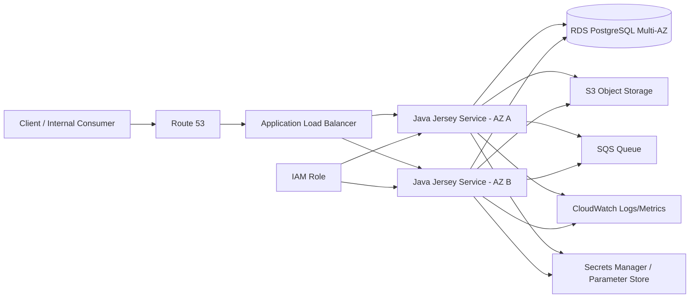

Interpretasi:

| Komponen | Mental Model |
|---|---|
| Route 53 | DNS boundary |
| ALB | HTTP ingress boundary |
| Java Service | Application runtime |
| RDS PostgreSQL | Transactional data boundary |
| S3 | Object/file boundary |
| SQS | Async processing boundary |
| CloudWatch | Observability boundary |
| Secrets Manager / Parameter Store | Config/secret boundary |
| IAM Role | Permission boundary |

---

# 9. Kesalahan Umum yang Harus Dihindari

| Kesalahan | Kenapa Berbahaya |
|---|---|
| Menganggap AWS otomatis secure | Banyak security issue berasal dari salah konfigurasi IAM, network, secret, dan storage |
| Semua resource public | Memperbesar attack surface |
| Semua environment dalam satu account tanpa guardrail | Blast radius besar |
| Tidak memahami Region/AZ | Sulit mendesain high availability dan disaster recovery |
| Tidak menyalakan audit/logging penting | Incident sulit dianalisis |
| Tidak menguji restore backup | Backup belum tentu berguna kalau restore gagal |
| Mengabaikan timeout/retry | Bisa menyebabkan cascading failure |
| Over-provision semua resource | Cost membengkak |
| Tidak tagging resource | Sulit ownership, audit, dan cost allocation |
| Menganggap managed service berarti no responsibility | Managed service tetap butuh konfigurasi, monitoring, dan operational ownership |

---

# 10. Checklist Cepat Seri 1

Gunakan checklist ini saat membaca sistem AWS baru:

| Checklist | Status |
|---|---|
| Tahu account yang dipakai untuk dev/staging/prod |
| Tahu Region utama workload |
| Tahu apakah production multi-AZ |
| Tahu service mana yang public vs private |
| Tahu siapa owner IAM role/policy |
| Tahu secret disimpan di mana |
| Tahu log dan metric dikirim ke mana |
| Tahu backup aktif atau tidak |
| Tahu restore pernah diuji atau belum |
| Tahu cost driver terbesar |
| Tahu tagging standard |
| Tahu apakah workload pernah direview dengan Well-Architected lens |

---

# 11. Mini Exercise

Ambil satu service Java/Jersey yang ada di perusahaan Anda, lalu jawab:

```text
Service name:
AWS account:
Environment:
Region:
Runtime: EC2 / ECS / EKS / Lambda / other
Public endpoint: yes/no
Private dependencies:
Database:
Queue/event dependency:
Secrets location:
IAM role:
Log destination:
Metric/alarm:
Backup dependency:
Known failure mode:
Rollback strategy:
```

Kalau Anda bisa menjawab ini, berarti Anda sudah mulai membaca AWS sebagai software engineer, bukan hanya sebagai user console.

---

# 12. Ringkasan Seri 1

Seri ini membangun fondasi:

1. **AWS Account** adalah ownership dan blast-radius boundary.
2. **Region** adalah location, latency, compliance, dan disaster recovery boundary.
3. **Availability Zone** adalah failure-isolation boundary.
4. **Shared Responsibility Model** menjelaskan mana tanggung jawab AWS dan mana tanggung jawab tim engineering.
5. **Well-Architected Framework** adalah lensa untuk menilai desain cloud dari sisi operasi, security, reliability, performance, cost, dan sustainability.
6. Untuk software engineer, AWS harus dipelajari lewat **alur aplikasi nyata**, bukan daftar layanan terpisah.

---

## Status

**Seri 1/24 selesai.**  
Sisa: **23 seri**.

## Rekomendasi materi berikutnya

Lanjut ke **Seri 2 - IAM Fundamentals: User, Role, Policy, STS, Least Privilege, dan Credential Strategy untuk Java Microservice / GitHub Actions / ECS / EKS**.

---

**Sources:**

- [Global infrastructure - Overview of Amazon Web Services](https://docs.aws.amazon.com/whitepapers/latest/aws-overview/global-infrastructure.html?utm_source=chatgpt.com)

## Response:
7/13/2026, 6:12:30 PM

Saya lanjut ke **Seri 2/24**: IAM. Fokusnya bukan hanya definisi User/Role/Policy, tapi bagaimana permission menjadi boundary aman untuk Java service, CI/CD, ECS, dan EKS.

# AWS for Software Engineer - Seri 2/24  
## IAM Fundamentals: User, Role, Policy, STS, Least Privilege, Credential Strategy

## 1. Introduction

Seri ini membahas **IAM sebagai permission boundary** untuk workload AWS.

Untuk software engineer, IAM bukan hanya urusan security team. Setiap service yang Anda buat perlu menjawab:

```text id="d6xqxj"
Service ini boleh mengakses resource AWS apa?
Atas nama identity siapa?
Credential-nya berasal dari mana?
Permission-nya scoped sampai level apa?
Kalau credential bocor, blast radius-nya sejauh apa?
```

AWS merekomendasikan penggunaan **IAM roles** untuk human users dan workloads agar memakai **temporary credentials**, bukan long-lived access keys. AWS juga merekomendasikan prinsip **least privilege**, yaitu memberi permission hanya sebanyak yang dibutuhkan untuk menjalankan task, tidak lebih. ([AWS Documentation](https://docs.aws.amazon.com/IAM/latest/UserGuide/best-practices.html?utm_source=chatgpt.com))

Dalam konteks stack Anda, IAM akan muncul di banyak tempat:

| Context | IAM Relevance |
|---|---|
| Java/Jersey service akses S3 | Service butuh role dengan permission `s3:GetObject`, `s3:PutObject`, dll. |
| Java service consume SQS | Service butuh permission `sqs:ReceiveMessage`, `sqs:DeleteMessage`, `sqs:GetQueueAttributes`. |
| Service publish event | Butuh permission ke SNS/EventBridge. |
| ECS/Fargate task | Perlu membedakan **task role** vs **task execution role**. |
| EKS pod | Perlu IAM role untuk Kubernetes service account atau EKS Pod Identity. |
| GitHub Actions deploy ke AWS | Sebaiknya memakai OIDC + role assumption, bukan static AWS access key. |
| RDS credential | Biasanya secret disimpan di Secrets Manager / Parameter Store, lalu aksesnya dikontrol IAM. |
| KMS encryption | Access ke key juga dikontrol oleh IAM policy dan key policy. |

---

# 2. Diagram Mental Model IAM

```mermaid id="aws-seri-2-iam-model"
flowchart TD
    A[AWS IAM Mental Model] --> B[Principal]
    A --> C[Policy]
    A --> D[Resource]
    A --> E[Credential]
    A --> F[Evaluation]

    B --> B1[IAM User]
    B --> B2[IAM Role]
    B --> B3[Federated Identity]
    B --> B4[AWS Service Principal]

    C --> C1[Identity-based Policy]
    C --> C2[Resource-based Policy]
    C --> C3[Permission Boundary]
    C --> C4[Session Policy]
    C --> C5[SCP Guardrail]

    D --> D1[S3 Bucket/Object]
    D --> D2[SQS Queue]
    D --> D3[Secrets Manager Secret]
    D --> D4[KMS Key]
    D --> D5[ECR Repository]

    E --> E1[Long-lived Access Key]
    E --> E2[Temporary Credential]
    E --> E3[AssumeRole via STS]
    E --> E4[OIDC Federation]

    F --> F1[Implicit Deny by Default]
    F --> F2[Explicit Allow Required]
    F --> F3[Explicit Deny Wins]
    F --> F4[Condition Context]
```

---

# 3. Core IAM Concepts

## 3.1 Principal

**Principal** adalah identity yang melakukan request ke AWS.

Contoh principal:

| Principal | Penjelasan | Kapan Dipakai |
|---|---|---|
| **Root user** | Identity paling kuat di account | Hampir tidak boleh dipakai untuk kerja harian |
| **IAM user** | Identity permanen di satu AWS account | Legacy/manual use case; sebaiknya dibatasi |
| **IAM role** | Identity tanpa credential permanen; diasumsikan oleh user/service/workload | Default yang direkomendasikan untuk workload modern |
| **Federated identity** | Identity dari external IdP seperti SSO/OIDC/SAML/GitHub Actions | Human access dan CI/CD modern |
| **AWS service principal** | Identity service AWS, misalnya ECS, Lambda, CloudFormation | Dipakai dalam trust policy |

AWS menyatakan bahwa IAM role adalah identity yang tidak memiliki credential sendiri seperti user; role diasumsikan secara dinamis oleh principal yang dipercaya, lalu menghasilkan temporary credentials. ([AWS Documentation](https://docs.aws.amazon.com/IAM/latest/UserGuide/id_roles_providers_create_oidc.html?utm_source=chatgpt.com))

---

## 3.2 IAM User

**IAM User** adalah identity permanen di AWS account.

Gunakan IAM User dengan sangat hati-hati. Untuk workload modern, AWS lebih merekomendasikan **temporary credentials dari IAM roles dan federated principals** dibanding long-term credentials dari IAM users dan access keys. ([AWS Documentation](https://docs.aws.amazon.com/IAM/latest/UserGuide/security-creds.html?utm_source=chatgpt.com))

### Kapan IAM User masih mungkin ada?

| Use Case | Catatan |
|---|---|
| Emergency/break-glass access | Harus MFA, sangat dibatasi, diaudit |
| Legacy integration yang belum support role/OIDC | Harus dipaksa rotasi key, scoped ketat |
| Human user lama | Sebaiknya migrasi ke IAM Identity Center / federation |

### Anti-pattern

```text id="4y5xcc"
Jangan simpan AWS_ACCESS_KEY_ID dan AWS_SECRET_ACCESS_KEY permanen
di repo, Docker image, application.properties, ConfigMap, atau CI/CD secret
kalau bisa diganti dengan role assumption / OIDC / workload identity.
```

---

## 3.3 IAM Role

**IAM Role** adalah konsep paling penting untuk workload AWS modern.

Role terdiri dari dua bagian besar:

| Bagian | Fungsi |
|---|---|
| **Trust policy** | Menentukan siapa yang boleh assume role |
| **Permission policy** | Menentukan role boleh melakukan action apa ke resource apa |

Mental model:

```text id="f8kusl"
Trust policy     = siapa boleh memakai role ini
Permission policy = role ini boleh melakukan apa
```

Contoh:

```text id="wcidku"
GitHub Actions
  └── assume role: deploy-prod-role
        └── boleh push image ke ECR dan update ECS service

ECS Task
  └── memakai role: order-service-task-role
        └── boleh baca secret, akses SQS, tulis object ke S3

EKS Pod
  └── service account mapped ke IAM role
        └── pod boleh publish event ke EventBridge
```

---

# 4. IAM Policy Fundamentals

IAM policy adalah dokumen JSON yang menyatakan permission.

Elemen penting:

| Element | Fungsi |
|---|---|
| `Version` | Versi bahasa policy |
| `Statement` | Daftar aturan |
| `Effect` | `Allow` atau `Deny` |
| `Action` | API action yang diizinkan/ditolak |
| `Resource` | Resource ARN yang dikenai policy |
| `Condition` | Syarat tambahan agar policy berlaku |
| `Principal` | Dipakai terutama di resource-based policy/trust policy |

AWS mendokumentasikan bahwa `Effect` menentukan apakah statement menghasilkan allow atau explicit deny, `Resource` mendefinisikan object yang dikenai statement, dan `Condition` memungkinkan policy hanya berlaku ketika request context cocok dengan ekspresi tertentu. ([AWS Documentation](https://docs.aws.amazon.com/IAM/latest/UserGuide/reference_policies_elements_effect.html?utm_source=chatgpt.com))

---

## 4.1 Identity-based Policy

Policy yang ditempel ke identity: user, group, atau role.

Contoh: role `order-service-task-role` boleh membaca message dari SQS tertentu.

```json id="4x7tx2"
{
  "Version": "2012-10-17",
  "Statement": [
    {
      "Sid": "ConsumeOrderQueue",
      "Effect": "Allow",
      "Action": [
        "sqs:ReceiveMessage",
        "sqs:DeleteMessage",
        "sqs:GetQueueAttributes",
        "sqs:ChangeMessageVisibility"
      ],
      "Resource": "arn:aws:sqs:ap-southeast-1:123456789012:order-events-prod"
    }
  ]
}
```

Prinsipnya: jangan pakai `sqs:*` dan jangan pakai `Resource: "*"` kecuali benar-benar diperlukan.

---

## 4.2 Resource-based Policy

Policy yang ditempel ke resource.

Contoh resource-based policy:

| Resource | Policy yang Umum |
|---|---|
| S3 bucket | Bucket policy |
| KMS key | Key policy |
| SQS queue | Queue policy |
| SNS topic | Topic policy |
| Lambda | Resource policy |
| ECR repository | Repository policy |

Resource-based policy penting untuk:

1. cross-account access  
2. public/private access boundary  
3. service-to-service access  
4. organization-level constraint  
5. controlling who can call or consume resource tertentu

AWS menjelaskan bahwa `Principal` pada resource-based policy dipakai untuk menentukan principal yang diizinkan atau ditolak mengakses resource. ([AWS Documentation](https://docs.aws.amazon.com/IAM/latest/UserGuide/reference_policies_elements_principal.html?utm_source=chatgpt.com))

---

## 4.3 Trust Policy

Trust policy adalah resource-based policy khusus pada IAM role yang menentukan siapa boleh melakukan `sts:AssumeRole`.

Contoh trust policy untuk GitHub Actions OIDC, disederhanakan:

```json id="dsghyl"
{
  "Version": "2012-10-17",
  "Statement": [
    {
      "Effect": "Allow",
      "Principal": {
        "Federated": "arn:aws:iam::123456789012:oidc-provider/token.actions.githubusercontent.com"
      },
      "Action": "sts:AssumeRoleWithWebIdentity",
      "Condition": {
        "StringEquals": {
          "token.actions.githubusercontent.com:aud": "sts.amazonaws.com"
        },
        "StringLike": {
          "token.actions.githubusercontent.com:sub": "repo:your-org/your-repo:ref:refs/heads/main"
        }
      }
    }
  ]
}
```

Bagian paling penting adalah `Condition`. AWS memperingatkan bahwa jika condition key `token.actions.githubusercontent.com:sub` tidak dibatasi ke organization/repository tertentu, GitHub Actions dari organisasi atau repository di luar kendali Anda dapat assume role terkait IdP GitHub di AWS account Anda. ([AWS Documentation](https://docs.aws.amazon.com/IAM/latest/UserGuide/id_roles_create_for-idp_oidc.html?utm_source=chatgpt.com))

---

# 5. Policy Evaluation Logic

AWS mengevaluasi request dengan prinsip umum berikut:

```text id="rur3v1"
Default: implicit deny
Butuh: explicit allow
Kalau ada explicit deny yang match: deny menang
```

AWS menjelaskan bahwa secara default semua request ditolak sebagai **implicit deny**, lalu enforcement code mengevaluasi policy yang berlaku; jika ada `Deny` statement yang cocok, itu menjadi **explicit deny**. ([AWS Documentation](https://docs.aws.amazon.com/IAM/latest/UserGuide/reference_policies_evaluation-logic_policy-eval-denyallow.html?utm_source=chatgpt.com))

## 5.1 Simplified Flow

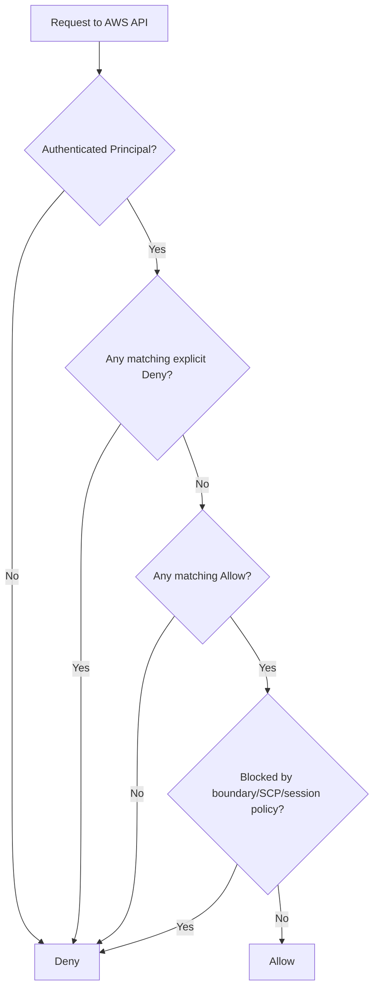

## 5.2 Practical Consequence

| Scenario | Result |
|---|---|
| Tidak ada policy allow | Denied |
| Ada allow ke S3 bucket tertentu | Allowed hanya ke resource itu |
| Ada allow `s3:*`, tapi SCP melarang `s3:DeleteBucket` | Delete bucket tetap denied |
| Ada allow, tapi permission boundary tidak mengizinkan | Denied |
| Ada explicit deny di policy mana pun yang berlaku | Denied |
| Resource policy allow cross-account, tapi trust/identity side tidak benar | Bisa tetap denied tergantung kombinasi policy |

---

# 6. STS dan Temporary Credentials

**AWS STS** digunakan untuk membuat temporary credentials. API `AssumeRole` mengembalikan temporary security credentials yang terdiri dari access key ID, secret access key, dan security token. Temporary credentials ini biasanya dipakai untuk akses cross-account atau untuk menjalankan operasi dengan role tertentu. ([AWS Documentation](https://docs.aws.amazon.com/STS/latest/APIReference/API_AssumeRole.html?utm_source=chatgpt.com))

## 6.1 Mental Model

```text id="07d6tb"
Permanent identity / external identity
        ↓
AssumeRole via STS
        ↓
Temporary credentials
        ↓
Call AWS API
```

## 6.2 Kenapa Temporary Credentials Lebih Aman?

| Alasan | Penjelasan |
|---|---|
| Ada expiry | Credential tidak berlaku selamanya |
| Bisa scoped | Role permission bisa dibatasi |
| Bisa diaudit | Role session terlihat di CloudTrail |
| Bisa federated | Tidak perlu membuat IAM user permanen |
| Cocok untuk CI/CD | GitHub Actions bisa assume role via OIDC |
| Cocok untuk workload | ECS/EKS/EC2 bisa memakai role tanpa hardcoded secret |

AWS SDK, AWS CLI, dan tools lain dapat menggunakan temporary credentials dari role yang diasosiasikan dengan compute environment; untuk EC2, misalnya, SDK dapat mengambil credentials dari Instance Metadata Service tanpa eksplisit hardcode credential di kode. ([AWS Documentation](https://docs.aws.amazon.com/IAM/latest/UserGuide/id_credentials_temp_use-resources.html?utm_source=chatgpt.com))

---

# 7. IAM untuk Java/Jersey Microservice

## 7.1 Jangan Hardcode Credential

Untuk Java service, idealnya code tidak tahu credential detail. Code cukup membuat AWS SDK client, lalu AWS SDK mencari credential melalui default provider chain.

Contoh konseptual Java SDK v2:

```java id="2o64um"
S3Client s3 = S3Client.builder()
    .region(Region.AP_SOUTHEAST_1)
    .build();
```

Bukan:

```java id="9b0xkd"
AwsBasicCredentials credentials = AwsBasicCredentials.create(
    "AKIA....",
    "secret...."
);
```

Dalam EKS IRSA, AWS menjelaskan bahwa aplikasi di container Pod dapat memakai AWS SDK/CLI untuk membuat API request ke AWS services, dan SDK akan memakai credential dari IAM role for service account jika credential provider tidak dioverride. ([AWS Documentation](https://docs.aws.amazon.com/eks/latest/userguide/iam-roles-for-service-accounts.html?utm_source=chatgpt.com))

---

## 7.2 Mapping Java Service ke IAM Role

Contoh service: `order-service`

| Operation | AWS Resource | IAM Action |
|---|---|---|
| Read DB credential | Secrets Manager | `secretsmanager:GetSecretValue` |
| Consume order queue | SQS | `sqs:ReceiveMessage`, `sqs:DeleteMessage`, `sqs:GetQueueAttributes` |
| Write invoice PDF | S3 | `s3:PutObject` |
| Read invoice template | S3 | `s3:GetObject` |
| Encrypt/decrypt data key | KMS | `kms:Decrypt`, `kms:GenerateDataKey` |
| Write logs | Biasanya handled by runtime/execution role | Tergantung ECS/EKS setup |

Contoh policy role untuk service, disederhanakan:

```json id="4rqwji"
{
  "Version": "2012-10-17",
  "Statement": [
    {
      "Sid": "ReadDatabaseSecret",
      "Effect": "Allow",
      "Action": "secretsmanager:GetSecretValue",
      "Resource": "arn:aws:secretsmanager:ap-southeast-1:123456789012:secret:prod/order-service/db-*"
    },
    {
      "Sid": "ConsumeOrderQueue",
      "Effect": "Allow",
      "Action": [
        "sqs:ReceiveMessage",
        "sqs:DeleteMessage",
        "sqs:GetQueueAttributes",
        "sqs:ChangeMessageVisibility"
      ],
      "Resource": "arn:aws:sqs:ap-southeast-1:123456789012:order-events-prod"
    },
    {
      "Sid": "WriteInvoiceObjects",
      "Effect": "Allow",
      "Action": [
        "s3:PutObject",
        "s3:GetObject"
      ],
      "Resource": "arn:aws:s3:::company-prod-invoice-bucket/*"
    }
  ]
}
```

---

# 8. IAM untuk ECS/Fargate

Di ECS, ada dua role yang sering tertukar:

| Role | Dipakai Oleh | Fungsi |
|---|---|---|
| **Task execution role** | ECS/Fargate agent | Pull image dari ECR, kirim log ke CloudWatch, ambil secret untuk task startup |
| **Task role** | Application code di container | Aplikasi akses S3, SQS, Secrets Manager, DynamoDB, EventBridge, dll. |

AWS menjelaskan bahwa **task execution role** memberi permission kepada ECS container/Fargate agent untuk memanggil AWS API atas nama Anda, sedangkan **task role** memberi permission ke container aplikasi yang berjalan dalam task untuk menggunakan AWS services. ([AWS Documentation](https://docs.aws.amazon.com/AmazonECS/latest/developerguide/task_execution_IAM_role.html?utm_source=chatgpt.com))

## 8.1 Rule of Thumb

```text id="i6fbz7"
Execution role = platform needs
Task role      = application needs
```

## 8.2 Contoh Separation

| Need | Role yang Benar |
|---|---|
| Pull image dari ECR | Task execution role |
| Send container log ke CloudWatch Logs | Task execution role |
| Inject secret saat task start | Task execution role / tergantung setup |
| Java code baca S3 object | Task role |
| Java code consume SQS | Task role |
| Java code publish EventBridge event | Task role |

Kesalahan umum: memberikan permission aplikasi ke execution role, lalu application code tidak bisa akses resource karena yang dipakai container adalah task role, bukan execution role.

---

# 9. IAM untuk EKS

Untuk EKS, workload Kubernetes perlu identity AWS agar pod bisa mengakses resource AWS.

Ada beberapa pendekatan:

| Approach | Catatan |
|---|---|
| Node IAM role | Semua pod pada node bisa berpotensi berbagi permission terlalu luas |
| IRSA | IAM role dipetakan ke Kubernetes service account |
| EKS Pod Identity | Mekanisme lebih baru untuk mengelola credential workload melalui EKS Pod Identity association |

AWS menjelaskan bahwa **IAM Roles for Service Accounts / IRSA** memberi kemampuan mengelola credentials aplikasi di Pod mirip seperti EC2 instance profile, dan aplikasi di container dapat menggunakan AWS SDK/CLI untuk request ke AWS services dengan IAM permissions. ([AWS Documentation](https://docs.aws.amazon.com/eks/latest/userguide/iam-roles-for-service-accounts.html?utm_source=chatgpt.com))

## 9.1 Mental Model IRSA

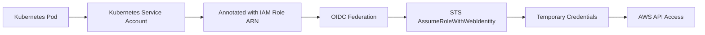

## 9.2 Practical Mapping

| Kubernetes Object | AWS IAM Object |
|---|---|
| Namespace | Environment/domain boundary |
| ServiceAccount | Workload identity |
| Pod | Runtime using identity |
| IAM Role | AWS permission boundary |
| IAM Policy | Allowed AWS actions/resources |
| OIDC Provider | Trust bridge between EKS and IAM |

---

# 10. IAM untuk GitHub Actions CI/CD

Untuk GitHub Actions deploy ke AWS, pattern modern adalah:

```text id="4wo6c1"
GitHub Actions OIDC token
        ↓
AWS IAM OIDC provider
        ↓
AssumeRoleWithWebIdentity
        ↓
Temporary AWS credentials
        ↓
Deploy to ECR/ECS/EKS/Lambda/etc
```

Dengan OIDC federation, aplikasi seperti GitHub Actions dapat authenticate ke AWS menggunakan JWT dari OIDC-compatible IdP, lalu menukar token itu menjadi temporary security credentials yang dipetakan ke IAM role. ([AWS Documentation](https://docs.aws.amazon.com/IAM/latest/UserGuide/id_roles_providers_oidc.html?utm_source=chatgpt.com))

## 10.1 Minimal Permission untuk CI/CD

Contoh pipeline Java service:

| Pipeline Step | Permission |
|---|---|
| Push Docker image | `ecr:GetAuthorizationToken`, `ecr:BatchCheckLayerAvailability`, `ecr:PutImage`, dll. |
| Update ECS service | `ecs:RegisterTaskDefinition`, `ecs:UpdateService`, `ecs:DescribeServices` |
| Pass task roles | `iam:PassRole` terbatas ke role tertentu |
| Read deployment config | `ssm:GetParameter` atau `secretsmanager:GetSecretValue`, jika perlu |
| Deploy IaC | CloudFormation/Terraform permission sesuai scope |

`iam:PassRole` harus sangat hati-hati. Jangan beri `iam:PassRole` ke semua role karena pipeline bisa menyalahgunakan role dengan privilege lebih tinggi.

---

# 11. Least Privilege Design

Least privilege berarti permission diberikan hanya untuk task yang dibutuhkan. AWS menyatakan AWS managed policies mungkin tidak memberikan least privilege untuk use case spesifik karena dibuat untuk semua customer, dan IAM Access Analyzer dapat membantu generate policy berdasarkan aktivitas akses yang tercatat di CloudTrail. ([AWS Documentation](https://docs.aws.amazon.com/IAM/latest/UserGuide/getting-started-reduce-permissions.html?utm_source=chatgpt.com))

## 11.1 Cara Berpikir Least Privilege

```text id="y384vl"
1. Tentukan use case aplikasi.
2. Turunkan menjadi AWS API action.
3. Batasi resource ARN.
4. Tambahkan condition jika memungkinkan.
5. Validasi policy.
6. Monitor actual access.
7. Kurangi permission yang tidak dipakai.
```

## 11.2 Dari Buruk ke Lebih Baik

Buruk:

```json id="ylxyu6"
{
  "Effect": "Allow",
  "Action": "*",
  "Resource": "*"
}
```

Lebih baik:

```json id="ziw1g0"
{
  "Effect": "Allow",
  "Action": [
    "sqs:ReceiveMessage",
    "sqs:DeleteMessage",
    "sqs:GetQueueAttributes"
  ],
  "Resource": "arn:aws:sqs:ap-southeast-1:123456789012:order-events-prod"
}
```

Lebih baik lagi jika ditambah condition yang relevan, misalnya membatasi lewat VPC endpoint, tag, account, principal ARN, atau environment boundary - tergantung service dan action yang mendukung condition key. AWS menyediakan referensi action, resource, dan condition key per service karena tidak semua condition key berlaku untuk semua action/resource. ([AWS Documentation](https://docs.aws.amazon.com/service-authorization/latest/reference/reference_policies_actions-resources-contextkeys.html?utm_source=chatgpt.com))

---

# 12. Permission Boundary, SCP, dan Guardrail

Untuk organisasi besar, IAM tidak hanya policy yang ditempel ke role. Ada beberapa lapisan guardrail.

| Mechanism | Fungsi |
|---|---|
| **Identity-based policy** | Memberikan permission ke user/role |
| **Resource-based policy** | Memberikan permission dari sisi resource |
| **Permission boundary** | Membatasi maksimum permission yang bisa diberikan identity policy |
| **Session policy** | Membatasi permission session hasil assume role |
| **SCP** | Guardrail organisasi/account via AWS Organizations |

AWS menjelaskan bahwa permission boundary menentukan maksimum permission yang bisa diberikan oleh identity-based policy kepada entity, dan entity hanya bisa melakukan action yang diizinkan oleh identity-based policy serta permission boundary. ([AWS Documentation](https://docs.aws.amazon.com/IAM/latest/UserGuide/access_policies_boundaries.html?utm_source=chatgpt.com))

SCP berbeda: SCP tidak memberikan permission; SCP hanya menetapkan guardrail/batas maksimum action yang dapat dilakukan IAM users dan roles di organization/account. ([AWS Documentation](https://docs.aws.amazon.com/organizations/latest/userguide/orgs_manage_policies_scps.html?utm_source=chatgpt.com))

---

# 13. Practical IAM Decomposition Table

| Domain | Skill | Yang Harus Dikuasai | Output Praktis |
|---|---|---|---|
| Identity Model | User vs Role vs Federated Identity | Bedakan identity permanen vs assumed role | Identity map untuk human dan workload |
| Trust Boundary | Trust policy | Siapa boleh assume role | Trust policy yang scoped |
| Permission Boundary | IAM policy | Action/resource/condition | Least-privilege policy |
| Runtime IAM | ECS task role/execution role | Pisahkan platform permission vs app permission | ECS task definition yang benar |
| Kubernetes IAM | IRSA / Pod Identity | Map service account ke IAM role | Per-pod permission model |
| CI/CD IAM | GitHub OIDC | Deploy tanpa static access key | Deployment role dengan condition ketat |
| Secret Access | Secrets Manager/Parameter Store | App hanya baca secret yang perlu | Secret access policy |
| Data Access | S3/RDS/KMS/SQS | Scope ke resource tertentu | ARN-scoped policy |
| Cross-account | AssumeRole | Trust antar-account | Cross-account role design |
| Guardrail | SCP / permission boundary | Batasi privilege escalation | Organizational permission boundary |
| Policy Validation | IAM Access Analyzer | Cek policy grammar dan best practices | Validated policy before merge |
| Audit | CloudTrail | Lacak role session dan API call | Traceability saat incident |

---

# 14. IAM Design untuk Microservice

## 14.1 Satu Role per Service

Pattern yang sehat:

```text id="28zy07"
order-service-prod-task-role
payment-service-prod-task-role
inventory-service-prod-task-role
notification-service-prod-task-role
```

Jangan semua service memakai role generic:

```text id="haj4aa"
backend-prod-role
microservice-role
app-role
ecs-task-role
```

Kenapa?

| Alasan | Dampak |
|---|---|
| Blast radius lebih kecil | Jika satu service compromised, permission tidak menyebar |
| Audit lebih jelas | CloudTrail bisa menunjukkan service mana yang akses resource |
| Least privilege lebih mudah | Permission sesuai use case service |
| Review lebih mudah | Policy tidak bercampur |
| Incident response lebih cepat | Role bisa dicabut/diubah tanpa mematikan semua service |

---

## 14.2 IAM by Use Case

Contoh mapping microservice:

| Service | Butuh Akses | IAM Role Scope |
|---|---|---|
| `order-service` | SQS order queue, RDS secret, S3 invoice | Order-specific resources |
| `payment-service` | KMS key, payment secret, EventBridge payment events | Payment-specific resources |
| `document-service` | S3 documents bucket, antivirus queue | Document-specific resources |
| `workflow-service` | Camunda DB secret, SQS workflow events | Workflow-specific resources |
| `notification-service` | SNS topic, email provider secret | Notification-specific resources |

---

# 15. IAM Failure Modes

| Failure Mode | Gejala | Root Cause Umum | Fix |
|---|---|---|---|
| `AccessDeniedException` | AWS API call gagal | Action tidak diizinkan | Tambah action spesifik |
| `AccessDenied` walau action sudah allow | Resource ARN salah | ARN queue/bucket/object tidak cocok | Perbaiki ARN |
| Bisa akses dev tapi tidak prod | Role/account/region berbeda | Environment boundary tidak sinkron | Cek role dan resource ARN |
| GitHub Actions gagal assume role | OIDC trust condition salah | `sub` atau `aud` mismatch | Perbaiki trust policy |
| ECS app tidak bisa akses S3 | Permission ditempel ke execution role, bukan task role | Role salah | Pindahkan permission ke task role |
| EKS pod tidak dapat credential | Service account annotation/association salah | IRSA/Pod Identity belum benar | Cek service account, trust, token |
| Cross-account gagal | Trust policy hanya satu sisi | Source role tidak dipercaya target role | Perbaiki trust + identity permission |
| Policy terlalu luas | Audit finding/security risk | `Action:*` atau `Resource:*` | Scope down |
| Deploy bisa pass role admin | Privilege escalation risk | `iam:PassRole` terlalu luas | Batasi role ARN dan service condition |
| Role dipakai banyak service | Audit sulit | Shared role anti-pattern | Pisah role per service |

---

# 16. Production Checklist IAM

| Checklist | Harus Dicek |
|---|---|
| Root user tidak dipakai untuk operasi harian |
| MFA aktif untuk emergency access |
| Human access memakai federation/SSO bila tersedia |
| Workload memakai IAM role, bukan static access key |
| GitHub Actions memakai OIDC, bukan long-lived AWS keys |
| Setiap service punya role sendiri |
| ECS task role dan execution role dipisah |
| EKS pod memakai IRSA atau Pod Identity, bukan node role luas |
| Policy tidak memakai `Action:*` tanpa alasan kuat |
| Policy tidak memakai `Resource:*` kecuali action memang tidak mendukung resource-level permission |
| `iam:PassRole` dibatasi |
| Secrets Manager access scoped per service |
| KMS key access scoped |
| Cross-account trust policy dibatasi |
| Policy divalidasi dengan IAM Access Analyzer |
| CloudTrail aktif untuk audit |
| Access review dilakukan berkala |

AWS menyarankan IAM Access Analyzer untuk memvalidasi policy terhadap IAM policy grammar dan best practices, termasuk security warnings, errors, warnings, dan suggestions. ([AWS Documentation](https://docs.aws.amazon.com/IAM/latest/UserGuide/access-analyzer-policy-validation.html?utm_source=chatgpt.com))

---

# 17. Mini Exercise

Ambil satu service backend, lalu isi:

```text id="crbmx7"
Service name:
Runtime: ECS / EKS / EC2 / Lambda
AWS account:
Environment:
IAM role name:
Trust principal:
Permission policy:
AWS services accessed:
Resource ARNs:
Secrets accessed:
KMS keys used:
CI/CD deploy role:
Does it use static access keys? yes/no
CloudTrail traceable? yes/no
Known over-permission:
Least privilege improvement:
```

Lalu jawab tiga pertanyaan:

```text id="8dq419"
1. Kalau service ini compromised, AWS resource apa saja yang bisa diakses attacker?
2. Kalau role ini dicabut, service apa saja yang akan rusak?
3. Apakah permission role ini bisa dijelaskan dalam 5 kalimat?
```

Kalau jawaban nomor 3 sulit, biasanya role terlalu luas atau terlalu banyak tanggung jawab.

---

# 18. Ringkasan Seri 2

IAM adalah pusat kontrol akses di AWS.

Yang harus Anda pegang:

1. **IAM User** adalah identity permanen; hindari untuk workload modern.
2. **IAM Role** adalah identity utama untuk aplikasi, CI/CD, ECS, EKS, EC2, dan cross-account.
3. **Trust policy** menjawab “siapa boleh assume role”.
4. **Permission policy** menjawab “role boleh melakukan apa”.
5. **STS** menghasilkan temporary credentials.
6. **Least privilege** berarti permission diturunkan dari use case, bukan dari convenience.
7. **ECS task role** berbeda dari **task execution role**.
8. **EKS workload** sebaiknya memakai IRSA atau Pod Identity, bukan node role luas.
9. **GitHub Actions** sebaiknya memakai OIDC + role assumption.
10. **Explicit deny menang**, dan default-nya semua request adalah implicit deny.

---

## Status

**Seri 2/24 selesai.**  
Sisa: **22 seri**.

## Rekomendasi materi berikutnya

Lanjut ke **Seri 3 - AWS Networking Core: VPC, Subnet, Route Table, Internet Gateway, NAT Gateway, CIDR, dan Private/Public Runtime Boundary**.

---

**Sources:**

- [Security best practices in IAM - AWS Identity and Access ...](https://docs.aws.amazon.com/IAM/latest/UserGuide/best-practices.html?utm_source=chatgpt.com)

## Response:
7/13/2026, 6:14:56 PM

Saya lanjut ke **Seri 3/24**: AWS Networking Core. Ini pondasi untuk memahami kenapa service ditempatkan di private subnet, bagaimana traffic keluar/masuk, dan apa bedanya route, gateway, security boundary, serta runtime boundary.

# AWS for Software Engineer - Seri 3/24  
## AWS Networking Core: VPC, Subnet, Route Table, Internet Gateway, NAT Gateway, CIDR, Private/Public Boundary

## 1. Introduction

Seri ini membahas **networking core di AWS**: bagaimana workload ditempatkan, bagaimana traffic diarahkan, dan bagaimana membedakan resource yang boleh menerima traffic publik vs resource yang hanya boleh hidup secara private.

Untuk software engineer, AWS networking perlu dibaca sebagai **traffic control layer**:

```text
Client / Internet / Internal Network
        ↓
DNS / Load Balancer / API Gateway
        ↓
Public subnet boundary
        ↓
Private application runtime
        ↓
Private database / queue / cache / internal services
```

Amazon VPC adalah virtual network yang mirip jaringan tradisional di data center sendiri. Setelah VPC dibuat, engineer dapat menambahkan subnet, route table, gateway, dan resource lain agar aplikasi bisa berjalan dengan connectivity yang sesuai. Subnet adalah range IP address dalam VPC dan setiap subnet berada di satu Availability Zone. ([AWS Documentation](https://docs.aws.amazon.com/vpc/latest/userguide/what-is-amazon-vpc.html?utm_source=chatgpt.com))

---

# 2. Diagram Mental Model

```mermaid
flowchart TD
    A[AWS VPC Networking Core] --> B[VPC]
    A --> C[CIDR]
    A --> D[Subnet]
    A --> E[Route Table]
    A --> F[Internet Gateway]
    A --> G[NAT Gateway]
    A --> H[Public vs Private Boundary]

    B --> B1[Virtual private network]
    B --> B2[Resource isolation boundary]
    B --> B3[Regional construct]

    C --> C1[VPC CIDR block]
    C --> C2[Subnet CIDR block]
    C --> C3[IP address planning]

    D --> D1[Public subnet]
    D --> D2[Private subnet]
    D --> D3[One subnet belongs to one AZ]

    E --> E1[Local route]
    E --> E2[0.0.0.0/0 to IGW]
    E --> E3[0.0.0.0/0 to NAT Gateway]
    E --> E4[Routes to peer/on-prem/TGW]

    F --> F1[Internet-routable target]
    F --> F2[Inbound/outbound internet path]

    G --> G1[Outbound internet for private subnet]
    G --> G2[No unsolicited inbound internet traffic]

    H --> H1[Public-facing entrypoint]
    H --> H2[Private app runtime]
    H --> H3[Private database]
```

---

# 3. Core Concept

## 3.1 VPC

**VPC / Virtual Private Cloud** adalah network boundary utama untuk workload AWS.

Dalam VPC, Anda menentukan:

| Aspek | Contoh |
|---|---|
| IP range | `10.0.0.0/16` |
| Subnet layout | Public/private subnet per AZ |
| Routing | Route table ke internet gateway, NAT gateway, peering, transit gateway |
| Security boundary | Security group, NACL, private endpoint |
| Runtime placement | EC2, ECS, EKS node, RDS, ElastiCache, internal ALB |
| Connectivity | Internet, on-prem, antar-VPC, private service access |

Mental model:

```text
VPC = private network milik workload Anda di dalam satu AWS Region
```

Satu VPC biasanya dipakai sebagai boundary untuk satu environment atau satu domain workload, tergantung skala organisasi.

Contoh:

```text
prod-vpc
├── public-subnet-a
├── public-subnet-b
├── private-app-subnet-a
├── private-app-subnet-b
├── private-db-subnet-a
└── private-db-subnet-b
```

---

## 3.2 CIDR Block

**CIDR block** menentukan range IP yang tersedia untuk VPC atau subnet.

Contoh:

```text
VPC CIDR:       10.0.0.0/16
Public A:       10.0.1.0/24
Public B:       10.0.2.0/24
Private App A:  10.0.11.0/24
Private App B:  10.0.12.0/24
Private DB A:   10.0.21.0/24
Private DB B:   10.0.22.0/24
```

Saat CIDR block diasosiasikan ke VPC, AWS otomatis menambahkan local route ke route table agar resource di dalam VPC bisa berkomunikasi memakai private IP address. ([AWS Documentation](https://docs.aws.amazon.com/vpc/latest/userguide/vpc-cidr-blocks.html?utm_source=chatgpt.com))

### Practical implication

| Keputusan CIDR | Dampak |
|---|---|
| CIDR terlalu kecil | IP cepat habis, terutama untuk EKS/ECS yang butuh banyak ENI/IP |
| CIDR overlap dengan on-prem | Sulit VPN/Direct Connect/Transit Gateway |
| Tidak ada struktur subnet | Sulit audit, routing, dan troubleshooting |
| Tidak dirancang multi-AZ | High availability menjadi sulit |

Untuk perusahaan yang punya on-prem/AWS/Azure, **hindari CIDR overlap** sejak awal. CIDR overlap akan menyulitkan koneksi hybrid, VPC peering, routing antar-cloud, dan migrasi workload.

---

## 3.3 Subnet

**Subnet** adalah range IP address di dalam VPC. AWS menyatakan bahwa subnet harus berada dalam satu Availability Zone. ([AWS Documentation](https://docs.aws.amazon.com/vpc/latest/userguide/what-is-amazon-vpc.html?utm_source=chatgpt.com))

Mental model:

```text
Subnet = segment network dalam satu AZ
```

Contoh:

```text
ap-southeast-1a
├── public-subnet-a
├── private-app-subnet-a
└── private-db-subnet-a

ap-southeast-1b
├── public-subnet-b
├── private-app-subnet-b
└── private-db-subnet-b
```

### Public subnet vs private subnet

Secara praktis:

| Jenis Subnet | Ciri Utama | Umum Dipakai Untuk |
|---|---|---|
| **Public subnet** | Route table punya route internet-bound ke Internet Gateway | ALB publik, NAT Gateway, bastion jika masih dipakai |
| **Private subnet** | Tidak punya direct route ke Internet Gateway untuk inbound publik | App runtime, ECS task, EKS node/pod, RDS, internal service |
| **Isolated/private DB subnet** | Tidak punya outbound internet langsung; akses sangat terbatas | RDS, database, cache, sensitive internal service |

Penting: subnet disebut “public” bukan karena namanya `public-subnet`, tetapi karena **route table association-nya**. Kalau subnet punya route `0.0.0.0/0` ke Internet Gateway dan resource memiliki public IP, subnet itu secara praktis public.

---

# 4. Route Table

Route table adalah komponen yang menentukan ke mana traffic diarahkan. AWS mendeskripsikan route table sebagai traffic controller untuk VPC; setiap route table berisi aturan route yang menentukan arah traffic dari subnet atau gateway. ([AWS Documentation](https://docs.aws.amazon.com/vpc/latest/userguide/VPC_Route_Tables.html?utm_source=chatgpt.com))

Setiap subnet harus diasosiasikan dengan satu route table. Jika tidak diasosiasikan eksplisit, subnet akan memakai main route table. Satu subnet hanya bisa diasosiasikan dengan satu route table pada satu waktu, tetapi satu route table bisa dipakai oleh beberapa subnet. ([AWS Documentation](https://docs.aws.amazon.com/vpc/latest/userguide/subnet-route-tables.html?utm_source=chatgpt.com))

## 4.1 Route Table Anatomy

Contoh route table public subnet:

| Destination | Target | Makna |
|---|---|---|
| `10.0.0.0/16` | `local` | Traffic internal VPC |
| `0.0.0.0/0` | `igw-xxxx` | Traffic IPv4 ke internet lewat Internet Gateway |

Contoh route table private app subnet:

| Destination | Target | Makna |
|---|---|---|
| `10.0.0.0/16` | `local` | Traffic internal VPC |
| `0.0.0.0/0` | `nat-xxxx` | Outbound internet lewat NAT Gateway |

Contoh route table isolated DB subnet:

| Destination | Target | Makna |
|---|---|---|
| `10.0.0.0/16` | `local` | Hanya komunikasi internal VPC |
| Tidak ada default route ke internet | - | Tidak ada outbound internet langsung |

---

## 4.2 Route Matching Mental Model

Route table bekerja berdasarkan destination. Untuk setiap packet, AWS memilih route yang paling cocok.

```text
Traffic destination: 10.0.21.10
Match: 10.0.0.0/16 → local

Traffic destination: 8.8.8.8
Match: 0.0.0.0/0 → igw atau nat gateway, tergantung route table subnet
```

Untuk engineer, route table menjawab pertanyaan:

```text
Dari subnet ini, traffic ke tujuan X harus lewat mana?
```

Bukan:

```text
Siapa boleh akses port apa?
```

Pertanyaan “siapa boleh akses port apa” lebih tepat dibahas di **Security Group dan NACL**, yang akan masuk di Seri 4.

---

# 5. Internet Gateway

**Internet Gateway / IGW** memberi target di route table untuk traffic yang internet-routable. Untuk IPv4, Internet Gateway juga melakukan network address translation dalam komunikasi internet. ([AWS Documentation](https://docs.aws.amazon.com/vpc/latest/userguide/VPC_Internet_Gateway.html?utm_source=chatgpt.com))

Mental model:

```text
Internet Gateway = pintu VPC ke/dari internet
```

Agar resource seperti EC2 atau public ALB dapat diakses dari internet, biasanya dibutuhkan:

| Syarat | Penjelasan |
|---|---|
| VPC punya Internet Gateway | IGW attached ke VPC |
| Subnet route table punya route ke IGW | Misalnya `0.0.0.0/0 -> igw-xxxx` |
| Resource punya public address atau berada di belakang public LB | Misalnya ALB public |
| Security group mengizinkan traffic | Misalnya inbound 443 |
| NACL tidak memblokir | Network ACL harus kompatibel |

Contoh public subnet route:

```text
Destination     Target
10.0.0.0/16     local
0.0.0.0/0       igw-123456
```

Public subnet biasanya tidak dipakai untuk menjalankan database atau aplikasi internal sensitif. Public subnet lebih sering menjadi tempat:

| Resource | Alasan |
|---|---|
| Public ALB | Menerima HTTP/HTTPS dari internet |
| NAT Gateway | Memberi outbound internet untuk private subnet |
| Bastion host | Legacy/admin access, sebaiknya dikurangi atau diganti SSM |
| Public-facing reverse proxy | Jika desain membutuhkan |

---

# 6. NAT Gateway

**NAT Gateway** dipakai agar resource di private subnet bisa melakukan outbound connection, misalnya download dependency, call external API, pull update, atau akses internet, tanpa menerima unsolicited inbound connection dari internet. AWS menyatakan public NAT gateway dibuat di public subnet, memakai Elastic IP, dan private subnet dapat connect ke internet melalui public NAT gateway, tetapi tidak menerima unsolicited inbound connection dari internet. ([AWS Documentation](https://docs.aws.amazon.com/vpc/latest/userguide/vpc-nat-gateway.html?utm_source=chatgpt.com))

Mental model:

```text
NAT Gateway = outbound internet path untuk private subnet
```

## 6.1 Public NAT Gateway Pattern

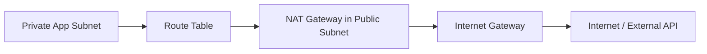

Private subnet route table:

| Destination | Target |
|---|---|
| `10.0.0.0/16` | `local` |
| `0.0.0.0/0` | `nat-xxxx` |

Public subnet route table:

| Destination | Target |
|---|---|
| `10.0.0.0/16` | `local` |
| `0.0.0.0/0` | `igw-xxxx` |

## 6.2 Kapan NAT Gateway Dibutuhkan?

| Use Case | NAT Gateway Relevan? |
|---|---|
| Private ECS task call external payment API | Ya |
| Private Java service call SaaS API | Ya |
| Private EC2 download package dari internet | Ya |
| Private app akses AWS service lewat public endpoint | Bisa, tapi VPC Endpoint sering lebih baik |
| RDS perlu internet | Umumnya tidak |
| Internal-only service tanpa outbound internet | Tidak perlu |

## 6.3 Risiko dan Cost Awareness

NAT Gateway sering menjadi cost driver karena ada biaya per jam dan data processing. Dari sisi arsitektur, terlalu banyak private workload yang mengakses internet lewat NAT bisa membuat cost tinggi dan visibility rendah.

Alternatif untuk akses AWS services dari private subnet:

| Tujuan | Alternatif |
|---|---|
| Akses S3 dari private subnet | Gateway VPC Endpoint for S3 |
| Akses DynamoDB | Gateway VPC Endpoint for DynamoDB |
| Akses Secrets Manager / SQS / ECR / CloudWatch | Interface VPC Endpoint |
| Akses internal service antar-VPC | VPC Peering / Transit Gateway / PrivateLink |

VPC Endpoint akan dibahas lebih detail di seri service exposure/private connectivity, tetapi untuk seri ini cukup pegang prinsip: **jangan otomatis semua outbound private subnet dilewatkan ke NAT kalau tujuannya AWS service internal**.

---

# 7. Public vs Private Runtime Boundary

## 7.1 Pattern yang Umum untuk Java Microservice

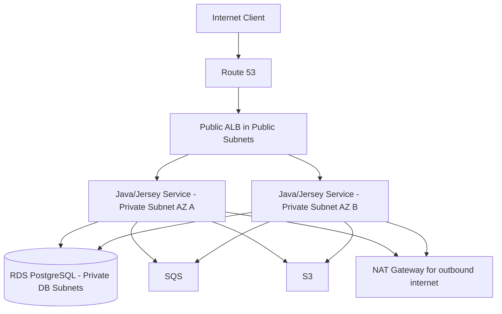

Interpretasi:

| Layer | Public/Private | Alasan |
|---|---|---|
| Route 53 | Public DNS | Entry point |
| Public ALB | Public subnet | Menerima HTTPS dari client |
| Java/Jersey service | Private subnet | Tidak diekspos langsung ke internet |
| RDS PostgreSQL | Private DB subnet | Database tidak boleh public |
| SQS/S3 | AWS managed service | Diakses via IAM dan network path |
| NAT Gateway | Public subnet | Outbound internet untuk private app |

## 7.2 Pattern yang Harus Dihindari

```text
Internet
   ↓
EC2 public IP running Java app
   ↓
RDS public endpoint
```

Kenapa buruk?

| Masalah | Risiko |
|---|---|
| App langsung public | Attack surface lebih besar |
| Tidak ada ALB boundary | TLS, routing, health check, WAF integration lebih sulit |
| Database public | Risiko data breach jauh lebih tinggi |
| Scaling manual | Sulit autoscaling dan rolling deployment |
| Observability lemah | Sulit tracing traffic layer |

---

# 8. Multi-AZ Network Layout

Untuk production, subnet biasanya dibuat per AZ.

```text
VPC: 10.0.0.0/16

AZ A
├── public-subnet-a       10.0.1.0/24
├── private-app-subnet-a  10.0.11.0/24
└── private-db-subnet-a   10.0.21.0/24

AZ B
├── public-subnet-b       10.0.2.0/24
├── private-app-subnet-b  10.0.12.0/24
└── private-db-subnet-b   10.0.22.0/24

AZ C
├── public-subnet-c       10.0.3.0/24
├── private-app-subnet-c  10.0.13.0/24
└── private-db-subnet-c   10.0.23.0/24
```

## 8.1 Kenapa Multi-AZ?

| Tujuan | Penjelasan |
|---|---|
| High availability | Jika satu AZ bermasalah, workload bisa tetap berjalan di AZ lain |
| Load distribution | ALB/ECS/EKS bisa menempatkan workload lintas AZ |
| Database failover | RDS Multi-AZ dapat menempatkan standby di AZ berbeda |
| Maintenance tolerance | Rolling update lebih aman |
| Fault isolation | Failure satu AZ tidak otomatis mematikan semua aplikasi |

## 8.2 NAT Gateway Multi-AZ Consideration

Best practice umum adalah menempatkan NAT Gateway per AZ dan route private subnet di AZ tersebut ke NAT Gateway lokal AZ yang sama untuk mengurangi dependency lintas-AZ dan potensi data transfer cross-AZ. Namun banyak organisasi kecil memakai satu NAT Gateway untuk menekan biaya, dengan trade-off reliability.

| Pattern | Kelebihan | Risiko |
|---|---|---|
| 1 NAT Gateway untuk semua private subnet | Lebih murah | Single-AZ dependency, cross-AZ traffic |
| NAT Gateway per AZ | Lebih resilient | Biaya lebih tinggi |
| No NAT + VPC Endpoints | Lebih private untuk AWS services | Setup lebih kompleks, tetap perlu NAT untuk internet eksternal |

---

# 9. CIDR Planning untuk Engineer

CIDR planning sering dianggap urusan platform/network team, tetapi software engineer perlu paham karena berdampak ke deployment dan scaling.

## 9.1 Rule of Thumb

| Concern | Rekomendasi Praktis |
|---|---|
| Future growth | Jangan terlalu kecil |
| Multi-AZ | Siapkan subnet per AZ |
| Runtime separation | Pisahkan public/app/db subnet |
| EKS | Butuh perhatian khusus karena pod/IP consumption bisa tinggi |
| Hybrid cloud | Hindari overlap dengan on-prem/Azure |
| Environment | Dev/staging/prod sebaiknya punya range jelas |
| Observability | Tagging subnet dan route table harus rapi |

## 9.2 Contoh IP Plan Sederhana

| Environment | VPC CIDR |
|---|---|
| Dev | `10.10.0.0/16` |
| Staging | `10.20.0.0/16` |
| Prod | `10.30.0.0/16` |
| Shared services | `10.40.0.0/16` |

Contoh subnet prod:

| Subnet | CIDR | AZ | Purpose |
|---|---:|---|---|
| `prod-public-a` | `10.30.1.0/24` | A | Public ALB, NAT |
| `prod-public-b` | `10.30.2.0/24` | B | Public ALB, NAT |
| `prod-app-a` | `10.30.11.0/24` | A | ECS/EKS app |
| `prod-app-b` | `10.30.12.0/24` | B | ECS/EKS app |
| `prod-db-a` | `10.30.21.0/24` | A | RDS subnet group |
| `prod-db-b` | `10.30.22.0/24` | B | RDS subnet group |

---

# 10. Decomposition Table

| Domain | Skill | Yang Harus Dikuasai | Output Praktis |
|---|---|---|---|
| VPC Foundation | Membaca VPC sebagai network boundary | CIDR, region, account, environment | VPC diagram |
| CIDR Planning | Merancang IP range | Non-overlap, growth, subnet split | IP allocation plan |
| Subnet Design | Memisahkan public/app/db subnet | AZ, subnet purpose, public/private boundary | Subnet matrix |
| Route Table | Mengarahkan traffic | Local route, default route, target | Route table design |
| Internet Gateway | Membuka path internet | Public subnet, inbound/outbound public traffic | Public entry design |
| NAT Gateway | Outbound dari private subnet | Private subnet egress, EIP, AZ placement | Egress design |
| Private Runtime | Menempatkan app tidak langsung public | ECS/EKS/EC2 in private subnet | Runtime placement decision |
| Database Isolation | Menjaga DB tidak public | DB subnet, SG, no internet route | DB network isolation |
| Multi-AZ Layout | Menyebar subnet lintas AZ | High availability, failure isolation | Multi-AZ subnet map |
| Hybrid Readiness | Siap koneksi on-prem/Azure | Non-overlap CIDR, route propagation | Hybrid network readiness |
| Cost Awareness | Mengenali cost driver network | NAT, data transfer, endpoints | Network cost review |
| Troubleshooting | Mendiagnosis traffic gagal | Route table, SG, NACL, DNS, endpoint | Connectivity checklist |

---

# 11. Practical Scenario: Java/Jersey Service di Private Subnet

Misalnya ada `order-service`:

```text
Runtime:
- ECS/Fargate atau EKS

Needs:
- Receive HTTP request from client
- Connect to RDS PostgreSQL
- Consume SQS
- Upload PDF invoice to S3
- Call external payment provider
- Send logs to CloudWatch
```

Network placement:

| Komponen | Placement |
|---|---|
| Public DNS | Route 53 |
| HTTPS entry | Public ALB in public subnet |
| Java/Jersey service | Private app subnet |
| PostgreSQL | Private DB subnet |
| SQS/S3 access | Via AWS service endpoint path; preferably VPC endpoint if available |
| External payment API | NAT Gateway |
| Logs | CloudWatch via runtime/log driver; can use endpoint depending setup |

Route design:

| Subnet | Route |
|---|---|
| Public subnet | `0.0.0.0/0 -> Internet Gateway` |
| Private app subnet | `0.0.0.0/0 -> NAT Gateway` |
| Private DB subnet | no internet default route |

Access design:

```text
Client
  → Route 53
  → Public ALB
  → Private Java service
  → RDS private endpoint
```

Yang tidak boleh:

```text
Client
  → Java service public IP
  → RDS public endpoint
```

---

# 12. Troubleshooting Mental Model

Saat service tidak bisa connect, cek secara berlapis.

## 12.1 Jika private service tidak bisa akses internet

Cek:

```text
1. Apakah subnet service punya route 0.0.0.0/0 ke NAT Gateway?
2. Apakah NAT Gateway berada di public subnet?
3. Apakah public subnet NAT punya route 0.0.0.0/0 ke Internet Gateway?
4. Apakah Internet Gateway attached ke VPC?
5. Apakah security group/NACL mengizinkan traffic?
6. Apakah DNS resolution benar?
7. Apakah external endpoint memang reachable?
```

## 12.2 Jika public endpoint tidak bisa diakses

Cek:

```text
1. Apakah DNS mengarah ke ALB/API Gateway yang benar?
2. Apakah ALB public/internal sesuai kebutuhan?
3. Apakah ALB berada di public subnet?
4. Apakah public subnet punya route ke Internet Gateway?
5. Apakah security group ALB mengizinkan inbound 443?
6. Apakah target group healthy?
7. Apakah service/app listening di port yang benar?
```

## 12.3 Jika app tidak bisa connect ke RDS

Cek:

```text
1. Apakah app dan RDS berada dalam VPC yang sama atau routable?
2. Apakah RDS berada di private DB subnet?
3. Apakah security group RDS mengizinkan inbound dari security group app?
4. Apakah route local VPC tersedia?
5. Apakah DNS endpoint RDS resolve?
6. Apakah credential benar?
7. Apakah connection pool/timeout sesuai?
```

---

# 13. Common Anti-pattern

| Anti-pattern | Kenapa Bermasalah | Alternatif |
|---|---|---|
| Semua resource di public subnet | Attack surface besar | Public ALB, app di private subnet |
| RDS public | Risiko data exposure | RDS private subnet |
| Satu subnet untuk semua | Sulit isolation | Public/app/db subnet |
| Satu route table untuk semua subnet | Boundary tidak jelas | Route table per subnet tier |
| Semua outbound lewat NAT tanpa evaluasi | Cost tinggi | VPC endpoint untuk AWS services |
| CIDR overlap dengan on-prem | Hybrid routing sulit | IP plan dari awal |
| App butuh public IP untuk akses internet | Salah mental model | Private app + NAT Gateway |
| NAT Gateway single-AZ untuk production kritikal | AZ dependency | NAT per AZ |
| Tidak dokumentasi route | Troubleshooting lambat | Route table matrix |
| Security issue diselesaikan dengan buka semua route | Route bukan access control | Pakai SG/NACL/IAM dengan benar |

---

# 14. Checklist Cepat Seri 3

| Checklist | Status |
|---|---|
| Tahu VPC CIDR utama |
| Tahu subnet public/private/db |
| Tahu subnet berada di AZ mana |
| Tahu route table tiap subnet |
| Tahu subnet mana yang punya route ke IGW |
| Tahu private subnet outbound lewat NAT atau tidak |
| Tahu apakah NAT Gateway single-AZ atau per-AZ |
| Tahu database berada di subnet mana |
| Tahu app runtime berada di subnet mana |
| Tahu ALB public atau internal |
| Tahu apakah ada VPC Endpoint untuk S3/SQS/Secrets/ECR/CloudWatch |
| Tahu apakah CIDR overlap dengan on-prem/Azure |
| Tahu route dependency untuk call external API |
| Tahu network cost driver utama |

---

# 15. Mini Exercise

Ambil satu service backend di AWS, lalu isi:

```text
Service name:
AWS account:
Environment:
Region:
VPC ID/name:
VPC CIDR:
Runtime: EC2 / ECS / EKS / Lambda
Public endpoint: yes/no
Ingress component: ALB / NLB / API Gateway / none
App subnet:
App subnet type: public/private
DB subnet:
Route table app subnet:
Default route app subnet:
NAT Gateway used: yes/no
NAT placement: single-AZ / per-AZ
Internet Gateway attached: yes/no
VPC endpoints used:
On-prem connectivity:
CIDR overlap risk:
Known network failure mode:
```

Lalu jawab:

```text
1. Apakah aplikasi bisa menerima traffic publik langsung?
2. Apakah aplikasi bisa outbound ke internet?
3. Kalau NAT Gateway mati, service apa yang terdampak?
4. Kalau satu AZ mati, apakah service masih bisa berjalan?
5. Kalau route table salah update, blast radius-nya subnet mana saja?
```

---

# 16. Ringkasan Seri 3

Hal utama yang harus dipegang:

1. **VPC** adalah private network boundary untuk workload AWS.
2. **CIDR** menentukan range IP dan harus dirancang agar tidak overlap dengan environment/on-prem/cloud lain.
3. **Subnet** adalah segment IP dalam satu Availability Zone.
4. **Public/private subnet ditentukan oleh route table**, bukan sekadar nama subnet.
5. **Route table** mengontrol ke mana traffic dari subnet/gateway diarahkan.
6. **Internet Gateway** adalah target route untuk traffic internet-routable dari/ke VPC.
7. **NAT Gateway** memberi outbound internet untuk private subnet tanpa unsolicited inbound internet traffic.
8. **Production Java service sebaiknya berjalan di private subnet**, bukan langsung public.
9. **Database sebaiknya berada di private/isolated subnet**, bukan public.
10. **Multi-AZ subnet layout** adalah baseline untuk high availability.
11. **Network troubleshooting harus dimulai dari route, subnet, gateway, DNS, lalu security control.**

---

## Status

**Seri 3/24 selesai.**  
Sisa: **21 seri**.

## Rekomendasi materi berikutnya

Lanjut ke **Seri 4 - Network Security: Security Group, NACL, Private/Public Subnet Boundary, Inbound/Outbound Rule, dan Practical Access Design untuk Java Microservice**.

---

**Sources:**

- [What is Amazon VPC? - Amazon Virtual Private Cloud](https://docs.aws.amazon.com/vpc/latest/userguide/what-is-amazon-vpc.html?utm_source=chatgpt.com)

## Response:
7/13/2026, 6:17:10 PM

Saya lanjut ke **Seri 4/24**: network security. Seri ini membedakan dengan tegas antara **routing** dan **filtering**, karena banyak kesalahan production muncul dari mencampuradukkan route table, security group, NACL, dan public/private subnet.

# AWS for Software Engineer - Seri 4/24  
## Network Security: Security Group, NACL, Public/Private Boundary, Inbound/Outbound Rules

## 1. Introduction

Seri ini membahas **network security di level VPC**. Fokusnya adalah membedakan:

```text
Routing  = traffic harus lewat mana
Filtering = traffic boleh lewat atau tidak
Identity = siapa boleh melakukan action ke resource
```

Di AWS, tiga hal ini sering tercampur:

| Layer | Komponen | Pertanyaan yang Dijawab |
|---|---|---|
| **Routing** | Route Table, IGW, NAT Gateway, Transit Gateway | Traffic ke tujuan X diarahkan lewat mana? |
| **Filtering** | Security Group, NACL | Traffic dari sumber X ke port Y boleh lewat atau tidak? |
| **Identity** | IAM | Principal/service ini boleh memanggil AWS API apa? |

Security group mengontrol inbound dan outbound traffic untuk resource yang terasosiasi, sedangkan network ACL mengizinkan atau menolak traffic di level subnet. AWS mendokumentasikan bahwa security group rule hanya mendukung **allow rules**, sementara network ACL mendukung **allow dan deny rules**. ([AWS Documentation](https://docs.aws.amazon.com/vpc/latest/userguide/security-group-rules.html))

Untuk Java/Jersey microservice, goal desain yang sehat biasanya:

```text
Internet
  → Public ALB/API Gateway
  → Private Java service
  → Private RDS PostgreSQL
  → AWS services via IAM + private/network path
```

Bukan:

```text
Internet
  → Public Java service
  → Public database
```

---

# 2. Diagram Mental Model

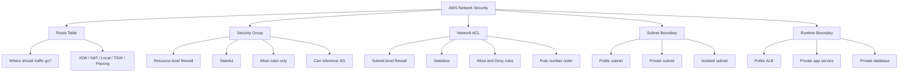

---

# 3. Security Group

## 3.1 Apa Itu Security Group?

**Security Group / SG** adalah virtual firewall yang dipasang ke AWS resource seperti EC2, ENI, RDS, ALB, ECS task ENI, atau EKS node/pod networking tergantung setup.

Security group rule mengontrol traffic inbound yang boleh masuk ke resource dan outbound yang boleh keluar dari resource. Saat security group dibuat, AWS default-nya tidak memberi inbound rule, sehingga inbound traffic tidak diizinkan sampai rule ditambahkan; outbound rule default biasanya mengizinkan semua outbound traffic, tetapi rule ini bisa dihapus dan diganti lebih ketat. ([AWS Documentation](https://docs.aws.amazon.com/vpc/latest/userguide/security-group-rules.html))

Mental model:

```text
Security Group = firewall di resource/interface level
```

Bukan di subnet level.

---

## 3.2 Security Group Bersifat Stateful

Security group bersifat **stateful**. Artinya, jika inbound traffic diizinkan, response traffic boleh keluar walaupun outbound rule tidak secara eksplisit membuka response path. Sebaliknya, jika resource mengirim request keluar, response traffic boleh masuk sebagai bagian dari koneksi yang sama. AWS menjelaskan behavior ini melalui connection tracking. ([AWS Documentation](https://docs.aws.amazon.com/AWSEC2/latest/UserGuide/security-group-connection-tracking.html))

Contoh:

```text
Client → ALB:443
ALB SG inbound allow 443 from 0.0.0.0/0

Response:
ALB → Client
Tetap allowed sebagai response traffic.
```

Implikasi praktis:

| Skenario | Perlu Rule Balikan Manual? |
|---|---|
| Security Group | Tidak, karena stateful |
| NACL | Ya, karena stateless |
| Firewall appliance custom | Tergantung implementasi |

Catatan penting: perubahan security group rule tidak selalu memutus koneksi existing secara instan karena tracked connection dapat tetap berjalan sampai timeout. AWS menyebutkan bahwa untuk interruption segera atau agar semua traffic tunduk ke firewall rule tanpa connection tracking, network ACL dapat digunakan karena NACL stateless. ([AWS Documentation](https://docs.aws.amazon.com/AWSEC2/latest/UserGuide/security-group-connection-tracking.html))

---

## 3.3 Security Group Rule Anatomy

Komponen utama security group rule:

| Komponen | Contoh | Makna |
|---|---|---|
| Direction | Inbound / Outbound | Arah traffic |
| Protocol | TCP / UDP / ICMP | Protocol yang diizinkan |
| Port range | `443`, `5432`, `8080` | Port aplikasi |
| Source | CIDR atau SG ID | Sumber inbound |
| Destination | CIDR atau SG ID | Tujuan outbound |
| Description | `Allow ALB to app` | Dokumentasi rule |

AWS mendokumentasikan bahwa security group rule dapat memakai source/destination berupa IPv4 CIDR, IPv6 CIDR, prefix list, atau security group ID. ([AWS Documentation](https://docs.aws.amazon.com/vpc/latest/userguide/security-group-rules.html))

---

# 4. Security Group Referencing

Ini salah satu fitur paling penting.

Daripada membuka database ke seluruh CIDR VPC:

```text
RDS SG inbound:
TCP 5432 from 10.0.0.0/16
```

Lebih baik:

```text
RDS SG inbound:
TCP 5432 from sg-app-service
```

AWS menjelaskan bahwa ketika security group dijadikan source atau destination dalam rule, rule tersebut berlaku untuk resource yang diasosiasikan dengan security group tersebut, dan komunikasi terjadi memakai private IP resource terkait pada protocol/port yang ditentukan. ([AWS Documentation](https://docs.aws.amazon.com/vpc/latest/userguide/security-group-rules.html))

## 4.1 Pattern Umum

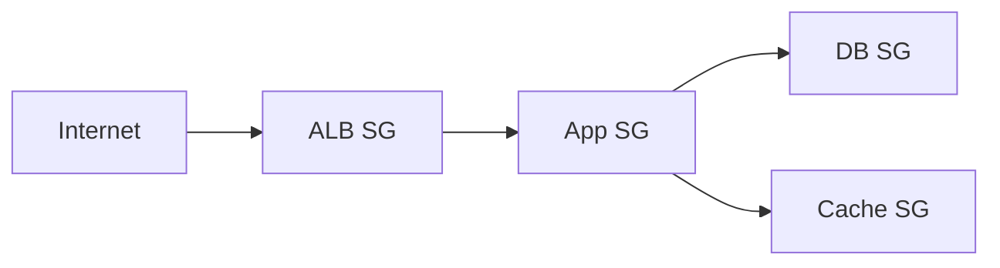

| From | To | Rule yang Sehat |
|---|---|---|
| Internet | ALB | ALB SG inbound `443` from `0.0.0.0/0` |
| ALB | App | App SG inbound `8080` from `sg-alb` |
| App | DB | DB SG inbound `5432` from `sg-app` |
| App | Cache | Cache SG inbound `6379` from `sg-app` |
| App | Internal API | Internal API SG inbound service port from `sg-app` |

AWS juga memberi contoh pattern serupa: load balancer security group menerima HTTP/HTTPS dari internet, web server security group hanya menerima HTTP/HTTPS dari security group load balancer, dan database security group menerima request database dari security group web server. ([AWS Documentation](https://docs.aws.amazon.com/vpc/latest/userguide/security-group-rules.html))

---

# 5. Network ACL / NACL

## 5.1 Apa Itu NACL?

**Network ACL / NACL** adalah firewall di level subnet. AWS mendokumentasikan bahwa network ACL dapat mengizinkan atau menolak traffic inbound/outbound spesifik di level subnet, dan setiap subnet dalam VPC harus diasosiasikan dengan satu network ACL. ([AWS Documentation](https://docs.aws.amazon.com/vpc/latest/userguide/vpc-network-acls.html))

Mental model:

```text
NACL = subnet-level stateless firewall
```

NACL cocok untuk guardrail kasar, bukan fine-grained service-to-service control.

---

## 5.2 NACL Bersifat Stateless

NACL bersifat **stateless**, sehingga response traffic harus diizinkan secara eksplisit. AWS menyatakan dalam contoh NACL bahwa karena network ACL stateless, rule untuk response traffic harus ikut dibuat. ([AWS Documentation](https://docs.aws.amazon.com/vpc/latest/userguide/nacl-examples.html?utm_source=chatgpt.com))

Contoh:

```text
Inbound:
Allow TCP 443 from 0.0.0.0/0

Outbound:
Harus allow ephemeral port response ke client
```

Kalau outbound response tidak dibuka, request bisa masuk tetapi response gagal keluar.

---

## 5.3 NACL Rule Evaluation

NACL rule dievaluasi dari **nomor rule terkecil**. Begitu ada rule yang match, rule itu diterapkan, meskipun ada rule bernomor lebih tinggi yang bertentangan. NACL rule juga memiliki explicit `Allow` atau `Deny`. ([AWS Documentation](https://docs.aws.amazon.com/vpc/latest/userguide/nacl-rules.html))

Contoh:

| Rule # | Direction | Rule | Result |
|---:|---|---|---|
| 100 | Inbound | Deny TCP 22 from `0.0.0.0/0` | SSH blocked |
| 200 | Inbound | Allow all TCP from `0.0.0.0/0` | Tidak berlaku untuk SSH karena rule 100 match dulu |

Mental model:

```text
Security Group = allow-list resource-level, stateful
NACL = allow/deny subnet-level, stateless, ordered
```

---

# 6. Security Group vs NACL

| Aspek | Security Group | NACL |
|---|---|---|
| Level | Resource / ENI | Subnet |
| State | Stateful | Stateless |
| Rule type | Allow only | Allow dan Deny |
| Evaluation | Semua allow rule dievaluasi agregat | Rule number order, first match wins |
| Default inbound | Tidak ada inbound rule saat SG baru dibuat | Default NACL biasanya allow, custom NACL berbeda tergantung setup |
| Default outbound | Biasanya allow all saat SG baru dibuat | Perlu rule eksplisit sesuai NACL |
| Best use | Service-to-service access control | Subnet guardrail kasar |
| Source support | CIDR, SG reference, prefix list | CIDR |
| Praktis untuk app | Sangat penting | Dipakai hati-hati |
| Risiko salah konfigurasi | Service unreachable | Subnet-wide outage |

## Rule of Thumb

```text
Gunakan Security Group sebagai kontrol utama.
Gunakan NACL sebagai guardrail tambahan, bukan pengganti SG.
```

---

# 7. Public, Private, dan Isolated Boundary

AWS mendefinisikan tipe subnet berdasarkan routing: public subnet punya direct route ke internet gateway, private subnet tidak punya direct route ke internet gateway dan memerlukan NAT device untuk akses public internet, sedangkan isolated subnet tidak punya route ke tujuan di luar VPC. ([AWS Documentation](https://docs.aws.amazon.com/vpc/latest/userguide/configure-subnets.html))

| Boundary | Route | Security Implication |
|---|---|---|
| Public subnet | Route ke IGW | Resource bisa punya path public jika punya public IP/ALB |
| Private subnet | Tidak ada direct IGW, outbound via NAT jika perlu | Cocok untuk app runtime |
| Isolated subnet | Tidak ada route keluar VPC | Cocok untuk DB/sensitive internal dependency |

## 7.1 Boundary yang Sehat untuk Java Service

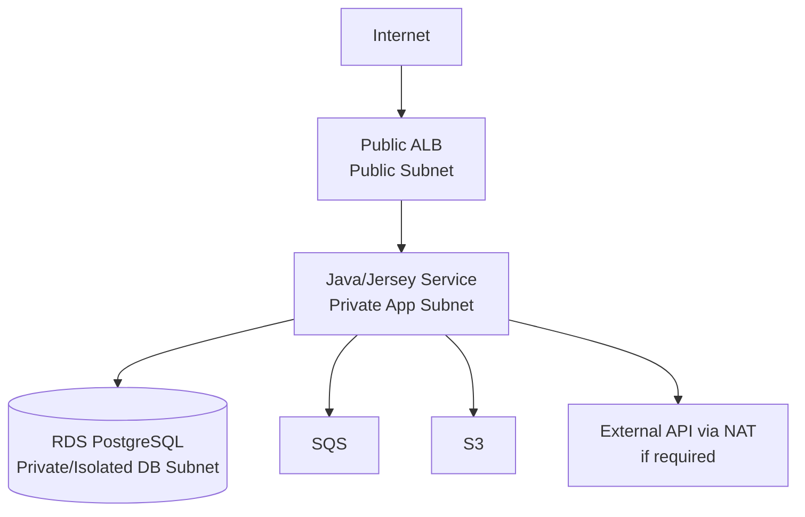

Security intent:

| Layer | Exposure |
|---|---|
| ALB | Public HTTPS |
| Java service | Private only, reachable from ALB/internal callers |
| RDS | Private only, reachable from app SG |
| SQS/S3 | Access controlled by IAM, optionally VPC endpoints |
| External API | Outbound only via NAT/proxy |

---

# 8. Practical Access Design

## 8.1 Public REST API

Use case:

```text
Client → HTTPS → ALB → Java/Jersey app → RDS PostgreSQL
```

Recommended security group design:

| Security Group | Inbound | Outbound |
|---|---|---|
| `sg-public-alb` | TCP 443 from `0.0.0.0/0` and/or corporate IP if restricted | TCP app port to `sg-order-service` |
| `sg-order-service` | TCP 8080 from `sg-public-alb` | TCP 5432 to `sg-rds`; HTTPS 443 to AWS/external services as required |
| `sg-rds-postgres` | TCP 5432 from `sg-order-service` | Usually default/managed; do not open broadly |

Bad pattern:

```text
sg-order-service inbound 8080 from 0.0.0.0/0
sg-rds-postgres inbound 5432 from 10.0.0.0/16
```

Better pattern:

```text
App only reachable from ALB SG.
DB only reachable from App SG.
```

---

## 8.2 Internal Microservice API

Use case:

```text
order-service → inventory-service
```

Recommended:

| Target SG | Rule |
|---|---|
| `sg-inventory-service` inbound | TCP 8080 from `sg-order-service` |

Avoid:

```text
inventory-service inbound 8080 from 10.0.0.0/16
```

Why? Karena semua resource di VPC bisa mencoba akses service itu. SG-to-SG reference membuat intent lebih jelas: **service A boleh bicara ke service B**.

---

## 8.3 RDS PostgreSQL Access

Use case:

```text
Java/MyBatis app → RDS PostgreSQL
```

Recommended:

| Security Group | Rule |
|---|---|
| `sg-rds-postgres` inbound | TCP 5432 from `sg-app` |

Avoid:

```text
TCP 5432 from 0.0.0.0/0
TCP 5432 from corporate public IP unless explicitly needed and reviewed
TCP 5432 from entire VPC CIDR without reason
```

Untuk operational access, lebih aman memakai controlled path seperti SSM Session Manager, bastion yang sangat dibatasi, VPN, private connectivity, atau temporary access workflow daripada membuka database public.

---

## 8.4 ECS/Fargate

ECS/Fargate task biasanya punya ENI sendiri di VPC, sehingga security group bisa dipasang ke task/service.

Pattern:

```text
ALB SG → ECS Task SG → RDS SG
```

| Component | Rule |
|---|---|
| ALB SG inbound | 443 from client source |
| ECS task SG inbound | app port from ALB SG |
| RDS SG inbound | 5432 from ECS task SG |
| ECS task SG outbound | DB/SQS/S3/Secrets/external API sesuai kebutuhan |

Untuk Java service, outbound jangan otomatis dibiarkan luas kalau workload handling data sensitif. Tetapi terlalu cepat mengunci outbound juga bisa menyebabkan failure ke DNS, AWS service endpoint, package repository, atau external API. Lakukan bertahap: observe → constrain → validate.

---

## 8.5 EKS

Di EKS, network security bergantung pada kombinasi:

| Layer | Contoh |
|---|---|
| Kubernetes NetworkPolicy | Pod-to-pod traffic control, jika CNI/policy engine mendukung |
| Security Group for nodes | Node-level boundary |
| Security Group for pods | Pod-level AWS SG, jika digunakan |
| Ingress controller SG | ALB/NLB ingress boundary |
| RDS SG | DB only from approved app/pod/node SG |

Pattern untuk backend service:

```text
ALB Controller / Ingress
  → Service / Pod
  → RDS
```

Practical concern:

| Concern | Catatan |
|---|---|
| Node SG terlalu luas | Banyak pod bisa ikut punya path network |
| Pod SG tidak digunakan | Kontrol per aplikasi bergantung ke Kubernetes NetworkPolicy |
| NetworkPolicy tidak aktif | Pod-to-pod bisa terlalu terbuka |
| RDS allow dari node SG | Semua pod di node bisa berpotensi reach DB jika tidak ada policy lain |

---

# 9. NACL Design Pattern

## 9.1 Kapan NACL Berguna?

| Use Case | NACL Relevan? |
|---|---|
| Deny IP range tertentu di subnet boundary | Ya |
| Emergency block subnet-level traffic | Ya |
| Compliance guardrail subnet | Ya |
| Fine-grained app-to-db permission | Lebih baik SG |
| Service-to-service permission | Lebih baik SG |
| Dynamic microservice environment | NACL bisa terlalu kasar |

## 9.2 NACL Anti-pattern

```text
Menggunakan NACL untuk menggantikan Security Group.
```

Masalahnya:

| Problem | Dampak |
|---|---|
| Stateless | Perlu inbound/outbound response rule |
| Subnet-wide | Salah rule bisa memutus banyak service |
| CIDR-based | Tidak bisa ekspresikan “service A ke service B” sebaik SG reference |
| Ordered rule | Salah urutan bisa menghasilkan behavior tidak terduga |
| Harder troubleshooting | Banyak false assumption tentang response traffic |

---

# 10. Inbound vs Outbound Design

## 10.1 Inbound

Inbound harus sangat ketat.

| Component | Inbound yang Wajar |
|---|---|
| Public ALB | 443 from internet/corporate CIDR |
| Internal ALB | 443/HTTP port from internal CIDR or caller SG |
| Java app | App port from ALB SG or caller service SG |
| RDS PostgreSQL | 5432 from app SG only |
| Redis/cache | 6379 from app SG only |
| RabbitMQ/Kafka internal | Broker/client ports from approved app SG |
| Admin endpoint | Private network only, ideally behind auth + SG restriction |

## 10.2 Outbound

Outbound sering dibiarkan terlalu luas:

```text
0.0.0.0/0 all ports
```

Ini nyaman, tetapi blast radius tinggi jika service compromised.

Practical approach:

| Stage | Approach |
|---|---|
| Early dev | Outbound lebih longgar |
| Staging | Mulai catat destination |
| Production | Batasi destination penting jika memungkinkan |
| Sensitive workload | Egress dikontrol via proxy, endpoint, prefix list, SG reference |
| Regulated workload | Explicit egress review + logging |

Outbound yang umum dibutuhkan Java service:

| Destination | Port |
|---|---|
| RDS PostgreSQL | 5432 |
| HTTPS AWS services | 443 |
| External SaaS/API | 443 |
| Internal REST/gRPC | 8080/8443/50051 sesuai service |
| DNS | Biasanya handled oleh VPC resolver path |
| Observability collector | 4317/4318/other, tergantung setup |

---

# 11. Concrete Example: Order Service

## 11.1 Architecture

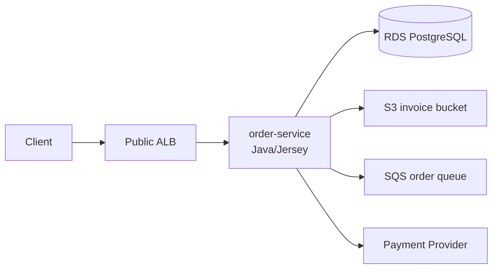

## 11.2 Security Groups

| SG | Attached To | Inbound | Outbound |
|---|---|---|---|
| `sg-alb-public` | ALB | TCP 443 from `0.0.0.0/0` | TCP 8080 to `sg-order-service` |
| `sg-order-service` | ECS task/EKS pod/EC2 | TCP 8080 from `sg-alb-public` | TCP 5432 to `sg-rds-postgres`; TCP 443 to approved endpoints |
| `sg-rds-postgres` | RDS | TCP 5432 from `sg-order-service` | Default/managed |
| `sg-vpce` | Interface endpoints if used | TCP 443 from `sg-order-service` | As needed |

## 11.3 Access Intent

```text
Only ALB can call order-service HTTP port.
Only order-service can call order DB.
order-service can call AWS APIs using IAM and HTTPS path.
No direct public access to app or DB.
```

## 11.4 Failure Example

Symptom:

```text
Application logs:
org.postgresql.util.PSQLException: Connection timed out
```

Possible network causes:

| Check | Why |
|---|---|
| App subnet route | App must be routable to RDS private IP |
| RDS SG inbound | Must allow 5432 from app SG |
| App SG outbound | Must allow 5432 to RDS SG/CIDR |
| NACL app subnet | Must allow outbound and response |
| NACL DB subnet | Must allow inbound 5432 and response |
| DNS | RDS endpoint must resolve |
| RDS status | DB must be available |
| Connection pool | Timeout may also be app-level, not network-only |

---

# 12. Security Group Design Guidelines

| Guideline | Rationale |
|---|---|
| Satu SG per role/service boundary | Lebih mudah audit dan least privilege |
| Gunakan SG reference untuk service-to-service | Lebih ekspresif daripada CIDR |
| Jangan buka app port ke internet langsung | Gunakan ALB/API Gateway |
| Jangan buka DB ke internet | DB harus private |
| Hindari `0.0.0.0/0` kecuali public ingress memang diperlukan | Mengurangi attack surface |
| Dokumentasikan rule description | Membantu audit dan troubleshooting |
| Pisahkan ALB SG, app SG, DB SG | Boundary lebih jelas |
| Review stale SG rules | Rule lama sering jadi risk |
| Batasi `ssh/rdp` | Prefer SSM Session Manager atau private admin path |
| Jangan jadikan SG sebagai satu-satunya security | Tetap butuh IAM, app auth, TLS, secret management |

---

# 13. NACL Design Guidelines

| Guideline | Rationale |
|---|---|
| Gunakan NACL untuk subnet-level guardrail | Cocok untuk coarse filtering |
| Jangan terlalu granular dengan NACL | Sulit dipelihara |
| Ingat stateless | Response traffic harus diizinkan |
| Gunakan rule number dengan gap | Misalnya 100, 110, 120 agar mudah insert rule |
| Letakkan deny rule sebelum allow luas | First match wins |
| Hati-hati change NACL production | Dampaknya subnet-wide |
| Dokumentasikan ephemeral port range | Penting untuk response traffic |
| Uji di staging | Salah NACL bisa memutus subnet |

---

# 14. Troubleshooting Matrix

| Symptom | Kemungkinan Root Cause | Cek Pertama |
|---|---|---|
| Public API tidak bisa diakses | ALB SG, subnet public route, DNS, target health | ALB SG inbound 443 |
| ALB target unhealthy | App port tidak terbuka dari ALB SG | App SG inbound from ALB SG |
| App tidak bisa connect DB | DB SG tidak allow dari app SG | RDS SG inbound 5432 |
| App bisa connect DB dari dev tapi tidak prod | SG/route/subnet/account berbeda | Compare SG + subnet placement |
| Request masuk tapi response gagal | NACL stateless blocking ephemeral port | NACL inbound/outbound |
| SSH tidak bisa | SG/NACL/private subnet/no public IP | Prefer SSM; cek path |
| External API timeout | No NAT/egress/proxy/DNS issue | Private subnet default route |
| SQS/S3 timeout dari private subnet | NAT/VPC endpoint/security route issue | NAT or VPC endpoint |
| Random intermittent network failure | Cross-AZ dependency, NACL ephemeral, connection tracking, DNS | Flow logs + metrics |
| Security review finding | Broad `0.0.0.0/0` or DB open | Tighten SG rules |

---

# 15. VPC Flow Logs

Walaupun bukan fokus utama seri ini, **VPC Flow Logs** penting untuk troubleshooting. Flow logs membantu melihat accepted/rejected traffic di level network interface, subnet, atau VPC. Untuk kasus security group/NACL, flow logs sering membantu menjawab:

```text
Traffic benar-benar sampai?
Diterima atau ditolak?
Source/destination/port apa?
Resource mana yang terdampak?
```

Gunakan flow logs sebagai bukti, bukan hanya asumsi.

---

# 16. Common Anti-pattern

| Anti-pattern | Kenapa Buruk | Alternatif |
|---|---|---|
| App SG inbound from `0.0.0.0/0` | App langsung exposed | Inbound hanya dari ALB SG |
| DB SG inbound from `0.0.0.0/0` | Critical data exposure | Inbound hanya dari app SG |
| DB SG inbound from whole VPC CIDR | Terlalu luas | SG reference |
| Semua service memakai satu SG | Audit dan blast radius buruk | SG per service/layer |
| NACL terlalu kompleks | Sulit debug | SG sebagai kontrol utama |
| Outbound all selamanya | Egress risk | Gradual egress restriction |
| SSH/RDP public | Brute force risk | SSM/VPN/private admin |
| Public subnet untuk app internal | Attack surface besar | Private app subnet |
| Misunderstand public subnet | Nama subnet dianggap cukup | Cek route table |
| Tidak ada rule description | Sulit audit | Isi description dengan intent |

---

# 17. Practical Checklist

| Checklist | Status |
|---|---|
| Public entry hanya lewat ALB/API Gateway/NLB yang memang dibutuhkan |
| Java service tidak punya public IP langsung |
| App SG inbound hanya dari ALB SG atau caller SG |
| RDS SG inbound hanya dari app SG |
| Redis/cache/broker tidak terbuka ke internet |
| Security group memakai description yang jelas |
| Tidak ada inbound `0.0.0.0/0` selain port public yang disetujui |
| SSH/RDP public tidak digunakan atau sangat dibatasi |
| NACL tidak terlalu kompleks |
| Private subnet outbound path jelas |
| NAT/VPC endpoint path dipahami |
| VPC Flow Logs tersedia untuk troubleshooting |
| Rule lama/stale direview berkala |
| EKS/ECS runtime SG dipahami |
| Security group dan IAM tidak dicampur konsepnya |

---

# 18. Mini Exercise

Ambil satu service production atau staging, lalu isi:

```text
Service name:
Runtime: EC2 / ECS / EKS / Lambda
Public endpoint: yes/no
Ingress component: ALB / NLB / API Gateway / internal only
App port:
App security group:
Inbound allowed from:
Outbound allowed to:
Database:
Database security group:
DB inbound allowed from:
Cache/broker dependency:
Admin access path:
Subnet type:
NACL associated:
Known public exposure:
Known broad rule:
Known stale rule:
Flow logs available: yes/no
```

Lalu jawab:

```text
1. Resource apa yang bisa diakses dari internet?
2. Apakah app bisa diakses tanpa melewati ALB/API Gateway?
3. Apakah database bisa diakses dari selain app?
4. Kalau app compromised, outbound ke mana saja yang mungkin?
5. Rule mana yang paling berisiko jika disalahgunakan?
```

---

# 19. Ringkasan Seri 4

Hal utama yang harus dipegang:

1. **Route table menentukan traffic ke mana**, bukan siapa yang boleh akses.
2. **Security group adalah firewall resource-level**.
3. **Security group stateful** dan hanya punya allow rules.
4. **NACL adalah firewall subnet-level**.
5. **NACL stateless** dan punya allow/deny rules dengan urutan nomor.
6. **Public/private subnet ditentukan oleh route table**, bukan nama subnet.
7. **App backend production sebaiknya di private subnet**.
8. **Database sebaiknya di private/isolated subnet**.
9. **Gunakan SG reference untuk service-to-service access**, bukan CIDR luas.
10. **NACL cocok sebagai guardrail kasar**, bukan kontrol utama microservice.
11. **Troubleshooting network harus memisahkan routing, filtering, DNS, dan aplikasi**.

---

## Status

**Seri 4/24 selesai.**  
Sisa: **20 seri**.

## Rekomendasi materi berikutnya

Lanjut ke **Seri 5 - Service Exposure: ALB, NLB, API Gateway, Route 53, PrivateLink, Public/Internal Endpoint Design untuk Java/Jersey Microservice**.

---

**Sources:**

- [Security group rules - Amazon Virtual Private Cloud](https://docs.aws.amazon.com/vpc/latest/userguide/security-group-rules.html)

## Response:
7/13/2026, 6:19:30 PM

Saya lanjut ke **Seri 5/24**: service exposure. Fokusnya adalah memilih dan merancang entry point: kapan pakai ALB, NLB, API Gateway, Route 53, internal endpoint, atau PrivateLink untuk service Java/Jersey.

# AWS for Software Engineer - Seri 5/24  
## Service Exposure: ALB, NLB, API Gateway, Route 53, PrivateLink, Public/Internal Endpoint Design

## 1. Introduction

Seri ini membahas **bagaimana service diekspos** di AWS.

Untuk software engineer, service exposure menjawab:

```text
Siapa client-nya?
Masuk lewat protokol apa?
Butuh public endpoint atau internal-only?
Perlu HTTP routing, auth, throttling, WAF, TLS termination?
Target-nya EC2, ECS, EKS, Lambda, atau service di VPC lain?
Traffic-nya request/response biasa, streaming, gRPC, TCP, UDP, atau private service-to-service?
```

Di AWS, exposing service biasanya melibatkan kombinasi:

| Layer | Contoh |
|---|---|
| DNS | Route 53 |
| Public/API boundary | API Gateway, ALB, NLB |
| Private/internal boundary | Internal ALB, internal NLB, PrivateLink |
| Runtime target | ECS, EKS, EC2, Lambda, IP target |
| Security | Security Group, IAM, WAF, TLS, auth layer |
| Observability | Access logs, metrics, tracing, request ID |

Untuk stack Anda - **Java/Jersey/JAX-RS microservice, MyBatis, Camunda, PostgreSQL, Docker, Kubernetes** - pilihan yang paling sering muncul adalah:

```text
Public REST API        → Route 53 → API Gateway / ALB → Java service
Internal REST API      → Internal ALB → Java service
gRPC / TCP workload    → NLB → service target
Private cross-VPC API  → PrivateLink / internal LB
Kubernetes ingress     → ALB/NLB via controller / ingress model
```

---

# 2. Diagram Mental Model

```mermaid
flowchart TD
    A[Service Exposure Decision] --> B[DNS Layer]
    A --> C[Public API Layer]
    A --> D[Load Balancing Layer]
    A --> E[Private Connectivity Layer]
    A --> F[Runtime Target]
    A --> G[Security & Governance]

    B --> B1[Route 53]
    B --> B2[Public Hosted Zone]
    B --> B3[Private Hosted Zone]

    C --> C1[API Gateway REST API]
    C --> C2[API Gateway HTTP API]
    C --> C3[API Gateway WebSocket API]

    D --> D1[Application Load Balancer]
    D --> D2[Network Load Balancer]
    D --> D3[Internal vs Internet-facing LB]

    E --> E1[AWS PrivateLink]
    E --> E2[VPC Endpoint Service]
    E --> E3[Interface VPC Endpoint]

    F --> F1[EC2]
    F --> F2[ECS/Fargate]
    F --> F3[EKS]
    F --> F4[Lambda]
    F --> F5[IP Target]

    G --> G1[TLS]
    G --> G2[WAF]
    G --> G3[IAM/AuthN/AuthZ]
    G --> G4[Security Group]
    G --> G5[Access Logs]
```

---

# 3. Key Services

## 3.1 Route 53

**Route 53** adalah DNS layer. Dalam desain service exposure, Route 53 biasanya menjadi nama stabil yang menunjuk ke API Gateway, ALB, NLB, CloudFront, atau endpoint lain.

Mental model:

```text
Route 53 = nama service
Load balancer/API Gateway = entry point traffic
Application = business logic target
```

Contoh:

```text
api.company.com        → public API
internal.company.local → internal service
orders.api.company.com → order-service
```

## Public Hosted Zone vs Private Hosted Zone

| Type | Digunakan Untuk |
|---|---|
| **Public hosted zone** | Domain yang bisa di-resolve dari internet |
| **Private hosted zone** | DNS internal untuk VPC tertentu |
| **Alias record** | Umum dipakai untuk menunjuk ke AWS resource seperti ALB/API Gateway |
| **Weighted/Failover routing** | Traffic steering atau DR scenario |

Practical use:

| Scenario | Route 53 Pattern |
|---|---|
| Public customer API | Public hosted zone |
| Internal microservice DNS | Private hosted zone |
| Blue/green traffic shift | Weighted routing atau deployment-level routing |
| Regional failover | Failover routing + health check |
| Internal platform endpoint | Private DNS |

---

# 4. Application Load Balancer / ALB

## 4.1 Apa Itu ALB?

**Application Load Balancer** bekerja di **Layer 7 / application layer**. Setelah menerima request, ALB mengevaluasi listener rules berdasarkan prioritas, lalu memilih target group sesuai rule. ALB bisa melakukan routing berdasarkan konten traffic aplikasi, misalnya host/path/header/query tertentu. ([AWS Documentation](https://docs.aws.amazon.com/elasticloadbalancing/latest/application/introduction.html?utm_source=chatgpt.com))

Mental model:

```text
ALB = HTTP/HTTPS smart router untuk aplikasi
```

Cocok untuk:

| Use Case | ALB Cocok? |
|---|---|
| REST API Java/Jersey | Ya |
| HTTP path-based routing | Ya |
| Host-based routing | Ya |
| TLS termination | Ya |
| Web application | Ya |
| Internal microservice HTTP | Ya |
| gRPC | Bisa, tergantung konfigurasi/protocol support |
| Raw TCP non-HTTP | Tidak, lebih cocok NLB |
| UDP | Tidak, lebih cocok NLB |

## 4.2 ALB Components

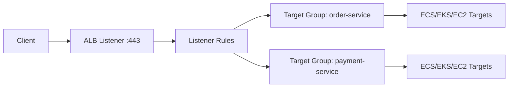

| Komponen | Fungsi |
|---|---|
| **Load Balancer** | Entry point |
| **Listener** | Port/protocol, misalnya HTTPS 443 |
| **Listener Rule** | Routing rule berdasarkan host/path/header |
| **Target Group** | Kumpulan target backend |
| **Target** | EC2 instance, IP, container, Lambda tergantung setup |
| **Health Check** | Menentukan target healthy/unhealthy |

## 4.3 ALB Pattern untuk Java/Jersey

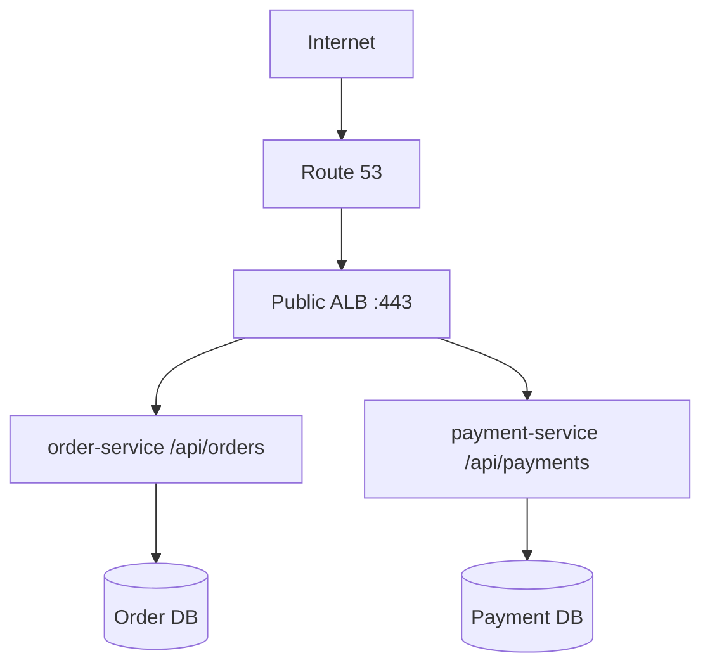

Contoh listener rules:

| Host / Path | Target Group |
|---|---|
| `api.company.com/orders/*` | `tg-order-service` |
| `api.company.com/payments/*` | `tg-payment-service` |
| `admin.company.com/*` | `tg-admin-service` |

## 4.4 ALB Internal vs Internet-facing

| Tipe ALB | Digunakan Untuk |
|---|---|
| **Internet-facing ALB** | Public API/web endpoint |
| **Internal ALB** | Private service-to-service HTTP routing di dalam VPC |

Pattern sehat:

```text
Internet-facing ALB:
  Internet → ALB → private app subnet

Internal ALB:
  Internal service/client → internal ALB → private app subnet
```

Anti-pattern:

```text
Internet → public EC2/ECS app directly
```

---

# 5. Network Load Balancer / NLB

## 5.1 Apa Itu NLB?

**Network Load Balancer** cocok untuk traffic level koneksi/protokol rendah. NLB target group mendukung protokol seperti **TCP, UDP, TCP_UDP, TLS, QUIC, TCP_QUIC**, dan health check bisa dikonfigurasi per target group. ([AWS Documentation](https://docs.aws.amazon.com/elasticloadbalancing/latest/network/introduction.html?utm_source=chatgpt.com))

Mental model:

```text
NLB = high-performance Layer 4/connection-level load balancer
```

Cocok untuk:

| Use Case | NLB Cocok? |
|---|---|
| TCP service | Ya |
| UDP service | Ya |
| TLS passthrough/offload | Ya |
| gRPC dengan kebutuhan L4 tertentu | Sering relevan |
| Static IP requirement | Lebih relevan dibanding ALB |
| PrivateLink provider endpoint | Ya, umum dipakai |
| HTTP path routing | Tidak, lebih cocok ALB |
| Header-based routing | Tidak, lebih cocok ALB |
| REST API management | Tidak, lebih cocok API Gateway/ALB |

Listener NLB mendukung protocol TCP, TLS, UDP, TCP_UDP, QUIC, TCP_QUIC, dan port 1-65535. TLS listener dapat digunakan untuk offload enkripsi/dekripsi di load balancer. ([AWS Documentation](https://docs.aws.amazon.com/elasticloadbalancing/latest/network/load-balancer-listeners.html?utm_source=chatgpt.com))

## 5.2 NLB Pattern

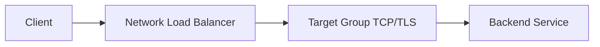

Contoh use case:

| Service | Exposure |
|---|---|
| Internal gRPC service | Internal NLB |
| Kafka/RabbitMQ-like TCP endpoint | NLB, jika memang dikelola sendiri |
| PrivateLink service provider | NLB behind endpoint service |
| Low-latency TCP workload | NLB |
| Fixed IP allowlist requirement | NLB dengan static IP/EIP pattern |

---

# 6. API Gateway

## 6.1 Apa Itu API Gateway?

Amazon API Gateway adalah managed service untuk membuat, mempublikasikan, memelihara, memonitor, dan mengamankan **REST, HTTP, dan WebSocket APIs** pada skala besar. API Gateway dapat membuat API untuk client application sendiri atau third-party developers. ([AWS Documentation](https://docs.aws.amazon.com/apigateway/latest/developerguide/welcome.html?utm_source=chatgpt.com))

Mental model:

```text
API Gateway = managed API front door
```

Cocok untuk:

| Use Case | API Gateway Cocok? |
|---|---|
| Public API dengan API management | Ya |
| Throttling, quota, API key | Ya, terutama REST API |
| Lambda-backed API | Ya |
| HTTP API sederhana | Ya |
| WebSocket API | Ya |
| Private API | Ya, tergantung tipe/fitur |
| Direct high-throughput internal service-to-service | Tidak selalu; ALB/internal ALB bisa lebih sederhana |
| Long-running request berat | Perlu cek timeout/limit API Gateway |

AWS membedakan **REST APIs** dan **HTTP APIs**. REST APIs mendukung lebih banyak fitur, sedangkan HTTP APIs dirancang dengan fitur minimal sehingga lebih murah. AWS menyarankan REST APIs jika butuh API keys, per-client throttling, request validation, AWS WAF integration, atau private API endpoints; HTTP APIs cocok jika fitur tambahan itu tidak diperlukan. ([AWS Documentation](https://docs.aws.amazon.com/apigateway/latest/developerguide/http-api-vs-rest.html?utm_source=chatgpt.com))

## 6.2 API Gateway Types

| Type | Karakter |
|---|---|
| **REST API** | Fitur API management lebih lengkap |
| **HTTP API** | Lebih sederhana, lebih ringan, cocok untuk banyak HTTP API modern |
| **WebSocket API** | Untuk komunikasi bidirectional WebSocket |

## 6.3 API Gateway Pattern untuk Java/Jersey

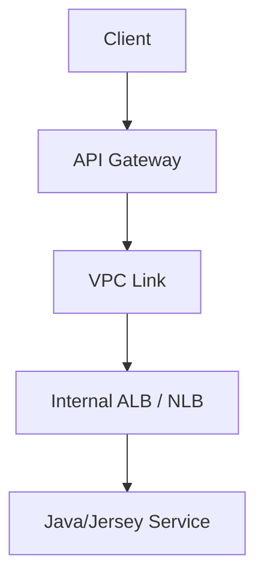

Pattern ini berguna kalau Anda ingin API Gateway sebagai public API front door, tetapi Java service tetap private di VPC.

| Layer | Responsibility |
|---|---|
| API Gateway | Public API boundary, throttling, auth integration, API management |
| VPC Link | Private bridge ke VPC |
| Internal ALB/NLB | VPC load balancing |
| Java service | Business logic |

## 6.4 API Gateway vs ALB

| Pertanyaan | Lebih Condong ke API Gateway | Lebih Condong ke ALB |
|---|---|---|
| Butuh API key/quota/throttling per client? | Ya | Tidak utama |
| Butuh simple HTTP routing ke container? | Bisa, tapi mungkin overkill | Ya |
| Butuh path/host routing ke ECS/EKS services? | Bisa | Ya |
| Butuh Lambda-first API? | Ya | Bisa, tapi API Gateway umum |
| Butuh low-cost simple container ingress? | Tidak selalu | Sering lebih cocok |
| Butuh API product management? | Ya | Tidak |
| Internal service-to-service HTTP? | Biasanya tidak | Internal ALB lebih natural |

---

# 7. PrivateLink

## 7.1 Apa Itu PrivateLink?

AWS PrivateLink menyediakan konektivitas private antara VPC dan services/resources seolah-olah berada di dalam VPC Anda. Dengan PrivateLink, Anda tidak perlu internet gateway, NAT device, public IP, Direct Connect, atau Site-to-Site VPN agar private subnet dapat berkomunikasi dengan service/resource tersebut. ([AWS Documentation](https://docs.aws.amazon.com/vpc/latest/privatelink/what-is-privatelink.html?utm_source=chatgpt.com))

Mental model:

```text
PrivateLink = private service exposure across VPC/account without public internet path
```

PrivateLink dapat digunakan untuk koneksi antara VPC private subnet dan VPC endpoint services di luar VPC, termasuk services di VPC lain. Client di VPC Anda dapat terhubung menggunakan private IP address seolah-olah service itu berada langsung di VPC Anda. ([AWS Documentation](https://docs.aws.amazon.com/vpc/latest/privatelink/concepts.html?utm_source=chatgpt.com))

## 7.2 PrivateLink Pattern

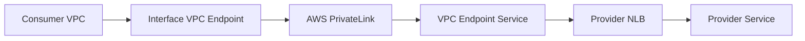

| Komponen | Fungsi |
|---|---|
| **Provider service** | Service yang ingin diekspos private |
| **NLB** | Umum dipakai di sisi provider |
| **VPC Endpoint Service** | Service exposure construct |
| **Interface VPC Endpoint** | ENI/private IP di VPC consumer |
| **Private DNS** | Membuat nama service resolve ke private endpoint |

## 7.3 Kapan PrivateLink Cocok?

| Scenario | PrivateLink Cocok? |
|---|---|
| Cross-account service exposure | Ya |
| SaaS/private internal platform service | Ya |
| Consumer tidak boleh route full VPC | Ya |
| Hindari VPC peering/transitive routing | Ya |
| Expose hanya service tertentu, bukan network penuh | Ya |
| Banyak consumer VPC | Ya, tapi perlu governance |
| Butuh full bidirectional network access | Tidak, lebih cocok peering/TGW |
| Service-to-service dalam VPC yang sama | Biasanya tidak perlu |

PrivateLink penting karena ia mengekspos **service**, bukan seluruh network. Ini berbeda dari VPC peering atau Transit Gateway yang membuat network routing antar-VPC lebih luas.

---

# 8. Decision Matrix

| Need | Pilihan Umum |
|---|---|
| Public REST API sederhana ke Java service | ALB |
| Public API dengan API key, throttling, API product boundary | API Gateway |
| Internal HTTP service-to-service | Internal ALB |
| TCP/UDP/gRPC L4 endpoint | NLB |
| Static IP endpoint | NLB |
| Private cross-account service exposure | PrivateLink + NLB |
| Kubernetes HTTP ingress | ALB via AWS Load Balancer Controller |
| Kubernetes TCP ingress | NLB |
| Lambda-first API | API Gateway |
| Public DNS | Route 53 public hosted zone |
| Internal DNS | Route 53 private hosted zone |

---

# 9. Practical Patterns

## 9.1 Pattern A - Public REST API via ALB

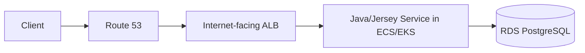

Cocok jika:

| Kondisi |
|---|
| API terutama HTTP/HTTPS |
| Butuh host/path routing |
| App berjalan di ECS/EKS/EC2 |
| Auth dilakukan di aplikasi atau upstream |
| Tidak perlu API key/quota complex di API Gateway |

Security design:

```text
ALB SG:
  inbound 443 from internet

App SG:
  inbound app port from ALB SG only

RDS SG:
  inbound 5432 from App SG only
```

---

## 9.2 Pattern B - Public API via API Gateway + Private Service

```mermaid
flowchart LR
    Client --> APIGW[API Gateway]
    APIGW --> VPCLink[VPC Link]
    VPCLink --> ILB[Internal ALB/NLB]
    ILB --> APP[Java/Jersey Service]
```

Cocok jika:

| Kondisi |
|---|
| Butuh API management |
| Butuh throttling/quota/API key |
| Butuh centralized public API boundary |
| Backend tetap private di VPC |
| Banyak consumer eksternal |

Trade-off:

| Benefit | Cost/Complexity |
|---|---|
| API governance lebih kuat | Arsitektur lebih kompleks |
| Public API boundary jelas | Perlu VPC Link/internal LB |
| Bisa integrate auth/throttling/logging | Perlu pahami limit/timeout/pricing |

---

## 9.3 Pattern C - Internal Microservice via Internal ALB

```mermaid
flowchart LR
    Caller[Internal Service] --> DNS[Private DNS]
    DNS --> ALB[Internal ALB]
    ALB --> Target[Target Java Service]
```

Cocok jika:

| Kondisi |
|---|
| Service hanya dipakai internal |
| Butuh HTTP routing |
| Butuh health check |
| Caller masih dalam VPC/network private |
| Tidak perlu public exposure |

Security design:

```text
Internal ALB SG:
  inbound 443/HTTP from caller SG or approved private CIDR

Target service SG:
  inbound app port from internal ALB SG
```

---

## 9.4 Pattern D - Private Cross-account Service via PrivateLink

```mermaid
flowchart LR
    ConsumerApp[Consumer App] --> VPCE[Interface Endpoint]
    VPCE --> PL[PrivateLink]
    PL --> NLB[Provider NLB]
    NLB --> ProviderApp[Provider Java Service]
```

Cocok jika:

| Kondisi |
|---|
| Provider dan consumer beda AWS account/VPC |
| Tidak ingin VPC peering penuh |
| Ingin expose service tertentu saja |
| Traffic harus private |
| Banyak consumer perlu akses controlled |

---

## 9.5 Pattern E - Kubernetes Ingress on EKS

```mermaid
flowchart LR
    Client --> ALB[ALB created by controller]
    ALB --> Ingress[Kubernetes Ingress]
    Ingress --> SVC[K8s Service]
    SVC --> POD[Java/Jersey Pods]
```

Cocok jika:

| Kondisi |
|---|
| Runtime utama EKS |
| Ingress dikelola via Kubernetes manifest |
| Butuh path/host routing |
| Deployment lifecycle mengikuti Kubernetes |
| Team sudah punya platform convention |

Untuk TCP/UDP workload di Kubernetes, NLB sering lebih relevan daripada ALB.

---

# 10. ALB vs NLB vs API Gateway

| Aspek | ALB | NLB | API Gateway |
|---|---|---|---|
| Layer | L7 HTTP/HTTPS | L4 TCP/UDP/TLS/QUIC | API management layer |
| Best for | Web/API container routing | TCP/UDP/static IP/private service | Managed API front door |
| Routing | Host/path/header/query | Port/protocol | Route/method/path |
| Target | EC2, IP, Lambda, containers | EC2, IP, ALB depending supported pattern | Lambda, HTTP backend, AWS services, VPC Link |
| Auth/API key | Limited/native app integration | Tidak fokus | Kuat |
| Throttling/quota | Tidak seperti API Gateway | Tidak | Ya |
| WAF | Umum dengan ALB | Tidak seperti ALB/API Gateway | Tergantung API type/fitur |
| Private internal use | Internal ALB | Internal NLB | Private API/VPC Link |
| Cost model | LCU + hours | NLCU + hours | Request/feature-based |
| Java/Jersey REST | Sangat cocok | Hanya jika TCP/L4 requirement | Cocok jika butuh API governance |

---

# 11. Public vs Internal Endpoint Design

## 11.1 Public Endpoint

Public endpoint berarti consumer bisa datang dari internet atau external network.

Public endpoint harus punya:

| Requirement | Penjelasan |
|---|---|
| TLS | HTTPS wajib untuk API production |
| AuthN/AuthZ | Jangan mengandalkan network saja |
| Rate limiting | API Gateway/WAF/app-level |
| WAF jika perlu | Proteksi common web attacks |
| Access log | Audit request |
| Request ID/correlation ID | Traceability |
| Health check | Target health |
| Proper timeout | Hindari resource exhaustion |
| Error mapping | Jangan bocorkan internal detail |
| DDoS consideration | Shield/WAF/CloudFront sesuai kebutuhan |

## 11.2 Internal Endpoint

Internal endpoint tidak berarti otomatis aman. Ia tetap butuh kontrol.

| Requirement | Penjelasan |
|---|---|
| Private DNS | Nama service jelas |
| SG reference | Caller spesifik |
| mTLS/service auth jika perlu | Untuk high trust boundary |
| App-level auth | Terutama cross-domain/team |
| Access log | Internal abuse/debug |
| Timeout/retry policy | Hindari cascading failure |
| Versioning | Untuk contract compatibility |

Internal endpoint anti-pattern:

```text
Semua service internal bisa call semua service lain karena masih satu VPC.
```

Lebih baik:

```text
Caller service A hanya bisa call target service B jika memang ada dependency.
```

---

# 12. Service Exposure untuk Jersey/JAX-RS

## 12.1 Jersey REST API Behind ALB

Typical app config:

```text
ALB listener: 443 HTTPS
Target group protocol: HTTP
Target port: 8080
Health check path: /health/live atau /actuator/health jika tersedia
App context: /api/orders
```

Important engineering details:

| Concern | Praktik |
|---|---|
| Health check | Jangan health check endpoint yang terlalu berat |
| Readiness vs liveness | Bedakan app alive vs ready menerima traffic |
| X-Forwarded headers | App harus memahami original protocol/host/client IP jika perlu |
| Timeout | ALB idle timeout vs app timeout harus sinkron |
| Error response | 502/503 bisa berasal dari LB, bukan app |
| Graceful shutdown | App harus berhenti menerima request sebelum container mati |
| Access logs | Aktifkan untuk investigasi traffic |
| TLS | Terminate di ALB atau end-to-end jika required |

## 12.2 Common Header Awareness

Saat app berada di belakang ALB/API Gateway, request yang diterima app bukan selalu request asli langsung dari client.

Header yang sering relevan:

| Header | Makna |
|---|---|
| `X-Forwarded-For` | Original client IP chain |
| `X-Forwarded-Proto` | Original protocol, misalnya HTTPS |
| `X-Forwarded-Port` | Original port |
| `Host` | Hostname request |
| `X-Amzn-Trace-Id` | AWS tracing header tertentu |
| Custom correlation ID | Trace antar-service |

App harus hati-hati: jangan mempercayai forwarded header dari internet secara mentah jika app bisa diakses langsung. Karena itu app sebaiknya **hanya reachable dari ALB/API Gateway**, bukan public langsung.

---

# 13. Health Check Design

Health check adalah bagian krusial exposure.

| Endpoint | Tujuan | Contoh |
|---|---|---|
| Liveness | Process hidup | `/health/live` |
| Readiness | Siap menerima traffic | `/health/ready` |
| Dependency health | Cek dependency opsional/critical | `/health/dependencies` |
| Startup health | App masih warming up | `/health/startup` |

## Rule of Thumb

```text
Load balancer health check sebaiknya mengecek readiness minimal,
bukan melakukan query berat ke semua dependency setiap beberapa detik.
```

Contoh buruk:

```text
/health melakukan:
- query database berat
- call external payment provider
- call semua downstream service
- check S3/SQS secara synchronous
```

Risiko:

| Risiko | Dampak |
|---|---|
| Dependency lambat | Semua target dianggap unhealthy |
| Health check jadi DDoS internal | DB/downstream terbebani |
| False negative | Deployment/traffic terganggu |
| Cascading failure | Health check memperparah outage |

Lebih baik:

```text
/health/live:
  process alive

/health/ready:
  app initialized, thread pool ok, critical local dependency ok

/deep-health:
  manual/admin diagnostic, tidak dipakai LB high frequency
```

---

# 14. TLS Termination Patterns

| Pattern | Deskripsi | Kapan Dipakai |
|---|---|---|
| TLS terminate at ALB/API Gateway | Client HTTPS berhenti di edge/LB, backend HTTP/private | Umum dan sederhana |
| TLS re-encrypt to backend | ALB terminate lalu HTTPS ke backend | Compliance/security lebih ketat |
| TLS passthrough | LB tidak decrypt | NLB/TCP/TLS scenarios |
| mTLS | Mutual cert validation | High-trust B2B/internal regulated systems |

Untuk banyak Java/Jersey microservice internal VPC, TLS termination di ALB cukup. Tetapi regulated workload atau zero-trust internal service bisa membutuhkan TLS sampai backend atau mTLS.

---

# 15. Timeout & Failure Behavior

Service exposure bukan hanya “bisa diakses”, tetapi juga “gagal dengan cara yang terkendali”.

| Layer | Timeout Concern |
|---|---|
| Client | Request timeout |
| API Gateway/ALB/NLB | Idle/integration timeout |
| Java HTTP server | Request/thread timeout |
| Jersey client | Connect/read timeout |
| DB pool | Connection acquisition/query timeout |
| Downstream call | Retry/circuit breaker |
| Container orchestrator | SIGTERM/graceful shutdown |

Common failure:

| Symptom | Kemungkinan Layer |
|---|---|
| 502 Bad Gateway | Target closed/reset, wrong port, app crash, protocol mismatch |
| 503 Service Unavailable | No healthy targets, overloaded, deployment issue |
| 504 Gateway Timeout | Backend too slow, timeout mismatch |
| Connection refused | Target port not listening/security/routing |
| TLS handshake error | Cert/protocol mismatch |
| Intermittent 5xx during deploy | No graceful shutdown/readiness issue |

---

# 16. Access Logging & Observability

Untuk service exposure, minimal observability:

| Component | Log/Metric |
|---|---|
| Route 53 | DNS query logs jika diperlukan |
| ALB | Access logs, target response time, 4xx/5xx, unhealthy host count |
| NLB | Flow/logging/metrics sesuai kebutuhan |
| API Gateway | Access logs, execution logs, latency, integration latency, 4xx/5xx |
| App | Request log, correlation ID, structured log |
| WAF | Blocked/allowed request logs |
| VPC Flow Logs | Network-level accepted/rejected traffic |
| CloudWatch alarms | 5xx, latency, target health, throttling |

Golden signals untuk entry point:

```text
Traffic volume
Error rate
Latency
Saturation / target health
```

---

# 17. Decomposition Table

| Domain | Skill | Yang Harus Dikuasai | Output Praktis |
|---|---|---|---|
| DNS | Route 53 public/private hosted zone | Domain, alias, health check, routing policy | DNS map |
| Public API | API Gateway vs ALB | API governance vs simple HTTP ingress | API entry decision |
| HTTP Load Balancing | ALB | Listener, rule, target group, health check | ALB routing design |
| TCP/UDP Load Balancing | NLB | Listener, target group, static IP, TLS/TCP/UDP | NLB exposure design |
| Private Exposure | Internal ALB/NLB | Internal endpoint, private DNS | Internal service map |
| Cross-VPC Exposure | PrivateLink | Endpoint service, interface endpoint, NLB provider | Private service contract |
| Kubernetes Exposure | EKS ingress/service | ALB/NLB controller model | Ingress manifest strategy |
| Security | SG/WAF/TLS/auth | Public/private boundary | Exposure security model |
| Runtime Target | ECS/EKS/EC2/Lambda/IP | Target type and health | Target group strategy |
| Health Check | Liveness/readiness | Safe health endpoint | Health check contract |
| Failure Handling | 502/503/504 analysis | Timeout, protocol, target health | Troubleshooting matrix |
| Observability | Access logs/metrics | Edge-to-app tracing | Exposure dashboard |

---

# 18. Common Anti-pattern

| Anti-pattern | Kenapa Bermasalah | Alternatif |
|---|---|---|
| App punya public IP langsung | Attack surface besar | ALB/API Gateway sebagai entry |
| DB public untuk memudahkan akses | Risiko critical data exposure | Private DB subnet + controlled admin path |
| Semua service public karena “butuh dipanggil” | Boundary kabur | Internal ALB/private DNS |
| API Gateway dipakai untuk semua internal call | Cost/latency/complexity bisa tidak perlu | Internal ALB/service mesh/private DNS |
| ALB dipakai untuk raw TCP | Salah layer | NLB |
| NLB dipakai untuk HTTP path routing | Tidak cocok | ALB/API Gateway |
| Health check terlalu berat | False unhealthy/cascading failure | Lightweight readiness |
| Tidak ada access log | Sulit incident analysis | Enable LB/API logs |
| Tidak memahami 502/503/504 source | Debug lambat | Layered troubleshooting |
| Forwarded header dipercaya mentah | Spoofing risk | App hanya reachable dari trusted proxy |

---

# 19. Practical Checklist

| Checklist | Status |
|---|---|
| Tahu service public atau internal |
| Tahu DNS record service |
| Tahu entry point: API Gateway/ALB/NLB |
| Tahu ALB/NLB internet-facing atau internal |
| Tahu listener port/protocol |
| Tahu target group dan target type |
| Tahu health check path dan behavior |
| Tahu app port yang benar |
| Tahu security group path dari entry ke app |
| Tahu TLS termination point |
| Tahu apakah WAF/API auth dipakai |
| Tahu timeout di client/LB/app/downstream |
| Tahu access log aktif atau tidak |
| Tahu 4xx/5xx metrics dimonitor |
| Tahu apakah service bisa diakses tanpa entry point resmi |
| Tahu apakah endpoint memakai private DNS/PrivateLink |

---

# 20. Mini Exercise

Ambil satu Java/Jersey service, lalu isi:

```text
Service name:
Consumer:
Public/internal:
Protocol: HTTP / HTTPS / gRPC / TCP / UDP
DNS name:
Entry point: API Gateway / ALB / NLB / PrivateLink / other
Internet-facing or internal:
Listener:
Target group:
Target type:
Runtime: ECS / EKS / EC2 / Lambda
App port:
Health check path:
TLS termination:
Auth layer:
WAF enabled:
Security group source:
Access log enabled:
Main timeout:
Known 4xx/5xx pattern:
Can app be reached directly without LB/API Gateway? yes/no
```

Lalu jawab:

```text
1. Kenapa service ini diekspos dengan komponen tersebut?
2. Apakah exposure-nya sesuai protokol dan consumer?
3. Apakah ada public exposure yang tidak perlu?
4. Apa failure mode utama: 502, 503, 504, TLS, DNS, atau target unhealthy?
5. Apakah health check aman dan tidak membebani dependency?
```

---

# 21. Ringkasan Seri 5

Hal utama yang perlu dipegang:

1. **Route 53** adalah DNS/naming layer.
2. **ALB** cocok untuk HTTP/HTTPS Layer 7 routing ke app/container service.
3. **NLB** cocok untuk TCP/UDP/TLS/QUIC Layer 4 use case, static IP, dan PrivateLink provider pattern.
4. **API Gateway** cocok untuk managed API front door, API governance, throttling, API keys, auth integration, dan Lambda/private backend integration.
5. **PrivateLink** cocok untuk expose service tertentu secara private antar-VPC/account tanpa membuka routing network penuh.
6. **Public endpoint harus punya security boundary kuat**: TLS, auth, logging, rate limit/WAF jika perlu.
7. **Internal endpoint tetap perlu governance**, bukan berarti semua service boleh saling akses.
8. **Health check harus ringan dan tepat**, bukan deep dependency check yang memperparah outage.
9. **502/503/504 harus dibaca sebagai sinyal layer**, bukan langsung disimpulkan bug aplikasi.
10. Untuk Java/Jersey microservice, pattern paling umum adalah **Route 53 → ALB/API Gateway → private app runtime → private database/dependency**.

---

## Status

**Seri 5/24 selesai.**  
Sisa: **19 seri**.

## Rekomendasi materi berikutnya

Lanjut ke **Seri 6 - AWS SDK for Java 2.x: Credential Provider Chain, Region, Client Lifecycle, Retry, Timeout, Pagination, Exception Handling, dan Integration Pattern untuk Jersey/JAX-RS Microservice**.

---

**Sources:**

- [What is an Application Load Balancer?](https://docs.aws.amazon.com/elasticloadbalancing/latest/application/introduction.html?utm_source=chatgpt.com)

## Response:
7/13/2026, 6:22:46 PM

Saya lanjut ke **Seri 6/24**: AWS SDK for Java 2.x. Fokusnya adalah cara aplikasi Java/Jersey memakai AWS service secara aman dan production-grade: credential, region, client lifecycle, timeout, retry, pagination, dan error handling.

# AWS for Software Engineer - Seri 6/24  
## AWS SDK for Java 2.x: Credential Provider, Region, Client Lifecycle, Timeout, Retry, Pagination, Exception Handling

## 1. Introduction

Seri ini membahas cara aplikasi **Java 17+ / Jersey / JAX-RS** berinteraksi dengan AWS service secara production-grade.

AWS SDK for Java menyediakan Java API untuk AWS services seperti S3, EC2, DynamoDB, dan layanan lain. AWS SDK for Java 2.x adalah rewrite besar dari versi 1.x, dibangun di atas Java 8+, mendukung non-blocking I/O, dan memungkinkan HTTP implementation diganti saat runtime. Ini penting untuk stack modern karena service Java biasanya berjalan sebagai container di ECS/EKS, memakai IAM role, melakukan call ke S3/SQS/Secrets Manager/KMS/EventBridge, dan harus punya timeout/retry/error handling yang jelas. ([AWS Documentation](https://docs.aws.amazon.com/sdk-for-java/latest/developer-guide/home.html))

Mental model utama:

```text
AWS SDK client bukan sekadar wrapper HTTP.
Ia membawa:
- credential resolution
- region resolution
- signing request
- retry behavior
- timeout behavior
- pagination
- exception model
- HTTP connection pooling
```

Kesalahan umum di aplikasi Java adalah membuat SDK client per request, hardcode access key, tidak mengatur timeout, tidak membedakan service error vs client/network error, dan membaca seluruh paginated result tanpa batas.

---

# 2. Diagram Mental Model

```mermaid id="aws-seri-6-sdk-java"
flowchart TD
    A[AWS SDK for Java 2.x in Java Microservice] --> B[Credential Resolution]
    A --> C[Region Resolution]
    A --> D[Client Lifecycle]
    A --> E[HTTP Client Layer]
    A --> F[Timeout & Retry]
    A --> G[Service Operation]
    A --> H[Error Handling]
    A --> I[Pagination & Streaming]
    A --> J[Observability]

    B --> B1[DefaultCredentialsProvider]
    B --> B2[ECS Task Role]
    B --> B3[EKS IRSA / Pod Identity]
    B --> B4[EC2 Instance Profile]
    B --> B5[Local Profile / SSO]

    C --> C1[Explicit Region]
    C --> C2[AWS_REGION]
    C --> C3[Shared Config]
    C --> C4[IMDS]

    D --> D1[Singleton Client]
    D --> D2[Thread-safe]
    D --> D3[Close on shutdown]

    E --> E1[Apache Sync HTTP Client]
    E --> E2[Netty Async HTTP Client]
    E --> E3[Connection Pool]

    F --> F1[apiCallTimeout]
    F --> F2[apiCallAttemptTimeout]
    F --> F3[HTTP Timeouts]
    F --> F4[Retry Strategy]

    G --> G1[S3]
    G --> G2[SQS]
    G --> G3[Secrets Manager]
    G --> G4[KMS]
    G --> G5[EventBridge]

    H --> H1[AwsServiceException]
    H --> H2[SdkClientException]
    H --> H3[Domain Mapping]

    I --> I1[Paginators]
    I --> I2[Streaming S3 Object]
    I --> I3[Bounded Processing]

    J --> J1[Request ID]
    J --> J2[Latency]
    J --> J3[Error Code]
    J --> J4[Correlation ID]
```

---

# 3. Practical Decomposition Table

| Domain | Skill | Yang Harus Dikuasai | Output Praktis |
|---|---|---|---|
| SDK Dependency | Maven dependency management | BOM, service-specific modules, version alignment | `pom.xml` bersih dan konsisten |
| Credential Provider | Credential resolution tanpa hardcode secret | Default provider chain, role-based credential, local profile | Aplikasi bisa jalan di local/ECS/EKS tanpa ubah kode |
| Region Provider | Region selection | Explicit region, env var, shared config, per-region client | Region behavior jelas dan tidak accidental |
| Client Lifecycle | Reuse SDK clients | Singleton, thread-safe, close on shutdown | Tidak membuat client per request |
| HTTP Layer | Connection pool dan HTTP implementation | Apache sync client, Netty async client, max connection | HTTP client sesuai workload |
| Timeout | Mencegah hanging request | API call timeout, attempt timeout, connection/socket timeout | Failure bounded |
| Retry | Menangani transient failure | Standard retry, throttling, exponential backoff, idempotency | Retry tidak merusak data |
| Error Handling | Memetakan exception AWS ke domain error | `AwsServiceException`, `SdkClientException`, request ID | Error response stabil |
| Pagination | Membaca result besar | paginator, bounded iteration, backpressure awareness | Tidak OOM / tidak infinite scan |
| Streaming | S3 object upload/download | close stream, avoid memory blow-up | File processing aman |
| Observability | Logging dan metrics | latency, AWS request ID, error code, retry count jika tersedia | Debug production lebih cepat |
| Integration Pattern | Jersey resource/service/repository separation | SDK client di infrastructure adapter | Business logic tidak tergantung detail AWS |

---

# 4. Maven Dependency Pattern

Untuk aplikasi Maven, gunakan AWS SDK v2 secara modular. Jangan menambahkan seluruh SDK jika service hanya memakai S3/SQS/Secrets Manager.

Contoh konseptual:

```xml id="aws-sdk-java-maven-bom"
<dependencyManagement>
    <dependencies>
        <dependency>
            <groupId>software.amazon.awssdk</groupId>
            <artifactId>bom</artifactId>
            <version>${aws.sdk.version}</version>
            <type>pom</type>
            <scope>import</scope>
        </dependency>
    </dependencies>
</dependencyManagement>

<dependencies>
    <dependency>
        <groupId>software.amazon.awssdk</groupId>
        <artifactId>s3</artifactId>
    </dependency>

    <dependency>
        <groupId>software.amazon.awssdk</groupId>
        <artifactId>sqs</artifactId>
    </dependency>

    <dependency>
        <groupId>software.amazon.awssdk</groupId>
        <artifactId>secretsmanager</artifactId>
    </dependency>

    <dependency>
        <groupId>software.amazon.awssdk</groupId>
        <artifactId>apache-client</artifactId>
    </dependency>
</dependencies>
```

Practical rule:

| Jangan | Lebih Baik |
|---|---|
| Hardcode versi berbeda per AWS module | Pakai BOM |
| Tambahkan semua service SDK | Tambahkan service yang dipakai |
| Campur SDK v1 dan v2 sembarangan | Standarkan SDK v2 kecuali legacy |
| Simpan access key di config app | Gunakan role/default provider chain |

---

# 5. Credential Provider Chain

## 5.1 Mental Model

AWS SDK for Java 2.x memiliki **default credentials provider chain**. Ia mencari credential secara berurutan dari beberapa lokasi, dan provider pertama yang menemukan konfigurasi lengkap akan dipakai. AWS menyatakan bahwa chain ini memungkinkan aplikasi authenticate ke AWS tanpa explicit credential source di kode. ([AWS Documentation](https://docs.aws.amazon.com/sdk-for-java/latest/developer-guide/credentials-chain.html))

```text id="aws-sdk-credential-chain"
Application creates AWS client
        ↓
No explicit credentials provider
        ↓
DefaultCredentialsProvider
        ↓
Search system properties / env / web identity / profile / container / instance metadata
        ↓
Temporary or resolved credentials
        ↓
Sign AWS API request
```

## 5.2 Practical Credential Sources

| Runtime | Credential Pattern yang Sehat |
|---|---|
| Local development | AWS profile / IAM Identity Center / temporary credential |
| GitHub Actions | OIDC assume role |
| ECS/Fargate | ECS task role |
| EKS | IRSA / EKS Pod Identity |
| EC2 | Instance profile |
| Lambda | Lambda execution role |
| Legacy manual process | Temporary credential, bukan long-lived key |

Default chain AWS SDK for Java 2.x memeriksa Java system properties, environment variables, web identity token + IAM role ARN, shared credentials/config files, dan runtime provider seperti container/instance metadata sesuai environment. Untuk EKS, web identity token dapat tersedia otomatis sehingga SDK bisa memperoleh temporary credentials dari IAM role yang diasosiasikan dengan workload. ([AWS Documentation](https://docs.aws.amazon.com/sdk-for-java/latest/developer-guide/credentials-chain.html))

## 5.3 Code Pattern

```java id="aws-sdk-default-credentials"
import software.amazon.awssdk.regions.Region;
import software.amazon.awssdk.services.s3.S3Client;

public final class AwsClients {
    private final S3Client s3Client;

    public AwsClients() {
        this.s3Client = S3Client.builder()
                .region(Region.AP_SOUTHEAST_1)
                .build(); // uses default credentials provider chain
    }

    public S3Client s3() {
        return s3Client;
    }
}
```

Yang perlu dihindari:

```java id="aws-sdk-bad-static-credentials"
AwsBasicCredentials credentials = AwsBasicCredentials.create(
        "AKIA...",
        "secret..."
);
```

Credential hardcoded akan merusak auditability, rotasi, environment portability, dan blast-radius control.

---

# 6. Region Provider

AWS SDK client harus tahu **Region**. SDK client terhubung ke AWS service dalam Region tertentu; jika Region tidak diset eksplisit, SDK memakai external configuration melalui default region provider chain. Setelah client dibangun, Region tidak bisa diubah; jika perlu bekerja dengan beberapa Region, buat client terpisah per Region. ([AWS Documentation](https://docs.aws.amazon.com/sdk-for-java/latest/developer-guide/region-selection.html))

## 6.1 Explicit Region

```java id="aws-sdk-explicit-region"
SqsClient sqs = SqsClient.builder()
        .region(Region.AP_SOUTHEAST_1)
        .build();
```

## 6.2 Environment-driven Region

```java id="aws-sdk-create-default-region"
SqsClient sqs = SqsClient.create();
```

Default region provider chain AWS SDK for Java 2.x mencari Region dari explicit builder config, JVM system property `aws.region`, environment variable `AWS_REGION`, shared config/credentials file, lalu EC2 instance metadata jika berjalan di EC2. Jika tidak menemukan Region, client creation gagal. ([AWS Documentation](https://docs.aws.amazon.com/sdk-for-java/latest/developer-guide/region-selection.html))

## 6.3 Practical Rule

| Scenario | Region Strategy |
|---|---|
| Single-region production service | Explicit region dari config/env |
| Multi-region active-active | Client per Region |
| Local development | Shared config profile |
| ECS/EKS deployment | `AWS_REGION` dari environment/platform config |
| Unit test | Mock adapter, jangan real AWS client |
| LocalStack/test endpoint | Explicit region + endpoint override |

---

# 7. Client Lifecycle

AWS merekomendasikan reuse service client karena setiap client memiliki HTTP connection pool sendiri. Client yang sudah memiliki koneksi di pool bisa reuse koneksi untuk request berikutnya, sehingga mengurangi overhead pembuatan koneksi baru. AWS juga menyatakan semua service clients thread-safe, dan client yang tidak lagi dipakai perlu ditutup untuk melepas resource seperti thread. ([AWS Documentation](https://docs.aws.amazon.com/sdk-for-java/latest/developer-guide/best-practices.html))

## 7.1 Pattern yang Benar

```text id="sdk-client-lifecycle"
Application startup:
  create S3Client, SqsClient, SecretsManagerClient

Per request:
  reuse existing clients

Application shutdown:
  close clients
```

## 7.2 Pattern yang Salah

```java id="aws-sdk-client-per-request-bad"
@Path("/documents")
public class DocumentResource {

    @POST
    public Response upload(byte[] data) {
        S3Client s3 = S3Client.builder()
                .region(Region.AP_SOUTHEAST_1)
                .build();

        // upload...

        s3.close();
        return Response.ok().build();
    }
}
```

Masalahnya:

| Masalah | Dampak |
|---|---|
| Client dibuat per request | Overhead tinggi |
| Connection pool tidak efektif | Latency naik |
| Thread/resource churn | Bisa membebani JVM |
| Sulit observability | Client config tersebar |
| Timeout/retry tidak konsisten | Failure behavior tidak stabil |

## 7.3 Pattern untuk Jersey/HK2

```java id="aws-sdk-jersey-provider"
import jakarta.inject.Singleton;
import jakarta.annotation.PreDestroy;
import software.amazon.awssdk.regions.Region;
import software.amazon.awssdk.services.s3.S3Client;
import software.amazon.awssdk.services.sqs.SqsClient;

@Singleton
public final class AwsClientProvider implements AutoCloseable {

    private final S3Client s3Client;
    private final SqsClient sqsClient;

    public AwsClientProvider() {
        Region region = Region.AP_SOUTHEAST_1;

        this.s3Client = S3Client.builder()
                .region(region)
                .build();

        this.sqsClient = SqsClient.builder()
                .region(region)
                .build();
    }

    public S3Client s3() {
        return s3Client;
    }

    public SqsClient sqs() {
        return sqsClient;
    }

    @PreDestroy
    @Override
    public void close() {
        s3Client.close();
        sqsClient.close();
    }
}
```

---

# 8. HTTP Client Layer

AWS SDK Java 2.x memisahkan konfigurasi service client dan HTTP client. Untuk synchronous client, Apache HTTP client sering dipakai; untuk asynchronous client, Netty non-blocking HTTP client umum dipakai. Dokumentasi AWS menyebutkan bahwa HTTP client implementation bisa diganti melalui builder, async HTTP clients memakai non-blocking I/O, dan beberapa operasi memakai HTTP/2 untuk performa yang lebih baik. ([AWS Documentation](https://docs.aws.amazon.com/sdk-for-java/latest/developer-guide/client-configuration.html))

## 8.1 Sync Client Example

```java id="aws-sdk-apache-http-client"
import software.amazon.awssdk.http.apache.ApacheHttpClient;
import software.amazon.awssdk.services.s3.S3Client;

import java.time.Duration;

S3Client s3 = S3Client.builder()
        .httpClientBuilder(ApacheHttpClient.builder()
                .maxConnections(100)
                .connectionTimeout(Duration.ofSeconds(3))
                .socketTimeout(Duration.ofSeconds(20))
                .connectionAcquisitionTimeout(Duration.ofSeconds(2)))
        .build();
```

## 8.2 Async Client Example

```java id="aws-sdk-async-netty-client"
import software.amazon.awssdk.http.nio.netty.NettyNioAsyncHttpClient;
import software.amazon.awssdk.services.sqs.SqsAsyncClient;

import java.time.Duration;

SqsAsyncClient sqsAsync = SqsAsyncClient.builder()
        .httpClientBuilder(NettyNioAsyncHttpClient.builder()
                .maxConcurrency(100)
                .connectionTimeout(Duration.ofSeconds(3))
                .readTimeout(Duration.ofSeconds(20))
                .writeTimeout(Duration.ofSeconds(20)))
        .build();
```

## 8.3 Sync vs Async Decision

| Use Case | Sync Client | Async Client |
|---|---:|---:|
| Simple Jersey request-response | Cocok | Bisa, tapi belum tentu perlu |
| Blocking servlet/JAX-RS runtime | Cocok | Perlu bridging hati-hati |
| High concurrency SQS polling | Bisa | Sering menarik |
| Large parallel S3 operations | Bisa | Menarik jika non-blocking pipeline matang |
| Simpler operational model | Lebih mudah | Lebih kompleks |
| Backpressure/reactive pipeline | Kurang natural | Lebih cocok |

Untuk sebagian besar Jersey/JAX-RS service tradisional, mulai dari **sync client + tuned timeout + connection pool** biasanya lebih sederhana. Async client baru bernilai jika aplikasi memang didesain non-blocking dari atas sampai bawah.

---

# 9. Timeout Design

AWS SDK Java 2.x menyediakan beberapa layer timeout: **service client timeouts** di level API operation dan **HTTP client timeouts** di level komunikasi network. `apiCallTimeout` membatasi total waktu seluruh operation termasuk semua retry attempt, sedangkan `apiCallAttemptTimeout` membatasi satu attempt; AWS juga menyatakan SDK tidak menetapkan API call timeout atau individual attempt timeout secara default, sehingga best practice-nya adalah mengatur keduanya. ([AWS Documentation](https://docs.aws.amazon.com/sdk-for-java/latest/developer-guide/timeouts.html))

## 9.1 Timeout Hierarchy

```text id="aws-sdk-timeout-hierarchy"
apiCallTimeout
└── attempt 1
    ├── apiCallAttemptTimeout
    └── HTTP timeouts
        ├── connectionTimeout
        ├── tlsNegotiationTimeout
        ├── socket/read/writeTimeout
        └── connectionAcquisitionTimeout
└── retry delay
└── attempt 2
└── retry delay
└── attempt 3
```

## 9.2 Example

```java id="aws-sdk-timeout-config"
import software.amazon.awssdk.core.client.config.ClientOverrideConfiguration;
import software.amazon.awssdk.http.apache.ApacheHttpClient;
import software.amazon.awssdk.services.s3.S3Client;

import java.time.Duration;

S3Client s3 = S3Client.builder()
        .httpClientBuilder(ApacheHttpClient.builder()
                .connectionTimeout(Duration.ofSeconds(3))
                .socketTimeout(Duration.ofSeconds(20))
                .connectionAcquisitionTimeout(Duration.ofSeconds(2)))
        .overrideConfiguration(ClientOverrideConfiguration.builder()
                .apiCallAttemptTimeout(Duration.ofSeconds(25))
                .apiCallTimeout(Duration.ofSeconds(60))
                .build())
        .build();
```

## 9.3 Rule of Thumb

| Timeout | Tujuan |
|---|---|
| `connectionTimeout` | Fail fast jika endpoint tidak bisa dihubungi |
| `connectionAcquisitionTimeout` | Fail fast jika connection pool habis |
| `socketTimeout` / `readTimeout` | Fail jika response data terlalu lama |
| `apiCallAttemptTimeout` | Batas satu attempt |
| `apiCallTimeout` | Batas total termasuk retry |

Practical guidance:

```text
apiCallTimeout harus lebih besar dari apiCallAttemptTimeout.
apiCallAttemptTimeout harus masuk akal terhadap HTTP timeout.
Total retry tidak boleh melebihi SLA endpoint Jersey.
```

Contoh: jika REST endpoint Anda punya SLA 2 detik, jangan set AWS SDK call timeout 60 detik di request path sinkron. Itu akan membuat thread Jersey tertahan dan bisa memperparah saturation.

---

# 10. Retry Strategy

AWS SDK for Java 2.x memiliki mekanisme retry built-in yang aktif secara default untuk semua clients. Retry berguna untuk throttling, transient errors, socket timeout tertentu, dan error sementara lain; retry strategy bertugas mengklasifikasikan exception, menghitung delay sebelum attempt berikutnya, dan menggunakan token bucket untuk menghentikan retry ketika banyak request gagal. ([AWS Documentation](https://docs.aws.amazon.com/sdk-for-java/latest/developer-guide/retry-strategy.html))

## 10.1 Mental Model

```text id="aws-sdk-retry-model"
Request to AWS service
    ↓
Failure?
    ↓
Retryable?
    ↓
Wait with backoff
    ↓
Retry attempt
    ↓
Success or final failure
```

## 10.2 Retry Tidak Selalu Aman

Retry aman jika operation **idempotent** atau punya deduplication.

| Operation | Retry Risk |
|---|---|
| `GetObject` S3 | Umumnya aman |
| `PutObject` ke key yang sama | Bisa aman jika overwrite memang expected |
| `SendMessage` SQS Standard | Bisa duplicate, harus idempotent consumer |
| `PutEvents` EventBridge | Bisa duplicate event |
| Payment/external side effect | Sangat hati-hati |
| Create resource tanpa idempotency token | Bisa duplicate resource |
| Update state bisnis | Harus punya idempotency key |

Retry dari SDK tidak menggantikan application-level idempotency.

## 10.3 Practical Retry Design

| Layer | Responsibility |
|---|---|
| AWS SDK retry | Transient AWS/API/network retry |
| Application retry | Business-safe retry dengan idempotency |
| Queue retry | Async retry dengan DLQ |
| Workflow retry | Camunda/Step Functions retry semantics |
| Human/manual retry | Operasional recovery |

## 10.4 Example Retry Configuration

```java id="aws-sdk-retry-config"
import software.amazon.awssdk.core.client.config.ClientOverrideConfiguration;
import software.amazon.awssdk.retries.StandardRetryStrategy;
import software.amazon.awssdk.services.sqs.SqsClient;

SqsClient sqs = SqsClient.builder()
        .overrideConfiguration(ClientOverrideConfiguration.builder()
                .retryStrategy(StandardRetryStrategy.builder()
                        .maxAttempts(3)
                        .build())
                .build())
        .build();
```

Gunakan konfigurasi retry sebagai bagian dari **SLA design**, bukan asal menaikkan jumlah attempt. Retry yang terlalu agresif bisa memperparah throttling dan cascading failure.

---

# 11. Exception Handling

AWS SDK for Java 2.x memakai runtime/unchecked exceptions. `AwsServiceException` berarti request berhasil dikirim ke AWS service tetapi service tidak dapat memprosesnya; exception ini membawa informasi seperti HTTP status code, AWS error code, error message detail, dan request ID. `SdkClientException` menandakan problem di sisi client, misalnya masalah mengirim request, parsing response, atau tidak ada network connection. ([AWS Documentation](https://docs.aws.amazon.com/sdk-for-java/latest/developer-guide/handling-exceptions.html))

## 11.1 Exception Categories

| Exception | Makna | Contoh |
|---|---|---|
| `AwsServiceException` | AWS service mengembalikan error response | Access denied, not found, throttling, validation error |
| Service-specific exception | Subclass dari service tertentu | `S3Exception`, `SqsException` |
| `SdkClientException` | Problem client/network/local runtime | No network, DNS, unable to sign, parsing failure |
| Timeout exception | Operation/attempt melewati timeout | Timeout terlalu ketat atau service lambat |

## 11.2 Error Mapping di Jersey

Jangan expose raw AWS error ke client eksternal. Mapping harus dikendalikan.

```java id="aws-sdk-error-mapping"
import software.amazon.awssdk.awscore.exception.AwsServiceException;
import software.amazon.awssdk.core.exception.SdkClientException;
import software.amazon.awssdk.services.s3.model.NoSuchKeyException;

public final class DocumentStorageAdapter {

    public byte[] loadDocument(String bucket, String key) {
        try {
            // s3.getObject...
            return new byte[0];
        } catch (NoSuchKeyException e) {
            throw new DocumentNotFoundException(key, e);
        } catch (AwsServiceException e) {
            throw new UpstreamAwsServiceException(
                    e.awsErrorDetails().serviceName(),
                    e.awsErrorDetails().errorCode(),
                    e.requestId(),
                    e
            );
        } catch (SdkClientException e) {
            throw new AwsClientConnectivityException(e);
        }
    }
}
```

## 11.3 What to Log

| Field | Kenapa Penting |
|---|---|
| AWS service name | Tahu dependency mana yang gagal |
| AWS error code | Bedakan access denied, throttling, validation, not found |
| HTTP status | Useful untuk class error |
| AWS request ID | Penting saat support/debug |
| Application correlation ID | Hubungkan ke request end-to-end |
| Resource logical name | Jangan selalu log ARN/secret sensitif |
| Retry exhausted | Bedakan first failure vs final failure |

---

# 12. Pagination

Banyak AWS operation mengembalikan paginated results ketika response terlalu besar. AWS SDK for Java 2.x menyediakan autopagination untuk synchronous dan asynchronous clients sehingga SDK melakukan multiple service calls untuk mengambil page berikutnya, dan kode aplikasi fokus memproses result. ([AWS Documentation](https://docs.aws.amazon.com/sdk-for-java/latest/developer-guide/pagination.html))

## 12.1 Anti-pattern

```java id="aws-sdk-pagination-bad"
ListObjectsV2Response response = s3.listObjectsV2(req);
// Salah asumsi: ini semua object.
```

## 12.2 Better Pattern

```java id="aws-sdk-pagination-good"
ListObjectsV2Request request = ListObjectsV2Request.builder()
        .bucket(bucketName)
        .prefix(prefix)
        .build();

s3.listObjectsV2Paginator(request)
        .contents()
        .stream()
        .limit(10_000)
        .forEach(obj -> {
            // process object metadata
        });
```

## 12.3 Pagination Risk

| Risiko | Penjelasan |
|---|---|
| OOM | Mengumpulkan semua item ke list besar |
| Long-running request | Endpoint HTTP menunggu scan terlalu lama |
| Cost spike | Listing object/resource besar berkali-kali |
| Throttling | Scan agresif terhadap service API |
| Inconsistent result | Data berubah saat pagination |
| Hidden retry amplification | Setiap page bisa punya retry |

Rule of thumb:

```text
Jangan lakukan unbounded AWS pagination di request path synchronous.
Gunakan limit, background job, async processing, atau cursor-based API.
```

---

# 13. S3 Streaming Pattern

Untuk operasi streaming seperti `S3Client#getObject`, AWS merekomendasikan membaca data dari input stream secepat mungkin dan menutup input stream secepat mungkin agar connection pool tidak habis. ([AWS Documentation](https://docs.aws.amazon.com/sdk-for-java/latest/developer-guide/best-practices.html))

## 13.1 Good Pattern

```java id="aws-sdk-s3-streaming"
try (ResponseInputStream<GetObjectResponse> stream = s3.getObject(request)) {
    return stream.readAllBytes();
}
```

Untuk file besar, jangan `readAllBytes()` ke memory. Stream ke file, response output stream, atau object processor.

```java id="aws-sdk-s3-large-streaming"
try (ResponseInputStream<GetObjectResponse> input = s3.getObject(request);
     OutputStream output = Files.newOutputStream(targetPath)) {
    input.transferTo(output);
}
```

## 13.2 Streaming Risk

| Anti-pattern | Dampak |
|---|---|
| Tidak close stream | Connection leak |
| Baca file besar ke heap | OOM |
| Upload/download di request thread lama | Thread starvation |
| Tidak set timeout | Hanging |
| Tidak validate content length/type | Data handling risk |

---

# 14. Integration Pattern di Jersey/JAX-RS

Gunakan layering agar business logic tidak tergantung langsung pada AWS SDK.

```mermaid id="aws-sdk-layering-jersey"
flowchart TD
    A[Jersey Resource] --> B[Application Service]
    B --> C[Domain Port / Interface]
    C --> D[AWS Adapter]
    D --> E[AWS SDK Client]
    E --> F[AWS Service]
```

## 14.1 Example Structure

```text id="aws-sdk-project-structure"
src/main/java
└── com.company.order
    ├── api
    │   └── OrderResource.java
    ├── application
    │   └── OrderApplicationService.java
    ├── domain
    │   └── DocumentStorage.java
    └── infrastructure
        └── aws
            ├── AwsClientProvider.java
            ├── S3DocumentStorage.java
            └── SqsOrderEventPublisher.java
```

## 14.2 Domain Port

```java id="aws-sdk-domain-port"
public interface DocumentStorage {
    StoredDocumentRef store(String key, byte[] content, String contentType);
    byte[] load(String key);
}
```

## 14.3 AWS Adapter

```java id="aws-sdk-s3-adapter"
public final class S3DocumentStorage implements DocumentStorage {

    private final S3Client s3;
    private final String bucket;

    public S3DocumentStorage(S3Client s3, String bucket) {
        this.s3 = s3;
        this.bucket = bucket;
    }

    @Override
    public StoredDocumentRef store(String key, byte[] content, String contentType) {
        PutObjectRequest request = PutObjectRequest.builder()
                .bucket(bucket)
                .key(key)
                .contentType(contentType)
                .build();

        s3.putObject(request, RequestBody.fromBytes(content));
        return new StoredDocumentRef(bucket, key);
    }

    @Override
    public byte[] load(String key) {
        GetObjectRequest request = GetObjectRequest.builder()
                .bucket(bucket)
                .key(key)
                .build();

        try (ResponseInputStream<GetObjectResponse> response = s3.getObject(request)) {
            return response.readAllBytes();
        } catch (IOException e) {
            throw new DocumentReadException(key, e);
        }
    }
}
```

Manfaat layering:

| Manfaat | Penjelasan |
|---|---|
| Testability | Domain service bisa dites tanpa AWS |
| Replaceability | S3 bisa diganti storage lain |
| Error mapping | AWS exception tidak bocor ke API |
| Security review | AWS access terpusat di adapter |
| Observability | Log/metric dapat distandardkan |

---

# 15. Common AWS SDK Use Cases dalam Stack Anda

| Use Case | AWS Service | SDK Concern |
|---|---|---|
| Upload/download file | S3 | streaming, timeout, metadata, encryption |
| Consume async work | SQS | visibility timeout, delete message, idempotency |
| Publish domain event | EventBridge/SNS/SQS | duplicate handling, event schema |
| Read secret | Secrets Manager | caching, rotation, permission |
| Read config | Parameter Store | caching, fallback |
| Encrypt/decrypt | KMS | key policy, latency, error handling |
| Push custom metric | CloudWatch | batching, throttling |
| Runtime discovery | ECS/EKS metadata | avoid tight coupling |
| Audit operation | CloudTrail side effect | log request ID/correlation |

---

# 16. Failure Modes

| Failure Mode | Gejala | Root Cause Umum | Fix |
|---|---|---|---|
| `Unable to load credentials` | App gagal start/call AWS | Role tidak ada, env/profile salah, IRSA salah | Cek credential chain/runtime role |
| `AccessDeniedException` | AWS call ditolak | IAM action/resource kurang | Scope policy sesuai ARN |
| Wrong region | Resource not found | Client region berbeda dari resource | Explicit region/config |
| Timeout lama | Request menggantung | API timeout tidak diset | Set attempt + total timeout |
| Connection pool exhausted | Banyak request stuck | Client per request, stream tidak ditutup, max connection kecil | Reuse client, close stream, tune pool |
| Duplicate message/event | Data diproses dua kali | Retry/SQS/event delivery | Idempotency key |
| OOM saat S3 download | Heap naik tajam | File besar dibaca ke memory | Stream ke file/output |
| OOM saat pagination | List semua result | Unbounded paginator | Limit/batch/background job |
| Throttling | `TooManyRequests` / rate exceeded | Concurrency tinggi, retry agresif | Backoff, limit concurrency, queue |
| 5xx AWS service | Intermittent failure | Transient service/network issue | Retry bounded + fallback |
| Local works, ECS fails | Credential/region/env berbeda | Local profile tidak sama dengan task role | Samakan config via role/env |
| EKS pod tidak dapat credential | IRSA/Pod Identity salah | Service account/trust policy issue | Cek annotation/association/trust |

---

# 17. Production Checklist

| Checklist | Status |
|---|---|
| Tidak ada AWS access key hardcoded |
| Local development memakai profile/SSO/temporary credential |
| ECS/EKS/EC2/Lambda memakai role-based credential |
| Region diset eksplisit atau jelas dari environment |
| SDK client dibuat singleton dan reused |
| SDK client ditutup saat application shutdown |
| Timeout diset untuk total call dan attempt |
| HTTP connection pool dikonfigurasi sesuai concurrency |
| Retry behavior dipahami dan tidak merusak idempotency |
| S3 stream selalu ditutup |
| Pagination dibatasi atau dijalankan sebagai background job |
| AWS exception dimapping ke domain/application exception |
| AWS request ID dilog saat error |
| IAM policy minimal untuk service |
| Observability mencatat latency/error per AWS dependency |
| Integration test tidak bergantung sembarangan ke production AWS resource |

---

# 18. Mini Exercise

Ambil satu Java service yang memakai AWS SDK, lalu isi:

```text id="aws-sdk-mini-exercise"
Service name:
Runtime: local / ECS / EKS / EC2 / Lambda
AWS services used:
SDK version:
Credential source:
IAM role:
Region source:
SDK clients:
Client lifecycle: singleton / per request / unknown
HTTP client:
Max connections:
apiCallTimeout:
apiCallAttemptTimeout:
Retry strategy:
S3 streaming used: yes/no
Pagination used: yes/no
Exception mapping:
Request ID logging:
Known throttling:
Known timeout issue:
Known over-permission:
```

Lalu jawab:

```text
1. Jika AWS credential tidak tersedia, service gagal saat startup atau saat request pertama?
2. Jika S3/SQS lambat, berapa lama thread request bisa tertahan?
3. Jika SDK retry terjadi, apakah operation idempotent?
4. Jika pagination menghasilkan 1 juta item, apakah service aman?
5. Jika AWS call gagal, apakah client API menerima error yang stabil atau raw AWS error?
```

---

# 19. Ringkasan Seri 6

Hal utama yang perlu dipegang:

1. **AWS SDK client membawa credential, region, signing, HTTP client, retry, timeout, pagination, dan exception behavior.**
2. **Jangan hardcode credential.** Gunakan default credentials provider chain dan role-based runtime.
3. **Region harus jelas.** Setelah client dibuat, Region tidak bisa diubah; multi-region berarti client per Region.
4. **SDK clients harus direuse.** Client thread-safe dan memiliki connection pool.
5. **Timeout wajib diset.** Default API call timeout/attempt timeout tidak otomatis membatasi semua operasi.
6. **Retry harus idempotent-aware.** Retry SDK bukan pengganti business idempotency.
7. **Exception harus dimapping.** Jangan bocorkan raw AWS error ke API consumer.
8. **Pagination harus bounded.** Jangan scan besar di request path.
9. **Streaming harus ditutup.** S3 stream yang tidak ditutup bisa menghabiskan connection pool.
10. **Untuk Jersey/JAX-RS, taruh AWS SDK di infrastructure adapter**, bukan di resource/controller langsung.

---

## Status

**Seri 6/24 selesai.**  
Sisa: **18 seri**.

## Rekomendasi materi berikutnya

Lanjut ke **Seri 7 - EC2 for Backend Engineer: AMI, Instance, Security Group, User Data, Systemd, SSH vs SSM, Storage, Logging, dan Kapan EC2 Masih Relevan untuk Java Service**.

---

**Sources:**

- [What is the AWS SDK for Java 2.x - AWS SDK for Java 2.x](https://docs.aws.amazon.com/sdk-for-java/latest/developer-guide/home.html)

## Response:
7/13/2026, 6:25:26 PM

# AWS for Software Engineer - Seri 7/24  
## EC2 for Backend Engineer: AMI, Instance, Security Group, User Data, Systemd, SSH vs SSM, Storage, Logging, dan Kapan EC2 Masih Relevan

## 1. Introduction

Seri ini membahas **Amazon EC2 dari sudut pandang backend/software engineer**, bukan sebagai “server manual di cloud”.

EC2 adalah layanan compute yang memberi kapasitas virtual server on-demand di AWS. Dengan EC2, Anda bisa menjalankan instance sebanyak atau sesedikit yang dibutuhkan, mengatur security/networking, dan mengelola storage untuk workload Anda. ([AWS Documentation](https://docs.aws.amazon.com/AWSEC2/latest/UserGuide/concepts.html?utm_source=chatgpt.com))

Untuk stack Anda - **Java 17+, Jersey/JAX-RS, Maven, MyBatis, Camunda, PostgreSQL, Docker, Kubernetes** - EC2 bisa muncul dalam beberapa bentuk:

| Bentuk Pemakaian EC2 | Contoh |
|---|---|
| VM langsung untuk Java service | Java app jalan sebagai `systemd` service |
| Host untuk Docker | Docker container dijalankan di EC2 |
| ECS EC2 launch type | EC2 menjadi worker host ECS |
| EKS worker node | Kubernetes node berjalan di EC2 |
| Bastion/jump host | Sebaiknya makin jarang; diganti SSM bila memungkinkan |
| Batch/worker machine | Job berat, migration, data processing |
| Legacy runtime | Aplikasi lama belum siap container/serverless |
| Self-managed tool | Jenkins, Nexus, GitHub Runner, monitoring agent, broker tertentu |

Mental model yang perlu dipegang:

```text id="6rfjjv"
EC2 = virtual machine boundary.
Anda mengontrol OS, package, runtime, process, disk, patching, agent, dan hardening.
AWS mengontrol underlying cloud infrastructure.
```

EC2 memberi fleksibilitas besar, tetapi tanggung jawab operasionalnya juga lebih besar dibanding ECS/Fargate, Lambda, atau fully managed services.

---

# 2. Diagram Mental Model

```mermaid id="qws51z"
flowchart TD
    A[EC2 for Backend Engineer] --> B[Image & Boot]
    A --> C[Instance Runtime]
    A --> D[Network & Security]
    A --> E[Access Model]
    A --> F[Storage]
    A --> G[Application Process]
    A --> H[Observability]
    A --> I[Operations]
    A --> J[When to Use EC2]

    B --> B1[AMI]
    B --> B2[User Data]
    B --> B3[Launch Template]

    C --> C1[Instance Type]
    C --> C2[CPU / Memory]
    C --> C3[Instance Profile]
    C --> C4[IMDSv2]

    D --> D1[VPC / Subnet]
    D --> D2[Security Group]
    D --> D3[NACL]
    D --> D4[Public vs Private IP]

    E --> E1[SSH Key Pair]
    E --> E2[SSM Session Manager]
    E --> E3[Run Command]

    F --> F1[EBS Root Volume]
    F --> F2[EBS Data Volume]
    F --> F3[Instance Store]
    F --> F4[Snapshot / Backup]

    G --> G1[Java Process]
    G --> G2[Systemd Unit]
    G --> G3[Environment Config]
    G --> G4[Graceful Shutdown]

    H --> H1[CloudWatch Agent]
    H --> H2[Application Logs]
    H --> H3[Metrics]
    H --> H4[Alarms]

    I --> I1[Patching]
    I --> I2[AMI Rotation]
    I --> I3[Auto Scaling Group]
    I --> I4[Blue/Green or Rolling]

    J --> J1[Legacy]
    J --> J2[Custom Runtime]
    J --> J3[Stateful/Heavy Workload]
    J --> J4[Host-level Control]
```

---

# 3. Practical Decomposition Table

| Domain | Skill | Yang Harus Dikuasai | Output Praktis |
|---|---|---|---|
| EC2 Concept | Memahami EC2 sebagai VM cloud | Instance, AMI, instance type, EBS, security group | Bisa membaca desain EC2 workload |
| AMI | Memilih/membuat image | OS baseline, package, JVM, agent, hardening | Golden AMI / base image |
| User Data | Bootstrap instance | Script awal, cloud-init, install agent, pull artifact | Repeatable bootstrap |
| Instance Type | Sizing CPU/memory/network | General purpose, compute optimized, memory optimized | Sizing decision |
| IAM Instance Profile | Role untuk EC2 | Credential tanpa hardcode key | EC2 bisa akses AWS service aman |
| IMDSv2 | Metadata security | Token-based metadata access | Hardened metadata config |
| Networking | Placement VPC/subnet | Private subnet, SG, route, public IP | Runtime network boundary |
| Access | SSH vs SSM | Key pair, Session Manager, audit, no inbound SSH | Secure admin access |
| Storage | EBS lifecycle | Root/data volume, snapshot, encryption | Storage plan |
| Process Management | systemd | Start/stop/restart Java service | Stable Linux service |
| Java Runtime | JVM service operation | Heap, GC, env config, logs, health check | Production-ready Java process |
| Observability | Logs/metrics/traces | CloudWatch Agent, app logs, OS metrics | Debuggable EC2 host |
| Operations | Patch/backup/rotation | SSM Run Command, Patch Manager, AMI refresh | Operational runbook |
| Scaling | Auto Scaling Group | Launch template, health check, rolling replace | Resilient EC2 fleet |
| Migration Path | EC2 to container | Dockerization, ECS/EKS migration | Modernization roadmap |

---

# 4. AMI - Amazon Machine Image

## 4.1 Apa Itu AMI?

**AMI / Amazon Machine Image** adalah image yang berisi software yang dibutuhkan untuk setup dan boot EC2 instance. AMI juga berisi block device mapping yang menentukan block device yang akan dipasang saat instance diluncurkan. AWS mewajibkan Anda menentukan AMI saat meluncurkan instance, dan AMI harus kompatibel dengan instance type yang dipilih. ([AWS Documentation](https://docs.aws.amazon.com/AWSEC2/latest/UserGuide/AMIs.html?utm_source=chatgpt.com))

Mental model:

```text id="bknjq3"
AMI = template OS + baseline software + boot configuration
Instance = VM running from AMI
```

## 4.2 AMI Type

| Type | Penjelasan | Kapan Dipakai |
|---|---|---|
| AWS-provided AMI | Image resmi AWS, misalnya Amazon Linux, Ubuntu marketplace, Windows | Baseline umum |
| Marketplace AMI | Image dari vendor/third-party | Tool/vendor appliance |
| Custom AMI | Image hasil hardening/config internal | Production enterprise |
| Golden AMI | Standard image organisasi | Fleet EC2 yang konsisten |

## 4.3 Golden AMI Pattern

Golden AMI biasanya berisi:

```text id="9z3vfm"
OS baseline
Security hardening
JDK/JRE version
CloudWatch Agent
SSM Agent
Common Linux packages
Corporate CA certificate
Monitoring/security agent
Default users/permissions
Filesystem layout
Baseline systemd config
```

Yang **tidak sebaiknya** dimasukkan ke AMI:

```text id="a8sp4a"
Application secret
Environment-specific config
Database password
Static AWS access key
Private key
Hardcoded production endpoint
```

## 4.4 AMI vs User Data

| Concern | AMI | User Data |
|---|---|---|
| OS baseline | Cocok | Tidak ideal jika berat |
| Package besar | Cocok | Bisa lambat |
| Security hardening | Cocok | Bisa, tapi riskan tidak konsisten |
| Environment config | Tidak ideal | Cocok |
| App artifact version | Tergantung strategy | Cocok untuk pull saat boot |
| Secret | Jangan | Jangan hardcode; ambil dari Secrets Manager/SSM |
| Startup speed | Cepat jika baked | Lambat jika install banyak saat boot |

Rule of thumb:

```text id="0vnlw1"
Bake stable baseline ke AMI.
Inject environment-specific config saat launch.
Ambil secret dari managed secret store, bukan dari AMI/user-data plaintext.
```

---

# 5. User Data

## 5.1 Apa Itu User Data?

**User data** adalah script/data yang diberikan saat instance launch untuk menjalankan konfigurasi awal. AWS mendokumentasikan bahwa EC2 user data bisa dipakai untuk menjalankan command ketika instance diluncurkan; user data juga memiliki limit ukuran tertentu, dan pada Windows EC2Launch v2 mendukung zipped user data untuk data yang lebih besar dari limit IMDS 16 KB. ([AWS Documentation](https://docs.aws.amazon.com/AWSEC2/latest/UserGuide/user-data.html?utm_source=chatgpt.com))

Mental model:

```text id="904h9g"
User Data = bootstrapping script at first launch
```

Contoh use case:

| Use Case | Contoh |
|---|---|
| Install package kecil | `yum install` / `apt install` |
| Register app config | Tulis file env |
| Pull artifact | Download JAR dari S3/artifact repository |
| Start service | `systemctl enable/start app` |
| Install CloudWatch config | Ambil config dari SSM Parameter Store |
| Join cluster | Register ke ECS/EKS/monitoring |

## 5.2 Contoh User Data untuk Java Service

```bash id="ec2-user-data-java-service"
#!/bin/bash
set -euo pipefail

APP_USER="appuser"
APP_DIR="/opt/order-service"
JAR_PATH="${APP_DIR}/order-service.jar"

dnf update -y
dnf install -y java-17-amazon-corretto awscli amazon-cloudwatch-agent

id -u "${APP_USER}" >/dev/null 2>&1 || useradd --system --home "${APP_DIR}" --shell /sbin/nologin "${APP_USER}"

mkdir -p "${APP_DIR}" /var/log/order-service
chown -R "${APP_USER}:${APP_USER}" "${APP_DIR}" /var/log/order-service

aws s3 cp s3://company-artifacts/order-service/order-service-1.2.3.jar "${JAR_PATH}"
chown "${APP_USER}:${APP_USER}" "${JAR_PATH}"

cat >/etc/systemd/system/order-service.service <<'EOF'
[Unit]
Description=Order Service
After=network-online.target
Wants=network-online.target

[Service]
User=appuser
WorkingDirectory=/opt/order-service
EnvironmentFile=/etc/order-service/order-service.env
ExecStart=/usr/bin/java -XX:MaxRAMPercentage=75 -jar /opt/order-service/order-service.jar
Restart=on-failure
RestartSec=10
SuccessExitStatus=143
TimeoutStopSec=30

[Install]
WantedBy=multi-user.target
EOF

mkdir -p /etc/order-service
cat >/etc/order-service/order-service.env <<'EOF'
APP_ENV=prod
AWS_REGION=ap-southeast-1
JAVA_TOOL_OPTIONS=-XX:+ExitOnOutOfMemoryError
EOF

systemctl daemon-reload
systemctl enable order-service
systemctl start order-service
```

## 5.3 User Data Anti-pattern

| Anti-pattern | Risiko |
|---|---|
| Menaruh secret plaintext | Bisa terbaca dari metadata/log/history |
| Script terlalu panjang dan kompleks | Boot lambat, gagal sulit debug |
| Install semua dependency saat boot | Startup tidak deterministik |
| Tidak idempotent | Re-run bisa merusak state |
| Tidak ada logging | Gagal boot sulit dianalisis |
| Pin version tidak jelas | Deployment tidak reproducible |
| Download artifact dari internet publik | Supply chain/network risk |

---

# 6. Instance Metadata dan IMDSv2

## 6.1 Apa Itu Instance Metadata?

Instance metadata adalah data tentang EC2 instance yang bisa dipakai untuk mengonfigurasi atau mengelola instance yang sedang berjalan. Metadata mencakup kategori seperti hostname, events, dan security groups. ([AWS Documentation](https://docs.aws.amazon.com/AWSEC2/latest/UserGuide/ec2-instance-metadata.html?utm_source=chatgpt.com))

Aplikasi/agent sering memakai metadata untuk:

| Metadata | Use Case |
|---|---|
| Instance ID | Logging, registration |
| Region/AZ | Runtime awareness |
| IAM role credentials | AWS SDK default credential chain |
| Security group info | Debug |
| User data | Bootstrap reference |
| Tags, jika diaktifkan | Inventory/automation |

## 6.2 IMDSv2

IMDSv2 menggunakan token-based access. AWS menyatakan bahwa untuk memakai IMDSv2, EC2 instance harus memakai AWS SDK yang mendukung IMDSv2, dan versi terbaru AWS SDK mendukung IMDSv2. ([AWS Documentation](https://docs.aws.amazon.com/AWSEC2/latest/UserGuide/configuring-instance-metadata-service.html?utm_source=chatgpt.com))

AWS juga mendukung account default agar instance baru memakai IMDSv2 required, dengan `HttpTokens` diset `required`. ([AWS Documentation](https://docs.aws.amazon.com/AWSEC2/latest/UserGuide/configuring-IMDS-new-instances.html?utm_source=chatgpt.com))

Practical hardening:

```text id="cmmpzu"
Require IMDSv2
Disable IMDS jika tidak perlu
Batasi hop limit sesuai runtime
Jangan expose metadata endpoint ke container/pod tanpa kontrol
Jangan simpan secret di user-data
```

## 6.3 Kenapa IMDS Penting untuk Java SDK?

Jika EC2 memiliki IAM instance profile, AWS SDK for Java bisa memperoleh temporary credentials melalui metadata service. Ini memungkinkan aplikasi mengakses S3/SQS/Secrets Manager tanpa hardcoded access key.

Mental model:

```text id="z2dja6"
EC2 Instance Profile
        ↓
Temporary credentials exposed via IMDS
        ↓
AWS SDK DefaultCredentialsProvider
        ↓
Signed AWS API request
```

---

# 7. IAM Instance Profile

Untuk EC2, jangan pakai access key di file config. Gunakan **IAM role attached ke instance** melalui instance profile.

Contoh use case `order-service` di EC2:

| Operation | IAM Permission |
|---|---|
| Download JAR dari S3 | `s3:GetObject` |
| Read DB secret | `secretsmanager:GetSecretValue` |
| Publish event | `events:PutEvents` |
| Consume queue | `sqs:ReceiveMessage`, `sqs:DeleteMessage` |
| Write logs via agent | CloudWatch Logs permissions |
| SSM access | AmazonSSMManagedInstanceCore managed policy / equivalent least-privilege |

Rule:

```text id="5gc0to"
Satu EC2 workload role per service/fleet.
Jangan pakai role terlalu generic seperti ec2-prod-role untuk semua service.
```

---

# 8. Networking dan Security Group untuk EC2

## 8.1 Placement

| Workload | Subnet yang Disarankan |
|---|---|
| Public ALB | Public subnet |
| Java application EC2 | Private subnet |
| Worker/batch EC2 | Private subnet |
| Database EC2 jika self-managed | Private/isolated subnet |
| Bastion | Public subnet jika masih dipakai, tapi sebaiknya diganti SSM |
| NAT Gateway | Public subnet |

Pattern sehat:

```mermaid id="k7er11"
flowchart LR
    Internet[Internet] --> ALB[Public ALB]
    ALB --> EC2A[EC2 Java App AZ A<br/>Private Subnet]
    ALB --> EC2B[EC2 Java App AZ B<br/>Private Subnet]
    EC2A --> RDS[(RDS PostgreSQL)]
    EC2B --> RDS
    EC2A --> S3[S3/Secrets/SQS via IAM]
    EC2B --> S3
```

## 8.2 Security Group Pattern

| Security Group | Inbound | Outbound |
|---|---|---|
| `sg-public-alb` | TCP 443 from internet/corporate CIDR | TCP 8080 to `sg-order-ec2` |
| `sg-order-ec2` | TCP 8080 from `sg-public-alb` | TCP 5432 to DB; TCP 443 to AWS/external dependencies |
| `sg-rds` | TCP 5432 from `sg-order-ec2` | Managed/default |

Anti-pattern:

```text id="3760x8"
EC2 app inbound 8080 from 0.0.0.0/0
EC2 SSH inbound 22 from 0.0.0.0/0
RDS inbound 5432 from EC2 public IP
```

---

# 9. SSH vs SSM Session Manager

## 9.1 SSH Key Pair

EC2 key pair adalah security credential berupa public/private key. Untuk Linux instance, private key dipakai untuk SSH ke instance. ([AWS Documentation](https://docs.aws.amazon.com/AWSEC2/latest/UserGuide/ec2-key-pairs.html?utm_source=chatgpt.com))

SSH masih mungkin dipakai, tetapi harus ketat:

| SSH Concern | Risiko |
|---|---|
| Port 22 public | Brute force/scanning |
| Private key tersebar | Sulit rotasi |
| Shared key | Audit buruk |
| Manual command | Drift |
| Bastion unmanaged | Attack surface tambahan |

## 9.2 SSM Session Manager

AWS Systems Manager Session Manager memungkinkan sesi interaktif ke managed node tanpa perlu membuka inbound SSH langsung. Session Manager juga mendukung tunneling/port forwarding melalui SSM document. ([AWS Documentation](https://docs.aws.amazon.com/systems-manager/latest/userguide/session-manager.html?utm_source=chatgpt.com))

SSM Agent adalah software Amazon yang berjalan di EC2, edge device, on-prem server, dan VM; agent memproses request dari Systems Manager service lalu menjalankannya sesuai request. ([AWS Documentation](https://docs.aws.amazon.com/systems-manager/latest/userguide/ssm-agent.html?utm_source=chatgpt.com))

Untuk memulai Session Manager port forwarding atau SSH session, AWS menyatakan SSM Agent versi tertentu harus tersedia pada managed node, misalnya 3.0.222.0 atau lebih baru untuk port forwarding/SSH session. ([AWS Documentation](https://docs.aws.amazon.com/systems-manager/latest/userguide/session-manager-prerequisites.html?utm_source=chatgpt.com))

## 9.3 SSH vs SSM Decision

| Aspek | SSH | SSM Session Manager |
|---|---|---|
| Butuh inbound port | Ya, TCP 22 | Tidak perlu inbound SSH |
| Key management | Private key | IAM-based access |
| Audit | Perlu setup tambahan | Bisa integrate CloudTrail/CloudWatch/S3 sesuai konfigurasi |
| Port forwarding | Bisa | Bisa via Session Manager |
| Access control | OS user/key/security group | IAM + SSM document/session policy |
| Enterprise posture | Legacy/common | Lebih cloud-native |

Rule of thumb:

```text id="jb64u9"
Untuk EC2 modern, prefer SSM Session Manager.
SSH public hanya jika benar-benar diperlukan dan sangat dibatasi.
```

---

# 10. Systems Manager Run Command

Run Command memungkinkan administrasi konfigurasi dan menjalankan perubahan satu kali secara remote dan secure pada managed nodes. Managed node bisa berupa EC2 instance atau mesin non-EC2 di hybrid/multicloud environment yang sudah dikonfigurasi untuk Systems Manager. ([AWS Documentation](https://docs.aws.amazon.com/systems-manager/latest/userguide/run-command.html?utm_source=chatgpt.com))

Use case:

| Use Case | Contoh |
|---|---|
| Cek versi Java | `java -version` |
| Restart service | `systemctl restart order-service` |
| Install patch | Run patch command |
| Collect diagnostics | Tar log/config tertentu |
| Rotate config | Pull new config dari SSM |
| Emergency mitigation | Disable feature/env flag |

Hindari menjadikan Run Command sebagai deployment mechanism utama jika sudah ada pipeline. Run Command bagus untuk operasi terkontrol, bukan pengganti CI/CD.

---

# 11. Storage: EBS, Root Volume, Data Volume

## 11.1 Mental Model

```text id="8s565x"
Root volume = OS + boot filesystem
Data volume = application data/log/cache tambahan
Snapshot = backup point-in-time EBS
```

Practical EC2 storage layout:

| Volume | Isi | Catatan |
|---|---|---|
| Root EBS | OS, package, system config | Bisa diganti saat rebuild |
| App directory | JAR/config non-secret | Bisa dari artifact repository |
| Log directory | App/system logs | Sebaiknya ship ke CloudWatch |
| Data EBS | Persistent data jika self-managed app | Backup/snapshot wajib |
| Instance store | Temporary high-performance ephemeral disk | Hilang saat instance stop/terminate tergantung type |

## 11.2 Untuk Java Service

Sebisa mungkin, Java stateless service di EC2 tidak menyimpan state penting di local disk.

| Data | Lokasi yang Lebih Baik |
|---|---|
| Business data | RDS/PostgreSQL |
| File/document | S3 |
| Queue/job state | SQS/Camunda DB/Redis sesuai pattern |
| Logs | CloudWatch Logs / central logging |
| Config | SSM Parameter Store / env / config management |
| Secret | Secrets Manager / Parameter Store SecureString |

Local disk cocok untuk:

```text id="b3j0wa"
temporary file
cache yang bisa direbuild
download staging
local log buffer
heap dump/core dump dengan retention jelas
```

---

# 12. Running Java Service dengan systemd

## 12.1 Kenapa systemd?

Jika Java app dijalankan langsung di EC2, gunakan process manager. Di Linux modern, yang umum adalah **systemd**.

systemd membantu:

| Capability | Manfaat |
|---|---|
| Auto-start on boot | App hidup setelah reboot |
| Restart policy | Recover dari crash |
| Environment file | Config terpisah |
| Signal handling | Graceful shutdown |
| Log integration | Journald/syslog |
| Dependency order | Start setelah network ready |
| Resource control | Bisa set limit tertentu |

## 12.2 Contoh systemd Unit

```ini id="systemd-java-service"
[Unit]
Description=Order Service
After=network-online.target
Wants=network-online.target

[Service]
Type=simple
User=appuser
Group=appuser
WorkingDirectory=/opt/order-service
EnvironmentFile=/etc/order-service/order-service.env
ExecStart=/usr/bin/java \
  -XX:MaxRAMPercentage=75 \
  -XX:+ExitOnOutOfMemoryError \
  -jar /opt/order-service/order-service.jar
Restart=on-failure
RestartSec=10
SuccessExitStatus=143
TimeoutStopSec=30
LimitNOFILE=65536

[Install]
WantedBy=multi-user.target
```

## 12.3 Java Runtime Considerations

| Concern | Praktik |
|---|---|
| Heap sizing | Pakai `MaxRAMPercentage` atau explicit `-Xmx` |
| OOM behavior | `-XX:+ExitOnOutOfMemoryError` agar process restart jelas |
| GC logging | Aktifkan jika perlu diagnosis |
| Config | Environment file, bukan hardcoded |
| Secret | Ambil dari Secrets Manager/SSM, jangan env plaintext jika high sensitivity |
| Shutdown | Handle SIGTERM dengan graceful shutdown |
| Port | Bind ke private interface/port yang sesuai |
| Logs | Structured logs ke stdout/file lalu ship |
| Health | Endpoint `/health/live` dan `/health/ready` |

---

# 13. Logging dan CloudWatch Agent

CloudWatch Agent dapat mengumpulkan metrics, logs, dan traces dari EC2 instance, on-premises server, dan containerized environments. AWS menyebut beberapa cara install agent, termasuk Systems Manager, CloudWatch console, command line, atau configuration file; sebelum install perlu memastikan IAM permission dan network access tersedia. ([AWS Documentation](https://docs.aws.amazon.com/AmazonCloudWatch/latest/monitoring/install-CloudWatch-Agent-on-EC2-Instance.html?utm_source=chatgpt.com))

AWS juga menjelaskan bahwa CloudWatch menyediakan basic EC2 metrics seperti `CPUUtilization` dan `NetworkIn`, dan untuk metrics tambahan Anda dapat menginstall CloudWatch agent. ([AWS Documentation](https://docs.aws.amazon.com/AWSEC2/latest/UserGuide/install-and-configure-cloudwatch-agent-using-ec2-console.html?utm_source=chatgpt.com))

## 13.1 Logging Pattern

```text id="hpsn5q"
Java app
  → /var/log/order-service/application.log
  → CloudWatch Agent
  → CloudWatch Logs log group
  → alarms / query / retention / archive
```

## 13.2 Contoh Log Files

| Log | Lokasi |
|---|---|
| App log | `/var/log/order-service/application.log` |
| GC log | `/var/log/order-service/gc.log` |
| systemd journal | `journalctl -u order-service` |
| cloud-init/user-data log | `/var/log/cloud-init-output.log` |
| OS auth log | `/var/log/secure` atau `/var/log/auth.log` |
| CloudWatch agent log | Agent-specific log path |

## 13.3 Metrics yang Perlu Dipantau

| Metric | Kenapa Penting |
|---|---|
| CPU utilization | Saturation compute |
| Memory used | EC2 basic metrics tidak cukup; perlu agent |
| Disk used | Mencegah disk full |
| Disk IO | Bottleneck storage |
| Network in/out | Traffic/saturation |
| Process health | Java service alive |
| JVM heap | App-level metric |
| GC pause | Latency impact |
| HTTP 5xx/latency | App behavior |
| Thread pool | Saturation |
| DB connection pool | Bottleneck dependency |

---

# 14. EC2 dengan Auto Scaling Group

Untuk production, hindari single EC2 instance untuk service penting. Gunakan **Auto Scaling Group / ASG** bila menjalankan fleet EC2.

Pattern:

```mermaid id="f7j24u"
flowchart LR
    ALB[Application Load Balancer] --> ASG[Auto Scaling Group]
    ASG --> EC2A[EC2 Instance A]
    ASG --> EC2B[EC2 Instance B]
    ASG --> EC2C[EC2 Instance C]
```

ASG biasanya memakai:

| Component | Fungsi |
|---|---|
| Launch Template | AMI, instance type, security group, IAM profile, user data |
| Desired capacity | Jumlah instance target |
| Min/max capacity | Boundary scaling |
| Health check | EC2/ELB health |
| Scaling policy | Scale out/in |
| Lifecycle hook | Graceful bootstrap/drain |
| Rolling update | Replace instance bertahap |

Untuk Java service, pastikan:

```text id="b0qrgl"
ALB target health check benar
systemd service start otomatis
user-data selesai sebelum target dianggap healthy
shutdown drain graceful
logs tetap dikirim saat instance terminate
```

---

# 15. EC2 Deployment Patterns

## 15.1 Mutable Deployment

Aplikasi di-deploy ke instance existing.

```text id="5h5qco"
Build JAR
  → copy to EC2
  → restart systemd
```

Kelebihan:

| Kelebihan | Kekurangan |
|---|---|
| Sederhana | Drift tinggi |
| Cepat untuk legacy | Rollback bisa kotor |
| Tidak perlu rebuild AMI | Instance beda-beda state |
| Familiar | Audit lebih sulit |

## 15.2 Immutable Deployment

Buat AMI baru atau launch template baru, lalu replace instance.

```text id="wjte40"
Build artifact
  → bake AMI
  → update launch template
  → rolling replace ASG
```

Kelebihan:

| Kelebihan | Kekurangan |
|---|---|
| Reproducible | Pipeline lebih kompleks |
| Rollback jelas | Build AMI butuh waktu |
| Drift rendah | Perlu image lifecycle |
| Cocok production fleet | Butuh maturity |

## 15.3 Hybrid

AMI berisi OS/JDK/agent, user data menarik artifact version tertentu dari S3/artifact repository.

```text id="x7f4q8"
Golden AMI baseline
  + user data pulls app artifact
```

Ini sering menjadi kompromi yang baik untuk tim yang belum full immutable.

---

# 16. Kapan EC2 Masih Relevan?

EC2 masih relevan jika Anda butuh kontrol host-level atau workload belum cocok ke managed runtime/container/serverless.

| Scenario | Kenapa EC2 Masih Cocok |
|---|---|
| Legacy Java app | Belum mudah containerized |
| Custom OS/package | Butuh kontrol OS |
| Licensing khusus | Tied to host/VM |
| Stateful self-managed service | Perlu disk/network config khusus |
| Heavy batch processing | Butuh instance type tertentu |
| GPU/HPC/special hardware | EC2 instance family spesifik |
| Migration from on-prem | Lift-and-shift tahap awal |
| Self-hosted CI runner | Kontrol environment build |
| Specialized networking | Agent/appliance tertentu |
| EKS/ECS worker node | EC2 sebagai underlying capacity |

Namun untuk microservice baru, pertimbangkan:

| Workload | Alternatif yang Sering Lebih Natural |
|---|---|
| Stateless Java REST API | ECS/Fargate atau EKS |
| Event-driven lightweight job | Lambda atau ECS task |
| Scheduled job | EventBridge Scheduler + ECS/Lambda |
| Managed database | RDS/Aurora, bukan DB di EC2 |
| File storage | S3, bukan EBS shared file manual |
| Queue | SQS/MSK/RabbitMQ managed/self-host sesuai requirement |

---

# 17. EC2 vs ECS/Fargate vs EKS vs Lambda

| Aspek | EC2 | ECS/Fargate | EKS | Lambda |
|---|---|---|---|---|
| Unit deployment | VM/process | Container task | Pod/container | Function |
| OS control | Tinggi | Rendah di Fargate | Node-level jika self-managed nodes | Sangat rendah |
| Operational burden | Tinggi | Medium/rendah | Medium/tinggi | Rendah |
| Scaling | ASG/manual | Service autoscaling | HPA/Cluster autoscaling | Automatic |
| Startup | VM boot | Task start | Pod scheduling | Cold start |
| App fit | Legacy/custom | Containerized service | Kubernetes ecosystem | Event/function |
| Patch responsibility | Tinggi | Lebih rendah | Node + cluster responsibility | Rendah |
| Debug access | Host-level | Container/task-level | Pod/node-level | Function logs |
| Best use | Custom host control | Simple container service | Platform/K8s standard | Short event-driven logic |

Rule:

```text id="f8hzqh"
Gunakan EC2 jika Anda benar-benar butuh host-level control.
Jika tidak, container/serverless sering mengurangi operational burden.
```

---

# 18. Failure Modes EC2

| Failure Mode | Gejala | Root Cause Umum | Fix |
|---|---|---|---|
| Instance tidak boot | Stuck initializing | AMI/user-data/package error | Cek system log/cloud-init |
| App tidak start | systemd failed | Env/config/JAR/JDK salah | `journalctl -u service` |
| App unreachable | ALB unhealthy | SG/port/health check salah | Cek target group + SG |
| SSH gagal | Timeout/permission denied | SG, key, subnet, username salah | Prefer SSM; cek key/SG |
| SSM tidak connect | Node not managed | IAM role/SSM Agent/network endpoint salah | Cek agent + instance profile |
| AWS SDK access denied | App tidak bisa akses S3/SQS | IAM instance profile salah | Cek role policy |
| Metadata tidak accessible | Credential gagal | IMDS disabled/hop limit/token issue | Cek IMDSv2 config |
| Disk full | App crash/log gagal | Log tidak dirotate/shipped | CloudWatch + logrotate + alarm |
| Memory exhausted | JVM killed/OOM | Heap terlalu besar/leak | JVM tuning + memory metrics |
| High CPU | Latency naik | Traffic spike/GC/query heavy | Scale out/profile |
| Drift antar-instance | Bug inconsistent | Manual changes | Immutable AMI/ASG replace |
| Patch vulnerability | Security finding | OS/dependency tidak dipatch | Patch Manager/AMI refresh |

---

# 19. Operational Checklist EC2

| Checklist | Status |
|---|---|
| Instance berada di private subnet jika bukan public entrypoint |
| Tidak ada SSH public dari `0.0.0.0/0` |
| Prefer SSM Session Manager untuk access |
| Instance punya IAM role/instance profile, bukan access key |
| IMDSv2 required |
| AMI source jelas dan patched |
| User data idempotent dan tidak berisi secret |
| Application berjalan via systemd atau process manager yang jelas |
| Health check ALB sesuai readiness |
| Logs dikirim ke CloudWatch/central logging |
| Disk usage dimonitor |
| Memory metrics tersedia via CloudWatch Agent |
| Root/data volume encrypted |
| Backup/snapshot policy jelas |
| Security group scoped ke ALB/app/dependency |
| Auto Scaling Group dipakai untuk fleet production |
| Deployment strategy jelas: mutable/immutable/hybrid |
| Runbook tersedia untuk restart, log check, rollback |
| Patch/AMI rotation cadence jelas |
| Tagging owner/env/service/cost center lengkap |

---

# 20. Mini Exercise

Ambil satu EC2 workload di environment Anda, lalu isi:

```text id="b287mz"
Service name:
Environment:
AWS account:
Region:
VPC:
Subnet:
Public IP: yes/no
Instance type:
AMI:
OS:
Java version:
Deployment model: mutable / immutable / hybrid
App path:
Systemd service name:
IAM instance profile:
IMDSv2 required: yes/no
Security group inbound:
Security group outbound:
Access method: SSH / SSM / both
CloudWatch Agent installed: yes/no
Log paths:
Disk layout:
Backup/snapshot policy:
ALB target group:
Health check path:
Auto Scaling Group: yes/no
Known manual changes:
Known operational risk:
```

Lalu jawab:

```text id="7ix773"
1. Jika instance terminate, apakah service bisa pulih otomatis?
2. Jika user-data gagal, bagaimana mendeteksinya?
3. Jika disk full, alarm apa yang berbunyi?
4. Jika app OOM, apakah process restart dan ada evidence log?
5. Jika SSH key bocor, apa blast radius-nya?
6. Apakah workload ini masih layak di EC2 atau sebaiknya pindah ke ECS/EKS/Fargate?
```

---

# 21. Ringkasan Seri 7

Hal utama yang perlu dipegang:

1. **EC2 adalah VM cloud**, bukan managed application runtime.
2. **AMI adalah boot image** berisi OS dan baseline software.
3. **User data adalah bootstrap script**, bukan tempat menyimpan secret atau logic deployment kompleks tanpa kontrol.
4. **IAM instance profile** adalah cara sehat memberi aplikasi akses AWS tanpa hardcoded access key.
5. **IMDSv2 sebaiknya required** untuk metadata security.
6. **Java service di EC2 harus dikelola process manager**, umumnya systemd.
7. **EC2 app production sebaiknya di private subnet**, diakses lewat ALB/internal entrypoint.
8. **SSM Session Manager lebih cloud-native daripada SSH public** untuk admin access.
9. **CloudWatch Agent diperlukan untuk metrics/logs tambahan**, terutama memory/disk/app logs.
10. **Production EC2 workload sebaiknya memakai ASG**, bukan single instance manual.
11. **EC2 masih relevan untuk legacy/custom/host-control workload**, tetapi microservice baru sering lebih baik di ECS/Fargate atau EKS.

---

## Status

**Seri 7/24 selesai.**  
Sisa: **17 seri**.

## Rekomendasi materi berikutnya

Lanjut ke **Seri 8 - Container Registry & Image Lifecycle: ECR, Docker Image, Tagging, Vulnerability Scanning, Immutable Tags, Promotion Dev/Staging/Prod, dan Supply Chain Basics untuk Java Microservice**.

---

**Sources:**

- [What is Amazon EC2? - Amazon Elastic Compute Cloud](https://docs.aws.amazon.com/AWSEC2/latest/UserGuide/concepts.html?utm_source=chatgpt.com)

## Response:
7/13/2026, 6:29:30 PM

Saya lanjut ke **Seri 8/24**: ECR dan image lifecycle. Fokusnya bukan hanya `docker push`, tapi bagaimana image Java microservice diproduksi, diberi tag, discan, dipromosikan antar-environment, dan dipakai aman oleh ECS/EKS.

# AWS for Software Engineer - Seri 8/24  
## Container Registry & Image Lifecycle: ECR, Docker Image, Tagging, Scanning, Immutable Tags, Promotion, Supply Chain Basics

## 1. Introduction

Seri ini membahas **Amazon ECR dan lifecycle Docker image** untuk Java microservice.

Dalam stack Anda - **Java 17+, Maven, Jersey/JAX-RS, MyBatis, Camunda, PostgreSQL, Docker, Kubernetes, ECS/EKS** - container image adalah artefak deployment utama. Setelah source code di-build, hasil akhirnya sering menjadi:

```text
source code
  → Maven build
  → JAR
  → Docker image
  → push ke registry
  → deploy ke ECS/EKS/Kubernetes
```

Amazon ECR adalah managed container image registry untuk menyimpan, menarik, dan mengelola Docker image, OCI image, dan OCI-compatible artifacts. ECR mendukung private repositories dan akses berbasis IAM/resource policy. ([AWS Documentation](https://docs.aws.amazon.com/cli/latest/reference/ecr/?utm_source=chatgpt.com))

Mental model utama:

```text
ECR bukan sekadar tempat menyimpan image.
ECR adalah boundary untuk:
- artifact identity
- deploy reproducibility
- vulnerability visibility
- environment promotion
- rollback safety
- image retention
- access control
- supply chain governance
```

Kesalahan umum: memakai tag seperti `latest`, `dev`, atau `prod` sebagai deployment identity. Ini berbahaya karena tag mutable bisa berubah isi tanpa terlihat jelas. Untuk production, yang lebih aman adalah deploy berdasarkan **immutable tag** atau **image digest**.

---

# 2. Diagram Mental Model

```mermaid
flowchart TD
    A[Container Image Lifecycle] --> B[Build]
    A --> C[Tag]
    A --> D[Scan]
    A --> E[Push to ECR]
    A --> F[Promote]
    A --> G[Deploy]
    A --> H[Observe & Retain]
    A --> I[Retire]

    B --> B1[Maven build]
    B --> B2[JAR artifact]
    B --> B3[Dockerfile]
    B --> B4[Base image]

    C --> C1[Git SHA tag]
    C --> C2[Semantic version tag]
    C --> C3[Environment tag]
    C --> C4[Digest]

    D --> D1[Basic scanning]
    D --> D2[Enhanced scanning]
    D --> D3[Amazon Inspector]
    D --> D4[Policy gate]

    E --> E1[ECR private repository]
    E --> E2[IAM auth]
    E --> E3[Repository policy]
    E --> E4[Encryption]

    F --> F1[Dev]
    F --> F2[Staging]
    F --> F3[Production]
    F --> F4[Retag / copy / digest pin]

    G --> G1[ECS task definition]
    G --> G2[EKS deployment]
    G --> G3[Helm/Kustomize]
    G --> G4[Rollback]

    H --> H1[Lifecycle policy]
    H --> H2[CloudTrail]
    H --> H3[Image usage]
    H --> H4[Cost control]

    I --> I1[Expire old images]
    I --> I2[Remove stale vulnerable images]
    I --> I3[Keep release images]
```

---

# 3. Practical Decomposition Table

| Domain | Skill | Yang Harus Dikuasai | Output Praktis |
|---|---|---|---|
| Registry Model | Memahami ECR private registry dan repository | Registry per account/region, repository per app/component | Struktur repository jelas |
| Docker Image | Membuat image Java yang kecil, aman, reproducible | Dockerfile, base image, layer, `.dockerignore` | Image production-ready |
| Tagging Strategy | Membuat image identity yang stabil | Git SHA, semver, build number, digest | Deployment traceable |
| Image Immutability | Mencegah tag overwrite | ECR immutable tags, exclusion jika perlu | Release tag tidak bisa tertimpa |
| Authentication | Login Docker ke ECR | `aws ecr get-login-password`, IAM principal | CI/CD bisa push/pull aman |
| IAM & Policy | Mengatur siapa boleh push/pull/delete | IAM policy, repository policy, cross-account | Least privilege registry access |
| Image Scanning | Menemukan vulnerability | Basic scanning, enhanced scanning, Amazon Inspector | Security signal sebelum deploy |
| Promotion | Memindahkan image dev → staging → prod | Retag, digest pinning, cross-account/region replication | Deploy artifact yang sama |
| Lifecycle Policy | Membersihkan image lama | Expire untagged/stale images, retain release tags | Cost dan risk terkendali |
| ECS/EKS Pull | Runtime menarik image | Task execution role, node/pod permissions, imagePullPolicy | Runtime deploy stabil |
| Supply Chain | Menjaga integritas artefak | digest, SBOM, signing, provenance, dependency hygiene | Auditability meningkat |
| Rollback | Kembali ke image sebelumnya | immutable tag/digest, retained release image | Rollback cepat dan aman |
| Troubleshooting | Debug push/pull/deploy gagal | auth, region, repository URI, IAM, tag, digest | Incident lebih cepat selesai |

---

# 4. Amazon ECR Core Model

## 4.1 Registry vs Repository vs Image

| Konsep | Arti | Contoh |
|---|---|---|
| **Registry** | Container registry milik AWS account di Region tertentu | `123456789012.dkr.ecr.ap-southeast-1.amazonaws.com` |
| **Repository** | Namespace untuk image tertentu | `order-service` |
| **Image** | Artifact container yang bisa di-pull/deploy | `order-service:1.4.2` |
| **Tag** | Nama human-friendly untuk image manifest | `1.4.2`, `git-a1b2c3d`, `staging` |
| **Digest** | Content-addressed identifier image | `sha256:...` |

ECR private repositories dapat dikontrol dengan IAM user access policies dan repository policies. Private registry juga memerlukan Docker client authentication sebelum push/pull image. ([AWS Documentation](https://docs.aws.amazon.com/AmazonECR/latest/userguide/Registries.html?utm_source=chatgpt.com))

Mental model:

```text
Repository = nama aplikasi/komponen
Tag        = label rilis/build
Digest     = identitas konten image yang sebenarnya
```

---

## 4.2 Repository Naming Pattern

Untuk Java microservice, hindari repository yang terlalu generic:

```text
bad:
  backend
  microservice
  app
  java-service

better:
  order-service
  payment-service
  workflow-service
  document-service
  notification-service
```

Untuk monorepo, bisa pakai prefix:

```text
platform/order-service
platform/payment-service
case-management/workflow-service
case-management/document-service
```

AWS ECR repository name memiliki aturan format tertentu, termasuk harus diawali huruf dan dapat memakai lowercase letters, numbers, hyphen, underscore, period, dan forward slash. ([AWS Documentation](https://docs.aws.amazon.com/AmazonECR/latest/userguide/repository-create.html?utm_source=chatgpt.com))

---

# 5. ECR Authentication

Untuk push/pull image dari ECR private registry, Docker client harus authenticate ke registry. AWS CLI command `aws ecr get-login-password` mengambil authorization token yang dapat diberikan ke `docker login`; token tersebut memungkinkan Docker client push/pull selama IAM principal memiliki akses yang sesuai. ([AWS Documentation](https://docs.aws.amazon.com/cli/latest/reference/ecr/get-login-password.html?utm_source=chatgpt.com))

Contoh:

```bash
aws ecr get-login-password --region ap-southeast-1 \
  | docker login \
      --username AWS \
      --password-stdin 123456789012.dkr.ecr.ap-southeast-1.amazonaws.com
```

Push image:

```bash
docker build -t order-service:git-a1b2c3d .

docker tag order-service:git-a1b2c3d \
  123456789012.dkr.ecr.ap-southeast-1.amazonaws.com/order-service:git-a1b2c3d

docker push \
  123456789012.dkr.ecr.ap-southeast-1.amazonaws.com/order-service:git-a1b2c3d
```

Practical implication:

| Context | Credential Pattern |
|---|---|
| Developer local | AWS SSO/profile/temporary credential |
| GitHub Actions | OIDC assume role |
| ECS task pull image | Task execution role |
| EKS node/pod pull image | Node role / EKS image pull setup / registry secret depending runtime |
| Cross-account pull | Repository policy + IAM principal |
| On-prem pull | IAM credential or pull-through/proxy pattern, depending architecture |

Anti-pattern:

```text
Menyimpan ECR username/password statis di repo.
Menyimpan AWS access key permanen di GitHub secret kalau OIDC bisa dipakai.
Memberi CI/CD role permission ecr:* ke semua repository.
```

---

# 6. Docker Image untuk Java/Jersey Microservice

## 6.1 Image Build Mental Model

```text
Maven build
  → application JAR
  → Docker image layer
  → runtime base image
  → ECR repository
  → ECS/EKS deployment
```

Contoh Dockerfile sederhana:

```dockerfile
FROM eclipse-temurin:17-jre

WORKDIR /app

COPY target/order-service.jar /app/order-service.jar

EXPOSE 8080

ENTRYPOINT ["java", "-XX:MaxRAMPercentage=75", "-XX:+ExitOnOutOfMemoryError", "-jar", "/app/order-service.jar"]
```

Lebih production-aware:

```dockerfile
FROM eclipse-temurin:17-jre

RUN groupadd --system app && useradd --system --gid app app

WORKDIR /app

COPY --chown=app:app target/order-service.jar /app/order-service.jar

USER app

EXPOSE 8080

ENTRYPOINT [
  "java",
  "-XX:MaxRAMPercentage=75",
  "-XX:+ExitOnOutOfMemoryError",
  "-jar",
  "/app/order-service.jar"
]
```

## 6.2 Build Hygiene

| Concern | Praktik |
|---|---|
| Base image | Pakai image resmi/trusted dan update berkala |
| Non-root user | Jalankan app sebagai user non-root |
| Layer size | Jangan copy source/test/build cache ke runtime image |
| `.dockerignore` | Exclude `target/` yang tidak perlu, `.git`, local file |
| JAR reproducibility | Build deterministic sebisa mungkin |
| Secret | Jangan masuk image layer |
| Config | Inject via env/secret manager/config map |
| JVM memory | Container-aware JVM config |
| Health endpoint | Expose `/health/live` dan `/health/ready` |
| Graceful shutdown | Handle SIGTERM |
| Logs | stdout/stderr structured logs |

## 6.3 Multi-stage Build

Contoh jika build dilakukan di Docker:

```dockerfile
FROM maven:3.9-eclipse-temurin-17 AS build

WORKDIR /src
COPY pom.xml .
COPY src ./src
RUN mvn -B -DskipTests package

FROM eclipse-temurin:17-jre

RUN groupadd --system app && useradd --system --gid app app

WORKDIR /app
COPY --from=build --chown=app:app /src/target/order-service.jar /app/order-service.jar

USER app
EXPOSE 8080

ENTRYPOINT ["java", "-XX:MaxRAMPercentage=75", "-XX:+ExitOnOutOfMemoryError", "-jar", "/app/order-service.jar"]
```

Trade-off:

| Build di CI host | Build di Docker multi-stage |
|---|---|
| Lebih cepat jika Maven cache CI bagus | Lebih reproducible lintas environment |
| Artifact JAR mudah discan/test sebelum image | Build environment terkapsulasi |
| Perlu manage JDK/Maven di runner | Image build bisa lebih berat |
| Cocok untuk enterprise pipeline terpisah | Cocok untuk simple portable build |

---

# 7. Tagging Strategy

## 7.1 Kenapa Tagging Penting?

Tag adalah identitas deployment yang dibaca manusia. Tetapi tag bukan selalu identitas immutable kecuali repository dikonfigurasi agar tag tidak bisa overwrite.

ECR mendukung image tag immutability untuk mencegah tag ditimpa. Jika tag immutability aktif dan Anda mencoba push image dengan tag yang sudah ada, ECR mengembalikan `ImageTagAlreadyExistsException`. ([AWS Documentation](https://docs.aws.amazon.com/AmazonECR/latest/userguide/image-tag-mutability.html?utm_source=chatgpt.com))

## 7.2 Tag Pattern

| Tag | Contoh | Kegunaan | Risiko |
|---|---|---|---|
| Git SHA | `git-a1b2c3d` | Traceable ke commit | Perlu metadata tambahan untuk rilis |
| Build number | `build-1042` | Mudah dari CI | Kurang bermakna tanpa commit |
| Semver | `1.4.2` | Release-friendly | Harus immutable |
| Branch | `main`, `develop` | Dev convenience | Mutable, jangan untuk prod |
| Environment | `dev`, `staging`, `prod` | Convenience | Sangat riskan jika mutable |
| Latest | `latest` | Local/demo convenience | Jangan untuk production |
| Digest | `sha256:...` | Content identity paling kuat | Kurang human-friendly |

## 7.3 Recommended Strategy

Untuk production:

```text
Build tag:
  order-service:git-a1b2c3d-build-1042

Release tag:
  order-service:1.4.2

Deployment pin:
  image digest sha256:...
```

Practical rule:

```text
Dev boleh memakai mutable convenience tag.
Staging sebaiknya memakai build/release tag.
Production sebaiknya memakai immutable tag atau digest.
```

## 7.4 Jangan Deploy Production dengan `latest`

Bad:

```yaml
image: 123456789012.dkr.ecr.ap-southeast-1.amazonaws.com/order-service:latest
```

Better:

```yaml
image: 123456789012.dkr.ecr.ap-southeast-1.amazonaws.com/order-service:1.4.2
```

Best untuk reproducibility:

```yaml
image: 123456789012.dkr.ecr.ap-southeast-1.amazonaws.com/order-service@sha256:...
```

---

# 8. Image Tag Mutability

## 8.1 Mutable vs Immutable

Saat membuat repository, ECR mendukung tag mutability setting. AWS CloudFormation documentation mencatat default-nya adalah `MUTABLE` bila parameter tidak diset, sehingga image tags dapat ditimpa. Setting `IMMUTABLE` mencegah semua image tags dalam repository ditimpa. ECR juga mendukung mode dengan exclusion filters seperti `MUTABLE_WITH_EXCLUSION` dan `IMMUTABLE_WITH_EXCLUSION`. ([AWS Documentation](https://docs.aws.amazon.com/AWSCloudFormation/latest/TemplateReference/aws-resource-ecr-repository.html?utm_source=chatgpt.com))

| Mode | Makna | Kapan Dipakai |
|---|---|---|
| Mutable | Tag bisa overwrite | Dev/cache repository |
| Immutable | Tag tidak bisa overwrite | Release/prod repository |
| Mutable with exclusion | Umumnya mutable, beberapa tag protected | Mixed workflow |
| Immutable with exclusion | Umumnya immutable, beberapa tag boleh update | Jika perlu `latest` mutable tapi release protected |

AWS juga menyebut saat membuat repository, immutable tag dapat diberi exclusion untuk beberapa tag tertentu agar tetap bisa update, atau mutable repo dapat diberi exclusion untuk tag tertentu. ([AWS Documentation](https://docs.aws.amazon.com/AmazonECR/latest/userguide/repository-create.html?utm_source=chatgpt.com))

## 8.2 Practical Recommendation

| Repository | Suggested Mutability |
|---|---|
| `order-service-dev` | Mutable atau immutable dengan dev-tag exclusion |
| `order-service` shared release repo | Immutable |
| Pull-through cache repo | Mutable, karena cache perlu update upstream tag |
| Production release repo | Immutable |
| Base image curated repo | Immutable untuk approved release tags |

Catatan penting: AWS menyebut tag immutability pada repository yang memakai pull-through cache dapat mencegah ECR memperbarui cached image dengan tag yang sama. ([AWS Documentation](https://docs.aws.amazon.com/AmazonECR/latest/userguide/pull-through-cache.html?utm_source=chatgpt.com))

---

# 9. Image Scanning

## 9.1 Basic vs Enhanced Scanning

Amazon ECR image scanning membantu mengidentifikasi software vulnerabilities dalam container image. ECR menyediakan **basic scanning** dan **enhanced scanning**; enhanced scanning terintegrasi dengan Amazon Inspector dan menyediakan automated continuous scanning untuk repository, termasuk OS package dan programming language package vulnerabilities. ([AWS Documentation](https://docs.aws.amazon.com/AmazonECR/latest/userguide/image-scanning.html?utm_source=chatgpt.com))

AWS juga menjelaskan enhanced scanning sebagai integrasi ECR dengan Amazon Inspector, sehingga hasil scanning dapat dilihat di ECR maupun Inspector. ([AWS Documentation](https://docs.aws.amazon.com/AmazonECR/latest/userguide/image-scanning-enhanced.html?utm_source=chatgpt.com))

| Scanning Type | Karakter |
|---|---|
| Basic scanning | Scanning vulnerability image di ECR dengan coverage lebih sederhana |
| Enhanced scanning | Amazon Inspector integration, continuous scanning, OS + language packages |
| Scan on push | Scan saat image di-push |
| Continuous scan | Update finding saat vulnerability baru muncul |

## 9.2 Kenapa Penting untuk Java?

Container Java biasanya berisi beberapa layer risiko:

```text
Base OS packages
JRE/JDK runtime
Application dependencies Maven
Native libraries
Shell/tools tambahan
CA certificates
```

Enhanced scanning relevan karena vulnerability bisa muncul dari OS package dan programming language package. Untuk Java microservice, ini berarti temuan bisa berasal dari base image maupun dependency ecosystem.

## 9.3 CI/CD Gate

Contoh policy gate:

| Severity | Action |
|---|---|
| Critical exploitable | Block deploy |
| Critical non-runtime path | Review/exception |
| High | Block prod atau require approval |
| Medium | Track remediation SLA |
| Low | Monitor |
| No fix available | Risk acceptance + compensating control |

Jangan menjadikan scanner sebagai satu-satunya security control. Scanner bisa punya false positive/false negative. Yang dibutuhkan adalah kombinasi:

```text
trusted base image
dependency hygiene
image scanning
secret scanning
SBOM
signing/provenance
runtime hardening
patch cadence
```

---

# 10. Lifecycle Policy

## 10.1 Kenapa Lifecycle Policy Perlu?

ECR lifecycle policies memberi kontrol atas lifecycle management image dalam private repository. Policy berisi satu atau lebih rules, dan ECR dapat melakukan action seperti expire image berdasarkan kriteria policy; action lifecycle policy juga tercatat sebagai event di CloudTrail. ([AWS Documentation](https://docs.aws.amazon.com/AmazonECR/latest/userguide/LifecyclePolicies.html?utm_source=chatgpt.com))

Tanpa lifecycle policy, repository akan dipenuhi:

```text
old dev builds
untagged images
failed pipeline artifacts
stale vulnerable images
unused branch images
large obsolete release images
```

Security Hub juga memiliki kontrol yang menyarankan ECR repository memiliki lifecycle policy. ([AWS Documentation](https://docs.aws.amazon.com/securityhub/latest/userguide/ecr-controls.html?utm_source=chatgpt.com))

## 10.2 Lifecycle Strategy

| Image Type | Retention |
|---|---|
| Production release tags | Simpan lama sesuai audit/rollback policy |
| Staging tags | Simpan beberapa minggu/bulan |
| Dev branch tags | Simpan pendek |
| Untagged images | Expire cepat |
| Failed experiment tags | Expire cepat |
| Base image approved tags | Simpan sesuai platform policy |

Contoh lifecycle intent:

```text
Keep last 30 dev images.
Expire untagged images older than 7 days.
Keep production semver release tags for 1 year.
Keep last 10 staging images.
```

## 10.3 Retention Trade-off

| Terlalu pendek | Terlalu panjang |
|---|---|
| Rollback image bisa hilang | Cost naik |
| Audit sulit | Registry penuh stale vulnerable image |
| Reproduce incident sulit | Pull/deploy salah image lebih mungkin |
| DR restore risk | Noise security finding tinggi |

---

# 11. Promotion Dev → Staging → Production

## 11.1 Build Once, Promote Same Artifact

Prinsip yang sehat:

```text
Build once.
Scan once.
Promote the same image.
Deploy the same digest across environments.
```

Bad:

```text
dev build image
staging rebuild image
prod rebuild image
```

Kenapa buruk?

| Risiko | Penjelasan |
|---|---|
| Artifact drift | Source sama belum tentu image sama |
| Base image berubah | Rebuild bisa menarik dependency/base terbaru |
| Debug sulit | Yang dites di staging bukan yang jalan di prod |
| Compliance lemah | Chain of custody tidak jelas |

Better:

```text
Build image with git SHA
  → push to ECR
  → scan
  → deploy same digest to dev
  → promote same digest to staging
  → promote same digest to prod
```

## 11.2 Retagging di ECR

ECR mendukung retagging image tanpa pull/push ulang image melalui `put-image --image-tag`, yang dapat menghemat bandwidth dan waktu untuk image besar. ([AWS Documentation](https://docs.aws.amazon.com/AmazonECR/latest/userguide/image-retag.html?utm_source=chatgpt.com))

Conceptual flow:

```bash
MANIFEST=$(aws ecr batch-get-image \
  --repository-name order-service \
  --image-ids imageTag=git-a1b2c3d \
  --query 'images[0].imageManifest' \
  --output text)

aws ecr put-image \
  --repository-name order-service \
  --image-tag 1.4.2 \
  --image-manifest "$MANIFEST"
```

Practical caution:

```text
Retagging harus tunduk pada immutability policy.
Jangan gunakan retagging untuk diam-diam mengganti isi release tag.
```

## 11.3 Promotion Patterns

| Pattern | Penjelasan | Kapan Cocok |
|---|---|---|
| Same repo, multiple tags | `git-sha`, `staging`, `1.4.2` dalam repo sama | Simple setup |
| Separate repo per env | `dev/order-service`, `prod/order-service` | Environment isolation |
| Separate account per env | Dev/staging/prod account berbeda | Enterprise governance |
| Cross-region replication | Image tersedia di region lain | DR/multi-region |
| Digest pinning | Deploy memakai digest | Highest reproducibility |

ECR juga mendukung private image replication; AWS mencatat repository settings seperti tag mutability, encryption, repository permissions, dan lifecycle policies tidak direplikasi default, tetapi dapat dikontrol melalui repository creation templates. ([AWS Documentation](https://docs.aws.amazon.com/AmazonECR/latest/userguide/replication.html?utm_source=chatgpt.com))

---

# 12. ECS/EKS Pull Image

## 12.1 ECS

Untuk ECS/Fargate, image ECR biasanya di-pull oleh platform menggunakan **task execution role**. Ini berbeda dari task role aplikasi.

| Role | Fungsi |
|---|---|
| Task execution role | Pull image dari ECR, kirim logs, ambil secret saat startup |
| Task role | Permission aplikasi runtime ke S3/SQS/Secrets/EventBridge |

Practical failure:

```text
CannotPullContainerError
```

Kemungkinan penyebab:

| Root Cause | Cek |
|---|---|
| Task execution role kurang permission | ECR pull permissions |
| Image tag tidak ada | Repository/tag |
| Region salah | ECR URI Region |
| Network private subnet tidak bisa reach ECR | NAT/VPC endpoint |
| Repository policy menolak | ECR policy |
| Image architecture mismatch | amd64/arm64 |

## 12.2 EKS

Untuk EKS, Kubernetes deployment merujuk image ECR:

```yaml
containers:
  - name: order-service
    image: 123456789012.dkr.ecr.ap-southeast-1.amazonaws.com/order-service:1.4.2
```

Practical concern:

| Concern | Penjelasan |
|---|---|
| `imagePullPolicy` | `IfNotPresent` vs `Always`; dengan immutable tag/digest lebih aman |
| Node/pod permission | Node harus bisa pull dari ECR |
| Private subnet access | Perlu NAT atau VPC endpoints |
| Multi-arch image | Pastikan sesuai node architecture |
| Rollout reproducibility | Digest lebih kuat daripada mutable tag |
| Rollback | Pastikan image lama belum expired |

---

# 13. IAM & Repository Policy

## 13.1 CI/CD Push Permission

GitHub Actions role biasanya butuh permission terbatas ke repository tertentu:

```json
{
  "Version": "2012-10-17",
  "Statement": [
    {
      "Sid": "EcrAuth",
      "Effect": "Allow",
      "Action": "ecr:GetAuthorizationToken",
      "Resource": "*"
    },
    {
      "Sid": "PushOrderServiceImage",
      "Effect": "Allow",
      "Action": [
        "ecr:BatchCheckLayerAvailability",
        "ecr:CompleteLayerUpload",
        "ecr:InitiateLayerUpload",
        "ecr:PutImage",
        "ecr:UploadLayerPart"
      ],
      "Resource": "arn:aws:ecr:ap-southeast-1:123456789012:repository/order-service"
    }
  ]
}
```

Catatan: `ecr:GetAuthorizationToken` umumnya memakai `Resource: "*"`, tetapi push action lain bisa dibatasi ke repository ARN.

## 13.2 Runtime Pull Permission

Runtime pull permission biasanya butuh:

```json
{
  "Version": "2012-10-17",
  "Statement": [
    {
      "Sid": "EcrAuth",
      "Effect": "Allow",
      "Action": "ecr:GetAuthorizationToken",
      "Resource": "*"
    },
    {
      "Sid": "PullOrderServiceImage",
      "Effect": "Allow",
      "Action": [
        "ecr:BatchGetImage",
        "ecr:GetDownloadUrlForLayer",
        "ecr:BatchCheckLayerAvailability"
      ],
      "Resource": "arn:aws:ecr:ap-southeast-1:123456789012:repository/order-service"
    }
  ]
}
```

## 13.3 Repository Policy

Repository policy berguna untuk cross-account access, misalnya production ECS account pull image dari shared services ECR account.

Rule:

```text
CI/CD role boleh push.
Runtime role boleh pull.
Developer human tidak otomatis boleh delete.
Delete image harus dibatasi.
Production release tags immutable.
```

---

# 14. Supply Chain Basics

Container supply chain untuk Java microservice mencakup:

```text
source repo
  → dependency resolution
  → build runner
  → artifact/JAR
  → Dockerfile/base image
  → container image
  → registry
  → deployment manifest/task definition
  → runtime
```

## 14.1 Risk Map

| Stage | Risiko |
|---|---|
| Source repo | Malicious code, leaked secret |
| Dependency | Vulnerable/transitive dependency |
| Build runner | Compromised CI worker |
| Base image | Vulnerable OS/JRE |
| Dockerfile | Secret copied into image |
| Registry | Mutable tag overwritten |
| Deployment | Wrong tag/digest deployed |
| Runtime | Over-privileged container |
| Rollback | Old vulnerable image reused |

## 14.2 Controls

| Risk | Control |
|---|---|
| Mutable release tag | ECR immutable tags |
| Unknown image content | Digest pinning |
| Vulnerable dependency | Maven scanning + ECR/Inspector scanning |
| Base image drift | Curated base image |
| Secret in image | Secret scanning + Dockerfile review |
| Unauthorized push | IAM least privilege |
| Unauthorized pull | Repository policy |
| Stale image | Lifecycle policy |
| Untraceable deploy | Git SHA/build metadata labels |
| Tampering | Image signing/provenance where platform supports it |

## 14.3 Recommended Image Labels

Tambahkan OCI labels saat build:

```dockerfile
LABEL org.opencontainers.image.title="order-service"
LABEL org.opencontainers.image.revision="${GIT_SHA}"
LABEL org.opencontainers.image.version="${APP_VERSION}"
LABEL org.opencontainers.image.created="${BUILD_TIME}"
LABEL org.opencontainers.image.source="github.com/company/order-service"
```

Manfaat:

| Label | Manfaat |
|---|---|
| revision | Trace ke commit |
| version | Trace ke release |
| created | Trace waktu build |
| source | Trace repo |
| title | Trace service |

---

# 15. CI/CD Flow Contoh

## 15.1 GitHub Actions → ECR → ECS/EKS

```mermaid
sequenceDiagram
    participant Dev as Developer
    participant GH as GitHub Actions
    participant AWS as AWS IAM OIDC
    participant ECR as Amazon ECR
    participant Scan as ECR/Inspector Scan
    participant Deploy as ECS/EKS Deploy

    Dev->>GH: Push commit / tag release
    GH->>AWS: Assume deploy role via OIDC
    GH->>GH: Maven test/package
    GH->>GH: Docker build image
    GH->>ECR: Push image git-sha tag
    ECR->>Scan: Scan image
    Scan-->>GH: Findings / gate result
    GH->>ECR: Retag release if approved
    GH->>Deploy: Deploy immutable tag or digest
```

## 15.2 Pipeline Stages

| Stage | Output |
|---|---|
| Checkout | Source revision |
| Maven test | Verified code |
| Maven package | JAR |
| Docker build | Local image |
| Docker scan/SBOM | Security metadata |
| ECR login | Authenticated registry session |
| Push git SHA tag | Build artifact stored |
| ECR scan gate | Security decision |
| Retag release | Release identity |
| Deploy digest | Reproducible runtime |
| Post-deploy verify | Health/metrics check |

---

# 16. Example GitHub Actions Skeleton

```yaml
name: build-and-push-order-service

on:
  push:
    branches: [ main ]

permissions:
  id-token: write
  contents: read

env:
  AWS_REGION: ap-southeast-1
  AWS_ACCOUNT_ID: "123456789012"
  ECR_REPOSITORY: order-service

jobs:
  build:
    runs-on: ubuntu-latest

    steps:
      - uses: actions/checkout@v4

      - name: Configure AWS credentials via OIDC
        uses: aws-actions/configure-aws-credentials@v4
        with:
          role-to-assume: arn:aws:iam::123456789012:role/github-actions-ecr-push-order-service
          aws-region: ${{ env.AWS_REGION }}

      - name: Login to ECR
        run: |
          aws ecr get-login-password --region "$AWS_REGION" \
            | docker login \
                --username AWS \
                --password-stdin "$AWS_ACCOUNT_ID.dkr.ecr.$AWS_REGION.amazonaws.com"

      - name: Build Java artifact
        run: mvn -B clean verify package

      - name: Build Docker image
        run: |
          IMAGE_URI="$AWS_ACCOUNT_ID.dkr.ecr.$AWS_REGION.amazonaws.com/$ECR_REPOSITORY"
          GIT_SHA="${GITHUB_SHA::12}"

          docker build \
            --label org.opencontainers.image.revision="$GITHUB_SHA" \
            --tag "$IMAGE_URI:git-$GIT_SHA" \
            .

      - name: Push Docker image
        run: |
          IMAGE_URI="$AWS_ACCOUNT_ID.dkr.ecr.$AWS_REGION.amazonaws.com/$ECR_REPOSITORY"
          GIT_SHA="${GITHUB_SHA::12}"

          docker push "$IMAGE_URI:git-$GIT_SHA"
```

Catatan: skeleton ini belum mencakup scan gate, SBOM, release approval, atau deploy. Itu sengaja dipisah agar pipeline lebih mudah diaudit.

---

# 17. Java Image Runtime Checklist

| Checklist | Status |
|---|---|
| Base image trusted dan version-pinned |
| Java 17 runtime jelas |
| App jalan sebagai non-root user |
| Tidak ada secret di image layer |
| `.dockerignore` tersedia |
| Image tidak membawa Maven cache/source test yang tidak perlu |
| JVM memory container-aware |
| `-XX:+ExitOnOutOfMemoryError` dipertimbangkan |
| Logs ke stdout/stderr atau path yang dikirim collector |
| Health endpoint tersedia |
| Graceful shutdown bekerja |
| Build menyertakan Git SHA label |
| Image discan sebelum deploy prod |
| Tag release immutable |
| Production deploy pin tag immutable atau digest |
| Old image tidak dihapus sebelum rollback window selesai |

---

# 18. Troubleshooting Matrix

| Symptom | Kemungkinan Root Cause | Cek |
|---|---|---|
| `docker login` gagal | IAM/OIDC/profile/region salah | AWS identity, region, registry URI |
| `docker push` denied | Role tidak punya permission push | IAM policy ECR |
| `ImageTagAlreadyExistsException` | Repository immutable dan tag sudah ada | Tag strategy |
| ECS `CannotPullContainerError` | Execution role/network/tag salah | Task execution role, NAT/VPC endpoint, ECR URI |
| EKS `ImagePullBackOff` | Pull auth/network/tag/arch issue | Pod events, node role, image URI |
| Image tidak ditemukan | Region/account/repo/tag salah | ECR repository URI |
| Deploy jalan image lama | Mutable tag/cache/imagePullPolicy | Digest pinning, rollout restart |
| Vulnerability scan kosong | Scanning belum aktif/region salah | ECR scanning config |
| Banyak vulnerability lama | Base image stale | Update base image |
| Repository cost naik | Lifecycle policy tidak ada | Retention policy |
| Rollback gagal | Image lama sudah expired | Release retention |
| Runtime OOM | JVM/container memory mismatch | MaxRAMPercentage, memory limit |
| App jalan root | Dockerfile belum set `USER` | Non-root user |
| Secret bocor di image | Secret dicopy saat build | Build context/layer audit |

---

# 19. Common Anti-pattern

| Anti-pattern | Kenapa Buruk | Alternatif |
|---|---|---|
| Deploy production pakai `latest` | Tidak reproducible | Immutable tag/digest |
| Rebuild image untuk tiap environment | Artifact drift | Build once, promote same digest |
| Release tag mutable | Bisa tertimpa diam-diam | ECR immutable tags |
| Semua service satu repository | Boundary kabur | Repository per service |
| CI/CD role `ecr:*` semua repo | Blast radius besar | Scope per repository |
| Image berisi secret | Secret leak permanen di layer | Runtime secret injection |
| App container root | Privilege risk | Non-root user |
| Base image tidak pernah update | Vulnerability menumpuk | Patch cadence |
| Tidak ada lifecycle policy | Cost dan stale image risk | Lifecycle retention |
| Hapus semua old image cepat | Rollback gagal | Retain release window |
| Scan finding diabaikan | Security debt | Gate + SLA remediation |
| Tag branch dipakai prod | Mutable dan ambiguous | Semver/git SHA/digest |

---

# 20. Practical Design untuk `order-service`

## 20.1 Repository

```text
Repository:
  order-service

Mutability:
  immutable

Tags:
  git-a1b2c3d-build-1042
  1.4.2

Production deployment:
  order-service@sha256:...
```

## 20.2 IAM

```text
GitHub Actions role:
  push only to order-service repository

ECS execution role:
  pull only from order-service repository

Developer:
  read-only or limited push for dev repository only

Release manager / pipeline:
  retag release after approval
```

## 20.3 Lifecycle

```text
Untagged:
  expire after 7 days

Dev tags:
  keep last 30

Staging tags:
  keep last 20 or 60 days

Release tags:
  keep 1 year or according to audit/rollback requirement

Critical prod releases:
  retain according to compliance policy
```

## 20.4 Deployment

```text
CI:
  build image git SHA
  push to ECR
  scan
  approve
  retag release
  deploy digest to ECS/EKS

Rollback:
  deploy previous known-good digest
```

---

# 21. Mini Exercise

Ambil satu service containerized, lalu isi:

```text
Service name:
Repository name:
AWS account:
Region:
Image URI:
Current deployed tag:
Current deployed digest:
Tag mutability: mutable / immutable / unknown
Uses latest: yes/no
Build tag format:
Release tag format:
CI/CD push role:
Runtime pull role:
Scanning: basic / enhanced / none / unknown
Lifecycle policy: yes/no
Untagged retention:
Release retention:
Base image:
Runs as root: yes/no
Contains secret risk: yes/no
Promotion model:
Rollback image available: yes/no
Known image pull issue:
Known vulnerability issue:
Known cleanup issue:
```

Lalu jawab:

```text
1. Kalau tag production di-push ulang, apakah deployment bisa berubah tanpa approval?
2. Kalau harus rollback ke release sebelumnya, apakah image-nya masih ada?
3. Kalau base image punya critical CVE baru, siapa yang tahu dan bagaimana remediation-nya?
4. Apakah staging dan production memakai image digest yang sama?
5. Apakah CI/CD role bisa menghapus image production?
```

---

# 22. Ringkasan Seri 8

Hal utama yang perlu dipegang:

1. **ECR adalah managed container registry**, bukan hanya tempat `docker push`.
2. **Repository sebaiknya merepresentasikan service/component**, bukan generic bucket image.
3. **Authentication ke ECR memakai IAM dan token dari `get-login-password`**, bukan username/password statis. ([AWS Documentation](https://docs.aws.amazon.com/cli/latest/reference/ecr/get-login-password.html?utm_source=chatgpt.com))
4. **Production jangan deploy `latest`**; gunakan immutable tag atau digest.
5. **Tag immutability mencegah tag overwrite** dan membantu release reproducibility. ([AWS Documentation](https://docs.aws.amazon.com/AmazonECR/latest/userguide/image-tag-mutability.html?utm_source=chatgpt.com))
6. **ECR enhanced scanning memakai Amazon Inspector** untuk continuous scanning OS dan language package vulnerabilities. ([AWS Documentation](https://docs.aws.amazon.com/AmazonECR/latest/userguide/image-scanning.html?utm_source=chatgpt.com))
7. **Lifecycle policy wajib dipikirkan** agar stale/untagged image tidak menumpuk dan rollback image tetap tersedia. ([AWS Documentation](https://docs.aws.amazon.com/AmazonECR/latest/userguide/LifecyclePolicies.html?utm_source=chatgpt.com))
8. **Build once, promote same artifact** adalah prinsip penting agar dev/staging/prod tidak drift.
9. **CI/CD push role dan runtime pull role harus dipisah**.
10. **Supply chain control** mencakup base image, dependency, scan, tag, digest, IAM, lifecycle, dan deployment manifest.

---

## Status

**Seri 8/24 selesai.**  
Sisa: **16 seri**.

## Rekomendasi materi berikutnya

Lanjut ke **Seri 9 - ECS & Fargate for Java Microservices: Cluster, Task Definition, Service, Task Role vs Execution Role, Networking, Logs, Health Check, Autoscaling, Deployment, dan Failure Modes**.

---

**Sources:**

- [ecr — AWS CLI 2.35.17 Command Reference](https://docs.aws.amazon.com/cli/latest/reference/ecr/?utm_source=chatgpt.com)

## Response:
7/13/2026, 6:45:40 PM

Saya lanjut ke **Seri 9/24**: ECS & Fargate. Saya akan framing ECS sebagai runtime container untuk Java microservice: dari image ECR → task definition → service → networking → IAM → logs → autoscaling → deployment/failure handling.

# AWS for Software Engineer - Seri 9/24  
## ECS & Fargate for Java Microservices: Cluster, Task Definition, Service, Task Role, Execution Role, Networking, Logs, Health Check, Autoscaling, Deployment, Failure Modes

## 1. Introduction

Seri ini membahas **Amazon ECS dan AWS Fargate** sebagai runtime container untuk Java microservice.

Untuk stack Anda - **Java 17+, Maven, Jersey/JAX-RS, MyBatis, Camunda, PostgreSQL, Docker, Kubernetes, ECR, AWS** - ECS/Fargate adalah salah satu jalur paling praktis untuk menjalankan aplikasi container tanpa mengelola Kubernetes control plane.

AWS mendefinisikan Amazon ECS sebagai container orchestration service, sedangkan Fargate adalah serverless pay-as-you-go compute engine untuk container; dengan Fargate, Anda tidak perlu mengelola server, capacity planning host, atau isolasi container workload secara manual. ([AWS Documentation](https://docs.aws.amazon.com/AmazonECS/latest/developerguide/Welcome.html?utm_source=chatgpt.com))

Mental model paling penting:

```text
ECR image
  → ECS task definition
  → ECS task
  → ECS service
  → ECS cluster
  → Fargate capacity
  → VPC subnet/security group
  → ALB/API Gateway/internal caller
```

Untuk software engineer, ECS/Fargate bukan hanya “tempat menjalankan container”. Ia adalah boundary untuk:

```text
runtime config
resource sizing
IAM identity
network placement
secret injection
logging
health check
deployment rollout
autoscaling
failure recovery
```

---

# 2. Diagram Mental Model

```mermaid id="ecs-fargate-mental-model"
flowchart TD
    A[ECS/Fargate Java Microservice] --> B[ECR Image]
    A --> C[Task Definition]
    A --> D[Task]
    A --> E[Service]
    A --> F[Cluster]
    A --> G[Networking]
    A --> H[IAM]
    A --> I[Observability]
    A --> J[Deployment]
    A --> K[Autoscaling]

    B --> B1[Image URI]
    B --> B2[Tag or Digest]
    B --> B3[Immutable Release]

    C --> C1[Container Definition]
    C --> C2[CPU / Memory]
    C --> C3[Port Mapping]
    C --> C4[Env / Secret]
    C --> C5[Log Config]

    D --> D1[Running Container Instance]
    D --> D2[One or More Containers]
    D --> D3[Task ENI in awsvpc]

    E --> E1[Desired Count]
    E --> E2[Rolling Deployment]
    E --> E3[Load Balancer Target]
    E --> E4[Service Discovery]

    F --> F1[Logical Grouping]
    F --> F2[Fargate Capacity]
    F --> F3[EC2 Capacity Optional]

    G --> G1[VPC]
    G --> G2[Private Subnet]
    G --> G3[Security Group]
    G --> G4[ALB / Internal ALB]

    H --> H1[Task Execution Role]
    H --> H2[Task Role]
    H --> H3[IAM Least Privilege]

    I --> I1[CloudWatch Logs]
    I --> I2[Metrics]
    I --> I3[Alarms]
    I --> I4[ECS Exec]

    J --> J1[New Task Definition Revision]
    J --> J2[Rolling Update]
    J --> J3[Circuit Breaker]
    J --> J4[Rollback]

    K --> K1[CPU Scaling]
    K --> K2[Memory Scaling]
    K --> K3[ALB Request Count]
    K --> K4[Scheduled Scaling]
```

---

# 3. Core Concepts

## 3.1 ECS Cluster

**ECS Cluster** adalah logical grouping untuk tasks dan services yang menyediakan infrastructure capacity untuk containerized applications. ([AWS Documentation](https://docs.aws.amazon.com/AmazonECS/latest/developerguide/clusters.html?utm_source=chatgpt.com))

Mental model:

```text
Cluster = logical runtime boundary
Service = long-running workload manager
Task = running copy of task definition
Task definition = blueprint container runtime
```

Contoh cluster:

```text
prod-platform-cluster
staging-platform-cluster
dev-platform-cluster
```

Cluster bisa berisi:

| Capacity | Keterangan |
|---|---|
| **Fargate** | Serverless container runtime; tidak perlu manage EC2 host |
| **EC2 launch type / capacity provider** | ECS task berjalan di EC2 instances yang Anda kelola |
| **External / ECS Anywhere** | Untuk use case hybrid tertentu |

Untuk onboarding cepat, fokus dulu ke **ECS on Fargate** karena operational burden-nya lebih rendah.

---

## 3.2 Task Definition

**Task definition** adalah blueprint untuk menjalankan container. AWS menjelaskan task definition dapat berisi command container, volume yang digunakan, dan IAM role yang dipakai task; setelah task definition dibuat, ia dapat dijalankan sebagai task atau service. ([AWS Documentation](https://docs.aws.amazon.com/AmazonECS/latest/developerguide/task_definitions.html?utm_source=chatgpt.com))

Task definition biasanya mendefinisikan:

| Komponen | Contoh |
|---|---|
| Container image | ECR image URI |
| CPU/memory | `512 CPU`, `1024 MiB` |
| Port mapping | container port `8080` |
| Environment variable | `APP_ENV=prod` |
| Secret reference | Secrets Manager / SSM Parameter |
| Log configuration | CloudWatch Logs |
| Task role | IAM role untuk aplikasi |
| Execution role | IAM role untuk ECS/Fargate agent |
| Health check | Container health check |
| Network mode | `awsvpc` untuk Fargate |

Contoh ringkas task definition untuk Java/Jersey service:

```json id="ecs-task-definition-java"
{
  "family": "order-service",
  "networkMode": "awsvpc",
  "requiresCompatibilities": ["FARGATE"],
  "cpu": "512",
  "memory": "1024",
  "executionRoleArn": "arn:aws:iam::123456789012:role/order-service-execution-role",
  "taskRoleArn": "arn:aws:iam::123456789012:role/order-service-task-role",
  "containerDefinitions": [
    {
      "name": "order-service",
      "image": "123456789012.dkr.ecr.ap-southeast-1.amazonaws.com/order-service:1.4.2",
      "essential": true,
      "portMappings": [
        {
          "containerPort": 8080,
          "protocol": "tcp"
        }
      ],
      "environment": [
        {
          "name": "APP_ENV",
          "value": "prod"
        },
        {
          "name": "AWS_REGION",
          "value": "ap-southeast-1"
        }
      ],
      "secrets": [
        {
          "name": "DB_PASSWORD",
          "valueFrom": "arn:aws:secretsmanager:ap-southeast-1:123456789012:secret:prod/order-service/db-password"
        }
      ],
      "logConfiguration": {
        "logDriver": "awslogs",
        "options": {
          "awslogs-group": "/ecs/order-service",
          "awslogs-region": "ap-southeast-1",
          "awslogs-stream-prefix": "ecs"
        }
      }
    }
  ]
}
```

---

## 3.3 Task

**Task** adalah running instance dari task definition.

Jika task definition adalah blueprint, task adalah container yang benar-benar berjalan.

```text
task definition revision: order-service:42
        ↓
running task A
running task B
running task C
```

Task bisa dijalankan sebagai:

| Mode | Kegunaan |
|---|---|
| **One-off task** | Batch job, migration, worker sementara |
| **Service-managed task** | Long-running REST API / worker |
| **Scheduled task** | Job berkala, biasanya via EventBridge Scheduler |

Untuk Java REST API, biasanya task dikelola oleh **ECS Service**.

---

## 3.4 ECS Service

**ECS Service** menjaga jumlah task yang diinginkan tetap berjalan. Service juga bisa dihubungkan ke load balancer untuk mendistribusikan traffic ke task. AWS menyatakan ECS service dapat dikonfigurasi memakai Elastic Load Balancing untuk mendistribusikan traffic secara merata ke tasks. ([AWS Documentation](https://docs.aws.amazon.com/AmazonECS/latest/developerguide/service-load-balancing.html?utm_source=chatgpt.com))

Contoh:

```text
order-service ECS Service
desired count: 4
task definition: order-service:42
load balancer: public ALB
target group: tg-order-service
deployment: rolling update
```

Jika satu task mati, ECS service scheduler akan mencoba menggantinya.

---

# 4. ECS/Fargate Runtime Flow

```mermaid id="ecs-runtime-flow"
sequenceDiagram
    participant CI as CI/CD
    participant ECR as Amazon ECR
    participant ECS as Amazon ECS
    participant F as Fargate
    participant ALB as ALB
    participant App as Java Task

    CI->>ECR: Push image
    CI->>ECS: Register new task definition revision
    CI->>ECS: Update service
    ECS->>F: Start new Fargate tasks
    F->>ECR: Pull image using execution role
    F->>App: Start container
    ECS->>ALB: Register task IP as target
    ALB->>App: Route traffic after health check passes
```

Interpretasi:

| Step | Boundary |
|---|---|
| Push image | Artifact boundary |
| Register task definition | Runtime config boundary |
| Update service | Deployment boundary |
| Start task | Compute boundary |
| Pull image | Execution role + network boundary |
| App AWS calls | Task role boundary |
| Register target | Load balancing boundary |
| Health check | Readiness boundary |

---

# 5. Task Role vs Task Execution Role

Ini salah satu konsep ECS paling penting.

## 5.1 Task Execution Role

AWS mendokumentasikan bahwa **task execution role** memberi Amazon ECS container agent dan Fargate agent permission untuk memanggil AWS API atas nama Anda, misalnya pull image dari ECR, menulis logs ke CloudWatch Logs, atau mengambil secret saat task start. ([AWS Documentation](https://docs.aws.amazon.com/AmazonECS/latest/developerguide/task_execution_IAM_role.html?utm_source=chatgpt.com))

Mental model:

```text
Task execution role = permission untuk platform/agent
```

Contoh permission:

| Need | Action |
|---|---|
| Pull image dari ECR | `ecr:GetAuthorizationToken`, `ecr:BatchGetImage`, `ecr:GetDownloadUrlForLayer` |
| Write logs ke CloudWatch | `logs:CreateLogStream`, `logs:PutLogEvents` |
| Ambil secret saat container start | `secretsmanager:GetSecretValue` atau `ssm:GetParameters` |
| Decrypt secret | `kms:Decrypt` jika memakai KMS key tertentu |

## 5.2 Task Role

AWS menjelaskan **task IAM roles** memungkinkan Anda mengasosiasikan IAM permissions ke container, terlepas dari compute option yang dipakai; ECS mengirim credentials role ke container melalui interface yang konsisten, dan pada Fargate tidak ada EC2 instance profile yang tersedia untuk container task. ([AWS Documentation](https://docs.aws.amazon.com/AmazonECS/latest/developerguide/task-iam-roles.html?utm_source=chatgpt.com))

Mental model:

```text
Task role = permission untuk application code
```

Contoh permission untuk Java service:

| Java Operation | Task Role Permission |
|---|---|
| Upload file ke S3 | `s3:PutObject` |
| Consume SQS | `sqs:ReceiveMessage`, `sqs:DeleteMessage` |
| Publish EventBridge event | `events:PutEvents` |
| Read app secret at runtime | `secretsmanager:GetSecretValue` |
| Decrypt KMS data | `kms:Decrypt` |
| Read Parameter Store | `ssm:GetParameter` |

## 5.3 Jangan Tertukar

| Kebutuhan | Role yang Benar |
|---|---|
| Pull image dari ECR | Task execution role |
| Kirim container logs ke CloudWatch | Task execution role |
| Inject secret sebagai env saat startup | Task execution role |
| Java code akses S3 | Task role |
| Java code consume SQS | Task role |
| Java code publish SNS/EventBridge | Task role |
| Java SDK default credential | Task role |

Anti-pattern:

```text
Semua permission ditempel ke execution role.
Aplikasi tetap AccessDenied karena Java SDK memakai task role, bukan execution role.
```

---

# 6. Networking: awsvpc, Subnet, Security Group

Untuk Fargate, task memakai networking mode **awsvpc**. AWS menjelaskan bahwa `awsvpc` network mode memberi ECS task networking properties seperti EC2 instance, termasuk network interface sendiri. ([AWS Documentation](https://docs.aws.amazon.com/AmazonECS/latest/developerguide/task-networking-awsvpc.html?utm_source=chatgpt.com))

Mental model:

```text
Fargate task = punya private IP sendiri di subnet VPC
```

## 6.1 Placement yang Sehat

Untuk Java/Jersey REST API:

```mermaid id="ecs-network-layout"
flowchart TD
    Internet[Internet] --> ALB[Public ALB<br/>Public Subnets]
    ALB --> TaskA[order-service task A<br/>Private App Subnet AZ A]
    ALB --> TaskB[order-service task B<br/>Private App Subnet AZ B]
    TaskA --> RDS[(RDS PostgreSQL<br/>Private DB Subnets)]
    TaskB --> RDS
    TaskA --> SQS[SQS]
    TaskB --> SQS
    TaskA --> S3[S3]
    TaskB --> S3
```

Recommended placement:

| Component | Subnet |
|---|---|
| Public ALB | Public subnets |
| ECS/Fargate task | Private app subnets |
| RDS PostgreSQL | Private/isolated DB subnets |
| NAT Gateway | Public subnet |
| VPC endpoints | Private subnet ENI / gateway endpoint depending service |

## 6.2 Security Group Pattern

| Security Group | Inbound | Outbound |
|---|---|---|
| `sg-public-alb` | TCP 443 from internet/corporate CIDR | TCP 8080 to `sg-order-service-task` |
| `sg-order-service-task` | TCP 8080 from `sg-public-alb` | TCP 5432 to `sg-rds`; TCP 443 to AWS/external dependencies |
| `sg-rds-postgres` | TCP 5432 from `sg-order-service-task` | Managed/default |

Rule of thumb:

```text
ALB boleh public.
Task jangan public.
Database jangan public.
```

---

# 7. Load Balancing & Health Check

Untuk REST API Java/Jersey, ECS service biasanya memakai **Application Load Balancer**.

```mermaid id="ecs-alb-health"
flowchart LR
    C[Client] --> ALB[ALB :443]
    ALB --> TG[Target Group]
    TG --> T1[Task private IP:8080]
    TG --> T2[Task private IP:8080]
```

Target group biasanya mengarah ke task private IP dan container port.

## 7.1 Health Check

AWS ECS docs mencatat bahwa load balancer health check parameter seperti interval memengaruhi deployment speed; default health check interval load balancer adalah 30 detik. ([AWS Documentation](https://docs.aws.amazon.com/AmazonECS/latest/developerguide/load-balancer-healthcheck.html?utm_source=chatgpt.com))

Untuk Java service, health check harus ringan:

```text
/health/live
/health/ready
```

Recommended:

| Endpoint | Fungsi |
|---|---|
| `/health/live` | Process hidup |
| `/health/ready` | App siap menerima traffic |
| `/health/deep` | Diagnostic manual, bukan LB high-frequency |

Jangan membuat ALB health check menjalankan query berat ke semua dependency.

Bad:

```text
/health:
  query DB berat
  call S3
  call payment provider
  call all downstream services
```

Better:

```text
/health/ready:
  app initialized
  HTTP server ready
  critical lightweight checks only
```

---

# 8. Logs dan Observability

Task definition dapat mengatur log driver `awslogs` agar container logs dikirim ke CloudWatch Logs.

```json id="ecs-awslogs-config"
"logConfiguration": {
  "logDriver": "awslogs",
  "options": {
    "awslogs-group": "/ecs/order-service",
    "awslogs-region": "ap-southeast-1",
    "awslogs-stream-prefix": "ecs"
  }
}
```

Practical log model:

```text
Java stdout/stderr
  → ECS log driver
  → CloudWatch Logs
  → metric filter / Logs Insights / alarm
```

## 8.1 Log yang Penting

| Signal | Contoh |
|---|---|
| Request log | method, path, status, latency |
| Correlation ID | `X-Correlation-ID` |
| AWS dependency error | service, error code, request ID |
| DB error | SQL state, sanitized message |
| JVM error | OOM, GC pause, thread exhaustion |
| Startup config | environment, version, commit SHA, active profile |
| Shutdown log | SIGTERM, draining, graceful completion |

## 8.2 Metrics Minimum

| Metric | Kenapa Penting |
|---|---|
| CPU utilization | Scaling/saturation |
| Memory utilization | JVM sizing/OOM risk |
| Running task count | Availability |
| Desired vs running count | Scheduler issue |
| ALB target response time | Latency |
| ALB 5xx | App/runtime failure |
| ALB target 5xx | Backend app error |
| Unhealthy host count | Deployment/runtime issue |
| Container restarts/exits | Stability |
| SQS backlog if worker | Scaling signal |

---

# 9. Deployment Model

Untuk ECS service rolling deployment, update biasanya dilakukan dengan:

```text
build image
  → push ECR
  → register new task definition revision
  → update ECS service
  → ECS starts new tasks
  → health check passes
  → old tasks drained/stopped
```

AWS ECS deployment circuit breaker dapat mendeteksi deployment yang gagal mencapai steady state; jika rollback option diaktifkan, ECS dapat rollback ke deployment terakhir yang berada pada status completed. ([AWS Documentation](https://docs.aws.amazon.com/AmazonECS/latest/developerguide/deployment-circuit-breaker.html?utm_source=chatgpt.com))

## 9.1 Deployment Parameters

| Parameter | Fungsi |
|---|---|
| Desired count | Jumlah task target |
| Minimum healthy percent | Berapa persen task harus tetap healthy saat deployment |
| Maximum percent | Berapa banyak task ekstra boleh berjalan saat rollout |
| Circuit breaker | Gagalkan deployment jika tidak steady |
| Rollback | Kembali ke deployment completed sebelumnya |
| Health check grace period | Waktu toleransi sebelum health check dianggap serius |

## 9.2 Image Tag vs Digest

AWS ECS dapat menyelesaikan container image tags dalam task definition menjadi image digests; dokumentasi ECS menyatakan ECS melakukan container image resolution selama deployment, dan task pertama yang dimulai digunakan untuk menetapkan digest untuk container dalam deployment. ([AWS Documentation](https://docs.aws.amazon.com/AmazonECS/latest/developerguide/deployment-type-ecs.html?utm_source=chatgpt.com))

Practical recommendation:

```text
Production:
  prefer immutable tag or digest
```

Jangan mengandalkan `latest`.

---

# 10. Autoscaling

ECS Service Auto Scaling dapat menaikkan atau menurunkan desired task count secara otomatis. AWS docs menjelaskan beberapa pola, termasuk step scaling berbasis CloudWatch alarm dan scheduled actions berdasarkan tanggal/waktu. ([AWS Documentation](https://docs.aws.amazon.com/AmazonECS/latest/developerguide/service-auto-scaling.html?utm_source=chatgpt.com))

## 10.1 Scaling Signals

| Workload | Scaling Metric yang Masuk Akal |
|---|---|
| REST API | CPU, memory, ALB request count per target, latency |
| SQS worker | Queue depth / messages per task |
| Batch worker | Backlog size, processing latency |
| CPU-heavy service | CPU utilization |
| Memory-heavy Java service | Memory utilization |
| I/O-heavy service | Custom metric latency/backlog |
| Camunda external worker | Job backlog / lock duration / failure rate |

## 10.2 REST API Scaling

```text
Scale out if:
  CPU > 60%
  or memory > 70%
  or ALB request count per target high
  or p95 latency high

Scale in carefully:
  avoid killing tasks too aggressively
  respect cooldown
  ensure graceful shutdown
```

## 10.3 Worker Scaling

Untuk SQS worker:

```text
desired task count ≈ backlog / target messages per task
```

Contoh:

| Backlog | Target per task | Desired task |
|---:|---:|---:|
| 100 | 25 | 4 |
| 500 | 25 | 20 |
| 0 | 25 | Min capacity |

Scaling worker harus mempertimbangkan idempotency, DB load, downstream throttling, dan visibility timeout.

---

# 11. Java/Jersey Runtime Considerations

## 11.1 JVM Memory

Fargate task punya CPU/memory limit. JVM harus disetel agar tidak menghabiskan seluruh memory container.

Contoh ENTRYPOINT:

```dockerfile id="ecs-java-entrypoint"
ENTRYPOINT [
  "java",
  "-XX:MaxRAMPercentage=75",
  "-XX:+ExitOnOutOfMemoryError",
  "-jar",
  "/app/order-service.jar"
]
```

Guideline:

| Concern | Praktik |
|---|---|
| Heap | Gunakan `MaxRAMPercentage` atau explicit `-Xmx` |
| Non-heap | Sisakan memory untuk metaspace, thread stack, direct buffer |
| OOM | `ExitOnOutOfMemoryError` agar task fail jelas |
| CPU | Jangan oversubscribe thread pool |
| Startup | Warm-up app sebelum readiness true |
| Shutdown | Handle SIGTERM |
| Logging | stdout/stderr structured logs |
| Timezone/locale | Set eksplisit jika perlu |
| Config | env/secret injection, bukan baked image |

## 11.2 Graceful Shutdown

Saat deployment, ECS akan menghentikan old task. Java service harus bisa:

```text
receive SIGTERM
stop accepting new request
finish in-flight request within timeout
close DB pool
flush logs/metrics
exit cleanly
```

Jika tidak, deployment bisa menghasilkan intermittent 5xx.

---

# 12. Secrets & Config

Ada beberapa cara memberi config ke ECS task:

| Jenis | Tempat |
|---|---|
| Non-sensitive config | Environment variable |
| Sensitive secret | Secrets Manager / SSM Parameter Store |
| Large config | S3/Parameter Store/config service |
| Runtime flag | Env var / Parameter Store |
| DB credential | Secrets Manager |
| Certificate | Secrets Manager / mounted volume pattern / sidecar pattern tergantung requirement |

Rule:

```text
Jangan bake secret ke image.
Jangan menaruh secret plaintext di task definition jika bisa pakai secret reference.
```

---

# 13. ECS Exec

ECS Exec memungkinkan menjalankan command di container untuk troubleshooting. AWS menyatakan ECS Exec memakai SSM Session Manager, dan task membutuhkan task IAM role dengan permission yang diperlukan untuk Session Manager. ([AWS Documentation](https://docs.aws.amazon.com/AmazonECS/latest/developerguide/ecs-exec.html?utm_source=chatgpt.com))

Gunakan untuk:

| Use Case | Contoh |
|---|---|
| Cek env/config runtime | `env` |
| Cek filesystem | `ls /app` |
| Cek network | `curl internal endpoint` |
| Cek Java process | `ps`, `jcmd` jika tersedia |
| Emergency diagnostics | Terbatas dan diaudit |

Jangan jadikan ECS Exec sebagai cara normal mengubah state production. Container sebaiknya immutable.

---

# 14. ECS/Fargate vs EC2 vs EKS

| Aspek | ECS/Fargate | EC2 | EKS |
|---|---|---|
| Unit deployment | Task/container | VM/process/container manual | Pod/deployment |
| Server management | Rendah | Tinggi | Medium/tinggi |
| Kubernetes API | Tidak | Tidak | Ya |
| Learning curve | Lebih rendah dari EKS | Familiar Linux | Lebih tinggi |
| App fit | Containerized microservice | Legacy/custom host | K8s platform standard |
| Scaling | ECS service autoscaling | ASG/process | HPA/cluster autoscaler |
| IAM workload | Task role | Instance profile | IRSA/Pod Identity |
| Networking | Task ENI/security group | Instance ENI | Pod/node networking |
| Best for | Simple production container runtime | Host-level control | K8s ecosystem/platform |

Rule of thumb:

```text
Jika service sudah containerized dan tidak butuh Kubernetes API,
ECS/Fargate sering lebih sederhana daripada EKS.
```

---

# 15. Decomposition Table

| Domain | Skill | Yang Harus Dikuasai | Output Praktis |
|---|---|---|---|
| ECS Model | Cluster/task/service/task definition | Bedakan blueprint vs running task vs service manager | Bisa membaca ECS architecture |
| Fargate Runtime | Serverless container capacity | CPU/memory sizing, no host management | Runtime decision |
| Task Definition | Container runtime spec | Image, port, env, secrets, logs, role | Task definition revision |
| IAM | Execution role vs task role | Platform permission vs app permission | Least-privilege role split |
| Networking | awsvpc mode | Task ENI, subnet, SG, private IP | Secure network placement |
| Load Balancing | ALB target group | Target health, listener, port mapping | Public/internal ingress |
| Health Check | Readiness/liveness | Lightweight endpoint, grace period | Stable deployment |
| Logs | CloudWatch awslogs | Structured stdout/stderr | Debuggable service |
| Deployment | Rolling update/circuit breaker | New task def revision, rollback | Safe release |
| Autoscaling | Desired count automation | CPU/memory/request/backlog metric | Scaling policy |
| Java Runtime | JVM in container | heap, graceful shutdown, startup | Production JVM config |
| Secrets | Secret injection | Secrets Manager/SSM reference | Secure config |
| Troubleshooting | ECS events/logs/task status | Image pull, IAM, networking, health | Faster incident response |
| Cost | Fargate CPU/memory/task count | Right-sizing, scale-in, logs retention | Cost-aware runtime |

---

# 16. Common Failure Modes

| Failure Mode | Gejala | Root Cause Umum | Fix |
|---|---|---|---|
| `CannotPullContainerError` | Task tidak start | ECR permission, wrong image URI/tag, network to ECR gagal | Cek execution role, ECR URI, NAT/VPC endpoint |
| `AccessDeniedException` dari Java SDK | App gagal akses AWS service | Permission ditempel ke execution role, bukan task role | Tambahkan ke task role |
| Task stuck pending | Tidak ada capacity/subnet/IP/resource | Fargate capacity, subnet IP habis, invalid config | Cek ECS events/subnet |
| ALB target unhealthy | Deployment gagal | App port salah, health path salah, startup lambat | Cek target group health + logs |
| 502 dari ALB | Bad gateway | Container crash, port mismatch, protocol issue | Cek app logs/target group |
| 503 dari ALB | No healthy targets | Semua task unhealthy/deployment failed | Cek service events |
| OOM killed | Task restart | JVM heap terlalu besar / memory kecil | Tune JVM/task memory |
| High CPU | Latency naik | Task kurang / thread pool issue | Scale out/tune CPU |
| Logs tidak muncul | CloudWatch kosong | Log config/execution role salah | Cek awslogs + execution role |
| Secret tidak terbaca saat start | Task gagal start | Execution role tidak boleh read secret/KMS | Cek secret permission |
| DB connection timeout | App gagal connect RDS | SG/routing/DNS/DB unavailable | Cek network + DB SG |
| Deployment rollback | Circuit breaker triggered | Task gagal steady state | Cek health/logs/events |
| Scale out merusak DB | DB overloaded | Autoscaling hanya lihat CPU/app traffic | Tambahkan DB guardrail |
| Worker duplicate processing | Data dobel | Retry/SQS visibility/idempotency kurang | Idempotent consumer |

---

# 17. Troubleshooting Flow

## 17.1 Task Tidak Start

```text
1. ECS service events
2. Stopped task reason
3. Container reason
4. ECR image URI/tag/digest
5. Execution role
6. Subnet/NAT/VPC endpoint
7. Secret/KMS permission
8. CPU/memory compatibility
```

## 17.2 Task Start tapi ALB Unhealthy

```text
1. Container listening port benar?
2. Target group port benar?
3. Security group ALB → task benar?
4. Health check path benar?
5. App startup lebih lama dari grace period?
6. App bind ke 0.0.0.0, bukan localhost?
7. App logs menunjukkan error startup?
```

## 17.3 App AccessDenied ke AWS

```text
1. AWS call dilakukan oleh app atau ECS agent?
2. Jika app: cek task role.
3. Jika pull/log/secret startup: cek execution role.
4. Cek resource ARN.
5. Cek region.
6. Cek KMS key policy jika secret/object encrypted.
```

---

# 18. Practical Design: `order-service`

## 18.1 Target Architecture

```mermaid id="ecs-order-service"
flowchart TD
    Client[Client] --> R53[Route 53]
    R53 --> ALB[Public ALB :443]
    ALB --> ECS[ECS Service: order-service]
    ECS --> T1[Fargate Task A<br/>private IP]
    ECS --> T2[Fargate Task B<br/>private IP]

    T1 --> RDS[(RDS PostgreSQL)]
    T2 --> RDS

    T1 --> SQS[SQS order queue]
    T2 --> SQS

    T1 --> S3[S3 invoice bucket]
    T2 --> S3

    T1 --> CW[CloudWatch Logs]
    T2 --> CW
```

## 18.2 Task Definition Intent

```text
family: order-service
runtime: Fargate
cpu: 512
memory: 1024
container port: 8080
image: ECR immutable release tag/digest
execution role: pull image + write logs + read injected secrets
task role: S3/SQS/EventBridge/Secrets read at runtime
logs: CloudWatch /ecs/order-service
```

## 18.3 Service Intent

```text
desired count: 2+
subnets: private app subnets across AZs
security group: only allow inbound from ALB SG
load balancer: ALB target group
deployment: rolling update + circuit breaker + rollback
autoscaling: CPU/memory/request count or backlog
```

---

# 19. Production Checklist

| Checklist | Status |
|---|---|
| ECS task berjalan di private subnet |
| ALB/API Gateway menjadi public entrypoint resmi |
| Task security group hanya menerima traffic dari ALB/internal caller SG |
| RDS hanya menerima traffic dari task SG |
| Execution role dan task role dipisah |
| Tidak ada AWS static access key dalam container |
| Image memakai immutable tag atau digest |
| Task definition tidak menyimpan secret plaintext |
| CloudWatch logs aktif |
| Log format structured dan punya correlation ID |
| Health check ringan dan benar |
| Health check grace period sesuai startup Java |
| JVM memory disesuaikan dengan task memory |
| Graceful shutdown diuji |
| Deployment circuit breaker/rollback dipertimbangkan |
| Autoscaling metric sesuai karakter workload |
| SQS worker punya idempotency dan DLQ |
| ECS service events dimonitor |
| ALB 5xx/latency/unhealthy host count punya alarm |
| Desired count production minimal multi-AZ jika workload kritikal |
| Runbook tersedia untuk image pull error, unhealthy task, AccessDenied, OOM |

---

# 20. Common Anti-pattern

| Anti-pattern | Kenapa Buruk | Alternatif |
|---|---|---|
| ECS task public IP untuk REST API | Attack surface besar | Private task behind ALB |
| Semua permission di execution role | App tetap tidak punya AWS permission yang benar | Pisahkan task role |
| App pakai access key di env | Secret leak dan rotasi buruk | Task role |
| Deploy `latest` | Tidak reproducible | Immutable tag/digest |
| Health check query semua dependency | False unhealthy/cascade failure | Lightweight readiness |
| JVM heap terlalu besar | OOM task restart | Container-aware memory tuning |
| Desired count 1 untuk prod kritikal | Single task failure | Multi-AZ desired count |
| Autoscaling hanya CPU untuk worker | Backlog bisa tidak tertangani | Queue depth metric |
| Tidak ada circuit breaker | Deployment gagal bisa menggantung | Circuit breaker + rollback |
| Tidak ada log/metric alarm | Incident lambat terdeteksi | CloudWatch alarms |
| ECS Exec dipakai untuk mutate production | Drift dan audit risk | Immutable deploy pipeline |
| Tidak memahami SG path | ALB 503/timeout | SG from ALB to task only |

---

# 21. Mini Exercise

Ambil satu service containerized, lalu isi:

```text id="ecs-mini-exercise"
Service name:
Environment:
AWS account:
Region:
ECS cluster:
Launch type/capacity: Fargate / EC2 / mixed
Task definition family:
Task definition revision:
Image URI:
Image tag/digest:
Container port:
CPU:
Memory:
Desired count:
Subnets:
Public IP enabled: yes/no
Security group inbound:
Security group outbound:
Load balancer:
Target group:
Health check path:
Health check grace period:
Execution role:
Task role:
Secrets used:
CloudWatch log group:
Autoscaling policy:
Deployment circuit breaker: yes/no
Rollback enabled: yes/no
Last deployment failure:
Known OOM issue:
Known image pull issue:
Known AccessDenied issue:
```

Lalu jawab:

```text
1. Kalau task compromised, AWS resource apa saja yang bisa diakses via task role?
2. Kalau image tag berubah, apakah deployment tetap reproducible?
3. Kalau satu AZ mati, apakah service masih punya healthy task?
4. Kalau health check gagal, apakah root cause dari app, SG, ALB, atau startup time?
5. Kalau traffic naik 5x, metric apa yang memicu scale out?
6. Kalau deployment gagal, apakah ECS otomatis rollback?
```

---

# 22. Ringkasan Seri 9

Hal utama yang perlu dipegang:

1. **ECS Cluster** adalah logical grouping untuk task/service.
2. **Task definition** adalah blueprint container runtime.
3. **Task** adalah running instance dari task definition.
4. **ECS Service** menjaga desired task count dan mengelola deployment long-running workload.
5. **Fargate** menghilangkan kebutuhan mengelola EC2 host untuk container.
6. **Task execution role** dipakai ECS/Fargate agent untuk pull image, write logs, dan startup-level operation.
7. **Task role** dipakai application code di container untuk akses AWS service.
8. **Fargate task memakai `awsvpc` networking** sehingga task punya network interface/private IP sendiri.
9. **Java service production sebaiknya berjalan di private subnet behind ALB/API Gateway**.
10. **CloudWatch logs, health check, autoscaling, deployment circuit breaker, dan rollback** adalah bagian dari production readiness.
11. **JVM memory dan graceful shutdown harus disesuaikan dengan container runtime**, bukan dibiarkan default tanpa evaluasi.
12. **Troubleshooting ECS dimulai dari service events, stopped task reason, logs, IAM role, network path, dan target group health**.

---

## Status

**Seri 9/24 selesai.**  
Sisa: **15 seri**.

## Rekomendasi materi berikutnya

Lanjut ke **Seri 10 - EKS for Kubernetes-based Microservices: Cluster, Node, Pod, Service, Ingress, IRSA/Pod Identity, ALB Controller, HPA, Deployment, Observability, dan Failure Modes untuk Java/Jersey Microservice**.

---

**Sources:**

- [What is Amazon Elastic Container Service?](https://docs.aws.amazon.com/AmazonECS/latest/developerguide/Welcome.html?utm_source=chatgpt.com)

## Response:
7/13/2026, 6:48:30 PM

Saya lanjut ke **Seri 10/24**: EKS. Fokusnya adalah Kubernetes di AWS dari sisi software engineer: bagaimana Java/Jersey service berjalan sebagai Pod, diekspos lewat Service/Ingress, diberi IAM via IRSA/Pod Identity, discale, diobservasi, dan di-debug saat production issue.

# AWS for Software Engineer - Seri 10/24  
## EKS for Kubernetes-based Microservices: Cluster, Node, Pod, Service, Ingress, IRSA/Pod Identity, ALB Controller, HPA, Observability, Failure Modes

## 1. Introduction

Seri ini membahas **Amazon EKS** sebagai runtime Kubernetes untuk Java/Jersey microservice.

Amazon EKS adalah managed Kubernetes service di AWS. Dalam model EKS, AWS mengelola Kubernetes control plane, sedangkan workload aplikasi berjalan sebagai **Pods** di compute layer seperti managed node group, self-managed nodes, Fargate, atau mode compute lain yang disediakan AWS. Managed node groups membantu provisioning dan lifecycle management EC2 nodes untuk cluster EKS, sementara Fargate profile memungkinkan Pod tertentu dijadwalkan ke Fargate berdasarkan namespace/label selector. ([AWS Documentation](https://docs.aws.amazon.com/eks/latest/userguide/managed-node-groups.html?utm_source=chatgpt.com))

Mental model sederhana:

```text id="eks-core-flow"
ECR image
  → Kubernetes Deployment
  → ReplicaSet
  → Pod
  → Service
  → Ingress / LoadBalancer
  → ALB / NLB
  → Client
```

Untuk software engineer, EKS harus dipahami sebagai gabungan dari:

```text id="eks-boundaries"
Kubernetes API boundary
AWS network boundary
IAM identity boundary
container runtime boundary
deployment/rollout boundary
observability boundary
autoscaling boundary
```

EKS cocok jika organisasi Anda sudah memakai Kubernetes sebagai platform standard, butuh ekosistem Kubernetes, atau ingin konsistensi antara on-prem/AWS/Azure. Namun EKS membawa operational complexity lebih tinggi dibanding ECS/Fargate.

---

# 2. Diagram Mental Model

```mermaid id="eks-mental-model"
flowchart TD
    A[EKS for Java Microservices] --> B[Cluster]
    A --> C[Compute]
    A --> D[Workload Objects]
    A --> E[Networking]
    A --> F[Ingress & Exposure]
    A --> G[IAM for Pods]
    A --> H[Config & Secrets]
    A --> I[Scaling]
    A --> J[Observability]
    A --> K[Operations]

    B --> B1[Managed Control Plane]
    B --> B2[Kubernetes API Server]
    B --> B3[Cluster Add-ons]

    C --> C1[Managed Node Group]
    C --> C2[Self-managed Nodes]
    C --> C3[Fargate Profile]
    C --> C4[Node Autoscaling]

    D --> D1[Namespace]
    D --> D2[Deployment]
    D --> D3[ReplicaSet]
    D --> D4[Pod]
    D --> D5[ServiceAccount]

    E --> E1[VPC CNI]
    E --> E2[Pod IP]
    E --> E3[Service]
    E --> E4[NetworkPolicy]

    F --> F1[Ingress]
    F --> F2[AWS Load Balancer Controller]
    F --> F3[ALB]
    F --> F4[NLB]

    G --> G1[IRSA]
    G --> G2[EKS Pod Identity]
    G --> G3[IAM Role]
    G --> G4[AWS SDK Default Credential Chain]

    H --> H1[ConfigMap]
    H --> H2[Kubernetes Secret]
    H --> H3[AWS Secrets Manager]
    H --> H4[External Secrets Pattern]

    I --> I1[HPA]
    I --> I2[Cluster Autoscaler / Karpenter]
    I --> I3[Requests & Limits]
    I --> I4[Queue-based Scaling]

    J --> J1[CloudWatch Container Insights]
    J --> J2[OpenTelemetry]
    J --> J3[Logs]
    J --> J4[Metrics]
    J --> J5[Traces]

    K --> K1[Rollout]
    K --> K2[Upgrade]
    K --> K3[Debug]
    K --> K4[Failure Recovery]
```

---

# 3. Core Concepts

## 3.1 EKS Cluster

EKS cluster adalah boundary Kubernetes utama. Ia terdiri dari:

| Komponen | Penjelasan |
|---|---|
| **Control plane** | Kubernetes API server/control plane yang dikelola AWS |
| **Worker compute** | Node EC2, managed node groups, self-managed nodes, atau Fargate |
| **Cluster add-ons** | Komponen seperti VPC CNI, CoreDNS, kube-proxy, observability add-ons |
| **AWS integration** | IAM, VPC, Security Group, Load Balancer, CloudWatch, ECR |

Mental model:

```text id="eks-cluster-model"
EKS Cluster = Kubernetes control plane + AWS-integrated compute/network/security boundary
```

EKS berbeda dari ECS/Fargate. ECS adalah orchestrator container AWS-native, sedangkan EKS memberi Kubernetes API dan ekosistem Kubernetes.

---

## 3.2 Compute Options: Managed Node Group, Self-managed Nodes, Fargate

| Compute Option | Penjelasan | Kapan Cocok |
|---|---|---|
| **Managed node group** | AWS membantu provisioning dan lifecycle EC2 nodes untuk EKS cluster. ([AWS Documentation](https://docs.aws.amazon.com/eks/latest/userguide/managed-node-groups.html?utm_source=chatgpt.com)) | Default pilihan umum untuk workload Kubernetes biasa |
| **Self-managed nodes** | EC2 nodes dikelola sendiri; nodes berjalan di AWS account Anda dan connect ke control plane via cluster API server endpoint. ([AWS Documentation](https://docs.aws.amazon.com/eks/latest/userguide/worker.html?utm_source=chatgpt.com)) | Butuh kontrol host-level lebih tinggi |
| **Fargate for EKS** | Pod dijadwalkan ke Fargate berdasarkan Fargate profile namespace/label selector. ([AWS Documentation](https://docs.aws.amazon.com/eks/latest/userguide/fargate.html?utm_source=chatgpt.com)) | Workload isolated, tidak ingin manage node |
| **Mixed mode** | Satu cluster dapat punya beberapa compute pattern | Platform enterprise dengan workload berbeda-beda |

Rule of thumb:

```text id="eks-compute-rule"
Mulai dari managed node groups jika tim sudah memakai Kubernetes.
Gunakan Fargate untuk workload yang cocok dengan pod-level serverless isolation.
Gunakan self-managed nodes hanya jika butuh kontrol node yang tidak tersedia di managed node group.
```

---

# 4. Kubernetes Workload Model

## 4.1 Namespace

Namespace adalah logical boundary dalam cluster.

Contoh:

```text id="eks-namespaces"
platform
case-management
order-management
workflow
observability
dev
staging
prod
```

Namespace bisa digunakan untuk:

| Kebutuhan | Contoh |
|---|---|
| Team/domain boundary | `order-management`, `workflow` |
| Environment boundary | `dev`, `staging`, `prod` |
| Policy boundary | NetworkPolicy, ResourceQuota |
| Access boundary | RBAC |
| Operational boundary | Separate deployment ownership |

Catatan: namespace bukan security boundary absolut. Untuk security yang kuat, tetap butuh RBAC, IAM, NetworkPolicy, admission policy, secret management, dan cluster/account separation.

---

## 4.2 Pod

Pod adalah unit runtime terkecil yang dijadwalkan Kubernetes.

Untuk Java/Jersey service, satu Pod biasanya berisi satu container utama:

```text id="eks-pod-model"
Pod
└── container: order-service
    ├── Java 17
    ├── Jersey/JAX-RS app
    ├── port 8080
    ├── env/config
    ├── readiness/liveness probes
    └── logs to stdout/stderr
```

Pod bisa juga punya sidecar, misalnya:

| Sidecar | Use Case |
|---|---|
| OpenTelemetry collector sidecar | Trace/metric/log pipeline tertentu |
| Proxy sidecar | Service mesh |
| Log shipper | Legacy logging pattern |
| Secret agent | External secret sync pattern |
| Init container | Migration/check/bootstrap sebelum app start |

Untuk microservice biasa, jangan terlalu cepat menambah sidecar. Setiap sidecar menambah CPU/memory, failure mode, dan operational complexity.

---

## 4.3 Deployment dan ReplicaSet

Deployment adalah Kubernetes object untuk mengelola rollout dan desired state aplikasi. Deployment membuat ReplicaSet, lalu ReplicaSet menjaga jumlah Pod yang diinginkan.

Mental model:

```text id="eks-deployment-flow"
Deployment
  → ReplicaSet
    → Pod replica 1
    → Pod replica 2
    → Pod replica 3
```

Contoh Deployment untuk Java/Jersey service:

```yaml id="eks-order-deployment"
apiVersion: apps/v1
kind: Deployment
metadata:
  name: order-service
  namespace: order-management
spec:
  replicas: 3
  selector:
    matchLabels:
      app: order-service
  strategy:
    type: RollingUpdate
    rollingUpdate:
      maxUnavailable: 0
      maxSurge: 1
  template:
    metadata:
      labels:
        app: order-service
    spec:
      serviceAccountName: order-service
      containers:
        - name: order-service
          image: 123456789012.dkr.ecr.ap-southeast-1.amazonaws.com/order-service:1.4.2
          ports:
            - containerPort: 8080
          env:
            - name: APP_ENV
              value: "prod"
            - name: AWS_REGION
              value: "ap-southeast-1"
          resources:
            requests:
              cpu: "500m"
              memory: "768Mi"
            limits:
              cpu: "1"
              memory: "1536Mi"
          readinessProbe:
            httpGet:
              path: /health/ready
              port: 8080
            initialDelaySeconds: 20
            periodSeconds: 10
            timeoutSeconds: 2
            failureThreshold: 3
          livenessProbe:
            httpGet:
              path: /health/live
              port: 8080
            initialDelaySeconds: 60
            periodSeconds: 20
            timeoutSeconds: 2
            failureThreshold: 3
```

Kubernetes probes digunakan kubelet untuk memonitor health container; hasil probe dapat membuat Kubernetes me-restart container yang tidak sehat atau berhenti mengirim traffic ke container yang belum ready. ([Kubernetes](https://kubernetes.io/docs/concepts/workloads/pods/probes/?utm_source=chatgpt.com))

---

# 5. Service dan Ingress

## 5.1 Kubernetes Service

Service memberi endpoint stabil untuk sekumpulan Pod.

```text id="eks-service-model"
Pod IP berubah.
Service endpoint stabil.
Client sebaiknya call Service, bukan Pod langsung.
```

Contoh Service:

```yaml id="eks-order-service"
apiVersion: v1
kind: Service
metadata:
  name: order-service
  namespace: order-management
spec:
  type: ClusterIP
  selector:
    app: order-service
  ports:
    - name: http
      port: 80
      targetPort: 8080
```

Service type umum:

| Type | Kegunaan |
|---|---|
| `ClusterIP` | Internal-only dalam cluster |
| `NodePort` | Membuka port di node; jarang dipakai langsung di enterprise |
| `LoadBalancer` | Membuat external/internal load balancer tergantung cloud/controller |
| `ExternalName` | DNS alias ke external service |

Kubernetes mendeskripsikan Service sebagai cara mengekspos aplikasi di balik satu outward-facing endpoint, sedangkan Ingress memberi routing HTTP/HTTPS berbasis URI, hostname, dan path. ([Kubernetes](https://kubernetes.io/docs/concepts/services-networking/?utm_source=chatgpt.com))

---

## 5.2 Ingress

Ingress adalah object untuk mengatur external access ke Service, biasanya HTTP/HTTPS. Ingress memungkinkan mapping traffic ke backend berdasarkan hostname, path, dan rule lain. ([Kubernetes](https://kubernetes.io/docs/concepts/services-networking/ingress/?utm_source=chatgpt.com))

Contoh:

```yaml id="eks-order-ingress"
apiVersion: networking.k8s.io/v1
kind: Ingress
metadata:
  name: order-service
  namespace: order-management
  annotations:
    alb.ingress.kubernetes.io/scheme: internet-facing
    alb.ingress.kubernetes.io/target-type: ip
    alb.ingress.kubernetes.io/listen-ports: '[{"HTTPS":443}]'
spec:
  ingressClassName: alb
  rules:
    - host: api.company.com
      http:
        paths:
          - path: /orders
            pathType: Prefix
            backend:
              service:
                name: order-service
                port:
                  number: 80
```

Ingress tidak bekerja sendiri. Kubernetes official docs menyatakan bahwa agar Ingress berfungsi, harus ada ingress controller yang berjalan di cluster. ([Kubernetes](https://kubernetes.io/docs/concepts/services-networking/ingress-controllers/?utm_source=chatgpt.com))

---

# 6. AWS Load Balancer Controller

Di EKS, **AWS Load Balancer Controller** adalah komponen penting untuk membuat ALB/NLB dari Kubernetes resource. AWS menjelaskan bahwa controller ini mengelola AWS Elastic Load Balancers untuk cluster Kubernetes dan dapat mengekspos aplikasi cluster ke internet; controller membuat load balancer yang menunjuk ke Kubernetes Service atau Ingress resources. ([AWS Documentation](https://docs.aws.amazon.com/eks/latest/userguide/aws-load-balancer-controller.html?utm_source=chatgpt.com))

## 6.1 ALB untuk HTTP/HTTPS

AWS mendokumentasikan bahwa Application Load Balancer pada EKS digunakan untuk load balancing traffic aplikasi di Layer 7. Untuk network traffic Layer 4, gunakan Kubernetes Service type `LoadBalancer` yang memprovision Network Load Balancer. ([AWS Documentation](https://docs.aws.amazon.com/eks/latest/userguide/alb-ingress.html?utm_source=chatgpt.com))

Pattern umum:

```mermaid id="eks-alb-pattern"
flowchart LR
    Client[Client] --> ALB[Application Load Balancer]
    ALB --> Ingress[Kubernetes Ingress]
    Ingress --> SVC[Kubernetes Service]
    SVC --> Pod1[Pod order-service]
    SVC --> Pod2[Pod order-service]
```

## 6.2 Internal vs Internet-facing ALB

| Scheme | Use Case |
|---|---|
| `internet-facing` | Public API |
| `internal` | Internal microservice/API dalam private network |

Contoh internal ingress annotation:

```yaml id="eks-internal-alb-annotation"
metadata:
  annotations:
    alb.ingress.kubernetes.io/scheme: internal
```

## 6.3 Target Type: Instance vs IP

| Target Type | Makna | Catatan |
|---|---|---|
| `instance` | ALB target ke node/NodePort | Bisa menambah hop |
| `ip` | ALB target langsung ke Pod IP | Umum untuk EKS dengan VPC CNI |

Untuk Java/Jersey API production di EKS, target type `ip` sering lebih natural karena traffic dari ALB bisa diarahkan ke Pod IP.

---

# 7. IAM for Pods: IRSA dan EKS Pod Identity

## 7.1 Problem yang Diselesaikan

Java service di Pod sering perlu akses AWS service:

| Need | AWS Service |
|---|---|
| Upload/download file | S3 |
| Consume queue | SQS |
| Publish event | EventBridge/SNS |
| Read secret | Secrets Manager |
| Decrypt data | KMS |
| Read config | Parameter Store |

Jangan memberi permission luas ke node role sehingga semua Pod di node punya potensi akses yang sama. Gunakan workload identity per ServiceAccount.

---

## 7.2 IRSA

**IAM Roles for Service Accounts / IRSA** memungkinkan mapping IAM role ke Kubernetes service account. AWS menjelaskan flow IRSA: buat IAM OIDC provider untuk cluster, assign IAM role ke Kubernetes service account untuk setiap set permission unik, lalu konfigurasi Pod memakai service account tersebut; workload harus memakai AWS SDK yang mendukung default credential chain. ([AWS Documentation](https://docs.aws.amazon.com/eks/latest/userguide/iam-roles-for-service-accounts.html?utm_source=chatgpt.com))

Mental model:

```mermaid id="eks-irsa-model"
flowchart LR
    Pod[Pod] --> SA[Kubernetes ServiceAccount]
    SA --> OIDC[EKS OIDC Provider]
    OIDC --> STS[AWS STS AssumeRoleWithWebIdentity]
    STS --> Role[IAM Role]
    Role --> AWS[AWS Service Access]
```

Contoh ServiceAccount dengan IRSA annotation:

```yaml id="eks-irsa-serviceaccount"
apiVersion: v1
kind: ServiceAccount
metadata:
  name: order-service
  namespace: order-management
  annotations:
    eks.amazonaws.com/role-arn: arn:aws:iam::123456789012:role/order-service-pod-role
```

Java code tidak perlu hardcode credential:

```java id="eks-java-sdk-default"
S3Client s3 = S3Client.builder()
    .region(Region.AP_SOUTHEAST_1)
    .build();
```

AWS SDK akan memakai default credential chain.

---

## 7.3 EKS Pod Identity

**EKS Pod Identity** adalah mekanisme AWS untuk mengaitkan IAM role dengan Kubernetes service account melalui Pod Identity associations. AWS menyatakan setiap Pod yang memakai service account terkait dapat mengakses AWS service sesuai permission role tersebut. ([AWS Documentation](https://docs.aws.amazon.com/eks/latest/userguide/pod-id-association.html?utm_source=chatgpt.com))

AWS documentation juga mencatat batas hingga **5.000 EKS Pod Identity associations per cluster** untuk memetakan IAM role ke Kubernetes service account. ([AWS Documentation](https://docs.aws.amazon.com/eks/latest/userguide/pod-identities.html?utm_source=chatgpt.com))

Mental model:

```text id="eks-pod-identity-model"
Kubernetes ServiceAccount
  → EKS Pod Identity Association
  → IAM Role
  → AWS service permissions
```

## 7.4 IRSA vs Pod Identity

| Aspek | IRSA | EKS Pod Identity |
|---|---|---|
| Maturity | Lama dipakai luas | Lebih baru |
| Trust model | OIDC provider + web identity trust | Pod Identity association |
| ServiceAccount mapping | Annotation | Association |
| Operational feel | Lebih manual/OIDC-aware | Lebih EKS-native |
| Migration | Banyak cluster existing pakai IRSA | Cocok untuk standardisasi baru |

Practical recommendation:

```text id="eks-iam-recommendation"
Untuk cluster existing, pahami IRSA karena masih banyak dipakai.
Untuk cluster baru, evaluasi EKS Pod Identity sebagai default jika platform team sudah mendukungnya.
```

Yang penting bukan memilih nama fiturnya, tetapi memastikan permission per workload tetap least privilege.

---

# 8. Config dan Secret Management

## 8.1 ConfigMap

ConfigMap cocok untuk non-sensitive configuration.

```yaml id="eks-configmap"
apiVersion: v1
kind: ConfigMap
metadata:
  name: order-service-config
  namespace: order-management
data:
  APP_ENV: "prod"
  FEATURE_X_ENABLED: "false"
```

## 8.2 Kubernetes Secret

Kubernetes Secret cocok untuk secret yang dikelola di Kubernetes, tetapi perlu governance ketat: encryption at rest, RBAC, audit, secret rotation, dan external secret sync jika memakai AWS Secrets Manager.

## 8.3 AWS Secrets Manager Pattern

Enterprise AWS sering memakai:

```text id="eks-secret-pattern"
AWS Secrets Manager
  → External Secrets Operator / CSI driver / platform secret sync
  → Kubernetes Secret or mounted file/env
  → Pod
```

Rule:

```text id="eks-secret-rule"
Jangan bake secret ke image.
Jangan commit secret ke Git.
Jangan memberi semua Pod akses ke semua secret.
Secret access harus scoped ke ServiceAccount/IAM role.
```

---

# 9. Resource Requests, Limits, dan JVM

## 9.1 Requests vs Limits

| Field | Fungsi |
|---|---|
| `requests.cpu` | CPU yang dipakai scheduler untuk placement |
| `requests.memory` | Memory yang dipakai scheduler untuk placement |
| `limits.cpu` | Batas CPU container |
| `limits.memory` | Batas memory; jika dilewati bisa OOMKilled |

Untuk Java:

```yaml id="eks-java-resources"
resources:
  requests:
    cpu: "500m"
    memory: "768Mi"
  limits:
    cpu: "1"
    memory: "1536Mi"
```

JVM harus disesuaikan dengan container memory:

```dockerfile id="eks-java-memory"
ENTRYPOINT [
  "java",
  "-XX:MaxRAMPercentage=75",
  "-XX:+ExitOnOutOfMemoryError",
  "-jar",
  "/app/order-service.jar"
]
```

Kesalahan umum:

| Kesalahan | Dampak |
|---|---|
| Tidak set request | Scheduler bisa overpack node |
| Limit memory terlalu kecil | OOMKilled |
| Heap terlalu besar | Non-heap/thread/direct memory tidak kebagian |
| CPU limit terlalu ketat | Latency/GC terganggu |
| HPA CPU target tanpa request | HPA CPU utilization tidak meaningful |

---

# 10. Probes: Readiness, Liveness, Startup

Kubernetes mendukung liveness, readiness, dan startup probes untuk memonitor container; readiness digunakan agar Kubernetes berhenti mengirim traffic ke Pod yang belum siap, sedangkan liveness dapat menyebabkan container restart jika dianggap tidak sehat. ([Kubernetes](https://kubernetes.io/docs/concepts/workloads/pods/probes/?utm_source=chatgpt.com))

## 10.1 Recommended Probe Design

| Probe | Tujuan | Endpoint |
|---|---|---|
| Startup | App masih warming up | `/health/startup` |
| Readiness | App siap menerima traffic | `/health/ready` |
| Liveness | Process masih hidup | `/health/live` |

Contoh:

```yaml id="eks-probes"
startupProbe:
  httpGet:
    path: /health/startup
    port: 8080
  failureThreshold: 30
  periodSeconds: 5

readinessProbe:
  httpGet:
    path: /health/ready
    port: 8080
  periodSeconds: 10
  timeoutSeconds: 2
  failureThreshold: 3

livenessProbe:
  httpGet:
    path: /health/live
    port: 8080
  periodSeconds: 20
  timeoutSeconds: 2
  failureThreshold: 3
```

## 10.2 Anti-pattern Probe

```text id="eks-probe-antipattern"
livenessProbe melakukan:
- query database berat
- call downstream service
- call payment provider
- scan table
```

Risiko:

| Risiko | Dampak |
|---|---|
| Downstream lambat | Pod direstart padahal app masih sehat |
| DB spike | Probe memperparah outage |
| Startup lambat | CrashLoopBackOff |
| False negative | Deployment gagal |

Rule:

```text id="eks-probe-rule"
Readiness boleh mengecek readiness minimal.
Liveness harus sangat ringan.
Deep dependency health sebaiknya endpoint/admin check terpisah.
```

---

# 11. Autoscaling: HPA dan Node Scaling

## 11.1 Horizontal Pod Autoscaler / HPA

HorizontalPodAutoscaler adalah Kubernetes API resource dan controller yang menyesuaikan desired scale target seperti Deployment berdasarkan metrics seperti average CPU utilization, memory utilization, atau custom metric. ([Kubernetes](https://kubernetes.io/docs/concepts/workloads/autoscaling/horizontal-pod-autoscale/?utm_source=chatgpt.com))

Contoh HPA:

```yaml id="eks-hpa"
apiVersion: autoscaling/v2
kind: HorizontalPodAutoscaler
metadata:
  name: order-service
  namespace: order-management
spec:
  scaleTargetRef:
    apiVersion: apps/v1
    kind: Deployment
    name: order-service
  minReplicas: 3
  maxReplicas: 20
  metrics:
    - type: Resource
      resource:
        name: cpu
        target:
          type: Utilization
          averageUtilization: 60
```

AWS juga menyediakan panduan EKS untuk memakai Kubernetes HPA guna menskalakan jumlah Pod pada deployment, replication controller, atau replica set berdasarkan resource metrics. ([AWS Documentation](https://docs.aws.amazon.com/eks/latest/userguide/horizontal-pod-autoscaler.html?utm_source=chatgpt.com))

## 11.2 Scaling Signal untuk Java Microservice

| Workload | Scaling Signal |
|---|---|
| REST API | CPU, memory, request rate per Pod, p95 latency |
| SQS worker | Queue depth, oldest message age, processing rate |
| Camunda external worker | Job backlog, lock duration, failure rate |
| CPU-bound service | CPU |
| Memory-heavy service | Memory + GC signal |
| DB-bound service | Hati-hati scale out; DB bisa jadi bottleneck |
| Downstream-bound service | Latency/error downstream, circuit breaker |

## 11.3 HPA Tidak Cukup Jika Node Penuh

Jika HPA ingin menambah Pod tetapi tidak ada node capacity, Pod akan Pending.

```text id="eks-hpa-node"
HPA scales replicas
  → new Pods created
  → scheduler needs node capacity
  → if no capacity: Pods Pending
  → cluster/node autoscaler needed
```

Jadi scaling EKS punya dua layer:

| Layer | Fungsi |
|---|---|
| **Pod autoscaling** | Menambah/mengurangi replicas |
| **Node autoscaling** | Menambah/mengurangi compute capacity |

---

# 12. Deployment dan Rollout Strategy

## 12.1 Rolling Update

Deployment default biasanya rolling update.

```text id="eks-rolling-flow"
new image
  → new ReplicaSet
  → new Pods start
  → readiness passes
  → old Pods terminated gradually
```

Recommended strategy untuk Java REST API:

```yaml id="eks-rolling-strategy"
strategy:
  type: RollingUpdate
  rollingUpdate:
    maxUnavailable: 0
    maxSurge: 1
```

## 12.2 Graceful Shutdown

Saat Pod dihentikan, aplikasi harus handle SIGTERM:

```text id="eks-shutdown"
SIGTERM received
  → stop accepting new requests
  → finish in-flight requests
  → close DB pool
  → flush logs/traces
  → exit before terminationGracePeriodSeconds
```

Contoh:

```yaml id="eks-termination"
terminationGracePeriodSeconds: 45
```

Untuk Java/Jersey service, graceful shutdown penting agar deployment tidak menghasilkan intermittent 5xx.

---

# 13. Observability di EKS

## 13.1 CloudWatch Container Insights

CloudWatch Container Insights digunakan untuk mengumpulkan, mengagregasi, dan merangkum metrics/logs dari containerized applications dan microservices. Container Insights tersedia untuk ECS, EKS, ROSA, dan Kubernetes di EC2; ia juga mendukung cluster di Fargate untuk ECS dan EKS. ([AWS Documentation](https://docs.aws.amazon.com/AmazonCloudWatch/latest/monitoring/ContainerInsights.html?utm_source=chatgpt.com))

Untuk EKS, AWS menyebut Container Insights menyediakan observability komprehensif untuk Kubernetes workloads, dengan pendekatan **OTel Container Insights** yang direkomendasikan dan Enhanced Container Insights Classic; keduanya memakai `amazon-cloudwatch-observability` EKS add-on dengan konfigurasi berbeda. ([AWS Documentation](https://docs.aws.amazon.com/AmazonCloudWatch/latest/monitoring/deploy-container-insights-EKS.html?utm_source=chatgpt.com))

## 13.2 Signals yang Perlu Dipantau

| Layer | Signals |
|---|---|
| Cluster | Node readiness, API health, add-on health |
| Node | CPU, memory, disk, network |
| Pod | Restart count, CPU/memory, OOMKilled, Pending |
| Deployment | Available replicas, rollout status |
| Service/Ingress | 4xx, 5xx, latency, target health |
| Java app | request latency, error rate, thread pool, heap, GC |
| DB | connection pool, query latency, errors |
| AWS dependencies | S3/SQS/EventBridge/Secrets latency/error |
| Queue worker | backlog, processing rate, DLQ |
| Business process | workflow stuck, job failure, retry count |

## 13.3 Minimal Observability Contract

```text id="eks-observability-contract"
Every service should expose:
- structured logs
- request correlation ID
- readiness/liveness endpoints
- application metrics
- JVM metrics
- dependency error metrics
- deployment version/commit label
```

---

# 14. EKS Debugging Commands

## 14.1 Basic Investigation

```bash id="eks-debug-basic"
kubectl get pods -n order-management
kubectl describe pod <pod-name> -n order-management
kubectl logs <pod-name> -n order-management
kubectl logs <pod-name> -n order-management --previous
kubectl get events -n order-management --sort-by='.lastTimestamp'
```

## 14.2 Deployment and Rollout

```bash id="eks-debug-rollout"
kubectl rollout status deployment/order-service -n order-management
kubectl rollout history deployment/order-service -n order-management
kubectl describe deployment order-service -n order-management
kubectl get rs -n order-management
```

## 14.3 Service and Ingress

```bash id="eks-debug-network"
kubectl get svc -n order-management
kubectl describe svc order-service -n order-management
kubectl get ingress -n order-management
kubectl describe ingress order-service -n order-management
kubectl get endpointslices -n order-management
```

## 14.4 HPA

```bash id="eks-debug-hpa"
kubectl get hpa -n order-management
kubectl describe hpa order-service -n order-management
kubectl top pods -n order-management
kubectl top nodes
```

## 14.5 IAM/ServiceAccount

```bash id="eks-debug-sa"
kubectl get serviceaccount order-service -n order-management -o yaml
kubectl describe serviceaccount order-service -n order-management
```

---

# 15. Common Failure Modes

| Failure Mode | Gejala | Root Cause Umum | Fix |
|---|---|---|---|
| `ImagePullBackOff` | Pod tidak bisa pull image | ECR permission, image tag salah, network ke ECR gagal | Cek image URI, node/pod permission, NAT/VPC endpoint |
| `CrashLoopBackOff` | Pod start lalu crash berulang | App startup error, config salah, liveness terlalu agresif | Cek logs `--previous`, env, probe |
| `OOMKilled` | Pod restart karena memory | JVM heap terlalu besar, limit kecil, memory leak | Tune memory, heap, request/limit |
| Pod `Pending` | Tidak terjadwal | Node penuh, taint/toleration, node selector, PVC issue | Cek `describe pod` |
| Ingress tidak membuat ALB | ALB controller error | Controller belum install/IAM kurang/annotation salah | Cek controller logs |
| ALB 503 | No healthy targets | Readiness gagal, SG salah, target group kosong | Cek target health, readiness |
| ALB 502 | Bad gateway | App port salah, Pod crash, protocol mismatch | Cek service targetPort dan logs |
| Service tidak resolve | DNS/CoreDNS issue | CoreDNS unhealthy, namespace/name salah | Cek CoreDNS dan service name |
| Java AWS SDK AccessDenied | Pod tidak punya IAM role yang benar | IRSA/Pod Identity salah, policy kurang | Cek ServiceAccount/association/IAM |
| HPA tidak scale | Metrics unavailable/request missing | metrics-server/Container Insights/custom metrics issue | Cek HPA describe |
| Scale out tapi Pods Pending | Node capacity kurang | Cluster autoscaler/Karpenter tidak ada/salah | Cek node autoscaling |
| Deployment stuck | New Pods tidak ready | Probe, config, image, resource issue | Rollout status + describe pod |
| Intermittent 5xx saat deploy | No graceful shutdown/readiness wrong | Pod terminated saat masih melayani request | preStop/graceful shutdown/readiness |
| DB overload after scaling | Terlalu banyak Pod membuka koneksi | Connection pool per Pod tidak dibatasi | Limit pool, RDS proxy, scale guardrail |
| Secret tidak update | Secret sync/caching issue | External secret interval/app cache | Reload strategy |

---

# 16. Practical Design: Java/Jersey `order-service` di EKS

## 16.1 Target Architecture

```mermaid id="eks-order-architecture"
flowchart TD
    Client[Client] --> R53[Route 53]
    R53 --> ALB[ALB via AWS Load Balancer Controller]
    ALB --> ING[Kubernetes Ingress]
    ING --> SVC[Kubernetes Service]
    SVC --> P1[Pod order-service A]
    SVC --> P2[Pod order-service B]
    SVC --> P3[Pod order-service C]

    P1 --> RDS[(RDS PostgreSQL)]
    P2 --> RDS
    P3 --> RDS

    P1 --> SQS[SQS Queue]
    P2 --> SQS
    P3 --> SQS

    P1 --> S3[S3 Bucket]
    P2 --> S3
    P3 --> S3

    P1 --> CW[CloudWatch / OTel]
    P2 --> CW
    P3 --> CW

    SA[ServiceAccount] --> IAM[IAM Role via IRSA/Pod Identity]
    IAM --> P1
    IAM --> P2
    IAM --> P3
```

## 16.2 Kubernetes Objects

| Object | Purpose |
|---|---|
| Namespace | `order-management` |
| ServiceAccount | `order-service` with IAM role mapping |
| Deployment | Runs Java/Jersey Pods |
| Service | Stable internal endpoint |
| Ingress | HTTP routing to Service |
| HPA | Autoscale replicas |
| ConfigMap | Non-sensitive config |
| Secret/external secret | Sensitive config |
| PodDisruptionBudget | Keep minimum availability during voluntary disruption |
| NetworkPolicy | Limit Pod traffic if policy engine available |

## 16.3 AWS Objects

| AWS Resource | Purpose |
|---|---|
| ECR | Container image |
| IAM role | AWS permissions for Pod |
| ALB | Public/internal HTTP entry |
| Security Groups | Network filtering |
| RDS PostgreSQL | Transactional DB |
| S3 | Object storage |
| SQS/EventBridge | Async integration |
| CloudWatch/OTel | Observability |

---

# 17. Decomposition Table

| Domain | Skill | Yang Harus Dikuasai | Output Praktis |
|---|---|---|---|
| EKS Cluster Model | Control plane vs worker compute | Managed control plane, node groups, Fargate profiles | Bisa membaca cluster architecture |
| Kubernetes Workload | Deployment/ReplicaSet/Pod | Desired state, rollout, replica management | Deployment manifest |
| Service Exposure | Service/Ingress | ClusterIP, Ingress rules, ALB integration | Internal/public endpoint |
| AWS Load Balancing | ALB/NLB Controller | ALB for L7, NLB for L4 | Ingress/LB design |
| IAM for Pods | IRSA/Pod Identity | ServiceAccount to IAM role mapping | Least privilege per workload |
| Config & Secret | ConfigMap/Secret/AWS Secrets | Non-secret vs secret boundary | Runtime config model |
| Resource Management | Requests/limits/JVM | Scheduling, OOM risk, CPU throttling | Resource profile |
| Health Checks | Startup/readiness/liveness | Safe probes | Stable rollout |
| Autoscaling | HPA + node scaling | Pod replicas vs node capacity | Scaling design |
| Observability | Logs/metrics/traces | Container Insights, OTel, app metrics | Monitoring baseline |
| Deployment | Rolling update/rollback | Readiness, graceful shutdown | Safe release |
| Troubleshooting | kubectl + AWS logs | Events, describe, logs, target health | Incident workflow |
| Security | RBAC/NetworkPolicy/IAM/SG | Multi-layer controls | Security posture |
| Cost | Node size, requests, replicas | Right-sizing, bin packing | Cost-aware cluster usage |

---

# 18. Production Checklist

| Checklist | Status |
|---|---|
| Namespace ownership jelas |
| Deployment memakai immutable image tag/digest |
| ServiceAccount tidak default untuk workload production |
| Pod IAM memakai IRSA atau EKS Pod Identity |
| IAM role scoped per service |
| Requests dan limits didefinisikan |
| JVM memory disesuaikan dengan container limit |
| Readiness/liveness/startup probes benar |
| Graceful shutdown diuji |
| Deployment rolling strategy tidak menyebabkan downtime |
| Service menggunakan ClusterIP untuk internal access |
| Ingress memakai ALB controller untuk HTTP/HTTPS |
| Public/internal ALB scheme sesuai kebutuhan |
| Security Group path ALB → Pod/service benar |
| HPA memakai metric yang valid |
| Node autoscaling tersedia jika HPA bisa menambah Pod |
| Logs masuk ke central logging |
| Metrics JVM/app tersedia |
| Pod restart/OOM/Pending punya alarm |
| ALB 5xx/latency/target health dimonitor |
| RDS connection pool per Pod dibatasi |
| Secrets tidak ada di image atau Git |
| RBAC tidak terlalu luas |
| NetworkPolicy dievaluasi jika cluster mendukung |
| Upgrade EKS/add-ons punya runbook |

---

# 19. Common Anti-pattern

| Anti-pattern | Kenapa Buruk | Alternatif |
|---|---|---|
| Semua Pod pakai default ServiceAccount | IAM/RBAC tidak jelas | ServiceAccount per workload |
| Node role diberi permission luas | Semua Pod di node berpotensi punya akses | IRSA/Pod Identity |
| Deploy `latest` | Tidak reproducible | Immutable tag/digest |
| Tidak set resource requests | Scheduling buruk, HPA tidak reliable | Set request/limit |
| Liveness probe terlalu berat | CrashLoop saat dependency lambat | Lightweight liveness |
| Readiness sama dengan liveness | Traffic bisa masuk terlalu cepat atau restart tidak perlu | Pisahkan readiness/liveness |
| App tidak handle SIGTERM | 5xx saat rollout | Graceful shutdown |
| HPA CPU tanpa memory/latency consideration | Scaling tidak sesuai bottleneck | Multi-signal scaling |
| Scale out tanpa DB guardrail | DB overload | Connection pool + DB metrics |
| Semua service public ingress | Attack surface besar | Internal service + private ingress |
| Ingress tanpa controller | Tidak ada LB dibuat | Install/config AWS Load Balancer Controller |
| No cluster autoscaler | HPA membuat Pod Pending | Node autoscaling/Karpenter |
| Logs hanya di Pod | Hilang saat Pod mati | Central logging |
| Secret plaintext di manifest Git | Leak | External secret/secret manager pattern |

---

# 20. Mini Exercise

Ambil satu service yang berjalan di EKS, lalu isi:

```text id="eks-mini-exercise"
Service name:
Namespace:
Cluster:
AWS account:
Region:
Node type: managed node group / self-managed / Fargate
Deployment name:
Image URI:
Image tag/digest:
Replicas:
Service type:
Ingress: yes/no
ALB scheme: internet-facing/internal
ServiceAccount:
IAM mode: IRSA / Pod Identity / node role / unknown
IAM role:
AWS services accessed:
ConfigMap:
Secret source:
CPU request:
Memory request:
CPU limit:
Memory limit:
Readiness probe:
Liveness probe:
Startup probe:
HPA: yes/no
HPA metric:
Node autoscaling: yes/no
CloudWatch/OTel enabled:
Last restart reason:
Known failure mode:
```

Lalu jawab:

```text id="eks-mini-questions"
1. Kalau Pod compromised, AWS resource apa yang bisa diakses?
2. Kalau traffic naik 5x, HPA dan node scaling sama-sama bekerja?
3. Kalau RDS lambat, apakah liveness probe akan me-restart Pod secara salah?
4. Kalau deployment baru gagal readiness, apakah rollout otomatis berhenti?
5. Kalau Pod OOMKilled, apakah JVM/container memory sudah benar?
6. Kalau ALB 503, apakah problem di Ingress, Service, readiness, SG, atau Pod?
```

---

# 21. Ringkasan Seri 10

Hal utama yang perlu dipegang:

1. **EKS adalah managed Kubernetes service**, tetapi worker compute, workload manifest, IAM, observability, dan deployment behavior tetap perlu dikelola dengan benar.
2. **Deployment → ReplicaSet → Pod** adalah alur runtime utama aplikasi.
3. **Service** memberi endpoint internal stabil untuk Pod.
4. **Ingress** mengatur HTTP/HTTPS routing dan membutuhkan ingress controller agar benar-benar bekerja. ([Kubernetes](https://kubernetes.io/docs/concepts/services-networking/ingress-controllers/?utm_source=chatgpt.com))
5. **AWS Load Balancer Controller** membuat ALB/NLB dari Kubernetes resource di EKS. ([AWS Documentation](https://docs.aws.amazon.com/eks/latest/userguide/aws-load-balancer-controller.html?utm_source=chatgpt.com))
6. **ALB cocok untuk L7 HTTP/HTTPS**, sedangkan **NLB cocok untuk L4 network traffic**. ([AWS Documentation](https://docs.aws.amazon.com/eks/latest/userguide/alb-ingress.html?utm_source=chatgpt.com))
7. **IRSA dan EKS Pod Identity** memberi IAM role per workload/ServiceAccount sehingga Java AWS SDK bisa memakai default credential chain tanpa hardcoded access key. ([AWS Documentation](https://docs.aws.amazon.com/eks/latest/userguide/iam-roles-for-service-accounts.html?utm_source=chatgpt.com))
8. **Requests/limits dan JVM memory tuning** wajib diperhatikan agar Pod tidak OOM atau scheduling buruk.
9. **Startup/readiness/liveness probes harus berbeda tujuan** agar rollout stabil dan tidak memperparah outage.
10. **HPA menskalakan Pod**, tetapi tetap butuh node capacity agar Pod tidak Pending.
11. **Observability EKS harus mencakup cluster, node, Pod, app, JVM, dependency, dan ingress/load balancer signals**.
12. **Troubleshooting EKS dimulai dari events, describe, logs, rollout status, service/ingress, IAM, dan target health.**

---

## Status

**Seri 10/24 selesai.**  
Sisa: **14 seri**.

## Rekomendasi materi berikutnya

Lanjut ke **Seri 11 - Lambda & Serverless for Software Engineer: Function Runtime, Event Source, IAM Execution Role, API Gateway, SQS/EventBridge Trigger, Cold Start, Timeout, Retry, DLQ, Idempotency, dan Kapan Lambda Cocok atau Tidak untuk Java Microservice**.

---

**Sources:**

- [Simplify node lifecycle with managed node groups](https://docs.aws.amazon.com/eks/latest/userguide/managed-node-groups.html?utm_source=chatgpt.com)
- [Liveness, Readiness, and Startup Probes](https://kubernetes.io/docs/concepts/workloads/pods/probes/?utm_source=chatgpt.com)

## Response:
7/13/2026, 6:52:48 PM

# AWS for Software Engineer - Seri 11/24  
## Lambda & Serverless for Software Engineer: Runtime, Event Source, IAM Execution Role, API Gateway, SQS/EventBridge Trigger, Cold Start, Timeout, Retry, DLQ, Idempotency

## 1. Introduction

Seri ini membahas **AWS Lambda dan serverless** dari sudut pandang software engineer.

AWS Lambda cocok untuk menjalankan unit logic yang **event-driven, pendek, stateless, mudah diskalakan, dan tidak membutuhkan kontrol penuh atas host/container runtime**. Untuk stack Anda - **Java 17+, Jersey/JAX-RS, MyBatis, Camunda, PostgreSQL, Docker, Kubernetes, AWS** - Lambda bukan pengganti langsung semua Java microservice. Lambda lebih cocok sebagai **event handler, glue logic, lightweight API, async processor, scheduler job, automation task, atau integration adapter**.

AWS Lambda dirancang untuk short-lived compute task dan tidak bergantung pada state antar-invocation. Lambda function dapat berjalan sampai **15 menit** dalam satu invocation, dengan memory sampai **10,240 MB**. Memory dapat dikonfigurasi antara **128 MB sampai 10,240 MB**, dan CPU dialokasikan secara proporsional terhadap memory. ([AWS Documentation](https://docs.aws.amazon.com/lambda/latest/dg/gettingstarted-limits.html?utm_source=chatgpt.com))

Mental model:

```text id="lambda-core-model"
Event
  → Lambda invocation
  → Handler
  → External dependency / AWS service
  → Result / side effect
  → Logs / metrics / retry / DLQ / destination
```

Kesalahan umum adalah memakai Lambda seperti “mini server” yang menyimpan state lokal, melakukan proses panjang, membuka terlalu banyak koneksi database, atau mengabaikan retry dan duplicate event.

---

# 2. Diagram Mental Model

```mermaid id="lambda-mental-model"
flowchart TD
    A[AWS Lambda Mental Model] --> B[Trigger / Event Source]
    A --> C[Function Runtime]
    A --> D[IAM Execution Role]
    A --> E[Invocation Mode]
    A --> F[Timeout & Resource]
    A --> G[Retry & Failure Handling]
    A --> H[Idempotency]
    A --> I[Observability]
    A --> J[Integration Boundary]

    B --> B1[API Gateway]
    B --> B2[SQS]
    B --> B3[EventBridge]
    B --> B4[S3]
    B --> B5[Scheduler]
    B --> B6[Stream / Queue Mapping]

    C --> C1[Java Runtime]
    C --> C2[Handler]
    C --> C3[Cold Start]
    C --> C4[Warm Environment]
    C --> C5[SnapStart / Provisioned Concurrency]

    D --> D1[CloudWatch Logs]
    D --> D2[S3 / SQS / EventBridge]
    D --> D3[Secrets Manager / KMS]
    D --> D4[VPC ENI if VPC-enabled]

    E --> E1[Synchronous]
    E --> E2[Asynchronous]
    E --> E3[Event Source Mapping]

    F --> F1[Memory]
    F --> F2[CPU proportional to memory]
    F --> F3[Timeout max 900s]
    F --> F4[Ephemeral /tmp storage]

    G --> G1[Retry]
    G --> G2[DLQ]
    G --> G3[Destination]
    G --> G4[Partial Batch Failure]

    H --> H1[Duplicate event handling]
    H --> H2[Idempotency key]
    H --> H3[Conditional write]
    H --> H4[Processed event store]

    I --> I1[CloudWatch Logs]
    I --> I2[Metrics]
    I --> I3[X-Ray / OTel]
    I --> I4[Powertools]

    J --> J1[Serverless API]
    J --> J2[Async worker]
    J --> J3[Glue integration]
    J --> J4[Not long-running service]
```

---

# 3. Practical Decomposition Table

| Domain | Skill | Yang Harus Dikuasai | Output Praktis |
|---|---|---|---|
| Lambda Mental Model | Memahami function-as-a-service | Stateless, event-driven, short-lived execution | Bisa memilih kapan Lambda cocok |
| Runtime | Java handler lifecycle | Init phase, handler phase, cold/warm start | Handler Java yang efisien |
| Invocation Mode | Sync, async, event source mapping | API Gateway vs EventBridge vs SQS semantics | Failure behavior jelas |
| IAM Execution Role | Permission function | CloudWatch, AWS service access, least privilege | Execution role scoped |
| API Integration | API Gateway + Lambda | HTTP endpoint, proxy integration, timeout, auth | Lightweight serverless API |
| Queue Processing | SQS trigger | Batch, visibility timeout, retry, partial batch response | Idempotent async worker |
| Event Routing | EventBridge trigger | Event pattern, schedule, event bus | Event-driven automation |
| Timeout & Memory | Resource tuning | 1-900 sec timeout, memory/CPU tuning | Bounded execution |
| Cold Start | Startup latency | Java init cost, SnapStart, provisioned concurrency | Predictable latency |
| Error Handling | Retry, DLQ, destination | Async retry, SQS retry, failed events | Recoverable failure model |
| Idempotency | Duplicate-safe logic | Idempotency key, conditional update, processed table | No double side effect |
| DB Connectivity | RDS access from Lambda | Pooling, concurrency, RDS Proxy, connection storm risk | Safe DB integration |
| Observability | Logs, metrics, traces | CloudWatch, X-Ray, structured log, correlation ID | Debuggable function |
| Deployment | Version, alias, IaC | SAM/CDK/Terraform, canary alias | Safe release |
| Cost & Limits | Concurrency, duration, memory | Cost driver, throttling, quota | Cost-aware function design |

---

# 4. Core Concept: Lambda Function

## 4.1 Function = Code + Config + Trigger + IAM

A Lambda function is not just code. It includes:

| Component | Purpose |
|---|---|
| Code package / container image | Handler implementation |
| Runtime | Java, Node.js, Python, custom runtime, container image |
| Handler | Entry point |
| Environment variables | Runtime config |
| Memory | Also affects CPU allocation |
| Timeout | Maximum execution duration |
| Ephemeral storage | Writable `/tmp` |
| Execution role | IAM permissions |
| Trigger/event source | What invokes the function |
| Logs/metrics/tracing | Operational visibility |

Lambda requires an **execution role**, an IAM role that grants the function permission to access AWS services and resources. At minimum, the function usually needs CloudWatch Logs permission if it emits logs there. ([AWS Documentation](https://docs.aws.amazon.com/lambda/latest/dg/lambda-intro-execution-role.html?utm_source=chatgpt.com))

---

## 4.2 Java Handler Example

Minimal Java handler:

```java id="lambda-java-handler-basic"
package com.company.order.lambda;

import com.amazonaws.services.lambda.runtime.Context;
import com.amazonaws.services.lambda.runtime.RequestHandler;

import java.util.Map;

public class OrderEventHandler implements RequestHandler<Map<String, Object>, String> {

    @Override
    public String handleRequest(Map<String, Object> event, Context context) {
        context.getLogger().log("Received event: " + event);
        return "OK";
    }
}
```

For production, avoid putting all logic directly in the handler. Use layering:

```text id="lambda-java-layering"
Lambda Handler
  → Application Service
  → Domain Logic
  → Infrastructure Adapter
      → AWS SDK / DB / HTTP client
```

---

# 5. Invocation Modes

Lambda behavior depends heavily on **how it is invoked**.

## 5.1 Synchronous Invocation

Synchronous invocation means the caller waits for the response.

Common sources:

| Source | Example |
|---|---|
| API Gateway | HTTP request → Lambda response |
| ALB Lambda target | HTTP request → Lambda response |
| Direct SDK invoke | Caller waits for result |
| Some AWS services | Immediate result expected |

Use for:

```text id="lambda-sync-use"
short request-response logic
validation
small lookup
simple backend endpoint
```

Avoid for:

```text id="lambda-sync-avoid"
long-running job
large batch processing
workflow orchestration
high-latency external dependency chain
```

---

## 5.2 Asynchronous Invocation

For asynchronous invocation, Lambda queues the event and returns success to the invoker immediately; a separate Lambda process later reads the event from the internal queue and invokes the function. ([AWS Documentation](https://docs.aws.amazon.com/lambda/latest/dg/invocation-async.html?utm_source=chatgpt.com))

Common sources:

| Source | Example |
|---|---|
| EventBridge | Event rule invokes function |
| S3 event | Object created event |
| SNS | Topic fanout |
| Direct async invoke | SDK invoke with `InvocationType=Event` |

Important: async invocation does not mean “no failure.” It means failure happens after the caller already got acceptance.

---

## 5.3 Event Source Mapping

Event source mapping is a Lambda resource that reads from stream/queue-based services and invokes the function with batches of records. Lambda actively polls sources such as SQS, Kinesis, and DynamoDB Streams. ([AWS Documentation](https://docs.aws.amazon.com/lambda/latest/dg/invocation-eventsourcemapping.html?utm_source=chatgpt.com))

For SQS, Lambda polls the queue, receives a batch of messages, invokes the function synchronously with that batch, and deletes messages only when the function successfully processes the batch. ([AWS Documentation](https://docs.aws.amazon.com/lambda/latest/dg/with-sqs.html?utm_source=chatgpt.com))

Common sources:

| Source | Behavior |
|---|---|
| SQS | Lambda polls messages in batches |
| Kinesis | Lambda reads stream shards |
| DynamoDB Streams | Lambda reads stream records |
| MSK/self-managed Kafka | Lambda polls broker via event source mapping |

---

# 6. API Gateway + Lambda

API Gateway can expose HTTP APIs that route requests to Lambda functions. API Gateway also provides authentication and authorization controls, and APIs can be internet-facing or VPC-accessible depending configuration. ([AWS Documentation](https://docs.aws.amazon.com/lambda/latest/dg/services-apigateway.html?utm_source=chatgpt.com))

## 6.1 Pattern

```mermaid id="lambda-api-gateway-pattern"
flowchart LR
    Client[Client] --> APIGW[API Gateway]
    APIGW --> Lambda[Lambda Function]
    Lambda --> SVC[AWS Services / DB / External API]
    Lambda --> CW[CloudWatch Logs]
```

## 6.2 When API Gateway + Lambda Fits

| Use Case | Fit |
|---|---|
| Lightweight HTTP endpoint | Good |
| Webhook receiver | Good |
| Admin/internal automation endpoint | Good |
| Low/medium complexity API | Good |
| High-throughput Java REST service with many dependencies | Evaluate carefully |
| Long-running request | Usually poor fit |
| Stateful session-heavy backend | Poor fit |
| Large Jersey monolith converted directly to Lambda | Usually poor fit |

## 6.3 API Gateway vs Jersey Service on ECS/EKS

| Question | Lambda + API Gateway | Jersey on ECS/EKS |
|---|---|---|
| Request duration short? | Good | Good |
| Need always-warm low latency? | Need SnapStart/provisioned concurrency | Easier with always-running service |
| Many endpoints and shared middleware? | Can become complex | Natural |
| Heavy DB connection usage? | Must manage concurrency/pool carefully | More natural |
| Event-driven glue? | Excellent | Possible but heavier |
| Long-lived process/cache? | Not ideal | Better |
| Predictable container runtime? | Less control | More control |

Rule:

```text id="lambda-api-rule"
Use Lambda for function-shaped work.
Use ECS/EKS for service-shaped work.
```

---

# 7. SQS + Lambda

## 7.1 Pattern

```mermaid id="lambda-sqs-pattern"
flowchart LR
    Producer[Producer] --> SQS[SQS Queue]
    SQS --> ESM[Lambda Event Source Mapping]
    ESM --> Lambda[Lambda Worker]
    Lambda --> DB[(DB / S3 / External Service)]
    SQS --> DLQ[Dead Letter Queue]
```

## 7.2 SQS Processing Semantics

With SQS event source mappings, Lambda can receive multiple messages in one batch. If the function succeeds, Lambda deletes the messages. If the function fails, messages can become visible again and be retried according to SQS visibility timeout and redrive policy. ([AWS Documentation](https://docs.aws.amazon.com/lambda/latest/dg/with-sqs.html?utm_source=chatgpt.com))

AWS recommends setting the SQS source queue redrive policy `maxReceiveCount` to at least **5**, giving Lambda several retries before failed messages move to a DLQ. ([AWS Documentation](https://docs.aws.amazon.com/lambda/latest/dg/services-sqs-configure.html?utm_source=chatgpt.com))

## 7.3 Partial Batch Response

By default, if batch processing fails, the whole batch may be retried. Lambda supports partial batch responses for SQS event source mappings, so the function can report only failed records and avoid reprocessing successful messages. AWS documents this as a way to customize SQS error handling behavior. ([AWS Documentation](https://docs.aws.amazon.com/lambda/latest/dg/services-sqs-errorhandling.html?utm_source=chatgpt.com))

Mental model:

```text id="lambda-sqs-batch"
Batch: [msg1, msg2, msg3, msg4]

msg1 success
msg2 success
msg3 failed
msg4 success

Without partial batch:
  all messages may retry

With partial batch:
  only msg3 retries
```

## 7.4 SQS + Lambda Design Rules

| Concern | Practical Rule |
|---|---|
| Idempotency | Required because duplicate processing can occur |
| Batch size | Balance throughput vs retry blast radius |
| Visibility timeout | Must exceed Lambda processing timeout with safety margin |
| DLQ | Required for poison messages |
| Partial batch failure | Prefer for mixed-success batch processing |
| Concurrency | Must not overload DB/downstream |
| Message age | Monitor oldest message |
| Backpressure | Use reserved concurrency if downstream must be protected |

Lambda event source mappings process events at least once, and duplicate processing can occur, so AWS strongly recommends idempotent function code. ([AWS Documentation](https://docs.aws.amazon.com/lambda/latest/dg/invocation-eventsourcemapping.html?utm_source=chatgpt.com))

---

# 8. EventBridge + Lambda

EventBridge is a serverless service that connects application components using events and supports event-driven architecture with loosely coupled systems. ([AWS Documentation](https://docs.aws.amazon.com/eventbridge/latest/userguide/eb-what-is.html?utm_source=chatgpt.com))

## 8.1 Pattern

```mermaid id="lambda-eventbridge-pattern"
flowchart LR
    Producer[Service / SaaS / AWS Event] --> EB[EventBridge Event Bus]
    EB --> Rule[Event Rule / Pattern]
    Rule --> Lambda[Lambda Handler]
    Lambda --> Target[AWS Service / DB / HTTP API]
```

## 8.2 Use Cases

| Use Case | Example |
|---|---|
| Domain event reaction | `OrderSubmitted` triggers notification |
| Scheduled job | Daily reconciliation |
| AWS event automation | React to resource change |
| SaaS integration | Partner event routes to handler |
| Workflow glue | Event transforms and forwards |
| Operational automation | Detect event and remediate |

## 8.3 EventBridge vs SQS

| Concern | EventBridge | SQS |
|---|---|---|
| Event routing | Strong | Basic queue endpoint |
| Fanout | Strong | Use multiple queues/SNS for fanout |
| Consumer isolation | Rule targets | Queue consumer |
| Backlog control | Less queue-like | Strong |
| Work queue | Not ideal | Strong |
| Ordering | Not primary | FIFO possible |
| Retry/DLQ | Supported patterns | Queue redrive |
| Domain event bus | Excellent | Possible but less expressive |

Rule:

```text id="lambda-eb-sqs-rule"
Use EventBridge to route events.
Use SQS to buffer work.
```

---

# 9. IAM Execution Role

## 9.1 Execution Role Model

Every Lambda function uses an execution role to access other AWS services. This role is where you attach permissions for CloudWatch Logs, S3, SQS, EventBridge, Secrets Manager, KMS, VPC access, and other dependencies. ([AWS Documentation](https://docs.aws.amazon.com/lambda/latest/dg/lambda-intro-execution-role.html?utm_source=chatgpt.com))

Example role intent:

```text id="lambda-execution-role-intent"
order-created-handler-execution-role
  allow logs:CreateLogStream, logs:PutLogEvents
  allow s3:GetObject on specific bucket/prefix
  allow sqs:SendMessage to specific queue
  allow kms:Decrypt on specific key
```

## 9.2 Example Policy

```json id="lambda-execution-role-example"
{
  "Version": "2012-10-17",
  "Statement": [
    {
      "Sid": "WriteFunctionLogs",
      "Effect": "Allow",
      "Action": [
        "logs:CreateLogStream",
        "logs:PutLogEvents"
      ],
      "Resource": "arn:aws:logs:ap-southeast-1:123456789012:log-group:/aws/lambda/order-created-handler:*"
    },
    {
      "Sid": "ReadSpecificObjectPrefix",
      "Effect": "Allow",
      "Action": [
        "s3:GetObject"
      ],
      "Resource": "arn:aws:s3:::company-prod-order-documents/inbound/*"
    },
    {
      "Sid": "SendToSpecificQueue",
      "Effect": "Allow",
      "Action": [
        "sqs:SendMessage"
      ],
      "Resource": "arn:aws:sqs:ap-southeast-1:123456789012:order-processing-prod"
    }
  ]
}
```

## 9.3 VPC-enabled Lambda Permissions

If a Lambda function needs to access resources inside a VPC, such as private RDS or self-managed Kafka, the execution role may require permissions related to VPC network interfaces such as `ec2:CreateNetworkInterface`, `ec2:DescribeNetworkInterfaces`, and `ec2:DeleteNetworkInterface`. ([AWS Documentation](https://docs.aws.amazon.com/lambda/latest/dg/with-kafka-permissions.html?utm_source=chatgpt.com))

Practical warning:

```text id="lambda-vpc-warning"
VPC-enabled Lambda has network placement and security group concerns.
Treat it like a private workload with ENI, subnet, route, SG, NAT/VPC endpoint implications.
```

---

# 10. Timeout, Memory, CPU, and Ephemeral Storage

## 10.1 Timeout

Lambda timeout can be set between **1 and 900 seconds**, and 900 seconds is 15 minutes. When timeout is reached, Lambda stops the invocation. ([AWS Documentation](https://docs.aws.amazon.com/lambda/latest/dg/troubleshooting-configuration.html?utm_source=chatgpt.com))

Design rule:

```text id="lambda-timeout-rule"
Timeout is a safety boundary, not a scheduling mechanism.
Never design normal success path to run near the timeout.
```

## 10.2 Memory and CPU

Lambda memory can be configured from **128 MB to 10,240 MB** in 1 MB increments. CPU power is allocated proportionally to memory, and AWS notes that at **1,769 MB**, the function has the equivalent of one vCPU. ([AWS Documentation](https://docs.aws.amazon.com/lambda/latest/dg/configuration-memory.html?utm_source=chatgpt.com))

Implication:

| Increase memory | Effect |
|---|---|
| More memory | More heap/native headroom |
| More CPU | Often faster Java init/processing |
| Higher cost per ms | But duration may decrease |
| Better network throughput in some cases | Workload-dependent |

## 10.3 Ephemeral Storage

Lambda provides writable `/tmp` storage. Ephemeral storage can be configured between **512 MB and 10,240 MB**. ([AWS Documentation](https://docs.aws.amazon.com/lambda/latest/dg/configuration-ephemeral-storage.html?utm_source=chatgpt.com))

Use `/tmp` for:

```text id="lambda-tmp-use"
temporary files
download staging
short-lived transform buffer
small cache across warm invocations
```

Do not use `/tmp` for durable business state.

---

# 11. Cold Start, Java, SnapStart, Provisioned Concurrency

## 11.1 Cold Start Mental Model

Cold start occurs when Lambda has to initialize a new execution environment before invoking your handler.

For Java, cold start cost can include:

```text id="lambda-java-cold-start"
runtime startup
class loading
dependency injection/container init
AWS SDK client initialization
database driver init
configuration loading
static initialization
JIT warm-up
```

## 11.2 Reduce Java Cold Start

| Technique | Notes |
|---|---|
| Keep handler thin | Move heavy work out of request path, but avoid unnecessary init |
| Initialize reusable clients outside handler | Reuse across warm invocations |
| Reduce dependency graph | Avoid pulling full frameworks if function-shaped |
| Use SnapStart where supported | Reduces startup latency |
| Use provisioned concurrency | Pre-initialized environments |
| Tune memory | More CPU can reduce duration/init |
| Avoid VPC unless needed | VPC adds network complexity |
| Prefer container/service for heavy always-on API | ECS/EKS may be better |

SnapStart can reduce cold start time without provisioning additional resources and can provide sub-second startup performance in many cases, often without code changes. ([AWS Documentation](https://docs.aws.amazon.com/lambda/latest/dg/snapstart.html?utm_source=chatgpt.com))

Provisioned concurrency pre-initializes execution environments and keeps them ready, which helps reduce cold start latency. Reserved concurrency reserves/max-limits concurrency for a function, while provisioned concurrency is specifically about pre-initialized instances. ([AWS Documentation](https://docs.aws.amazon.com/lambda/latest/dg/lambda-concurrency.html?utm_source=chatgpt.com))

## 11.3 SnapStart Caution

SnapStart snapshots initialized state. Be careful with:

```text id="lambda-snapstart-caution"
random values generated during init
unique IDs generated during init
open connections initialized before snapshot
cached credentials/tokens
time-sensitive state
```

For Java functions, verify runtime-specific SnapStart behavior and initialization safety in your actual Lambda runtime.

---

# 12. Retry, DLQ, Destinations

## 12.1 Async Invocation Retry

For asynchronous invocation, Lambda retries function errors twice. If capacity is insufficient, events can wait in the async queue before delivery. You can configure a DLQ to capture events that were not successfully processed. ([AWS Documentation](https://docs.aws.amazon.com/lambda/latest/dg/invocation-retries.html?utm_source=chatgpt.com))

## 12.2 Async Event Age and Discard

For async invocation, Lambda has error-handling settings such as maximum event age. AWS docs note maximum age can be configured up to **6 hours**. If events expire or fail all processing attempts, Lambda discards them, and you can configure a DLQ to capture discarded events. ([AWS Documentation](https://docs.aws.amazon.com/lambda/latest/dg/invocation-async-configuring.html?utm_source=chatgpt.com))

## 12.3 Failure Handling Options

| Mechanism | Best For |
|---|---|
| Retry | Transient failure |
| DLQ | Poison event capture |
| Destination | Success/failure routing |
| Partial batch response | SQS batch processing |
| CloudWatch alarm | Detect failure trend |
| Manual replay tool | Operational recovery |
| Idempotency store | Duplicate prevention |

## 12.4 DLQ Design

DLQ is not a trash can. It is an operational queue.

DLQ should have:

```text id="lambda-dlq-design"
owner
alarm
retention policy
message schema
replay strategy
poison message classification
runbook
dashboard
```

---

# 13. Idempotency

Idempotency is mandatory for serious Lambda design.

AWS best practices recommend writing idempotent Lambda code so duplicate events are handled consistently. Your code should validate events and gracefully handle duplicates. ([AWS Documentation](https://docs.aws.amazon.com/lambda/latest/dg/best-practices.html?utm_source=chatgpt.com))

## 13.1 Why Duplicates Happen

Duplicates can occur due to:

| Source | Duplicate Cause |
|---|---|
| SQS | At-least-once delivery |
| Lambda retry | Function error retry |
| EventBridge retry | Target failure retry |
| Client retry | Caller timeout and retry |
| Network ambiguity | Response lost after side effect |
| Partial failure | DB write succeeds but event ack fails |

## 13.2 Idempotency Key

Choose a stable key:

| Event Type | Idempotency Key |
|---|---|
| Order created | `orderId` |
| Payment request | `paymentRequestId` |
| File processed | `bucket + key + versionId` |
| External webhook | provider event ID |
| Workflow command | command ID |
| SQS message | business event ID, not just message ID |

## 13.3 Idempotency Pattern

```mermaid id="lambda-idempotency-pattern"
flowchart TD
    A[Receive Event] --> B[Extract Idempotency Key]
    B --> C{Already processed?}
    C -->|Yes| D[Return success / no-op]
    C -->|No| E[Acquire lock / conditional insert]
    E --> F[Perform side effect]
    F --> G[Mark processed]
    G --> H[Return success]
```

## 13.4 Java Pseudocode

```java id="lambda-idempotency-java"
public void handle(OrderCreatedEvent event) {
    String key = event.eventId();

    boolean acquired = processedEventStore.tryStartProcessing(key);
    if (!acquired) {
        return; // duplicate or already processing
    }

    try {
        invoiceService.generateInvoice(event.orderId());
        processedEventStore.markCompleted(key);
    } catch (Exception e) {
        processedEventStore.markFailed(key, e.getClass().getSimpleName());
        throw e; // allow retry if appropriate
    }
}
```

---

# 14. Database Access from Lambda

Lambda + RDS/PostgreSQL can work, but be careful.

## 14.1 Risk: Connection Storm

Lambda scales by creating concurrent execution environments. If each environment opens a DB connection pool, high concurrency can overload PostgreSQL.

Bad mental model:

```text id="lambda-db-bad"
Each Lambda has Hikari pool max 10.
Concurrency spikes to 300.
Potential connections = 3,000.
RDS falls over.
```

Better:

```text id="lambda-db-better"
Use small pool or no pool for low concurrency.
Use RDS Proxy if appropriate.
Use reserved concurrency to protect DB.
Use queue buffering for high-volume work.
Prefer ECS/EKS worker if long-lived DB-heavy processing.
```

## 14.2 When Lambda + DB Fits

| Fit | Example |
|---|---|
| Low-frequency admin task | Reconciliation command |
| Event handler with bounded concurrency | Process small event |
| Scheduled maintenance | Cleanup job |
| Simple read/write API | Low traffic |
| Workflow glue | Update status, emit event |

## 14.3 When Lambda + DB Is Risky

| Risky | Reason |
|---|---|
| High-QPS relational API | DB connection pressure |
| Long transactions | Timeout/kill risk |
| Batch table scan | 15-minute cap, memory pressure |
| Stateful workflow engine | Better use Camunda/Step Functions/ECS |
| Heavy MyBatis service ported directly | Cold start + connection + lifecycle mismatch |

---

# 15. Lambda vs ECS/EKS for Java

| Dimension | Lambda | ECS/EKS |
|---|---|---|
| Runtime model | Function per event | Long-running service |
| Startup | Cold/warm starts | Always-running containers |
| Max duration | 15 minutes normal Lambda | Long-running |
| State | Stateless | Can keep in-memory process state/caches |
| DB connection | Risk at high concurrency | Easier to pool |
| Java framework | Keep lean | Jersey full service natural |
| Scaling | Automatic per invocation/concurrency | Service/pod/task autoscaling |
| Cost | Pay per duration/invocation | Pay for provisioned runtime |
| Best for | Event handler, glue, scheduler, lightweight API | Full microservice, heavy API, long workers |
| Operational control | Lower | Higher |
| Debugging | Logs/traces/config | Logs + shell/exec/pod/task debug |

Rule:

```text id="lambda-vs-service-rule"
If the unit of work is an event, Lambda is natural.
If the unit of work is a continuously running API/service, ECS/EKS is often more natural.
```

---

# 16. Java Lambda Project Structure

Example Maven structure:

```text id="lambda-java-project"
order-event-handler
├── pom.xml
└── src/main/java/com/company/order
    ├── lambda
    │   └── OrderCreatedHandler.java
    ├── application
    │   └── OrderEventApplicationService.java
    ├── domain
    │   └── OrderEvent.java
    └── infrastructure
        ├── S3InvoiceStorage.java
        ├── SqsPublisher.java
        └── ProcessedEventStore.java
```

Handler stays thin:

```java id="lambda-thin-handler"
public class OrderCreatedHandler implements RequestHandler<OrderCreatedEvent, Void> {

    private final OrderEventApplicationService service;

    public OrderCreatedHandler() {
        this.service = Bootstrap.createApplicationService();
    }

    @Override
    public Void handleRequest(OrderCreatedEvent event, Context context) {
        service.process(event, context.getAwsRequestId());
        return null;
    }
}
```

---

# 17. Packaging: ZIP vs Container Image

Lambda can be deployed as ZIP package or container image.

| Packaging | Good For |
|---|---|
| ZIP/JAR | Smaller functions, simple Java handlers |
| Container image | Custom runtime, native libraries, large dependency needs, standardized image pipeline |
| Lambda layer | Shared libraries/config, but can create hidden coupling |

If using Lambda container images, remember the image must be able to run with a read-only filesystem, and function code should use writable `/tmp` for temporary storage. ([AWS Documentation](https://docs.aws.amazon.com/lambda/latest/dg/images-create.html?utm_source=chatgpt.com))

---

# 18. Observability

## 18.1 Logs and Metrics

Lambda emits logs to CloudWatch Logs when the execution role allows it. Monitor:

| Signal | Why |
|---|---|
| Invocations | Traffic |
| Errors | Function failures |
| Duration | Latency/cost |
| Throttles | Concurrency pressure |
| ConcurrentExecutions | Scaling |
| IteratorAge | Stream lag |
| DeadLetterErrors | DLQ delivery failure |
| DestinationDeliveryFailures | Destination failure |
| Memory used | Sizing |
| Cold start/init duration | Java latency |
| Timeout count | Hard failure |
| SQS oldest message age | Worker backlog |

AWS lists Lambda metrics including `DeadLetterErrors` and `DestinationDeliveryFailures`, which help detect failure routing problems. ([AWS Documentation](https://docs.aws.amazon.com/lambda/latest/dg/monitoring-metrics-types.html?utm_source=chatgpt.com))

## 18.2 Powertools

Powertools for AWS Lambda provides utilities for structured logging, tracing, metrics, and input validation to help implement serverless best practices. ([AWS Documentation](https://docs.aws.amazon.com/lambda/latest/dg/powertools-for-lambda.html?utm_source=chatgpt.com))

For Java Lambda, consider:

```text id="lambda-observability-contract"
structured JSON logs
correlation ID / request ID
event ID
idempotency key
AWS request ID
business status
dependency latency
error category
```

---

# 19. Failure Modes

| Failure Mode | Gejala | Root Cause Umum | Fix |
|---|---|---|---|
| Timeout | Function killed/stopped | Timeout too low, dependency slow, batch too large | Set proper timeout, reduce batch, optimize |
| Cold start latency | First request slow | Heavy Java init/dependency graph | SnapStart, provisioned concurrency, lean code |
| AccessDenied | AWS call fails | Execution role missing action/resource/KMS | Fix least-privilege policy |
| Throttling | Invocations rejected/delayed | Concurrency limit reached | Reserved/provisioned concurrency, backpressure |
| Duplicate processing | Double side effect | Retry/at-least-once event | Idempotency key/store |
| DLQ growing | Poison messages | Bad event/data/dependency | Triage + replay strategy |
| SQS batch retries all messages | Reprocessed successful items | No partial batch response | Enable partial batch failure |
| DB connection exhaustion | RDS max connections hit | Lambda concurrency + pool | RDS Proxy, reserved concurrency, small pools |
| OOM | Memory exceeded | Large payload/file, heap too small | Increase memory, stream data |
| Payload too large | Invocation fails | Oversized event | Store payload in S3, pass reference |
| Event expired | Async event discarded | Function unavailable/throttled too long | Monitor age, scale, DLQ |
| VPC Lambda cannot reach internet | External call timeout | Private subnet no NAT/VPC endpoint | Fix route/NAT/endpoints |
| Secrets not available | Startup/runtime failure | IAM/KMS/secret ARN wrong | Fix execution role/key policy |
| EventBridge rule not firing | No invocation | Pattern mismatch/permission | Test event pattern and resource policy |
| API Gateway 502 | Bad Lambda response/exception | Wrong proxy response format | Fix response mapping |

---

# 20. When Lambda Fits / Does Not Fit

## 20.1 Lambda Fits

| Scenario | Why |
|---|---|
| S3 object event processing | Natural event trigger |
| SQS lightweight worker | Managed polling/scaling |
| EventBridge rule handler | Good event routing |
| Webhook receiver | Simple HTTP handler |
| Scheduled cleanup | EventBridge Scheduler + Lambda |
| Glue integration | Small transformation/routing |
| Alert remediation | Event → action |
| Admin automation | Short task |
| Lightweight API | Low/medium complexity |
| Async notification | Fire-and-forget with DLQ |

## 20.2 Lambda Usually Does Not Fit

| Scenario | Why |
|---|---|
| Long-running job >15 min | Normal Lambda duration limit |
| Stateful service | Lambda execution environment is ephemeral |
| Heavy Jersey monolith | Cold start/framework overhead |
| High-QPS DB-heavy API | Connection/concurrency pressure |
| Complex BPMN orchestration | Camunda/Step Functions more natural |
| Long-lived WebSocket/session state | Better elsewhere |
| Large batch table scan | Time/memory limit |
| Low-latency always-warm Java API | ECS/EKS may be simpler |
| Need OS/runtime control | EC2/ECS/EKS better |

---

# 21. Practical Design Patterns

## 21.1 Webhook Receiver

```mermaid id="lambda-webhook-pattern"
flowchart LR
    Provider[External Provider] --> APIGW[API Gateway]
    APIGW --> Lambda[Webhook Lambda]
    Lambda --> SQS[SQS Queue]
    SQS --> Worker[Worker / Lambda / ECS]
```

Key points:

| Concern | Rule |
|---|---|
| Validate signature | Before accepting |
| Return fast | Do not do heavy processing inline |
| Queue work | SQS buffers downstream |
| Idempotency | Use provider event ID |
| DLQ | Capture poison events |

## 21.2 S3 Processing

```mermaid id="lambda-s3-pattern"
flowchart LR
    S3[S3 Object Created] --> Lambda[Metadata Extractor]
    Lambda --> DB[(PostgreSQL / DynamoDB)]
    Lambda --> SQS[Further Processing Queue]
```

Key points:

| Concern | Rule |
|---|---|
| Large files | Stream or process by reference |
| Duplicate events | Use bucket/key/version as idempotency key |
| Timeout | Avoid full file processing if large |
| Retry | Safe with idempotency |

## 21.3 Scheduled Reconciliation

```mermaid id="lambda-scheduled-pattern"
flowchart LR
    Scheduler[EventBridge Scheduler] --> Lambda[Reconciliation Function]
    Lambda --> DB[(DB)]
    Lambda --> EB[EventBridge / Alert]
```

Key points:

| Concern | Rule |
|---|---|
| Runtime | Keep under timeout |
| Pagination | Bounded cursor |
| Locking | Avoid overlapping runs |
| Failure | Alarm and DLQ/destination |
| Idempotency | Safe re-run |

---

# 22. Decomposition Map

| Area | Practical Skill | Detail | Senior Engineer Lens |
|---|---|---|---|
| Runtime Model | Function lifecycle | Init, invoke, freeze/thaw-like reuse, timeout | Avoid service-shaped design |
| Java Handler | Thin handler | Handler delegates to application service | Testability and startup control |
| Event Source | Trigger semantics | API Gateway, SQS, EventBridge, S3 | Failure semantics differ |
| Execution Role | IAM least privilege | Function permissions to logs/AWS resources | Blast radius per function |
| SQS Worker | Batch and retry | Visibility timeout, batch size, partial failure | Prevent duplicate side effects |
| API Lambda | HTTP response contract | Proxy response, status code, headers | Avoid 502 due to bad response |
| EventBridge | Rule and routing | Event pattern, schedule, target retry | Domain event glue |
| Timeout | Bounded execution | 1-900 sec | Do not run near timeout |
| Memory/CPU | Performance tuning | More memory also more CPU | Tune by measurement |
| Cold Start | Java startup | SnapStart/provisioned concurrency | Latency/cost trade-off |
| Idempotency | Duplicate-safe side effects | Key, lock, processed store | Required for reliability |
| DLQ | Failure capture | DLQ alarm, replay tool | Operational ownership |
| DB Integration | Connection safety | RDS Proxy/reserved concurrency/small pool | Protect PostgreSQL |
| Observability | Structured telemetry | Logs, metrics, traces, request ID | Debug async failure |
| Deployment | Versions/aliases | IaC, canary, rollback | Safe release |
| Cost | Duration/memory/invocations | Optimize only after correctness | Cost follows architecture |

---

# 23. Production Checklist

| Checklist | Status |
|---|---|
| Function has clear owner and use case |
| Function is stateless |
| Timeout is explicitly configured |
| Memory is tuned based on measurement |
| Execution role is least-privilege |
| No static AWS access key |
| Environment variables do not contain unmanaged secrets |
| Secret access uses Secrets Manager/SSM/KMS appropriately |
| Handler is thin and testable |
| AWS SDK clients are reused across warm invocations |
| Function is idempotent |
| Async invocation has DLQ or destination where appropriate |
| SQS trigger has DLQ and redrive policy |
| SQS batch size and visibility timeout are aligned |
| Partial batch response is considered for SQS |
| Reserved concurrency is used if downstream needs protection |
| API Gateway response format is tested |
| Cold start mitigation considered for Java APIs |
| Logs are structured and include correlation/request/event ID |
| Metrics and alarms exist for errors, throttles, duration, DLQ |
| Deployment uses versions/aliases/IaC |
| Rollback strategy is known |
| Replay strategy exists for failed events |
| DB connection risk is reviewed |
| Function is not silently replacing a long-running microservice |

---

# 24. Common Anti-pattern

| Anti-pattern | Kenapa Buruk | Alternatif |
|---|---|---|
| Porting full Jersey service directly to Lambda | Cold start/lifecycle mismatch | ECS/EKS or thin Lambda handlers |
| No idempotency | Duplicate side effects | Idempotency key/store |
| No DLQ for async failure | Lost failed events | DLQ/destination + alarm |
| SQS batch without partial failure | Successful messages retried | Partial batch response |
| Large DB pool per function | Connection storm | RDS Proxy/small pool/reserved concurrency |
| Long job near 15-minute limit | Timeout kill risk | Step Functions/ECS batch |
| Secret in env without governance | Exposure risk | Secrets Manager/SSM + KMS |
| `catch Exception` and return success | Silent data loss | Fail explicitly and route to retry/DLQ |
| Heavy init in Java function | Cold start latency | SnapStart/provisioned concurrency/lean init |
| No concurrency limit | Downstream overload | Reserved concurrency/backpressure |
| No structured logs | Async debugging hard | Structured logs + correlation |
| Treat DLQ as archive | Poison messages ignored | DLQ runbook and replay |
| No IaC | Drift | SAM/CDK/Terraform/CloudFormation |

---

# 25. Mini Exercise

Ambil satu kandidat use case Lambda, lalu isi:

```text id="lambda-mini-exercise"
Function name:
Business purpose:
Trigger:
Invocation mode: synchronous / asynchronous / event source mapping
Runtime:
Handler:
Timeout:
Memory:
Ephemeral storage:
Execution role:
AWS services accessed:
VPC-enabled: yes/no
Subnets:
Security groups:
Environment variables:
Secret source:
Expected concurrency:
Reserved concurrency:
Retry behavior:
DLQ/destination:
Idempotency key:
Idempotency store:
Payload size:
Batch size:
Visibility timeout if SQS:
Partial batch response: yes/no
Cold start sensitivity:
Observability:
Rollback strategy:
Replay strategy:
```

Lalu jawab:

```text id="lambda-mini-questions"
1. Jika event diproses dua kali, apakah side effect tetap aman?
2. Jika dependency lambat, function timeout atau retry behavior-nya seperti apa?
3. Jika function scale out 100x, apakah DB/downstream aman?
4. Jika function gagal setelah menulis data tapi sebelum ack, apa yang terjadi?
5. Jika DLQ berisi message, siapa yang mendapat alarm dan bagaimana replay-nya?
6. Apakah use case ini benar-benar function-shaped, atau lebih cocok ECS/EKS/Camunda/Step Functions?
```

---

# 26. Ringkasan Seri 11

Hal utama yang perlu dipegang:

1. **Lambda cocok untuk function-shaped, event-driven, stateless, short-lived work.**
2. Normal Lambda invocation punya batas durasi sampai **15 menit** dan memory sampai **10,240 MB**. ([AWS Documentation](https://docs.aws.amazon.com/lambda/latest/dg/gettingstarted-limits.html?utm_source=chatgpt.com))
3. **Execution role** adalah IAM identity function untuk akses CloudWatch Logs dan AWS services. ([AWS Documentation](https://docs.aws.amazon.com/lambda/latest/dg/lambda-intro-execution-role.html?utm_source=chatgpt.com))
4. **Invocation mode menentukan failure behavior**: synchronous, asynchronous, dan event source mapping tidak sama.
5. **SQS + Lambda wajib idempotent**, karena duplicate processing bisa terjadi. ([AWS Documentation](https://docs.aws.amazon.com/lambda/latest/dg/invocation-eventsourcemapping.html?utm_source=chatgpt.com))
6. **Async Lambda retries function errors twice**, lalu failure perlu ditangani dengan DLQ/destination sesuai desain. ([AWS Documentation](https://docs.aws.amazon.com/lambda/latest/dg/invocation-retries.html?utm_source=chatgpt.com))
7. **Java Lambda perlu cold start awareness**; SnapStart dan provisioned concurrency bisa membantu, tetapi ada trade-off. ([AWS Documentation](https://docs.aws.amazon.com/lambda/latest/dg/snapstart.html?utm_source=chatgpt.com))
8. **DB-heavy high-concurrency Lambda berisiko connection storm**, terutama ke PostgreSQL/RDS.
9. **DLQ harus punya alarm, owner, runbook, dan replay strategy.**
10. **Jika workload terlihat seperti long-running service, full REST microservice, atau BPMN workflow engine, ECS/EKS/Camunda/Step Functions sering lebih tepat.**

---

## Status

**Seri 11/24 selesai.**  
Sisa: **13 seri**.

## Rekomendasi materi berikutnya

Lanjut ke **Seri 12 - RDS PostgreSQL: Provisioning, Multi-AZ, Backup, PITR, Read Replica, Parameter Group, Connection, Failover, Monitoring, dan Production Readiness untuk Java/MyBatis Service**.

---

**Sources:**

- [Lambda quotas](https://docs.aws.amazon.com/lambda/latest/dg/gettingstarted-limits.html?utm_source=chatgpt.com)

## Response:
7/13/2026, 6:57:17 PM

Saya lanjut ke **Seri 12/24**: RDS PostgreSQL. Fokusnya adalah menjalankan PostgreSQL sebagai managed database untuk Java/MyBatis service: HA, backup, parameter, connection pooling, failover, monitoring, dan failure mode production.

# AWS for Software Engineer - Seri 12/24  
## RDS PostgreSQL: Provisioning, Multi-AZ, Backup, PITR, Read Replica, Parameter Group, Connection, Failover, Monitoring, dan Production Readiness untuk Java/MyBatis Service

## 1. Introduction

Seri ini membahas **Amazon RDS for PostgreSQL** sebagai managed relational database untuk aplikasi backend.

Untuk stack Anda - **Java 17+, Jersey/JAX-RS, MyBatis, Camunda, PostgreSQL, PL/pgSQL, Docker, ECS/EKS, AWS** - RDS PostgreSQL biasanya menjadi pusat transaksi:

```text id="rds-core-role"
Java/Jersey API
  → MyBatis mapper
  → HikariCP / JDBC
  → RDS PostgreSQL
  → backup / failover / monitoring / parameter tuning
```

Amazon RDS membantu mengelola provisioning, backup, patching, automatic failure detection, dan recovery untuk database relational. Namun, RDS **tidak menghapus tanggung jawab engineering team** atas schema design, indexing, query performance, connection pooling, migration safety, transaction boundary, observability, dan failover behavior aplikasi. ([AWS Documentation](https://docs.aws.amazon.com/AmazonRDS/latest/UserGuide/Welcome.html?utm_source=chatgpt.com))

Mental model utama:

```text id="rds-mental-model"
RDS manages database infrastructure.
Engineering team still owns:
- schema
- query
- index
- transaction
- connection pool
- migration
- performance behavior
- failover tolerance
- backup restore validation
```

Kesalahan umum: menganggap “sudah pakai RDS” berarti database otomatis production-ready. Padahal production-readiness ada di kombinasi **RDS configuration + application behavior + operational runbook**.

---

# 2. Diagram Mental Model

```mermaid id="rds-postgresql-mental-model"
flowchart TD
    A[RDS PostgreSQL for Java/MyBatis Service] --> B[Provisioning]
    A --> C[High Availability]
    A --> D[Backup & Restore]
    A --> E[Read Scaling]
    A --> F[Parameter & Configuration]
    A --> G[Connection Management]
    A --> H[Security]
    A --> I[Monitoring]
    A --> J[Migration & Change]
    A --> K[Failure Handling]

    B --> B1[DB Instance / Multi-AZ DB Cluster]
    B --> B2[Instance Class]
    B --> B3[Storage Type]
    B --> B4[Subnet Group]

    C --> C1[Single-AZ]
    C --> C2[Multi-AZ DB Instance]
    C --> C3[Multi-AZ DB Cluster]
    C --> C4[Failover]

    D --> D1[Automated Backup]
    D --> D2[Snapshot]
    D --> D3[Point-in-Time Restore]
    D --> D4[Restore Test]

    E --> E1[Read Replica]
    E --> E2[Replica Lag]
    E --> E3[Read/Write Split]
    E --> E4[Reporting Workload]

    F --> F1[DB Parameter Group]
    F --> F2[Option / Engine Settings]
    F --> F3[max_connections]
    F --> F4[work_mem / shared_buffers]

    G --> G1[HikariCP]
    G --> G2[RDS Proxy]
    G --> G3[Connection Storm]
    G --> G4[Timeout / Retry]

    H --> H1[VPC / Private Subnet]
    H --> H2[Security Group]
    H --> H3[KMS Encryption]
    H --> H4[Secrets Manager]

    I --> I1[CloudWatch Metrics]
    I --> I2[Enhanced Monitoring]
    I --> I3[Performance Insights]
    I --> I4[PostgreSQL Logs]

    J --> J1[Flyway / Liquibase]
    J --> J2[Blue/Green Deployment]
    J --> J3[Major Version Upgrade]
    J --> J4[Rollback Strategy]

    K --> K1[Failover Error]
    K --> K2[Connection Reset]
    K --> K3[Deadlock / Lock Wait]
    K --> K4[Slow Query / Saturation]
```

---

# 3. Practical Decomposition Table

| Domain | Skill | Yang Harus Dikuasai | Output Praktis |
|---|---|---|---|
| RDS Core Model | Memahami managed PostgreSQL boundary | DB instance, Multi-AZ, storage, subnet group, parameter group | Bisa membaca desain RDS |
| Provisioning | Membuat DB production-ready | instance class, storage, encryption, subnet, maintenance window | RDS baseline config |
| High Availability | Memilih Single-AZ vs Multi-AZ | failover, standby, AZ isolation, connection behavior | HA decision record |
| Backup & Restore | Melindungi data | automated backup, snapshot, PITR, retention, restore test | Backup/restore runbook |
| Read Scaling | Menurunkan beban primary | read replica, replica lag, reporting read path | Read replica strategy |
| Parameter Tuning | Mengatur engine behavior | parameter group, reboot-required params, PostgreSQL config | Parameter change plan |
| Connection Management | Menghindari connection storm | HikariCP sizing, RDS Proxy, timeout, pool per service | Connection budget |
| Java/MyBatis Integration | Menjaga query/transaction aman | mapper, transaction boundary, slow query, prepared statement | Data access standard |
| Security | DB private dan encrypted | VPC, SG, IAM/KMS, Secrets Manager, SSL/TLS | Security posture |
| Observability | Mendeteksi bottleneck | CloudWatch, Enhanced Monitoring, Performance Insights, logs | DB dashboard |
| Migration | Schema change aman | Flyway/Liquibase, online migration, locking risk | Migration playbook |
| Failover Handling | Aplikasi tahan failover | retry, reconnect, pool eviction, idempotency | Failover-ready app |
| Cost | Mengendalikan biaya DB | instance size, storage, IOPS, backups, replicas, logs | Cost review |
| Operational Runbook | Incident response | lock, slow query, connection spike, storage full, failover | DB incident checklist |

---

# 4. RDS PostgreSQL Core Model

## 4.1 RDS Bukan PostgreSQL “Bebas Sepenuhnya”

RDS PostgreSQL tetap PostgreSQL, tetapi dengan managed boundary:

| Area | Dikelola AWS/RDS | Tetap Tanggung Jawab Engineering |
|---|---|---|
| Hardware/host layer | Ya | Tidak langsung |
| Backup engine | Ya, jika diaktifkan/dikonfigurasi | Retention, restore test, recovery objective |
| Failover mechanism | Ya pada Multi-AZ | App reconnect/retry behavior |
| Patching mechanism | Ya | Patch window, testing, compatibility |
| PostgreSQL parameters | Disediakan via parameter group | Tuning dan validasi |
| Schema/index/query | Tidak | Ya |
| Migration safety | Tidak | Ya |
| Connection pool | Tidak | Ya |
| Transaction design | Tidak | Ya |
| Data lifecycle | Tidak | Ya |
| Access control internal DB | Sebagian | User/role/grant design tetap perlu |
| Security group/network exposure | Tidak otomatis | Ya |

Mental model:

```text id="rds-managed-boundary"
RDS makes PostgreSQL easier to operate.
RDS does not make bad schema, bad query, unsafe migration,
or poor connection pooling magically safe.
```

---

# 5. Provisioning: DB Instance, Storage, Subnet Group

## 5.1 DB Instance / Deployment Shape

RDS PostgreSQL bisa dijalankan dalam beberapa bentuk umum:

| Deployment | Karakter | Kapan Cocok |
|---|---|---|
| **Single-AZ DB instance** | Satu DB instance di satu AZ | Dev/test, non-critical workload |
| **Multi-AZ DB instance** | Primary + one standby, standby tidak melayani read traffic | Production baseline HA |
| **Multi-AZ DB cluster** | Writer + two readable standby DB instances | HA lebih cepat + read traffic dari standby |
| **Read replica** | Read-only copy untuk scale read workload | Reporting/read-heavy path |

RDS Multi-AZ deployment bisa memakai satu standby atau dua standby. Multi-AZ DB instance deployment punya satu standby untuk failover dan tidak melayani read traffic, sedangkan Multi-AZ DB cluster punya standby yang mendukung failover dan bisa melayani read traffic. ([AWS Documentation](https://docs.aws.amazon.com/AmazonRDS/latest/UserGuide/Concepts.MultiAZ.html?utm_source=chatgpt.com))

## 5.2 Storage Type

Amazon RDS menyediakan beberapa storage type seperti General Purpose SSD dan Provisioned IOPS SSD. Untuk PostgreSQL RDS DB instances, storage bisa dibuat hingga 64 TiB menurut dokumentasi RDS storage. ([AWS Documentation](https://docs.aws.amazon.com/AmazonRDS/latest/UserGuide/CHAP_Storage.html?utm_source=chatgpt.com))

| Storage | Karakter | Kapan Dipakai |
|---|---|---|
| **gp3 / General Purpose SSD** | Cost/performance balance, cocok baseline umum | Banyak OLTP workload |
| **io1/io2 / Provisioned IOPS** | IOPS predictable, workload berat | Latency-sensitive / high IOPS |
| **Storage autoscaling** | Kapasitas bertambah otomatis sesuai threshold | Mengurangi risiko storage full |
| **Encryption at rest** | KMS-backed encryption | Production default |

Practical warning:

```text id="rds-storage-warning"
Storage full adalah failure serius.
Jangan hanya monitor CPU.
Monitor FreeStorageSpace, IOPS, latency, transaction log pressure,
dan growth trend.
```

## 5.3 DB Subnet Group

RDS harus ditempatkan dalam DB subnet group yang berisi subnet di VPC. Untuk production, RDS sebaiknya berada di **private DB subnet**, bukan public subnet.

Pattern sehat:

```mermaid id="rds-subnet-layout"
flowchart TD
    ALB[Public ALB<br/>Public Subnet] --> APP[Java Service<br/>Private App Subnet]
    APP --> RDS[(RDS PostgreSQL<br/>Private DB Subnet Group)]
    RDS --> AZA[DB Subnet AZ A]
    RDS --> AZB[DB Subnet AZ B]
```

Security intent:

```text id="rds-subnet-rule"
Application talks to DB over private VPC path.
Database is not directly reachable from internet.
```

---

# 6. High Availability: Multi-AZ

## 6.1 Single-AZ vs Multi-AZ

| Aspect | Single-AZ | Multi-AZ |
|---|---|---|
| Availability | Lebih rendah | Lebih tinggi |
| Failover | Tidak otomatis ke standby | Ada failover support |
| Cost | Lebih murah | Lebih mahal |
| Use case | Dev/test/non-critical | Production |
| Maintenance impact | Lebih terasa | Lebih resilient |
| AZ failure tolerance | Rendah | Lebih baik |

Amazon RDS menyediakan high availability dan failover support menggunakan Multi-AZ deployments dengan single standby DB instance. Untuk Multi-AZ DB instance deployment, standby menyediakan failover support tetapi tidak melayani read traffic. ([AWS Documentation](https://docs.aws.amazon.com/AmazonRDS/latest/UserGuide/Concepts.MultiAZSingleStandby.html?utm_source=chatgpt.com))

## 6.2 Multi-AZ DB Instance

Pattern:

```text id="rds-multi-az-instance"
Primary DB instance
  synchronous standby in another AZ
  automatic failover support
  single writer endpoint
```

Failover time untuk Multi-AZ DB instance biasanya **60-120 detik**, tetapi transaksi besar atau recovery yang panjang dapat memperlama failover. ([AWS Documentation](https://docs.aws.amazon.com/AmazonRDS/latest/UserGuide/Concepts.MultiAZ.Failover.html?utm_source=chatgpt.com))

Implication untuk Java/MyBatis:

| During Failover | App Impact |
|---|---|
| Existing connections break/reset | HikariCP harus evict/reconnect |
| In-flight transaction can fail | Service harus return retryable error or retry safely |
| DNS endpoint points to new primary | App harus respect DNS/reconnect |
| Writes temporarily unavailable | API harus degrade dengan benar |
| Long transaction worsens recovery | Hindari long-running transaction |

## 6.3 Multi-AZ DB Cluster

Multi-AZ DB cluster punya writer dan dua readable standby DB instances. Untuk RDS for PostgreSQL Multi-AZ DB clusters, failover bergantung pada replica lag terendah dari dua remaining reader DB instances. ([AWS Documentation](https://docs.aws.amazon.com/AmazonRDS/latest/UserGuide/multi-az-db-clusters-concepts.html?utm_source=chatgpt.com))

AWS menyebut failover Multi-AZ DB cluster biasanya **under 35 seconds**. ([AWS Documentation](https://docs.aws.amazon.com/AmazonRDS/latest/UserGuide/multi-az-db-clusters-concepts-failover.html?utm_source=chatgpt.com))

| Feature | Multi-AZ DB Instance | Multi-AZ DB Cluster |
|---|---|---|
| Standby count | 1 | 2 |
| Read traffic from standby | Tidak | Ya |
| Failover time | Umumnya 60-120 detik | Umumnya under 35 detik |
| Complexity/cost | Lebih sederhana | Lebih tinggi |
| Read endpoint | Tidak seperti cluster | Ada readable standby use case |

Practical decision:

```text id="rds-ha-decision"
Most production OLTP services:
  Multi-AZ DB instance can be enough.

Higher availability/read scale requirement:
  evaluate Multi-AZ DB cluster.

Large-scale PostgreSQL platform:
  also compare with Aurora PostgreSQL, but don't assume Aurora by default.
```

---

# 7. Backup, Snapshot, PITR

## 7.1 Automated Backups

RDS dapat mengelola automated backups. Jika preferred backup window tidak ditentukan saat membuat DB instance atau Multi-AZ DB cluster, RDS memilih default 30-minute backup window secara acak dari regional time block. ([AWS Documentation](https://docs.aws.amazon.com/AmazonRDS/latest/UserGuide/USER_ManagingAutomatedBackups.html?utm_source=chatgpt.com))

Backup concepts:

| Concept | Makna |
|---|---|
| **Automated backup** | Backup otomatis dengan retention window |
| **Backup retention period** | Berapa lama backup disimpan |
| **Backup window** | Kapan backup dijalankan |
| **Snapshot** | Manual point-in-time-ish DB snapshot |
| **PITR** | Restore ke waktu tertentu dalam restorable window |
| **Cross-region backup replication** | Copy automated backup ke Region lain untuk DR tertentu |

RDS supports restoring a DB instance to an arbitrary point in time before the `LatestRestorableTime`. ([AWS Documentation](https://docs.aws.amazon.com/cli/latest/reference/rds/restore-db-instance-to-point-in-time.html?utm_source=chatgpt.com))

## 7.2 Snapshot

Manual snapshot cocok untuk:

| Use Case | Contoh |
|---|---|
| Sebelum major migration | Pre-migration safety point |
| Sebelum major version upgrade | Rollback fallback |
| Sebelum destructive maintenance | Risk mitigation |
| Long-term archive | Compliance/audit |
| Clone environment | Staging/performance test copy |

Caution:

```text id="rds-snapshot-caution"
Snapshot is not a substitute for tested restore.
Backup only matters if restore works within required RTO/RPO.
```

## 7.3 PITR Mental Model

```text id="rds-pitr-model"
Automated backup retention enabled
  → RDS stores backups + transaction logs
  → restore to selected timestamp
  → creates a new DB instance
  → app cutover/manual validation required
```

Important: PITR restore biasanya membuat **DB instance baru**, bukan mengubah instance lama in-place. Jadi application cutover, DNS/config, credential, dan validation tetap perlu runbook.

## 7.4 Backup Strategy Table

| Scenario | Backup/Restore Strategy |
|---|---|
| Accidental row delete | PITR to clone, extract/recover data carefully |
| Bad migration | Snapshot before migration + rollback/cutover strategy |
| Full DB corruption | Restore latest good backup/snapshot |
| Regional disaster | Cross-region backup replication / DR design |
| Compliance archive | Manual snapshot + retention policy |
| Test restore | Scheduled restore drill |

Cross-Region automated backup replication is supported for Multi-AZ DB instance deployments for RDS for PostgreSQL, but AWS notes it is not supported for Multi-AZ DB clusters. ([AWS Documentation](https://docs.aws.amazon.com/AmazonRDS/latest/UserGuide/USER_ReplicateBackups.html?utm_source=chatgpt.com))

---

# 8. Read Replicas

## 8.1 What Read Replica Solves

RDS read replica adalah read-only copy dari DB instance. Tujuannya adalah mengurangi beban primary DB dengan merutekan query read-heavy ke replica dan scale out read workload melewati kapasitas single primary. ([AWS Documentation](https://docs.aws.amazon.com/AmazonRDS/latest/UserGuide/USER_ReadRepl.html?utm_source=chatgpt.com))

Pattern:

```mermaid id="rds-read-replica-pattern"
flowchart LR
    APP[Java Service] --> W[(Primary Writer)]
    APP --> R1[(Read Replica 1)]
    APP --> R2[(Read Replica 2)]

    W -.replication.-> R1
    W -.replication.-> R2
```

## 8.2 Kapan Read Replica Cocok?

| Use Case | Cocok? | Catatan |
|---|---:|---|
| Reporting query berat | Ya | Pisahkan dari OLTP primary |
| Dashboard read-heavy | Ya | Perhatikan freshness |
| Search/filter read banyak | Mungkin | Bisa juga butuh search engine/cache |
| Scale out semua query | Tidak otomatis | App harus route read ke replica |
| Strong read-after-write | Hati-hati | Replica lag bisa membuat stale read |
| Transactional command flow | Biasanya primary | Hindari stale decision |

## 8.3 Replica Lag

Replica lag berarti replica tertinggal dari primary.

Application implication:

| Pattern | Risk |
|---|---|
| User create order, lalu langsung read dari replica | Data belum muncul |
| Authorization read dari replica | Bisa salah keputusan |
| Workflow state read dari replica | Bisa menjalankan step dengan state stale |
| Reporting read dari replica | Biasanya acceptable jika freshness jelas |

Rule:

```text id="rds-replica-rule"
Do not route consistency-critical reads to read replicas.
Read replica is for read scaling, not magic performance fix.
```

---

# 9. Parameter Group

## 9.1 Apa Itu Parameter Group?

RDS parameter group digunakan untuk mengelola konfigurasi database. RDS menyediakan default parameter group, tetapi Anda bisa membuat custom parameter group untuk setting khusus. ([AWS Documentation](https://docs.aws.amazon.com/AmazonRDS/latest/UserGuide/USER_WorkingWithParamGroups.html?utm_source=chatgpt.com))

Mental model:

```text id="rds-param-group"
Parameter group = managed PostgreSQL configuration surface
```

Contoh parameter yang sering dibahas:

| Parameter | Area |
|---|---|
| `max_connections` | Connection capacity |
| `shared_buffers` | Memory buffer |
| `work_mem` | Memory per sort/hash operation |
| `maintenance_work_mem` | Vacuum/index build |
| `log_min_duration_statement` | Slow query logging |
| `log_statement` | Statement logging |
| `rds.force_ssl` | SSL enforcement depending engine/version/support |
| `autovacuum_*` | Vacuum behavior |
| `random_page_cost` | Query planner |
| `effective_cache_size` | Planner hint |
| `statement_timeout` | Query timeout guard |
| `idle_in_transaction_session_timeout` | Idle transaction cleanup |

AWS specifically warns to be especially careful when changing `max_connections` and `shared_buffers` on RDS for PostgreSQL. ([AWS Documentation](https://docs.aws.amazon.com/AmazonRDS/latest/UserGuide/Appendix.PostgreSQL.CommonDBATasks.Parameters.html?utm_source=chatgpt.com))

## 9.2 Static vs Dynamic Parameter

| Parameter Type | Behavior |
|---|---|
| Dynamic | Bisa diterapkan tanpa reboot |
| Static | Perlu reboot DB instance |
| Pending reboot | Change sudah tersimpan tapi belum aktif |
| Cluster/instance-specific | Tergantung deployment type dan engine |

Rule:

```text id="rds-param-change-rule"
Parameter change must be treated like production change:
plan, test, observe, rollback.
```

## 9.3 Parameter Anti-pattern

| Anti-pattern | Risiko |
|---|---|
| Copy parameter dari blog tanpa baseline | Bisa memperburuk workload |
| Naikkan `max_connections` terlalu tinggi | Memory pressure/context switching |
| `work_mem` terlalu besar | Memory explosion saat banyak query |
| Disable autovacuum sembarangan | Table bloat, transaction ID risk |
| Logging semua statement di prod | Cost/IO/log noise tinggi |
| Tidak tahu parameter pending reboot | Change dianggap aktif padahal belum |

---

# 10. Connection Management untuk Java/MyBatis

## 10.1 Why This Matters

PostgreSQL connection bukan resource murah. Setiap service/pod/task biasanya punya connection pool. Jika jumlah service replica naik, total connection juga naik.

```text id="rds-connection-math"
10 service replicas
× Hikari maxPoolSize 30
= up to 300 DB connections

5 services like this
= up to 1500 possible connections
```

Jika tidak dihitung, RDS bisa kehabisan connection atau CPU/memory habis untuk connection management.

## 10.2 Connection Budget

Buat connection budget per service:

| Service | Replicas | Pool Max | Max Connections |
|---|---:|---:|---:|
| order-service | 6 | 15 | 90 |
| payment-service | 4 | 10 | 40 |
| workflow-service | 8 | 20 | 160 |
| report-service | 2 | 20 | 40 |
| admin-service | 2 | 5 | 10 |
| Reserved/manual | - | - | 30 |
| **Total** | - | - | **370** |

Formula:

```text id="rds-connection-budget"
total_possible_connections =
  sum(service_replicas × max_pool_size)
  + migration/admin/reserved connections
```

## 10.3 HikariCP Baseline

Example conceptual config:

```properties id="hikari-rds-baseline"
spring.datasource.hikari.maximumPoolSize=15
spring.datasource.hikari.minimumIdle=2
spring.datasource.hikari.connectionTimeout=3000
spring.datasource.hikari.validationTimeout=1000
spring.datasource.hikari.idleTimeout=600000
spring.datasource.hikari.maxLifetime=1800000
```

Untuk non-Spring Jersey app, prinsipnya sama: pool size, timeout, max lifetime, validation, dan leak detection harus jelas.

## 10.4 Timeout Design

| Timeout | Purpose |
|---|---|
| Connection acquisition timeout | Jangan tunggu pool selamanya |
| JDBC socket timeout | Jangan query menggantung selamanya |
| Statement timeout | Guardrail query terlalu lama |
| Transaction timeout | Hindari transaction terlalu panjang |
| Idle-in-transaction timeout | Kill session idle dalam transaction |
| App request timeout | Jangan lebih pendek/panjang tanpa desain |

Rule:

```text id="rds-timeout-rule"
App timeout, DB timeout, pool timeout, and load balancer timeout
must be consistent.
```

---

# 11. RDS Proxy

## 11.1 What RDS Proxy Solves

RDS Proxy adalah managed, highly available database proxy yang memakai connection pooling untuk berbagi connection secara aman dan efisien. AWS merekomendasikan RDS Proxy jika aplikasi sering membuka/menutup connection atau mempertahankan banyak long-lived connections. ([AWS Documentation](https://docs.aws.amazon.com/AmazonRDS/latest/UserGuide/CHAP_Limits.html?utm_source=chatgpt.com))

RDS Proxy membuat connection pool dan reuse connection sehingga mengurangi overhead CPU/memory dari membuka connection baru setiap kali. Ia juga membantu menangani surge traffic dan mengontrol jumlah DB connections. ([AWS Documentation](https://docs.aws.amazon.com/AmazonRDS/latest/UserGuide/rds-proxy.html?utm_source=chatgpt.com))

## 11.2 RDS Proxy and Failover

Untuk aplikasi yang punya connection pool sendiri, AWS menyebut bahwa lewat RDS Proxy membuat sebagian besar connection tetap hidup saat failover/disruption; connection yang sedang berada dalam transaction atau SQL statement dapat dibatalkan, dan proxy menerima connection baru serta queue incoming requests saat writer tidak tersedia. ([AWS Documentation](https://docs.aws.amazon.com/AmazonRDS/latest/UserGuide/rds-proxy.howitworks.html?utm_source=chatgpt.com))

## 11.3 When RDS Proxy Helps

| Scenario | RDS Proxy Relevan? |
|---|---|
| Lambda high concurrency → RDS | Sangat relevan |
| Banyak service membuka/menutup connection | Relevan |
| Failover harus lebih smooth | Relevan |
| Connection storm saat deploy/scale out | Relevan |
| Long-lived heavy transaction | Tidak menyelesaikan root problem |
| Query lambat karena index buruk | Tidak menyelesaikan |
| DB CPU tinggi karena bad query | Tidak menyelesaikan |

## 11.4 RDS Proxy Caution

```text id="rds-proxy-caution"
RDS Proxy is not a query optimizer.
It helps connection management and failover behavior,
but bad SQL, missing indexes, lock contention, and transaction bloat remain your problem.
```

---

# 12. Java/MyBatis Integration Pattern

## 12.1 Recommended Layering

```mermaid id="rds-mybatis-layering"
flowchart TD
    A[Jersey Resource] --> B[Application Service]
    B --> C[Transaction Boundary]
    C --> D[MyBatis Mapper]
    D --> E[HikariCP DataSource]
    E --> F[RDS PostgreSQL]
```

Guideline:

| Layer | Responsibility |
|---|---|
| Jersey Resource | HTTP request/response, validation, auth context |
| Application Service | Use case orchestration |
| Transaction Boundary | Commit/rollback scope |
| MyBatis Mapper | SQL mapping |
| DataSource/Pool | Connection management |
| RDS PostgreSQL | Durable state |

## 12.2 Transaction Boundary

Bad:

```text id="rds-bad-transaction"
Open transaction
  → call external HTTP API
  → wait for response
  → update DB
  → publish event
  → commit
```

Better:

```text id="rds-better-transaction"
Open transaction
  → validate state
  → update DB
  → write outbox event
  → commit

After commit:
  → async publisher sends event/external call
```

Rule:

```text id="rds-transaction-rule"
Keep DB transactions short.
Never hold DB transaction while waiting for slow external dependency
unless you have a very explicit reason and mitigation.
```

## 12.3 MyBatis Query Hygiene

| Concern | Good Practice |
|---|---|
| N+1 queries | Use join/batch/select carefully |
| Dynamic SQL | Validate generated SQL and index usage |
| Pagination | Use keyset pagination for large tables if possible |
| Large result set | Stream or page, do not load all rows |
| Mapper complexity | Keep SQL reviewable |
| Locking | Use explicit lock only when needed |
| Batch insert/update | Tune batch size |
| Query timeout | Set sensible statement timeout |
| Audit fields | Standardize created/updated metadata |
| Outbox | For reliable DB→event publishing |

---

# 13. Monitoring: CloudWatch, Enhanced Monitoring, Performance Insights

## 13.1 CloudWatch Metrics

RDS integrates with CloudWatch metrics. Monitor baseline:

| Metric | Why |
|---|---|
| CPUUtilization | CPU saturation |
| FreeableMemory | Memory pressure |
| FreeStorageSpace | Storage exhaustion |
| DatabaseConnections | Connection pressure |
| ReadIOPS / WriteIOPS | IO pressure |
| ReadLatency / WriteLatency | Storage latency |
| DiskQueueDepth | IO backlog |
| ReplicaLag | Read replica freshness |
| SwapUsage | Memory pressure |
| TransactionLogsDiskUsage / WAL-related signals | Write/log pressure |
| Deadlocks | Transaction design issue |
| NetworkReceive/TransmitThroughput | Traffic pressure |

AWS RDS monitoring documentation explicitly calls out database connections as an area to monitor, especially when high connection counts coincide with lower performance and response time. ([AWS Documentation](https://docs.aws.amazon.com/AmazonRDS/latest/UserGuide/CHAP_Monitoring.html?utm_source=chatgpt.com))

## 13.2 Enhanced Monitoring

Enhanced Monitoring lets you monitor operating system metrics for the DB instance in near real time and is useful when you need visibility into OS-level CPU/process/thread behavior. ([AWS Documentation](https://docs.aws.amazon.com/AmazonRDS/latest/UserGuide/USER_Monitoring.OS.html?utm_source=chatgpt.com))

Use Enhanced Monitoring for:

| Need | Example |
|---|---|
| OS CPU breakdown | user/system/steal/wait |
| Process view | PostgreSQL processes |
| Memory detail | OS-level memory |
| Troubleshoot noisy workload | DB process visibility |

Enhanced Monitoring requires a monitoring IAM role that lets RDS communicate with CloudWatch Logs. ([AWS Documentation](https://docs.aws.amazon.com/AmazonRDS/latest/UserGuide/USER_Monitoring.OS.Enabling.html?utm_source=chatgpt.com))

## 13.3 Performance Insights

Performance Insights helps monitor DB load and analyze database performance by filtering load by waits, SQL statements, hosts, or users. ([AWS Documentation](https://docs.aws.amazon.com/AmazonRDS/latest/UserGuide/USER_PerfInsights.html?utm_source=chatgpt.com))

Performance Insights can be enabled or disabled for an RDS DB instance or Multi-AZ DB cluster without downtime, reboot, or failover. ([AWS Documentation](https://docs.aws.amazon.com/AmazonRDS/latest/UserGuide/USER_PerfInsights.Enabling.html?utm_source=chatgpt.com))

Use Performance Insights to answer:

```text id="rds-pi-questions"
What SQL is consuming DB load?
Is the bottleneck CPU, lock, IO, or wait?
Which users/hosts are contributing?
Did load change after deployment?
Which query regressed?
```

---

# 14. PostgreSQL Logs

Important PostgreSQL logs/signals:

| Log/Signal | Purpose |
|---|---|
| Slow query log | Identify expensive SQL |
| Deadlock log | Detect transaction conflict |
| Lock wait log | Detect blocking |
| Connection log | Debug connection churn |
| Autovacuum log | Understand vacuum behavior |
| Checkpoint log | Understand IO/checkpoint pressure |
| Error log | Query/application errors |
| Statement timeout | Detect query guardrail triggers |

Practical logging parameters to consider carefully:

```text id="rds-log-params"
log_min_duration_statement
log_lock_waits
deadlock_timeout
log_connections
log_disconnections
log_temp_files
```

Do not turn on verbose statement logging blindly in production. It can leak sensitive data, increase log volume, and create IO/cost overhead.

---

# 15. Security Model

## 15.1 Network Security

RDS production should usually be private.

```text id="rds-network-security"
App SG → RDS SG on TCP 5432
No 0.0.0.0/0 to RDS
No public DB endpoint unless exceptional and approved
```

Security group pattern:

| SG | Inbound |
|---|---|
| `sg-order-service` | From ALB/internal caller |
| `sg-rds-postgres` | TCP 5432 from `sg-order-service` only |
| `sg-admin-access` | Optional, temporary/controlled |

## 15.2 Credential Management

Use Secrets Manager or Parameter Store SecureString, not config file baked into image.

Pattern:

```text id="rds-secret-pattern"
Secrets Manager
  → ECS task / EKS pod / EC2 app role
  → Java service loads credential
  → HikariCP DataSource
```

For credential rotation, understand application reconnect behavior. Rotating secret does not automatically fix all existing pooled connections unless the app/pool/proxy handles it.

## 15.3 Encryption

Production defaults:

| Encryption | Recommended |
|---|---|
| At rest | KMS-enabled RDS storage encryption |
| In transit | SSL/TLS to PostgreSQL where required |
| Snapshot | Encrypted if source encrypted |
| Backup | Encrypted consistent with source |
| Secret | KMS-encrypted Secrets Manager |
| Logs | Review sensitive data exposure |

---

# 16. Schema Migration with Flyway/Liquibase

## 16.1 Migration Risk

Schema migration is one of the highest-risk DB operations.

Risks:

| Risk | Example |
|---|---|
| Table lock | `ALTER TABLE` locks large table |
| Long migration | Deployment timeout |
| Backward incompatibility | Old app cannot read new schema |
| Data migration failure | Partial update |
| Rollback impossible | Destructive column drop |
| Index build heavy | IO/CPU spike |
| MyBatis mapper mismatch | SQL references missing column |
| Deployment ordering issue | App deployed before schema ready |

## 16.2 Expand/Contract Pattern

For zero/low downtime:

```text id="rds-expand-contract"
1. Expand schema:
   add nullable column/table/index

2. Deploy app compatible with old + new schema

3. Backfill data safely

4. Switch reads/writes to new schema

5. Contract:
   remove old column/table only after safe window
```

## 16.3 Migration Checklist

| Checklist |
|---|
| Migration tested on production-like data volume |
| Lock behavior known |
| Migration can be run once safely |
| Backward compatibility checked |
| Rollback or forward-fix strategy exists |
| Backup/snapshot taken if needed |
| Long-running migration separated from app startup |
| MyBatis mapper compatibility reviewed |
| Index creation strategy reviewed |
| Observability during migration ready |
| Maintenance window decided if needed |

---

# 17. Blue/Green Deployments for RDS

Amazon RDS Blue/Green Deployments create a green environment as a copy of the production topology and configure replication from blue production DB to green. The green environment includes features such as read replicas, storage configuration, DB snapshots, automated backups, Performance Insights, and Enhanced Monitoring; if blue is Multi-AZ, green is also Multi-AZ. ([AWS Documentation](https://docs.aws.amazon.com/AmazonRDS/latest/UserGuide/blue-green-deployments-overview.html?utm_source=chatgpt.com))

Blue/green can help with:

| Use Case | Benefit |
|---|---|
| Major version upgrade | Safer cutover |
| Parameter change testing | Validate green first |
| Schema migration validation | Test against copied topology |
| Low-downtime DB change | Controlled switchover |

But there are limitations. AWS notes examples such as blue/green deployments not supporting cascading read replicas and cross-Region read replicas, and specific considerations if using RDS Proxy. ([AWS Documentation](https://docs.aws.amazon.com/AmazonRDS/latest/UserGuide/blue-green-deployments-considerations.html?utm_source=chatgpt.com))

Rule:

```text id="rds-blue-green-rule"
Blue/green helps reduce risk.
It does not remove the need to test application compatibility,
migration behavior, replication lag, cutover, and rollback plan.
```

---

# 18. Failover Handling in Java/MyBatis

## 18.1 What Happens During Failover

During failover:

```text id="rds-failover-flow"
Primary unavailable
  → RDS promotes standby/reader
  → DNS endpoint points to new writer
  → old connections break or return errors
  → app must reconnect
  → in-flight transactions may fail
```

## 18.2 App Requirements

| Requirement | Why |
|---|---|
| Connection pool detects broken connections | Avoid using stale connections |
| Retry only safe operations | Avoid duplicate writes |
| Transaction retry policy clear | Deadlock/serialization/failover can require retry |
| Idempotency for commands | Safe retry after ambiguous failure |
| Health/readiness reflects DB state carefully | Avoid flapping |
| DNS caching not excessive | Endpoint change must be respected |
| Timeouts bounded | Avoid request threads hanging |

## 18.3 Failure Classifications

| Failure | Retry? | Notes |
|---|---|---|
| Connection reset before transaction starts | Usually retryable |
| Read query failed during failover | Often retryable |
| Write transaction failed before commit | Maybe retryable if idempotent |
| Commit outcome unknown | Dangerous; must verify/idempotency |
| Deadlock detected | Retry transaction with backoff |
| Unique constraint violation | Usually business result, not retry |
| Statement timeout | Maybe optimize/retry depending use case |
| Lock timeout | Retry if safe and bounded |

Rule:

```text id="rds-retry-rule"
Database retry must be transaction-aware and idempotency-aware.
Blind retry at HTTP/resource layer can corrupt business behavior.
```

---

# 19. Common Failure Modes

| Failure Mode | Gejala | Root Cause Umum | Fix |
|---|---|---|---|
| Too many connections | `remaining connection slots are reserved` | Pool too large × replicas | Connection budget, RDS Proxy, reduce pool |
| Slow queries | High latency, DB load high | Missing index, bad plan, N+1 | Performance Insights, EXPLAIN, index |
| Lock contention | Requests hang | Long transaction, migration lock | Shorten transaction, inspect locks |
| Deadlocks | Transaction abort | Inconsistent update order | Retry + fix lock ordering |
| Storage full | Write failure | Growth not monitored | Storage autoscaling/alarm/archive |
| High CPU | DB saturated | Heavy query, too many connections | Query tuning, scale, replica |
| High IO latency | Slow DB | Storage bottleneck | gp3/io2 tuning, query/index |
| Replica lag | Stale reads | Read replica overloaded/lagging | Monitor lag, route critical reads primary |
| Failover causes 5xx | App not reconnecting | Pool stale, no retry | Tune pool, retry safe ops |
| Migration outage | App blocked | DDL lock/table rewrite | Online migration strategy |
| Autovacuum issue | Table bloat | Long transactions, bad vacuum settings | Vacuum monitoring/tuning |
| Parameter change surprise | Reboot/failure | Static parameter changed | Change plan and maintenance |
| Backup restore untested | DR failure | Only backup exists, no restore drill | Scheduled restore test |
| Secrets rotated but app fails | Auth error | Pool uses old password | Rotation-aware app/proxy/restart |
| Public DB exposure | Security finding | Publicly accessible/network rule | Private subnet + SG fix |

---

# 20. Troubleshooting Flow

## 20.1 API Latency Naik

```text id="rds-troubleshoot-latency"
1. Check app latency breakdown.
2. Check Hikari pool: wait time, active/idle connections.
3. Check RDS CPU, memory, IOPS, latency.
4. Check Performance Insights top SQL/waits.
5. Check locks and long-running transactions.
6. Check recent deployment/migration.
7. Check replica lag if reads go to replica.
```

## 20.2 Connection Errors

```text id="rds-troubleshoot-connection"
1. Confirm DB endpoint/port.
2. Check app SG → RDS SG TCP 5432.
3. Check credentials/secret version.
4. Check max connections and pool size.
5. Check failover/reboot events.
6. Check DNS/network path.
7. Check RDS Proxy if used.
```

## 20.3 Migration Stuck

```text id="rds-troubleshoot-migration"
1. Identify current migration statement.
2. Check pg_stat_activity.
3. Check locks/blocking sessions.
4. Estimate table size and DDL behavior.
5. Decide wait/kill/rollback/forward-fix.
6. Communicate impact.
7. Capture postmortem and fix migration pattern.
```

---

# 21. Practical Design: `order-service` with RDS PostgreSQL

## 21.1 Target Architecture

```mermaid id="rds-order-service-architecture"
flowchart TD
    Client[Client] --> ALB[ALB/API Gateway]
    ALB --> APP1[order-service task/pod A]
    ALB --> APP2[order-service task/pod B]
    ALB --> APP3[order-service task/pod C]

    APP1 --> POOL1[HikariCP]
    APP2 --> POOL2[HikariCP]
    APP3 --> POOL3[HikariCP]

    POOL1 --> RDS[(RDS PostgreSQL Multi-AZ)]
    POOL2 --> RDS
    POOL3 --> RDS

    RDS --> BACKUP[Automated Backup + Snapshot]
    RDS --> CW[CloudWatch Metrics]
    RDS --> PI[Performance Insights]
```

## 21.2 Baseline Production Config

| Area | Suggested Baseline |
|---|---|
| Deployment | Multi-AZ DB instance or Multi-AZ DB cluster based on requirement |
| Public access | Disabled |
| Subnet | Private DB subnet group across AZs |
| Security group | TCP 5432 only from app SG |
| Encryption | KMS encryption at rest |
| Backup | Automated backup enabled |
| PITR | Enabled through automated backup retention |
| Snapshot | Before high-risk migration |
| Monitoring | CloudWatch + Enhanced Monitoring + Performance Insights |
| Logs | Slow query / lock wait logs as needed |
| Parameter group | Custom parameter group, version-controlled |
| Connection pool | Budgeted per service |
| Secret | Secrets Manager |
| Migration | Flyway/Liquibase with expand/contract pattern |
| Failover | Tested against staging/prod-like environment |

---

# 22. Production Checklist

| Checklist | Status |
|---|---|
| RDS is not publicly accessible |
| RDS is in private DB subnet group |
| Security group allows 5432 only from approved app SG |
| Storage encryption enabled |
| Secrets stored in Secrets Manager/SSM, not code/config image |
| Automated backups enabled |
| Backup retention matches RPO requirement |
| Restore test performed recently |
| Snapshot strategy exists before risky migration |
| Multi-AZ enabled for production critical DB |
| Failover behavior tested with app |
| Parameter group is custom and reviewed |
| Static parameter changes have maintenance plan |
| CloudWatch alarms exist for CPU, memory, storage, connections, IOPS, latency |
| Enhanced Monitoring enabled for important production DB |
| Performance Insights enabled |
| Slow query logging strategy exists |
| Connection budget documented |
| HikariCP pool size aligned with DB capacity |
| DB connection timeout configured |
| Statement timeout / transaction guardrails considered |
| Read replica lag monitored if replicas used |
| Migration runbook exists |
| DDL locking risk reviewed |
| MyBatis SQL reviewed for heavy queries |
| Long transactions monitored |
| RDS events/maintenance windows reviewed |
| DR/RTO/RPO documented |

---

# 23. Common Anti-pattern

| Anti-pattern | Kenapa Buruk | Alternatif |
|---|---|---|
| RDS public endpoint | Security risk besar | Private subnet + controlled access |
| `0.0.0.0/0` on 5432 | DB exposed | SG source from app SG only |
| Semua service pool max 50 | Connection storm | Connection budget |
| Read replica untuk consistency-critical read | Stale data risk | Read primary for critical path |
| Migration jalan saat app startup | Startup outage risk | Dedicated migration step |
| DDL besar tanpa lock analysis | Table lock/outage | Online migration pattern |
| Tidak pernah restore backup | Backup belum terbukti | Scheduled restore drill |
| Mengandalkan snapshot sebagai rollback instan | Restore/cutover tetap butuh waktu | PITR/restore runbook |
| Long transaction menunggu external API | Lock/bloat/failover risk | Outbox/short transaction |
| Parameter tuning copy-paste | Bisa merusak DB | Baseline + measurement |
| Tidak monitor replica lag | Stale read invisible | CloudWatch alarm |
| Tidak log slow query | Query regression sulit | Slow query strategy |
| Menyimpan DB password di image/env static | Secret risk | Secrets Manager/rotation |
| Blind retry DB write | Duplicate/corrupt business state | Idempotent transaction retry |
| RDS Proxy dianggap query optimizer | Salah solusi | Query/index tuning |

---

# 24. Mini Exercise

Ambil satu database RDS PostgreSQL di environment Anda, lalu isi:

```text id="rds-mini-exercise"
DB name:
Environment:
AWS account:
Region:
Engine version:
Deployment type: Single-AZ / Multi-AZ DB instance / Multi-AZ DB cluster
Instance class:
Storage type:
Allocated storage:
Storage autoscaling: yes/no
Publicly accessible: yes/no
VPC:
DB subnet group:
Security group inbound:
KMS encryption: yes/no
Backup retention:
Backup window:
Latest restore tested:
Snapshot before migration: yes/no
Read replicas:
Replica lag alarm: yes/no
Parameter group:
Custom parameters:
Pending reboot: yes/no
Performance Insights: yes/no
Enhanced Monitoring: yes/no
Slow query logging: yes/no
RDS Proxy: yes/no
App services connected:
Total estimated max connections:
Largest Hikari pool:
Migration tool: Flyway / Liquibase / manual
Known slow query:
Known lock issue:
Known failover test:
RTO:
RPO:
```

Lalu jawab:

```text id="rds-mini-questions"
1. Kalau primary DB failover sekarang, apa yang terjadi pada Java service?
2. Kalau semua app scale out 3x, apakah max connection masih aman?
3. Kalau migration berikutnya gagal di tengah jalan, rollback/forward-fix-nya apa?
4. Kalau row penting terhapus 1 jam lalu, bagaimana recover-nya?
5. Kalau read replica lag 2 menit, business flow apa yang salah jika tetap membaca dari replica?
6. Kalau DB latency naik, apakah Anda bisa tahu top SQL dan top wait?
```

---

# 25. Ringkasan Seri 12

Hal utama yang perlu dipegang:

1. **RDS mengelola infrastructure database, tetapi engineering tetap memiliki schema, query, index, migration, transaction, connection, dan failover behavior.**
2. **Production RDS PostgreSQL sebaiknya private, encrypted, backed up, monitored, dan Multi-AZ jika workload critical.**
3. **Multi-AZ DB instance memberi failover support dengan standby yang tidak melayani read traffic; Multi-AZ DB cluster punya readable standby dan failover yang biasanya lebih cepat.** ([AWS Documentation](https://docs.aws.amazon.com/AmazonRDS/latest/UserGuide/Concepts.MultiAZ.html?utm_source=chatgpt.com))
4. **Automated backup dan PITR penting, tetapi restore test lebih penting daripada sekadar “backup enabled”.**
5. **Read replica membantu read scaling, bukan strong consistency. Replica lag harus dimonitor.**
6. **Parameter group adalah surface konfigurasi PostgreSQL di RDS; perubahan seperti `max_connections` dan `shared_buffers` harus sangat hati-hati.** ([AWS Documentation](https://docs.aws.amazon.com/AmazonRDS/latest/UserGuide/USER_WorkingWithParamGroups.html?utm_source=chatgpt.com))
7. **Connection pooling harus dihitung sebagai budget lintas semua service replica.**
8. **RDS Proxy membantu connection pooling, surge traffic, dan failover behavior, tetapi tidak memperbaiki query buruk.** ([AWS Documentation](https://docs.aws.amazon.com/AmazonRDS/latest/UserGuide/rds-proxy.html?utm_source=chatgpt.com))
9. **Performance Insights, Enhanced Monitoring, CloudWatch metrics, dan PostgreSQL logs adalah baseline observability untuk production DB.** ([AWS Documentation](https://docs.aws.amazon.com/AmazonRDS/latest/UserGuide/USER_PerfInsights.html?utm_source=chatgpt.com))
10. **Schema migration harus diperlakukan sebagai production change yang bisa menyebabkan outage jika lock, rollback, dan compatibility tidak dipikirkan.**
11. **Java/MyBatis service harus failover-aware: bounded timeout, safe retry, pool eviction, idempotency, dan short transactions.**

---

## Status

**Seri 12/24 selesai.**  
Sisa: **12 seri**.

## Rekomendasi materi berikutnya

Lanjut ke **Seri 13 - Java/MyBatis Integration with RDS PostgreSQL: DataSource, HikariCP, Transaction Boundary, SQL Mapper Pattern, Query Timeout, Batch Operation, Read/Write Split, Migration Safety, dan Failure Handling**.

---

**Sources:**

- [What is Amazon Relational Database Service (Amazon RDS)?](https://docs.aws.amazon.com/AmazonRDS/latest/UserGuide/Welcome.html?utm_source=chatgpt.com)

## Response:
7/13/2026, 7:00:10 PM

# AWS for Software Engineer - Seri 13/24  
## Java/MyBatis Integration with RDS PostgreSQL: DataSource, HikariCP, Transaction Boundary, SQL Mapper Pattern, Query Timeout, Batch Operation, Read/Write Split, Migration Safety, dan Failure Handling

## 1. Introduction

Seri ini membahas **bagaimana Java/Jersey service memakai RDS PostgreSQL lewat MyBatis secara production-grade**.

Kalau Seri 12 fokus pada sisi **RDS PostgreSQL sebagai managed database**, Seri 13 fokus pada sisi **application integration**:

```text
Jersey Resource
  → Application Service
  → Transaction Boundary
  → MyBatis Mapper
  → DataSource / HikariCP
  → PostgreSQL JDBC Driver
  → RDS PostgreSQL / RDS Proxy
```

MyBatis memberi kontrol SQL yang eksplisit. Ini bagus untuk sistem enterprise/regulatory karena query bisa ditinjau, dioptimalkan, dan disejajarkan dengan model data. Tetapi konsekuensinya: engineer harus disiplin terhadap **transaction boundary, mapper design, query timeout, locking, pagination, batching, connection pool, dan failure behavior**.

MyBatis menggunakan `SqlSession` sebagai interface utama untuk menjalankan command, mengambil mapper, dan mengelola transaction; `SqlSession` dibuat oleh `SqlSessionFactory`, dan jika memakai dependency injection framework, session biasanya dibuat/di-inject oleh framework, bukan dibuat manual di banyak tempat. ([MyBatis](https://mybatis.org/mybatis-3/java-api.html))

---

# 2. Diagram Mental Model

```mermaid id="aws-seri-13-mybatis-rds"
flowchart TD
    A[Java/Jersey + MyBatis + RDS PostgreSQL] --> B[HTTP Boundary]
    A --> C[Application Service]
    A --> D[Transaction Boundary]
    A --> E[MyBatis Layer]
    A --> F[Connection Pool]
    A --> G[JDBC Driver]
    A --> H[RDS PostgreSQL]
    A --> I[Observability]
    A --> J[Failure Handling]

    B --> B1[Jersey Resource]
    B --> B2[Request Validation]
    B --> B3[Auth Context]
    B --> B4[Correlation ID]

    C --> C1[Use Case Orchestration]
    C --> C2[Business Invariant]
    C --> C3[Command / Query Separation]

    D --> D1[Open Transaction]
    D --> D2[Commit / Rollback]
    D --> D3[Short Transaction]
    D --> D4[Idempotency]

    E --> E1[Mapper Interface]
    E --> E2[Mapper XML]
    E --> E3[ResultMap]
    E --> E4[Dynamic SQL]

    F --> F1[HikariCP]
    F --> F2[Pool Sizing]
    F --> F3[Connection Timeout]
    F --> F4[Leak Detection]

    G --> G1[pgJDBC]
    G --> G2[connectTimeout]
    G --> G3[socketTimeout]
    G --> G4[queryTimeout]
    G --> G5[ApplicationName]

    H --> H1[RDS Primary]
    H --> H2[Read Replica]
    H --> H3[RDS Proxy]
    H --> H4[Failover]

    I --> I1[SQL Latency]
    I --> I2[Pool Metrics]
    I --> I3[Slow Query Log]
    I --> I4[Performance Insights]

    J --> J1[Deadlock]
    J --> J2[Lock Timeout]
    J --> J3[Connection Reset]
    J --> J4[Failover Retry]
```

---

# 3. Practical Decomposition Table

| Domain | Skill | Yang Harus Dikuasai | Output Praktis |
|---|---|---|---|
| DataSource | Membuat koneksi DB reusable | JDBC URL, credential, SSL, app name, timeout | DataSource config yang aman |
| HikariCP | Connection pool production-grade | `maximumPoolSize`, timeout, lifetime, keepalive, leak detection | Pool yang tidak membunuh DB |
| MyBatis Session | Mengelola `SqlSession` dengan benar | `SqlSessionFactory`, mapper, transaction, lifecycle | Tidak ada session leak |
| Mapper Pattern | SQL eksplisit dan reviewable | Mapper interface, XML, result map, dynamic SQL | SQL mudah diaudit |
| Transaction Boundary | Menentukan scope commit/rollback | Use-case transaction, short transaction, no external call inside transaction | Konsistensi data |
| Query Timeout | Mencegah query menggantung | JDBC timeout, statement timeout, app timeout | Failure bounded |
| Batch Operation | Insert/update banyak data | Batch size, transaction chunk, error handling | Throughput aman |
| Pagination | Data besar | Limit/offset vs keyset pagination | Tidak OOM / tidak slow scan |
| Read/Write Split | Memakai primary vs replica | Consistency, replica lag, query routing | Read path aman |
| Migration Safety | Flyway/Liquibase + app compatibility | Expand/contract, lock analysis, rollback | Deployment aman |
| Failure Handling | Failover, deadlock, duplicate command | SQLState classification, safe retry, idempotency | Error behavior stabil |
| Observability | Melihat DB behavior dari app | Pool metrics, SQL timing, correlation ID | Debug cepat |
| Security | Credential dan network | Secrets Manager, SG, TLS, least privilege DB user | Surface aman |
| Testing | Test mapper dan transaction | Testcontainers/integration test/staging data | SQL valid sebelum prod |

---

# 4. Recommended Layering

## 4.1 Layering yang Sehat

```mermaid id="mybatis-layering"
flowchart TD
    A[Jersey Resource] --> B[Application Service]
    B --> C[Transaction Manager / Unit of Work]
    C --> D[Repository / Gateway]
    D --> E[MyBatis Mapper]
    E --> F[SqlSession]
    F --> G[HikariCP DataSource]
    G --> H[RDS PostgreSQL]
```

| Layer | Responsibility |
|---|---|
| **Jersey Resource** | HTTP mapping, request validation, auth context, response code |
| **Application Service** | Use case orchestration, business invariant |
| **Transaction Manager / Unit of Work** | Commit/rollback boundary |
| **Repository/Gateway** | Domain-facing persistence abstraction |
| **MyBatis Mapper** | SQL statement mapping |
| **SqlSession** | MyBatis command/session lifecycle |
| **DataSource/HikariCP** | Connection pooling |
| **RDS PostgreSQL** | Durable state |

## 4.2 Anti-pattern Layering

```text
Jersey Resource
  → opens SqlSession
  → calls many mapper methods
  → calls external API
  → commits transaction
  → manually catches everything
```

Masalahnya:

| Masalah | Dampak |
|---|---|
| HTTP layer tahu detail transaction | Sulit test dan maintain |
| Transaction terlalu panjang | Lock, bloat, deadlock risk |
| External API dipanggil dalam transaction | DB connection tertahan |
| Mapper dipakai langsung sebagai business service | Business invariant tersebar |
| Error mapping bercampur | Response tidak konsisten |

---

# 5. DataSource dan JDBC URL

## 5.1 PostgreSQL JDBC Driver

PostgreSQL JDBC Driver memungkinkan program Java terkoneksi ke PostgreSQL menggunakan standard Java database-independent JDBC API. ([GitHub](https://github.com/pgjdbc/pgjdbc?utm_source=chatgpt.com))

Contoh JDBC URL:

```properties id="pgjdbc-url-basic"
jdbc:postgresql://order-prod.cluster-xxxx.ap-southeast-1.rds.amazonaws.com:5432/orderdb
```

Dengan beberapa parameter penting:

```properties id="pgjdbc-url-prod"
jdbc:postgresql://order-prod.xxxx.ap-southeast-1.rds.amazonaws.com:5432/orderdb\
?sslmode=require\
&connectTimeout=5\
&socketTimeout=30\
&tcpKeepAlive=true\
&ApplicationName=order-service
```

pgJDBC mendokumentasikan `connectTimeout` sebagai timeout socket connect dalam detik, `socketTimeout` sebagai timeout socket read dalam detik, `queryTimeout` sebagai default waktu tunggu query jika tidak diset di statement, `tcpKeepAlive` untuk TCP keepalive, dan `ApplicationName` agar DBA dapat melihat aplikasi yang terkoneksi melalui view seperti `pg_stat_activity`. ([jdbc.postgresql.org](https://jdbc.postgresql.org/documentation/use/))

## 5.2 Parameter yang Penting

| Parameter | Fungsi | Catatan |
|---|---|---|
| `sslmode=require` | Paksa koneksi SSL/TLS | Sesuaikan policy security |
| `connectTimeout` | Batas waktu membuat koneksi | Jangan default terlalu lama |
| `socketTimeout` | Batas waktu menunggu data dari server | Mencegah thread menggantung |
| `queryTimeout` | Batas query default driver | Bisa juga diatur per statement |
| `tcpKeepAlive=true` | Bantu menjaga koneksi idle | Relevan untuk pool |
| `ApplicationName` | Identitas aplikasi di DB | Sangat membantu observability |

Prinsip:

```text
JDBC URL harus mencerminkan operational behavior:
timeout, SSL, app identity, dan fail-fast behavior.
```

---

# 6. HikariCP Connection Pool

## 6.1 Kenapa Pool Penting?

Membuka koneksi PostgreSQL baru itu relatif mahal. Java service biasanya memakai connection pool supaya connection bisa dipakai ulang. HikariCP adalah JDBC connection pool production-ready yang populer dan ringan; dokumentasinya menyebut HikariCP sebagai “fast, simple, reliable” dan production-ready. ([GitHub](https://github.com/brettwooldridge/hikaricp))

Mental model:

```text
Request masuk
  → ambil connection dari pool
  → execute SQL
  → commit/rollback
  → return connection ke pool
```

Connection pool bukan tempat “menambah performa tanpa batas”. Pool terlalu besar bisa merusak DB.

## 6.2 Pool Sizing

Formula awal:

```text
total_possible_connections =
  sum(service_replica_count × maximumPoolSize)
  + migration/admin/reserved connections
```

Contoh:

| Service | Replica | Max Pool | Potensi Connection |
|---|---:|---:|---:|
| `order-service` | 6 | 15 | 90 |
| `payment-service` | 4 | 10 | 40 |
| `workflow-service` | 8 | 20 | 160 |
| `report-service` | 2 | 20 | 40 |
| Reserved | - | - | 30 |
| **Total** | - | - | **360** |

Kalau RDS `max_connections` efektif hanya sekitar beberapa ratus atau ribuan, total lintas service harus dihitung, bukan ditebak.

## 6.3 HikariCP Baseline Config

```properties id="hikari-baseline"
dataSourceClassName=org.postgresql.ds.PGSimpleDataSource
dataSource.serverName=order-prod.xxxx.ap-southeast-1.rds.amazonaws.com
dataSource.portNumber=5432
dataSource.databaseName=orderdb
dataSource.user=order_app
dataSource.password=${DB_PASSWORD}
dataSource.sslMode=require
dataSource.connectTimeout=5
dataSource.socketTimeout=30
dataSource.tcpKeepAlive=true
dataSource.ApplicationName=order-service

maximumPoolSize=15
minimumIdle=2
connectionTimeout=3000
validationTimeout=1000
idleTimeout=600000
maxLifetime=1800000
keepaliveTime=300000
leakDetectionThreshold=10000
poolName=order-service-pool
```

HikariCP documentation memperingatkan pentingnya TCP keepalive untuk menghindari kondisi langka di mana pool bisa turun ke nol dan tidak recover; untuk PostgreSQL, salah satu caranya adalah memakai properti driver `tcpKeepAlive=true` atau konfigurasi OS-level TCP keepalive. ([GitHub](https://github.com/brettwooldridge/hikaricp))

## 6.4 Meaning of Key Settings

| Setting | Makna | Risk jika Salah |
|---|---|---|
| `maximumPoolSize` | Maksimum koneksi dalam pool | Terlalu besar → DB overload |
| `minimumIdle` | Idle connection minimum | Terlalu tinggi → koneksi idle banyak |
| `connectionTimeout` | Waktu tunggu ambil koneksi dari pool | Terlalu besar → request menggantung |
| `validationTimeout` | Timeout validasi connection | Terlalu besar → pool lambat recover |
| `idleTimeout` | Berapa lama idle connection dipertahankan | Terlalu pendek/panjang tergantung workload |
| `maxLifetime` | Lifetime maksimum connection | Harus lebih pendek dari timeout jaringan/DB tertentu |
| `keepaliveTime` | Keepalive connection idle | Membantu koneksi tidak mati diam-diam |
| `leakDetectionThreshold` | Deteksi connection tidak dikembalikan | Berguna untuk menemukan leak |

Rule:

```text
Lebih baik pool kecil tapi sehat,
daripada pool besar yang membuat database collapse saat traffic spike.
```

---

# 7. MyBatis Session Lifecycle

## 7.1 SqlSessionFactory dan SqlSession

MyBatis menjelaskan `SqlSession` sebagai interface utama untuk menjalankan command, mengambil mapper, dan mengelola transaction; `SqlSession` dibuat oleh `SqlSessionFactory`, dan `SqlSessionFactory` dibuat dari XML, annotation, atau Java configuration. ([MyBatis](https://mybatis.org/mybatis-3/java-api.html))

Practical rule:

```text
SqlSessionFactory = long-lived singleton.
SqlSession = short-lived per unit of work / transaction.
```

## 7.2 Manual Session Pattern

```java id="mybatis-manual-session"
public final class MyBatisUnitOfWork {

    private final SqlSessionFactory sqlSessionFactory;

    public MyBatisUnitOfWork(SqlSessionFactory sqlSessionFactory) {
        this.sqlSessionFactory = sqlSessionFactory;
    }

    public <T> T inTransaction(Function<SqlSession, T> work) {
        try (SqlSession session = sqlSessionFactory.openSession(false)) {
            try {
                T result = work.apply(session);
                session.commit();
                return result;
            } catch (RuntimeException e) {
                session.rollback();
                throw e;
            }
        }
    }
}
```

## 7.3 Mapper Usage

```java id="mybatis-mapper-usage"
public OrderDetail getOrder(UUID orderId) {
    try (SqlSession session = sqlSessionFactory.openSession()) {
        OrderMapper mapper = session.getMapper(OrderMapper.class);
        return mapper.findOrderDetail(orderId);
    }
}
```

Untuk operasi write:

```java id="mybatis-write-transaction"
public void confirmOrder(UUID orderId) {
    try (SqlSession session = sqlSessionFactory.openSession(false)) {
        try {
            OrderMapper mapper = session.getMapper(OrderMapper.class);
            mapper.markConfirmed(orderId);
            session.commit();
        } catch (RuntimeException e) {
            session.rollback();
            throw e;
        }
    }
}
```

---

# 8. Mapper Pattern

## 8.1 Mapper Interface

```java id="order-mapper-interface"
public interface OrderMapper {
    OrderRow findById(UUID orderId);

    List<OrderRow> findPendingOrders(@Param("limit") int limit);

    int insertOrder(OrderRow row);

    int updateOrderStatus(
        @Param("orderId") UUID orderId,
        @Param("expectedStatus") String expectedStatus,
        @Param("newStatus") String newStatus
    );
}
```

## 8.2 Mapper XML

```xml id="order-mapper-xml"
<mapper namespace="com.company.order.infrastructure.mybatis.OrderMapper">

  <resultMap id="OrderRowMap" type="com.company.order.infrastructure.mybatis.OrderRow">
    <id property="id" column="id"/>
    <result property="status" column="status"/>
    <result property="customerId" column="customer_id"/>
    <result property="createdAt" column="created_at"/>
    <result property="updatedAt" column="updated_at"/>
  </resultMap>

  <select id="findById" resultMap="OrderRowMap">
    SELECT id, status, customer_id, created_at, updated_at
    FROM orders
    WHERE id = #{orderId}
  </select>

  <update id="updateOrderStatus">
    UPDATE orders
    SET status = #{newStatus},
        updated_at = now()
    WHERE id = #{orderId}
      AND status = #{expectedStatus}
  </update>

</mapper>
```

## 8.3 Design Rule

| Rule | Alasan |
|---|---|
| Gunakan explicit column list | Hindari break saat schema berubah |
| Gunakan `resultMap` untuk mapping non-trivial | Lebih jelas dan audit-friendly |
| Jangan `SELECT *` di production mapper | Coupling dan bandwidth buruk |
| Nama mapper mengikuti aggregate/use case | Query lebih mudah ditemukan |
| Return affected row count untuk optimistic update | Bisa deteksi state berubah |
| Hindari dynamic SQL yang terlalu kompleks | Sulit debug dan optimize |
| SQL besar harus punya review | MyBatis memberi power, bukan safety otomatis |

---

# 9. Transaction Boundary

## 9.1 Prinsip Transaction Boundary

Transaction boundary sebaiknya berada di **application service / use case layer**, bukan tersebar di mapper atau resource.

```text
HTTP request:
  validate request
  authenticate/authorize
  start use case transaction
  read/update DB
  write outbox if needed
  commit
  return response
```

## 9.2 Bad Transaction

```text
Open transaction
  → SELECT order
  → call external payment provider
  → wait 3 seconds
  → UPDATE order
  → publish event
  → commit
```

Masalah:

| Problem | Dampak |
|---|---|
| DB connection tertahan selama external call | Pool cepat habis |
| Lock bisa tertahan | Blocking/deadlock |
| External failure membuat transaction panjang | Latency naik |
| Commit outcome ambigu | Retry sulit |
| Event publish di dalam transaction tapi di luar DB | Inconsistency risk |

## 9.3 Better Transaction with Outbox

```text
Open transaction
  → validate order state
  → update order
  → insert outbox event
  → commit

Async publisher:
  → read outbox
  → publish event
  → mark published
```

Pattern ini cocok untuk Java/MyBatis karena SQL eksplisit memudahkan implementasi outbox table, status, retry count, dan dead-letter semantics.

## 9.4 Optimistic State Transition

```xml id="optimistic-state-transition"
<update id="confirmOrder">
  UPDATE orders
  SET status = 'CONFIRMED',
      updated_at = now()
  WHERE id = #{orderId}
    AND status = 'PENDING'
</update>
```

Application logic:

```java id="state-transition-check"
int updated = orderMapper.confirmOrder(orderId);

if (updated == 0) {
    throw new InvalidOrderStateException(orderId);
}
```

Ini lebih aman dibanding `SELECT status` lalu `UPDATE` tanpa guard, karena guard state terjadi di DB statement.

---

# 10. Query Timeout Strategy

## 10.1 Timeout Layer

Timeout harus dilihat berlapis:

```text
HTTP client timeout
  → ALB/API Gateway timeout
  → Jersey request timeout
  → Application use-case timeout
  → Hikari connectionTimeout
  → JDBC connectTimeout/socketTimeout/queryTimeout
  → PostgreSQL statement_timeout
```

pgJDBC mendokumentasikan `queryTimeout` sebagai waktu tunggu query jika tidak diset eksplisit pada `Statement.setQueryTimeout`, `connectTimeout` sebagai socket connect timeout, dan `socketTimeout` sebagai socket read timeout. ([jdbc.postgresql.org](https://jdbc.postgresql.org/documentation/use/))

## 10.2 Recommended Timeout Contract

| Layer | Example | Purpose |
|---|---:|---|
| API request timeout | 2-10s tergantung endpoint | Batas user-facing request |
| Hikari `connectionTimeout` | 1-3s | Fail fast kalau pool penuh |
| JDBC `connectTimeout` | 3-5s | Fail fast koneksi DB |
| JDBC `socketTimeout` | 15-60s | Jangan thread menggantung |
| PostgreSQL `statement_timeout` | Per role/session/query | Guard query runaway |
| Lock timeout | Per transaction/use case | Jangan tunggu lock selamanya |

Nilai di atas bukan angka universal; harus disesuaikan dengan SLA, query type, dan workload. Yang penting: **timeout harus konsisten dan disengaja**.

## 10.3 Per-query Timeout

Jika memakai MyBatis, timeout bisa diatur di statement mapper atau melalui konfigurasi/executor wrapper, tergantung setup. Untuk query tertentu yang berat tapi valid, jangan samakan dengan request biasa.

Contoh konsep:

```xml id="mybatis-select-timeout"
<select id="findRecentOrders" resultMap="OrderRowMap" timeout="5">
  SELECT id, status, customer_id, created_at, updated_at
  FROM orders
  WHERE created_at >= now() - interval '7 days'
  ORDER BY created_at DESC
  LIMIT #{limit}
</select>
```

Rule:

```text
Query timeout bukan pengganti index.
Kalau query sering timeout, root cause-nya harus dianalisis.
```

---

# 11. Batch Operation

## 11.1 Kapan Batch Dibutuhkan?

| Use Case | Batch Relevan |
|---|---|
| Bulk insert audit/event rows | Ya |
| Import data | Ya |
| Update status banyak record | Ya, dengan hati-hati |
| Outbox publisher mark published | Ya |
| Migration/backfill | Ya, chunked |
| User-facing single command | Biasanya tidak perlu batch besar |

## 11.2 Batch Risk

| Risiko | Dampak |
|---|---|
| Batch terlalu besar | Lock lama, transaction besar, WAL spike |
| Error di tengah batch | Partial failure handling kompleks |
| Unique violation | Batch bisa rollback semua |
| Memory besar | App OOM |
| Long transaction | Vacuum/bloat/failover recovery risk |
| DB CPU/IO spike | Impact ke OLTP traffic |

## 11.3 Chunked Batch Pattern

```java id="chunked-batch-pattern"
public void insertEvents(List<OutboxEventRow> events) {
    int chunkSize = 500;

    for (int i = 0; i < events.size(); i += chunkSize) {
        List<OutboxEventRow> chunk = events.subList(i, Math.min(i + chunkSize, events.size()));

        unitOfWork.inTransaction(session -> {
            OutboxMapper mapper = session.getMapper(OutboxMapper.class);
            for (OutboxEventRow event : chunk) {
                mapper.insert(event);
            }
            return null;
        });
    }
}
```

## 11.4 Batch Guardrails

| Guardrail | Alasan |
|---|---|
| Chunk size eksplisit | Batasi transaction size |
| Timeout eksplisit | Hindari runaway |
| Retry chunk-level | Lebih mudah recover |
| Idempotency key | Hindari duplicate insert |
| Progress checkpoint | Bisa resume |
| Monitoring WAL/IO/lock | Hindari DB impact |
| Jangan batch besar di request path | Pindahkan ke worker/job |

---

# 12. Pagination: Offset vs Keyset

## 12.1 Offset Pagination

```sql id="offset-pagination"
SELECT id, created_at, status
FROM orders
ORDER BY created_at DESC, id DESC
LIMIT 50 OFFSET 50000;
```

Masalah offset besar:

| Problem | Dampak |
|---|---|
| DB tetap harus melewati banyak row | Lambat |
| Data berubah saat paging | Duplikasi/hilang |
| Cost naik untuk page jauh | Query makin berat |

## 12.2 Keyset Pagination

```sql id="keyset-pagination"
SELECT id, created_at, status
FROM orders
WHERE (created_at, id) < (#{lastCreatedAt}, #{lastId})
ORDER BY created_at DESC, id DESC
LIMIT #{limit};
```

Keyset lebih stabil untuk data besar jika sort key/index benar.

Index:

```sql id="keyset-index"
CREATE INDEX idx_orders_created_id_desc
ON orders (created_at DESC, id DESC);
```

Rule:

```text
Offset pagination cocok untuk page kecil/admin sederhana.
Keyset pagination lebih cocok untuk data besar/high-traffic.
```

---

# 13. Read/Write Split

## 13.1 Primary vs Read Replica

Read replica membantu menurunkan beban read dari primary, tetapi bisa tertinggal dari primary. RDS read replica didesain sebagai read-only copy untuk mengurangi beban primary dan menskalakan read workload. ([AWS Documentation](https://docs.aws.amazon.com/AmazonRDS/latest/UserGuide/rds-proxy.html?utm_source=chatgpt.com))

Application rule:

```text
Consistency-critical read → primary.
Eventually-consistent/reporting read → replica.
```

## 13.2 Routing Pattern

```mermaid id="read-write-split"
flowchart TD
    A[Application Service] --> B{Operation Type}
    B -->|Command / strong read| C[Writer DataSource]
    B -->|Reporting / eventual read| D[Reader DataSource]
    C --> E[(RDS Primary)]
    D --> F[(Read Replica)]
```

## 13.3 Two DataSource Pattern

```java id="read-write-datasource"
public final class DataSources {
    private final SqlSessionFactory writerSqlSessionFactory;
    private final SqlSessionFactory readerSqlSessionFactory;

    public SqlSessionFactory writer() {
        return writerSqlSessionFactory;
    }

    public SqlSessionFactory reader() {
        return readerSqlSessionFactory;
    }
}
```

Use-case rule:

| Use Case | DataSource |
|---|---|
| Create/update/delete | Writer |
| Read immediately after write | Writer |
| Authorization/state decision | Writer |
| Reporting dashboard | Reader |
| Export old data | Reader |
| Search/list where stale ok | Reader |

## 13.4 Replica Lag Hazard

```text
POST /orders
  → write order to primary

GET /orders/{id}
  → routed to replica
  → replica lag
  → 404 or old state
```

Fix:

| Option | Trade-off |
|---|---|
| Read primary after write | Stronger, more primary load |
| Read-your-write token | More complex |
| Delay eventual read | Bad UX sometimes |
| Use replica only for clearly eventual paths | Simpler and safe |

---

# 14. RDS Proxy Integration

RDS Proxy dapat membantu aplikasi pool dan share koneksi database, mengurangi overhead membuka koneksi baru, mengontrol jumlah koneksi DB, serta membuat aplikasi lebih resilient terhadap database failure/failover. ([AWS Documentation](https://docs.aws.amazon.com/AmazonRDS/latest/UserGuide/rds-proxy.html))

## 14.1 App → RDS Proxy → RDS

```mermaid id="rds-proxy-java"
flowchart LR
    APP[Java/MyBatis Service] --> HIKARI[HikariCP]
    HIKARI --> PROXY[RDS Proxy Endpoint]
    PROXY --> RDS[(RDS PostgreSQL)]
```

## 14.2 Kapan Pakai RDS Proxy?

| Scenario | RDS Proxy Relevan |
|---|---|
| Lambda ke PostgreSQL | Sangat relevan |
| Banyak service sering connect/disconnect | Relevan |
| Scaling ECS/EKS cepat menambah banyak Pod/task | Relevan |
| Failover ingin lebih smooth | Relevan |
| Connection pool app terlalu banyak | Relevan |
| Query lambat/missing index | Tidak menyelesaikan |
| Lock contention | Tidak menyelesaikan |
| Bad transaction design | Tidak menyelesaikan |

RDS Proxy membantu saat failover dengan mempertahankan sebagian besar idle application connections; koneksi yang sedang dalam transaction atau SQL statement dapat dibatalkan, dan proxy dapat menerima koneksi baru saat writer belum tersedia. ([AWS Documentation](https://docs.aws.amazon.com/AmazonRDS/latest/UserGuide/rds-proxy.howitworks.html))

## 14.3 RDS Proxy Pinning

RDS Proxy bekerja paling baik jika session bisa dimultiplex. Transaction panjang, session state, temporary table, atau feature tertentu dapat menyebabkan connection pinning, sehingga manfaat pooling berkurang. Dokumentasi RDS Proxy menjelaskan bahwa ketika proxy tidak bisa memastikan multiplexing aman, ia mematikan multiplexing untuk session tersebut, yang disebut pinning. ([AWS Documentation](https://docs.aws.amazon.com/AmazonRDS/latest/UserGuide/rds-proxy.howitworks.html))

Rule:

```text
RDS Proxy membantu connection management.
RDS Proxy tidak membenarkan transaction panjang atau session state sembarangan.
```

---

# 15. Failure Handling

## 15.1 Failure Classification

| Failure | Example | Retry? |
|---|---|---|
| Connection acquisition timeout | Pool penuh | Biasanya tidak langsung retry request; return overload |
| Connection reset | Failover/network | Retry jika operation aman |
| Deadlock | SQLSTATE `40P01` | Retry transaction dengan backoff |
| Serialization failure | SQLSTATE `40001` | Retry transaction dengan backoff |
| Lock timeout | Query menunggu lock terlalu lama | Retry tergantung use case |
| Statement timeout | Query terlalu lama | Biasanya optimize, jangan blind retry |
| Unique violation | SQLSTATE `23505` | Biasanya business conflict/idempotency result |
| Foreign key violation | SQLSTATE `23503` | Data integrity issue |
| Commit outcome unknown | Network fail saat commit | Butuh idempotency/verification |

## 15.2 Safe Retry Rule

```text
Retry DB operation hanya aman jika:
1. operation idempotent, atau
2. transaction bisa diulang tanpa side effect ganda, atau
3. ada idempotency key / unique constraint / command table.
```

## 15.3 Retry Wrapper Example

```java id="db-retry-wrapper"
public <T> T retrySerializableTransaction(Supplier<T> tx) {
    int maxAttempts = 3;

    for (int attempt = 1; attempt <= maxAttempts; attempt++) {
        try {
            return tx.get();
        } catch (DatabaseRetryableException e) {
            if (attempt == maxAttempts) {
                throw e;
            }
            sleepWithBackoff(attempt);
        }
    }

    throw new IllegalStateException("unreachable");
}
```

Jangan retry semua `SQLException`. Klasifikasikan berdasarkan SQLState, operation type, dan side effect.

---

# 16. Idempotency untuk Command

## 16.1 Why It Matters

HTTP client, load balancer, service mesh, worker, queue, atau DB failover bisa menyebabkan retry. Tanpa idempotency, command bisa menghasilkan side effect ganda.

Pattern:

```text
clientRequestId / commandId
  → unique constraint
  → command processed once
  → duplicate returns previous result or no-op
```

## 16.2 Table Example

```sql id="idempotency-table"
CREATE TABLE processed_commands (
    command_id uuid PRIMARY KEY,
    command_type text NOT NULL,
    aggregate_id uuid NOT NULL,
    status text NOT NULL,
    response_json jsonb,
    created_at timestamptz NOT NULL DEFAULT now(),
    completed_at timestamptz
);
```

## 16.3 Insert Guard

```sql id="idempotency-insert"
INSERT INTO processed_commands (command_id, command_type, aggregate_id, status)
VALUES (#{commandId}, #{commandType}, #{aggregateId}, 'STARTED')
ON CONFLICT (command_id) DO NOTHING;
```

Application logic:

```java id="idempotency-java"
boolean acquired = commandMapper.tryInsertCommand(command);

if (!acquired) {
    return commandMapper.findExistingResult(command.commandId());
}

try {
    orderMapper.confirmOrder(command.orderId());
    commandMapper.markCompleted(command.commandId(), resultJson);
    return result;
} catch (RuntimeException e) {
    commandMapper.markFailed(command.commandId());
    throw e;
}
```

---

# 17. Migration Safety with MyBatis

## 17.1 MyBatis + Migration Coupling

MyBatis mapper SQL biasanya eksplisit menyebut column/table. Ini membuat migration compatibility sangat penting.

Bad sequence:

```text
1. Drop column old_status
2. Old app still running mapper SELECT old_status
3. Production error
```

Better sequence:

```text
1. Add new column nullable
2. Deploy app compatible with old + new
3. Backfill
4. Switch read/write
5. Wait safe window
6. Remove old mapper usage
7. Drop old column
```

## 17.2 Expand/Contract Example

### Expand

```sql id="expand-column"
ALTER TABLE orders
ADD COLUMN status_v2 text;
```

### Dual-write / Backfill

```sql id="backfill-status-v2"
UPDATE orders
SET status_v2 = status
WHERE status_v2 IS NULL
  AND id BETWEEN #{startId} AND #{endId};
```

### Contract

```sql id="contract-column"
ALTER TABLE orders
DROP COLUMN status;
```

Contract step dilakukan hanya setelah semua versi app tidak lagi memakai column lama.

---

# 18. Observability

## 18.1 Application-side Metrics

| Metric | Kenapa Penting |
|---|---|
| Hikari active connections | Pool pressure |
| Hikari idle connections | Pool health |
| Hikari pending threads | App menunggu connection |
| Hikari connection acquisition time | DB/pool bottleneck |
| SQL execution latency | Query-level latency |
| Transaction duration | Lock/pool pressure |
| Rows returned/affected | Query impact |
| DB error by SQLState | Failure classification |
| Timeout count | Guardrail trigger |
| Deadlock/retry count | Contention signal |

## 18.2 DB-side Signals

| DB Signal | Purpose |
|---|---|
| `pg_stat_activity` | Active sessions, waiting, query |
| `pg_stat_statements` | Query frequency/latency |
| lock wait views | Blocking session |
| slow query logs | Query regression |
| RDS Performance Insights | Top SQL/wait/load |
| CloudWatch `DatabaseConnections` | Connection pressure |
| RDS events | Failover/restart/maintenance |

## 18.3 Correlation Pattern

Set `ApplicationName=order-service` in JDBC URL so DB session visible:

```properties
ApplicationName=order-service
```

Combine with app logs:

```text
correlationId=abc
service=order-service
mapper=OrderMapper.findById
sqlState=40001
durationMs=123
dbApplicationName=order-service
```

---

# 19. Testing Strategy

## 19.1 Test Types

| Test | Tujuan |
|---|---|
| Unit test application service | Business logic tanpa DB |
| Mapper integration test | SQL syntax/mapping valid |
| Transaction test | Commit/rollback behavior |
| Migration test | Flyway/Liquibase against real PostgreSQL |
| Performance smoke test | Query index/latency baseline |
| Failover drill | App reconnect/retry behavior |
| Concurrency test | Deadlock/lock/pool behavior |
| Data volume test | Query plan pada ukuran realistis |

## 19.2 Mapper Integration Test

Gunakan PostgreSQL asli untuk test integrasi, bukan hanya in-memory DB, karena SQL PostgreSQL, JSONB, CTE, locking, index, dan PL/pgSQL behavior tidak identik dengan H2.

```text
Testcontainers PostgreSQL
  → run migration
  → create SqlSessionFactory
  → execute mapper
  → assert row/result/transaction behavior
```

---

# 20. Practical Design: `order-service`

## 20.1 Architecture

```mermaid id="order-service-mybatis-rds"
flowchart TD
    A[OrderResource] --> B[OrderApplicationService]
    B --> C[MyBatisUnitOfWork]
    C --> D[OrderMapper]
    C --> E[OutboxMapper]
    D --> F[HikariCP Writer Pool]
    E --> F
    F --> G[RDS Proxy optional]
    G --> H[(RDS PostgreSQL Primary)]

    B --> I[ReadModelQueryService]
    I --> J[OrderReadMapper]
    J --> K[HikariCP Reader Pool optional]
    K --> L[(Read Replica optional)]
```

## 20.2 Command Flow

```text
POST /orders/{id}/confirm
  → validate request
  → authz check
  → begin transaction
  → optimistic state update PENDING → CONFIRMED
  → insert outbox event OrderConfirmed
  → commit
  → return 200/409
```

## 20.3 Query Flow

```text
GET /orders/{id}
  → if strong consistency needed: read writer
  → if eventual read acceptable: read replica
  → map row to DTO
  → return response
```

---

# 21. Failure Mode Matrix

| Failure Mode | Symptom | Root Cause | Mitigation |
|---|---|---|---|
| Pool exhausted | Request timeout waiting connection | Pool too small, query slow, connection leak | Tune pool, fix query, leak detection |
| Too many DB connections | RDS rejects connection | Pool × replicas too large | Connection budget, RDS Proxy |
| Connection leak | Active connections never return | Session not closed, stream not consumed | try-with-resources, leak detection |
| Long transaction | Lock waits, bloat | External call inside transaction | Short transaction, outbox |
| Deadlock | SQLSTATE `40P01` | Inconsistent lock order | Retry + fix ordering |
| Serialization failure | SQLSTATE `40001` | Concurrent transaction conflict | Retry transaction |
| Statement timeout | Query canceled | Slow query/missing index | EXPLAIN, index, rewrite |
| Replica stale read | Missing recent data | Replica lag | Route critical read to primary |
| Batch outage | DB IO spike | Batch too large | Chunking, throttle |
| Migration lock | API latency/outage | DDL locks table | Online migration pattern |
| Failover 5xx | Connection reset | RDS primary switch | Retry safe ops, pool recovery, RDS Proxy |
| Duplicate command | Double side effect | Retry without idempotency | Command ID/unique constraint |
| Mapper mismatch | Runtime SQL error | Schema changed | Compatibility migration/test |
| Dynamic SQL bug | Bad query/plan | Branch not tested | Mapper test and SQL review |
| Secret rotation failure | Auth failed | Pool keeps old credential | Rotation strategy, restart/proxy |

---

# 22. Production Checklist

| Checklist | Status |
|---|---|
| SqlSessionFactory singleton |
| SqlSession lifecycle short and closed |
| Transactions controlled at application service/use-case layer |
| No external HTTP call inside DB transaction |
| Hikari pool size budgeted across replicas |
| Hikari `connectionTimeout` configured |
| JDBC `connectTimeout` configured |
| JDBC `socketTimeout` configured |
| `ApplicationName` set in JDBC connection |
| TCP keepalive enabled or OS keepalive configured |
| DB credential from Secrets Manager/SSM, not image/config plaintext |
| RDS SG only allows app SG |
| SQL mapper avoids `SELECT *` |
| Mapper XML tested against PostgreSQL |
| Slow queries observable |
| Query timeout strategy defined |
| Batch operations chunked |
| Keyset pagination used for large data where relevant |
| Read replica only used for eventually-consistent reads |
| Idempotency key exists for retryable commands |
| Deadlock/serialization retry policy exists |
| Migration follows expand/contract for risky changes |
| Outbox pattern considered for DB + event consistency |
| RDS Proxy evaluated for Lambda/high-concurrency/many connection use cases |
| Failover behavior tested |
| Pool metrics exported |
| SQLState error mapping standardized |

---

# 23. Common Anti-pattern

| Anti-pattern | Kenapa Buruk | Alternatif |
|---|---|---|
| Membuka SqlSession di Jersey Resource | Transaction tersebar | UnitOfWork/Application service |
| Tidak menutup SqlSession | Connection leak | try-with-resources |
| Pool max besar per service | DB overload | Connection budget |
| Transaction menunggu external API | Lock dan pool tertahan | Outbox/short transaction |
| Blind retry semua DB error | Duplicate/corruption | SQLState-aware retry |
| `SELECT *` di mapper | Coupling dan bandwidth buruk | Explicit columns |
| Offset pagination besar | Slow query | Keyset pagination |
| Read replica untuk auth/state decision | Stale decision | Primary read |
| Batch besar dalam satu transaction | Lock/WAL/IO spike | Chunked batch |
| Migration destructive duluan | Old app crash | Expand/contract |
| Dynamic SQL tidak dites | Runtime error | Mapper integration test |
| Secret di env/image tanpa governance | Credential leak | Secrets Manager + IAM |
| Tidak set timeout | Thread menggantung | Layered timeout |
| RDS Proxy dianggap solusi query lambat | Salah diagnosis | Query/index tuning |
| DB connection pool per Lambda besar | Connection storm | RDS Proxy/reserved concurrency |

---

# 24. Mini Exercise

Ambil satu Java/Jersey service yang memakai MyBatis + PostgreSQL, lalu isi:

```text id="mybatis-rds-mini-exercise"
Service name:
Environment:
Runtime: ECS / EKS / EC2 / Lambda
Database endpoint:
Uses RDS Proxy: yes/no
Writer DataSource:
Reader DataSource:
SqlSessionFactory lifecycle:
Transaction boundary location:
Hikari maximumPoolSize:
Replica count:
Total possible connections:
connectionTimeout:
validationTimeout:
maxLifetime:
keepaliveTime:
JDBC connectTimeout:
JDBC socketTimeout:
JDBC ApplicationName:
Statement/query timeout:
Migration tool:
Outbox pattern: yes/no
Read replica usage:
Keyset pagination: yes/no
Largest batch operation:
Known slow mapper:
Known deadlock:
Known lock wait:
Known failover behavior:
Pool metrics exported: yes/no
```

Lalu jawab:

```text id="mybatis-rds-mini-questions"
1. Kalau service scale out 3x, apakah DB connection masih aman?
2. Kalau RDS failover, apakah app reconnect dengan benar?
3. Kalau command di-retry setelah timeout, apakah side effect tetap aman?
4. Kalau read replica lag, use case mana yang bisa salah?
5. Kalau migration drop column, versi app lama masih aman?
6. Kalau pool habis, apakah request fail fast atau menggantung?
```

---

# 25. Ringkasan Seri 13

Hal utama yang perlu dipegang:

1. **MyBatis memberi kontrol SQL eksplisit**, tetapi tanggung jawab query, transaction, dan mapping juga lebih besar.
2. **`SqlSessionFactory` long-lived; `SqlSession` short-lived** dan harus ditutup dengan benar. MyBatis menjadikan `SqlSession` interface utama untuk command, mapper, dan transaction. ([MyBatis](https://mybatis.org/mybatis-3/java-api.html))
3. **HikariCP harus disizing berdasarkan total replica × pool size**, bukan feeling.
4. **JDBC timeout harus eksplisit**: `connectTimeout`, `socketTimeout`, `queryTimeout`, dan `ApplicationName` sangat penting untuk PostgreSQL observability dan bounded failure. ([jdbc.postgresql.org](https://jdbc.postgresql.org/documentation/use/))
5. **Transaction boundary harus pendek dan berada di application service/use-case layer**.
6. **Jangan menunggu external dependency di dalam DB transaction.**
7. **Batch operation harus chunked**, bukan satu transaksi raksasa.
8. **Read replica hanya untuk read yang boleh eventual consistency**; strong read/state decision harus ke primary.
9. **RDS Proxy membantu connection pooling dan failover behavior**, tetapi bukan solusi untuk SQL buruk atau lock contention. ([AWS Documentation](https://docs.aws.amazon.com/AmazonRDS/latest/UserGuide/rds-proxy.html))
10. **DB retry harus SQLState-aware dan idempotency-aware**, bukan retry buta.
11. **Migration harus kompatibel dengan mapper MyBatis**, terutama saat rename/drop column/table.
12. **Observability harus menghubungkan app correlation ID, mapper name, SQL latency, SQLState, pool metrics, dan DB-side insight.**

---

## Status

**Seri 13/24 selesai.**  
Sisa: **11 seri**.

## Rekomendasi materi berikutnya

Lanjut ke **Seri 14 - S3 for Application Storage: Bucket, Object Key Design, Upload/Download, Presigned URL, Multipart Upload, Encryption, Lifecycle, Event Notification, dan Java SDK Integration untuk Jersey/JAX-RS Microservice**.

---

**Sources:**

- [MyBatis 3 | Java API – mybatis](https://mybatis.org/mybatis-3/java-api.html)
- [pgjdbc/pgjdbc: Postgresql JDBC Driver](https://github.com/pgjdbc/pgjdbc?utm_source=chatgpt.com)
- [Initializing the Driver | pgJDBC](https://jdbc.postgresql.org/documentation/use/)
- [Amazon RDS Proxy - Amazon Relational Database Service](https://docs.aws.amazon.com/AmazonRDS/latest/UserGuide/rds-proxy.html?utm_source=chatgpt.com)

## Response:
7/13/2026, 7:02:45 PM

Saya lanjut ke **Seri 14/24**: S3 untuk application storage. Fokusnya adalah desain bucket/object key, upload-download, presigned URL, multipart upload, encryption, lifecycle, event notification, dan integrasi Java SDK dalam service Jersey/JAX-RS.

# AWS for Software Engineer - Seri 14/24  
## S3 for Application Storage: Bucket, Object Key Design, Upload/Download, Presigned URL, Multipart Upload, Encryption, Lifecycle, Event Notification, dan Java SDK Integration

## 1. Introduction

Seri ini membahas **Amazon S3 sebagai application storage**, bukan sekadar “tempat taruh file”.

Dalam aplikasi **Java/Jersey/JAX-RS + MyBatis + PostgreSQL**, S3 biasanya dipakai untuk menyimpan data non-relasional berbentuk object:

```text
document upload
generated PDF
invoice
evidence file
case attachment
export result
import file
report artifact
temporary large payload
archive
backup artifact
```

Mental model utama:

```text
PostgreSQL = transactional metadata and relational state
S3         = durable object/blob storage
Java app   = validates, authorizes, writes metadata, controls object access
```

Amazon S3 menyimpan data sebagai **objects** di dalam **buckets**. Setiap object memiliki data, metadata, dan key sebagai identifier. S3 juga mendukung fitur seperti versioning, lifecycle management, server-side encryption, presigned URL, multipart upload, dan event notification. ([AWS Documentation](https://docs.aws.amazon.com/AmazonS3/latest/API/Welcome.html?utm_source=chatgpt.com))

Kesalahan umum: menyimpan file binary langsung di PostgreSQL padahal ukurannya besar, membuat bucket public karena ingin download mudah, menggunakan object key tanpa struktur, atau memberi presigned URL terlalu lama tanpa kontrol authorization.

---

# 2. Diagram Mental Model

```mermaid
flowchart TD
    A[S3 for Application Storage] --> B[Bucket Design]
    A --> C[Object Key Design]
    A --> D[Upload Pattern]
    A --> E[Download Pattern]
    A --> F[Metadata in DB]
    A --> G[Security]
    A --> H[Encryption]
    A --> I[Lifecycle]
    A --> J[Event Notification]
    A --> K[Java SDK Integration]
    A --> L[Failure Handling]

    B --> B1[Bucket per environment/domain]
    B --> B2[Private by default]
    B --> B3[Versioning decision]
    B --> B4[Lifecycle policy]

    C --> C1[Prefix strategy]
    C --> C2[Tenant/case/object grouping]
    C --> C3[UUID or content ID]
    C --> C4[No sensitive data in key]

    D --> D1[Server-side upload]
    D --> D2[Presigned upload]
    D --> D3[Multipart upload]
    D --> D4[Validation workflow]

    E --> E1[Server-side download]
    E --> E2[Presigned download]
    E --> E3[Streaming response]
    E --> E4[Authorization before access]

    F --> F1[PostgreSQL metadata row]
    F --> F2[S3 bucket/key/versionId]
    F --> F3[Content type/size/checksum]
    F --> F4[Business state]

    G --> G1[IAM]
    G --> G2[Bucket policy]
    G --> G3[Block Public Access]
    G --> G4[Presigned URL TTL]

    H --> H1[SSE-S3 default]
    H --> H2[SSE-KMS]
    H --> H3[KMS key policy]
    H --> H4[Audit via CloudTrail]

    I --> I1[Transition]
    I --> I2[Expiration]
    I --> I3[Abort incomplete multipart]
    I --> I4[Retention policy]

    J --> J1[S3 Event Notification]
    J --> J2[SQS]
    J --> J3[Lambda]
    J --> J4[EventBridge pattern]

    K --> K1[S3Client]
    K --> K2[S3Presigner]
    K --> K3[Streaming]
    K --> K4[Exception mapping]

    L --> L1[Partial upload]
    L --> L2[DB/S3 inconsistency]
    L --> L3[Duplicate event]
    L --> L4[AccessDenied / NoSuchKey]
```

---

# 3. Practical Decomposition Table

| Domain | Skill | Yang Harus Dikuasai | Output Praktis |
|---|---|---|---|
| Bucket Design | Menentukan boundary storage | Bucket per environment/domain, private by default, naming, ownership | Bucket strategy |
| Object Key Design | Mendesain key/prefix | Prefix, UUID, tenant/case/date partition, no PII in key | Object key convention |
| Metadata Model | Memisahkan metadata DB dan object S3 | PostgreSQL row menyimpan bucket/key/version/checksum/status | Attachment metadata schema |
| Upload Pattern | Memilih server-side vs presigned upload | File kecil, file besar, browser/mobile direct upload | Upload flow |
| Download Pattern | Memilih stream vs presigned download | Authorization, TTL, content type, content disposition | Download contract |
| Multipart Upload | File besar dan unreliable network | Upload part, retry part, complete/abort | Large file strategy |
| Encryption | Data protection | SSE-S3 default, SSE-KMS for key control | Encryption policy |
| IAM & Policy | Least privilege access | App role, bucket policy, KMS policy, block public access | Access model |
| Lifecycle | Cost dan retention | Transition, expiration, abort incomplete multipart | Lifecycle rules |
| Event Notification | Async processing | S3 event → SQS/Lambda/EventBridge | Event-driven file workflow |
| Versioning | Object history/recovery | versionId, delete markers, restore older version | Versioning decision |
| Java SDK | Integrasi aman | S3Client, S3Presigner, streaming, timeout, retry | Adapter layer |
| Consistency Handling | DB + S3 coordination | Pending/Uploaded/Verified states, compensating cleanup | Robust workflow |
| Observability | Debug storage issue | request ID, object key, latency, size, error code | S3 telemetry |
| Failure Handling | Recover dari partial failure | orphan object cleanup, retry, idempotency, DLQ | Runbook |

---

# 4. Bucket Design

## 4.1 Bucket sebagai Boundary

Bucket sebaiknya dilihat sebagai **storage boundary**, bukan folder besar acak.

Contoh bucket naming:

```text
company-prod-case-documents
company-staging-case-documents
company-dev-case-documents

company-prod-report-exports
company-prod-import-staging
company-prod-audit-archive
```

Bucket design dipengaruhi oleh:

| Pertimbangan | Dampak |
|---|---|
| Environment | Dev/staging/prod isolation |
| Data sensitivity | Encryption, access policy, retention |
| Ownership | Team/domain owner |
| Lifecycle | Retention/transition berbeda |
| Access pattern | Upload/download/archive/event-driven |
| Compliance | Object Lock, retention, audit |
| Cost | Storage class/lifecycle |
| Cross-account access | Bucket policy dan IAM |
| Cross-region DR | Replication strategy |

Rule:

```text
Bucket boundary sebaiknya mengikuti ownership, sensitivity, lifecycle,
dan access pattern - bukan sekadar semua file dalam satu bucket.
```

---

## 4.2 Private by Default

Untuk aplikasi backend enterprise, bucket harus **private by default**. Public access biasanya hanya dipakai untuk static public website/assets yang memang sengaja dipublikasikan.

AWS menyediakan Block Public Access untuk membantu mencegah public access yang tidak disengaja. Secara umum, kontrol akses S3 harus dilakukan dengan kombinasi IAM, bucket policy, object ownership, encryption policy, dan application-level authorization. AWS juga menekankan security best practices seperti blocking public access, least privilege, dan encryption. ([AWS Documentation](https://docs.aws.amazon.com/AmazonS3/latest/userguide/security-best-practices.html?utm_source=chatgpt.com))

Pattern sehat:

```text
Client
  → Java API authorization
  → Java API generates short-lived presigned URL
  → Client uploads/downloads object using URL
```

Bukan:

```text
Bucket public
  → Client directly accesses object forever
```

---

# 5. Object Key Design

## 5.1 Apa Itu Object Key?

Object key adalah identifier unik object di dalam bucket. Walaupun terlihat seperti path/folder, S3 sebenarnya memakai key string. Prefix seperti `cases/2026/...` berguna untuk organisasi, query listing, lifecycle, dan event filtering.

Contoh:

```text
cases/tenant-123/case-456/documents/doc-789/original.pdf
cases/tenant-123/case-456/documents/doc-789/thumbnails/page-001.png
exports/tenant-123/2026/07/report-abc.csv
imports/tenant-123/2026/07/13/file-upload-uuid.csv
```

## 5.2 Object Key Convention

| Bagian Key | Contoh | Tujuan |
|---|---|---|
| Domain prefix | `cases/` | Boundary fitur/domain |
| Tenant/account | `tenant-123/` | Multi-tenant partition |
| Aggregate/entity | `case-456/` | Grouping bisnis |
| Object category | `documents/` | Jenis object |
| Object ID | `doc-789/` | Stable application ID |
| Variant | `original.pdf`, `thumbnail.png` | Representasi file |
| Date partition | `2026/07/13/` | Export/import/log lifecycle |

Contoh untuk regulatory/case management:

```text
case-documents/{tenantId}/{caseId}/{documentId}/original
case-documents/{tenantId}/{caseId}/{documentId}/preview/{pageNo}.png
case-documents/{tenantId}/{caseId}/{documentId}/redacted
case-documents/{tenantId}/{caseId}/{documentId}/ocr.json
```

## 5.3 Hindari Sensitive Data di Object Key

Jangan masukkan PII/sensitive business detail ke key:

```text
bad:
cases/acme-bank/john-doe-ktp-123456789.pdf

better:
cases/tenant-8f21/case-3bd2/documents/doc-a91f/original.pdf
```

Alasan:

| Risiko | Penjelasan |
|---|---|
| Key muncul di log | Object key sering tercatat di log/access audit |
| Key muncul di URL | Presigned URL membawa key |
| Sulit redaction | Metadata log sulit dibersihkan |
| Compliance risk | Nama file bisa mengandung data sensitif |
| Enumeration risk | Key yang predictable bisa disalahgunakan jika kontrol lemah |

Rule:

```text
Object key harus stabil dan operasional,
bukan tempat menyimpan data bisnis sensitif.
```

---

# 6. Metadata Model: PostgreSQL + S3

S3 menyimpan object; PostgreSQL menyimpan **metadata dan state bisnis**.

## 6.1 Table Example

```sql
CREATE TABLE case_documents (
    id uuid PRIMARY KEY,
    tenant_id uuid NOT NULL,
    case_id uuid NOT NULL,
    bucket_name text NOT NULL,
    object_key text NOT NULL,
    object_version_id text,
    original_filename text NOT NULL,
    content_type text NOT NULL,
    content_length bigint NOT NULL,
    checksum_sha256 text,
    status text NOT NULL,
    uploaded_by uuid NOT NULL,
    uploaded_at timestamptz NOT NULL DEFAULT now(),
    verified_at timestamptz,
    deleted_at timestamptz
);

CREATE UNIQUE INDEX uq_case_documents_object
ON case_documents (bucket_name, object_key);
```

## 6.2 Status Model

```text
PENDING_UPLOAD
  → UPLOADED
  → VERIFIED
  → AVAILABLE
  → DELETED / QUARANTINED / FAILED
```

Kenapa butuh status?

| Status | Alasan |
|---|---|
| `PENDING_UPLOAD` | DB row sudah dibuat, client belum upload |
| `UPLOADED` | S3 event/object exists, belum validasi |
| `VERIFIED` | Size/checksum/content type valid |
| `AVAILABLE` | Siap diakses user |
| `QUARANTINED` | Malware/validation failed |
| `DELETED` | Soft delete metadata, object lifecycle dapat menghapus fisik |
| `FAILED` | Upload/processing gagal |

Rule:

```text
Jangan anggap object S3 valid hanya karena ada.
Application metadata harus punya lifecycle state.
```

---

# 7. Upload Patterns

## 7.1 Pattern A - Server-side Upload

Client mengirim file ke Java API, lalu Java API meng-upload ke S3.

```mermaid
sequenceDiagram
    participant C as Client
    participant API as Java/Jersey API
    participant S3 as Amazon S3
    participant DB as PostgreSQL

    C->>API: POST /documents multipart/form-data
    API->>API: Authz + validate file
    API->>S3: PutObject
    API->>DB: Insert metadata AVAILABLE
    API-->>C: 201 Created
```

Cocok untuk:

| Kondisi | Alasan |
|---|---|
| File kecil/sedang | API masih aman menangani stream |
| Perlu validasi penuh sebelum upload | API inspect content |
| Internal service upload | Client trusted |
| Butuh transform sebelum simpan | API melakukan processing |
| Tidak ingin expose presigned URL | Simpler access control |

Risiko:

| Risiko | Dampak |
|---|---|
| API menjadi bottleneck bandwidth | Thread/CPU/network service terbebani |
| File besar membuat request lama | Timeout/load balancer issue |
| Memory risk | Jika file dibaca ke memory |
| Scaling mahal | Traffic binary melewati app |

Rule:

```text
Server-side upload boleh, tapi harus streaming.
Jangan readAllBytes untuk file besar.
```

---

## 7.2 Pattern B - Presigned Upload

Java API membuat presigned URL, client upload langsung ke S3.

```mermaid
sequenceDiagram
    participant C as Client
    participant API as Java/Jersey API
    participant DB as PostgreSQL
    participant S3 as Amazon S3
    participant Q as SQS/Lambda

    C->>API: POST /documents/upload-request
    API->>API: Authz + create document ID/key
    API->>DB: Insert metadata PENDING_UPLOAD
    API->>API: Generate presigned PUT URL
    API-->>C: presigned URL + document ID
    C->>S3: PUT object using presigned URL
    S3-->>Q: ObjectCreated event
    Q->>API/Worker: Verify object
    API/Worker->>DB: Mark UPLOADED/VERIFIED
```

Presigned URL memungkinkan client meng-upload atau men-download object S3 tanpa memiliki AWS credentials; akses dibatasi oleh permission principal yang membuat URL dan expiration URL. AWS juga mencatat bahwa presigned URL bisa digunakan beberapa kali sampai expiration, dan upload ke key yang sudah ada akan menggantikan object tersebut jika key sama. ([AWS Documentation](https://docs.aws.amazon.com/AmazonS3/latest/userguide/using-presigned-url.html?utm_source=chatgpt.com))

Cocok untuk:

| Kondisi | Alasan |
|---|---|
| File besar | Binary traffic tidak lewat API |
| Browser/mobile upload | Direct-to-S3 lebih efisien |
| API ingin tetap ringan | API hanya authorize + sign |
| Banyak concurrent upload | S3 menangani upload traffic |
| Need temporary access | URL short-lived |

Risiko:

| Risiko | Mitigasi |
|---|---|
| URL bocor | TTL pendek, key unpredictable, authz sebelum generate |
| Object overwrite | Key unique per upload, versioning, conditional flow |
| Client upload file salah | Validate via event/HEAD/checksum |
| DB row ada tapi object tidak ada | Expire `PENDING_UPLOAD` |
| Object ada tapi DB gagal | Orphan cleanup |
| Content-type spoofing | Verify content server-side |

---

# 8. Download Patterns

## 8.1 Pattern A - Server-side Streaming Download

Client request file ke API, API authorize, lalu API stream object dari S3 ke client.

```mermaid
sequenceDiagram
    participant C as Client
    participant API as Java/Jersey API
    participant DB as PostgreSQL
    participant S3 as Amazon S3

    C->>API: GET /documents/{id}/content
    API->>DB: Load metadata + authz context
    API->>API: Check access
    API->>S3: GetObject
    API-->>C: Stream bytes
```

Cocok untuk:

| Kondisi | Alasan |
|---|---|
| Butuh audit download di app | API tahu download terjadi |
| Butuh transform/redaction | API memproses stream |
| File kecil/sedang | Beban API masih wajar |
| Internal secure access | Simpler client model |

Risiko:

| Risiko | Dampak |
|---|---|
| API bandwidth tinggi | Service bottleneck |
| Long request | Timeout |
| Stream tidak ditutup | Connection pool leak |
| Memory blow-up | Jika object dibaca penuh ke heap |

---

## 8.2 Pattern B - Presigned Download

API authorize lalu generate presigned GET URL.

```mermaid
sequenceDiagram
    participant C as Client
    participant API as Java/Jersey API
    participant DB as PostgreSQL
    participant S3 as Amazon S3

    C->>API: POST /documents/{id}/download-url
    API->>DB: Load metadata + authz
    API->>API: Generate short-lived presigned GET URL
    API-->>C: URL
    C->>S3: GET object using URL
```

Cocok untuk:

| Kondisi | Alasan |
|---|---|
| File besar | Download langsung dari S3 |
| Banyak download | API tidak jadi data pipe |
| Temporary access | URL expires |
| Browser download | Simple |

Rule:

```text
Presigned URL bukan authorization system.
Authorization harus terjadi sebelum URL dibuat.
```

---

# 9. Java SDK Integration

## 9.1 Dependency

```xml
<dependencyManagement>
    <dependencies>
        <dependency>
            <groupId>software.amazon.awssdk</groupId>
            <artifactId>bom</artifactId>
            <version>${aws.sdk.version}</version>
            <type>pom</type>
            <scope>import</scope>
        </dependency>
    </dependencies>
</dependencyManagement>

<dependencies>
    <dependency>
        <groupId>software.amazon.awssdk</groupId>
        <artifactId>s3</artifactId>
    </dependency>
</dependencies>
```

AWS SDK for Java 2.x menyediakan contoh dan panduan untuk S3, termasuk upload stream, presigned URL, checksum, transfer, dan parallel transfer support. ([AWS Documentation](https://docs.aws.amazon.com/sdk-for-java/latest/developer-guide/examples-s3.html?utm_source=chatgpt.com))

---

## 9.2 S3Client Singleton

```java
@Singleton
public final class AwsS3ClientProvider implements AutoCloseable {

    private final S3Client s3Client;
    private final S3Presigner s3Presigner;

    public AwsS3ClientProvider() {
        Region region = Region.AP_SOUTHEAST_1;

        this.s3Client = S3Client.builder()
                .region(region)
                .build();

        this.s3Presigner = S3Presigner.builder()
                .region(region)
                .build();
    }

    public S3Client s3() {
        return s3Client;
    }

    public S3Presigner presigner() {
        return s3Presigner;
    }

    @PreDestroy
    @Override
    public void close() {
        s3Client.close();
        s3Presigner.close();
    }
}
```

Rule:

```text
S3Client dan S3Presigner sebaiknya long-lived/singleton,
bukan dibuat per request.
```

---

## 9.3 S3 Adapter Layer

```java
public interface ObjectStorage {
    StoredObject putObject(StoreObjectCommand command);
    DownloadObjectResult getObject(String bucket, String key);
    PresignedUpload createPresignedUpload(PresignUploadCommand command);
    PresignedDownload createPresignedDownload(PresignDownloadCommand command);
}
```

Implementation:

```java
public final class S3ObjectStorage implements ObjectStorage {

    private final S3Client s3;
    private final S3Presigner presigner;

    public S3ObjectStorage(S3Client s3, S3Presigner presigner) {
        this.s3 = s3;
        this.presigner = presigner;
    }

    @Override
    public StoredObject putObject(StoreObjectCommand command) {
        PutObjectRequest request = PutObjectRequest.builder()
                .bucket(command.bucket())
                .key(command.key())
                .contentType(command.contentType())
                .contentLength(command.contentLength())
                .metadata(command.metadata())
                .build();

        PutObjectResponse response = s3.putObject(
                request,
                RequestBody.fromInputStream(command.inputStream(), command.contentLength())
        );

        return new StoredObject(
                command.bucket(),
                command.key(),
                response.versionId(),
                response.eTag()
        );
    }
}
```

---

# 10. Presigned URL with Java SDK

## 10.1 Presigned GET

```java
public PresignedDownload createDownloadUrl(
        String bucket,
        String key,
        Duration ttl,
        String filename
) {
    GetObjectRequest getObjectRequest = GetObjectRequest.builder()
            .bucket(bucket)
            .key(key)
            .responseContentDisposition("attachment; filename=\"" + filename + "\"")
            .build();

    GetObjectPresignRequest presignRequest = GetObjectPresignRequest.builder()
            .signatureDuration(ttl)
            .getObjectRequest(getObjectRequest)
            .build();

    PresignedGetObjectRequest presignedRequest =
            presigner.presignGetObject(presignRequest);

    return new PresignedDownload(
            presignedRequest.url().toString(),
            presignedRequest.expiration()
    );
}
```

## 10.2 Presigned PUT

```java
public PresignedUpload createUploadUrl(
        String bucket,
        String key,
        String contentType,
        Duration ttl
) {
    PutObjectRequest putObjectRequest = PutObjectRequest.builder()
            .bucket(bucket)
            .key(key)
            .contentType(contentType)
            .build();

    PutObjectPresignRequest presignRequest = PutObjectPresignRequest.builder()
            .signatureDuration(ttl)
            .putObjectRequest(putObjectRequest)
            .build();

    PresignedPutObjectRequest presignedRequest =
            presigner.presignPutObject(presignRequest);

    return new PresignedUpload(
            presignedRequest.url().toString(),
            presignedRequest.expiration()
    );
}
```

AWS SDK for Java 2.x documentation shows presigning for S3 download and upload, and describes presigned URLs as temporary access to private S3 objects without requiring the user to hold AWS credentials. ([AWS Documentation](https://docs.aws.amazon.com/sdk-for-java/latest/developer-guide/examples-s3-presign.html?utm_source=chatgpt.com))

## 10.3 Presigned URL Guardrails

| Guardrail | Alasan |
|---|---|
| TTL pendek | Mengurangi risiko jika URL bocor |
| Authz sebelum generate | URL adalah delegated access |
| Key unpredictable | Hindari guessing |
| Object key scoped ke user/domain | Mencegah cross-tenant access |
| Content-Type expected | Validasi sisi API/event |
| Max file size controlled | Bisa pakai app contract/upload policy |
| Store metadata first | Track pending upload |
| Verify after upload | Size/checksum/content type |
| Jangan log full URL | URL mengandung signature |

---

# 11. Multipart Upload

Multipart upload memungkinkan satu object di-upload sebagai beberapa part. Setiap part bisa di-upload independen dan dalam urutan apa pun; jika satu part gagal, part itu bisa diulang tanpa mengulang semua upload. ([AWS Documentation](https://docs.aws.amazon.com/AmazonS3/latest/userguide/mpuoverview.html?utm_source=chatgpt.com))

## 11.1 Kapan Multipart Upload?

| Kondisi | Relevansi |
|---|---|
| File besar | Sangat relevan |
| Network tidak stabil | Retry per part |
| Upload paralel | Throughput lebih baik |
| Browser/mobile upload besar | Perlu orchestration |
| Server-side large upload | SDK transfer manager/async support |

Amazon S3 multipart upload memiliki batas teknis seperti maximum object size, jumlah part maksimum, dan ukuran part. Untuk desain production, lihat batas resmi sebelum menentukan part size dan upload strategy. ([AWS Documentation](https://docs.aws.amazon.com/AmazonS3/latest/userguide/qfacts.html?utm_source=chatgpt.com))

## 11.2 Multipart Lifecycle Risk

Jika multipart upload tidak selesai, parts yang sudah di-upload bisa tetap tersimpan dan menimbulkan biaya. S3 Lifecycle mendukung rule untuk menghentikan incomplete multipart uploads setelah sejumlah hari, lalu menghapus associated parts. ([AWS Documentation](https://docs.aws.amazon.com/AmazonS3/latest/userguide/mpu-abort-incomplete-mpu-lifecycle-config.html?utm_source=chatgpt.com))

Rule:

```text
Set lifecycle rule untuk abort incomplete multipart upload.
```

Contoh intent:

```text
Abort incomplete multipart upload after 7 days.
```

## 11.3 Multipart Flow

```mermaid
sequenceDiagram
    participant C as Client
    participant API as Java API
    participant S3 as S3

    C->>API: Initiate upload request
    API->>S3: CreateMultipartUpload
    API-->>C: uploadId + part URLs
    C->>S3: UploadPart 1
    C->>S3: UploadPart 2
    C->>S3: UploadPart N
    C->>API: Complete upload request with part ETags
    API->>S3: CompleteMultipartUpload
    API-->>C: Completed
```

---

# 12. Encryption

## 12.1 SSE-S3 Default

Amazon S3 sekarang menerapkan server-side encryption dengan S3 managed keys atau **SSE-S3** sebagai base level encryption untuk setiap bucket; semua object baru otomatis encrypted at rest dengan SSE-S3 secara default. ([AWS Documentation](https://docs.aws.amazon.com/AmazonS3/latest/userguide/bucket-encryption.html?utm_source=chatgpt.com))

Practical implication:

```text
SSE-S3 default sudah aktif,
tetapi workload regulated sering tetap membutuhkan SSE-KMS
untuk key control, audit, dan policy separation.
```

## 12.2 SSE-KMS

SSE-KMS memakai AWS KMS keys untuk server-side encryption. Dengan KMS, Anda punya kontrol lebih besar atas key, policy, audit, dan key usage via CloudTrail. ([AWS Documentation](https://docs.aws.amazon.com/AmazonS3/latest/userguide/serv-side-encryption.html?utm_source=chatgpt.com))

Gunakan SSE-KMS jika:

| Kebutuhan | Alasan |
|---|---|
| Regulated data | Key control dan audit |
| Separation of duties | KMS key policy |
| Cross-account access | Explicit key grants/policies |
| Audit key usage | CloudTrail visibility |
| Strong governance | Customer-managed key |

## 12.3 Encryption Design

| Data Type | Suggested Encryption |
|---|---|
| General internal file | SSE-S3 or SSE-KMS depending policy |
| Case evidence / sensitive doc | SSE-KMS |
| Audit archive | SSE-KMS + retention/Object Lock if required |
| Temporary import/export | SSE-KMS if contains sensitive data |
| Public static asset | SSE-S3 usually enough |
| Cross-account shared object | SSE-KMS with key policy reviewed |

Caution:

```text
S3 permission alone is not enough if object uses SSE-KMS.
Caller also needs KMS permission and key policy must allow use.
```

---

# 13. Versioning

S3 Versioning keeps multiple variants of an object in the same bucket and can help preserve, retrieve, and restore versions after unintended user actions or application failures. After versioning is enabled, simultaneous write requests to the same key can be stored as separate versions. ([AWS Documentation](https://docs.aws.amazon.com/AmazonS3/latest/userguide/Versioning.html?utm_source=chatgpt.com))

## 13.1 Kapan Versioning Cocok?

| Use Case | Cocok? |
|---|---|
| Regulatory evidence file | Ya |
| Audit archive | Ya |
| User document with replace history | Ya |
| Frequently overwritten temp file | Mungkin tidak |
| Export artifact immutable | Bisa pakai key unique tanpa overwrite |
| Public static asset | Tergantung cache strategy |

## 13.2 Metadata dengan Versioning

Jika bucket versioning aktif, simpan `versionId` di PostgreSQL:

```sql
ALTER TABLE case_documents
ADD COLUMN object_version_id text;
```

Kenapa?

| Alasan | Penjelasan |
|---|---|
| Stable reference | Object key saja tidak cukup jika ada versi |
| Restore older version | App tahu versi mana yang valid |
| Audit | Bisa tahu object yang tepat |
| Avoid accidental overwrite | Version ID menjadi pointer |

---

# 14. Lifecycle Management

S3 Lifecycle membantu mengelola object sepanjang lifecycle, termasuk transition ke storage class yang lebih murah atau expiration/delete object yang sudah tidak diperlukan. Lifecycle configuration terdiri dari rules yang diterapkan ke kelompok object. ([AWS Documentation](https://docs.aws.amazon.com/AmazonS3/latest/userguide/object-lifecycle-mgmt.html?utm_source=chatgpt.com))

## 14.1 Lifecycle Actions

| Action | Contoh |
|---|---|
| Transition | Standard → Standard-IA → Glacier Flexible Retrieval |
| Expiration | Delete object setelah 365 hari |
| Noncurrent version expiration | Hapus versi lama setelah retention |
| Abort incomplete multipart upload | Abort setelah 7 hari |
| Delete marker cleanup | Kelola versioned delete marker |

AWS menjelaskan bahwa saat object eligible untuk beberapa lifecycle action pada hari yang sama, permanent deletion mendahului transition, dan transition mendahului creation of delete markers. Lifecycle rules berlaku untuk object existing dan object baru yang match rule. ([AWS Documentation](https://docs.aws.amazon.com/AmazonS3/latest/userguide/lifecycle-expire-general-considerations.html?utm_source=chatgpt.com))

## 14.2 Lifecycle Design Example

| Prefix | Lifecycle |
|---|---|
| `imports/tmp/` | Expire after 7 days |
| `exports/` | Expire after 30-90 days |
| `case-documents/` | Retain according to business policy |
| `case-documents/*/preview/` | Expire or regenerate after N days |
| `audit-archive/` | Long retention, maybe Object Lock |
| incomplete multipart | Abort after 7 days |

Rule:

```text
Lifecycle harus mengikuti data classification,
bukan dibuat global sembarangan untuk seluruh bucket.
```

---

# 15. Storage Classes

Setiap object S3 memiliki storage class. Default-nya adalah **S3 Standard**, tetapi S3 menyediakan storage class lain sesuai pola akses, performa, dan cost. ([AWS Documentation](https://docs.aws.amazon.com/AmazonS3/latest/userguide/storage-class-intro.html?utm_source=chatgpt.com))

| Storage Class | Use Case Umum |
|---|---|
| S3 Standard | Frequent access |
| S3 Standard-IA | Infrequent access |
| S3 One Zone-IA | Infrequent, non-critical/recreatable data |
| S3 Intelligent-Tiering | Unknown/changing access pattern |
| Glacier Instant/Flexible/Deep Archive | Archive/long-term retention |

Practical caution:

```text
Storage class murah biasanya punya trade-off:
retrieval cost, retrieval latency, minimum storage duration,
atau availability characteristics.
```

Jangan otomatis transition semua object ke archive tanpa memahami restore requirement.

---

# 16. Event Notification

S3 Event Notifications memungkinkan Anda menerima notification saat event tertentu terjadi di bucket. Notification configuration menentukan event yang dipublish dan destination yang menerima event. ([AWS Documentation](https://docs.aws.amazon.com/AmazonS3/latest/userguide/EventNotifications.html?utm_source=chatgpt.com))

Common destinations:

| Destination | Use Case |
|---|---|
| SQS | Reliable async processing queue |
| Lambda | Immediate lightweight processing |
| SNS | Fanout notification |
| EventBridge | Event routing and integration |

## 16.1 Pattern: S3 → SQS → Worker

```mermaid
flowchart LR
    S3[S3 ObjectCreated] --> SQS[SQS Queue]
    SQS --> Worker[Java Worker / Lambda / ECS Task]
    Worker --> DB[(PostgreSQL Metadata)]
```

Cocok untuk:

| Use Case | Contoh |
|---|---|
| Virus scanning | Object created → scan |
| Metadata extraction | Read file headers |
| OCR processing | PDF/image → text |
| Thumbnail generation | Image/PDF preview |
| Import processing | CSV uploaded → validation |
| Status update | Mark metadata uploaded/verified |

## 16.2 Event Notification Warning

S3 event harus dianggap sebagai **at-least-once style integration** dalam desain aplikasi. Event processor harus idempotent.

Contoh idempotency:

```text
bucket + key + versionId + eventName
```

S3 event notification structure has versioned JSON format and includes event-specific information; newer documentation describes a unified event version used for all event types. ([AWS Documentation](https://docs.aws.amazon.com/AmazonS3/latest/userguide/notification-content-structure.html?utm_source=chatgpt.com))

Rule:

```text
Jangan hanya mengandalkan S3 event untuk source of truth.
Source of truth tetap metadata DB + S3 object state verification.
```

---

# 17. Object Lock untuk Regulatory Retention

S3 Object Lock dapat mencegah object dihapus atau ditimpa selama waktu tertentu atau indefinite, memakai model WORM. AWS menyebut fitur ini dapat membantu memenuhi regulatory requirement yang membutuhkan WORM storage atau menambah perlindungan terhadap perubahan/penghapusan object. ([AWS Documentation](https://docs.aws.amazon.com/AmazonS3/latest/userguide/object-lock.html?utm_source=chatgpt.com))

Cocok untuk:

| Use Case | Relevansi |
|---|---|
| Regulatory evidence | Sangat relevan |
| Audit archive | Relevan |
| Legal hold | Relevan |
| Immutable records | Relevan |
| Temporary upload | Tidak cocok |

Caution:

```text
Object Lock adalah keputusan governance serius.
Sekali retention aktif, deletion/overwrite dibatasi sesuai mode dan policy.
Jangan aktifkan tanpa legal/compliance/ops agreement.
```

---

# 18. DB + S3 Consistency Pattern

S3 dan PostgreSQL tidak berada dalam satu distributed transaction. Jadi aplikasi harus mendesain **eventual consistency workflow** atau **compensating action**.

## 18.1 Upload Metadata First

```mermaid
sequenceDiagram
    participant C as Client
    participant API as API
    participant DB as PostgreSQL
    participant S3 as S3
    participant W as Worker

    C->>API: Request upload
    API->>DB: Insert PENDING_UPLOAD
    API-->>C: Presigned URL
    C->>S3: Upload object
    S3->>W: Event notification
    W->>S3: HeadObject / validate
    W->>DB: Mark AVAILABLE
```

Failure handling:

| Failure | Mitigasi |
|---|---|
| DB insert succeeds, client never uploads | Expire stale `PENDING_UPLOAD` |
| Client uploads, event delayed | Poll/reconcile pending objects |
| Object exists but validation fails | Mark `QUARANTINED`/delete |
| DB update fails after event | Retry worker |
| Duplicate event | Idempotent update |

---

## 18.2 Object First, Metadata Later

```text
Client uploads directly to S3 using generated key
  → then calls API to finalize metadata
```

Risiko:

| Risiko | Mitigasi |
|---|---|
| Orphan object | Cleanup lifecycle/reconciler |
| Unauthorized finalization | Authz on finalize |
| Wrong content | Verify object metadata |
| Duplicate finalize | Idempotency key |
| Race condition | Conditional DB insert/update |

Untuk regulated systems, metadata-first lebih mudah diaudit karena upload intent tercatat sebelum object masuk.

---

# 19. Security & Access Model

## 19.1 IAM Role for Application

Contoh app role permission:

```json
{
  "Version": "2012-10-17",
  "Statement": [
    {
      "Sid": "WriteCaseDocuments",
      "Effect": "Allow",
      "Action": [
        "s3:PutObject",
        "s3:GetObject",
        "s3:HeadObject",
        "s3:DeleteObject"
      ],
      "Resource": "arn:aws:s3:::company-prod-case-documents/cases/*"
    },
    {
      "Sid": "ListOnlyNeededPrefix",
      "Effect": "Allow",
      "Action": "s3:ListBucket",
      "Resource": "arn:aws:s3:::company-prod-case-documents",
      "Condition": {
        "StringLike": {
          "s3:prefix": [
            "cases/*"
          ]
        }
      }
    }
  ]
}
```

Rule:

```text
Object-level permission dan bucket-level ListBucket permission berbeda.
Jangan pakai s3:* dan Resource:* untuk app service.
```

## 19.2 Bucket Policy

Bucket policy berguna untuk:

| Use Case | Contoh |
|---|---|
| Enforce TLS | Deny non-secure transport |
| Enforce encryption | Deny PutObject tanpa SSE-KMS |
| Cross-account access | Allow specific principal |
| VPC endpoint restriction | Allow only from endpoint |
| Block public access | Deny public principal patterns |
| Require object ownership | Ownership controls |

## 19.3 Application Authorization

S3 IAM authorization menjawab:

```text
Apakah service role boleh akses bucket/key?
```

Aplikasi tetap harus menjawab:

```text
Apakah user ini boleh mengakses documentId ini?
```

Jangan pernah membuat rule seperti:

```text
User tahu key → user boleh download
```

Yang benar:

```text
User request documentId
  → API check tenant/case permission
  → API generates short-lived access
```

---

# 20. Java/Jersey API Design

## 20.1 Upload Request API

```http
POST /cases/{caseId}/documents/upload-request
Content-Type: application/json
```

Request:

```json
{
  "filename": "evidence.pdf",
  "contentType": "application/pdf",
  "contentLength": 10485760,
  "checksumSha256": "..."
}
```

Response:

```json
{
  "documentId": "2f4d1c2e-6a6e-4a0c-9c64-bc3d4f4d8f21",
  "uploadUrl": "https://...",
  "expiresAt": "2026-07-13T10:15:30Z",
  "requiredHeaders": {
    "Content-Type": "application/pdf"
  }
}
```

## 20.2 Download URL API

```http
POST /documents/{documentId}/download-url
```

Response:

```json
{
  "downloadUrl": "https://...",
  "expiresAt": "2026-07-13T10:15:30Z",
  "filename": "evidence.pdf"
}
```

## 20.3 Metadata API

```http
GET /cases/{caseId}/documents
GET /documents/{documentId}
DELETE /documents/{documentId}
```

DELETE biasanya soft-delete metadata dulu, lalu object lifecycle/async cleanup menghapus fisik sesuai policy.

---

# 21. Failure Modes

| Failure Mode | Gejala | Root Cause Umum | Mitigasi |
|---|---|---|---|
| `AccessDenied` | Upload/download gagal | IAM/bucket/KMS policy salah | Cek app role, bucket policy, KMS key |
| `NoSuchKey` | Object tidak ditemukan | Key salah, upload belum selesai, lifecycle delete | DB status + HeadObject verify |
| Presigned URL expired | Client gagal upload/download | TTL terlalu pendek atau clock/client delay | Retry create URL |
| Object overwrite | File terganti | Key reused | UUID key, versioning, conditional workflow |
| Orphan object | Object ada tanpa DB row | DB update/finalize gagal | Reconciler/lifecycle cleanup |
| Metadata row without object | DB row PENDING lama | Client tidak upload | Expire pending uploads |
| Large file timeout | Upload via API gagal | Server-side upload terlalu besar | Direct-to-S3/multipart |
| Memory OOM | App membaca file penuh | readAllBytes large object | Streaming |
| Incomplete multipart cost | Storage cost naik | Upload tidak completed/aborted | Lifecycle abort rule |
| Duplicate S3 event | Worker memproses dua kali | At-least-once event behavior | Idempotency key |
| KMS decrypt denied | GetObject gagal | Missing `kms:Decrypt`/key policy | Fix KMS policy |
| Lifecycle deleted needed object | File hilang | Rule terlalu agresif | Lifecycle by prefix/tag + restore strategy |
| Wrong content type | Browser/download issue | Client spoof/metadata wrong | Validate and store trusted metadata |
| Public exposure | Security finding | Bucket policy/public ACL | Block public access, policy audit |
| Slow list | Listing prefix besar | Bad key design/listing in request path | DB metadata as index |

---

# 22. Observability

Minimum telemetry untuk S3 adapter:

| Signal | Kenapa Penting |
|---|---|
| Operation | `PutObject`, `GetObject`, `HeadObject`, presign |
| Bucket/key prefix | Debug routing tanpa log sensitive full key jika perlu |
| Object size | Latency/cost correlation |
| Content type | Validation |
| AWS request ID | Support/debug |
| Error code | `AccessDenied`, `NoSuchKey`, `SlowDown`, KMS denied |
| Latency | Dependency performance |
| Retry count | Transient issue |
| User/document/case correlation ID | Audit |
| Presigned URL TTL | Governance |
| Event processing lag | Async file workflow |

Do not log full presigned URL. It contains authorization signature.

---

# 23. Common Anti-pattern

| Anti-pattern | Kenapa Buruk | Alternatif |
|---|---|---|
| Bucket public untuk download | Data exposure risk | Private bucket + presigned URL |
| Object key berisi PII | Leak via logs/URL | UUID/opaque key |
| Simpan file besar di PostgreSQL | DB bloat/backup berat | S3 object + DB metadata |
| Read whole object into memory | OOM | Streaming |
| Upload besar lewat API | API bottleneck | Presigned + multipart |
| Deploy tanpa lifecycle policy | Cost/stale data | Lifecycle by prefix/tag |
| Tidak abort incomplete multipart | Cost leak | Lifecycle abort rule |
| Tidak simpan versionId saat versioning | Referensi ambigu | Store versionId |
| Presigned URL TTL terlalu lama | Leak impact besar | Short TTL |
| Tidak verify upload | Bad/spoofed file | HeadObject/checksum/content validation |
| S3 event dianggap exactly-once | Duplicate processing | Idempotent consumer |
| Lifecycle global tanpa klasifikasi | Data hilang | Prefix/tag-specific lifecycle |
| App role `s3:*` semua bucket | Blast radius besar | Least privilege per prefix |
| KMS policy dilupakan | AccessDenied runtime | IAM + KMS key policy |
| Listing S3 sebagai database | Lambat/mahal | PostgreSQL metadata index |

---

# 24. Practical Design: Case Document Storage

## 24.1 Target Architecture

```mermaid
flowchart TD
    Client[Client] --> API[Java/Jersey API]
    API --> DB[(PostgreSQL Metadata)]
    API --> S3[S3 Bucket: case documents]
    S3 --> SQS[S3 Event Notification to SQS]
    SQS --> Worker[Document Verification Worker]
    Worker --> S3
    Worker --> DB

    API --> IAM[App IAM Role]
    Worker --> WIAM[Worker IAM Role]
    S3 --> KMS[KMS Key if SSE-KMS]
```

## 24.2 Upload Flow

```text
1. User requests upload.
2. API checks tenant/case/document permission.
3. API creates document row: PENDING_UPLOAD.
4. API generates presigned PUT URL for exact key.
5. Client uploads to S3.
6. S3 emits ObjectCreated event to SQS.
7. Worker reads event and validates object.
8. Worker updates DB: AVAILABLE or QUARANTINED.
```

## 24.3 Download Flow

```text
1. User requests download for documentId.
2. API loads metadata from DB.
3. API checks tenant/case permission and document status.
4. API generates short-lived presigned GET URL.
5. Client downloads directly from S3.
```

## 24.4 Deletion Flow

```text
1. User requests delete.
2. API checks permission.
3. API marks metadata DELETED.
4. Object deletion depends on policy:
   - immediate DeleteObject, or
   - async cleanup, or
   - lifecycle expiration, or
   - retention/Object Lock prevents deletion.
```

---

# 25. Production Checklist

| Checklist | Status |
|---|---|
| Bucket private by default |
| Block Public Access enabled unless intentionally public |
| Bucket naming follows environment/domain |
| Object key convention documented |
| Object key does not contain PII/sensitive values |
| PostgreSQL stores bucket/key/versionId/content metadata |
| Upload flow has status lifecycle |
| Presigned URL TTL is short |
| Authorization happens before presigned URL generation |
| Full presigned URL not logged |
| Large upload uses multipart/direct-to-S3 |
| Incomplete multipart lifecycle abort configured |
| SSE-S3 default understood |
| SSE-KMS used for sensitive/regulatory data if required |
| KMS key policy reviewed |
| Versioning decision documented |
| Lifecycle rules by prefix/tag, not arbitrary global cleanup |
| Event notification consumer is idempotent |
| S3 event failure has DLQ/runbook |
| Orphan object cleanup exists |
| Pending upload expiration exists |
| Java S3Client/S3Presigner reused |
| S3 streams are closed |
| Object size/content type/checksum validated |
| App IAM scoped to specific bucket/prefix/actions |
| Download/upload access audited at application layer |
| Object Lock considered only with compliance approval |

---

# 26. Mini Exercise

Ambil satu use case file/object storage, lalu isi:

```text
Use case:
Bucket:
Environment:
Data classification:
Public/private:
Versioning: enabled/disabled
Encryption: SSE-S3 / SSE-KMS
KMS key:
Object key pattern:
Contains PII in key: yes/no
Metadata table:
Stored fields:
Upload pattern: server-side / presigned / multipart
Download pattern: stream / presigned
Presigned TTL:
Max file size:
Content type validation:
Checksum validation:
S3 event notification: yes/no
Destination: SQS / Lambda / EventBridge
DLQ:
Lifecycle rule:
Abort incomplete multipart: yes/no
Object Lock: yes/no
App IAM role:
Worker IAM role:
Known orphan cleanup:
Known pending upload cleanup:
```

Lalu jawab:

```text
1. Kalau presigned URL bocor, apa blast radius-nya?
2. Kalau client upload object tapi DB update gagal, bagaimana cleanup-nya?
3. Kalau S3 event dikirim dua kali, apakah worker aman?
4. Kalau object perlu dipulihkan, apakah versionId tersedia?
5. Kalau lifecycle rule berjalan, apakah object penting bisa terhapus?
6. Kalau file 2 GB diupload, apakah flow masih aman?
```

---

# 27. Ringkasan Seri 14

Hal utama yang perlu dipegang:

1. **S3 menyimpan object; PostgreSQL menyimpan metadata dan state bisnis.**
2. **Bucket adalah storage boundary**, sebaiknya mengikuti environment, domain ownership, sensitivity, lifecycle, dan access pattern.
3. **Object key harus stabil, terstruktur, dan tidak mengandung data sensitif.**
4. **Presigned URL memberi temporary delegated access**, tetapi authorization tetap harus dilakukan oleh aplikasi sebelum URL dibuat. ([AWS Documentation](https://docs.aws.amazon.com/AmazonS3/latest/userguide/using-presigned-url.html?utm_source=chatgpt.com))
5. **Upload besar sebaiknya memakai direct-to-S3 dan multipart upload**, bukan selalu melewati Java API. Multipart upload memungkinkan retry per part. ([AWS Documentation](https://docs.aws.amazon.com/AmazonS3/latest/userguide/mpuoverview.html?utm_source=chatgpt.com))
6. **Incomplete multipart upload harus dibersihkan dengan lifecycle rule** agar tidak menimbulkan storage cost tersembunyi. ([AWS Documentation](https://docs.aws.amazon.com/AmazonS3/latest/userguide/mpu-abort-incomplete-mpu-lifecycle-config.html?utm_source=chatgpt.com))
7. **S3 sekarang mengenkripsi object baru dengan SSE-S3 secara default**, tetapi sensitive/regulatory workload sering perlu SSE-KMS untuk key control dan audit. ([AWS Documentation](https://docs.aws.amazon.com/AmazonS3/latest/userguide/bucket-encryption.html?utm_source=chatgpt.com))
8. **Versioning membantu recovery dari overwrite/delete/application failure**, tetapi aplikasi harus menyimpan `versionId` jika ingin referensi object benar-benar stabil. ([AWS Documentation](https://docs.aws.amazon.com/AmazonS3/latest/userguide/Versioning.html?utm_source=chatgpt.com))
9. **Lifecycle management harus berdasarkan prefix/tag dan data classification**, bukan cleanup global sembarangan. ([AWS Documentation](https://docs.aws.amazon.com/AmazonS3/latest/userguide/object-lifecycle-mgmt.html?utm_source=chatgpt.com))
10. **S3 Event Notifications cocok untuk async processing**, tetapi consumer harus idempotent dan punya DLQ/runbook. ([AWS Documentation](https://docs.aws.amazon.com/AmazonS3/latest/userguide/EventNotifications.html?utm_source=chatgpt.com))
11. **Java service harus menggunakan S3 adapter layer, reusable S3Client/S3Presigner, streaming, bounded timeout, dan exception mapping.**
12. **DB + S3 tidak punya distributed transaction**, sehingga perlu state machine, reconciliation, idempotency, dan cleanup untuk partial failure.

---

## Status

**Seri 14/24 selesai.**  
Sisa: **10 seri**.

## Rekomendasi materi berikutnya

Lanjut ke **Seri 15 - Secrets & Configuration: AWS Secrets Manager, Systems Manager Parameter Store, KMS, Secret Rotation, Runtime Injection, Config Hierarchy, dan Java/Jersey Integration Pattern**.

---

**Sources:**

- [Welcome - Amazon S3](https://docs.aws.amazon.com/AmazonS3/latest/API/Welcome.html?utm_source=chatgpt.com)

## Response:
7/13/2026, 7:06:21 PM

Saya lanjut ke **Seri 15/24**: secrets & configuration. Fokusnya adalah membedakan secret vs config, memilih Secrets Manager/Parameter Store/KMS, strategi runtime injection, rotation, IAM, dan pola integrasi Java/Jersey.

# AWS for Software Engineer - Seri 15/24  
## Secrets & Configuration: AWS Secrets Manager, Systems Manager Parameter Store, KMS, Secret Rotation, Runtime Injection, Config Hierarchy, dan Java/Jersey Integration Pattern

## 1. Introduction

Seri ini membahas **cara mengelola secret dan configuration** untuk aplikasi Java/Jersey microservice di AWS.

Dalam stack Anda - **Java 17+, Jersey/JAX-RS, MyBatis, PostgreSQL, Camunda, Docker, ECS/EKS, AWS** - secret dan config biasanya mencakup:

```text id="secret-config-examples"
DB password
API key external provider
JWT signing/private key reference
OAuth client secret
Redis/Kafka credential
TLS/private certificate reference
Feature flag
Endpoint URL
Timeout/retry configuration
Pool size
Environment profile
```

Mental model utama:

```text id="secret-config-mental-model"
Config  = nilai yang mengubah behavior aplikasi, biasanya tidak sensitif.
Secret  = credential/material sensitif yang memberi akses.
KMS     = key management/encryption boundary.
IAM     = siapa boleh membaca/menggunakan secret/config/key.
Runtime = bagaimana nilai masuk ke aplikasi tanpa bocor.
```

AWS Secrets Manager dirancang untuk menyimpan dan mengelola secret seperti credential database/API key, termasuk dukungan automatic rotation. AWS Systems Manager Parameter Store menyimpan configuration data dan juga mendukung `SecureString` untuk nilai sensitif yang dienkripsi dengan KMS. KMS sendiri adalah layanan key management yang dipakai banyak layanan AWS untuk enkripsi, dan customer managed keys memberi kontrol penuh atas key policy, IAM policy, grants, rotation, tags, alias, dan deletion schedule. ([AWS Documentation](https://docs.aws.amazon.com/secretsmanager/latest/userguide/intro.html?utm_source=chatgpt.com))

---

# 2. Diagram Mental Model

```mermaid id="secret-config-diagram"
flowchart TD
    A[Secrets & Configuration] --> B[Classification]
    A --> C[Storage]
    A --> D[Encryption]
    A --> E[Access Control]
    A --> F[Runtime Injection]
    A --> G[Rotation]
    A --> H[Java Integration]
    A --> I[Observability]
    A --> J[Failure Handling]

    B --> B1[Public config]
    B --> B2[Internal config]
    B --> B3[Secret]
    B --> B4[Cryptographic material]

    C --> C1[Secrets Manager]
    C --> C2[Parameter Store String]
    C --> C3[Parameter Store SecureString]
    C --> C4[Environment variables]
    C --> C5[Kubernetes Secret]

    D --> D1[KMS AWS managed key]
    D --> D2[KMS customer managed key]
    D --> D3[Envelope encryption]
    D --> D4[Key policy]

    E --> E1[IAM role]
    E --> E2[Resource policy]
    E --> E3[KMS permission]
    E --> E4[Least privilege]

    F --> F1[ECS task secrets]
    F --> F2[EKS ASCP / CSI]
    F --> F3[App fetch at startup]
    F --> F4[App fetch with cache]
    F --> F5[Lambda env/reference]

    G --> G1[Single-user rotation]
    G --> G2[Alternating-user rotation]
    G --> G3[Manual rotation]
    G --> G4[Credential reload]

    H --> H1[AWS SDK Java 2.x]
    H --> H2[Config provider]
    H --> H3[Secret cache]
    H --> H4[DataSource rebuild]

    I --> I1[CloudTrail]
    I --> I2[AccessDenied metrics/logs]
    I --> I3[Rotation status]
    I --> I4[Secret age]

    J --> J1[Missing secret]
    J --> J2[KMS denied]
    J --> J3[Expired credential]
    J --> J4[Rotation broke app]
```

---

# 3. Practical Decomposition Table

| Domain | Skill | Yang Harus Dikuasai | Output Praktis |
|---|---|---|---|
| Classification | Membedakan config vs secret | Sensitivity, rotation need, audit need | Config/secret inventory |
| Secrets Manager | Managed secret lifecycle | secret value, version, rotation, resource policy | Secret strategy |
| Parameter Store | Hierarchical config store | String, StringList, SecureString, path naming, tiers | Config hierarchy |
| KMS | Encryption/key control | AWS managed key vs customer managed key, key policy, IAM | Key strategy |
| IAM | Least privilege | `GetSecretValue`, `GetParameter`, `kms:Decrypt`, resource scope | Access policy |
| Runtime Injection | Nilai masuk ke app | env var, mounted file, SDK fetch, sidecar/operator | Runtime pattern |
| Rotation | Mengganti credential aman | single-user, alternating users, reload/restart | Rotation runbook |
| Java Integration | Membaca config/secret dari app | AWS SDK, caching, fallback, validation | Config provider |
| ECS Pattern | Secret injection ke task | execution role vs task role, env exposure | ECS task definition |
| EKS Pattern | Secret mount/sync | IRSA/Pod Identity, ASCP/CSI, Kubernetes Secret trade-off | EKS secret model |
| DB Credential | PostgreSQL/RDS credential | Secrets Manager, RDS Proxy, Hikari reload/restart | DB secret lifecycle |
| Observability | Audit dan troubleshooting | CloudTrail, app startup log, rotation failures | Debuggable secrets |
| Security Hygiene | Menghindari leakage | no Git, no image layer, no logs, no long TTL | Secret-safe SDLC |
| Failure Handling | Resilience | missing secret, stale cache, KMS deny, throttling | Operational runbook |

---

# 4. Secret vs Config

## 4.1 Classification

| Item | Secret? | Storage yang Umum |
|---|---:|---|
| DB username/password | Ya | Secrets Manager |
| External API key | Ya | Secrets Manager |
| JWT signing private key | Ya | Secrets Manager/KMS/HSM pattern |
| OAuth client secret | Ya | Secrets Manager |
| RDS endpoint hostname | Tidak biasanya | Parameter Store/String/env |
| Feature flag | Tidak biasanya | Parameter Store/config service |
| Timeout value | Tidak | Parameter Store/env |
| JDBC pool size | Tidak | Parameter Store/env |
| S3 bucket name | Tidak sensitif, tapi internal | Parameter Store/env |
| KMS key alias | Tidak rahasia | Parameter Store/env |
| Public JWKS URL | Tidak | Parameter Store/env |
| TLS private key | Ya | Secrets Manager/ACM/private CA pattern |

Rule:

```text id="classification-rule"
Secret adalah nilai yang jika bocor memberi akses, impersonation,
decryption, signing, atau privilege escalation.
```

## 4.2 Jangan Semua Dianggap Secret

Kalau semua config dimasukkan ke Secrets Manager, Anda akan membuat operasi lebih mahal/kompleks dari yang perlu. Kalau semua secret dimasukkan ke env file biasa, Anda membuat security risk.

Practical split:

```text id="practical-split"
Secrets Manager:
  password, API key, token, private credential, DB credential

Parameter Store:
  endpoint, timeout, pool size, feature flag, non-secret config
  SecureString untuk secret kecil/sederhana jika rotation requirement ringan
```

---

# 5. AWS Secrets Manager

## 5.1 Kapan Pakai Secrets Manager?

AWS Secrets Manager cocok untuk secret yang butuh lifecycle management dan rotation. AWS mendokumentasikan bahwa Secrets Manager dapat mengonfigurasi automatic rotation schedule, sehingga long-term secret bisa diganti dengan short-term secret dan aplikasi tidak perlu menyimpan credential di kode atau redeploy hanya karena credential berubah. ([AWS Documentation](https://docs.aws.amazon.com/secretsmanager/latest/userguide/intro.html?utm_source=chatgpt.com))

Gunakan Secrets Manager untuk:

| Use Case | Alasan |
|---|---|
| RDS PostgreSQL credential | Rotation support dan DB credential lifecycle |
| External API key | Centralized secret + audit |
| OAuth client secret | Sensitive dan perlu scoped access |
| Service-to-service credential legacy | Rotation dan access control |
| Secret JSON object | Bisa simpan username/password/host/dbname dalam satu secret |
| Credential yang perlu resource policy | Cross-account atau controlled sharing |

## 5.2 Secret Value dan Limit

Secrets Manager punya quota ukuran secret value. Dokumentasi quota AWS menyebut maximum encrypted secret value size adalah **65,536 bytes** per secret value. ([AWS Documentation](https://docs.aws.amazon.com/secretsmanager/latest/userguide/reference_limits.html?utm_source=chatgpt.com))

Practical implication:

```text id="secret-size-rule"
Secrets Manager bukan tempat menyimpan file besar.
Simpan secret kecil/credential.
Untuk certificate bundle besar atau file, evaluasi S3 + KMS atau ACM sesuai use case.
```

## 5.3 Secret JSON Pattern

Untuk DB credential:

```json id="db-secret-json"
{
  "engine": "postgres",
  "host": "order-prod.xxxx.ap-southeast-1.rds.amazonaws.com",
  "port": 5432,
  "dbname": "orderdb",
  "username": "order_app",
  "password": "REDACTED"
}
```

Untuk external provider:

```json id="external-provider-secret"
{
  "baseUrl": "https://api.partner.example",
  "clientId": "order-service-prod",
  "clientSecret": "REDACTED",
  "tokenUrl": "https://auth.partner.example/oauth/token"
}
```

Catatan: tidak semua field di JSON harus secret. Tetapi menyatukan credential + endpoint kadang praktis jika endpoint tidak berubah sering dan dipakai hanya oleh secret consumer tertentu.

---

# 6. Systems Manager Parameter Store

## 6.1 Kapan Pakai Parameter Store?

Parameter Store cocok untuk menyimpan configuration data secara hierarkis dan mengambilnya saat startup/runtime. AWS mendeskripsikan Parameter Store sebagai tempat untuk menyimpan, mengorganisasi, dan mengambil configuration data sederhana pada skala besar, sehingga aplikasi tidak hardcode nilai config. ([AWS Documentation](https://docs.aws.amazon.com/systems-manager/latest/userguide/systems-manager-parameter-store.html?utm_source=chatgpt.com))

Gunakan Parameter Store untuk:

| Use Case | Contoh |
|---|---|
| Endpoint config | `/prod/order-service/rds/host` |
| Feature flag sederhana | `/prod/order-service/features/new-pricing-enabled` |
| Timeout/retry | `/prod/order-service/http/payment-timeout-ms` |
| Pool size | `/prod/order-service/db/max-pool-size` |
| Bucket/queue/topic ARN | `/prod/order-service/s3/bucket-name` |
| Non-secret environment config | `/prod/order-service/app/profile` |
| SecureString sederhana | API token kecil dengan low rotation need |

## 6.2 Parameter Types

| Type | Kegunaan |
|---|---|
| `String` | Satu nilai text |
| `StringList` | List comma-separated |
| `SecureString` | Nilai sensitif yang dienkripsi KMS |

Untuk `SecureString`, Parameter Store memakai AWS KMS keys untuk mengenkripsi nilai saat dibuat/diubah dan mendekripsi saat diakses. Anda bisa memakai AWS managed key yang dibuat Parameter Store atau customer managed key. ([AWS Documentation](https://docs.aws.amazon.com/systems-manager/latest/userguide/secure-string-parameter-kms-encryption.html?utm_source=chatgpt.com))

## 6.3 Standard vs Advanced Parameters

Parameter Store memiliki standard parameters dan advanced parameters. Standard adalah default; parameter standard bisa diubah menjadi advanced, tetapi advanced tidak bisa dikembalikan ke standard karena potensi truncation size dari 8 KB ke 4 KB. ([AWS Documentation](https://docs.aws.amazon.com/systems-manager/latest/userguide/parameter-store-advanced-parameters.html?utm_source=chatgpt.com))

AWS service quotas mencatat standard parameters sampai **10,000**, advanced parameters sampai **100,000**, ukuran value standard **4 KB**, dan advanced **8 KB**. ([AWS Documentation](https://docs.aws.amazon.com/general/latest/gr/ssm.html?utm_source=chatgpt.com))

| Tier | Max Value Size | Use Case |
|---|---:|---|
| Standard | 4 KB | Mayoritas config sederhana |
| Advanced | 8 KB | Config lebih besar, policies, higher limits |
| Secrets Manager | 65,536 bytes | Secret lifecycle/rotation/lebih besar |

## 6.4 Throughput Consideration

Parameter Store default throughput cocok untuk low-to-moderate workloads; untuk aplikasi yang perlu request rate lebih tinggi, Parameter Store mendukung higher throughput dengan biaya tambahan. ([AWS Documentation](https://docs.aws.amazon.com/systems-manager/latest/userguide/parameter-store-throughput.html?utm_source=chatgpt.com))

Rule:

```text id="parameter-throughput-rule"
Jangan call Parameter Store per HTTP request untuk config statis.
Fetch saat startup atau cache dengan TTL.
```

---

# 7. AWS KMS

## 7.1 KMS Role dalam Secret Management

KMS bukan secret store. KMS adalah key management/encryption service.

KMS dipakai oleh:

```text id="kms-used-by"
Secrets Manager
Parameter Store SecureString
S3 SSE-KMS
RDS encryption
EBS encryption
CloudWatch Logs encryption
application-level envelope encryption
```

Customer managed KMS keys adalah keys di AWS account Anda yang Anda buat, miliki, dan kelola; Anda mengontrol key policies, IAM policies, grants, rotation, tags, aliases, enable/disable, dan deletion schedule. ([AWS Documentation](https://docs.aws.amazon.com/kms/latest/developerguide/concepts.html?utm_source=chatgpt.com))

## 7.2 AWS Managed Key vs Customer Managed Key

| Key Type | Kapan Cocok |
|---|---|
| AWS managed key | Default/simple workload, sedikit governance custom |
| Customer managed key | Compliance, key policy control, cross-account, audit separation, explicit rotation policy |
| Multi-Region key | DR/cross-region encryption use case khusus |
| External key store/HSM pattern | High compliance/special requirement |

Secrets Manager memakai envelope encryption dengan KMS keys dan data keys untuk melindungi secret value. Untuk tiap secret, Anda bisa memilih KMS key; AWS docs menyebut Anda dapat memakai AWS managed key `aws/secretsmanager` atau customer managed key. ([AWS Documentation](https://docs.aws.amazon.com/secretsmanager/latest/userguide/manage_update-encryption-key.html?utm_source=chatgpt.com))

## 7.3 KMS Access Control

Akses KMS tidak cukup hanya IAM policy. AWS KMS dapat memakai IAM policies bersama key policies, grants, dan VPC endpoint policies untuk mengontrol akses ke KMS keys. ([AWS Documentation](https://docs.aws.amazon.com/kms/latest/developerguide/iam-policies.html?utm_source=chatgpt.com))

Practical rule:

```text id="kms-access-rule"
Jika secret memakai customer managed KMS key,
consumer butuh:
1. permission ke Secrets Manager/Parameter Store, dan
2. permission kms:Decrypt pada key, dan
3. key policy yang memungkinkan principal tersebut.
```

---

# 8. Secrets Manager vs Parameter Store

| Aspek | Secrets Manager | Parameter Store |
|---|---|---|
| Primary purpose | Secret lifecycle management | Configuration store |
| Rotation | Built-in rotation integration | Tidak sekuat Secrets Manager |
| Secret size | Hingga 65,536 bytes | Standard 4 KB, advanced 8 KB |
| Hierarchy | Bisa naming path, tapi bukan fokus utama | Sangat natural dengan path |
| Cost | Biasanya lebih mahal per secret/API | Standard parameters tanpa biaya tambahan; advanced/high throughput berbayar |
| Best for | DB password, API key, credential yang dirotasi | Endpoint, timeout, feature flag, config |
| Secure value | Ya | `SecureString` |
| KMS | Ya | Ya untuk `SecureString` |
| Cross-account/resource policy | Didukung | Lebih terbatas/pattern berbeda |
| Runtime injection | ECS/EKS/Lambda/app SDK | ECS/EKS/app SDK |

Rule of thumb:

```text id="secret-vs-param-rule"
Credential yang perlu rotation/audit kuat → Secrets Manager.
Config non-secret/hierarchical → Parameter Store.
Secret kecil dengan lifecycle sederhana → Parameter Store SecureString bisa cukup.
```

---

# 9. Naming & Hierarchy

## 9.1 Parameter Store Path Convention

```text id="param-path-convention"
/{env}/{domain}/{service}/{category}/{name}
```

Contoh:

```text id="param-examples"
/prod/order/order-service/http/payment-timeout-ms
/prod/order/order-service/db/max-pool-size
/prod/order/order-service/aws/region
/prod/order/order-service/s3/invoice-bucket
/prod/order/order-service/features/new-price-engine-enabled
/staging/order/order-service/db/max-pool-size
```

## 9.2 Secrets Naming Convention

```text id="secret-name-convention"
{env}/{domain}/{service}/{secret-purpose}
```

Contoh:

```text id="secret-examples"
prod/order/order-service/rds
prod/order/order-service/payment-provider
prod/workflow/camunda-service/rds
prod/notification/email-provider/smtp
```

## 9.3 Naming Rules

| Rule | Alasan |
|---|---|
| Include env | Hindari dev baca secret prod |
| Include domain/service | Ownership jelas |
| Include purpose | Audit lebih mudah |
| Jangan include secret value dalam name | Name muncul di log/audit |
| Gunakan path konsisten | IAM policy bisa scoped by prefix |
| Jangan pakai generic `prod/db-password` | Ambiguous dan blast radius besar |

---

# 10. Runtime Injection Patterns

## 10.1 Pattern A - Environment Variable Injection

Runtime platform mengambil secret/config dan menyuntikkannya sebagai environment variable.

```text id="env-injection"
Secrets Manager / Parameter Store
  → ECS/Lambda/Kubernetes mechanism
  → Environment variable
  → Java app reads System.getenv()
```

Kelebihan:

| Kelebihan | Catatan |
|---|---|
| Simple | Mudah dipahami |
| App tidak perlu SDK untuk secret | Platform resolve secret |
| Cocok startup config | DB password, endpoint |

Risiko:

| Risiko | Mitigasi |
|---|---|
| Env var terlihat oleh process/debug tools | Batasi exec/debug access |
| Rotation tidak otomatis terlihat | Restart/redeploy app |
| Bisa muncul di crash dump/log jika careless | Jangan log env |
| Secret lifetime mengikuti process | Rotation strategy harus jelas |

AWS ECS docs mengingatkan bahwa secret yang di-inject sebagai environment variable dapat diakses oleh aplikasi di container, container logs, dan debugging tools; untuk Fargate, full secret injection butuh platform version tertentu dan JSON key/version injection butuh versi yang lebih baru. ([AWS Documentation](https://docs.aws.amazon.com/AmazonECS/latest/developerguide/secrets-envvar-secrets-manager.html?utm_source=chatgpt.com))

## 10.2 Pattern B - Mounted File

Secret dimount sebagai file.

```text id="file-mount-secret"
Secrets Manager / Parameter Store
  → CSI/ASCP/operator
  → file mounted in container/pod
  → Java app reads file
```

Cocok untuk:

| Use Case | Contoh |
|---|---|
| Certificate/private key | PEM file |
| Complex config | JSON/YAML |
| EKS workload | ASCP/Secrets Store CSI Driver |
| Secret reload via file watcher | Jika platform mendukung |

AWS Secrets and Configuration Provider for Amazon EKS atau ASCP memungkinkan mounting secrets dari Secrets Manager dan parameters dari Systems Manager sebagai files di EKS Pods. ([AWS Documentation](https://docs.aws.amazon.com/secretsmanager/latest/userguide/ascp-eks-installation.html?utm_source=chatgpt.com))

## 10.3 Pattern C - App Fetch via AWS SDK

Aplikasi Java mengambil secret/config dari AWS SDK.

```text id="sdk-fetch-secret"
Java app startup
  → AWS SDK DefaultCredentialsProvider
  → SecretsManagerClient / SsmClient
  → fetch secret/config
  → validate
  → build app config
```

Kelebihan:

| Kelebihan | Catatan |
|---|---|
| App punya kontrol caching/reload | Lebih fleksibel |
| Bisa refresh secret saat rotation | Perlu desain |
| Bisa fallback/validation | Lebih kuat |
| Bisa dynamic config | Tapi harus hati-hati |

Risiko:

| Risiko | Mitigasi |
|---|---|
| API call saat startup gagal | Fail-fast atau degraded mode jelas |
| Call per request | Cache |
| KMS/IAM error | Startup validation |
| Secret parsing error | Schema validation |
| Rotation + pool reload sulit | Runbook/restart/RDS Proxy |

---

# 11. ECS Pattern

## 11.1 ECS Secret Injection

ECS dapat menyuntikkan secret dari Secrets Manager dan Parameter Store ke container sebagai environment variables melalui `secrets` container definition parameter. ECS juga bisa memakai `secretOptions` untuk logging platform yang butuh authentication. ([AWS Documentation](https://docs.aws.amazon.com/AmazonECS/latest/developerguide/specifying-sensitive-data.html?utm_source=chatgpt.com))

Contoh task definition snippet:

```json id="ecs-secrets-snippet"
{
  "containerDefinitions": [
    {
      "name": "order-service",
      "image": "123456789012.dkr.ecr.ap-southeast-1.amazonaws.com/order-service:1.4.2",
      "environment": [
        {
          "name": "APP_ENV",
          "value": "prod"
        },
        {
          "name": "DB_MAX_POOL_SIZE",
          "value": "15"
        }
      ],
      "secrets": [
        {
          "name": "DB_SECRET_JSON",
          "valueFrom": "arn:aws:secretsmanager:ap-southeast-1:123456789012:secret:prod/order/order-service/rds-AbCd"
        },
        {
          "name": "PAYMENT_CLIENT_SECRET",
          "valueFrom": "arn:aws:secretsmanager:ap-southeast-1:123456789012:secret:prod/order/order-service/payment-provider-AbCd:clientSecret::"
        }
      ]
    }
  ]
}
```

## 11.2 ECS Role Split

| Need | Role |
|---|---|
| ECS agent pulls secret and injects env at startup | Task execution role |
| Java app reads secret via SDK at runtime | Task role |
| Java app uses KMS-encrypted S3/secret | Task role + KMS policy |
| CloudWatch logs | Task execution role |

Rule:

```text id="ecs-secret-role-rule"
Jika secret di-inject oleh ECS saat task start → execution role.
Jika secret dibaca langsung oleh app Java → task role.
```

---

# 12. EKS Pattern

## 12.1 Options

| Pattern | Cara Kerja | Trade-off |
|---|---|---|
| Kubernetes Secret native | Secret disimpan di Kubernetes API | Simple, tapi perlu encryption/RBAC/audit kuat |
| External Secrets Operator | Sync dari Secrets Manager/Parameter Store ke Kubernetes Secret | Good platform pattern, but sync lifecycle |
| ASCP + Secrets Store CSI | Mount secret/config sebagai file ke Pod | Avoid storing as K8s Secret depending config |
| App SDK fetch | Java app langsung fetch ke AWS | App control, more code |
| Env var from K8s Secret | K8s Secret → env | Rotation usually requires restart |

ASCP dengan IAM Roles for Service Accounts atau EKS Pod Identity dapat mengontrol akses: ASCP mengambil Pod Identity atau IRSA identity dan menukarnya menjadi IAM role; container lain tidak bisa akses secret kecuali juga diasosiasikan dengan IAM role yang sama. ([AWS Documentation](https://docs.aws.amazon.com/secretsmanager/latest/userguide/integrating_ascp_irsa.html?utm_source=chatgpt.com))

## 12.2 ASCP Mounted Secret Example

Conceptual Kubernetes manifest:

```yaml id="eks-ascp-example"
apiVersion: secrets-store.csi.x-k8s.io/v1
kind: SecretProviderClass
metadata:
  name: order-service-secrets
  namespace: order-management
spec:
  provider: aws
  parameters:
    objects: |
      - objectName: "prod/order/order-service/rds"
        objectType: "secretsmanager"
        jmesPath:
          - path: username
            objectAlias: db_username
          - path: password
            objectAlias: db_password
      - objectName: "/prod/order/order-service/db/max-pool-size"
        objectType: "ssmparameter"
```

Pod mount:

```yaml id="eks-ascp-pod-mount"
volumes:
  - name: secrets-store
    csi:
      driver: secrets-store.csi.k8s.io
      readOnly: true
      volumeAttributes:
        secretProviderClass: order-service-secrets

containers:
  - name: order-service
    volumeMounts:
      - name: secrets-store
        mountPath: "/mnt/secrets-store"
        readOnly: true
```

---

# 13. Lambda Pattern

Lambda environment variables are commonly used for config references, but for sensitive values, prefer storing the secret in Secrets Manager/Parameter Store and either reference/fetch it at init time or use an AWS-supported extension/pattern. Lambda execution role controls access to those services.

Practical pattern:

```text id="lambda-secret-pattern"
Environment variable:
  DB_SECRET_ARN=arn:aws:secretsmanager:...

Lambda init:
  fetch secret via Secrets Manager client
  cache parsed config
  build DB/client dependency
```

Rule:

```text id="lambda-secret-rule"
Jangan menyimpan secret plaintext langsung di Lambda env var
jika secret dapat disimpan di Secrets Manager/Parameter Store
dan diambil dengan execution role.
```

---

# 14. Java/Jersey Integration Pattern

## 14.1 App Config Provider

```mermaid id="java-secret-config-provider"
flowchart TD
    A[Application Startup] --> B[Read Base Env]
    B --> C[Fetch Parameter Store Config]
    C --> D[Fetch Secrets Manager Secret]
    D --> E[Decrypt via KMS implicitly]
    E --> F[Validate Config Schema]
    F --> G[Build DataSource / Clients]
    G --> H[Start Jersey App]
```

## 14.2 Maven Dependencies

```xml id="aws-secret-config-maven"
<dependencyManagement>
    <dependencies>
        <dependency>
            <groupId>software.amazon.awssdk</groupId>
            <artifactId>bom</artifactId>
            <version>${aws.sdk.version}</version>
            <type>pom</type>
            <scope>import</scope>
        </dependency>
    </dependencies>
</dependencyManagement>

<dependencies>
    <dependency>
        <groupId>software.amazon.awssdk</groupId>
        <artifactId>secretsmanager</artifactId>
    </dependency>
    <dependency>
        <groupId>software.amazon.awssdk</groupId>
        <artifactId>ssm</artifactId>
    </dependency>
</dependencies>
```

## 14.3 Config Object

```java id="app-config-record"
public record DatabaseConfig(
        String host,
        int port,
        String database,
        String username,
        String password,
        int maxPoolSize,
        int connectionTimeoutMs,
        boolean sslRequired
) {}
```

## 14.4 Secrets Manager Loader

```java id="secrets-manager-loader"
import com.fasterxml.jackson.databind.ObjectMapper;
import software.amazon.awssdk.services.secretsmanager.SecretsManagerClient;
import software.amazon.awssdk.services.secretsmanager.model.GetSecretValueRequest;

public final class SecretsManagerSecretLoader {

    private final SecretsManagerClient secretsManager;
    private final ObjectMapper objectMapper;

    public SecretsManagerSecretLoader(
            SecretsManagerClient secretsManager,
            ObjectMapper objectMapper
    ) {
        this.secretsManager = secretsManager;
        this.objectMapper = objectMapper;
    }

    public DbSecret loadDbSecret(String secretId) {
        String secretJson = secretsManager.getSecretValue(
                GetSecretValueRequest.builder()
                        .secretId(secretId)
                        .build()
        ).secretString();

        try {
            return objectMapper.readValue(secretJson, DbSecret.class);
        } catch (Exception e) {
            throw new IllegalStateException("Invalid DB secret JSON schema", e);
        }
    }
}
```

## 14.5 Parameter Store Loader

```java id="parameter-store-loader"
import software.amazon.awssdk.services.ssm.SsmClient;
import software.amazon.awssdk.services.ssm.model.GetParameterRequest;

public final class ParameterStoreConfigLoader {

    private final SsmClient ssm;

    public ParameterStoreConfigLoader(SsmClient ssm) {
        this.ssm = ssm;
    }

    public String getString(String name) {
        return ssm.getParameter(GetParameterRequest.builder()
                .name(name)
                .withDecryption(false)
                .build()
        ).parameter().value();
    }

    public String getSecureString(String name) {
        return ssm.getParameter(GetParameterRequest.builder()
                .name(name)
                .withDecryption(true)
                .build()
        ).parameter().value();
    }
}
```

## 14.6 Startup Validation

At startup, validate config explicitly:

```java id="config-validation"
public final class ConfigValidator {

    public void validate(DatabaseConfig config) {
        requireNonBlank(config.host(), "db.host");
        requireNonBlank(config.database(), "db.database");
        requireNonBlank(config.username(), "db.username");
        requireNonBlank(config.password(), "db.password");

        if (config.port() <= 0 || config.port() > 65535) {
            throw new IllegalArgumentException("Invalid DB port");
        }

        if (config.maxPoolSize() < 1 || config.maxPoolSize() > 100) {
            throw new IllegalArgumentException("Invalid DB max pool size");
        }
    }

    private void requireNonBlank(String value, String name) {
        if (value == null || value.isBlank()) {
            throw new IllegalArgumentException("Missing config: " + name);
        }
    }
}
```

Rule:

```text id="startup-validation-rule"
Fail fast saat startup jika secret/config wajib tidak valid.
Jangan biarkan request pertama yang menemukan config rusak.
```

---

# 15. Caching Strategy

## 15.1 Why Cache?

Jangan memanggil Secrets Manager atau Parameter Store pada setiap request HTTP.

Risiko call per request:

| Risiko | Dampak |
|---|---|
| Latency naik | Request lambat |
| Throttling/quota | Dependency failure |
| Cost naik | API call berulang |
| KMS pressure | Decrypt sering |
| Blast radius | Config service issue memengaruhi semua request |

Parameter Store docs menekankan default throughput untuk low/moderate workloads dan higher throughput untuk kebutuhan request rate lebih tinggi; ini menguatkan kebutuhan cache untuk config yang tidak berubah cepat. ([AWS Documentation](https://docs.aws.amazon.com/systems-manager/latest/userguide/parameter-store-throughput.html?utm_source=chatgpt.com))

## 15.2 Cache Patterns

| Pattern | Cocok Untuk |
|---|---|
| Load once at startup | DB credential/env config yang butuh restart jika berubah |
| TTL cache | External API key/config yang bisa refresh |
| Manual reload endpoint | Admin-controlled refresh |
| File mount + watcher | EKS/CSI secret rotation pattern |
| Sidecar/operator sync | Platform-managed secret refresh |
| Restart on secret change | Simpler and safer for DB credentials |

## 15.3 Simple TTL Cache

```java id="simple-ttl-cache"
public final class CachedSecretProvider<T> {

    private final Supplier<T> loader;
    private final Duration ttl;

    private volatile T value;
    private volatile Instant expiresAt = Instant.EPOCH;

    public CachedSecretProvider(Supplier<T> loader, Duration ttl) {
        this.loader = loader;
        this.ttl = ttl;
    }

    public T get() {
        Instant now = Instant.now();
        T current = value;

        if (current != null && now.isBefore(expiresAt)) {
            return current;
        }

        synchronized (this) {
            if (value == null || Instant.now().isAfter(expiresAt)) {
                value = loader.get();
                expiresAt = Instant.now().plus(ttl);
            }
            return value;
        }
    }
}
```

Caution:

```text id="cache-caution"
TTL cache membantu performa, tetapi rotation behavior harus jelas.
Secret yang berubah belum tentu langsung dipakai oleh connection pool.
```

---

# 16. Rotation Strategy

## 16.1 Why Rotation Matters

Secret rotation mengurangi risiko credential compromise jangka panjang. Secrets Manager mendukung automatic rotation schedule untuk secret, sehingga secret bisa diganti tanpa menyimpan credential di aplikasi atau redeploy hanya untuk credential update. ([AWS Documentation](https://docs.aws.amazon.com/secretsmanager/latest/userguide/intro.html?utm_source=chatgpt.com))

## 16.2 Single-User Rotation

Single-user rotation adalah strategi saat Secrets Manager mengupdate credential satu user dalam satu secret; AWS docs menyebut strategi ini paling sederhana dan cocok untuk banyak use case. ([AWS Documentation](https://docs.aws.amazon.com/secretsmanager/latest/userguide/rotation-strategy.html?utm_source=chatgpt.com))

Flow:

```text id="single-user-rotation"
Secret contains one DB user.
Rotation changes password for that same user.
App must eventually use new password.
```

Risiko:

| Risiko | Mitigasi |
|---|---|
| Existing DB connections memakai password lama | Reconnect/restart/pool refresh |
| Rotation gagal di tengah | Monitor rotation failure |
| App cache stale | TTL/restart strategy |
| DB user cannot change own password in some engines/policies | Alternating/admin strategy |

## 16.3 Alternating-Users Rotation

Alternating-users rotation adalah strategi saat Secrets Manager membuat/menjaga user alternatif dan bergantian mengupdate credential; AWS menyebut strategi ini baik untuk high availability karena satu user tetap punya credential valid saat user lain sedang diupdate. ([AWS Documentation](https://docs.aws.amazon.com/secretsmanager/latest/userguide/tutorials_rotation-alternating.html?utm_source=chatgpt.com))

Flow:

```text id="alternating-users-rotation"
Secret alternates between user_a and user_b.
One user active/current while the other rotates.
App reads current secret version.
```

Cocok untuk:

| Scenario | Alasan |
|---|---|
| DB credential high availability | Satu credential tetap valid |
| Rotation tidak boleh memutus app | Lebih aman |
| App bisa reconnect/reload | Rotation adoption lebih smooth |

## 16.4 Rotation Does Not Automatically Reload App

Important:

```text id="rotation-runtime-rule"
Secret rotated in Secrets Manager ≠ application automatically using new credential.
```

Aplikasi perlu salah satu:

| Strategy | Catatan |
|---|---|
| Restart/redeploy app after rotation | Simple, reliable |
| TTL cache refresh | Good for API key/token |
| Connection pool rebuild | Perlu hati-hati |
| RDS Proxy | Membantu DB connection management |
| Dual credential support | Untuk alternating users |
| Feature flag controlled cutover | Untuk high-risk credential |

## 16.5 PutSecretValue Rate Warning

AWS Secrets Manager creates a new version every time you update a secret value; AWS warns not to call `PutSecretValue` at a sustained rate faster than once every 10 minutes because Secrets Manager keeps recent versions and you can hit the versions quota. ([AWS Documentation](https://docs.aws.amazon.com/secretsmanager/latest/apireference/API_PutSecretValue.html?utm_source=chatgpt.com))

Rule:

```text id="put-secret-rule"
Secret update bukan mekanisme high-frequency config update.
Jangan gunakan Secrets Manager seperti dynamic key-value store per request.
```

---

# 17. Database Credential Pattern

## 17.1 Java/MyBatis + HikariCP

```mermaid id="db-secret-hikari"
flowchart TD
    A[Secrets Manager DB Secret] --> B[Java Config Loader]
    B --> C[DatabaseConfig]
    C --> D[HikariConfig]
    D --> E[HikariDataSource]
    E --> F[RDS PostgreSQL]
```

Startup flow:

```text id="db-secret-startup-flow"
1. Read DB_SECRET_ARN from env/config.
2. Fetch secret JSON from Secrets Manager.
3. Validate host, dbname, username, password.
4. Build HikariDataSource.
5. Run lightweight connectivity check.
6. Start Jersey app only if required dependencies are valid.
```

## 17.2 Rotation Handling Options

| Option | Simplicity | Availability | Notes |
|---|---:|---:|---|
| Restart app after rotation | High | Medium | Simple and predictable |
| TTL cache + rebuild pool | Medium | Medium/High | Needs safe implementation |
| Alternating users + pool refresh | Medium | High | Good HA pattern |
| RDS Proxy | Medium | High | Helps connection behavior |
| No reload until next deploy | High | Low | Secret rotation delayed |

For production critical DB credentials:

```text id="db-rotation-practical"
Prefer simple, tested behavior:
rotation event → controlled restart/rollout, or
rotation event → pool rebuild path that has been tested.
```

---

# 18. Config Hierarchy

## 18.1 Hierarchy Model

Config usually comes from multiple layers:

```text id="config-hierarchy"
Default code config
  < environment config
  < shared environment Parameter Store
  < service-specific Parameter Store
  < secret store
  < emergency runtime override
```

Example:

| Layer | Example |
|---|---|
| Code default | `connectionTimeoutMs=3000` |
| Environment | `APP_ENV=prod` |
| Shared config | `/prod/shared/aws/region` |
| Service config | `/prod/order/order-service/db/max-pool-size` |
| Secret | `prod/order/order-service/rds` |
| Emergency override | Feature flag off |

Rule:

```text id="config-hierarchy-rule"
Hierarchy harus eksplisit.
Jika dua sumber config konflik, aplikasi harus tahu mana yang menang.
```

## 18.2 Config Snapshot at Startup

Log safe startup config:

```text id="safe-startup-log"
service=order-service
env=prod
region=ap-southeast-1
dbHost=order-prod.xxxx.rds.amazonaws.com
dbName=orderdb
dbUser=order_app
dbPassword=***
maxPoolSize=15
paymentTimeoutMs=3000
featureNewPricing=false
configVersion=2026-07-13T10:00Z
```

Do not log:

```text id="dont-log-secrets"
password
clientSecret
accessToken
privateKey
full presigned URL
Authorization header
cookie/session token
```

---

# 19. IAM Policy Patterns

## 19.1 Secrets Manager Read Policy

```json id="secrets-manager-read-policy"
{
  "Version": "2012-10-17",
  "Statement": [
    {
      "Sid": "ReadOrderServiceDbSecret",
      "Effect": "Allow",
      "Action": [
        "secretsmanager:GetSecretValue",
        "secretsmanager:DescribeSecret"
      ],
      "Resource": "arn:aws:secretsmanager:ap-southeast-1:123456789012:secret:prod/order/order-service/rds-*"
    }
  ]
}
```

## 19.2 Parameter Store Path Policy

```json id="ssm-parameter-path-policy"
{
  "Version": "2012-10-17",
  "Statement": [
    {
      "Sid": "ReadOrderServiceParameters",
      "Effect": "Allow",
      "Action": [
        "ssm:GetParameter",
        "ssm:GetParameters",
        "ssm:GetParametersByPath"
      ],
      "Resource": "arn:aws:ssm:ap-southeast-1:123456789012:parameter/prod/order/order-service/*"
    }
  ]
}
```

## 19.3 KMS Decrypt Policy

```json id="kms-decrypt-policy"
{
  "Version": "2012-10-17",
  "Statement": [
    {
      "Sid": "DecryptOrderServiceSecrets",
      "Effect": "Allow",
      "Action": [
        "kms:Decrypt"
      ],
      "Resource": "arn:aws:kms:ap-southeast-1:123456789012:key/11111111-2222-3333-4444-555555555555",
      "Condition": {
        "StringEquals": {
          "kms:ViaService": [
            "secretsmanager.ap-southeast-1.amazonaws.com",
            "ssm.ap-southeast-1.amazonaws.com"
          ]
        }
      }
    }
  ]
}
```

Caution:

```text id="iam-caution"
IAM policy di atas contoh konseptual.
Production policy harus disesuaikan dengan ARN, KMS key policy,
account/region, dan access path aktual.
```

---

# 20. Observability & Audit

## 20.1 What to Monitor

| Signal | Why |
|---|---|
| `AccessDenied` to Secrets Manager/SSM/KMS | Misconfigured role/policy |
| Rotation failure | Credential may become stale |
| Secret age | Rotation hygiene |
| Secret read spikes | Possible bug/abuse/no cache |
| KMS decrypt denied | Key policy/IAM mismatch |
| App startup config validation failed | Bad deployment/config |
| Missing parameter | Broken config hierarchy |
| Expired external credential | Rotation not working |
| Config fetch latency | Startup/runtime performance |
| CloudTrail secret access | Audit who/what read secret |

## 20.2 Logging Rules

Allowed:

```text id="safe-secret-logs"
secretName=prod/order/order-service/rds
secretVersionStage=AWSCURRENT
parameterPath=/prod/order/order-service/db/max-pool-size
kmsKeyAlias=alias/prod-order-secrets
errorCode=AccessDeniedException
awsRequestId=...
```

Forbidden:

```text id="unsafe-secret-logs"
secretString={...password...}
Authorization=Bearer ...
DB_PASSWORD=...
clientSecret=...
full stacktrace containing secret URL/token
```

---

# 21. Failure Modes

| Failure Mode | Symptom | Root Cause | Mitigation |
|---|---|---|---|
| Secret missing | App fails startup | Wrong ARN/name/env | Startup validation, IaC |
| `AccessDenied` Secrets Manager | Cannot fetch secret | IAM resource/action wrong | Fix role policy |
| `AccessDenied` KMS | Secret exists but decrypt fails | KMS key policy/IAM missing | Fix key policy + IAM |
| Parameter missing | Config default wrong/fails | Path typo/env mismatch | Config validation |
| Throttling | Startup/runtime fetch fails | Fetch per request/no cache | Cache, batch fetch, higher throughput if needed |
| Rotation breaks DB auth | App cannot connect | Pool uses stale password | Restart/reload/RDS Proxy |
| Secret leaked in logs | Security incident | Logging env/secret string | Redaction, secret scanning |
| Secret baked into image | Persistent leak | Dockerfile/build args misuse | Runtime injection only |
| Wrong env secret | Staging reads prod | Naming/IAM too broad | Path/env scoping |
| Old secret version used | App stale cache | No reload/restart | Rotation runbook |
| K8s Secret stale | External sync issue | Operator/CSI sync delay | Monitor sync and restart policy |
| Debug tool exposes env | Secret visible to operators | Env injection + broad exec access | Limit exec/RBAC, file mount/SDK fetch |
| Secret value too large | API error | Misusing secret store | Store file elsewhere |
| PutSecretValue too frequent | Version quota issue | Dynamic config misuse | Use Parameter Store/config service |

---

# 22. Practical Design: `order-service`

## 22.1 Config Inventory

| Name | Type | Store |
|---|---|---|
| `APP_ENV` | Config | Env |
| `AWS_REGION` | Config | Env |
| DB endpoint/user/password | Secret | Secrets Manager |
| DB max pool size | Config | Parameter Store |
| Payment provider client secret | Secret | Secrets Manager |
| Payment timeout | Config | Parameter Store |
| Invoice S3 bucket | Config | Parameter Store |
| Feature flag | Config | Parameter Store |
| KMS key alias | Config | Parameter Store/IaC output |

## 22.2 Startup Flow

```text id="order-service-startup-flow"
1. Read APP_ENV and AWS_REGION from env.
2. Build config path prefix: /prod/order/order-service.
3. Fetch non-secret config from Parameter Store.
4. Fetch DB/payment secrets from Secrets Manager.
5. Validate all config and secret schema.
6. Build HikariCP, AWS clients, HTTP clients.
7. Run optional lightweight dependency check.
8. Start Jersey server.
```

## 22.3 Runtime Rule

```text id="order-service-runtime-rule"
Do not fetch DB secret per request.
Do not log secret values.
Do not allow service to read secrets outside its domain.
Do not let dev/staging role read prod secrets.
```

---

# 23. Production Checklist

| Checklist | Status |
|---|---|
| Secret/config inventory exists |
| Config and secret classification clear |
| No secrets in Git |
| No secrets in Docker image layers |
| No secrets in Maven resource files |
| No secrets in application logs |
| Secrets Manager used for DB/API credentials requiring lifecycle |
| Parameter Store used for hierarchical non-secret config |
| SecureString used only with clear rationale |
| KMS key strategy documented |
| Customer managed KMS key policy reviewed if used |
| IAM scoped to specific secret/parameter path |
| Dev/staging/prod secret access separated |
| ECS execution role/task role responsibility understood |
| EKS ServiceAccount/IRSA/Pod Identity access scoped |
| Runtime injection pattern documented |
| Secret rotation strategy documented |
| App restart/reload behavior after rotation tested |
| Secret/cache TTL configured if app fetches at runtime |
| Config validation fails fast on startup |
| CloudTrail/audit considered for secret access |
| Rotation failures alarmed |
| KMS AccessDenied alarm/log pattern exists |
| Emergency secret revocation runbook exists |
| Secret deletion/recovery policy understood |
| Operators know not to paste secrets into tickets/chat/logs |

---

# 24. Common Anti-pattern

| Anti-pattern | Kenapa Buruk | Alternatif |
|---|---|---|
| Secret hardcoded di source code | Permanent leak risk | Secrets Manager/Parameter Store |
| Secret di Docker image | Leak tetap ada di layer history | Runtime injection |
| Secret di GitHub Actions long-lived key | Rotation/blast-radius buruk | OIDC + role |
| Semua service baca semua secret | Blast radius besar | IAM per service/prefix |
| Dev bisa baca prod secret | Environment isolation rusak | Account/path/IAM separation |
| Fetch secret per request | Latency/cost/throttling | Cache/startup load |
| Rotation tanpa app reload plan | Outage saat credential berubah | Restart/reload/RDS Proxy |
| Log full config object | Secret bocor | Redaction |
| Parameter Store untuk high-frequency dynamic config tanpa throughput/caching | Throttling | Cache/config service |
| KMS key policy dilupakan | Decrypt denied | Key policy + IAM review |
| Env var secret + broad exec access | Operator bisa melihat secret | RBAC/exec restriction/file mount/SDK fetch |
| Satu secret JSON berisi semua credential perusahaan | Huge blast radius | Secret per service/purpose |
| Secret name berisi sensitive info | Name muncul di audit/log | Opaque purpose naming |
| `PutSecretValue` sering untuk dynamic state | Version quota/cost | Proper database/config store |

---

# 25. Mini Exercise

Ambil satu service production/staging, lalu isi:

```text id="secret-mini-exercise"
Service name:
Environment:
Runtime: ECS / EKS / EC2 / Lambda
AWS account:
Region:
Config prefix:
Secrets used:
Parameters used:
DB secret name/ARN:
External API secrets:
KMS key:
Uses AWS managed key or customer managed key:
Runtime injection: env / file mount / SDK fetch / mixed
Secret cache TTL:
Secret rotation enabled: yes/no
Rotation strategy: single-user / alternating-users / manual
App reload strategy:
Secrets Manager IAM role:
Parameter Store IAM role:
KMS decrypt policy:
Can dev read prod secret: yes/no
Can other service read this secret: yes/no
Secrets in logs risk: yes/no
Secrets in image risk: yes/no
Startup validation: yes/no
Last rotation test:
Known AccessDenied issue:
Known stale secret issue:
```

Lalu jawab:

```text id="secret-mini-questions"
1. Kalau DB password dirotasi sekarang, apakah app tetap berjalan?
2. Kalau secret bocor, service/resource apa saja yang terdampak?
3. Kalau KMS key policy salah, bagaimana gejalanya di app?
4. Kalau Parameter Store lambat/throttled, apakah request user terdampak?
5. Kalau Pod/container di-debug, apakah secret terlihat sebagai env var?
6. Kalau staging role salah konfigurasi, apakah bisa membaca prod secret?
```

---

# 26. Ringkasan Seri 15

Hal utama yang perlu dipegang:

1. **Secret dan config harus diklasifikasikan terpisah.** Secret memberi akses; config mengatur behavior.
2. **Secrets Manager cocok untuk credential yang butuh lifecycle dan rotation**, seperti DB password dan API key. ([AWS Documentation](https://docs.aws.amazon.com/secretsmanager/latest/userguide/intro.html?utm_source=chatgpt.com))
3. **Parameter Store cocok untuk hierarchical application configuration**, dan `SecureString` memakai KMS untuk enkripsi/dekripsi nilai sensitif. ([AWS Documentation](https://docs.aws.amazon.com/systems-manager/latest/userguide/systems-manager-parameter-store.html?utm_source=chatgpt.com))
4. **KMS adalah encryption/key management boundary**, bukan secret store. Customer managed keys memberi kontrol penuh atas policy, IAM, grants, aliases, rotation, tags, dan deletion schedule. ([AWS Documentation](https://docs.aws.amazon.com/kms/latest/developerguide/concepts.html?utm_source=chatgpt.com))
5. **Secrets Manager vs Parameter Store bukan soal mana lebih keren**, tetapi soal lifecycle: rotation/audit/credential lifecycle vs config hierarchy/simple retrieval.
6. **Runtime injection punya trade-off:** env var sederhana tapi mudah terlihat oleh process/debug tools; file mount cocok untuk EKS/secret material; SDK fetch memberi kontrol caching/reload.
7. **ECS secret injection memakai `secrets` container definition**, dan environment variable secret bisa diakses oleh aplikasi/container logs/debugging tools sehingga akses exec/debug harus dibatasi. ([AWS Documentation](https://docs.aws.amazon.com/AmazonECS/latest/developerguide/specifying-sensitive-data.html?utm_source=chatgpt.com))
8. **EKS dapat memakai ASCP untuk mount Secrets Manager/Parameter Store sebagai file di Pods**, dengan access control via IRSA/Pod Identity/IAM role. ([AWS Documentation](https://docs.aws.amazon.com/secretsmanager/latest/userguide/ascp-eks-installation.html?utm_source=chatgpt.com))
9. **Secret rotation tidak otomatis membuat aplikasi memakai credential baru.** Harus ada restart, reload, pool rebuild, RDS Proxy, atau alternating-user strategy yang sudah diuji.
10. **Jangan fetch secret/config per request** untuk nilai statis. Cache atau load saat startup.
11. **KMS permission harus dicek bersama IAM dan key policy.** `GetSecretValue` saja tidak cukup jika decrypt pada customer managed key ditolak.
12. **Secret-safe SDLC mencakup no Git, no image layer, no logs, least privilege IAM, rotation runbook, audit, dan incident response.**

---

## Status

**Seri 15/24 selesai.**  
Sisa: **9 seri**.

## Rekomendasi materi berikutnya

Lanjut ke **Seri 16 - Messaging: Amazon SQS, DLQ, Visibility Timeout, Retry, Idempotency, FIFO vs Standard Queue, Worker Pattern, dan Java/Jersey Integration untuk Async Processing**.

---

**Sources:**

- [What is AWS Secrets Manager? - ...](https://docs.aws.amazon.com/secretsmanager/latest/userguide/intro.html?utm_source=chatgpt.com)

## Response:
7/13/2026, 7:11:06 PM

Saya lanjut ke **Seri 16/24**: SQS messaging. Fokusnya adalah async processing yang aman: queue type, visibility timeout, DLQ, retry, idempotency, worker pattern, dan integrasi Java/Jersey/AWS SDK.

# AWS for Software Engineer - Seri 16/24  
## Messaging: Amazon SQS, DLQ, Visibility Timeout, Retry, Idempotency, FIFO vs Standard Queue, Worker Pattern, dan Java/Jersey Integration

## 1. Introduction

Seri ini membahas **Amazon SQS** sebagai message queue untuk async processing.

Dalam stack Anda - **Java 17+, Jersey/JAX-RS, MyBatis, PostgreSQL, Camunda, Docker, ECS/EKS, AWS** - SQS biasanya dipakai untuk memisahkan request user dari pekerjaan berat, menahan spike traffic, mengulang pekerjaan yang gagal, dan menghubungkan service secara lebih loosely-coupled.

Mental model utama:

```text id="sqs-mental-model"
Producer
  → send message to SQS
  → worker polls queue
  → worker processes message
  → worker deletes message only after success
  → failed message retries
  → poison message eventually moves to DLQ
```

SQS bukan sekadar “list task”. SQS adalah reliability boundary untuk:

```text id="sqs-boundaries"
buffering
backpressure
retry
failure isolation
asynchronous processing
eventual consistency
worker scaling
idempotency
DLQ-based recovery
```

Amazon SQS mendukung **standard queues** dan **FIFO queues**. Standard queues memberi throughput sangat tinggi dengan at-least-once delivery dan best-effort ordering, sedangkan FIFO queues menjaga urutan dalam message group dan menyediakan deduplication untuk mencegah duplicate message dalam deduplication window. ([AWS Documentation](https://docs.aws.amazon.com/AWSSimpleQueueService/latest/SQSDeveloperGuide/sqs-queue-types.html))

---

# 2. Diagram Mental Model

```mermaid id="sqs-diagram"
flowchart TD
    A[Amazon SQS Messaging] --> B[Producer]
    A --> C[Queue]
    A --> D[Consumer / Worker]
    A --> E[Visibility Timeout]
    A --> F[Retry]
    A --> G[Dead Letter Queue]
    A --> H[Idempotency]
    A --> I[Scaling]
    A --> J[Observability]

    B --> B1[Jersey API]
    B --> B2[Camunda Worker]
    B --> B3[Scheduler]
    B --> B4[Event Handler]

    C --> C1[Standard Queue]
    C --> C2[FIFO Queue]
    C --> C3[Delay Queue]
    C --> C4[Message Attributes]

    D --> D1[ECS/EKS Worker]
    D --> D2[Lambda Consumer]
    D --> D3[Batch Polling]
    D --> D4[Delete after success]

    E --> E1[Message hidden after receive]
    E --> E2[Extend if processing long]
    E --> E3[Visible again if not deleted]

    F --> F1[Receive count]
    F --> F2[Backoff]
    F --> F3[Max receive count]
    F --> F4[Poison message handling]

    G --> G1[DLQ]
    G --> G2[Alarm]
    G --> G3[Triage]
    G --> G4[Redrive]

    H --> H1[Idempotency key]
    H --> H2[Processed table]
    H --> H3[Unique constraint]
    H --> H4[Safe retry]

    I --> I1[Queue depth]
    I --> I2[Oldest message age]
    I --> I3[Worker count]
    I --> I4[DB/downstream guardrail]

    J --> J1[CloudWatch metrics]
    J --> J2[Structured logs]
    J --> J3[Message ID]
    J --> J4[Correlation ID]
```

---

# 3. Practical Decomposition Table

| Domain | Skill | Yang Harus Dikuasai | Output Praktis |
|---|---|---|---|
| Queue Type | Memilih Standard vs FIFO | Throughput, ordering, deduplication, message group | Queue decision |
| Producer Pattern | Mengirim pesan aman | message body, attributes, delay, dedup ID, correlation ID | Producer adapter |
| Consumer Pattern | Poll-process-delete | long polling, batch receive, delete after success | Worker loop |
| Visibility Timeout | Mengontrol retry timing | default 30 sec, max 12 hours, extend/terminate visibility | Timeout design |
| DLQ | Menangani poison message | redrive policy, maxReceiveCount, DLQ retention, alarm | DLQ runbook |
| Retry | Controlled reprocessing | transient vs permanent error, backoff, receive count | Retry policy |
| Idempotency | Duplicate-safe processing | idempotency key, processed table, unique constraint | Safe worker |
| FIFO | Ordered processing | message group, deduplication ID, parallelism by group | FIFO design |
| Large Payload | Payload > SQS limit | S3 pointer pattern / extended client | Large message pattern |
| Worker Scaling | Menyesuaikan worker count | queue depth, age, processing rate, downstream capacity | Scaling policy |
| Java SDK | SQS integration | `SqsClient`, send/receive/delete, batching, timeout | Adapter layer |
| Transaction Consistency | DB + queue behavior | outbox, after-commit send, idempotent consumer | Reliable event flow |
| Observability | Debug queue behavior | message age, receive count, DLQ count, processing latency | Dashboard |
| Failure Handling | Incident recovery | poison message triage, redrive, replay, quarantine | Operational runbook |

---

# 4. SQS Core Model

## 4.1 Producer, Queue, Consumer

```mermaid id="sqs-core-flow"
sequenceDiagram
    participant API as Java/Jersey API
    participant DB as PostgreSQL
    participant SQS as Amazon SQS
    participant W as Worker
    participant EXT as External Service

    API->>DB: Save business state
    API->>SQS: Send message
    W->>SQS: Receive message
    W->>EXT: Process side effect
    W->>DB: Update processing status
    W->>SQS: Delete message after success
```

Komponen penting:

| Komponen | Fungsi |
|---|---|
| Producer | Mengirim message |
| Queue | Buffer durable asynchronous |
| Consumer/Worker | Mengambil dan memproses message |
| Receipt handle | Token untuk delete/change visibility message yang diterima |
| Visibility timeout | Waktu message disembunyikan setelah diterima |
| DLQ | Queue untuk message yang gagal diproses berkali-kali |
| Redrive policy | Aturan kapan message pindah ke DLQ |
| Message attributes | Metadata tambahan selain body |
| Message retention | Berapa lama message disimpan sebelum expire |

SQS message retention default adalah **4 hari**, minimum **60 detik**, dan maksimum **14 hari**. SQS message size sekarang maksimum **1 MiB**, dan visibility timeout default adalah **30 detik** dengan maksimum **12 jam**. ([AWS Documentation](https://docs.aws.amazon.com/AWSSimpleQueueService/latest/SQSDeveloperGuide/quotas-messages.html))

---

# 5. Standard Queue vs FIFO Queue

## 5.1 Standard Queue

Standard queue cocok saat throughput dan scale lebih penting daripada strict ordering.

| Karakter | Penjelasan |
|---|---|
| Delivery | At-least-once |
| Ordering | Best-effort |
| Throughput | Sangat tinggi |
| Duplicate | Harus diasumsikan bisa terjadi |
| Use case | Background job, email, media processing, async integration |

AWS mendokumentasikan standard queues sebagai high-throughput, at-least-once delivery, dan best-effort ordering; aplikasi harus menangani duplicate message secara idempotent. ([AWS Documentation](https://docs.aws.amazon.com/AWSSimpleQueueService/latest/SQSDeveloperGuide/sqs-queue-types.html))

Cocok untuk:

```text id="standard-use-cases"
send email notification
generate PDF
resize image
process import file
publish async integration
update search index
run non-ordered background jobs
```

## 5.2 FIFO Queue

FIFO queue cocok saat **ordering per entity/group** penting.

| Karakter | Penjelasan |
|---|---|
| Delivery | Deduplication-aware |
| Ordering | Strict ordering dalam message group |
| MessageGroupId | Wajib |
| MessageDeduplicationId | Untuk dedup dalam dedup window |
| Parallelism | Bisa paralel antar message group |
| Use case | Command sequence, ordered state change, ledger-like processing |

FIFO queues mengharuskan `MessageGroupId`; FIFO queues juga memakai `MessageDeduplicationId` atau content-based deduplication untuk mencegah duplicate dalam deduplication interval. AWS mendokumentasikan deduplication interval FIFO sebesar **5 menit**. ([AWS Documentation](https://docs.aws.amazon.com/AWSSimpleQueueService/latest/SQSDeveloperGuide/quotas-messages.html))

Cocok untuk:

```text id="fifo-use-cases"
process commands per orderId in order
apply account balance updates per accountId
process workflow transitions per processInstanceId
apply document version updates per documentId
```

## 5.3 Decision Table

| Requirement | Queue Type |
|---|---|
| Throughput tinggi, ordering tidak kritikal | Standard |
| Duplicate harus aman via idempotency | Standard boleh |
| Strict ordering per entity | FIFO |
| Global ordering semua message | FIFO, tapi throughput/parallelism terbatas |
| Banyak entity bisa diproses paralel | FIFO dengan MessageGroupId per entity |
| Background job umum | Standard |
| Command state transition | FIFO atau DB-based locking/outbox, tergantung desain |
| Payment/external side effect | Standard/FIFO tetap wajib idempotency |

Rule:

```text id="queue-type-rule"
Pilih FIFO hanya jika ordering memang business requirement.
Jangan memakai FIFO hanya karena terdengar lebih aman.
```

---

# 6. Visibility Timeout

## 6.1 Apa Itu Visibility Timeout?

Visibility timeout dimulai ketika message diterima consumer. Selama periode ini, message disembunyikan dari consumer lain. Jika consumer sukses, ia harus delete message. Jika tidak dihapus sebelum timeout berakhir, message menjadi visible lagi dan bisa diproses ulang consumer lain. Default visibility timeout adalah **30 detik**, dan bisa disesuaikan dengan waktu processing aplikasi. ([AWS Documentation](https://docs.aws.amazon.com/AWSSimpleQueueService/latest/SQSDeveloperGuide/sqs-visibility-timeout.html?utm_source=chatgpt.com))

Mental model:

```text id="visibility-model"
Receive message
  → message hidden
  → process
  → delete on success

If not deleted before visibility timeout:
  → message visible again
  → another worker may process it
```

## 6.2 Visibility Timeout Design

| Processing Time | Suggested Visibility |
|---|---|
| Usually 1-5 sec | 30 sec may be enough |
| Usually 30-60 sec | 2-5 min |
| Usually 5-10 min | 15-30 min + heartbeat extension |
| Unpredictable long job | Consider Step Functions/ECS job + progress tracking |
| Can exceed 12 hours | SQS alone is wrong abstraction |

Visibility timeout maksimum adalah **12 jam**. Untuk pekerjaan yang bisa melebihi durasi ini, pecah pekerjaan menjadi beberapa message lebih kecil, gunakan workflow engine, atau pakai job orchestration lain. ([AWS Documentation](https://docs.aws.amazon.com/AWSSimpleQueueService/latest/SQSDeveloperGuide/quotas-messages.html))

## 6.3 Extend Visibility

Untuk pekerjaan panjang, worker bisa memperpanjang visibility timeout.

```text id="visibility-extension"
Worker receives message
  → starts processing
  → every N seconds: ChangeMessageVisibility
  → success: DeleteMessage
  → failure: let visibility expire or set to 0
```

Use carefully:

| Jangan | Lebih Baik |
|---|---|
| Extend terus tanpa progress | Simpan progress dan timeout global |
| Visibility terlalu pendek | Message duplicate saat masih diproses |
| Visibility terlalu panjang | Retry recovery lambat |
| Delete sebelum side effect selesai | Data loss |
| Delete setelah partial irreversible side effect tanpa idempotency | Duplicate/corruption saat retry |

---

# 7. DLQ / Dead Letter Queue

## 7.1 Apa Itu DLQ?

DLQ adalah queue target untuk message yang gagal diproses berulang kali. AWS menyatakan DLQ membantu debugging karena message yang tidak berhasil diproses dapat diisolasi, dianalisis, dan kemudian dipindahkan kembali menggunakan redrive. DLQ harus berada dalam AWS account dan Region yang sama dengan source queue. ([AWS Documentation](https://docs.aws.amazon.com/AWSSimpleQueueService/latest/SQSDeveloperGuide/sqs-dead-letter-queues.html))

Mental model:

```text id="dlq-model"
Source queue
  → worker fails message repeatedly
  → receive count reaches maxReceiveCount
  → SQS moves message to DLQ
  → operator triages
  → fix bug/data/config
  → redrive/replay if safe
```

## 7.2 Redrive Policy

`maxReceiveCount` menentukan berapa kali message boleh diterima consumer sebelum dipindahkan ke DLQ. AWS menyarankan nilai ini cukup tinggi agar sistem resilient terhadap error sementara; nilai terlalu rendah seperti 1 bisa membuat satu kegagalan langsung memindahkan message ke DLQ. ([AWS Documentation](https://docs.aws.amazon.com/AWSSimpleQueueService/latest/SQSDeveloperGuide/sqs-dead-letter-queues.html))

Contoh:

| Failure Type | Suggested Handling |
|---|---|
| Temporary HTTP 503 | Retry beberapa kali |
| DB failover | Retry |
| Invalid payload schema | DLQ cepat setelah validasi |
| Missing required business entity | Bisa retry jika eventual, atau DLQ |
| Permanent authorization failure | DLQ/quarantine |
| External provider rate limit | Retry dengan backoff/delay |

## 7.3 DLQ Retention

Untuk standard queue, AWS menyatakan timestamp enqueue asli tidak berubah ketika message pindah ke DLQ, sehingga best practice-nya adalah **DLQ retention lebih panjang daripada source queue retention**. Untuk FIFO queue, enqueue timestamp reset saat pindah ke DLQ. ([AWS Documentation](https://docs.aws.amazon.com/AWSSimpleQueueService/latest/SQSDeveloperGuide/sqs-dead-letter-queues.html))

Rule:

```text id="dlq-retention-rule"
DLQ bukan tempat sampah.
DLQ harus punya retention cukup panjang, alarm, owner, triage, dan replay strategy.
```

## 7.4 FIFO + DLQ Caution

AWS memperingatkan agar tidak memakai DLQ dengan FIFO queue jika Anda tidak ingin merusak exact order message/operation, karena memindahkan message gagal ke DLQ dapat membuat message berikutnya diproses dan konteks urutan berubah. ([AWS Documentation](https://docs.aws.amazon.com/AWSSimpleQueueService/latest/SQSDeveloperGuide/sqs-dead-letter-queues.html))

Practical interpretation:

```text id="fifo-dlq-caution"
FIFO + DLQ harus didesain dengan hati-hati.
Jika strict sequence per entity sangat penting,
poison message bisa block group atau perlu manual recovery sequence-aware.
```

---

# 8. Retry Design

## 8.1 SQS Retry Mental Model

SQS tidak “memanggil function” seperti HTTP. Consumer melakukan polling. Retry terjadi karena message yang diterima tidak dihapus, lalu visibility timeout habis, sehingga message visible kembali.

```text id="sqs-retry-model"
Receive
  → process fails
  → do not delete
  → visibility timeout expires
  → receive count increments on next receive
  → retry
  → eventually DLQ
```

## 8.2 Error Classification

| Error Type | Example | Action |
|---|---|---|
| Transient infrastructure | DB failover, network timeout | Retry |
| External temporary | 503, rate limit | Retry with delay/backoff |
| Permanent validation | Invalid schema | DLQ/quarantine |
| Business conflict | Order not found | Retry if eventual, otherwise DLQ |
| Duplicate message | Already processed | Delete as success |
| Downstream overload | DB pool exhausted | Backoff/scale carefully |
| Unknown exception | Retry few times, then DLQ |

## 8.3 Backoff Patterns

SQS basic retry via visibility timeout creates fixed-ish retry timing. For more control:

| Pattern | Cara |
|---|---|
| Visibility-based retry | Let visibility expire |
| Change visibility delay | Extend/change per message |
| Requeue with delay | Send new message with delay, delete old |
| Separate retry queue | Main → retry delay queue → main |
| DLQ after max attempts | Redrive policy |
| EventBridge Scheduler | For long delayed retry |
| Workflow engine | For complex retry/state |

SQS delay queues let you postpone delivery of new messages; default delay is **0 seconds** and maximum delay is **15 minutes**. ([AWS Documentation](https://docs.aws.amazon.com/AWSSimpleQueueService/latest/SQSDeveloperGuide/sqs-delay-queues.html?utm_source=chatgpt.com))

---

# 9. Idempotency

## 9.1 Why Idempotency Is Mandatory

Standard queues can deliver the same message more than once, and FIFO deduplication only prevents duplicates within a specific deduplication model/window. Therefore, **consumer harus idempotent**. AWS explicitly states standard queue applications should handle duplicates using idempotent operations. ([AWS Documentation](https://docs.aws.amazon.com/AWSSimpleQueueService/latest/SQSDeveloperGuide/sqs-queue-types.html))

Rule:

```text id="idempotency-rule"
SQS consumer harus aman jika message yang sama diproses 2 kali,
10 kali, atau setelah timeout.
```

## 9.2 Idempotency Key

| Message Type | Idempotency Key |
|---|---|
| Order confirmed event | `eventId` or `orderId + version` |
| Generate invoice command | `invoiceRequestId` |
| Send notification | `notificationId` |
| Process uploaded file | `bucket + key + versionId` |
| Payment request | `paymentRequestId` |
| Camunda external task-like command | `processInstanceId + taskType + businessKey` |

## 9.3 Processed Message Table

```sql id="processed-message-table"
CREATE TABLE processed_messages (
    idempotency_key text PRIMARY KEY,
    queue_name text NOT NULL,
    message_type text NOT NULL,
    status text NOT NULL,
    first_seen_at timestamptz NOT NULL DEFAULT now(),
    completed_at timestamptz,
    last_error text
);
```

## 9.4 Idempotent Consumer Flow

```mermaid id="idempotent-consumer-flow"
flowchart TD
    A[Receive Message] --> B[Extract Idempotency Key]
    B --> C{Already completed?}
    C -->|Yes| D[Delete Message]
    C -->|No| E[Try insert STARTED]
    E --> F[Process business logic]
    F --> G[Mark COMPLETED]
    G --> H[Delete Message]
    F -->|Failure| I[Mark FAILED / throw]
    I --> J[Do not delete]
```

## 9.5 Important Rule

```text id="delete-rule"
Delete SQS message only after:
1. business side effect succeeded, or
2. duplicate was safely recognized as already completed, or
3. message is intentionally acknowledged as non-retryable and handled elsewhere.
```

---

# 10. Message Body and Attributes

## 10.1 Message Envelope

Gunakan message envelope standar:

```json id="sqs-message-envelope"
{
  "messageId": "6f26a2d3-7a34-4de1-ae8e-9f44dd8a55da",
  "messageType": "OrderConfirmed",
  "schemaVersion": 1,
  "occurredAt": "2026-07-13T10:00:00Z",
  "correlationId": "req-abc-123",
  "idempotencyKey": "order-123:v4:OrderConfirmed",
  "tenantId": "tenant-001",
  "payload": {
    "orderId": "order-123",
    "orderVersion": 4
  }
}
```

## 10.2 Message Attributes

Attributes cocok untuk metadata routing/observability:

| Attribute | Use |
|---|---|
| `messageType` | Consumer dispatch |
| `schemaVersion` | Compatibility |
| `correlationId` | Trace |
| `tenantId` | Multi-tenant guard |
| `producer` | Debug |
| `eventTime` | Lag measurement |
| `retryable` | Optional classification |
| `contentType` | JSON/Avro/etc. |

## 10.3 Large Payload

SQS message size maksimum adalah **1 MiB**. Untuk payload lebih besar, AWS merekomendasikan Extended Client Library yang menyimpan payload di S3 dan mengirim reference di SQS; AWS docs menyebut extended library mendukung payload hingga **2 GB** dan hanya bekerja untuk synchronous clients. ([AWS Documentation](https://docs.aws.amazon.com/AWSSimpleQueueService/latest/SQSDeveloperGuide/quotas-messages.html))

Pattern:

```text id="large-payload-pattern"
Large payload
  → store in S3
  → SQS message contains bucket/key/versionId
  → consumer reads S3 object
```

Rule:

```text id="large-payload-rule"
SQS message sebaiknya berisi command/event reference,
bukan dump data besar.
```

---

# 11. Producer Pattern in Java/Jersey

## 11.1 Use Case: API Sends Async Work

```mermaid id="producer-flow"
sequenceDiagram
    participant C as Client
    participant API as Jersey API
    participant DB as PostgreSQL
    participant SQS as SQS

    C->>API: POST /orders/{id}/confirm
    API->>DB: Update order + outbox/message intent
    API->>SQS: Send processing message
    API-->>C: 202 Accepted / 200 OK
```

Untuk command yang mengubah DB lalu mengirim message, idealnya gunakan **outbox pattern** agar DB update dan message intent konsisten. Kalau langsung update DB lalu `SendMessage`, ada risiko DB commit sukses tetapi SQS send gagal.

## 11.2 SqsClient Provider

```java id="sqs-client-provider"
import jakarta.annotation.PreDestroy;
import jakarta.inject.Singleton;
import software.amazon.awssdk.regions.Region;
import software.amazon.awssdk.services.sqs.SqsClient;

@Singleton
public final class SqsClientProvider implements AutoCloseable {

    private final SqsClient sqsClient;

    public SqsClientProvider() {
        this.sqsClient = SqsClient.builder()
                .region(Region.AP_SOUTHEAST_1)
                .build();
    }

    public SqsClient sqs() {
        return sqsClient;
    }

    @PreDestroy
    @Override
    public void close() {
        sqsClient.close();
    }
}
```

AWS SDK for Java 2.x examples show `SqsClient.create()` using default region and credential provider chains; in production, choose explicit region/config strategy consistent with previous AWS SDK series. ([AWS Documentation](https://docs.aws.amazon.com/sdk-for-java/latest/developer-guide/examples-sqs-messages.html))

## 11.3 Send Message

```java id="sqs-send-message"
import software.amazon.awssdk.services.sqs.SqsClient;
import software.amazon.awssdk.services.sqs.model.SendMessageRequest;

public final class SqsOrderMessageProducer {

    private final SqsClient sqs;
    private final String queueUrl;
    private final ObjectMapper objectMapper;

    public SqsOrderMessageProducer(SqsClient sqs, String queueUrl, ObjectMapper objectMapper) {
        this.sqs = sqs;
        this.queueUrl = queueUrl;
        this.objectMapper = objectMapper;
    }

    public void send(OrderConfirmedMessage message) {
        String body;
        try {
            body = objectMapper.writeValueAsString(message);
        } catch (JsonProcessingException e) {
            throw new IllegalArgumentException("Invalid message serialization", e);
        }

        sqs.sendMessage(SendMessageRequest.builder()
                .queueUrl(queueUrl)
                .messageBody(body)
                .messageAttributes(Map.of(
                        "messageType", stringAttr("OrderConfirmed"),
                        "schemaVersion", stringAttr("1"),
                        "correlationId", stringAttr(message.correlationId())
                ))
                .build());
    }

    private MessageAttributeValue stringAttr(String value) {
        return MessageAttributeValue.builder()
                .dataType("String")
                .stringValue(value)
                .build();
    }
}
```

AWS SDK for Java 2.x supports `sendMessage`, `sendMessageBatch`, `receiveMessage`, and `deleteMessage`; AWS examples show deleting a message by receipt handle after processing. ([AWS Documentation](https://docs.aws.amazon.com/sdk-for-java/latest/developer-guide/examples-sqs-messages.html))

---

# 12. FIFO Producer Pattern

For FIFO queues, message must include `MessageGroupId`. Use group ID as business ordering boundary.

```java id="sqs-fifo-send"
sqs.sendMessage(SendMessageRequest.builder()
        .queueUrl(queueUrl)
        .messageBody(body)
        .messageGroupId("order-" + orderId)
        .messageDeduplicationId(message.idempotencyKey())
        .build());
```

Message group choices:

| Business Need | MessageGroupId |
|---|---|
| Ordered per order | `order-{orderId}` |
| Ordered per account | `account-{accountId}` |
| Ordered per document | `document-{documentId}` |
| Ordered per workflow instance | `process-{processInstanceId}` |
| Global ordering | single group, but throughput bottleneck |

Rule:

```text id="message-group-rule"
MessageGroupId menentukan parallelism.
Satu group diproses berurutan; banyak group bisa paralel.
```

---

# 13. Consumer / Worker Pattern

## 13.1 Worker Loop

```mermaid id="worker-loop"
flowchart TD
    A[Poll SQS] --> B{Messages?}
    B -->|No| A
    B -->|Yes| C[For each message]
    C --> D[Parse and validate]
    D --> E[Idempotency check]
    E --> F[Process business logic]
    F --> G[Delete message]
    F -->|Failure| H[Do not delete]
    H --> I[Visibility expires / retry]
    G --> A
```

## 13.2 Receive Message

```java id="sqs-receive-message"
ReceiveMessageRequest request = ReceiveMessageRequest.builder()
        .queueUrl(queueUrl)
        .maxNumberOfMessages(10)
        .waitTimeSeconds(20)
        .visibilityTimeout(60)
        .messageAttributeNames("All")
        .attributeNamesWithStrings("ApproximateReceiveCount", "SentTimestamp")
        .build();

List<Message> messages = sqs.receiveMessage(request).messages();
```

Long polling with `WaitTimeSeconds` helps reduce empty responses and unnecessary API calls; AWS quota docs explicitly recommend long poll receives to reduce empty responses and make better use of throughput. ([AWS Documentation](https://docs.aws.amazon.com/AWSSimpleQueueService/latest/SQSDeveloperGuide/quotas-messages.html))

## 13.3 Delete After Success

```java id="sqs-delete-message"
sqs.deleteMessage(DeleteMessageRequest.builder()
        .queueUrl(queueUrl)
        .receiptHandle(message.receiptHandle())
        .build());
```

AWS SDK Java examples show that after processing a message, the consumer deletes it by sending the queue URL and the message receipt handle to `deleteMessage`. ([AWS Documentation](https://docs.aws.amazon.com/sdk-for-java/latest/developer-guide/examples-sqs-messages.html))

## 13.4 Worker Threading

| Model | Cocok Untuk |
|---|---|
| Single-thread polling | Low volume, simple |
| Poll batch + fixed worker pool | Most ECS/EKS workers |
| One process per partition/group | FIFO specialized |
| Lambda SQS trigger | Serverless worker |
| KEDA/HPA scaling by queue depth | Kubernetes/EKS worker scaling |
| ECS service autoscaling by queue depth | ECS worker scaling |

Caution:

```text id="worker-thread-caution"
Concurrency worker harus dibatasi oleh downstream capacity:
DB pool, external API rate limit, Camunda job capacity, KMS/S3/SQS quota.
```

---

# 14. Worker Transaction Pattern

## 14.1 Process Message with DB Update

```text id="worker-db-flow"
Receive message
  → parse
  → begin DB transaction
  → insert idempotency key or detect completed
  → perform state change
  → commit
  → delete SQS message
```

If DB commit succeeds but `DeleteMessage` fails, message may be delivered again. This is why idempotency is mandatory.

## 14.2 Java Pseudocode

```java id="sqs-worker-pseudocode"
public void handle(Message sqsMessage) {
    OrderConfirmedMessage msg = parse(sqsMessage.body());

    try {
        unitOfWork.inTransaction(session -> {
            ProcessedMessageMapper processed = session.getMapper(ProcessedMessageMapper.class);
            OrderMapper orders = session.getMapper(OrderMapper.class);

            boolean firstTime = processed.tryStart(
                    msg.idempotencyKey(),
                    "order-confirmed-worker"
            );

            if (!firstTime && processed.isCompleted(msg.idempotencyKey())) {
                return null;
            }

            orders.markInvoiceGenerationRequested(msg.orderId());
            processed.markCompleted(msg.idempotencyKey());

            return null;
        });

        deleteMessage(sqsMessage);

    } catch (PermanentMessageException e) {
        // optionally mark as rejected and delete, or let DLQ handle
        throw e;
    } catch (RuntimeException e) {
        // do not delete; SQS retry/DLQ handles it
        throw e;
    }
}
```

---

# 15. Outbox Pattern with SQS

## 15.1 Why Outbox?

Problem:

```text id="outbox-problem"
DB commit succeeds
SQS SendMessage fails
→ business state changed but async work not queued
```

Solution:

```text id="outbox-solution"
Within DB transaction:
  update business data
  insert outbox row

Separate publisher:
  read outbox rows
  send SQS messages
  mark outbox row published
```

## 15.2 Outbox Table

```sql id="outbox-table"
CREATE TABLE outbox_messages (
    id uuid PRIMARY KEY,
    aggregate_type text NOT NULL,
    aggregate_id uuid NOT NULL,
    message_type text NOT NULL,
    payload jsonb NOT NULL,
    idempotency_key text NOT NULL,
    status text NOT NULL,
    retry_count int NOT NULL DEFAULT 0,
    created_at timestamptz NOT NULL DEFAULT now(),
    published_at timestamptz,
    last_error text
);

CREATE UNIQUE INDEX uq_outbox_idempotency
ON outbox_messages (idempotency_key);
```

## 15.3 Outbox Publisher

```text id="outbox-publisher-flow"
Poll unpublished outbox rows
  → send SQS message
  → mark published
  → retry failed publish
```

Outbox gives reliable DB-to-SQS handoff without distributed transaction.

---

# 16. Lambda Consumer vs ECS/EKS Worker

## 16.1 Lambda SQS Trigger

Lambda can poll SQS via event source mapping. AWS documents that Lambda polls SQS, invokes the function with a batch, and deletes messages after successful processing. ([AWS Documentation](https://docs.aws.amazon.com/AWSSimpleQueueService/latest/SQSDeveloperGuide/welcome.html?utm_source=chatgpt.com))

Use Lambda consumer if:

| Fit | Reason |
|---|---|
| Short processing | Lambda timeout safe |
| Bursty workload | Serverless scale |
| Low ops overhead | No worker service |
| No heavy DB pooling | Avoid connection storm |
| Good idempotency | Required |

## 16.2 ECS/EKS Worker

Use ECS/EKS worker if:

| Fit | Reason |
|---|---|
| Long processing | More control |
| Heavy Java/MyBatis logic | Always-running JVM |
| DB connection pooling important | Stable pool |
| Complex concurrency control | Worker can tune |
| Need custom backoff | Full control |
| Camunda integration | Long-running worker model |

## 16.3 Decision

| Requirement | Lambda | ECS/EKS Worker |
|---|---:|---:|
| Process < few seconds | Good | Good |
| Process minutes/hours | Maybe no | Good |
| DB-heavy | Risky at high concurrency | Better |
| Custom worker loop | No | Yes |
| Minimal ops | Yes | More ops |
| Predictable JVM warm state | SnapStart/provisioned needed | Natural |
| Fine-grained concurrency | Reserved concurrency | Worker pool config |
| Existing Java service stack | Maybe | Natural |

---

# 17. Scaling Workers

## 17.1 Key Metrics

| Metric | Meaning |
|---|---|
| ApproximateNumberOfMessagesVisible | Backlog available |
| ApproximateNumberOfMessagesNotVisible | In-flight messages |
| ApproximateAgeOfOldestMessage | How long oldest message has waited |
| NumberOfMessagesReceived | Consumption rate |
| NumberOfMessagesDeleted | Successful completion rate |
| DLQ visible messages | Poison/failure count |
| Worker processing latency | Actual handler duration |
| Downstream latency/error | Bottleneck indicator |

## 17.2 Scaling Formula

Simple estimate:

```text id="scaling-formula"
required_workers ≈ queue_backlog / target_messages_per_worker
```

Better:

```text id="better-scaling-formula"
required_workers ≈ incoming_rate_per_second × average_processing_seconds / target_concurrency_per_worker
```

Example:

| Incoming rate | Avg processing | Needed concurrency |
|---:|---:|---:|
| 100 msg/s | 0.2 sec | 20 |
| 20 msg/s | 5 sec | 100 |
| 2 msg/s | 60 sec | 120 |

## 17.3 Scaling Guardrails

| Guardrail | Why |
|---|---|
| Max worker count | Protect DB/downstream |
| DB connection budget | Avoid connection storm |
| External rate limit | Avoid provider block |
| DLQ alarm | Catch poison messages |
| Oldest message alarm | Catch backlog |
| Processing latency alarm | Catch degraded worker |
| Error rate alarm | Catch retry storm |
| Circuit breaker | Stop hammering failed downstream |

---

# 18. FIFO Design Details

## 18.1 MessageGroupId as Parallelism Unit

```text id="fifo-parallelism"
MessageGroupId = order-1
  messages process sequentially

MessageGroupId = order-2
  can process in parallel with order-1
```

Bad:

```text id="fifo-bad-global-group"
messageGroupId = "all"
```

This creates a single ordered lane and kills parallelism.

Better:

```text id="fifo-good-entity-group"
messageGroupId = aggregateId / tenantId+entityId / accountId
```

## 18.2 FIFO and Poison Messages

In FIFO, a poison message in one message group can block later messages in the same group until it succeeds, expires, or moves to DLQ. If moved to DLQ, subsequent messages may continue but business order might now be broken.

Strategies:

| Strategy | Trade-off |
|---|---|
| Fix and redrive in order | Operationally heavier |
| Pause group processing | Needs custom control |
| DLQ and compensate | Requires business logic |
| Use standard + idempotent state machine | If strict ordering not essential |
| Use DB row lock/order table | If ordering is domain-critical |

---

# 19. Delay Queue, Message Timer, Scheduled Work

SQS delay queue postpones delivery of new messages. Maximum delay is **15 minutes**. ([AWS Documentation](https://docs.aws.amazon.com/AWSSimpleQueueService/latest/SQSDeveloperGuide/sqs-delay-queues.html?utm_source=chatgpt.com))

Use for:

| Use Case | Example |
|---|---|
| Short retry delay | Retry after 2 minutes |
| Cooldown | Wait before checking status |
| Eventual consistency wait | Delay before reading downstream |
| Lightweight schedule | Simple <15 min delay |

Do not use SQS delay for:

| Use Case | Better |
|---|---|
| Delay >15 min | EventBridge Scheduler |
| Complex workflow timer | Step Functions/Camunda |
| Cron-like repeated job | EventBridge Scheduler |
| Human SLA timer | Workflow engine |

---

# 20. IAM Policy Pattern

## 20.1 Producer Role

```json id="sqs-producer-policy"
{
  "Version": "2012-10-17",
  "Statement": [
    {
      "Sid": "SendOrderMessages",
      "Effect": "Allow",
      "Action": [
        "sqs:SendMessage",
        "sqs:GetQueueUrl"
      ],
      "Resource": "arn:aws:sqs:ap-southeast-1:123456789012:order-processing-prod"
    }
  ]
}
```

## 20.2 Consumer Role

```json id="sqs-consumer-policy"
{
  "Version": "2012-10-17",
  "Statement": [
    {
      "Sid": "ConsumeOrderMessages",
      "Effect": "Allow",
      "Action": [
        "sqs:ReceiveMessage",
        "sqs:DeleteMessage",
        "sqs:ChangeMessageVisibility",
        "sqs:GetQueueAttributes"
      ],
      "Resource": "arn:aws:sqs:ap-southeast-1:123456789012:order-processing-prod"
    }
  ]
}
```

## 20.3 DLQ Access

Do not allow all app roles to redrive DLQ. Redrive/replay can create business side effects.

```text id="dlq-access-rule"
Production DLQ redrive should be controlled:
operator role / pipeline / runbook,
not every application runtime role.
```

---

# 21. Observability and Alarms

## 21.1 Queue Metrics

Minimum alarms:

| Alarm | Why |
|---|---|
| DLQ visible messages > 0 | Poison messages exist |
| Oldest message age high | Processing delay |
| Visible backlog high | Worker under-capacity |
| NotVisible high | Too many in-flight/slow processing |
| Receive count spike | Retry storm |
| Worker error rate high | Consumer issue |
| Worker processing latency high | Downstream/performance issue |
| Delete rate low vs receive rate | Processing failing |
| Throttling/API errors | IAM/quota/network issue |

## 21.2 Structured Logs

Worker log fields:

```text id="sqs-worker-log-fields"
queueName
messageId
receiptHandleHash
approxReceiveCount
messageType
schemaVersion
idempotencyKey
correlationId
tenantId
processingDurationMs
result=success|retry|duplicate|dlq_candidate
errorClass
awsRequestId
```

Do not log full message body if it contains PII/secret.

---

# 22. Java Worker Skeleton

```java id="sqs-worker-skeleton"
public final class SqsWorker implements Runnable {

    private final SqsClient sqs;
    private final String queueUrl;
    private final MessageHandler handler;
    private volatile boolean running = true;

    public SqsWorker(SqsClient sqs, String queueUrl, MessageHandler handler) {
        this.sqs = sqs;
        this.queueUrl = queueUrl;
        this.handler = handler;
    }

    @Override
    public void run() {
        while (running) {
            ReceiveMessageRequest request = ReceiveMessageRequest.builder()
                    .queueUrl(queueUrl)
                    .waitTimeSeconds(20)
                    .maxNumberOfMessages(10)
                    .visibilityTimeout(60)
                    .messageAttributeNames("All")
                    .attributeNamesWithStrings("ApproximateReceiveCount", "SentTimestamp")
                    .build();

            List<Message> messages = sqs.receiveMessage(request).messages();

            for (Message message : messages) {
                try {
                    handler.handle(message);

                    sqs.deleteMessage(DeleteMessageRequest.builder()
                            .queueUrl(queueUrl)
                            .receiptHandle(message.receiptHandle())
                            .build());

                } catch (Exception e) {
                    // log error with messageId, receive count, correlationId
                    // do not delete; visibility timeout + DLQ policy will handle retry
                }
            }
        }
    }

    public void shutdown() {
        running = false;
    }
}
```

Production improvement:

| Area | Improvement |
|---|---|
| Threading | bounded executor |
| Shutdown | stop polling, finish in-flight messages |
| Visibility | extend long-running messages |
| Error classification | permanent vs transient |
| Metrics | processing time, success/failure/duplicate |
| Backpressure | pause polling on downstream outage |
| Idempotency | processed message table |
| Batch delete | delete successful messages in batch |

---

# 23. Practical Pattern: Async Invoice Generation

## 23.1 Architecture

```mermaid id="invoice-generation-sqs"
flowchart TD
    Client[Client] --> API[Order API]
    API --> DB[(PostgreSQL)]
    API --> OUTBOX[Outbox Table]
    OUTBOX --> PUB[Outbox Publisher]
    PUB --> SQS[SQS: invoice-generation]
    SQS --> WORKER[Invoice Worker ECS/EKS]
    WORKER --> S3[S3 Invoice Bucket]
    WORKER --> DB
    SQS --> DLQ[DLQ: invoice-generation-dlq]
```

## 23.2 Flow

```text id="invoice-flow"
1. Order confirmed.
2. DB transaction updates order and inserts outbox message.
3. Outbox publisher sends message to SQS.
4. Invoice worker receives message.
5. Worker checks idempotency.
6. Worker generates PDF.
7. Worker stores PDF in S3.
8. Worker updates DB invoice status.
9. Worker deletes SQS message.
10. Failure retries; poison messages go to DLQ.
```

## 23.3 Queue Config Example

| Setting | Example |
|---|---|
| Queue type | Standard |
| Visibility timeout | 5 minutes |
| Message retention | 4-14 days depending SLA |
| DLQ | Enabled |
| maxReceiveCount | 5-10 |
| Long polling | 20 seconds |
| Batch size | 5-10 |
| Delay | 0 unless needed |
| Encryption | SSE-SQS/SSE-KMS depending policy |
| Access | Producer send-only, worker consume/delete |

---

# 24. Failure Modes

| Failure Mode | Symptom | Root Cause | Mitigation |
|---|---|---|---|
| Duplicate processing | Same side effect twice | At-least-once delivery/retry | Idempotency key |
| Message stuck retrying | Receive count grows | Permanent payload/business error | DLQ + triage |
| DLQ grows | Poison messages | Bug/data/downstream issue | Alarm + runbook |
| Backlog grows | Oldest age high | Worker under-scaled/downstream slow | Scale or throttle producer |
| Worker deletes too early | Data loss | Delete before side effect commit | Delete after success only |
| Visibility too short | Concurrent duplicate processing | Processing longer than timeout | Increase/extend visibility |
| Visibility too long | Slow recovery | Failure waits too long before retry | Tune timeout |
| FIFO group blocked | Later messages not processed | Poison message in group | Sequence-aware recovery |
| DB overloaded | Worker scale too high | Too many concurrent messages | Max concurrency/DB budget |
| External provider rate-limited | High retry/error | Worker too aggressive | Backoff/rate limiter |
| Large message rejected | Send fails | >1 MiB payload | S3 pointer pattern |
| AccessDenied | Producer/consumer fails | IAM/resource policy wrong | Role-specific policy |
| Message schema mismatch | Worker parse error | Version incompatibility | Schema versioning |
| Redrive causes duplicate side effects | Replay unsafe | No idempotency | Replay only idempotent messages |
| Queue empty but work missing | Producer failure | No outbox or publish gap | Outbox pattern |

---

# 25. Production Checklist

| Checklist | Status |
|---|---|
| Queue type chosen intentionally: Standard/FIFO |
| Message schema versioned |
| Message contains correlation ID |
| Message contains idempotency key |
| Producer IAM is send-only |
| Consumer IAM is receive/delete/change-visibility only |
| DLQ configured |
| DLQ retention longer than source queue for standard queue |
| DLQ alarm configured |
| Redrive/replay runbook exists |
| Visibility timeout aligned with processing time |
| Long polling enabled |
| Worker deletes message only after success |
| Worker is idempotent |
| Permanent vs transient error classified |
| Large payload uses S3 pointer |
| Worker concurrency bounded |
| Worker scaling based on queue depth/age |
| Downstream DB/API capacity considered |
| FIFO MessageGroupId design documented if FIFO used |
| Delay/retry strategy documented |
| Message body does not contain secret |
| Message body PII exposure reviewed |
| CloudWatch metrics dashboard exists |
| Structured logs include messageId/correlationId/receiveCount |
| Outbox used for DB→SQS consistency where needed |

---

# 26. Common Anti-pattern

| Anti-pattern | Kenapa Buruk | Alternatif |
|---|---|---|
| Consumer tidak idempotent | Duplicate side effects | Processed table/unique key |
| Delete message sebelum commit | Data loss | Delete after success |
| No DLQ | Poison message retry selamanya | DLQ + maxReceiveCount |
| DLQ tanpa alarm | Failure tersembunyi | CloudWatch alarm |
| Redrive tanpa fix/idempotency | Duplicate damage | Triage before replay |
| Visibility timeout terlalu pendek | Parallel duplicate processing | Tune/extend visibility |
| Visibility timeout terlalu panjang | Retry lambat | Tune based on processing |
| FIFO untuk semua use case | Bottleneck/complexity | Standard queue unless order required |
| Single FIFO message group | Serial bottleneck | Group per entity |
| Payload besar di SQS | Send failure/cost | S3 pointer |
| Message schema tidak versioned | Worker break saat deploy | schemaVersion |
| DB update + SQS send tanpa outbox | Lost async work | Outbox publisher |
| Worker scale tanpa DB guardrail | DB collapse | Max concurrency and connection budget |
| SQS sebagai workflow engine kompleks | State scattered | Camunda/Step Functions |
| Queue per user/entity berlebihan | Operational sprawl | Shared queue + message attributes/grouping |

---

# 27. Mini Exercise

Ambil satu async process di system Anda, lalu isi:

```text id="sqs-mini-exercise"
Use case:
Producer service:
Consumer service:
Queue name:
Queue type: Standard / FIFO
FIFO MessageGroupId:
Message schema:
Message size:
Contains PII: yes/no
Contains secret: yes/no
Idempotency key:
Visibility timeout:
Average processing time:
Max processing time:
Long polling: yes/no
Batch size:
DLQ name:
maxReceiveCount:
Source retention:
DLQ retention:
Retry/backoff strategy:
Worker runtime: ECS / EKS / Lambda / EC2
Worker concurrency:
Scaling metric:
Downstream dependencies:
DB connection budget:
Outbox used: yes/no
DLQ alarm: yes/no
Redrive runbook: yes/no
Known poison message:
Known duplicate issue:
```

Lalu jawab:

```text id="sqs-mini-questions"
1. Jika message yang sama diproses dua kali, apakah side effect aman?
2. Jika worker crash setelah DB commit tapi sebelum DeleteMessage, apa yang terjadi?
3. Jika external API down 30 menit, apakah queue/DLQ/retry behavior sehat?
4. Jika backlog naik 10x, apakah worker scale akan membunuh database?
5. Jika FIFO dipakai, apakah MessageGroupId memberi parallelism cukup?
6. Jika DLQ berisi message, siapa yang triage dan bagaimana redrive dilakukan?
```

---

# 28. Ringkasan Seri 16

Hal utama yang perlu dipegang:

1. **SQS adalah async reliability boundary** untuk buffering, retry, failure isolation, dan worker scaling.
2. **Standard queue** memberi throughput tinggi dengan at-least-once delivery dan best-effort ordering; consumer wajib idempotent. ([AWS Documentation](https://docs.aws.amazon.com/AWSSimpleQueueService/latest/SQSDeveloperGuide/sqs-queue-types.html))
3. **FIFO queue** dipakai saat ordering per group penting; `MessageGroupId` menentukan urutan sekaligus parallelism, dan deduplication window FIFO adalah 5 menit. ([AWS Documentation](https://docs.aws.amazon.com/AWSSimpleQueueService/latest/SQSDeveloperGuide/quotas-messages.html))
4. **Visibility timeout** menentukan berapa lama message disembunyikan setelah diterima; jika tidak dihapus sebelum timeout habis, message visible lagi dan dapat diproses ulang. ([AWS Documentation](https://docs.aws.amazon.com/AWSSimpleQueueService/latest/SQSDeveloperGuide/sqs-visibility-timeout.html?utm_source=chatgpt.com))
5. **DLQ wajib punya alarm, owner, triage, dan redrive strategy.** DLQ berguna untuk mengisolasi message yang tidak berhasil diproses, dan `maxReceiveCount` harus cukup tinggi untuk memberi retry yang wajar. ([AWS Documentation](https://docs.aws.amazon.com/AWSSimpleQueueService/latest/SQSDeveloperGuide/sqs-dead-letter-queues.html))
6. **Delete message hanya setelah processing sukses** atau duplicate/non-retryable case sudah ditangani dengan aman. AWS SDK examples menunjukkan delete dilakukan memakai receipt handle setelah message diproses. ([AWS Documentation](https://docs.aws.amazon.com/sdk-for-java/latest/developer-guide/examples-sqs-messages.html))
7. **SQS message maksimum 1 MiB**; payload besar harus memakai S3 pointer atau extended client pattern. ([AWS Documentation](https://docs.aws.amazon.com/AWSSimpleQueueService/latest/SQSDeveloperGuide/quotas-messages.html))
8. **Outbox pattern penting** saat DB update dan SQS publish harus konsisten.
9. **Worker scaling harus memperhatikan downstream capacity**, terutama PostgreSQL connection pool dan external API rate limit.
10. **SQS bukan workflow engine penuh.** Untuk state machine kompleks, timer panjang, human workflow, atau BPMN, gunakan Camunda/Step Functions/workflow engine yang tepat.

---

## Status

**Seri 16/24 selesai.**  
Sisa: **8 seri**.

## Rekomendasi materi berikutnya

Lanjut ke **Seri 17 - Pub/Sub & Event Routing: SNS, EventBridge, Event-driven Pattern, Fanout, Event Schema, Filtering, Replay, DLQ, dan Java Integration untuk Microservice Architecture**.

---

**Sources:**

- [Amazon SQS queue types - Amazon Simple Queue Service](https://docs.aws.amazon.com/AWSSimpleQueueService/latest/SQSDeveloperGuide/sqs-queue-types.html)

## Response:
7/13/2026, 7:13:56 PM

Saya lanjut ke **Seri 17/24**: pub/sub & event routing. Fokusnya adalah kapan memakai SNS vs EventBridge, desain event schema, fanout, filtering, replay/archive, DLQ, dan integrasi Java microservice.

# AWS for Software Engineer - Seri 17/24  
## Pub/Sub & Event Routing: SNS, EventBridge, Event-driven Pattern, Fanout, Event Schema, Filtering, Replay, DLQ, dan Java Integration

## 1. Introduction

Seri ini membahas **pub/sub dan event routing** di AWS, terutama **Amazon SNS** dan **Amazon EventBridge**.

Kalau Seri 16 fokus ke **SQS sebagai queue/worker buffer**, seri ini fokus ke pertanyaan:

```text id="event-routing-questions"
Bagaimana satu event dari satu service bisa dikirim ke banyak consumer?
Bagaimana event dirutekan berdasarkan type/source/detail?
Kapan pakai SNS topic, EventBridge event bus, atau SQS queue?
Bagaimana schema event dijaga agar tidak merusak consumer?
Bagaimana retry, DLQ, archive, replay, dan idempotency didesain?
```

Mental model paling penting:

```text id="pubsub-model"
SQS         = queue / work buffer / pull-based consumer
SNS         = pub/sub fanout / push to subscribers
EventBridge = event bus / routing rules / event integration / archive-replay
```

Amazon SNS cocok untuk **fanout publish/subscribe**: satu publisher mengirim message ke topic, lalu SNS mengirimkan message itu ke banyak subscriber seperti SQS queues atau Lambda. Amazon EventBridge cocok untuk **event bus dan event routing**: event dari aplikasi, AWS service, atau SaaS masuk ke bus, lalu rules mengirim event ke target berdasarkan event pattern. ([AWS Documentation](https://docs.aws.amazon.com/sns/latest/dg/welcome.html?utm_source=chatgpt.com))

Untuk Java/Jersey microservice, pattern yang sering muncul:

```text id="java-event-pattern"
Java service
  → DB transaction + outbox
  → publisher
  → SNS/EventBridge
  → SQS queues / Lambda / ECS worker / another service
```

---

# 2. Diagram Mental Model

```mermaid id="pubsub-eventbridge-sns"
flowchart TD
    A[Pub/Sub & Event Routing] --> B[SNS]
    A --> C[EventBridge]
    A --> D[SQS]
    A --> E[Event Schema]
    A --> F[Filtering]
    A --> G[Failure Handling]
    A --> H[Java Integration]

    B --> B1[Topic]
    B --> B2[Subscribers]
    B --> B3[Fanout]
    B --> B4[Subscription DLQ]
    B --> B5[Standard / FIFO Topic]

    C --> C1[Event Bus]
    C --> C2[Rules]
    C --> C3[Targets]
    C --> C4[Archive]
    C --> C5[Replay]
    C --> C6[Target DLQ]

    D --> D1[Durable Consumer Queue]
    D --> D2[Worker Pull]
    D --> D3[Backpressure]
    D --> D4[DLQ]

    E --> E1[eventId]
    E --> E2[eventType]
    E --> E3[schemaVersion]
    E --> E4[source]
    E --> E5[detail/payload]

    F --> F1[SNS filter policy]
    F --> F2[EventBridge event pattern]
    F --> F3[Consumer-side validation]

    G --> G1[Retry]
    G --> G2[DLQ]
    G --> G3[Idempotency]
    G --> G4[Replay]

    H --> H1[SnsClient]
    H --> H2[EventBridgeClient]
    H --> H3[Outbox Publisher]
    H --> H4[Consumer Adapter]
```

---

# 3. Practical Decomposition Table

| Domain | Skill | Yang Harus Dikuasai | Output Praktis |
|---|---|---|---|
| SNS Topic | Pub/sub fanout | Topic, subscription, message attribute, filter policy, DLQ | Fanout design |
| EventBridge Bus | Event routing | Event bus, source, detail-type, rule, target | Event routing design |
| SQS Integration | Durable consumer | SNS/EventBridge → SQS queue per consumer | Reliable consumer boundary |
| Event Schema | Contract event | `eventId`, `eventType`, `schemaVersion`, `source`, `detail` | Event contract |
| Filtering | Routing event | SNS filter policy vs EventBridge event pattern | Targeted delivery |
| Fanout | One-to-many delivery | Parallel consumers, consumer isolation | Multi-subscriber architecture |
| Retry & DLQ | Failure containment | target retry, subscription DLQ, DLQ alarm, replay | Failure runbook |
| Archive & Replay | Event recovery | EventBridge archive, retention, replay window | Recovery/backfill tool |
| Idempotency | Duplicate-safe consumer | event ID, aggregate version, processed table | Safe side effects |
| Ordering | Standard vs FIFO | SNS FIFO, SQS FIFO, message group | Ordered event flow |
| Java Publisher | AWS SDK integration | `SnsClient.publish`, `EventBridgeClient.putEvents` | Publisher adapter |
| Outbox Pattern | DB + event consistency | write outbox in DB transaction, async publish | Reliable publish |
| Observability | Event debugging | correlation ID, event ID, target failure, DLQ depth | Event dashboard |
| Governance | Event ownership | naming, versioning, schema compatibility | Event catalog |

---

# 4. SNS Core Model

## 4.1 Apa Itu SNS?

Amazon SNS adalah layanan pub/sub. Publisher mengirim message ke **topic**, lalu SNS mendistribusikan message ke subscriber. Fanout SNS umum dipakai untuk mengirim satu message ke beberapa SQS queue, sehingga setiap consumer punya queue dan worker masing-masing. ([AWS Documentation](https://docs.aws.amazon.com/sns/latest/dg/welcome.html?utm_source=chatgpt.com))

```mermaid id="sns-fanout"
flowchart LR
    Producer[Order Service] --> Topic[SNS Topic: order-events]
    Topic --> Q1[SQS: invoice-worker]
    Topic --> Q2[SQS: notification-worker]
    Topic --> Q3[SQS: analytics-worker]
    Q1 --> W1[Invoice Worker]
    Q2 --> W2[Notification Worker]
    Q3 --> W3[Analytics Worker]
```

Mental model:

```text id="sns-mental-model"
SNS topic = broadcast/fanout point.
SQS queue per subscriber = durability + backpressure + independent retry.
```

## 4.2 Kapan SNS Cocok?

| Use Case | SNS Cocok? | Alasan |
|---|---:|---|
| Satu event perlu dikirim ke beberapa queue | Ya | Fanout sederhana |
| Notification ke banyak subscriber internal | Ya | Topic/subscription model |
| Publisher tidak mau tahu semua consumer | Ya | Decoupling |
| Consumer butuh retry/backpressure sendiri | Ya, dengan SQS subscription | Queue per consumer |
| Butuh complex event routing berdasarkan nested event pattern | EventBridge lebih cocok | Rule pattern lebih kaya |
| Butuh archive/replay native | EventBridge lebih cocok | SNS tidak punya archive/replay seperti EventBridge |
| Work queue satu consumer group | SQS langsung lebih cocok | Tidak perlu topic |

---

# 5. SNS Subscription, Filtering, dan DLQ

## 5.1 Subscription

SNS topic bisa memiliki banyak subscription. Untuk backend microservice, subscription yang paling sering sehat adalah **SNS → SQS**, bukan langsung SNS → HTTP service, karena SQS memberi durability, retry boundary, dan backpressure.

```text id="sns-sqs-pattern"
SNS topic
  → SQS queue for invoice service
  → SQS queue for notification service
  → SQS queue for analytics service
```

## 5.2 SNS Message Filtering

SNS mendukung message filtering untuk subscription, termasuk filtering pada FIFO topics. Dengan filter policy, subscriber hanya menerima message yang relevan. ([AWS Documentation](https://docs.aws.amazon.com/sns/latest/dg/fifo-message-filtering.html?utm_source=chatgpt.com))

Contoh intent:

```text id="sns-filter-intent"
order-events topic:
  invoice queue receives eventType = OrderConfirmed
  notification queue receives eventType = OrderConfirmed OR OrderCancelled
  analytics queue receives all order events
```

Contoh message attributes:

```json id="sns-message-attributes-example"
{
  "eventType": "OrderConfirmed",
  "schemaVersion": "1",
  "tenantId": "tenant-001"
}
```

Rule:

```text id="sns-filter-rule"
Filter di SNS mengurangi noise consumer,
tetapi consumer tetap harus validate schema dan authorization context sendiri.
```

## 5.3 SNS DLQ

SNS mendukung dead-letter queue pada subscription. DLQ adalah SQS queue yang menerima message yang tidak berhasil dikirim SNS ke subscriber karena client/server error, sehingga message bisa dianalisis atau diproses ulang. ([AWS Documentation](https://docs.aws.amazon.com/sns/latest/dg/sns-dead-letter-queues.html?utm_source=chatgpt.com))

Untuk FIFO topic, AWS menyatakan DLQ untuk subscription dapat memakai SQS queue; FIFO topic subscription memakai FIFO queues, sedangkan standard topic subscription memakai standard queues. ([AWS Documentation](https://docs.aws.amazon.com/sns/latest/dg/sns-configure-dead-letter-queue.html?utm_source=chatgpt.com))

Practical design:

| Subscription | DLQ |
|---|---|
| SNS → SQS invoice queue | Biasanya DLQ ada di SQS source queue, SNS subscription DLQ jarang terpicu |
| SNS → Lambda | Subscription DLQ berguna untuk delivery failure |
| SNS → HTTP endpoint | Subscription DLQ penting |
| SNS → SQS cross-account | Subscription DLQ membantu delivery permission/config issue |

---

# 6. SNS Standard vs FIFO Topic

SNS punya standard topic dan FIFO topic. SNS FIFO topics mendukung delivery ke SQS standard dan FIFO queues untuk kebutuhan data consistency dan near-real-time distributed application integration. ([AWS Documentation](https://docs.aws.amazon.com/sns/latest/dg/fifo-message-delivery.html?utm_source=chatgpt.com))

| Aspek | SNS Standard Topic | SNS FIFO Topic |
|---|---|---|
| Ordering | Tidak strict | FIFO ordering sesuai group |
| Deduplication | Consumer harus idempotent | Deduplication support |
| Throughput | Lebih tinggi/fleksibel | Lebih terbatas |
| Subscriber | Banyak tipe | Terutama cocok dengan SQS FIFO/standard sesuai support |
| Use case | General fanout event | Ordered fanout per aggregate/entity |

Gunakan SNS FIFO jika:

```text id="sns-fifo-use"
Order of events per aggregate matters.
Example:
  OrderCreated → OrderConfirmed → OrderCancelled
must be delivered in order per orderId.
```

Jangan gunakan SNS FIFO hanya karena “ingin lebih aman”. Kalau event consumer idempotent dan tidak butuh ordering, standard topic biasanya lebih sederhana.

---

# 7. EventBridge Core Model

## 7.1 Apa Itu EventBridge?

EventBridge adalah serverless event bus untuk menghubungkan komponen aplikasi melalui events. EventBridge menerima event dari aplikasi Anda, AWS services, atau SaaS, lalu rules mengarahkan event ke target. ([AWS Documentation](https://docs.aws.amazon.com/eventbridge/latest/userguide/eb-what-is.html?utm_source=chatgpt.com))

```mermaid id="eventbridge-core"
flowchart LR
    Producer[Order Service] --> Bus[EventBridge Event Bus]
    Bus --> Rule1[Rule: OrderConfirmed]
    Bus --> Rule2[Rule: PaymentFailed]
    Bus --> Rule3[Rule: All Order Events]
    Rule1 --> Target1[SQS Invoice Queue]
    Rule2 --> Target2[Lambda Alert Handler]
    Rule3 --> Target3[Analytics Stream/Queue]
```

EventBridge event bus adalah router yang menerima events dan mengirimkannya ke zero or more targets; event bus cocok untuk routing many sources to many targets, dengan optional event transformation sebelum delivery ke target. ([AWS Documentation](https://docs.aws.amazon.com/eventbridge/latest/userguide/eb-event-bus.html?utm_source=chatgpt.com))

## 7.2 EventBridge Building Blocks

| Komponen | Fungsi |
|---|---|
| Event bus | Tempat event masuk |
| Event source | Asal event, misalnya `com.company.order` |
| Detail type | Jenis event, misalnya `OrderConfirmed` |
| Detail | Payload event |
| Rule | Pattern yang match event |
| Target | Tujuan event: SQS, Lambda, Step Functions, ECS task, API destination, etc. |
| Archive | Penyimpanan event untuk replay |
| Replay | Mengirim ulang event dari archive ke source bus |

EventBridge events direpresentasikan sebagai JSON object dengan top-level fields yang konsisten; ini membuat event routing dan rule matching lebih jelas. ([AWS Documentation](https://docs.aws.amazon.com/eventbridge/latest/userguide/eb-events.html?utm_source=chatgpt.com))

---

# 8. EventBridge Event Structure

Contoh EventBridge event custom:

```json id="eventbridge-event-example"
{
  "Source": "com.company.order",
  "DetailType": "OrderConfirmed",
  "EventBusName": "company-prod-domain-events",
  "Detail": "{\"eventId\":\"e8c7...\",\"schemaVersion\":1,\"tenantId\":\"tenant-001\",\"orderId\":\"order-123\",\"orderVersion\":4}"
}
```

Payload `Detail` sendiri sebaiknya punya envelope:

```json id="event-detail-envelope"
{
  "eventId": "e8c77a7a-8a5b-4ff0-a06d-6c9df8f431c2",
  "eventType": "OrderConfirmed",
  "schemaVersion": 1,
  "source": "order-service",
  "occurredAt": "2026-07-13T10:00:00Z",
  "correlationId": "req-abc-123",
  "tenantId": "tenant-001",
  "aggregateType": "Order",
  "aggregateId": "order-123",
  "aggregateVersion": 4,
  "payload": {
    "orderId": "order-123",
    "customerId": "customer-456",
    "confirmedAt": "2026-07-13T10:00:00Z"
  }
}
```

EventBridge `PutEvents` accepts JSON events and supports batching multiple event entries in one request; AWS API docs note that the total entry size must be less than 1 MB. ([AWS Documentation](https://docs.aws.amazon.com/eventbridge/latest/APIReference/API_PutEvents.html?utm_source=chatgpt.com))

---

# 9. EventBridge Rules dan Filtering

EventBridge rule menggunakan event pattern untuk menentukan event mana yang dikirim ke target. Rule bisa match berdasarkan `source`, `detail-type`, dan fields lain di event detail. Event bus dapat menerima event dari banyak source lalu mengirim ke zero or more targets. ([AWS Documentation](https://docs.aws.amazon.com/eventbridge/latest/userguide/eb-event-bus.html?utm_source=chatgpt.com))

Contoh event pattern:

```json id="eventbridge-rule-pattern"
{
  "source": ["com.company.order"],
  "detail-type": ["OrderConfirmed"],
  "detail": {
    "schemaVersion": [1],
    "tenantId": ["tenant-001"]
  }
}
```

Rule design:

| Rule | Target |
|---|---|
| `OrderConfirmed` | Invoice SQS queue |
| `OrderCancelled` | Refund/release-reservation queue |
| `PaymentFailed` | Alert Lambda + retry workflow |
| `case.*` events | Audit/archive pipeline |
| All domain events | Analytics/data lake pipeline |

Rule:

```text id="eventbridge-rule-rule"
EventBridge filtering cocok untuk routing berdasarkan event shape.
Consumer tetap harus validate event schema dan idempotency.
```

---

# 10. EventBridge Retry dan DLQ

EventBridge retries delivery to a target for retriable errors. Secara default, EventBridge retries selama **24 jam** dan hingga **185 attempts** dengan exponential backoff dan jitter. Retry policy target dapat dikonfigurasi. ([AWS Documentation](https://docs.aws.amazon.com/eventbridge/latest/userguide/eb-rule-retry-policy.html?utm_source=chatgpt.com))

EventBridge juga mendukung DLQ untuk rule target. DLQ adalah SQS queue untuk menyimpan event yang gagal dikirim ke target agar bisa diproses kemudian; EventBridge harus punya permission untuk mengirim event ke DLQ tersebut. ([AWS Documentation](https://docs.aws.amazon.com/eventbridge/latest/userguide/eb-rule-dlq.html?utm_source=chatgpt.com))

Practical design:

| Failure | Handling |
|---|---|
| Target Lambda throttled | EventBridge retry |
| Target SQS permission denied | DLQ cepat/failed delivery |
| Target unavailable temporarily | Retry |
| Permanent target config error | DLQ + alarm |
| Consumer business error setelah SQS | Ditangani oleh SQS worker DLQ, bukan EventBridge DLQ |

Important distinction:

```text id="eventbridge-dlq-vs-consumer-dlq"
EventBridge DLQ = event failed to be delivered to target.
SQS worker DLQ = message delivered to queue, but consumer failed processing.
```

---

# 11. EventBridge Archive & Replay

EventBridge mendukung archive dan replay. Archive menyimpan event dari source event bus berdasarkan event pattern dan retention period; replay mengirim ulang event dari archive ke event bus yang sama. Ini berguna untuk recovery dari bug, backfill consumer baru, atau validasi functionality baru. ([AWS Documentation](https://docs.aws.amazon.com/eventbridge/latest/userguide/eb-archive.html?utm_source=chatgpt.com))

Key behavior:

| Feature | Detail |
|---|---|
| Archive source | Satu archive menerima event dari satu source event bus |
| Filtering | Archive bisa memakai event pattern |
| Retention | Bisa ditentukan; default archive dapat menyimpan indefinitely |
| Replay destination | Event hanya bisa direplay ke source event bus |
| Replay count | Event dapat direplay berkali-kali sampai retention habis |
| Concurrent replay quota | Maksimum 10 active concurrent replays per account per Region |
| Replayed event marker | Event replay punya field yang membantu mencegah re-archive loop |

EventBridge docs menyatakan replay tidak menghapus event dari archive; EventBridge hanya menghapus event saat melebihi retention period atau archive dihapus. ([AWS Documentation](https://docs.aws.amazon.com/eventbridge/latest/userguide/eb-archive.html?utm_source=chatgpt.com))

Practical warning:

```text id="archive-replay-warning"
Replay berarti event lama diproses ulang.
Semua consumer harus idempotent dan replay-aware.
```

---

# 12. SNS vs EventBridge vs SQS

## 12.1 Decision Table

| Requirement | SQS | SNS | EventBridge |
|---|---:|---:|---:|
| Work queue dengan worker pull | Sangat cocok | Tidak langsung | Bisa target ke SQS |
| One-to-many fanout sederhana | Bisa dengan multiple send | Sangat cocok | Cocok |
| Event routing berdasarkan pattern kompleks | Terbatas | Filter policy | Sangat cocok |
| Consumer punya backpressure sendiri | Ya | Ya jika fanout ke SQS | Ya jika target SQS |
| Archive/replay native | Tidak | Tidak | Ya |
| AWS/SaaS event integration | Tidak utama | Terbatas | Sangat cocok |
| Strict work buffering | Sangat cocok | Tidak | Tidak langsung |
| Mobile/SMS/email notification | Tidak | SNS relevan | Tidak utama |
| Domain event bus | Bisa, tapi manual | Cocok untuk fanout | Sangat cocok |
| Low-latency fanout to queues | Cocok dengan SNS/SQS | Sangat cocok | Cocok tapi rule-based |

AWS decision guide membandingkan SQS, SNS, dan EventBridge pada communication model, persistence, ordering, filtering, integrations, use cases, scalability, dan pricing; SQS adalah pull-based queue, SNS adalah pub/sub, dan EventBridge adalah event bus/routing service. ([AWS Documentation](https://docs.aws.amazon.com/decision-guides/latest/sns-or-sqs-or-eventbridge/sns-or-sqs-or-eventbridge.html?utm_source=chatgpt.com))

## 12.2 Rule of Thumb

```text id="sqs-sns-eb-rule"
Use SQS when you need a queue.
Use SNS when you need simple fanout.
Use EventBridge when you need event routing, integrations, archive, and replay.
```

---

# 13. Event Schema Design

## 13.1 Event Naming

Gunakan past-tense untuk domain event:

| Good | Avoid |
|---|---|
| `OrderCreated` | `CreateOrder` |
| `OrderConfirmed` | `ConfirmOrder` |
| `PaymentCaptured` | `CapturePayment` |
| `DocumentUploaded` | `UploadDocument` |
| `CaseClosed` | `CloseCase` |

Reason:

```text id="event-naming-rule"
Event adalah fakta yang sudah terjadi.
Command adalah instruksi untuk melakukan sesuatu.
```

## 13.2 Event Envelope Standard

```json id="event-envelope-standard"
{
  "eventId": "uuid",
  "eventType": "OrderConfirmed",
  "schemaVersion": 1,
  "source": "order-service",
  "occurredAt": "2026-07-13T10:00:00Z",
  "publishedAt": "2026-07-13T10:00:01Z",
  "correlationId": "req-abc-123",
  "causationId": "cmd-xyz-789",
  "tenantId": "tenant-001",
  "aggregateType": "Order",
  "aggregateId": "order-123",
  "aggregateVersion": 4,
  "payload": {}
}
```

## 13.3 Field Semantics

| Field | Meaning |
|---|---|
| `eventId` | Unique event identity for idempotency |
| `eventType` | Business event name |
| `schemaVersion` | Consumer compatibility |
| `source` | Producer service/domain |
| `occurredAt` | Business occurrence time |
| `publishedAt` | Time event was published |
| `correlationId` | Trace across request/process |
| `causationId` | Command/event that caused this event |
| `tenantId` | Multi-tenant isolation/context |
| `aggregateId` | Entity identity |
| `aggregateVersion` | Ordering/idempotency aid |
| `payload` | Event-specific data |

---

# 14. Schema Evolution

## 14.1 Compatibility Rules

| Change | Compatibility |
|---|---|
| Add optional field | Usually safe |
| Add required field | Breaking for old consumers |
| Remove field | Breaking |
| Rename field | Breaking |
| Change field type | Breaking |
| Change semantic meaning | Breaking even if JSON still valid |
| Add enum value | Potentially breaking |
| New event type | Usually safe if routed intentionally |

Rule:

```text id="schema-evolution-rule"
Event schema harus backward-compatible by default.
Breaking change sebaiknya memakai schemaVersion baru atau event type baru.
```

## 14.2 Consumer Robustness

Consumer harus:

```text id="consumer-robustness"
ignore unknown fields
validate required fields
handle schemaVersion explicitly
reject unsupported version safely
log eventId/correlationId
be idempotent
```

## 14.3 Avoid Event Payload Bloat

Jangan masukkan seluruh aggregate/table row kalau consumer hanya butuh ID.

| Pattern | Use |
|---|---|
| Thin event | ID + minimal facts; consumer fetches detail |
| Rich event | Data needed by consumers included |
| Snapshot event | Large state sync, must control size/version |
| S3 pointer | Very large payload/object |

EventBridge/SNS/SQS punya size limits, dan event besar memperbesar cost, latency, schema coupling, serta privacy risk.

---

# 15. Outbox Pattern untuk Publishing

## 15.1 Why Outbox?

Problem klasik:

```text id="outbox-problem-events"
DB transaction commits
event publish fails
→ system state changed but event missing
```

Solution:

```text id="outbox-solution-events"
Within DB transaction:
  update business state
  insert outbox event

Publisher worker:
  read outbox
  publish to SNS/EventBridge
  mark published
```

## 15.2 Outbox Table

```sql id="event-outbox-table"
CREATE TABLE outbox_events (
    id uuid PRIMARY KEY,
    aggregate_type text NOT NULL,
    aggregate_id text NOT NULL,
    aggregate_version bigint,
    event_type text NOT NULL,
    schema_version int NOT NULL,
    payload jsonb NOT NULL,
    correlation_id text,
    status text NOT NULL,
    retry_count int NOT NULL DEFAULT 0,
    created_at timestamptz NOT NULL DEFAULT now(),
    published_at timestamptz,
    last_error text
);

CREATE INDEX idx_outbox_events_status_created
ON outbox_events (status, created_at);
```

## 15.3 Publisher Flow

```mermaid id="outbox-publisher-flow"
flowchart TD
    A[Read unpublished events] --> B[Build event envelope]
    B --> C{Publish target}
    C -->|SNS| D[SnsClient.publish]
    C -->|EventBridge| E[EventBridgeClient.putEvents]
    D --> F[Mark published]
    E --> F
    D -->|Failure| G[Retry later]
    E -->|Failure| G
```

Outbox publisher itself must be idempotent. If publish succeeds but DB mark-published fails, the same event can be published again. Consumers still must be idempotent.

---

# 16. Java Integration - SNS Publisher

## 16.1 Maven

```xml id="sns-maven"
<dependencyManagement>
    <dependencies>
        <dependency>
            <groupId>software.amazon.awssdk</groupId>
            <artifactId>bom</artifactId>
            <version>${aws.sdk.version}</version>
            <type>pom</type>
            <scope>import</scope>
        </dependency>
    </dependencies>
</dependencyManagement>

<dependencies>
    <dependency>
        <groupId>software.amazon.awssdk</groupId>
        <artifactId>sns</artifactId>
    </dependency>
</dependencies>
```

## 16.2 SnsClient Singleton

```java id="sns-client-provider"
import jakarta.annotation.PreDestroy;
import jakarta.inject.Singleton;
import software.amazon.awssdk.regions.Region;
import software.amazon.awssdk.services.sns.SnsClient;

@Singleton
public final class SnsClientProvider implements AutoCloseable {

    private final SnsClient snsClient;

    public SnsClientProvider() {
        this.snsClient = SnsClient.builder()
                .region(Region.AP_SOUTHEAST_1)
                .build();
    }

    public SnsClient sns() {
        return snsClient;
    }

    @PreDestroy
    @Override
    public void close() {
        snsClient.close();
    }
}
```

## 16.3 Publish to SNS

```java id="sns-publish-java"
import software.amazon.awssdk.services.sns.SnsClient;
import software.amazon.awssdk.services.sns.model.MessageAttributeValue;
import software.amazon.awssdk.services.sns.model.PublishRequest;

public final class SnsDomainEventPublisher {

    private final SnsClient sns;
    private final String topicArn;
    private final ObjectMapper objectMapper;

    public SnsDomainEventPublisher(SnsClient sns, String topicArn, ObjectMapper objectMapper) {
        this.sns = sns;
        this.topicArn = topicArn;
        this.objectMapper = objectMapper;
    }

    public void publish(DomainEvent event) {
        String body = toJson(event);

        PublishRequest request = PublishRequest.builder()
                .topicArn(topicArn)
                .message(body)
                .messageAttributes(Map.of(
                        "eventType", attr(event.eventType()),
                        "schemaVersion", attr(String.valueOf(event.schemaVersion())),
                        "tenantId", attr(event.tenantId())
                ))
                .build();

        sns.publish(request);
    }

    private MessageAttributeValue attr(String value) {
        return MessageAttributeValue.builder()
                .dataType("String")
                .stringValue(value)
                .build();
    }

    private String toJson(Object value) {
        try {
            return objectMapper.writeValueAsString(value);
        } catch (JsonProcessingException e) {
            throw new IllegalArgumentException("Cannot serialize event", e);
        }
    }
}
```

---

# 17. Java Integration - EventBridge Publisher

## 17.1 Maven

```xml id="eventbridge-maven"
<dependency>
    <groupId>software.amazon.awssdk</groupId>
    <artifactId>eventbridge</artifactId>
</dependency>
```

## 17.2 EventBridgeClient Singleton

```java id="eventbridge-client-provider"
import jakarta.annotation.PreDestroy;
import jakarta.inject.Singleton;
import software.amazon.awssdk.regions.Region;
import software.amazon.awssdk.services.eventbridge.EventBridgeClient;

@Singleton
public final class EventBridgeClientProvider implements AutoCloseable {

    private final EventBridgeClient eventBridgeClient;

    public EventBridgeClientProvider() {
        this.eventBridgeClient = EventBridgeClient.builder()
                .region(Region.AP_SOUTHEAST_1)
                .build();
    }

    public EventBridgeClient eventBridge() {
        return eventBridgeClient;
    }

    @PreDestroy
    @Override
    public void close() {
        eventBridgeClient.close();
    }
}
```

## 17.3 PutEvents

```java id="eventbridge-putevents-java"
import software.amazon.awssdk.services.eventbridge.EventBridgeClient;
import software.amazon.awssdk.services.eventbridge.model.PutEventsRequest;
import software.amazon.awssdk.services.eventbridge.model.PutEventsRequestEntry;
import software.amazon.awssdk.services.eventbridge.model.PutEventsResponse;

public final class EventBridgeDomainEventPublisher {

    private final EventBridgeClient eventBridge;
    private final String eventBusName;
    private final ObjectMapper objectMapper;

    public EventBridgeDomainEventPublisher(
            EventBridgeClient eventBridge,
            String eventBusName,
            ObjectMapper objectMapper
    ) {
        this.eventBridge = eventBridge;
        this.eventBusName = eventBusName;
        this.objectMapper = objectMapper;
    }

    public void publish(DomainEvent event) {
        PutEventsRequestEntry entry = PutEventsRequestEntry.builder()
                .eventBusName(eventBusName)
                .source("com.company.order")
                .detailType(event.eventType())
                .detail(toJson(event))
                .build();

        PutEventsResponse response = eventBridge.putEvents(
                PutEventsRequest.builder()
                        .entries(entry)
                        .build()
        );

        if (response.failedEntryCount() != null && response.failedEntryCount() > 0) {
            throw new EventPublishException("EventBridge PutEvents failed for some entries");
        }
    }

    private String toJson(Object value) {
        try {
            return objectMapper.writeValueAsString(value);
        } catch (JsonProcessingException e) {
            throw new IllegalArgumentException("Cannot serialize event", e);
        }
    }
}
```

Important:

```text id="putevents-rule"
PutEvents can partially fail.
Always inspect failedEntryCount and entry result/errors.
```

---

# 18. Consumer Pattern

## 18.1 Recommended Consumer Boundary

Even when using SNS/EventBridge, most backend consumers should receive via SQS:

```text id="event-consumer-boundary"
SNS/EventBridge
  → SQS queue per consumer
  → ECS/EKS/Lambda worker
```

Why:

| Benefit | Explanation |
|---|---|
| Durable buffer | Consumer downtime does not lose work |
| Independent retry | Each consumer retries independently |
| Backpressure | Slow consumer does not block publisher |
| DLQ | Poison messages isolated |
| Scaling | Worker scales by queue depth |
| Ownership | Each team owns its queue |

## 18.2 Consumer Idempotency

Consumer must store processed `eventId` or business idempotency key:

```sql id="processed-events-table"
CREATE TABLE processed_events (
    event_id uuid PRIMARY KEY,
    event_type text NOT NULL,
    consumer_name text NOT NULL,
    processed_at timestamptz NOT NULL DEFAULT now()
);
```

Consumer flow:

```text id="event-consumer-flow"
Receive message from SQS
  → parse SNS/EventBridge envelope if needed
  → parse domain event
  → validate schemaVersion
  → idempotency check
  → perform side effect
  → mark processed
  → delete SQS message
```

---

# 19. EventBridge Archive/Replay Consumer Safety

Replay is powerful but dangerous if consumers are not safe.

## 19.1 Replay Risks

| Risk | Example |
|---|---|
| Duplicate side effect | Send email again |
| Reopen closed workflow | Old event changes current state |
| Re-run payment | Catastrophic |
| Create duplicate export | Waste/cost |
| Write stale projection | Read model goes backward |
| Overload downstream | Replay spike |

## 19.2 Replay-safe Consumer Rules

```text id="replay-safe-rules"
1. Consumer must be idempotent.
2. Consumer must understand event version.
3. Consumer must compare aggregateVersion if updating projection.
4. Consumer must skip side effects that should not replay.
5. Replay should target specific rules if possible.
6. Replay should be rate-controlled operationally.
```

EventBridge replay can target all rules or specified rules on the event bus, and replay can only go to the same event bus that emitted the archived events. ([AWS Documentation](https://docs.aws.amazon.com/eventbridge/latest/userguide/eb-replay-archived-event.html?utm_source=chatgpt.com))

---

# 20. Pattern Catalog

## 20.1 SNS Fanout to SQS

```mermaid id="sns-pattern"
flowchart LR
    OS[Order Service] --> SNS[SNS Topic: order-events]
    SNS --> Q1[SQS invoice]
    SNS --> Q2[SQS notification]
    SNS --> Q3[SQS audit]
```

Use when:

| Condition |
|---|
| Fanout simple |
| Consumers are mostly queues |
| Routing is topic/subscription based |
| Archive/replay not required |
| Low routing complexity |

## 20.2 EventBridge Domain Event Bus

```mermaid id="eventbridge-pattern"
flowchart LR
    OS[Order Service] --> EB[EventBridge Bus: domain-events]
    PS[Payment Service] --> EB
    CS[Case Service] --> EB

    EB --> R1[Rule: OrderConfirmed]
    EB --> R2[Rule: PaymentFailed]
    EB --> R3[Rule: CaseClosed]

    R1 --> Q1[SQS invoice]
    R2 --> Q2[SQS alert]
    R3 --> Q3[SQS archive]
```

Use when:

| Condition |
|---|
| Many producers and many consumers |
| Routing by source/detail-type/detail |
| Need archive/replay |
| Need AWS/SaaS event integration |
| Event bus governance desired |

## 20.3 SNS → SQS vs EventBridge → SQS

| Aspect | SNS → SQS | EventBridge → SQS |
|---|---|---|
| Fanout simplicity | Very good | Good |
| Routing expressiveness | Good with filters | Strong with event patterns |
| Archive/replay | No native | Native |
| AWS/SaaS event integration | Limited | Strong |
| Topic mental model | Strong | Bus/rule mental model |
| Consumer durability | SQS | SQS |
| Best for | Simple broadcast | Domain event routing |

---

# 21. Event-driven Design Rules

## 21.1 Event vs Command

| Type | Meaning | Example |
|---|---|---|
| Event | Fact that happened | `OrderConfirmed` |
| Command | Request to do something | `GenerateInvoice` |
| Query | Request for data | `GetOrderDetail` |

Do not confuse:

```text id="event-command-confusion"
Bad:
  Publish event: GenerateInvoice

Better:
  Publish event: OrderConfirmed
  Consumer decides to generate invoice

Or:
  Send command message to invoice queue: GenerateInvoice
```

## 21.2 Event Ownership

| Question | Need Answer |
|---|---|
| Who owns event schema? | Producer/domain team |
| Who can publish event? | Only owning service or approved publisher |
| Who can consume event? | Any approved consumer |
| Is event public/internal? | Contract clarity |
| What is compatibility policy? | Versioning rules |
| What is retention/replay policy? | Governance |
| Is payload PII-sensitive? | Security classification |

---

# 22. Observability

## 22.1 Producer Metrics

| Signal | Why |
|---|---|
| Events produced count | Throughput |
| Publish latency | Dependency performance |
| Publish failure count | Event loss risk |
| Outbox backlog | Publisher unhealthy |
| Oldest outbox age | Event delay |
| FailedEntryCount for EventBridge | Partial failure |
| SNS/EventBridge throttling | Quota/capacity issue |

## 22.2 Routing Metrics

| Signal | Why |
|---|---|
| Rule matched count | Routing health |
| Target invocation failure | Delivery issue |
| DLQ messages | Failed delivery |
| Retry count / age | Target unhealthy |
| Archive event count | Replay source |
| Replay status | Recovery operation |

## 22.3 Consumer Metrics

| Signal | Why |
|---|---|
| Queue backlog | Consumer lag |
| Oldest message age | Processing delay |
| DLQ depth | Poison messages |
| Processing success/failure | Consumer health |
| Duplicate event count | Idempotency signal |
| Unsupported schema count | Compatibility issue |

## 22.4 Log Fields

```text id="event-log-fields"
eventId
eventType
schemaVersion
source
correlationId
causationId
tenantId
aggregateId
aggregateVersion
publisher
target
queueName
ruleName
result
errorCode
awsRequestId
```

---

# 23. IAM & Security

## 23.1 Publisher IAM

SNS publisher:

```json id="sns-publisher-policy"
{
  "Version": "2012-10-17",
  "Statement": [
    {
      "Sid": "PublishOrderEvents",
      "Effect": "Allow",
      "Action": "sns:Publish",
      "Resource": "arn:aws:sns:ap-southeast-1:123456789012:order-events-prod"
    }
  ]
}
```

EventBridge publisher:

```json id="eventbridge-publisher-policy"
{
  "Version": "2012-10-17",
  "Statement": [
    {
      "Sid": "PutDomainEvents",
      "Effect": "Allow",
      "Action": "events:PutEvents",
      "Resource": "arn:aws:events:ap-southeast-1:123456789012:event-bus/company-prod-domain-events"
    }
  ]
}
```

## 23.2 Target IAM

EventBridge needs permission to deliver events to targets such as SQS or Lambda; if you configure DLQ from console, EventBridge can add needed SQS permissions automatically, but the permission model must still be understood and reviewed. ([AWS Documentation](https://docs.aws.amazon.com/eventbridge/latest/userguide/eb-rule-dlq.html?utm_source=chatgpt.com))

Security rule:

```text id="event-security-rule"
Publisher should only publish to approved topic/bus.
Consumer should only read its own queue.
DLQ redrive should be controlled by operator role/runbook.
```

---

# 24. Failure Modes

| Failure Mode | Symptom | Root Cause | Mitigation |
|---|---|---|---|
| Event not published | Missing downstream work | Outbox publisher failed | Outbox backlog alarm |
| Event published twice | Duplicate side effect | Retry after partial failure | Consumer idempotency |
| EventBridge partial failure | Some entries not accepted | PutEvents failed entry | Check `failedEntryCount`, retry failed only |
| SNS delivery failed | Subscription DLQ grows | Target unreachable/permission issue | Subscription DLQ alarm |
| EventBridge target failed | Rule target DLQ grows | Target permission/throttle/unavailable | Target DLQ + retry policy |
| Consumer DLQ grows | Message delivered but processing failed | Bug/data/downstream | Consumer DLQ runbook |
| Wrong consumer receives event | Filter/rule too broad | Bad rule/filter policy | Tighten event pattern |
| Consumer misses event | Filter/rule too narrow | Schema/routing mismatch | Test patterns |
| Replay duplicates side effects | Emails/payments repeated | Consumer not replay-safe | Idempotency/replay guard |
| Event schema break | Consumer parse failure | Breaking schema change | Versioning/compat testing |
| Event too large | Publish fails | Payload bloat | Thin event/S3 pointer |
| PII leak | Sensitive data in event bus/logs | Over-rich payload | Data classification |
| FIFO bottleneck | Low throughput | Single message group | Group per aggregate |
| Event order issue | Projection wrong | Standard/non-ordered fanout | Aggregate version check |
| Archive cost/noise | Too many events retained | Broad archive pattern | Filter archive + retention |

---

# 25. Production Checklist

| Checklist | Status |
|---|---|
| Chosen SNS/EventBridge/SQS intentionally |
| Event owner defined |
| Event schema documented |
| Event naming uses past-tense facts |
| Event envelope has `eventId`, `eventType`, `schemaVersion`, `source`, `occurredAt`, `correlationId` |
| Event payload avoids unnecessary PII |
| Event size reviewed |
| Producer uses outbox where DB consistency matters |
| EventBridge `PutEvents` partial failure handled |
| SNS/EventBridge publisher IAM scoped |
| SNS subscription filters tested |
| EventBridge rule patterns tested |
| Consumer queue exists per consumer |
| Consumer idempotency implemented |
| Consumer supports schema versioning |
| DLQ configured for delivery/consumer failure |
| DLQ alarm configured |
| Replay/archive policy documented if EventBridge used |
| Replay runbook includes idempotency and target selection |
| Observability has publish failures, outbox lag, DLQ, consumer lag |
| Redrive/replay access restricted |
| FIFO only used where ordering is required |
| Ordering strategy uses aggregate version/message group |
| Event catalog or registry exists for shared events |

---

# 26. Common Anti-pattern

| Anti-pattern | Kenapa Buruk | Alternatif |
|---|---|---|
| Semua async pakai EventBridge | Overkill untuk simple queue | SQS direct atau SNS fanout |
| Semua fanout pakai custom code | Coupling tinggi | SNS/EventBridge fanout |
| Publish event sebelum DB commit | Event may represent non-committed fact | Outbox after commit |
| DB commit lalu publish langsung tanpa outbox | Event loss risk | Transactional outbox |
| Event payload berisi seluruh row/table | Coupling/PII/size risk | Thin event + ID |
| Breaking schema tanpa versioning | Consumer outage | Backward-compatible evolution |
| Consumer tidak idempotent | Replay/retry damage | Processed event table |
| EventBridge replay ke semua rules sembarangan | Massive side effects | Replay specific rules |
| DLQ tanpa owner | Failure hidden | DLQ runbook/alarm |
| SNS topic per event type berlebihan | Operational sprawl | Topic per domain + filter |
| EventBridge rule terlalu broad | Wrong targets | Specific event pattern |
| FIFO global message group | Serial bottleneck | Group per aggregate |
| Menganggap EventBridge DLQ = consumer DLQ | Salah diagnosis | Separate delivery vs processing DLQs |
| Menaruh secret di event payload | Data leakage | Secret reference / secure store |

---

# 27. Practical Design: `order-service` Domain Events

## 27.1 Architecture

```mermaid id="order-domain-events"
flowchart TD
    API[Order Service] --> DB[(PostgreSQL)]
    DB --> OUTBOX[Outbox Events]
    OUTBOX --> PUB[Outbox Publisher]

    PUB --> EB[EventBridge Bus: company-prod-domain-events]

    EB --> R1[Rule: OrderConfirmed]
    R1 --> Q1[SQS: invoice-generation]

    EB --> R2[Rule: OrderCancelled]
    R2 --> Q2[SQS: release-reservation]

    EB --> R3[Rule: All order events]
    R3 --> Q3[SQS: audit-projection]

    Q1 --> W1[Invoice Worker]
    Q2 --> W2[Inventory Worker]
    Q3 --> W3[Audit Worker]

    EB --> ARCH[Archive: order-events]
```

## 27.2 Event Example

```json id="order-confirmed-event"
{
  "eventId": "e8c77a7a-8a5b-4ff0-a06d-6c9df8f431c2",
  "eventType": "OrderConfirmed",
  "schemaVersion": 1,
  "source": "order-service",
  "occurredAt": "2026-07-13T10:00:00Z",
  "correlationId": "req-abc-123",
  "tenantId": "tenant-001",
  "aggregateType": "Order",
  "aggregateId": "order-123",
  "aggregateVersion": 4,
  "payload": {
    "orderId": "order-123",
    "customerId": "customer-456",
    "confirmedAt": "2026-07-13T10:00:00Z"
  }
}
```

## 27.3 Rule Pattern

```json id="order-confirmed-rule"
{
  "source": ["com.company.order"],
  "detail-type": ["OrderConfirmed"]
}
```

## 27.4 Consumer Safety

```text id="consumer-safety"
invoice-worker:
  idempotency key = eventId or aggregateId + aggregateVersion + eventType
  process:
    check processed_events
    generate invoice if not already generated
    store PDF in S3
    update DB
    mark processed
```

---

# 28. Mini Exercise

Ambil satu event domain di sistem Anda, lalu isi:

```text id="event-mini-exercise"
Event name:
Producer service:
Business meaning:
Command that causes it:
Event bus/topic:
SNS or EventBridge:
Schema version:
Event owner:
Consumers:
Consumer queues:
Filtering rule:
Payload fields:
Contains PII: yes/no
Event size:
Idempotency key:
Aggregate ID:
Aggregate version:
Ordering requirement:
Outbox used: yes/no
Archive enabled: yes/no
Replay allowed: yes/no
DLQ for delivery:
DLQ for consumer:
Replay runbook:
Known schema risk:
Known duplicate risk:
```

Lalu jawab:

```text id="event-mini-questions"
1. Kalau event dipublish dua kali, apakah semua consumer aman?
2. Kalau consumer baru butuh event lama, apakah replay tersedia?
3. Kalau schema berubah, consumer lama masih bisa jalan?
4. Kalau target delivery gagal, DLQ mana yang terisi?
5. Kalau consumer processing gagal, DLQ mana yang terisi?
6. Kalau event di-replay, side effect apa yang tidak boleh terulang?
```

---

# 29. Ringkasan Seri 17

Hal utama yang perlu dipegang:

1. **SQS adalah queue**, **SNS adalah pub/sub fanout**, dan **EventBridge adalah event bus/routing service**. AWS decision guide membedakan ketiganya dari communication model, persistence, ordering, filtering, integrations, use case, scalability, dan pricing. ([AWS Documentation](https://docs.aws.amazon.com/decision-guides/latest/sns-or-sqs-or-eventbridge/sns-or-sqs-or-eventbridge.html?utm_source=chatgpt.com))
2. **SNS cocok untuk fanout sederhana**, terutama SNS topic ke beberapa SQS queue. ([AWS Documentation](https://docs.aws.amazon.com/sns/latest/dg/welcome.html?utm_source=chatgpt.com))
3. **SNS subscription filtering** membantu subscriber hanya menerima message relevan, tetapi consumer tetap harus validate schema dan idempotency. ([AWS Documentation](https://docs.aws.amazon.com/sns/latest/dg/fifo-message-filtering.html?utm_source=chatgpt.com))
4. **SNS DLQ adalah SQS queue untuk message yang gagal dikirim ke subscriber**, bukan DLQ untuk business processing consumer. ([AWS Documentation](https://docs.aws.amazon.com/sns/latest/dg/sns-dead-letter-queues.html?utm_source=chatgpt.com))
5. **EventBridge cocok untuk event routing many-sources-to-many-targets** dengan event bus, rules, event patterns, targets, archive, dan replay. ([AWS Documentation](https://docs.aws.amazon.com/eventbridge/latest/userguide/eb-event-bus.html?utm_source=chatgpt.com))
6. **EventBridge retry default untuk target delivery adalah 24 jam dan sampai 185 attempts dengan exponential backoff dan jitter**, dan target DLQ dapat dikonfigurasi. ([AWS Documentation](https://docs.aws.amazon.com/eventbridge/latest/userguide/eb-rule-retry-policy.html?utm_source=chatgpt.com))
7. **EventBridge archive/replay berguna untuk recovery, backfill, dan testing consumer baru**, tetapi replay hanya aman jika consumer idempotent dan replay-aware. ([AWS Documentation](https://docs.aws.amazon.com/eventbridge/latest/userguide/eb-archive.html?utm_source=chatgpt.com))
8. **Event schema harus punya envelope standar**: `eventId`, `eventType`, `schemaVersion`, `source`, `occurredAt`, `correlationId`, `aggregateId`, dan payload.
9. **Event adalah fakta, command adalah instruksi.** Jangan mencampur `OrderConfirmed` dengan `GenerateInvoice`.
10. **Outbox pattern penting** untuk mencegah DB commit sukses tetapi event publish hilang.
11. **Consumer harus idempotent**, karena retry, duplicate publish, DLQ redrive, dan EventBridge replay dapat membuat event diproses lebih dari sekali.
12. **Delivery DLQ dan processing DLQ berbeda.** EventBridge/SNS DLQ menangkap delivery failure; SQS worker DLQ menangkap business processing failure.

---

## Status

**Seri 17/24 selesai.**  
Sisa: **7 seri**.

## Rekomendasi materi berikutnya

Lanjut ke **Seri 18 - Workflow Orchestration: AWS Step Functions vs Camunda, State Machine, Retry, Compensation, Human Task Boundary, Event-driven Workflow, dan Integration Pattern dengan Java/Jersey Microservice**.

---

**Sources:**

- [What is Amazon SNS? - Amazon Simple Notification Service](https://docs.aws.amazon.com/sns/latest/dg/welcome.html?utm_source=chatgpt.com)

## Response:
7/13/2026, 7:29:06 PM

# AWS for Software Engineer - Seri 18/24  
## Workflow Orchestration: AWS Step Functions vs Camunda, State Machine, Retry, Compensation, Human Task Boundary, Event-driven Workflow, dan Integration Pattern dengan Java/Jersey Microservice

## 1. Introduction

Seri ini membahas **workflow orchestration**: kapan workflow cukup memakai **AWS Step Functions**, kapan lebih cocok memakai **Camunda**, dan bagaimana keduanya berintegrasi dengan Java/Jersey microservice.

Mental model utama:

```text id="workflow-mental-model"
Queue/message = memindahkan pekerjaan async.
Workflow engine = mengelola state, urutan, keputusan, retry, timeout, kompensasi, dan visibility proses.
```

AWS Step Functions adalah layanan workflow/state machine untuk membangun distributed applications, automate processes, orchestrate microservices, dan membuat data/ML pipelines. Workflow di Step Functions disebut **state machine**. ([AWS Documentation](https://docs.aws.amazon.com/step-functions/latest/dg/welcome.html?utm_source=chatgpt.com))

Camunda adalah process orchestration platform berbasis BPMN untuk memodelkan dan menjalankan proses bisnis end-to-end. Dalam Camunda, process dimodelkan memakai BPMN, dideploy sebagai process definition, lalu dieksekusi sebagai process instance; Camunda dapat mengorkestrasi human tasks, microservices, dan APIs. ([docs.camunda.io](https://docs.camunda.io/docs/components/concepts/processes/?utm_source=chatgpt.com))

Rule of thumb:

```text id="stepfunctions-camunda-rule"
Step Functions = AWS-native technical workflow orchestration.
Camunda        = BPMN/business process orchestration, especially when human task,
                 business visibility, BPMN modeling, and long-running business process matter.
```

---

# 2. Diagram Mental Model

```mermaid id="workflow-orchestration-diagram"
flowchart TD
    A[Workflow Orchestration] --> B[State Machine / Process Model]
    A --> C[Task Execution]
    A --> D[Decision / Branching]
    A --> E[Retry & Error Handling]
    A --> F[Timeout / Timer]
    A --> G[Compensation]
    A --> H[Human Task]
    A --> I[Events & Messages]
    A --> J[Observability]
    A --> K[Java Integration]

    B --> B1[Step Functions ASL]
    B --> B2[Camunda BPMN]
    B --> B3[Versioning]
    B --> B4[Instance State]

    C --> C1[Lambda]
    C --> C2[ECS/EKS/HTTP Task]
    C --> C3[Camunda Job Worker]
    C --> C4[External API]

    D --> D1[Choice]
    D --> D2[Gateway]
    D --> D3[Parallel]
    D --> D4[Map / Multi-instance]

    E --> E1[Retry]
    E --> E2[Catch]
    E --> E3[Business Error]
    E --> E4[Technical Error]

    F --> F1[Wait State]
    F --> F2[Timer Event]
    F --> F3[Task Timeout]
    F --> F4[SLA Escalation]

    G --> G1[Manual Compensation]
    G --> G2[Saga]
    G --> G3[Cancel / Refund / Release]
    G --> G4[Compensating Task]

    H --> H1[Approval]
    H --> H2[Review]
    H --> H3[Task Assignment]
    H --> H4[Tasklist]

    I --> I1[EventBridge]
    I --> I2[SQS]
    I --> I3[SNS]
    I --> I4[BPMN Message Correlation]

    J --> J1[Execution History]
    J --> J2[Operate / Console]
    J --> J3[CloudWatch]
    J --> J4[Business Dashboard]

    K --> K1[Jersey API starts workflow]
    K --> K2[Worker calls Java service]
    K --> K3[Callback token]
    K --> K4[Outbox/event integration]
```

---

# 3. Practical Decomposition Table

| Domain | Skill | Yang Harus Dikuasai | Output Praktis |
|---|---|---|---|
| Workflow Mental Model | Membedakan queue vs workflow | State, transition, timer, retry, compensation | Bisa memilih abstraction |
| Step Functions | AWS-native state machine | Standard/Express, ASL, Task, Choice, Parallel, Map, Retry/Catch | AWS workflow design |
| Camunda | BPMN process orchestration | BPMN, service task, user task, timers, gateways, job workers | Business process model |
| Java Integration | Menghubungkan workflow dengan service | Start workflow, worker callback, REST/API calls, SDK | Adapter layer |
| Retry/Error | Technical vs business error | Retry, catch, incident, BPMN error, DLQ | Failure model |
| Compensation | Saga/rollback semantic | Refund, release stock, cancel reservation, manual repair | Compensation map |
| Human Task | Approval/review/manual step | Assignment, candidate group, SLA, escalation | Human workflow |
| Event-driven Workflow | Event starts/continues process | EventBridge/SQS/SNS/BPMN message correlation | Event integration |
| State Ownership | Menentukan source of truth | DB state vs workflow state vs projection | State boundary |
| Observability | Melihat workflow progress | Execution history, CloudWatch, Camunda Operate/Tasklist | Operational dashboard |
| Idempotency | Safe retry/replay | business key, process instance key, event ID | Duplicate-safe process |
| Timeout/SLA | Waktu tunggu | Step wait/callback timeout, BPMN timers | SLA behavior |
| Versioning | Workflow evolution | State machine version/alias, BPMN version migration | Change strategy |
| Production Readiness | Operasi aman | alarms, runbook, retry limits, DLQ, manual recovery | Workflow runbook |

---

# 4. Step Functions Core Model

## 4.1 Apa Itu State Machine?

Step Functions workflow disebut **state machine**. State machine adalah rangkaian state event-driven yang menjalankan task, membuat decision, menunggu, menjalankan parallel branch, atau mengakhiri execution. ([AWS Documentation](https://docs.aws.amazon.com/step-functions/latest/dg/concepts-statemachines.html?utm_source=chatgpt.com))

State umum:

| State | Fungsi |
|---|---|
| `Task` | Menjalankan pekerjaan, misalnya Lambda, ECS task, AWS SDK integration |
| `Choice` | Branching berdasarkan input |
| `Parallel` | Menjalankan branch paralel |
| `Map` | Iterasi item list |
| `Wait` | Menunggu durasi/timestamp |
| `Pass` | Transform/forward data |
| `Succeed` | End sukses |
| `Fail` | End gagal |

Contoh sederhana:

```json id="stepfunctions-simple-asl"
{
  "Comment": "Order workflow",
  "StartAt": "ValidateOrder",
  "States": {
    "ValidateOrder": {
      "Type": "Task",
      "Resource": "arn:aws:states:::lambda:invoke",
      "Next": "PaymentRequired?"
    },
    "PaymentRequired?": {
      "Type": "Choice",
      "Choices": [
        {
          "Variable": "$.paymentRequired",
          "BooleanEquals": true,
          "Next": "CapturePayment"
        }
      ],
      "Default": "ConfirmOrder"
    },
    "CapturePayment": {
      "Type": "Task",
      "Resource": "arn:aws:states:::lambda:invoke",
      "Next": "ConfirmOrder"
    },
    "ConfirmOrder": {
      "Type": "Task",
      "Resource": "arn:aws:states:::lambda:invoke",
      "End": true
    }
  }
}
```

## 4.2 Standard vs Express Workflows

Step Functions memiliki **Standard Workflows** dan **Express Workflows**. Standard Workflows cocok untuk long-running, durable, auditable workflows sampai satu tahun, sedangkan Express cocok untuk high-volume, short-duration workflows; workflow type tidak bisa diubah setelah state machine dibuat. ([AWS Documentation](https://docs.aws.amazon.com/step-functions/latest/dg/choosing-workflow-type.html?utm_source=chatgpt.com))

| Aspek | Standard Workflow | Express Workflow |
|---|---|---|
| Durasi | Long-running, sampai 1 tahun | Short-duration/high-volume |
| Audit history | Execution history durable | Lebih ringan, CloudWatch/log-based |
| Use case | Orchestration bisnis/technical yang butuh durability | Event processing high-volume |
| Callback pattern | Didukung untuk Standard | Express hanya request-response integration menurut docs Step Functions welcome page |
| Pricing model | State transitions | Requests/duration/memory-like model |
| Cocok untuk | Order workflow, approval callback, saga | High-volume event transformation |

Step Functions documentation juga menyatakan Standard dan Express mendukung integrations yang sama, tetapi tidak semua integration pattern sama: Standard mendukung Request Response, `.sync`, dan `.waitForTaskToken` pada service tertentu; Express hanya mendukung Request Response. ([AWS Documentation](https://docs.aws.amazon.com/step-functions/latest/dg/welcome.html?utm_source=chatgpt.com))

Rule:

```text id="standard-express-rule"
Jika workflow perlu menunggu lama, audit trail, callback, atau recovery kuat → Standard.
Jika workflow high-volume dan pendek → evaluasi Express.
```

---

# 5. Step Functions Service Integration Pattern

Step Functions dapat memanggil AWS services langsung dari Task state melalui optimized integrations atau AWS SDK integrations. Optimized integrations digunakan dengan `Resource` field untuk mengoordinasikan AWS services dari state machine. ([AWS Documentation](https://docs.aws.amazon.com/step-functions/latest/dg/integrate-optimized.html?utm_source=chatgpt.com))

Integration pattern utama:

| Pattern | Makna | Contoh |
|---|---|---|
| Request Response | Panggil service lalu lanjut setelah response | Lambda invoke, DynamoDB put item |
| Run a Job `.sync` | Start job lalu tunggu job selesai | ECS task, Glue job, Batch job |
| Wait for Callback `.waitForTaskToken` | Pause sampai external callback mengirim token | Human approval, external system, legacy process |

Callback tasks memungkinkan workflow pause sampai task token dikembalikan; AWS docs memberi contoh untuk human approval, third-party integration, atau legacy system. ([AWS Documentation](https://docs.aws.amazon.com/step-functions/latest/dg/connect-to-resource.html?utm_source=chatgpt.com))

---

# 6. Step Functions Retry, Catch, dan Error Handling

Default behavior Step Functions: jika state melaporkan error, seluruh state machine execution gagal. Tetapi Step Functions mendukung `Retry` dan `Catch` untuk menangani error, transient issue, task failure, dan error condition secara terstruktur. ([AWS Documentation](https://docs.aws.amazon.com/step-functions/latest/dg/concepts-error-handling.html?utm_source=chatgpt.com))

Contoh:

```json id="stepfunctions-retry-catch"
{
  "Type": "Task",
  "Resource": "arn:aws:states:::lambda:invoke",
  "Retry": [
    {
      "ErrorEquals": ["States.Timeout", "Lambda.ServiceException"],
      "IntervalSeconds": 2,
      "MaxAttempts": 3,
      "BackoffRate": 2.0
    }
  ],
  "Catch": [
    {
      "ErrorEquals": ["PaymentDeclined"],
      "Next": "HandlePaymentDeclined"
    },
    {
      "ErrorEquals": ["States.ALL"],
      "Next": "FailOrderWorkflow"
    }
  ],
  "Next": "NextStep"
}
```

Practical classification:

| Error | Retry? | Handling |
|---|---|---|
| Network timeout | Ya, bounded retry |
| Lambda/service transient error | Ya |
| Payment declined | Tidak technical retry; business path |
| Validation error | Tidak; fail/compensate |
| Dependency throttling | Retry with backoff |
| Unknown bug | Limited retry lalu fail/DLQ/manual repair |
| Callback timeout | Escalate/cancel |

Rule:

```text id="retry-rule"
Retry technical transient errors.
Model business failures as workflow paths.
Jangan retry buta untuk business error.
```

---

# 7. Camunda Core Model

## 7.1 Process, Definition, Instance

Dalam Camunda, process dimodelkan memakai BPMN, dideploy sebagai **process definition**, lalu dijalankan sebagai **process instance**. Camunda process orchestration mengoordinasikan people, systems, dan devices, termasuk human tasks, microservices, dan APIs. ([docs.camunda.io](https://docs.camunda.io/docs/components/concepts/processes/?utm_source=chatgpt.com))

Mental model:

```text id="camunda-core-model"
BPMN model
  → deployed process definition
  → process instance
  → tasks/events/gateways
  → job workers / user tasks / messages / timers
```

## 7.2 BPMN Elements yang Penting

| BPMN Element | Fungsi |
|---|---|
| Start event | Memulai proses |
| Service task | Pekerjaan otomatis oleh worker |
| User task | Pekerjaan manusia |
| Exclusive gateway | Branching if/else |
| Parallel gateway | Parallel split/join |
| Timer event | Delay/SLA timeout/escalation |
| Message event | Menunggu/menerima pesan |
| Error event | Business error path |
| Boundary event | Timeout/error/exception attached to activity |
| Subprocess | Grouping phase/transaction/compensation |
| End event | Menutup proses |

Camunda documentation menjelaskan service task sebagai work item dengan type tertentu; ketika service task dimasuki, job dibuat, process instance berhenti di situ sampai job selesai, dan job worker memproses lalu menyelesaikan job tersebut. ([docs.camunda.io](https://docs.camunda.io/docs/components/modeler/bpmn/service-tasks/?utm_source=chatgpt.com))

---

# 8. Camunda Job Workers

## 8.1 Apa Itu Job Worker?

Camunda job worker adalah service yang melakukan task tertentu dalam process. Job worker meminta job dengan type tertentu secara berkala; ketika job tersedia, worker menjalankan business logic lalu mengirim command `complete` atau `fail`. ([docs.camunda.io](https://docs.camunda.io/docs/components/concepts/job-workers/?utm_source=chatgpt.com))

Flow:

```mermaid id="camunda-job-worker-flow"
sequenceDiagram
    participant Engine as Camunda Engine
    participant Worker as Java Job Worker
    participant API as Java/Jersey Service
    participant DB as PostgreSQL

    Engine->>Engine: Process reaches service task
    Engine->>Engine: Create job type=reserve-stock
    Worker->>Engine: Poll/activate jobs type=reserve-stock
    Engine-->>Worker: Job + variables
    Worker->>API: Call business service or internal code
    API->>DB: Update state
    Worker->>Engine: Complete job or Fail job
    Engine->>Engine: Continue process
```

## 8.2 Good Worker Rules

| Rule | Alasan |
|---|---|
| Worker idempotent | Job retry bisa terjadi |
| Worker kecil dan focused | Satu task type satu responsibility |
| Jangan simpan state penting hanya di memory worker | Worker bisa restart |
| Gunakan timeout/retry terkontrol | Hindari job menggantung |
| Business error dipisah dari technical error | BPMN path lebih jelas |
| Log processInstanceKey/jobKey/correlation ID | Debug lebih mudah |
| Batas concurrency worker | Lindungi DB/downstream |
| Complete job hanya setelah side effect aman | Hindari state mismatch |

Camunda best practices menyatakan job worker biasanya menangani exception technical untuk mengontrol retry behavior atau meneruskannya ke process level untuk business transaction handling. ([docs.camunda.io](https://docs.camunda.io/docs/components/best-practices/development/dealing-with-problems-and-exceptions/?utm_source=chatgpt.com))

---

# 9. Camunda User Tasks dan Human Workflow

Camunda user tasks mendukung assignment, scheduling, task updates, variable mappings, dan forms. Assignment dapat menentukan assignee, candidate users, atau candidate groups. ([docs.camunda.io](https://docs.camunda.io/docs/components/modeler/bpmn/user-tasks/?utm_source=chatgpt.com))

Cocok untuk:

```text id="human-task-use-cases"
approval
manual review
exception handling
document verification
case assignment
maker-checker process
compliance review
manual compensation
```

Human task pattern:

```mermaid id="human-task-pattern"
flowchart TD
    A[Start Case] --> B[Auto Validate]
    B --> C{Needs Manual Review?}
    C -->|No| D[Auto Approve]
    C -->|Yes| E[User Task: Reviewer Approval]
    E --> F{Approved?}
    F -->|Yes| D
    F -->|No| G[Reject / Request More Info]
```

Step Functions juga bisa menunggu human approval memakai callback task token, dan AWS menyediakan tutorial human approval dengan workflow yang pause sampai user merespons. ([AWS Documentation](https://docs.aws.amazon.com/step-functions/latest/dg/tutorial-human-approval.html?utm_source=chatgpt.com))

Namun, jika human task adalah bagian besar dari proses bisnis - assignment, queue kerja, candidate groups, forms, SLA, audit, rework - Camunda biasanya lebih natural daripada Step Functions callback custom.

---

# 10. Timer, SLA, dan Timeout

## 10.1 Step Functions

Step Functions dapat memakai `Wait` state, task timeout, heartbeat timeout, retry backoff, dan callback timeout untuk mengontrol waktu.

Use case:

| Need | Step Functions |
|---|---|
| Wait fixed duration | `Wait` state |
| Poll/wait for job | `.sync` integration |
| Wait external callback | `.waitForTaskToken` |
| Retry transient error | `Retry` |
| Timeout task | `TimeoutSeconds`/heartbeat depending integration |
| Long-running workflow | Standard Workflow |

## 10.2 Camunda

Camunda BPMN timer events dapat berupa time duration, time date, atau cycle. Timer boundary event interrupting sering dipakai untuk timeout; non-interrupting timer boundary event sering dipakai untuk notification/escalation jika aktivitas berjalan terlalu lama. ([docs.camunda.io](https://docs.camunda.io/docs/components/modeler/bpmn/timer-events/?utm_source=chatgpt.com))

Use case:

| Need | Camunda BPMN |
|---|---|
| SLA reminder | Non-interrupting timer boundary event |
| Task timeout | Interrupting timer boundary event |
| Repeated reminder | Timer cycle |
| Wait until date | Intermediate timer catch event |
| Escalate human task | Timer + escalation path |
| Cancel phase if expired | Boundary timer |

---

# 11. Compensation dan Saga

## 11.1 Kenapa Compensation Penting?

Distributed workflow jarang bisa rollback seperti database transaction. Jika step 3 gagal setelah step 1-2 sukses, Anda butuh **compensating action**.

Contoh order workflow:

```text id="order-compensation"
1. Reserve stock     → compensation: release stock
2. Capture payment   → compensation: refund payment
3. Create shipment   → compensation: cancel shipment
4. Confirm order     → final state
```

## 11.2 Compensation Map

| Forward Step | Failure Setelahnya | Compensation |
|---|---|---|
| Reserve inventory | Payment gagal | Release inventory |
| Capture payment | Shipment gagal | Refund payment |
| Generate document | Approval ditolak | Mark document void |
| Create external case | Local process cancelled | Close/cancel external case |
| Send notification | Tidak bisa benar-benar undo | Send correction/ignore |

Rule:

```text id="compensation-rule"
Compensation bukan rollback teknis.
Compensation adalah business action untuk membawa sistem ke state yang dapat diterima.
```

## 11.3 Step Functions vs Camunda untuk Compensation

| Concern | Step Functions | Camunda |
|---|---|---|
| Simple saga | Bisa dengan Catch + compensation states |
| Complex BPMN compensation | Camunda lebih natural |
| Business-readable model | Terbatas visual ASL | BPMN lebih kuat |
| Human repair step | Bisa callback/custom | User task natural |
| Long-running multi-department process | Bisa, tapi custom-heavy | Camunda natural |
| AWS service compensation | Step Functions bagus |

---

# 12. Step Functions vs Camunda Decision Matrix

| Requirement | Step Functions | Camunda |
|---|---:|---:|
| AWS-native orchestration | Sangat kuat | Bisa, tapi perlu integrasi |
| Lambda/ECS/SQS/EventBridge orchestration | Sangat kuat | Bisa via workers/connectors |
| Technical workflow / automation | Sangat cocok | Bisa |
| BPMN business process | Terbatas | Sangat cocok |
| Human task management | Bisa callback/custom | Native user tasks/Tasklist |
| Business analyst collaboration | Terbatas | BPMN modeler natural |
| Long-running business process | Standard bisa sampai 1 tahun | Natural untuk long-running process |
| Complex gateways/timers/human review | Bisa, tapi cepat kompleks | Natural |
| Audit technical execution | Execution history | Operate/process visibility |
| Archive/replay event-driven routing | EventBridge around it | External pattern |
| On-prem/hybrid process orchestration | Tidak natural | Camunda lebih natural |
| Cloud lock-in concern | AWS-specific | BPMN/platform-driven |
| Low ops AWS serverless workflow | Strong | More platform ops |
| Java worker ecosystem | Lambda/ECS/HTTP | Job workers natural |
| BPMN/DMN decision model | Tidak native BPMN/DMN | Native BPMN/DMN |

Practical recommendation:

```text id="decision-recommendation"
Use Step Functions when orchestration is mostly AWS-service/serverless/technical.
Use Camunda when process is business-visible, BPMN-centric, human-involved,
long-running, cross-system, or needs business operations visibility.
```

---

# 13. Workflow Boundary: DB State vs Workflow State

## 13.1 Jangan Semua State Ditaruh di Workflow

Workflow engine menyimpan process state. Tetapi business system biasanya tetap butuh PostgreSQL sebagai source of truth.

```text id="state-boundary"
Workflow state:
  current step, timers, retries, task state, process variables

Business DB state:
  order status, payment status, document status, audit records,
  authorization data, business invariants
```

Bad:

```text id="bad-state-boundary"
Order status hanya ada di Step Functions/Camunda variable.
Aplikasi lain harus query workflow engine untuk tahu status order.
```

Better:

```text id="better-state-boundary"
Workflow orchestrates.
Business service persists canonical business state in PostgreSQL.
Workflow variables contain workflow-local copy/reference.
```

## 13.2 State Design Rule

| State | Recommended Owner |
|---|---|
| Process current activity | Workflow engine |
| Business aggregate status | Owning service DB |
| Human task assignment | Workflow engine/tasklist |
| Business audit/event | Owning service/event log |
| Retry counters for task | Workflow engine |
| Technical logs/metrics | Observability system |
| Idempotency records | Owning service DB |

---

# 14. Java/Jersey Integration Patterns

## 14.1 Pattern A - API Starts Workflow

```mermaid id="api-starts-workflow"
sequenceDiagram
    participant C as Client
    participant API as Java/Jersey API
    participant DB as PostgreSQL
    participant WF as Workflow Engine

    C->>API: POST /orders
    API->>DB: Create order PENDING
    API->>WF: Start workflow with orderId/businessKey
    API-->>C: 202 Accepted / orderId
```

Use when:

| Use Case | Example |
|---|---|
| API command starts long-running process | Onboarding, order fulfillment |
| Business state persisted first | DB canonical state |
| Workflow is orchestrator | Engine continues process |
| Client does not wait for completion | 202 Accepted |

## 14.2 Pattern B - Workflow Calls Java Service

```mermaid id="workflow-calls-service"
sequenceDiagram
    participant WF as Workflow Engine
    participant API as Java/Jersey Service
    participant DB as PostgreSQL

    WF->>API: POST /internal/orders/{id}/reserve-stock
    API->>DB: Transactional business operation
    API-->>WF: Success/business error
```

Use when workflow engine should not own domain logic. The Java service remains owner of business rule and database transaction.

## 14.3 Pattern C - Java Worker Executes Workflow Task

```mermaid id="java-worker-executes-task"
sequenceDiagram
    participant WF as Camunda
    participant Worker as Java Worker
    participant Service as Application Service
    participant DB as PostgreSQL

    WF-->>Worker: Activate job reserve-stock
    Worker->>Service: reserveStock(orderId)
    Service->>DB: Update inventory/order
    Worker-->>WF: Complete job
```

Natural for Camunda service tasks/job workers.

## 14.4 Pattern D - Callback Token for External Completion

```mermaid id="callback-pattern"
sequenceDiagram
    participant SF as Step Functions
    participant SQS as SQS
    participant Worker as External Worker
    participant SFAPI as Step Functions API

    SF->>SQS: Send task token + work item
    Worker->>SQS: Receive work
    Worker->>Worker: Process / wait external approval
    Worker->>SFAPI: SendTaskSuccess / SendTaskFailure with token
    SF->>SF: Continue workflow
```

Step Functions callback task tokens are designed for external process, human approval, third-party systems, or legacy integration. ([AWS Documentation](https://docs.aws.amazon.com/step-functions/latest/dg/connect-to-resource.html?utm_source=chatgpt.com))

---

# 15. Event-driven Workflow Patterns

## 15.1 Event Starts Workflow

```text id="event-starts-workflow"
OrderSubmitted event
  → EventBridge rule
  → Step Functions StartExecution
  or Camunda start process instance
```

Good for:

| Use Case |
|---|
| async order fulfillment |
| case onboarding |
| document processing |
| risk review process |
| account activation |

## 15.2 Workflow Emits Events

```text id="workflow-emits-events"
Workflow step completed
  → Java service updates DB
  → outbox publishes event
  → other services react
```

Better than workflow engine directly becoming event source for all domain facts, unless governance explicitly chooses workflow as owner.

## 15.3 Workflow Waits for Event

Step Functions can wait via callback token; Camunda can wait via BPMN message catch/message correlation pattern. Camunda workflow patterns docs mention message correlation and boundary/event subprocess patterns for reacting to events such as cancellation during a process phase. ([docs.camunda.io](https://docs.camunda.io/docs/components/concepts/workflow-patterns/?utm_source=chatgpt.com))

---

# 16. Idempotency and Business Key

## 16.1 Workflow Start Idempotency

Use business key / idempotency key:

```text id="workflow-idempotency"
businessKey = orderId
idempotencyKey = clientRequestId or orderId + workflowType
```

Avoid starting duplicate process instances for same business command.

## 16.2 Task Idempotency

Every workflow task that calls a service must be idempotent or guarded:

| Task | Idempotency Key |
|---|---|
| Reserve stock | `orderId + reserve-stock` |
| Capture payment | `paymentRequestId` |
| Generate document | `documentId + version` |
| Send notification | `notificationId` |
| Create external case | `caseId + provider` |

Rule:

```text id="workflow-idempotency-rule"
Workflow retry can call the same task more than once.
The called service must tolerate duplicate calls.
```

---

# 17. Step Functions Example: Order Fulfillment

```mermaid id="stepfunctions-order-fulfillment"
flowchart TD
    A[StartExecution orderId] --> B[ReserveInventory]
    B --> C[CapturePayment]
    C --> D{NeedsManualReview?}
    D -->|No| E[CreateShipment]
    D -->|Yes| F[WaitForApproval Callback]
    F --> G{Approved?}
    G -->|Yes| E
    G -->|No| H[RefundPayment]
    E --> I[ConfirmOrder]
    B -->|Fail| X[FailOrder]
    C -->|Fail| R1[ReleaseInventory]
    E -->|Fail| R2[RefundPayment + ReleaseInventory]
```

Step Functions fit:

| Reason |
|---|
| AWS-native tasks |
| Clear technical saga |
| Limited human callback |
| Mostly automated |
| Integration with Lambda/ECS/SQS/EventBridge |
| Execution history useful |

---

# 18. Camunda Example: Case Review Process

```mermaid id="camunda-case-review"
flowchart TD
    A[Start Case] --> B[Validate Documents]
    B --> C{Risk Level}
    C -->|Low| D[Auto Approve]
    C -->|Medium| E[User Task: Analyst Review]
    C -->|High| F[User Task: Senior Approval]
    E --> G{Approved?}
    F --> G
    G -->|Yes| H[Activate Account]
    G -->|Need Info| I[User Task: Request More Info]
    I --> E
    G -->|Rejected| J[Reject Case]
    H --> K[End]
    J --> K
```

Camunda fit:

| Reason |
|---|
| Human tasks central |
| BPMN readable by business/ops |
| Review/rework loops |
| SLA/timers/escalation |
| Manual exception handling |
| Process visibility important |
| Cross-system/cross-team process |

---

# 19. Error Handling: Technical vs Business Error

## 19.1 Technical Error

Examples:

```text id="technical-errors"
HTTP 503
database failover
timeout
AWS SDK throttling
network partition
worker crash
```

Handling:

| Engine | Handling |
|---|---|
| Step Functions | `Retry`, `Catch`, timeout |
| Camunda | job retries/fail incidents, technical retry, worker fail |
| Java service | safe retry, idempotency, bounded timeout |

## 19.2 Business Error

Examples:

```text id="business-errors"
payment declined
document invalid
approval rejected
customer not eligible
case needs manual review
inventory unavailable
```

Handling:

| Engine | Handling |
|---|---|
| Step Functions | `Choice` / `Catch` to business branch |
| Camunda | BPMN gateway/error event/user task |
| Java service | explicit domain response/error code |

Rule:

```text id="business-error-rule"
Business error should be modeled in the process.
Technical error should be retried/escalated operationally.
```

---

# 20. Observability

## 20.1 Step Functions Observability

Monitor:

| Signal | Why |
|---|---|
| Execution started/succeeded/failed/timed out | Workflow health |
| State failures | Faulty step |
| Retry count | Dependency instability |
| Execution duration | SLA |
| Throttling/state transition quota | Scale issue |
| Callback waiting too long | External/human delay |
| CloudWatch logs | Detailed debugging |
| DLQ/EventBridge failure around workflow | Integration failure |

Standard Workflows allow retrieving full execution history for up to 90 days after execution completes according to AWS workflow type docs. ([AWS Documentation](https://docs.aws.amazon.com/step-functions/latest/dg/choosing-workflow-type.html?utm_source=chatgpt.com))

## 20.2 Camunda Observability

Monitor:

| Signal | Why |
|---|---|
| Active process instances | Work in progress |
| Incidents | Failed jobs/process issues |
| Job retries exhausted | Worker/dependency issue |
| User task aging | SLA breach |
| Timer due/overdue | Escalation |
| Worker activation/completion latency | Worker health |
| Process duration | Business SLA |
| Bottleneck task | Process improvement |
| Business status projection | User-facing status |

Camunda 8 includes components for collaborative modeling, operations, and analytics; its docs describe Camunda 8 as combining execution engines for BPMN/DMN with tools for modeling, operations, and analytics. ([docs.camunda.io](https://docs.camunda.io/docs/components/concepts/concepts-overview/?utm_source=chatgpt.com))

---

# 21. Workflow Versioning

## 21.1 Common Versioning Risks

| Risk | Example |
|---|---|
| Existing instances run old model | New code incompatible |
| Worker task type renamed | Old jobs stuck |
| Variable schema changed | Old instance fails |
| Removed step still active | Incident |
| Compensation changed | Old workflow incorrect |
| API contract changed | Engine calls old endpoint |

## 21.2 Rules

```text id="workflow-versioning-rules"
1. Treat workflow model as versioned artifact.
2. Keep workers backward-compatible while old instances exist.
3. Avoid renaming task types without migration.
4. Include schemaVersion in variables/events.
5. Support old and new process versions during transition.
6. Have migration/termination policy for long-running instances.
```

---

# 22. Step Functions vs Camunda with Your Stack

## 22.1 Java/Jersey + MyBatis + RDS

| Concern | Recommended |
|---|---|
| Business state | PostgreSQL owned by Java service |
| Transaction boundary | Java application service/MyBatis |
| Workflow state | Step Functions/Camunda |
| Async events | Outbox → SNS/EventBridge/SQS |
| File/document | S3 metadata in DB |
| Human workflow | Camunda preferred if deep human process |
| AWS technical orchestration | Step Functions preferred |
| Idempotency | DB unique keys/processed table |
| Worker runtime | ECS/EKS/Lambda depending workload |

## 22.2 Camunda Existing Stack Note

Karena stack Anda sudah menyebut **Camunda**, penting untuk tidak otomatis mengganti Camunda dengan Step Functions hanya karena ada AWS. Step Functions bagus untuk AWS-native orchestration, tetapi Camunda tetap sangat relevan jika perusahaan sudah punya BPMN models, human task flows, process monitoring, business operations, dan workflow governance.

---

# 23. Production Checklist

| Checklist | Status |
|---|---|
| Workflow use case jelas: technical orchestration atau business process |
| Step Functions vs Camunda decision documented |
| Business state owner jelas |
| Workflow state owner jelas |
| Workflow start idempotent |
| Task calls idempotent |
| Technical retry bounded |
| Business errors modeled explicitly |
| Compensation map exists |
| Human task ownership/SLA defined |
| Timeout/timer behavior defined |
| Workflow versioning strategy exists |
| Long-running instances compatibility reviewed |
| Java service APIs are workflow-safe |
| Workers have bounded concurrency |
| Worker/service timeouts configured |
| Workflow emits/consumes events through governed event model |
| Outbox used where DB + event consistency matters |
| Observability dashboard exists |
| Failed workflow/incident alarm exists |
| Manual recovery/runbook exists |
| Replay/redrive behavior understood |
| Sensitive data not stored unnecessarily in workflow variables |
| PII exposure in execution history/process variables reviewed |

---

# 24. Common Anti-pattern

| Anti-pattern | Kenapa Buruk | Alternatif |
|---|---|---|
| Pakai SQS sebagai workflow engine kompleks | State tersebar dan sulit debug | Step Functions/Camunda |
| Pakai workflow engine untuk semua async job kecil | Overkill | SQS worker |
| Business state hanya di workflow variable | Service lain sulit konsisten | Persist canonical state in DB |
| Retry semua error | Business error diproses salah | Pisah technical vs business error |
| Tidak ada idempotency | Duplicate side effect | Business key/unique constraint |
| Compensation dianggap rollback teknis | Salah model | Business compensation task |
| Human approval custom penuh di Lambda tanpa task model | Sulit assign/audit/SLA | Camunda user task atau dedicated task system |
| Step Functions untuk BPMN human-heavy process | Cepat custom-heavy | Camunda |
| Camunda untuk AWS glue workflow sederhana | Platform overhead | Step Functions |
| Worker concurrency unlimited | DB/downstream overload | Bounded worker pool |
| Workflow variables berisi secret/PII berlebihan | Audit/log exposure | Store reference, minimize variables |
| Ubah task type tanpa backward compatibility | Old process stuck | Versioned workers |
| Tidak monitor stuck workflow | Incident terlambat | Workflow alarms/incidents |

---

# 25. Mini Exercise

Ambil satu workflow nyata, lalu isi:

```text id="workflow-mini-exercise"
Workflow name:
Business purpose:
Technical or business-heavy:
Engine candidate: Step Functions / Camunda / SQS only
Trigger:
Starts from API or event:
Business key:
Expected duration:
Human task involved: yes/no
Number of automated steps:
External systems:
DB state owner:
Workflow state owner:
Retryable technical errors:
Business errors:
Compensation steps:
Timeout/SLA:
Needs audit history:
Needs BPMN/business visibility:
Needs archive/replay:
Worker runtime:
Idempotency key:
Event integration:
Observability:
Manual recovery path:
```

Lalu jawab:

```text id="workflow-mini-questions"
1. Kalau step ke-3 gagal setelah step 1-2 sukses, kompensasinya apa?
2. Kalau workflow start request dikirim dua kali, apakah process instance dobel?
3. Kalau worker timeout tapi side effect sebenarnya berhasil, bagaimana mencegah duplicate?
4. Kalau human approval tertunda 3 hari, siapa yang di-notify dan engine mana yang natural?
5. Kalau business process harus dibaca operation team, apakah BPMN/Camunda lebih tepat?
6. Kalau workflow hanya AWS glue singkat, apakah Step Functions lebih sederhana?
```

---

# 26. Ringkasan Seri 18

Hal utama yang perlu dipegang:

1. **Queue bukan workflow engine.** SQS bagus untuk buffer/retry worker, tetapi workflow engine mengelola state, transition, decision, timer, retry, compensation, dan visibility proses.
2. **AWS Step Functions cocok untuk AWS-native technical orchestration**: Lambda, ECS, SQS, EventBridge, Glue, Batch, dan AWS SDK/optimized integrations. Step Functions state machine digunakan untuk orchestrate microservices dan automate processes. ([AWS Documentation](https://docs.aws.amazon.com/step-functions/latest/dg/welcome.html?utm_source=chatgpt.com))
3. **Standard Workflows cocok untuk long-running durable/auditable workflows sampai satu tahun**, sedangkan Express cocok untuk high-volume short-duration workflows; workflow type immutable setelah dibuat. ([AWS Documentation](https://docs.aws.amazon.com/step-functions/latest/dg/choosing-workflow-type.html?utm_source=chatgpt.com))
4. **Step Functions mendukung retry/catch** untuk task failure dan transient issues, tetapi business error sebaiknya dimodelkan sebagai branch bisnis, bukan retry buta. ([AWS Documentation](https://docs.aws.amazon.com/step-functions/latest/dg/concepts-error-handling.html?utm_source=chatgpt.com))
5. **Callback task token Step Functions berguna untuk external process/human approval sederhana**, tetapi jika human task adalah core business process, Camunda biasanya lebih natural. ([AWS Documentation](https://docs.aws.amazon.com/step-functions/latest/dg/connect-to-resource.html?utm_source=chatgpt.com))
6. **Camunda cocok untuk BPMN/business process orchestration**, terutama human tasks, review/rework loop, SLA, timers, business visibility, dan cross-system process. Camunda user tasks mendukung assignments, scheduling, updates, variable mappings, dan forms. ([docs.camunda.io](https://docs.camunda.io/docs/components/concepts/processes/?utm_source=chatgpt.com))
7. **Camunda service tasks menghasilkan jobs yang diproses job workers**, dan process instance menunggu sampai job selesai sebelum lanjut. ([docs.camunda.io](https://docs.camunda.io/docs/components/modeler/bpmn/service-tasks/?utm_source=chatgpt.com))
8. **Compensation adalah business action**, bukan rollback teknis. Untuk distributed workflow, desain release/refund/cancel/manual repair sejak awal.
9. **Business state tetap sebaiknya dimiliki Java service/PostgreSQL**, sedangkan workflow engine mengelola process execution state.
10. **Semua workflow task harus idempotent**, karena retry, timeout, callback ambiguity, worker crash, dan replay dapat terjadi.
11. **Workflow model adalah artifact versioned.** Worker, variable schema, task type, dan process version harus kompatibel dengan long-running instances.

---

## Status

**Seri 18/24 selesai.**  
Sisa: **6 seri**.

## Rekomendasi materi berikutnya

Lanjut ke **Seri 19 - Observability: CloudWatch Logs, Metrics, Alarms, Dashboard, Structured Logging, Correlation ID, Container Insights, dan Production Monitoring untuk Java/Jersey Microservice di AWS**.

---

**Sources:**

- [What is Step Functions?](https://docs.aws.amazon.com/step-functions/latest/dg/welcome.html?utm_source=chatgpt.com)
- [Processes | Camunda 8 Docs](https://docs.camunda.io/docs/components/concepts/processes/?utm_source=chatgpt.com)

## Response:
7/13/2026, 7:31:47 PM

Saya lanjut ke **Seri 19/24**: observability AWS. Fokusnya adalah CloudWatch Logs/Metrics/Alarms/Dashboard, structured logging, correlation ID, Container Insights, dan monitoring production untuk Java/Jersey di ECS/EKS/EC2/Lambda.

# AWS for Software Engineer - Seri 19/24  
## Observability: CloudWatch Logs, Metrics, Alarms, Dashboard, Structured Logging, Correlation ID, Container Insights, dan Production Monitoring untuk Java/Jersey Microservice di AWS

## 1. Introduction

Seri ini membahas **observability untuk Java/Jersey microservice di AWS**.

Untuk stack Anda - **Java 17+, Jersey/JAX-RS, MyBatis, PostgreSQL, Camunda, Docker, ECS/EKS/EC2/Lambda, AWS** - observability bukan hanya “punya log”. Observability berarti sistem memberi cukup sinyal untuk menjawab:

```text id="observability-questions"
Apakah service sehat?
Jika tidak sehat, bagian mana yang rusak?
Apakah masalahnya di app, container, DB, queue, network, AWS dependency, atau downstream?
Sejak kapan terjadi?
User/request/tenant mana terdampak?
Deploy apa yang memicu?
Apakah error transient, systemic, atau data-specific?
Apa tindakan operasional yang harus dilakukan?
```

AWS CloudWatch adalah layanan observability dan monitoring untuk resource AWS, aplikasi, dan workload on-prem/hybrid. CloudWatch Logs memusatkan log dari aplikasi, sistem, dan AWS services agar bisa dilihat, dicari, difilter, dan diarsipkan. CloudWatch metrics mengumpulkan data performa dari AWS services dan custom metrics, sementara alarms dapat memantau metric dan mengambil action saat threshold dilanggar. ([AWS Documentation](https://docs.aws.amazon.com/AmazonCloudWatch/latest/logs/WhatIsCloudWatchLogs.html?utm_source=chatgpt.com))

Mental model utama:

```text id="observability-mental-model"
Logs    = what happened
Metrics = how much / how often / how bad
Traces  = where time went across services
Alarms  = when humans/systems must act
Dashboards = shared operational picture
Runbooks = what to do next
```

---

# 2. Diagram Mental Model

```mermaid id="observability-diagram"
flowchart TD
    A[Observability for Java Microservices on AWS] --> B[Application Logs]
    A --> C[Metrics]
    A --> D[Alarms]
    A --> E[Dashboards]
    A --> F[Traces]
    A --> G[Container / Runtime Signals]
    A --> H[Dependency Signals]
    A --> I[Business Signals]
    A --> J[Runbooks]

    B --> B1[Structured JSON Logs]
    B --> B2[Correlation ID]
    B --> B3[Error Details]
    B --> B4[CloudWatch Logs]

    C --> C1[CloudWatch Metrics]
    C --> C2[Custom Metrics]
    C --> C3[Embedded Metric Format]
    C --> C4[JVM Metrics]

    D --> D1[Metric Alarms]
    D --> D2[Composite Alarms]
    D --> D3[SNS / Incident Channel]
    D --> D4[Auto Actions]

    E --> E1[Service Dashboard]
    E --> E2[Dependency Dashboard]
    E --> E3[Business Dashboard]
    E --> E4[Regional / Env Dashboard]

    F --> F1[OpenTelemetry]
    F --> F2[X-Ray]
    F --> F3[Trace ID]
    F --> F4[Span Latency]

    G --> G1[ECS Container Insights]
    G --> G2[EKS Container Insights]
    G --> G3[EC2 CloudWatch Agent]
    G --> G4[Lambda Metrics]

    H --> H1[RDS PostgreSQL]
    H --> H2[SQS / EventBridge]
    H --> H3[S3]
    H --> H4[External API]

    I --> I1[Order Failed]
    I --> I2[Workflow Stuck]
    I --> I3[DLQ Count]
    I --> I4[SLA Breach]

    J --> J1[Diagnosis Flow]
    J --> J2[Owner]
    J --> J3[Escalation]
    J --> J4[Rollback / Mitigation]
```

---

# 3. Practical Decomposition Table

| Domain | Skill | Yang Harus Dikuasai | Output Praktis |
|---|---|---|---|
| Logs | Structured application logging | JSON logs, level, correlation ID, safe fields | Debuggable logs |
| Metrics | Quantitative health signals | latency, error rate, throughput, saturation, custom metrics | Service SLI metrics |
| Alarms | Actionable alerting | threshold, anomaly, composite, severity, routing | Noisy-free alarm set |
| Dashboards | Shared operational view | RED/USE, dependencies, business metrics | Service dashboard |
| Tracing | Request path analysis | OpenTelemetry/X-Ray, trace/span, downstream latency | Cross-service debugging |
| Container Runtime | ECS/EKS visibility | Container Insights, CPU/memory/restart/task/pod status | Runtime dashboard |
| EC2 Runtime | Host visibility | CloudWatch Agent, disk/memory/process/logs | Host monitoring |
| Lambda Runtime | Serverless signals | duration, errors, throttles, cold start/init, DLQ | Lambda dashboard |
| JVM | Java-specific health | heap, GC, thread pool, connection pool | JVM telemetry |
| DB | RDS/PostgreSQL visibility | connections, locks, slow query, Performance Insights | DB incident visibility |
| Queue/Event | Async visibility | backlog, age, DLQ, retry, consumer lag | Async health |
| Security/Audit | Operational audit | CloudTrail, access logs, auth failures | Audit trail |
| Runbook | Operational response | symptom → diagnosis → action | Incident playbook |
| Cost Observability | Log/metric cost control | retention, cardinality, dashboards, custom metrics | Sustainable observability |

---

# 4. Observability vs Monitoring vs Logging

| Term | Makna Praktis |
|---|---|
| Logging | Catatan event/detail yang terjadi |
| Monitoring | Mengukur dan memantau kondisi sistem |
| Alerting | Memberi tahu saat kondisi perlu tindakan |
| Observability | Kemampuan memahami internal state sistem dari output eksternal |
| Tracing | Mengikuti request melintasi service |
| Profiling | Menemukan bottleneck di code/runtime |
| Auditing | Menjawab siapa melakukan apa dan kapan |

Rule:

```text id="obs-rule"
Logging banyak tanpa metric dan alarm = sulit tahu kapan masalah terjadi.
Metric tanpa log = tahu ada masalah, tapi sulit tahu kenapa.
Trace tanpa log = tahu jalur lambat, tapi detail error kurang.
Alarm tanpa runbook = hanya membuat panik lebih cepat.
```

---

# 5. CloudWatch Logs

## 5.1 Core Concepts

CloudWatch Logs menggunakan konsep:

| Concept | Penjelasan |
|---|---|
| Log group | Kelompok log streams dengan retention, monitoring, dan access control bersama |
| Log stream | Sequence log events dari satu source tertentu |
| Log event | Timestamp + message |
| Retention | Berapa lama log disimpan |
| Metric filter | Mengubah pattern log menjadi metric |
| Logs Insights | Query log interaktif |
| Subscription filter | Stream log ke destination lain |
| KMS encryption | Enkripsi log group dengan KMS jika dibutuhkan |

AWS docs menjelaskan log groups sebagai kumpulan log streams yang berbagi retention, monitoring, dan access control setting; setiap log stream harus berada di satu log group. CloudWatch Logs juga menyimpan log data indefinitely secara default kecuali retention dikonfigurasi. ([AWS Documentation](https://docs.aws.amazon.com/AmazonCloudWatch/latest/logs/CloudWatchLogsConcepts.html?utm_source=chatgpt.com))

## 5.2 Log Group Naming

Contoh naming:

```text id="log-group-naming"
/ecs/prod/order-service
/eks/prod/order-management/order-service
/aws/lambda/prod-order-event-handler
/ec2/prod/order-service/application
/rds/instance/order-prod/postgresql
/camunda/prod/workflow-engine
```

Rule:

```text id="log-naming-rule"
Log group name harus cukup menjawab:
runtime + environment + domain/service + log purpose.
```

## 5.3 Retention Strategy

| Log Type | Retention Example |
|---|---:|
| Debug/dev logs | 7-14 hari |
| App production logs | 30-90 hari |
| Security/audit logs | 180-365+ hari |
| Compliance logs | Sesuai policy |
| High-volume access logs | Short retention + archive/export |
| Incident-critical logs | Retention cukup untuk postmortem window |

Rule:

```text id="log-retention-rule"
Default indefinite retention bisa menyebabkan cost membengkak.
Set retention eksplisit per log group.
```

---

# 6. Structured Logging untuk Java/Jersey

## 6.1 Kenapa Structured Logging?

Log plaintext seperti ini sulit di-query:

```text id="bad-log"
Order failed for id 123 because db timeout
```

Lebih baik structured JSON:

```json id="structured-log-example"
{
  "timestamp": "2026-07-13T10:00:00.123Z",
  "level": "ERROR",
  "service": "order-service",
  "environment": "prod",
  "version": "1.4.2",
  "commit": "a1b2c3d",
  "correlationId": "req-abc-123",
  "traceId": "1-67891233-abcdef012345678912345678",
  "tenantId": "tenant-001",
  "httpMethod": "POST",
  "path": "/orders/order-123/confirm",
  "status": 500,
  "durationMs": 834,
  "errorClass": "DatabaseTimeoutException",
  "errorCode": "DB_TIMEOUT",
  "message": "Failed to confirm order due to database timeout"
}
```

## 6.2 Required Fields

| Field | Purpose |
|---|---|
| `timestamp` | Time ordering |
| `level` | Severity |
| `service` | Source service |
| `environment` | dev/staging/prod |
| `version` / `commit` | Deploy correlation |
| `correlationId` | Request/business flow correlation |
| `traceId` | Distributed tracing |
| `tenantId` | Multi-tenant debugging, avoid PII |
| `requestId` | HTTP request ID |
| `httpMethod` / `path` / `status` | API debugging |
| `durationMs` | Latency |
| `errorClass` / `errorCode` | Error classification |
| `awsRequestId` | AWS dependency debug |
| `dbSqlState` | DB error classification |

## 6.3 Jangan Log Ini

```text id="do-not-log"
password
secretString
access token
refresh token
Authorization header
cookie/session ID
private key
full presigned URL
credit card data
raw PII unless explicitly approved
large payload body
```

Rule:

```text id="safe-log-rule"
Log harus berguna untuk debugging,
tapi tidak boleh menjadi data breach.
```

---

# 7. Correlation ID

## 7.1 Apa Itu Correlation ID?

Correlation ID adalah identifier yang mengikuti request/event melewati banyak service.

```text id="correlation-flow"
Client request
  → API Gateway / ALB
  → order-service
  → payment-service
  → SQS message
  → invoice-worker
  → S3 document generation
```

Semua log dan event harus membawa correlation ID yang sama.

## 7.2 Header Convention

Common headers:

```text id="correlation-headers"
X-Correlation-ID
X-Request-ID
traceparent
X-Amzn-Trace-Id
```

Untuk service modern, dukung W3C `traceparent` jika tracing pakai OpenTelemetry, tetapi tetap bisa expose `X-Correlation-ID` untuk business/debug.

## 7.3 Jersey Filter Example

```java id="jersey-correlation-filter"
@Provider
@Priority(Priorities.AUTHENTICATION)
public final class CorrelationIdFilter implements ContainerRequestFilter, ContainerResponseFilter {

    public static final String HEADER = "X-Correlation-ID";

    @Override
    public void filter(ContainerRequestContext requestContext) {
        String correlationId = requestContext.getHeaderString(HEADER);

        if (correlationId == null || correlationId.isBlank()) {
            correlationId = UUID.randomUUID().toString();
        }

        requestContext.setProperty("correlationId", correlationId);
        MDC.put("correlationId", correlationId);
    }

    @Override
    public void filter(ContainerRequestContext requestContext, ContainerResponseContext responseContext) {
        Object correlationId = requestContext.getProperty("correlationId");

        if (correlationId != null) {
            responseContext.getHeaders().putSingle(HEADER, correlationId.toString());
        }

        MDC.remove("correlationId");
    }
}
```

Rule:

```text id="correlation-rule"
Generate correlation ID at entrypoint if missing.
Propagate it to downstream HTTP, SQS/EventBridge/SNS messages, logs, and traces.
```

---

# 8. CloudWatch Metrics

## 8.1 Metric Types

CloudWatch metrics adalah data performa sistem. CloudWatch mengumpulkan metrics lewat AWS vended metrics dari services seperti EC2/EBS/RDS dan custom metrics yang Anda publish via OTLP atau CloudWatch API. ([AWS Documentation](https://docs.aws.amazon.com/AmazonCloudWatch/latest/monitoring/working_with_metrics.html?utm_source=chatgpt.com))

| Metric Type | Example |
|---|---|
| AWS vended metric | EC2 CPU, RDS connections, ALB 5xx, SQS queue age |
| Custom app metric | `OrderConfirmedCount`, `PaymentFailureCount` |
| JVM metric | heap used, GC pause, thread count |
| Business metric | workflow stuck count, failed KYC count |
| Derived metric | error rate, p95 latency, saturation score |

## 8.2 RED Method untuk Service

Untuk HTTP service:

| RED | Metric |
|---|---|
| Rate | Request per second |
| Errors | 4xx/5xx/error rate |
| Duration | p50/p95/p99 latency |

For Java/Jersey service:

```text id="red-metrics"
http.server.requests.count
http.server.requests.error.count
http.server.requests.duration.p95
http.server.requests.duration.p99
```

## 8.3 USE Method untuk Resource

Untuk runtime/container/host:

| USE | Metric |
|---|---|
| Utilization | CPU %, memory %, disk %, connection pool usage |
| Saturation | queue length, pending threads, DB pool wait |
| Errors | OOMKilled, connection errors, throttling |

---

# 9. Embedded Metric Format / EMF

CloudWatch Embedded Metric Format adalah JSON specification yang memungkinkan CloudWatch Logs mengekstrak metric values dari structured log events secara otomatis sehingga dapat divisualisasikan dan dibuat alarm. ([AWS Documentation](https://docs.aws.amazon.com/AmazonCloudWatch/latest/monitoring/CloudWatch_Embedded_Metric_Format_Specification.html?utm_source=chatgpt.com))

Contoh EMF log:

```json id="emf-example"
{
  "_aws": {
    "Timestamp": 1783946400000,
    "CloudWatchMetrics": [
      {
        "Namespace": "Company/OrderService",
        "Dimensions": [["Service", "Environment"]],
        "Metrics": [
          { "Name": "OrderConfirmed", "Unit": "Count" },
          { "Name": "ProcessingLatencyMs", "Unit": "Milliseconds" }
        ]
      }
    ]
  },
  "Service": "order-service",
  "Environment": "prod",
  "OrderConfirmed": 1,
  "ProcessingLatencyMs": 123
}
```

Gunakan EMF jika Anda ingin menulis metric dan log detail dalam satu event.

Caution:

```text id="metric-cardinality-warning"
Jangan jadikan userId, orderId, requestId, atau documentId sebagai metric dimension.
High-cardinality dimension dapat membuat cost dan metric explosion.
```

Good dimensions:

| Good | Bad |
|---|---|
| `service` | `requestId` |
| `environment` | `userId` |
| `operation` | `orderId` |
| `errorCode` | `email` |
| `dependency` | `documentKey` |
| `tenantTier` | `rawTenantId` jika tenant sangat banyak |

---

# 10. CloudWatch Alarms

## 10.1 Alarm Basics

CloudWatch alarms memantau metric dan dapat mengirim notification atau melakukan action saat threshold dilanggar. AWS mendukung metric alarms dan composite alarms. ([AWS Documentation](https://docs.aws.amazon.com/AmazonCloudWatch/latest/monitoring/CloudWatch_Alarms.html?utm_source=chatgpt.com))

Alarm harus **actionable**.

Bad alarm:

```text id="bad-alarm"
CPU > 70% once
```

Better:

```text id="good-alarm"
order-service p95 latency > 1.5s for 5 minutes
AND request rate > normal minimum
AND error rate > 2%
→ page service owner
```

## 10.2 Alarm Severity

| Severity | Meaning | Example |
|---|---|---|
| P1 | User-facing outage / data loss risk | 5xx high, all tasks unhealthy, DB unavailable |
| P2 | Degraded production | p95 latency high, backlog growing, failover occurred |
| P3 | Needs attention soon | disk growth, DLQ > 0, error spike low volume |
| P4 | Info/capacity | nearing quota, cost anomaly |

## 10.3 Recommended Alarms by Layer

| Layer | Alarm |
|---|---|
| ALB/API | 5xx rate, target 5xx, latency p95/p99, unhealthy targets |
| ECS/EKS | running tasks/pods below desired, restarts, CPU/memory high |
| Lambda | errors, throttles, duration, iterator age, DLQ |
| RDS | CPU, connections, free storage, read/write latency, deadlocks, replica lag |
| SQS | DLQ visible > 0, oldest message age high, backlog high |
| EventBridge/SNS | failed invocations, DLQ messages |
| S3 | 4xx/5xx if request metrics enabled, event processing failure |
| App | business failure rate, dependency error rate, workflow stuck count |
| JVM | heap pressure, GC pause, thread pool saturation |
| HikariCP | active/max near 100%, pending connection requests |

---

# 11. CloudWatch Dashboards

CloudWatch dashboards memberi satu view untuk metrics dan alarms yang membantu menilai health resources dan aplikasi, bahkan lintas Regions. AWS docs juga menyebut dashboard dapat menjadi operational playbook yang memberi guidance selama operational events. ([AWS Documentation](https://docs.aws.amazon.com/AmazonCloudWatch/latest/monitoring/CloudWatch_Dashboards.html?utm_source=chatgpt.com))

## 11.1 Service Dashboard Layout

```text id="dashboard-layout"
Top row:
  availability, request rate, error rate, latency p95/p99

Runtime:
  CPU, memory, task/pod count, restarts, OOM

Dependencies:
  RDS latency/connections/CPU
  SQS backlog/age/DLQ
  external API latency/errors
  S3 errors/latency if measured

Business:
  orders confirmed
  payment failures
  workflow stuck
  document processing failures

Deploy:
  current version
  deploy timestamp
  error rate by version
```

## 11.2 Dashboard Rules

| Rule | Alasan |
|---|---|
| Start with user-impact metrics | Jangan mulai dari CPU |
| Show dependency next to service | Latency root cause lebih cepat |
| Include deploy/version markers | Detect regression |
| Include queue age and DLQ | Async failure visible |
| Include runbook links | Faster response |
| Avoid vanity metrics | Dashboard harus operasional |
| Separate dev/staging/prod | Avoid confusion |
| Avoid too many panels | Signal over noise |

---

# 12. Container Insights

## 12.1 Apa Itu Container Insights?

CloudWatch Container Insights mengumpulkan, mengagregasi, dan merangkum metrics dan logs dari containerized applications dan microservices. Container Insights tersedia untuk Amazon ECS, Amazon EKS, ROSA, dan Kubernetes di EC2; mendukung clusters di Fargate untuk ECS dan EKS. ([AWS Documentation](https://docs.aws.amazon.com/AmazonCloudWatch/latest/monitoring/ContainerInsights.html?utm_source=chatgpt.com))

Untuk EKS, AWS menyebut Container Insights on Amazon EKS menyediakan observability komprehensif untuk Kubernetes workloads. Pendekatan yang tersedia adalah **OTel Container Insights** yang direkomendasikan dan Enhanced Container Insights Classic, keduanya memakai `amazon-cloudwatch-observability` EKS add-on dengan konfigurasi berbeda. ([AWS Documentation](https://docs.aws.amazon.com/AmazonCloudWatch/latest/monitoring/deploy-container-insights-EKS.html?utm_source=chatgpt.com))

## 12.2 ECS Signals

Container Insights ECS metrics berada di namespace `ECS/ContainerInsights`. AWS docs menyediakan metric/dimension untuk ECS Container Insights dan enhanced observability. ([AWS Documentation](https://docs.aws.amazon.com/AmazonCloudWatch/latest/monitoring/Container-Insights-metrics-ECS.html?utm_source=chatgpt.com))

Monitor:

| Signal | Why |
|---|---|
| Service desired/running task count | Availability |
| Task CPU/memory utilization | Saturation |
| Container restart/exit | Stability |
| Network RX/TX | Traffic |
| Deployment count/status | Rollout |
| Fargate task resource usage | Sizing |
| Log volume | Cost/noise |

## 12.3 EKS Signals

Monitor:

| Signal | Why |
|---|---|
| Pod restart count | CrashLoop/OOM |
| Pod pending | Scheduling/capacity issue |
| Node CPU/memory/disk | Cluster saturation |
| Deployment available replicas | Availability |
| HPA desired/current replicas | Scaling behavior |
| Container CPU/memory | Sizing |
| Namespace resource usage | Cost/ownership |
| Ingress/ALB metrics | User-facing health |

---

# 13. EC2 CloudWatch Agent

Untuk EC2-based Java service, CloudWatch Agent penting untuk:

| Need | Why |
|---|---|
| Memory metric | EC2 basic metrics tidak cukup |
| Disk usage | Mencegah disk full |
| Process logs | Ship `/var/log/app.log` |
| JVM logs | GC logs |
| System logs | `syslog`, `secure`, `cloud-init` |
| Custom metrics | StatsD/collectd/agent config |

CloudWatch Agent dapat mengumpulkan metrics, logs, dan traces dari EC2 instances, on-premises servers, dan containerized environments. AWS menyediakan beberapa cara install agent dan memerlukan IAM permission/network access yang sesuai. ([AWS Documentation](https://docs.aws.amazon.com/AmazonCloudWatch/latest/monitoring/ContainerInsights.html?utm_source=chatgpt.com))

---

# 14. Java/JVM Observability

## 14.1 JVM Metrics

Minimum Java metrics:

| Metric | Why |
|---|---|
| Heap used/max | Memory pressure |
| Non-heap/metaspace | Classloader/resource issue |
| GC pause time | Latency impact |
| GC count | Memory churn |
| Thread count | Saturation/leak |
| Blocked threads | Lock contention |
| HTTP worker pool active/queued | Request saturation |
| HikariCP active/idle/pending | DB pressure |
| HikariCP acquisition time | DB/pool bottleneck |
| MyBatis SQL latency | Slow query |
| Error by SQLState | DB failure class |
| External HTTP latency/error | Downstream health |

## 14.2 App-level Custom Metrics

| Metric | Example |
|---|---|
| Business success | `OrderConfirmedCount` |
| Business failure | `PaymentDeclinedCount` |
| Workflow stuck | `WorkflowStuckCount` |
| DLQ processed | `DlqReplayCount` |
| Document validation fail | `DocumentValidationFailedCount` |
| Outbox backlog | `OutboxUnpublishedCount` |
| Idempotency duplicate | `DuplicateMessageCount` |

Rule:

```text id="business-metric-rule"
Technical metrics tell you system health.
Business metrics tell you business impact.
Production dashboard needs both.
```

---

# 15. Tracing: OpenTelemetry dan X-Ray

## 15.1 Why Tracing?

Tracing menjawab:

```text id="tracing-questions"
Request lambat karena apa?
Service mana yang memakan waktu?
DB query mana yang lambat?
External API mana yang timeout?
SQS event ini berasal dari request mana?
```

Trace model:

```text id="trace-model"
Trace = end-to-end request/process
Span  = one operation inside trace
Context = trace/correlation metadata propagated across boundaries
```

## 15.2 Propagation

Propagate context through:

| Boundary | How |
|---|---|
| HTTP | `traceparent`, `X-Correlation-ID` |
| SQS | message attributes |
| SNS/EventBridge | event envelope / attributes |
| Logs | MDC fields |
| DB | optional application name/comment carefully |
| Worker | extract context from message |

## 15.3 Practical Rule

```text id="trace-practical-rule"
Correlation ID is minimum.
Distributed tracing is stronger.
Use both if possible: correlation ID for business/debug,
trace/span for latency topology.
```

---

# 16. Log Queries: CloudWatch Logs Insights

## 16.1 Useful Queries

Top errors:

```sql id="logs-insights-errors"
fields @timestamp, level, service, correlationId, errorCode, errorClass, message
| filter level = "ERROR"
| sort @timestamp desc
| limit 100
```

Latency by endpoint:

```sql id="logs-insights-latency"
fields @timestamp, path, status, durationMs
| filter service = "order-service"
| stats count(*) as requests,
        pct(durationMs, 50) as p50,
        pct(durationMs, 95) as p95,
        pct(durationMs, 99) as p99
  by path
| sort p95 desc
```

Find one request:

```sql id="logs-insights-correlation"
fields @timestamp, service, level, message, correlationId
| filter correlationId = "req-abc-123"
| sort @timestamp asc
```

DB errors:

```sql id="logs-insights-db-errors"
fields @timestamp, service, dbSqlState, mapper, durationMs, message
| filter ispresent(dbSqlState)
| stats count(*) by dbSqlState, mapper
| sort count desc
```

SQS retry candidates:

```sql id="logs-insights-sqs-retry"
fields @timestamp, messageId, approxReceiveCount, messageType, errorCode
| filter approxReceiveCount >= 3
| sort @timestamp desc
```

---

# 17. Production Monitoring by Runtime

## 17.1 ECS/Fargate Service

| Signal | Source |
|---|---|
| ALB 5xx/latency/unhealthy target | ALB metrics |
| Desired vs running task count | ECS metrics |
| CPU/memory | Container Insights |
| Task stopped reason | ECS events/logs |
| App logs | CloudWatch Logs |
| JVM/Hikari custom metrics | EMF/OpenTelemetry |
| RDS/SQS dependencies | CloudWatch metrics |

## 17.2 EKS Service

| Signal | Source |
|---|---|
| Ingress/ALB latency/errors | ALB metrics |
| Pod restarts/OOM/Pending | Container Insights/Kubernetes metrics |
| Deployment availability | Kubernetes metrics |
| HPA scaling | Kubernetes metrics |
| App logs/traces | CloudWatch/OTel |
| Node pressure | Container Insights |
| Service mesh if any | Mesh telemetry |

## 17.3 EC2 Service

| Signal | Source |
|---|---|
| EC2 status check | EC2 metric |
| CPU/network | EC2 metric |
| Memory/disk/process | CloudWatch Agent |
| systemd service status | custom metric/log |
| App logs | CloudWatch Agent |
| JVM metrics | custom/OTel/JMX exporter |
| ALB health | ALB target group |

## 17.4 Lambda Function

| Signal | Source |
|---|---|
| Invocations/errors | Lambda metrics |
| Duration/p95/p99 | Lambda metrics |
| Throttles | Lambda metrics |
| Concurrent executions | Lambda metrics |
| DLQ/destination failures | Lambda metrics |
| Iterator age | Stream/SQS/Kinesis mapping |
| Logs | CloudWatch Logs |
| Cold start/init | logs/tracing/custom |

---

# 18. Dependency Monitoring

## 18.1 RDS PostgreSQL

Monitor:

| Metric/Signal | Why |
|---|---|
| DatabaseConnections | Pool pressure |
| CPUUtilization | Saturation |
| FreeStorageSpace | Data growth risk |
| Read/WriteLatency | Storage bottleneck |
| Deadlocks | Transaction issue |
| ReplicaLag | Stale read risk |
| Performance Insights top SQL | Query regression |
| Slow query logs | SQL diagnosis |

## 18.2 SQS

Monitor:

| Metric | Why |
|---|---|
| ApproximateNumberOfMessagesVisible | Backlog |
| ApproximateAgeOfOldestMessage | SLA delay |
| ApproximateNumberOfMessagesNotVisible | In-flight |
| DLQ visible | Poison messages |
| NumberOfMessagesDeleted | Completion rate |

## 18.3 EventBridge / SNS

Monitor:

| Signal | Why |
|---|---|
| Failed invocations | Delivery failure |
| Target DLQ | Misconfigured/failed target |
| Rule matched count | Routing |
| SNS delivery failure | Subscriber issue |
| Outbox backlog | Publish failure |

## 18.4 S3

Monitor:

| Signal | Why |
|---|---|
| 4xx/5xx | Access or service errors |
| upload/download latency | User impact |
| object processing DLQ | Async failure |
| lifecycle delete count | Data lifecycle |
| KMS AccessDenied | Encryption policy issue |

---

# 19. Alert Design

## 19.1 Good Alert Principles

```text id="alert-principles"
Alert on symptoms, not just causes.
Alert only when action is required.
Include owner, severity, dashboard, runbook, and likely causes.
Use composite alarms to reduce noise.
```

## 19.2 Example Alert Set for `order-service`

| Severity | Alarm |
|---|---|
| P1 | ALB 5xx > 5% for 5 min and request rate > threshold |
| P1 | All targets unhealthy |
| P1 | RDS unavailable / connection failures widespread |
| P2 | p95 latency > SLA for 10 min |
| P2 | SQS oldest message age > SLA |
| P2 | order workflow stuck count high |
| P3 | DLQ messages > 0 |
| P3 | Hikari pending connections > threshold |
| P3 | memory > 85% for 15 min |
| P4 | log ingestion cost spike |
| P4 | approaching service quota |

## 19.3 Alert Payload

Alert should include:

```text id="alert-payload"
service
environment
severity
metric
threshold
current value
time window
dashboard link
runbook link
recent deploy version
owner/team
first diagnosis steps
```

---

# 20. Observability Cost Controls

Observability can become expensive.

Cost drivers:

| Driver | Control |
|---|---|
| High log volume | structured fields, level discipline, sampling |
| Indefinite retention | explicit retention |
| High-cardinality custom metrics | dimension governance |
| Too many dashboards/widgets | useful dashboards only |
| Debug logs in prod | short-term enablement |
| Full payload logging | avoid |
| Tracing all requests at high QPS | sampling |
| EMF dimensions too granular | limit dimensions |
| Container Insights enhanced metrics | enable intentionally, monitor cost |
| Long-term logs | export/archive strategy |

Rule:

```text id="obs-cost-rule"
Observability must be useful enough for incidents
and controlled enough not to become its own production problem.
```

---

# 21. Incident Diagnosis Flow

## 21.1 User Reports “API Lambat”

```text id="diag-api-slow"
1. Check ALB p95/p99 latency and 5xx.
2. Check request rate change.
3. Check recent deployment/version.
4. Check app logs by correlation ID/path.
5. Check JVM CPU/memory/GC/thread pool.
6. Check Hikari pending/active connections.
7. Check RDS CPU/connections/top SQL/locks.
8. Check downstream HTTP/S3/SQS/EventBridge errors.
9. Mitigate: rollback, scale, throttle, disable feature, route traffic.
```

## 21.2 “Messages Menumpuk di SQS”

```text id="diag-sqs-backlog"
1. Check visible backlog and oldest age.
2. Check worker running count/pod/task health.
3. Check worker error logs and DLQ.
4. Check downstream DB/API latency/errors.
5. Check receive/delete rate.
6. Check recent deploy.
7. Mitigate: scale worker within guardrail, pause producer, fix poison messages, redrive carefully.
```

## 21.3 “RDS CPU Tinggi”

```text id="diag-rds-cpu"
1. Check Performance Insights top SQL/waits.
2. Check app deploy/version and traffic.
3. Check connection count and pool metrics.
4. Check slow query logs.
5. Check lock/deadlock activity.
6. Check read replica/reporting workload.
7. Mitigate: disable heavy endpoint/job, add index if safe, kill runaway query, scale DB if appropriate.
```

---

# 22. Practical Design: `order-service` Observability

## 22.1 Signals

```mermaid id="order-service-observability"
flowchart TD
    A[order-service] --> B[CloudWatch Logs]
    A --> C[Custom Metrics / EMF]
    A --> D[Traces / OTel]
    A --> E[ALB Metrics]
    A --> F[ECS/EKS Container Insights]
    A --> G[RDS Metrics + Performance Insights]
    A --> H[SQS Metrics]
    A --> I[Dashboard + Alarms]
```

## 22.2 Minimum Log Contract

```json id="order-service-log-contract"
{
  "timestamp": "...",
  "level": "INFO",
  "service": "order-service",
  "env": "prod",
  "version": "1.4.2",
  "correlationId": "...",
  "traceId": "...",
  "operation": "ConfirmOrder",
  "tenantId": "...",
  "orderIdHash": "...",
  "status": "SUCCESS",
  "durationMs": 145
}
```

## 22.3 Minimum Metrics

| Metric | Dimension |
|---|---|
| `HttpRequestCount` | service, env, method, route, statusClass |
| `HttpRequestLatency` | service, env, route |
| `BusinessOperationCount` | service, env, operation, result |
| `DbQueryLatency` | service, env, mapper |
| `DbConnectionPoolPending` | service, env |
| `ExternalCallLatency` | service, env, dependency, operation |
| `SqsMessageProcessed` | service, env, queue, result |
| `WorkflowStuckCount` | service, env, workflowType |

---

# 23. Production Checklist

| Checklist | Status |
|---|---|
| Logs are structured JSON |
| Correlation ID generated and propagated |
| Trace context propagated across HTTP and async messages |
| Logs do not expose secrets/PII unnecessarily |
| Log groups have explicit retention |
| Service has RED metrics |
| Runtime has USE metrics |
| JVM metrics exported |
| HikariCP metrics exported |
| MyBatis/SQL latency observable |
| RDS metrics and Performance Insights enabled for critical DB |
| SQS backlog, age, and DLQ monitored |
| EventBridge/SNS delivery DLQ monitored |
| ALB latency/5xx/unhealthy targets alarmed |
| ECS/EKS Container Insights enabled where appropriate |
| EC2 CloudWatch Agent installed where EC2 is used |
| Lambda errors/duration/throttles/DLQ alarmed |
| Dashboards exist per service/environment |
| Alarm has severity, owner, runbook, dashboard link |
| Recent deploy version visible in logs/dashboard |
| DLQ runbook exists |
| Observability cost reviewed |
| High-cardinality metric dimensions avoided |
| Incident diagnosis flow documented |

---

# 24. Common Anti-pattern

| Anti-pattern | Kenapa Buruk | Alternatif |
|---|---|---|
| Log plaintext acak | Sulit query | Structured JSON |
| Tidak ada correlation ID | Cross-service debug sulit | Generate/propagate correlation ID |
| Log full request body | PII/secret risk | Log metadata only |
| Semua error jadi `RuntimeException` tanpa code | Sulit classify | Error code/classification |
| Alert CPU saja | User impact tidak terlihat | RED + dependency alarms |
| Terlalu banyak alarm noisy | Alert fatigue | Actionable/composite alarms |
| No DLQ alarm | Async failure tersembunyi | DLQ visible alarm |
| No log retention | Cost membengkak | Explicit retention |
| Metric dimension pakai orderId/userId | Cost/cardinality explosion | Low-cardinality dimensions |
| Tidak monitor DB pool | App bottleneck invisible | Hikari metrics |
| Dashboard tanpa runbook | Lambat saat incident | Link runbook |
| Trace tidak propagate ke SQS/EventBridge | Async flow terputus | Message attributes/envelope |
| Debug log permanen di prod | Cost/noise | Temporary debug sampling |
| Tidak monitor outbox | Event publishing gap invisible | Outbox backlog metric |

---

# 25. Mini Exercise

Ambil satu service production/staging, lalu isi:

```text id="observability-mini-exercise"
Service name:
Environment:
Runtime: ECS / EKS / EC2 / Lambda
Entrypoint: ALB / API Gateway / internal / worker
Log group:
Log retention:
Structured logs: yes/no
Correlation ID: yes/no
Trace enabled: yes/no
Metrics method: CloudWatch API / EMF / OTel / agent
Dashboard:
Alarm owner:
Runbook link:
RED metrics:
JVM metrics:
Hikari metrics:
DB metrics:
Queue metrics:
DLQ alarm:
Dependency metrics:
Business metrics:
Recent deploy visible: yes/no
Known noisy alarm:
Known blind spot:
PII/secret logging risk:
High-cardinality metric risk:
```

Lalu jawab:

```text id="observability-mini-questions"
1. Kalau user memberi correlation ID, bisakah Anda melihat full request path?
2. Kalau latency naik, bisakah Anda bedakan app CPU, DB, queue, atau downstream?
3. Kalau async worker gagal, apakah DLQ alarm berbunyi?
4. Kalau deployment baru menaikkan error rate, apakah terlihat di dashboard?
5. Kalau RDS connection pool penuh, apakah ada metric/alarm?
6. Kalau log berisi secret/PII, bagaimana mendeteksi dan menghentikannya?
```

---

# 26. Ringkasan Seri 19

Hal utama yang perlu dipegang:

1. **Observability bukan hanya log.** Minimum sinyal production adalah logs, metrics, alarms, dashboards, traces, dan runbooks.
2. **CloudWatch Logs memusatkan log dari aplikasi, sistem, dan AWS services**, lalu memungkinkan view/search/filter/archive dalam satu flow event berbasis waktu. ([AWS Documentation](https://docs.aws.amazon.com/AmazonCloudWatch/latest/logs/WhatIsCloudWatchLogs.html?utm_source=chatgpt.com))
3. **Log groups berbagi retention, monitoring, dan access control; retention harus eksplisit** karena default log retention bisa indefinite. ([AWS Documentation](https://docs.aws.amazon.com/AmazonCloudWatch/latest/logs/CloudWatchLogsConcepts.html?utm_source=chatgpt.com))
4. **CloudWatch metrics mencakup AWS vended metrics dan custom metrics**, termasuk metrics yang Anda publish via OTLP atau CloudWatch API. ([AWS Documentation](https://docs.aws.amazon.com/AmazonCloudWatch/latest/monitoring/working_with_metrics.html?utm_source=chatgpt.com))
5. **CloudWatch alarms harus actionable**, bukan sekadar threshold acak; AWS mendukung metric alarms dan composite alarms. ([AWS Documentation](https://docs.aws.amazon.com/AmazonCloudWatch/latest/monitoring/CloudWatch_Alarms.html?utm_source=chatgpt.com))
6. **CloudWatch dashboards memberi satu view untuk metrics dan alarms**, bahkan dapat berfungsi sebagai operational playbook. ([AWS Documentation](https://docs.aws.amazon.com/AmazonCloudWatch/latest/monitoring/CloudWatch_Dashboards.html?utm_source=chatgpt.com))
7. **Embedded Metric Format memungkinkan custom metrics diekstrak dari structured logs**, tetapi harus hati-hati terhadap high-cardinality dimensions. ([AWS Documentation](https://docs.aws.amazon.com/AmazonCloudWatch/latest/monitoring/CloudWatch_Embedded_Metric_Format_Specification.html?utm_source=chatgpt.com))
8. **Container Insights mengumpulkan dan merangkum metrics/logs dari containerized applications dan microservices** untuk ECS, EKS, ROSA, dan Kubernetes di EC2; EKS punya pendekatan OTel Container Insights yang direkomendasikan. ([AWS Documentation](https://docs.aws.amazon.com/AmazonCloudWatch/latest/monitoring/ContainerInsights.html?utm_source=chatgpt.com))
9. **Java production service butuh JVM, HikariCP, SQL/MyBatis, HTTP, queue, and business metrics**, bukan hanya CPU/memory.
10. **Correlation ID harus dipropagasi di HTTP, SQS/SNS/EventBridge, logs, dan traces** agar incident bisa ditelusuri end-to-end.
11. **Alarm tanpa runbook hanya mempercepat kebingungan.** Setiap alarm penting harus punya owner, severity, dashboard, dan diagnosis steps.
12. **Observability cost harus dikontrol** lewat retention, log level, sampling, dan low-cardinality metric dimensions.

---

## Status

**Seri 19/24 selesai.**  
Sisa: **5 seri**.

## Rekomendasi materi berikutnya

Lanjut ke **Seri 20 - Tracing & Telemetry: AWS X-Ray, OpenTelemetry, Trace Context, Span Design, Async Propagation, Sampling, dan Java/Jersey Instrumentation untuk Distributed Microservices**.

---

**Sources:**

- [What is Amazon CloudWatch Logs?](https://docs.aws.amazon.com/AmazonCloudWatch/latest/logs/WhatIsCloudWatchLogs.html?utm_source=chatgpt.com)

## Response:
7/13/2026, 7:34:57 PM

# AWS for Software Engineer - Seri 20/24  
## Tracing & Telemetry: AWS X-Ray, OpenTelemetry, Trace Context, Span Design, Async Propagation, Sampling, dan Java/Jersey Instrumentation

## 1. Introduction

Seri ini membahas **distributed tracing dan telemetry** untuk Java/Jersey microservice di AWS.

Kalau Seri 19 fokus ke **logs, metrics, alarms, dan dashboards**, Seri 20 fokus ke pertanyaan:

```text id="tracing-main-questions"
Request ini melewati service apa saja?
Latency terbesar terjadi di mana?
DB query mana yang lambat?
HTTP downstream mana yang timeout?
SQS/EventBridge event ini berasal dari request mana?
Apakah error terjadi di API, worker, database, AWS SDK call, atau external provider?
```

Mental model utama:

```text id="trace-mental-model"
Trace = perjalanan end-to-end satu request / business flow.
Span  = satu operasi di dalam trace.
Context propagation = cara trace ID dibawa melewati HTTP, queue, event, dan worker.
Telemetry pipeline = app → collector/agent → backend observability.
```

Untuk AWS modern per Juli 2026, arah yang paling aman untuk implementasi baru adalah **OpenTelemetry + AWS Distro for OpenTelemetry / ADOT**, lalu kirim trace ke **AWS X-Ray**, CloudWatch, atau backend observability lain. AWS X-Ray SDKs dan Daemon sudah masuk **maintenance mode mulai 25 Februari 2026**, dan AWS merekomendasikan migrasi ke OpenTelemetry untuk instrumentasi aplikasi dan pengiriman trace ke X-Ray. ([AWS Documentation](https://docs.aws.amazon.com/xray/latest/devguide/xray-sdk-daemon-timeline.html))

---

# 2. Diagram Mental Model

```mermaid id="tracing-telemetry-diagram"
flowchart TD
    A[Tracing & Telemetry for Java Microservices] --> B[Trace Context]
    A --> C[Instrumentation]
    A --> D[Span Design]
    A --> E[Propagation]
    A --> F[Collector / Agent]
    A --> G[Backend]
    A --> H[Sampling]
    A --> I[Correlation]
    A --> J[Privacy & Cost]
    A --> K[Troubleshooting]

    B --> B1[traceparent]
    B --> B2[tracestate]
    B --> B3[X-Amzn-Trace-Id]
    B --> B4[Correlation ID]

    C --> C1[Zero-code Java Agent]
    C --> C2[Manual Instrumentation]
    C --> C3[Library Instrumentation]
    C --> C4[Custom Business Spans]

    D --> D1[HTTP Server Span]
    D --> D2[HTTP Client Span]
    D --> D3[DB Span]
    D --> D4[AWS SDK Span]
    D --> D5[Messaging Span]

    E --> E1[HTTP headers]
    E --> E2[SQS Message Attributes]
    E --> E3[SNS/EventBridge Event Envelope]
    E --> E4[Worker Extraction]

    F --> F1[ADOT Collector]
    F --> F2[OpenTelemetry Collector]
    F --> F3[Sidecar / Daemon / Gateway]
    F --> F4[Java Agent Exporter]

    G --> G1[AWS X-Ray]
    G --> G2[CloudWatch]
    G --> G3[OpenSearch]
    G --> G4[Third-party Backend]

    H --> H1[Head Sampling]
    H --> H2[Tail Sampling]
    H --> H3[X-Ray Sampling Rules]
    H --> H4[Cost Control]

    I --> I1[Logs with traceId]
    I --> I2[Metrics with service/operation]
    I --> I3[Events with correlationId]
    I --> I4[Dashboards]

    J --> J1[No PII in spans]
    J --> J2[Low Cardinality Attributes]
    J --> J3[Sampling]
    J --> J4[Retention]

    K --> K1[Broken Trace]
    K --> K2[Missing Span]
    K --> K3[Wrong Parent]
    K --> K4[Async Gap]
```

---

# 3. Practical Decomposition Table

| Domain | Skill | Yang Harus Dikuasai | Output Praktis |
|---|---|---|---|
| Trace Model | Memahami trace/span/context | Trace ID, span ID, parent-child relation | Bisa membaca trace waterfall |
| OpenTelemetry | Vendor-neutral telemetry | API, SDK, Java agent, collector, semantic conventions | OTel-based instrumentation |
| AWS X-Ray | AWS tracing backend | segment, subsegment, service graph, sampling | X-Ray trace visibility |
| ADOT | AWS-supported OTel distribution | Java auto-instrumentation, Collector, X-Ray export | AWS-native OTel pipeline |
| Trace Context | Propagation standard | `traceparent`, `tracestate`, `X-Amzn-Trace-Id` | Trace tidak putus antar-service |
| Java Agent | Zero-code instrumentation | JVM arg, env vars, supported libraries | Cepat mulai tracing |
| Manual Spans | Custom business visibility | Span untuk business operation, worker, batch, outbox | Trace lebih meaningful |
| HTTP Tracing | Server/client spans | Jersey inbound, HTTP client outbound, route naming | API latency breakdown |
| DB Tracing | SQL/MyBatis spans | mapper, query type, duration, SQL sanitization | Slow DB path visible |
| Messaging Tracing | Async propagation | SQS/SNS/EventBridge attributes/envelope | Trace lanjut ke worker |
| Sampling | Cost/performance control | head/tail sampling, X-Ray rules, high-value traces | Cost-aware tracing |
| Logs Correlation | Trace + logs | `traceId`, `spanId`, `correlationId` in logs | Debug cepat |
| Runtime Deployment | ECS/EKS/EC2/Lambda | sidecar, daemon, gateway collector, Lambda layer/extension | Deployment pattern |
| Security | Safe telemetry | no secrets/PII, cardinality control, tenant handling | Compliant telemetry |
| Troubleshooting | Fix broken traces | missing propagation, sampling, collector error, IAM | Trace runbook |

---

# 4. Core Concepts: Trace, Span, Context

## 4.1 Trace

**Trace** adalah representasi end-to-end dari satu request atau business flow.

Contoh:

```text id="trace-example"
POST /orders/{id}/confirm
  → order-service
  → PostgreSQL update order
  → payment-service HTTP call
  → SQS invoice message
  → invoice-worker
  → S3 PutObject
```

Trace menjawab:

```text id="trace-answers"
Request berjalan lewat mana?
Total latency berapa?
Bagian paling lambat di mana?
Error muncul di span mana?
```

## 4.2 Span

**Span** adalah satu unit operasi di dalam trace.

Contoh span:

| Span | Contoh |
|---|---|
| HTTP server span | `POST /orders/{id}/confirm` |
| Application span | `ConfirmOrderUseCase` |
| DB span | `OrderMapper.confirmOrder` |
| HTTP client span | `POST payment-service /payments/capture` |
| AWS SDK span | `SQS SendMessage`, `S3 PutObject` |
| Worker span | `invoice-worker process OrderConfirmed` |

## 4.3 Parent/Child

```text id="parent-child-span"
Trace: order confirmation

Root span:
  HTTP POST /orders/{id}/confirm

Child spans:
  ValidateRequest
  MyBatis OrderMapper.findById
  MyBatis OrderMapper.confirmOrder
  HTTP POST payment-service
  SQS SendMessage invoice-generation
```

Good trace should show **causal relationship**, not just disconnected spans.

---

# 5. AWS X-Ray Concepts

AWS X-Ray receives data from services as **segments**, groups segments with a common request into **traces**, and processes traces into a **service graph** that visualizes your application. ([AWS Documentation](https://docs.aws.amazon.com/xray/latest/devguide/xray-concepts.html?utm_source=chatgpt.com))

Mental model mapping:

| OpenTelemetry | AWS X-Ray |
|---|---|
| Trace | Trace |
| Span | Segment/subsegment representation |
| Service topology | Service graph |
| Trace backend | X-Ray console / APIs |
| Sampling | X-Ray sampling rules or OTel sampling |

X-Ray helps answer:

```text id="xray-questions"
Service mana yang error?
Dependency mana yang lambat?
Apakah latency ada di app, DB, AWS SDK call, atau downstream HTTP?
Bagaimana service graph berubah setelah deploy?
```

Important current note:

```text id="xray-sdk-note"
X-Ray service masih relevan sebagai backend.
Namun untuk instrumentasi baru, jangan mulai dari legacy X-Ray SDK/Daemon.
Gunakan OpenTelemetry/ADOT karena X-Ray SDKs dan Daemon sudah maintenance mode.
```

AWS menyatakan X-Ray SDKs dan Daemon masuk maintenance mode mulai 25 Februari 2026, tidak menerima feature enhancement baru, dan AWS merekomendasikan migrasi ke OpenTelemetry. ([AWS Documentation](https://docs.aws.amazon.com/xray/latest/devguide/xray-sdk-daemon-timeline.html))

---

# 6. OpenTelemetry / OTel

OpenTelemetry adalah standard/vendor-neutral framework untuk telemetry seperti traces, metrics, dan logs. Dokumentasi OpenTelemetry Java menjelaskan Java implementation untuk menghasilkan dan mengumpulkan telemetry data seperti metrics, logs, dan traces menggunakan OpenTelemetry API dan SDK. ([OpenTelemetry](https://opentelemetry.io/docs/languages/java/?utm_source=chatgpt.com))

## 6.1 Why OpenTelemetry?

| Benefit | Penjelasan |
|---|---|
| Vendor-neutral | Tidak terkunci ke satu backend |
| Standard instrumentation | HTTP, DB, messaging, RPC, runtime |
| Java agent | Bisa mulai tanpa banyak perubahan code |
| Collector pipeline | Bisa route/transform/export telemetry |
| Works with AWS | Bisa kirim ke X-Ray/CloudWatch lewat ADOT |
| Cross-platform | Cocok untuk AWS, Azure, on-prem, Kubernetes |

## 6.2 ADOT / AWS Distro for OpenTelemetry

AWS Distro for OpenTelemetry Java memungkinkan aplikasi diinstrumentasi sekali dan mengirim correlated metrics/traces ke beberapa AWS monitoring solutions termasuk CloudWatch, X-Ray, dan OpenSearch Service. Untuk memakai X-Ray dengan ADOT, AWS docs menyebut perlu dua komponen: OpenTelemetry SDK yang enabled untuk X-Ray dan ADOT Collector yang enabled untuk X-Ray. ([AWS Documentation](https://docs.aws.amazon.com/xray/latest/devguide/xray-java-opentel-sdk.html))

ADOT Java juga menyediakan auto-instrumentation support agar aplikasi dapat mengirim traces tanpa perubahan code. ([AWS Documentation](https://docs.aws.amazon.com/xray/latest/devguide/xray-java-opentel-sdk.html))

Practical recommendation:

```text id="adot-recommendation"
Untuk AWS production baru:
  OpenTelemetry Java Agent / SDK
  → OTLP
  → ADOT Collector
  → AWS X-Ray / CloudWatch / backend lain
```

---

# 7. Trace Context Propagation

## 7.1 W3C Trace Context

W3C Trace Context mendefinisikan header HTTP `traceparent` dan `tracestate`. `traceparent` membawa posisi incoming request dalam trace graph dalam format portable, sedangkan `tracestate` membawa vendor-specific data. W3C juga menyatakan minimal tracing tool harus propagate `traceparent` dan `tracestate` agar trace tidak putus. ([W3C](https://www.w3.org/TR/trace-context/))

Example:

```text id="traceparent-example"
traceparent: 00-0af7651916cd43dd8448eb211c80319c-b7ad6b7169203331-01
tracestate: vendor=value
```

Traceparent fields:

```text id="traceparent-fields"
version-traceid-parentid-traceflags
```

## 7.2 AWS X-Ray Header

AWS X-Ray juga memakai header `X-Amzn-Trace-Id`. Dokumentasi X-Ray menyatakan sampling decision dan trace ID ditambahkan ke HTTP requests dalam tracing header bernama `X-Amzn-Trace-Id`. ([AWS Documentation](https://docs.aws.amazon.com/xray/latest/devguide/xray-concepts.html?utm_source=chatgpt.com))

Application Load Balancer dapat menambahkan atau memperbarui `X-Amzn-Trace-Id` sebelum meneruskan request ke target. ([AWS Documentation](https://docs.aws.amazon.com/elasticloadbalancing/latest/application/load-balancer-request-tracing.html?utm_source=chatgpt.com))

## 7.3 Correlation ID vs Trace ID

| ID | Fungsi |
|---|---|
| `traceId` | Technical distributed tracing ID |
| `spanId` | ID satu operasi dalam trace |
| `correlationId` | Business/debug flow ID yang bisa dibaca manusia/sistem |
| `requestId` | ID request di satu service/entrypoint |
| `eventId` | ID event/message untuk idempotency |

Rule:

```text id="correlation-vs-trace"
Trace ID membantu observability backend.
Correlation ID membantu debugging lintas logs/events/business process.
Gunakan keduanya jika memungkinkan.
```

---

# 8. Instrumentation Strategy

## 8.1 Zero-code Java Agent

OpenTelemetry Java zero-code instrumentation punya opsi seperti Java agent JAR, Spring Boot Starter, dan Quarkus extension. Java Agent dipasang ke aplikasi Java 8+ dan menginjeksi bytecode untuk menangkap telemetry dari banyak library/framework populer, terutama pada edge seperti inbound request, outbound HTTP, database call, dan sebagainya. ([OpenTelemetry](https://opentelemetry.io/docs/zero-code/java/))

Contoh JVM arg:

```bash id="otel-java-agent-arg"
java \
  -javaagent:/opt/opentelemetry-javaagent.jar \
  -Dotel.service.name=order-service \
  -Dotel.resource.attributes=deployment.environment=prod,service.version=1.4.2 \
  -Dotel.exporter.otlp.endpoint=http://adot-collector:4317 \
  -jar /app/order-service.jar
```

Environment style:

```bash id="otel-env-config"
OTEL_SERVICE_NAME=order-service
OTEL_RESOURCE_ATTRIBUTES=deployment.environment=prod,service.version=1.4.2
OTEL_EXPORTER_OTLP_ENDPOINT=http://adot-collector:4317
OTEL_TRACES_EXPORTER=otlp
OTEL_METRICS_EXPORTER=otlp
```

## 8.2 Manual Instrumentation

Manual instrumentation dipakai saat:

| Use Case | Contoh |
|---|---|
| Business span | `ConfirmOrderUseCase` |
| Worker span | `ProcessInvoiceMessage` |
| Outbox publisher | `PublishOutboxEvent` |
| Batch chunk | `BackfillDocumentsChunk` |
| Camunda worker task | `ReserveStockJobWorker` |
| Custom attributes | `order.status`, `workflow.type`, sanitized |

## 8.3 Recommended Hybrid Strategy

```text id="hybrid-instrumentation"
1. Start with Java agent for baseline HTTP/DB/AWS SDK/HTTP client spans.
2. Add manual spans only for business-critical operations.
3. Add async propagation for SQS/SNS/EventBridge.
4. Correlate logs with traceId/spanId/correlationId.
5. Tune sampling and attributes.
```

---

# 9. Span Design

## 9.1 Span Naming Rule

OpenTelemetry semantic conventions define common names and attributes for operations/data to standardize telemetry across codebase, libraries, and platforms. ([OpenTelemetry](https://opentelemetry.io/docs/concepts/semantic-conventions/))

For HTTP spans, OpenTelemetry semantic conventions state HTTP span names should use low-cardinality names such as `{method} {target}`, with `http.route` for server spans where available. ([GitHub](https://github.com/open-telemetry/semantic-conventions/blob/main/docs/http/http-spans.md))

Good span names:

```text id="good-span-names"
POST /orders/{orderId}/confirm
OrderService.confirmOrder
OrderMapper.updateOrderStatus
POST payment-service /payments/{paymentId}/capture
SQS SendMessage invoice-generation
InvoiceWorker.processOrderConfirmed
```

Bad span names:

```text id="bad-span-names"
POST /orders/123/confirm
Order 123 confirmed for user john@example.com
SQL SELECT * FROM orders WHERE id='...'
```

## 9.2 Attribute Design

Good low-cardinality attributes:

| Attribute | Example |
|---|---|
| `service.name` | `order-service` |
| `deployment.environment` | `prod` |
| `service.version` | `1.4.2` |
| `http.route` | `/orders/{orderId}/confirm` |
| `http.request.method` | `POST` |
| `db.system.name` | `postgresql` |
| `messaging.system` | `aws_sqs` |
| `error.type` | `DatabaseTimeoutException` |
| `aws.region` | `ap-southeast-1` |

Risky high-cardinality / sensitive attributes:

```text id="bad-span-attributes"
user.email
raw.jwt
authorization header
password
access token
full SQL with literal values
full object key if sensitive
full presigned URL
orderId as metric dimension
raw request body
```

Rule:

```text id="span-attribute-rule"
Span attributes should help debugging,
but must avoid secrets, PII, and high-cardinality explosion.
```

---

# 10. Jersey/JAX-RS Instrumentation Pattern

## 10.1 Inbound HTTP

For Jersey app, tracing should capture:

| Signal | Example |
|---|---|
| HTTP method | `POST` |
| Route template | `/orders/{orderId}/confirm` |
| Status code | `200`, `409`, `500` |
| Duration | request latency |
| Trace/correlation ID | propagated |
| Error class | if failed |
| Service version | deploy correlation |

If Java agent supports your runtime path, let it create the server span. If not, add a Jersey filter that starts/extracts context manually.

## 10.2 Jersey Filter Concept

```java id="jersey-tracing-filter-concept"
@Provider
@Priority(Priorities.AUTHENTICATION)
public final class TraceAndCorrelationFilter
        implements ContainerRequestFilter, ContainerResponseFilter {

    @Override
    public void filter(ContainerRequestContext requestContext) {
        // In most setups, OpenTelemetry Java agent already creates the server span.
        // Custom filter should mainly ensure correlation ID exists and is added to MDC.
        String correlationId = requestContext.getHeaderString("X-Correlation-ID");

        if (correlationId == null || correlationId.isBlank()) {
            correlationId = UUID.randomUUID().toString();
        }

        requestContext.setProperty("correlationId", correlationId);
        MDC.put("correlationId", correlationId);
    }

    @Override
    public void filter(ContainerRequestContext requestContext,
                       ContainerResponseContext responseContext) {
        Object correlationId = requestContext.getProperty("correlationId");

        if (correlationId != null) {
            responseContext.getHeaders().putSingle(
                    "X-Correlation-ID",
                    correlationId.toString()
            );
        }

        MDC.remove("correlationId");
    }
}
```

## 10.3 Outbound HTTP

Every outbound HTTP call should propagate trace context and correlation ID:

```text id="outbound-http-context"
Inbound request context
  → payment-service HTTP call
  → include traceparent/tracestate
  → include X-Correlation-ID
```

If auto-instrumented HTTP client supports context propagation, use it. If not, inject headers explicitly via OpenTelemetry propagators or request interceptor.

---

# 11. MyBatis / PostgreSQL Tracing

## 11.1 What to Trace

For MyBatis:

| Span | Useful Attributes |
|---|---|
| `OrderMapper.findById` | mapper, operation, table/aggregate, row count if safe |
| `OrderMapper.confirmOrder` | mapper, operation, affected rows |
| `OutboxMapper.insertEvent` | event type, status |
| `ProcessedMessageMapper.tryInsert` | idempotency result |
| Transaction span | use-case transaction duration |

## 11.2 What Not to Put in DB Span

Do not record:

```text id="db-span-do-not"
raw SQL with literal PII
password
token
full JSON payload
customer personal data
large result payload
```

Safer:

```json id="db-safe-span-attrs"
{
  "db.system.name": "postgresql",
  "db.operation.name": "UPDATE",
  "db.collection.name": "orders",
  "mybatis.mapper": "OrderMapper.confirmOrder",
  "db.rows_affected": 1
}
```

## 11.3 Detecting DB Root Cause

Trace should show:

```text id="db-trace-root-cause"
HTTP POST /orders/{id}/confirm: 1500ms
  ConfirmOrderUseCase: 1480ms
    OrderMapper.findById: 30ms
    PaymentService.capture: 200ms
    OrderMapper.confirmOrder: 1100ms  <-- likely issue
```

Then correlate with:

```text id="db-correlation"
RDS Performance Insights
slow query logs
Hikari pending connection metrics
PostgreSQL locks
CloudWatch RDS metrics
```

---

# 12. AWS SDK Tracing

## 12.1 What to Trace

AWS SDK calls should show downstream AWS dependency latency:

| AWS Call | Span |
|---|---|
| S3 PutObject | `S3 PutObject` |
| S3 GetObject | `S3 GetObject` |
| SQS SendMessage | `SQS SendMessage` |
| SQS ReceiveMessage | `SQS ReceiveMessage` |
| EventBridge PutEvents | `EventBridge PutEvents` |
| SecretsManager GetSecretValue | `SecretsManager GetSecretValue` |
| KMS Decrypt | `KMS Decrypt` |

ADOT Java can be used to instrument apps and send metrics/traces to AWS services; validate actual library instrumentation support in your runtime and version. ([AWS Documentation](https://docs.aws.amazon.com/xray/latest/devguide/xray-java-opentel-sdk.html))

## 12.2 Useful AWS Span Attributes

| Attribute | Example |
|---|---|
| AWS service | `s3`, `sqs`, `eventbridge` |
| AWS operation | `PutObject`, `SendMessage` |
| AWS region | `ap-southeast-1` |
| error code | `AccessDenied`, `NoSuchKey`, `ThrottlingException` |
| request ID | AWS request ID if available |
| retry count | if available |

Rule:

```text id="aws-span-rule"
AWS dependency spans help distinguish:
app slowness vs AWS service call slowness vs IAM/config errors.
```

---

# 13. Async Propagation: SQS, SNS, EventBridge

## 13.1 Why Async Propagation Matters

Without async propagation:

```text id="async-broken-trace"
API trace:
  POST /orders/{id}/confirm
  SQS SendMessage

Worker trace:
  ProcessInvoiceMessage

No parent/causal relation.
```

With async propagation:

```text id="async-linked-trace"
API trace:
  POST /orders/{id}/confirm
  SQS SendMessage invoice-generation
    → worker consumes message
      → GenerateInvoice
      → S3 PutObject
      → DB update
```

## 13.2 SQS Message Attributes

Propagate trace context and correlation ID through SQS message attributes:

```json id="sqs-trace-attrs"
{
  "traceparent": "00-0af7651916cd43dd8448eb211c80319c-b7ad6b7169203331-01",
  "tracestate": "vendor=value",
  "correlationId": "req-abc-123",
  "eventId": "event-123"
}
```

Worker must extract these attributes before starting processing span.

## 13.3 EventBridge / SNS Envelope

For EventBridge/SNS, carry context in the event envelope:

```json id="event-tracing-envelope"
{
  "eventId": "e8c77a7a-8a5b-4ff0-a06d-6c9df8f431c2",
  "eventType": "OrderConfirmed",
  "schemaVersion": 1,
  "correlationId": "req-abc-123",
  "traceparent": "00-0af7651916cd43dd8448eb211c80319c-b7ad6b7169203331-01",
  "tracestate": "vendor=value",
  "aggregateId": "order-123",
  "payload": {}
}
```

## 13.4 Consumer Span

Worker should create a span like:

```text id="worker-span"
InvoiceWorker.process OrderConfirmed
```

Attributes:

| Attribute | Example |
|---|---|
| `messaging.system` | `aws_sqs` |
| `messaging.destination.name` | `invoice-generation-prod` |
| `messaging.operation.name` | `process` |
| `event.type` | `OrderConfirmed` |
| `event.schema_version` | `1` |
| `correlation.id` | `req-abc-123` |
| `idempotency.key` | hashed/safe value if needed |

OpenTelemetry defines semantic conventions for HTTP, messaging, databases, logs, metrics, traces, profiles, and resources, so prefer standard attributes when available. ([OpenTelemetry](https://opentelemetry.io/docs/concepts/semantic-conventions/))

---

# 14. Sampling

## 14.1 Why Sampling?

Tracing every request can be expensive and noisy. Sampling controls which traces are recorded/exported.

Types:

| Sampling | Meaning |
|---|---|
| Head sampling | Decide at start of trace |
| Tail sampling | Decide after seeing trace outcome/latency/error |
| Parent-based sampling | Child follows parent sampling decision |
| Rule-based sampling | Sample more for specific route/error/service |
| Always-on for critical flows | Payment/order confirmation traces retained more often |

## 14.2 X-Ray Sampling Rules

AWS X-Ray sampling rules let you control how much data to record. Default SDK behavior records the first request each second and 5% of additional requests; one request per second is the reservoir. ([AWS Documentation](https://docs.aws.amazon.com/xray/latest/devguide/xray-console-sampling.html?utm_source=chatgpt.com))

Practical design:

| Flow | Sampling |
|---|---|
| Health check | Very low / exclude |
| Normal list/search endpoint | Low |
| Payment/order confirmation | Higher |
| Error traces | Keep more |
| Slow traces | Tail sample if backend supports |
| Batch/worker | Sample by message type/result |
| Debug incident window | Temporarily increase |

## 14.3 Sampling Rule

```text id="sampling-rule"
Sampling should preserve enough signal for incidents
without storing every low-value request.
```

Caution:

```text id="sampling-caution"
If a parent trace is not sampled,
downstream child spans may not appear.
During debugging, verify sampling before assuming instrumentation is broken.
```

---

# 15. Telemetry Pipeline Patterns

## 15.1 Direct Export

```text id="direct-export"
Java app
  → OTLP exporter
  → X-Ray / backend endpoint
```

Simple, but less flexible.

## 15.2 Collector Sidecar

```text id="collector-sidecar"
App container
  → localhost collector sidecar
  → X-Ray / CloudWatch / backend
```

Good for ECS task or Kubernetes Pod where each workload has its own collector.

## 15.3 Collector Daemon / Agent

```text id="collector-daemon"
Apps on node
  → node-local collector
  → backend
```

Good for EKS DaemonSet or EC2 host agent pattern.

## 15.4 Collector Gateway

```text id="collector-gateway"
Apps
  → collector gateway service
  → processors/exporters
  → backend(s)
```

Good for centralized routing, batching, filtering, tail sampling, and multi-backend export.

ADOT Collector is AWS-supported OpenTelemetry Collector distribution and can send telemetry to AWS observability backends such as X-Ray and CloudWatch, as well as other supported backends. ([GitHub](https://github.com/aws-observability/aws-otel-collector?utm_source=chatgpt.com))

---

# 16. Deployment Patterns by Runtime

## 16.1 ECS/Fargate

Pattern:

```text id="ecs-otel-pattern"
order-service container
ADOT collector sidecar
  → X-Ray / CloudWatch
```

Use when:

| Need | Reason |
|---|---|
| Per-task isolation | Sidecar owns local telemetry |
| Fargate no daemon host | Sidecar works naturally |
| App exports OTLP to localhost | Simple app config |
| Multi-backend export | Collector handles routing |

## 16.2 EKS

Patterns:

| Pattern | Keterangan |
|---|---|
| OTel Java agent in app container | Auto-instrumentation |
| ADOT Collector DaemonSet | Node-local collection |
| ADOT Collector Gateway | Central pipeline |
| OpenTelemetry Operator | Can inject auto-instrumentation in Kubernetes |
| Sidecar collector | Per-pod control |

OpenTelemetry zero-code docs state Kubernetes users can use the OpenTelemetry Operator to inject zero-code instrumentation for Java and other languages. ([OpenTelemetry](https://opentelemetry.io/docs/zero-code/?utm_source=chatgpt.com))

## 16.3 EC2

Pattern:

```text id="ec2-otel-pattern"
systemd Java service
  → OpenTelemetry Java agent
  → local collector/agent
  → X-Ray/CloudWatch/backend
```

## 16.4 Lambda

Lambda tracing choices:

| Pattern | Use |
|---|---|
| AWS X-Ray active tracing | Native AWS Lambda/X-Ray style |
| OTel Lambda layer/extension | OpenTelemetry pipeline |
| Manual business spans | Critical operations |
| Powertools logging/tracing | Useful app-level convention |

For Java Lambda, cold start and init phase should be visible where possible.

---

# 17. Log-Trace Correlation

## 17.1 Why It Matters

Trace shows structure and latency. Logs show details. They must connect.

Every log should include:

```text id="log-trace-fields"
traceId
spanId
correlationId
service
environment
version
operation
```

Example log:

```json id="log-trace-example"
{
  "timestamp": "2026-07-13T10:00:00Z",
  "level": "ERROR",
  "service": "order-service",
  "traceId": "0af7651916cd43dd8448eb211c80319c",
  "spanId": "b7ad6b7169203331",
  "correlationId": "req-abc-123",
  "operation": "ConfirmOrder",
  "errorCode": "PAYMENT_TIMEOUT",
  "message": "Payment capture timed out"
}
```

Rule:

```text id="log-trace-correlation-rule"
If you cannot jump from trace to logs and logs to trace,
your tracing is only half useful.
```

---

# 18. Span Design for Your Stack

## 18.1 Java/Jersey REST API

Trace shape:

```text id="jersey-trace-shape"
POST /orders/{orderId}/confirm
  ConfirmOrderUseCase
    OrderMapper.findById
    PaymentClient.capturePayment
    OrderMapper.confirmOrder
    OutboxMapper.insertEvent
```

## 18.2 MyBatis + RDS

Trace shape:

```text id="mybatis-trace-shape"
OrderMapper.findPendingOrders
  db.system=postgresql
  db.operation=SELECT
  mapper=OrderMapper.findPendingOrders
```

## 18.3 SQS Worker

Trace shape:

```text id="sqs-worker-trace-shape"
InvoiceWorker.process OrderConfirmed
  ProcessedMessageMapper.tryStart
  InvoiceGenerator.renderPdf
  S3 PutObject
  InvoiceMapper.markGenerated
```

## 18.4 Camunda Worker

Trace shape:

```text id="camunda-worker-trace-shape"
CamundaJobWorker reserve-stock
  InventoryService.reserve
  InventoryMapper.lockSku
  InventoryMapper.insertReservation
  CompleteJob
```

## 18.5 S3 Document Processing

Trace shape:

```text id="s3-doc-trace-shape"
DocumentUploaded event
  HeadObject
  ValidateContentType
  VirusScan
  ExtractMetadata
  DocumentMapper.markAvailable
```

---

# 19. Privacy, Security, and Cardinality

## 19.1 Do Not Store Secrets in Telemetry

Never put these in span attributes/logs:

```text id="no-secret-telemetry"
password
API key
JWT
OAuth token
Authorization header
Cookie
private key
presigned URL
raw DB credential
full request body
```

## 19.2 PII and Tenant Data

Be careful with:

```text id="pii-telemetry"
email
phone number
national ID
customer name
address
document name
raw object key if it contains sensitive info
tenantId if tenant count is massive or sensitive
```

## 19.3 Cardinality

Bad high-cardinality attributes:

```text id="bad-cardinality"
orderId
userId
documentId
requestId
sessionId
raw URL
full SQL
```

Better:

```text id="good-cardinality"
http.route=/orders/{orderId}/confirm
operation=ConfirmOrder
dependency=payment-service
error.type=TimeoutException
tenantTier=enterprise
```

Rule:

```text id="cardinality-rule"
Use high-cardinality IDs in logs when needed.
Avoid them as metric dimensions and heavily indexed tracing attributes.
```

---

# 20. Troubleshooting Broken Traces

## 20.1 Trace Missing Entirely

Check:

```text id="trace-missing-checklist"
1. Is Java agent attached?
2. Is OTEL_SERVICE_NAME set?
3. Is exporter endpoint reachable?
4. Is collector running?
5. Is sampling dropping all traces?
6. Does collector have exporter configured?
7. Does IAM allow sending to X-Ray/CloudWatch backend?
8. Are application routes actually hit?
```

## 20.2 Trace Stops at First Service

Check:

```text id="trace-stops-checklist"
1. Are trace headers propagated outbound?
2. Does HTTP client instrumentation exist?
3. Is reverse proxy stripping headers?
4. Does downstream service start/extract context?
5. Is downstream sampled differently?
```

## 20.3 Async Worker Trace Disconnected

Check:

```text id="async-disconnected-checklist"
1. Are traceparent/tracestate stored in SQS/SNS/EventBridge?
2. Does worker extract context before starting span?
3. Does worker create consumer/process span as child/link?
4. Are message attributes preserved through SNS/EventBridge?
5. Is event envelope schema carrying correlationId?
```

## 20.4 Too Much Trace Cost

Check:

```text id="trace-cost-checklist"
1. Sampling rate too high?
2. Health checks traced?
3. High-volume endpoints oversampled?
4. Too many custom spans?
5. High-cardinality attributes?
6. Collector exporting to too many backends?
7. Debug mode enabled permanently?
```

---

# 21. Practical Architecture: `order-service`

```mermaid id="order-service-tracing-architecture"
flowchart TD
    Client[Client] --> ALB[ALB adds/updates X-Amzn-Trace-Id]
    ALB --> API[order-service Java/Jersey + OTel Agent]
    API --> DB[(RDS PostgreSQL)]
    API --> PAY[payment-service]
    API --> SQS[SQS invoice-generation]
    SQS --> WORKER[invoice-worker Java + OTel Agent]
    WORKER --> S3[S3 invoice bucket]
    API --> COL[ADOT Collector]
    WORKER --> COL
    COL --> XRAY[AWS X-Ray]
    COL --> CW[CloudWatch]
```

Important signals:

| Span | Why |
|---|---|
| `POST /orders/{orderId}/confirm` | User-facing request |
| `ConfirmOrderUseCase` | Business operation |
| `OrderMapper.confirmOrder` | DB transaction cost |
| `PaymentClient.capturePayment` | Downstream payment latency |
| `SQS SendMessage` | Async handoff |
| `InvoiceWorker.process OrderConfirmed` | Async continuation |
| `S3 PutObject` | Document generation/storage |
| `InvoiceMapper.markGenerated` | DB finalization |

---

# 22. Production Checklist

| Checklist | Status |
|---|---|
| New implementation uses OpenTelemetry/ADOT, not legacy X-Ray SDK/Daemon |
| `service.name`, `deployment.environment`, and `service.version` configured |
| Java agent or manual instrumentation installed |
| ADOT/OpenTelemetry Collector deployment pattern documented |
| Traces exported to X-Ray or selected backend |
| HTTP inbound span visible |
| HTTP outbound spans visible |
| AWS SDK spans visible where supported |
| DB/MyBatis spans visible or manually instrumented |
| SQS/SNS/EventBridge context propagated |
| Worker extracts context and creates process span |
| Logs include traceId/spanId/correlationId |
| Correlation ID generated at edge and propagated |
| Sampling strategy documented |
| Health check endpoints excluded or low-sampled |
| Critical flows sampled enough |
| No secrets/PII in span attributes |
| High-cardinality attributes controlled |
| Collector health monitored |
| Exporter failure alarm/logs monitored |
| Trace cost reviewed |
| Broken trace troubleshooting runbook exists |
| Trace dashboard/service graph reviewed after deploy |
| Async trace gap tested |
| Failover/downstream timeout spans visible |
| Team knows how to jump trace ↔ logs ↔ metrics |

---

# 23. Common Anti-pattern

| Anti-pattern | Kenapa Buruk | Alternatif |
|---|---|---|
| Implementasi baru pakai legacy X-Ray SDK | SDK/Daemon sudah maintenance mode | OpenTelemetry/ADOT |
| Trace hanya HTTP entrypoint | Root cause downstream tidak terlihat | Instrument DB/HTTP/AWS SDK |
| Tidak propagate trace ke SQS | Worker trace disconnected | Message attributes/envelope |
| Tidak ada correlation ID | Logs sulit dicari | Generate and propagate correlation ID |
| Span name berisi raw ID | Cardinality tinggi | Use route/template |
| Span attributes berisi PII/secrets | Security incident | Sanitize/minimize |
| Sampling health check tinggi | Waste/cost | Exclude/low sample |
| Trace tanpa logs correlation | Debug detail sulit | traceId/spanId in logs |
| Terlalu banyak custom spans | Noise/cost | Instrument meaningful boundaries |
| No collector monitoring | Telemetry silently lost | Collector health/alarm |
| Semua request sampled di high-QPS prod | Cost besar | Rule-based sampling |
| No version attribute | Deploy regression sulit | service.version/commit |
| Async replay tidak idempotent | Duplicate side effect | Idempotent consumers |
| Full SQL literal in span | PII/security risk | Sanitized operation/mapper |

---

# 24. Mini Exercise

Ambil satu service, lalu isi:

```text id="tracing-mini-exercise"
Service name:
Environment:
Runtime: ECS / EKS / EC2 / Lambda
Instrumentation: Java agent / manual / mixed / none
Telemetry backend: X-Ray / CloudWatch / OpenSearch / other
Collector pattern: sidecar / daemonset / gateway / direct
OTEL_SERVICE_NAME:
Resource attributes:
Trace propagation headers:
Correlation ID header:
Inbound HTTP spans visible: yes/no
Outbound HTTP spans visible: yes/no
DB spans visible: yes/no
AWS SDK spans visible: yes/no
SQS/SNS/EventBridge propagation: yes/no
Worker context extraction: yes/no
Logs include traceId/spanId: yes/no
Sampling policy:
Health check sampling:
Critical flow sampling:
Known broken trace:
Known high-cardinality attribute:
Known PII/secret risk:
```

Lalu jawab:

```text id="tracing-mini-questions"
1. Kalau user memberi correlation ID, bisakah request dilacak sampai worker async?
2. Kalau payment call lambat, apakah terlihat sebagai child span?
3. Kalau DB query lambat, apakah mapper/query operation terlihat?
4. Kalau SQS message diproses worker, apakah trace tersambung atau terputus?
5. Kalau trace hilang, apakah penyebabnya sampling, collector, exporter, atau propagation?
6. Kalau telemetry bocor, field mana yang paling berisiko PII/secret?
```

---

# 25. Ringkasan Seri 20

Hal utama yang perlu dipegang:

1. **Trace adalah perjalanan end-to-end**, span adalah satu operasi, dan context propagation adalah cara trace tidak putus antar-service.
2. **AWS X-Ray tetap berguna sebagai backend tracing/service graph**, tetapi AWS X-Ray SDKs dan Daemon sudah maintenance mode sejak 25 Februari 2026; untuk implementasi baru, pilih OpenTelemetry/ADOT. ([AWS Documentation](https://docs.aws.amazon.com/xray/latest/devguide/xray-sdk-daemon-timeline.html))
3. **ADOT Java memungkinkan instrumentasi aplikasi sekali dan pengiriman correlated metrics/traces ke CloudWatch, X-Ray, dan OpenSearch; ADOT Java juga mendukung auto-instrumentation tanpa perubahan code.** ([AWS Documentation](https://docs.aws.amazon.com/xray/latest/devguide/xray-java-opentel-sdk.html))
4. **OpenTelemetry Java zero-code instrumentation bisa memakai Java agent JAR**, dan Java agent bekerja dengan aplikasi Java 8+ untuk menangkap telemetry dari banyak library/framework populer. ([OpenTelemetry](https://opentelemetry.io/docs/zero-code/java/))
5. **W3C Trace Context memakai `traceparent` dan `tracestate`**, dan tracing tools minimal harus propagate header tersebut agar trace tidak putus. ([W3C](https://www.w3.org/TR/trace-context/))
6. **AWS ecosystem juga memakai `X-Amzn-Trace-Id`**, dan ALB dapat menambahkan atau memperbarui header ini sebelum meneruskan request ke target. ([AWS Documentation](https://docs.aws.amazon.com/xray/latest/devguide/xray-concepts.html?utm_source=chatgpt.com))
7. **Gunakan Java agent untuk baseline, lalu tambahkan manual spans untuk business-critical boundaries** seperti use case, MyBatis mapper, outbox publisher, SQS worker, dan Camunda job worker.
8. **Async propagation wajib untuk SQS/SNS/EventBridge**, jika tidak trace API dan worker akan terputus.
9. **Span name dan attributes harus low-cardinality dan aman**, jangan memasukkan PII, secret, token, full SQL literal, atau full presigned URL.
10. **Sampling adalah cost dan signal-control mechanism**, bukan afterthought. X-Ray default SDK sampling historis merekam request pertama per detik dan 5% request tambahan, tetapi production sebaiknya punya sampling policy per flow. ([AWS Documentation](https://docs.aws.amazon.com/xray/latest/devguide/xray-console-sampling.html?utm_source=chatgpt.com))
11. **Logs harus membawa `traceId`, `spanId`, dan `correlationId`** agar trace bisa dikaitkan dengan detail log.
12. **Troubleshooting broken trace biasanya jatuh ke empat area:** instrumentation belum aktif, propagation hilang, collector/exporter bermasalah, atau sampling terlalu agresif.

---

## Status

**Seri 20/24 selesai.**  
Sisa: **4 seri**.

## Rekomendasi materi berikutnya

Lanjut ke **Seri 21 - Audit & Governance: CloudTrail, AWS Config, Organizations, SCP, IAM Access Analyzer, Tagging, Policy Guardrails, dan Compliance Visibility untuk Software Engineer**.

---

**Sources:**

- [X-Ray SDK and Daemon Support timeline - AWS X-Ray](https://docs.aws.amazon.com/xray/latest/devguide/xray-sdk-daemon-timeline.html)
- [Java](https://opentelemetry.io/docs/languages/java/?utm_source=chatgpt.com)
- [Trace Context](https://www.w3.org/TR/trace-context/)
- [semantic-conventions/docs/http/http-spans.md at main · open-telemetry/semantic-conventions · GitHub](https://github.com/open-telemetry/semantic-conventions/blob/main/docs/http/http-spans.md)

## Response:
7/13/2026, 7:41:16 PM

# AWS for Software Engineer - Seri 21/24  
## Audit & Governance: CloudTrail, AWS Config, Organizations, SCP, IAM Access Analyzer, Tagging, Policy Guardrails, dan Compliance Visibility

## 1. Introduction

Seri ini membahas **audit dan governance** di AWS dari sudut pandang software engineer.

Kalau seri sebelumnya fokus ke aplikasi, database, messaging, observability, dan tracing, seri ini fokus ke pertanyaan:

```text id="audit-governance-questions"
Siapa mengubah resource ini?
Kapan security group dibuka ke 0.0.0.0/0?
Akun mana yang boleh memakai region tertentu?
Service apa yang tidak boleh dipakai di production?
Resource mana yang non-compliant?
IAM policy mana yang terlalu permisif?
Secret/bucket/KMS/key/security group mana yang dibuka ke pihak luar?
Apakah semua resource punya tag owner/cost/env?
```

Mental model utama:

```text id="audit-governance-model"
CloudTrail          = siapa melakukan API action apa dan kapan.
AWS Config          = resource berubah dari konfigurasi apa ke apa.
Organizations/SCP   = batas maksimum permission lintas account/OU.
IAM Access Analyzer = analisis external/internal/unused access dan policy quality.
Tagging             = ownership, cost, environment, compliance metadata.
Guardrails          = mencegah/mendeteksi/memperbaiki konfigurasi berisiko.
```

AWS CloudTrail membantu operational/risk auditing, governance, dan compliance dengan merekam actions yang dilakukan user, role, atau AWS service sebagai events. AWS Config memberi detailed view konfigurasi resource, relasi resource, dan perubahan konfigurasi dari waktu ke waktu. SCP di AWS Organizations memberi central control atas maximum available permissions untuk IAM users dan roles di organization. ([AWS Documentation](https://docs.aws.amazon.com/awscloudtrail/latest/userguide/cloudtrail-user-guide.html?utm_source=chatgpt.com))

---

# 2. Diagram Mental Model

```mermaid id="audit-governance-diagram"
flowchart TD
    A[AWS Audit & Governance] --> B[CloudTrail]
    A --> C[AWS Config]
    A --> D[AWS Organizations]
    A --> E[SCP Guardrails]
    A --> F[IAM Access Analyzer]
    A --> G[Tagging]
    A --> H[Policy-as-Code]
    A --> I[Detection & Remediation]
    A --> J[Software Engineer Workflow]

    B --> B1[Management Events]
    B --> B2[Data Events]
    B --> B3[Network Activity Events]
    B --> B4[Insights Events]
    B --> B5[CloudTrail Lake / Trails]

    C --> C1[Configuration Recorder]
    C --> C2[Configuration Item]
    C --> C3[Rules]
    C --> C4[Conformance Packs]
    C --> C5[Remediation]

    D --> D1[Management Account]
    D --> D2[Organizational Units]
    D --> D3[Member Accounts]
    D --> D4[Delegated Admin]

    E --> E1[Deny risky actions]
    E --> E2[Restrict Regions]
    E --> E3[Protect security baseline]
    E --> E4[Permission ceiling]

    F --> F1[External Access Analyzer]
    F --> F2[Internal Access Analyzer]
    F --> F3[Unused Access Analyzer]
    F --> F4[Policy Validation]

    G --> G1[Owner]
    G --> G2[Environment]
    G --> G3[Cost Center]
    G --> G4[Data Classification]

    H --> H1[IaC]
    H --> H2[OPA/Checkov/cfn-guard]
    H --> H3[CI/CD Checks]
    H --> H4[PR Review]

    I --> I1[Detect]
    I --> I2[Alert]
    I --> I3[Auto-remediate]
    I --> I4[Exception Process]

    J --> J1[Before deploy]
    J --> J2[During deploy]
    J --> J3[After deploy]
    J --> J4[Incident investigation]
```

---

# 3. Practical Decomposition Table

| Domain | Skill | Yang Harus Dikuasai | Output Praktis |
|---|---|---|---|
| CloudTrail | Audit API activity | management/data/network/Insights events, trails, Lake, event lookup | Bisa investigasi “siapa melakukan apa” |
| AWS Config | Resource configuration history | recorder, config item, rules, remediation, aggregators | Bisa tahu “resource berubah bagaimana” |
| Conformance Packs | Compliance bundle | rules + remediation as deployable pack | Baseline compliance per account/OU |
| Organizations | Multi-account governance | management account, OU, member accounts, delegated admin | Account structure sehat |
| SCP | Permission guardrail | deny/allow ceiling, Region restriction, protect baseline | Preventive control |
| IAM Access Analyzer | Access review | external/internal/unused access, policy validation | Least-privilege improvement |
| Tagging | Ownership/cost/compliance metadata | tag policy, required tags, cost allocation, automation | Resource ownership visible |
| Guardrails | Prevent/detect/remediate | SCP, Config, EventBridge, Security Hub, CI checks | Governance lifecycle |
| Policy-as-Code | Shift-left governance | IaC validation, policy tests, PR gates | Misconfig dicegah sebelum deploy |
| Exception Process | Controlled deviation | expiration, owner, risk acceptance, compensating control | Tidak semua deny jadi blocker permanen |
| Engineer Workflow | Day-to-day usage | how to debug AccessDenied, non-compliance, drift | Engineer tahu playbook |
| Evidence | Compliance visibility | logs, config history, audit trail, dashboards | Audit-ready evidence |

---

# 4. CloudTrail

## 4.1 Apa Itu CloudTrail?

CloudTrail merekam actions yang dilakukan user, role, atau AWS service sebagai events. Events dapat berasal dari AWS Management Console, AWS CLI, SDK, dan API calls. CloudTrail menyediakan beberapa cara merekam events, termasuk event history, trails, dan CloudTrail Lake. ([AWS Documentation](https://docs.aws.amazon.com/awscloudtrail/latest/userguide/cloudtrail-user-guide.html?utm_source=chatgpt.com))

Mental model:

```text id="cloudtrail-model"
CloudTrail answers:
  Who called which AWS API?
  From where?
  Using what identity?
  Against which resource?
  Was it allowed or denied?
  When did it happen?
```

Contoh pertanyaan yang dijawab CloudTrail:

| Pertanyaan | CloudTrail Signal |
|---|---|
| Siapa mengubah security group? | `AuthorizeSecurityGroupIngress` |
| Siapa delete object S3? | S3 data event `DeleteObject` jika enabled |
| Siapa assume role production? | `AssumeRole` |
| Siapa update ECS service? | `UpdateService` |
| Siapa rotate/delete secret? | `PutSecretValue`, `DeleteSecret` |
| Siapa modify RDS parameter group? | `ModifyDBParameterGroup` |
| Siapa create access key? | `CreateAccessKey` |
| Siapa disable CloudTrail? | `StopLogging`, `DeleteTrail` |

---

## 4.2 CloudTrail Event Types

CloudTrail event types mencakup **management events**, **data events**, **network activity events**, dan **Insights events**. By default, trails dan event data stores mencatat management events, tetapi tidak mencatat data events, network activity events, atau Insights events kecuali dikonfigurasi. ([AWS Documentation](https://docs.aws.amazon.com/awscloudtrail/latest/userguide/cloudtrail-events.html?utm_source=chatgpt.com))

| Event Type | Contoh | Catatan |
|---|---|---|
| Management events | CreateRole, UpdateSecurityGroupRuleDescriptionsIngress, ModifyDBInstance | Control plane activity |
| Data events | S3 GetObject/PutObject/DeleteObject, Lambda Invoke | High-volume, tidak default |
| Network activity events | VPC endpoint activity visibility | Untuk network/security investigation tertentu |
| Insights events | Unusual API activity/write rate/error rate | Deteksi anomali operational/security |

Data events tidak dicatat oleh trails/event data stores secara default. Jika Anda butuh audit object-level S3, Lambda invocation, atau data-plane tertentu, aktifkan data events secara eksplisit dan pahami cost/volume. ([AWS Documentation](https://docs.aws.amazon.com/awscloudtrail/latest/userguide/logging-data-events-with-cloudtrail.html?utm_source=chatgpt.com))

Rule:

```text id="cloudtrail-event-rule"
Management events = baseline wajib.
Data events = aktifkan selektif untuk bucket/function/resource sensitif.
```

---

## 4.3 Practical Investigation Flow

Contoh: “Security group RDS tiba-tiba terbuka ke 0.0.0.0/0.”

```text id="cloudtrail-investigation-flow"
1. Identify resource:
   sg-xxxx, RDS instance, account, region, time window.

2. Search CloudTrail:
   eventName:
     AuthorizeSecurityGroupIngress
     RevokeSecurityGroupIngress
     ModifySecurityGroupRules

3. Inspect:
   userIdentity
   sourceIPAddress
   userAgent
   requestParameters
   responseElements
   errorCode
   recipientAccountId

4. Correlate:
   IAM role/session name
   GitHub Actions OIDC role?
   human SSO role?
   CloudFormation/CDK/Terraform role?
   pipeline run?

5. Decide:
   legitimate deploy, emergency change, misconfig, compromised identity, or drift.
```

---

# 5. AWS Config

## 5.1 Apa Itu AWS Config?

AWS Config memberikan detailed view konfigurasi resource di AWS account, termasuk relasi antar-resource dan bagaimana konfigurasi berubah dari waktu ke waktu. ([AWS Documentation](https://docs.aws.amazon.com/config/latest/developerguide/WhatIsConfig.html?utm_source=chatgpt.com))

Mental model:

```text id="aws-config-model"
CloudTrail = API action happened.
AWS Config = resource configuration changed and now looks like this.
```

Contoh pertanyaan yang dijawab AWS Config:

| Pertanyaan | AWS Config |
|---|---|
| Kapan security group menjadi public? | Timeline configuration item |
| Apakah bucket public? | Config rule compliance |
| Apakah RDS encrypted? | Config rule |
| Apakah EBS volume encrypted? | Config rule |
| Apakah resource punya tag owner/env? | Custom/managed rule |
| Apakah CloudTrail enabled? | Config rule |
| Apakah IAM password policy sesuai? | Config rule |
| Apakah Lambda runtime deprecated? | Config/custom rule |

---

## 5.2 AWS Config Concepts

| Concept | Fungsi |
|---|---|
| Configuration recorder | Merekam konfigurasi resource |
| Configuration item | Snapshot konfigurasi resource pada waktu tertentu |
| Delivery channel | Mengirim snapshot/history ke S3/SNS |
| Managed rule | Rule siap pakai dari AWS |
| Custom rule | Rule custom Lambda/Guard |
| Aggregator | Menggabungkan compliance lintas account/Region |
| Remediation action | Aksi otomatis/manual untuk memperbaiki non-compliance |
| Conformance pack | Kumpulan rules/remediation sebagai satu paket |

## 5.3 Config Rules

Config rules mengevaluasi apakah resource compliant terhadap policy tertentu.

Contoh rules:

| Rule | Intent |
|---|---|
| S3 bucket public read prohibited | Bucket tidak boleh public |
| RDS storage encrypted | DB encrypted at rest |
| Restricted SSH | Port 22 tidak open ke internet |
| CloudTrail enabled | Audit baseline aktif |
| Required tags | Resource punya tag wajib |
| IAM user no policies attached directly | Governance IAM |
| EBS volume encrypted | Storage encryption |
| Lambda inside VPC for sensitive workloads | Network control tertentu |

---

# 6. Conformance Packs

Conformance pack adalah kumpulan AWS Config rules dan remediation actions yang dapat dideploy sebagai satu entity ke account/Region atau across organization di AWS Organizations. ([AWS Documentation](https://docs.aws.amazon.com/config/latest/developerguide/conformance-packs.html?utm_source=chatgpt.com))

Use case:

```text id="conformance-pack-use"
Deploy a baseline:
  - S3 public access prohibited
  - RDS encrypted
  - CloudTrail enabled
  - EBS encrypted
  - IAM password policy
  - Required tags
  - Security group ingress restricted
```

Practical table:

| Pack Type | Example |
|---|---|
| Security baseline | encryption, public access, logging |
| Operational baseline | backup, monitoring, tagging |
| Data protection | S3/RDS/KMS/backup retention |
| Network baseline | restricted SSH/RDP, public subnet controls |
| Compliance framework | CIS-like or internal standard |
| Workload-specific | production Java microservice baseline |

Rule:

```text id="conformance-pack-rule"
Conformance pack bukan sekadar audit report.
Ia harus punya owner, exception process, dan remediation path.
```

---

# 7. AWS Organizations

## 7.1 Multi-account Mental Model

AWS Organizations membantu mengelola beberapa AWS accounts sebagai organization. Di dalamnya ada management account, member accounts, organizational units atau OUs, dan policies seperti SCP. AWS Organizations juga memungkinkan control akses ke AWS resources/services/Regions melalui SCP. ([AWS Documentation](https://docs.aws.amazon.com/organizations/latest/userguide/orgs_introduction.html?utm_source=chatgpt.com))

Recommended account separation:

```text id="account-separation"
Management account
Security / Audit account
Log archive account
Shared services account
Network account
Dev workload accounts
Staging workload accounts
Prod workload accounts
Sandbox accounts
```

Why multi-account?

| Reason | Benefit |
|---|---|
| Blast radius | Prod terpisah dari dev |
| Billing/cost allocation | Cost clarity |
| Security boundary | IAM/resource isolation |
| Compliance | Separate audit/log archive |
| Network design | Shared VPC/transit/network account |
| Team ownership | Domain/account per workload |
| Guardrails | OU-level SCP |

---

## 7.2 OU Design

Contoh OU:

```text id="ou-design"
Root
├── Security
│   ├── LogArchive
│   └── Audit
├── Infrastructure
│   ├── Network
│   └── SharedServices
├── Workloads
│   ├── Prod
│   ├── Staging
│   └── Dev
└── Sandbox
```

Rule:

```text id="ou-rule"
OU sebaiknya mengikuti control boundary:
prod vs non-prod, regulated vs non-regulated, sandbox vs managed workload.
```

---

# 8. Service Control Policies / SCP

## 8.1 Apa Itu SCP?

SCP adalah organization policy yang digunakan untuk mengelola permissions di organization. SCP memberi central control atas **maximum available permissions** untuk IAM users dan IAM roles di organization. SCP hanya tersedia jika organization menggunakan all features. ([AWS Documentation](https://docs.aws.amazon.com/organizations/latest/userguide/orgs_manage_policies_scps.html?utm_source=chatgpt.com))

Important:

```text id="scp-important"
SCP does not grant permissions.
SCP only sets the maximum permissions boundary.
IAM policy still must allow action.
If SCP denies action, IAM allow cannot override it.
```

## 8.2 SCP Use Cases

| Use Case | Example |
|---|---|
| Restrict Regions | Deny actions outside approved Regions |
| Prevent disabling audit | Deny `cloudtrail:StopLogging`, `cloudtrail:DeleteTrail` |
| Protect Config | Deny disabling Config recorder |
| Prevent public S3 | Deny risky S3 public policy actions |
| Restrict IAM | Deny creating access keys for root/humans |
| Require encryption | Deny create unencrypted RDS/EBS/S3 depending service condition |
| Prevent leaving organization | Deny `organizations:LeaveOrganization` |
| Protect KMS keys | Deny deletion/disable except admin break-glass |
| Block dangerous services | Deny unused/high-risk services in prod |

---

## 8.3 SCP Example: Deny Region Outside Approved List

Conceptual example:

```json id="scp-deny-region"
{
  "Version": "2012-10-17",
  "Statement": [
    {
      "Sid": "DenyOutsideApprovedRegions",
      "Effect": "Deny",
      "NotAction": [
        "iam:*",
        "organizations:*",
        "route53:*",
        "cloudfront:*",
        "support:*",
        "sts:*"
      ],
      "Resource": "*",
      "Condition": {
        "StringNotEquals": {
          "aws:RequestedRegion": [
            "ap-southeast-1",
            "us-east-1"
          ]
        }
      }
    }
  ]
}
```

Caution: global services dan service-specific behavior perlu diuji.

AWS SCP examples page memperingatkan bahwa contoh SCP harus diuji secara menyeluruh sebelum attach; AWS menyarankan testing di organization/OU terpisah atau OU yang merepresentasikan production, lalu deploy bertahap dari OU spesifik ke OU lebih luas. ([AWS Documentation](https://docs.aws.amazon.com/organizations/latest/userguide/orgs_manage_policies_scps_examples.html?utm_source=chatgpt.com))

---

## 8.4 SCP Example: Protect CloudTrail

```json id="scp-protect-cloudtrail"
{
  "Version": "2012-10-17",
  "Statement": [
    {
      "Sid": "DenyCloudTrailDisable",
      "Effect": "Deny",
      "Action": [
        "cloudtrail:StopLogging",
        "cloudtrail:DeleteTrail",
        "cloudtrail:UpdateTrail"
      ],
      "Resource": "*",
      "Condition": {
        "ArnNotLike": {
          "aws:PrincipalArn": [
            "arn:aws:iam::*:role/SecurityBreakGlassRole"
          ]
        }
      }
    }
  ]
}
```

Rule:

```text id="scp-rollout-rule"
SCP rollout harus bertahap:
simulate/review → test OU → dev OU → staging OU → prod OU.
```

---

# 9. IAM Access Analyzer

## 9.1 Apa Itu IAM Access Analyzer?

IAM Access Analyzer membantu menemukan akses yang tidak diinginkan dan memperbaiki policy. Fitur utamanya mencakup external access analyzers untuk resource yang dibagikan ke external entity, internal access analyzers untuk akses internal ke resource tertentu, unused access analyzers untuk unused roles/access keys/passwords/permissions, dan policy validation terhadap IAM policy grammar serta best practices. ([AWS Documentation](https://docs.aws.amazon.com/IAM/latest/UserGuide/what-is-access-analyzer.html?utm_source=chatgpt.com))

Use cases:

| Analyzer | Menjawab |
|---|---|
| External access | Resource mana yang accessible dari luar account/org? |
| Internal access | Principal internal mana yang punya akses ke resource penting? |
| Unused access | Role/access key/password/permission mana yang tidak dipakai? |
| Policy validation | Apakah IAM policy syntax/best-practice bermasalah? |

## 9.2 Policy Validation

IAM Access Analyzer validates IAM policies against policy grammar and AWS best practices, lalu menghasilkan findings. ([AWS Documentation](https://docs.aws.amazon.com/IAM/latest/UserGuide/access-analyzer-policy-validation.html?utm_source=chatgpt.com))

Use in engineer workflow:

```text id="policy-validation-workflow"
Before merge/deploy:
  validate IAM policy
  inspect findings:
    ERROR
    SECURITY_WARNING
    WARNING
    SUGGESTION
  fix or document exception
```

## 9.3 External Access Findings

Findings to review:

| Resource | Risk |
|---|---|
| S3 bucket policy allows external account/public | Data exposure |
| KMS key policy allows external principal | Decryption risk |
| SQS queue policy allows external send/read | Message injection/exfiltration |
| Secrets Manager resource policy external | Credential exposure |
| IAM role trust policy external | Account takeover/blast radius |
| ECR repository policy external | Image/data exposure |

Rule:

```text id="access-analyzer-rule"
Access Analyzer finding bukan selalu bug.
Tapi setiap finding harus punya owner, rationale, dan expiration/review.
```

---

# 10. Tagging Governance

## 10.1 Kenapa Tagging Penting?

Tag bukan kosmetik. Tag adalah operational metadata.

Common required tags:

| Tag | Purpose |
|---|---|
| `Environment` | prod/staging/dev |
| `Owner` | team/service owner |
| `Service` | order-service/payment-service |
| `CostCenter` | cost allocation |
| `DataClassification` | public/internal/confidential/restricted |
| `ManagedBy` | terraform/cdk/cloudformation/manual |
| `Repository` | source repo |
| `Criticality` | high/medium/low |
| `ComplianceScope` | pci/sox/internal/etc |
| `ExpiryDate` | sandbox/temp resources |

Use cases:

| Use Case | Tag Required |
|---|---|
| Cost allocation | CostCenter/Service/Owner |
| Incident ownership | Owner/Service |
| Compliance | DataClassification/ComplianceScope |
| Automation | Environment/ManagedBy/ExpiryDate |
| Backup policy | Criticality/DataClassification |
| Access control | ABAC via tags where appropriate |
| Cleanup | ExpiryDate |

## 10.2 Tagging Anti-pattern

| Anti-pattern | Problem |
|---|---|
| No owner tag | Incident/cost orphan |
| Inconsistent values | Query/report broken |
| Manual-only tagging | Drift |
| Sensitive value in tag | Tags can appear in billing/logs/inventory |
| Too many arbitrary tags | No governance |
| Tags not enforced | Gradually useless |
| No tag on IaC resources | Ownership invisible |

Rule:

```text id="tagging-rule"
Every production resource should answer:
who owns me, what environment am I in, what service do I support,
how critical am I, and how should I be billed/governed?
```

---

# 11. Guardrails: Prevent, Detect, Remediate

## 11.1 Guardrail Categories

| Category | AWS Mechanism | Example |
|---|---|---|
| Preventive | SCP, IAM, permission boundary, service catalog, CI policy check | Deny public S3 |
| Detective | CloudTrail, Config, Access Analyzer, Security Hub, GuardDuty | Detect SG open |
| Corrective | SSM Automation, Lambda remediation, Config remediation | Auto-close port |
| Responsive | Alarms, Incident runbook, manual break-glass | Notify security/on-call |
| Proactive | IaC scanning, policy-as-code, PR gates | Fail PR if RDS not encrypted |

## 11.2 Example Guardrail Lifecycle

```text id="guardrail-lifecycle"
Risk:
  RDS instance created without encryption.

Prevent:
  IaC check fails PR.
  SCP denies unencrypted RDS create where possible.

Detect:
  AWS Config rule flags non-compliant.

Remediate:
  Create ticket or automated remediation if safe.
  Require migration/recreate if encryption cannot be changed in-place.

Evidence:
  Config compliance + CloudTrail + change record.
```

Rule:

```text id="guardrail-rule"
Prevent what you can.
Detect what you cannot safely prevent.
Automate remediation only when blast radius is understood.
```

---

# 12. Policy-as-Code / Shift Left

## 12.1 Why Shift Left?

Runtime Config/SCP detection is important, but engineers should catch issues **before deploy**.

Common checks:

| Check | Example |
|---|---|
| S3 public access | Bucket policy/ACL blocks public |
| RDS encryption | `storage_encrypted=true` |
| Security group ingress | No `0.0.0.0/0` on 22/5432/6379 |
| IAM wildcard | No `Action:* Resource:*` unless exception |
| CloudWatch retention | Log group retention set |
| Required tags | Owner/Env/Service |
| Secrets | No secret plaintext in IaC |
| ECR immutability/scanning | Repo config |
| KMS policy | No broad principal |
| Lambda timeout/memory | Set intentionally |
| ECS task role | App role not overbroad |

## 12.2 CI/CD Flow

```text id="policy-as-code-flow"
Developer opens PR
  → IaC lint
  → security policy scan
  → IAM policy validation
  → cost estimate
  → approval if exception
  → deploy to dev
  → AWS Config/Access Analyzer confirm runtime state
```

Rule:

```text id="shift-left-rule"
Governance should feel like fast feedback,
not only production punishment.
```

---

# 13. Software Engineer Daily Workflow

## 13.1 Before Creating AWS Resource

Ask:

```text id="before-resource"
1. Which account and environment?
2. Who owns it?
3. What data classification?
4. Does it need encryption?
5. Does it need public internet exposure?
6. What IAM role needs access?
7. What logs/metrics/alarms?
8. What tags?
9. What backup/retention?
10. What Config/SCP guardrails apply?
```

## 13.2 When Seeing AccessDenied

Troubleshooting:

```text id="accessdenied-flow"
1. Identify principal:
   IAM role/user/session name.

2. Identify action/resource:
   e.g., s3:GetObject on bucket/key.

3. Check identity policy:
   Is action/resource allowed?

4. Check resource policy:
   Bucket/key/queue/secret/KMS policy.

5. Check KMS key policy:
   Is kms:Decrypt allowed?

6. Check SCP:
   Is action denied by OU/account guardrail?

7. Check permission boundary/session policy:
   Is max permission capped?

8. Check condition:
   aws:RequestedRegion, aws:PrincipalArn, tags, VPC endpoint, MFA.

9. Use CloudTrail:
   Confirm denied event and context.
```

## 13.3 When Config Says Non-compliant

```text id="config-noncompliant-flow"
1. Read rule and resource.
2. Determine if true violation or false positive/exception.
3. Check owner tags.
4. Check CloudTrail for creator/last modifier.
5. Fix via IaC, not console, if managed resource.
6. If exception needed, document owner, risk, expiration.
7. Verify compliance returns to compliant.
```

---

# 14. Governance for Java/Jersey Microservice Stack

## 14.1 Common AWS Resources

| Resource | Governance Checks |
|---|---|
| ECS/EKS service | task/pod role least privilege, logs retention, image tag/digest, SG |
| ALB/API Gateway | TLS, access logs, WAF if public, auth model |
| RDS PostgreSQL | private, encrypted, backup, Multi-AZ, SG restricted |
| S3 bucket | block public, encryption, lifecycle, access logging/eventing if needed |
| SQS queue | DLQ, encryption, retention, IAM scoped |
| SNS/EventBridge | DLQ where needed, rule target permission, schema governance |
| Secrets Manager | rotation, KMS, resource policy, least privilege |
| KMS key | key policy, rotation, deletion protection process |
| CloudWatch Logs | retention, encryption where required |
| IAM roles | no broad wildcard, trust scoped, Access Analyzer reviewed |

## 14.2 Example Service Baseline

For `order-service-prod`:

```text id="order-service-governance"
Required:
  - ECS/EKS app role only reads own secrets and queues.
  - RDS SG allows 5432 only from app SG.
  - S3 bucket private, SSE-KMS if sensitive.
  - SQS queues have DLQ and retention.
  - CloudWatch log group retention set.
  - CloudTrail management events enabled organization-wide.
  - AWS Config rule tracks public SG/S3/RDS encryption.
  - Tags: Owner, Service, Environment, CostCenter, DataClassification.
  - IAM policies pass Access Analyzer validation.
```

---

# 15. Evidence and Compliance Visibility

## 15.1 Evidence Sources

| Evidence Need | Source |
|---|---|
| Who changed resource? | CloudTrail |
| What changed in resource config? | AWS Config |
| Is resource compliant now? | Config rule/conformance pack |
| Was access external? | IAM Access Analyzer |
| Was policy valid? | Access Analyzer policy validation |
| Was account guardrail enforced? | SCP + CloudTrail denied event |
| Was encryption enabled? | Config + resource details |
| Was backup enabled? | RDS/Backup/Config |
| Was incident investigated? | CloudTrail, logs, ticket, postmortem |
| Who owns resource? | Tags/IaC repo |

## 15.2 Audit-ready Pattern

```text id="audit-ready-pattern"
For every critical control:
  Preventive control:
    SCP/IAM/IaC policy

  Detective control:
    Config rule/Access Analyzer/CloudTrail

  Evidence:
    compliance report, event history, ticket, dashboard

  Exception:
    owner, reason, compensating control, expiration
```

---

# 16. Common Failure Modes

| Failure Mode | Symptom | Root Cause | Mitigation |
|---|---|---|---|
| CloudTrail missing data event | Cannot audit S3 object access | Data events not enabled | Enable selectively |
| Config non-compliance ignored | Security drift persists | No owner/alarm/runbook | Compliance owner + remediation |
| SCP breaks deployment | CI/CD AccessDenied | SCP too broad/not tested | OU staged rollout/test |
| Access Analyzer noisy | Findings ignored | No triage/exception model | Ownership + suppression process |
| Tags inconsistent | Cost/owner unknown | No tag policy/CI check | Required tags in IaC |
| Manual console drift | IaC state mismatch | Direct changes | CloudTrail + Config drift review |
| Log archive mutable | Audit evidence risk | No protected account/SCP | Log archive account + deny delete |
| KMS key policy too broad | Decrypt risk | Wildcard principal | Least privilege + Analyzer |
| IAM wildcard creep | Overprivileged apps | Fast delivery pressure | Policy validation + least privilege |
| Region sprawl | Resources in unapproved Regions | No SCP/Config | Region deny guardrail |
| Public SG | Port open to internet | Misconfig/manual change | Config rule + auto-remediate |
| No exception expiry | Permanent risky exception | Governance debt | Exception expiration |

---

# 17. Production Checklist

| Checklist | Status |
|---|---|
| CloudTrail management events enabled organization-wide |
| CloudTrail logs protected in log archive/security account |
| Data events enabled for sensitive S3/Lambda/resources where needed |
| CloudTrail stop/delete/update protected by SCP or break-glass-only control |
| AWS Config enabled in required accounts/Regions |
| Config aggregation exists for organization/security account |
| Config rules cover public access, encryption, backup, logging, required tags |
| Conformance packs deployed for baseline controls |
| AWS Organizations OU structure documented |
| SCPs tested before production rollout |
| SCPs restrict dangerous actions/Regions where appropriate |
| IAM Access Analyzer external access enabled/reviewed |
| IAM Access Analyzer policy validation used in PR/CI for IAM changes |
| Unused access reviewed periodically |
| Required tag policy documented |
| Tags enforced in IaC/CI and monitored by Config |
| Exception process has owner, reason, risk, expiration |
| Manual console changes reviewed via CloudTrail/Config |
| CI/CD role permissions least-privilege |
| Break-glass role exists and is audited |
| Security findings route to owner/team |
| Compliance dashboard/report exists |
| Runbooks exist for public access, AccessDenied, non-compliance, policy rollback |

---

# 18. Common Anti-pattern

| Anti-pattern | Kenapa Buruk | Alternatif |
|---|---|---|
| CloudTrail hanya default event history | Audit tidak durable/central | Organization trail / CloudTrail Lake strategy |
| Tidak enable S3 data events untuk bucket sensitif | Tidak tahu object-level access | Enable selective data events |
| AWS Config tidak aktif di semua region penting | Drift invisible | Enable via org/delegated admin |
| SCP langsung deploy ke root OU | Bisa outage besar | Staged OU rollout |
| SCP dipakai sebagai satu-satunya security | Terlalu kasar | SCP + IAM + Config + CI checks |
| Semua finding Access Analyzer di-ignore | External exposure bisa lolos | Owner/risk/exception workflow |
| IAM wildcard karena cepat | Blast radius tinggi | Least privilege + Access Analyzer |
| Tag owner kosong | Incident/cost orphan | Required tags |
| Governance hanya manual review | Tidak scalable | Policy-as-code |
| Auto-remediate semua hal | Bisa merusak workload | Automate only safe fixes |
| Exception tanpa expiry | Permanent risk | Time-bound exception |
| Audit logs bisa dihapus app/admin biasa | Evidence tidak trusted | Separate log archive + SCP |
| Config compliance tanpa remediation | Report-only forever | Remediation/runbook/ticket |
| Tidak ajarkan engineer baca CloudTrail | Debug lambat | Include audit playbook |

---

# 19. Mini Exercise

Ambil satu workload/service AWS, lalu isi:

```text id="audit-governance-mini-exercise"
Service name:
AWS account:
OU:
Environment:
Owner:
Criticality:
Data classification:
Main IAM roles:
Public endpoints:
RDS/S3/SQS/Secrets/KMS resources:
CloudTrail management events enabled: yes/no
CloudTrail data events needed: yes/no
AWS Config enabled: yes/no
Relevant Config rules:
Conformance pack:
SCPs affecting account:
Access Analyzer findings:
Required tags complete: yes/no
Known exceptions:
Exception expiry:
Policy-as-code checks:
Manual change detection:
Break-glass process:
Compliance dashboard:
```

Lalu jawab:

```text id="audit-governance-mini-questions"
1. Kalau bucket dibuat public, guardrail mana yang mencegah/mendeteksi?
2. Kalau CI/CD role tiba-tiba AccessDenied, apakah penyebabnya IAM, SCP, boundary, atau KMS?
3. Kalau RDS SG dibuka ke internet, siapa yang mengubah dan kapan?
4. Kalau IAM policy terlalu broad, apakah Access Analyzer/CI menangkap?
5. Kalau resource tidak punya owner tag, siapa yang dihubungi saat incident?
6. Kalau ada exception, kapan expired dan siapa risk owner-nya?
```

---

# 20. Ringkasan Seri 21

Hal utama yang perlu dipegang:

1. **CloudTrail menjawab “siapa melakukan AWS API action apa dan kapan”.** Ia merekam actions dari user, role, AWS service, Console, CLI, SDK, dan APIs. ([AWS Documentation](https://docs.aws.amazon.com/awscloudtrail/latest/userguide/cloudtrail-user-guide.html?utm_source=chatgpt.com))
2. **CloudTrail event types mencakup management, data, network activity, dan Insights events; by default trails/event data stores mencatat management events, bukan data/network/Insights events.** ([AWS Documentation](https://docs.aws.amazon.com/awscloudtrail/latest/userguide/cloudtrail-events.html?utm_source=chatgpt.com))
3. **AWS Config menjawab “resource sekarang/masa lalu dikonfigurasi seperti apa dan berubah bagaimana”.** ([AWS Documentation](https://docs.aws.amazon.com/config/latest/developerguide/WhatIsConfig.html?utm_source=chatgpt.com))
4. **Conformance pack adalah bundle Config rules dan remediation actions** yang bisa dideploy ke account/Region atau across organization. ([AWS Documentation](https://docs.aws.amazon.com/config/latest/developerguide/conformance-packs.html?utm_source=chatgpt.com))
5. **AWS Organizations memberi struktur multi-account dan OU; SCP mengontrol maximum available permissions**, bukan memberi permission. ([AWS Documentation](https://docs.aws.amazon.com/organizations/latest/userguide/orgs_introduction.html?utm_source=chatgpt.com))
6. **SCP harus diuji dan rollout bertahap**, karena deny yang terlalu broad dapat mematahkan workload/deployment. AWS juga memperingatkan example SCP perlu diuji sebelum attach. ([AWS Documentation](https://docs.aws.amazon.com/organizations/latest/userguide/orgs_manage_policies_scps_examples.html?utm_source=chatgpt.com))
7. **IAM Access Analyzer membantu external/internal/unused access review dan policy validation**, termasuk validasi policy terhadap grammar dan best practices. ([AWS Documentation](https://docs.aws.amazon.com/IAM/latest/UserGuide/what-is-access-analyzer.html?utm_source=chatgpt.com))
8. **Tagging adalah operational metadata**, bukan kosmetik: owner, environment, service, cost center, data classification, criticality, dan managed-by harus jelas.
9. **Guardrail sehat punya tiga lapisan:** preventive, detective, dan corrective.
10. **Engineer harus tahu cara membaca CloudTrail, Config timeline, Access Analyzer finding, dan SCP-related AccessDenied.**
11. **Exception governance wajib time-bound:** owner, reason, risk, compensating control, dan expiry.
12. **Audit-ready system menyimpan evidence:** CloudTrail events, Config compliance/history, Access Analyzer findings, IaC/PR trail, tickets, dashboards, dan postmortem.

---

## Status

**Seri 21/24 selesai.**  
Sisa: **3 seri**.

## Rekomendasi materi berikutnya

Lanjut ke **Seri 22 - CI/CD to AWS: GitHub Actions OIDC, IAM Role Assumption, ECR Push, ECS/EKS Deploy, Blue/Green/Rolling Deployment, Rollback, dan Environment Promotion untuk Java Microservice**.

---

**Sources:**

- [What Is AWS CloudTrail? - AWS CloudTrail](https://docs.aws.amazon.com/awscloudtrail/latest/userguide/cloudtrail-user-guide.html?utm_source=chatgpt.com)

## Response:
7/13/2026, 7:44:07 PM

# AWS for Software Engineer - Seri 22/24  
## CI/CD to AWS: GitHub Actions OIDC, IAM Role Assumption, ECR Push, ECS/EKS Deploy, Blue/Green/Rolling Deployment, Rollback, dan Environment Promotion

## 1. Introduction

Seri ini membahas **CI/CD pipeline ke AWS** untuk Java microservice.

Untuk stack Anda - **Java 17+, Maven, GitHub, Docker, ECR, ECS/EKS, RDS PostgreSQL, SQS/EventBridge, CloudWatch** - CI/CD bukan hanya “build lalu deploy”. CI/CD production-grade harus menjawab:

```text id="cicd-questions"
Siapa boleh deploy ke AWS?
Credential AWS disimpan di mana?
Image apa yang benar-benar dideploy?
Apakah image immutable dan bisa rollback?
Apakah test/migration dijalankan di stage yang benar?
Apakah deployment bisa gagal otomatis dan rollback?
Apakah dev → staging → prod punya promotion gate?
Apakah approval, audit, dan traceability jelas?
```

Mental model utama:

```text id="cicd-mental-model"
GitHub Actions
  → OIDC token
  → AWS STS AssumeRoleWithWebIdentity
  → temporary AWS credentials
  → build Maven artifact
  → build Docker image
  → push image to ECR
  → deploy to ECS/EKS
  → verify health
  → rollback if needed
```

Gunakan **GitHub Actions OIDC**, bukan AWS access key permanen di GitHub secrets. GitHub OIDC memungkinkan workflow mengakses AWS tanpa menyimpan long-lived AWS credentials, dan AWS IAM sangat merekomendasikan penggunaan temporary credentials dibanding long-term credentials untuk workload di luar AWS. ([GitHub Docs](https://docs.github.com/actions/security-for-github-actions/security-hardening-your-deployments/configuring-openid-connect-in-amazon-web-services))

---

# 2. Diagram Mental Model

```mermaid id="cicd-aws-diagram"
flowchart TD
    A[GitHub Repository] --> B[GitHub Actions Workflow]
    B --> C[OIDC Token]
    C --> D[AWS IAM OIDC Provider]
    D --> E[Assume Deploy Role]
    E --> F[Temporary AWS Credentials]

    F --> G[Maven Build & Test]
    G --> H[Docker Build]
    H --> I[Push Image to ECR]
    I --> J{Deploy Target}

    J --> K[ECS Service Deploy]
    J --> L[EKS Kubernetes Deploy]
    J --> M[Lambda Deploy]
    J --> N[Terraform/CDK IaC Deploy]

    K --> O[Health Check / Circuit Breaker]
    L --> P[Rollout Status / Readiness]
    M --> Q[Alias / Version]
    N --> R[Plan / Apply / Drift]

    O --> S[Rollback]
    P --> S
    Q --> S
    R --> S

    S --> T[CloudWatch / Logs / Metrics / Alarms]
    T --> U[Deployment Evidence]
```

---

# 3. Practical Decomposition Table

| Domain | Skill | Yang Harus Dikuasai | Output Praktis |
|---|---|---|---|
| GitHub Actions | Workflow automation | triggers, jobs, permissions, environments, approvals | CI/CD YAML |
| OIDC to AWS | Secure federation | `id-token: write`, IAM IdP, trust policy, `sub`/`aud` conditions | No static AWS key |
| IAM Deploy Role | Least privilege deployment | ECR push, ECS update, EKS deploy, CloudFormation/Terraform | Scoped deploy role |
| Maven Build | Java build pipeline | test, package, dependency cache, artifact naming | Reproducible JAR |
| Docker Build | Container image build | multi-stage build, labels, non-root, JVM flags | Production image |
| ECR Push | Registry lifecycle | login, tag, digest, scanning, immutability | Push immutable image |
| ECS Deploy | Service update | task definition revision, rolling deploy, circuit breaker, rollback | Safe ECS deploy |
| EKS Deploy | Kubernetes rollout | kubeconfig, IAM auth, manifest/Helm, rollout status | Safe EKS deploy |
| Environment Promotion | dev → staging → prod | approvals, same artifact, protected environments | Controlled promotion |
| DB Migration | Schema change gating | Flyway/Liquibase, expand/contract, rollback | Migration stage |
| Rollback | Recovery | ECS rollback, Kubernetes undo, redeploy previous digest | Fast mitigation |
| Observability Gate | Verify deployment | health checks, metrics, alarms, smoke test | Deployment confidence |
| Supply Chain Security | Artifact integrity | pinned actions, OIDC, digest, SBOM, signing, scanning | Safer release |
| Audit | Evidence | commit SHA, actor, role, image digest, deploy timestamp | Traceable deployment |

---

# 4. CI/CD Security Baseline

## 4.1 Jangan Pakai Long-lived AWS Keys

Bad:

```text id="bad-aws-key"
GitHub Secrets:
  AWS_ACCESS_KEY_ID
  AWS_SECRET_ACCESS_KEY
```

Better:

```text id="oidc-flow"
GitHub Actions workflow
  → requests OIDC token
  → AWS IAM trusts GitHub OIDC provider
  → workflow assumes role
  → temporary AWS credentials
```

GitHub OIDC docs menjelaskan bahwa OIDC memungkinkan workflow mengakses AWS tanpa menyimpan AWS credentials sebagai long-lived GitHub secrets. GitHub juga menekankan bahwa trust policy harus membatasi token secara predictable, misalnya dengan condition pada `sub`, supaya repository tidak tepercaya tidak bisa meminta access token untuk cloud resources. ([GitHub Docs](https://docs.github.com/actions/security-for-github-actions/security-hardening-your-deployments/configuring-openid-connect-in-amazon-web-services))

## 4.2 GitHub Workflow Permission

Minimal OIDC permission:

```yaml id="github-permissions-oidc"
permissions:
  id-token: write
  contents: read
```

`aws-actions/configure-aws-credentials` juga mendokumentasikan bahwa workflow harus memakai `id-token: write`, AWS account harus punya IAM OIDC provider yang trust GitHub OIDC endpoint, dan role harus punya claim limits serta permission scope yang sesuai. ([GitHub](https://github.com/aws-actions/configure-aws-credentials))

---

# 5. AWS IAM OIDC Provider for GitHub

## 5.1 Provider URL dan Audience

GitHub official docs untuk AWS OIDC menyebut:

```text id="github-oidc-provider"
Provider URL: https://token.actions.githubusercontent.com
Audience: sts.amazonaws.com
```

Audience `sts.amazonaws.com` digunakan jika memakai official AWS credentials action. ([GitHub Docs](https://docs.github.com/actions/security-for-github-actions/security-hardening-your-deployments/configuring-openid-connect-in-amazon-web-services))

AWS credentials action docs juga menyebut bahwa untuk GitHub OIDC provider, IAM Identity Provider dibuat dengan Provider URL `https://token.actions.githubusercontent.com` dan Audience `sts.amazonaws.com`; thumbprint lama yang dulu diperlukan sekarang tidak perlu, dan jika dispesifikasikan akan diabaikan. ([GitHub](https://github.com/aws-actions/configure-aws-credentials))

## 5.2 Trust Policy

Contoh role trust policy untuk repo tertentu dan branch `main`:

```json id="github-oidc-trust-policy-main"
{
  "Version": "2012-10-17",
  "Statement": [
    {
      "Sid": "GitHubActionsAssumeRole",
      "Effect": "Allow",
      "Principal": {
        "Federated": "arn:aws:iam::123456789012:oidc-provider/token.actions.githubusercontent.com"
      },
      "Action": "sts:AssumeRoleWithWebIdentity",
      "Condition": {
        "StringEquals": {
          "token.actions.githubusercontent.com:aud": "sts.amazonaws.com",
          "token.actions.githubusercontent.com:sub": "repo:company/order-service:ref:refs/heads/main"
        }
      }
    }
  ]
}
```

Untuk production environment protected GitHub environment:

```json id="github-oidc-trust-policy-env"
{
  "Version": "2012-10-17",
  "Statement": [
    {
      "Sid": "GitHubActionsProdEnvironment",
      "Effect": "Allow",
      "Principal": {
        "Federated": "arn:aws:iam::123456789012:oidc-provider/token.actions.githubusercontent.com"
      },
      "Action": "sts:AssumeRoleWithWebIdentity",
      "Condition": {
        "StringEquals": {
          "token.actions.githubusercontent.com:aud": "sts.amazonaws.com",
          "token.actions.githubusercontent.com:sub": "repo:company/order-service:environment:production"
        }
      }
    }
  ]
}
```

GitHub docs menyebut IAM merekomendasikan evaluasi condition key `token.actions.githubusercontent.com:sub` pada trust policy role yang mempercayai GitHub OIDC IdP agar role hanya bisa di-assume oleh GitHub Actions yang sesuai. ([GitHub Docs](https://docs.github.com/actions/security-for-github-actions/security-hardening-your-deployments/configuring-openid-connect-in-amazon-web-services))

Rule:

```text id="oidc-trust-rule"
OIDC role trust policy harus membatasi:
repository, branch/tag/environment, audience, dan account target.
Jangan membuat trust policy yang bisa dipakai semua repo.
```

---

# 6. IAM Role Design untuk CI/CD

## 6.1 Separate Roles by Environment

```text id="deploy-role-by-env"
github-order-service-dev-deploy-role
github-order-service-staging-deploy-role
github-order-service-prod-deploy-role
```

Kenapa dipisah?

| Reason | Benefit |
|---|---|
| Blast radius | Dev role tidak bisa deploy prod |
| Approval model | Prod role hanya untuk environment protected |
| Audit | CloudTrail role jelas |
| Least privilege | Permission beda per environment |
| Rotation/revocation | Disable role spesifik |
| SCP alignment | OU/account guardrails jelas |

## 6.2 Role Permission Scope

Role untuk pipeline biasanya butuh:

| Stage | Permission |
|---|---|
| ECR push | `ecr:GetAuthorizationToken`, `ecr:BatchCheckLayerAvailability`, `ecr:InitiateLayerUpload`, `ecr:UploadLayerPart`, `ecr:CompleteLayerUpload`, `ecr:PutImage` |
| ECS deploy | `ecs:RegisterTaskDefinition`, `ecs:UpdateService`, `ecs:DescribeServices`, `iam:PassRole` scoped to ECS task roles |
| EKS deploy | `eks:DescribeCluster`, plus Kubernetes RBAC/access entry mapping |
| CloudFormation/CDK | CloudFormation actions + service roles |
| Terraform | Resource-specific permissions, S3/DynamoDB backend |
| Secrets read during deploy | Avoid if possible; if needed, scoped |
| CloudWatch verify | `cloudwatch:GetMetricData`, `logs:StartQuery` optional |
| STS check | `sts:GetCallerIdentity` |

Critical: `iam:PassRole` harus dibatasi.

```json id="passrole-scoped-example"
{
  "Sid": "PassOnlyEcsTaskRoles",
  "Effect": "Allow",
  "Action": "iam:PassRole",
  "Resource": [
    "arn:aws:iam::123456789012:role/order-service-prod-task-role",
    "arn:aws:iam::123456789012:role/order-service-prod-execution-role"
  ],
  "Condition": {
    "StringEquals": {
      "iam:PassedToService": "ecs-tasks.amazonaws.com"
    }
  }
}
```

Anti-pattern:

```json id="bad-passrole"
{
  "Effect": "Allow",
  "Action": "iam:PassRole",
  "Resource": "*"
}
```

---

# 7. GitHub Actions Pipeline Structure

## 7.1 Recommended Stages

```text id="pipeline-stages"
pull_request:
  lint
  unit test
  dependency/security scan
  build
  IaC validation
  Docker build smoke

main branch:
  build
  test
  Docker image build
  push image to ECR
  deploy dev
  smoke test dev

promotion:
  deploy staging
  integration test
  approval
  deploy prod
  smoke test prod
  monitor alarms
```

## 7.2 Workflow Skeleton

```yaml id="github-actions-skeleton"
name: ci-cd

on:
  push:
    branches: [ "main" ]
  pull_request:
    branches: [ "main" ]

permissions:
  id-token: write
  contents: read

env:
  AWS_REGION: ap-southeast-1
  SERVICE_NAME: order-service
  ECR_REPOSITORY: order-service

jobs:
  test:
    runs-on: ubuntu-latest
    steps:
      - uses: actions/checkout@v5

      - name: Set up Java
        uses: actions/setup-java@v5
        with:
          distribution: temurin
          java-version: "17"
          cache: maven

      - name: Test
        run: mvn -B verify

  build-and-push:
    if: github.event_name == 'push'
    needs: test
    runs-on: ubuntu-latest
    environment: dev
    outputs:
      image-uri: ${{ steps.image.outputs.image-uri }}
      image-digest: ${{ steps.build.outputs.digest }}
    steps:
      - uses: actions/checkout@v5

      - name: Configure AWS credentials
        uses: aws-actions/configure-aws-credentials@v6.1.0
        with:
          role-to-assume: arn:aws:iam::123456789012:role/github-order-service-dev-deploy-role
          aws-region: ${{ env.AWS_REGION }}

      - name: Login to ECR
        uses: aws-actions/amazon-ecr-login@v2

      - name: Build and push image
        id: build
        env:
          REGISTRY: 123456789012.dkr.ecr.ap-southeast-1.amazonaws.com
          IMAGE_TAG: ${{ github.sha }}
        run: |
          IMAGE_URI="$REGISTRY/${ECR_REPOSITORY}:${IMAGE_TAG}"

          docker build \
            --label org.opencontainers.image.revision=${GITHUB_SHA} \
            --label org.opencontainers.image.source=${GITHUB_SERVER_URL}/${GITHUB_REPOSITORY} \
            -t "$IMAGE_URI" .

          docker push "$IMAGE_URI"

          DIGEST="$(aws ecr describe-images \
            --repository-name "$ECR_REPOSITORY" \
            --image-ids imageTag="$IMAGE_TAG" \
            --query 'imageDetails[0].imageDigest' \
            --output text)"

          echo "digest=$DIGEST" >> "$GITHUB_OUTPUT"

      - name: Export image URI
        id: image
        env:
          REGISTRY: 123456789012.dkr.ecr.ap-southeast-1.amazonaws.com
          IMAGE_TAG: ${{ github.sha }}
        run: |
          echo "image-uri=$REGISTRY/${ECR_REPOSITORY}:${IMAGE_TAG}" >> "$GITHUB_OUTPUT"
```

Pinning action versions to exact versions/tags is better than using floating branches. For very sensitive pipelines, pin by full commit SHA and review updates intentionally.

---

# 8. Build Java Artifact

## 8.1 Maven Stage

For Java/Jersey service:

```yaml id="maven-build-stage"
- name: Set up Java
  uses: actions/setup-java@v5
  with:
    distribution: temurin
    java-version: "17"
    cache: maven

- name: Build and test
  run: mvn -B clean verify
```

Recommended Maven gates:

| Gate | Purpose |
|---|---|
| Compile | Code builds |
| Unit test | Business logic |
| Integration test | DB/MyBatis/Testcontainers |
| Dependency check | Vulnerability visibility |
| Formatting/lint | Consistency |
| Static analysis | Bug/security smell |
| Contract test | API compatibility |
| Migration test | Flyway/Liquibase safety |
| Package | Reproducible artifact |

## 8.2 Artifact Traceability

Include:

```text id="artifact-traceability"
commit SHA
build number
branch/tag
Maven version
Java version
container base image digest
image digest
GitHub run ID
deploy actor
```

OCI labels:

```dockerfile id="oci-labels"
LABEL org.opencontainers.image.source="https://github.com/company/order-service"
LABEL org.opencontainers.image.revision="${GIT_SHA}"
LABEL org.opencontainers.image.version="${APP_VERSION}"
```

---

# 9. Docker Image Build & ECR Push

## 9.1 ECR Push Flow

AWS Prescriptive Guidance shows a pattern where GitHub Actions builds a Dockerfile image and pushes it to Amazon ECR, automating the build/deploy resource flow and reducing human error. ([AWS Documentation](https://docs.aws.amazon.com/prescriptive-guidance/latest/patterns/build-and-push-docker-images-to-amazon-ecr-using-github-actions-and-terraform.html))

Flow:

```text id="ecr-push-flow"
Maven build
  → Docker build
  → ECR login
  → docker push image:git-sha
  → record image digest
  → deploy by tag or digest
```

## 9.2 Tagging Strategy

| Tag | Use |
|---|---|
| `${github.sha}` | Immutable build identity |
| `1.4.2` | Release version |
| `dev` / `staging` / `prod` | Mutable environment pointer, use carefully |
| `latest` | Avoid for deployment |
| digest | Strongest immutable reference |

Recommended:

```text id="image-tag-rule"
Build image once.
Promote same image digest across environments.
Do not rebuild for staging/prod.
```

## 9.3 Example Image Reference

Tag:

```text id="image-tag-example"
123456789012.dkr.ecr.ap-southeast-1.amazonaws.com/order-service:a1b2c3d4
```

Digest:

```text id="image-digest-example"
123456789012.dkr.ecr.ap-southeast-1.amazonaws.com/order-service@sha256:...
```

For production, digest-based deployment is best for reproducibility. ECS also resolves image tags to digests during deployment for version consistency; ECS docs explain that after image digests are established, ECS uses those digests to start tasks so tasks run identical images for that deployment. ([AWS Documentation](https://docs.aws.amazon.com/AmazonECS/latest/developerguide/deployment-type-ecs.html))

---

# 10. ECS Deployment Pattern

## 10.1 ECS Rolling Deployment

ECS rolling deployment replaces currently running tasks with new tasks. The number of tasks added/removed is controlled by deployment configuration such as minimum healthy percent and maximum percent. ECS documentation also supports deployment circuit breaker and CloudWatch alarms to detect deployment failures, and both can roll back to the previous service revision. ([AWS Documentation](https://docs.aws.amazon.com/AmazonECS/latest/developerguide/deployment-type-ecs.html))

Flow:

```text id="ecs-rolling-flow"
Create new task definition revision
  → update ECS service
  → ECS starts new tasks
  → new tasks pass health checks
  → old tasks drain/stop
  → deployment completes
```

## 10.2 ECS Deploy YAML Concept

```yaml id="ecs-deploy-concept"
deploy-ecs-dev:
  needs: build-and-push
  runs-on: ubuntu-latest
  environment: dev
  steps:
    - uses: actions/checkout@v5

    - name: Configure AWS credentials
      uses: aws-actions/configure-aws-credentials@v6.1.0
      with:
        role-to-assume: arn:aws:iam::123456789012:role/github-order-service-dev-deploy-role
        aws-region: ap-southeast-1

    - name: Render task definition
      run: |
        IMAGE="${{ needs.build-and-push.outputs.image-uri }}"
        jq --arg IMAGE "$IMAGE" \
          '.containerDefinitions[0].image = $IMAGE' \
          ecs/task-definition.json > task-definition-rendered.json

    - name: Register task definition
      run: |
        TASK_DEF_ARN=$(aws ecs register-task-definition \
          --cli-input-json file://task-definition-rendered.json \
          --query 'taskDefinition.taskDefinitionArn' \
          --output text)

        echo "TASK_DEF_ARN=$TASK_DEF_ARN" >> "$GITHUB_ENV"

    - name: Update service
      run: |
        aws ecs update-service \
          --cluster order-prod \
          --service order-service \
          --task-definition "$TASK_DEF_ARN"

    - name: Wait for stable service
      run: |
        aws ecs wait services-stable \
          --cluster order-prod \
          --services order-service
```

## 10.3 ECS Deployment Circuit Breaker

Use ECS deployment circuit breaker for cases where tasks cannot start or become healthy. ECS docs say circuit breaker is useful when you want to stop a deployment when tasks can’t start; CloudWatch alarms are useful when you want to stop deployment based on application metrics. Both support rollback to previous service revision. ([AWS Documentation](https://docs.aws.amazon.com/AmazonECS/latest/developerguide/deployment-type-ecs.html))

Production baseline:

| Setting | Recommendation |
|---|---|
| Deployment circuit breaker | Enabled |
| Rollback | Enabled |
| ALB health check | Real readiness endpoint |
| Minimum healthy percent | Chosen to avoid outage |
| Maximum percent | Allows extra capacity during deploy |
| CloudWatch alarm deployment stop | For app-level failure |
| Task role/execution role | Explicit |
| Image | Git SHA/digest |
| Logs | CloudWatch log group retention set |

---

# 11. ECS Blue/Green Deployment

ECS can use blue/green patterns through CodeDeploy or newer ECS integrated deployment options depending architecture/account setup. In blue/green, a new task set/environment receives traffic after validation, while old remains available for rollback.

Use blue/green when:

| Need | Reason |
|---|---|
| Safer production cutover | Traffic shifting |
| Pre-traffic validation | Test green before user traffic |
| Fast rollback | Shift traffic back |
| High-risk release | Reduce blast radius |
| Public APIs | Avoid sudden full rollout |
| DB backward compatibility already handled | Critical precondition |

Caution:

```text id="bluegreen-caution"
Blue/green does not fix incompatible database migrations.
Schema must support old and new app during traffic shift.
```

---

# 12. EKS Deployment Pattern

## 12.1 GitHub Actions to EKS

EKS deploy needs two layers of permission:

```text id="eks-permission-layers"
AWS IAM permission:
  sts assume role
  eks:DescribeCluster
  possibly ECR/other AWS calls

Kubernetes permission:
  deploy role mapped to Kubernetes RBAC/access entry
  can update Deployment/Service/ConfigMap/Ingress/etc.
```

Amazon EKS kubeconfig docs explain that `kubectl` uses kubeconfig to communicate with the API server, and EKS uses `aws eks get-token` for cluster authentication. The AWS CLI identity can be checked with `aws sts get-caller-identity`, and `aws eks update-kubeconfig --region ... --name ...` creates/updates kubeconfig. ([AWS Documentation](https://docs.aws.amazon.com/eks/latest/userguide/create-kubeconfig.html))

## 12.2 EKS Deploy YAML Concept

```yaml id="eks-deploy-concept"
deploy-eks-dev:
  needs: build-and-push
  runs-on: ubuntu-latest
  environment: dev
  steps:
    - uses: actions/checkout@v5

    - name: Configure AWS credentials
      uses: aws-actions/configure-aws-credentials@v6.1.0
      with:
        role-to-assume: arn:aws:iam::123456789012:role/github-order-service-dev-eks-deploy-role
        aws-region: ap-southeast-1

    - name: Update kubeconfig
      run: |
        aws eks update-kubeconfig \
          --region ap-southeast-1 \
          --name order-dev

    - name: Deploy image
      env:
        IMAGE: ${{ needs.build-and-push.outputs.image-uri }}
      run: |
        kubectl -n order-management set image deployment/order-service \
          order-service="$IMAGE"

        kubectl -n order-management rollout status deployment/order-service \
          --timeout=5m
```

## 12.3 Helm Pattern

For production EKS, Helm or Kustomize is often cleaner than `kubectl set image`.

```bash id="helm-upgrade-example"
helm upgrade --install order-service ./charts/order-service \
  --namespace order-management \
  --set image.repository=123456789012.dkr.ecr.ap-southeast-1.amazonaws.com/order-service \
  --set image.tag=${GITHUB_SHA} \
  --wait \
  --timeout 5m
```

## 12.4 EKS Rollback

Kubernetes rollback:

```bash id="kubectl-rollout-undo"
kubectl -n order-management rollout undo deployment/order-service
kubectl -n order-management rollout status deployment/order-service --timeout=5m
```

Helm rollback:

```bash id="helm-rollback"
helm -n order-management history order-service
helm -n order-management rollback order-service <REVISION> --wait --timeout 5m
```

Rule:

```text id="eks-rollback-rule"
Rollback must know previous working image/chart revision.
Always record image digest, Helm revision, and GitHub run ID.
```

---

# 13. Environment Promotion

## 13.1 Build Once, Promote Same Artifact

Bad:

```text id="bad-promotion"
Build image for dev.
Build another image for staging.
Build another image for prod.
```

Problem: prod artifact might not be identical to what was tested.

Better:

```text id="good-promotion"
Build once:
  image digest sha256:abc

Deploy same digest:
  dev → staging → prod
```

## 13.2 Promotion Flow

```mermaid id="promotion-flow"
flowchart LR
    A[Commit main] --> B[Build Image]
    B --> C[Push to ECR]
    C --> D[Deploy Dev]
    D --> E[Smoke Test Dev]
    E --> F[Promote to Staging]
    F --> G[Integration Test]
    G --> H[Manual Approval]
    H --> I[Promote Same Digest to Prod]
    I --> J[Smoke Test Prod]
    J --> K[Monitor Alarms]
```

## 13.3 GitHub Environments

Use GitHub environments:

| Environment | Controls |
|---|---|
| dev | auto deploy |
| staging | restricted branch, optional approval |
| production | required reviewers, protected branch/tag, OIDC trust scoped to environment |

Trust policy can use `repo:ORG/REPO:environment:production`, aligning AWS role assumption with GitHub environment protection.

---

# 14. Database Migration in CI/CD

## 14.1 Migration Rules

Schema migration is often the highest-risk part of deployment.

Rules:

```text id="migration-rules"
1. Migration must be backward-compatible.
2. Use expand/contract for risky changes.
3. Do not run destructive migration before all old app versions are gone.
4. Do not run long migration in app startup path.
5. Test migration against production-like data.
6. Snapshot/backup strategy must be known for high-risk changes.
```

## 14.2 Migration Placement

Options:

| Pattern | Pros | Cons |
|---|---|---|
| Migration before app deploy | App can assume schema exists | Must be backward-compatible |
| Migration after app deploy | Safer for add-new-feature flags | App must handle old schema |
| Separate migration job | Clear ownership and logs | More pipeline complexity |
| App startup migration | Simple | Risky for concurrent replicas and long migrations |
| Manual DBA migration | Controlled | Slower; needs coordination |

Recommended for production:

```text id="migration-recommended"
Separate migration stage/job with:
  lock protection
  dry run/check
  timeout
  logs
  approval for high-risk DDL
  rollback/forward-fix plan
```

---

# 15. Smoke Test and Verification

## 15.1 Post-deploy Verification

After deploy:

```text id="post-deploy-verification"
1. Wait for ECS service stable / Kubernetes rollout success.
2. Call health endpoint.
3. Run smoke endpoint.
4. Verify version endpoint returns expected commit/image.
5. Check ALB target health.
6. Check CloudWatch error/latency alarms.
7. Check logs for startup errors.
8. Check SQS/DLQ if worker.
```

## 15.2 Health Endpoint

Recommended endpoints:

```text id="health-endpoints"
GET /health/live
GET /health/ready
GET /internal/version
```

Version response:

```json id="version-response"
{
  "service": "order-service",
  "version": "1.4.2",
  "commit": "a1b2c3d4",
  "imageDigest": "sha256:...",
  "buildTime": "2026-07-13T10:00:00Z"
}
```

Rule:

```text id="verify-rule"
Deployment success is not just “command exited 0”.
It must mean the new workload is healthy and serving correctly.
```

---

# 16. Rollback Strategy

## 16.1 Rollback Types

| Type | Example |
|---|---|
| App rollback | Previous task definition / Kubernetes revision |
| Image rollback | Previous image digest |
| Config rollback | Previous ConfigMap/Parameter |
| IaC rollback | Previous Terraform/CDK/CloudFormation state |
| DB rollback | Usually forward-fix or restore, not trivial |
| Feature rollback | Disable feature flag |
| Traffic rollback | Blue/green shift back |
| Queue consumer rollback | Stop new worker, redeploy previous |

## 16.2 Rollback Decision

Ask:

```text id="rollback-questions"
1. Is issue user-facing?
2. Is data corruption possible?
3. Is DB migration backward-compatible?
4. Is old app compatible with current schema?
5. Is config/secret change involved?
6. Is traffic shift enough?
7. Is feature flag faster?
8. Do we need to stop producers/consumers first?
```

## 16.3 Rollback Commands

ECS:

```bash id="ecs-rollback"
aws ecs update-service \
  --cluster order-prod \
  --service order-service \
  --task-definition arn:aws:ecs:ap-southeast-1:123456789012:task-definition/order-service:PREVIOUS_REVISION
```

EKS:

```bash id="eks-rollback-command"
kubectl -n order-management rollout undo deployment/order-service
```

Helm:

```bash id="helm-rollback-command"
helm -n order-management rollback order-service <REVISION> --wait --timeout 5m
```

---

# 17. Supply Chain Security for CI/CD

## 17.1 Risks

| Risk | Example |
|---|---|
| Static AWS keys | Credential leak |
| Overbroad deploy role | Repo compromise becomes AWS compromise |
| Unpinned GitHub actions | Third-party action changes unexpectedly |
| Build from untrusted PR | Secrets/OIDC token exposed |
| Docker base image vulnerable | Runtime CVE |
| Mutable image tags | Wrong artifact deployed |
| No SBOM/provenance | Hard to audit |
| No image scanning | Vulnerability missed |
| No branch protection | Unreviewed prod deploy |
| No environment approval | Accidental prod deploy |
| `pull_request_target` misuse | Untrusted code with privileged token |

## 17.2 Guardrails

| Guardrail | Purpose |
|---|---|
| OIDC instead of AWS keys | Short-lived credentials |
| Restricted `sub` trust policy | Only approved repo/env can assume role |
| GitHub environment protection | Approval before prod |
| Least privilege role | Limit AWS blast radius |
| Pinned action versions | Reduce supply-chain surprise |
| Branch protection | Review and checks required |
| ECR image scanning | CVE visibility |
| Immutable tags/digest deploy | Reproducible release |
| SBOM | Dependency evidence |
| Secret scanning | Prevent leak |
| CloudTrail audit | Who deployed what |

---

# 18. Observability of CI/CD

## 18.1 Deployment Evidence

Record:

```text id="deployment-evidence"
repository
workflow name
run ID
actor
commit SHA
branch/tag
environment
AWS account
assumed role ARN
image URI
image digest
task definition revision / helm revision
deployment start/end time
smoke test result
rollback status
```

## 18.2 CloudTrail View

With OIDC, CloudTrail shows `AssumeRoleWithWebIdentity` and subsequent AWS API calls made by assumed role session. This lets you connect GitHub run/session to AWS deployment events.

Set role session name:

```yaml id="role-session-name"
- name: Configure AWS credentials
  uses: aws-actions/configure-aws-credentials@v6.1.0
  with:
    role-to-assume: arn:aws:iam::123456789012:role/github-order-service-prod-deploy-role
    aws-region: ap-southeast-1
    role-session-name: gha-${{ github.run_id }}
```

Then CloudTrail can help correlate deployment with GitHub run ID.

---

# 19. Practical Design: `order-service` CI/CD

## 19.1 Target Flow

```mermaid id="order-service-cicd"
flowchart TD
    PR[Pull Request] --> CI[CI: Maven verify + Docker build smoke + IaC checks]
    CI --> Merge[Merge to main]
    Merge --> Build[Build JAR + Docker image]
    Build --> ECR[Push image to ECR with git SHA]
    ECR --> Dev[Deploy dev]
    Dev --> DevSmoke[Smoke test dev]
    DevSmoke --> Staging[Promote same digest to staging]
    Staging --> IT[Integration test + migration check]
    IT --> Approval[Production approval]
    Approval --> Prod[Deploy same digest to prod]
    Prod --> ProdSmoke[Smoke test prod]
    ProdSmoke --> Monitor[Monitor CloudWatch alarms]
```

## 19.2 Role Setup

```text id="order-service-roles"
Dev:
  account 111111111111
  role github-order-service-dev-deploy-role
  trust repo:company/order-service:ref:refs/heads/main

Staging:
  account 222222222222
  role github-order-service-staging-deploy-role
  trust repo:company/order-service:environment:staging

Prod:
  account 333333333333
  role github-order-service-prod-deploy-role
  trust repo:company/order-service:environment:production
```

## 19.3 Deployment Rule

```text id="order-service-deployment-rule"
Only the same image digest that passed staging can be promoted to production.
Production deploy requires approval and produces deployment evidence.
```

---

# 20. Failure Modes

| Failure Mode | Symptom | Root Cause | Mitigation |
|---|---|---|---|
| OIDC assume role fails | `AccessDenied` STS | Trust policy `sub`/`aud` mismatch | Inspect GitHub subject claim and policy |
| GitHub can deploy prod from wrong branch | Trust too broad | Restrict to environment/branch |
| ECR push denied | `AccessDenied` | Missing ECR actions/repo ARN | Scope ECR push policy |
| ECS deploy stuck | Service never stable | Bad health check, crash, config, capacity | Circuit breaker, logs, rollback |
| EKS rollout stuck | `ProgressDeadlineExceeded` | Readiness fail, image pull, config | `kubectl describe`, logs, undo |
| `iam:PassRole` denied | ECS register/update fails | PassRole not scoped | Add exact task/execution roles |
| Wrong image deployed | Mutable tag/latest | Deploy by git SHA/digest |
| Prod artifact differs from staging | Rebuild per env | Build once/promote digest |
| Migration breaks prod | Backward-incompatible DDL | Expand/contract + migration test |
| Rollback fails | Old app incompatible with schema | Backward-compatible schema policy |
| Static AWS key leaked | Security incident | Long-lived keys in secrets | OIDC |
| Third-party action compromised | Workflow supply-chain risk | Pin actions, minimize permissions |
| Untrusted PR gets cloud access | Trigger misuse | OIDC only on protected branches/env |
| Smoke test passes but metrics fail | No canary/monitor gate | Watch alarms after deploy |
| Deployment role too broad | Repo compromise severe | Least privilege + SCP |

---

# 21. Production Checklist

| Checklist | Status |
|---|---|
| GitHub Actions uses OIDC, not long-lived AWS keys |
| Workflow has `id-token: write` only where needed |
| AWS IAM OIDC provider configured with GitHub provider URL and audience |
| IAM role trust policy restricts `aud` and `sub` |
| Separate deploy roles per environment/account |
| Production role tied to GitHub protected environment |
| Deploy role least-privilege |
| `iam:PassRole` scoped to exact task/execution roles |
| Actions pinned to stable versions or commit SHAs |
| Branch protection enabled |
| Required checks before merge |
| Production approval required |
| Maven tests and integration tests run |
| Docker image includes commit/version labels |
| Image pushed to ECR with git SHA tag |
| Image digest captured and recorded |
| Same image digest promoted across environments |
| ECR scanning/immutability policy considered |
| ECS circuit breaker/CloudWatch alarm rollback configured |
| EKS rollout status checked |
| DB migrations separated and backward-compatible |
| Smoke tests run after deployment |
| Deployment evidence recorded |
| Rollback command/path tested |
| CloudTrail can correlate deploy role/session to GitHub run |
| No secrets printed in workflow logs |
| Untrusted PRs cannot assume AWS deploy role |

---

# 22. Common Anti-pattern

| Anti-pattern | Kenapa Buruk | Alternatif |
|---|---|---|
| AWS keys di GitHub Secrets | Long-lived credential leak | OIDC federation |
| Trust policy tanpa `sub` condition | Any repo risk | Restrict repo/branch/environment |
| Satu role deploy semua env | Blast radius besar | Role per env/account |
| `iam:PassRole Resource:*` | Privilege escalation | Scope exact roles + service condition |
| Deploy pakai `latest` | Non-reproducible | Git SHA/digest |
| Build ulang untuk prod | Artifact beda dari tested | Build once, promote digest |
| DB migration di startup semua pod | Race/lock/outage | Dedicated migration job |
| No smoke test | Bad deploy detected late | Health/version/smoke checks |
| No rollback plan | Incident slower | Tested rollback |
| No deployment evidence | Audit/debug sulit | Record run ID/digest/actor |
| Pinned nothing | Supply chain risk | Pin action versions/SHA |
| OIDC on all events including untrusted PR | Cloud role exposure | Restrict triggers/env |
| Manual console deploy | Drift/audit loss | Pipeline-only deploy |
| CI/CD role admin | Repo compromise = account compromise | Least privilege/SCP |

---

# 23. Mini Exercise

Ambil satu service yang akan dideploy ke AWS, lalu isi:

```text id="cicd-mini-exercise"
Service name:
Repository:
Runtime target: ECS / EKS / Lambda / EC2
AWS accounts:
Environments:
GitHub environments:
OIDC provider configured: yes/no
Deploy roles:
Trust policy sub condition:
Production approval:
Maven test command:
Integration test:
Docker image tag:
Image digest recorded: yes/no
ECR repo:
ECR immutability: yes/no
Image scanning: yes/no
Deployment method:
ECS task definition / Helm chart / manifest:
DB migration stage:
Smoke test:
Rollback command:
CloudWatch alarm gate:
Deployment evidence:
Known risky permission:
Known supply chain risk:
```

Lalu jawab:

```text id="cicd-mini-questions"
1. Kalau GitHub repo compromised, AWS blast radius sejauh apa?
2. Kalau workflow dari forked PR berjalan, apakah bisa assume AWS role?
3. Kalau deploy gagal health check, apakah otomatis rollback?
4. Kalau migration sudah jalan, apakah app versi lama masih kompatibel?
5. Kalau image tag berubah, apakah kita tahu digest yang benar-benar deploy?
6. Kalau prod incident terjadi, bisakah CloudTrail dikaitkan ke GitHub run ID?
```

---

# 24. Ringkasan Seri 22

Hal utama yang perlu dipegang:

1. **Gunakan GitHub Actions OIDC, bukan AWS access key permanen.** OIDC memungkinkan workflow mengakses AWS tanpa menyimpan long-lived AWS credentials sebagai GitHub secrets. ([GitHub Docs](https://docs.github.com/actions/security-for-github-actions/security-hardening-your-deployments/configuring-openid-connect-in-amazon-web-services))
2. **Workflow harus memakai `id-token: write` dan IAM role harus punya trust policy yang membatasi claim**, terutama `aud` dan `sub`. GitHub dan AWS credential action docs sama-sama menekankan pembatasan role dengan predictable claim/condition. ([GitHub Docs](https://docs.github.com/actions/security-for-github-actions/security-hardening-your-deployments/configuring-openid-connect-in-amazon-web-services))
3. **GitHub OIDC provider URL adalah `https://token.actions.githubusercontent.com` dan audience umumnya `sts.amazonaws.com`** jika memakai official AWS credentials action. ([GitHub Docs](https://docs.github.com/actions/security-for-github-actions/security-hardening-your-deployments/configuring-openid-connect-in-amazon-web-services))
4. **Pisahkan deploy role per environment/account** dan scope production role ke GitHub protected environment.
5. **Build once, promote the same image digest** dari dev ke staging ke prod. Jangan rebuild artifact per environment.
6. **ECR push harus menghasilkan tag dan digest yang tercatat** supaya rollback dan audit reproducible. AWS Prescriptive Guidance juga mencontohkan GitHub Actions untuk build Docker image dan push ke ECR. ([AWS Documentation](https://docs.aws.amazon.com/prescriptive-guidance/latest/patterns/build-and-push-docker-images-to-amazon-ecr-using-github-actions-and-terraform.html))
7. **ECS rolling deployment harus memakai health check, circuit breaker, dan/atau CloudWatch alarms.** ECS docs menjelaskan circuit breaker dan CloudWatch alarms dapat mendeteksi deployment failure dan keduanya mendukung rollback ke service revision sebelumnya. ([AWS Documentation](https://docs.aws.amazon.com/AmazonECS/latest/developerguide/deployment-type-ecs.html))
8. **EKS deploy membutuhkan AWS IAM authentication dan Kubernetes RBAC/access mapping.** `aws eks update-kubeconfig` membuat kubeconfig, dan EKS memakai `aws eks get-token` dengan AWS CLI identity untuk cluster authentication. ([AWS Documentation](https://docs.aws.amazon.com/eks/latest/userguide/create-kubeconfig.html))
9. **`iam:PassRole` adalah permission sensitif** dan harus dibatasi ke exact task/execution roles serta service condition.
10. **DB migration harus backward-compatible dan terpisah dari startup path** untuk menghindari race, lock, dan rollback failure.
11. **Deployment success berarti service sehat**, bukan sekadar command deploy sukses. Tunggu ECS stable/Kubernetes rollout, jalankan smoke test, dan monitor alarm.
12. **Setiap deploy harus punya evidence:** commit SHA, GitHub run ID, actor, AWS role, image digest, task/helm revision, timestamp, dan hasil smoke test.

---

## Status

**Seri 22/24 selesai.**  
Sisa: **2 seri**.

## Rekomendasi materi berikutnya

Lanjut ke **Seri 23 - Infrastructure as Code: CloudFormation, AWS CDK, Terraform, State Management, Module Design, Drift Detection, Policy-as-Code, dan IaC Workflow untuk Software Engineer**.

---

**Sources:**

- [Configuring OpenID Connect in Amazon Web Services - GitHub Docs](https://docs.github.com/actions/security-for-github-actions/security-hardening-your-deployments/configuring-openid-connect-in-amazon-web-services)
- [GitHub - aws-actions/configure-aws-credentials: Configure AWS credential environment variables for use in other GitHub Actions. · GitHub](https://github.com/aws-actions/configure-aws-credentials)
- [Build and push Docker images to Amazon ECR using GitHub Actions and Terraform - AWS Prescriptive Guidance](https://docs.aws.amazon.com/prescriptive-guidance/latest/patterns/build-and-push-docker-images-to-amazon-ecr-using-github-actions-and-terraform.html)

## Response:
7/13/2026, 7:46:47 PM

Saya lanjut ke **Seri 23/24**: Infrastructure as Code. Fokusnya adalah memilih CloudFormation/CDK/Terraform, state management, module/construct design, drift detection, policy-as-code, dan workflow IaC yang aman untuk software engineer.

# AWS for Software Engineer - Seri 23/24  
## Infrastructure as Code: CloudFormation, AWS CDK, Terraform, State Management, Module Design, Drift Detection, Policy-as-Code, dan IaC Workflow

## 1. Introduction

Seri ini membahas **Infrastructure as Code / IaC** untuk software engineer yang bekerja dengan AWS.

Mental model utama:

```text
Manual console change = cepat, tapi sulit direview, diaudit, direproduce, dan di-rollback.

Infrastructure as Code =
  infrastructure definition disimpan sebagai code
  direview lewat PR
  divalidasi lewat CI
  diterapkan lewat pipeline
  diaudit lewat Git + CloudTrail + state/history
```

Dalam stack Anda - **Java/Jersey, MyBatis, PostgreSQL/RDS, Docker, ECS/EKS, S3, SQS, EventBridge, CloudWatch, GitHub Actions** - IaC adalah cara menjaga agar environment **dev/staging/prod** tidak menjadi “snowflake environment”.

AWS punya **CloudFormation** sebagai service native untuk mendefinisikan dan mengelola AWS resources sebagai stacks. **AWS CDK** adalah framework yang memungkinkan Anda mendefinisikan cloud infrastructure dengan bahasa pemrograman, lalu mensintesisnya menjadi CloudFormation. **Terraform** adalah tool IaC dari HashiCorp untuk build, change, dan version infrastructure secara aman dan efisien lintas provider/cloud. ([AWS Documentation](https://docs.aws.amazon.com/AWSCloudFormation/latest/UserGuide/best-practices.html?utm_source=chatgpt.com))

Rule of thumb:

```text
CloudFormation = AWS-native declarative IaC.
AWS CDK        = programming-language abstraction over CloudFormation.
Terraform      = multi-cloud/provider IaC with state management.
```

---

# 2. Diagram Mental Model

```mermaid
flowchart TD
    A[Infrastructure as Code] --> B[Authoring Tool]
    A --> C[State / Stack Tracking]
    A --> D[Module / Construct Design]
    A --> E[Environment Strategy]
    A --> F[Plan / Change Review]
    A --> G[Deployment Workflow]
    A --> H[Drift Detection]
    A --> I[Policy-as-Code]
    A --> J[Operational Safety]

    B --> B1[CloudFormation YAML/JSON]
    B --> B2[AWS CDK]
    B --> B3[Terraform HCL]
    B --> B4[Helm/Kustomize for K8s]

    C --> C1[CloudFormation Stack]
    C --> C2[CDK Synthesized Stack]
    C --> C3[Terraform State]
    C --> C4[Remote Backend]

    D --> D1[Reusable Modules]
    D --> D2[CDK Constructs]
    D --> D3[Stack Boundaries]
    D --> D4[Inputs/Outputs]

    E --> E1[Account per env]
    E --> E2[Workspace/var files]
    E --> E3[Parameterization]
    E --> E4[Promotion]

    F --> F1[CloudFormation Change Sets]
    F --> F2[terraform plan]
    F --> F3[cdk diff]
    F --> F4[PR Review]

    G --> G1[GitHub Actions OIDC]
    G --> G2[CI Validation]
    G --> G3[Approval]
    G --> G4[Apply/Deploy]

    H --> H1[CloudFormation Drift Detection]
    H --> H2[Terraform Refresh/Plan]
    H --> H3[AWS Config]
    H --> H4[Manual Console Change Detection]

    I --> I1[CloudFormation Guard]
    I --> I2[Checkov/tfsec/OPA]
    I --> I3[IAM Access Analyzer]
    I --> I4[Cost/Security Gates]

    J --> J1[Rollback]
    J --> J2[State Locking]
    J --> J3[Import Existing Resources]
    J --> J4[Destroy Protection]
```

---

# 3. Practical Decomposition Table

| Domain | Skill | Yang Harus Dikuasai | Output Praktis |
|---|---|---|---|
| IaC Mental Model | Infrastructure sebagai code | source of truth, review, plan, apply, drift | Tidak mengubah prod manual sembarangan |
| CloudFormation | AWS-native IaC | template, stack, parameters, outputs, change sets, drift | Stack AWS yang reproducible |
| AWS CDK | IaC dengan bahasa pemrograman | app, stack, construct, synth, bootstrap, diff, deploy | Higher-level AWS infrastructure code |
| Terraform | Multi-provider IaC | HCL, provider, resource, data source, state, plan, apply | IaC lintas AWS/Azure/on-prem tools |
| State Management | Melacak real infrastructure | CloudFormation stack state, Terraform state/backend/lock | Safe collaboration |
| Module Design | Reusable infra unit | module input/output, construct, composition, versioning | Infra reusable dan maintainable |
| Environment Strategy | Dev/staging/prod | account/env separation, var files, workspaces, promotion | Environment konsisten |
| Change Review | Preview sebelum apply | change set, `cdk diff`, `terraform plan` | Deploy lebih aman |
| Drift Detection | Deteksi manual change | CloudFormation drift, Terraform refresh/plan, AWS Config | Console drift terlihat |
| Policy-as-Code | Governance shift-left | CloudFormation Guard, Terraform scanners, IAM validation | Misconfig dicegah sebelum deploy |
| Import/Migration | Bawa existing resource ke IaC | import, state mv, stack import | Legacy resource jadi managed |
| CI/CD IaC | Pipeline deployment | GitHub OIDC, plan artifact, approval, apply | Controlled infra delivery |
| Rollback/Recovery | Pulih dari bad change | revert PR, previous plan, stack rollback, state restore | Incident lebih cepat |
| Operational Safety | Production guardrail | deletion protection, prevent destroy, lifecycle, SCP | Tidak mudah menghancurkan prod |

---

# 4. CloudFormation Core Model

## 4.1 CloudFormation Stack

CloudFormation mengelola AWS resources sebagai **stack**. Stack adalah unit deployment dan lifecycle: resource dibuat, diupdate, dan dihapus bersama berdasarkan template. CloudFormation best practices juga menekankan penggunaan drift detection secara rutin untuk mengetahui resource yang dimodifikasi di luar CloudFormation. ([AWS Documentation](https://docs.aws.amazon.com/AWSCloudFormation/latest/UserGuide/best-practices.html?utm_source=chatgpt.com))

Mental model:

```text
Template
  → Stack
  → AWS resources
  → Stack update
  → Change set / drift detection / rollback
```

Contoh resource yang biasa dikelola:

```text
VPC/Subnet/RouteTable
Security Group
ALB/Target Group
ECS Cluster/Service/Task Definition
RDS instance/subnet group/parameter group
S3 bucket
SQS queue/DLQ
IAM role/policy
CloudWatch log group/alarm/dashboard
```

## 4.2 CloudFormation Template Skeleton

```yaml
AWSTemplateFormatVersion: '2010-09-09'
Description: order-service queue stack

Parameters:
  Environment:
    Type: String
    AllowedValues:
      - dev
      - staging
      - prod

Resources:
  OrderProcessingQueue:
    Type: AWS::SQS::Queue
    Properties:
      QueueName: !Sub order-processing-${Environment}
      VisibilityTimeout: 60
      MessageRetentionPeriod: 345600

  OrderProcessingDLQ:
    Type: AWS::SQS::Queue
    Properties:
      QueueName: !Sub order-processing-dlq-${Environment}
      MessageRetentionPeriod: 1209600

Outputs:
  QueueUrl:
    Value: !Ref OrderProcessingQueue

  QueueArn:
    Value: !GetAtt OrderProcessingQueue.Arn
```

## 4.3 Change Sets

CloudFormation change set digunakan untuk melihat perubahan yang akan dilakukan sebelum update stack. Dalam praktik production, change set membantu review apakah perubahan hanya menambah tag atau ternyata akan replace RDS, delete queue, atau recreate security group.

```text
Template changed
  → Create change set
  → Review resource add/modify/remove/replacement
  → Execute only after approval
```

Practical rule:

```text
Untuk production, jangan apply CloudFormation change penting tanpa review change set.
```

## 4.4 Drift Detection

CloudFormation drift detection membantu mendeteksi resource stack yang berubah di luar CloudFormation, misalnya perubahan manual lewat Console/CLI/SDK. Drift bisa membuat update/delete stack berikutnya sulit atau berisiko karena template tidak lagi mencerminkan real state. ([AWS Documentation](https://docs.aws.amazon.com/AWSCloudFormation/latest/UserGuide/using-cfn-stack-drift.html?utm_source=chatgpt.com))

Contoh drift:

| Resource | Drift |
|---|---|
| Security Group | Port 5432 dibuka manual ke `0.0.0.0/0` |
| S3 Bucket | Public access setting berubah |
| RDS | Backup retention diubah manual |
| ECS Service | Desired count diubah manual |
| IAM Policy | Permission wildcard ditambahkan |
| CloudWatch Log Group | Retention diubah/dihapus |

Rule:

```text
Manual change harus dianggap emergency exception.
Setelah itu, reconcile kembali ke IaC.
```

---

# 5. AWS CDK Core Model

## 5.1 Apa Itu CDK?

AWS CDK memungkinkan engineer mendefinisikan infrastructure memakai bahasa pemrograman, lalu CDK mensintesis definisi itu menjadi CloudFormation template. CDK menyediakan construct library berisi reusable cloud components yang dapat dipakai, dimodifikasi, dan dikombinasikan untuk membangun infrastructure lebih cepat. ([AWS Documentation](https://docs.aws.amazon.com/cdk/v2/guide/home.html?utm_source=chatgpt.com))

Mental model:

```text
CDK App
  → Stack
  → Constructs
  → cdk synth
  → CloudFormation template
  → cdk deploy
  → CloudFormation stack
```

AWS CDK stack adalah unit deployment terkecil di CDK; resources di dalam CDK stack dideploy bersama sebagai CloudFormation stack. ([AWS Documentation](https://docs.aws.amazon.com/cdk/v2/guide/stacks.html?utm_source=chatgpt.com))

## 5.2 CDK Constructs

Construct adalah building block utama CDK.

| Construct Level | Karakter |
|---|---|
| L1 Construct | Direct mapping ke CloudFormation resource |
| L2 Construct | Higher-level AWS construct dengan default lebih nyaman |
| L3 Construct / Pattern | Opinionated reusable pattern, misalnya service + queue + alarm |

Contoh CDK TypeScript konseptual:

```typescript
import * as cdk from 'aws-cdk-lib';
import * as sqs from 'aws-cdk-lib/aws-sqs';

export class OrderMessagingStack extends cdk.Stack {
  constructor(scope: cdk.App, id: string, props?: cdk.StackProps) {
    super(scope, id, props);

    const dlq = new sqs.Queue(this, 'OrderProcessingDlq', {
      queueName: 'order-processing-dlq-prod',
      retentionPeriod: cdk.Duration.days(14),
    });

    new sqs.Queue(this, 'OrderProcessingQueue', {
      queueName: 'order-processing-prod',
      visibilityTimeout: cdk.Duration.seconds(60),
      deadLetterQueue: {
        queue: dlq,
        maxReceiveCount: 5,
      },
    });
  }
}
```

## 5.3 CDK Bootstrapping

Sebelum deploy CDK stack ke sebuah AWS environment, environment tersebut harus di-bootstrap. CDK bootstrapping menyiapkan account/Region untuk CDK deployment, termasuk resources yang dibutuhkan CDK untuk deploy. ([AWS Documentation](https://docs.aws.amazon.com/cdk/v2/guide/bootstrapping.html?utm_source=chatgpt.com))

Practical rule:

```text
CDK bootstrap adalah environment-level prerequisite.
Jangan berikan permission bootstrap sembarangan ke semua developer/pipeline.
```

## 5.4 Kapan CDK Cocok?

| Cocok Jika | Alasan |
|---|---|
| Team nyaman dengan TypeScript/Python/Java | Infra bisa memakai abstraction/code reuse |
| Banyak pattern reusable | Construct library internal berguna |
| AWS-only atau mostly AWS | CDK native kuat di AWS |
| Butuh higher-level abstraction | Lebih sedikit boilerplate daripada raw YAML |
| Ingin unit test infra logic | CDK bisa dites sebagai code |
| Butuh generate many similar resources | Loop/function membantu |

Caution:

```text
CDK adalah code.
Artinya tetap butuh discipline:
review, tests, synth output review, permission boundary, dan deployment pipeline.
```

---

# 6. Terraform Core Model

## 6.1 Apa Itu Terraform?

Terraform adalah IaC tool untuk build, change, dan version infrastructure secara aman dan efisien. Terraform dapat mendefinisikan low-level resources seperti compute, storage, networking, sampai higher-level components seperti DNS entries atau SaaS features. ([HashiCorp Developer](https://developer.hashicorp.com/terraform?utm_source=chatgpt.com))

Mental model:

```text
Terraform configuration
  → provider
  → resources/data sources/modules
  → terraform plan
  → terraform apply
  → remote state
  → real infrastructure
```

Terraform workflow resmi biasa diringkas sebagai **write → plan → apply**: tulis configuration, buat execution plan, lalu apply perubahan yang direncanakan. `terraform plan` membuat execution plan untuk preview perubahan, dan `terraform apply` mengeksekusi operasi yang diusulkan dalam plan. ([HashiCorp Developer](https://developer.hashicorp.com/terraform/intro?utm_source=chatgpt.com))

## 6.2 Terraform HCL Example

```hcl
terraform {
  required_version = ">= 1.9.0"

  required_providers {
    aws = {
      source  = "hashicorp/aws"
      version = "~> 6.0"
    }
  }

  backend "s3" {
    bucket = "company-prod-terraform-state"
    key    = "order-service/prod/terraform.tfstate"
    region = "ap-southeast-1"
    use_lockfile = true
  }
}

provider "aws" {
  region = var.aws_region
}

resource "aws_sqs_queue" "order_processing_dlq" {
  name                      = "order-processing-dlq-${var.environment}"
  message_retention_seconds = 1209600

  tags = local.common_tags
}

resource "aws_sqs_queue" "order_processing" {
  name                       = "order-processing-${var.environment}"
  visibility_timeout_seconds = 60
  message_retention_seconds  = 345600

  redrive_policy = jsonencode({
    deadLetterTargetArn = aws_sqs_queue.order_processing_dlq.arn
    maxReceiveCount     = 5
  })

  tags = local.common_tags
}
```

## 6.3 Terraform State

Terraform menyimpan state untuk memetakan real-world infrastructure ke configuration, melacak metadata, dan meningkatkan performa untuk infrastructure besar. Terraform memakai state untuk menentukan perubahan yang perlu dibuat terhadap infrastructure. ([HashiCorp Developer](https://developer.hashicorp.com/terraform/language/state?utm_source=chatgpt.com))

State menjawab:

```text
Resource aws_sqs_queue.order_processing
  ↔ real SQS queue ARN/URL/id di AWS
```

State sangat sensitif karena bisa berisi:

```text
resource IDs
attributes
dependency graph
some sensitive values depending resource/provider
```

Rule:

```text
Terraform state harus disimpan remote, terenkripsi, dibatasi aksesnya,
dan tidak boleh dicommit ke Git.
```

## 6.4 Backend dan State Locking

Terraform backend bertanggung jawab menyimpan state dan menyediakan API untuk state locking jika didukung. Terraform locking mencegah operasi lain menulis state secara bersamaan dan berpotensi merusak state. ([HashiCorp Developer](https://developer.hashicorp.com/terraform/language/state/backends?utm_source=chatgpt.com))

Untuk S3 backend, state locking saat ini adalah fitur opt-in; dokumentasi Terraform menyebut locking dapat memakai S3 atau DynamoDB, dan DynamoDB-based locking deprecated serta akan dihapus pada minor version mendatang. ([HashiCorp Developer](https://developer.hashicorp.com/terraform/language/backend/s3?utm_source=chatgpt.com))

Practical rule:

```text
Untuk team/pipeline:
  gunakan remote backend
  aktifkan locking
  aktifkan versioning/encryption
  batasi akses baca/tulis state
```

---

# 7. CloudFormation vs CDK vs Terraform

## 7.1 Decision Table

| Kriteria | CloudFormation | AWS CDK | Terraform |
|---|---|---|---|
| AWS-native | Sangat kuat | Sangat kuat | Kuat via AWS provider |
| Multi-cloud | Tidak | Tidak natural | Sangat kuat |
| Bahasa | YAML/JSON | TypeScript/Python/Java/C#/Go | HCL |
| State | CloudFormation stack | CloudFormation stack | Terraform state |
| Abstraction | Rendah-menengah | Tinggi via constructs | Menengah via modules |
| Preview | Change set | `cdk diff` + CloudFormation | `terraform plan` |
| Drift | Drift detection | CloudFormation drift | Refresh/plan/drift workflows |
| Learning curve | AWS resource detail | CDK + programming + AWS | Terraform + provider + state |
| Reuse | Nested stacks/modules | Constructs | Modules |
| Best for | AWS baseline/native stacks | AWS app/platform teams | Multi-account/multi-cloud/platform IaC |
| Main risk | Verbose/complex templates | Abstraction hides generated resources | State handling/drift/provider behavior |

## 7.2 Practical Recommendation

```text
Use CloudFormation if:
  team wants AWS-native declarative IaC
  templates are manageable
  governance wants CloudFormation-native stack management

Use CDK if:
  team is AWS-heavy
  wants reusable constructs/patterns
  prefers programming language abstraction

Use Terraform if:
  company uses multi-cloud/provider IaC
  platform team standardizes on Terraform
  state/module workflow is mature
```

Untuk software engineer, yang paling penting bukan “tool mana paling keren”, tetapi:

```text
Apakah team punya standard?
Apakah state/stack aman?
Apakah review dan rollback jelas?
Apakah drift dicegah/dideteksi?
Apakah production change bisa diaudit?
```

---

# 8. State / Stack Boundary Design

## 8.1 Kenapa Boundary Penting?

Jangan masukkan semua resource perusahaan ke satu stack/state.

Bad:

```text
one-prod-stack:
  VPC
  EKS
  RDS
  every microservice
  queues
  buckets
  IAM
  dashboards
```

Problem:

| Problem | Dampak |
|---|---|
| Plan terlalu besar | Review sulit |
| Blast radius besar | Satu apply bisa menyentuh banyak domain |
| Lock contention | Team saling menunggu |
| Rollback sulit | Banyak resource unrelated |
| Ownership kabur | Siapa owner resource? |
| Risk of accidental destroy | Terlalu luas |

Better boundary:

```text
network-prod
shared-observability-prod
platform-eks-prod
order-service-prod
payment-service-prod
data-rds-prod
```

## 8.2 Boundary by Lifecycle

| Stack/State | Lifecycle |
|---|---|
| Network/VPC | Jarang berubah |
| Security baseline/IAM foundation | Jarang berubah, high control |
| EKS cluster/platform | Medium frequency |
| App service infra | Sering berubah |
| RDS core database | Sangat hati-hati |
| SQS/EventBridge/S3 app resources | Medium |
| Dashboards/alarms | Sering berubah |
| Sandbox | Disposable |

Rule:

```text
Pisahkan resource berdasarkan ownership, lifecycle, blast radius, dan deployment frequency.
```

---

# 9. Module / Construct Design

## 9.1 Terraform Module

Terraform module sebaiknya menjadi reusable unit yang punya input jelas dan output jelas.

Example module interface:

```hcl
module "order_queue" {
  source = "../../modules/sqs-worker-queue"

  name_prefix                = "order-processing"
  environment                = "prod"
  visibility_timeout_seconds = 60
  max_receive_count          = 5
  tags                       = local.common_tags
}
```

Module output:

```hcl
output "queue_url" {
  value = aws_sqs_queue.main.url
}

output "queue_arn" {
  value = aws_sqs_queue.main.arn
}

output "dlq_arn" {
  value = aws_sqs_queue.dlq.arn
}
```

## 9.2 CDK Construct

CDK construct bisa membungkus pattern.

```typescript
export interface WorkerQueueProps {
  readonly environment: string;
  readonly namePrefix: string;
  readonly visibilityTimeoutSeconds: number;
  readonly maxReceiveCount: number;
}

export class WorkerQueue extends Construct {
  public readonly queue: sqs.Queue;
  public readonly dlq: sqs.Queue;

  constructor(scope: Construct, id: string, props: WorkerQueueProps) {
    super(scope, id);

    this.dlq = new sqs.Queue(this, 'Dlq', {
      queueName: `${props.namePrefix}-dlq-${props.environment}`,
      retentionPeriod: cdk.Duration.days(14),
    });

    this.queue = new sqs.Queue(this, 'Queue', {
      queueName: `${props.namePrefix}-${props.environment}`,
      visibilityTimeout: cdk.Duration.seconds(props.visibilityTimeoutSeconds),
      deadLetterQueue: {
        queue: this.dlq,
        maxReceiveCount: props.maxReceiveCount,
      },
    });
  }
}
```

## 9.3 Good Module/Construct Rules

| Rule | Alasan |
|---|---|
| Inputs minimal tapi cukup | API module tidak bloat |
| Outputs jelas | Bisa dipakai stack lain |
| Sensible defaults | Kurangi copy-paste |
| Escape hatch terbatas | Fleksibel tapi tidak liar |
| Tags otomatis | Governance |
| Naming convention konsisten | Operability |
| Security defaults aman | Private/encrypted/least privilege |
| Versioned module | Upgrade terkendali |
| No hardcoded account/env | Reusable |
| Test module | Prevent regression |

Anti-pattern:

```text
module "everything" {
  source = "../../modules/company-platform"
}
```

Module terlalu besar sulit dipahami dan berisiko besar saat apply.

---

# 10. Environment Strategy

## 10.1 Account per Environment

Recommended enterprise pattern:

```text
dev account
staging account
prod account
security/log archive account
shared services account
network account
```

Manfaat:

| Benefit | Explanation |
|---|---|
| Blast radius | Dev tidak bisa merusak prod |
| IAM boundary | Role environment-specific |
| Cost visibility | Billing per env |
| Compliance | Prod controls lebih ketat |
| SCP | Guardrail per OU/account |
| Audit | CloudTrail account-specific |

## 10.2 Terraform Environment Pattern

Options:

| Pattern | Cocok Untuk | Caution |
|---|---|---|
| Directory per env | Clear isolation | Duplication |
| Workspace per env | Simple small setups | Risk confusing prod/dev if not disciplined |
| Separate backend key per env | Good isolation | Must manage carefully |
| Separate account per env | Best boundary | More setup |
| Terragrunt-like wrapper | DRY large setups | Additional tool complexity |

Contoh directory:

```text
infra/
  modules/
    ecs-service/
    sqs-worker-queue/
    rds-postgres/
  envs/
    dev/
      main.tf
      variables.tf
      terraform.tfvars
    staging/
      main.tf
      variables.tf
      terraform.tfvars
    prod/
      main.tf
      variables.tf
      terraform.tfvars
```

## 10.3 CDK Environment Pattern

```text
bin/app.ts
lib/order-service-stack.ts
config/dev.ts
config/staging.ts
config/prod.ts
```

Rule:

```text
Environment config boleh berbeda.
Infrastructure shape sebaiknya tetap konsisten, kecuali ada alasan eksplisit.
```

---

# 11. Change Review Workflow

## 11.1 Pull Request Flow

```mermaid
flowchart LR
    A[Engineer changes IaC] --> B[PR]
    B --> C[Format/Lint]
    C --> D[Validate]
    D --> E[Security Policy Scan]
    E --> F[Plan/Diff]
    F --> G[Reviewer checks plan]
    G --> H[Merge]
    H --> I[Apply via pipeline]
```

## 11.2 Terraform PR Checks

```bash
terraform fmt -check
terraform init -backend=false
terraform validate
terraform plan -out=tfplan
terraform show -no-color tfplan
```

## 11.3 CDK PR Checks

```bash
npm ci
npm test
npx cdk synth
npx cdk diff
```

## 11.4 CloudFormation PR Checks

```bash
aws cloudformation validate-template --template-body file://template.yaml
cfn-lint template.yaml
cfn-guard validate --rules rules.guard --data template.yaml
```

## 11.5 What Reviewers Must Look For

| Review Item | Why |
|---|---|
| Resource replacement | Can cause downtime/data loss |
| Security group ingress | Public exposure |
| IAM wildcard | Privilege escalation |
| RDS changes | Replacement/backup/failover risk |
| S3 public/encryption/lifecycle | Data protection |
| SQS retention/DLQ | Async reliability |
| Log retention | Cost/audit |
| Tags | Ownership/cost |
| Destroy actions | Dangerous |
| KMS key policy | Decrypt blast radius |
| `iam:PassRole` | Privilege escalation |
| Terraform state move/import | State risk |

Rule:

```text
Plan/diff is the most important artifact in IaC review.
Review code AND planned real-world change.
```

---

# 12. Drift Detection and Reconciliation

## 12.1 Drift Sources

| Drift Source | Example |
|---|---|
| Manual console change | SG rule opened |
| Emergency CLI command | ECS desired count changed |
| Auto scaling | Desired/runtime count differs intentionally |
| AWS service default change | Attribute value differs |
| External controller | Kubernetes controller changes AWS resource |
| Partial failed apply | State/template mismatch |
| Import incomplete | Resource not fully represented |
| Hotfix not backported | Console fix not in Git |

## 12.2 CloudFormation Drift

Use CloudFormation drift detection regularly to find resource modifications outside CloudFormation. AWS explicitly recommends drift detection to keep templates aligned with deployed resources. ([AWS Documentation](https://docs.aws.amazon.com/AWSCloudFormation/latest/UserGuide/best-practices.html?utm_source=chatgpt.com))

## 12.3 Terraform Drift

Terraform normally refreshes state before plan to compare real infrastructure and configuration. Terraform refresh-only workflows can update state to match real-world infrastructure without modifying infrastructure, while normal plan/apply may attempt to revert manual changes depending configuration. ([HashiCorp Developer](https://developer.hashicorp.com/terraform/language/state?utm_source=chatgpt.com))

Drift response options:

| Situation | Response |
|---|---|
| Manual change was wrong | Revert resource to IaC |
| Manual change was valid emergency fix | Update IaC to match |
| Drift from external controller | Adjust lifecycle/ignore/ownership boundary |
| Resource unmanaged | Import into IaC or document exception |
| Terraform state wrong | `import`, `state mv`, `state rm` carefully |
| CloudFormation drift | Update stack/template/resource |

Rule:

```text
Jangan biarkan drift menjadi permanent.
Pilih: revert, codify, import, atau document exception.
```

---

# 13. Policy-as-Code

## 13.1 CloudFormation Guard

AWS CloudFormation Guard atau `cfn-guard` adalah policy-as-code tool untuk menulis rules yang memvalidasi JSON/YAML structured data, termasuk CloudFormation templates. Guard dapat dipakai untuk evaluasi policy checks end-to-end. ([AWS Documentation](https://docs.aws.amazon.com/cfn-guard/latest/ug/what-is-guard.html?utm_source=chatgpt.com))

Contoh rule konseptual:

```guard
let s3_buckets = Resources.*[ Type == 'AWS::S3::Bucket' ]

rule s3_bucket_encryption when %s3_buckets !empty {
  %s3_buckets.Properties.BucketEncryption exists
}
```

## 13.2 Terraform Policy Checks

Common checks:

```text
terraform fmt
terraform validate
terraform plan
tflint
checkov / tfsec / terrascan
OPA / Conftest
IAM Access Analyzer policy validation
cost estimation
```

## 13.3 What to Enforce

| Policy | Example |
|---|---|
| No public S3 | Block public bucket/policy |
| RDS encrypted | `storage_encrypted = true` |
| RDS public access false | `publicly_accessible = false` |
| SQS has DLQ | redrive policy required |
| Logs retention set | no indefinite default |
| Required tags | Owner, Service, Environment |
| No public DB/Redis | SG ingress restricted |
| IAM no broad wildcard | no `Action:* Resource:*` |
| ECR immutability/scanning | repo governance |
| KMS key policy not public | principal restricted |
| ALB logs enabled | audit/ops |
| Secrets not plaintext | no hardcoded secret |

Rule:

```text
Policy-as-code should fail PR before risky infrastructure reaches AWS.
```

---

# 14. Importing Existing Resources

## 14.1 Why Import?

Banyak perusahaan punya resource existing yang dibuat manual/legacy. Agar bisa dikelola IaC, resource harus diimport.

Examples:

```text
existing VPC
existing RDS
existing S3 bucket
existing IAM role
existing Route 53 hosted zone
existing EKS cluster
```

## 14.2 Import Risks

| Risk | Example |
|---|---|
| Config incomplete | Apply tries to change/delete attributes |
| State wrong | Resource mapping incorrect |
| Hidden dependency | Other stack uses resource |
| Name conflict | IaC tries to recreate |
| Destructive plan | Replacement proposed |
| Drift codified incorrectly | Bad manual config becomes “desired” |

Safe import flow:

```text
1. Inventory resource.
2. Write IaC matching current config.
3. Import resource into state/stack.
4. Run plan/diff.
5. Ensure no destructive change.
6. Add policy checks/tags.
7. Deploy only after review.
```

Rule:

```text
Import bukan selesai saat command import sukses.
Import selesai saat plan/diff bersih dan ownership jelas.
```

---

# 15. IaC for Java Microservice Stack

## 15.1 Resources for `order-service`

Typical IaC components:

| Component | Resources |
|---|---|
| Compute | ECS service/task definition or EKS deployment/Helm chart |
| Registry | ECR repository |
| Network | SGs, ALB listener rule, target group |
| Database | RDS access SG, maybe DB/subnet/parameter if service-owned |
| Messaging | SQS queue, DLQ, SNS/EventBridge rule |
| Storage | S3 bucket/prefix/lifecycle |
| Secrets | Secrets Manager secret, Parameter Store path |
| IAM | task role, execution role, deploy role |
| Observability | log group, metrics, alarms, dashboard |
| Governance | tags, Config rules, KMS policies |

## 15.2 Example Terraform Module Composition

```hcl
module "order_service_ecr" {
  source = "../../modules/ecr-repository"

  name        = "order-service"
  environment = var.environment
  tags        = local.common_tags
}

module "order_service_queue" {
  source = "../../modules/sqs-worker-queue"

  name_prefix                = "order-processing"
  environment                = var.environment
  visibility_timeout_seconds = 60
  max_receive_count          = 5
  tags                       = local.common_tags
}

module "order_service_ecs" {
  source = "../../modules/ecs-service"

  service_name       = "order-service"
  environment        = var.environment
  image_uri          = var.image_uri
  cpu                = 1024
  memory             = 2048
  desired_count      = 3
  task_role_policy   = data.aws_iam_policy_document.order_service_task.json
  log_retention_days = 30
  tags               = local.common_tags
}
```

---

# 16. CI/CD Workflow for IaC

## 16.1 Recommended Pipeline

```mermaid
flowchart TD
    A[PR] --> B[fmt/lint/validate]
    B --> C[policy scan]
    C --> D[plan/diff]
    D --> E[review plan artifact]
    E --> F[merge]
    F --> G[plan again on main]
    G --> H[approval for prod]
    H --> I[apply/deploy]
    I --> J[post-apply checks]
    J --> K[drift/config compliance check]
```

## 16.2 Terraform Production Flow

```text
PR:
  terraform fmt
  terraform validate
  terraform plan
  security scan
  reviewer checks plan

main:
  terraform plan -out=tfplan
  approval
  terraform apply tfplan
  save plan/apply artifact
```

Important:

```text
Apply the reviewed plan file where feasible.
Do not run a completely different apply from what was reviewed.
```

## 16.3 CloudFormation/CDK Production Flow

```text
PR:
  cdk synth / validate-template
  cdk diff / change set preview
  policy scan
  review

main:
  generate change set
  approval
  execute change set
  monitor stack events
```

---

# 17. Rollback and Recovery

## 17.1 CloudFormation Rollback

CloudFormation can roll back failed stack operations, but rollback is not a substitute for safe design. Some resources are stateful or replacement-sensitive, so the right strategy may be “fix forward” rather than rollback.

Risky resources:

```text
RDS
S3 bucket
KMS key
IAM role trust policy
Route53 record
ALB listener
ECS service
EKS cluster/node group
```

## 17.2 Terraform Rollback

Terraform rollback usually means:

```text
git revert IaC change
terraform plan
terraform apply
```

But this only works safely if old config is still compatible with current infrastructure and state.

## 17.3 Recovery Toolkit

| Tool | Use |
|---|---|
| Git revert | Restore previous desired config |
| Plan/change set review | Understand rollback effect |
| State version restore | Recover corrupted state carefully |
| Resource import | Reconcile manually fixed resource |
| `terraform state mv` | Refactor without recreate |
| `terraform state rm` | Stop managing resource carefully |
| CloudFormation continue rollback | Fix stuck rollback |
| Manual break-glass | Last resort, then backport to IaC |

Rule:

```text
Rollback for infrastructure is harder than app rollback.
Design changes to be reversible before applying.
```

---

# 18. Production Safety Patterns

## 18.1 Deletion Protection

Use for:

| Resource | Protection |
|---|---|
| RDS | deletion protection, final snapshot |
| S3 | prevent destroy/lifecycle carefully |
| Terraform resource | `prevent_destroy` for critical resources |
| CloudFormation | termination protection for critical stacks |
| KMS | deletion window, break-glass |
| Route53 | review DNS changes carefully |
| IAM | avoid deleting active roles blindly |

Terraform example:

```hcl
resource "aws_db_instance" "main" {
  identifier          = "order-prod"
  deletion_protection = true

  lifecycle {
    prevent_destroy = true
  }
}
```

## 18.2 Lifecycle Ignore Changes

Sometimes external controller modifies fields. Terraform `ignore_changes` can help, but use cautiously.

Good use:

```text
ECS desired_count managed by autoscaling
Kubernetes controller-managed annotations
tags added by governance automation
```

Bad use:

```text
ignore_changes = all
```

Rule:

```text
ignore_changes should document exactly which external actor owns the field.
```

## 18.3 Manual Console Change Policy

```text
Allowed only for:
  emergency mitigation
  approved break-glass
  time-bound exception

Required after:
  CloudTrail record
  incident/change ticket
  IaC backport or revert
  drift check
```

---

# 19. Cost Awareness in IaC

IaC can create expensive resources quickly.

Review cost-sensitive resources:

| Resource | Cost Risk |
|---|---|
| NAT Gateway | hourly + data processing |
| RDS | instance class, storage, IOPS, replicas |
| ALB/NLB | LCU/hour |
| CloudWatch Logs | ingestion + retention |
| Custom metrics | cardinality |
| EKS | control plane + nodes/Fargate |
| ECS Fargate | CPU/memory/time |
| S3 | storage, requests, lifecycle, retrieval |
| KMS | request volume |
| Data transfer | cross-AZ/cross-region/internet |
| OpenSearch | cluster cost |

PR review should ask:

```text
What is the estimated monthly cost?
Is this needed in dev/staging?
Is there lifecycle/retention?
Can this be shared safely?
Is autoscaling bounded?
```

---

# 20. Failure Modes

| Failure Mode | Symptom | Root Cause | Mitigation |
|---|---|---|---|
| Terraform state corrupted | Plan weird/destructive | Concurrent apply/manual edit | Remote backend + locking + state backup |
| Apply stuck due to lock | Pipeline blocked | Previous run crashed | Investigate lock, force unlock only if safe |
| CloudFormation rollback stuck | Stack unusable | Resource failed rollback | Continue rollback/fix resource |
| Drift causes surprise plan | Unexpected changes | Manual console changes | Drift detection + reconcile |
| Module upgrade recreates resource | Plan shows replacement | Breaking module change | Version modules, review plan |
| Wrong workspace/env | Dev command hits prod | Workspace confusion | Account separation + pipeline only |
| IAM overbroad | Security finding | Easy wildcard | Policy-as-code + Access Analyzer |
| RDS replacement | Data loss/outage risk | Identifier/subnet/storage change | Prevent destroy/change review |
| S3 bucket destroy | Data loss | Missing lifecycle/prevent destroy | Protect stateful resources |
| KMS key deletion | Decrypt outage | Unsafe key policy/apply | Deletion window + guardrail |
| No tags | Orphan resources | Module not tagging | Common tag module/policy |
| Secret in state | State exposure | Resource stores sensitive attr | Restrict state access |
| Manual fix not backported | Drift reappears | Console hotfix | Backport to IaC |
| Plan not reviewed | Bad deploy | Apply directly | PR plan artifact + approval |
| Single giant state | Slow/risky apply | Bad boundary | Split state by lifecycle/owner |

---

# 21. Production Checklist

| Checklist | Status |
|---|---|
| IaC tool standard documented |
| Stack/state boundary follows ownership/lifecycle/blast radius |
| Production changes only through PR/pipeline |
| GitHub Actions uses OIDC deploy role |
| Terraform state remote, encrypted, access-controlled |
| Terraform state locking enabled where backend supports it |
| CloudFormation stacks have termination protection where appropriate |
| Critical Terraform resources use `prevent_destroy` where appropriate |
| Plan/change set reviewed before production apply |
| CDK synth output/diff reviewed |
| Policy-as-code runs in PR |
| IAM Access Analyzer/policy validation used for IAM changes |
| Required tags enforced |
| Log retention set by IaC |
| SQS queues have DLQ where needed |
| RDS private/encrypted/backup/deletion protection reviewed |
| S3 buckets private/encrypted/lifecycle reviewed |
| Security group public ingress reviewed |
| Module/construct versions pinned or controlled |
| Existing resources imported safely with clean plan |
| Drift detection process exists |
| Manual console change policy exists |
| State/stack recovery runbook exists |
| Cost estimate/review exists for major changes |
| Production apply creates deployment evidence |
| Rollback/fix-forward strategy documented |

---

# 22. Common Anti-pattern

| Anti-pattern | Kenapa Buruk | Alternatif |
|---|---|---|
| Manual console sebagai default | Drift, no review, no audit | IaC + pipeline |
| Terraform state di Git | Secret/state leak | Remote encrypted backend |
| Disable state locking | Concurrent apply corrupts state | Enable locking |
| Satu giant state/stack | Blast radius besar | Split by lifecycle/owner |
| Module terlalu abstrak | Engineer tidak tahu resource dibuat | Simple, documented modules |
| `ignore_changes = all` | Drift disembunyikan | Ignore specific owned fields |
| Apply tanpa plan review | Destructive change lolos | Plan artifact + approval |
| CDK abstraction tanpa synth review | Generated resource mengejutkan | `cdk synth` / `cdk diff` |
| No drift process | Console change permanent | Drift detect + reconcile |
| No policy-as-code | Misconfig sampai prod | Guard/scanners in CI |
| No `prevent_destroy` untuk RDS | Data loss risk | Deletion protection |
| Use workspace salah | Prod/dev ketukar | Account/env separation |
| Hardcoded env/account | Reuse buruk | Variables/config |
| Secret plaintext di IaC | Credential leak | Secrets Manager reference |
| Unpinned provider/module | Unexpected behavior | Version pinning |
| Import existing resource lalu tidak review plan | Replacement risk | Clean no-op plan required |

---

# 23. Mini Exercise

Ambil satu service, misalnya `order-service`, lalu isi:

```text
Service:
IaC tool: CloudFormation / CDK / Terraform
Repository:
AWS account:
Environment:
State/stack name:
State backend:
State locking:
Owner:
Critical resources:
RDS managed here: yes/no
S3 buckets:
SQS queues:
IAM roles:
Security groups:
CloudWatch log groups:
Required tags:
Policy-as-code checks:
Plan/diff command:
Apply command:
Approval required:
Drift detection:
Manual change policy:
Rollback strategy:
Existing resources imported:
Known risky resource:
Known drift:
```

Lalu jawab:

```text
1. Kalau engineer mengubah security group lewat Console, kapan dan bagaimana drift terdeteksi?
2. Kalau Terraform state hilang/rusak, backup/recovery-nya apa?
3. Kalau PR IaC akan replace RDS, siapa yang melihat sebelum apply?
4. Kalau module upgrade mengubah IAM policy jadi wildcard, policy check mana yang menangkap?
5. Kalau prod deploy butuh rollback, apakah revert Git cukup aman?
6. Kalau resource tidak punya Owner tag, pipeline gagal atau hanya warning?
```

---

# 24. Ringkasan Seri 23

Hal utama yang perlu dipegang:

1. **IaC menjadikan infrastructure sebagai source-controlled, reviewable, repeatable, dan auditable artifact.**
2. **CloudFormation adalah AWS-native stack-based IaC**, dan drift detection penting untuk mendeteksi perubahan di luar CloudFormation management. ([AWS Documentation](https://docs.aws.amazon.com/AWSCloudFormation/latest/UserGuide/best-practices.html?utm_source=chatgpt.com))
3. **AWS CDK adalah abstraction layer berbasis bahasa pemrograman yang menghasilkan CloudFormation**, dengan konsep app, stack, dan construct. CDK stack adalah unit deployment terkecil dan dideploy sebagai CloudFormation stack. ([AWS Documentation](https://docs.aws.amazon.com/cdk/v2/guide/home.html?utm_source=chatgpt.com))
4. **CDK environment perlu bootstrap sebelum deploy**, karena bootstrapping menyiapkan AWS environment untuk CDK deployment. ([AWS Documentation](https://docs.aws.amazon.com/cdk/v2/guide/bootstrapping.html?utm_source=chatgpt.com))
5. **Terraform cocok untuk IaC lintas provider/cloud**, memakai workflow write → plan → apply, dan sangat bergantung pada state untuk memetakan config ke real infrastructure. ([HashiCorp Developer](https://developer.hashicorp.com/terraform?utm_source=chatgpt.com))
6. **Terraform backend/state/locking adalah production-critical.** Backend menyimpan state dan dapat menyediakan locking; state locking mencegah operasi concurrent merusak state jika backend mendukungnya. ([HashiCorp Developer](https://developer.hashicorp.com/terraform/language/state/backends?utm_source=chatgpt.com))
7. **S3 backend Terraform memiliki state locking opt-in; DynamoDB-based locking sudah deprecated menurut dokumentasi Terraform.** ([HashiCorp Developer](https://developer.hashicorp.com/terraform/language/backend/s3?utm_source=chatgpt.com))
8. **Plan/diff/change set adalah artifact review terpenting.** Review code saja tidak cukup; reviewer harus melihat real-world change yang akan terjadi.
9. **State/stack boundary harus mengikuti ownership, lifecycle, blast radius, dan deployment frequency.**
10. **Module/construct harus reusable tetapi tidak terlalu magical.** Security defaults, tags, outputs, dan versioning harus jelas.
11. **Policy-as-code mencegah misconfiguration sebelum deploy.** CloudFormation Guard dapat memvalidasi JSON/YAML structured data termasuk CloudFormation templates. ([AWS Documentation](https://docs.aws.amazon.com/cfn-guard/latest/ug/what-is-guard.html?utm_source=chatgpt.com))
12. **Drift harus diselesaikan dengan revert, codify, import, atau documented exception.** Jangan biarkan manual change menjadi permanent shadow infrastructure.

---

## Status

**Seri 23/24 selesai.**  
Sisa: **1 seri**.

## Rekomendasi materi berikutnya

Lanjut ke **Seri 24 - Production Readiness: Reliability, Cost, Security, DR, Runbook, Operational Review, Well-Architected Checklist, dan Go-Live Readiness untuk Java Microservice di AWS**.

---

**Sources:**

- [CloudFormation best practices](https://docs.aws.amazon.com/AWSCloudFormation/latest/UserGuide/best-practices.html?utm_source=chatgpt.com)
- [Terraform](https://developer.hashicorp.com/terraform?utm_source=chatgpt.com)

## Response:
7/13/2026, 7:51:49 PM

Saya lanjut ke **Seri 24/24**: production readiness. Ini seri penutup yang merangkum reliability, security, cost, DR, runbook, Well-Architected, dan go-live checklist untuk Java microservice di AWS.

# AWS for Software Engineer - Seri 24/24  
## Production Readiness: Reliability, Cost, Security, DR, Runbook, Operational Review, Well-Architected Checklist, dan Go-Live Readiness untuk Java Microservice di AWS

## 1. Introduction

Seri terakhir ini adalah **production readiness map**: checklist praktis untuk memastikan Java/Jersey microservice Anda siap jalan di AWS production.

Mental model utama:

```text id="prod-readiness-mental-model"
Production-ready bukan berarti:
  "service bisa jalan di dev/staging."

Production-ready berarti:
  service bisa dioperasikan,
  diamankan,
  dipantau,
  dipulihkan,
  diskalakan,
  di-deploy,
  di-rollback,
  dan dipertanggungjawabkan
  ketika production sedang bermasalah.
```

AWS Well-Architected Framework menyediakan cara konsisten untuk mengevaluasi architecture terhadap best practices, dengan enam pilar: **operational excellence, security, reliability, performance efficiency, cost optimization, dan sustainability**. Framework ini membantu memahami trade-off keputusan saat membangun sistem di AWS. ([AWS Documentation](https://docs.aws.amazon.com/wellarchitected/latest/framework/welcome.html?utm_source=chatgpt.com))

---

# 2. Diagram Mental Model

```mermaid id="aws-prod-readiness-diagram"
flowchart TD
    A[Production Readiness for Java Microservice on AWS] --> B[Operational Excellence]
    A --> C[Security]
    A --> D[Reliability]
    A --> E[Performance Efficiency]
    A --> F[Cost Optimization]
    A --> G[Sustainability]
    A --> H[Disaster Recovery]
    A --> I[Deployment Readiness]
    A --> J[Runbook & Incident Response]

    B --> B1[Ownership]
    B --> B2[Runbook]
    B --> B3[Playbook]
    B --> B4[Observability]
    B --> B5[Operational Review]

    C --> C1[IAM Least Privilege]
    C --> C2[Secrets/KMS]
    C --> C3[Network Boundary]
    C --> C4[Audit/CloudTrail]
    C --> C5[Data Protection]

    D --> D1[Multi-AZ]
    D --> D2[Health Checks]
    D --> D3[Retries/Timeouts]
    D --> D4[DLQ/Idempotency]
    D --> D5[Backup/Restore]

    E --> E1[Right Sizing]
    E --> E2[JVM Tuning]
    E --> E3[DB Query Performance]
    E --> E4[Autoscaling]
    E --> E5[Load Test]

    F --> F1[Cost Tags]
    F --> F2[Log Retention]
    F --> F3[NAT/Data Transfer]
    F --> F4[RDS/S3 Lifecycle]
    F --> F5[Budget/Anomaly]

    G --> G1[Resource Efficiency]
    G --> G2[Idle Resource Cleanup]
    G --> G3[Right Workload Placement]
    G --> G4[Efficient Storage Lifecycle]

    H --> H1[RTO/RPO]
    H --> H2[Backup Strategy]
    H --> H3[Restore Drill]
    H --> H4[Regional Recovery]
    H --> H5[Failover Test]

    I --> I1[CI/CD OIDC]
    I --> I2[Image Digest]
    I --> I3[Migration Safety]
    I --> I4[Rollback]
    I --> I5[Smoke Test]

    J --> J1[Incident Commander]
    J --> J2[Escalation]
    J --> J3[Dashboards]
    J --> J4[Mitigation Steps]
    J --> J5[Postmortem]
```

---

# 3. Practical Decomposition Table

| Domain | Production Question | Output yang Harus Ada |
|---|---|---|
| Ownership | Siapa owner service ini? | Team owner, on-call, escalation path |
| Architecture | Service ini jalan di mana dan tergantung apa? | Architecture diagram dan dependency map |
| Security | Apakah aksesnya least privilege dan private by default? | IAM, SG, KMS, secrets, audit baseline |
| Reliability | Kalau instance/pod/task/DB/AZ gagal, apa behavior-nya? | HA design, health check, retry, failover |
| Observability | Kalau error/latency naik, bisa diagnosis cepat? | Logs, metrics, traces, dashboard, alarms |
| Deployment | Apakah deploy aman dan bisa rollback? | CI/CD, image digest, rollout, smoke test |
| Database | Apakah schema, pool, migration, backup aman? | Migration plan, pool budget, restore test |
| Async | Apakah retry/duplicate/DLQ aman? | Idempotency, DLQ runbook, queue alarms |
| DR | Berapa RTO/RPO dan strategi recovery? | DR plan, backup, replication, failover drill |
| Cost | Apakah cost terlihat dan terkendali? | Tags, budgets, retention, right sizing |
| Runbook | Saat incident, engineer harus melakukan apa? | Runbook/playbook per failure mode |
| Compliance | Apakah evidence tersedia? | CloudTrail, AWS Config, Access Analyzer, IaC history |

---

# 4. Well-Architected Production Checklist

AWS Well-Architected Framework berbasis enam pilar: **operational excellence, security, reliability, performance efficiency, cost optimization, dan sustainability**. Untuk production readiness, keenam pilar ini bisa diterjemahkan menjadi checklist engineering harian. ([AWS Documentation](https://docs.aws.amazon.com/wellarchitected/latest/framework/the-pillars-of-the-framework.html?utm_source=chatgpt.com))

| Pillar | Praktisnya untuk Java Microservice |
|---|---|
| Operational Excellence | Service bisa dioperasikan, di-debug, di-deploy, di-rollback, dan diperbaiki dengan runbook |
| Security | Akses minimal, data terenkripsi, secrets aman, audit aktif, network private |
| Reliability | Service tetap tersedia saat failure umum dan bisa recover sesuai target |
| Performance Efficiency | Resource cukup, query efisien, autoscaling tepat, latency sesuai SLA |
| Cost Optimization | Resource tidak overprovision, log/metric/storage lifecycle terkendali |
| Sustainability | Resource efisien, idle resource dibersihkan, workload placement tidak boros |

---

# 5. Operational Excellence

Operational excellence mencakup kemampuan mendukung development dan menjalankan workload secara efektif, mendapatkan insight dari operasi, dan terus meningkatkan proses untuk memberikan business value. AWS juga menekankan penggunaan observability untuk actionable insights dan pemakaian KPI/metrics untuk memahami workload behavior, performance, reliability, cost, dan health. ([AWS Documentation](https://docs.aws.amazon.com/wellarchitected/latest/framework/operational-excellence.html?utm_source=chatgpt.com))

## 5.1 Minimum Operational Contract

Setiap production service harus menjawab:

```text id="minimum-operational-contract"
Service name:
Owner team:
Slack/incident channel:
On-call rotation:
Repository:
Runtime:
AWS account:
Region:
Entry point:
Database:
Queues/topics:
Secrets:
Dashboards:
Alarms:
Runbooks:
Rollback command:
Last DR/restore test:
```

## 5.2 Runbook vs Playbook

AWS Well-Architected membedakan runbook dan playbook secara praktis: **runbook** membantu menjalankan prosedur operasional untuk event yang sudah dipahami, sedangkan **playbook** adalah panduan step-by-step untuk investigasi incident, scope impact, dan menemukan root cause. ([AWS Documentation](https://docs.aws.amazon.com/wellarchitected/latest/framework/ops_ready_to_support_use_runbooks.html?utm_source=chatgpt.com))

| Artifact | Purpose | Example |
|---|---|---|
| Runbook | Langkah mitigasi yang sudah jelas | Restart ECS service, rollback deployment, redrive DLQ |
| Playbook | Investigasi masalah | API latency high, RDS CPU high, SQS backlog naik |
| Postmortem | Pembelajaran setelah incident | Root cause, impact, timeline, action items |
| Dashboard | View operasional | RED/USE, DB, queue, dependency, business metrics |

## 5.3 Operational Readiness Checklist

| Checklist | Status |
|---|---|
| Owner service jelas |
| On-call dan escalation path jelas |
| Dashboard production tersedia |
| Alarm actionable tersedia |
| Runbook untuk top failure modes tersedia |
| Playbook investigasi latency/error/backlog tersedia |
| Deployment dan rollback procedure terdokumentasi |
| Recent deploy/version terlihat di logs/dashboard |
| Dependency map tersedia |
| Known limits/quota terdokumentasi |
| Postmortem process tersedia |
| Operational review periodik dilakukan |

---

# 6. Security Readiness

Security readiness berarti service tidak hanya “jalan”, tetapi juga aman secara identity, network, data, secrets, audit, dan supply chain.

## 6.1 Security Baseline

| Area | Requirement |
|---|---|
| IAM | Role per service, least privilege, no static AWS keys |
| Network | Private app/DB, SG scoped by source SG, no public DB |
| Secrets | Secrets Manager/Parameter Store, no plaintext in image/Git/log |
| KMS | Encryption policy jelas untuk S3/RDS/secrets/logs |
| Audit | CloudTrail aktif, AWS Config/Access Analyzer reviewed |
| Container | Non-root, minimal base image, scanned image, immutable tag/digest |
| API | AuthN/AuthZ, rate limiting where needed, input validation |
| Data | Classification, encryption, retention, deletion policy |
| CI/CD | GitHub OIDC, no long-lived AWS keys, approval for prod |

## 6.2 Security Failure Questions

```text id="security-failure-questions"
Jika GitHub repo compromised, role AWS apa yang bisa di-assume?
Jika secret bocor, resource apa yang terdampak?
Jika bucket policy salah, apakah Config/Access Analyzer menangkap?
Jika SG berubah public, apakah CloudTrail bisa menunjukkan siapa?
Jika KMS permission salah, bagaimana app gagal dan bagaimana debug?
```

## 6.3 Security Production Checklist

| Checklist | Status |
|---|---|
| App runtime uses IAM role, not static keys |
| CI/CD uses OIDC, not AWS access keys |
| IAM policy least privilege reviewed |
| `iam:PassRole` scoped |
| DB is private and SG-restricted |
| S3 bucket private and Block Public Access enabled where appropriate |
| Secrets not in Git/image/logs |
| KMS key policy reviewed |
| CloudTrail enabled |
| AWS Config baseline enabled |
| Access Analyzer findings reviewed |
| Container image scanning enabled |
| Public endpoints documented and protected |
| AuthZ tests cover sensitive endpoints |
| Sensitive logs redacted |
| Break-glass access audited |

---

# 7. Reliability Readiness

Reliability berarti service mampu menjalankan fungsi dengan benar dan konsisten ketika menghadapi failure.

## 7.1 Reliability Model

```text id="reliability-model"
Failure will happen:
  task dies
  pod restarts
  AZ impaired
  RDS failover
  dependency timeout
  queue duplicate message
  deployment bad
  secret rotation breaks auth
  DNS/network issue
```

Service production-ready harus punya behavior yang jelas untuk setiap failure tersebut.

## 7.2 Reliability Checklist by Layer

| Layer | Checklist |
|---|---|
| Compute | Multi-AZ tasks/pods, restart policy, readiness/liveness |
| Load Balancer | Health checks, timeout, target group alarms |
| Database | Multi-AZ, backup, restore test, pool budget, migration safety |
| HTTP Client | Timeout, retry, circuit breaker/bulkhead where needed |
| Async | DLQ, idempotency, visibility timeout, poison handling |
| Storage | S3 lifecycle, versioning decision, object validation |
| Secrets | Rotation strategy and app reload/restart plan |
| Deploy | Rolling/blue-green, circuit breaker, rollback |
| Observability | Alarms for symptoms and saturation |
| DR | RTO/RPO, backup/restore, failover strategy |

## 7.3 RTO and RPO

AWS Reliability Pillar menyatakan setiap workload perlu mendefinisikan **Recovery Time Objective/RTO** dan **Recovery Point Objective/RPO** untuk memandu response dan recovery dari failure. RTO adalah maksimum delay yang dapat diterima antara service interruption dan restoration, sedangkan RPO adalah maksimum amount of data loss atau usia recovery point yang dapat diterima. ([AWS Documentation](https://docs.aws.amazon.com/wellarchitected/latest/reliability-pillar/rel_planning_for_recovery_objective_defined_recovery.html?utm_source=chatgpt.com))

| Objective | Meaning | Example |
|---|---|---|
| RTO | Berapa lama service boleh down | 15 menit |
| RPO | Berapa banyak data boleh hilang | 5 menit |
| MTTD | Mean time to detect | Alarm dalam 2 menit |
| MTTR | Mean time to recover | Rollback dalam 10 menit |

Rule:

```text id="rto-rpo-rule"
RTO/RPO harus business-driven.
Jangan memilih multi-region active-active hanya karena terlihat keren.
```

---

# 8. Disaster Recovery / DR

## 8.1 DR Strategy Options

AWS DR guidance menggunakan RTO/RPO dan business needs untuk memilih strategi recovery. AWS menjelaskan bahwa backup/redundant components adalah awal strategi DR, dan RTO/RPO menjadi objective untuk workload restoration. ([AWS Documentation](https://docs.aws.amazon.com/wellarchitected/latest/reliability-pillar/plan-for-disaster-recovery-dr.html?utm_source=chatgpt.com))

| Strategy | Cost | Recovery Speed | Practical Meaning |
|---|---:|---:|---|
| Backup & Restore | Low | Slow | Restore infra/data saat disaster |
| Pilot Light | Low/Medium | Medium | Core data/resources ready, compute perlu dinyalakan/scale |
| Warm Standby | Medium/High | Faster | Full minimal environment sudah running, scale up saat failover |
| Multi-site Active/Active | High | Fastest | Dua region/site aktif melayani traffic |

AWS menjelaskan perbedaan pilot light dan warm standby: pilot light masih perlu “turn on” servers atau deploy non-core infrastructure dan scale up, sedangkan warm standby umumnya hanya perlu scale up karena semua sudah deployed dan running. ([AWS Documentation](https://docs.aws.amazon.com/whitepapers/latest/disaster-recovery-workloads-on-aws/disaster-recovery-options-in-the-cloud.html?utm_source=chatgpt.com))

## 8.2 DR Testing

AWS Reliability Pillar merekomendasikan regular failover test ke recovery site untuk memastikan recovery site berjalan dan RTO/RPO terpenuhi. AWS juga menyebut sebagai anti-pattern jika failover tidak pernah diuji di production. ([AWS Documentation](https://docs.aws.amazon.com/wellarchitected/latest/reliability-pillar/rel_planning_for_recovery_dr_tested.html?utm_source=chatgpt.com))

DR checklist:

| Checklist | Status |
|---|---|
| RTO/RPO defined |
| Backup schedule defined |
| Backup retention defined |
| Restore tested |
| RDS snapshot/PITR tested |
| S3 versioning/lifecycle/replication decision documented |
| Secrets/KMS recovery path known |
| IaC can recreate infrastructure |
| DNS failover strategy known |
| Queue/event replay strategy known |
| Runbook for regional failure exists |
| DR drill performed |
| DR test result documented |

---

# 9. Performance Efficiency

Performance readiness berarti service mampu memenuhi latency/throughput target dengan resource yang tepat.

## 9.1 Java/Jersey Performance Checklist

| Area | Checklist |
|---|---|
| JVM | Container memory aware, heap sizing, GC behavior observed |
| HTTP server | Thread pool bounded, request timeout, graceful shutdown |
| MyBatis | Query reviewed, no N+1, index aligned, pagination safe |
| HikariCP | Pool size budgeted, acquisition timeout, leak detection |
| RDS | Performance Insights, slow query logs, connection count reviewed |
| SQS Worker | Worker concurrency bounded by DB/downstream capacity |
| S3 | Large file streaming/multipart, no memory load of whole file |
| External HTTP | Timeout, retry, circuit breaker, rate limit |
| Caching | Only when consistency and invalidation are understood |
| Load Test | Peak and failure scenarios tested |

## 9.2 Performance Test Scenarios

```text id="performance-scenarios"
Normal traffic:
  p95 latency within SLA

Peak traffic:
  autoscaling behavior healthy

Dependency slow:
  timeout/circuit breaker works

DB slow query:
  pool does not collapse

Queue backlog:
  worker scales without killing DB

Large file:
  upload/download does not OOM

Bad deploy:
  rollback/circuit breaker works
```

---

# 10. Cost Optimization

Cost readiness berarti cost dapat diprediksi, diatribusikan, dan dikendalikan.

## 10.1 Cost Drivers for Java Microservice

| Cost Driver | Watch |
|---|---|
| ECS/EKS/Fargate CPU/memory | Right-size task/pod |
| RDS instance/storage/IOPS | Query/index/pool/retention |
| NAT Gateway | Data processing + hourly cost |
| CloudWatch Logs | Ingestion + retention |
| Custom Metrics | Cardinality |
| S3 | Storage class, requests, lifecycle, retrieval |
| ALB/NLB | LCU/traffic |
| Data Transfer | Cross-AZ, cross-region, internet |
| KMS | High request volume |
| EKS | Control plane + nodes |
| Idle resources | Dev/staging cleanup |

## 10.2 Cost Checklist

| Checklist | Status |
|---|---|
| Required cost tags applied |
| Owner tag exists |
| Environment tag exists |
| CloudWatch log retention set |
| Custom metric dimensions low-cardinality |
| NAT usage understood |
| RDS right-sized |
| RDS storage autoscaling/IOPS reviewed |
| S3 lifecycle configured |
| ECR lifecycle configured |
| Dev/staging scale lower than prod where appropriate |
| Budget/anomaly alert exists |
| Expiry tag for temporary resources |
| Cost reviewed after launch |

---

# 11. Sustainability

Sustainability dalam Well-Architected berarti menggunakan resource secara efisien dan mengurangi waste. Dalam engineering practice, ini sangat dekat dengan cost dan operational hygiene.

## 11.1 Sustainability Checklist

| Checklist | Status |
|---|---|
| Idle resources cleaned |
| Dev/staging autoscaled down where possible |
| Logs retention not indefinite by accident |
| Storage lifecycle configured |
| Oversized DB/app tasks reviewed |
| Batch jobs scheduled efficiently |
| Large object processing avoids wasteful copies |
| Caching avoids repeated expensive work where valid |
| Load testing avoids unnecessary long-running high capacity |
| Architecture avoids unnecessary cross-region/cross-AZ traffic |

---

# 12. Deployment Readiness

## 12.1 Release Gate

Production release should require:

```text id="release-gate"
Code reviewed
Tests passed
Image built once
Image digest recorded
Security scan reviewed
Migration plan reviewed
Staging smoke test passed
Rollback path known
Production approval complete
Observability confirms stable rollout
```

## 12.2 Deployment Checklist

| Checklist | Status |
|---|---|
| GitHub Actions uses OIDC |
| Production environment protected |
| Image digest used or recorded |
| Same artifact promoted from staging |
| ECS circuit breaker / EKS rollout status used |
| Smoke test exists |
| Version endpoint exists |
| DB migration separated |
| Migration backward-compatible |
| Rollback tested |
| CloudWatch alarms watched after deploy |
| Deployment evidence recorded |
| Feature flags available for risky features |

---

# 13. Database Readiness

## 13.1 PostgreSQL/RDS Checklist

| Checklist | Status |
|---|---|
| RDS private subnet |
| SG allows only app SG |
| Multi-AZ for critical workload |
| Automated backup enabled |
| PITR understood |
| Restore tested |
| Performance Insights enabled |
| Slow query logging configured |
| Parameter group reviewed |
| Hikari pool budget calculated |
| Statement/query timeout defined |
| Migration tool used |
| Expand/contract migration for risky changes |
| Long transaction monitored |
| Read replica consistency risk documented |
| Failover behavior tested |
| RDS Proxy evaluated if needed |

## 13.2 Critical DB Questions

```text id="db-readiness-questions"
Jika RDS failover terjadi, apakah app reconnect?
Jika migration gagal, apakah app lama masih jalan?
Jika pool penuh, apakah request fail fast?
Jika query lambat, apakah mapper/top SQL terlihat?
Jika backup ada, kapan terakhir restore test?
```

---

# 14. Async Readiness

## 14.1 SQS/EventBridge/SNS Checklist

| Checklist | Status |
|---|---|
| Queue has DLQ |
| DLQ alarm exists |
| Visibility timeout aligned |
| Consumer idempotent |
| Message schema versioned |
| Correlation ID propagated |
| Producer uses outbox if DB consistency matters |
| Redrive runbook exists |
| Replay safety reviewed |
| Worker concurrency bounded |
| Backlog/oldest age alarms exist |
| Poison message handling documented |

## 14.2 Duplicate-Safe Rule

```text id="duplicate-safe-rule"
Any async consumer must be safe if the same event/message is processed more than once.
```

---

# 15. Observability Readiness

## 15.1 Minimum Observability Pack

| Signal | Required |
|---|---|
| Structured logs | Yes |
| Correlation ID | Yes |
| Trace ID/span ID | Strongly recommended |
| RED metrics | Yes |
| Runtime USE metrics | Yes |
| JVM metrics | Yes |
| HikariCP metrics | Yes |
| DB metrics | Yes |
| Queue metrics | Yes if async |
| DLQ alarm | Yes if DLQ exists |
| Dashboard | Yes |
| Runbook links | Yes |
| Deployment version | Yes |

## 15.2 Top Production Alarms

| Alarm | Why |
|---|---|
| High 5xx rate | User-facing failure |
| p95/p99 latency high | SLA degradation |
| All targets unhealthy | Outage |
| RDS unavailable/high connections/storage low | DB failure risk |
| Hikari pending connections high | Pool saturation |
| SQS oldest message age high | Async SLA breach |
| DLQ messages > 0 | Poison/failure |
| ECS/EKS desired != running | Runtime unhealthy |
| Pod/task restarts high | Stability issue |
| External dependency error high | Downstream issue |
| Outbox backlog high | Event publishing stuck |

---

# 16. Go-Live Readiness Checklist

## 16.1 Architecture

| Checklist | Status |
|---|---|
| Architecture diagram exists |
| Dependency map exists |
| Account/Region documented |
| Public/private boundary documented |
| Data flow documented |
| Failure modes reviewed |
| Scaling model documented |
| Ownership documented |

## 16.2 Security

| Checklist | Status |
|---|---|
| Threat model/lightweight security review done |
| IAM least privilege reviewed |
| No public DB |
| S3 public access reviewed |
| Secrets in Secrets Manager/Parameter Store |
| KMS/encryption policy documented |
| CloudTrail/AWS Config active |
| Access Analyzer reviewed |
| Container image scanned |
| AuthN/AuthZ tests passed |

## 16.3 Reliability

| Checklist | Status |
|---|---|
| Multi-AZ where needed |
| Health checks correct |
| Graceful shutdown works |
| Timeouts configured |
| Retry policy bounded |
| Circuit breaker/backpressure considered |
| Backup/restore tested |
| DR RTO/RPO defined |
| DLQ/idempotency implemented |
| Failover behavior known |

## 16.4 Deployment

| Checklist | Status |
|---|---|
| CI/CD pipeline ready |
| OIDC configured |
| Prod approval configured |
| Image digest recorded |
| Same artifact promoted |
| Migration plan ready |
| Rollback tested |
| Smoke test ready |
| Deployment evidence recorded |
| Feature flag plan ready |

## 16.5 Operations

| Checklist | Status |
|---|---|
| Dashboard ready |
| Alarms ready |
| Runbooks ready |
| Playbooks ready |
| On-call trained |
| Escalation path tested |
| Incident channel ready |
| Log retention set |
| Cost dashboard/budget ready |
| Postmortem process ready |

---

# 17. Production Runbook Templates

## 17.1 API 5xx Spike

```text id="runbook-api-5xx"
Trigger:
  ALB 5xx or app 5xx > threshold.

Immediate checks:
  1. Check recent deployment.
  2. Check ALB target health.
  3. Check app logs by errorCode.
  4. Check RDS connectivity/pool.
  5. Check dependency errors.
  6. Check ECS/EKS restarts.

Mitigation:
  - Rollback last deployment.
  - Disable feature flag.
  - Scale service if saturation.
  - Pause risky async consumers.
  - Escalate DB/network/security if needed.

Evidence:
  dashboard link, logs query, deployment run ID, incident timeline.
```

## 17.2 SQS Backlog High

```text id="runbook-sqs-backlog"
Trigger:
  ApproximateAgeOfOldestMessage above SLA.

Immediate checks:
  1. Are workers running?
  2. Are workers failing?
  3. Is DLQ growing?
  4. Is downstream DB/API slow?
  5. Did traffic spike?
  6. Did recent deploy change worker?

Mitigation:
  - Scale workers within DB/downstream limits.
  - Rollback worker if new deploy broke processing.
  - Pause producer if downstream failing.
  - Fix poison message and redrive carefully.
```

## 17.3 RDS CPU/Connections High

```text id="runbook-rds-high"
Trigger:
  RDS CPU high, connections high, latency high, or pool pending high.

Immediate checks:
  1. Performance Insights top SQL/waits.
  2. Hikari active/pending metrics.
  3. Slow query logs.
  4. Recent deploy/migration.
  5. Lock/deadlock activity.
  6. Worker concurrency/backlog.

Mitigation:
  - Rollback bad deploy.
  - Reduce worker concurrency.
  - Disable heavy endpoint/report.
  - Kill runaway query only with DBA/on-call agreement.
  - Add index only with reviewed migration.
```

---

# 18. Common Production Anti-pattern

| Anti-pattern | Kenapa Buruk | Alternatif |
|---|---|---|
| “Sudah jalan di staging berarti siap prod” | Staging traffic/failure berbeda | Go-live checklist |
| No owner/on-call | Incident lambat | Ownership contract |
| No runbook | Panik saat incident | Runbook/playbook |
| No rollback tested | Bad deploy lama pulih | Rollback drill |
| No restore test | Backup palsu | Restore drill |
| Public DB karena cepat | Critical security risk | Private subnet + SG |
| No DLQ alarm | Async failure hidden | DLQ alarm/runbook |
| No idempotency | Duplicate side effects | Idempotency keys |
| No timeout | Thread/pool menggantung | Layered timeout |
| DB migration destructive | Rollback impossible | Expand/contract |
| Logs tanpa correlation ID | Debug lambat | Correlation/tracing |
| Alert noisy | Alert fatigue | Actionable alerts |
| Cost tags kosong | Cost orphan | Required tags |
| Everything manual in Console | Drift/no audit | IaC/pipeline |
| Multi-region tanpa test | False confidence | DR drill |

---

# 19. Production Readiness Scorecard

Gunakan scorecard sederhana:

| Area | Score 0 | Score 1 | Score 2 |
|---|---|---|---|
| Ownership | Tidak jelas | Owner ada | Owner + on-call + escalation |
| Security | Banyak manual/broad | Basic controls | Least privilege + audit + guardrails |
| Reliability | Single point obvious | Some HA | Tested failure behavior |
| Observability | Logs only | Logs + metrics | Logs + metrics + traces + alarms + runbooks |
| Deployment | Manual | Pipeline | Pipeline + rollback + evidence |
| Database | Basic RDS | Backup/pool | Restore/failover/migration tested |
| Async | Queue exists | DLQ exists | Idempotency + DLQ runbook + alarms |
| DR | Not defined | Backup exists | RTO/RPO + restore/failover drill |
| Cost | Unknown | Tags | Budget + lifecycle + right sizing |
| Governance | Ad hoc | Some review | IaC + Config + CloudTrail + Access Analyzer |

Interpretation:

```text id="score-interpretation"
0-8   = not production-ready
9-14  = risky production
15-18 = acceptable with known gaps
19-20 = strong readiness baseline
```

---

# 20. Final Mini Exercise

Ambil satu service, lalu isi:

```text id="prod-mini-exercise"
Service name:
Owner:
Runtime:
AWS account:
Region:
Entry point:
Database:
Queues:
Storage:
Secrets:
Criticality:
SLA:
RTO:
RPO:
Deployment method:
Rollback method:
Dashboard:
Top 5 alarms:
Top 5 failure modes:
Runbooks:
DR strategy:
Last restore test:
Last failover test:
Cost owner:
Known production gaps:
Go-live decision: ready / not ready / conditional
```

Jawab pertanyaan ini sebelum go-live:

```text id="prod-mini-questions"
1. Kalau deploy terbaru membuat 5xx spike, rollback-nya apa?
2. Kalau RDS failover terjadi, app behavior-nya apa?
3. Kalau SQS DLQ mulai terisi, siapa triage dan bagaimana redrive?
4. Kalau secret dirotasi, apakah app tetap berjalan?
5. Kalau satu AZ bermasalah, apakah service tetap tersedia?
6. Kalau data hilang/terhapus, restore dari mana dan berapa RPO?
7. Kalau biaya naik 3x, dashboard/tag mana yang menjelaskan?
8. Kalau auditor bertanya siapa mengubah SG, apakah CloudTrail/Config bisa menjawab?
9. Kalau user memberi correlation ID, apakah request bisa ditelusuri?
10. Kalau production incident terjadi jam 3 pagi, engineer tahu harus apa?
```

---

# 21. Ringkasan Seri 24

Hal utama yang perlu dipegang:

1. **Production readiness adalah kemampuan mengoperasikan service saat real failure terjadi**, bukan sekadar berhasil deploy.
2. **AWS Well-Architected Framework punya enam pilar:** operational excellence, security, reliability, performance efficiency, cost optimization, dan sustainability. ([AWS Documentation](https://docs.aws.amazon.com/wellarchitected/latest/framework/the-pillars-of-the-framework.html?utm_source=chatgpt.com))
3. **Operational excellence membutuhkan observability, KPI, runbook, playbook, ownership, dan continuous improvement.** AWS menyebut runbook untuk prosedur operasional dan playbook untuk investigasi incident/root cause. ([AWS Documentation](https://docs.aws.amazon.com/wellarchitected/latest/operational-excellence-pillar/operational-excellence.html?utm_source=chatgpt.com))
4. **RTO dan RPO harus didefinisikan untuk setiap workload penting.** RTO mengukur toleransi downtime; RPO mengukur toleransi data loss/staleness. ([AWS Documentation](https://docs.aws.amazon.com/wellarchitected/latest/reliability-pillar/rel_planning_for_recovery_objective_defined_recovery.html?utm_source=chatgpt.com))
5. **DR strategy harus dipilih berdasarkan business need dan cost trade-off**, mulai dari backup/restore, pilot light, warm standby, sampai multi-site active/active. AWS menjelaskan bahwa pilot light butuh menyalakan/men-deploy/scale sebagian infrastructure, sedangkan warm standby sudah running dan biasanya hanya perlu scale up. ([AWS Documentation](https://docs.aws.amazon.com/whitepapers/latest/disaster-recovery-workloads-on-aws/disaster-recovery-options-in-the-cloud.html?utm_source=chatgpt.com))
6. **DR harus diuji.** AWS Reliability Pillar merekomendasikan regular failover test untuk memvalidasi recovery site dan memastikan RTO/RPO terpenuhi. ([AWS Documentation](https://docs.aws.amazon.com/wellarchitected/latest/reliability-pillar/rel_planning_for_recovery_dr_tested.html?utm_source=chatgpt.com))
7. **Security readiness mencakup IAM least privilege, private network, secrets/KMS, audit, container security, and CI/CD OIDC.**
8. **Reliability readiness mencakup health checks, Multi-AZ, timeout/retry, idempotency, DLQ, backup/restore, and rollback.**
9. **Performance readiness harus mengukur JVM, HikariCP, MyBatis SQL, RDS, HTTP client, queue workers, and file processing.**
10. **Cost readiness butuh ownership tags, budgets, log retention, lifecycle rules, and right sizing.**
11. **Deployment readiness butuh build once/promote digest, migration safety, smoke tests, circuit breaker/rollout status, rollback, and deployment evidence.**
12. **Service dianggap production-ready hanya jika incident jam 3 pagi bisa ditangani dengan dashboard, alarm, runbook, escalation path, dan rollback/recovery yang sudah diuji.**

---

## Status

**Seri 24/24 selesai.**  
Sisa: **0 seri**.

✅ **Semua seri “AWS for Software Engineer” sudah selesai.**

## Rekomendasi materi berikutnya

Setelah AWS selesai, rekomendasi lanjutannya:

1. **AWS Deep Dive per service**: ECS, EKS, RDS PostgreSQL, S3, SQS/EventBridge, IAM, CloudWatch.  
2. **AWS architecture case study** untuk Java/Jersey/MyBatis/Camunda microservice end-to-end.  
3. **Azure equivalent map** supaya bisa membandingkan AWS vs Azure untuk stack on-prem/cloud hybrid.  
4. **Production incident simulation**: latihan troubleshooting 5xx spike, RDS failover, SQS backlog, bad deployment, dan secret rotation failure.

---

**Sources:**

- [AWS Well-Architected Framework](https://docs.aws.amazon.com/wellarchitected/latest/framework/welcome.html?utm_source=chatgpt.com)


---
Powered by [ChatGPT Exporter](https://www.chatgptexporter.com)