# ☑ azure

**User:** Anonymous  
**Created:** 7/12/2026 22:48:15  
**Updated:** 7/13/2026 20:45:37  
**Exported:** 7/14/2026 21:30:43  
**Link:** [https://chatgpt.com/g/g-p-6a539ddc858881919467b6da20df4567-cheatsheet/c/6a53b73d-6d40-83ec-ac19-7a74c49dc6cb](https://chatgpt.com/g/g-p-6a539ddc858881919467b6da20df4567-cheatsheet/c/6a53b73d-6d40-83ec-ac19-7a74c49dc6cb)  

## Response:
7/13/2026, 8:25:15 AM

Saya akan susun ini sebagai peta praktis untuk software engineer, bukan daftar semua layanan Azure. Saya akan pakai sumber resmi Microsoft agar kategori, nama layanan, dan arah best practice tetap akurat.

## Introduction

Azure untuk software engineer sebaiknya dipahami bukan sebagai “hafalan layanan”, tetapi sebagai **runtime + platform control plane** untuk menjalankan aplikasi secara aman, observable, scalable, dan governable. Untuk konteks stack Anda - Java 17+, Maven, GitHub, Jersey/JAX-RS, MyBatis, Camunda, PostgreSQL, Docker, Kubernetes, on-prem/AWS/Azure - fokus praktisnya adalah: **identity, networking, compute/container, data, integration, CI/CD, observability, security, governance, reliability, dan cost control**.

Microsoft sendiri membingkai Azure adoption melalui **Cloud Adoption Framework** dan **Azure Landing Zone** untuk menyiapkan environment skala enterprise, serta **Azure Well-Architected Framework** dengan pilar reliability, security, cost optimization, operational excellence, dan performance efficiency. Jadi peta belajar Azure yang baik harus menyambungkan skill coding/backend dengan skill platform engineering. ([Microsoft Learn](https://learn.microsoft.com/en-us/azure/cloud-adoption-framework/overview?utm_source=chatgpt.com))

---

## Diagram - Decomposition Map Azure for Software Engineer

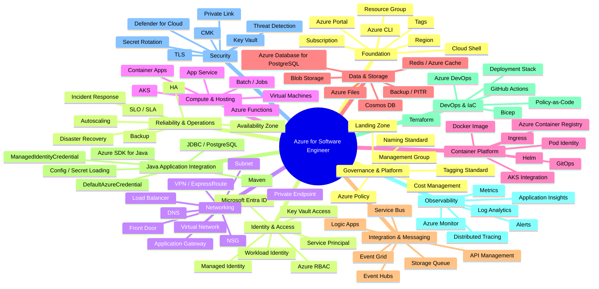

---

## Tabular - Practical Categories / Domain / Skills

| Area | Skill praktis yang perlu dikuasai | Kenapa penting untuk software engineer |
|---|---|---|
| **1. Azure Foundation & Control Plane** | Subscription, tenant, resource group, region, resource provider, tags, Azure Portal, Azure CLI, Cloud Shell | Ini adalah “filesystem + ownership boundary” Azure. Semua deployment, billing, permission, quota, dan governance akan melewati struktur ini. Azure Portal juga menjadi console terpadu untuk build, deploy, manage, dan optimize resource. ([Microsoft Azure](https://azure.microsoft.com/en-us/get-started/azure-portal?utm_source=chatgpt.com)) |
| **2. Landing Zone & Enterprise Structure** | Management group, subscription strategy, platform landing zone, application landing zone, naming, tagging, policy baseline | Di enterprise, engineer jarang deploy ke Azure kosong. Biasanya sudah ada landing zone yang mengatur identity, network, security, governance, dan operational baseline. Microsoft menyebut Azure Landing Zone sebagai pendekatan standar/rekomendasi untuk mengelola environment Azure skala organisasi. ([Microsoft Learn](https://learn.microsoft.com/en-us/azure/cloud-adoption-framework/ready/landing-zone/?utm_source=chatgpt.com)) |
| **3. Identity & Access Management** | Microsoft Entra ID, Azure RBAC, role assignment, service principal, managed identity, workload identity | Hampir semua akses antar service di Azure sebaiknya berbasis identity, bukan hardcoded secret. Azure RBAC menyediakan built-in role untuk user, group, service principal, dan managed identity. ([Microsoft Learn](https://learn.microsoft.com/en-us/azure/role-based-access-control/built-in-roles?utm_source=chatgpt.com)) |
| **4. Java Authentication to Azure** | Azure SDK for Java, `azure-identity`, `DefaultAzureCredential`, `ManagedIdentityCredential`, local dev vs production credential chain | Untuk Java service, ini skill inti agar aplikasi bisa mengakses Key Vault, Storage, Service Bus, Event Hubs, dan resource lain tanpa menyimpan credential statis. Azure Identity library menyediakan Microsoft Entra token authentication untuk Azure SDK. ([Microsoft Learn](https://learn.microsoft.com/en-us/java/api/overview/azure/identity-readme?view=azure-java-stable&utm_source=chatgpt.com)) |
| **5. Networking Core** | VNet, subnet, NSG, route table, private endpoint, private DNS, NAT, firewall, peering | Banyak issue production di Azure bukan bug aplikasi, tetapi salah network path: DNS, firewall, private endpoint, outbound SNAT, atau subnet policy. Skill ini penting untuk microservice, PostgreSQL, AKS, dan hybrid on-prem. |
| **6. Edge & Traffic Management** | Azure Front Door, Application Gateway, Load Balancer, WAF, ingress controller, TLS termination | Ini domain untuk expose API/web app dengan kontrol routing, TLS, WAF, global routing, dan ingress. Untuk Jersey/JAX-RS, skill ini menentukan bagaimana API diakses dari internet, internal network, atau partner system. |
| **7. Compute Decision Model** | Memilih App Service vs Functions vs Container Apps vs AKS vs VM | Software engineer perlu tahu kapan cukup PaaS, kapan perlu container serverless, kapan perlu Kubernetes, dan kapan VM masih masuk akal. Microsoft menyediakan compute decision guidance untuk memilih service compute sesuai karakter workload. ([Microsoft Learn](https://learn.microsoft.com/en-us/azure/architecture/guide/technology-choices/compute-decision-tree?utm_source=chatgpt.com)) |
| **8. App Service** | Deploy Java web/API app, app settings, deployment slot, autoscale, custom domain, TLS, managed identity | Cocok untuk web app/API yang ingin managed hosting tanpa mengelola Kubernetes. Untuk banyak Java REST service, App Service bisa menjadi pilihan awal jika tidak butuh kontrol orchestration yang kompleks. Microsoft mengategorikan App Service sebagai full-service web hosting. ([Microsoft Learn](https://learn.microsoft.com/en-us/azure/developer/intro/hosting-apps-on-azure?utm_source=chatgpt.com)) |
| **9. Azure Functions** | Event-driven function, timer trigger, queue trigger, HTTP trigger, containerized function | Berguna untuk background processing, scheduled job, glue logic, dan event handling. Untuk Java engineer, ini relevan untuk workload kecil/terisolasi, bukan core domain service yang butuh lifecycle kompleks. |
| **10. Azure Container Apps** | Serverless container, revision, scaling, ingress, Dapr integration, jobs, background worker | Cocok untuk containerized API, worker, event-driven processing, dan microservice tanpa mengelola cluster Kubernetes. Microsoft mendeskripsikannya sebagai serverless platform untuk menjalankan containerized application tanpa mengelola infrastructure di bawahnya. ([Microsoft Learn](https://learn.microsoft.com/en-us/azure/container-apps/overview?utm_source=chatgpt.com)) |
| **11. AKS - Azure Kubernetes Service** | Cluster, node pool, ingress, workload identity, network policy, autoscaling, Helm, GitOps, upgrade strategy | AKS adalah pilihan untuk workload container yang butuh kontrol Kubernetes penuh. Microsoft menyebut AKS sebagai managed Kubernetes service untuk deploy dan manage containerized applications, dengan Azure mengambil sebagian operational overhead Kubernetes. ([Microsoft Learn](https://learn.microsoft.com/en-us/azure/aks/what-is-aks?utm_source=chatgpt.com)) |
| **12. Azure Container Registry / ACR** | Private registry, image tagging, vulnerability scanning integration, pull permission, AKS integration | Untuk pipeline Docker/Kubernetes, ACR menjadi registry privat image/artifact. ACR digunakan untuk build, store, dan manage container images/artifacts, dan dapat diintegrasikan dengan AKS agar cluster pull image secara aman. ([Microsoft Learn](https://learn.microsoft.com/en-us/azure/container-registry/?utm_source=chatgpt.com)) |
| **13. PostgreSQL on Azure** | Azure Database for PostgreSQL Flexible Server, HA, backup, PITR, private access, parameter tuning, connection pooling | Relevan langsung untuk stack PostgreSQL/MyBatis. Engineer perlu memahami perbedaan managed PostgreSQL vs self-managed PostgreSQL, terutama backup, HA, TLS, storage, maintenance window, dan network isolation. Microsoft menekankan security practice seperti HA, backup/recovery, dan secure connectivity untuk PostgreSQL Flexible Server. ([Microsoft Learn](https://learn.microsoft.com/en-us/azure/postgresql/security/security-overview?utm_source=chatgpt.com)) |
| **14. Storage Services** | Blob Storage, Azure Files, lifecycle policy, SAS, managed identity access, encryption, private endpoint | Dipakai untuk file upload/download, export, report, attachment, archival, dan integration payload. Untuk microservice, storage harus diperlakukan sebagai external dependency dengan access control, retention, dan observability. |
| **15. Secrets & Key Management** | Azure Key Vault, secret, certificate, key, rotation, managed identity access, customer-managed key | Jangan simpan password DB, API key, certificate, atau signing key di config file/container image. Untuk beberapa layanan termasuk PostgreSQL, Azure juga mendukung pola customer-managed key dengan Key Vault/HSM untuk kontrol enkripsi yang lebih kuat. ([Microsoft Learn](https://learn.microsoft.com/en-us/azure/postgresql/security/security-data-encryption?utm_source=chatgpt.com)) |
| **16. API Management** | API gateway, product/subscription, policy, rate limit, JWT validation, backend routing, versioning | Untuk REST/JAX-RS microservice, API Management sering menjadi boundary eksternal: auth policy, throttling, developer portal, versioning, transformation, dan observability API. |
| **17. Messaging & Eventing** | Service Bus, Event Hubs, Event Grid, Storage Queue | Skill ini penting untuk asynchronous workflow, integration, event ingestion, queue-based retry, dan decoupling antar service. Secara praktis: Service Bus untuk enterprise queue/topic, Event Hubs untuk high-throughput event streaming, Event Grid untuk event routing, Storage Queue untuk queue sederhana. |
| **18. Camunda / Workflow Integration on Azure** | Deploy Camunda worker/service, DB connectivity, queue/event bridge, Kubernetes/App Service hosting, secret/config externalization | Untuk stack Camunda, Azure bukan hanya tempat deploy. Azure juga menjadi provider identity, network, secret, database, observability, dan event source/sink yang memengaruhi reliability workflow. |
| **19. Configuration Management** | App Configuration, environment variable, Key Vault reference, feature flag, config layering | Java service harus memisahkan config, secret, dan runtime parameter. Ini penting untuk multi-environment deployment: dev, test, staging, prod, region A/B, on-prem/Azure hybrid. |
| **20. Observability** | Azure Monitor, Application Insights, Log Analytics, metrics, distributed tracing, alert, dashboard | Tanpa observability, Azure hanya menjadi tempat aplikasi “mati secara mahal”. Engineer harus bisa membaca logs, metrics, traces, dependency call, latency, error rate, saturation, dan alert. |
| **21. DevOps & CI/CD** | GitHub Actions for Azure, Azure DevOps Pipelines, environment promotion, deployment approval, artifact versioning | Karena stack Anda menggunakan GitHub, fokus praktisnya adalah build Java/Maven, build Docker image, push ke ACR, deploy ke App Service/Container Apps/AKS, lalu run smoke test. Microsoft juga menyediakan guidance GitHub Actions dan DevSecOps integration untuk Azure. ([Microsoft Learn](https://learn.microsoft.com/en-us/azure/defender-for-cloud/github-action?utm_source=chatgpt.com)) |
| **22. Infrastructure as Code** | Bicep, ARM, Terraform, module structure, state, drift detection, deployment stack | Untuk production, resource Azure sebaiknya tidak dibuat manual. Bicep diproses oleh Azure Resource Manager, sedangkan Terraform diproses dari client Terraform; keduanya umum dipakai untuk IaC tergantung standard organisasi. ([Microsoft Learn](https://learn.microsoft.com/en-us/azure/developer/terraform/comparing-terraform-and-bicep?utm_source=chatgpt.com)) |
| **23. Governance & Policy** | Azure Policy, built-in policy, deny/audit/modify, tagging policy, allowed region/SKU, private endpoint enforcement | Governance memastikan engineer tidak bebas membuat resource yang insecure/mahal/tidak compliant. Azure Policy memiliki built-in policy definitions yang dikelompokkan berdasarkan kategori. ([Microsoft Learn](https://learn.microsoft.com/en-us/azure/governance/policy/samples/built-in-policies?utm_source=chatgpt.com)) |
| **24. Security Engineering** | Defender for Cloud, TLS, private link, network isolation, least privilege, secret rotation, audit log | Security Azure harus dilihat sebagai kombinasi identity, network, data encryption, policy, posture management, dan pipeline scanning - bukan hanya “pasang Key Vault”. |
| **25. Reliability Engineering** | Availability zone, zone-redundant service, autoscale, health probe, retry, timeout, circuit breaker, backup/restore drill | Azure Well-Architected reliability menekankan workload memenuhi target uptime dan recovery melalui redundancy dan resiliency. Ini harus diterjemahkan ke desain aplikasi: idempotency, retry budget, graceful degradation, dan tested recovery. ([Microsoft Learn](https://learn.microsoft.com/en-us/azure/well-architected/?utm_source=chatgpt.com)) |
| **26. Cost Engineering** | SKU choice, autoscale policy, reserved capacity, budgets, alerts, idle resource cleanup, log retention cost | Cost bukan urusan finance saja. Pilihan engineer - log volume, node size, database tier, backup retention, egress, NAT, public IP, storage replication - langsung memengaruhi biaya. Cost optimization juga salah satu pilar resmi Azure Well-Architected Framework. ([Microsoft Learn](https://learn.microsoft.com/en-us/azure/well-architected/pillars?utm_source=chatgpt.com)) |
| **27. Hybrid / Multi-cloud / Migration** | VPN, ExpressRoute, DNS forwarding, private connectivity, migration pattern, on-prem integration | Karena environment Anda mencakup on-prem/AWS/Azure, skill hybrid penting: identity boundary, network route, data sync, latency, failover, dan observability lintas platform. |
| **28. Operational Runbook** | Incident response, rollback, restart, scale out, DB failover, cert rotation, secret rotation, access review | Senior engineer perlu bisa menjawab: “kalau service down jam 2 pagi, apa yang dicek dulu?” Azure skill yang matang selalu berakhir di runbook, bukan hanya deployment berhasil. |

---

## Roadmap Alur Belajar yang Direkomendasikan

### Phase 1 - Azure mental model & control plane

Mulai dari **tenant, subscription, resource group, region, Azure Portal, Azure CLI, RBAC, tags, dan cost visibility**. Targetnya: Anda paham “di mana resource hidup, siapa boleh akses, dan siapa bayar”.

### Phase 2 - Identity, secret, dan network baseline

Pelajari **Microsoft Entra ID, managed identity, service principal, Key Vault, VNet, subnet, NSG, private endpoint, private DNS**. Ini fondasi sebelum deploy service production.

### Phase 3 - Application hosting untuk Java service

Bandingkan dan praktikkan deploy Java/Jersey service ke **App Service, Container Apps, dan AKS**. Fokus pada config, health check, autoscale, logging, deployment strategy, dan rollback.

### Phase 4 - Data & integration

Masuk ke **Azure Database for PostgreSQL Flexible Server, Blob Storage, Service Bus, Event Hubs, Event Grid, API Management**. Hubungkan dengan pola MyBatis, migration, async processing, dan API gateway.

### Phase 5 - CI/CD & IaC

Bangun pipeline dari **GitHub Actions/Azure DevOps → Maven build → Docker build → ACR → deploy ke target runtime**. Lalu pindahkan resource provisioning ke **Bicep atau Terraform**.

### Phase 6 - Observability, security, reliability, cost

Perkuat production readiness: **Azure Monitor, Application Insights, Log Analytics, alerting, Defender for Cloud, Azure Policy, HA, backup/restore drill, autoscaling, budget alert, log retention control**.

---

## Rekomendasi materi selanjutnya

Saya rekomendasikan lanjut ke seri:

**Azure Seri 1 - Azure Mental Model: Tenant, Subscription, Resource Group, Region, RBAC, Policy, Landing Zone, dan Cost Boundary**

Ini akan menjadi fondasi sebelum masuk ke App Service, AKS, Container Apps, PostgreSQL, Service Bus, dan observability.

---

**Sources:**

- [Microsoft's Cloud Adoption Framework](https://learn.microsoft.com/en-us/azure/cloud-adoption-framework/overview?utm_source=chatgpt.com)
- [Microsoft Azure portal](https://azure.microsoft.com/en-us/get-started/azure-portal?utm_source=chatgpt.com)

## Response:
7/13/2026, 8:26:35 AM

Total saya rekomendasikan **18 seri Azure** untuk software engineer.

| Seri | Topik |
|---:|---|
| 1 | **Azure Mental Model** — tenant, subscription, resource group, region, resource provider, tags |
| 2 | **Azure Identity & Access** — Microsoft Entra ID, RBAC, service principal, managed identity |
| 3 | **Azure Landing Zone & Governance** — management group, policy, naming, tagging, enterprise baseline |
| 4 | **Azure Networking Core** — VNet, subnet, NSG, route table, DNS, private endpoint |
| 5 | **Azure Edge & Traffic Routing** — Load Balancer, Application Gateway, Front Door, WAF, TLS |
| 6 | **Azure Compute Decision Model** — App Service vs Functions vs Container Apps vs AKS vs VM |
| 7 | **Azure App Service for Java/Jersey Applications** |
| 8 | **Azure Container Apps for Microservices & Workers** |
| 9 | **AKS for Java Microservices** — Kubernetes on Azure, ingress, node pool, workload identity |
| 10 | **Azure Container Registry & Container Supply Chain** — ACR, image tagging, scanning, deployment flow |
| 11 | **Azure PostgreSQL Flexible Server** — HA, backup, PITR, private access, tuning, MyBatis integration |
| 12 | **Azure Storage** — Blob Storage, Azure Files, lifecycle, SAS, managed identity access |
| 13 | **Azure Key Vault & Secret Management** — secrets, certs, keys, rotation, Key Vault references |
| 14 | **Azure API Management for JAX-RS/Jersey APIs** — gateway, policy, throttling, versioning |
| 15 | **Azure Messaging & Eventing** — Service Bus, Event Hubs, Event Grid, Storage Queue |
| 16 | **CI/CD & IaC on Azure** — GitHub Actions, Azure DevOps, Bicep, Terraform |
| 17 | **Azure Observability** — Azure Monitor, Application Insights, Log Analytics, alerts, tracing |
| 18 | **Azure Production Readiness** — security, reliability, cost, backup, DR, runbook, incident response |

Jadi totalnya: **18 seri utama**.

Urutan belajar yang saya sarankan: **1 → 2 → 4 → 6 → 7/8/9 → 11 → 13 → 15 → 16 → 17 → 18**.

Rekomendasi materi berikutnya: **Azure Seri 1 — Azure Mental Model: Tenant, Subscription, Resource Group, Region, RBAC Boundary, Policy Boundary, dan Cost Boundary**.

## Response:
7/13/2026, 8:27:16 AM

Kita mulai dari **Seri 1/18** sebagai fondasi. Saya akan fokus ke mental model Azure yang paling sering menentukan desain, deployment, akses, biaya, dan governance aplikasi.

# Azure Seri 1/18 - Azure Mental Model

## 1. Introduction

Seri pertama ini membangun **mental model Azure**: bagaimana resource diorganisasi, siapa yang punya akses, di mana workload berjalan, bagaimana policy diterapkan, dan bagaimana biaya muncul.

Untuk software engineer, ini penting karena hampir semua masalah Azure production biasanya jatuh ke salah satu boundary ini:

1. **Ownership boundary** - siapa pemilik resource?
2. **Access boundary** - siapa boleh melakukan apa?
3. **Deployment boundary** - resource dideploy ke scope mana?
4. **Network/location boundary** - region, zone, private/public access.
5. **Cost boundary** - biaya dihitung dan dilacak di mana?
6. **Governance boundary** - aturan organisasi diterapkan di mana?

Azure Resource Manager adalah layer deployment dan management Azure untuk membuat, mengubah, menghapus, mengamankan, mengunci, dan menandai resource. Jadi hampir semua operasi Azure modern lewat model ARM/resource scope ini. ([Microsoft Learn](https://learn.microsoft.com/en-us/azure/azure-resource-manager/management/overview?utm_source=chatgpt.com))

---

## 2. Diagram - Azure Resource Organization Mental Model

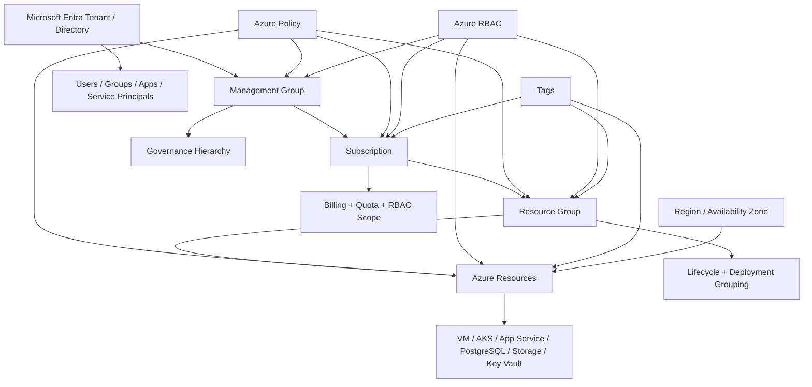

Mental model paling ringkas:

```text
Tenant
  └── Management Group
        └── Subscription
              └── Resource Group
                    └── Resource
```

Microsoft Cloud Adoption Framework menjelaskan resource organization Azure dalam empat scope utama: **management groups, subscriptions, resource groups, dan resources**. ([Microsoft Learn](https://learn.microsoft.com/en-us/azure/cloud-adoption-framework/ready/landing-zone/design-area/resource-org?utm_source=chatgpt.com))

---

## 3. Core Concepts Table

| Concept | Fungsi utama | Boundary yang dikontrol | Pertanyaan praktis untuk engineer |
|---|---|---|---|
| **Microsoft Entra Tenant** | Directory identity: user, group, app registration, service principal | Identity boundary | User/app ini berasal dari tenant mana? Apakah aksesnya directory-level atau Azure resource-level? |
| **Management Group** | Mengelompokkan subscription untuk governance skala organisasi | Governance + inheritance boundary | Policy/RBAC apa yang diwariskan ke banyak subscription? |
| **Subscription** | Unit billing, quota, management, dan scale | Billing + access + quota boundary | Workload ini masuk subscription dev/test/prod/shared/platform yang mana? |
| **Resource Group** | Logical container untuk resource yang biasanya punya lifecycle sama | Deployment + lifecycle boundary | Resource mana yang dibuat, dihapus, dipindah, atau dikelola sebagai satu grup? |
| **Resource** | Instance layanan Azure, misalnya AKS, PostgreSQL, Storage, Key Vault | Runtime/service boundary | Resource ini private atau public? Region mana? SKU apa? Siapa boleh akses? |
| **Region** | Lokasi geografis deployment resource | Latency + residency + availability boundary | Workload production harus berjalan di region mana? Ada data residency requirement? |
| **Availability Zone** | Datacenter group terpisah dalam satu region | Fault isolation boundary | Resource ini zonal, zone-redundant, atau tidak mendukung zone? |
| **Azure RBAC** | Mengatur siapa boleh melakukan operasi pada resource Azure | Authorization boundary | Developer boleh read-only, contributor, owner, atau role khusus? |
| **Azure Policy** | Mengatur guardrail: allowed location, required tag, deny public IP, allowed SKU, dll. | Compliance + governance boundary | Resource yang tidak sesuai standard akan diaudit, ditolak, atau diperbaiki otomatis? |
| **Tags** | Metadata untuk ownership, cost, environment, system, compliance | Cost + ownership visibility | Resource ini milik tim mana, environment apa, cost center mana, aplikasi apa? |

Management group dipakai untuk mengorganisasi subscription agar policy dan access management bisa diwariskan secara terpusat. Subscription sendiri adalah unit penting untuk **management, billing, dan scale**. ([Microsoft Learn](https://learn.microsoft.com/en-us/azure/governance/management-groups/overview?utm_source=chatgpt.com)) ([Microsoft Learn](https://learn.microsoft.com/en-us/azure/cloud-adoption-framework/ready/landing-zone/design-area/resource-org-subscriptions?utm_source=chatgpt.com))

---

## 4. Tenant vs Subscription - Perbedaan yang Sering Membingungkan

### Tenant

**Tenant** adalah boundary identity. Isinya user, group, application identity, service principal, dan directory-level configuration.

Contoh:

```text
company.com tenant
  users:
    alice@company.com
    bob@company.com

  groups:
    backend-engineers
    platform-team

  app identities:
    github-actions-prod
    jersey-api-managed-identity
```

### Subscription

**Subscription** adalah boundary Azure resource, billing, quota, dan deployment.

Contoh:

```text
subscription-prod-core
  resource groups:
    rg-payment-prod
    rg-camunda-prod
    rg-observability-prod
```

Pemisahan penting: **Microsoft Entra roles** mengatur directory resource seperti user dan group, sedangkan **Azure roles/RBAC** mengatur akses ke Azure resources dalam subscription. ([Microsoft Learn](https://learn.microsoft.com/en-us/entra/fundamentals/how-subscriptions-associated-directory?utm_source=chatgpt.com))

---

## 5. Management Group - Untuk Enterprise Governance

Management group biasanya tidak terasa saat belajar Azure personal, tetapi sangat penting di perusahaan.

Contoh struktur enterprise:

```text
Tenant Root Group
  ├── Platform
  │     ├── Connectivity Subscription
  │     ├── Identity Subscription
  │     └── Management Subscription
  │
  ├── Landing Zones
  │     ├── App-Dev Subscription
  │     ├── App-Test Subscription
  │     └── App-Prod Subscription
  │
  └── Sandbox
        └── Engineer Sandbox Subscription
```

Maknanya:

| Management Group | Isi | Tujuan |
|---|---|---|
| **Platform** | Shared network, identity, monitoring, security services | Dipakai banyak aplikasi |
| **Landing Zones** | Subscription aplikasi | Tempat workload bisnis berjalan |
| **Sandbox** | Subscription eksplorasi | Eksperimen dengan batasan cost/policy |
| **Prod** | Production workload | Guardrail paling ketat |
| **Non-prod** | Dev/test/staging | Guardrail lebih fleksibel |

Azure Landing Zone reference architecture memisahkan area **Platform** dan **Landing zone/application landing zones**, dengan subscription di bawah management group yang sesuai. ([Microsoft Learn](https://learn.microsoft.com/en-us/azure/cloud-adoption-framework/ready/landing-zone/?utm_source=chatgpt.com))

---

## 6. Resource Group - Jangan Anggap Sekadar Folder

Resource Group memang terlihat seperti folder, tetapi secara operasional lebih kuat dari folder biasa.

Resource Group biasanya dipakai untuk mengelompokkan resource yang:

1. Punya lifecycle sama.
2. Dikelola tim yang sama.
3. Berhubungan dengan aplikasi/workload yang sama.
4. Dipakai dalam environment yang sama.
5. Akan dideploy/delete/move bersama.

Contoh yang baik:

```text
rg-case-api-prod
  - app service / container app / aks namespace-related resources
  - key vault reference
  - app insights
  - private endpoint
  - storage account for app files
```

Contoh yang buruk:

```text
rg-prod
  - semua aplikasi production
  - semua database
  - semua storage
  - semua network
  - semua secret
```

Masalah dari resource group terlalu besar:

| Masalah | Dampak |
|---|---|
| Ownership kabur | Sulit tahu resource milik tim/aplikasi mana |
| Cost attribution buruk | Cost report tidak actionable |
| RBAC terlalu luas | Developer dapat akses ke resource yang tidak perlu |
| Deletion risk tinggi | Salah hapus bisa berdampak banyak aplikasi |
| IaC sulit | Template jadi monolitik dan rawan konflik |

Azure Resource Manager mendukung pengelolaan resource group termasuk create, list, delete, tag, export template, dan access management. ([Microsoft Learn](https://learn.microsoft.com/en-us/azure/azure-resource-manager/management/manage-resource-groups-cli?utm_source=chatgpt.com))

---

## 7. Region dan Availability Zone

**Region** adalah lokasi geografis Azure tempat resource dideploy. Pemilihan region memengaruhi latency, data residency, ketersediaan layanan, harga, dan opsi reliability.

**Availability Zone** adalah group datacenter terpisah dalam satu region, dengan power, cooling, dan networking independen. Banyak region Azure menyediakan availability zone, tetapi tidak semua service/region mendukungnya dengan cara yang sama. ([Microsoft Learn](https://learn.microsoft.com/en-us/azure/reliability/availability-zones-overview?utm_source=chatgpt.com))

Model praktis:

```text
Region: Southeast Asia
  ├── Zone 1
  ├── Zone 2
  └── Zone 3
```

Untuk production workload:

| Pertanyaan | Kenapa penting |
|---|---|
| Region apa yang dipakai? | Latency, compliance, service availability |
| Apakah service mendukung Availability Zone? | Menentukan HA design |
| Zonal atau zone-redundant? | Menentukan siapa yang bertanggung jawab atas failover |
| Perlu multi-region? | Untuk disaster recovery lintas region |
| Ada dependency on-prem/AWS? | Latency dan routing perlu dihitung |

Azure region list resmi menyertakan informasi region, physical location, geography, paired region status, dan availability zone support. ([Microsoft Learn](https://learn.microsoft.com/en-us/azure/reliability/regions-list?utm_source=chatgpt.com))

---

## 8. RBAC Boundary - Siapa Boleh Melakukan Apa?

Azure RBAC bekerja pada beberapa scope:

```text
Management Group
  └── Subscription
        └── Resource Group
              └── Resource
```

Role assignment di scope atas bisa diwariskan ke scope bawah.

Contoh:

| Scope | Role | Dampak |
|---|---|---|
| Management Group | Reader | Bisa melihat banyak subscription di bawahnya |
| Subscription | Contributor | Bisa membuat/mengubah resource di subscription |
| Resource Group | Contributor | Bisa mengelola resource dalam RG tertentu |
| Key Vault Resource | Key Vault Secrets User | Bisa membaca secret dari Key Vault tertentu |
| AKS Resource | Azure Kubernetes Service Cluster User Role | Bisa mengakses cluster sesuai role |

Rule praktis:

```text
Berikan akses di scope paling kecil yang masih cukup.
```

Anti-pattern:

```text
Semua engineer diberi Owner di subscription production.
```

Dampaknya:

1. Bisa mengubah RBAC.
2. Bisa menghapus resource.
3. Bisa bypass guardrail operasional.
4. Sulit audit.
5. Blast radius terlalu besar.

Azure RBAC menyediakan built-in role untuk user, group, service principal, dan managed identity. ([Microsoft Learn](https://learn.microsoft.com/en-us/azure/governance/policy/overview?utm_source=chatgpt.com))

---

## 9. Policy Boundary - Guardrail Bukan Sekadar Dokumentasi

Azure Policy dipakai untuk membuat, assign, dan manage policy definition yang berisi rule dan effect. Effect bisa dipakai untuk audit, deny, modify, append, deployIfNotExists, dan pola governance lain. ([Microsoft Learn](https://learn.microsoft.com/en-us/azure/governance/policy/overview?utm_source=chatgpt.com))

Contoh policy praktis:

| Policy | Efek |
|---|---|
| Require tag `owner` | Resource tanpa owner ditolak atau diaudit |
| Require tag `costCenter` | Cost attribution wajib |
| Allowed regions only | Resource hanya boleh dibuat di region tertentu |
| Deny public IP | Mencegah exposure internet sembarangan |
| Enforce private endpoint | Memaksa service critical lewat private network |
| Allowed VM SKU | Mengontrol biaya |
| Audit unencrypted resource | Menemukan resource yang tidak compliant |
| Deny non-approved resource type | Mencegah penggunaan layanan yang belum distandardisasi |

Perbedaan penting:

| Azure RBAC | Azure Policy |
|---|---|
| Mengatur **siapa boleh melakukan apa** | Mengatur **apa yang boleh dibuat/dikonfigurasi** |
| Authorization | Governance/compliance |
| Contoh: developer boleh create storage | Contoh: storage harus private dan tagged |
| User/action focused | Resource/configuration focused |

Azure Policy juga menyediakan built-in policy definitions, sehingga organisasi tidak harus selalu membuat policy dari nol. ([Microsoft Learn](https://learn.microsoft.com/en-us/azure/governance/policy/samples/built-in-policies?utm_source=chatgpt.com))

---

## 10. Tags - Metadata yang Menentukan Cost dan Ownership

Tags dapat diterapkan ke **resources, resource groups, dan subscriptions**, tetapi tidak ke management groups. Tags mendukung organisasi resource dan cost tracking. ([Microsoft Learn](https://learn.microsoft.com/en-us/azure/azure-resource-manager/management/tag-resources?utm_source=chatgpt.com))

Tag minimum yang biasanya berguna:

| Tag | Contoh | Tujuan |
|---|---|---|
| `app` | `case-management` | Nama aplikasi/sistem |
| `env` | `dev`, `test`, `staging`, `prod` | Environment |
| `owner` | `backend-platform` | Tim pemilik |
| `costCenter` | `regulatory-tech` | Cost attribution |
| `criticality` | `low`, `medium`, `high`, `mission-critical` | Prioritas operasional |
| `dataClassification` | `public`, `internal`, `confidential`, `restricted` | Compliance/security |
| `managedBy` | `terraform`, `bicep`, `manual` | Sumber deployment |
| `serviceTier` | `bronze`, `silver`, `gold` | SLO/operational expectation |

Contoh tag yang baik:

```json
{
  "app": "case-management",
  "env": "prod",
  "owner": "case-platform-team",
  "costCenter": "regulatory-systems",
  "criticality": "high",
  "dataClassification": "confidential",
  "managedBy": "terraform"
}
```

Tag tanpa policy biasanya membusuk. Azure Policy dapat dipakai untuk enforce atau modify tag agar resource baru dan resource existing lebih konsisten. ([Microsoft Learn](https://learn.microsoft.com/en-us/azure/azure-resource-manager/management/tag-policies?utm_source=chatgpt.com))

---

## 11. Cost Boundary - Biaya Tidak Selalu Ikut Struktur Teknis

Cost di Azure sering dianalisis dari:

```text
Subscription
  └── Resource Group
        └── Resource
              └── Meter / SKU / Usage
```

Tapi untuk keputusan engineering, cost harus dibaca bersama:

| Cost driver | Contoh dampak |
|---|---|
| SKU/tier | PostgreSQL, App Service Plan, AKS node size |
| Region | Harga bisa berbeda antar region |
| Replication | Storage redundancy, database HA, zone redundancy |
| Logs | Application Insights/Log Analytics ingestion bisa mahal |
| Network egress | Traffic keluar Azure atau antar region |
| Idle resource | VM, disk, public IP, load balancer, NAT gateway |
| Overprovisioning | AKS node terlalu besar, DB tier terlalu tinggi |
| Retention | Backup/log retention terlalu panjang |

Rule praktis untuk engineer:

```text
Setiap resource production harus punya owner, env, costCenter, dan alasan SKU.
```

Tanpa itu, cost optimization berubah menjadi tebak-tebakan.

---

## 12. Practical Azure Scope Decision

Gunakan model ini saat membuat resource baru.

### Step 1 - Tentukan workload

```text
Aplikasi: case-management-api
Environment: prod
Runtime: Java 17 Jersey API
Data: PostgreSQL
Deployment: container
Exposure: internal + API gateway
Criticality: high
```

### Step 2 - Tentukan subscription

```text
subscription: sub-prod-regulatory-apps
```

Pertanyaan:

| Pertanyaan | Jawaban |
|---|---|
| Apakah workload prod? | Ya |
| Apakah perlu compliance guardrail prod? | Ya |
| Apakah harus dipisah dari sandbox/dev? | Ya |
| Apakah billing perlu masuk cost center tertentu? | Ya |

### Step 3 - Tentukan resource group

```text
resource group: rg-case-management-api-prod-sea
```

Isi resource group:

```text
rg-case-management-api-prod-sea
  - container app / app service / aks related resource
  - app insights
  - key vault access config
  - private endpoint
  - storage account if app-owned
```

Jangan campur semua aplikasi prod dalam satu resource group.

### Step 4 - Tentukan region

```text
region: Southeast Asia
```

Validasi:

| Check | Kenapa |
|---|---|
| Service tersedia di region? | Tidak semua layanan/tier tersedia di semua region |
| Availability Zone supported? | Untuk HA |
| Dekat dengan user/system? | Latency |
| Data residency sesuai? | Compliance |
| Koneksi ke on-prem/AWS bagaimana? | Hybrid latency/routing |

### Step 5 - Tentukan RBAC

```text
backend engineers:
  Contributor di rg-case-management-api-dev
  Reader di rg-case-management-api-prod

platform team:
  Contributor di prod resource group

break-glass:
  Owner terbatas dan diaudit
```

### Step 6 - Tentukan policy

```text
- deny public IP
- require tags
- allowed regions
- require private endpoint for database
- audit insecure TLS/config
```

### Step 7 - Tentukan tags

```text
app=case-management
env=prod
owner=case-platform-team
costCenter=regulatory-systems
criticality=high
managedBy=terraform
```

---

## 13. Naming Convention Practical Model

Format yang umum dan readable:

```text
<resource-type>-<app/workload>-<env>-<region-short>-<instance>
```

Contoh:

```text
rg-case-api-prod-sea-001
kv-case-api-prod-sea-001
appi-case-api-prod-sea-001
stcaseapiprodsea001
psql-case-prod-sea-001
acrplatformprodsea001
```

Catatan penting:

| Resource | Constraint umum |
|---|---|
| Storage Account | Harus globally unique, lowercase, tanpa dash |
| Key Vault | Nama harus unique secara global |
| Resource Group | Lebih fleksibel |
| App Service | Nama memengaruhi default hostname |
| PostgreSQL server | Nama menjadi bagian endpoint |
| AKS | Nama cluster harus stabil dan jelas |

Naming convention harus membantu:

1. Audit.
2. Incident response.
3. Cost analysis.
4. Search di portal.
5. IaC readability.
6. Handover antar tim.

---

## 14. Deployment Scope Mental Model

Azure deployment bisa terjadi di beberapa scope:

```text
Tenant scope
Management group scope
Subscription scope
Resource group scope
Resource scope
```

Untuk software engineer, mayoritas deployment aplikasi akan berada di:

```text
Subscription scope
Resource group scope
```

Contoh:

| Kebutuhan | Scope yang cocok |
|---|---|
| Membuat resource group | Subscription |
| Membuat App Service / Container App / Key Vault | Resource group |
| Assign policy ke semua prod subscription | Management group |
| Assign developer access ke satu aplikasi | Resource group |
| Assign Key Vault access ke satu managed identity | Resource |
| Membuat standard landing zone | Management group/subscription |

---

## 15. Anti-pattern yang Harus Dihindari

| Anti-pattern | Risiko |
|---|---|
| Semua resource ditaruh di satu subscription | Billing, RBAC, quota, dan blast radius kacau |
| Semua production resource dalam satu resource group | Lifecycle dan ownership tidak jelas |
| Semua engineer diberi Owner | Security risk tinggi |
| Resource dibuat manual tanpa IaC | Drift dan sulit reproduce |
| Tidak ada tag mandatory | Cost dan ownership tidak jelas |
| Public endpoint default untuk database/storage | Exposure risk |
| Secret disimpan di app settings/plain env tanpa kontrol | Secret leak |
| Tidak ada naming convention | Operasional lambat |
| Tidak ada policy allowed region/SKU | Cost dan compliance bocor |
| Tidak paham tenant vs subscription | Salah grant akses dan salah asumsi security |

---

## 16. Checklist Saat Join Project Azure Existing

Gunakan checklist ini untuk onboarding cepat.

### A. Organization

| Check | Pertanyaan |
|---|---|
| Tenant | Tenant Azure mana yang dipakai? |
| Management group | Subscription project berada di hierarchy mana? |
| Subscription | Ada pemisahan dev/test/prod? |
| Resource group | Resource group per app, per env, atau campur? |
| Naming | Ada naming convention resmi? |
| Tags | Tag mandatory apa saja? |

### B. Access

| Check | Pertanyaan |
|---|---|
| RBAC | Role saya apa dan di scope mana? |
| PIM | Apakah akses prod perlu privileged activation? |
| Service principal | Pipeline pakai identity apa? |
| Managed identity | Aplikasi pakai managed identity atau secret? |
| Key Vault | Siapa boleh read secret/cert/key? |

### C. Deployment

| Check | Pertanyaan |
|---|---|
| IaC | Pakai Terraform, Bicep, ARM, atau manual? |
| Pipeline | GitHub Actions atau Azure DevOps? |
| Environment | Dev/test/prod deploy flow bagaimana? |
| Approval | Prod deploy butuh approval? |
| Rollback | Rollback dilakukan via redeploy, slot swap, image rollback, atau Helm rollback? |

### D. Runtime

| Check | Pertanyaan |
|---|---|
| Compute | App Service, Container Apps, AKS, VM, atau mix? |
| Region | Region utama apa? |
| HA | Zone redundant atau single zone? |
| Scaling | Autoscale berdasarkan apa? |
| Network | Public, private, hybrid, atau via gateway? |

### E. Cost & Governance

| Check | Pertanyaan |
|---|---|
| Budget | Ada budget alert? |
| Cost center | Cost dipetakan via tag apa? |
| Policy | Resource apa yang di-deny/audit otomatis? |
| Logs | Retention log berapa lama? |
| Cleanup | Dev/test resource otomatis dimatikan/dihapus? |

---

## 17. Mini Lab Mental Model

Tujuan lab: membiasakan melihat Azure sebagai scope hierarchy.

```bash
# 1. Login
az login

# 2. Lihat subscription
az account list --output table

# 3. Pilih subscription aktif
az account set --subscription "<subscription-id-or-name>"

# 4. Lihat resource group
az group list --output table

# 5. Lihat resource dalam resource group
az resource list \
  --resource-group "<resource-group-name>" \
  --output table

# 6. Lihat tag resource group
az group show \
  --name "<resource-group-name>" \
  --query tags

# 7. Lihat role assignment pada resource group
az role assignment list \
  --resource-group "<resource-group-name>" \
  --output table
```

Yang harus Anda amati:

```text
subscription aktif apa?
resource group naming-nya bagaimana?
resource apa saja di dalamnya?
tag lengkap atau tidak?
role assignment terlalu luas atau tidak?
resource berada di region mana?
```

---

## 18. Mental Model Final

Pegang model ini:

```text
Tenant = identity universe
Management Group = governance hierarchy
Subscription = billing + quota + management boundary
Resource Group = lifecycle/deployment boundary
Resource = actual running service
Region/Zone = physical placement + resiliency boundary
RBAC = who can do what
Policy = what is allowed
Tags = ownership + cost metadata
```

Untuk senior software engineer, skill Azure bukan sekadar bisa deploy service. Skill yang lebih penting adalah bisa menjawab:

```text
Apakah resource ini berada di boundary yang benar?
Apakah aksesnya minimal?
Apakah bisa diaudit?
Apakah bisa dihitung biayanya?
Apakah bisa dipulihkan?
Apakah sesuai guardrail organisasi?
Apakah aman untuk production?
```

---

# Status

**Azure Seri 1/18 selesai.**

## Rekomendasi materi berikutnya

**Azure Seri 2 - Azure Identity & Access: Microsoft Entra ID, Azure RBAC, Service Principal, Managed Identity, Workload Identity, dan Key Vault Access Model.**

---

**Sources:**

- [What is Azure Resource Manager?](https://learn.microsoft.com/en-us/azure/azure-resource-manager/management/overview?utm_source=chatgpt.com)

## Response:
7/13/2026, 7:55:07 PM

Lanjut ke **Seri 2/18**. Fokusnya identity dan access karena ini fondasi paling penting sebelum masuk network, compute, AKS, PostgreSQL, dan Key Vault.

# Azure Seri 2/18 - Azure Identity & Access

## 1. Introduction

Di Azure, identity bukan hanya “login user ke portal”. Identity adalah fondasi untuk:

```text
Developer → Azure resource
GitHub Actions → Azure deployment
Java service → Key Vault
Java service → PostgreSQL / Storage / Service Bus
AKS pod → Azure resource
App Service / Container Apps → Azure resource
```

Untuk software engineer, target utama seri ini adalah memahami **siapa/apa yang mengakses apa, melalui identity apa, di scope mana, dengan permission apa, dan tanpa menyimpan secret sembarangan**.

Microsoft Entra mendefinisikan workload identities sebagai **applications, service principals, dan managed identities**. Managed identity sendiri adalah tipe khusus dari service principal yang menghilangkan kebutuhan developer untuk mengelola credential secara manual. ([Microsoft Learn](https://learn.microsoft.com/en-us/entra/workload-id/workload-identities-overview?utm_source=chatgpt.com))

---

## 2. Diagram - Azure Identity & Access Mental Model

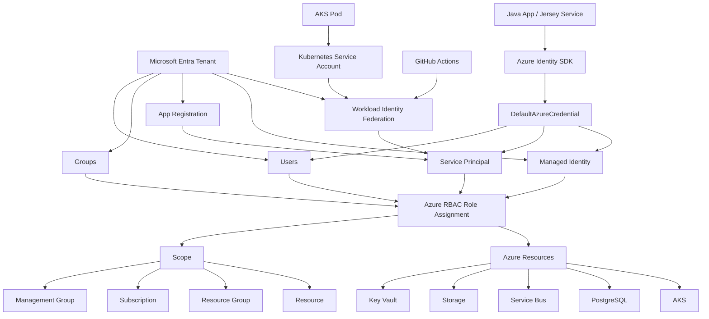

Mental model ringkas:

```text
Identity = siapa / apa aktornya
RBAC = aktor boleh melakukan apa
Scope = permission berlaku di mana
Credential = bagaimana aktor membuktikan identitasnya
Token = bukti akses sementara dari Microsoft Entra
Resource = target yang diakses
```

---

## 3. Core Concepts Table

| Concept | Penjelasan praktis | Dipakai untuk |
|---|---|---|
| **Microsoft Entra Tenant** | Directory tempat user, group, app registration, service principal, dan managed identity berada | Boundary identity organisasi |
| **User** | Identitas manusia | Developer, admin, operator, auditor |
| **Group** | Kumpulan user/principal | Memberikan akses ke tim, bukan individu satu-satu |
| **App Registration** | Definisi aplikasi secara global/logis di Entra | OAuth/OIDC app, API permission, client identity |
| **Service Principal** | Instance identity aplikasi di tenant tertentu | CI/CD, automation, app-to-app access |
| **Managed Identity** | Service principal yang dikelola Azure otomatis | App Service, VM, Container Apps, AKS integration |
| **Workload Identity Federation** | Trust tanpa secret antara external workload dan Entra | GitHub Actions, Kubernetes, non-Azure workloads |
| **Azure RBAC** | Role assignment untuk mengontrol akses ke Azure resources | Contributor, Reader, Key Vault Secrets User, dll. |
| **Scope** | Lokasi permission berlaku | Management group, subscription, resource group, resource |
| **Credential** | Cara identity mendapatkan token | Login user, client secret/cert, managed identity endpoint, federated token |
| **Token** | Access token dari Microsoft Entra | Digunakan SDK/API untuk mengakses resource |
| **Key Vault Access Model** | Permission model untuk key, secret, certificate | RBAC atau legacy access policy |

Azure RBAC menyediakan built-in roles yang bisa diberikan ke user, group, service principal, dan managed identity. Role assignment adalah mekanisme utama untuk mengontrol akses ke Azure resources. ([Microsoft Learn](https://learn.microsoft.com/en-us/azure/role-based-access-control/built-in-roles?utm_source=chatgpt.com))

---

## 4. Identity Types - Jangan Disamakan

### 4.1 User Identity

Dipakai oleh manusia.

Contoh:

```text
alice@company.com
bob@company.com
```

Biasanya dipakai untuk:

| Aktivitas | Contoh |
|---|---|
| Login portal | Melihat resource production |
| Azure CLI | `az login` |
| Debug local | Developer menjalankan app lokal |
| Approval | Production deployment approval |
| Break-glass | Emergency access |

User identity sebaiknya tidak dipakai untuk automation production.

---

### 4.2 Group Identity

Gunakan group untuk memberikan akses ke tim.

Contoh:

```text
group: backend-engineers-dev
group: platform-engineers-prod
group: security-auditors
```

Pola yang sehat:

```text
User → Group → Azure RBAC Role Assignment
```

Bukan:

```text
User → Azure RBAC langsung ke banyak resource
```

Kenapa group lebih baik:

| Alasan | Dampak |
|---|---|
| Onboarding mudah | Tambahkan user ke group |
| Offboarding aman | Hapus user dari group |
| Audit jelas | Akses berbasis fungsi/tim |
| Less privilege lebih mudah | Role per group |
| Mengurangi role assignment sprawl | Tidak banyak assignment individu |

---

### 4.3 App Registration

**App registration** adalah definisi aplikasi di Microsoft Entra.

Ia menjelaskan hal seperti:

```text
application/client id
redirect URI
API permission
certificate/secret credential
federated credential
token configuration
supported account type
```

Microsoft menjelaskan bahwa application object adalah representasi global aplikasi, sedangkan service principal adalah representasi aplikasi di tenant tertentu. ([Microsoft Learn](https://learn.microsoft.com/en-us/entra/identity-platform/app-objects-and-service-principals?utm_source=chatgpt.com))

Contoh app registration:

```text
app registration: github-actions-case-api-prod
client id: xxxxxxxx-xxxx-xxxx-xxxx-xxxxxxxxxxxx
```

---

### 4.4 Service Principal

**Service principal** adalah identity aplikasi di tenant tertentu.

Saat app registration dibuat, service principal dapat dibuat otomatis untuk tenant tersebut. Microsoft menyebut service principal sebagai identity aplikasi dalam tenant Microsoft Entra. ([Microsoft Learn](https://learn.microsoft.com/en-us/entra/identity-platform/howto-create-service-principal-portal?utm_source=chatgpt.com))

Contoh penggunaan service principal:

| Use case | Contoh |
|---|---|
| CI/CD deployment | GitHub Actions deploy ke Azure |
| Automation script | Terraform/Bicep pipeline |
| App-to-app auth | Backend service memanggil protected API |
| Non-Azure workload | On-prem job mengakses Azure resource |

Service principal biasanya menggunakan:

```text
client secret
client certificate
federated credential
```

Untuk production, hindari client secret jangka panjang jika workload identity federation tersedia.

---

### 4.5 Managed Identity

**Managed identity** adalah identity yang dibuat dan dikelola Azure untuk resource tertentu. Azure platform mengelola credential-nya, sehingga aplikasi tidak perlu menyimpan atau merotasi secret sendiri. ([Microsoft Learn](https://learn.microsoft.com/en-us/azure/app-service/overview-managed-identity?utm_source=chatgpt.com))

Ada dua jenis utama:

| Jenis | Karakteristik | Cocok untuk |
|---|---|---|
| **System-assigned managed identity** | Lifecycle mengikuti resource. Jika resource dihapus, identity ikut hilang | App Service tunggal, VM tunggal, Container App tunggal |
| **User-assigned managed identity** | Resource identity berdiri sendiri dan bisa dipakai beberapa resource | Banyak app/worker butuh identity sama, blue-green deployment, AKS workload |

Contoh:

```text
App Service: case-api-prod
Managed Identity: case-api-prod identity
RBAC: Key Vault Secrets User on kv-case-prod
```

Pola yang diinginkan:

```text
Java App
  → Managed Identity
  → Microsoft Entra token
  → Key Vault / Storage / Service Bus
```

Bukan:

```text
Java App
  → hardcoded client secret
  → Azure resource
```

---

### 4.6 Workload Identity Federation

**Workload identity federation** memungkinkan workload mengakses Microsoft Entra protected resources tanpa mengelola secret. Microsoft menyebut skenario ini relevan untuk GitHub Actions, Kubernetes, dan workload di compute platform di luar Azure. ([Microsoft Learn](https://learn.microsoft.com/en-us/entra/workload-id/workload-identity-federation?utm_source=chatgpt.com))

Contoh:

```text
GitHub Actions OIDC token
  → trusted by Microsoft Entra app
  → exchange for Azure access token
  → deploy to Azure
```

Atau:

```text
AKS Kubernetes service account token
  → federated with Microsoft Entra identity
  → access Key Vault / Storage / Service Bus
```

---

## 5. Azure RBAC - Authorization Model

Azure RBAC menjawab:

```text
Principal ini boleh melakukan action apa, pada scope mana?
```

Strukturnya:

```text
Role Assignment =
  Principal + Role Definition + Scope
```

Contoh:

```text
Principal: group backend-engineers
Role: Reader
Scope: rg-case-api-prod
```

Atau:

```text
Principal: managed identity case-api-prod
Role: Key Vault Secrets User
Scope: kv-case-prod
```

Azure RBAC bisa diberikan ke beberapa scope: management group, subscription, resource group, atau individual resource. Untuk Key Vault, Azure RBAC juga dapat diberikan lebih granular pada individual key, secret, atau certificate. ([Microsoft Learn](https://learn.microsoft.com/en-us/azure/key-vault/general/rbac-guide?utm_source=chatgpt.com))

---

## 6. RBAC Scope Hierarchy

```text
Management Group
  └── Subscription
        └── Resource Group
              └── Resource
```

Role assignment di scope atas diwariskan ke bawah.

| Scope | Contoh role | Dampak |
|---|---|---|
| Management Group | Reader | Bisa melihat banyak subscription di bawahnya |
| Subscription | Contributor | Bisa membuat/mengubah resource di seluruh subscription |
| Resource Group | Contributor | Bisa mengelola resource di RG tertentu |
| Resource | Key Vault Secrets User | Bisa membaca secret di Key Vault tertentu |
| Resource child | Secret-level access | Bisa akses secret tertentu saja, jika modelnya mendukung |

Rule utama:

```text
Assign role di scope paling kecil yang masih cukup.
```

---

## 7. Built-in Role yang Sering Muncul

| Role | Makna praktis | Catatan |
|---|---|---|
| **Owner** | Full access termasuk mengatur RBAC | Sangat sensitif |
| **Contributor** | Bisa membuat/mengubah resource, tetapi tidak mengatur access | Masih sangat luas |
| **Reader** | Read-only resource metadata | Aman untuk observasi awal |
| **User Access Administrator** | Bisa mengelola access | Sensitif seperti Owner dalam konteks access |
| **Key Vault Secrets User** | Bisa membaca secret value | Untuk aplikasi yang butuh secret |
| **Key Vault Secrets Officer** | Bisa manage secret | Untuk operator/platform, bukan app biasa |
| **Storage Blob Data Reader** | Read blob data | Data-plane role |
| **Storage Blob Data Contributor** | Read/write blob data | Untuk app yang upload/download object |
| **AcrPull** | Pull image dari Azure Container Registry | Untuk AKS/Container Apps/App Service |
| **AcrPush** | Push image ke ACR | Untuk CI/CD pipeline |
| **Azure Kubernetes Service Cluster User Role** | Akses cluster-level AKS sesuai model auth | Bukan otomatis admin Kubernetes |

Azure RBAC memiliki banyak built-in roles dan mendukung custom roles jika built-in role tidak cukup granular. ([Microsoft Learn](https://learn.microsoft.com/en-us/azure/role-based-access-control/built-in-roles?utm_source=chatgpt.com))

---

## 8. Control Plane vs Data Plane

Ini salah satu jebakan paling umum.

### Control Plane

Mengelola resource Azure.

Contoh:

```text
create storage account
delete key vault
scale app service
update PostgreSQL server configuration
create AKS cluster
```

### Data Plane

Mengakses data di dalam resource.

Contoh:

```text
read Key Vault secret value
read/write Blob object
send message to Service Bus
consume Event Hubs event
query PostgreSQL data
```

Contoh kesalahan umum:

```text
User punya Contributor di resource group,
tetapi tidak bisa membaca secret value di Key Vault.
```

Kenapa? Karena Contributor control-plane tidak otomatis berarti boleh membaca data-plane secret.

Untuk Key Vault, permission terhadap key, secret, dan certificate bisa dikelola melalui Azure RBAC. Microsoft juga menyediakan perbandingan antara Azure RBAC dan access policy model untuk Key Vault, dan RBAC terintegrasi dengan Privileged Identity Management untuk akses privileged yang time-limited. ([Microsoft Learn](https://learn.microsoft.com/en-us/azure/key-vault/general/rbac-guide?utm_source=chatgpt.com))

---

## 9. Service Principal vs Managed Identity vs Workload Federation

| Kebutuhan | Pilihan terbaik | Kenapa |
|---|---|---|
| App berjalan di App Service | Managed identity | Tidak perlu secret |
| App berjalan di Container Apps | Managed identity | Native Azure identity |
| App berjalan di VM Azure | Managed identity | Tidak perlu credential file |
| App berjalan di AKS pod | Workload identity | Pod-level identity via service account federation |
| GitHub Actions deploy ke Azure | Workload identity federation | Tidak perlu Azure client secret di GitHub |
| Terraform dari CI/CD | Workload identity federation atau service principal certificate | Lebih aman daripada secret jangka panjang |
| On-prem app akses Azure | Service principal + certificate/federation jika tersedia | Karena tidak hosted di Azure |
| Local developer debug | User login via Azure CLI / Developer CLI | Tidak perlu share app secret |

Anti-pattern:

```text
Satu service principal Contributor di subscription production,
client secret disimpan di GitHub secret,
dipakai semua pipeline dan semua environment.
```

Risiko:

| Risiko | Dampak |
|---|---|
| Secret bocor | Akses luas ke production |
| Blast radius besar | Banyak resource terdampak |
| Audit buruk | Sulit tahu pipeline mana melakukan apa |
| Rotation sulit | Banyak dependency rusak saat secret diganti |
| Least privilege gagal | Semua pipeline punya permission sama |

---

## 10. Java / Jersey Application Access Pattern

Untuk Java modern, gunakan Azure SDK + Azure Identity.

Azure Identity library menyediakan Microsoft Entra token authentication untuk Azure SDK for Java. Library ini mendukung credential seperti `DefaultAzureCredential` dan managed identity credential. ([Microsoft Learn](https://learn.microsoft.com/en-us/entra/workload-id/workload-identities-overview?utm_source=chatgpt.com))

### Pattern local development

```text
Developer laptop
  → az login / Azure Developer CLI login
  → DefaultAzureCredential
  → Azure resource
```

### Pattern production

```text
App Service / Container App / VM / AKS Pod
  → Managed Identity / Workload Identity
  → DefaultAzureCredential
  → Azure resource
```

### Maven dependency contoh

```xml
<dependency>
  <groupId>com.azure</groupId>
  <artifactId>azure-identity</artifactId>
  <version><!-- gunakan versi approved internal / latest compatible --></version>
</dependency>
```

Untuk Key Vault Secret client:

```xml
<dependency>
  <groupId>com.azure</groupId>
  <artifactId>azure-security-keyvault-secrets</artifactId>
  <version><!-- gunakan versi approved internal / latest compatible --></version>
</dependency>
```

### Java example - akses Key Vault dengan DefaultAzureCredential

```java
import com.azure.identity.DefaultAzureCredential;
import com.azure.identity.DefaultAzureCredentialBuilder;
import com.azure.security.keyvault.secrets.SecretClient;
import com.azure.security.keyvault.secrets.SecretClientBuilder;

public final class KeyVaultSecretLoader {

    private final SecretClient secretClient;

    public KeyVaultSecretLoader(String keyVaultUrl) {
        DefaultAzureCredential credential = new DefaultAzureCredentialBuilder()
                .build();

        this.secretClient = new SecretClientBuilder()
                .vaultUrl(keyVaultUrl)
                .credential(credential)
                .buildClient();
    }

    public String getSecretValue(String secretName) {
        return secretClient.getSecret(secretName).getValue();
    }
}
```

Keuntungannya:

```text
Local: pakai identity developer
Prod: pakai managed identity / workload identity
Code: sama
Secret: tidak hardcoded
```

---

## 11. Key Vault Access Model

Key Vault punya dua model permission yang sering ditemui:

| Model | Penjelasan | Catatan |
|---|---|---|
| **Azure RBAC** | Permission dikelola lewat Azure RBAC | Direkomendasikan untuk konsistensi enterprise |
| **Access Policy** | Permission dikelola langsung di Key Vault | Legacy/common di environment lama |

Microsoft menjelaskan bahwa Azure RBAC untuk Key Vault memberikan satu tempat untuk mengelola permission keys, secrets, dan certificates di seluruh Key Vault. ([Microsoft Learn](https://learn.microsoft.com/en-us/azure/key-vault/general/rbac-guide?utm_source=chatgpt.com))

Access policy masih ada dan dapat menentukan apakah user, application, atau group bisa melakukan operasi terhadap secrets, keys, dan certificates. Namun access policy memiliki batas 1024 entries, dan Microsoft menyarankan menggunakan group jika memakai access policy. ([Microsoft Learn](https://learn.microsoft.com/en-us/azure/key-vault/general/assign-access-policy?utm_source=chatgpt.com))

### Role praktis untuk aplikasi

```text
App hanya butuh membaca secret:
  Key Vault Secrets User

App butuh membaca certificate:
  Key Vault Certificate User / role sesuai kebutuhan

Operator mengelola secret:
  Key Vault Secrets Officer

Platform/security mengelola vault:
  Key Vault Administrator / scoped role yang sesuai
```

### Pattern yang sehat

```text
Managed Identity app
  → Key Vault Secrets User
  → scope: specific Key Vault
```

Bukan:

```text
Managed Identity app
  → Contributor
  → scope: entire subscription
```

---

## 12. GitHub Actions ke Azure - Jangan Pakai Secret Kalau Bisa Federation

Untuk deployment dari GitHub Actions, pola modern yang lebih aman adalah:

```text
GitHub OIDC token
  → Microsoft Entra federated credential
  → service principal / app registration
  → Azure RBAC
  → deploy resource
```

Workload identity federation mendukung skenario GitHub Actions dan memungkinkan akses ke Microsoft Entra protected resources tanpa mengelola secret. ([Microsoft Learn](https://learn.microsoft.com/en-us/entra/workload-id/workload-identity-federation?utm_source=chatgpt.com))

### Decision model

| Pilihan | Risiko | Rekomendasi |
|---|---|---|
| Client secret di GitHub Secrets | Secret bisa bocor, perlu rotation | Hindari untuk prod jika federation tersedia |
| Client certificate | Lebih baik dari secret, tetap perlu lifecycle management | Masih valid untuk beberapa enterprise |
| OIDC federation | Tidak menyimpan secret jangka panjang | Pilihan utama untuk GitHub Actions modern |

### RBAC scope untuk pipeline

| Pipeline | Role | Scope |
|---|---|---|
| Build push image | `AcrPush` | Specific ACR |
| Deploy app dev | Contributor | Dev resource group |
| Deploy app prod | Custom role / minimal Contributor | Prod resource group |
| Read Key Vault deployment secret | Key Vault Secrets User | Specific Key Vault |
| AKS deploy via GitOps | Role minimal sesuai flow | Specific cluster/resource group |

---

## 13. AKS Workload Identity

Untuk AKS, jangan berpikir semua pod otomatis punya identity Azure yang sama. Identity sebaiknya dipetakan per workload.

Microsoft Entra Workload ID untuk AKS mencakup skenario pod-to-Azure identity, yaitu bagaimana aplikasi yang berjalan di pod melakukan autentikasi ke resource yang dilindungi Microsoft Entra. ([Microsoft Learn](https://learn.microsoft.com/en-us/azure/aks/workload-identity-overview?utm_source=chatgpt.com))

Konsepnya:

```text
Kubernetes Service Account
  → federated credential
  → Microsoft Entra identity
  → Azure RBAC
  → Azure resource
```

Untuk mengaktifkan AKS Workload Identity, AKS cluster perlu OIDC issuer dan workload identity enabled. Microsoft menyediakan flow resmi untuk membuat/mengupdate cluster dengan `--enable-oidc-issuer` dan `--enable-workload-identity`. ([Microsoft Learn](https://learn.microsoft.com/en-us/azure/aks/workload-identity-deploy-cluster?utm_source=chatgpt.com))

### Pattern AKS sehat

```text
namespace: case-prod
service account: case-api-sa
managed identity: mi-case-api-prod
role: Key Vault Secrets User
scope: kv-case-prod
```

Bukan:

```text
Semua pod memakai cluster-wide identity dengan Contributor ke subscription.
```

---

## 14. Access Design untuk Jersey/JAX-RS Microservice

Contoh aplikasi:

```text
case-api
runtime: Java 17 + Jersey
database: Azure Database for PostgreSQL
secrets: Key Vault
file: Blob Storage
async: Service Bus
deployment: Container Apps / AKS
```

### Identity design

| Kebutuhan app | Identity | Permission |
|---|---|---|
| Baca secret DB/password/API key | Managed identity / workload identity | Key Vault Secrets User |
| Upload file ke Blob Storage | Managed identity / workload identity | Storage Blob Data Contributor pada container/storage account |
| Kirim message ke Service Bus | Managed identity / workload identity | Azure Service Bus Data Sender |
| Consume message | Managed identity / workload identity | Azure Service Bus Data Receiver |
| Pull image dari ACR | Runtime identity/kubelet identity | AcrPull |
| Pipeline push image | GitHub federated service principal | AcrPush |
| Pipeline deploy infra | GitHub federated service principal | Minimal role pada target RG |

### Code-level invariant

```text
Aplikasi tidak boleh tahu client secret Azure.
Aplikasi hanya tahu endpoint resource.
Credential resolution dilakukan oleh Azure Identity SDK.
```

Contoh config:

```properties
keyvault.url=https://kv-case-prod.vault.azure.net/
storage.account.url=https://stcaseprod.blob.core.windows.net/
servicebus.namespace=sb-case-prod.servicebus.windows.net
```

Bukan:

```properties
azure.client.secret=...
azure.tenant.id=...
azure.client.id=...
```

Pengecualian bisa terjadi untuk local/dev atau non-Azure workload, tetapi production Azure-hosted service sebaiknya memakai managed identity/workload identity.

---

## 15. Environment Separation

Pola yang aman:

```text
dev identity  ≠ test identity ≠ staging identity ≠ prod identity
```

Contoh:

```text
mi-case-api-dev
mi-case-api-test
mi-case-api-stg
mi-case-api-prod
```

Kenapa dipisah:

| Alasan | Dampak |
|---|---|
| Least privilege | Dev tidak bisa akses prod |
| Audit jelas | Aktivitas per environment |
| Rotation aman | Perubahan satu env tidak memengaruhi env lain |
| Incident containment | Secret/access bocor tidak lintas environment |
| Compliance | Production lebih ketat |

Anti-pattern:

```text
Satu managed identity dipakai dev, test, dan prod.
```

---

## 16. Permission Matrix Template

Gunakan template ini saat review access.

| Actor | Type | Scope | Role | Justification | Expiry? |
|---|---|---|---|---|---|
| backend-engineers-dev | Group | rg-case-api-dev | Contributor | Development deployment/debug | No / reviewed monthly |
| backend-engineers-prod | Group | rg-case-api-prod | Reader | Production investigation | No / reviewed monthly |
| github-case-api-prod | Federated SP | rg-case-api-prod | Custom deploy role | Production deployment | No secret |
| mi-case-api-prod | Managed Identity | kv-case-prod | Key Vault Secrets User | Runtime secret read | Resource lifecycle |
| mi-case-api-prod | Managed Identity | blob container | Storage Blob Data Contributor | File upload/download | Resource lifecycle |
| mi-case-worker-prod | Managed Identity | service bus queue | Data Receiver | Consume async job | Resource lifecycle |
| platform-prod-admins | Group | subscription prod | Contributor / custom | Platform operation | Prefer PIM |
| security-auditors | Group | subscription prod | Reader/Security Reader | Audit | Reviewed |

---

## 17. Practical CLI Examples

### 17.1 Lihat account dan tenant aktif

```bash
az account show --output table
```

### 17.2 Lihat role assignment pada resource group

```bash
az role assignment list \
  --resource-group "<resource-group-name>" \
  --output table
```

### 17.3 Assign Reader ke group pada resource group

```bash
az role assignment create \
  --assignee "<group-object-id>" \
  --role "Reader" \
  --resource-group "<resource-group-name>"
```

### 17.4 Assign Key Vault Secrets User ke managed identity

```bash
az role assignment create \
  --assignee "<managed-identity-principal-id>" \
  --role "Key Vault Secrets User" \
  --scope "/subscriptions/<subscription-id>/resourceGroups/<rg>/providers/Microsoft.KeyVault/vaults/<keyvault-name>"
```

### 17.5 Assign AcrPull ke managed identity

```bash
az role assignment create \
  --assignee "<principal-id>" \
  --role "AcrPull" \
  --scope "/subscriptions/<subscription-id>/resourceGroups/<rg>/providers/Microsoft.ContainerRegistry/registries/<acr-name>"
```

### 17.6 Buat user-assigned managed identity

```bash
az identity create \
  --name "mi-case-api-prod" \
  --resource-group "rg-case-api-prod" \
  --location "southeastasia"
```

### 17.7 Ambil principal id managed identity

```bash
az identity show \
  --name "mi-case-api-prod" \
  --resource-group "rg-case-api-prod" \
  --query principalId \
  --output tsv
```

---

## 18. Local Development Pattern

Untuk local dev, jangan menyalin production secret ke laptop.

Pola yang lebih sehat:

```text
Developer login:
  az login

App local:
  DefaultAzureCredential

Access:
  developer/group diberi role terbatas ke dev Key Vault / dev Storage
```

Contoh flow:

```bash
az login
az account set --subscription "<dev-subscription>"
mvn test
mvn exec:java
```

Di Java:

```java
DefaultAzureCredential credential = new DefaultAzureCredentialBuilder().build();
```

`DefaultAzureCredential` mencoba beberapa credential source sesuai environment. Ini membuat code lokal dan production bisa menggunakan abstraction yang sama, sementara identity aktualnya berbeda. Azure Identity library memang dirancang untuk menyediakan Microsoft Entra token authentication di Azure SDK for Java. ([Microsoft Learn](https://learn.microsoft.com/en-us/entra/workload-id/workload-identities-overview?utm_source=chatgpt.com))

---

## 19. Production Runtime Pattern

### App Service / Container Apps

```text
Enable managed identity
Grant RBAC role to identity
App uses DefaultAzureCredential
No client secret in config
```

Managed identity di App Service memungkinkan aplikasi mengakses resource yang dilindungi Microsoft Entra seperti Key Vault, dan Azure mengelola identity tersebut tanpa perlu developer provision/rotate secret. ([Microsoft Learn](https://learn.microsoft.com/en-us/azure/app-service/overview-managed-identity?utm_source=chatgpt.com))

### AKS

```text
Enable OIDC issuer
Enable workload identity
Create managed identity
Create federated credential
Annotate Kubernetes service account
App uses DefaultAzureCredential
```

AKS Workload Identity menggunakan model federation antara Kubernetes service account dan Microsoft Entra identity untuk skenario pod-to-Azure authentication. ([Microsoft Learn](https://learn.microsoft.com/en-us/azure/aks/workload-identity-overview?utm_source=chatgpt.com))

---

## 20. Common Failure Modes

| Symptom | Kemungkinan penyebab | Cara berpikir |
|---|---|---|
| App tidak bisa baca Key Vault secret | Role belum diberikan, salah scope, propagation delay, vault masih access policy mode | Cek permission model dan principal id |
| Pipeline gagal deploy | Service principal tidak punya role cukup | Cek role assignment di RG/subscription |
| Local dev bisa, prod gagal | Local pakai user credential, prod managed identity belum diberi role | Jangan asumsikan credential sama |
| Prod bisa, local gagal | Developer tidak punya akses dev resource | Cek group/RBAC dev |
| AKS pod gagal auth | Service account annotation/federated credential salah | Cek issuer, subject, namespace, service account |
| Contributor tidak bisa baca secret | Control-plane role bukan data-plane secret permission | Tambahkan Key Vault data-plane role |
| Role sudah ditambah tapi masih gagal | Token cache/propagation delay | Restart workload atau tunggu propagasi |
| Wrong identity used | `DefaultAzureCredential` memilih credential berbeda | Log credential source di non-prod/debug |
| Semua pipeline punya akses terlalu luas | Service principal shared | Pisahkan identity per repo/env/workload |
| Secret rotation sering menyebabkan outage | Aplikasi masih pakai client secret | Pindah ke managed identity/federation |

---

## 21. Security Invariants

Pegang invariant berikut:

```text
1. Human access ≠ workload access.
2. Dev identity ≠ prod identity.
3. Deployment identity ≠ runtime identity.
4. Control-plane permission ≠ data-plane permission.
5. Resource group Contributor ≠ boleh membaca semua data.
6. App tidak boleh menyimpan Azure client secret jika managed identity/federation tersedia.
7. Permission diberikan ke scope terkecil yang cukup.
8. Production privileged access harus bisa diaudit dan dibatasi waktu.
9. Key Vault menyimpan secret, tetapi Key Vault access juga harus dijaga.
10. Identity design harus dibuat sebelum production, bukan setelah incident.
```

---

## 22. Anti-pattern yang Harus Dihindari

| Anti-pattern | Risiko |
|---|---|
| Satu service principal untuk semua environment | Blast radius sangat besar |
| Client secret jangka panjang di GitHub Secrets | Secret leakage dan rotation problem |
| Semua developer Contributor di production | Accidental change dan privilege creep |
| App diberi Contributor agar “cepat jalan” | App bisa mengubah resource yang tidak perlu |
| Key Vault access diberikan ke individu satu-satu | Offboarding dan audit sulit |
| Managed identity diberi akses subscription-wide | Runtime app punya privilege berlebihan |
| AKS semua pod memakai identity yang sama | Lateral movement antar workload |
| Local dev pakai production Key Vault | Risiko data/secret leakage |
| Tidak membedakan app registration dan service principal | Salah grant permission |
| Tidak membedakan RBAC dan Key Vault access policy | Debug access jadi kacau |

---

## 23. Review Checklist untuk Onboarding Project Azure

### A. Tenant & identity

| Check | Pertanyaan |
|---|---|
| Tenant | Tenant Microsoft Entra mana yang dipakai? |
| Group | Group apa yang memberi akses developer? |
| PIM | Apakah prod access harus diaktifkan sementara? |
| App registrations | App registration apa saja yang dipakai pipeline/app? |
| Service principals | SP mana untuk dev/test/prod? |
| Managed identities | Runtime identity per aplikasi apa? |

### B. RBAC

| Check | Pertanyaan |
|---|---|
| Scope | Role diberikan di subscription, RG, atau resource? |
| Least privilege | Apakah role terlalu luas? |
| Environment separation | Apakah dev/test/prod identity terpisah? |
| Data plane | Apakah app punya permission data yang tepat? |
| Audit | Siapa bisa mengubah RBAC? |

### C. Runtime

| Check | Pertanyaan |
|---|---|
| App Service / Container Apps | Managed identity enabled? |
| AKS | Workload Identity enabled? |
| Key Vault | RBAC atau access policy? |
| Storage | App pakai key/SAS atau Entra auth? |
| Service Bus/Event Hubs | App pakai connection string atau managed identity? |

### D. CI/CD

| Check | Pertanyaan |
|---|---|
| GitHub Actions | Pakai OIDC federation atau client secret? |
| Deployment identity | SP/identity per environment? |
| ACR | Pipeline punya AcrPush? Runtime punya AcrPull? |
| Prod approval | Ada approval sebelum deploy? |
| Secret handling | Tidak ada Azure secret jangka panjang di repo/pipeline? |

---

## 24. Mini Lab - Trace Identity End-to-End

Target: pahami jalur akses app ke Key Vault.

### Step 1 - Identifikasi app runtime

```text
Runtime:
  App Service / Container Apps / AKS / VM
```

### Step 2 - Cari identity yang dipakai

```bash
az webapp identity show \
  --name "<app-name>" \
  --resource-group "<resource-group>"
```

Atau untuk user-assigned identity:

```bash
az identity show \
  --name "<identity-name>" \
  --resource-group "<resource-group>"
```

### Step 3 - Ambil principal id

```bash
az identity show \
  --name "<identity-name>" \
  --resource-group "<resource-group>" \
  --query principalId \
  --output tsv
```

### Step 4 - Cek role assignment

```bash
az role assignment list \
  --assignee "<principal-id>" \
  --all \
  --output table
```

### Step 5 - Validasi scope

Pastikan role berada di scope yang benar:

```text
Good:
  Key Vault Secrets User on kv-case-prod

Too broad:
  Contributor on subscription-prod

Too narrow / wrong:
  Key Vault Secrets User on kv-case-dev, sementara app prod membaca kv-case-prod
```

### Step 6 - Validasi code

Pastikan Java menggunakan:

```java
new DefaultAzureCredentialBuilder().build()
```

Bukan hardcoded:

```java
new ClientSecretCredentialBuilder()
    .clientSecret("...")
```

---

## 25. Mental Model Final

```text
Microsoft Entra Tenant
  = identity universe

User / Group
  = human access

App Registration
  = application definition

Service Principal
  = application identity in tenant

Managed Identity
  = Azure-managed service principal without manual secret

Workload Identity Federation
  = secretless trust for GitHub, Kubernetes, external workload

Azure RBAC
  = who can do what on which scope

Key Vault permission
  = data-plane access to secrets/keys/certificates

DefaultAzureCredential
  = Java abstraction to use correct credential per environment
```

Kalimat kunci:

```text
Untuk production Azure-hosted workload, gunakan managed identity atau workload identity.
Untuk CI/CD modern, gunakan workload identity federation.
Untuk permission, gunakan Azure RBAC dengan scope terkecil.
Untuk Java app, gunakan Azure Identity SDK dan hindari hardcoded secret.
```

---

# Status

**Azure Seri 2/18 selesai.**

## Rekomendasi materi berikutnya

**Azure Seri 3 - Azure Landing Zone & Governance: Management Group, Subscription Strategy, Azure Policy, Naming, Tagging, Environment Separation, dan Enterprise Guardrail.**

---

**Sources:**

- [Workload identities - Microsoft Entra Workload ID](https://learn.microsoft.com/en-us/entra/workload-id/workload-identities-overview?utm_source=chatgpt.com)

## Response:
7/13/2026, 7:57:20 PM

Lanjut ke **Seri 3/18**. Di sini fokusnya bukan fitur aplikasi, tetapi guardrail enterprise: bagaimana Azure dibuat aman, konsisten, dan tidak liar saat dipakai banyak tim.

# Azure Seri 3/18 - Azure Landing Zone & Governance

## 1. Introduction

Seri ini membahas **bagaimana Azure dibuat siap untuk enterprise use**: subscription tidak dibuat sembarangan, resource tidak bebas public, naming/tagging konsisten, policy diterapkan terpusat, dan biaya bisa ditelusuri. Fokusnya bukan “cara deploy aplikasi”, tetapi **bagaimana platform Azure dibatasi agar aman dipakai banyak tim engineering**.

Dalam Azure Cloud Adoption Framework, **Azure Landing Zone** adalah pendekatan arsitektural untuk menyiapkan environment Azure yang scalable, governable, dan siap menampung workload. Reference architecture-nya memisahkan area **Platform** untuk shared services dan **Landing Zone/Application Landing Zones** untuk workload aplikasi. ([Microsoft Learn](https://learn.microsoft.com/en-us/azure/cloud-adoption-framework/ready/landing-zone/?utm_source=chatgpt.com))

---

## 2. Diagram - Landing Zone & Governance Map

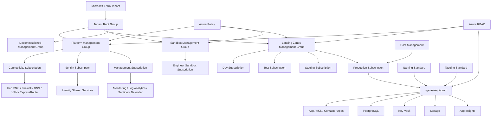

Mental model:

```text
Landing Zone = subscription + network + identity + policy + monitoring + security baseline
Governance = guardrail agar workload tetap aman, konsisten, dan dapat diaudit
```

---

## 3. Decomposition Table - Practical Categories / Domain / Skills

| Area | Skill praktis | Fungsi dalam enterprise Azure |
|---|---|---|
| **1. Landing Zone Mental Model** | Platform landing zone vs application landing zone | Memisahkan shared platform services dari workload aplikasi. Platform biasanya berisi connectivity, identity, dan management; application landing zone menampung aplikasi bisnis. ([Microsoft Learn](https://learn.microsoft.com/en-us/azure/cloud-adoption-framework/ready/landing-zone/?utm_source=chatgpt.com)) |
| **2. Management Group Hierarchy** | Membuat struktur management group untuk platform, landing zones, sandbox, prod, non-prod | Management group dipakai untuk mengorganisasi subscription ke dalam hierarchy sehingga policy dan access management bisa diterapkan konsisten lintas subscription. ([Microsoft Learn](https://learn.microsoft.com/en-us/azure/governance/management-groups/overview?utm_source=chatgpt.com)) |
| **3. Subscription Strategy** | Memisahkan subscription berdasarkan environment, workload, platform function, compliance, dan scale | Subscription adalah boundary penting untuk scale, quota, cost, governance, security, dan identity control. ([Microsoft Learn](https://learn.microsoft.com/en-us/azure/cloud-adoption-framework/ready/landing-zone/design-area/resource-org-subscriptions?utm_source=chatgpt.com)) |
| **4. Resource Organization** | Menentukan struktur management group, subscription, resource group, resource | Microsoft menyarankan perencanaan resource organization sejak awal agar environment tidak sulit diskalakan ketika jumlah workload meningkat. ([Microsoft Learn](https://learn.microsoft.com/en-us/azure/cloud-adoption-framework/ready/landing-zone/design-area/resource-org?utm_source=chatgpt.com)) |
| **5. Azure Policy** | Policy definition, initiative, assignment, effect, remediation, exemption | Azure Policy memastikan resource state compliant terhadap business rules, terlepas dari siapa yang membuat perubahan. ([Microsoft Learn](https://learn.microsoft.com/en-us/azure/governance/policy/overview?utm_source=chatgpt.com)) |
| **6. Policy Initiative** | Mengelompokkan beberapa policy menjadi satu baseline | Initiative menyederhanakan assignment dan management karena beberapa policy terkait bisa dikelola sebagai satu unit. ([Microsoft Learn](https://learn.microsoft.com/en-us/azure/governance/policy/concepts/initiative-definition-structure?utm_source=chatgpt.com)) |
| **7. Policy Effect** | Audit, deny, modify, append, deployIfNotExists, disabled | Effect menentukan apa yang terjadi saat resource match dengan rule policy. ([Microsoft Learn](https://learn.microsoft.com/en-us/azure/governance/policy/concepts/effect-basics?utm_source=chatgpt.com)) |
| **8. Policy Remediation** | Remediate resource non-compliant, terutama untuk `deployIfNotExists` dan `modify` | Remediation dipakai untuk memperbaiki resource yang tidak compliant terhadap policy tertentu. ([Microsoft Learn](https://learn.microsoft.com/en-us/azure/governance/policy/how-to/remediate-resources?utm_source=chatgpt.com)) |
| **9. Policy Exemption** | Temporary waiver untuk resource/scope tertentu | Exemption memungkinkan hierarchy atau individual resource dikecualikan dari evaluasi policy, namun tetap dihitung dalam overall compliance. ([Microsoft Learn](https://learn.microsoft.com/en-us/azure/governance/policy/concepts/exemption-structure?utm_source=chatgpt.com)) |
| **10. Azure RBAC Governance** | Role assignment di management group, subscription, resource group, resource | RBAC mengatur user action, sedangkan Azure Policy mengatur resource state. Keduanya saling melengkapi untuk full scope control. ([Microsoft Learn](https://learn.microsoft.com/en-us/azure/governance/policy/overview?utm_source=chatgpt.com)) |
| **11. Naming Convention** | Format nama resource, region code, environment code, workload code, instance number | Naming convention membantu resource mudah diidentifikasi berdasarkan type, workload, environment, dan region. ([Microsoft Learn](https://learn.microsoft.com/en-us/azure/cloud-adoption-framework/ready/azure-best-practices/resource-naming?utm_source=chatgpt.com)) |
| **12. Naming Restrictions** | Valid character, length, uniqueness, case sensitivity per resource type | Azure resource punya naming rules berbeda per resource provider; storage account, Key Vault, App Service, PostgreSQL, dan resource group tidak selalu punya constraint yang sama. ([Microsoft Learn](https://learn.microsoft.com/en-us/azure/azure-resource-manager/management/resource-name-rules?utm_source=chatgpt.com)) |
| **13. Resource Abbreviation** | `rg`, `kv`, `st`, `acr`, `appi`, `vnet`, `nsg`, `agw`, `aks` | Microsoft menyediakan abbreviation recommendation untuk banyak Azure resource agar naming lebih konsisten. ([Microsoft Learn](https://learn.microsoft.com/en-us/azure/cloud-adoption-framework/ready/azure-best-practices/resource-abbreviations?utm_source=chatgpt.com)) |
| **14. Tagging Strategy** | Mandatory tag, cost tag, ownership tag, lifecycle tag, compliance tag | Tagging mendukung cost management, governance, dan automation lintas Azure environment. ([Microsoft Learn](https://learn.microsoft.com/en-us/azure/cloud-adoption-framework/ready/azure-best-practices/resource-tagging?utm_source=chatgpt.com)) |
| **15. Tag Enforcement** | Require tag, inherit tag, append tag, modify tag via Azure Policy | Tags bisa diterapkan pada resource, resource group, dan subscription, tetapi tidak pada management group. ([Microsoft Learn](https://learn.microsoft.com/en-us/azure/azure-resource-manager/management/tag-resources?utm_source=chatgpt.com)) |
| **16. Cost Governance** | Budget, cost center, owner tag, idle resource cleanup, SKU restriction | Landing zone governance best practice mencakup tracking cost sejak landing zone pertama dan mendefinisikan naming/tagging strategy. ([Microsoft Learn](https://learn.microsoft.com/en-us/azure/cloud-adoption-framework/ready/considerations/landing-zone-governance?utm_source=chatgpt.com)) |
| **17. Environment Separation** | Sandbox, dev, test, staging, prod, shared/platform | Pemisahan environment mengurangi blast radius, memudahkan RBAC, cost attribution, dan policy enforcement. Subscription sering menjadi boundary natural untuk separation ini. ([Microsoft Learn](https://learn.microsoft.com/en-us/azure/cloud-adoption-framework/ready/landing-zone/design-area/resource-org-subscriptions?utm_source=chatgpt.com)) |
| **18. Platform Guardrail** | Deny public endpoint, allowed location, required private endpoint, allowed SKU, Defender baseline | Guardrail memastikan resource yang dibuat engineer tetap sesuai aturan organisasi, bukan hanya mengikuti dokumentasi manual. Azure Policy adalah mekanisme utama untuk ini. ([Microsoft Learn](https://learn.microsoft.com/en-us/azure/governance/policy/overview?utm_source=chatgpt.com)) |

---

## 4. Landing Zone: Apa yang Sebenarnya Disiapkan?

Landing zone bukan hanya subscription kosong. Landing zone yang baik minimal punya:

```text
1. Subscription placement
2. RBAC baseline
3. Policy baseline
4. Network baseline
5. Logging / monitoring baseline
6. Security baseline
7. Naming and tagging standard
8. Cost ownership model
9. Deployment/IaC standard
10. Exception process
```

Azure Landing Zone reference architecture menunjukkan subscription di bawah **Platform** management group untuk shared platform services, dan subscription di bawah **Landing zone** management group untuk application landing zones. ([Microsoft Learn](https://learn.microsoft.com/en-us/azure/cloud-adoption-framework/ready/landing-zone/?utm_source=chatgpt.com))

---

## 5. Platform Landing Zone vs Application Landing Zone

| Jenis | Isi utama | Siapa biasanya mengelola | Contoh resource |
|---|---|---|---|
| **Platform Landing Zone** | Shared infrastructure untuk banyak workload | Platform/cloud team | Hub VNet, firewall, DNS, VPN, ExpressRoute, monitoring, security tooling |
| **Application Landing Zone** | Tempat workload aplikasi berjalan | Product/application team | App Service, AKS namespace/workload, Container Apps, PostgreSQL, Storage, Key Vault |
| **Sandbox Landing Zone** | Eksperimen terbatas | Engineer/dev team | Temporary resource, POC, lab |
| **Decommissioned** | Subscription/resource lama yang sedang retired | Platform/ops | Resource read-only, archive, teardown queue |

Pemisahan ini penting karena shared network/security/monitoring tidak seharusnya dikelola dengan lifecycle yang sama seperti aplikasi bisnis. Microsoft juga menjelaskan bahwa platform management group biasanya menampung shared services, sedangkan landing zone management group menampung application landing zones. ([Microsoft Learn](https://learn.microsoft.com/en-us/azure/cloud-adoption-framework/ready/landing-zone/?utm_source=chatgpt.com))

---

## 6. Management Group Design

Contoh hierarchy yang umum:

```text
Tenant Root Group
  ├── Platform
  │   ├── Connectivity
  │   ├── Identity
  │   └── Management
  │
  ├── Landing Zones
  │   ├── Corp
  │   └── Online
  │
  ├── Sandbox
  │
  └── Decommissioned
```

Management group sebaiknya dipakai saat organisasi memiliki banyak subscription dan perlu unified policy/access management. Microsoft menyatakan management group memberikan struktur penting saat jumlah subscription meningkat. ([Microsoft Learn](https://learn.microsoft.com/en-us/azure/cloud-adoption-framework/ready/landing-zone/design-area/resource-org-management-groups?utm_source=chatgpt.com))

### Prinsip praktis

| Prinsip | Penjelasan |
|---|---|
| Jangan terlalu datar | Sulit menerapkan policy berbeda antara prod, non-prod, sandbox |
| Jangan terlalu dalam | Inheritance RBAC/policy sulit dipahami |
| Pisahkan platform dan application | Menghindari campur lifecycle dan ownership |
| Pisahkan sandbox | Agar eksperimen tidak mencemari baseline production |
| Gunakan policy inheritance | Policy global diterapkan di atas, exception diatur hati-hati |

---

## 7. Subscription Strategy

Subscription adalah boundary yang kuat. Jangan hanya berpikir “satu company satu subscription”.

Subscription bisa dipisahkan berdasarkan:

| Pola pemisahan | Kapan dipakai |
|---|---|
| **By environment** | Dev, test, staging, prod perlu isolation kuat |
| **By workload/domain** | Aplikasi besar dengan owner dan cost center berbeda |
| **By platform function** | Connectivity, identity, management, security |
| **By regulatory boundary** | Workload dengan data classification/compliance berbeda |
| **By scale/quota** | Resource banyak dan butuh limit/quota terpisah |
| **By blast radius** | Production critical workload perlu dipisah dari workload biasa |

Microsoft menegaskan subscription berfungsi sebagai boundary untuk scale, quota, cost, governance, security, dan identity controls. ([Microsoft Learn](https://learn.microsoft.com/en-us/azure/cloud-adoption-framework/ready/landing-zone/design-area/resource-org-subscriptions?utm_source=chatgpt.com))

### Contoh subscription layout

```text
sub-platform-connectivity-prod
sub-platform-management-prod
sub-platform-identity-prod

sub-regulatory-apps-dev
sub-regulatory-apps-test
sub-regulatory-apps-prod

sub-data-platform-dev
sub-data-platform-prod

sub-sandbox-engineering
```

---

## 8. Resource Group Strategy

Resource group sebaiknya mengikuti lifecycle dan ownership aplikasi.

Contoh untuk aplikasi Java/Jersey:

```text
sub-regulatory-apps-prod
  └── rg-case-api-prod-sea-001
        ├── Container App / App Service / AKS-related resource
        ├── Key Vault reference/config resource
        ├── Application Insights
        ├── Private Endpoint
        ├── Storage Account
        └── Diagnostic settings
```

Resource group buruk:

```text
rg-prod
  ├── semua aplikasi
  ├── semua database
  ├── semua storage
  ├── semua monitoring
  └── semua secret
```

Masalahnya: RBAC terlalu luas, cost attribution buruk, deletion risk tinggi, dan IaC sulit dipisah.

---

## 9. Azure Policy Mental Model

Azure Policy bukan RBAC. Perbedaannya:

| Azure RBAC | Azure Policy |
|---|---|
| Mengatur **siapa boleh melakukan action** | Mengatur **resource state harus seperti apa** |
| User/action oriented | Resource/configuration oriented |
| Contoh: boleh create Storage Account | Contoh: Storage Account harus private |
| Kalau tidak punya permission, action ditolak | Kalau resource tidak compliant, create/update bisa diaudit/ditolak/dimodifikasi |

Microsoft menjelaskan bahwa Azure Policy mengevaluasi resource properties, sedangkan Azure RBAC fokus pada user actions di scope tertentu. Bahkan jika user punya akses melakukan action, Azure Policy tetap bisa memblokir create/update jika hasilnya non-compliant. ([Microsoft Learn](https://learn.microsoft.com/en-us/azure/governance/policy/overview?utm_source=chatgpt.com))

---

## 10. Policy Layering Strategy

Policy sebaiknya berlapis:

```text
Tenant Root / Top Management Group
  - global security baseline
  - allowed regions
  - required tags
  - deny high-risk resource types

Platform Management Group
  - connectivity policy
  - firewall / DNS / logging policy
  - shared service policy

Landing Zones Management Group
  - workload policy baseline
  - private endpoint requirements
  - monitoring requirement

Production Management Group / Subscription
  - stricter SKU
  - stricter network
  - stricter diagnostic setting
  - stricter Defender/security baseline

Sandbox
  - cost cap
  - allowed small SKU
  - deny production data exposure
```

Azure Landing Zone design principles menekankan penggunaan management group hierarchy yang jelas agar subscription bisa dioperasikan, diamankan, dan digovern secara efektif pada skala besar. ([Microsoft Learn](https://learn.microsoft.com/en-us/azure/cloud-adoption-framework/ready/landing-zone/design-principles?utm_source=chatgpt.com))

---

## 11. Policy Examples untuk Software Engineer

| Policy | Scope umum | Effect | Dampak praktis |
|---|---|---|---|
| Require `owner` tag | Landing Zones | Deny / Modify | Resource tanpa owner tidak lolos |
| Require `costCenter` tag | Landing Zones | Deny / Modify | Cost bisa ditelusuri |
| Allowed locations | Management Group | Deny | Resource hanya di region approved |
| Deny public IP | Production | Deny | Mencegah exposure sembarangan |
| Require private endpoint for PaaS | Production | Audit / Deny | DB/storage/key vault tidak public |
| Enforce diagnostic settings | Production | DeployIfNotExists | Logs otomatis dikirim ke workspace |
| Restrict VM SKU | Sandbox/Dev | Deny | Mencegah biaya membengkak |
| Audit insecure TLS | Landing Zones | Audit | Menemukan resource dengan TLS lemah |
| Deny resource type | Sandbox/Dev | Deny | Layanan mahal/berisiko tidak bisa dibuat |
| Require Defender plan | Platform/Prod | DeployIfNotExists | Security posture baseline |

Azure Policy effect menentukan apa yang terjadi saat rule match; ini mencakup pola seperti audit, deny, modify, dan deployIfNotExists. ([Microsoft Learn](https://learn.microsoft.com/en-us/azure/governance/policy/concepts/effect-basics?utm_source=chatgpt.com))

---

## 12. Policy Initiative

Jangan assign 50 policy satu-satu. Kelompokkan dalam **initiative**.

Contoh initiative:

```text
initiative: regulatory-prod-baseline
  - allowed locations
  - required tags
  - deny public IP
  - enforce diagnostic settings
  - audit private endpoint missing
  - audit insecure TLS
  - restrict expensive SKU
```

Initiative adalah kumpulan policy definitions yang dikelompokkan untuk satu tujuan, sehingga assignment dan management lebih sederhana. ([Microsoft Learn](https://learn.microsoft.com/en-us/azure/governance/policy/concepts/initiative-definition-structure?utm_source=chatgpt.com))

---

## 13. Exemption dan Exception Process

Policy terlalu kaku tanpa exception process akan membuat tim bypass governance secara informal. Policy terlalu longgar akan kehilangan fungsi.

Gunakan exemption untuk kasus:

| Kasus | Contoh |
|---|---|
| Temporary waiver | Aplikasi legacy butuh public endpoint sementara |
| Migration window | Resource belum compliant selama migrasi |
| Business exception | Region tertentu belum support service yang dibutuhkan |
| Technical limitation | Service belum mendukung private endpoint |
| Break-glass | Emergency restore/recovery |

Azure Policy exemption memungkinkan resource hierarchy atau individual resource dikecualikan dari evaluasi initiative/definition, dan exemption dapat berfungsi sebagai temporary waiver. ([Microsoft Learn](https://learn.microsoft.com/en-us/azure/governance/policy/concepts/exemption-structure?utm_source=chatgpt.com))

Template exception yang sehat:

```text
Exception request:
  - Resource/scope
  - Policy yang dilanggar
  - Business justification
  - Risk assessment
  - Compensating control
  - Expiry date
  - Owner
  - Approval
```

---

## 14. Naming Convention

Naming convention harus membantu engineer menjawab cepat:

```text
Resource ini apa?
Milik aplikasi apa?
Environment apa?
Region mana?
Instance ke berapa?
```

Format umum:

```text
<resource-type>-<workload>-<env>-<region>-<instance>
```

Contoh:

```text
rg-case-api-prod-sea-001
kv-case-api-prod-sea-001
appi-case-api-prod-sea-001
aks-case-prod-sea-001
acrplatformprodsea001
stcaseprodsea001
psql-case-prod-sea-001
```

Microsoft merekomendasikan naming convention yang konsisten agar resource mudah diidentifikasi berdasarkan type, workload, environment, dan region. ([Microsoft Learn](https://learn.microsoft.com/en-us/azure/cloud-adoption-framework/ready/azure-best-practices/resource-naming?utm_source=chatgpt.com))

---

## 15. Resource Abbreviation Practical Table

| Resource | Abbreviation umum | Contoh |
|---|---:|---|
| Resource Group | `rg` | `rg-case-api-prod-sea-001` |
| Virtual Network | `vnet` | `vnet-hub-prod-sea-001` |
| Subnet | `snet` | `snet-app-prod-sea-001` |
| Network Security Group | `nsg` | `nsg-app-prod-sea-001` |
| Application Gateway | `agw` | `agw-public-prod-sea-001` |
| Key Vault | `kv` | `kv-case-prod-sea-001` |
| Storage Account | `st` | `stcaseprodsea001` |
| Azure Container Registry | `acr` | `acrplatformprodsea001` |
| Application Insights | `appi` | `appi-case-api-prod-sea-001` |
| Log Analytics Workspace | `log` / `law` | `law-platform-prod-sea-001` |
| Azure Kubernetes Service | `aks` | `aks-app-prod-sea-001` |
| PostgreSQL Server | `psql` | `psql-case-prod-sea-001` |
| Service Bus Namespace | `sb` | `sb-case-prod-sea-001` |
| Event Hubs Namespace | `evhns` | `evhns-integration-prod-sea-001` |
| Managed Identity | `id` / `mi` | `mi-case-api-prod-sea-001` |

Microsoft menyediakan daftar abbreviation recommendation untuk banyak resource Azure, tetapi tetap perlu disesuaikan dengan standard internal organisasi. ([Microsoft Learn](https://learn.microsoft.com/en-us/azure/cloud-adoption-framework/ready/azure-best-practices/resource-abbreviations?utm_source=chatgpt.com))

---

## 16. Naming Restriction - Jangan Samakan Semua Resource

Beberapa resource punya aturan unik.

| Resource | Risiko naming |
|---|---|
| **Storage Account** | Harus lowercase, global unique, tanpa dash |
| **Key Vault** | Nama global unique dan menjadi bagian endpoint |
| **App Service** | Nama memengaruhi default hostname |
| **PostgreSQL Flexible Server** | Nama menjadi bagian endpoint |
| **Resource Group** | Lebih fleksibel dibanding resource lain |
| **AKS** | Nama cluster perlu stabil karena sering masuk automation/runbook |
| **ACR** | Nama registry menjadi login server |

Microsoft memiliki dokumen khusus untuk naming rules dan restrictions per resource provider; resource dan resource group names umumnya case-insensitive kecuali dinyatakan berbeda pada kolom valid characters. ([Microsoft Learn](https://learn.microsoft.com/en-us/azure/azure-resource-manager/management/resource-name-rules?utm_source=chatgpt.com))

---

## 17. Tagging Strategy

Tagging harus menjawab tiga hal:

```text
Siapa pemilik resource?
Untuk apa resource ini?
Bagaimana cost dan compliance resource ini dilacak?
```

Tag minimum yang saya sarankan:

| Tag | Contoh | Tujuan |
|---|---|---|
| `app` | `case-management` | Aplikasi/workload |
| `env` | `dev`, `test`, `stg`, `prod` | Environment |
| `owner` | `case-platform-team` | Tim pemilik |
| `costCenter` | `regulatory-tech` | Cost attribution |
| `businessUnit` | `compliance` | Business ownership |
| `criticality` | `low`, `medium`, `high`, `mission-critical` | Operational priority |
| `dataClassification` | `public`, `internal`, `confidential`, `restricted` | Security/compliance |
| `managedBy` | `terraform`, `bicep`, `manual` | Deployment ownership |
| `lifecycle` | `active`, `temporary`, `decommissioning` | Cleanup/governance |
| `backupRequired` | `true`, `false` | Recovery policy |

Microsoft menjelaskan tagging strategy sebagai cara mendukung cost management, governance, dan automation across Azure environment. ([Microsoft Learn](https://learn.microsoft.com/en-us/azure/cloud-adoption-framework/ready/azure-best-practices/resource-tagging?utm_source=chatgpt.com))

---

## 18. Tag Inheritance & Enforcement

Masalah umum: engineer lupa menambahkan tag. Solusinya bukan reminder manual, tetapi policy.

Pola enforcement:

| Policy | Fungsi |
|---|---|
| Require tag on resource group | Resource group harus punya tag utama |
| Require tag on resource | Resource harus punya tag tertentu |
| Inherit tag from resource group | Resource otomatis mengambil tag dari RG |
| Append missing tag | Tag ditambahkan saat create/update |
| Deny if missing tag | Resource tidak bisa dibuat tanpa tag |
| Audit invalid tag value | Tag salah value masuk compliance report |

Azure mendukung tag pada resources, resource groups, dan subscriptions, tetapi tidak pada management groups. Tag dapat membantu logical organization dan cost tracking. ([Microsoft Learn](https://learn.microsoft.com/en-us/azure/azure-resource-manager/management/tag-resources?utm_source=chatgpt.com))

---

## 19. Governance untuk Cost

Cost governance tidak cukup dengan “lihat bill akhir bulan”. Guardrail cost harus dipasang sejak resource dibuat.

Checklist cost governance:

```text
1. Mandatory costCenter tag
2. Mandatory owner tag
3. Budget alert per subscription/resource group
4. Allowed SKU policy untuk sandbox/dev
5. Log retention policy
6. Idle resource cleanup
7. Review unattached disk/public IP
8. Review expensive PaaS tier
9. Review cross-region traffic
10. Review backup retention
```

Landing zone governance best practice dari Microsoft mencakup defining naming/tagging strategy dan tracking cost sejak landing zone pertama. ([Microsoft Learn](https://learn.microsoft.com/en-us/azure/cloud-adoption-framework/ready/considerations/landing-zone-governance?utm_source=chatgpt.com))

---

## 20. Governance untuk Production Java/Jersey Microservice

Contoh workload:

```text
case-management-api
  runtime: Java 17 + Jersey
  database: PostgreSQL
  deploy: Container Apps / AKS
  secrets: Key Vault
  async: Service Bus
  observability: Application Insights + Log Analytics
```

Governance baseline:

| Layer | Guardrail |
|---|---|
| Subscription | Prod subscription terpisah dari dev/test |
| Resource Group | RG per workload/env |
| RBAC | Developer Reader di prod, Contributor di dev |
| Identity | Runtime pakai managed identity/workload identity |
| Secret | Secret di Key Vault, bukan di repo/env plain |
| Network | DB/Key Vault/Storage private endpoint |
| Policy | Deny public IP dan require tags |
| Logging | Diagnostic settings aktif |
| Cost | Mandatory `costCenter`, budget alert |
| Deployment | IaC + CI/CD approval |
| Exception | Waiver dengan expiry date |

---

## 21. Governance Decision Matrix

| Keputusan | Pertanyaan | Rekomendasi default |
|---|---|---|
| Subscription | Apakah workload prod/critical? | Pisahkan prod dari non-prod |
| Resource group | Apakah resource punya lifecycle sama? | RG per app + env |
| RBAC | Apakah akses terlalu luas? | Scope terkecil yang cukup |
| Policy | Apakah rule perlu enforce atau audit dulu? | Audit dulu untuk existing, deny untuk new high-risk |
| Tagging | Apakah cost/owner harus jelas? | Enforce mandatory tag |
| Naming | Apakah resource mudah dicari? | Gunakan convention konsisten |
| Exception | Apakah rule bisa dilanggar? | Boleh, tapi wajib expiry dan approval |
| Sandbox | Apakah engineer butuh eksperimen? | Sandbox dengan cost/SKU guardrail |
| Production | Apakah access permanen? | Gunakan least privilege dan time-bound privileged access jika tersedia |
| IaC | Apakah resource boleh manual? | Production harus IaC-managed |

---

## 22. Anti-pattern Governance

| Anti-pattern | Dampak |
|---|---|
| Semua aplikasi dalam satu subscription | Cost, quota, RBAC, dan blast radius bercampur |
| Semua resource production dalam satu RG | Lifecycle dan ownership tidak jelas |
| Tidak ada mandatory tag | Cost attribution gagal |
| Policy hanya dokumentasi, tidak enforced | Resource drift tetap terjadi |
| Semua policy langsung `deny` tanpa audit phase | Banyak deployment mendadak gagal |
| Tidak ada exception process | Tim bypass lewat jalur informal |
| Naming tidak konsisten | Incident response lambat |
| Sandbox tanpa budget/SKU limit | Biaya meledak |
| Production access permanen dan luas | Security risk tinggi |
| Resource manual di prod | IaC drift dan rollback sulit |

---

## 23. Practical Onboarding Questions

Saat masuk project Azure existing, tanyakan ini:

### A. Landing zone

```text
1. Subscription aplikasi ini berada di management group mana?
2. Ini application landing zone atau platform subscription?
3. Ada reference architecture internal?
4. Ada landing zone baseline yang sudah diterapkan?
```

### B. Governance

```text
1. Policy initiative apa yang aktif?
2. Policy mana yang deny, audit, modify, deployIfNotExists?
3. Bagaimana cara request exemption?
4. Apakah policy berlaku sama untuk dev/test/prod?
```

### C. Access

```text
1. Group apa yang memberi akses developer?
2. Role saya di dev/test/prod apa?
3. Siapa yang bisa approve production access?
4. Apakah access production time-bound?
```

### D. Naming & tagging

```text
1. Naming convention resmi apa?
2. Region abbreviation yang dipakai apa?
3. Tag mandatory apa saja?
4. Apakah tag inherited dari subscription/RG?
```

### E. Cost

```text
1. Cost dilihat per subscription, RG, atau tag?
2. Budget alert dikirim ke siapa?
3. Apakah dev/test punya auto-shutdown/cleanup?
4. Log retention default berapa lama?
```

---

## 24. Mini Lab - Inspect Governance Existing

### 24.1 Lihat subscription aktif

```bash
az account show --output table
```

### 24.2 Lihat management group yang tersedia

```bash
az account management-group list --output table
```

### 24.3 Lihat resource group dan location

```bash
az group list \
  --query "[].{name:name, location:location, tags:tags}" \
  --output table
```

### 24.4 Lihat resource dalam RG

```bash
az resource list \
  --resource-group "<resource-group-name>" \
  --query "[].{name:name, type:type, location:location}" \
  --output table
```

### 24.5 Lihat tags resource group

```bash
az group show \
  --name "<resource-group-name>" \
  --query tags
```

### 24.6 Lihat policy assignment di subscription

```bash
az policy assignment list \
  --scope "/subscriptions/<subscription-id>" \
  --query "[].{name:name, displayName:displayName, enforcementMode:enforcementMode}" \
  --output table
```

### 24.7 Lihat compliance state

```bash
az policy state summarize \
  --subscription "<subscription-id>"
```

### 24.8 Lihat role assignment pada RG

```bash
az role assignment list \
  --resource-group "<resource-group-name>" \
  --output table
```

Yang dicari dari lab ini:

```text
1. Apakah resource punya tag lengkap?
2. Apakah naming konsisten?
3. Apakah policy aktif?
4. Apakah role assignment terlalu luas?
5. Apakah resource prod berada di subscription/RG yang tepat?
6. Apakah location sesuai allowed region?
```

---

## 25. Practical Baseline untuk Tim Software Engineering

Minimal baseline untuk tim backend/microservice:

```text
Subscription:
  - dev/test/prod terpisah atau minimal RG/env terpisah dengan policy jelas

Resource Group:
  - satu RG per app per environment

Naming:
  - <type>-<app>-<env>-<region>-<instance>

Tags:
  - app
  - env
  - owner
  - costCenter
  - criticality
  - dataClassification
  - managedBy

Policy:
  - allowed regions
  - required tags
  - deny public IP for prod
  - audit/deny public access for PaaS
  - enforce diagnostic settings
  - restrict expensive SKU in sandbox/dev

RBAC:
  - developer Contributor only in dev
  - developer Reader in prod
  - pipeline identity per environment
  - runtime identity per app

Exception:
  - every exception has owner + expiry + compensating control
```

---

## 26. Mental Model Final

Pegang model ini:

```text
Landing Zone = prepared cloud environment for workloads

Management Group = governance hierarchy

Subscription = scale + quota + cost + governance + security boundary

Resource Group = workload lifecycle boundary

Azure Policy = resource-state guardrail

Azure RBAC = action/permission guardrail

Naming = human-readable operational identity

Tagging = ownership, cost, automation, compliance metadata

Exemption = controlled exception, not bypass

Governance = membuat hal yang benar menjadi default,
             dan hal yang berbahaya menjadi sulit/tidak bisa dilakukan
```

Untuk senior software engineer, pertanyaan pentingnya bukan hanya:

```text
Apakah aplikasi bisa jalan?
```

Tetapi:

```text
Apakah aplikasi berjalan di landing zone yang benar?
Apakah resource-nya compliant?
Apakah cost-nya bisa ditelusuri?
Apakah aksesnya minimal?
Apakah deployment-nya repeatable?
Apakah exception-nya terkontrol?
Apakah production blast radius-nya terbatas?
```

---

# Status

**Azure Seri 3/18 selesai.**

## Rekomendasi materi berikutnya

**Azure Seri 4 - Azure Networking Core: VNet, Subnet, NSG, Route Table, Private Endpoint, Private DNS, NAT, Firewall, dan Hybrid Connectivity.**

---

**Sources:**

- [What is an Azure landing zone? - Cloud Adoption Framework](https://learn.microsoft.com/en-us/azure/cloud-adoption-framework/ready/landing-zone/?utm_source=chatgpt.com)

## Response:
7/13/2026, 7:59:43 PM

Lanjut ke **Seri 4/18**. Seri ini krusial karena banyak incident Azure berasal dari salah desain network: DNS private endpoint, NSG, route, NAT, firewall, atau koneksi hybrid.

# Azure Seri 4/18 - Azure Networking Core

## 1. Introduction

Azure networking adalah fondasi agar aplikasi Java/Jersey, PostgreSQL, AKS, Container Apps, Key Vault, Storage, dan service integration bisa berkomunikasi secara aman. Banyak masalah production Azure bukan berasal dari Java code, tetapi dari **DNS, route, firewall, NSG, private endpoint, NAT/SNAT, atau koneksi hybrid**.

Mental model utama:

```text
Azure Networking =
  private address space
  + segmentation
  + routing
  + name resolution
  + inbound control
  + outbound control
  + private access to PaaS
  + hybrid connectivity
```

Azure Virtual Network adalah building block utama private network di Azure. VNet memungkinkan Azure resources berkomunikasi secara aman dengan resource lain, internet, dan on-premises network. ([Microsoft Learn](https://learn.microsoft.com/en-us/azure/virtual-network/virtual-networks-overview?utm_source=chatgpt.com))

---

## 2. Diagram - Azure Networking Core Map

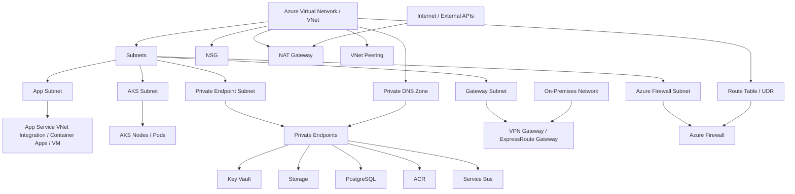

Mental model singkat:

```text
VNet       = private network boundary
Subnet     = segmentation boundary
NSG        = allow/deny traffic boundary
Route      = traffic path decision
Private IP = internal addressability
Private DNS= name-to-private-IP resolution
Private Endpoint = private access to Azure PaaS
NAT Gateway = stable outbound internet path
Firewall   = centralized inspection/control
VPN/ExpressRoute = hybrid connectivity
```

---

## 3. Decomposition Table - Practical Azure Networking Skills

| Area | Skill praktis | Fungsi untuk software engineer |
|---|---|---|
| **1. Virtual Network / VNet** | CIDR planning, address space, peering, subnetting | Foundation private network untuk workload Azure. VNet memungkinkan resource Azure berkomunikasi dengan resource lain, internet, dan on-premises network. ([Microsoft Learn](https://learn.microsoft.com/en-us/azure/virtual-network/virtual-networks-overview?utm_source=chatgpt.com)) |
| **2. Subnet Design** | Pisah subnet app, AKS, private endpoint, gateway, firewall, database integration | Subnet adalah unit penting untuk delegasi, NSG, route table, NAT Gateway, dan service-specific integration. |
| **3. Network Security Group / NSG** | Inbound/outbound allow-deny rule, priority, source/destination, service tag | NSG berisi security rules untuk allow/deny inbound dan outbound traffic ke beberapa jenis Azure resource. ([Microsoft Learn](https://learn.microsoft.com/en-us/azure/virtual-network/network-security-groups-overview?utm_source=chatgpt.com)) |
| **4. Route Table / UDR** | User-defined route, default route, route propagation, forced tunneling | Azure otomatis membuat route table untuk setiap subnet, tetapi UDR dipakai untuk mengarahkan traffic melalui firewall/NVA/gateway. ([Microsoft Learn](https://learn.microsoft.com/en-us/azure/virtual-network/virtual-networks-udr-overview?utm_source=chatgpt.com)) |
| **5. Private Endpoint** | Private IP untuk Azure PaaS, Private Link, disable public access | Private endpoint adalah network interface dengan private IP dari VNet untuk menghubungkan secara privat ke service berbasis Azure Private Link. ([Microsoft Learn](https://learn.microsoft.com/en-us/azure/private-link/private-endpoint-overview?utm_source=chatgpt.com)) |
| **6. Private DNS Zone** | Resolve FQDN service ke private endpoint IP | Private endpoint tanpa DNS yang benar sering menyebabkan aplikasi tetap resolve ke public endpoint atau gagal koneksi. Microsoft menekankan DNS integration sebagai bagian penting private endpoint. ([Microsoft Learn](https://learn.microsoft.com/en-us/azure/private-link/private-endpoint-dns-integration?utm_source=chatgpt.com)) |
| **7. NAT Gateway** | Stable outbound IP, SNAT management, outbound-only internet connectivity | NAT Gateway memungkinkan private resource di subnet mengakses internet tanpa public IP langsung; outbound traffic menggunakan static public IP/prefix milik NAT Gateway. ([Microsoft Learn](https://learn.microsoft.com/en-us/azure/nat-gateway/nat-overview?utm_source=chatgpt.com)) |
| **8. SNAT Port Capacity** | Understand port exhaustion, high outbound connection workloads | Satu public IP NAT Gateway menyediakan 64.512 SNAT ports; NAT Gateway bisa diskalakan dengan beberapa IP sampai lebih dari 1 juta SNAT ports. ([Microsoft Learn](https://learn.microsoft.com/en-us/azure/nat-gateway/nat-gateway-snat?utm_source=chatgpt.com)) |
| **9. Azure Firewall** | Centralized filtering, egress control, forced tunneling, hub-spoke inspection | Azure Firewall dipakai sebagai centralized network security control, terutama di hub-spoke enterprise network. Microsoft juga menyediakan security best practices untuk Azure networking. ([Microsoft Learn](https://learn.microsoft.com/en-us/azure/security/fundamentals/network-best-practices?utm_source=chatgpt.com)) |
| **10. VNet Peering** | Hub-spoke, spoke-to-spoke, cross-region peering | VNet peering menghubungkan dua atau lebih VNet agar tampak sebagai satu network untuk connectivity, dengan traffic melalui Microsoft private backbone. ([Microsoft Learn](https://learn.microsoft.com/en-us/azure/virtual-network/virtual-network-peering-overview?utm_source=chatgpt.com)) |
| **11. VPN Gateway** | Site-to-site VPN, point-to-site VPN, encrypted tunnel | Dipakai untuk koneksi hybrid via internet encrypted tunnel antara Azure VNet dan on-premises network. |
| **12. ExpressRoute** | Private connectivity via provider | ExpressRoute memperluas on-premises network ke Microsoft cloud melalui private connection dengan connectivity provider. ([Microsoft Learn](https://learn.microsoft.com/en-us/azure/expressroute/expressroute-introduction?utm_source=chatgpt.com)) |
| **13. Virtual WAN** | Managed hub, branch connectivity, large-scale network topology | Virtual WAN menyediakan Microsoft-managed virtual hub yang dapat menghubungkan VPN, ExpressRoute, dan user/branch connectivity. ([Microsoft Learn](https://learn.microsoft.com/en-us/azure/virtual-wan/virtual-wan-about?utm_source=chatgpt.com)) |
| **14. PostgreSQL Private Networking** | Private access, private DNS, private endpoint/private link | Azure Database for PostgreSQL private networking bergantung pada private access/private DNS agar database tidak perlu exposed secara public. ([Microsoft Learn](https://learn.microsoft.com/en-us/azure/postgresql/network/concepts-networking-private?utm_source=chatgpt.com)) |
| **15. ACR Private Endpoint** | Private image pull/push path, DNS to private registry endpoint | ACR private endpoint membutuhkan DNS agar registry FQDN seperti `myregistry.azurecr.io` resolve ke private IP. ([Microsoft Learn](https://learn.microsoft.com/en-us/azure/container-registry/container-registry-private-endpoints?utm_source=chatgpt.com)) |
| **16. Hub-Spoke Topology** | Hub for shared network, spokes for apps | Umum untuk enterprise: hub berisi firewall, DNS, VPN/ExpressRoute; spoke berisi workload aplikasi. |
| **17. Network Troubleshooting** | `nslookup`, `dig`, `curl`, `nc`, Network Watcher, route effective, NSG effective rule | Debug network Azure harus dimulai dari DNS → route → firewall/NSG → identity/service config → app timeout. |
| **18. Secure Network Baseline** | Private endpoint, deny public access, restrict outbound, diagnostic logs, NSG minimum | Baseline production harus mengurangi public exposure dan membuat traffic path bisa diaudit. |

---

## 4. VNet - Private Network Boundary

**Virtual Network / VNet** adalah private address space di Azure. Di dalam VNet, Anda membuat subnet dan menaruh resource/endpoint yang perlu berkomunikasi secara privat.

Contoh CIDR:

```text
vnet-regulatory-prod-sea-001
  address space: 10.40.0.0/16
```

Subnet contoh:

```text
10.40.1.0/24   snet-app-prod
10.40.2.0/23   snet-aks-node-prod
10.40.4.0/24   snet-private-endpoint-prod
10.40.5.0/24   snet-firewall-prod
10.40.6.0/27   GatewaySubnet
```

VNet adalah fondasi private networking di Azure dan memberi isolation serta connectivity untuk Azure resources, internet, dan on-premises network. ([Microsoft Learn](https://learn.microsoft.com/en-us/azure/virtual-network/virtual-networks-overview?utm_source=chatgpt.com))

---

## 5. Subnet Design

Subnet bukan hanya pembagian IP. Subnet memengaruhi:

```text
NSG attachment
Route table attachment
NAT Gateway attachment
Private Endpoint placement
Service delegation
AKS node placement
Firewall/gateway placement
```

Contoh desain untuk Java microservice:

| Subnet | Isi | Catatan |
|---|---|---|
| `snet-app-prod` | App Service VNet integration / Container Apps environment / VM app | Untuk app runtime |
| `snet-aks-node-prod` | AKS node pool | Perlu sizing besar karena node/pod/IP consumption |
| `snet-private-endpoint-prod` | Private endpoint untuk Key Vault, Storage, PostgreSQL, ACR | Pisahkan agar mudah govern dan troubleshoot |
| `AzureFirewallSubnet` | Azure Firewall | Nama subnet ini khusus untuk Azure Firewall |
| `GatewaySubnet` | VPN/ExpressRoute Gateway | Nama subnet ini khusus untuk virtual network gateway |
| `snet-build-agent-prod` | Self-hosted runner/agent | Berguna jika CI/CD perlu akses private resource |

Anti-pattern:

```text
Semua resource masuk satu subnet besar.
```

Risikonya:

| Risiko | Dampak |
|---|---|
| NSG terlalu longgar | Semua resource saling terbuka |
| Route sulit dibedakan | Traffic inspection kacau |
| Private endpoint bercampur app runtime | Troubleshooting DNS/IP sulit |
| AKS kehabisan IP | Scaling gagal |
| Tidak bisa delegasi subnet dengan bersih | Service integration bermasalah |

---

## 6. NSG - Network Security Group

NSG adalah firewall rule dasar pada level subnet/NIC. NSG rules mengizinkan atau menolak inbound/outbound traffic berdasarkan source, destination, port, protocol, dan priority. ([Microsoft Learn](https://learn.microsoft.com/en-us/azure/virtual-network/network-security-groups-overview?utm_source=chatgpt.com))

Contoh rule:

| Priority | Direction | Source | Destination | Port | Action |
|---:|---|---|---|---:|---|
| 100 | Inbound | `10.40.1.0/24` | `10.40.2.0/23` | 8080 | Allow |
| 110 | Inbound | `AzureLoadBalancer` | App subnet | Any | Allow |
| 200 | Inbound | Internet | App subnet | Any | Deny |
| 300 | Outbound | App subnet | PostgreSQL private endpoint | 5432 | Allow |
| 310 | Outbound | App subnet | Key Vault private endpoint | 443 | Allow |
| 400 | Outbound | App subnet | Internet | Any | Deny/route via firewall |

Practical invariant:

```text
NSG sebaiknya menjawab:
  subnet ini boleh menerima traffic dari mana?
  subnet ini boleh mengirim traffic ke mana?
  port apa yang benar-benar dibutuhkan?
```

---

## 7. Route Table / UDR

Azure membuat route table default untuk setiap subnet. Namun, Anda bisa menambahkan **user-defined routes / UDR** untuk mengontrol path traffic, misalnya mengarahkan semua outbound internet traffic ke Azure Firewall. ([Microsoft Learn](https://learn.microsoft.com/en-us/azure/virtual-network/virtual-networks-udr-overview?utm_source=chatgpt.com))

Contoh forced egress:

```text
Subnet app:
  0.0.0.0/0 → Azure Firewall private IP
```

Contoh route internal:

```text
10.0.0.0/8 → Virtual Network Gateway / NVA
```

Route table penting untuk:

| Use case | Penjelasan |
|---|---|
| Centralized egress | Semua outbound lewat Azure Firewall |
| Hybrid route | Traffic ke on-prem lewat VPN/ExpressRoute |
| Inspection | Traffic antar subnet/spoke lewat firewall |
| Blocking accidental public route | Menghindari traffic keluar langsung |
| Troubleshooting | Menentukan next hop aktual |

Practical failure mode:

```text
App bisa resolve DNS private endpoint,
tetapi koneksi timeout.
```

Kemungkinan:

```text
DNS benar, tetapi route/NSG/firewall memblokir path.
```

---

## 8. Private Endpoint & Private Link

**Private endpoint** adalah NIC dengan private IP dari VNet Anda yang menghubungkan ke Azure PaaS service melalui Azure Private Link. Dengan private endpoint, service seperti Storage, Key Vault, PostgreSQL, ACR, Service Bus, atau Event Hubs bisa diakses secara privat dari VNet. ([Microsoft Learn](https://learn.microsoft.com/en-us/azure/private-link/private-endpoint-overview?utm_source=chatgpt.com))

Contoh:

```text
VNet: 10.40.0.0/16
Private Endpoint for Key Vault:
  IP: 10.40.4.10
  FQDN: kv-case-prod.vault.azure.net
```

Target production:

```text
App → private DNS → private endpoint IP → Azure PaaS
```

Bukan:

```text
App → public DNS → public endpoint → internet path
```

Manfaat:

| Manfaat | Dampak |
|---|---|
| PaaS punya private IP di VNet | App tidak perlu keluar public internet |
| Public access bisa dimatikan | Mengurangi exposure |
| Traffic lewat Microsoft backbone | Lebih aman dan predictable |
| Cocok untuk compliance | Data/service tidak exposed public |

Untuk Azure Database for PostgreSQL Flexible Server, Private Link memungkinkan traffic antara VNet dan service berjalan melalui Microsoft backbone, sehingga service tidak perlu diekspos ke public internet. ([Microsoft Learn](https://learn.microsoft.com/en-us/azure/postgresql/network/concepts-networking-private-link?utm_source=chatgpt.com))

---

## 9. Private DNS - Bagian yang Sering Dilupakan

Private endpoint hampir selalu perlu **Private DNS Zone** agar FQDN service resolve ke private IP.

Contoh Key Vault:

```text
Public/default:
  kv-case-prod.vault.azure.net → public IP

Dengan private endpoint + private DNS:
  kv-case-prod.vault.azure.net → 10.40.4.10
```

Masalah umum:

```text
Private endpoint sudah dibuat,
tetapi aplikasi tetap connect ke public endpoint.
```

Penyebab paling sering:

```text
Private DNS zone belum dibuat
VNet belum linked ke Private DNS zone
A record tidak ada
Custom DNS/on-prem DNS tidak forward ke Azure private resolver/DNS
```

Microsoft menyebut DNS integration sebagai bagian penting untuk private endpoint connectivity, termasuk skenario VNet, peered VNet, dan on-premises. ([Microsoft Learn](https://learn.microsoft.com/en-us/azure/private-link/private-endpoint-dns-integration?utm_source=chatgpt.com))

---

## 10. Private DNS Zone Pattern

Contoh private DNS zone untuk beberapa service:

| Service | Private DNS zone umum |
|---|---|
| Key Vault | `privatelink.vaultcore.azure.net` |
| Blob Storage | `privatelink.blob.core.windows.net` |
| Azure Container Registry | `privatelink.azurecr.io` |
| PostgreSQL Flexible Server / Private Link | Ikuti dokumentasi networking PostgreSQL sesuai mode |
| Service Bus | `privatelink.servicebus.windows.net` |
| Event Hubs | `privatelink.servicebus.windows.net` |

Untuk ACR, Microsoft menjelaskan bahwa DNS harus dikonfigurasi agar registry FQDN seperti `myregistry.azurecr.io` resolve ke private IP address private endpoint. ([Microsoft Learn](https://learn.microsoft.com/en-us/azure/container-registry/container-registry-private-endpoints?utm_source=chatgpt.com))

Practical check:

```bash
nslookup kv-case-prod.vault.azure.net
```

Expected dari app network:

```text
kv-case-prod.privatelink.vaultcore.azure.net
10.40.4.10
```

Kalau masih public IP, DNS private endpoint belum efektif.

---

## 11. NAT Gateway - Outbound Internet Path

NAT Gateway dipakai untuk memberi outbound internet connectivity dari private subnet dengan static public IP/prefix. Private instances dalam subnet tidak perlu public IP langsung untuk mencapai internet. ([Microsoft Learn](https://learn.microsoft.com/en-us/azure/nat-gateway/nat-overview?utm_source=chatgpt.com))

Contoh:

```text
App subnet
  → NAT Gateway
  → Public IP 20.x.x.x
  → External API / internet
```

Use case:

| Use case | Kenapa NAT Gateway |
|---|---|
| App call external API | External partner bisa allowlist static outbound IP |
| Private VM perlu patch/download | VM tidak butuh public IP |
| Worker call SaaS endpoint | Stable outbound identity |
| Avoid default outbound ambiguity | Egress path explicit |
| Reduce SNAT issue vs ad-hoc outbound | NAT Gateway dirancang untuk scalable outbound |

NAT Gateway tidak menerima unsolicited inbound connection dari internet; ia outbound-only. ([Microsoft Learn](https://learn.microsoft.com/de-de/azure/nat-gateway/nat-overview?utm_source=chatgpt.com))

---

## 12. SNAT Port Exhaustion

SNAT port exhaustion bisa terjadi pada aplikasi yang membuat banyak outbound connection ke destination yang sama, misalnya:

```text
Java service → external REST API
worker → SaaS API
AKS pods → internet endpoint
high concurrency HTTP client tanpa connection pooling
```

NAT Gateway menyediakan 64.512 SNAT ports per public IP dan dapat diskalakan hingga 16 public IP, sehingga totalnya bisa lebih dari 1 juta SNAT ports. ([Microsoft Learn](https://learn.microsoft.com/en-us/azure/nat-gateway/nat-gateway-snat?utm_source=chatgpt.com))

Namun jangan hanya menambah IP. Dari sisi aplikasi Java:

```text
Gunakan HTTP connection pooling.
Set timeout.
Set max connection per route.
Reuse connection.
Hindari membuat client baru per request.
Gunakan backoff/retry dengan batas.
```

Microsoft juga merekomendasikan Private Link saat memungkinkan untuk koneksi ke Azure PaaS agar SNAT inventory tidak terpakai dan risiko SNAT exhaustion berkurang. ([Microsoft Learn](https://learn.microsoft.com/en-us/azure/nat-gateway/nat-gateway-design?utm_source=chatgpt.com))

---

## 13. VNet Peering

VNet peering menghubungkan dua atau lebih VNet sehingga bisa berkomunikasi melalui Microsoft private backbone dan tampak seperti satu network untuk connectivity. ([Microsoft Learn](https://learn.microsoft.com/en-us/azure/virtual-network/virtual-network-peering-overview?utm_source=chatgpt.com))

Contoh hub-spoke:

```text
vnet-hub-prod
  - Azure Firewall
  - VPN/ExpressRoute
  - DNS resolver

vnet-case-prod
  - app workload

vnet-data-prod
  - data workload

Peering:
  hub ↔ case
  hub ↔ data
```

Catatan penting:

| Hal | Penjelasan |
|---|---|
| Peering tidak transitive by default | Spoke A tidak otomatis reach Spoke B via Hub kecuali route/firewall didesain |
| CIDR tidak boleh overlap | Address space overlap membuat routing tidak valid |
| DNS tetap harus diatur | Peering tidak otomatis menyelesaikan semua DNS private endpoint |
| UDR sering diperlukan | Untuk forced routing via firewall |
| Cost/latency perlu diperhatikan | Cross-region peering punya implikasi biaya/latency |

---

## 14. Hub-Spoke Network

Hub-spoke umum di enterprise Azure.

```text
Hub VNet:
  - Azure Firewall
  - VPN Gateway / ExpressRoute Gateway
  - DNS resolver/forwarder
  - Bastion / shared services
  - Log/security integration

Spoke VNet:
  - application workload
  - AKS/App Service/Container Apps integration
  - private endpoints
```

Kenapa hub-spoke:

| Alasan | Dampak |
|---|---|
| Centralized security | Egress/inbound inspection konsisten |
| Shared hybrid connectivity | Tidak setiap app perlu VPN sendiri |
| DNS centralization | Private DNS lebih governable |
| Network isolation | Spoke per workload/domain/env |
| Easier compliance | Policy dan routing lebih standard |

---

## 15. VPN Gateway, ExpressRoute, Virtual WAN

### VPN Gateway

Dipakai untuk koneksi encrypted tunnel lewat internet, misalnya site-to-site dari kantor/data center ke Azure VNet.

### ExpressRoute

ExpressRoute memperluas jaringan on-premises ke Microsoft cloud lewat private connection dengan connectivity provider, bukan public internet biasa. ([Microsoft Learn](https://learn.microsoft.com/en-us/azure/expressroute/expressroute-introduction?utm_source=chatgpt.com))

### Virtual WAN

Virtual WAN menyediakan Microsoft-managed virtual hub yang bisa menghubungkan VPN, ExpressRoute, dan branch/user connectivity dalam satu architecture managed. ([Microsoft Learn](https://learn.microsoft.com/en-us/azure/virtual-wan/virtual-wan-about?utm_source=chatgpt.com))

Decision sederhana:

| Kebutuhan | Pilihan umum |
|---|---|
| Hybrid kecil/awal | Site-to-site VPN |
| Hybrid production dengan latency/predictability lebih baik | ExpressRoute |
| Banyak branch/site/global network | Virtual WAN |
| Hub-spoke manual dan kontrol tinggi | VNet hub-spoke + gateways/firewall |
| Temporary dev connection | VPN/P2S sesuai governance |

---

## 16. Azure Firewall vs NSG vs Application Gateway

| Komponen | Layer/purpose | Digunakan untuk |
|---|---|---|
| **NSG** | L3/L4 subnet/NIC filtering | Basic allow/deny antar subnet/resource |
| **Azure Firewall** | Centralized network firewall | Egress filtering, threat intel, forced tunneling, centralized inspection |
| **Application Gateway** | L7 HTTP/S reverse proxy/load balancer | HTTP routing, TLS termination, WAF, path/host routing |
| **Azure Front Door** | Global edge entry point | Global HTTP/S routing, WAF, acceleration |
| **NAT Gateway** | Outbound SNAT | Static outbound internet IP tanpa inbound exposure |

NSG bukan pengganti API gateway. Azure Firewall bukan pengganti app-level authorization. NAT Gateway bukan security inspection firewall. Application Gateway bukan general outbound firewall.

---

## 17. Azure Networking untuk Java/Jersey Microservice

Contoh workload:

```text
case-api
  Java 17 + Jersey
  MyBatis
  PostgreSQL Flexible Server
  Key Vault
  Blob Storage
  Service Bus
  ACR
  Runtime: AKS / Container Apps / App Service
```

Target network:

```text
case-api
  → Key Vault via private endpoint : 443
  → PostgreSQL via private/private link : 5432
  → Blob Storage via private endpoint : 443
  → Service Bus via private endpoint : 443/AMQP over TLS
  → ACR via private endpoint : 443
  → external partner API via NAT Gateway/Azure Firewall
```

Checklist:

| Dependency | Preferred path |
|---|---|
| Key Vault | Private endpoint + private DNS |
| PostgreSQL | Private access/private endpoint + private DNS |
| Blob Storage | Private endpoint + disable public access where possible |
| Service Bus | Private endpoint if internal-only |
| ACR | Private endpoint for private image pull from controlled network |
| External API | NAT Gateway or Azure Firewall with static egress |
| On-prem API | VPN/ExpressRoute route |
| Internal microservice | Private VNet/Ingress/service mesh/API gateway pattern |

---

## 18. PostgreSQL Networking Pattern

Untuk Azure Database for PostgreSQL Flexible Server, perhatikan:

```text
network mode
private access / private endpoint
private DNS
firewall/public access
TLS
connection pooling
route from app runtime
```

Azure Private DNS dapat mengelola dan resolve domain name dalam VNet tanpa custom DNS solution untuk private networking scenario PostgreSQL. ([Microsoft Learn](https://learn.microsoft.com/en-us/azure/postgresql/network/concepts-networking-private?utm_source=chatgpt.com))

Failure modes:

| Symptom | Kemungkinan penyebab |
|---|---|
| `connection timeout` | Route/NSG/firewall salah |
| `could not translate host name` | DNS private zone/link salah |
| `no pg_hba.conf entry` / auth issue | Bukan network murni; cek DB auth/TLS/firewall |
| Works from laptop, fails from app | Laptop pakai public path/VPN, app pakai private path |
| Works in dev, fails in prod | Private DNS/link/route berbeda antar env |

---

## 19. AKS Networking Consideration

Untuk AKS, network planning lebih rumit karena perlu memikirkan:

```text
node subnet size
pod IP allocation model
service CIDR
DNS service IP
ingress
egress
private cluster
private endpoint access
ACR pull path
network policy
```

Pertanyaan wajib:

| Pertanyaan | Kenapa penting |
|---|---|
| Apakah cluster private? | API server exposure |
| Pod IP diambil dari VNet atau overlay? | IP planning |
| Egress lewat NAT Gateway atau firewall? | Static outbound dan inspection |
| Ingress via internal atau public load balancer? | Exposure boundary |
| ACR access private atau public? | Supply chain/network control |
| Private DNS terhubung ke cluster VNet? | Akses PaaS private endpoint |
| Network policy aktif? | Pod-to-pod segmentation |

Detail AKS akan dibahas di seri AKS, tetapi network foundation-nya harus disiapkan dari awal.

---

## 20. App Service / Container Apps VNet Integration

Untuk PaaS runtime seperti App Service dan Container Apps, jangan asumsikan otomatis berada “di dalam VNet” seperti VM.

Pahami dua arah:

```text
Inbound:
  user/client → app

Outbound:
  app → dependency private network
```

Kebutuhan umum:

| Kebutuhan | Mekanisme umum |
|---|---|
| App mengakses private PostgreSQL/Key Vault/Storage | VNet integration + private endpoint/private DNS |
| App menerima traffic internal saja | Private ingress/internal load balancer pattern |
| App outbound static IP | NAT Gateway atau service-specific egress feature |
| App public dengan gateway | Application Gateway/Front Door/API Management |
| App secretless access | Managed Identity + network private path |

---

## 21. DNS Debugging Flow

Saat aplikasi gagal connect, mulai dari DNS.

```bash
nslookup <service-fqdn>
```

Contoh:

```bash
nslookup kv-case-prod.vault.azure.net
nslookup stcaseprod.blob.core.windows.net
nslookup psql-case-prod.postgres.database.azure.com
nslookup acrplatformprodsea001.azurecr.io
```

Interpretasi:

| Hasil | Makna |
|---|---|
| Resolve ke private IP `10.x.x.x` | Private DNS kemungkinan benar |
| Resolve ke public IP | Private DNS belum efektif |
| NXDOMAIN | Zone/link/record salah |
| Resolve benar tapi timeout | Route/NSG/firewall/service-side access issue |
| Resolve beda antara pod dan VM | DNS path runtime berbeda |

Private endpoint DNS integration harus dirancang untuk VNet, peered VNet, dan on-premises scenario agar name resolution reliable. ([Microsoft Learn](https://learn.microsoft.com/en-us/azure/private-link/private-endpoint-dns-integration?utm_source=chatgpt.com))

---

## 22. Route Debugging Flow

Urutan berpikir:

```text
1. Source IP dari mana?
2. Destination FQDN resolve ke IP apa?
3. Destination IP private atau public?
4. Route table memilih next hop apa?
5. Ada UDR ke firewall/gateway?
6. NSG source subnet mengizinkan outbound?
7. NSG destination subnet mengizinkan inbound?
8. Firewall mengizinkan traffic?
9. Service target mengizinkan private endpoint/VNet?
10. App timeout/retry/client pool benar?
```

Azure routing default dibuat otomatis per subnet, tetapi UDR mengubah traffic path. ([Microsoft Learn](https://learn.microsoft.com/en-us/azure/virtual-network/virtual-networks-udr-overview?utm_source=chatgpt.com))

---

## 23. Security Baseline untuk Production Network

Baseline yang layak untuk production:

```text
1. Database tidak public kecuali ada alasan kuat.
2. Key Vault access via private endpoint untuk workload sensitif.
3. Storage public access dibatasi.
4. ACR private endpoint untuk environment ketat.
5. Egress internet dibuat explicit via NAT Gateway atau Firewall.
6. NSG diterapkan per subnet.
7. Route table jelas untuk subnet penting.
8. Private DNS dikelola terpusat.
9. Diagnostic logs aktif untuk network critical resource.
10. CIDR tidak overlap dengan on-prem/AWS.
```

Microsoft security best practices untuk Azure networking menekankan penggunaan built-in Azure capabilities untuk network security, termasuk pembatasan exposure dan desain network yang aman. ([Microsoft Learn](https://learn.microsoft.com/en-us/azure/security/fundamentals/network-best-practices?utm_source=chatgpt.com))

---

## 24. Common Failure Modes

| Failure | Root cause umum | Cara deteksi |
|---|---|---|
| Private endpoint dibuat tapi app tetap public path | Private DNS zone/link tidak benar | `nslookup` dari runtime |
| App timeout ke PostgreSQL | NSG/route/firewall/private endpoint salah | Test TCP ke port 5432 |
| App gagal pull image dari ACR | ACR private endpoint/DNS/identity salah | Check DNS + AcrPull role |
| External API melihat IP berbeda-beda | Outbound tidak lewat NAT Gateway/static egress | Check outbound IP |
| SNAT exhaustion | Terlalu banyak outbound connection baru | NAT metrics/app HTTP pool |
| On-prem tidak bisa resolve private endpoint | DNS forwarding tidak ada | Check conditional forwarder |
| Peered VNet tidak bisa akses private endpoint | DNS zone tidak linked atau route salah | Check VNet link/peering |
| Dev bisa, prod gagal | Policy/network baseline prod lebih ketat | Compare NSG/route/DNS |
| App Service tidak bisa private dependency | VNet integration/DNS route belum benar | Check integration subnet |
| AKS pod bisa resolve tapi tidak connect | Network policy/NSG/UDR/firewall | Pod-level test |

---

## 25. Practical CLI Cheatsheet

### Lihat VNet

```bash
az network vnet list --output table
```

### Lihat subnet

```bash
az network vnet subnet list \
  --resource-group "<rg>" \
  --vnet-name "<vnet>" \
  --output table
```

### Lihat NSG rule

```bash
az network nsg rule list \
  --resource-group "<rg>" \
  --nsg-name "<nsg>" \
  --output table
```

### Lihat route table

```bash
az network route-table list --output table
```

### Lihat private endpoint

```bash
az network private-endpoint list \
  --resource-group "<rg>" \
  --output table
```

### Lihat private DNS zone

```bash
az network private-dns zone list \
  --output table
```

### Lihat VNet link pada private DNS zone

```bash
az network private-dns link vnet list \
  --resource-group "<dns-rg>" \
  --zone-name "<private-dns-zone>" \
  --output table
```

### Lihat NAT Gateway

```bash
az network nat gateway list \
  --output table
```

### Lihat VNet peering

```bash
az network vnet peering list \
  --resource-group "<rg>" \
  --vnet-name "<vnet>" \
  --output table
```

---

## 26. Network Design Template untuk Microservice

```text
Workload:
  name: case-api
  env: prod
  region: southeastasia
  runtime: AKS / Container Apps / App Service
  dependencies:
    - PostgreSQL
    - Key Vault
    - Blob Storage
    - Service Bus
    - ACR
    - external partner API
    - on-prem service

VNet:
  address space: 10.40.0.0/16

Subnets:
  app: 10.40.1.0/24
  aks: 10.40.2.0/23
  private-endpoint: 10.40.4.0/24
  firewall: 10.40.5.0/24
  gateway: 10.40.6.0/27

Inbound:
  public: Front Door / Application Gateway / API Management
  internal: private ingress / internal load balancer

Outbound:
  Azure PaaS: private endpoint
  internet: NAT Gateway / Azure Firewall
  on-prem: VPN / ExpressRoute

DNS:
  private DNS zones linked to app VNet
  on-prem conditional forwarding if hybrid

Security:
  NSG per subnet
  UDR for forced egress
  public access disabled where possible
```

---

## 27. Anti-pattern yang Harus Dihindari

| Anti-pattern | Risiko |
|---|---|
| Database public karena “lebih cepat connect” | Exposure tinggi |
| Private endpoint tanpa private DNS | App tetap gagal atau tetap public path |
| CIDR overlap dengan on-prem/AWS | Routing hybrid kacau |
| Semua app, private endpoint, AKS dalam satu subnet | Segmentation dan scaling buruk |
| Semua outbound langsung internet tanpa NAT/firewall | Tidak ada egress control |
| Mengandalkan public IP VM untuk outbound | Security dan operational risk |
| NSG terlalu permisif `Any-Any` | Network segmentation tidak efektif |
| UDR dibuat tanpa dokumentasi | Debug next hop sulit |
| Tidak test DNS dari runtime asli | Laptop test memberi hasil menyesatkan |
| Hub-spoke tanpa DNS strategy | Private endpoint lintas VNet/on-prem gagal |

---

## 28. Mental Model Final

Pegang invariant ini:

```text
1. Semua koneksi dimulai dari DNS.
2. DNS benar belum berarti route benar.
3. Route benar belum berarti NSG/firewall mengizinkan.
4. NSG allow belum berarti service target menerima.
5. Private endpoint butuh private DNS.
6. NAT Gateway untuk outbound, bukan inbound.
7. NSG bukan pengganti firewall terpusat.
8. Peering bukan transitive routing otomatis.
9. Hybrid network gagal jika CIDR overlap.
10. Production network harus explicit: path, owner, rule, dan log.
```

Untuk senior software engineer, pertanyaan utamanya:

```text
Dari runtime aplikasi saya,
FQDN dependency resolve ke IP apa?
Traffic lewat path mana?
Siapa yang mengizinkan atau memblokir?
Apakah dependency exposed public atau private?
Apakah outbound IP predictable?
Apakah desain ini aman untuk prod dan bisa di-debug saat incident?
```

---

# Status

**Azure Seri 4/18 selesai.**

## Rekomendasi materi berikutnya

**Azure Seri 5 - Azure Edge & Traffic Routing: Load Balancer, Application Gateway, Front Door, WAF, TLS Termination, Ingress, dan API exposure pattern untuk Java/Jersey microservice.**

---

**Sources:**

- [What is Azure Virtual Network?](https://learn.microsoft.com/en-us/azure/virtual-network/virtual-networks-overview?utm_source=chatgpt.com)

## Response:
7/13/2026, 8:02:28 PM

Lanjut ke **Seri 5/18**. Fokusnya exposure dan routing: bagaimana request dari client masuk ke aplikasi secara aman, melalui load balancer/gateway/WAF/TLS, sampai ke service Java/Jersey.

# Azure Seri 5/18 - Azure Edge & Traffic Routing

## 1. Introduction

Seri ini membahas **bagaimana traffic masuk ke aplikasi**: dari user/client, internet, partner system, internal network, sampai ke Java/Jersey microservice yang berjalan di App Service, Container Apps, AKS, VM, atau backend lain.

Dalam Azure, traffic routing tidak boleh dipikirkan sebagai “tinggal buka port”. Untuk production, Anda perlu menentukan:

```text id="lzf6wj"
Client masuk dari mana?
HTTP atau TCP?
Global atau regional?
Public atau private?
Butuh WAF?
TLS terminate di mana?
Backend-nya App Service, AKS, Container Apps, VM, atau API Management?
Perlu path-based routing?
Perlu rate limit / JWT validation / API product?
Perlu private backend?
```

Azure punya beberapa layanan load balancing dan application delivery seperti **Azure Load Balancer, Application Gateway, Front Door, API Management, dan Traffic Manager**; pemilihannya bergantung pada layer, scope, protocol, dan kebutuhan security. ([learn.microsoft.com](https://learn.microsoft.com/en-us/azure/architecture/guide/technology-choices/load-balancing-overview?utm_source=chatgpt.com))

---

## 2. Diagram - Azure Edge & Traffic Routing Map

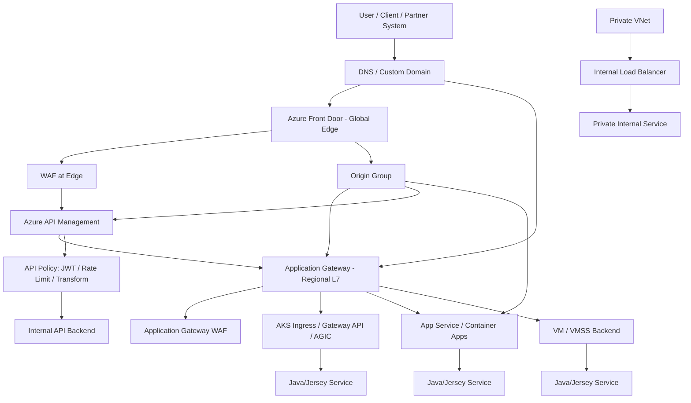

Mental model singkat:

```text id="je9a2m"
Azure Front Door      = global HTTP/S edge
Application Gateway   = regional L7 HTTP/S gateway
Azure Load Balancer   = regional L4 TCP/UDP load balancer
API Management        = API gateway + policy + productization
WAF                   = HTTP security filter
Ingress               = Kubernetes HTTP routing into cluster
Internal LB           = private L4 exposure inside VNet
```

---

## 3. Decomposition Table - Practical Categories / Domain / Skills

| Area | Skill praktis | Fungsi untuk software engineer |
|---|---|---|
| **1. L4 vs L7 Routing** | Bedakan TCP/UDP load balancing vs HTTP-aware routing | Azure Load Balancer bekerja di layer 4, sedangkan Application Gateway bekerja di layer 7 untuk HTTP/S routing. ([learn.microsoft.com](https://learn.microsoft.com/en-us/azure/load-balancer/load-balancer-overview?utm_source=chatgpt.com)) ([learn.microsoft.com](https://learn.microsoft.com/en-us/azure/application-gateway/overview?utm_source=chatgpt.com)) |
| **2. Global vs Regional Entry Point** | Pilih Front Door untuk global edge, Application Gateway untuk regional L7 | Azure Front Door adalah advanced cloud CDN/global edge untuk akses cepat, reliable, dan secure ke static/dynamic web content secara global. ([learn.microsoft.com](https://learn.microsoft.com/en-us/azure/frontdoor/front-door-overview?utm_source=chatgpt.com)) |
| **3. Public vs Private Exposure** | Public endpoint, internal load balancer, private Application Gateway, private API Management | Menentukan apakah API bisa diakses internet, hanya internal VNet, hanya partner network, atau lewat gateway tertentu. |
| **4. Azure Load Balancer** | Frontend IP, backend pool, health probe, load-balancing rule, internal/public LB | Load Balancer mendistribusikan inbound flow ke backend VM/VMSS dan bekerja pada OSI layer 4. ([learn.microsoft.com](https://learn.microsoft.com/en-us/azure/load-balancer/load-balancer-overview?utm_source=chatgpt.com)) |
| **5. Application Gateway** | Listener, rule, backend pool, HTTP settings, path-based routing, host routing, TLS termination | Application Gateway adalah regional L7 gateway yang mendukung TLS termination, autoscaling, zone redundancy, dan integrasi WAF. ([learn.microsoft.com](https://learn.microsoft.com/en-us/azure/application-gateway/overview?utm_source=chatgpt.com)) |
| **6. Azure Front Door** | Global routing, origin group, health probe, WAF, TLS, custom domain, caching | Front Door memakai global edge network Microsoft untuk aplikasi static dan dynamic content, cocok untuk global public entry point. ([learn.microsoft.com](https://learn.microsoft.com/en-us/azure/frontdoor/front-door-overview?utm_source=chatgpt.com)) |
| **7. Web Application Firewall / WAF** | Managed rules, custom rules, detection/prevention mode, exclusion, bot/IP rules | WAF pada Front Door dan Application Gateway melindungi web application dari common exploits dan vulnerabilities. ([learn.microsoft.com](https://learn.microsoft.com/en-us/azure/web-application-firewall/afds/afds-overview?utm_source=chatgpt.com)) |
| **8. TLS Termination** | Certificate, listener, HTTPS frontend, backend TLS, end-to-end TLS | Application Gateway dapat melakukan TLS termination dengan certificate pada listener dan juga mendukung end-to-end TLS ke backend. ([learn.microsoft.com](https://learn.microsoft.com/en-us/azure/application-gateway/ssl-overview?utm_source=chatgpt.com)) |
| **9. API Management** | API product, subscription key, JWT validation, rate limit, quota, transformation, backend routing | API Management policy reference mencakup rate limiting, quotas, JWT validation, dan banyak policy gateway lain untuk governance API. ([learn.microsoft.com](https://learn.microsoft.com/en-us/azure/api-management/api-management-policies?utm_source=chatgpt.com)) |
| **10. Rate Limiting & Quotas** | Protect backend dari spike, abuse, dan noisy client | `rate-limit-by-key` di API Management membatasi call rate per key dalam periode tertentu. ([learn.microsoft.com](https://learn.microsoft.com/en-us/azure/api-management/rate-limit-by-key-policy?utm_source=chatgpt.com)) |
| **11. JWT Validation** | Validate token sebelum request sampai backend | `validate-jwt` policy memastikan JWT valid dari identity provider; untuk token Microsoft Entra, Microsoft menyarankan `validate-azure-ad-token`. ([learn.microsoft.com](https://learn.microsoft.com/en-us/azure/api-management/validate-jwt-policy?utm_source=chatgpt.com)) |
| **12. AKS Ingress** | Ingress controller, managed NGINX, Gateway API, AGIC, internal/public ingress | AKS Application Routing add-on adalah managed ingress path untuk AKS dan mendukung konfigurasi ingress controller. ([learn.microsoft.com](https://learn.microsoft.com/en-us/azure/aks/concepts-network-ingress?utm_source=chatgpt.com)) |
| **13. Application Gateway Ingress Controller / AGIC** | Application Gateway sebagai L7 load balancer untuk expose workload AKS | AGIC memantau Kubernetes cluster dan memperbarui Application Gateway agar service tertentu terekspos. ([learn.microsoft.com](https://learn.microsoft.com/en-us/azure/application-gateway/ingress-controller-overview?utm_source=chatgpt.com)) |
| **14. Internal Load Balancer for AKS** | Private service exposure via internal LB | Internal load balancer di AKS membuat Kubernetes service hanya bisa diakses melalui private IP dari network yang dapat menjangkaunya. ([learn.microsoft.com](https://learn.microsoft.com/en-us/azure/aks/internal-lb?utm_source=chatgpt.com)) |
| **15. Health Probe** | Readiness endpoint, liveness semantics, backend health, failover | Health probe menentukan apakah backend dianggap sehat oleh gateway/load balancer. |
| **16. Header Forwarding** | `X-Forwarded-For`, `X-Forwarded-Proto`, host preservation, correlation ID | Backend Java/Jersey perlu memahami original client IP, original scheme, dan host agar logging, redirect, auth, dan audit benar. |
| **17. Routing Strategy** | Host-based, path-based, weighted, priority/failover, canary | Menentukan bagaimana traffic dibagi antar backend, versi, region, atau environment. |
| **18. Zero Trust API Exposure** | WAF + APIM + private backend + managed identity + network restriction | Backend tidak langsung public; akses melewati controlled edge/gateway dan policy layer. |

---

## 4. L4 vs L7 - Boundary Pertama yang Harus Jelas

### Layer 4

Layer 4 bekerja pada level transport: TCP/UDP. Ia tidak memahami HTTP path, header, cookie, JWT, atau method.

Contoh cocok untuk L4:

```text id="1pwu27"
TCP service
database proxy
internal service load balancing
VM/VMSS backend
AKS Service type LoadBalancer
non-HTTP workload
```

Azure Load Balancer bekerja pada OSI layer 4 dan mendistribusikan inbound flow dari frontend ke backend pool berdasarkan rules dan health probes. ([learn.microsoft.com](https://learn.microsoft.com/en-us/azure/load-balancer/load-balancer-overview?utm_source=chatgpt.com))

### Layer 7

Layer 7 memahami HTTP/S. Ia bisa routing berdasarkan host, path, header, TLS/SNI, cookie affinity, dan WAF.

Contoh cocok untuk L7:

```text id="o5jnln"
/api/cases       → case-api
/api/workflows   → camunda-api
/api/reports     → report-api
admin.company.io → admin-ui
api.company.io   → API gateway
```

Application Gateway bekerja di application layer dan menyediakan fitur seperti SSL/TLS termination, autoscaling, zone redundancy, dan integrasi Web Application Firewall. ([learn.microsoft.com](https://learn.microsoft.com/en-us/azure/application-gateway/overview?utm_source=chatgpt.com))

---

## 5. Azure Load Balancer

Azure Load Balancer cocok ketika kebutuhan Anda adalah **TCP/UDP load balancing**, bukan HTTP policy.

Contoh:

```text id="h8ng9k"
Client
  → Public/Internal Load Balancer
  → VMSS / VM / AKS service
```

Komponen penting:

| Komponen | Fungsi |
|---|---|
| **Frontend IP** | IP yang diakses client |
| **Backend pool** | Kumpulan VM/VMSS/NIC/backend target |
| **Health probe** | Menentukan backend sehat/tidak |
| **Load-balancing rule** | Mapping frontend port/protocol ke backend |
| **Inbound NAT rule** | Port forwarding ke backend instance tertentu |
| **Outbound rule** | Mengatur outbound SNAT untuk backend |

Untuk AKS, Kubernetes service type `LoadBalancer` bisa membuat Azure Load Balancer sebagai exposure layer; internal load balancer membatasi service hanya ke private IP yang bisa dijangkau dari VNet atau peered VNet. ([learn.microsoft.com](https://learn.microsoft.com/en-us/azure/aks/internal-lb?utm_source=chatgpt.com))

### Kapan pakai Azure Load Balancer?

| Scenario | Cocok? |
|---|---|
| HTTP path routing | Tidak ideal |
| TCP/UDP service | Cocok |
| Internal private service | Cocok |
| VM/VMSS backend | Cocok |
| AKS internal/private service | Cocok |
| WAF protection | Tidak |
| JWT/rate limit/API product | Tidak |
| TLS termination HTTP gateway | Tidak; pakai Application Gateway/Front Door/APIM |

---

## 6. Application Gateway

Application Gateway adalah **regional HTTP/S gateway**. Ia cocok untuk expose aplikasi web/API dengan L7 routing, TLS termination, dan WAF.

```text id="clgoqy"
Client
  → Application Gateway
  → Backend pool
      → App Service / AKS / VM / internal service
```

Application Gateway menyediakan fitur seperti TLS termination, autoscaling, zone redundancy, dan WAF integration. ([learn.microsoft.com](https://learn.microsoft.com/en-us/azure/application-gateway/overview?utm_source=chatgpt.com))

Komponen penting:

| Komponen | Fungsi |
|---|---|
| **Frontend IP** | Public/private IP Application Gateway |
| **Listener** | Hostname + port + protocol + certificate |
| **Rule** | Menghubungkan listener ke backend |
| **Backend pool** | Target backend |
| **HTTP settings** | Backend protocol, port, timeout, probe |
| **Health probe** | Cek backend health |
| **WAF policy** | Security inspection HTTP/S |
| **TLS certificate** | Untuk HTTPS listener |

### Pattern host/path routing

```text id="oypbf9"
api.company.com/cases/*      → case-api
api.company.com/workflows/*  → camunda-api
api.company.com/reports/*    → report-api
admin.company.com/*          → admin-ui
```

### Kapan pakai Application Gateway?

| Scenario | Cocok? |
|---|---|
| Regional HTTP/S entry point | Cocok |
| Private internal HTTP gateway | Cocok |
| WAF regional | Cocok |
| TLS termination dekat workload | Cocok |
| Path-based routing | Cocok |
| AKS ingress via AGIC | Cocok |
| Global edge acceleration | Lebih cocok Front Door |
| API product/subscription/rate limit advanced | Lebih cocok API Management |
| Pure TCP/UDP | Biasanya Load Balancer, meskipun Application Gateway terbaru juga punya kapabilitas TCP/TLS proxy pada skenario tertentu |

---

## 7. TLS Termination dan End-to-End TLS

TLS termination berarti gateway menerima HTTPS dari client, mendekripsi traffic, lalu meneruskan ke backend. Backend bisa HTTP atau HTTPS tergantung security requirement.

```text id="u8nfsv"
Client HTTPS
  → Application Gateway TLS termination
  → Backend HTTP/HTTPS
```

Untuk TLS termination di Application Gateway, certificate harus ditambahkan pada listener agar gateway bisa mendekripsi incoming traffic dan mengenkripsi response ke client. ([learn.microsoft.com](https://learn.microsoft.com/en-us/azure/application-gateway/ssl-overview?utm_source=chatgpt.com))

Model umum:

| Model | Flow | Kapan dipakai |
|---|---|---|
| **TLS offload** | Client HTTPS → Gateway → Backend HTTP | Internal network trusted, performa/simplicity |
| **End-to-end TLS** | Client HTTPS → Gateway HTTPS → Backend HTTPS | Compliance, sensitive data, zero trust internal |
| **mTLS client-facing** | Client certificate validated at gateway/API layer | Partner/B2B/high trust boundary |
| **Backend TLS validation** | Gateway memvalidasi backend cert | Mencegah backend spoofing/misroute |

Application Gateway dapat dipakai untuk centralized TLS policy dan certificate management, sehingga organisasi bisa mengatur TLS policy sesuai security/compliance requirement. ([learn.microsoft.com](https://learn.microsoft.com/en-us/azure/application-gateway/application-gateway-ssl-policy-overview?utm_source=chatgpt.com))

---

## 8. Azure Front Door

Azure Front Door cocok sebagai **global public entry point** untuk web/API yang butuh global performance, failover, WAF di edge, custom domain, dan TLS.

```text id="r6a8w6"
Global User
  → nearest Azure Front Door edge
  → WAF / routing
  → origin group
      → App Gateway / APIM / App Service / AKS ingress / origin
```

Azure Front Door adalah advanced CDN untuk static dan dynamic content, dirancang untuk akses cepat, reliable, dan secure melalui Microsoft global edge network. ([learn.microsoft.com](https://learn.microsoft.com/en-us/azure/frontdoor/front-door-overview?utm_source=chatgpt.com))

Komponen penting:

| Komponen | Fungsi |
|---|---|
| **Endpoint** | Public Front Door endpoint |
| **Custom domain** | Domain bisnis, misalnya `api.company.com` |
| **Route** | Mapping domain/path ke origin group |
| **Origin group** | Kumpulan backend/origin |
| **Origin** | Backend target |
| **Health probe** | Cek origin health |
| **WAF policy** | Edge protection |
| **Rules engine** | Header/path/redirect/rewrite logic |
| **Caching** | Untuk static/cacheable content |

Microsoft best practices untuk Front Door menyarankan WAF dengan managed rules untuk internet-facing applications. ([learn.microsoft.com](https://learn.microsoft.com/en-us/azure/frontdoor/best-practices?utm_source=chatgpt.com))

### Kapan pakai Front Door?

| Scenario | Cocok? |
|---|---|
| Global public app/API | Cocok |
| Multi-region failover | Cocok |
| Edge WAF | Cocok |
| Static + dynamic acceleration | Cocok |
| Public API dengan global clients | Cocok |
| Private-only internal app | Biasanya tidak; pertimbangkan App Gateway/internal ingress |
| Regional-only private API | Biasanya Application Gateway/APIM internal |
| Non-HTTP TCP | Tidak cocok |

---

## 9. WAF - Web Application Firewall

WAF melindungi web app/API dari common web exploits dan vulnerabilities. WAF bisa berada di Front Door atau Application Gateway. ([learn.microsoft.com](https://learn.microsoft.com/en-us/azure/web-application-firewall/afds/afds-overview?utm_source=chatgpt.com))

Mode umum:

| Mode | Fungsi |
|---|---|
| **Detection** | Log match, tidak block |
| **Prevention** | Block request yang match rule |
| **Managed rules** | Rule set dikelola Microsoft |
| **Custom rules** | IP allow/block, geo, header, path, size, bot/custom condition |
| **Exclusion** | Mengurangi false positive untuk parameter/header tertentu |

Azure Front Door WAF memakai Azure-managed rule sets yang diperbarui untuk common security threats dan attack signatures. ([learn.microsoft.com](https://learn.microsoft.com/en-us/azure/frontdoor/web-application-firewall?utm_source=chatgpt.com))

### WAF bukan pengganti authorization

WAF membantu memblokir pola serangan HTTP, tetapi tidak menggantikan:

```text id="6l1hgm"
authentication
authorization
object-level permission
business rule validation
input validation di aplikasi
rate limit per consumer
audit trail
```

---

## 10. API Management - API Gateway Layer

API Management / APIM berbeda dari Application Gateway.

Application Gateway menjawab:

```text id="vllqds"
Traffic HTTP ini diarahkan ke backend mana?
```

API Management menjawab:

```text id="2sa8cf"
API ini siapa konsumennya?
Policy apa yang berlaku?
Apakah token valid?
Berapa rate limit consumer ini?
Apakah request/response perlu transform?
Bagaimana versioning dan product exposure?
```

APIM policy reference mencakup rate limits, quotas, JWT validation, transformation, routing, retry, dan banyak policy lain. ([learn.microsoft.com](https://learn.microsoft.com/en-us/azure/api-management/api-management-policies?utm_source=chatgpt.com))

### APIM policy examples

| Policy | Fungsi |
|---|---|
| `validate-jwt` | Validasi JWT dari identity provider |
| `rate-limit-by-key` | Rate limit berdasarkan key |
| `quota-by-key` | Kuota per periode |
| `rewrite-uri` | Rewrite path |
| `set-header` | Tambah/ubah header |
| `set-backend-service` | Routing ke backend |
| `retry` | Retry backend call |
| `validate-content` | Validasi body/schema |
| `ip-filter` | Allow/block IP |
| `choose` | Conditional policy |

`validate-jwt` memastikan JWT yang diberikan identity provider valid; dokumentasi juga menyarankan `validate-azure-ad-token` untuk JWT dari Microsoft Entra. ([learn.microsoft.com](https://learn.microsoft.com/en-us/azure/api-management/validate-jwt-policy?utm_source=chatgpt.com))

### Kapan pakai APIM?

| Scenario | Cocok? |
|---|---|
| Public API product | Cocok |
| Partner API | Cocok |
| Rate limit per consumer | Cocok |
| Subscription key / developer portal | Cocok |
| JWT validation before backend | Cocok |
| Request/response transform | Cocok |
| Pure L4 TCP load balancing | Tidak |
| Internal-only simple service-to-service | Mungkin terlalu berat |
| WAF edge protection | Tambahkan Front Door/App Gateway WAF |

---

## 11. Kombinasi Front Door, App Gateway, APIM, dan Backend

Di production, sering bukan pilih satu, tetapi kombinasi.

### Pattern A - Simple public web/API

```text id="lhmttn"
Client
  → Application Gateway + WAF
  → Java/Jersey backend
```

Cocok untuk regional public API yang butuh WAF dan path routing.

---

### Pattern B - Global public API dengan API governance

```text id="3p3abw"
Client
  → Azure Front Door + WAF
  → API Management
  → private backend
      → AKS / App Service / Container Apps
```

Cocok untuk API public/partner dengan global edge, WAF, rate limit, JWT validation, API product, dan backend private.

---

### Pattern C - Internal enterprise API

```text id="ejfyuc"
Internal client / on-prem
  → private Application Gateway / internal APIM
  → Java/Jersey backend
```

Cocok untuk API yang hanya boleh diakses dari VNet/on-prem/ExpressRoute/VPN.

---

### Pattern D - AKS public ingress

```text id="zcq7ys"
Client
  → Front Door / Application Gateway
  → AKS ingress
  → Kubernetes service
  → Java pod
```

AGIC memungkinkan AKS menggunakan Azure Application Gateway sebagai native L7 load balancer untuk expose workload ke internet. ([learn.microsoft.com](https://learn.microsoft.com/en-us/azure/application-gateway/ingress-controller-overview?utm_source=chatgpt.com))

---

### Pattern E - AKS private ingress

```text id="nzs1ot"
Internal client
  → Internal Load Balancer / private ingress
  → AKS ingress controller
  → Kubernetes service
```

AKS internal load balancer membatasi aplikasi agar hanya dapat diakses melalui private IP dari network yang dapat menjangkaunya. ([learn.microsoft.com](https://learn.microsoft.com/en-us/azure/aks/internal-lb?utm_source=chatgpt.com))

---

## 12. AKS Ingress Options

Untuk AKS, exposure HTTP/S biasanya tidak langsung dari pod. Umumnya lewat Ingress/Gateway.

| Option | Fungsi | Catatan |
|---|---|---|
| **Service type LoadBalancer** | Membuat Azure Load Balancer L4 | Simple, tapi tidak HTTP-aware |
| **Managed NGINX Application Routing add-on** | Managed ingress controller untuk HTTP/S | Microsoft menyebut Application Routing add-on sebagai recommended managed ingress path untuk AKS. ([learn.microsoft.com](https://learn.microsoft.com/en-us/azure/aks/concepts-network-ingress?utm_source=chatgpt.com)) |
| **Application Gateway Ingress Controller / AGIC** | Application Gateway sebagai L7 load balancer untuk AKS | Cocok jika ingin App Gateway/WAF native di depan AKS. |
| **Application Gateway for Containers** | Managed L7 load balancing/ingress untuk Kubernetes workload | Microsoft mendeskripsikannya sebagai managed application layer load balancing dan ingress service untuk AKS workloads. ([learn.microsoft.com](https://learn.microsoft.com/en-us/azure/application-gateway/for-containers/overview?utm_source=chatgpt.com)) |
| **Gateway API via Application Routing add-on** | Successor/evolution dari Ingress API untuk traffic management | Microsoft menyatakan Application Routing add-on mendukung Kubernetes Gateway API untuk ingress traffic management. ([learn.microsoft.com](https://learn.microsoft.com/en-us/azure/aks/app-routing-gateway-api?utm_source=chatgpt.com)) |

Untuk desain baru, cek standard internal perusahaan karena AKS ingress di Azure terus berkembang, terutama antara managed NGINX, Gateway API, AGIC, dan Application Gateway for Containers.

---

## 13. Decision Matrix - Pilih Komponen yang Tepat

| Kebutuhan | Komponen utama |
|---|---|
| TCP/UDP load balancing internal | Azure Load Balancer internal |
| Public TCP/UDP ke VM/VMSS | Azure Load Balancer public |
| HTTP/S regional routing | Application Gateway |
| HTTP/S regional routing + WAF | Application Gateway WAF |
| Global HTTP/S edge | Azure Front Door |
| Global WAF + failover | Azure Front Door WAF |
| API product, rate limit, JWT policy | API Management |
| Kubernetes HTTP ingress simple/managed | AKS Application Routing add-on |
| AKS dengan Application Gateway | AGIC / Application Gateway for Containers |
| Private internal API | Internal APIM / private App Gateway / internal ingress |
| Partner API with strict controls | Front Door/App Gateway WAF + APIM + mTLS/JWT/rate limit |
| Static + dynamic global app | Front Door |
| Backend private only | Private Link/private endpoint/VNet integration + restricted public access |

---

## 14. TLS Placement Strategy

Pertanyaan utama:

```text id="4b64p7"
TLS terminate di mana?
Apakah backend juga harus HTTPS?
Siapa yang mengelola certificate?
Apakah perlu mTLS?
Apakah perlu certificate rotation otomatis?
```

Common choices:

| Placement | Pattern | Kapan cocok |
|---|---|---|
| **Front Door** | Global TLS termination | Public global app/API |
| **Application Gateway** | Regional TLS termination | Regional app/API, private/public |
| **API Management** | API gateway TLS + policy | API product/partner |
| **Ingress controller** | Kubernetes-level TLS | Cluster-managed route |
| **Backend app** | End-to-end app TLS | Strict compliance/service-to-service TLS |

Application Gateway dapat menggunakan certificate dari Key Vault untuk TLS termination; dokumentasi menyebut PFX certificate sebagai format yang didukung untuk TLS termination. ([learn.microsoft.com](https://learn.microsoft.com/en-us/azure/application-gateway/key-vault-certs?utm_source=chatgpt.com))

---

## 15. Header dan Backend Awareness untuk Java/Jersey

Saat ada gateway/proxy, backend tidak boleh naïf membaca source IP/socket scheme saja.

Perhatikan header:

```text id="nlk98p"
X-Forwarded-For
X-Forwarded-Proto
X-Forwarded-Host
Host
X-Request-ID / traceparent
X-Correlation-ID
```

Untuk Java/Jersey:

| Concern | Risiko jika salah |
|---|---|
| Original client IP | Audit/log salah |
| Original scheme HTTPS | Redirect ke HTTP atau mixed content |
| Host header | Link generation salah |
| Path prefix | Backend route mismatch |
| Correlation ID | Trace antar gateway/backend putus |
| Header trust boundary | Client bisa spoof header jika tidak disanitasi di gateway |

Practical invariant:

```text id="qrfftm"
Aplikasi hanya boleh percaya forwarded headers
yang diset/dibersihkan oleh gateway terpercaya.
```

---

## 16. Health Probe Design

Gateway/load balancer hanya tahu backend sehat dari probe. Jangan asal arahkan probe ke `/`.

Endpoint yang baik:

```http id="0apnqm"
GET /health/ready
```

Response:

```json id="r0qnyg"
{
  "status": "UP",
  "checks": {
    "database": "UP",
    "dependencyConfig": "UP"
  }
}
```

Pisahkan:

| Endpoint | Fungsi |
|---|---|
| `/health/live` | Process masih hidup |
| `/health/ready` | Siap menerima traffic |
| `/health/startup` | Aplikasi masih warming up |
| `/metrics` | Metrics untuk observability, bukan probe umum |

Anti-pattern:

```text id="z9aqzl"
Health probe mengembalikan 200 walau DB pool habis.
```

Dampak: gateway tetap mengirim traffic ke instance yang sebenarnya tidak siap.

---

## 17. Routing Pattern untuk Java/Jersey Microservice

Contoh API:

```text id="r346io"
case-api
workflow-api
document-api
report-api
admin-api
```

### Host-based routing

```text id="e2sp2q"
case.api.company.com      → case-api
workflow.api.company.com  → workflow-api
document.api.company.com  → document-api
```

Kelebihan:

```text id="va6hn3"
clear ownership
clear certificate/domain boundary
easy isolation
```

### Path-based routing

```text id="7uwms0"
/cases       → case-api
/workflows   → workflow-api
/documents   → document-api
/reports     → report-api
```

Kelebihan:

```text id="8h44gb"
single domain
centralized public API
simpler consumer-facing endpoint
```

Risiko path-based:

```text id="vfnbjs"
path rewrite salah
backend base path salah
OpenAPI server URL salah
auth policy per path lebih kompleks
large upload timeout berbeda
```

---

## 18. API Exposure Pattern untuk Jersey/JAX-RS

### Pattern 1 - Internal microservice only

```text id="y48n48"
Internal client
  → internal DNS
  → internal load balancer / private ingress
  → Jersey service
```

Gunakan untuk service-to-service internal.

---

### Pattern 2 - Public API but controlled

```text id="cbpaic"
External client
  → Front Door WAF
  → API Management
  → private backend
  → Jersey service
```

Gunakan untuk public/partner API yang butuh JWT validation, rate limit, subscription, analytics, dan WAF.

---

### Pattern 3 - Regional app with WAF

```text id="lwzcxj"
Client
  → Application Gateway WAF
  → App Service / AKS / Container Apps
  → Jersey service
```

Gunakan untuk aplikasi regional dengan routing dan WAF.

---

### Pattern 4 - Global app with regional backends

```text id="zqh8do"
Client
  → Front Door WAF
  → origin group
      → region A Application Gateway
      → region B Application Gateway
```

Gunakan untuk multi-region availability dan global latency optimization.

---

## 19. Large Upload, Long Polling, WebSocket

Karena Anda memakai Java/Jersey dan sebelumnya menyinggung long polling, WebSocket, dan binary upload, edge routing harus divalidasi untuk workload seperti ini.

| Workload | Yang perlu dicek |
|---|---|
| **Binary upload** | Max request body size, timeout, buffering, WAF inspection false positive, direct-to-Blob pattern |
| **Large download** | Response timeout, streaming, CDN/cache, backend memory pressure |
| **Long polling** | Idle timeout gateway/load balancer, connection count, thread model |
| **WebSocket** | Gateway support, timeout, sticky session jika perlu |
| **Server-Sent Events** | Buffering, timeout, keepalive |
| **gRPC** | HTTP/2 support end-to-end, TLS, gateway compatibility |

Application Gateway FAQ menyebut dukungan capability seperti TLS termination dan cookie-based session affinity, sedangkan Azure Front Door juga memiliki end-to-end TLS guidance untuk mengamankan data in transit ke origin. ([learn.microsoft.com](https://learn.microsoft.com/en-us/azure/application-gateway/application-gateway-faq?utm_source=chatgpt.com)) ([learn.microsoft.com](https://learn.microsoft.com/en-us/azure/frontdoor/end-to-end-tls?utm_source=chatgpt.com))

Practical recommendation untuk binary upload:

```text id="dbfxyg"
Client meminta upload URL
  → API validates permission
  → API issues short-lived upload instruction
  → Client uploads directly to Blob Storage
  → Event triggers processing
```

Jangan selalu proxy file besar lewat Jersey service jika objektifnya hanya menyimpan file.

---

## 20. Security Baseline untuk Edge

Production baseline:

```text id="tyd5vg"
1. Public backend tidak langsung diekspos jika bisa private.
2. Public entry point lewat WAF.
3. TLS minimum policy jelas.
4. Certificate disimpan/dirotasi terkontrol.
5. API external lewat APIM jika butuh product/rate/JWT.
6. Backend hanya menerima traffic dari gateway.
7. Health endpoint tidak membocorkan detail sensitive.
8. Forwarded headers disanitasi di gateway.
9. Rate limit diterapkan sebelum backend.
10. Logs gateway + backend dikorelasikan.
```

Untuk internet-facing applications, Microsoft best practices untuk Azure Front Door menyarankan mengaktifkan WAF dan managed rules. ([learn.microsoft.com](https://learn.microsoft.com/en-us/azure/frontdoor/best-practices?utm_source=chatgpt.com))

---

## 21. Observability untuk Traffic Routing

Log dan metrics yang perlu dilihat:

| Komponen | Metrics/log penting |
|---|---|
| Front Door | Request count, latency, origin health, WAF logs, cache hit |
| Application Gateway | Backend health, failed requests, throughput, WAF logs, response status |
| Load Balancer | Health probe status, data path availability, SNAT/connection metric |
| APIM | Request count, latency, backend response code, policy error |
| AKS ingress | 4xx/5xx, upstream latency, ingress controller logs |
| Backend Java | Request latency, error rate, dependency latency, trace ID |
| WAF | Matched rule, action, false positive candidate |
| DNS | Wrong resolution, stale records, propagation issue |

Azure Load Balancer Standard menyediakan multi-dimensional metrics melalui Azure Metrics untuk diagnostic insight. ([learn.microsoft.com](https://learn.microsoft.com/en-us/azure/load-balancer/load-balancer-standard-diagnostics?utm_source=chatgpt.com))

---

## 22. Common Failure Modes

| Symptom | Kemungkinan root cause |
|---|---|
| 502 Bad Gateway dari Application Gateway | Backend unhealthy, wrong port/protocol, probe path salah, TLS mismatch |
| 403 dari WAF | Managed/custom rule match, false positive, body/header dianggap malicious |
| JWT valid tapi backend tetap reject | APIM/gateway tidak meneruskan expected claim/header atau backend punya auth sendiri |
| Client IP salah di log | Backend tidak membaca `X-Forwarded-For` atau header tidak dipercaya |
| Redirect loop HTTP/HTTPS | Backend tidak aware original scheme dari gateway |
| File upload gagal | Size limit, timeout, WAF inspection, buffering, backend memory |
| WebSocket putus | Timeout/gateway support/idle connection |
| Health probe hijau tapi user gagal | Probe terlalu dangkal, tidak cek dependency penting |
| App sehat tapi gateway unhealthy | Probe path membutuhkan auth atau response code tidak sesuai |
| Public backend bisa diakses bypass gateway | Network restriction belum diterapkan |
| Rate limit tidak efektif | Diterapkan di backend bukan gateway, key salah, NAT/shared IP issue |

---

## 23. CLI / Inspection Cheatsheet

### Application Gateway

```bash id="sip12k"
az network application-gateway list --output table
```

```bash id="wof6z5"
az network application-gateway show-backend-health \
  --resource-group "<rg>" \
  --name "<app-gateway-name>"
```

### Front Door

```bash id="w7n4s7"
az afd profile list --output table
```

```bash id="apmhfz"
az afd endpoint list \
  --resource-group "<rg>" \
  --profile-name "<front-door-profile>" \
  --output table
```

### Load Balancer

```bash id="yyak3b"
az network lb list --output table
```

```bash id="n1rli2"
az network lb probe list \
  --resource-group "<rg>" \
  --lb-name "<lb-name>" \
  --output table
```

### API Management

```bash id="e39054"
az apim list --output table
```

```bash id="j7txuu"
az apim api list \
  --resource-group "<rg>" \
  --service-name "<apim-name>" \
  --output table
```

### AKS ingress/service

```bash id="a27h6c"
kubectl get ingress -A
kubectl get gateway -A
kubectl get svc -A
kubectl describe ingress <name> -n <namespace>
```

---

## 24. Design Template - Public API untuk Java/Jersey

```text id="auksqo"
Use case:
  Public/partner API for case-management

Entry:
  Azure Front Door + WAF

API governance:
  Azure API Management
    - validate JWT
    - rate limit by consumer/client
    - transform/rewrite if needed
    - request/response logging policy carefully

Regional routing:
  Application Gateway private frontend or public regional frontend
  depending on topology

Runtime:
  AKS / Container Apps / App Service

Backend:
  Java 17 + Jersey
  MyBatis
  PostgreSQL via private endpoint/private access
  Key Vault via managed identity
  Blob Storage via private endpoint/direct upload pattern

Security:
  TLS client → edge
  TLS edge → origin
  WAF prevention mode after tuning
  Backend only accepts traffic from gateway/APIM path
  No direct public backend exposure

Observability:
  traceparent/correlation ID preserved
  WAF logs + gateway logs + APIM logs + app logs correlated
```

---

## 25. Anti-pattern yang Harus Dihindari

| Anti-pattern | Risiko |
|---|---|
| Backend App Service/AKS public langsung tanpa gateway | Bypass WAF/API policy |
| Semua routing ditaruh di aplikasi | Gateway layer tidak dimanfaatkan |
| WAF langsung prevention tanpa tuning | False positive production |
| Health probe pakai endpoint yang butuh auth | Backend dianggap down |
| API rate limit hanya di backend | Backend tetap menerima spike |
| TLS berhenti di edge tapi backend melewati network tidak trusted | Data in transit risk |
| Forwarded headers dipercaya dari semua client | IP spoofing/audit salah |
| File upload besar diproxy semua lewat API | Memory/timeout/cost tinggi |
| App Gateway, APIM, Front Door dipakai tanpa alasan jelas | Complexity/cost naik |
| Path rewrite tidak diselaraskan dengan OpenAPI/Jersey base path | 404/redirect/auth mismatch |
| Backend public masih aktif setelah private gateway dibuat | Security bypass |
| Tidak ada correlation ID end-to-end | Incident debugging lambat |

---

## 26. Mental Model Final

Pegang model ini:

```text id="fb3cna"
Azure Load Balancer
  = L4 TCP/UDP distribution

Application Gateway
  = regional L7 HTTP/S gateway + WAF + TLS + path/host routing

Azure Front Door
  = global HTTP/S edge + WAF + origin routing + acceleration

API Management
  = API governance gateway: auth policy, rate limit, quota, transform, product

AKS Ingress/Gateway
  = Kubernetes entry point into services

WAF
  = HTTP security inspection, not business authorization

TLS termination
  = certificate and trust boundary decision

Health probe
  = traffic eligibility decision

Routing design
  = security + reliability + operability decision
```

Untuk senior software engineer, pertanyaan praktisnya:

```text id="bp1b7d"
Apakah API ini public atau private?
Apakah client global atau regional?
Apakah perlu WAF?
Apakah perlu APIM policy?
TLS terminate di mana?
Backend bisa dibypass atau tidak?
Health probe benar-benar mencerminkan readiness?
Apakah trace dan client IP tetap terbaca?
Apakah upload/long polling/WebSocket/gRPC compatible dengan gateway?
```

---

# Status

**Azure Seri 5/18 selesai.**

## Rekomendasi materi berikutnya

**Azure Seri 6 - Azure Compute Decision Model: App Service vs Azure Functions vs Container Apps vs AKS vs VM untuk Java/Jersey, worker, Camunda, batch job, dan microservice runtime.**

## Response:
7/13/2026, 8:06:33 PM

Lanjut ke **Seri 6/18**. Ini akan menjadi decision model praktis: kapan memilih App Service, Functions, Container Apps, AKS, atau VM untuk workload Java/Jersey, worker, Camunda, dan batch.

# Azure Seri 6/18 - Azure Compute Decision Model

## 1. Introduction

Seri ini membahas **cara memilih runtime/compute Azure** untuk workload software engineering, terutama untuk stack Anda:

```text
Java 17+
Jersey / Jakarta RESTful Web Services
Maven
Docker
GitHub Actions
MyBatis
PostgreSQL
Camunda
Worker / scheduler / batch job
Kubernetes
On-prem / AWS / Azure hybrid
```

Kesalahan umum saat onboarding Azure adalah langsung bertanya:

```text
Service mana yang paling bagus?
```

Pertanyaan yang lebih benar:

```text
Workload saya butuh runtime model seperti apa?
Apakah stateless HTTP API?
Apakah background worker?
Apakah event-driven?
Apakah long-running process?
Apakah butuh container?
Apakah butuh Kubernetes control?
Apakah butuh full OS control?
Apakah workload bisa scale to zero?
Apakah butuh predictable latency?
Apakah tim siap mengoperasikan platformnya?
```

Microsoft sendiri menyediakan guidance resmi untuk memilih compute service seperti **Virtual Machines, Azure Kubernetes Service, Azure Container Apps, App Service, dan Azure Functions** berdasarkan karakter workload. ([Microsoft Learn](https://learn.microsoft.com/en-us/azure/architecture/guide/technology-choices/compute-decision-tree?utm_source=chatgpt.com))

---

## 2. Diagram - Azure Compute Decision Map

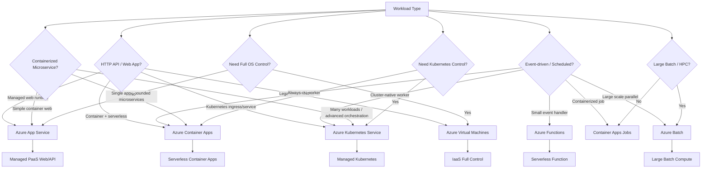

Mental model singkat:

```text
App Service      = managed web/API hosting
Azure Functions  = event-driven/scheduled function
Container Apps   = serverless containers/microservices/workers
AKS              = managed Kubernetes platform
Virtual Machines = full OS/runtime control
Azure Batch      = large-scale batch/HPC compute
```

---

## 3. Decomposition Table - Practical Compute Categories

| Compute option | Cocok untuk | Hindari jika | Skill utama |
|---|---|---|---|
| **Azure App Service** | Java web/API app, REST service, simple container web app, managed PaaS hosting | Butuh Kubernetes primitives, complex sidecar/service mesh, custom node-level control | App Service Plan, deployment slot, app settings, managed identity, VNet integration, autoscale |
| **Azure Functions** | Event-driven handler, scheduled task, queue/event trigger, lightweight API, integration glue | Long-running stateful process, complex domain service, heavy startup Java app tanpa tuning | Trigger/binding, hosting plan, cold start, idempotency, retry, poison queue |
| **Azure Container Apps** | Containerized API, microservice, worker, event-driven service, scale-to-zero, Dapr/KEDA style workload | Butuh full Kubernetes control, many tenants/workloads with strict isolation, complex cluster customization | Revision, ingress, environment, scaling rule, jobs, identity, secrets, observability |
| **Azure Kubernetes Service / AKS** | Banyak microservices, advanced networking, ingress, service mesh, operators, custom controllers, platform engineering | Tim belum siap operate Kubernetes, workload sederhana, sedikit service | Cluster, node pool, ingress, Helm, HPA/KEDA, workload identity, upgrade, policy |
| **Azure Virtual Machines** | Legacy app, custom OS, lift-and-shift, special agent/software, self-managed runtime | Bisa pakai PaaS/container, tidak ingin patch OS | VM size, image, disk, patching, backup, availability set/zone, VMSS |
| **Azure Batch** | Large-scale parallel jobs, compute-intensive batch, HPC-like workload | Simple scheduled worker/job | Pool, node, task, job, autoscale, package, storage integration |
| **Container Apps Jobs** | Finite-duration container job, scheduled/on-demand/event-driven task | Massive HPC/parallel scheduling need | Job trigger, retry, timeout, env, logging, identity |
| **App Service WebJobs** | Background task bersama App Service app | Workload besar/terisolasi atau cloud-native worker baru | Continuous/triggered WebJob, App Service lifecycle |

Azure App Service mendukung berbagai stack termasuk Java SE, Tomcat, JBoss, Node.js, Python, PHP, dan custom container. ([Microsoft Learn](https://learn.microsoft.com/en-us/azure/app-service/overview?utm_source=chatgpt.com)) Azure Container Apps adalah platform serverless untuk menjalankan containerized application tanpa mengelola infrastructure/orchestration di bawahnya. ([Microsoft Learn](https://learn.microsoft.com/en-us/azure/container-apps/overview?utm_source=chatgpt.com)) AKS adalah managed Kubernetes service untuk deploy dan manage containerized applications, dengan Azure mengambil sebagian operational overhead Kubernetes. ([Microsoft Learn](https://learn.microsoft.com/en-us/azure/aks/what-is-aks?utm_source=chatgpt.com))

---

## 4. Decision Axis yang Harus Dipakai

Jangan memilih compute hanya berdasarkan popularitas. Gunakan axis berikut.

| Axis | Pertanyaan |
|---|---|
| **Runtime shape** | HTTP API, worker, job, scheduler, batch, stream processor, workflow engine? |
| **Container requirement** | Harus Docker image atau cukup WAR/JAR? |
| **Operational control** | Perlu kontrol Kubernetes/OS/networking detail? |
| **Scaling model** | Always-on, autoscale, scale-to-zero, event-driven scale? |
| **Startup latency** | Cold start boleh atau harus selalu cepat? |
| **Statefulness** | Stateless, local state, durable state, workflow state, distributed state? |
| **Network access** | Public, private, VNet, hybrid on-prem/AWS? |
| **Secrets/identity** | Managed identity/workload identity tersedia? |
| **Deployment strategy** | Slot, revision, blue-green, canary, Helm, GitOps? |
| **Observability** | Log/metrics/traces mudah diambil? |
| **Cost model** | Pay per instance, consumption, reserved, node-based, always-on? |
| **Team maturity** | Tim siap mengoperasikan Kubernetes atau lebih cocok managed PaaS? |

Rule praktis:

```text
Pilih compute paling sederhana yang memenuhi requirement production.
Jangan memilih AKS hanya karena “microservice”.
Jangan memilih Functions untuk domain service kompleks hanya karena “serverless”.
Jangan memilih VM jika PaaS/container cukup.
```

---

## 5. Azure App Service

Azure App Service adalah managed hosting untuk web app/API. Untuk Java, App Service mendukung Java SE, Tomcat, dan JBoss; bisa juga menjalankan custom container. ([Microsoft Learn](https://learn.microsoft.com/en-us/azure/app-service/overview?utm_source=chatgpt.com)) Microsoft quickstart Java App Service juga menunjukkan deployment Java app memakai Maven Plugin for Azure App Service Web Apps. ([Microsoft Learn](https://learn.microsoft.com/en-us/azure/app-service/quickstart-java?utm_source=chatgpt.com))

### Cocok untuk

```text
Java/Jersey REST API
Jakarta REST app dalam Tomcat/JBoss style
Simple web app
Internal/admin API
Monolith modular
REST backend yang tidak butuh Kubernetes
Containerized web app sederhana
```

### Tidak ideal untuk

```text
Banyak microservice dengan complex traffic mesh
Butuh Kubernetes operator/controller
Butuh sidecar pattern kompleks
Butuh node-level daemon
Butuh custom CNI/network policy Kubernetes
Heavy event-driven worker fleet
```

### App Service mental model

```text
App Service Plan = compute capacity
Web App          = application/runtime
Deployment Slot  = staging/blue-green deployment target
App Settings     = environment config
Managed Identity = identity aplikasi
VNet Integration = outbound private access
```

### Pattern untuk Java/Jersey

```text
Client
  → Front Door / Application Gateway / APIM
  → App Service
  → Jersey API
  → PostgreSQL / Key Vault / Blob / Service Bus
```

### Kelebihan

| Kelebihan | Dampak |
|---|---|
| Managed runtime | Tidak perlu kelola OS/container orchestrator |
| Deployment slot | Blue-green/swap lebih mudah |
| Managed identity | Secretless access ke Key Vault/resource lain |
| Autoscale | Scale berdasarkan metric tertentu |
| VNet integration | Bisa akses private dependency |
| Maven plugin support | Cocok untuk Java/Maven workflow |

### Trade-off

| Trade-off | Dampak |
|---|---|
| Tidak sefleksibel Kubernetes | Sulit untuk complex sidecar/operator |
| App Service Plan tetap perlu sizing | Cost bisa idle jika overprovision |
| Runtime model PaaS | Tidak semua OS-level customization bisa dilakukan |
| Container support ada, tapi bukan full orchestrator | Kalau banyak container/service, pertimbangkan Container Apps/AKS |

---

## 6. Azure Functions

Azure Functions adalah managed PaaS untuk event-driven dan scheduled compute. Microsoft mendeskripsikannya sebagai platform yang menyediakan event-driven dan scheduled compute resources; bisa digunakan untuk web API, database changes, IoT streams, message queue processing, dan lainnya. ([Microsoft Learn](https://learn.microsoft.com/en-us/azure/azure-functions/?utm_source=chatgpt.com)) Azure Functions juga memiliki Java developer reference untuk fungsi Java. ([Microsoft Learn](https://learn.microsoft.com/en-us/azure/azure-functions/functions-reference-java?utm_source=chatgpt.com))

### Cocok untuk

```text
Timer job kecil
Queue consumer sederhana
Event Grid handler
Service Bus trigger
Blob trigger
Webhook ringan
Integration glue
Scheduled cleanup
Notification sender
```

### Tidak ideal untuk

```text
Domain service besar
Long-running business transaction
Complex REST API dengan banyak endpoint
Stateful workflow engine
Camunda engine/worker kompleks tanpa desain khusus
Heavy Java startup tanpa cold-start consideration
Process yang butuh kontrol container penuh
```

### Trigger model

| Trigger | Contoh use case |
|---|---|
| HTTP trigger | Lightweight webhook/API |
| Timer trigger | Scheduled cleanup/report |
| Queue trigger | Async task consumer |
| Service Bus trigger | Enterprise queue/topic processing |
| Event Grid trigger | React to Azure events |
| Blob trigger | Process uploaded file |
| Event Hubs trigger | Event stream ingestion |

### Hosting plan consideration

Azure Functions memiliki beberapa hosting plan dengan perilaku scaling berbeda. Dokumentasi scale/hosting Functions membandingkan scaling behavior antar hosting plan, termasuk Consumption, Premium, dan Dedicated. ([Microsoft Learn](https://learn.microsoft.com/en-us/azure/azure-functions/functions-scale?utm_source=chatgpt.com)) Elastic Premium plan adalah dynamic scale hosting option untuk function apps. ([Microsoft Learn](https://learn.microsoft.com/en-us/azure/azure-functions/functions-premium-plan?utm_source=chatgpt.com))

### Invariant untuk Functions

```text
Function harus idempotent.
Function harus punya retry strategy.
Function harus tahu timeout limit.
Function tidak boleh menyimpan state penting di memory.
Function harus siap dipanggil ulang.
Function harus punya dead-letter/poison handling.
```

---

## 7. Azure Container Apps

Azure Container Apps adalah pilihan menarik untuk software engineer yang sudah pakai Docker tetapi tidak ingin mengoperasikan Kubernetes langsung. Microsoft menyebut Container Apps sebagai serverless platform untuk menjalankan containerized applications tanpa mengelola underlying infrastructure. ([Microsoft Learn](https://learn.microsoft.com/en-us/azure/container-apps/overview?utm_source=chatgpt.com))

### Cocok untuk

```text
Containerized Java/Jersey API
Microservice kecil-menengah
Worker container
Queue/event-driven processor
API dengan scale-to-zero
Background service
Dapr-friendly service
KEDA-style scaling
Container Apps Jobs untuk finite task
```

### Tidak ideal untuk

```text
Butuh full Kubernetes API/control
Butuh custom CRD/operator
Butuh daemonset/hostPath/node-level behavior
Butuh strict multi-tenant isolation per namespace seperti Kubernetes
Butuh complex service mesh tertentu
Banyak workload dengan platform governance Kubernetes matang
```

Microsoft container service guidance menyatakan AKS umum dipakai untuk multiple workloads/disparate workload components, sedangkan Container Apps lebih tepat untuk single workload dengan shared security boundary dalam Container Apps environment. ([Microsoft Learn](https://learn.microsoft.com/en-us/azure/architecture/guide/choose-azure-container-service?utm_source=chatgpt.com))

### Container Apps mental model

```text
Container Apps Environment = boundary lingkungan
Container App              = service/app
Revision                   = version deployment
Ingress                    = HTTP/TCP exposure
Scale rule                 = HTTP/concurrency/event scale
Secret                     = app-level secret
Managed identity           = identity aplikasi
```

### Kelebihan

| Kelebihan | Dampak |
|---|---|
| Container-native | Cocok dengan Docker/GitHub Actions/ACR |
| Serverless platform | Tidak kelola node/cluster |
| Built-in autoscaling | Termasuk scale-to-zero untuk beberapa pattern |
| Revisions | Mendukung traffic split/canary sederhana |
| Jobs | Bisa menjalankan finite-duration tasks |
| Good middle ground | Lebih fleksibel dari App Service, lebih sederhana dari AKS |

Azure Container Apps jobs memungkinkan containerized task berjalan selama durasi terbatas lalu berhenti; cocok untuk data processing, ML, cleanup, atau on-demand processing. ([Microsoft Learn](https://learn.microsoft.com/en-us/azure/container-apps/jobs?utm_source=chatgpt.com))

---

## 8. Azure Kubernetes Service / AKS

AKS adalah managed Kubernetes untuk workload container yang butuh orchestration penuh. Microsoft menyebut AKS sebagai managed Kubernetes service untuk deploy dan manage containerized applications, serta mengurangi complexity/operational overhead Kubernetes dengan mengalihkan sebagian tanggung jawab ke Azure. ([Microsoft Learn](https://learn.microsoft.com/en-us/azure/aks/what-is-aks?utm_source=chatgpt.com))

### Cocok untuk

```text
Banyak microservices
Platform engineering internal
Advanced ingress/networking
Service mesh
Custom autoscaling
Helm/GitOps
Kubernetes operator/controller
Multi-container patterns
Camunda cluster/workers dengan orchestration matang
Complex workload isolation
```

### Tidak ideal untuk

```text
Satu-dua REST API sederhana
Tim belum punya Kubernetes operational skill
Tidak ada kebutuhan Kubernetes primitives
Tidak siap upgrade cluster/node pool
Tidak siap observability/security/network policy Kubernetes
```

### AKS mental model

```text
Cluster      = Kubernetes control plane + node pools
Node pool    = VM scale set untuk worker nodes
Namespace    = logical workload boundary
Deployment   = stateless app workload
Service      = stable network endpoint
Ingress      = HTTP routing
HPA/KEDA     = autoscaling
Helm         = package/deployment template
Workload ID  = pod identity to Azure resource
```

### Kelebihan

| Kelebihan | Dampak |
|---|---|
| Kubernetes standard | Portable skill/pattern |
| Full orchestration | Advanced workload support |
| Rich ecosystem | Helm, operators, service mesh, policy |
| Suitable for many services | Platform bisa melayani banyak tim |
| Fine-grained controls | Network policy, ingress, autoscaling, scheduling |

### Trade-off

| Trade-off | Dampak |
|---|---|
| Operational complexity | Upgrade, node pool, security, networking |
| Cost baseline | Cluster/node tetap punya biaya |
| Multi-layer debugging | App + container + pod + node + network + ingress |
| Governance perlu matang | Namespace/RBAC/policy/secret handling harus jelas |
| Tidak otomatis lebih murah | Salah sizing node bisa mahal |

---

## 9. Azure Virtual Machines

Azure VM memberi fleksibilitas virtualization tanpa membeli/maintain physical hardware, tetapi Anda tetap harus mengelola VM seperti konfigurasi, patching, dan software yang berjalan di atasnya. ([Microsoft Learn](https://learn.microsoft.com/en-us/azure/virtual-machines/overview?utm_source=chatgpt.com))

### Cocok untuk

```text
Legacy Java app yang sulit dipindah
Custom OS/runtime/library requirement
Vendor software
Lift-and-shift dari on-prem
Aplikasi butuh agent/kernel/daemon tertentu
Self-managed middleware
Temporary migration bridge
```

### Tidak ideal untuk

```text
Greenfield REST API
Containerized microservice modern
Event-driven handler kecil
Workload yang bisa PaaS
Tim ingin mengurangi OS maintenance
```

### VM mental model

```text
VM size      = CPU/memory capability
OS disk      = boot/system disk
Data disk    = persistent attached disk
NIC          = network interface
NSG          = network rule
Availability = zone/set/scale set design
Patch/backup = operational responsibility
```

Azure VM sizes berbeda berdasarkan kemampuan CPU, memory, storage, dan workload profile; pemilihan size adalah keputusan performa dan biaya. ([Microsoft Learn](https://learn.microsoft.com/en-us/azure/virtual-machines/sizes/overview?utm_source=chatgpt.com))

---

## 10. Azure Batch

Azure Batch cocok untuk compute-intensive, large-scale parallel, atau HPC-like batch jobs. Dokumentasi Azure Batch menyatakan Azure Batch menjalankan large-scale applications secara efisien di cloud, menjadwalkan compute-intensive tasks, dan menyesuaikan resources secara dinamis tanpa mengelola infrastructure. ([Microsoft Learn](https://learn.microsoft.com/en-us/azure/batch/?utm_source=chatgpt.com))

### Cocok untuk

```text
Large parallel processing
Batch calculation
Massive file processing
Monte Carlo simulation
Image/video processing at scale
Scientific/HPC-like workload
Burst compute
```

### Tidak ideal untuk

```text
REST API
Small scheduled cleanup
Simple queue worker
Long-running web service
Microservice API
```

Azure Batch membuat dan mengelola pool compute nodes/VMs, menginstal aplikasi, dan menjadwalkan jobs/tasks ke nodes tanpa perlu mengelola cluster scheduler sendiri. ([Microsoft Learn](https://learn.microsoft.com/en-us/azure/batch/batch-technical-overview?utm_source=chatgpt.com))

---

## 11. Container Apps Jobs vs Azure Functions vs Azure Batch

| Kebutuhan | Pilihan default |
|---|---|
| Event handler kecil | Azure Functions |
| Scheduled job kecil | Azure Functions / Container Apps Job |
| Containerized finite task | Container Apps Job |
| Long-running worker container | Container Apps |
| Large-scale parallel compute | Azure Batch |
| Kubernetes-native job | AKS Job / CronJob |
| Existing App Service background task | App Service WebJobs |

App Service WebJobs adalah fitur bawaan App Service untuk menjalankan background tasks, scripts, dan programs berdampingan dengan web/API/mobile applications. ([Microsoft Learn](https://learn.microsoft.com/en-us/azure/app-service/overview-webjobs?utm_source=chatgpt.com))

---

## 12. Compute Decision Matrix untuk Java/Jersey

| Workload | Recommended compute | Kenapa |
|---|---|---|
| Simple Java/Jersey REST API | App Service | Managed web hosting, low ops |
| Java/Jersey REST API dengan Docker | Container Apps atau App Service custom container | Containerized tapi tidak perlu AKS |
| Banyak microservices Java | AKS atau Container Apps | Pilih AKS jika butuh Kubernetes control; Container Apps jika ingin serverless container |
| Public/partner API | App Service/Container Apps/AKS + APIM/Front Door/App Gateway | Compute bukan satu-satunya keputusan; exposure layer penting |
| Internal API | App Service/Container Apps/AKS dengan private access | Tergantung platform standar |
| Background queue worker | Container Apps / Functions | Container Apps jika logic besar/containerized; Functions jika event handler kecil |
| Scheduled cleanup | Functions Timer / Container Apps Job | Pilih berdasarkan kompleksitas dan packaging |
| File processing after upload | Functions / Container Apps Job / Batch | Pilih berdasarkan ukuran dan parallelism |
| Camunda worker | Container Apps atau AKS | Worker container long-running/event-driven |
| Camunda engine/self-managed cluster | AKS atau VM | Butuh stateful/platform control; validasi vendor/ops requirement |
| Legacy Java app | VM atau App Service | VM jika butuh OS control; App Service jika bisa modernize |
| High-throughput long-running service | AKS / Container Apps dedicated profile / App Service plan | Perlu tuning scale/resource |
| Batch processing besar | Azure Batch | Designed for large-scale batch compute |

---

## 13. Compute Decision Flow

```text
1. Apakah workload HTTP web/API?
   - Ya → App Service / Container Apps / AKS
   - Tidak → lanjut

2. Apakah workload event-driven atau scheduled?
   - Ya → Azure Functions / Container Apps Jobs / AKS CronJob
   - Tidak → lanjut

3. Apakah workload containerized?
   - Ya → Container Apps / AKS
   - Tidak → App Service / VM / Functions

4. Apakah butuh Kubernetes API/control?
   - Ya → AKS
   - Tidak → Container Apps / App Service

5. Apakah butuh full OS control?
   - Ya → VM
   - Tidak → PaaS/container

6. Apakah workload large-scale parallel batch?
   - Ya → Azure Batch
   - Tidak → Functions / Container Apps Job / worker

7. Apakah tim siap mengoperasikan Kubernetes?
   - Ya → AKS bisa masuk
   - Tidak → App Service / Container Apps lebih aman
```

Microsoft compute decision tree menggunakan pertanyaan seperti aplikasi perlu VM langsung, hosting model, container support, dan orchestration untuk mengarahkan pilihan compute. ([Microsoft Learn](https://learn.microsoft.com/en-us/azure/architecture/guide/technology-choices/compute-decision-tree?utm_source=chatgpt.com))

---

## 14. App Service vs Container Apps vs AKS

| Kriteria | App Service | Container Apps | AKS |
|---|---|---|---|
| Abstraksi | Web/API PaaS | Serverless container | Managed Kubernetes |
| Container required | Tidak | Ya | Ya |
| Ops complexity | Rendah | Sedang-rendah | Tinggi |
| Kubernetes control | Tidak | Tidak langsung | Ya |
| Deployment primitive | App/slot | Revision | Deployment/Service/Ingress/Helm |
| Scale to zero | Tidak untuk web app normal | Ya untuk beberapa workload | Bisa via KEDA, tapi cluster tetap ada |
| Best for | Simple web/API | Containerized services/workers | Complex multi-service platform |
| Traffic split | Slot/routing | Revision traffic split | Ingress/service mesh/GitOps |
| Team skill | Web/PaaS | Container | Kubernetes/platform |
| Governance | Azure resource-level | Environment/app-level | Azure + Kubernetes layer |

Microsoft microservices compute guidance menyebut Container Apps dan AKS menyediakan traffic splitting natively untuk gradual rollout, dan App Service mendukung percentage-based traffic routing across deployment slots. ([Microsoft Learn](https://learn.microsoft.com/en-us/azure/architecture/microservices/design/compute-options?utm_source=chatgpt.com))

---

## 15. Functions vs Container Apps Jobs

| Kriteria | Azure Functions | Container Apps Jobs |
|---|---|---|
| Packaging | Function app/runtime | Container image |
| Best for | Small event handlers | Containerized finite tasks |
| Trigger | Native triggers/bindings | Manual, scheduled, event-driven jobs |
| Runtime control | Lebih terbatas | Lebih fleksibel via container |
| Java startup concern | Perlu tuning | Masih ada startup, tapi container model lebih eksplisit |
| Long/complex task | Kurang ideal jika timeout/resource constraint | Lebih cocok untuk containerized batch kecil-menengah |
| Reuse existing Docker image | Tidak selalu natural | Natural |
| Operational model | Function-centric | Container/job-centric |

Container Apps Jobs bisa dijalankan manual, scheduled, atau event-driven dan cocok untuk tasks seperti data processing, ML, resource cleanup, atau on-demand processing. ([Microsoft Learn](https://learn.microsoft.com/en-us/azure/container-apps/jobs-get-started-portal?utm_source=chatgpt.com))

---

## 16. AKS vs VM

| Kriteria | AKS | VM |
|---|---|---|
| Abstraksi | Kubernetes cluster | Full machine |
| App packaging | Container | Any software |
| Scaling | Pods/nodes | VM/VMSS |
| Control | Kubernetes-level | OS-level |
| Ops responsibility | Cluster + workload | OS + runtime + app |
| Best for | Modern container platform | Legacy/custom infra |
| Deployment | Helm/YAML/GitOps | Script/Ansible/manual/image |
| Failure domain | Pod/node/cluster | VM/disk/network |
| Portability | Kubernetes ecosystem | VM-specific |
| Modernization path | Good target | Often migration bridge |

VM bukan “lebih jelek”; VM tepat jika memang butuh OS/runtime control. Tapi untuk greenfield Java REST service, VM biasanya meningkatkan operational burden dibanding App Service/Container Apps/AKS.

---

## 17. Azure Spring Apps Note

Untuk Java engineer, penting: **jangan menjadikan Azure Spring Apps sebagai default baru tanpa memeriksa status lifecycle.** Microsoft mengumumkan bahwa semua Azure Spring Apps plans memasuki retirement period pada 17 Maret 2025 dan akan retired pada 31 Maret 2028. ([Microsoft Learn](https://learn.microsoft.com/en-us/azure/spring-apps/basic-standard/retirement-announcement?utm_source=chatgpt.com))

Implikasi praktis:

```text
Untuk workload Java baru, evaluasi App Service, Container Apps, AKS, atau VM.
Jangan mulai architecture baru berbasis Azure Spring Apps kecuali organisasi punya alasan dan migration plan jelas.
```

---

## 18. Deployment Model per Compute

| Compute | Artifact umum | Deployment path |
|---|---|---|
| App Service Java | JAR/WAR/container | Maven plugin, zip deploy, GitHub Actions, slot swap |
| Azure Functions Java | Function app package | Maven/Functions plugin, GitHub Actions |
| Container Apps | Docker image | Build → ACR → container app revision |
| AKS | Docker image + Helm/YAML | Build → ACR → Helm/GitOps/kubectl |
| VM | Package/script/image/container | SSH/agent/image/Ansible/custom pipeline |
| Batch | App package/container/task command | Batch job/task/pool |
| Container Apps Job | Docker image + job definition | Build → ACR → run/schedule/event |

Azure’s Java deployment overview frames Java hosting choices across IaaS, CaaS, and PaaS, including lift-and-shift to VMs, containerization options, and fully managed PaaS services. ([Microsoft Learn](https://learn.microsoft.com/en-us/azure/developer/java/get-started/deploy?utm_source=chatgpt.com))

---

## 19. Runtime Pattern untuk Jersey/JAX-RS

### Pattern A - App Service Java

```text
GitHub Actions
  → mvn package
  → deploy JAR/WAR/container
  → App Service slot
  → smoke test
  → slot swap
```

Cocok jika:

```text
Aplikasi adalah web/API service.
Butuh managed runtime.
Tidak butuh Kubernetes.
Deployment slot penting.
```

---

### Pattern B - Container Apps

```text
GitHub Actions
  → mvn package
  → docker build
  → push ACR
  → deploy new revision
  → traffic split / promote
```

Cocok jika:

```text
Tim sudah memakai Docker.
Butuh scale-to-zero atau event scaling.
Butuh worker/API dengan container.
Tidak butuh full Kubernetes.
```

---

### Pattern C - AKS

```text
GitHub Actions
  → mvn package
  → docker build
  → push ACR
  → helm upgrade
  → rollout status
  → ingress/APIM/gateway route
```

Cocok jika:

```text
Banyak service.
Ada platform Kubernetes.
Butuh Helm/GitOps/service mesh/operator.
Butuh fine-grained networking/autoscaling.
```

---

### Pattern D - VM

```text
GitHub Actions / release pipeline
  → build artifact
  → copy package / bake image
  → restart service
  → health check
```

Cocok jika:

```text
Legacy app belum siap container/PaaS.
Ada custom OS dependency.
Ada vendor/runtime constraint.
```

---

## 20. Compute untuk Camunda

Karena stack Anda memakai Camunda, compute choice harus hati-hati. Camunda bukan sekadar REST API; ada workflow engine, workers, job execution, state, DB connectivity, retry semantics, dan operational visibility.

| Camunda component/use case | Compute kandidat | Catatan |
|---|---|---|
| Camunda external worker Java | Container Apps / AKS | Worker container cocok; scale berdasarkan queue/job semantics |
| Camunda REST/tasklist/custom API | App Service / Container Apps / AKS | Pilih sesuai exposure/platform |
| Self-managed Camunda engine | AKS / VM | Perlu cek persistence, cluster, transaction, DB, ops model |
| Lightweight integration handler | Functions | Hanya untuk glue/event handler kecil |
| Batch/workflow data processor | Container Apps Job / Batch | Berdasarkan ukuran/parallelism |
| Enterprise Kubernetes platform | AKS | Jika organisasi sudah punya standard K8s |

Invariant:

```text
Workflow state harus durable di database/engine.
Worker harus idempotent.
Retry harus dipahami di level Camunda dan infrastructure.
Jangan mengandalkan in-memory state runtime.
```

---

## 21. Compute untuk PostgreSQL/MyBatis Integration

Compute pilihan apa pun harus memperhatikan DB access:

```text
Connection pooling
Startup/warmup
Max concurrency
Timeout
Retry
Transaction boundary
Private networking
Managed identity/secret access
Observability dependency latency
```

Perbandingan risiko:

| Compute | DB concern |
|---|---|
| App Service | Connection pool per instance; scale-out menaikkan total connection |
| Functions | Burst concurrency bisa meledakkan DB connection jika tidak dikontrol |
| Container Apps | Scale rule harus diselaraskan dengan DB capacity |
| AKS | Banyak pod + HPA bisa menghabiskan DB connection |
| VM | Manual sizing dan pooling |
| Batch | Parallel task bisa membanjiri DB jika tidak dibatasi |

Rule praktis:

```text
Autoscaling aplikasi harus dibatasi oleh kapasitas PostgreSQL, bukan hanya CPU/HTTP queue.
```

---

## 22. Scaling Model

| Compute | Scaling model |
|---|---|
| App Service | Scale up plan, scale out instances, autoscale rules |
| Functions | Scale berdasarkan trigger/hosting plan |
| Container Apps | Scale berdasarkan HTTP concurrency, CPU/memory, queue/event, custom rules |
| AKS | HPA/KEDA untuk pod, cluster autoscaler untuk node |
| VM | Manual/VM Scale Sets |
| Batch | Pool autoscale berdasarkan workload |
| Container Apps Jobs | Parallelism/retry/completion settings sesuai job |

Scaling yang salah bisa menyebabkan:

```text
DB connection storm
Cold start latency
Queue over-consumption
Cost spike
Thundering herd
Downstream dependency overload
```

---

## 23. Cost Model Mental Map

| Compute | Cost shape |
|---|---|
| App Service | App Service Plan capacity, mostly provisioned |
| Functions | Consumption/Premium/Dedicated behavior tergantung plan |
| Container Apps | Request/resource/runtime usage; bisa scale-to-zero untuk beberapa workload |
| AKS | Node pool/cluster-related resources; workload cost tergantung node sizing |
| VM | VM running time + disk + network + backup |
| Batch | Pool nodes while allocated/running |
| Container Apps Jobs | Job execution/container resource usage |

Cost invariant:

```text
Serverless murah jika idle banyak dan workload bursty.
Provisioned compute lebih predictable untuk always-on high throughput.
AKS murah hanya jika utilization dan platform operations matang.
VM murah hanya jika Anda benar-benar butuh control dan bisa manage lifecycle.
```

---

## 24. Reliability Model

| Compute | Reliability concern |
|---|---|
| App Service | Deployment slots, health check, autoscale, zone redundancy depending plan/region |
| Functions | Retry, poison/dead-letter, timeout, idempotency, hosting plan |
| Container Apps | Revision health, scale rules, min replicas, environment dependency |
| AKS | Node pool availability, pod disruption budget, rollout, readiness/liveness probes |
| VM | Availability zone/set, backup, patching, monitoring, auto-heal |
| Batch | Task retry, pool capacity, node failure handling |
| Jobs | Retry/completion/timeout semantics |

Production rule:

```text
Readiness probe harus mencerminkan kemampuan menerima traffic.
Retry harus bounded.
Deployment harus bisa rollback.
State harus di external durable store.
```

---

## 25. Security Model

| Compute | Security focus |
|---|---|
| App Service | Managed identity, app settings/Key Vault reference, VNet integration, access restriction |
| Functions | Managed identity, trigger auth, function key handling, network integration |
| Container Apps | Managed identity, secrets, ingress restriction, environment boundary |
| AKS | Workload identity, Kubernetes RBAC, network policy, image scanning, pod security |
| VM | OS hardening, patching, SSH/RDP, disk encryption, endpoint exposure |
| Batch | Pool identity, task secrets, storage access, network isolation |
| App Service WebJobs | Same App Service boundary; avoid over-coupling with web app |

Security invariant:

```text
Deployment identity ≠ runtime identity.
Runtime identity uses least privilege.
Secrets should come from Key Vault or managed platform integration.
Public exposure should be explicit and protected by gateway/WAF/APIM when needed.
```

---

## 26. Operational Complexity Ranking

Dari paling sederhana ke paling kompleks secara umum:

```text
Azure Functions
App Service
Container Apps
Container Apps Jobs
Azure Batch
AKS
Virtual Machines
```

Catatan: ranking ini bisa berubah tergantung workload. VM sederhana untuk satu legacy app, tetapi berat untuk fleet production modern. AKS sangat powerful, tetapi operational complexity-nya tinggi jika tim belum matang.

---

## 27. Common Failure Modes

| Symptom | Kemungkinan root cause |
|---|---|
| App Service lambat setelah deploy | Warmup/startup lambat, slot swap tidak warm, DB pool init |
| Functions timeout | Function terlalu long-running, hosting plan salah, dependency lambat |
| Functions membanjiri DB | Trigger concurrency tidak dibatasi |
| Container Apps sering cold start | Min replica 0 dan startup Java berat |
| Container Apps revision tidak menerima traffic | Health probe/ingress/config salah |
| AKS pod CrashLoopBackOff | Config/secret/env/probe/resource limit salah |
| AKS pending pods | Node capacity kurang, taint/toleration, quota |
| VM drift | Manual changes, patch inconsistency |
| Batch job stuck | Pool capacity, task command, package, storage mount issue |
| Worker duplicate processing | Tidak idempotent, retry/visibility timeout salah |
| Cost spike | Autoscale terlalu agresif, logs, node idle, NAT/egress, overprovisioned tier |

---

## 28. Anti-pattern yang Harus Dihindari

| Anti-pattern | Dampak |
|---|---|
| Semua workload dipaksa ke AKS | Complexity/cost naik tanpa benefit |
| Semua workload dipaksa ke Functions | Domain logic terfragmentasi, timeout/cold start/connection issue |
| VM untuk greenfield REST API | OS maintenance tidak perlu |
| App Service untuk complex multi-container orchestration | Batas platform cepat terasa |
| Container Apps untuk banyak tenant tanpa boundary jelas | Isolation/governance sulit |
| AKS tanpa platform ownership | Upgrade/security/networking terbengkalai |
| Autoscale tanpa downstream limit | PostgreSQL/Service Bus/API dependency overload |
| Satu runtime identity untuk semua app | Blast radius besar |
| Secret disimpan di environment plain tanpa Key Vault governance | Secret leakage |
| Tidak punya rollback strategy | Incident recovery lambat |
| Health check terlalu dangkal | Traffic dikirim ke instance tidak siap |
| Memilih compute sebelum mendefinisikan workload shape | Architecture bias |

---

## 29. Practical Selection Cheat Sheet

```text
Saya punya REST API Java sederhana
→ App Service

Saya punya REST API Java containerized dan ingin serverless container
→ Container Apps

Saya punya banyak microservices dan organisasi sudah punya Kubernetes platform
→ AKS

Saya punya event handler kecil dari queue/timer/blob
→ Azure Functions

Saya punya worker container long-running
→ Container Apps atau AKS

Saya punya scheduled containerized task
→ Container Apps Jobs

Saya punya large-scale parallel batch
→ Azure Batch

Saya punya legacy app dengan OS dependency kuat
→ VM

Saya punya Camunda external workers
→ Container Apps atau AKS

Saya punya self-managed Camunda platform/cluster
→ AKS atau VM, tergantung vendor/platform constraints
```

---

## 30. Mini Lab - Compute Decision Exercise

Ambil satu service existing dan isi ini:

```text
Service name:
Runtime:
Artifact:
  JAR/WAR/container/image/script
Traffic:
  HTTP / event / queue / batch / internal
State:
  stateless / DB-backed / local state / workflow state
Dependencies:
  PostgreSQL / Key Vault / Blob / Service Bus / external API
Scale:
  steady / bursty / scheduled / queue-driven
Latency:
  strict / moderate / relaxed
Network:
  public / private / hybrid
Deployment:
  GitHub Actions / Azure DevOps / manual
Ops maturity:
  PaaS / container / Kubernetes / VM
```

Lalu pilih:

```text
Default compute:
Fallback compute:
Reason:
Risk:
Operational owner:
Rollback model:
Cost risk:
```

Contoh:

```text
Service name: case-api
Runtime: Java 17 + Jersey
Artifact: Docker image
Traffic: HTTP API
State: stateless, DB-backed
Dependencies: PostgreSQL, Key Vault, Blob, Service Bus
Scale: moderate burst
Latency: moderate
Network: private backend, public through APIM
Deployment: GitHub Actions
Ops maturity: container, not full Kubernetes

Default compute: Azure Container Apps
Fallback compute: App Service custom container
Reason: container-native, lower ops than AKS, supports revisions and scale
Risk: environment boundary, cold start if scale-to-zero
Rollback: revision traffic rollback
Cost risk: replica/resource sizing
```

---

## 31. Mental Model Final

Pegang model ini:

```text
App Service
  = paling praktis untuk managed Java web/API tanpa Kubernetes

Azure Functions
  = event-driven function, bukan domain-service dumping ground

Container Apps
  = serverless container sweet spot untuk API/worker/job

AKS
  = Kubernetes platform, bukan default compute untuk semua microservice

Virtual Machines
  = full control, full responsibility

Azure Batch
  = large-scale parallel batch compute

Container Apps Jobs
  = finite-duration container task
```

Kalimat kunci:

```text
Pilih compute berdasarkan workload shape, bukan berdasarkan hype.
Semakin rendah operational control yang Anda butuhkan, semakin tinggi level abstraction yang sebaiknya dipilih.
Semakin tinggi control/orchestration requirement, semakin masuk akal AKS atau VM.
```

---

# Status

**Azure Seri 6/18 selesai.**

## Rekomendasi materi berikutnya

**Azure Seri 7 - Azure App Service for Java/Jersey Applications: runtime model, deployment slot, Maven/GitHub Actions deployment, managed identity, VNet integration, Key Vault, health check, autoscale, logging, dan production readiness.**

---

**Sources:**

- [Choose an Azure Compute Service](https://learn.microsoft.com/en-us/azure/architecture/guide/technology-choices/compute-decision-tree?utm_source=chatgpt.com)

## Response:
7/13/2026, 8:11:21 PM

Lanjut ke **Seri 7/18**. Fokusnya App Service untuk Java/Jersey: runtime, deployment, identity, private dependency access, observability, autoscale, slot, dan readiness production.

# Azure Seri 7/18 - Azure App Service for Java/Jersey Applications

## 1. Introduction

**Azure App Service** adalah managed platform untuk menjalankan web app, REST API, dan backend service tanpa mengelola VM/OS secara langsung. Untuk Java, App Service mendukung model **Java SE, Tomcat, JBoss EAP**, dan juga **custom container** jika aplikasi sudah dikemas sebagai Docker image. Ini cocok untuk service Java/Jersey yang ingin dideploy sebagai JAR/WAR/container tanpa kompleksitas Kubernetes. ([Microsoft Learn](https://learn.microsoft.com/en-us/azure/app-service/overview?utm_source=chatgpt.com))

Untuk stack Anda, App Service cocok jika workload-nya seperti ini:

```text
Java 17+ / Java 21
Jersey / JAX-RS REST API
Maven build
MyBatis
PostgreSQL
Key Vault
Application Insights
GitHub Actions
Deployment slot
VNet access ke dependency private
Tidak butuh Kubernetes primitive
```

Mental model utama:

```text
App Service Plan = kapasitas compute
App Service App  = aplikasi/runtime
Deployment Slot  = staging/blue-green target
App Settings     = runtime configuration
Managed Identity = identity aplikasi
VNet Integration = outbound private access
Access Restriction / Private Endpoint = inbound control
Health Check     = instance readiness signal
```

---

## 2. Diagram - App Service for Java/Jersey Runtime Map

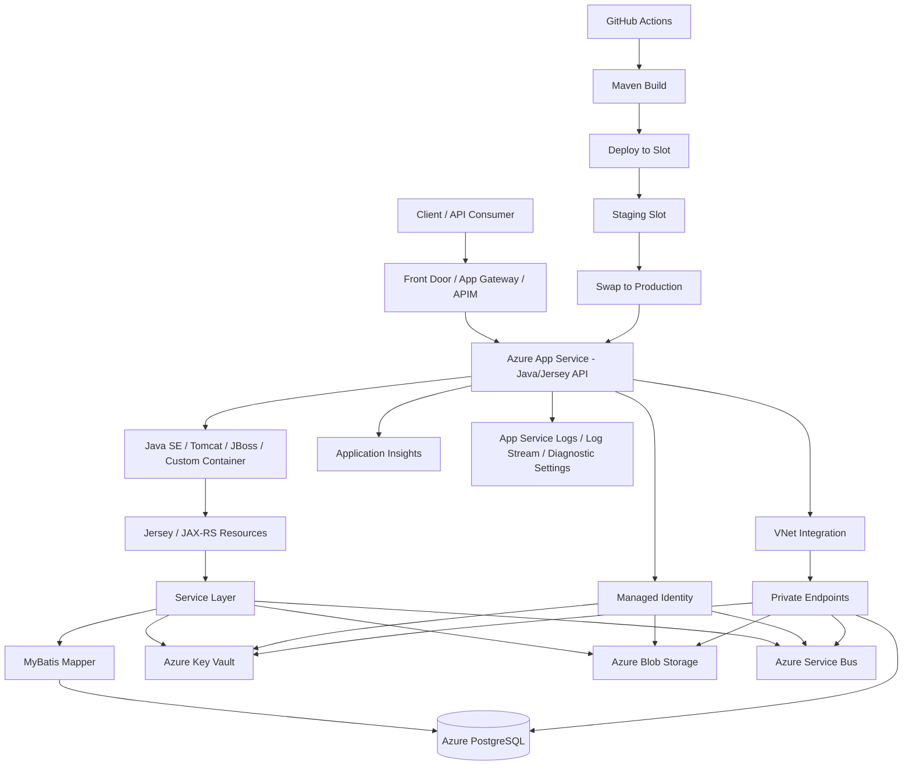

---

## 3. Decomposition Table - Practical Categories / Domain / Skills

| Area | Skill praktis | Kenapa penting |
|---|---|---|
| **1. Runtime Model** | Memilih Java SE, Tomcat, JBoss EAP, atau custom container | Jersey bisa berjalan sebagai WAR di servlet container atau sebagai standalone Java app. Pilihan runtime menentukan packaging, startup, config, logging, dan deployment flow. |
| **2. App Service Plan** | Memahami SKU, instance, scale up/down, shared compute | Semua app dalam App Service Plan berbagi VM instances yang sama; deployment slot, diagnostic logs, backup, dan WebJobs juga memakai resource plan tersebut. ([Microsoft Learn](https://learn.microsoft.com/en-us/azure/app-service/overview-hosting-plans?utm_source=chatgpt.com)) |
| **3. Java Packaging** | JAR, WAR, EAR, atau Docker image | Java SE cocok untuk executable JAR; Tomcat untuk WAR; JBoss EAP untuk WAR/EAR; custom container untuk runtime yang perlu kontrol lebih. ([Microsoft Learn](https://learn.microsoft.com/en-us/azure/app-service/configure-language-java-data-sources?utm_source=chatgpt.com)) |
| **4. Maven Build & Deploy** | `mvn package`, Maven plugin, GitHub Actions deploy | App Service mendukung deployment Java melalui Maven plugin dan GitHub Actions. ([Microsoft Learn](https://learn.microsoft.com/en-us/azure/app-service/deploy-github-actions?utm_source=chatgpt.com)) |
| **5. Deployment Slot** | Staging slot, production slot, swap, slot-specific settings | Deployment slots adalah live apps dengan hostname sendiri; content dan beberapa configuration bisa di-swap antar slot. ([Microsoft Learn](https://learn.microsoft.com/en-us/azure/app-service/deploy-staging-slots?utm_source=chatgpt.com)) |
| **6. Configuration Management** | App Settings, connection string, environment variable, Key Vault reference | Config runtime sebaiknya tidak hardcoded dalam artifact. App settings menjadi environment variable bagi aplikasi. |
| **7. Managed Identity** | System-assigned/user-assigned identity untuk app | Runtime app bisa mengakses Key Vault/resource Azure tanpa client secret manual. App Service dapat mengakses Key Vault menggunakan managed identity. ([Microsoft Learn](https://learn.microsoft.com/en-us/azure/app-service/overview-security?utm_source=chatgpt.com)) |
| **8. Key Vault Reference** | Secret value diambil dari Key Vault sebagai app setting | App Service dan Functions mendukung Key Vault references sebagai app settings/connection strings. ([Microsoft Learn](https://learn.microsoft.com/en-us/azure/app-service/app-service-key-vault-references?utm_source=chatgpt.com)) |
| **9. VNet Integration** | Outbound access dari App Service ke resource private | VNet Integration memungkinkan app mengakses resource di dalam atau melalui VNet. ([Microsoft Learn](https://learn.microsoft.com/en-us/azure/app-service/overview-vnet-integration?utm_source=chatgpt.com)) |
| **10. Access Restrictions** | Allow/deny inbound access by IP/VNet/service tag | Access restrictions bekerja seperti firewall inbound untuk App Service; default entry point App Service umumnya public kecuali dibatasi. ([Microsoft Learn](https://learn.microsoft.com/en-us/azure/app-service/overview-access-restrictions?utm_source=chatgpt.com)) |
| **11. Private Endpoint** | Private inbound access ke App Service | Dipakai jika backend App Service tidak boleh diakses lewat public endpoint langsung. |
| **12. Health Check** | `/health`, `/health/ready`, automatic unhealthy instance handling | App Service Health Check memakai path yang Anda berikan, misalnya `/health` atau `/api/health`, untuk memonitor instance. ([Microsoft Learn](https://learn.microsoft.com/en-us/azure/app-service/monitor-instances-health-check?utm_source=chatgpt.com)) |
| **13. Always On / Warmup** | Menjaga app tetap warm | Always On membantu mengurangi delay setelah idle, terutama pada Basic dan plan lebih tinggi. ([Microsoft Learn](https://learn.microsoft.com/en-us/troubleshoot/azure/app-service/web-apps-performance-faqs?utm_source=chatgpt.com)) |
| **14. Autoscale** | Scale out berdasarkan CPU, memory, HTTP queue, schedule | Scale harus diselaraskan dengan kapasitas PostgreSQL, bukan hanya CPU aplikasi. |
| **15. Logging & Monitoring** | Log stream, metrics, alerts, Application Insights, diagnostic settings | App Service menyediakan opsi monitoring untuk availability, performance, operation, diagnostic settings, metrics, alerts, dan logs. ([Microsoft Learn](https://learn.microsoft.com/en-us/azure/app-service/monitor-app-service?utm_source=chatgpt.com)) |
| **16. Security Baseline** | HTTPS only, managed identity, no secret in repo, restricted inbound, private dependency | App Service production harus punya identity, network restriction, secret management, dan observability yang jelas. |
| **17. Production Readiness** | Slot deployment, rollback, health probe, readiness endpoint, dependency timeout | Membuat deployment aman dan incident lebih mudah dipulihkan. |
| **18. Failure Diagnostics** | 502/503, startup failure, memory pressure, DB connection issue, DNS/private endpoint issue | Debug App Service butuh membaca runtime logs, platform logs, health check, dependency connectivity, dan config. |

---

## 4. Runtime Model untuk Java/Jersey

Azure App Service Java punya beberapa bentuk runtime.

| Runtime | Artifact | Cocok untuk |
|---|---|---|
| **Java SE** | Executable JAR | Jersey standalone dengan embedded server, misalnya Grizzly/Jetty/Tomcat embedded |
| **Tomcat** | WAR | Jersey/JAX-RS sebagai servlet-based web application |
| **JBoss EAP** | WAR/EAR | Enterprise Java workload yang butuh JBoss EAP runtime |
| **Custom Container** | Docker image | Butuh kontrol runtime sendiri, library OS tertentu, JVM tuning/custom startup lebih bebas |

Microsoft mendokumentasikan deployment dan runtime configuration untuk **Java SE, Tomcat, dan JBoss EAP** di App Service. Untuk Java SE, aplikasi biasanya dideploy sebagai JAR dengan embedded server; Tomcat menjalankan WAR; JBoss EAP menjalankan WAR/EAR. ([Microsoft Learn](https://learn.microsoft.com/en-us/azure/app-service/configure-language-java-deploy-run?utm_source=chatgpt.com))

### Untuk Jersey/JAX-RS, pilihan praktis

```text
Jersey WAR di Tomcat
  → cocok jika aplikasi memang servlet-based.

Jersey standalone JAR
  → cocok jika memakai embedded server dan ingin model executable JAR.

Custom container
  → cocok jika runtime internal perusahaan sudah distandardisasi lewat Docker.

JBoss EAP
  → cocok jika aplikasi enterprise Java bergantung pada JBoss-specific behavior.
```

Rule praktis:

```text
Kalau aplikasi existing berupa WAR → mulai dari Tomcat/JBoss App Service.
Kalau aplikasi modern berupa executable JAR → Java SE App Service.
Kalau environment harus sama persis dengan Docker lokal/Kubernetes → custom container.
```

---

## 5. App Service Plan - Jangan Disamakan dengan App

**App Service Plan** adalah kapasitas compute. **App Service App** adalah aplikasi yang berjalan di atas plan tersebut.

```text
App Service Plan
  ├── app-case-api-prod
  ├── app-workflow-api-prod
  └── app-report-api-prod
```

Jika beberapa app berada pada plan yang sama, mereka berbagi VM instances yang sama. Deployment slots juga berjalan pada VM instances yang sama dengan App Service Plan. Artinya, slot staging bukan compute gratis terpisah; ia tetap memakai kapasitas plan. ([Microsoft Learn](https://learn.microsoft.com/en-us/azure/app-service/overview-hosting-plans?utm_source=chatgpt.com))

### Implikasi praktis

| Keputusan | Dampak |
|---|---|
| Banyak app di satu plan | Bisa hemat biaya, tetapi resource contention naik |
| Satu critical app per plan | Isolation lebih baik, biaya lebih tinggi |
| Slot staging aktif | Memakai CPU/memory plan |
| Diagnostic logs aktif | Memakai resource plan |
| WebJobs berjalan | Memakai resource plan |
| Scale out plan | Semua app dalam plan ikut scale out |

Anti-pattern:

```text
Semua aplikasi production critical ditaruh dalam satu App Service Plan
karena ingin hemat biaya.
```

Risiko:

```text
Satu app memory leak bisa mengganggu app lain.
Traffic spike satu service memakan CPU plan bersama.
Cost attribution lebih kabur.
Scaling tidak granular per service.
```

---

## 6. Deployment Model

Ada beberapa cara deploy ke App Service:

| Cara deploy | Cocok untuk |
|---|---|
| Maven plugin | Java/Maven workflow sederhana |
| GitHub Actions | CI/CD modern dengan repo GitHub |
| ZIP deploy | Artifact-based deployment |
| Container image | Custom container via ACR/Docker registry |
| Azure DevOps | Enterprise pipeline berbasis Azure DevOps |
| Manual portal deploy | Dev/test cepat, bukan production default |

Microsoft App Service deployment best practices membagi deployment menjadi tiga komponen utama: **deployment sources, build pipelines, dan deployment mechanisms**. Untuk GitHub Actions, App Service mendukung build/deploy flow dan Java Tomcat project juga bisa dideploy melalui Maven plugin. ([Microsoft Learn](https://learn.microsoft.com/en-us/azure/app-service/deploy-best-practices?utm_source=chatgpt.com))

### Recommended production flow

```text
GitHub Actions
  → checkout
  → setup Java
  → mvn test
  → mvn package
  → security/static checks
  → deploy to staging slot
  → smoke test staging
  → swap staging to production
  → monitor
```

---

## 7. Deployment Slot

Deployment slot adalah live app dengan hostname sendiri. Slot bisa dipakai untuk staging, smoke test, blue-green deployment, dan rollback lewat swap. ([Microsoft Learn](https://learn.microsoft.com/en-us/azure/app-service/deploy-staging-slots?utm_source=chatgpt.com))

```text
app-case-api-prod
  ├── production slot
  └── staging slot
```

### Flow aman

```text
1. Deploy artifact baru ke staging slot.
2. Jalankan migration compatibility check.
3. Jalankan smoke test.
4. Warm up aplikasi.
5. Swap staging → production.
6. Monitor error/latency.
7. Jika gagal, swap back.
```

### Yang perlu diperhatikan

| Concern | Penjelasan |
|---|---|
| Slot setting | Beberapa setting harus “sticky” ke slot, misalnya connection string staging |
| Database migration | Jangan swap app yang tidak kompatibel dengan schema production |
| Warmup | Pastikan app sudah siap sebelum swap |
| Secrets | Secret staging dan production jangan tertukar |
| External callback URL | Callback/webhook harus disesuaikan per slot |
| Background worker | Jangan sampai staging memproses job production |

Anti-pattern:

```text
Deploy langsung ke production slot tanpa smoke test.
```

---

## 8. Configuration Management

App Service App Settings biasanya terekspos sebagai environment variable ke aplikasi. Untuk Java/Jersey, gunakan config abstraction, bukan hardcoded constant.

Contoh App Settings:

```text
APP_ENV=prod
KEYVAULT_URL=https://kv-case-api-prod.vault.azure.net/
POSTGRES_HOST=psql-case-prod.postgres.database.azure.com
POSTGRES_DB=case_management
SERVICEBUS_NAMESPACE=sb-case-prod.servicebus.windows.net
```

Jangan simpan ini dalam source code:

```properties
db.password=hardcoded-password
azure.client.secret=hardcoded-secret
```

### Prinsip config

```text
Artifact harus sama antar environment.
Config yang berubah antar environment masuk App Settings/Key Vault.
Secret masuk Key Vault.
Runtime identity mengambil secret/resource access.
```

---

## 9. Managed Identity

App Service mendukung managed identity agar app bisa mengakses Azure resources tanpa menyimpan credential manual. Security overview App Service menyebut App Service app dapat mengakses Key Vault dengan managed identity authentication. ([Microsoft Learn](https://learn.microsoft.com/en-us/azure/app-service/overview-security?utm_source=chatgpt.com))

### Pattern

```text
App Service
  → Managed Identity
  → Azure RBAC
  → Key Vault / Storage / Service Bus
```

### Role contoh

| Target | Role untuk app |
|---|---|
| Key Vault secret read | Key Vault Secrets User |
| Blob upload/download | Storage Blob Data Contributor |
| Service Bus send | Azure Service Bus Data Sender |
| Service Bus receive | Azure Service Bus Data Receiver |
| ACR pull for custom container | AcrPull |

Invariant:

```text
Runtime identity aplikasi tidak boleh Contributor ke subscription.
Berikan role hanya pada resource/scope yang dibutuhkan.
```

---

## 10. Key Vault References

App Service mendukung **Key Vault references** sebagai app settings atau connection strings. Ini memungkinkan app setting berisi referensi ke Key Vault, bukan secret value langsung. ([Microsoft Learn](https://learn.microsoft.com/en-us/azure/app-service/app-service-key-vault-references?utm_source=chatgpt.com))

Contoh konsep:

```text
DB_PASSWORD = @Microsoft.KeyVault(SecretUri=https://kv-case-prod.vault.azure.net/secrets/db-password/...)
```

Atau app membaca langsung via Azure SDK:

```text
Java App
  → DefaultAzureCredential
  → SecretClient
  → Key Vault
```

### Pilih Key Vault reference atau SDK?

| Pilihan | Cocok untuk |
|---|---|
| **Key Vault reference** | Secret sederhana yang ingin dimasukkan sebagai environment variable |
| **Azure SDK SecretClient** | Secret loading dinamis, custom cache, rotation handling lebih eksplisit |
| **App Configuration + Key Vault** | Config/feature flag lebih kompleks |

Untuk production Java/Jersey, saya biasanya memilih:

```text
Non-secret config → App Settings / App Configuration
Secret sederhana → Key Vault reference
Secret dengan lifecycle khusus → Azure SDK + cache strategy
```

---

## 11. VNet Integration

App Service **VNet Integration** memungkinkan aplikasi mengakses resource di dalam atau melalui Azure Virtual Network. Ini adalah fitur outbound dari App Service menuju private dependency. ([Microsoft Learn](https://learn.microsoft.com/en-us/azure/app-service/overview-vnet-integration?utm_source=chatgpt.com))

Contoh:

```text
App Service
  → VNet Integration subnet
  → Private Endpoint
  → PostgreSQL / Key Vault / Storage / Service Bus
```

### Penting: inbound vs outbound

| Kebutuhan | Fitur |
|---|---|
| App Service mengakses PostgreSQL private | VNet Integration |
| App Service mengakses Key Vault private endpoint | VNet Integration + Private DNS |
| Client internal mengakses App Service secara private | Private Endpoint untuk App Service |
| Membatasi siapa bisa akses App Service public endpoint | Access Restrictions |
| Memaksa semua traffic masuk lewat App Gateway/APIM | Access Restrictions + private endpoint/topology |

Jangan salah asumsi:

```text
VNet Integration tidak otomatis membuat App Service hanya bisa diakses private.
```

---

## 12. Access Restrictions

Access restrictions di App Service bekerja seperti firewall inbound untuk memblokir/filter traffic. Access restrictions berlaku untuk inbound access; default entry point App Service umumnya public jika tidak dibatasi. ([Microsoft Learn](https://learn.microsoft.com/en-us/azure/app-service/overview-access-restrictions?utm_source=chatgpt.com))

Contoh pattern:

```text
Allow:
  Application Gateway subnet / Front Door / APIM outbound IP/service tag
Deny:
  All other inbound traffic
```

### Use case

| Use case | Pola |
|---|---|
| Backend hanya boleh dari APIM | Allow APIM, deny all |
| Backend hanya boleh dari App Gateway | Allow App Gateway subnet/IP, deny all |
| Internal admin API | Allow corporate VPN/VNet, deny internet |
| Temporary debugging | Time-limited allowlist IP |
| Production hardening | Default deny inbound kecuali gateway |

Catatan penting: access restrictions tidak berlaku untuk traffic yang masuk melalui private endpoint. ([Microsoft Learn](https://learn.microsoft.com/en-us/azure/app-service/overview-access-restrictions?utm_source=chatgpt.com))

---

## 13. Health Check

App Service Health Check menggunakan path yang Anda berikan, misalnya `/health` atau `/api/health`, untuk memonitor instance. ([Microsoft Learn](https://learn.microsoft.com/en-us/azure/app-service/monitor-instances-health-check?utm_source=chatgpt.com))

Untuk Java/Jersey, jangan hanya membuat endpoint yang selalu `200 OK`.

### Minimal endpoint

```http
GET /health/live
```

```json
{
  "status": "UP"
}
```

### Readiness endpoint

```http
GET /health/ready
```

```json
{
  "status": "UP",
  "checks": {
    "database": "UP",
    "keyVault": "UP",
    "serviceBus": "UP"
  }
}
```

### Jersey example

```java
import jakarta.ws.rs.GET;
import jakarta.ws.rs.Path;
import jakarta.ws.rs.Produces;
import jakarta.ws.rs.core.MediaType;
import jakarta.ws.rs.core.Response;

@Path("/health")
public class HealthResource {

    @GET
    @Path("/live")
    @Produces(MediaType.APPLICATION_JSON)
    public Response live() {
        return Response.ok("{\"status\":\"UP\"}").build();
    }

    @GET
    @Path("/ready")
    @Produces(MediaType.APPLICATION_JSON)
    public Response ready() {
        boolean databaseOk = checkDatabasePool();
        boolean configOk = checkRequiredConfig();

        if (databaseOk && configOk) {
            return Response.ok("{\"status\":\"UP\"}").build();
        }

        return Response.status(Response.Status.SERVICE_UNAVAILABLE)
                .entity("{\"status\":\"DOWN\"}")
                .type(MediaType.APPLICATION_JSON)
                .build();
    }

    private boolean checkDatabasePool() {
        // Use a lightweight check. Avoid expensive queries.
        return true;
    }

    private boolean checkRequiredConfig() {
        return true;
    }
}
```

Prinsip:

```text
/live  = process masih hidup
/ready = instance siap menerima traffic
```

---

## 14. Always On dan Startup

Untuk Java app, startup bisa relatif berat: classpath scanning, DI container, Jersey resource initialization, MyBatis mapper load, DB pool init, TLS warmup, dan cache warmup. Always On membantu menjaga app tetap warm dan mengurangi delay setelah idle pada Basic dan plan lebih tinggi. ([Microsoft Learn](https://learn.microsoft.com/en-us/troubleshoot/azure/app-service/web-apps-performance-faqs?utm_source=chatgpt.com))

### Yang perlu dicek

| Area | Risiko |
|---|---|
| Startup lambat | Health probe timeout, deployment dianggap gagal |
| DB pool init agresif | Membebani PostgreSQL saat scale out |
| Classpath scanning berat | Cold start panjang |
| Large config load | Startup tergantung Key Vault/network |
| Migration saat startup | Instance baru bisa lambat atau gagal |
| Cache warmup blocking | Readiness tertunda |

Rekomendasi:

```text
Buat startup cepat.
Pisahkan liveness dan readiness.
Jangan jalankan migration schema berat di setiap startup instance.
Gunakan connection pool dengan batas jelas.
```

---

## 15. Autoscale dan PostgreSQL/MyBatis

Autoscale App Service harus diselaraskan dengan kapasitas dependency, terutama PostgreSQL.

Contoh:

```text
App Service instances: 6
HikariCP maxPoolSize: 20
Total potential DB connections: 120
```

Jika PostgreSQL hanya aman untuk 80 connection, scale out aplikasi bisa menyebabkan incident.

### Rule

```text
max_app_instances × max_db_pool_per_instance
  harus <= safe_postgres_connection_budget
```

### Scaling signal

| Signal | Catatan |
|---|---|
| CPU | Baik untuk compute-bound workload |
| Memory | Penting untuk Java heap/metaspace |
| HTTP queue | Baik untuk request pressure |
| Response time | Harus hati-hati, bisa dipengaruhi dependency |
| Schedule | Berguna untuk traffic jam kerja |
| Custom metric | Ideal jika punya metric bisnis/queue |

Anti-pattern:

```text
Autoscale berdasarkan CPU saja,
sementara bottleneck sebenarnya PostgreSQL connection pool.
```

---

## 16. Logging & Monitoring

App Service menyediakan monitoring untuk availability, performance, operation, diagnostic settings, Application Insights, log stream, metrics, quotas, alerts, dan activity logs. ([Microsoft Learn](https://learn.microsoft.com/en-us/azure/app-service/monitor-app-service?utm_source=chatgpt.com))

### Minimal telemetry

| Layer | Yang dipantau |
|---|---|
| App Service platform | CPU, memory, HTTP 5xx, response time, instance count |
| Java runtime | heap, GC, thread pool, DB pool |
| Jersey API | request count, latency, status code, route |
| MyBatis/PostgreSQL | query latency, connection pool usage, errors |
| Dependency | Key Vault, Blob, Service Bus, external API latency |
| Gateway | APIM/App Gateway/Front Door status code and latency |
| Logs | structured JSON logs with correlation ID |
| Traces | distributed tracing via W3C `traceparent` |

### Logging invariant

```text
Log harus menjawab:
request apa,
dari siapa,
route mana,
correlation id apa,
dependency mana yang lambat/gagal,
instance mana yang memproses,
dan error class apa.
```

---

## 17. App Service + Application Insights

Untuk Java/Jersey, Application Insights berguna untuk:

```text
request telemetry
dependency telemetry
exceptions
performance counters
availability tests
distributed tracing
application map
```

Tetapi jangan hanya mengandalkan auto-collection. Untuk domain penting, tambahkan structured logs dan business event log.

Contoh field log:

```json
{
  "timestamp": "2026-07-13T10:15:00+07:00",
  "level": "INFO",
  "service": "case-api",
  "env": "prod",
  "traceId": "abc123",
  "userId": "u-123",
  "caseId": "case-456",
  "operation": "submitCase",
  "durationMs": 183,
  "status": "SUCCESS"
}
```

---

## 18. Network Pattern untuk Production

### Pattern 1 - Public API with gateway

```text
Client
  → Front Door / Application Gateway / APIM
  → App Service
  → private dependencies
```

Controls:

```text
App Service access restriction:
  allow gateway only
  deny all else

Dependencies:
  PostgreSQL private
  Key Vault private
  Storage private
```

### Pattern 2 - Internal API

```text
Internal client / on-prem / VPN
  → private endpoint / internal gateway
  → App Service
```

Controls:

```text
No broad public inbound.
Private DNS configured.
Access via VNet/hybrid route.
```

### Pattern 3 - Backend-only App Service

```text
APIM
  → App Service backend
  → PostgreSQL / Service Bus
```

Controls:

```text
APIM handles JWT/rate limit.
App Service validates authorization again if needed.
Backend cannot be bypassed publicly.
```

---

## 19. Database Integration - MyBatis/PostgreSQL

Untuk App Service + MyBatis + PostgreSQL, fokus pada connection lifecycle.

### Recommended config

```properties
db.pool.maximumPoolSize=10
db.pool.minimumIdle=2
db.pool.connectionTimeout=3000
db.pool.validationTimeout=1000
db.pool.idleTimeout=600000
db.pool.maxLifetime=1800000
```

### Invariant

```text
Jangan buat connection per request.
Gunakan pool.
Batasi max pool per instance.
Set timeout eksplisit.
Query lambat harus terlihat di telemetry.
Transaction boundary harus pendek.
```

### Common DB failure

| Symptom | Kemungkinan penyebab |
|---|---|
| App startup gagal | Secret/config DB salah |
| Timeout ke DB | VNet/private DNS/NSG/firewall salah |
| Too many connections | Pool × instance terlalu besar |
| Latency spike | Query/index/lock issue |
| 502 dari gateway | App thread stuck menunggu DB |
| Readiness DOWN | DB pool tidak bisa acquire connection |

---

## 20. Long Polling, WebSocket, Binary Upload

Untuk App Service, workload non-trivial seperti long polling, WebSocket, dan upload besar harus diperlakukan sebagai design decision, bukan default.

| Workload | Hal yang dicek |
|---|---|
| **Long polling** | Timeout gateway, thread usage, max concurrent requests |
| **WebSocket** | Gateway/proxy compatibility, sticky session jika ada local state |
| **Binary upload** | Request size, memory buffering, timeout, virus scan, direct-to-Blob pattern |
| **Large download** | Streaming, response timeout, CDN/Blob direct access |
| **SSE** | Idle timeout, buffering, gateway compatibility |

Rekomendasi untuk upload besar:

```text
Client
  → API minta izin upload
  → API validasi permission
  → API beri short-lived upload URL / instruction
  → Client upload langsung ke Blob Storage
  → Event/queue trigger processing
```

Jangan selalu proxy file besar lewat Java/Jersey service.

---

## 21. Security Baseline

Minimal baseline production:

```text
1. HTTPS only.
2. Managed identity enabled.
3. Secret di Key Vault, bukan repo.
4. Runtime identity diberi least privilege.
5. Access restriction untuk backend App Service.
6. Private dependency access via VNet/private endpoint bila diperlukan.
7. Health endpoint tidak membocorkan detail sensitif.
8. App settings slot-specific untuk secret/env berbeda.
9. Deployment slot untuk release aman.
10. Logs dan metrics aktif.
11. Alert untuk 5xx, latency, memory, CPU, unhealthy instance.
12. No direct public backend bypass jika memakai APIM/App Gateway.
```

---

## 22. Production Deployment Flow

```text
1. Developer merge ke main/release branch.
2. GitHub Actions build Maven.
3. Unit/integration tests.
4. Static/security scan.
5. Package JAR/WAR/container.
6. Deploy ke staging slot.
7. Apply backward-compatible DB migration jika diperlukan.
8. Smoke test staging.
9. Warm up staging.
10. Swap staging to production.
11. Monitor health/5xx/latency/logs.
12. Rollback via swap back jika ada issue.
```

### Deployment compatibility rule

```text
Database migration harus backward compatible dengan versi app lama dan baru
selama periode swap/rollback.
```

Anti-pattern:

```text
Deploy app baru yang butuh kolom baru,
tetapi migration belum selesai.
```

Atau:

```text
Migration menghapus kolom yang masih dipakai versi app lama,
lalu rollback menjadi gagal.
```

---

## 23. GitHub Actions Skeleton

Contoh konseptual untuk deploy Java artifact ke App Service:

```yaml
name: deploy-case-api

on:
  push:
    branches:
      - main

permissions:
  id-token: write
  contents: read

jobs:
  build-and-deploy:
    runs-on: ubuntu-latest

    steps:
      - uses: actions/checkout@v4

      - name: Set up Java
        uses: actions/setup-java@v4
        with:
          distribution: temurin
          java-version: "17"

      - name: Build
        run: mvn -B clean verify

      - name: Azure login
        uses: azure/login@v2
        with:
          client-id: ${{ secrets.AZURE_CLIENT_ID }}
          tenant-id: ${{ secrets.AZURE_TENANT_ID }}
          subscription-id: ${{ secrets.AZURE_SUBSCRIPTION_ID }}

      - name: Deploy to staging slot
        uses: azure/webapps-deploy@v3
        with:
          app-name: app-case-api-prod
          slot-name: staging
          package: target/*.war
```

Catatan penting:

```text
Gunakan workload identity federation/OIDC untuk login Azure jika tersedia.
Jangan simpan client secret jangka panjang untuk production pipeline.
```

---

## 24. Azure CLI Cheatsheet

### Lihat App Service

```bash
az webapp list --output table
```

### Lihat detail app

```bash
az webapp show \
  --resource-group "<rg>" \
  --name "<app-name>" \
  --output table
```

### Lihat App Service Plan

```bash
az appservice plan list --output table
```

### Lihat app settings

```bash
az webapp config appsettings list \
  --resource-group "<rg>" \
  --name "<app-name>"
```

### Set app setting

```bash
az webapp config appsettings set \
  --resource-group "<rg>" \
  --name "<app-name>" \
  --settings APP_ENV=prod
```

### Enable managed identity

```bash
az webapp identity assign \
  --resource-group "<rg>" \
  --name "<app-name>"
```

### Lihat managed identity principal id

```bash
az webapp identity show \
  --resource-group "<rg>" \
  --name "<app-name>" \
  --query principalId \
  --output tsv
```

### Lihat deployment slot

```bash
az webapp deployment slot list \
  --resource-group "<rg>" \
  --name "<app-name>" \
  --output table
```

### Swap slot

```bash
az webapp deployment slot swap \
  --resource-group "<rg>" \
  --name "<app-name>" \
  --slot staging \
  --target-slot production
```

### Log stream

```bash
az webapp log tail \
  --resource-group "<rg>" \
  --name "<app-name>"
```

---

## 25. Common Failure Modes

| Symptom | Kemungkinan root cause | Cara berpikir |
|---|---|---|
| App gagal start | JAR/WAR salah, Java version salah, startup command salah | Cek log stream dan deployment logs |
| 502 Bad Gateway | App tidak listen pada port/path benar, startup timeout, crash | Cek platform log + app log |
| 503 Service Unavailable | Instance unhealthy, plan resource pressure, app crash | Cek health check, CPU/memory |
| Slot swap berhasil tapi user error | Slot-specific setting salah, DB schema incompatible | Cek sticky setting dan migration |
| Key Vault reference tidak resolve | Managed identity belum punya role, wrong vault URI, private DNS issue | Cek identity + role + network |
| App bisa local, gagal di Azure | Config/env/secret berbeda, runtime mismatch | Compare app settings dan artifact |
| App gagal connect PostgreSQL | VNet integration/private DNS/firewall/SSL/secret | Test DNS dan TCP dari runtime |
| Autoscale membuat DB down | Pool size × instance terlalu besar | Hitung DB connection budget |
| Health check hijau tapi API gagal | Health endpoint terlalu dangkal | Readiness harus cek dependency penting |
| Upload besar timeout | Gateway/App Service timeout, buffering, memory | Gunakan direct-to-Blob pattern |

---

## 26. Anti-pattern yang Harus Dihindari

| Anti-pattern | Risiko |
|---|---|
| App Service dianggap “server biasa” | Salah ekspektasi terhadap filesystem, lifecycle, scaling |
| Semua app production dalam satu App Service Plan | Resource contention dan blast radius |
| Deploy langsung ke production tanpa slot | Rollback lambat |
| Secret disimpan di app settings plain tanpa Key Vault governance | Secret leakage |
| Managed identity diberi Contributor subscription | Runtime privilege terlalu besar |
| Health check selalu 200 | Gateway mengirim traffic ke instance tidak siap |
| Migration destructive bersamaan dengan app deploy | Rollback gagal |
| Autoscale tanpa DB capacity planning | PostgreSQL overload |
| VNet Integration dianggap inbound private access | Salah desain network |
| Access restriction lupa diset saat memakai gateway | Backend bisa dibypass |
| Staging slot ikut consume job/message production | Duplicate processing |
| Tidak ada structured logs/correlation ID | Incident debugging lambat |

---

## 27. Practical Design Template

```text
Workload:
  name: case-api
  runtime: Java 17 + Jersey
  package: WAR / JAR / container
  database: Azure PostgreSQL
  data access: MyBatis
  secrets: Key Vault
  observability: Application Insights + Log Analytics
  exposure: APIM / App Gateway / internal
  deployment: GitHub Actions

App Service:
  plan: asp-case-prod-sea-001
  app: app-case-api-prod-sea-001
  slot: staging
  identity: system-assigned or user-assigned managed identity

Config:
  APP_ENV=prod
  KEYVAULT_URL=...
  POSTGRES_HOST=...
  POSTGRES_DB=...
  LOG_LEVEL=INFO

Security:
  HTTPS only
  managed identity enabled
  Key Vault Secrets User on specific vault
  Storage Blob Data Contributor on specific container/storage
  access restriction allows only gateway/APIM
  no broad public backend access

Networking:
  VNet Integration enabled
  private DNS works from App Service
  PostgreSQL private access/private endpoint
  Key Vault private endpoint if required
  Storage private endpoint if required

Health:
  /health/live
  /health/ready

Deployment:
  deploy to staging slot
  smoke test
  swap to production
  monitor
  rollback by swap back
```

---

## 28. Mental Model Final

Pegang model ini:

```text
Azure App Service
  = managed web/API runtime

App Service Plan
  = shared compute capacity

Deployment Slot
  = safer release and rollback boundary

Managed Identity
  = secretless runtime identity

Key Vault Reference
  = secret projection into app settings

VNet Integration
  = outbound private access from app to dependencies

Access Restrictions / Private Endpoint
  = inbound access control

Health Check
  = instance traffic eligibility signal

Application Insights / Azure Monitor
  = runtime visibility
```

Kalimat kunci:

```text
App Service cocok untuk Java/Jersey API jika Anda ingin managed runtime,
deployment slot, managed identity, VNet dependency access, dan observability
tanpa mengelola Kubernetes.

Namun production readiness tetap bergantung pada:
config separation,
secret management,
network restriction,
health check,
autoscale discipline,
database connection budgeting,
dan deployment rollback strategy.
```

---

# Status

**Azure Seri 7/18 selesai.**

## Rekomendasi materi berikutnya

**Azure Seri 8 - Azure Container Apps for Microservices & Workers: container app environment, revision, ingress, scaling, jobs, managed identity, Dapr, queue/event-driven worker, dan production pattern untuk Java/Jersey service.**

---

**Sources:**

- [Overview of Azure App Service](https://learn.microsoft.com/en-us/azure/app-service/overview?utm_source=chatgpt.com)

## Response:
7/13/2026, 8:14:36 PM

Lanjut ke **Seri 8/18**. Kita masuk ke Azure Container Apps sebagai sweet spot antara App Service dan AKS: containerized API/worker/job tanpa mengelola Kubernetes langsung.

# Azure Seri 8/18 - Azure Container Apps for Microservices & Workers

## 1. Introduction

**Azure Container Apps / ACA** adalah platform serverless untuk menjalankan aplikasi berbasis container tanpa mengelola Kubernetes cluster secara langsung. Ia cocok untuk Java/Jersey API, background worker, queue consumer, scheduled job, event-driven processing, dan microservice yang sudah dikemas sebagai Docker image. Microsoft mendeskripsikan Azure Container Apps sebagai platform serverless untuk menjalankan containerized applications sambil mengurangi kebutuhan mengelola infrastructure. ([Microsoft Learn](https://learn.microsoft.com/vi-vn/Azure/container-apps/overview?utm_source=chatgpt.com))

Untuk stack Anda, ACA cocok ketika:

```text id="8b2vyo"
Aplikasi sudah containerized
Butuh deploy Docker image dari ACR
Butuh managed identity
Butuh HTTP ingress internal/external
Butuh worker event-driven / queue consumer
Butuh scale-to-zero atau autoscale
Butuh revision traffic split
Tidak butuh Kubernetes API penuh
Tidak ingin mengelola node pool/cluster upgrade
```

Posisinya di antara App Service dan AKS:

```text id="xxglin"
App Service       = managed web/API hosting
Container Apps    = serverless container API/worker/job
AKS               = managed Kubernetes platform
```

---

## 2. Diagram - Azure Container Apps Runtime Map

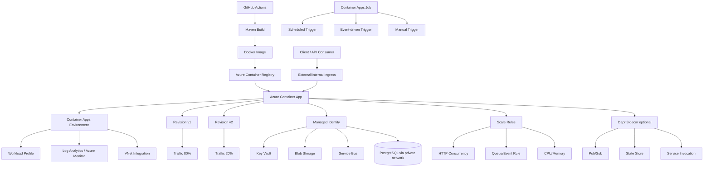

Mental model singkat:

```text id="k3g5cp"
Environment    = boundary shared untuk container apps dan jobs
Container App  = long-running container service
Revision       = immutable version snapshot
Ingress        = cara app menerima traffic
Scale rule     = cara app naik/turun replica
Job            = finite-duration container task
Managed ID     = identity untuk akses Azure resource
Dapr           = optional microservice building blocks
```

---

## 3. Decomposition Table - Practical Categories / Domain / Skills

| Area | Skill praktis | Kenapa penting |
|---|---|---|
| **1. Container Apps Environment** | Memahami environment sebagai boundary untuk apps/jobs, networking, observability, dan runtime management | Environment adalah secure boundary untuk satu atau lebih container apps dan jobs; runtime ACA mengelola OS upgrades, scale operations, failover, dan resource balancing. ([Microsoft Learn](https://learn.microsoft.com/en-us/azure/container-apps/environment?utm_source=chatgpt.com)) |
| **2. Workload Profiles** | Memilih Consumption, Dedicated, atau Flex | Workload profile menentukan cara app scale, isolation level, dan billing. Azure Container Apps mendukung Consumption, Dedicated, dan Flex workload profile types. ([Microsoft Learn](https://learn.microsoft.com/en-us/azure/container-apps/workload-profiles-overview?utm_source=chatgpt.com)) |
| **3. Container App** | Menjalankan long-running API/worker container | Cocok untuk Java/Jersey API, REST backend, worker, dan service yang berjalan terus atau autoscale berdasarkan traffic/event. |
| **4. Container Apps Jobs** | Menjalankan task finite-duration: manual, scheduled, atau event-driven | Jobs cocok untuk task yang selesai lalu berhenti, seperti cleanup, batch kecil-menengah, data processing, dan queue-triggered task. ([Microsoft Learn](https://learn.microsoft.com/en-us/azure/container-apps/jobs?utm_source=chatgpt.com)) |
| **5. Revision** | Deploy immutable version, traffic split, rollback, blue/green/canary | Revisions adalah snapshot immutable dari versi container app dan menjadi mekanisme change management/rollback di ACA. ([Microsoft Learn](https://learn.microsoft.com/en-us/azure/container-apps/revisions?utm_source=chatgpt.com)) |
| **6. Ingress** | External/internal ingress, target port, transport, traffic routing | Ingress menentukan bagaimana external traffic mencapai aplikasi, termasuk public web, VNet, dan app lain dalam environment. ([Microsoft Learn](https://learn.microsoft.com/en-us/azure/container-apps/ingress-overview?utm_source=chatgpt.com)) |
| **7. Scaling Rules** | HTTP concurrency, CPU/memory, Azure Queue, Service Bus, Event Hubs, custom KEDA scaler | Container Apps scale rules bisa memakai managed identity untuk autentikasi ke Azure services. ([Microsoft Learn](https://learn.microsoft.com/en-us/azure/container-apps/scale-app?utm_source=chatgpt.com)) |
| **8. Managed Identity** | System-assigned/user-assigned identity untuk akses Azure resource | Managed identity memungkinkan container app mengakses resource yang dilindungi Microsoft Entra tanpa mengelola secret manual. ([Microsoft Learn](https://learn.microsoft.com/en-us/azure/container-apps/managed-identity?utm_source=chatgpt.com)) |
| **9. ACR Image Pull Identity** | Pull image dari Azure Container Registry memakai managed identity | ACA mendukung image pull dari ACR dengan managed identity, sehingga tidak perlu username/password registry. ([Microsoft Learn](https://learn.microsoft.com/en-us/azure/container-apps/managed-identity-image-pull?utm_source=chatgpt.com)) |
| **10. Secrets** | App-level secrets, env var reference, scale rule secret reference | Azure Container Apps mendukung penyimpanan sensitive configuration values di tingkat app dan secrets tersedia untuk revisions. ([Microsoft Learn](https://learn.microsoft.com/en-us/azure/container-apps/manage-secrets?utm_source=chatgpt.com)) |
| **11. Networking** | VNet integration, internal ingress, private endpoint, NAT, UDR | Workload profile environment mendukung UDR, egress melalui NAT Gateway, dan private endpoint scenario. ([Microsoft Learn](https://learn.microsoft.com/en-us/azure/container-apps/networking?utm_source=chatgpt.com)) |
| **12. Private Endpoint for ACA** | Private inbound ke ACA environment via Private Link | Private endpoint memungkinkan client di private network mengakses ACA environment melalui private IP dan menghilangkan exposure public internet. ([Microsoft Learn](https://learn.microsoft.com/en-us/azure/container-apps/private-endpoints-with-dns?utm_source=chatgpt.com)) |
| **13. Dapr Integration** | Service invocation, pub/sub, bindings, state, secret store | ACA menyediakan fully managed Dapr APIs, components, dan features untuk microservice scenarios. ([Microsoft Learn](https://learn.microsoft.com/en-us/azure/container-apps/dapr-overview?utm_source=chatgpt.com)) |
| **14. Observability** | Logs, metrics, alerts, Log Analytics, OpenTelemetry/Application Insights via code | ACA observability memakai Azure Monitor metrics, alerts, dan Log Analytics untuk system/application logs. ([Microsoft Learn](https://learn.microsoft.com/en-us/azure/container-apps/observability?utm_source=chatgpt.com)) |
| **15. GitHub Actions Deployment** | Build image, push ACR, update ACA revision | ACA mendukung GitHub Actions untuk publish revisions. ([Microsoft Learn](https://learn.microsoft.com/en-us/azure/container-apps/whats-new?utm_source=chatgpt.com)) |
| **16. Java Runtime Tuning** | JVM memory, CPU/memory request, startup, readiness, GC, connection pool | Java container harus di-tune agar cocok dengan replica lifecycle dan autoscaling. |
| **17. Worker Pattern** | Queue consumer, scheduler, idempotency, retry, poison/dead-letter | ACA sangat cocok untuk worker container, tetapi correctness tetap bergantung pada idempotency dan retry discipline. |
| **18. Production Readiness** | Rollback, min/max replicas, health probes, private dependency, rate limiting, alerts | Container berhasil jalan belum berarti production-ready. |

---

## 4. Container Apps Environment

**Container Apps Environment** adalah boundary yang mengelompokkan container apps dan jobs. Di dalam environment, ACA runtime menangani OS upgrades, scaling operations, failover procedures, dan resource balancing. ([Microsoft Learn](https://learn.microsoft.com/en-us/azure/container-apps/environment?utm_source=chatgpt.com))

Contoh:

```text id="xu7dyv"
cae-regulatory-prod-sea-001
  ├── ca-case-api-prod
  ├── ca-case-worker-prod
  ├── ca-document-worker-prod
  ├── ca-camunda-worker-prod
  └── caj-report-rebuild-prod
```

Environment biasanya menjadi boundary untuk:

```text id="ysbqgf"
networking
logging destination
workload profile
Dapr components
internal service discovery
operational grouping
security boundary
```

### Design rule

```text id="pnxug6"
Jangan campur semua aplikasi semua environment dalam satu ACA environment.
Pisahkan minimal berdasarkan environment dan security boundary.
```

Contoh yang lebih sehat:

```text id="5lhdm8"
cae-regulatory-dev-sea-001
cae-regulatory-test-sea-001
cae-regulatory-prod-sea-001
```

---

## 5. Workload Profiles

Azure Container Apps mendukung beberapa workload profile types: **Consumption, Dedicated, dan Flex**. Setiap profile menentukan bagaimana app scale, resource isolation, dan billing bekerja. ([Microsoft Learn](https://learn.microsoft.com/en-us/azure/container-apps/workload-profiles-overview?utm_source=chatgpt.com))

| Profile | Cocok untuk | Catatan |
|---|---|---|
| **Consumption** | Bursty workload, scale-to-zero, API/worker yang tidak selalu aktif | Cocok untuk cost efficiency, tetapi perhatikan cold start dan resource limit |
| **Dedicated** | Workload steady, butuh isolation/performance lebih predictable | Cocok untuk production service dengan traffic stabil |
| **Flex** | Skenario yang butuh fleksibilitas baru sesuai dukungan platform | Perlu cek standard internal dan availability region/SKU |
| **Consumption-only environment** | Legacy model | Microsoft docs menyebut workload profiles environment sebagai default, sedangkan consumption-only environment sebagai legacy. ([Microsoft Learn](https://learn.microsoft.com/en-us/azure/container-apps/environment?utm_source=chatgpt.com)) |

Decision praktis:

```text id="b9z8l7"
Traffic jarang/bursty → Consumption
Traffic stabil/high-throughput → Dedicated
Butuh private/networking advanced → workload profiles environment
Environment lama → validasi apakah masih consumption-only legacy
```

---

## 6. Container App vs Container Apps Job

### Container App

Dipakai untuk service yang berjalan terus atau autoscale berdasarkan load.

```text id="v9u402"
Java/Jersey REST API
queue worker long-running
event consumer
internal microservice
Camunda external worker
```

### Container Apps Job

Dipakai untuk task yang selesai lalu berhenti. Jobs dapat berjalan manual, scheduled, atau event-driven. ([Microsoft Learn](https://learn.microsoft.com/en-us/azure/container-apps/jobs?utm_source=chatgpt.com))

```text id="t7myal"
nightly cleanup
scheduled reconciliation
one-off reindex
report rebuild
queue-triggered finite processor
migration helper
data export task
```

Decision rule:

```text id="dwc8u9"
Butuh menerima request terus-menerus → Container App
Butuh proses task sampai selesai lalu stop → Container Apps Job
Butuh parallel batch sangat besar → Azure Batch, bukan ACA Job default
```

---

## 7. Revision Model

ACA memakai **revision** untuk change management. Revision adalah snapshot immutable dari versi container app; begitu dibuat, revision tidak berubah. Ini mendukung tracking, rollback, dan traffic management. ([Microsoft Learn](https://learn.microsoft.com/en-us/azure/container-apps/revisions?utm_source=chatgpt.com))

```text id="pabkzk"
ca-case-api-prod
  ├── revision: ca-case-api-prod--v1
  └── revision: ca-case-api-prod--v2
```

Traffic split:

```text id="m4q1ez"
v1: 90%
v2: 10%
```

Atau blue/green:

```text id="ecp3d8"
v1: 100%
v2: 0%  → smoke test
v2: 100% after promote
```

### Revision invariant

```text id="3iqwhi"
Revision immutable.
Config change tertentu membuat revision baru.
Rollback = pindahkan traffic ke revision lama.
Migration database harus backward-compatible.
```

Anti-pattern:

```text id="7npkjf"
Deploy revision baru yang butuh schema baru,
lalu langsung matikan revision lama,
padahal migration belum backward-compatible.
```

---

## 8. Ingress Model

Ingress menentukan bagaimana traffic mencapai container app. ACA bisa mengekspos app ke public web, ke VNet, atau ke container apps lain dalam environment. ([Microsoft Learn](https://learn.microsoft.com/en-us/azure/container-apps/ingress-overview?utm_source=chatgpt.com))

| Ingress type | Cocok untuk |
|---|---|
| **External ingress** | Public API/web endpoint |
| **Internal ingress** | Private API dalam VNet/environment |
| **No ingress** | Worker/consumer/background app |
| **TCP ingress** | Non-HTTP workload tertentu |
| **HTTP ingress** | REST API, web app, HTTP worker |

Contoh untuk Java/Jersey API:

```text id="980d8n"
Client
  → Front Door / App Gateway / APIM
  → ACA external/internal ingress
  → Java/Jersey container
```

Contoh untuk worker:

```text id="sfpvi0"
Service Bus Queue
  → scale rule
  → ACA worker replicas
  → no public ingress
```

### Target port

Pastikan container listen pada port yang dikonfigurasi ACA.

```text id="mrfqah"
Container listens: 8080
ACA target port: 8080
```

Jika salah:

```text id="dlciy5"
Revision aktif, tapi traffic gagal / 502 / unhealthy.
```

---

## 9. External vs Internal Exposure

### External API

```text id="l1a2fs"
Internet client
  → Front Door WAF / APIM
  → ACA external ingress
```

Cocok untuk public/partner API, tetapi sebaiknya tetap pakai gateway/WAF/API policy jika production-facing.

### Internal API

```text id="rjqgpe"
Internal service / on-prem / VPN
  → private network
  → ACA internal ingress
```

Cocok untuk service-to-service, backend private, dan workload enterprise.

### Private endpoint for ACA

Private endpoint memungkinkan client di private network mengakses ACA environment melalui Azure Private Link dengan private IP, sehingga exposure public internet dapat dihilangkan. ([Microsoft Learn](https://learn.microsoft.com/en-us/azure/container-apps/private-endpoints-with-dns?utm_source=chatgpt.com))

Production rule:

```text id="kjbno9"
Backend business API sebaiknya tidak langsung public jika harus melewati APIM/App Gateway.
Gunakan internal ingress/private endpoint/network restriction sesuai topology.
```

---

## 10. Scaling Rules

ACA scale rule bisa berdasarkan HTTP traffic, resource metrics, atau event source. Untuk event-driven scaling, ACA memakai model KEDA-style scaler. Dokumentasi Microsoft menyebut Container Apps scale rules dapat memakai managed identity untuk autentikasi ke Azure services. ([Microsoft Learn](https://learn.microsoft.com/en-us/azure/container-apps/scale-app?utm_source=chatgpt.com))

Contoh scaling:

| Scale signal | Cocok untuk |
|---|---|
| HTTP concurrency | REST API |
| CPU | Compute-heavy service |
| Memory | Memory-bound service |
| Azure Queue | Queue worker |
| Service Bus | Enterprise message worker |
| Event Hubs | Stream/event ingestion |
| Custom scaler | External metric/event source |

### Replica boundary

```text id="28fj50"
min replicas = 0
max replicas = 10
```

Untuk Java API production, hati-hati dengan `min replicas = 0` karena cold start bisa terasa.

```text id="hf1qic"
Public/latency-sensitive API → min replicas >= 1
Background worker bursty → min replicas bisa 0
```

---

## 11. Scaling vs PostgreSQL Connection Budget

Untuk Java/Jersey + MyBatis + PostgreSQL, scale rule tidak boleh hanya memikirkan CPU/HTTP.

Rumus praktis:

```text id="cmwt16"
max_replicas × db_pool_max_per_replica <= safe_postgres_connection_budget
```

Contoh:

```text id="q54xb3"
max replicas: 10
HikariCP maxPoolSize: 10
Potential DB connections: 100
```

Jika PostgreSQL aman hanya untuk 60 active connections, maka konfigurasi ini berbahaya.

Mitigasi:

```text id="an3rgo"
Turunkan max replicas.
Turunkan pool size.
Gunakan PgBouncer jika standard internal mengizinkan.
Pisahkan read/write workload.
Buat worker concurrency bounded.
Gunakan backpressure.
```

---

## 12. Managed Identity

ACA mendukung managed identity agar container app mengakses Azure resources tanpa secret. Managed identity bisa system-assigned atau user-assigned. ([Microsoft Learn](https://learn.microsoft.com/en-us/azure/container-apps/managed-identity?utm_source=chatgpt.com))

Pattern runtime:

```text id="txqaui"
Container App
  → Managed Identity
  → Azure RBAC
  → Key Vault / Storage / Service Bus / Event Hubs
```

Role contoh:

| Target | Role |
|---|---|
| Key Vault | Key Vault Secrets User |
| Blob Storage | Storage Blob Data Contributor |
| Service Bus send | Azure Service Bus Data Sender |
| Service Bus receive | Azure Service Bus Data Receiver |
| Event Hubs receive | Azure Event Hubs Data Receiver |
| ACR image pull | AcrPull |

Invariant:

```text id="r47mvu"
Runtime identity aplikasi tidak boleh Contributor subscription.
Pisahkan identity untuk runtime app, image pull, dan deployment pipeline.
```

ACA juga mendukung penggunaan managed identity untuk pull image dari Azure Container Registry, sehingga tidak perlu registry username/password. ([Microsoft Learn](https://learn.microsoft.com/en-us/azure/container-apps/managed-identity-image-pull?utm_source=chatgpt.com))

---

## 13. Java Azure Identity Pattern

Untuk Java container, gunakan `DefaultAzureCredential`.

```java id="2xlmp6"
import com.azure.identity.DefaultAzureCredential;
import com.azure.identity.DefaultAzureCredentialBuilder;
import com.azure.security.keyvault.secrets.SecretClient;
import com.azure.security.keyvault.secrets.SecretClientBuilder;

public final class SecretProvider {
    private final SecretClient client;

    public SecretProvider(String vaultUrl) {
        DefaultAzureCredential credential =
                new DefaultAzureCredentialBuilder().build();

        this.client = new SecretClientBuilder()
                .vaultUrl(vaultUrl)
                .credential(credential)
                .buildClient();
    }

    public String get(String name) {
        return client.getSecret(name).getValue();
    }
}
```

Model environment:

```text id="n2fxmu"
Local dev:
  az login / developer identity

Production ACA:
  managed identity

Code:
  sama
```

---

## 14. Secrets di Container Apps

Azure Container Apps memungkinkan aplikasi menyimpan sensitive configuration values di tingkat app; secrets dapat direferensikan oleh revisions dan scale rules. ([Microsoft Learn](https://learn.microsoft.com/en-us/azure/container-apps/manage-secrets?utm_source=chatgpt.com))

Namun bedakan:

| Jenis | Tempat ideal |
|---|---|
| Non-secret config | Environment variable / App Configuration |
| Secret sederhana | ACA secret atau Key Vault reference/pull via SDK |
| Enterprise secret | Key Vault + managed identity |
| Certificate/key material | Key Vault |
| DB password | Key Vault, atau Entra auth jika platform mendukung dan disetujui |
| Scale rule auth | Secret atau managed identity jika supported |

Anti-pattern:

```text id="2z5xpg"
Secret disimpan di Docker image.
Secret disimpan di GitHub repo.
Secret dikirim sebagai plain env tanpa governance.
```

---

## 15. Networking

ACA networking tergantung environment type dan workload profile. Workload profile environment mendukung UDR, egress melalui Azure NAT Gateway, dan private endpoint scenario. ([Microsoft Learn](https://learn.microsoft.com/en-us/azure/container-apps/networking?utm_source=chatgpt.com))

Untuk memakai VNet, ACA memerlukan dedicated subnet; dokumentasi Microsoft menyebut `/27` atau lebih besar untuk default workload profiles environment, sedangkan legacy Consumption-only environment membutuhkan `/23` atau lebih besar. ([Microsoft Learn](https://learn.microsoft.com/en-us/azure/container-apps/vnet-custom?utm_source=chatgpt.com))

### Network pattern

```text id="c52vv7"
ACA Environment
  → delegated/dedicated subnet
  → private DNS
  → private endpoints
      → PostgreSQL
      → Key Vault
      → Storage
      → Service Bus
```

### Outbound pattern

```text id="qyylh2"
ACA
  → VNet
  → NAT Gateway / Azure Firewall
  → external API
```

### Production baseline

```text id="pmll7k"
Private dependency via private endpoint.
DNS private resolution validated from container.
Outbound internet path explicit.
Public ingress only when required.
External API egress IP predictable if partner allowlist needed.
```

Microsoft’s service guide for ACA recommends private endpoints in workload profile environments to restrict inbound access to a private IP in the VNet and reduce public internet exposure. ([Microsoft Learn](https://learn.microsoft.com/en-us/azure/well-architected/service-guides/azure-container-apps?utm_source=chatgpt.com))

---

## 16. Dapr Integration

ACA menyediakan fully managed Dapr APIs, components, dan features untuk microservice scenarios. ([Microsoft Learn](https://learn.microsoft.com/en-us/azure/container-apps/dapr-overview?utm_source=chatgpt.com))

Dapr bisa membantu untuk:

| Dapr API | Use case |
|---|---|
| Service invocation | Call antar service |
| Pub/Sub | Event-driven communication |
| Bindings | Connect ke external systems |
| State management | Abstract state store |
| Secret store | Abstract secret provider |
| Configuration | Dynamic config |
| Distributed lock | Coordination pattern, jika didukung component |

Namun Dapr bukan wajib.

```text id="6ai1vf"
Gunakan Dapr jika pattern microservice Anda mendapat nilai nyata dari abstraction-nya.
Jangan tambahkan Dapr hanya karena tersedia.
```

### Untuk Java/Jersey

Cocok jika:

```text id="wna7bw"
banyak service saling call
ingin standard pub/sub abstraction
ingin mengurangi coupling ke SDK spesifik
ingin sidecar-based microservice building blocks
```

Kurang cocok jika:

```text id="k4gpcj"
hanya satu REST API sederhana
tim belum siap debug sidecar
observability Dapr belum disiapkan
latency overhead tidak diterima
```

---

## 17. Observability

ACA observability menggunakan Azure Monitor metrics, alerts, dan Log Analytics untuk menganalisis system/application logs. ([Microsoft Learn](https://learn.microsoft.com/en-us/azure/container-apps/observability?utm_source=chatgpt.com))

Yang perlu dipantau:

| Layer | Signal |
|---|---|
| Container app | Replica count, revision, CPU, memory |
| HTTP API | request count, latency, 4xx, 5xx |
| Worker | messages processed, failures, retry count |
| Scale | scale-out/scale-in events, max replica reached |
| Java runtime | heap, GC, thread pool, DB pool |
| PostgreSQL | query latency, connection count, lock/wait |
| Dependency | Key Vault, Service Bus, Blob, external API latency |
| Revision rollout | error rate per revision |
| Logs | structured JSON with trace/correlation ID |

Application Insights bukan auto-instrumentation bawaan di ACA; dokumentasi observability menyebut Anda dapat menginstrumentasi kode aplikasi menggunakan SDK Application Insights. ([Microsoft Learn](https://learn.microsoft.com/id-id/azure/container-apps/observability?utm_source=chatgpt.com))

Untuk Java modern, pilih OpenTelemetry/Application Insights sesuai standard internal. Azure Monitor Application Insights juga memiliki integrasi dengan OpenTelemetry untuk observability aplikasi. ([Microsoft Learn](https://learn.microsoft.com/en-us/azure/azure-monitor/app/app-insights-overview?utm_source=chatgpt.com))

---

## 18. Deployment Flow dengan GitHub Actions

ACA mendukung GitHub Actions untuk publish revisions. ([Microsoft Learn](https://learn.microsoft.com/en-us/azure/container-apps/whats-new?utm_source=chatgpt.com))

Flow production:

```text id="ehx3bm"
GitHub Actions
  → checkout
  → setup Java
  → mvn clean verify
  → docker build
  → push image to ACR
  → update container app
  → create new revision
  → smoke test
  → traffic split/promote
  → monitor
```

Skeleton konseptual:

```yaml id="jzb8gs"
name: deploy-case-api-container-app

on:
  push:
    branches:
      - main

permissions:
  id-token: write
  contents: read

jobs:
  build-deploy:
    runs-on: ubuntu-latest

    steps:
      - uses: actions/checkout@v4

      - name: Set up Java
        uses: actions/setup-java@v4
        with:
          distribution: temurin
          java-version: "17"

      - name: Build
        run: mvn -B clean verify

      - name: Azure login
        uses: azure/login@v2
        with:
          client-id: ${{ secrets.AZURE_CLIENT_ID }}
          tenant-id: ${{ secrets.AZURE_TENANT_ID }}
          subscription-id: ${{ secrets.AZURE_SUBSCRIPTION_ID }}

      - name: Build and push image
        run: |
          az acr build \
            --registry acrplatformprodsea001 \
            --image case-api:${{ github.sha }} \
            .

      - name: Deploy new revision
        run: |
          az containerapp update \
            --name ca-case-api-prod \
            --resource-group rg-case-api-prod-sea-001 \
            --image acrplatformprodsea001.azurecr.io/case-api:${{ github.sha }}
```

Production note:

```text id="vo5rk7"
Gunakan workload identity federation/OIDC untuk Azure login.
Hindari client secret jangka panjang.
Pisahkan deploy identity per environment.
```

---

## 19. Java/Jersey Container Pattern

### Dockerfile contoh

```dockerfile id="c3cptu"
FROM eclipse-temurin:17-jre

WORKDIR /app

COPY target/case-api.jar /app/case-api.jar

ENV JAVA_OPTS="-XX:MaxRAMPercentage=75.0 -XX:+ExitOnOutOfMemoryError"

EXPOSE 8080

ENTRYPOINT ["sh", "-c", "java $JAVA_OPTS -jar /app/case-api.jar"]
```

### Config ACA

```text id="4g4cr0"
target port: 8080
min replicas: 1
max replicas: 5
cpu: 1
memory: 2Gi
identity: mi-case-api-prod
env:
  APP_ENV=prod
  KEYVAULT_URL=https://kv-case-prod.vault.azure.net/
  POSTGRES_HOST=psql-case-prod.postgres.database.azure.com
```

### Health endpoints

```text id="94g9mt"
/health/live
/health/ready
```

Readiness harus memvalidasi config minimum dan dependency critical secara ringan.

---

## 20. Worker Pattern

ACA sangat cocok untuk worker container.

Contoh:

```text id="x1nmad"
ca-case-worker-prod
  no ingress
  scale rule: Service Bus queue length
  min replicas: 0
  max replicas: 10
  identity: mi-case-worker-prod
```

Worker invariants:

```text id="l4wvik"
Worker harus idempotent.
Worker harus punya bounded retry.
Worker harus handle duplicate message.
Worker harus punya dead-letter strategy.
Worker harus menghormati downstream capacity.
Worker harus expose health/metrics/logs.
```

### Queue consumer lifecycle

```text id="ko2ovn"
Receive message
  → validate
  → process transactionally as much as possible
  → persist state/result
  → ack/complete message
  → on failure retry or dead-letter
```

Anti-pattern:

```text id="5o4qej"
Scale worker sampai 50 replica karena queue panjang,
tetapi PostgreSQL hanya sanggup 100 connection.
```

---

## 21. Container Apps Jobs Pattern

Jobs cocok untuk finite task.

Contoh use case:

```text id="u18071"
nightly reconciliation
daily report materialization
data migration helper
manual reindex
cleanup temporary files
event-driven document processing
```

Job trigger model:

| Trigger | Use case |
|---|---|
| Manual | One-off operational task |
| Scheduled | Cron-like periodic job |
| Event-driven | Job dibuat berdasarkan event/queue depth |

Jobs di ACA dapat dibuat sebagai event-driven, termasuk contoh Azure Storage queue scale rule di dokumentasi Microsoft. ([Microsoft Learn](https://learn.microsoft.com/en-us/azure/container-apps/jobs?utm_source=chatgpt.com))

### Job invariant

```text id="p37c97"
Job harus repeatable.
Job harus punya timeout.
Job harus punya retry limit.
Job harus tidak merusak data jika dijalankan ulang.
Job harus punya audit trail.
```

---

## 22. Camunda Worker di ACA

Untuk Camunda external worker, ACA sering cocok karena worker biasanya containerized dan bisa scale berdasarkan load.

Pattern:

```text id="jxrh15"
ca-camunda-worker-prod
  → poll/subscribe job from Camunda
  → execute business task
  → call PostgreSQL/API/Service Bus
  → complete/fail BPMN job
```

Hal yang wajib dijaga:

| Concern | Kenapa |
|---|---|
| Idempotency | Camunda/job retry bisa menjalankan task ulang |
| Lock duration | Worker scale/cold start bisa memengaruhi timeout |
| Max jobs active | Jangan over-consume job |
| Backpressure | Jangan membanjiri downstream API/DB |
| Observability | Trace BPMN process instance ke worker log |
| Graceful shutdown | Jangan abandon job saat replica scale-in |
| Version compatibility | Worker baru/lama bisa hidup berdampingan saat revision split |

Pattern aman:

```text id="f4ssk6"
revision v1 worker: 100%
deploy revision v2: 0%
smoke test with controlled job
traffic/promote worker carefully
monitor incident/error rate
```

Untuk worker, “traffic split” HTTP tidak selalu relevan jika workload tidak ingress-based; deployment strategy harus memikirkan event/job source, bukan hanya HTTP routing.

---

## 23. Long Polling, WebSocket, Binary Upload

Untuk ACA HTTP workload:

| Workload | Pertimbangan |
|---|---|
| Long polling | replica concurrency, timeout, thread model |
| WebSocket | ingress support, idle timeout, scale behavior |
| Binary upload | body size, streaming, timeout, memory |
| Large download | streaming, direct blob access |
| SSE | buffering dan keepalive |
| gRPC | HTTP/2 compatibility end-to-end perlu divalidasi |

Rekomendasi untuk binary upload:

```text id="mwoaf9"
Client → API minta izin upload
API → validasi permission
API → generate short-lived upload instruction
Client → upload langsung ke Blob Storage
Blob event/queue → worker processing
```

Jangan jadikan Java/Jersey API sebagai proxy file besar kecuali ada alasan kuat.

---

## 24. Production Architecture Pattern

### Pattern A - Public API

```text id="6ga3bt"
Client
  → Front Door WAF
  → API Management
  → ACA external/internal ingress
  → Java/Jersey API
  → PostgreSQL / Key Vault / Service Bus
```

Gunakan APIM untuk JWT/rate limit/product policy, dan WAF untuk edge HTTP protection.

---

### Pattern B - Internal Microservice

```text id="g6kz5s"
Internal service
  → ACA internal ingress
  → Java/Jersey API
```

Cocok untuk service-to-service internal.

---

### Pattern C - Queue Worker

```text id="w9nclz"
Service Bus Queue
  → scale rule
  → ACA worker replicas
  → PostgreSQL / Blob / external API
```

Cocok untuk async processing.

---

### Pattern D - Scheduled Job

```text id="o5nb6c"
Timer schedule
  → Container Apps Job
  → reconciliation/report/export
```

Cocok untuk finite scheduled tasks.

---

## 25. ACA vs App Service vs AKS

| Kriteria | App Service | Container Apps | AKS |
|---|---|---|---|
| Artifact | JAR/WAR/container | Container | Container |
| Operational complexity | Rendah | Sedang-rendah | Tinggi |
| Kubernetes control | Tidak | Tidak langsung | Ya |
| Best for | Web/API managed PaaS | Container API/worker/job | Complex platform/many services |
| Scale-to-zero | Terbatas/tidak default untuk web | Ya untuk banyak scenario | Bisa workload-level, cluster tetap ada |
| Deployment unit | App/slot | Revision | Deployment/Helm/GitOps |
| Worker support | WebJobs/side process | Natural | Natural |
| Jobs | WebJobs | Container Apps Jobs | Kubernetes Jobs/CronJobs |
| Networking complexity | Sedang | Sedang | Tinggi |
| Team skill | Web/PaaS | Docker/container | Kubernetes/platform |

Decision:

```text id="dz2346"
Simple Java REST API, no container required → App Service
Containerized API/worker, no K8s control needed → Container Apps
Many services, service mesh/operators/custom K8s needed → AKS
```

---

## 26. CLI Cheatsheet

### List environments

```bash id="sytvet"
az containerapp env list --output table
```

### Create environment

```bash id="pjxx6v"
az containerapp env create \
  --name cae-regulatory-prod-sea-001 \
  --resource-group rg-platform-prod-sea-001 \
  --location southeastasia
```

### Create container app

```bash id="3xxwil"
az containerapp create \
  --name ca-case-api-prod \
  --resource-group rg-case-api-prod-sea-001 \
  --environment cae-regulatory-prod-sea-001 \
  --image acrplatformprodsea001.azurecr.io/case-api:latest \
  --target-port 8080 \
  --ingress internal \
  --min-replicas 1 \
  --max-replicas 5
```

### Update image / create revision

```bash id="jesdn0"
az containerapp update \
  --name ca-case-api-prod \
  --resource-group rg-case-api-prod-sea-001 \
  --image acrplatformprodsea001.azurecr.io/case-api:<sha>
```

### List revisions

```bash id="42k7o9"
az containerapp revision list \
  --name ca-case-api-prod \
  --resource-group rg-case-api-prod-sea-001 \
  --output table
```

### Set traffic split

```bash id="f52mms"
az containerapp ingress traffic set \
  --name ca-case-api-prod \
  --resource-group rg-case-api-prod-sea-001 \
  --revision-weight ca-case-api-prod--v1=90 ca-case-api-prod--v2=10
```

### Enable managed identity

```bash id="m36t51"
az containerapp identity assign \
  --name ca-case-api-prod \
  --resource-group rg-case-api-prod-sea-001 \
  --system-assigned
```

### View logs

```bash id="owloy5"
az containerapp logs show \
  --name ca-case-api-prod \
  --resource-group rg-case-api-prod-sea-001 \
  --follow
```

### Create job

```bash id="jr6lek"
az containerapp job create \
  --name caj-report-rebuild-prod \
  --resource-group rg-case-api-prod-sea-001 \
  --environment cae-regulatory-prod-sea-001 \
  --trigger-type Manual \
  --replica-timeout 1800 \
  --replica-retry-limit 1 \
  --image acrplatformprodsea001.azurecr.io/report-rebuild:<sha>
```

---

## 27. Common Failure Modes

| Symptom | Kemungkinan root cause | Cara berpikir |
|---|---|---|
| Revision aktif tapi 502 | Target port salah, app tidak listen, health gagal | Cek port, logs, probe |
| App tidak bisa pull image | Managed identity belum `AcrPull`, ACR private DNS/network salah | Cek identity + ACR access |
| App tidak bisa baca Key Vault | Role salah, identity salah, private DNS/network salah | Cek principal ID dan role |
| App scale-to-zero tapi cold start lambat | Java startup berat, min replica 0 | Set min replica 1 untuk latency-sensitive API |
| Worker membanjiri DB | Max replicas/pool/concurrency terlalu besar | Hitung DB connection budget |
| Event scaler tidak jalan | Auth scaler salah, secret/identity salah | Cek scale rule auth |
| Internal ingress tidak bisa diakses | DNS/VNet/routing/private endpoint salah | Test dari network yang benar |
| Revision baru error sebagian traffic | Canary expose bug | Rollback traffic ke revision lama |
| Logs tidak cukup | Tidak structured logging, correlation ID hilang | Tambahkan logging discipline |
| Job berjalan ulang dan merusak data | Tidak idempotent | Buat job repeatable dan transactional |

---

## 28. Anti-pattern yang Harus Dihindari

| Anti-pattern | Risiko |
|---|---|
| Memakai ACA seperti VM permanen | Salah ekspektasi lifecycle/scale |
| Semua app semua env dalam satu environment | Boundary dan governance kabur |
| Public ingress untuk semua service | Exposure berlebihan |
| Worker tanpa idempotency | Duplicate processing merusak data |
| Max replicas tinggi tanpa downstream limit | DB/API dependency overload |
| Secret di image/env plain tanpa Key Vault governance | Secret leakage |
| Runtime identity terlalu luas | Blast radius besar |
| Tidak punya rollback revision | Incident recovery lambat |
| Menggunakan Dapr tanpa observability dan skill debug | Complexity naik |
| Min replica 0 untuk API latency-sensitive | Cold start buruk |
| Tidak menghitung memory JVM vs container limit | OOM/restart loop |
| Job tanpa timeout/retry/audit | Operasional berbahaya |

---

## 29. Production Readiness Checklist

### A. Runtime

```text id="8oz509"
Docker image minimal dan reproducible
Java version sesuai standard
JVM memory aware terhadap container limit
Health endpoint tersedia
Graceful shutdown tersedia
```

### B. Deployment

```text id="z0mpbd"
Image tagged immutable dengan commit SHA
Deploy membuat revision baru
Smoke test revision baru
Rollback traffic ke revision lama tersedia
Migration DB backward-compatible
```

### C. Security

```text id="qsw1ns"
Managed identity enabled
AcrPull via managed identity
Secret tidak ada di image/repo
Key Vault role scoped minimal
Ingress internal jika bukan public API
```

### D. Networking

```text id="z4zw7g"
Private dependency via VNet/private endpoint
Private DNS tervalidasi dari container
Outbound path jelas
External egress IP predictable jika perlu allowlist
```

### E. Scaling

```text id="vyl2ub"
Min/max replicas ditentukan
Scale rule sesuai workload
DB connection budget dihitung
Worker concurrency bounded
Queue retry/dead-letter jelas
```

### F. Observability

```text id="14xyi3"
Structured logs
Correlation ID
Metrics/alerts
Log Analytics query
Error rate per revision
Dependency latency visible
```

---

## 30. Mini Lab - Java/Jersey API ke ACA

Target:

```text id="5soib9"
Build Java/Jersey API
Containerize
Push to ACR
Deploy to ACA
Enable managed identity
Connect to Key Vault/PostgreSQL
Observe logs
Deploy revision baru
Rollback
```

Langkah ringkas:

```text id="dwacy8"
1. Buat Dockerfile.
2. Build image lokal.
3. Push/build ke ACR.
4. Buat ACA environment.
5. Deploy container app internal ingress port 8080.
6. Enable managed identity.
7. Assign Key Vault Secrets User.
8. Set env KEYVAULT_URL.
9. Validate /health/live dan /health/ready.
10. Deploy image baru dengan tag commit SHA.
11. Cek revision list.
12. Set traffic split.
13. Rollback traffic jika error.
```

---

## 31. Mental Model Final

Pegang model ini:

```text id="rzb1n9"
Azure Container Apps
  = serverless container runtime untuk API, worker, dan jobs

Environment
  = shared secure/runtime/network/observability boundary

Container App
  = long-running service

Container Apps Job
  = finite-duration task

Revision
  = immutable deployment snapshot dan rollback unit

Ingress
  = exposure control

Scale rule
  = autoscaling trigger

Managed Identity
  = secretless Azure access

Dapr
  = optional microservice building blocks

Observability
  = logs, metrics, alerts, tracing harus eksplisit
```

Kalimat kunci:

```text id="r83obv"
ACA cocok ketika Anda ingin menjalankan containerized Java/Jersey API atau worker
tanpa mengelola Kubernetes cluster.

Tetapi production readiness tetap bergantung pada:
network boundary,
managed identity,
revision rollback,
bounded scaling,
DB connection budgeting,
idempotent worker,
dan observability yang benar.
```

---

# Status

**Azure Seri 8/18 selesai.**

## Rekomendasi materi berikutnya

**Azure Seri 9 - AKS for Java Microservices: cluster, node pool, namespace, ingress, workload identity, ACR pull, Helm, autoscaling, network policy, rollout, dan production readiness.**

---

**Sources:**

- [Azure Container Apps overview](https://learn.microsoft.com/vi-vn/Azure/container-apps/overview?utm_source=chatgpt.com)

## Response:
7/13/2026, 8:17:21 PM

Lanjut ke **Seri 9/18**. Fokusnya AKS sebagai Kubernetes platform di Azure: kapan dipakai, komponen inti, deployment Java microservice, identity, networking, ingress, autoscaling, rollout, dan production readiness.

# Azure Seri 9/18 - AKS for Java Microservices

## 1. Introduction

**Azure Kubernetes Service / AKS** adalah managed Kubernetes service untuk deploy dan mengelola containerized applications di Azure. Azure mengelola sebagian operational overhead Kubernetes, sementara tim tetap bertanggung jawab atas desain cluster, node pool, workload manifest, ingress, identity, security, autoscaling, rollout, observability, dan lifecycle aplikasi. ([Microsoft Learn](https://learn.microsoft.com/en-us/azure/aks/what-is-aks?utm_source=chatgpt.com))

Untuk stack Anda, AKS relevan jika workload sudah masuk kategori:

```text
Java 17+ microservices
Jersey/JAX-RS REST API
Docker image
GitHub Actions
ACR
PostgreSQL
MyBatis
Camunda workers
Kafka/Redis/Service Bus workers
Internal/public ingress
Advanced autoscaling
Workload identity
Network policy
Helm/GitOps
```

AKS **bukan default untuk semua microservice**. Ia tepat jika organisasi butuh Kubernetes control, banyak workload, advanced networking, custom ingress, GitOps, service mesh, operator/controller, atau standard platform internal. Kalau hanya satu-dua REST API sederhana, App Service atau Container Apps sering lebih praktis.

---

## 2. Diagram - AKS Practical Architecture Map

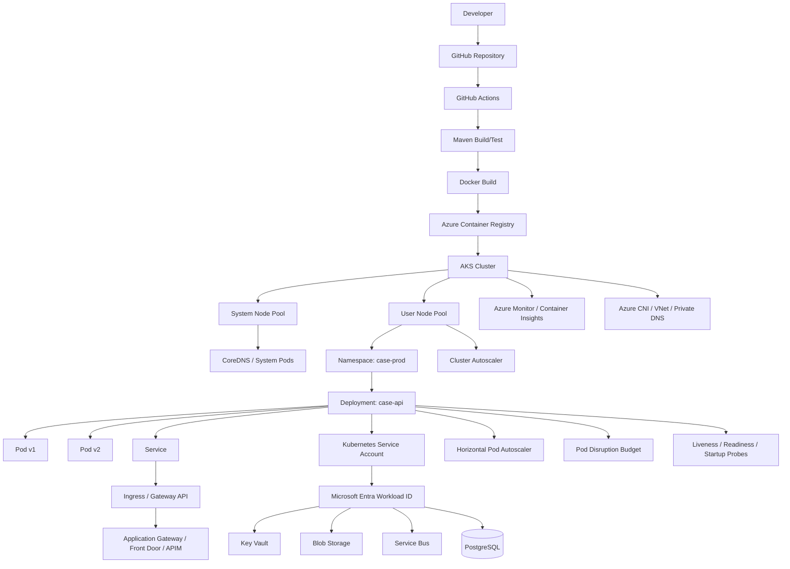

Mental model ringkas:

```text
AKS Cluster      = managed Kubernetes control plane + worker node pools
Node Pool        = group VM nodes untuk menjalankan pods
Namespace        = logical boundary untuk workload/team/env
Deployment       = desired state untuk stateless pods
Pod              = unit eksekusi container
Service          = stable virtual endpoint untuk pods
Ingress/Gateway  = HTTP/S routing masuk cluster
Workload Identity= pod-to-Azure identity tanpa secret
HPA              = scale pods
Cluster Autoscaler = scale nodes
Helm/GitOps      = release/deployment management
```

---

## 3. Decomposition Table - Practical Categories / Domain / Skills

| Area | Skill praktis | Kenapa penting |
|---|---|---|
| **1. AKS Mental Model** | Pahami managed control plane, node pool, pod, service, namespace, workload | AKS adalah managed Kubernetes service; engineer tetap perlu paham Kubernetes operational model. ([Microsoft Learn](https://learn.microsoft.com/en-us/azure/aks/what-is-aks?utm_source=chatgpt.com)) |
| **2. System vs User Node Pool** | Pisahkan system pods dan application pods | Saat cluster dibuat, AKS membuat system node pool untuk critical system pods seperti CoreDNS dan konnectivity; user node pool dipakai untuk application pods. ([Microsoft Learn](https://learn.microsoft.com/en-us/azure/aks/core-aks-concepts?utm_source=chatgpt.com)) |
| **3. Namespace Strategy** | Namespace per app/domain/env/team | Membantu isolation, RBAC, quota, network policy, dan observability. |
| **4. ACR Integration** | AKS pull image dari Azure Container Registry | AKS-to-ACR integration memberi `AcrPull` ke managed identity agent pool/kubelet identity agar node bisa pull image. ([Microsoft Learn](https://learn.microsoft.com/en-us/azure/aks/cluster-container-registry-integration?utm_source=chatgpt.com)) |
| **5. Workload Identity** | Pod authenticate ke Key Vault/Storage/Service Bus tanpa secret | Workload identity memungkinkan pod AKS authenticate ke Microsoft Entra-protected Azure services tanpa menyimpan secret dalam cluster. ([Microsoft Learn](https://learn.microsoft.com/en-us/azure/aks/concepts-identity?utm_source=chatgpt.com)) |
| **6. Deployment Manifest** | Deployment, Service, ConfigMap, Secret, Ingress/Gateway, HPA, PDB | Ini unit operasional utama untuk Java microservice di Kubernetes. |
| **7. Helm / Kustomize / GitOps** | Template release dan environment overlay | Menghindari YAML copy-paste dan membuat deployment repeatable. |
| **8. Ingress / Gateway API** | HTTP/S routing ke service dalam cluster | AKS application routing add-on mendukung Kubernetes Gateway API sebagai framework traffic management yang lebih role-oriented dan extensible dibanding Ingress lama. ([Microsoft Learn](https://learn.microsoft.com/en-us/azure/aks/app-routing-gateway-api?utm_source=chatgpt.com)) |
| **9. Managed NGINX / Application Routing** | Managed ingress controller untuk HTTP/S | Application routing add-on dapat membuat, configure, dan manage NGINX Ingress controllers di AKS. ([Microsoft Learn](https://learn.microsoft.com/en-us/azure/aks/app-routing?utm_source=chatgpt.com)) |
| **10. Application Gateway / AGIC** | Application Gateway sebagai L7 gateway untuk AKS | Cocok bila enterprise memakai Application Gateway/WAF sebagai regional ingress. |
| **11. Autoscaling** | HPA, KEDA, Cluster Autoscaler | AKS scaling options mencakup manual pod/node scaling, Horizontal Pod Autoscaler, Cluster Autoscaler, dan integrasi ACI. ([Microsoft Learn](https://learn.microsoft.com/en-us/azure/aks/concepts-scale?utm_source=chatgpt.com)) |
| **12. Resource Requests/Limits** | CPU/memory request, limit, JVM container tuning | Scheduler dan autoscaler bergantung pada request/limit yang benar. |
| **13. Probes** | startup, readiness, liveness | Menentukan kapan pod boleh menerima traffic, kapan restart, dan kapan dianggap siap setelah deploy. |
| **14. Rollout Strategy** | Rolling update, rollback, canary, blue/green | Mengurangi risiko deploy Java service baru. |
| **15. Network Design** | Azure CNI, subnet sizing, private cluster, private endpoint, DNS | AKS networking memengaruhi IP planning, connectivity, ingress, egress, dan private dependency access. |
| **16. Security** | Kubernetes RBAC, Azure RBAC, workload identity, pod security, image scanning | AKS security mencakup secure supply chain dari build/registry sampai workload berjalan di cluster. ([Microsoft Learn](https://learn.microsoft.com/en-us/azure/aks/concepts-security?utm_source=chatgpt.com)) |
| **17. Observability** | Azure Monitor, Container Insights, app logs, metrics, traces | Debug AKS butuh visibility lintas ingress, pod, node, JVM, DB, dan dependency. |
| **18. Lifecycle / Upgrade** | Kubernetes version, node image, upgrade, maintenance window | AKS version/node image lifecycle berubah dari waktu ke waktu; misalnya Azure Linux 2.0 node image sudah masuk retirement timeline dan perlu migrasi ke versi yang didukung. ([Microsoft Learn](https://learn.microsoft.com/en-us/azure/aks/supported-kubernetes-versions?utm_source=chatgpt.com)) |

---

## 4. Kapan AKS Layak Dipilih?

Gunakan AKS jika ada kebutuhan nyata terhadap Kubernetes platform.

| Kebutuhan | Apakah AKS cocok? |
|---|---|
| Banyak microservices dengan standard deployment yang sama | Ya |
| Butuh Helm/GitOps/service mesh/operator | Ya |
| Butuh advanced ingress/network policy/workload isolation | Ya |
| Butuh pod-level identity dan Kubernetes-native scaling | Ya |
| Ada platform team yang mengelola cluster lifecycle | Ya |
| Hanya satu Java REST API sederhana | Belum tentu |
| Tim belum siap Kubernetes operational model | Sebaiknya hindari dulu |
| Workload cocok dengan App Service/Container Apps | AKS mungkin terlalu berat |

Rule praktis:

```text
AKS dipilih karena butuh Kubernetes control,
bukan karena “microservice harus Kubernetes”.
```

---

## 5. Cluster, Node Pool, Pod - Mental Model

Saat membuat AKS cluster, Anda menentukan node count, size, dan version awal. Itu membuat **system node pool** untuk menjalankan critical system pods seperti CoreDNS dan konnectivity. Untuk application workload, Anda biasanya menambahkan **user node pool**. ([Microsoft Learn](https://learn.microsoft.com/en-us/azure/aks/core-aks-concepts?utm_source=chatgpt.com))

```text
aks-regulatory-prod-sea-001
  ├── system node pool
  │     ├── CoreDNS
  │     ├── konnectivity-agent
  │     └── other system pods
  │
  └── user node pool
        ├── case-api pods
        ├── camunda-worker pods
        ├── document-worker pods
        └── report-api pods
```

Prinsip:

```text
System node pool = untuk Kubernetes/AKS system workload.
User node pool   = untuk aplikasi Anda.
```

Anti-pattern:

```text
Semua app production ditaruh di system node pool.
```

Risikonya: system pods dan app pods bersaing resource, upgrade/maintenance lebih berisiko, dan isolation buruk.

---

## 6. Node Pool Strategy

Node pool adalah grup VM nodes dengan konfigurasi serupa. Pisahkan node pool jika workload punya karakteristik berbeda.

| Node pool | Cocok untuk |
|---|---|
| `np-system` | AKS system pods |
| `np-api` | Java REST API latency-sensitive |
| `np-worker` | Queue/event workers |
| `np-memory` | JVM memory-heavy workload |
| `np-spot` | Non-critical/batch/cost-sensitive workload |
| `np-gpu` | ML/GPU workload jika ada |
| `np-windows` | Windows container jika benar-benar perlu |

Contoh:

```text
np-api-prod:
  VM size: general purpose
  autoscale: 3-10 nodes
  workload: REST APIs

np-worker-prod:
  VM size: compute/memory balanced
  autoscale: 1-20 nodes
  workload: queue workers

np-system:
  VM size: small/standard
  autoscale: controlled
  workload: system pods only
```

Jangan terlalu banyak node pool tanpa alasan. Terlalu granular membuat scheduling, cost, upgrade, dan capacity planning lebih kompleks.

---

## 7. Namespace Strategy

Namespace adalah logical boundary di dalam cluster.

Contoh:

```text
case-dev
case-test
case-prod
platform-observability
platform-ingress
platform-security
```

Atau per domain:

```text
case-management-prod
workflow-prod
document-prod
integration-prod
```

Namespace bisa dipakai untuk:

| Fungsi | Contoh |
|---|---|
| RBAC | Developer hanya akses namespace tertentu |
| Resource quota | Batasi CPU/memory per namespace |
| Network policy | Batasi traffic antar namespace |
| Secret/config boundary | Secret per namespace |
| Observability | Filter logs/metrics per namespace |
| Release ownership | Tim tertentu manage namespace tertentu |

Anti-pattern:

```text
Semua workload production dalam namespace default.
```

---

## 8. Image Supply Chain: GitHub Actions → ACR → AKS

Flow umum:

```text
GitHub Actions
  → mvn clean verify
  → docker build
  → push image ke ACR
  → helm upgrade ke AKS
```

AKS-to-ACR integration memberi `AcrPull` ke managed identity yang terkait agent pool/kubelet agar cluster bisa pull image dari ACR. ([Microsoft Learn](https://learn.microsoft.com/en-us/azure/aks/cluster-container-registry-integration?utm_source=chatgpt.com))

Production invariant:

```text
Image harus immutable.
Gunakan tag commit SHA / digest.
Jangan deploy image :latest ke production.
Node identity hanya perlu AcrPull.
Pipeline identity perlu AcrPush.
```

Contoh tag:

```text
acrplatformprodsea001.azurecr.io/case-api:8f3a9c1
```

Lebih kuat lagi:

```text
image digest pinned:
case-api@sha256:<digest>
```

---

## 9. Workload Identity - Pod ke Azure Resource Tanpa Secret

Untuk Java service di AKS, jangan simpan Azure client secret di Kubernetes Secret jika bisa memakai **Microsoft Entra Workload ID**.

Workload identity memungkinkan pod AKS authenticate ke Azure services seperti Key Vault, Storage, atau Cosmos DB tanpa menyimpan secret di cluster; AKS memakai Kubernetes service account token yang difederasikan ke Microsoft Entra application atau user-assigned managed identity. ([Microsoft Learn](https://learn.microsoft.com/en-us/azure/aks/concepts-identity?utm_source=chatgpt.com))

Pattern:

```text
Pod
  → Kubernetes Service Account
  → Federated Credential
  → User-assigned Managed Identity
  → Azure RBAC
  → Key Vault / Storage / Service Bus
```

Contoh mapping:

```text
namespace: case-prod
service account: case-api-sa
managed identity: mi-case-api-prod
role:
  - Key Vault Secrets User on kv-case-prod
  - Storage Blob Data Contributor on stcaseprod
  - Azure Service Bus Data Sender on sb-case-prod
```

AKS cluster perlu OIDC issuer dan workload identity enabled untuk flow ini; dokumentasi deployment AKS menunjukkan penggunaan `--enable-oidc-issuer` dan `--enable-workload-identity`. ([Microsoft Learn](https://learn.microsoft.com/en-us/azure/aks/workload-identity-deploy-cluster?utm_source=chatgpt.com))

---

## 10. Java/Jersey Deployment Manifest

Contoh minimal untuk Java/Jersey API.

```yaml
apiVersion: apps/v1
kind: Deployment
metadata:
  name: case-api
  namespace: case-prod
  labels:
    app: case-api
spec:
  replicas: 3
  selector:
    matchLabels:
      app: case-api
  strategy:
    type: RollingUpdate
    rollingUpdate:
      maxUnavailable: 0
      maxSurge: 1
  template:
    metadata:
      labels:
        app: case-api
    spec:
      serviceAccountName: case-api-sa
      containers:
        - name: case-api
          image: acrplatformprodsea001.azurecr.io/case-api:8f3a9c1
          ports:
            - containerPort: 8080
          env:
            - name: APP_ENV
              value: "prod"
            - name: KEYVAULT_URL
              value: "https://kv-case-prod.vault.azure.net/"
            - name: POSTGRES_HOST
              value: "psql-case-prod.postgres.database.azure.com"
          resources:
            requests:
              cpu: "500m"
              memory: "1024Mi"
            limits:
              cpu: "1000m"
              memory: "2048Mi"
          startupProbe:
            httpGet:
              path: /health/live
              port: 8080
            failureThreshold: 30
            periodSeconds: 10
          readinessProbe:
            httpGet:
              path: /health/ready
              port: 8080
            initialDelaySeconds: 10
            periodSeconds: 10
            failureThreshold: 3
          livenessProbe:
            httpGet:
              path: /health/live
              port: 8080
            initialDelaySeconds: 60
            periodSeconds: 20
            failureThreshold: 3
```

Catatan penting untuk Java:

```text
requests.memory harus cukup untuk heap + metaspace + native memory.
limits.memory harus selaras dengan JVM MaxRAMPercentage.
readiness jangan hijau sebelum DB/config critical siap.
liveness jangan terlalu agresif sampai membunuh pod saat GC pause pendek.
startupProbe penting untuk app Java yang startup-nya berat.
```

---

## 11. Service dan Ingress/Gateway

Service memberi stable endpoint internal untuk pods.

```yaml
apiVersion: v1
kind: Service
metadata:
  name: case-api
  namespace: case-prod
spec:
  type: ClusterIP
  selector:
    app: case-api
  ports:
    - port: 80
      targetPort: 8080
```

Untuk HTTP/S routing masuk cluster, gunakan Ingress atau Gateway API sesuai standard platform. AKS application routing add-on mendukung Kubernetes Gateway API, yang diposisikan sebagai successor/evolution dari Ingress API untuk traffic management. ([Microsoft Learn](https://learn.microsoft.com/en-us/azure/aks/app-routing-gateway-api?utm_source=chatgpt.com))

Contoh konseptual Ingress:

```yaml
apiVersion: networking.k8s.io/v1
kind: Ingress
metadata:
  name: case-api
  namespace: case-prod
spec:
  rules:
    - host: case-api.internal.company.com
      http:
        paths:
          - path: /
            pathType: Prefix
            backend:
              service:
                name: case-api
                port:
                  number: 80
```

Untuk enterprise, ingress biasanya digabung dengan:

```text
Front Door / Application Gateway / APIM
  → AKS ingress / Gateway API
  → Service
  → Pods
```

---

## 12. Ingress Options di AKS

| Opsi | Cocok untuk |
|---|---|
| **Managed NGINX application routing add-on** | HTTP/S ingress dengan controller yang dibuat dan dikelola add-on AKS |
| **Gateway API application routing** | Desain ingress yang lebih role-oriented dan extensible |
| **Application Gateway Ingress Controller / AGIC** | Jika enterprise memakai Application Gateway/WAF sebagai L7 gateway |
| **Internal Load Balancer** | Private service exposure di VNet |
| **Service type LoadBalancer** | L4 exposure sederhana |
| **Service mesh ingress** | Jika organisasi sudah standard service mesh |

Application routing add-on dapat membuat, mengonfigurasi, dan mengelola satu atau lebih NGINX Ingress controllers di AKS. ([Microsoft Learn](https://learn.microsoft.com/en-us/azure/aks/app-routing?utm_source=chatgpt.com)) Untuk TLS dengan Gateway API, application routing add-on mendukung sinkronisasi secret dari Azure Key Vault untuk TLS termination. ([Microsoft Learn](https://learn.microsoft.com/en-us/azure/aks/app-routing-gateway-api-tls?utm_source=chatgpt.com))

---

## 13. Autoscaling: HPA, KEDA, Cluster Autoscaler

AKS scaling harus dipikirkan dua level:

```text
Pod scaling  = tambah/kurangi replica aplikasi
Node scaling = tambah/kurangi VM node untuk menampung pods
```

AKS scaling concepts mencakup manual pod/node scaling, Horizontal Pod Autoscaler, Cluster Autoscaler, dan integrasi dengan Azure Container Instances. ([Microsoft Learn](https://learn.microsoft.com/en-us/azure/aks/concepts-scale?utm_source=chatgpt.com)) Cluster Autoscaler biasa dipakai bersama Horizontal Pod Autoscaler: HPA menambah pod, lalu Cluster Autoscaler menambah node jika pod tidak bisa dijadwalkan karena resource constraint. ([Microsoft Learn](https://learn.microsoft.com/en-us/azure/aks/concepts-scale?utm_source=chatgpt.com))

### HPA contoh

```yaml
apiVersion: autoscaling/v2
kind: HorizontalPodAutoscaler
metadata:
  name: case-api
  namespace: case-prod
spec:
  scaleTargetRef:
    apiVersion: apps/v1
    kind: Deployment
    name: case-api
  minReplicas: 3
  maxReplicas: 10
  metrics:
    - type: Resource
      resource:
        name: cpu
        target:
          type: Utilization
          averageUtilization: 70
```

### Scaling invariant untuk PostgreSQL

```text
max_pods × db_pool_max_per_pod <= safe_postgres_connection_budget
```

Contoh:

```text
max pods: 10
HikariCP maxPoolSize: 10
potential DB connections: 100
```

Jika PostgreSQL aman hanya untuk 60 koneksi, konfigurasi ini berbahaya.

---

## 14. Resource Requests, Limits, dan JVM

Kubernetes scheduler memakai `requests` untuk menentukan pod ditempatkan di node mana. `limits` memberi batas maksimum resource container.

Untuk Java:

```text
JVM heap bukan satu-satunya memory.
Ada metaspace, thread stack, direct buffer, JIT, native memory.
```

Contoh JVM env:

```yaml
env:
  - name: JAVA_TOOL_OPTIONS
    value: "-XX:MaxRAMPercentage=70.0 -XX:+ExitOnOutOfMemoryError"
```

Prinsip:

```text
Memory limit container = heap + non-heap + safety margin.
Jangan set Xmx sama dengan memory limit.
Gunakan startupProbe untuk aplikasi Java yang warmup lama.
Gunakan readinessProbe untuk traffic gating.
```

Anti-pattern:

```text
limits.memory: 512Mi
JAVA_OPTS: -Xmx512m
```

Risiko: container OOM karena non-heap memory tidak punya ruang.

---

## 15. ConfigMap, Secret, dan Key Vault

Gunakan ConfigMap untuk non-secret config.

```yaml
apiVersion: v1
kind: ConfigMap
metadata:
  name: case-api-config
  namespace: case-prod
data:
  APP_ENV: "prod"
  POSTGRES_DB: "case_management"
```

Untuk secret, opsi lebih aman:

```text
Key Vault + Workload Identity + Azure SDK
atau
Secrets Store CSI Driver + Key Vault, jika standard platform mengizinkan
```

Jangan default menyimpan secret sensitif sebagai Kubernetes Secret plain tanpa governance. Kubernetes Secret secara default adalah object cluster yang perlu dilindungi dengan RBAC, encryption at rest, audit, dan access control.

---

## 16. Health Probes untuk Java/Jersey

Pisahkan tiga jenis probe:

| Probe | Fungsi |
|---|---|
| **startupProbe** | Memberi waktu app Java warmup tanpa dibunuh liveness |
| **readinessProbe** | Menentukan apakah pod boleh menerima traffic |
| **livenessProbe** | Restart pod jika proses benar-benar stuck/dead |

Endpoint:

```text
/health/live
/health/ready
```

Readiness sebaiknya cek ringan:

```text
required config loaded
DB pool can acquire lightweight connection
critical dependency reachable atau degraded mode jelas
```

Jangan buat readiness terlalu berat sampai endpoint health sendiri menjadi sumber load.

---

## 17. Rollout dan Rollback

Deployment rolling update:

```text
replicas: 3
maxUnavailable: 0
maxSurge: 1
```

Artinya:

```text
Tidak ada replica lama yang dimatikan sebelum replica baru siap.
Boleh menambah 1 pod sementara saat rollout.
```

Command penting:

```bash
kubectl rollout status deployment/case-api -n case-prod
kubectl rollout history deployment/case-api -n case-prod
kubectl rollout undo deployment/case-api -n case-prod
```

Production invariant:

```text
Rollback aplikasi hanya aman jika DB migration backward-compatible.
```

Gunakan migration pattern:

```text
expand → deploy → migrate data/backfill → contract
```

Jangan langsung drop/rename column yang masih dipakai versi lama.

---

## 18. Pod Disruption Budget / PDB

PDB membantu menjaga minimal availability saat voluntary disruption seperti node drain/upgrade.

```yaml
apiVersion: policy/v1
kind: PodDisruptionBudget
metadata:
  name: case-api-pdb
  namespace: case-prod
spec:
  minAvailable: 2
  selector:
    matchLabels:
      app: case-api
```

Gunakan PDB untuk service production yang punya >1 replica.

Anti-pattern:

```text
replicas: 1
PDB minAvailable: 1
node upgrade perlu drain
pod tidak bisa dipindahkan
```

---

## 19. AKS Networking untuk Microservices

AKS networking perlu dipahami sejak desain awal:

```text
cluster subnet
node subnet
pod IP allocation
service CIDR
DNS service IP
private DNS
egress path
private endpoint access
ingress exposure
network policy
```

AKS juga mendukung skenario network-isolated cluster, termasuk private cluster modes dan private ACR untuk bootstrapping. ([Microsoft Learn](https://learn.microsoft.com/en-us/azure/aks/network-isolated?utm_source=chatgpt.com))

Checklist:

| Pertanyaan | Kenapa |
|---|---|
| Cluster private atau public? | API server exposure |
| ACR private/public? | Image pull path |
| Pod bisa resolve Private DNS? | Key Vault/PostgreSQL/Storage private endpoint |
| Egress lewat NAT/Firewall? | Static outbound dan inspection |
| Ingress internal atau public? | Exposure boundary |
| CIDR overlap dengan on-prem/AWS? | Hybrid routing |
| Network policy aktif? | Pod-to-pod segmentation |

---

## 20. Network Policy

Network policy mengatur traffic antar pod/namespace.

Contoh target:

```text
case-api hanya boleh:
  menerima traffic dari ingress namespace
  mengirim traffic ke PostgreSQL private endpoint
  mengirim traffic ke Service Bus/Key Vault/Storage
  mengirim traffic ke service tertentu
```

Tanpa network policy, workload dalam cluster biasanya terlalu bebas berkomunikasi.

Practical invariant:

```text
Namespace boundary bukan network isolation otomatis.
RBAC boundary bukan network isolation.
Network policy diperlukan untuk segmentation pod-to-pod.
```

---

## 21. Security Baseline

AKS security harus dilihat sebagai chain dari build sampai runtime. Microsoft AKS security concepts menekankan container security sebagai end-to-end pipeline dari build environment dan registry sampai workload berjalan di AKS. ([Microsoft Learn](https://learn.microsoft.com/en-us/azure/aks/concepts-security?utm_source=chatgpt.com))

Baseline:

```text
1. Image dari ACR private.
2. Image tagged immutable / digest pinned.
3. Node/kubelet identity hanya AcrPull.
4. Pod memakai Workload Identity untuk Azure resource.
5. Jangan simpan Azure client secret di cluster.
6. Namespace RBAC dibatasi.
7. Network policy aktif untuk segmentation.
8. Resource requests/limits wajib.
9. Probes wajib untuk production deployment.
10. PDB untuk workload critical.
11. Logs/metrics/traces aktif.
12. Kubernetes version dan node image lifecycle dipantau.
```

Catatan lifecycle penting: mulai 30 November 2025, AKS tidak lagi mendukung atau menyediakan security updates untuk Azure Linux 2.0 node image, dengan node image removal mulai 31 Maret 2026; environment yang masih memakai Azure Linux 2.0 perlu migrasi ke versi yang didukung seperti AzureLinux3 atau upgrade node pool sesuai dukungan. ([Microsoft Learn](https://learn.microsoft.com/en-us/azure/aks/supported-kubernetes-versions?utm_source=chatgpt.com))

---

## 22. Observability

Minimal visibility:

| Layer | Signal |
|---|---|
| Ingress/Gateway | request count, 4xx/5xx, latency, WAF hits |
| Service | endpoint health, request rate |
| Pod | restart count, status, readiness |
| Container | CPU, memory, OOMKilled |
| JVM | heap, GC, thread pool |
| App | route latency, error rate, structured logs |
| DB | connection pool, query latency |
| Node | CPU/memory/disk pressure |
| HPA | desired/current replicas |
| Cluster Autoscaler | pending pods, scale events |
| Deployment | rollout status, unavailable replicas |

Command cepat:

```bash
kubectl get pods -n case-prod
kubectl describe pod <pod> -n case-prod
kubectl logs deployment/case-api -n case-prod
kubectl top pods -n case-prod
kubectl top nodes
kubectl get events -n case-prod --sort-by=.lastTimestamp
```

---

## 23. Helm Chart Structure

Untuk production, jangan maintain YAML mentah terlalu banyak tanpa templating.

Struktur umum:

```text
charts/case-api
  Chart.yaml
  values.yaml
  values-dev.yaml
  values-test.yaml
  values-prod.yaml
  templates/
    deployment.yaml
    service.yaml
    ingress.yaml
    serviceaccount.yaml
    hpa.yaml
    pdb.yaml
    configmap.yaml
```

Values per environment:

```yaml
image:
  repository: acrplatformprodsea001.azurecr.io/case-api
  tag: 8f3a9c1

replicaCount: 3

resources:
  requests:
    cpu: 500m
    memory: 1024Mi
  limits:
    cpu: 1000m
    memory: 2048Mi

autoscaling:
  enabled: true
  minReplicas: 3
  maxReplicas: 10
  targetCPUUtilizationPercentage: 70
```

Invariant:

```text
Template sama.
Values berbeda per environment.
Secret tidak disimpan plain di values repo.
```

---

## 24. GitHub Actions Deployment Flow

Flow praktis:

```text
1. Checkout
2. Setup Java
3. Maven verify
4. Docker build
5. Push image to ACR
6. Helm lint/template
7. Helm upgrade --install
8. kubectl rollout status
9. Smoke test
10. Notify/monitor
```

Skeleton:

```yaml
name: deploy-case-api-aks

on:
  push:
    branches:
      - main

permissions:
  id-token: write
  contents: read

jobs:
  deploy:
    runs-on: ubuntu-latest

    steps:
      - uses: actions/checkout@v4

      - uses: actions/setup-java@v4
        with:
          distribution: temurin
          java-version: "17"

      - name: Build
        run: mvn -B clean verify

      - name: Azure login
        uses: azure/login@v2
        with:
          client-id: ${{ secrets.AZURE_CLIENT_ID }}
          tenant-id: ${{ secrets.AZURE_TENANT_ID }}
          subscription-id: ${{ secrets.AZURE_SUBSCRIPTION_ID }}

      - name: Build and push image
        run: |
          az acr build \
            --registry acrplatformprodsea001 \
            --image case-api:${{ github.sha }} \
            .

      - name: Get AKS credentials
        run: |
          az aks get-credentials \
            --resource-group rg-aks-prod-sea-001 \
            --name aks-regulatory-prod-sea-001 \
            --overwrite-existing

      - name: Helm deploy
        run: |
          helm upgrade --install case-api ./charts/case-api \
            --namespace case-prod \
            --create-namespace \
            -f ./charts/case-api/values-prod.yaml \
            --set image.tag=${{ github.sha }}

      - name: Rollout status
        run: |
          kubectl rollout status deployment/case-api -n case-prod --timeout=300s
```

Production note:

```text
Gunakan workload identity federation/OIDC untuk Azure login.
Pipeline identity ≠ runtime identity.
Pipeline identity diberi akses minimal ke ACR dan AKS target.
```

---

## 25. Camunda Worker di AKS

AKS cocok untuk Camunda workers jika Anda butuh:

```text
banyak worker type
scaling per worker
resource isolation
observability per worker
controlled rollout
network policy
connection to Camunda engine/Zeebe/API
```

Pattern:

```text
camunda-worker-case
camunda-worker-document
camunda-worker-notification
camunda-worker-escalation
```

Worker invariants:

```text
Worker harus idempotent.
Worker harus graceful shutdown.
Worker harus membatasi max active jobs.
Worker harus menghindari DB/API overload.
Worker harus punya trace processInstanceId/businessKey.
Worker harus support version coexistence saat rollout.
```

Graceful shutdown penting karena pod bisa dihentikan saat rollout, scale-in, atau node drain.

---

## 26. PostgreSQL/MyBatis di AKS

Masalah paling umum: **pod scale tidak sinkron dengan DB capacity**.

Checklist:

```text
HikariCP maxPoolSize per pod
max pods HPA
PostgreSQL max connections
PgBouncer jika digunakan
query timeout
transaction timeout
migration strategy
readiness DB check ringan
```

Rumus:

```text
max_pods × maxPoolSize <= safe DB connection budget
```

Contoh:

```text
HPA max pods: 12
pool per pod: 10
total potential: 120 connections
```

Jika tidak aman, turunkan HPA max, turunkan pool, atau gunakan connection pooling layer.

---

## 27. Common Failure Modes

| Symptom | Kemungkinan root cause |
|---|---|
| Pod `ImagePullBackOff` | ACR permission/DNS/network/tag salah |
| Pod `CrashLoopBackOff` | App crash, env salah, secret/config hilang, OOM |
| Pod `Pending` | Node capacity kurang, resource request terlalu tinggi, taint/toleration mismatch |
| 502 dari ingress | Service/port/probe salah, backend pod tidak ready |
| HPA tidak scale | Metrics server/custom metric tidak tersedia atau target salah |
| Pods scale, tapi node tidak cukup | Cluster Autoscaler off atau node pool max terlalu kecil |
| App OOMKilled | JVM memory config tidak container-aware |
| DB down saat traffic naik | pool × pod terlalu besar |
| Rollout stuck | readiness gagal, maxUnavailable/maxSurge tidak cocok |
| Upgrade cluster gagal drain | PDB terlalu ketat atau replicas terlalu sedikit |
| Pod tidak bisa akses Key Vault | Workload identity annotation/federation/RBAC salah |
| Pod resolve public endpoint | Private DNS/VNet link salah |
| Ingress TLS gagal | Secret/cert/gateway config salah |

---

## 28. AKS CLI Cheatsheet

### Get credentials

```bash
az aks get-credentials \
  --resource-group rg-aks-prod-sea-001 \
  --name aks-regulatory-prod-sea-001
```

### List node pools

```bash
az aks nodepool list \
  --resource-group rg-aks-prod-sea-001 \
  --cluster-name aks-regulatory-prod-sea-001 \
  --output table
```

### Show cluster

```bash
az aks show \
  --resource-group rg-aks-prod-sea-001 \
  --name aks-regulatory-prod-sea-001 \
  --output table
```

### Kubernetes checks

```bash
kubectl get nodes
kubectl get ns
kubectl get pods -A
kubectl get svc -A
kubectl get ingress -A
kubectl get hpa -A
kubectl get pdb -A
```

### Debug pod

```bash
kubectl describe pod <pod> -n <namespace>
kubectl logs <pod> -n <namespace>
kubectl logs <pod> -c <container> -n <namespace>
kubectl get events -n <namespace> --sort-by=.lastTimestamp
```

### Rollout

```bash
kubectl rollout status deployment/case-api -n case-prod
kubectl rollout history deployment/case-api -n case-prod
kubectl rollout undo deployment/case-api -n case-prod
```

### Exec untuk test DNS/connectivity

```bash
kubectl exec -it <pod> -n case-prod -- sh

nslookup kv-case-prod.vault.azure.net
nslookup psql-case-prod.postgres.database.azure.com
```

---

## 29. Production Readiness Checklist

### A. Cluster

```text
System node pool terpisah dari user node pool.
Node pool autoscaling dikonfigurasi.
Kubernetes version/node image lifecycle dipantau.
Maintenance/upgrade window jelas.
Private networking/DNS valid.
```

### B. Workload

```text
Deployment punya requests/limits.
startup/readiness/liveness probes tersedia.
PDB tersedia untuk service critical.
HPA tersedia jika perlu.
Image immutable.
Rollback command jelas.
```

### C. Identity & Secret

```text
Workload Identity digunakan untuk Azure resource.
Tidak ada Azure client secret dalam cluster.
Service account per workload.
RBAC scoped minimal.
Key Vault access scoped minimal.
```

### D. Networking

```text
Ingress path jelas.
Backend private jika tidak public.
Network policy diterapkan untuk namespace critical.
Private DNS tervalidasi dari pod.
Egress path jelas via NAT/Firewall jika perlu.
```

### E. Observability

```text
Structured logs.
Correlation ID / traceparent.
Metrics JVM dan app.
Container restart/OOM alert.
Ingress 5xx/latency alert.
HPA/cluster autoscaler visibility.
```

### F. Data & Dependency

```text
DB pool dihitung terhadap HPA max pods.
Timeout/retry bounded.
Migration backward-compatible.
Worker idempotent.
Dead-letter/poison handling ada.
```

---

## 30. Anti-pattern yang Harus Dihindari

| Anti-pattern | Risiko |
|---|---|
| AKS dipakai untuk satu API sederhana tanpa kebutuhan Kubernetes | Complexity dan cost tidak perlu |
| Semua workload di namespace `default` | Governance buruk |
| Semua app di system node pool | Resource contention dengan system pods |
| Deploy image `latest` ke production | Rollback/audit sulit |
| Secret Azure disimpan sebagai plain Kubernetes Secret | Secret leakage |
| Pod diberi identity terlalu luas | Blast radius besar |
| Tidak ada requests/limits | Scheduling dan autoscaling kacau |
| HPA max tidak disesuaikan dengan DB capacity | PostgreSQL overload |
| Liveness terlalu agresif | Pod restart loop saat GC/latency spike |
| Tidak ada PDB | Upgrade/drain bisa menurunkan availability |
| Network policy tidak ada | Pod lateral movement terlalu bebas |
| Migration destructive tanpa expand-contract | Rollback gagal |
| Cluster/node image lifecycle tidak dipantau | Security/support risk |

---

## 31. Mental Model Final

```text
AKS
  = Kubernetes platform di Azure, bukan sekadar tempat run container

Cluster
  = boundary control plane dan node pools

Node pool
  = compute pool untuk system/app workload

Namespace
  = logical boundary untuk app/team/env

Deployment
  = desired state untuk pods

Service
  = stable internal endpoint

Ingress/Gateway
  = HTTP/S entry point

Workload Identity
  = pod-to-Azure access tanpa secret

HPA
  = scale pod

Cluster Autoscaler
  = scale node

Requests/Limits
  = scheduling + isolation + autoscaling signal

Probes
  = lifecycle/traffic eligibility

PDB
  = availability saat disruption

Helm/GitOps
  = repeatable release management
```

Kalimat kunci:

```text
AKS cocok jika Anda butuh Kubernetes control dan organisasi siap mengoperasikan platformnya.

Untuk Java/Jersey microservice, production readiness AKS bukan hanya “pod running”,
tetapi kombinasi image supply chain, workload identity, ingress, network policy,
resource sizing, probes, autoscaling, observability, rollout, dan DB capacity discipline.
```

---

# Status

**Azure Seri 9/18 selesai.**

## Rekomendasi materi berikutnya

**Azure Seri 10 - Azure Container Registry & Container Supply Chain: ACR, image tagging, immutable artifact, AcrPull/AcrPush, private endpoint, scanning, SBOM/signing, GitHub Actions build pipeline, dan deployment flow ke App Service/Container Apps/AKS.**

---

**Sources:**

- [What is Azure Kubernetes Service (AKS)?](https://learn.microsoft.com/en-us/azure/aks/what-is-aks?utm_source=chatgpt.com)

## Response:
7/13/2026, 8:20:49 PM

Lanjut ke **Seri 10/18**. Fokusnya supply chain container: dari Maven build, Docker image, ACR, identity, private registry access, scanning/signing/SBOM, sampai deployment ke App Service, Container Apps, dan AKS.

# Azure Seri 10/18 - Azure Container Registry & Container Supply Chain

## 1. Introduction

**Azure Container Registry / ACR** adalah private registry untuk menyimpan dan mengelola container images serta artifacts untuk berbagai deployment target: **App Service custom container, Azure Container Apps, AKS, VM, Azure Batch, atau environment hybrid**. Microsoft mendeskripsikan ACR sebagai registry untuk build, store, dan manage container images/artifacts dalam private registry. ([Microsoft Learn](https://learn.microsoft.com/en-us/azure/container-registry/?utm_source=chatgpt.com))

Untuk stack Anda, ACR menjadi pusat supply chain container:

```text id="azr10-intro"
Java 17 + Maven
  → Docker image
  → Azure Container Registry
  → App Service / Container Apps / AKS
  → runtime pulls image securely
```

Mental model utama:

```text id="azr10-model"
Source code bukan artifact production final.
JAR/WAR bukan satu-satunya artifact.
Container image adalah immutable deployment artifact.
ACR adalah controlled registry untuk artifact tersebut.
Runtime identity hanya boleh pull.
Pipeline identity boleh push.
Production deploy harus pin image secara eksplisit.
```

---

## 2. Diagram - Container Supply Chain Map

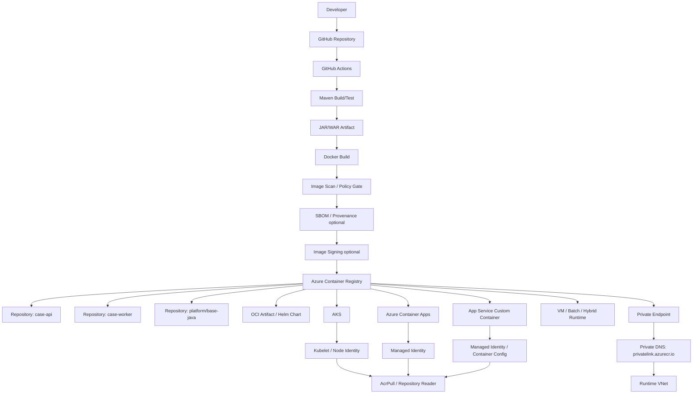

---

## 3. Decomposition Table - Practical Categories / Domain / Skills

| Area | Skill praktis | Kenapa penting |
|---|---|---|
| **1. ACR Mental Model** | Registry, repository, tag, manifest, layer, digest, artifact | Membantu membedakan nama image, versi image, immutable digest, dan data layer yang sebenarnya dipull runtime. |
| **2. Repository Strategy** | Namespace repo seperti `platform/base-java`, `regulatory/case-api`, `regulatory/case-worker` | ACR mendukung nested namespace, tetapi registry mengelola repository secara independen, bukan sebagai hierarchy folder sungguhan. ([Microsoft Learn](https://learn.microsoft.com/en-us/azure/container-registry/container-registry-best-practices?utm_source=chatgpt.com)) |
| **3. Image Tagging Strategy** | Unique tag, stable tag, semantic version, commit SHA, digest pinning | Microsoft membedakan stable tags yang dipakai ulang dan unique tags yang berbeda untuk setiap push; production sebaiknya memakai unique tag/digest agar deployment audit-able. ([Microsoft Learn](https://learn.microsoft.com/en-us/azure/container-registry/container-registry-image-tag-version?utm_source=chatgpt.com)) |
| **4. ACR SKU** | Basic, Standard, Premium; throughput, storage, private endpoint, geo-replication | Premium menambahkan fitur seperti geo-replication, private link/private endpoints, dan throughput/concurrency lebih tinggi. ([Microsoft Learn](https://learn.microsoft.com/en-us/azure/container-registry/container-registry-skus?utm_source=chatgpt.com)) |
| **5. Authentication & RBAC** | Microsoft Entra auth, service principal, managed identity, `AcrPull`, `AcrPush`, repository roles | ACR mendukung Entra/RBAC untuk memberi permission ke users, managed identities, dan service principals. ([Microsoft Learn](https://learn.microsoft.com/en-us/azure/container-registry/container-registry-rbac-built-in-roles-overview?utm_source=chatgpt.com)) |
| **6. Runtime Pull Identity** | AKS kubelet identity, ACA managed identity, App Service identity/config | Runtime hanya butuh pull image, bukan push atau admin credential. AKS-ACR integration menggunakan `--attach-acr` atau role assignment ke kubelet managed identity. ([Microsoft Learn](https://learn.microsoft.com/en-us/azure/aks/cluster-container-registry-integration?utm_source=chatgpt.com)) |
| **7. Pipeline Push Identity** | GitHub Actions OIDC/federated SP, `AcrPush`, scoped deployment identity | Pipeline perlu push image, tetapi tidak perlu Owner/Contributor subscription luas. |
| **8. Managed Identity Image Pull** | ACA/VM/AKS pull image tanpa username/password | Container Apps dapat pull private ACR image memakai managed identity agar tidak memakai administrative credentials. ([Microsoft Learn](https://learn.microsoft.com/en-us/azure/container-apps/managed-identity-image-pull?utm_source=chatgpt.com)) |
| **9. Private Endpoint & DNS** | Private Link, `privatelink.azurecr.io`, VNet DNS, runtime pull path | Private endpoint ACR tersedia pada Premium SKU dan membuat registry dapat diakses melalui private IP. ([Microsoft Learn](https://learn.microsoft.com/en-us/azure/container-registry/container-registry-private-endpoints?utm_source=chatgpt.com)) |
| **10. Geo-replication** | Multi-region image distribution, local pull, regional availability | Geo-replication adalah fitur Premium; content registry disinkronkan ke replica region untuk network-close image access. ([Microsoft Learn](https://learn.microsoft.com/en-us/azure/container-registry/container-registry-get-started-geo-replication-template?utm_source=chatgpt.com)) |
| **11. ACR Tasks** | Cloud build, scheduled build, base image update trigger | ACR Tasks dapat trigger container image build saat code commit, PR, base image update, atau schedule. ([Microsoft Learn](https://learn.microsoft.com/en-us/azure/container-registry/container-registry-tasks-overview?utm_source=chatgpt.com)) |
| **12. Base Image Management** | Internal base image, rebuild saat OS/framework patch | ACR Tasks mendukung automated builds saat base image berubah, misalnya OS/framework patch. ([Microsoft Learn](https://learn.microsoft.com/en-us/azure/container-registry/container-registry-tutorial-base-image-update?utm_source=chatgpt.com)) |
| **13. Vulnerability Scanning** | Microsoft Defender for Cloud, registry image findings, remediation gate | Defender for container registries menyediakan vulnerability scanner untuk Azure Resource Manager-based ACR images. ([Microsoft Learn](https://learn.microsoft.com/en-us/azure/defender-for-cloud/defender-for-container-registries-introduction?utm_source=chatgpt.com)) |
| **14. Signing & Verification** | Notation, Notary Project, Artifact Signing | Microsoft menyediakan tutorial signing/verifying container images dan OCI artifacts di ACR memakai Notation dan Artifact Signing. ([Microsoft Learn](https://learn.microsoft.com/en-us/azure/container-registry/container-registry-tutorial-sign-verify-notation-artifact-signing?utm_source=chatgpt.com)) |
| **15. Helm/OCI Artifacts** | Store Helm charts as OCI artifacts in ACR | ACR dapat menyimpan Helm chart repositories sebagai OCI artifacts memakai Helm 3. ([Microsoft Learn](https://learn.microsoft.com/en-us/azure/container-registry/container-registry-helm-repos?utm_source=chatgpt.com)) |
| **16. Retention & Cleanup** | Retention policy, purge, untagged manifests, storage growth | Retention policy dapat otomatis menghapus untagged manifests setelah jumlah hari tertentu. ([Microsoft Learn](https://learn.microsoft.com/en-us/azure/container-registry/container-registry-retention-policy?utm_source=chatgpt.com)) |
| **17. Network-restricted Registry** | Trusted services, private endpoint, firewall/IP rules | ACR dapat mengizinkan selected trusted Azure services untuk bypass network rules secara aman pada registry yang dibatasi network. ([Microsoft Learn](https://learn.microsoft.com/en-us/azure/container-registry/allow-access-trusted-services?utm_source=chatgpt.com)) |
| **18. Troubleshooting** | `ImagePullBackOff`, `401 Unauthorized`, DNS private endpoint, wrong tag, architecture mismatch | Image pull failure biasanya kombinasi identity, tag, network, DNS, architecture, atau permission model. |

---

## 4. ACR Mental Model

ACR bukan hanya “tempat menyimpan Docker image”. Komponen pentingnya:

```text id="azr10-acr-model"
Registry
  └── Repository
        └── Tag
              └── Manifest
                    └── Layers
```

| Concept | Contoh | Makna |
|---|---|---|
| **Registry** | `acrplatformprodsea001.azurecr.io` | Private registry endpoint |
| **Repository** | `regulatory/case-api` | Nama logical image/project |
| **Tag** | `8f3a9c1`, `1.4.2`, `prod-20260713` | Label versi image |
| **Manifest** | `sha256:...` | Immutable description image |
| **Layer** | filesystem layers | Blob yang didownload runtime |
| **Digest** | `image@sha256:...` | Immutable reference paling kuat |
| **Artifact** | image, Helm chart, OCI artifact | Artifact OCI yang disimpan registry |

Contoh image reference:

```text id="azr10-image-ref"
acrplatformprodsea001.azurecr.io/regulatory/case-api:8f3a9c1
```

Contoh digest-pinned reference:

```text id="azr10-digest"
acrplatformprodsea001.azurecr.io/regulatory/case-api@sha256:abcd...
```

Production invariant:

```text id="azr10-invariant"
Tag bisa berubah.
Digest tidak berubah.
Production deployment harus bisa ditelusuri ke source commit, build, scan result, dan image digest.
```

---

## 5. Repository Strategy

Untuk enterprise, jangan taruh semua image di root repository tanpa namespace.

### Kurang baik

```text id="azr10-bad-repo"
case-api
case-worker
base-java
notification
report
```

### Lebih baik

```text id="azr10-good-repo"
platform/base-java
platform/base-java-jersey
regulatory/case-api
regulatory/case-worker
regulatory/document-worker
regulatory/camunda-worker
shared/nginx
```

ACR mendukung nested repository namespace untuk memudahkan sharing registry lintas group, tetapi repository tetap dikelola independen oleh registry, bukan folder hierarchy yang punya inheritance otomatis. ([Microsoft Learn](https://learn.microsoft.com/en-us/azure/container-registry/container-registry-best-practices?utm_source=chatgpt.com))

Practical rule:

```text id="azr10-repo-rule"
Gunakan namespace untuk ownership dan readability.
Jangan mengandalkan namespace sebagai security boundary kecuali RBAC/ABAC repository permission memang dikonfigurasi.
```

---

## 6. Tagging Strategy

Tagging image harus menjawab:

```text id="azr10-tag-q"
Image ini dibangun dari commit apa?
Untuk versi aplikasi apa?
Apakah artifact ini immutable?
Apakah bisa rollback?
Apakah bisa dicari saat incident?
```

Microsoft membedakan **stable tags** yang reusable seperti `1.0` dan **unique tags** yang berbeda untuk setiap push seperti commit hash. ([Microsoft Learn](https://learn.microsoft.com/en-us/azure/container-registry/container-registry-image-tag-version?utm_source=chatgpt.com))

### Recommended tagging

```text id="azr10-tags"
commit SHA:
  regulatory/case-api:8f3a9c1

semantic version:
  regulatory/case-api:1.4.2

build number:
  regulatory/case-api:1.4.2-build.381

environment promotion tag, optional:
  regulatory/case-api:prod-20260713-381
```

### Hindari untuk production

```text id="azr10-latest"
regulatory/case-api:latest
```

Kenapa `latest` buruk untuk production:

| Masalah | Dampak |
|---|---|
| Mutable | Hari ini dan besok bisa menunjuk image berbeda |
| Audit sulit | Sulit tahu binary apa yang berjalan |
| Rollback tidak deterministik | Tag lama bisa tertimpa |
| Cache/pull ambiguity | Runtime bisa pakai image yang tidak diduga |
| Incident RCA lemah | Tidak langsung terkait commit/build |

Practical invariant:

```text id="azr10-tag-inv"
Build boleh membuat banyak tag.
Deploy production harus pakai tag unik atau digest.
```

---

## 7. ACR SKU Decision

ACR punya SKU yang berbeda untuk kebutuhan throughput, scale, dan fitur. Premium menambahkan fitur seperti **geo-replication**, **private link/private endpoints**, dan throughput/concurrency lebih tinggi untuk large-scale deployment. ([Microsoft Learn](https://learn.microsoft.com/en-us/azure/container-registry/container-registry-skus?utm_source=chatgpt.com))

| SKU | Cocok untuk | Catatan |
|---|---|---|
| **Basic** | Dev, eksperimen, small workload | Fitur dan throughput paling terbatas |
| **Standard** | Banyak production app biasa | Umum untuk production sederhana |
| **Premium** | Enterprise/high-scale/private endpoint/geo-replication | Butuh jika registry private endpoint atau geo-replication diperlukan |

Decision praktis:

```text id="azr10-sku"
Dev/sandbox kecil → Basic/Standard
Production biasa → Standard
Private endpoint required → Premium
Multi-region/geo-replication → Premium
High concurrency pull/push → Premium
```

---

## 8. Private Endpoint & Private DNS

Jika ACR dibatasi agar tidak public, runtime seperti AKS/Container Apps/self-hosted runner harus bisa resolve dan connect ke registry via private endpoint.

ACR private endpoint tersedia di Premium SKU; jika registry membatasi access ke private endpoints/subnet/IP rules, beberapa functionality mungkin butuh konfigurasi tambahan. ([Microsoft Learn](https://learn.microsoft.com/en-us/azure/container-registry/container-registry-private-endpoints?utm_source=chatgpt.com))

Pattern:

```text id="azr10-private"
AKS / ACA / App Service / Build Agent
  → VNet
  → Private DNS
  → ACR Private Endpoint
  → ACR
```

DNS penting:

```text id="azr10-dns"
acrplatformprodsea001.azurecr.io
  → private endpoint IP
```

Microsoft menjelaskan bahwa DNS private endpoint ACR harus dikonfigurasi agar registry FQDN seperti `myregistry.azurecr.io` resolve ke private IP address. ([Microsoft Learn](https://learn.microsoft.com/en-us/azure/container-registry/container-registry-private-endpoints?utm_source=chatgpt.com))

Failure mode klasik:

```text id="azr10-fail-dns"
ImagePullBackOff
  karena identity benar,
  tag benar,
  tetapi runtime resolve ACR ke public endpoint
  sementara registry public access disabled.
```

---

## 9. Identity Design - Pull vs Push

Pisahkan identity berdasarkan fungsi.

| Actor | Role ideal | Scope |
|---|---|---|
| GitHub Actions build pipeline | `AcrPush` | Specific ACR / repository jika ABAC-enabled |
| AKS kubelet identity | `AcrPull` atau repository reader sesuai model registry | Specific ACR / repository |
| Container Apps managed identity | Pull permission | Specific ACR |
| App Service custom container runtime | Pull permission | Specific ACR |
| Developer local debug | Minimal push/pull sesuai kebutuhan dev | Dev registry, bukan prod |
| Security scanner | Reader/scanner role sesuai tool | Specific registry |
| Platform admin | Admin role dengan PIM/time-bound | Restricted |

ACR built-in roles memberikan Microsoft Entra-based permission management untuk users, managed identities, dan service principals. ([Microsoft Learn](https://learn.microsoft.com/en-us/azure/container-registry/container-registry-rbac-built-in-roles-overview?utm_source=chatgpt.com)) Untuk sebagian registry yang ABAC-enabled, AKS pull permission bisa berbeda dari legacy `AcrPull`; Microsoft troubleshooting AKS image pull menyebut repository reader role untuk ABAC-enabled registry dan `AcrPull` untuk non-ABAC registry. ([Microsoft Learn](https://learn.microsoft.com/en-us/troubleshoot/azure/azure-kubernetes/connectivity/cannot-pull-image-from-acr-to-aks-cluster?utm_source=chatgpt.com))

Practical invariant:

```text id="azr10-identity-inv"
Build identity boleh push.
Runtime identity hanya boleh pull.
Admin credential sebaiknya disabled/tidak dipakai untuk pipeline/runtime.
```

---

## 10. Runtime Pull Patterns

### AKS

```text id="azr10-aks-pull"
AKS kubelet identity
  → AcrPull / repository reader
  → ACR
  → Pod image pull
```

AKS integration dengan ACR dapat dilakukan melalui `--attach-acr`, atau Terraform/role assignment ke kubelet managed identity. ([Microsoft Learn](https://learn.microsoft.com/en-us/azure/aks/cluster-container-registry-integration?utm_source=chatgpt.com))

### Azure Container Apps

```text id="azr10-aca-pull"
Container App managed identity
  → pull private image from ACR
```

Container Apps dapat menggunakan user-assigned atau system-assigned managed identity untuk authenticate ke private ACR repository tanpa administrative credentials. ([Microsoft Learn](https://learn.microsoft.com/en-us/azure/container-apps/managed-identity-image-pull?utm_source=chatgpt.com))

### VM / custom runtime

```text id="azr10-vm-pull"
VM managed identity
  → az acr login / docker pull
  → ACR
```

Managed identity dapat diberi pull-only, push-pull, atau permission lain ke one or more private registries. ([Microsoft Learn](https://learn.microsoft.com/en-us/azure/container-registry/container-registry-authentication-managed-identity?utm_source=chatgpt.com))

---

## 11. Build Pipeline untuk Java/Jersey

Typical flow:

```text id="azr10-build-flow"
GitHub Actions
  → checkout
  → setup Java 17
  → mvn clean verify
  → docker build
  → scan image
  → push image to ACR
  → deploy image reference to target runtime
```

Contoh Dockerfile untuk executable JAR:

```dockerfile id="azr10-dockerfile"
FROM eclipse-temurin:17-jre

WORKDIR /app

COPY target/case-api.jar /app/case-api.jar

ENV JAVA_TOOL_OPTIONS="-XX:MaxRAMPercentage=75.0 -XX:+ExitOnOutOfMemoryError"

EXPOSE 8080

ENTRYPOINT ["java", "-jar", "/app/case-api.jar"]
```

Untuk WAR/Tomcat:

```dockerfile id="azr10-dockerfile-war"
FROM tomcat:10.1-jdk17-temurin

RUN rm -rf /usr/local/tomcat/webapps/*

COPY target/case-api.war /usr/local/tomcat/webapps/ROOT.war

EXPOSE 8080
```

Production note:

```text id="azr10-java-note"
Gunakan base image yang distandardisasi internal.
Pin major/minor base image secara sadar.
Patch base image secara rutin.
Jangan memasukkan secret ke image.
Jangan build image dari dependency yang tidak dapat diaudit.
```

---

## 12. GitHub Actions Skeleton

Contoh konseptual:

```yaml id="azr10-gha"
name: build-and-push-case-api

on:
  push:
    branches:
      - main

permissions:
  id-token: write
  contents: read

env:
  ACR_NAME: acrplatformprodsea001
  IMAGE_REPOSITORY: regulatory/case-api

jobs:
  build:
    runs-on: ubuntu-latest

    steps:
      - uses: actions/checkout@v4

      - name: Set up Java
        uses: actions/setup-java@v4
        with:
          distribution: temurin
          java-version: "17"

      - name: Maven verify
        run: mvn -B clean verify

      - name: Azure login
        uses: azure/login@v2
        with:
          client-id: ${{ secrets.AZURE_CLIENT_ID }}
          tenant-id: ${{ secrets.AZURE_TENANT_ID }}
          subscription-id: ${{ secrets.AZURE_SUBSCRIPTION_ID }}

      - name: Build and push image with ACR build
        run: |
          az acr build \
            --registry $ACR_NAME \
            --image $IMAGE_REPOSITORY:${{ github.sha }} \
            --image $IMAGE_REPOSITORY:1.4.${{ github.run_number }} \
            .

      - name: Capture image digest
        run: |
          az acr repository show-manifests \
            --name $ACR_NAME \
            --repository $IMAGE_REPOSITORY \
            --query "[?tags[?@=='${{ github.sha }}']].digest" \
            --output tsv
```

Catatan:

```text id="azr10-gha-note"
Gunakan OIDC/workload identity federation untuk Azure login.
Jangan simpan Azure client secret jangka panjang jika federation tersedia.
Pipeline identity cukup AcrPush ke registry/repository target.
```

---

## 13. ACR Build vs Docker Build Local Runner

Ada dua pola umum:

### Pattern A - Build di GitHub runner

```text id="azr10-runner-build"
GitHub runner
  → docker build
  → docker push ACR
```

Kelebihan:

```text id="azr10-local-adv"
kontrol penuh pipeline
mudah integrate scan/tooling
familiar untuk banyak tim
```

Risiko:

```text id="azr10-local-risk"
runner butuh Docker
push layer dari runner ke ACR
network/private ACR access perlu disiapkan
```

### Pattern B - ACR Tasks / `az acr build`

```text id="azr10-acr-build"
GitHub runner
  → send context to ACR
  → build happens in Azure
  → image stored in ACR
```

ACR Tasks dapat menjalankan build di cloud dan juga mendukung trigger dari commit, pull request, base image update, atau schedule. ([Microsoft Learn](https://learn.microsoft.com/en-us/azure/container-registry/container-registry-tasks-overview?utm_source=chatgpt.com))

Kelebihan:

```text id="azr10-acr-task-adv"
build dekat dengan registry
bisa trigger rebuild saat base image berubah
tidak perlu Docker daemon di runner untuk basic flow
```

Trade-off:

```text id="azr10-acr-task-risk"
perlu setup permission/task
debug build berbeda dari local runner
GitHub Enterprise trigger punya limitation tertentu sesuai dokumentasi
```

---

## 14. Base Image Strategy

Untuk enterprise Java, base image harus distandardisasi.

Contoh:

```text id="azr10-base"
platform/base-java17-jre:2026.07.01
platform/base-java17-tomcat10:2026.07.01
platform/base-java21-jre:2026.07.01
```

App image:

```dockerfile id="azr10-base-docker"
FROM acrplatformprodsea001.azurecr.io/platform/base-java17-jre:2026.07.01

WORKDIR /app
COPY target/case-api.jar /app/case-api.jar
ENTRYPOINT ["java", "-jar", "/app/case-api.jar"]
```

ACR Tasks mendukung automated image builds saat base image updated, seperti patch OS atau application framework. ([Microsoft Learn](https://learn.microsoft.com/en-us/azure/container-registry/container-registry-tutorial-base-image-update?utm_source=chatgpt.com))

Invariant:

```text id="azr10-base-inv"
Base image patch harus memicu rebuild app image.
App image lama yang vulnerable harus bisa ditemukan.
Runtime deploy harus tahu image digest yang sedang berjalan.
```

---

## 15. Vulnerability Scanning & Policy Gate

Container image harus discan sebelum production deployment.

Microsoft Defender for container registries mencakup vulnerability scanner untuk image di Azure Resource Manager-based ACR registries dan memberi visibility vulnerability image. ([Microsoft Learn](https://learn.microsoft.com/en-us/azure/defender-for-cloud/defender-for-container-registries-introduction?utm_source=chatgpt.com)) Findings registry image dapat dilihat dan diremediasi melalui Defender for Cloud recommendation “Container images in Azure registry should have vulnerability findings resolved”. ([Microsoft Learn](https://learn.microsoft.com/en-us/azure/defender-for-cloud/view-and-remediate-vulnerability-registry-images?utm_source=chatgpt.com))

Practical gate:

```text id="azr10-scan-gate"
Build image
  → scan image
  → fail deployment jika critical vulnerability tidak exempted
  → sign/attest jika lolos
  → deploy
```

Decision yang perlu disepakati:

| Severity | Default action |
|---|---|
| Critical exploitable | Block production |
| High | Block atau require exception |
| Medium | Track remediation SLA |
| Low | Track |
| False positive | Exemption dengan expiry |

Jangan hanya scan saat build. Registry image yang tadinya aman bisa menjadi vulnerable setelah database CVE diperbarui.

---

## 16. SBOM, Signing, and Provenance

Untuk regulated/enterprise environment, pertanyaan penting:

```text id="azr10-sbom-q"
Dependency apa yang ada dalam image ini?
Siapa yang build?
Dari commit apa?
Apakah image berubah setelah build?
Apakah image ditandatangani?
Apakah runtime hanya menerima image trusted?
```

ACR mendukung signing/verifying container images dan OCI artifacts dengan Notation dan Artifact Signing menurut tutorial resmi Microsoft. ([Microsoft Learn](https://learn.microsoft.com/en-us/azure/container-registry/container-registry-tutorial-sign-verify-notation-artifact-signing?utm_source=chatgpt.com))

Practical supply chain maturity:

| Level | Capability |
|---|---|
| Level 1 | Unique tag + image digest captured |
| Level 2 | Vulnerability scan before deploy |
| Level 3 | SBOM generated and stored |
| Level 4 | Image signed |
| Level 5 | Runtime admission enforces signed/approved image |
| Level 6 | Provenance/attestation linked to build identity and commit |

Untuk AKS, enforcement biasanya dilakukan di admission control/policy layer, bukan hanya di ACR.

---

## 17. Helm Charts and OCI Artifacts

ACR tidak hanya untuk container images. ACR dapat menyimpan Helm charts sebagai OCI artifacts memakai Helm 3. ([Microsoft Learn](https://learn.microsoft.com/en-us/azure/container-registry/container-registry-helm-repos?utm_source=chatgpt.com))

Contoh pattern:

```text id="azr10-helm"
acrplatformprodsea001.azurecr.io/helm/case-api-chart:1.4.2
acrplatformprodsea001.azurecr.io/regulatory/case-api:8f3a9c1
```

Kapan berguna:

```text id="azr10-helm-use"
AKS deployment memakai Helm.
Chart version dan image version ingin dikelola bersama.
Platform ingin menyimpan deployment artifact di registry yang sama.
```

Namun jangan campur governance:

```text id="azr10-helm-warning"
Image pull permission ≠ chart pull permission jika repository permission dipisah.
Chart version ≠ app image version.
```

---

## 18. Retention, Purge, and Registry Hygiene

Registry bisa cepat membengkak karena banyak build image, tag, dan manifest.

Retention policy dapat menghapus untagged manifests otomatis setelah periode tertentu; default retention policy tidak aktif, dan periode dapat diatur antara 0 sampai 365 hari. ([Microsoft Learn](https://learn.microsoft.com/en-us/azure/container-registry/container-registry-retention-policy?utm_source=chatgpt.com))

Practical cleanup:

```text id="azr10-cleanup"
Keep:
  production image digests
  release tags
  rollback window
  security investigation window

Delete:
  old PR images
  stale branch images
  untagged manifests
  failed experiment images
```

Hati-hati dengan purge: dokumentasi `acr purge` memperingatkan bahwa deleted image data tidak dapat dipulihkan, dan deleting untagged images bisa merusak sistem yang pull by manifest digest. ([Microsoft Learn](https://learn.microsoft.com/en-us/azure/container-registry/container-registry-auto-purge?utm_source=chatgpt.com))

Production rule:

```text id="azr10-clean-rule"
Jangan purge repository production secara broad tanpa memahami apakah deployment memakai digest.
Gunakan filter spesifik per repo/env.
```

---

## 19. Geo-replication and Regional Availability

Untuk deployment multi-region, geo-replication dapat membuat image tersedia dekat dengan deployment region dan memberi satu management experience. Geo-replication adalah fitur Premium ACR dan content otomatis sync ke replica region. ([Microsoft Learn](https://learn.microsoft.com/en-us/azure/container-registry/container-registry-get-started-geo-replication-template?utm_source=chatgpt.com))

Use case:

```text id="azr10-geo"
Region A AKS pulls from local replica.
Region B AKS pulls from local replica.
Single registry name/management model.
```

Manfaat:

| Manfaat | Dampak |
|---|---|
| Network-close pull | Deploy lebih cepat lintas region |
| Better regional availability | Pull tidak terlalu tergantung satu region |
| Single management experience | Tidak perlu registry manual per region |
| Same image/tag names | Deployment manifest lebih konsisten |

Catatan: geo-replication tidak menggantikan disaster recovery aplikasi. Ia hanya bagian dari supply chain availability.

---

## 20. ACR Import

Untuk menarik image dari registry lain tanpa menjalankan Docker pull/push di client, ACR menyediakan import image via Azure APIs. Microsoft menjelaskan ACR import dapat mengimpor container images ke ACR tanpa Docker commands. ([Microsoft Learn](https://learn.microsoft.com/en-us/azure/container-registry/container-registry-import-images?utm_source=chatgpt.com))

Use case:

```text id="azr10-import"
Mirror base images dari MCR/Docker Hub/vendor registry ke ACR internal.
Mengurangi dependency runtime/build terhadap public registry.
Membuat allowlist registry lebih sederhana.
```

Pattern:

```text id="azr10-mirror"
Public/vendor registry
  → acr import
  → platform/base-java
  → app images build from internal base
```

---

## 21. Private Registry Access in Hybrid / Locked-down Network

Untuk on-prem/AWS/self-hosted runner yang perlu akses ACR private endpoint:

```text id="azr10-hybrid"
self-hosted runner / on-prem node
  → VPN / ExpressRoute
  → Azure VNet
  → Private DNS
  → ACR private endpoint
```

Checklist:

```text id="azr10-hybrid-check"
DNS resolves ACR FQDN to private IP.
Route to private endpoint exists.
Firewall allows 443.
Identity has pull/push permission.
Registry public access policy matches design.
```

Jika runtime di luar Azure tidak bisa memakai managed identity, gunakan service principal/certificate/federation sesuai standard security organisasi. Hindari registry admin username/password untuk production automation.

---

## 22. Deployment Target Patterns

### App Service Custom Container

```text id="azr10-appservice"
ACR image
  → App Service pulls image
  → Java/Jersey container runs as web app
```

Gunakan jika:

```text id="azr10-appservice-use"
web/API sederhana
managed PaaS hosting
butuh deployment slot
tidak butuh Kubernetes
```

### Azure Container Apps

```text id="azr10-aca"
ACR image
  → Container Apps managed identity pulls image
  → revision created
  → traffic split/rollback
```

Container Apps bisa pull image dari private ACR memakai managed identity, menghindari admin credentials. ([Microsoft Learn](https://learn.microsoft.com/en-us/azure/container-apps/managed-identity-image-pull?utm_source=chatgpt.com))

### AKS

```text id="azr10-aks"
ACR image
  → AKS kubelet identity pulls image
  → Kubernetes Deployment creates pods
```

AKS-ACR integration memakai `--attach-acr` atau assignment role ke kubelet identity agar cluster dapat pull image secara aman. ([Microsoft Learn](https://learn.microsoft.com/en-us/azure/aks/cluster-container-registry-integration?utm_source=chatgpt.com))

---

## 23. Production Supply Chain Flow

```text id="azr10-prod-flow"
1. Developer merges code.
2. GitHub Actions runs tests.
3. Maven builds JAR/WAR.
4. Docker image built from approved base image.
5. Image tagged with commit SHA and version.
6. Image pushed to ACR.
7. Image digest captured.
8. Vulnerability scan result checked.
9. SBOM/signing optional but recommended for regulated workloads.
10. Deployment uses unique tag or digest.
11. Runtime pulls image via managed identity/RBAC.
12. Observability links runtime image digest to logs/deployment metadata.
```

Production metadata yang harus disimpan:

| Metadata | Contoh |
|---|---|
| Git commit | `8f3a9c1` |
| Build run | `github-run-381` |
| Image repository | `regulatory/case-api` |
| Image tag | `8f3a9c1` |
| Image digest | `sha256:...` |
| Base image | `platform/base-java17-jre:2026.07.01` |
| Scan result | pass/fail + findings |
| Deployed env | prod |
| Deployment time | timestamp |
| Runtime target | AKS/ACA/App Service |

---

## 24. CLI Cheatsheet

### Login ke registry

```bash id="azr10-cli-login"
az acr login --name acrplatformprodsea001
```

Saat memakai Docker CLI, Microsoft merekomendasikan fully qualified registry name lowercase saat `docker login` dan tag image untuk push. ([Microsoft Learn](https://learn.microsoft.com/en-us/azure/container-registry/container-registry-get-started-docker-cli?utm_source=chatgpt.com))

```bash id="azr10-docker-login"
docker login acrplatformprodsea001.azurecr.io
```

### Build dan push via Docker

```bash id="azr10-cli-docker"
docker build -t acrplatformprodsea001.azurecr.io/regulatory/case-api:8f3a9c1 .
docker push acrplatformprodsea001.azurecr.io/regulatory/case-api:8f3a9c1
```

### Build di ACR

```bash id="azr10-cli-acr-build"
az acr build \
  --registry acrplatformprodsea001 \
  --image regulatory/case-api:8f3a9c1 \
  .
```

### List repositories

```bash id="azr10-cli-repos"
az acr repository list \
  --name acrplatformprodsea001 \
  --output table
```

### List tags

```bash id="azr10-cli-tags"
az acr repository show-tags \
  --name acrplatformprodsea001 \
  --repository regulatory/case-api \
  --output table
```

### List manifests

```bash id="azr10-cli-manifests"
az acr repository show-manifests \
  --name acrplatformprodsea001 \
  --repository regulatory/case-api \
  --output table
```

### Assign AcrPull

```bash id="azr10-cli-acrpull"
az role assignment create \
  --assignee "<principal-id>" \
  --role "AcrPull" \
  --scope "/subscriptions/<sub>/resourceGroups/<rg>/providers/Microsoft.ContainerRegistry/registries/acrplatformprodsea001"
```

### Assign AcrPush

```bash id="azr10-cli-acrpush"
az role assignment create \
  --assignee "<pipeline-principal-id>" \
  --role "AcrPush" \
  --scope "/subscriptions/<sub>/resourceGroups/<rg>/providers/Microsoft.ContainerRegistry/registries/acrplatformprodsea001"
```

### Attach ACR ke AKS

```bash id="azr10-cli-attach"
az aks update \
  --resource-group rg-aks-prod-sea-001 \
  --name aks-regulatory-prod-sea-001 \
  --attach-acr acrplatformprodsea001
```

### Enable retention policy

```bash id="azr10-cli-retention"
az acr config retention update \
  --registry acrplatformprodsea001 \
  --status Enabled \
  --days 30 \
  --type UntaggedManifests
```

### Import image

```bash id="azr10-cli-import"
az acr import \
  --name acrplatformprodsea001 \
  --source mcr.microsoft.com/openjdk/jdk:17-mariner \
  --image platform/openjdk:17-mariner
```

---

## 25. Troubleshooting: Image Pull Failure

### Symptom

```text id="azr10-pull-fail"
AKS:
  ImagePullBackOff
  ErrImagePull

Container Apps:
  ContainerAppOperationError
  image pull unauthorized

App Service:
  failed to pull image
```

### Debug order

```text id="azr10-debug-order"
1. Image reference benar?
2. Registry hostname benar dan lowercase?
3. Repository/tag exists?
4. Runtime architecture cocok?
5. Runtime identity benar?
6. Role assignment benar?
7. Registry ABAC-enabled atau not?
8. Public/private network path benar?
9. Private DNS resolve ke private endpoint?
10. Firewall/NSG/route mengizinkan 443?
```

### Common root causes

| Root cause | Deteksi |
|---|---|
| Wrong tag | `az acr repository show-tags` |
| Wrong repository name | `az acr repository list` |
| Missing pull role | cek role assignment identity runtime |
| Role assigned to wrong identity | AKS kubelet vs cluster identity sering tertukar |
| ABAC registry role mismatch | cek apakah butuh repository reader bukan `AcrPull` |
| Private endpoint DNS salah | `nslookup <acr>.azurecr.io` dari runtime |
| Public access disabled | runtime tidak berada di private network path |
| Architecture mismatch | image `amd64` vs node `arm64` |
| Admin credential disabled | pipeline masih memakai username/password lama |

---

## 26. Common Failure Modes

| Symptom | Kemungkinan penyebab | Cara berpikir |
|---|---|---|
| `401 Unauthorized` saat pull | Role salah, identity salah, ABAC mismatch | Cek principal ID dan registry permission |
| `manifest unknown` | Tag/repo tidak ada | Cek repository tags |
| Pull lambat saat deploy besar | SKU/concurrency/network/geo distance | Evaluasi Premium/geo-replication |
| Image lama tetap berjalan | Tag mutable/cache/deploy tidak update digest | Pakai unique tag/digest |
| Scan menemukan CVE setelah deploy | CVE database updated setelah image publish | Continuous scanning + remediation |
| Private ACR tidak bisa dipull AKS | DNS/private endpoint/route/firewall salah | Test dari node/pod network |
| Pipeline bisa push tapi runtime gagal pull | Push identity benar, runtime identity salah | Pisahkan pipeline vs runtime identity |
| Registry penuh | Banyak untagged/old manifests | Retention + purge policy |
| Rollback gagal | Image lama terhapus/purge | Retention harus mempertahankan rollback window |
| Base image patched tapi app image tidak rebuild | Tidak ada base image trigger/process | ACR Task/base image rebuild policy |

---

## 27. Anti-pattern yang Harus Dihindari

| Anti-pattern | Risiko |
|---|---|
| Deploy production memakai `latest` | Tidak audit-able dan rollback tidak deterministik |
| Runtime identity punya `AcrPush` | Runtime bisa menulis registry tanpa perlu |
| Pipeline memakai registry admin account | Credential risk tinggi |
| Semua repo/image dalam satu namespace tanpa ownership | Governance dan cleanup sulit |
| Tidak menyimpan image digest deployment | Incident RCA lemah |
| Tidak scan image | Vulnerability masuk production |
| Tidak rebuild saat base image patch | CVE tetap tinggal di app image |
| Purge semua untagged manifest tanpa cek digest deployment | Runtime/rollback bisa rusak |
| Private endpoint dibuat tapi DNS tidak divalidasi | Image pull tetap gagal |
| Registry public terbuka tanpa kebutuhan | Supply chain exposure |
| Satu ACR prod dipakai bebas oleh semua tim tanpa RBAC | Blast radius besar |
| Image berisi secret/config environment | Secret leak dan artifact tidak portable |

---

## 28. Production Readiness Checklist

### A. Registry

```text id="azr10-check-registry"
ACR SKU sesuai kebutuhan.
Naming registry jelas.
Repository namespace sesuai ownership.
Public/private network mode jelas.
Private endpoint + DNS tervalidasi jika digunakan.
Retention policy disepakati.
Geo-replication jika multi-region critical.
```

### B. Identity

```text id="azr10-check-identity"
Pipeline identity hanya AcrPush.
Runtime identity hanya AcrPull / repository reader.
Admin credential tidak dipakai untuk production automation.
Role assignment scoped minimal.
ABAC/repository permission model dipahami jika enabled.
```

### C. Image

```text id="azr10-check-image"
Dockerfile reproducible.
Base image approved.
Image tag unique.
Digest captured.
No secret in image.
JVM container memory configured.
Health endpoint tersedia di app.
```

### D. Security

```text id="azr10-check-sec"
Vulnerability scan aktif.
Critical/high gate jelas.
Exemption punya owner dan expiry.
SBOM/signing dipertimbangkan untuk regulated workload.
Defender findings dipantau.
```

### E. Deployment

```text id="azr10-check-deploy"
Deploy memakai tag unik/digest.
Deployment metadata menyimpan commit/build/digest.
Rollback window punya image yang belum dipurge.
App Service/ACA/AKS pull path tervalidasi.
Smoke test setelah deploy.
```

### F. Operations

```text id="azr10-check-ops"
Image pull failure runbook tersedia.
Registry usage dipantau.
Retention/purge berjalan aman.
Base image patch/rebuild process jelas.
Multi-region pull strategy jelas.
```

---

## 29. Practical Design Template

```text id="azr10-template"
Registry:
  name: acrplatformprodsea001
  sku: Premium
  region: Southeast Asia
  private endpoint: enabled
  geo-replication: optional, based on multi-region need

Repositories:
  platform/base-java17-jre
  platform/base-java17-tomcat10
  regulatory/case-api
  regulatory/case-worker
  regulatory/camunda-worker

Tags:
  commit SHA: 8f3a9c1
  semantic: 1.4.2
  digest captured: yes

Identities:
  github-case-api-prod:
    role: AcrPush
    scope: regulatory/case-api or registry

  aks-kubelet-prod:
    role: AcrPull / repository reader
    scope: regulatory/* or specific repo

  aca-case-api-prod:
    role: AcrPull / repository reader
    scope: regulatory/case-api

Security:
  Defender vulnerability scanning
  SBOM generated
  signing planned/enforced if platform supports
  no admin credential usage

Deployment:
  GitHub Actions builds image
  Push to ACR
  Capture digest
  Deploy digest/tag to ACA/AKS/App Service
  Monitor runtime image version
```

---

## 30. Mental Model Final

```text id="azr10-final-model"
ACR
  = private registry untuk container images dan OCI artifacts

Repository
  = logical image namespace

Tag
  = mutable label kecuali governance mencegah overwrite

Digest
  = immutable artifact identity

AcrPush
  = build/pipeline permission

AcrPull
  = runtime permission

Private Endpoint
  = private registry access path

Vulnerability Scanning
  = detect known image risk

SBOM/Signing
  = supply chain trust and traceability

Retention
  = storage control, but dangerous if rollback/digest use not understood
```

Kalimat kunci:

```text id="azr10-key"
Container supply chain yang sehat bukan hanya “docker build berhasil”.
Ia harus memastikan image berasal dari source yang benar, dibangun oleh pipeline yang benar,
disimpan di registry yang aman, dipull oleh identity yang minimal,
discanned, bisa diaudit, bisa rollback, dan tidak hilang karena cleanup yang salah.
```

---

# Status

**Azure Seri 10/18 selesai.**

## Rekomendasi materi berikutnya

**Azure Seri 11 - Azure PostgreSQL Flexible Server: private access, HA, backup/PITR, parameter tuning, connection pooling, MyBatis integration, migration, monitoring, security, dan production readiness.**

---

**Sources:**

- [Azure Container Registry documentation](https://learn.microsoft.com/en-us/azure/container-registry/?utm_source=chatgpt.com)

## Response:
7/13/2026, 8:23:32 PM

Lanjut ke **Seri 11/18**. Fokusnya Azure Database for PostgreSQL Flexible Server dari sudut software engineer: private access, HA/backup, pooling, MyBatis, migration, monitoring, tuning, dan failure mode production.

# Azure Seri 11/18 - Azure Database for PostgreSQL Flexible Server

## 1. Introduction

**Azure Database for PostgreSQL Flexible Server** adalah managed PostgreSQL service di Azure. Untuk software engineer, fokus utamanya bukan hanya “bisa connect ke database”, tetapi bagaimana database ini aman, reliable, observable, scalable, dan cocok dengan aplikasi Java/Jersey + MyBatis.

Dalam konteks stack Anda, area paling penting adalah:

```text id="azpg-intro"
Java/Jersey API
  → MyBatis
  → Connection Pool
  → PostgreSQL Flexible Server
  → Private Network
  → Backup / HA / Monitoring / Tuning / Security
```

Azure PostgreSQL Flexible Server mendukung automatic backup dan point-in-time restore dalam backup retention period; default retention adalah 7 hari dan bisa dikonfigurasi sampai 35 hari. Backup dienkripsi menggunakan AES-256. ([Microsoft Learn](https://learn.microsoft.com/en-us/azure/postgresql/overview?utm_source=chatgpt.com))

---

## 2. Diagram - Azure PostgreSQL Flexible Server Map

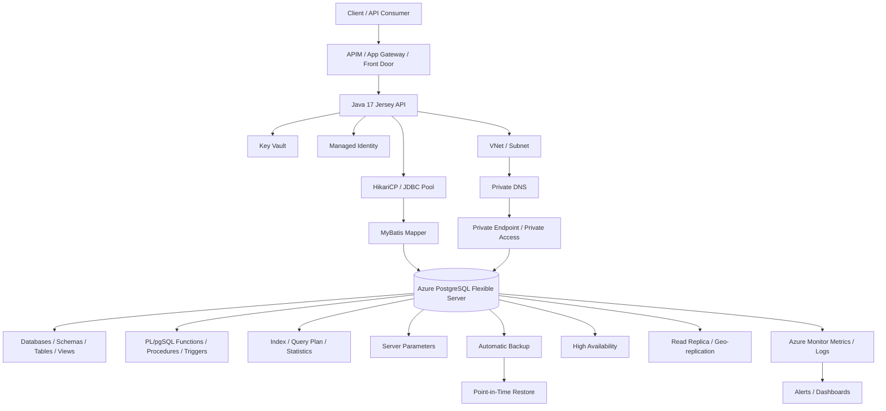

Mental model:

```text id="azpg-mental"
PostgreSQL Flexible Server
  = managed PostgreSQL engine
  + Azure-managed backup
  + HA options
  + networking boundary
  + server parameters
  + monitoring
  + scaling knobs
  + security controls

Aplikasi Java
  = harus mengelola pool, timeout, retry, query behavior, transaction boundary, migration, dan observability
```

---

## 3. Decomposition Table - Practical Categories / Domain / Skills

| Area | Skill praktis | Kenapa penting |
|---|---|---|
| **1. Flexible Server Mental Model** | Server, database, schema, parameter, compute, storage, networking, backup | Engineer harus paham mana yang dikelola Azure dan mana yang tetap tanggung jawab aplikasi/tim. |
| **2. Networking** | Public access, private access, private endpoint, private DNS, firewall, VNet | Azure PostgreSQL Flexible Server mendukung private networking, dan custom DNS perlu forwarding agar FQDN server bisa resolve dengan benar. ([Microsoft Learn](https://learn.microsoft.com/en-us/azure/postgresql/network/concepts-networking-private?utm_source=chatgpt.com)) |
| **3. Private Endpoint / Private Link** | Private IP untuk database access dari VNet | Private Link memungkinkan traffic antara VNet dan PostgreSQL Flexible Server melalui private path; private endpoint memakai target sub-resource `postgresqlServer`. ([Microsoft Learn](https://learn.microsoft.com/en-us/azure/postgresql/network/concepts-networking-private-link?utm_source=chatgpt.com)) |
| **4. Private DNS** | Resolve PostgreSQL FQDN ke private IP | Jika private endpoint memakai default private DNS zone, A record memakai format `server_name.privatelink.postgres...`; DNS yang salah adalah salah satu penyebab koneksi gagal. ([Microsoft Learn](https://learn.microsoft.com/en-us/azure/postgresql/network/concepts-networking-private-link?utm_source=chatgpt.com)) |
| **5. Backup & PITR** | Automatic backup, retention, point-in-time restore, geo-restore | Backup otomatis dan transaction log backup memungkinkan restore ke titik waktu tertentu dalam retention period. ([Microsoft Learn](https://learn.microsoft.com/en-us/azure/postgresql/backup-restore/concepts-backup-restore?utm_source=chatgpt.com)) |
| **6. High Availability** | Zone-redundant/same-zone HA, failover behavior, RTO/RPO expectation | HA mengurangi downtime infrastruktur, tetapi tidak menggantikan desain aplikasi seperti retry, timeout, dan transaction safety. ([Microsoft Learn](https://learn.microsoft.com/en-us/azure/postgresql/high-availability/concepts-high-availability?utm_source=chatgpt.com)) |
| **7. Read Replica / Geo-replication** | Read scale, reporting workload, DR support, replica promotion | Read replica dapat dipromosikan; konsep promote dan virtual endpoint/read replica tersedia dalam dokumentasi Flexible Server. ([Microsoft Learn](https://learn.microsoft.com/en-us/azure/postgresql/read-replica/concepts-read-replicas-promote?utm_source=chatgpt.com)) |
| **8. Connection Pooling** | HikariCP, PgBouncer, pool sizing, app replica count | Flexible Server menyediakan PgBouncer built-in sebagai optional connection pooling solution. ([Microsoft Learn](https://learn.microsoft.com/en-us/azure/postgresql/connectivity/concepts-pgbouncer?utm_source=chatgpt.com)) |
| **9. Limits & Capacity** | Max connections, reserved connections, compute tier, memory, storage | Flexible Server punya capacity/functional limits; dokumentasi menyebut server juga mereservasi koneksi untuk replication dan monitoring. ([Microsoft Learn](https://learn.microsoft.com/en-us/azure/postgresql/configure-maintain/concepts-limits?utm_source=chatgpt.com)) |
| **10. Parameters** | `work_mem`, `shared_buffers`, `max_connections`, autovacuum, logging parameters | Azure PostgreSQL menyediakan configurable server parameters; sebagian parameter butuh restart atau punya constraint service-managed. ([Microsoft Learn](https://learn.microsoft.com/en-us/azure/postgresql/parameters/concepts-parameters?utm_source=chatgpt.com)) |
| **11. MyBatis Integration** | Mapper design, transaction boundary, query timeout, result mapping, batch insert | MyBatis memberi kontrol SQL tinggi; risiko production-nya adalah query tidak terukur, N+1 query, transaction terlalu panjang, dan pool overload. |
| **12. Migration** | Liquibase/Flyway, expand-contract, backward-compatible schema change | Deployment aplikasi dan database harus bisa rollback secara aman. |
| **13. Monitoring** | Azure Monitor metrics, enhanced metrics, alerts, database-level dimensions | Enhanced metrics untuk PostgreSQL Flexible Server emitted tiap 1 menit dan bisa dipakai untuk fine-grained monitoring/alerting. ([Microsoft Learn](https://learn.microsoft.com/en-us/azure/postgresql/monitor/concepts-monitoring?utm_source=chatgpt.com)) |
| **14. Security** | TLS, private access, Key Vault, least privilege DB role, audit/logging | Security database adalah kombinasi network, identity/credential, DB role, encryption, secret rotation, dan audit. |
| **15. Performance Tuning** | Query plan, index, statistics, vacuum, connection pooling, slow query logs | Banyak bottleneck bukan karena Azure SKU, tetapi query/index/transaction/pool design. |
| **16. Production Readiness** | Runbook restore, failover test, backup validation, alerts, capacity budget | Backup ada belum berarti recovery siap; restore harus pernah diuji. |

---

## 4. Flexible Server Mental Model

Bayangkan Azure PostgreSQL Flexible Server sebagai beberapa layer:

```text id="azpg-layer"
Azure resource layer:
  server
  compute tier
  storage
  network
  backup
  HA
  monitoring

PostgreSQL engine layer:
  database
  schema
  role
  table
  index
  view
  materialized view
  function
  procedure
  trigger
  extension
  parameter

Application access layer:
  JDBC URL
  connection pool
  MyBatis mapper
  transaction
  migration
  retry
  timeout
```

Azure mengelola banyak aspek platform seperti backup dan restore capability, tetapi aplikasi tetap bertanggung jawab terhadap query, transaction boundary, migration safety, pool sizing, data model, dan error handling. Azure documentation menekankan backup otomatis dan PITR, tetapi restore menghasilkan server baru, sehingga aplikasi tetap perlu cutover/runbook saat recovery. ([Microsoft Learn](https://learn.microsoft.com/en-us/azure/postgresql/backup-restore/concepts-backup-restore?utm_source=chatgpt.com))

---

## 5. Networking Pattern

Ada beberapa pola akses yang biasa ditemui.

### Pattern A - Public access with firewall

```text id="azpg-public"
App / Client
  → PostgreSQL public endpoint
  → firewall allowed IP
```

Ini sederhana untuk dev/test, tetapi production biasanya perlu dibatasi ketat. Jika public access dipakai, source IP harus jelas, firewall rule minimal, TLS wajib, dan credential/role harus kuat.

### Pattern B - Private access / VNet integration

```text id="azpg-private-access"
App inside VNet
  → Private DNS
  → PostgreSQL private network
```

Private access cocok saat database tidak boleh exposed lewat public endpoint. Dokumentasi Microsoft juga menekankan bahwa custom DNS server harus memakai DNS forwarder untuk resolve FQDN PostgreSQL Flexible Server; forwarder IP Azure DNS adalah `168.63.129.16`. ([Microsoft Learn](https://learn.microsoft.com/en-us/azure/postgresql/network/concepts-networking-private?utm_source=chatgpt.com))

### Pattern C - Private endpoint / Private Link

```text id="azpg-private-endpoint"
App subnet
  → Private DNS
  → Private Endpoint IP
  → PostgreSQL Flexible Server
```

Private endpoint membuat akses ke server melalui private IP di VNet. Untuk PostgreSQL Flexible Server, target sub-resource private endpoint adalah `postgresqlServer`. ([Microsoft Learn](https://learn.microsoft.com/en-us/azure/postgresql/network/how-to-networking-servers-deployed-public-access-add-private-endpoint?utm_source=chatgpt.com))

---

## 6. Private DNS - Failure Source Paling Sering

Saat aplikasi gagal connect ke PostgreSQL private endpoint, mulai dari DNS.

```bash id="azpg-nslookup"
nslookup psql-case-prod.postgres.database.azure.com
```

Expected dari runtime network:

```text id="azpg-dns-ok"
psql-case-prod.postgres.database.azure.com
  → private endpoint / private address path
```

Jika resolve ke public IP atau gagal resolve, masalahnya bisa berada di:

```text id="azpg-dns-fail"
Private DNS zone tidak ada
VNet link belum dibuat
A record salah/hilang
Custom DNS tidak forward ke Azure DNS
On-prem DNS tidak punya conditional forwarder
Runtime berada di VNet yang tidak linked
```

Microsoft menyatakan private endpoint DNS harus dikonfigurasi dengan benar agar FQDN resolve ke private endpoint IP, dan dokumentasi PostgreSQL private link menjelaskan format A record saat default private DNS zone linked. ([Microsoft Learn](https://learn.microsoft.com/en-us/azure/private-link/private-endpoint-dns?utm_source=chatgpt.com))

---

## 7. Application Connectivity Pattern

Untuk Java/Jersey + MyBatis:

```text id="azpg-java-flow"
HTTP request
  → Jersey Resource
  → Service Layer
  → Transaction Boundary
  → MyBatis Mapper
  → HikariCP
  → PostgreSQL Flexible Server
```

Koneksi database harus melalui pool, bukan dibuat per request.

### JDBC URL contoh

```properties id="azpg-jdbc"
jdbc.url=jdbc:postgresql://psql-case-prod.postgres.database.azure.com:5432/case_management?sslmode=require
jdbc.username=case_api_app
jdbc.password=${from-keyvault}
```

### HikariCP contoh

```properties id="azpg-hikari"
db.pool.maximumPoolSize=10
db.pool.minimumIdle=2
db.pool.connectionTimeout=3000
db.pool.validationTimeout=1000
db.pool.idleTimeout=600000
db.pool.maxLifetime=1800000
db.pool.leakDetectionThreshold=30000
```

Rule utama:

```text id="azpg-pool-rule"
max_app_instances_or_pods × maxPoolSize
  <= safe PostgreSQL connection budget
```

Kalau AKS HPA max 12 pod dan Hikari maxPoolSize 10, potensi koneksi aplikasi adalah 120. Angka ini harus dibandingkan dengan limit server dan kebutuhan koneksi lain seperti migration job, admin session, replication/monitoring, PgBouncer, dan background workers. Azure docs menyebut Flexible Server memiliki limits, termasuk reserved connections untuk replication dan monitoring. ([Microsoft Learn](https://learn.microsoft.com/en-us/azure/postgresql/configure-maintain/concepts-limits?utm_source=chatgpt.com))

---

## 8. PgBouncer Built-in

Flexible Server menyediakan PgBouncer sebagai optional built-in connection pooling solution. PgBouncer berguna saat banyak app instances/pods membuat terlalu banyak koneksi langsung ke PostgreSQL. ([Microsoft Learn](https://learn.microsoft.com/en-us/azure/postgresql/connectivity/concepts-pgbouncer?utm_source=chatgpt.com))

### Kapan PgBouncer berguna?

| Kondisi | Kenapa PgBouncer membantu |
|---|---|
| Banyak pod/replica Java | Mengurangi connection churn ke server |
| Traffic bursty | Pooling di sisi server membantu smoothing |
| Short transaction | Cocok untuk transaction pooling |
| Banyak microservice | Mengurangi jumlah koneksi backend PostgreSQL |
| Server sering dekat max connection | Mengurangi pressure koneksi langsung |

### Kapan harus hati-hati?

| Kondisi | Risiko |
|---|---|
| Session state berat | Transaction pooling bisa memutus asumsi session |
| Prepared statement behavior tertentu | Perlu validasi dengan driver/framework |
| Temporary table/session variable | Bisa bermasalah jika bergantung session |
| Long transaction | Pool tetap tertahan |
| LISTEN/NOTIFY session semantics | Tidak cocok lewat pooling tertentu |

Pattern umum:

```text id="azpg-pgbouncer"
Java App
  → HikariCP small pool
  → PgBouncer
  → PostgreSQL backend connections
```

Jangan berpikir PgBouncer membuat query lambat menjadi cepat. PgBouncer terutama membantu connection management, bukan memperbaiki indeks buruk atau transaction panjang.

---

## 9. Backup & Restore

Flexible Server melakukan automatic backup dan mendukung point-in-time restore ke titik waktu dalam backup retention period. Default retention adalah 7 hari dan bisa dikonfigurasi sampai 35 hari. ([Microsoft Learn](https://learn.microsoft.com/en-us/azure/postgresql/backup-restore/concepts-backup-restore?utm_source=chatgpt.com))

Mental model:

```text id="azpg-backup-model"
Automatic backup
  → database files backup
  → transaction log backup
  → point-in-time restore
  → new server created
```

Penting: PITR biasanya membuat **server baru**, bukan “undo langsung di server lama”. Dokumentasi reliability Microsoft menyebut restore membuat database server baru dengan nama server baru yang diberikan user. ([Microsoft Learn](https://learn.microsoft.com/en-us/azure/reliability/reliability-database-postgresql?utm_source=chatgpt.com))

### Recovery scenarios

| Scenario | Restore strategy |
|---|---|
| Accidental delete/update | PITR ke waktu sebelum kejadian |
| Bad migration | Restore server baru lalu compare/recover data |
| App bug corrupts data | PITR + selective data recovery |
| Region issue dengan geo backup | Geo-restore ke paired region jika configured |
| Testing recovery | Restore ke non-prod/server baru |

### Backup readiness checklist

```text id="azpg-backup-check"
Backup retention sesuai RPO bisnis.
PITR pernah diuji.
Restore time pernah diukur.
Runbook cutover tersedia.
Aplikasi bisa diarahkan ke restored server.
Credential/Key Vault/DNS update procedure jelas.
Data reconciliation setelah restore jelas.
```

Backup yang belum pernah diuji adalah asumsi, bukan recovery capability.

---

## 10. High Availability

High Availability di Flexible Server membantu mengurangi downtime akibat kegagalan infrastruktur. Namun HA tidak menyelesaikan semua failure mode, seperti bug aplikasi, query destructive, migration salah, atau lock contention. Dokumentasi HA juga menghubungkan skenario kesalahan user dengan PITR sebagai opsi restore ke waktu sebelum error. ([Microsoft Learn](https://learn.microsoft.com/en-us/azure/postgresql/high-availability/concepts-high-availability?utm_source=chatgpt.com))

### HA vs Backup

| HA | Backup/PITR |
|---|---|
| Mengurangi downtime infrastructure failure | Memulihkan data ke titik waktu tertentu |
| Tidak membantu jika data terhapus oleh aplikasi | Membantu recovery dari human/app error |
| Fokus availability | Fokus recoverability |
| Failover/cutover | Restore server baru |
| Perlu retry app | Perlu runbook restore/cutover |

### Aplikasi harus siap terhadap failover

```text id="azpg-ha-app"
Set connection timeout.
Set query timeout.
Use bounded retry.
Reconnect cleanly.
Do not hold long transactions.
Handle transient connection failure.
Avoid assuming connection is forever.
```

Failover bisa menyebabkan koneksi yang sedang terbuka terputus. Java application pool harus bisa membuang koneksi mati dan membuat koneksi baru.

---

## 11. Read Replica dan Read Scaling

Read replica membantu memisahkan read-heavy workload seperti reporting, dashboard, export, atau analytical query ringan dari primary workload. Dokumentasi Microsoft mencakup promote action untuk read replica dan konsep virtual endpoints/read replicas. ([Microsoft Learn](https://learn.microsoft.com/en-us/azure/postgresql/read-replica/concepts-read-replicas-promote?utm_source=chatgpt.com))

Pattern:

```text id="azpg-readreplica"
Primary:
  write transaction
  OLTP query

Replica:
  reporting
  dashboard
  read-only API
  export job
```

### Hati-hati dengan replication lag

| Risiko | Dampak |
|---|---|
| Read-after-write inconsistency | User baru update lalu baca dari replica belum terlihat |
| Reporting stale | Dashboard tidak real-time |
| Failover/promotion process | App endpoint perlu berubah atau virtual endpoint |
| Long-running query | Bisa tetap membebani replica |

Decision:

```text id="azpg-replica-decision"
Gunakan replica untuk workload yang toleran terhadap eventual consistency.
Jangan arahkan query yang butuh read-your-write consistency ke replica.
```

---

## 12. Server Parameters

Azure PostgreSQL Flexible Server menyediakan configurable server parameters. Parameter bisa berkaitan dengan konfigurasi PostgreSQL engine, extensions, logging, autovacuum, resource usage, dan behavior lain. ([Microsoft Learn](https://learn.microsoft.com/en-us/azure/postgresql/parameters/concepts-parameters?utm_source=chatgpt.com))

Parameter yang sering relevan untuk engineer:

| Parameter area | Contoh concern |
|---|---|
| Connections | `max_connections`, connection budget |
| Memory/query | `work_mem`, `maintenance_work_mem` |
| Vacuum | autovacuum thresholds, scale factor |
| Logging | slow query logging, connection/disconnection logging |
| Planner/statistics | statistics target |
| Extensions | allowed/preloaded extensions |
| Timeouts | statement/idle transaction timeout jika tersedia/diizinkan |
| PgBouncer | pool settings jika built-in PgBouncer digunakan |

Rule:

```text id="azpg-param-rule"
Jangan tuning parameter berdasarkan copy-paste.
Ukur bottleneck dulu: CPU, memory, IO, lock, query plan, connection pressure, vacuum, atau network.
```

---

## 13. MyBatis Integration Pattern

MyBatis memberi kontrol SQL tinggi. Ini bagus untuk sistem enterprise yang butuh query eksplisit, tetapi juga membuat disiplin SQL sangat penting.

### Mapper anti-pattern

```xml id="azpg-mybatis-bad"
<select id="findCases" resultMap="CaseResult">
  SELECT *
  FROM cases
</select>
```

Masalah:

```text id="azpg-mybatis-bad-problem"
SELECT * tidak stabil terhadap schema change.
Data terlalu banyak.
Index usage sulit diprediksi.
Network payload besar.
Mapping bisa rusak saat kolom berubah.
```

### Mapper lebih baik

```xml id="azpg-mybatis-good"
<select id="findOpenCasesByOwner" resultMap="CaseSummaryResult">
  SELECT
      c.case_id,
      c.status,
      c.owner_id,
      c.created_at,
      c.priority
  FROM cases c
  WHERE c.owner_id = #{ownerId}
    AND c.status = 'OPEN'
  ORDER BY c.created_at DESC
  LIMIT #{limit}
</select>
```

### MyBatis discipline

```text id="azpg-mybatis-rule"
Explicit columns.
Bounded result set.
Indexed predicates.
Timeout per query.
Transaction boundary di service layer.
Batch operation controlled.
No N+1 query.
No unbounded dynamic SQL.
```

---

## 14. Transaction Boundary

Untuk Java service:

```text id="azpg-tx-good"
HTTP request
  → validate input
  → begin transaction
  → minimal DB writes/reads
  → commit
  → publish/event after commit or outbox
```

Hindari:

```text id="azpg-tx-bad"
begin transaction
  → call external API
  → wait user/process
  → upload file
  → call workflow engine
  → commit after long time
```

Risiko transaction terlalu panjang:

| Risiko | Dampak |
|---|---|
| Lock lebih lama | Blocking query lain |
| Vacuum terganggu | Bloat |
| Connection tertahan | Pool exhaustion |
| Retry lebih mahal | Deadlock/timeout berulang |
| Failover lebih menyakitkan | Transaction rollback |

Rule:

```text id="azpg-tx-rule"
Transaction DB harus pendek, deterministik, dan tidak menunggu dependency eksternal yang lambat.
```

---

## 15. Migration Strategy - Liquibase/Flyway

Untuk production Azure PostgreSQL, migration harus selaras dengan deployment app.

### Expand-contract pattern

```text id="azpg-expand-contract"
1. Expand:
   tambah kolom/table/index baru secara backward-compatible.

2. Deploy:
   app baru mulai menulis/membaca struktur baru.

3. Backfill:
   isi data lama secara bertahap dan aman.

4. Contract:
   hapus kolom/index lama setelah semua versi lama mati.
```

Anti-pattern:

```text id="azpg-migration-bad"
Deploy app baru dan drop kolom lama dalam migration yang sama.
```

Dampak: rollback app menjadi gagal karena schema lama sudah hilang.

### Migration rules

```text id="azpg-migration-rules"
Migration harus idempotent/sequential.
DDL besar harus diuji dengan data volume realistis.
Index besar perlu strategi non-blocking jika memungkinkan.
Backfill jangan membanjiri primary.
Lock timeout/statement timeout perlu dipertimbangkan.
Migration job harus observable.
```

---

## 16. Views, Materialized Views, Functions, Procedures, Triggers

Karena stack Anda juga memakai PL/pgSQL/server-side programming, di Azure PostgreSQL prinsipnya sama seperti PostgreSQL biasa, tetapi operasionalnya harus lebih disiplin.

| Object | Use case | Risiko |
|---|---|---|
| **View** | Read model, query abstraction | Bisa menyembunyikan query mahal |
| **Materialized view** | Precomputed read/reporting | Refresh cost, staleness |
| **Function** | Reusable DB logic, computation near data | Debug/testing/versioning |
| **Procedure** | Transactional operation di DB | Coupling aplikasi-DB |
| **Trigger** | Audit, derived data, invariant enforcement | Hidden side effect, latency |
| **Event trigger** | DDL governance/audit | Bisa mengganggu migration jika salah |
| **NOTIFY/LISTEN** | Lightweight event signal | Bukan durable queue |

Rule:

```text id="azpg-pl-rule"
Gunakan server-side programming untuk invariant data yang kuat atau operasi dekat data.
Jangan sembunyikan business workflow kompleks tanpa observability, versioning, dan test strategy.
```

---

## 17. Performance Tuning Mental Model

Jangan langsung scale up SKU sebelum mencari bottleneck.

Urutan diagnosis:

```text id="azpg-perf-flow"
1. Apakah query lambat?
2. Apakah index cocok?
3. Apakah planner statistics fresh?
4. Apakah ada lock/wait?
5. Apakah connection pool habis?
6. Apakah CPU tinggi?
7. Apakah memory/work_mem issue?
8. Apakah IO/storage bottleneck?
9. Apakah autovacuum tertinggal?
10. Apakah network latency/private DNS/route bermasalah?
```

### Query tuning checklist

```text id="azpg-query-check"
EXPLAIN / EXPLAIN ANALYZE.
Pastikan predicate memakai index.
Hindari function di indexed column predicate jika menghalangi index.
Batasi result dengan pagination/keyset pagination.
Cek N+1 query dari MyBatis.
Cek sorting besar tanpa index.
Cek join cardinality.
Cek lock dan long-running transaction.
```

---

## 18. Index Strategy

Index bukan “tambahkan sebanyak mungkin”.

| Index pattern | Cocok untuk |
|---|---|
| B-tree | Equality/range umum |
| Composite index | Query dengan beberapa predicate/order |
| Partial index | Subset data, misalnya `status='OPEN'` |
| Unique index | Data invariant |
| Expression index | Query dengan expression tertentu |
| GIN | JSONB/full-text/array tertentu |
| BRIN | Tabel sangat besar dengan data naturally ordered |

Risiko over-indexing:

```text id="azpg-index-risk"
Write lebih lambat.
Storage naik.
Vacuum/maintenance lebih berat.
Planner bisa memilih path tidak ideal.
Migration index besar bisa lama.
```

Rule:

```text id="azpg-index-rule"
Index dibuat berdasarkan query pattern nyata, bukan tebakan.
Setiap index harus punya alasan.
```

---

## 19. Monitoring & Alerts

Azure PostgreSQL Flexible Server memiliki metrics dan enhanced metrics. Dokumentasi Microsoft menyebut enhanced metrics emitted tiap 1 menit, retention sampai 93 hari, dan beberapa metric memiliki dimension untuk split/filter seperti database name atau state. ([Microsoft Learn](https://learn.microsoft.com/en-us/azure/postgresql/monitor/concepts-monitoring?utm_source=chatgpt.com))

### Metrics yang penting

| Category | Signal |
|---|---|
| Availability | server availability, failover events |
| CPU | CPU percentage |
| Memory | memory pressure |
| Storage | used storage, storage percent |
| Connections | active connections, connection limit pressure |
| IO | IOPS, throughput, latency |
| Replication | replica lag |
| Transactions | commit/rollback pattern |
| Locks | blocking/lock waits jika tersedia |
| PgBouncer | pool usage jika enabled |
| Backup | backup/restore status |
| Query | slow query via logs/extensions/tooling |

### Alert minimum

```text id="azpg-alerts"
CPU high sustained.
Memory high sustained.
Storage percent high.
Connection count near budget.
Deadlocks increasing.
Replication lag high.
Backup/restore failure.
Server unavailable.
Long-running transactions.
Slow query spike.
```

---

## 20. Logging Strategy

Untuk production, log database harus bisa menjawab:

```text id="azpg-log-q"
Query apa yang lambat?
User/app role apa yang menjalankan?
Dari client mana?
Berapa lama?
Apakah ada lock wait?
Apakah ada deadlock?
Apakah ada connection churn?
```

Di sisi aplikasi, structured log harus membawa:

```json id="azpg-app-log"
{
  "service": "case-api",
  "traceId": "abc123",
  "operation": "submitCase",
  "db.statement.type": "UPDATE",
  "mapper": "CaseMapper.updateStatus",
  "durationMs": 142,
  "rowsAffected": 1,
  "status": "SUCCESS"
}
```

Jangan log full SQL dengan PII/secret sembarangan. Untuk regulated systems, audit log harus dibedakan dari debug log.

---

## 21. Security Baseline

Security database bukan hanya password kuat.

```text id="azpg-sec"
1. Database tidak public kecuali ada alasan kuat.
2. Gunakan private networking/private endpoint untuk production-sensitive workload.
3. TLS required.
4. Credential disimpan di Key Vault.
5. DB role least privilege.
6. App role berbeda per service/environment.
7. Migration role berbeda dari runtime role.
8. Admin role tidak dipakai aplikasi.
9. Audit/diagnostic logs dikirim ke monitoring.
10. Backup retention dan restore access dikontrol.
```

Private networking dan private endpoint membantu mengurangi public exposure; dokumentasi PostgreSQL Flexible Server menjelaskan private access, private link, private endpoint, dan DNS behavior untuk konektivitas privat. ([Microsoft Learn](https://learn.microsoft.com/en-us/azure/postgresql/network/concepts-networking-private?utm_source=chatgpt.com))

---

## 22. DB Role Design

Jangan gunakan admin user untuk aplikasi.

Contoh role model:

```sql id="azpg-roles"
-- Owner/migration role
case_migration_owner

-- Runtime role for API
case_api_app

-- Runtime role for worker
case_worker_app

-- Read-only reporting role
case_report_reader

-- Operational read-only role
case_ops_readonly
```

Prinsip:

```text id="azpg-role-rule"
Runtime app role hanya punya permission yang dibutuhkan.
Migration role boleh DDL, tapi tidak dipakai runtime.
Read-only role tidak boleh write.
Admin role tidak dipakai aplikasi.
```

---

## 23. Connection Pool Sizing

Untuk App Service/Container Apps/AKS:

```text id="azpg-sizing"
safe_connections_for_app =
  max_connections
  - reserved_connections
  - admin/ops margin
  - migration margin
  - replication/monitoring margin
  - other services margin
```

Kemudian:

```text id="azpg-sizing-formula"
max replicas × maxPoolSize <= safe_connections_for_app
```

Contoh:

```text id="azpg-sizing-example"
Safe app connection budget: 80
Max pods: 8
Max pool per pod: 10
Total possible: 80
```

Kalau Anda punya 3 service yang masing-masing autoscale:

```text id="azpg-multi-service"
case-api: max 8 pods × 10 = 80
case-worker: max 6 pods × 5 = 30
report-api: max 4 pods × 5 = 20
Total = 130
```

Ini harus dibandingkan dengan budget sebenarnya. PgBouncer bisa membantu, tetapi tetap perlu concurrency control dan query timeout.

---

## 24. Timeout & Retry Policy

Database retry harus hati-hati.

### Recommended

```text id="azpg-retry-good"
Retry hanya untuk transient connection failure.
Retry bounded.
Gunakan exponential backoff + jitter.
Jangan retry non-idempotent write tanpa idempotency key.
Set statement/query timeout.
Set connection acquisition timeout.
```

### Dangerous

```text id="azpg-retry-bad"
Retry semua SQLException.
Retry write transaction setelah partial side effect.
Retry tanpa limit.
Retry cepat oleh banyak pod saat failover.
```

Risiko:

```text id="azpg-retry-risk"
Thundering herd.
Duplicate write.
Lock amplification.
DB overload setelah failover.
```

---

## 25. HA/Failover Application Behavior

Saat failover atau maintenance, aplikasi bisa melihat:

```text id="azpg-failover-symptoms"
connection reset
connection timeout
read-only transaction error
broken pipe
server closed connection unexpectedly
temporary DNS/connectivity delay
```

Aplikasi harus:

```text id="azpg-failover-app"
discard broken connection from pool
reconnect cleanly
retry safe operations only
surface clear error for unsafe operations
avoid long transactions
avoid unbounded retry storm
```

Health/readiness:

```text id="azpg-health"
If DB unavailable:
  readiness should fail for DB-critical API.
  liveness should not kill app immediately unless app is stuck.
```

Jangan membuat liveness probe bergantung pada DB. Kalau DB down, semua pod akan restart loop padahal masalahnya bukan proses aplikasi.

---

## 26. Disaster Recovery Runbook

Runbook minimal:

```text id="azpg-dr"
1. Identify incident time.
2. Stop or freeze write traffic if corruption is ongoing.
3. Choose PITR timestamp.
4. Restore to new server.
5. Validate restored data.
6. Compare delta from old server if needed.
7. Update Key Vault/config/DNS/connection string.
8. Run smoke test.
9. Resume traffic.
10. Reconcile lost/duplicate business events.
11. Document RCA.
```

Point-in-time restore membuat server baru; restore geo-redundant backup membuat server baru di paired region. ([Microsoft Learn](https://learn.microsoft.com/en-us/azure/reliability/reliability-database-postgresql?utm_source=chatgpt.com))

Critical thought:

```text id="azpg-dr-warning"
PITR memulihkan database,
tetapi tidak otomatis memulihkan message queue, object storage, cache, atau external side effects.
```

Untuk sistem case management/regulatory workflow, DR harus mempertimbangkan outbox/event log, Camunda state, uploaded documents, dan integration events.

---

## 27. Production Architecture Pattern

```text id="azpg-prod-pattern"
Java/Jersey API
  → HikariCP small bounded pool
  → PostgreSQL Flexible Server private endpoint
  → Key Vault for credential/config
  → Azure Monitor metrics/logs
  → Backup/PITR
  → HA enabled if critical
  → Read replica for reporting if needed
```

Untuk AKS:

```text id="azpg-aks-pattern"
AKS pod
  → Workload Identity
  → Key Vault
  → Private DNS
  → PostgreSQL private endpoint
```

Untuk App Service/Container Apps:

```text id="azpg-paas-pattern"
App runtime
  → Managed Identity
  → Key Vault
  → VNet integration
  → Private endpoint / private access
  → PostgreSQL
```

---

## 28. CLI Cheatsheet

### Lihat server

```bash id="azpg-cli-list"
az postgres flexible-server list --output table
```

### Show server detail

```bash id="azpg-cli-show"
az postgres flexible-server show \
  --resource-group "<rg>" \
  --name "<server-name>" \
  --output table
```

### List databases

```bash id="azpg-cli-db"
az postgres flexible-server db list \
  --resource-group "<rg>" \
  --server-name "<server-name>" \
  --output table
```

### List firewall rules

```bash id="azpg-cli-fw"
az postgres flexible-server firewall-rule list \
  --resource-group "<rg>" \
  --name "<server-name>" \
  --output table
```

### List parameters

```bash id="azpg-cli-param"
az postgres flexible-server parameter list \
  --resource-group "<rg>" \
  --server-name "<server-name>" \
  --output table
```

### Show parameter

```bash id="azpg-cli-param-show"
az postgres flexible-server parameter show \
  --resource-group "<rg>" \
  --server-name "<server-name>" \
  --name "<parameter-name>"
```

### Update parameter

```bash id="azpg-cli-param-set"
az postgres flexible-server parameter set \
  --resource-group "<rg>" \
  --server-name "<server-name>" \
  --name "<parameter-name>" \
  --value "<value>"
```

### Point-in-time restore

```bash id="azpg-cli-restore"
az postgres flexible-server restore \
  --resource-group "<rg>" \
  --name "<new-server-name>" \
  --source-server "<source-server-name>" \
  --restore-time "2026-07-13T10:15:00Z"
```

### Test connection

```bash id="azpg-cli-psql"
psql "host=<server>.postgres.database.azure.com port=5432 dbname=<db> user=<user> sslmode=require"
```

---

## 29. Common Failure Modes

| Symptom | Kemungkinan root cause | Cara berpikir |
|---|---|---|
| `connection timeout` | DNS/private endpoint/NSG/route/firewall salah | Mulai dari `nslookup`, lalu test TCP 5432 |
| `password authentication failed` | Secret salah, user salah, password rotated | Cek Key Vault dan credential version |
| `too many connections` | Pool × replicas terlalu besar | Hitung connection budget |
| API latency spike | Slow query, lock, pool wait, DB CPU/IO | Cek query + DB metrics |
| Deadlock | Transaction order tidak konsisten | Review transaction pattern |
| Migration stuck | DDL lock, table besar, index blocking | Cek lock dan migration strategy |
| Readiness down | DB unavailable atau pool tidak bisa acquire connection | Bedakan DB issue vs app issue |
| Failover menyebabkan 5xx | Retry/pool reconnect tidak benar | Pastikan pool discard broken connections |
| Storage hampir penuh | Vacuum/bloat/log/data growth | Alert storage dan maintenance |
| Reporting query ganggu OLTP | Query berat di primary | Gunakan replica/materialized view |
| DNS beda antara laptop dan app | Private DNS hanya linked ke VNet tertentu | Test dari runtime network asli |
| Restore berhasil tapi app gagal connect | DNS/Key Vault/config masih menunjuk server lama | Cutover runbook belum lengkap |

---

## 30. Anti-pattern yang Harus Dihindari

| Anti-pattern | Risiko |
|---|---|
| App memakai admin DB user | Blast radius sangat besar |
| Database public karena “lebih mudah connect” | Exposure production |
| Pool size besar di semua pod | Connection exhaustion |
| Retry semua DB error | Duplicate writes/thundering herd |
| Long transaction sambil call external API | Lock dan pool exhaustion |
| Migration destructive tanpa expand-contract | Rollback gagal |
| Tidak pernah test restore | Backup hanya asumsi |
| Read replica dipakai untuk read-after-write | Data stale |
| Query reporting berat di primary | OLTP terganggu |
| SELECT * di MyBatis mapper | Fragile dan payload besar |
| Trigger/function menyembunyikan side effect besar | Debug sulit |
| Tidak ada slow query monitoring | Bottleneck tidak terlihat |
| Liveness probe bergantung DB | Pod restart storm saat DB outage |
| Secret DB di repo/env plain | Secret leak |

---

## 31. Production Readiness Checklist

### A. Networking

```text id="azpg-check-net"
Private endpoint/private access dipakai jika production-sensitive.
Private DNS tervalidasi dari runtime.
Firewall/public access rule minimal.
Hybrid DNS forwarding jelas.
```

### B. Security

```text id="azpg-check-sec"
DB role least privilege.
Admin user tidak dipakai aplikasi.
Credential di Key Vault.
TLS required.
Audit/logging sesuai kebutuhan compliance.
```

### C. Connection

```text id="azpg-check-conn"
HikariCP configured.
Pool size dihitung terhadap max replicas.
PgBouncer dievaluasi jika connection pressure tinggi.
Timeout jelas.
Retry bounded.
```

### D. Schema & Migration

```text id="azpg-check-mig"
Liquibase/Flyway standard.
Migration backward-compatible.
Index/backfill tested dengan volume realistis.
Rollback/cutover strategy jelas.
```

### E. Reliability

```text id="azpg-check-rel"
Backup retention sesuai RPO.
PITR pernah diuji.
HA enabled jika critical.
Failover behavior aplikasi diuji.
Read replica/DR strategy jelas jika dibutuhkan.
```

### F. Observability

```text id="azpg-check-obs"
Metrics + alerts aktif.
Slow query terlihat.
Connection count/pool wait terlihat.
Storage alert aktif.
Deadlock/lock signal dipantau.
Application logs punya traceId dan mapper/operation context.
```

---

## 32. Mental Model Final

```text id="azpg-final"
Azure PostgreSQL Flexible Server
  = managed PostgreSQL platform

Backup/PITR
  = recoverability, bukan rollback otomatis aplikasi

HA
  = infrastructure availability, bukan proteksi dari bug data

Private Endpoint/DNS
  = connectivity correctness boundary

Connection Pool
  = application-side resource governor

PgBouncer
  = server-side connection pooling aid

MyBatis
  = explicit SQL power, explicit SQL responsibility

Migration
  = compatibility contract antara app version dan schema

Monitoring
  = cara mengetahui bottleneck sebelum incident

DB Role
  = blast radius control
```

Kalimat kunci:

```text id="azpg-key"
PostgreSQL production readiness bukan hanya server berhasil dibuat.
Ia bergantung pada private connectivity, pool sizing, query discipline,
migration safety, backup restore test, HA behavior, least-privilege role,
dan observability dari aplikasi sampai database.
```

---

# Status

**Azure Seri 11/18 selesai.**

## Rekomendasi materi berikutnya

**Azure Seri 12 - Azure Storage: Blob Storage, Azure Files, lifecycle policy, SAS vs Managed Identity, private endpoint, upload/download pattern, event-driven processing, retention, security, dan production readiness untuk Java/Jersey microservice.**

---

**Sources:**

- [What Is Azure Database for PostgreSQL flexible server?](https://learn.microsoft.com/en-us/azure/postgresql/overview?utm_source=chatgpt.com)

## Response:
7/13/2026, 8:26:16 PM

# Azure Seri 12/18 - Azure Storage for Java/Jersey Microservices

## 1. Introduction

**Azure Storage** adalah family layanan storage di Azure untuk object, file share, queue, table, dan disk. Untuk software engineer backend, yang paling sering bersentuhan langsung dengan aplikasi adalah:

```text
Blob Storage  → object/file besar, upload/download, attachment, export, archive
Azure Files   → managed file share SMB/NFS
Queue Storage → simple queue
Table Storage → key-value/noSQL sederhana
```

Dalam konteks Java/Jersey + MyBatis + PostgreSQL + Docker/Kubernetes, **Blob Storage** biasanya paling penting: menyimpan dokumen kasus, attachment, export report, generated PDF/CSV, file upload, evidence, audit artifact, atau payload integrasi. Blob Storage memang dirancang untuk menyimpan data tidak terstruktur dalam jumlah besar seperti text atau binary data. ([Microsoft Learn](https://learn.microsoft.com/en-us/azure/storage/blobs/storage-blobs-introduction?utm_source=chatgpt.com))

Mental model utama:

```text
Database menyimpan metadata dan ownership.
Blob Storage menyimpan binary/object payload.
Event Grid/Queue memicu processing.
Managed Identity mengakses storage tanpa shared key.
Private Endpoint membatasi akses network.
Lifecycle policy mengontrol biaya dan retensi.
```

---

## 2. Diagram - Azure Storage Practical Map

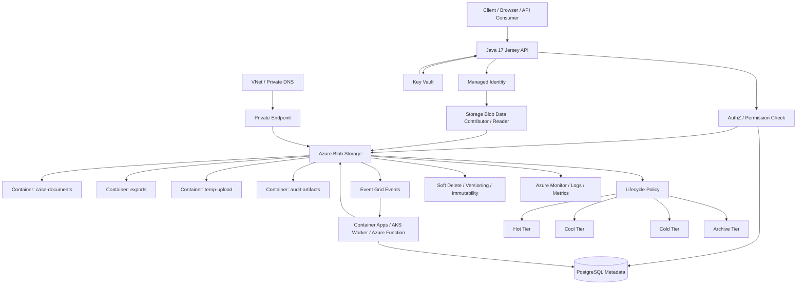

---

## 3. Decomposition Table - Practical Categories / Domain / Skills

| Area | Skill praktis | Kenapa penting |
|---|---|---|
| **1. Storage Account Mental Model** | Storage account, container, blob, file share, queue, table, endpoint | Storage account adalah boundary besar untuk data services, redundancy, network, encryption, identity, dan cost. Microsoft menjelaskan storage account mencakup tipe account, naming, tiers, redundancy, encryption, dan endpoints. ([Microsoft Learn](https://learn.microsoft.com/en-us/azure/storage/common/storage-account-overview?utm_source=chatgpt.com)) |
| **2. Blob Storage** | Block blob, container, object key, metadata, tags, upload/download | Blob Storage cocok untuk data tidak terstruktur seperti dokumen, gambar, log, export, dan binary payload. ([Microsoft Learn](https://learn.microsoft.com/en-us/azure/storage/blobs/storage-blobs-introduction?utm_source=chatgpt.com)) |
| **3. Azure Files** | SMB/NFS file share, lift-and-shift app, shared mounted files | Cocok jika aplikasi legacy butuh file share semantics, bukan object semantics. |
| **4. Redundancy** | LRS, ZRS, GRS, RA-GRS, GZRS, RA-GZRS | Redundancy menentukan durability, zone/region resilience, availability, dan biaya. Azure Storage mendokumentasikan durability/availability berbeda untuk tiap opsi redundancy. ([Microsoft Learn](https://learn.microsoft.com/en-us/azure/storage/common/storage-redundancy?utm_source=chatgpt.com)) |
| **5. Access Tiers** | Hot, Cool, Cold, Archive, Smart tier | Access tier menentukan trade-off biaya penyimpanan vs biaya akses/latency. Hot untuk active data; cool/cold untuk data lebih jarang diakses tetapi tetap online. ([Microsoft Learn](https://learn.microsoft.com/en-us/azure/storage/blobs/access-tiers-overview?utm_source=chatgpt.com)) |
| **6. Lifecycle Management** | Auto move tier, delete old blobs, rule by prefix/tag | Lifecycle policy adalah rules JSON untuk memindahkan blob antar tier atau menghapus data sesuai umur/pola akses. ([Microsoft Learn](https://learn.microsoft.com/en-us/azure/storage/blobs/lifecycle-management-overview?utm_source=chatgpt.com)) |
| **7. Authentication** | Managed Identity, Microsoft Entra ID, SAS, shared key | Untuk aplikasi Azure-hosted, managed identity + RBAC lebih aman dibanding hardcoded shared key. Azure Blob mendukung authorization dengan Microsoft Entra ID dan Azure RBAC. ([Microsoft Learn](https://learn.microsoft.com/en-us/azure/storage/blobs/authorize-access-azure-active-directory?utm_source=chatgpt.com)) |
| **8. SAS Design** | User delegation SAS, service/account SAS, expiry, permissions, scope | SAS berguna untuk delegated upload/download, tetapi harus short-lived, scoped, dan audited. Microsoft menyediakan user delegation SAS dengan Microsoft Entra credentials untuk Java. ([Microsoft Learn](https://learn.microsoft.com/en-us/azure/storage/blobs/storage-blob-user-delegation-sas-create-java?utm_source=chatgpt.com)) |
| **9. Private Endpoint** | Storage access via private IP, Private Link, private DNS | Private endpoint memungkinkan client dalam VNet mengakses storage via Private Link, dengan traffic lewat Microsoft backbone dan tanpa exposure public internet. ([Microsoft Learn](https://learn.microsoft.com/en-us/azure/storage/common/storage-private-endpoints?utm_source=chatgpt.com)) |
| **10. Private DNS** | `privatelink.blob.core.windows.net`, endpoint-specific DNS | Private endpoint tidak cukup tanpa DNS yang benar; DNS harus resolve FQDN storage ke private endpoint IP. ([Microsoft Learn](https://learn.microsoft.com/en-us/azure/private-link/private-endpoint-dns?utm_source=chatgpt.com)) |
| **11. Java SDK** | `azure-storage-blob`, `DefaultAzureCredential`, upload stream/file, download | Azure Blob Storage Java SDK menyediakan operasi create container, upload, list, download, dan delete. ([Microsoft Learn](https://learn.microsoft.com/en-us/azure/storage/blobs/storage-quickstart-blobs-java?utm_source=chatgpt.com)) |
| **12. Upload Pattern** | API-proxy upload vs direct-to-Blob upload | File besar sebaiknya tidak selalu diproxy lewat Jersey API; API bisa validasi permission lalu memberi short-lived upload instruction. |
| **13. Event-driven Processing** | Event Grid, BlobCreated/Deleted, worker processing | Blob Storage events bisa dikirim via Event Grid ke Azure Functions, Logic Apps, atau HTTP listener; Event Grid menyediakan retry dan dead-lettering. ([Microsoft Learn](https://learn.microsoft.com/en-us/azure/storage/blobs/storage-blob-event-overview?utm_source=chatgpt.com)) |
| **14. Data Protection** | Soft delete, versioning, immutability, legal hold, retention | Penting untuk mencegah accidental delete/overwrite dan memenuhi retention/compliance requirement. |
| **15. Metadata Pattern** | PostgreSQL stores metadata, Blob stores binary | Menjaga query/search/ownership di DB, sementara object payload di Blob Storage. |
| **16. Performance** | Streaming, chunking, concurrency, retry, timeout, content length, ETag | Upload/download harus memory-safe, idempotent, dan observable. |
| **17. Security** | No public container, least privilege, private access, encryption, malware scan pattern | Storage sering menyimpan data sensitif; public access dan SAS bocor adalah risiko besar. |
| **18. Production Readiness** | Alerts, lifecycle, retention, recovery, cost, runbook | Storage berhasil dibuat belum berarti aman untuk production. |

---

## 4. Storage Account Mental Model

Struktur praktisnya:

```text
Storage Account
  ├── Blob service
  │     └── Containers
  │           └── Blobs
  ├── File service
  │     └── File shares
  ├── Queue service
  │     └── Queues
  └── Table service
        └── Tables
```

Untuk aplikasi enterprise, storage account biasanya menjadi boundary untuk:

```text
network access
RBAC
encryption
redundancy
private endpoint
lifecycle policy
monitoring
cost attribution
data classification
```

Jangan asal membuat satu storage account untuk semua aplikasi. Storage account terlalu besar akan menyulitkan RBAC, lifecycle policy, data classification, dan cost attribution.

---

## 5. Blob Storage Object Model

Struktur Blob Storage:

```text
Storage Account:
  stcaseprodsea001

Container:
  case-documents

Blob:
  cases/2026/07/case-123/document-456.pdf
```

Blob name bukan folder sungguhan, tetapi path-like key. Prefix seperti `cases/2026/07/` membantu organisasi object, lifecycle policy, dan listing.

Contoh container design:

| Container | Isi | Catatan |
|---|---|---|
| `case-documents` | Dokumen utama kasus | Sensitive, private, long retention |
| `case-attachments` | Attachment user/upload | Butuh scanning/validation |
| `exports` | CSV/PDF/report export | Bisa punya TTL/lifecycle pendek |
| `temp-upload` | Temporary upload area | Auto-delete cepat |
| `audit-artifacts` | Evidence/audit artifact | Retention ketat, bisa immutable |
| `integration-payloads` | Payload antar sistem | Bisa archive setelah proses |

Rule praktis:

```text
Container = security/lifecycle boundary kasar.
Blob prefix = organization/routing/lifecycle selector.
Blob metadata/tags = searchable policy/helper metadata.
PostgreSQL = source of truth untuk ownership dan business metadata.
```

---

## 6. Blob vs Azure Files

| Kebutuhan | Pilih |
|---|---|
| Simpan dokumen, gambar, PDF, CSV, attachment | Blob Storage |
| Object access via HTTP SDK/API | Blob Storage |
| Lifecycle tiering Hot/Cool/Cold/Archive | Blob Storage |
| Event-driven processing saat object dibuat | Blob Storage + Event Grid |
| Legacy app butuh SMB/NFS mounted share | Azure Files |
| Banyak app butuh shared filesystem semantics | Azure Files |
| Lift-and-shift aplikasi file-share based | Azure Files |

Untuk microservice baru, biasanya **Blob Storage lebih cocok** daripada Azure Files karena object semantics lebih jelas, scalable, dan cocok untuk direct upload/download via signed URL/SAS pattern.

Azure Files tetap berguna bila aplikasi benar-benar butuh file share semantics. Untuk redundancy, Azure Files punya batasan berbeda; misalnya SSD file shares harus memakai LRS atau ZRS, sedangkan geo-redundancy untuk Azure Files hanya didukung untuk HDD file shares. ([Microsoft Learn](https://learn.microsoft.com/en-us/azure/storage/files/files-redundancy?utm_source=chatgpt.com))

---

## 7. Redundancy Decision

Redundancy menentukan bagaimana data direplikasi.

| Opsi | Makna praktis | Cocok untuk |
|---|---|---|
| **LRS** | Replicate dalam satu datacenter/region boundary lokal | Dev/test, low criticality |
| **ZRS** | Replicate sinkron lintas availability zones dalam region utama | Production regional resilience |
| **GRS** | LRS primary + async copy ke secondary region | DR region-level |
| **RA-GRS** | GRS + read access ke secondary | DR/read access secondary |
| **GZRS** | ZRS primary + async copy ke secondary | Stronger regional + geo resilience |
| **RA-GZRS** | GZRS + read access secondary | Higher resilience/read secondary |

Azure Storage mendokumentasikan durability tinggi untuk LRS, ZRS, GRS, dan GZRS, serta availability berbeda untuk read/write request berdasarkan access tier dan redundancy option. ([Microsoft Learn](https://learn.microsoft.com/en-us/azure/storage/common/storage-redundancy?utm_source=chatgpt.com))

Decision rule:

```text
Non-critical dev/test → LRS
Production single-region but zone-resilient → ZRS
Production with regional DR requirement → GRS/GZRS/RA-GRS/RA-GZRS
Analytics/critical regional object storage → ZRS sering menjadi default yang baik
```

Catatan penting: archive tier tidak didukung untuk ZRS, GZRS, atau RA-GZRS storage accounts menurut dokumentasi redundancy. ([Microsoft Learn](https://learn.microsoft.com/en-us/azure/storage/common/storage-redundancy?utm_source=chatgpt.com)) Jadi jangan memilih redundancy tanpa melihat access tier yang akan dipakai.

---

## 8. Access Tier

Blob access tiers:

| Tier | Karakter | Cocok untuk |
|---|---|---|
| **Hot** | Sering diakses, biaya storage lebih tinggi, biaya akses lebih rendah | Dokumen aktif, recent upload, API read frequently |
| **Cool** | Jarang diakses, masih online | Dokumen lama tapi kadang dibaca |
| **Cold** | Lebih jarang dari cool, tetap online | Retention data yang masih mungkin dibaca |
| **Archive** | Offline, biaya storage rendah, rehydrate sebelum dibaca | Arsip jangka panjang |
| **Smart tier** | Otomatis pindah antara hot/cool/cold berdasarkan pola akses | Access pattern tidak jelas |

Untuk online tiers, hot/cool/cold dapat diakses segera; hot cocok untuk active data, sedangkan cool/cold cocok untuk data yang lebih jarang diakses tetapi masih harus tersedia untuk read/write. ([Microsoft Learn](https://learn.microsoft.com/en-us/azure/storage/blobs/access-tiers-overview?utm_source=chatgpt.com))

Archive berbeda: blob dalam archive tier tidak bisa dibaca atau dimodifikasi sampai direhydrate ke online tier. Rehydration bisa memakan waktu hingga 15 jam bergantung priority. ([Microsoft Learn](https://learn.microsoft.com/en-us/azure/storage/blobs/archive-blob?utm_source=chatgpt.com))

Implication untuk aplikasi:

```text
Jangan taruh data yang harus langsung bisa di-download ke Archive.
Archive cocok untuk compliance/archive, bukan operational hot path.
```

---

## 9. Lifecycle Management

Lifecycle management membuat policy otomatis untuk:

```text
move Hot → Cool
move Cool → Cold
move Cold → Archive
delete old blobs
delete old versions/snapshots
```

Lifecycle management policy adalah kumpulan rule dalam JSON document dan mendukung block blobs serta append blobs pada account types tertentu. ([Microsoft Learn](https://learn.microsoft.com/en-us/azure/storage/blobs/lifecycle-management-overview?utm_source=chatgpt.com)) Policy dapat bekerja pada current versions, previous versions, dan snapshots, tetapi tidak bekerja pada system containers seperti `$logs` atau `$web`. ([Microsoft Learn](https://learn.microsoft.com/en-us/azure/storage/blobs/lifecycle-management-policy-structure?utm_source=chatgpt.com))

Contoh lifecycle rule konseptual:

```json
{
  "rules": [
    {
      "enabled": true,
      "name": "case-documents-aging",
      "type": "Lifecycle",
      "definition": {
        "filters": {
          "blobTypes": ["blockBlob"],
          "prefixMatch": ["cases/"]
        },
        "actions": {
          "baseBlob": {
            "tierToCool": { "daysAfterModificationGreaterThan": 30 },
            "tierToCold": { "daysAfterModificationGreaterThan": 180 },
            "tierToArchive": { "daysAfterModificationGreaterThan": 365 }
          }
        }
      }
    }
  ]
}
```

Design rule:

```text
Lifecycle policy harus selaras dengan legal retention, business access pattern, dan recovery expectation.
Jangan archive data yang user/operasi masih butuh akses cepat.
```

---

## 10. Metadata Pattern: PostgreSQL + Blob Storage

Jangan simpan binary besar di PostgreSQL kecuali ada alasan kuat. Pattern yang lebih umum:

```text
PostgreSQL:
  document_id
  case_id
  owner_id
  storage_account
  container
  blob_name
  content_type
  size_bytes
  checksum
  status
  created_by
  created_at
  retention_class
  scan_status

Blob Storage:
  actual binary content
```

Contoh table:

```sql
CREATE TABLE case_document (
    document_id UUID PRIMARY KEY,
    case_id UUID NOT NULL,
    container_name TEXT NOT NULL,
    blob_name TEXT NOT NULL,
    content_type TEXT NOT NULL,
    size_bytes BIGINT NOT NULL,
    sha256_checksum TEXT,
    upload_status TEXT NOT NULL,
    scan_status TEXT NOT NULL,
    retention_class TEXT NOT NULL,
    created_by TEXT NOT NULL,
    created_at TIMESTAMPTZ NOT NULL DEFAULT now()
);
```

Invariant:

```text
Blob path bukan authorization source.
Authorization tetap dari database/domain model.
Blob Storage menyimpan object; aplikasi menentukan siapa boleh akses.
```

---

## 11. Authentication: Managed Identity vs Shared Key vs SAS

| Method | Cocok untuk | Risiko |
|---|---|---|
| **Managed Identity + Azure RBAC** | App Service, ACA, AKS, VM di Azure | Perlu role setup, tetapi paling sehat untuk runtime |
| **User delegation SAS** | Delegated client upload/download short-lived | Harus scope dan expiry ketat |
| **Service SAS** | Delegated access berbasis account key | Bergantung shared key; lebih riskan |
| **Account SAS** | Broad access ke account services | Blast radius besar jika bocor |
| **Shared key** | Legacy/admin automation | Hindari untuk runtime app production |
| **Public container** | Static public content | Jangan untuk sensitive/private data |

Azure Blob Storage mendukung authorization dengan Microsoft Entra ID dan Azure RBAC untuk akses blob data. ([Microsoft Learn](https://learn.microsoft.com/en-us/azure/storage/blobs/authorize-access-azure-active-directory?utm_source=chatgpt.com)) Untuk Java apps yang berjalan di Azure, Microsoft menyediakan pola autentikasi ke Azure resources memakai system-assigned managed identity. ([Microsoft Learn](https://learn.microsoft.com/en-us/azure/developer/java/sdk/authentication/system-assigned-managed-identity?utm_source=chatgpt.com))

Runtime pattern:

```text
Java App
  → DefaultAzureCredential
  → Managed Identity
  → Storage Blob Data Contributor
  → Blob Storage
```

---

## 12. Java SDK Pattern

Dependency Maven:

```xml
<dependency>
  <groupId>com.azure</groupId>
  <artifactId>azure-storage-blob</artifactId>
  <version><!-- use approved/latest compatible version --></version>
</dependency>

<dependency>
  <groupId>com.azure</groupId>
  <artifactId>azure-identity</artifactId>
  <version><!-- use approved/latest compatible version --></version>
</dependency>
```

Client dengan managed identity:

```java
import com.azure.identity.DefaultAzureCredential;
import com.azure.identity.DefaultAzureCredentialBuilder;
import com.azure.storage.blob.BlobContainerClient;
import com.azure.storage.blob.BlobServiceClient;
import com.azure.storage.blob.BlobServiceClientBuilder;

public final class BlobStorageClientFactory {

    public BlobContainerClient containerClient(
            String accountName,
            String containerName
    ) {
        String endpoint = "https://" + accountName + ".blob.core.windows.net";

        DefaultAzureCredential credential = new DefaultAzureCredentialBuilder()
                .build();

        BlobServiceClient serviceClient = new BlobServiceClientBuilder()
                .endpoint(endpoint)
                .credential(credential)
                .buildClient();

        return serviceClient.getBlobContainerClient(containerName);
    }
}
```

Microsoft Java quickstart untuk Blob Storage mencakup create container, upload blobs, list blobs, download blobs, dan delete container. ([Microsoft Learn](https://learn.microsoft.com/en-us/azure/storage/blobs/storage-quickstart-blobs-java?utm_source=chatgpt.com))

---

## 13. Upload Pattern

Ada dua pola utama.

### Pattern A - API-proxy upload

```text
Client
  → Jersey API
  → API streams file
  → Blob Storage
```

Cocok untuk:

```text
small files
server-side validation wajib sebelum store
client tidak boleh langsung akses storage
simple internal app
```

Risiko:

```text
API memory pressure
timeout
thread blocked
gateway body limit
slow client ties server resource
higher bandwidth through app
```

### Pattern B - Direct-to-Blob upload

```text
Client
  → API asks for upload permission
  → API validates authorization
  → API creates pending metadata
  → API returns short-lived upload SAS/instruction
  → Client uploads directly to Blob
  → Event Grid triggers processing
  → Worker validates and finalizes metadata
```

Cocok untuk:

```text
large files
browser/mobile upload
high throughput
reduce API bandwidth cost/load
async scanning/processing
```

Practical recommendation:

```text
Gunakan API-proxy untuk file kecil dan kontrol sederhana.
Gunakan direct-to-Blob untuk file besar, upload intensif, atau public/client-heavy workflow.
```

---

## 14. Java Upload Streaming Example

```java
import com.azure.storage.blob.BlobClient;
import com.azure.storage.blob.BlobContainerClient;
import com.azure.storage.blob.models.BlobHttpHeaders;

import java.io.InputStream;

public final class DocumentStorageService {

    private final BlobContainerClient containerClient;

    public DocumentStorageService(BlobContainerClient containerClient) {
        this.containerClient = containerClient;
    }

    public void uploadDocument(
            String blobName,
            InputStream inputStream,
            long contentLength,
            String contentType
    ) {
        BlobClient blobClient = containerClient.getBlobClient(blobName);

        BlobHttpHeaders headers = new BlobHttpHeaders()
                .setContentType(contentType);

        blobClient.upload(inputStream, contentLength, true);
        blobClient.setHttpHeaders(headers);
    }
}
```

Azure Java upload docs menjelaskan bahwa block blob bisa diupload dari file path, stream, binary object, atau text string menggunakan client library. ([Microsoft Learn](https://learn.microsoft.com/en-us/azure/storage/blobs/storage-blob-upload-java?utm_source=chatgpt.com))

Production improvements:

```text
validate content length
validate content type
calculate checksum
set metadata/tags
use bounded timeout/retry
avoid buffering whole file in memory
write metadata transactionally
```

---

## 15. Download Pattern

### Secure download via API

```text
Client
  → API checks permission
  → API streams blob back
```

Cocok jika file kecil/sedang dan perlu audit/transform.

### Secure download via short-lived SAS

```text
Client
  → API checks permission
  → API returns short-lived read SAS
  → Client downloads from Blob directly
```

Cocok untuk file besar dan high bandwidth.

Design decision:

| Concern | API streaming | SAS direct |
|---|---|---|
| Authorization centralized | Kuat | Kuat jika API mints SAS after auth |
| Bandwidth API | Tinggi | Rendah |
| Audit per byte/download | Lebih mudah di API | Perlu storage logs + SAS tracking |
| Large file | Kurang ideal | Lebih ideal |
| URL leakage impact | N/A | Dikurangi expiry pendek/scope sempit |

---

## 16. SAS Design

SAS adalah delegated access. Untuk production, SAS harus diperlakukan seperti temporary credential.

Prinsip SAS:

```text
Short-lived.
Permission minimal.
Scope minimal.
Protocol HTTPS only.
Container/blob specific jika bisa.
Audit generation.
Never store long-lived SAS in DB/log.
```

User delegation SAS lebih kuat daripada SAS berbasis account key karena dibuat menggunakan Microsoft Entra credentials. Microsoft menyediakan Java guide untuk membuat user delegation SAS untuk blob/container dengan Entra credentials. ([Microsoft Learn](https://learn.microsoft.com/en-us/azure/storage/blobs/storage-blob-user-delegation-sas-create-java?utm_source=chatgpt.com))

Contoh policy:

| Use case | SAS permission | Expiry |
|---|---|---|
| Upload new file | create/write | 5-15 menit |
| Download document | read | 1-10 menit |
| Temporary export | read | 15-60 menit |
| Batch internal copy | read/list/write | Sesingkat mungkin |
| Public sharing | Hindari kecuali business-approved | Strict expiry |

Anti-pattern:

```text
SAS read/write/list/delete valid 1 tahun disimpan di database.
```

---

## 17. Event-driven Processing

Blob upload sering perlu proses lanjutan:

```text
virus/malware scanning
image/pdf validation
OCR
thumbnail generation
metadata extraction
checksum verification
document classification
move temp → final
notify workflow
```

Blob Storage events dapat dikirim via Event Grid ke subscribers seperti Azure Functions, Logic Apps, atau HTTP listener; Event Grid menyediakan retry policies dan dead-lettering. ([Microsoft Learn](https://learn.microsoft.com/en-us/azure/storage/blobs/storage-blob-event-overview?utm_source=chatgpt.com)) Storage account jenis StorageV2, BlockBlobStorage, dan BlobStorage mendukung Event Grid integration untuk blob events. ([Microsoft Learn](https://learn.microsoft.com/en-us/azure/event-grid/event-schema-blob-storage?utm_source=chatgpt.com))

Pattern:

```text
BlobCreated event
  → Event Grid
  → Worker/API endpoint/Function
  → validate blob
  → update PostgreSQL metadata
  → publish domain event
```

Important invariant:

```text
Event Grid event adalah signal.
Source of truth tetap database + storage state.
Worker harus idempotent.
```

---

## 18. Upload State Machine

Untuk regulatory/case-management system, gunakan state machine agar upload aman.

```text
REQUESTED
  → UPLOAD_URL_ISSUED
  → UPLOADED
  → SCANNING
  → ACCEPTED
  → REJECTED
  → EXPIRED
```

Contoh state table:

| State | Meaning |
|---|---|
| `REQUESTED` | User meminta upload |
| `UPLOAD_URL_ISSUED` | API memberi SAS/instruction |
| `UPLOADED` | BlobCreated diterima |
| `SCANNING` | Worker memvalidasi file |
| `ACCEPTED` | File aman dan metadata final |
| `REJECTED` | File invalid/malware/mismatch |
| `EXPIRED` | Upload tidak selesai dalam TTL |

Invariant:

```text
File yang belum ACCEPTED tidak boleh dipakai business process.
BlobCreated bukan berarti dokumen valid.
```

---

## 19. Naming Convention untuk Blob

Blob key harus stabil, collision-safe, dan tidak membocorkan data sensitif.

Contoh baik:

```text
cases/2026/07/13/case-7f8a/document-4c2e/original.pdf
exports/2026/07/13/user-123/export-9a1b.csv
temp-upload/2026/07/13/upload-session-6f21/blob
```

Hindari:

```text
cases/john-doe-ktp.pdf
cases/very-sensitive-case-title.pdf
```

Rule:

```text
Gunakan UUID/object ID.
Jangan masukkan PII/sensitive business title ke blob name.
Simpan nama asli file sebagai metadata di database jika perlu.
```

---

## 20. Metadata and Tags

Blob metadata berguna, tetapi jangan jadikan satu-satunya source of truth.

Contoh metadata:

```text
caseId=case-123
documentId=doc-456
uploadedBy=user-789
contentSha256=...
classification=confidential
```

Namun metadata blob:

```text
bukan authorization system
bukan relational query engine
bukan pengganti PostgreSQL
```

Gunakan PostgreSQL untuk query/ownership/workflow, Blob metadata/tags untuk operational hints, lifecycle, dan debugging.

---

## 21. Security Baseline

Minimum production baseline:

```text
1. Disable anonymous/public access kecuali benar-benar public content.
2. Runtime app pakai managed identity.
3. Assign Storage Blob Data Reader/Contributor di scope minimal.
4. Hindari shared key untuk runtime app.
5. SAS short-lived dan scoped.
6. Private endpoint untuk sensitive/internal storage.
7. Private DNS tervalidasi dari runtime.
8. HTTPS only.
9. Blob/container naming tidak mengandung PII.
10. Storage logs/metrics aktif.
11. Soft delete/versioning/immutability sesuai requirement.
12. Lifecycle policy tidak melanggar retention.
```

Private endpoints untuk storage account memberi akses private via Private Link dan menghilangkan exposure dari public internet untuk traffic dari VNet ke storage. ([Microsoft Learn](https://learn.microsoft.com/en-us/azure/storage/common/storage-private-endpoints?utm_source=chatgpt.com))

---

## 22. Network Pattern

### Public endpoint with RBAC/SAS

```text
Client/App
  → storage public endpoint
  → Microsoft Entra/SAS auth
```

Cocok untuk controlled public download/upload scenario, tetapi perlu SAS short-lived dan access policy ketat.

### Private endpoint

```text
App in VNet
  → Private DNS
  → Storage private endpoint
  → Blob Storage
```

Private endpoint memakai private IP terpisah dari VNet untuk tiap storage account service seperti Blob, File, Queue, atau Table. ([Microsoft Learn](https://learn.microsoft.com/en-us/azure/storage/common/storage-private-endpoints?utm_source=chatgpt.com))

DNS zone umum untuk blob private endpoint:

```text
privatelink.blob.core.windows.net
```

Private DNS harus benar agar FQDN storage resolve ke private IP private endpoint. ([Microsoft Learn](https://learn.microsoft.com/en-us/azure/private-link/private-endpoint-dns?utm_source=chatgpt.com))

---

## 23. Data Protection: Soft Delete, Versioning, Immutability

Untuk production, pertimbangkan:

| Feature | Fungsi |
|---|---|
| **Blob soft delete** | Recover blob yang terhapus dalam retention window |
| **Container soft delete** | Recover container yang terhapus |
| **Blob versioning** | Simpan previous versions saat overwrite |
| **Snapshots** | Point-in-time copy manual |
| **Immutable storage / WORM** | Mencegah modify/delete selama retention |
| **Legal hold** | Menahan data untuk legal/compliance |
| **Change feed** | Log perubahan blob untuk audit/processing tertentu |

Design warning:

```text
Soft delete/versioning melindungi dari accidental delete/overwrite,
tetapi juga menambah storage cost.

Immutability bagus untuk compliance,
tetapi bisa mengunci data secara legal/operasional.
Aktifkan dengan governance dan approval yang benar.
```

---

## 24. Cost Model

Cost Blob Storage biasanya datang dari:

```text
stored data size
access tier
read/write/list transactions
data retrieval cost
archive rehydration
egress bandwidth
replication/redundancy option
versioning/snapshot/soft delete retained data
logs/monitoring
```

Lifecycle management membantu mengoptimalkan biaya dengan memindahkan data ke tier lebih dingin atau menghapusnya saat tidak dibutuhkan. ([Microsoft Learn](https://learn.microsoft.com/en-us/azure/storage/blobs/lifecycle-management-overview?utm_source=chatgpt.com)) Smart tier dapat otomatis memindahkan data antara hot, cool, dan cold berdasarkan pola penggunaan saat access pattern tidak jelas. ([Microsoft Learn](https://learn.microsoft.com/en-us/azure/storage/blobs/access-tiers-smart?utm_source=chatgpt.com))

Cost anti-pattern:

```text
Semua data selamanya di Hot.
Versioning aktif tanpa retention.
Temp upload tidak pernah dihapus.
Export file tidak punya TTL.
Archive dipakai untuk data yang sering diminta cepat.
```

---

## 25. Performance and Reliability

Untuk Java API:

```text
stream, jangan buffer whole file
set timeout dan retry
gunakan client singleton/reusable
gunakan content length
validasi checksum
gunakan upload concurrency dengan hati-hati
hindari listing container besar di hot path
gunakan prefix/key design yang jelas
```

Untuk large upload/download:

```text
direct-to-Blob lebih baik daripada API proxy
gunakan chunk/block upload
gunakan async processing
jangan blokir transaction DB selama upload file
```

Reliability pattern:

```text
DB metadata insert status=UPLOAD_URL_ISSUED
Client upload to blob
BlobCreated event received
Worker validates blob
DB status=ACCEPTED
Business process can use document
```

---

## 26. Java/Jersey API Design Example

### Request upload

```http
POST /cases/{caseId}/documents/upload-request
```

Response:

```json
{
  "documentId": "8fd8b26b-7d55-44cd-9f1d-fadf4be3a8d6",
  "uploadUrl": "https://...short-lived-sas...",
  "expiresAt": "2026-07-13T10:30:00+07:00"
}
```

### Finalize via event

```text
BlobCreated event
  → worker reads blob properties
  → validates size/checksum/content type
  → updates document status
```

### Download

```http
GET /cases/{caseId}/documents/{documentId}/download-url
```

Flow:

```text
API validates case access.
API creates short-lived read SAS.
API logs access decision.
Client downloads directly from Blob.
```

---

## 27. Failure Modes

| Symptom | Kemungkinan root cause |
|---|---|
| Upload timeout | API proxy terlalu berat, gateway timeout, file terlalu besar |
| Blob uploaded tapi metadata tidak ada | Direct upload tanpa pending DB record |
| Metadata ada tapi blob tidak ada | Client gagal upload, expired SAS, lifecycle/delete |
| Download 403 | SAS expired, RBAC missing, wrong container/blob |
| App gagal access storage | Managed identity role salah |
| Private endpoint dibuat tapi app gagal connect | Private DNS/VNet link salah |
| Blob event tidak diterima | Event subscription/filter salah, unsupported account kind |
| Worker memproses dua kali | Event retry/duplicate, worker tidak idempotent |
| Archive blob tidak bisa dibaca | Perlu rehydrate ke online tier |
| Cost naik tiba-tiba | Versioning/soft delete/temp/export/lifecycle tidak dikontrol |
| User bisa akses dokumen unauthorized | SAS terlalu luas/lama atau authorization bukan dari domain model |
| Malware file dipakai proses bisnis | Tidak ada scanning/validation state |

---

## 28. CLI Cheatsheet

### List storage accounts

```bash
az storage account list --output table
```

### Show storage account

```bash
az storage account show \
  --resource-group "<rg>" \
  --name "<storage-account-name>"
```

### Create container

```bash
az storage container create \
  --account-name "<storage-account-name>" \
  --name "case-documents" \
  --auth-mode login
```

### Upload blob

```bash
az storage blob upload \
  --account-name "<storage-account-name>" \
  --container-name "case-documents" \
  --name "cases/2026/07/case-123/doc-456.pdf" \
  --file "./doc.pdf" \
  --auth-mode login
```

### Download blob

```bash
az storage blob download \
  --account-name "<storage-account-name>" \
  --container-name "case-documents" \
  --name "cases/2026/07/case-123/doc-456.pdf" \
  --file "./doc.pdf" \
  --auth-mode login
```

### List blobs by prefix

```bash
az storage blob list \
  --account-name "<storage-account-name>" \
  --container-name "case-documents" \
  --prefix "cases/2026/07/" \
  --auth-mode login \
  --output table
```

### Assign blob contributor role

```bash
az role assignment create \
  --assignee "<principal-id>" \
  --role "Storage Blob Data Contributor" \
  --scope "/subscriptions/<sub>/resourceGroups/<rg>/providers/Microsoft.Storage/storageAccounts/<storage-account-name>"
```

### Create lifecycle policy

```bash
az storage account management-policy create \
  --account-name "<storage-account-name>" \
  --resource-group "<rg>" \
  --policy @lifecycle-policy.json
```

Microsoft lifecycle policy configuration docs show Azure CLI creating a lifecycle policy from a JSON file using `az storage account management-policy create`. ([Microsoft Learn](https://learn.microsoft.com/en-us/azure/storage/blobs/lifecycle-management-policy-configure?utm_source=chatgpt.com))

---

## 29. Anti-pattern yang Harus Dihindari

| Anti-pattern | Risiko |
|---|---|
| Menyimpan file besar di PostgreSQL tanpa alasan kuat | DB bloat, backup berat, query lambat |
| Public container untuk dokumen sensitif | Data leak |
| Shared key disimpan di app config | Credential leak besar |
| SAS valid terlalu lama dan terlalu luas | Unauthorized access |
| Upload file besar lewat API tanpa streaming | Memory pressure/timeouts |
| Tidak ada upload state machine | Blob dan metadata tidak konsisten |
| BlobCreated langsung dianggap dokumen valid | Malware/invalid file masuk proses |
| Blob name mengandung PII | Data exposure via logs/path |
| Lifecycle policy menghapus data legal-retention | Compliance incident |
| Archive tier untuk dokumen yang butuh akses cepat | User-facing outage/rehydration delay |
| Private endpoint tanpa private DNS | Koneksi gagal atau tetap public path |
| Worker tidak idempotent | Duplicate processing |
| Tidak ada cost cleanup untuk temp/export | Cost leak |
| Tidak ada restore/data protection plan | Accidental delete sulit dipulihkan |

---

## 30. Production Readiness Checklist

### A. Design

```text
Binary/object disimpan di Blob.
Metadata/ownership disimpan di PostgreSQL.
Container/prefix naming jelas.
Upload/download pattern dipilih sadar.
```

### B. Security

```text
Anonymous public access disabled untuk sensitive data.
Managed identity digunakan runtime.
RBAC scoped minimal.
SAS short-lived dan scoped.
No shared key in app.
Private endpoint untuk sensitive/internal storage.
```

### C. Networking

```text
Private endpoint configured jika dibutuhkan.
Private DNS zone linked.
Runtime nslookup resolve ke private IP.
Firewall/public network access sesuai topology.
```

### D. Data Protection

```text
Soft delete/container soft delete/versioning dievaluasi.
Immutability/legal hold sesuai compliance.
Retention/lifecycle tidak konflik dengan legal requirement.
Recovery scenario diuji.
```

### E. Processing

```text
BlobCreated event subscription jelas.
Worker idempotent.
Dead-letter/retry strategy ada.
Upload state machine ada.
Malware/content validation ada jika file user-provided.
```

### F. Cost

```text
Access tier dipilih.
Lifecycle policy aktif.
Temp/export TTL ada.
Versioning/soft delete retention dikontrol.
Archive rehydration expectation dikomunikasikan.
```

### G. Observability

```text
Storage metrics/logs aktif.
Blob operation failures alert.
Event processing failures alert.
Upload/download audit log.
Correlation ID antara API, DB metadata, blob name, dan worker.
```

---

## 31. Mental Model Final

```text
Azure Storage Account
  = security/network/redundancy/cost boundary

Blob Storage
  = object storage untuk unstructured binary/text data

Container
  = coarse grouping/security/lifecycle boundary

Blob name/prefix
  = organization and routing key, not authorization

PostgreSQL metadata
  = source of truth untuk ownership, status, workflow, permission

Managed Identity
  = runtime access without shared key

SAS
  = temporary delegated access, must be short-lived and scoped

Private Endpoint
  = private network path

Lifecycle Policy
  = automated cost/retention action

Event Grid
  = event signal, not business state guarantee

Archive
  = offline long-term storage, not immediate access
```

Kalimat kunci:

```text
Azure Storage production readiness bukan sekadar bisa upload file.
Ia bergantung pada metadata model, authorization, private access, short-lived delegation,
event-driven validation, lifecycle policy, data protection, observability, dan cost control.
```

---

# Status

**Azure Seri 12/18 selesai.**

## Rekomendasi materi berikutnya

**Azure Seri 13 - Azure Key Vault & Secret Management: secrets, keys, certificates, managed identity, RBAC vs access policy, rotation, Key Vault references, private endpoint, audit, dan production readiness.**

---

**Sources:**

- [Introduction to Azure Blob Storage](https://learn.microsoft.com/en-us/azure/storage/blobs/storage-blobs-introduction?utm_source=chatgpt.com)

## Response:
7/13/2026, 8:28:54 PM

Lanjut ke **Seri 13/18**. Fokusnya Key Vault sebagai control point untuk secret, key, certificate, managed identity access, rotation, private endpoint, audit, dan failure mode production.

# Azure Seri 13/18 - Azure Key Vault & Secret Management

## 1. Introduction

**Azure Key Vault** adalah layanan untuk menyimpan dan mengelola **secrets, cryptographic keys, dan certificates** secara aman. Untuk software engineer, Key Vault bukan sekadar “tempat taruh password”, tetapi bagian dari desain security, identity, deployment, runtime configuration, rotation, audit, dan incident response.

Microsoft mendeskripsikan Azure Key Vault sebagai secure secrets store untuk secrets, keys, dan certificates, dengan perlindungan berbasis HSM/software cryptographic modules tergantung tier, serta logging/monitoring untuk melihat bagaimana vault diakses. ([Microsoft Learn](https://learn.microsoft.com/en-us/azure/key-vault/general/overview?utm_source=chatgpt.com))

Dalam stack Anda, Key Vault biasanya dipakai untuk:

```text
Java/Jersey API
Container Apps / AKS / App Service
PostgreSQL credentials / API keys / certificates
Managed Identity / Workload Identity
GitHub Actions deployment
Private Endpoint / Private DNS
Azure Monitor / audit logs
```

Mental model utama:

```text
Application should not own long-lived secrets.
Application should own identity.
Identity receives least-privilege access.
Key Vault stores sensitive material.
Audit tells who accessed what and when.
Rotation must not break runtime.
```

---

## 2. Diagram - Azure Key Vault Practical Map

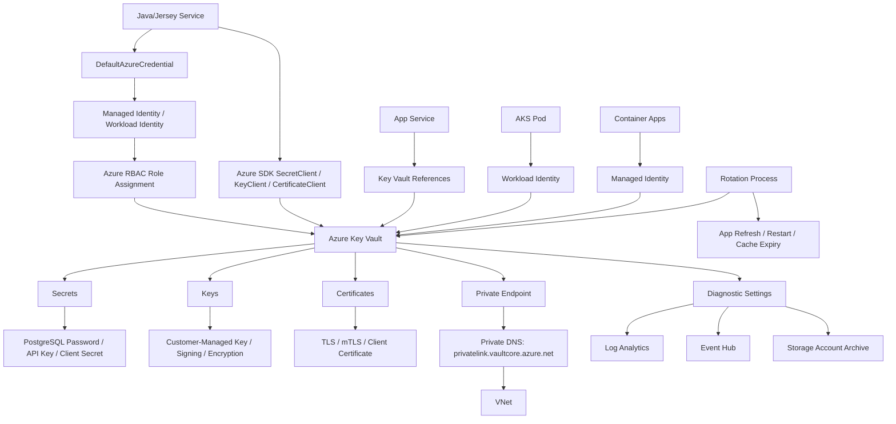

---

## 3. Decomposition Table - Practical Categories / Domain / Skills

| Area | Skill praktis | Kenapa penting |
|---|---|---|
| **1. Key Vault Mental Model** | Bedakan vault, secret, key, certificate, version, soft delete, purge protection | Mencegah salah pakai Key Vault sebagai config store biasa atau menyimpan material sensitif tanpa lifecycle yang benar. |
| **2. Secrets** | Store DB password, API key, connection credential, webhook signing secret | Secret adalah nilai sensitif opaque. Aplikasi biasanya hanya perlu `get` secret, bukan manage secret. |
| **3. Keys** | Cryptographic key, CMK, signing/encryption operation | Key Vault keys dipakai untuk operasi crypto atau customer-managed key, bukan sekadar string secret. |
| **4. Certificates** | TLS certificate, client certificate, certificate lifecycle | Certificate punya private key, policy, expiry, renewal, dan deployment path yang berbeda dari secret biasa. |
| **5. RBAC vs Access Policy** | Pilih Azure RBAC untuk permission model baru/enterprise | Microsoft menyarankan Azure RBAC untuk improved security dibanding legacy access policies; RBAC membatasi permission management ke role seperti Owner/User Access Administrator dan mendukung separation of duties. ([Microsoft Learn](https://learn.microsoft.com/en-us/azure/key-vault/general/rbac-access-policy?utm_source=chatgpt.com)) |
| **6. Key Vault RBAC Roles** | Key Vault Secrets User, Secrets Officer, Crypto User, Certificate User, Administrator | Azure RBAC memungkinkan permission keys, secrets, certificates dikelola di scope berbeda: management group, subscription, resource group, vault, atau individual key/secret/certificate. ([Microsoft Learn](https://learn.microsoft.com/en-us/azure/key-vault/general/rbac-guide?utm_source=chatgpt.com)) |
| **7. Managed Identity** | App Service/ACA/VM runtime identity | Runtime aplikasi sebaiknya membaca secret dengan managed identity, bukan client secret hardcoded. |
| **8. AKS Workload Identity** | Pod-to-Key Vault access tanpa secret | Untuk AKS, service account difederasikan ke Microsoft Entra identity lalu diberi akses minimal ke Key Vault. |
| **9. App Service Key Vault References** | App setting yang mereferensikan secret URI | Key Vault references memakai system-assigned identity by default, tetapi bisa dikonfigurasi user-assigned identity. ([Microsoft Learn](https://learn.microsoft.com/en-us/azure/app-service/app-service-key-vault-references?utm_source=chatgpt.com)) |
| **10. SDK Access Pattern** | Java `DefaultAzureCredential` + `SecretClient` | Cocok jika aplikasi perlu kontrol cache, refresh, error handling, fallback, atau dynamic lookup. |
| **11. Private Endpoint** | Akses vault lewat private IP | Key Vault dapat diintegrasikan dengan Azure Private Link; private endpoint dan VNet harus berada di region yang sama, sedangkan vault bisa berada di region berbeda. ([Microsoft Learn](https://learn.microsoft.com/en-us/azure/key-vault/general/private-link-service?utm_source=chatgpt.com)) |
| **12. Private DNS** | `privatelink.vaultcore.azure.net` resolution | Private endpoint tanpa DNS benar membuat app tetap gagal atau tetap resolve ke public endpoint. |
| **13. Logging & Audit** | Diagnostic settings, AuditEvent, Log Analytics, Event Hub, storage archive | Key Vault logging membantu memonitor bagaimana dan kapan key/secrets diakses, dan logs bisa dikirim ke storage, Event Hub, atau Azure Monitor logs. ([Microsoft Learn](https://learn.microsoft.com/en-us/azure/key-vault/general/logging?utm_source=chatgpt.com)) |
| **14. Rotation** | Secret/cert rotation, app refresh, dual credential, expiry alert | Rotation yang tidak dirancang bisa menyebabkan outage. |
| **15. Soft Delete & Purge Protection** | Recovery dari accidental delete dan anti-purge | Penting untuk production karena secret/key/cert deletion bisa mematikan banyak service. |
| **16. Naming & Versioning** | Secret name, version pinning vs latest, env separation | Secret versioning penting untuk rollback/rotation, tapi aplikasi harus tahu apakah mengambil latest atau pinned version. |
| **17. Least Privilege** | Runtime get-only, operator manage-only, pipeline limited | Mengurangi blast radius jika identity bocor/compromised. |
| **18. Production Readiness** | Alerts, expiry monitoring, access review, private access, runbook | Key Vault outage/access mistake sering langsung berdampak startup/runtime aplikasi. |

---

## 4. Key Vault Object Model

Struktur mental model:

```text
Key Vault
  ├── Secrets
  │     ├── db-password
  │     ├── partner-api-key
  │     └── webhook-signing-secret
  │
  ├── Keys
  │     ├── cmk-storage-prod
  │     └── signing-key-prod
  │
  └── Certificates
        ├── api-company-com
        └── partner-client-cert
```

Setiap object punya **version**.

```text
secret: db-password
  version: v1
  version: v2
  version: v3
```

Practical implication:

```text
Secret name stable.
Secret value changes by creating new version.
Application can read latest version or specific version.
Rotation usually creates new version.
Rollback can use previous version if still enabled.
```

---

## 5. Secrets vs Keys vs Certificates

| Object | Isi | Dipakai untuk | Jangan dipakai untuk |
|---|---|---|---|
| **Secret** | Opaque sensitive string/value | DB password, API key, token, connection secret | Crypto operation serius yang butuh key lifecycle/HSM |
| **Key** | Cryptographic key material managed by Key Vault/HSM | Encrypt/decrypt, wrap/unwrap, sign/verify, CMK | Menyimpan password string biasa |
| **Certificate** | X.509 certificate + private key lifecycle | TLS, mTLS, client cert, cert rotation | Generic config value |

Contoh:

```text
PostgreSQL password
  → Secret

Storage encryption customer-managed key
  → Key

TLS certificate for api.company.com
  → Certificate
```

Rule:

```text
Secret = value to retrieve.
Key = value should usually not leave Key Vault; use operation.
Certificate = identity/trust material with expiry and renewal lifecycle.
```

---

## 6. RBAC vs Access Policy

Key Vault punya dua permission model yang sering Anda temui:

| Model | Status praktis | Catatan |
|---|---|---|
| **Azure RBAC** | Recommended untuk desain baru/enterprise | Permission dikelola lewat Azure RBAC, mendukung scope dan PIM/separation lebih baik |
| **Access Policy** | Legacy/common di environment lama | Permission dikelola langsung di Key Vault; rawan privilege management yang kurang terpusat |

Microsoft secara eksplisit menyarankan RBAC daripada legacy access policies untuk improved security. Microsoft juga menulis bahwa legacy access policies punya known security vulnerabilities dan kurang mendukung Privileged Identity Management untuk workload kritikal. ([Microsoft Learn](https://learn.microsoft.com/en-us/azure/key-vault/general/rbac-access-policy?utm_source=chatgpt.com))

Practical warning:

```text
Jika vault memakai RBAC:
  access policy tidak berlaku.

Jika vault memakai Access Policy:
  Azure RBAC data-plane role seperti Key Vault Secrets User tidak cukup.
```

Ini failure mode umum saat aplikasi diberi role yang terlihat benar tetapi tetap gagal membaca secret.

---

## 7. Key Vault RBAC Roles yang Sering Dipakai

| Role | Makna praktis | Cocok untuk |
|---|---|---|
| **Key Vault Secrets User** | Read secret content | Runtime app yang hanya butuh membaca secret |
| **Key Vault Secrets Officer** | Manage secrets | Operator/platform yang membuat/rotate secret |
| **Key Vault Reader** | Read metadata, bukan secret value | Auditor/inventory |
| **Key Vault Certificate User** | Read certificate contents sesuai role semantics | App/operator yang perlu cert |
| **Key Vault Certificates Officer** | Manage certificates | Platform/security team |
| **Key Vault Crypto User** | Melakukan crypto operation memakai key | App yang butuh sign/encrypt/decrypt |
| **Key Vault Crypto Officer** | Manage keys | Security/platform team |
| **Key Vault Administrator** | Manage semua data-plane objects | Sangat sensitif, jangan untuk runtime app |

Azure RBAC bisa diterapkan pada vault, resource group, subscription, atau bahkan individual keys/secrets/certificates. ([Microsoft Learn](https://learn.microsoft.com/en-us/azure/key-vault/general/rbac-guide?utm_source=chatgpt.com))

Production invariant:

```text
Runtime app:
  Key Vault Secrets User pada vault atau secret tertentu.

Operator:
  Secrets Officer / Certificates Officer sesuai tugas.

Security/platform:
  Admin/Crypto Officer dengan kontrol ketat.

Pipeline:
  hanya permission yang dibutuhkan untuk deploy/rotate, bukan broad admin.
```

---

## 8. Managed Identity Access Pattern

Untuk App Service, Container Apps, dan VM:

```text
Runtime resource
  → Managed Identity
  → Azure RBAC
  → Key Vault
```

Untuk AKS:

```text
Pod
  → Kubernetes Service Account
  → Workload Identity Federation
  → User-assigned Managed Identity
  → Azure RBAC
  → Key Vault
```

Pattern yang benar:

```text
case-api-prod identity
  → Key Vault Secrets User
  → scope: kv-case-prod
```

Pattern yang buruk:

```text
case-api-prod identity
  → Contributor
  → scope: production subscription
```

Alasannya: aplikasi hanya perlu membaca secret, bukan mengubah resource Azure.

---

## 9. Java SDK Pattern - SecretClient

Gunakan Azure Identity + Key Vault SDK.

```xml
<dependency>
  <groupId>com.azure</groupId>
  <artifactId>azure-identity</artifactId>
  <version><!-- use approved/latest compatible version --></version>
</dependency>

<dependency>
  <groupId>com.azure</groupId>
  <artifactId>azure-security-keyvault-secrets</artifactId>
  <version><!-- use approved/latest compatible version --></version>
</dependency>
```

Contoh Java:

```java
import com.azure.identity.DefaultAzureCredential;
import com.azure.identity.DefaultAzureCredentialBuilder;
import com.azure.security.keyvault.secrets.SecretClient;
import com.azure.security.keyvault.secrets.SecretClientBuilder;

public final class KeyVaultSecretProvider {

    private final SecretClient client;

    public KeyVaultSecretProvider(String vaultUrl) {
        DefaultAzureCredential credential = new DefaultAzureCredentialBuilder()
                .build();

        this.client = new SecretClientBuilder()
                .vaultUrl(vaultUrl)
                .credential(credential)
                .buildClient();
    }

    public String getSecret(String name) {
        return client.getSecret(name).getValue();
    }
}
```

Mental model:

```text
Local dev:
  DefaultAzureCredential uses developer login / CLI credential.

Production:
  DefaultAzureCredential uses managed identity / workload identity.

Code:
  same.
```

---

## 10. Key Vault References vs SDK Access

Ada dua pola umum untuk aplikasi.

### Pattern A - Key Vault References

```text
App Setting:
  DB_PASSWORD = @Microsoft.KeyVault(SecretUri=https://kv.../secrets/db-password/...)
```

App Service Key Vault references menggunakan system-assigned identity secara default, tetapi bisa dikonfigurasi agar menggunakan user-assigned identity. ([Microsoft Learn](https://learn.microsoft.com/en-us/azure/app-service/app-service-key-vault-references?utm_source=chatgpt.com))

Cocok untuk:

```text
Secret sederhana.
Aplikasi ingin membaca sebagai environment variable.
Tidak butuh dynamic secret lookup.
Tidak butuh custom caching/refresh logic.
```

### Pattern B - SDK Access

```text
Java App
  → SecretClient
  → Key Vault
```

Cocok untuk:

```text
Butuh cache strategy.
Butuh dynamic reload.
Butuh custom error handling.
Butuh membaca secret berdasarkan tenant/customer/integration.
Butuh observability detail.
Butuh kontrol fallback/rotation.
```

### Decision

| Kebutuhan | Pilihan |
|---|---|
| Sederhana, env-var style | Key Vault reference |
| Java app butuh cache/refresh/error handling | SDK |
| Banyak config + feature flag | Azure App Configuration + Key Vault |
| Secret rotation tanpa restart | SDK/App Configuration pattern lebih fleksibel |
| Production strict audit per access | SDK dapat memberi logging app-level lebih baik |

---

## 11. Secret Loading Strategy

Jangan membaca Key Vault pada setiap request.

Anti-pattern:

```text
Every HTTP request:
  get secret from Key Vault
  call DB/external API
```

Risiko:

```text
latency tinggi
Key Vault throttling
dependency outage memengaruhi semua request
cost/log noise
runtime tidak resilient
```

Pattern lebih baik:

```text
Startup:
  load required secrets
  validate config
  initialize clients

Runtime:
  cache secrets with TTL
  refresh on schedule/event/manual reload
  fail safely if refresh fails but previous secret valid
```

Namun, jangan cache selamanya tanpa rotation plan.

---

## 12. Rotation Pattern

Rotation adalah bagian tersulit dari secret management.

### Simple secret rotation

```text
1. Create new secret version.
2. App refreshes or restarts.
3. App uses new value.
4. Validate production.
5. Disable old version after safe window.
6. Delete/purge only after retention policy.
```

### Dual credential rotation

Lebih aman untuk DB/API key yang mendukung dua credential aktif.

```text
1. App currently uses credential A.
2. Create credential B in target system.
3. Store B as new secret version.
4. Restart/refresh app to use B.
5. Confirm all traffic works.
6. Revoke credential A.
```

### Bad rotation

```text
1. Change DB password.
2. Update Key Vault.
3. Hope all apps refresh instantly.
```

Dampak: apps dengan cache lama atau belum restart akan gagal koneksi.

Rotation invariant:

```text
Rotate target system and Key Vault in an order that preserves at least one valid credential during transition.
```

---

## 13. Versioning: Latest vs Pinned Version

Key Vault secret URI bisa menunjuk:

```text
Latest:
https://kv-case-prod.vault.azure.net/secrets/db-password

Specific version:
https://kv-case-prod.vault.azure.net/secrets/db-password/<version>
```

| Pilihan | Kelebihan | Risiko |
|---|---|---|
| **Latest** | Rotation lebih mudah | App bisa berubah value tanpa deploy jika refresh terjadi |
| **Pinned version** | Deterministik | Rotation butuh config/deploy update |
| **Hybrid** | Pinned untuk high-risk, latest untuk low-risk | Lebih kompleks |

Practical rule:

```text
Runtime app biasanya memakai latest dengan cache/refresh/restart policy yang jelas.
Deployment-critical secret bisa pinned jika butuh deterministic release.
```

---

## 14. Certificates

Certificate berbeda dari secret biasa karena punya:

```text
subject / SAN
issuer
private key
expiry
renewal policy
chain
exportability
deployment binding
```

Use case:

```text
TLS certificate for App Gateway / Front Door / App Service
mTLS client certificate
partner integration certificate
signing certificate
```

Production checklist:

```text
expiry alert aktif
renewal owner jelas
certificate binding path jelas
private key access minimal
no manual copy ke repo
rollback cert version tersedia
```

Failure mode:

```text
Certificate expired
  → gateway/API TLS failure
  → partner integration outage
```

---

## 15. Keys and CMK

Key Vault keys dipakai saat aplikasi/resource tidak perlu mengambil raw key, tetapi meminta Key Vault melakukan operasi crypto atau menjadi customer-managed key.

Use case:

```text
Storage Account customer-managed key
Database/data service encryption key
Application signing key
Envelope encryption
```

Rule:

```text
Jika aplikasi hanya butuh password/token → Secret.
Jika aplikasi butuh cryptographic operation/key lifecycle/HSM → Key.
```

Security note: akses key harus lebih ketat dari secret biasa karena compromise key bisa berdampak luas pada enkripsi/signature trust.

---

## 16. Private Endpoint & Private DNS

Untuk production-sensitive Key Vault, gunakan network restriction/private endpoint bila sesuai topology.

Pattern:

```text
App runtime in VNet
  → Private DNS
  → Key Vault private endpoint
  → Key Vault
```

Key Vault dapat diintegrasikan dengan Azure Private Link. Private endpoint dan virtual network harus berada di region yang sama; vault-nya bisa berada di region berbeda. ([Microsoft Learn](https://learn.microsoft.com/en-us/azure/key-vault/general/private-link-service?utm_source=chatgpt.com))

DNS zone umum:

```text
privatelink.vaultcore.azure.net
```

Failure mode umum:

```text
App punya RBAC role benar,
tetapi gagal baca secret karena:
  public network disabled,
  app tidak lewat VNet/private endpoint,
  DNS resolve ke public endpoint,
  private DNS zone belum linked.
```

Microsoft menyediakan private link diagnostics untuk membantu troubleshooting Key Vault Private Link configuration. ([Microsoft Learn](https://learn.microsoft.com/en-us/azure/key-vault/general/private-link-diagnostics?utm_source=chatgpt.com))

---

## 17. App Service / Container Apps / AKS Patterns

### App Service

```text
App Service
  → system/user-assigned managed identity
  → Key Vault Secrets User
  → Key Vault reference or SDK
```

Jika Key Vault menggunakan private endpoint, App Service perlu VNet integration dan DNS path yang benar.

### Container Apps

```text
Container App
  → managed identity
  → SecretClient / environment config
  → Key Vault
```

Jangan bake secret ke Docker image. Secret harus runtime.

### AKS

```text
Pod
  → service account
  → workload identity
  → Key Vault
```

Jangan menyimpan Azure client secret sebagai Kubernetes Secret jika Workload Identity tersedia.

---

## 18. Local Development Pattern

Untuk local dev:

```text
Developer laptop
  → az login
  → DefaultAzureCredential
  → dev Key Vault
```

Jangan beri developer local access ke production Key Vault kecuali lewat controlled break-glass/read-only process.

Recommended separation:

```text
kv-case-dev
kv-case-test
kv-case-prod
```

Secret names bisa sama antar env, tetapi value dan access berbeda.

```text
dev:
  db-password → dev DB password

prod:
  db-password → prod DB password
```

Rule:

```text
Dev identity should not read prod secrets by default.
```

---

## 19. Naming Strategy

Contoh vault name:

```text
kv-case-dev-sea-001
kv-case-test-sea-001
kv-case-prod-sea-001
```

Contoh secret names:

```text
postgres-password
partner-x-api-key
jwt-signing-secret
webhook-signing-secret
smtp-password
camunda-client-secret
```

Guideline:

```text
Secret name harus deskriptif tapi tidak terlalu membocorkan informasi sensitif.
Jangan masukkan actual value, username personal, atau data rahasia ke secret name.
Gunakan naming konsisten antar environment.
```

---

## 20. Secret Design: Granularity

Jangan membuat satu secret JSON besar berisi semua credential kecuali ada alasan kuat.

### Bad

```json
{
  "dbPassword": "...",
  "partnerApiKey": "...",
  "smtpPassword": "...",
  "jwtSecret": "..."
}
```

Risiko:

```text
Rotation satu value memaksa semua secret ikut berubah.
Access tidak granular.
Audit kurang jelas.
Accidental exposure lebih besar.
```

### Better

```text
postgres-password
partner-api-key
smtp-password
jwt-signing-secret
```

Exception: jika target system memang mengeluarkan credential bundle yang harus atomic, secret JSON bisa masuk akal, tetapi tetap harus punya rotation dan ownership jelas.

---

## 21. Audit & Logging

Key Vault logging penting untuk menjawab:

```text
Siapa/identity apa membaca secret?
Secret/key/certificate mana yang diakses?
Kapan?
Dari IP/network mana?
Berhasil atau gagal?
Apakah ada access spike?
Apakah ada unauthorized attempt?
```

Azure Key Vault logging dapat menyimpan informasi akses ke storage account, Event Hub, atau Azure Monitor logs; logs biasanya tersedia dalam waktu maksimal sekitar 10 menit. ([Microsoft Learn](https://learn.microsoft.com/en-us/azure/key-vault/general/logging?utm_source=chatgpt.com))

Recommended diagnostic destinations:

| Destination | Cocok untuk |
|---|---|
| **Log Analytics** | Query, dashboard, alerting |
| **Event Hub** | SIEM/security pipeline |
| **Storage Account** | Long-term archive/compliance |

Audit query yang berguna:

```text
failed secret get attempts
secret access outside normal time
unexpected principal accessing vault
delete/disable/purge operations
certificate expiry events
secret version creation
access from unexpected network
```

---

## 22. Monitoring & Alerts

Alert minimum:

```text
Secret/certificate near expiry.
Key/certificate disabled.
Vault availability issue.
High failed access count.
Unexpected delete/disable/purge operation.
Access by unexpected principal.
Private endpoint connection issue.
Spike in GetSecret operations.
```

Key Vault overview menekankan bahwa setelah membuat vault, Anda perlu memonitor bagaimana dan kapan keys/secrets diakses dengan mengaktifkan logging. ([Microsoft Learn](https://learn.microsoft.com/en-us/azure/key-vault/general/overview?utm_source=chatgpt.com))

Practical alert examples:

| Alert | Kenapa |
|---|---|
| Cert expires in <30 days | Cegah TLS outage |
| Secret expires in <14 days | Cegah auth outage |
| Purge/delete operation | High-risk operation |
| 403 spike | RBAC/network/config regression |
| 429/throttling | App salah cache/loop |
| GetSecret anomaly | Potential leak/misbehaving app |

---

## 23. Application Failure Modes

| Symptom | Kemungkinan root cause |
|---|---|
| App gagal startup | Secret missing, RBAC salah, private DNS salah |
| App works local, fails prod | Local user punya akses; prod managed identity tidak |
| App works prod, fails local | Developer tidak punya dev vault role |
| 403 Forbidden | Role/access policy salah atau identity salah |
| 404 Secret not found | Secret name/version salah atau disabled/deleted |
| Timeout | Private endpoint/DNS/firewall/network issue |
| Key Vault reference unresolved | Identity belum diberi Get secret atau vault permission model salah |
| Secret rotation menyebabkan DB auth failure | App belum refresh/restart atau target credential dicabut terlalu cepat |
| Cert expired | Expiry alert/renewal process gagal |
| Random latency spike | App membaca Key Vault per request |
| 429/throttling | Excessive calls / no caching |

---

## 24. Secret Rotation Failure Modeling

### Failure: secret updated, app still uses old value

Root causes:

```text
App caches secret forever.
Key Vault reference not refreshed yet.
App not restarted.
Connection pool holds old credential.
DB old credential already revoked.
```

Mitigation:

```text
dual credential rotation
controlled restart/refresh
connection pool recycle
validation after rotation
safe overlap window
```

### Failure: wrong identity reads wrong environment

Root causes:

```text
prod app assigned dev identity
role assigned at subscription too broadly
same vault shared across env
secret names ambiguous
```

Mitigation:

```text
identity per env
vault per env
scope minimal
deployment validation
audit query for principal/env mismatch
```

### Failure: private endpoint breaks secret access

Root causes:

```text
public access disabled
DNS not linked
app runtime not VNet-integrated
private endpoint connection not approved
route/firewall blocks traffic
```

Mitigation:

```text
nslookup from runtime
diagnostic logs
private endpoint connection state check
network runbook
```

---

## 25. Java/Jersey Integration Design

Practical design for Jersey API:

```text
At startup:
  validate KEYVAULT_URL env var
  initialize SecretClient
  load required secrets
  initialize DB pool

During runtime:
  do not call Key Vault per request
  cache secrets
  expose config health carefully
  refresh secrets on schedule/manual restart

During rotation:
  create new secret version
  recycle pool/restart app
  validate
  disable old version after safe window
```

Example service:

```java
import java.time.Duration;
import java.time.Instant;
import java.util.Map;
import java.util.concurrent.ConcurrentHashMap;

public final class CachedSecretProvider {

    private final KeyVaultSecretProvider keyVault;
    private final Duration ttl;
    private final Map<String, CachedSecret> cache = new ConcurrentHashMap<>();

    public CachedSecretProvider(KeyVaultSecretProvider keyVault, Duration ttl) {
        this.keyVault = keyVault;
        this.ttl = ttl;
    }

    public String get(String name) {
        CachedSecret current = cache.get(name);
        if (current != null && current.expiresAt().isAfter(Instant.now())) {
            return current.value();
        }

        String value = keyVault.getSecret(name);
        cache.put(name, new CachedSecret(value, Instant.now().plus(ttl)));
        return value;
    }

    private record CachedSecret(String value, Instant expiresAt) {}
}
```

Catatan: jangan log secret value. Jangan include secret dalam exception message.

---

## 26. Key Vault dengan PostgreSQL

Pattern:

```text
Key Vault:
  postgres-password

Java app:
  managed identity reads postgres-password

PostgreSQL:
  app role uses password

Connection pool:
  initialized with current secret
```

Rotation safer pattern:

```text
1. Create second DB role/password or rotate during maintenance window.
2. Store new secret version.
3. Restart/reload app.
4. Confirm new connections use new password.
5. Revoke old credential.
6. Confirm no old connections remain.
```

Jika hanya satu DB password dan langsung diubah:

```text
existing connections may continue temporarily
new connections with old password fail
some app instances may fail before refresh
```

---

## 27. Key Vault dengan CI/CD

Pipeline sering butuh secret, tetapi hati-hati:

| Kebutuhan | Preferred pattern |
|---|---|
| Deploy Azure resource | OIDC federated identity, not client secret |
| Read deployment secret | Pipeline identity with minimal Key Vault role |
| Rotate secret | Separate privileged rotation workflow |
| Pull app secret for build | Hindari; app secret sebaiknya runtime |
| Inject production secret into image | Jangan |

Rule:

```text
Build artifact harus environment-neutral.
Production secret tidak boleh masuk Docker image.
```

Kalau pipeline butuh membaca Key Vault:

```text
GitHub Actions OIDC identity
  → Key Vault Secrets User/Officer scoped minimal
  → retrieve only required secret
```

---

## 28. Soft Delete & Purge Protection

Untuk production, aktifkan dan pahami:

```text
soft delete
purge protection
retention window
recovery process
```

Kenapa penting:

```text
Jika secret/key/cert deleted,
banyak app bisa langsung gagal.

Soft delete memungkinkan recover.
Purge protection mencegah permanent deletion terlalu cepat.
```

Operational caution:

```text
Purge operation sangat sensitif.
Batasi siapa yang bisa purge.
Audit purge/delete operation.
```

---

## 29. Private Network Debugging Flow

Saat app tidak bisa membaca Key Vault:

```text
1. Identity:
   principal ID app benar?

2. Permission model:
   vault RBAC atau access policy?

3. Role:
   Key Vault Secrets User pada scope benar?

4. Secret:
   nama/version enabled dan tidak expired?

5. Network:
   public access disabled?
   private endpoint approved?
   app VNet integration benar?

6. DNS:
   vault FQDN resolve ke private IP dari runtime?

7. Logs:
   Key Vault diagnostic logs menunjukkan 403/404/timeout?
```

Command check:

```bash
nslookup kv-case-prod.vault.azure.net
```

Expected jika private endpoint aktif dari runtime network:

```text
kv-case-prod.privatelink.vaultcore.azure.net
10.x.x.x
```

---

## 30. CLI Cheatsheet

### List vaults

```bash
az keyvault list --output table
```

### Show vault

```bash
az keyvault show \
  --name "<vault-name>" \
  --resource-group "<rg>"
```

### Create secret

```bash
az keyvault secret set \
  --vault-name "<vault-name>" \
  --name "postgres-password" \
  --value "<secret-value>"
```

### Get secret value

```bash
az keyvault secret show \
  --vault-name "<vault-name>" \
  --name "postgres-password" \
  --query value \
  --output tsv
```

### List secret versions

```bash
az keyvault secret list-versions \
  --vault-name "<vault-name>" \
  --name "postgres-password" \
  --output table
```

### Disable secret version

```bash
az keyvault secret set-attributes \
  --vault-name "<vault-name>" \
  --name "postgres-password" \
  --version "<version>" \
  --enabled false
```

### Assign Key Vault Secrets User

```bash
az role assignment create \
  --assignee "<principal-id>" \
  --role "Key Vault Secrets User" \
  --scope "/subscriptions/<sub>/resourceGroups/<rg>/providers/Microsoft.KeyVault/vaults/<vault-name>"
```

### Show role assignments for identity

```bash
az role assignment list \
  --assignee "<principal-id>" \
  --all \
  --output table
```

### List private endpoint connections

```bash
az keyvault private-endpoint-connection list \
  --vault-name "<vault-name>" \
  --resource-group "<rg>" \
  --output table
```

### Enable diagnostic settings conceptually

```bash
az monitor diagnostic-settings create \
  --name "kv-to-log-analytics" \
  --resource "/subscriptions/<sub>/resourceGroups/<rg>/providers/Microsoft.KeyVault/vaults/<vault-name>" \
  --workspace "<log-analytics-resource-id>" \
  --logs '[{"category":"AuditEvent","enabled":true}]'
```

---

## 31. Common Failure Modes

| Failure | Root cause umum | Cara deteksi |
|---|---|---|
| `403 Forbidden` | Identity salah, role salah, RBAC/access policy mismatch | Check principal ID, vault permission model, role assignment |
| `Secret not found` | Name/version salah, secret disabled/deleted | List secret versions |
| App startup lambat | App call Key Vault terlalu banyak saat startup | App logs + Key Vault logs |
| 429 throttling | Secret read per request/no cache | Key Vault metrics/logs |
| Rotation outage | Old credential revoked before app refreshed | Connection errors after rotation |
| App Service Key Vault reference unresolved | Managed identity belum punya permission atau private network issue | App config + Key Vault logs |
| Local works, prod fails | Local user punya akses, managed identity tidak | Compare identities |
| Prod works, local fails | Developer tidak diberi dev vault role | Assign dev-only role |
| Private endpoint configured but timeout | DNS/VNet/private endpoint approval salah | `nslookup`, private endpoint status |
| Certificate expired | Alert/renewal process tidak ada | Cert expiry monitoring |
| Wrong secret env | Shared vault/secret naming buruk | Audit secret URI and env config |

---

## 32. Anti-pattern yang Harus Dihindari

| Anti-pattern | Risiko |
|---|---|
| Menyimpan secret di repo, Docker image, atau Helm values plain | Secret leak |
| Runtime app diberi Key Vault Administrator | Blast radius besar |
| Semua env memakai satu vault dan satu identity | Cross-env leak |
| Access policy legacy untuk workload critical baru | Security/PIM/governance lemah |
| App membaca secret dari Key Vault per request | Latency/throttling/outage amplification |
| Rotation tanpa overlap window | Outage |
| Secret JSON besar berisi semua credential | Rotation dan access tidak granular |
| Long-lived SAS/API key tanpa expiry | Unauthorized access lama |
| No audit logs | Tidak bisa investigasi access |
| Public network open tanpa alasan | Exposure |
| Private endpoint tanpa DNS validation | Runtime gagal |
| Certificate expiry tanpa alert | TLS outage |
| Menggunakan pipeline untuk inject prod secret ke image | Artifact tidak aman dan tidak portable |
| Hardcode Key Vault URL per source branch | Environment drift |

---

## 33. Production Readiness Checklist

### A. Vault Design

```text
Vault per environment atau per security boundary.
Naming jelas.
RBAC permission model.
Soft delete dan purge protection understood/enabled.
Tags dan owner jelas.
```

### B. Identity & Access

```text
Runtime managed identity/workload identity.
Least privilege role.
No runtime admin role.
Pipeline identity terpisah dari runtime identity.
Access review berkala.
PIM/time-bound untuk privileged access.
```

### C. Secrets

```text
Secret names konsisten.
No secret in repo/image/plain Helm values.
Versioning/rotation strategy jelas.
Expiry digunakan jika sesuai.
Old versions disabled setelah safe window.
```

### D. Network

```text
Private endpoint jika production-sensitive.
Private DNS linked dan tervalidasi.
Public network access sesuai policy.
Runtime network path diuji.
```

### E. Application

```text
DefaultAzureCredential.
No Key Vault call per request.
Cache/refresh strategy.
Startup validation.
No secret value in logs/errors.
Graceful behavior saat Key Vault unavailable.
```

### F. Rotation

```text
Dual credential pattern jika memungkinkan.
Runbook rotation.
Rollback secret version tersedia.
App restart/refresh process jelas.
Connection pool recycle dipertimbangkan.
```

### G. Monitoring & Audit

```text
Diagnostic settings aktif.
Logs ke Log Analytics/SIEM/archive.
Alert expiry certificate/secret.
Alert failed access spike.
Alert delete/purge/disable.
Audit unexpected principal.
```

---

## 34. Practical Design Template

```text
Vault:
  name: kv-case-prod-sea-001
  permission model: Azure RBAC
  network: private endpoint enabled
  diagnostic logs: Log Analytics + archive
  soft delete: enabled
  purge protection: enabled

Secrets:
  postgres-password
  partner-x-api-key
  webhook-signing-secret
  camunda-client-secret

Runtime identity:
  mi-case-api-prod
    role: Key Vault Secrets User
    scope: kv-case-prod-sea-001

Operator identity:
  group-platform-secret-operators
    role: Key Vault Secrets Officer
    scope: kv-case-prod-sea-001

Application:
  Java/Jersey
  DefaultAzureCredential
  cache secrets with TTL
  no secret values in logs
  startup config validation

Network:
  VNet integration / AKS workload network
  private DNS resolves vault to private IP

Rotation:
  dual credential if target supports
  new secret version
  app restart/refresh
  validate
  disable old version after safe window
```

---

## 35. Mental Model Final

```text
Key Vault
  = secure store for secrets, keys, and certificates

Secret
  = sensitive value retrieved by app

Key
  = cryptographic object used for operations/CMK

Certificate
  = trust/TLS identity material with expiry lifecycle

Managed Identity / Workload Identity
  = who the app is

Azure RBAC
  = what the identity can do

Private Endpoint
  = private network path

Diagnostic Logs
  = audit trail

Rotation
  = lifecycle process, not just changing value

Versioning
  = rollback and controlled change boundary
```

Kalimat kunci:

```text
Secret management yang baik bukan hanya menyimpan password di Key Vault.
Ia membutuhkan identity yang tepat, permission minimal, private access bila perlu,
rotation yang aman, application cache/refresh strategy, audit logs, expiry alert,
dan runbook saat akses secret gagal.
```

---

# Status

**Azure Seri 13/18 selesai.**

## Rekomendasi materi berikutnya

**Azure Seri 14 - Azure API Management for JAX-RS/Jersey APIs: API gateway, product/subscription, policy, JWT validation, rate limiting, versioning, backend routing, private backend, observability, dan production readiness.**

---

**Sources:**

- [Azure Key Vault Overview](https://learn.microsoft.com/en-us/azure/key-vault/general/overview?utm_source=chatgpt.com)

## Response:
7/13/2026, 8:31:15 PM

Lanjut ke **Seri 14/18**. Fokusnya API Management sebagai gateway layer untuk Jersey/JAX-RS API: policy, JWT validation, rate limit, versioning, private backend, observability, dan production readiness.

# Azure Seri 14/18 - Azure API Management for JAX-RS/Jersey APIs

## 1. Introduction

**Azure API Management / APIM** adalah API gateway layer untuk mempublikasikan, mengamankan, mengontrol, memonitor, dan mengelola API. Untuk Java/Jersey/JAX-RS microservice, APIM biasanya duduk **di depan backend** seperti App Service, Azure Container Apps, AKS ingress, Function, atau private internal API.

Mental model penting:

```text id="apim-mental"
Client tidak langsung masuk ke backend Java.
Client masuk ke API gateway.
API gateway menerapkan policy.
Backend menerima traffic yang sudah distandardisasi, dibatasi, dan divalidasi.
```

APIM policy dapat mengubah behavior request/response di gateway, misalnya rate limiting, IP filtering, format conversion, JWT validation, header transformation, backend routing, caching, dan error handling. Policy diterapkan di gateway di antara API consumer dan backend API. ([Microsoft Learn](https://learn.microsoft.com/en-us/azure/api-management/api-management-howto-policies?utm_source=chatgpt.com))

---

## 2. Diagram - APIM Practical Architecture Map

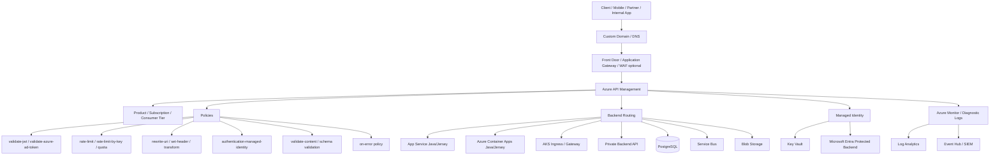

---

## 3. Decomposition Table - Practical Categories / Domain / Skills

| Area | Skill praktis | Kenapa penting |
|---|---|---|
| **1. APIM Mental Model** | Memahami APIM sebagai gateway, bukan backend business service | APIM berada di antara consumer dan backend untuk menerapkan policy, routing, auth, throttling, transformasi, dan observability. ([Microsoft Learn](https://learn.microsoft.com/en-us/azure/api-management/api-management-howto-policies?utm_source=chatgpt.com)) |
| **2. API, Operation, Product** | API grouping, operation-level policy, product/subscription model | Membantu mengelola API per consumer, tier, environment, dan lifecycle. |
| **3. Policy Pipeline** | Inbound, backend, outbound, on-error policy | APIM policy diproses di pipeline gateway sehingga bisa mengubah request sebelum backend dan response setelah backend. ([Microsoft Learn](https://learn.microsoft.com/en-us/azure/api-management/api-management-howto-policies?utm_source=chatgpt.com)) |
| **4. JWT Validation** | `validate-jwt`, claim validation, audience/issuer, operation-level rules | `validate-jwt` bisa diterapkan pada API atau operation level untuk validasi token dan claims. ([Microsoft Learn](https://learn.microsoft.com/en-us/azure/api-management/validate-jwt-policy?utm_source=chatgpt.com)) |
| **5. Microsoft Entra Token Validation** | Validasi token Microsoft Entra / Azure AD | Dokumentasi `validate-jwt` menyarankan `validate-azure-ad-token` untuk JWT dari Microsoft Entra. ([Microsoft Learn](https://learn.microsoft.com/en-us/azure/api-management/validate-jwt-policy?utm_source=chatgpt.com)) |
| **6. Rate Limit & Quota** | `rate-limit`, `rate-limit-by-key`, quota per consumer | Rate limiting mencegah spike/abuse dan melindungi backend; `rate-limit-by-key` membatasi call rate per key. ([Microsoft Learn](https://learn.microsoft.com/en-us/azure/api-management/rate-limit-policy?utm_source=chatgpt.com)) |
| **7. Subscription Key** | API key-style access per product/subscription | Berguna untuk consumer identification, throttling tier, dan developer portal, tetapi bukan pengganti authentication kuat. |
| **8. Backend Routing** | `set-backend-service`, rewrite URI, route per operation/version | Memungkinkan APIM menyembunyikan backend topology dan mengubah routing tanpa consumer mengetahui backend detail. |
| **9. Managed Identity to Backend** | `authentication-managed-identity` policy | Policy ini membuat APIM memakai managed identity untuk memperoleh token Microsoft Entra dan mengirim `Authorization: Bearer` ke backend. ([Microsoft Learn](https://learn.microsoft.com/en-us/azure/api-management/authentication-managed-identity-policy?utm_source=chatgpt.com)) |
| **10. API Versioning** | Path/header/query versioning, breaking change management | APIM versions membantu menangani breaking changes secara aman, sementara client lama tetap memakai versi lama. ([Microsoft Learn](https://learn.microsoft.com/en-us/azure/api-management/api-management-versions?utm_source=chatgpt.com)) |
| **11. API Revisions** | Non-breaking change, safe edit/test/publish | Revisions memungkinkan perubahan API secara terkontrol tanpa mengganggu consumer, lalu revision bisa dibuat current saat siap. ([Microsoft Learn](https://learn.microsoft.com/en-us/azure/api-management/api-management-revisions?utm_source=chatgpt.com)) |
| **12. Request/Response Validation** | `validate-content`, schema validation, body size guard | `validate-content` bisa memvalidasi request/response terhadap JSON/XML schema dan memblokir payload tertentu. ([Microsoft Learn](https://learn.microsoft.com/en-us/azure/api-management/validate-content-policy?utm_source=chatgpt.com)) |
| **13. Error Handling** | `on-error`, custom error body, hide backend details | APIM menyediakan `context.LastError` dan `on-error` policy section untuk merespons error policy/gateway. ([Microsoft Learn](https://learn.microsoft.com/en-us/azure/api-management/api-management-error-handling-policies?utm_source=chatgpt.com)) |
| **14. Private Backend** | APIM to private App Service/ACA/AKS/internal API | Backend sebaiknya tidak selalu public; APIM bisa menjadi controlled front door untuk private API. |
| **15. Observability** | Gateway logs, request ID, correlation ID, backend latency, policy error | Penting agar incident bisa ditelusuri dari consumer → APIM → backend Java → database/dependency. |
| **16. Security Boundary** | WAF vs APIM vs backend authorization | APIM bisa validasi token/rate limit, tetapi backend tetap perlu authorization/business permission. |
| **17. Developer Portal & Products** | Publish API docs, subscription, onboarding consumer | Berguna untuk internal/partner API governance. |
| **18. Production Readiness** | Policy as code, versioning, rollback, monitoring, private access, quotas | APIM production bukan sekadar import OpenAPI, tetapi governance API lifecycle. |

---

## 4. APIM sebagai Gateway, Bukan Business Logic Layer

APIM idealnya menangani **cross-cutting API concerns**:

```text id="apim-cross-cutting"
authentication pre-check
JWT validation
rate limit / quota
consumer tiering
request/response transformation ringan
header normalization
backend routing
API versioning
schema/content validation
error shaping
logging/correlation
```

APIM tidak seharusnya menjadi tempat business logic utama seperti:

```text id="apim-not-business"
case approval rule
pricing calculation
order orchestration
database transaction
domain authorization complex
workflow state mutation
```

Business logic tetap di Java/Jersey service atau domain service. APIM menjaga perimeter API dan governance.

---

## 5. Core Object Model

Struktur APIM:

```text id="apim-object"
API Management Service
  ├── APIs
  │     ├── Operations
  │     ├── Versions
  │     └── Revisions
  │
  ├── Products
  │     └── Subscriptions
  │
  ├── Policies
  │     ├── Global
  │     ├── Product
  │     ├── API
  │     └── Operation
  │
  ├── Backends
  ├── Named Values
  ├── Certificates
  ├── Managed Identity
  └── Developer Portal
```

Policy dapat diterapkan di beberapa scope, misalnya global, product, API, atau operation. Ini membuat rule umum bisa dipasang di atas, sementara pengecualian atau validasi khusus bisa dipasang di operation tertentu. ([Microsoft Learn](https://learn.microsoft.com/en-us/azure/api-management/api-management-howto-policies?utm_source=chatgpt.com))

---

## 6. Request Pipeline Mental Model

APIM policy biasanya dipikirkan dalam empat bagian:

```xml id="apim-pipeline"
<policies>
  <inbound>
    <!-- validate auth, rate limit, rewrite, set headers -->
  </inbound>

  <backend>
    <!-- forward request or special backend behavior -->
  </backend>

  <outbound>
    <!-- transform response, set headers, hide internals -->
  </outbound>

  <on-error>
    <!-- custom error handling -->
  </on-error>
</policies>
```

Practical flow:

```text id="apim-flow"
Client request
  → inbound policies
  → backend call
  → outbound policies
  → client response

If error:
  → on-error policies
```

APIM error handling menyediakan `ProxyError` object melalui `context.LastError`, yang bisa digunakan dalam `on-error` policy section. ([Microsoft Learn](https://learn.microsoft.com/en-us/azure/api-management/api-management-error-handling-policies?utm_source=chatgpt.com))

---

## 7. APIM vs Front Door vs Application Gateway

| Komponen | Fungsi utama | Jangan disalahgunakan sebagai |
|---|---|---|
| **Azure Front Door** | Global HTTP/S edge, global routing, edge WAF | API product/policy engine |
| **Application Gateway** | Regional L7 gateway, WAF, TLS termination, path/host routing | API lifecycle/developer portal |
| **API Management** | API gateway policy, product, subscription, auth/rate/versioning | General-purpose L4/L7 load balancer |
| **Backend Java/Jersey** | Business/domain logic | Perimeter API gateway |

Common production pattern:

```text id="apim-prod-pattern"
Internet/Partner Client
  → Front Door or App Gateway WAF
  → API Management
  → private Java/Jersey backend
```

Untuk internal enterprise API:

```text id="apim-internal-pattern"
Internal client / on-prem / VPN / ExpressRoute
  → internal APIM or private ingress
  → Java/Jersey backend
```

---

## 8. Import OpenAPI dari Jersey/JAX-RS

Untuk Jersey/JAX-RS microservice, idealnya API contract dipublikasikan sebagai **OpenAPI spec**.

Flow:

```text id="apim-openapi-flow"
Jersey/JAX-RS code or contract-first spec
  → OpenAPI YAML/JSON
  → APIM import
  → operations generated
  → policies applied
  → product published
```

Practical rule:

```text id="apim-openapi-rule"
APIM contract harus sinkron dengan backend.
Jangan biarkan APIM operation berbeda diam-diam dari OpenAPI/backend implementation.
```

Untuk contract-first approach:

```text id="apim-contract-first"
OpenAPI spec
  → generated server/client code if needed
  → APIM import
  → backend Jersey implementation
  → contract tests
```

---

## 9. Authentication vs Authorization

APIM bisa melakukan **authentication pre-check**, tetapi backend tetap perlu melakukan **authorization business-level**.

| Layer | Responsibility |
|---|---|
| APIM | Token presence, token validity, issuer/audience, basic claim gate, rate limit |
| Backend Java | User permission, tenant/org access, object-level access, domain rules |
| Database | Data-level constraint, role-based access where applicable |

Contoh:

```text id="apim-authz-example"
APIM:
  token valid?
  issuer correct?
  audience correct?
  scope contains cases.read?

Backend:
  user boleh membaca caseId ini?
  user bagian dari organization ini?
  case status memungkinkan action ini?
  ACL/permission domain terpenuhi?
```

Anti-pattern:

```text id="apim-authz-bad"
Karena APIM sudah validate JWT,
backend tidak cek permission lagi.
```

Risikonya: token valid belum tentu boleh mengakses object tertentu.

---

## 10. JWT Validation Policy

`validate-jwt` bisa diterapkan di API level atau operation level. Dokumentasi Microsoft menyebut policy ini bisa mengamankan seluruh API dengan Microsoft Entra authentication di API level, atau diterapkan di operation level dan memakai claims untuk kontrol granular. ([Microsoft Learn](https://learn.microsoft.com/en-us/azure/api-management/validate-jwt-policy?utm_source=chatgpt.com))

Contoh konseptual:

```xml id="apim-validate-jwt"
<validate-jwt header-name="Authorization"
              require-scheme="Bearer"
              failed-validation-httpcode="401"
              failed-validation-error-message="Unauthorized">
  <openid-config url="https://login.microsoftonline.com/{tenant-id}/v2.0/.well-known/openid-configuration" />
  <audiences>
    <audience>api://case-api-prod</audience>
  </audiences>
  <issuers>
    <issuer>https://login.microsoftonline.com/{tenant-id}/v2.0</issuer>
  </issuers>
  <required-claims>
    <claim name="scp" match="any">
      <value>cases.read</value>
    </claim>
  </required-claims>
</validate-jwt>
```

Practical considerations:

```text id="apim-jwt-considerations"
issuer harus tepat
audience harus tepat
clock skew perlu dipahami
claim name berbeda antar IdP
scope vs roles harus jelas
401 vs 403 harus konsisten
backend tetap authorize object-level
```

---

## 11. Validate Azure AD / Microsoft Entra Token

Jika token berasal dari Microsoft Entra, dokumentasi `validate-jwt` menyarankan menggunakan `validate-azure-ad-token`. ([Microsoft Learn](https://learn.microsoft.com/en-us/azure/api-management/validate-jwt-policy?utm_source=chatgpt.com))

Mental model:

```text id="apim-entra-token"
Client gets token from Microsoft Entra
  → APIM validates token
  → APIM forwards request to backend
  → backend may also validate token or trust gateway depending topology
```

Dalam enterprise, saya tetap menyarankan backend minimal memvalidasi trust boundary atau menerima identity claims yang sudah disanitasi dari gateway terpercaya. Jangan mempercayai header identity dari internet tanpa memastikan header tersebut hanya bisa dibuat oleh gateway.

---

## 12. Subscription Key: Berguna, tapi Bukan Auth Kuat

APIM subscription key berguna untuk:

```text id="apim-sub-key-use"
consumer identification
developer portal onboarding
product tiering
quota/rate limiting
basic access gate
internal API tracking
```

Tetapi subscription key bukan pengganti OAuth/JWT/mTLS untuk API sensitif.

Bad pattern:

```text id="apim-sub-key-bad"
Partner cukup kirim subscription key untuk API yang mengakses data confidential.
```

Better pattern:

```text id="apim-sub-key-good"
Partner:
  subscription key identifies API product/subscription
  JWT/mTLS authenticates caller
  backend authorizes domain access
```

---

## 13. Rate Limit & Quota

Rate limiting melindungi backend dari traffic spike/abuse. `rate-limit` membatasi call rate per subscription, sedangkan `rate-limit-by-key` membatasi call rate berdasarkan key yang Anda definisikan. ([Microsoft Learn](https://learn.microsoft.com/en-us/azure/api-management/rate-limit-policy?utm_source=chatgpt.com))

Contoh `rate-limit-by-key`:

```xml id="apim-rate-limit"
<rate-limit-by-key calls="100"
                   renewal-period="60"
                   counter-key="@(context.Subscription?.Key ?? context.Request.IpAddress)" />
```

Advanced design:

| Key | Cocok untuk |
|---|---|
| Subscription key | Consumer/product tier |
| Client ID claim | OAuth client based limit |
| User ID claim | Per-user limit |
| IP address | Anonymous/basic protection |
| Tenant ID claim | Multi-tenant throttling |
| Operation name | Endpoint-specific protection |

APIM gateway note penting: semua request ke APIM gateway, termasuk request yang ditolak oleh policy, bisa dihitung terhadap rate limits, quotas, dan billing limits jika tier menerapkannya. ([Microsoft Learn](https://learn.microsoft.com/en-us/azure/api-management/api-management-gateways-overview?utm_source=chatgpt.com))

---

## 14. Throttling Strategy

Jangan satu rate limit untuk semua endpoint.

| Endpoint | Rate policy |
|---|---|
| `GET /cases/{id}` | Higher read limit |
| `POST /cases` | Lower write limit |
| `POST /documents/upload-request` | Lower + payload/size constraints |
| `GET /exports/{id}` | Medium, maybe async export |
| `POST /workflow/submit` | Strict, idempotency key required |
| Admin/batch endpoints | Very strict / internal only |

Rate limiting harus diselaraskan dengan backend capacity:

```text id="apim-rate-capacity"
APIM rate limit
  <= backend app capacity
  <= PostgreSQL/Service Bus/downstream capacity
```

Anti-pattern:

```text id="apim-rate-bad"
APIM rate limit 10.000/min,
padahal PostgreSQL aman hanya untuk 500 transaksi/min pada endpoint tertentu.
```

---

## 15. Backend Routing

APIM bisa menyembunyikan backend topology dari consumer.

Contoh:

```text id="apim-route"
Public API:
  https://api.company.com/cases/v1

Backend:
  https://ca-case-api-prod.internal.azurecontainerapps.io
  or
  https://app-case-api-prod.azurewebsites.net
  or
  https://aks-ingress.internal.company.com
```

Policy seperti `set-backend-service`, `rewrite-uri`, dan `set-header` sering dipakai untuk routing/normalisasi request. Policy reference Microsoft menyediakan daftar policy routing, transformasi, access restriction, caching, validation, dan lainnya. ([Microsoft Learn](https://learn.microsoft.com/en-us/azure/api-management/api-management-policies?utm_source=chatgpt.com))

Contoh konseptual:

```xml id="apim-set-backend"
<set-backend-service base-url="https://case-api-prod.internal.company.com" />
<rewrite-uri template="/api/v1/cases/{caseId}" />
```

Practical rule:

```text id="apim-routing-rule"
Consumer-facing URL stabil.
Backend URL boleh berubah.
APIM menyerap perubahan routing selama contract tetap kompatibel.
```

---

## 16. Authenticate APIM ke Backend dengan Managed Identity

APIM bisa memakai managed identity untuk authenticate ke backend yang dilindungi Microsoft Entra. `authentication-managed-identity` memperoleh access token dari Microsoft Entra dan mengisi `Authorization` header dengan bearer token; APIM juga cache token sampai expired. ([Microsoft Learn](https://learn.microsoft.com/en-us/azure/api-management/authentication-managed-identity-policy?utm_source=chatgpt.com))

Contoh konseptual:

```xml id="apim-mi"
<authentication-managed-identity resource="api://case-api-prod" />
```

Pattern:

```text id="apim-mi-flow"
Client token
  → APIM validates client
  → APIM obtains its own backend token using managed identity
  → Backend trusts APIM identity as caller
```

Use case:

| Scenario | Manfaat |
|---|---|
| Backend private Entra-protected API | Backend tidak menerima anonymous gateway traffic |
| APIM-to-Function/App Service | Backend bisa require auth dari APIM identity |
| Internal microservice exposure | Backend hanya trust APIM/service identity |
| Secretless gateway auth | Tidak perlu client secret/certificate manual di APIM policy |

APIM managed identity juga dapat dipakai untuk mengakses Azure resources lain seperti Key Vault; Azure mengelola identity tersebut sehingga tidak perlu provision/rotate secret manual. ([Microsoft Learn](https://learn.microsoft.com/en-us/azure/api-management/api-management-howto-use-managed-service-identity?utm_source=chatgpt.com))

---

## 17. Header Strategy ke Backend Java/Jersey

Saat APIM meneruskan request ke backend, definisikan header standard:

```text id="apim-headers"
X-Correlation-ID
traceparent
X-Forwarded-For
X-Forwarded-Proto
X-Original-Host
X-Consumer-ID
X-Tenant-ID
```

Namun jangan meneruskan semua header mentah dari client.

Bad:

```text id="apim-bad-header"
Client bisa kirim X-User-Id sendiri.
Backend percaya header itu sebagai identity.
```

Better:

```text id="apim-good-header"
APIM validates JWT.
APIM removes spoofable headers.
APIM sets trusted identity headers if needed.
Backend trusts only headers from private gateway path.
```

Contoh policy konseptual:

```xml id="apim-set-header"
<set-header name="X-Correlation-ID" exists-action="override">
  <value>@(context.RequestId.ToString())</value>
</set-header>

<set-header name="X-Consumer-ID" exists-action="override">
  <value>@(context.Subscription?.Id ?? "anonymous")</value>
</set-header>
```

---

## 18. Request/Response Validation

`validate-content` dapat memvalidasi body request/response terhadap JSON atau XML schema dan bisa memblokir payload berdasarkan validation rule/size. ([Microsoft Learn](https://learn.microsoft.com/en-us/azure/api-management/validate-content-policy?utm_source=chatgpt.com))

Use case:

```text id="apim-content-use"
block payload too large
validate required JSON shape
protect backend from invalid content type
detect contract drift
enforce schema on partner APIs
```

Contoh konseptual:

```xml id="apim-validate-content"
<validate-content unspecified-content-type-action="prevent"
                  max-size="102400"
                  size-exceeded-action="prevent"
                  errors-variable-name="validationErrors">
  <content type="application/json"
           validate-as="json"
           action="prevent"
           schema-id="case-create-request-schema" />
</validate-content>
```

Practical warning:

```text id="apim-validation-warning"
APIM schema validation bukan pengganti backend validation.
Backend tetap validasi business rule, permission, dan invariants.
```

---

## 19. API Versioning

APIM versions memungkinkan breaking changes ditangani lebih aman. Client bisa memilih versi baru saat siap, sementara client lama tetap memakai versi lama. ([Microsoft Learn](https://learn.microsoft.com/en-us/azure/api-management/api-management-versions?utm_source=chatgpt.com))

APIM mendukung versioning scheme seperti **Path, Header, atau Query string**. ([Microsoft Learn](https://learn.microsoft.com/en-us/azure/api-management/api-management-get-started-publish-versions?utm_source=chatgpt.com))

| Scheme | Contoh | Catatan |
|---|---|---|
| **Path** | `/v1/cases` | Paling eksplisit dan mudah dioperasikan |
| **Header** | `api-version: 1` | URL bersih, tapi debugging/caching perlu perhatian |
| **Query** | `/cases?api-version=1` | Mudah, tapi kurang ideal untuk REST style tertentu |

Recommendation umum:

```text id="apim-version-reco"
Public/partner API:
  path versioning sering paling jelas.

Internal API:
  path atau header, tergantung standard organisasi.

Breaking change:
  buat version baru.

Non-breaking change:
  gunakan revision.
```

---

## 20. API Revisions

Revisions dipakai untuk **non-breaking changes**. Anda bisa membuat revision baru, test tanpa mengganggu consumer, lalu membuat revision itu current saat siap. ([Microsoft Learn](https://learn.microsoft.com/en-us/azure/api-management/api-management-revisions?utm_source=chatgpt.com))

Contoh:

```text id="apim-revision"
case-api v1
  revision 1 = current
  revision 2 = add optional response field, policy update, doc update
```

Use cases:

```text id="apim-revision-use"
ubah policy
ubah description/documentation
ubah backend URL
tambah optional field
ubah transformation non-breaking
test change sebelum current
```

Rule:

```text id="apim-version-revision-rule"
Version = breaking contract boundary.
Revision = safe change boundary within same version.
```

---

## 21. Product dan Subscription Model

Product mengelompokkan API untuk consumer tertentu.

Contoh products:

```text id="apim-products"
internal-core-apis
partner-case-submission
mobile-app-apis
reporting-readonly-apis
admin-operations
```

Setiap product bisa punya:

```text id="apim-product-items"
API set
subscription requirement
approval requirement
rate/quota policy
terms/use rules
visibility in developer portal
```

Practical mapping:

| Product | API | Policy |
|---|---|---|
| `partner-case-submission` | submit case, upload doc | strict rate limit, JWT/mTLS, schema validation |
| `internal-core-apis` | case/workflow APIs | Entra token, internal network, higher quota |
| `reporting-readonly` | read/export APIs | read-only scope, quota, async export |
| `admin-operations` | admin endpoints | internal only, strict role claims |

---

## 22. Named Values & Secrets

APIM named values bisa menyimpan reusable configuration untuk policy, misalnya backend URL, issuer, audience, feature flags, atau secret reference.

Use cases:

```text id="apim-named-values"
backend base URL
JWT audience
issuer URL
rate limit value
header names
Key Vault secret reference
```

Rule:

```text id="apim-named-rules"
Jangan hardcode sensitive value langsung di policy XML.
Gunakan named value / Key Vault integration sesuai standard.
Pisahkan value per environment.
```

---

## 23. Private Backend Pattern

Untuk production, backend Java/Jersey sebaiknya tidak selalu public. Pattern aman:

```text id="apim-private-backend"
Client
  → APIM public/internal endpoint
  → APIM policy
  → private backend
      App Service / ACA / AKS / internal API
```

Controls:

```text id="apim-private-controls"
backend access restriction hanya APIM/gateway
private endpoint atau VNet integration
backend validates APIM identity if needed
APIM managed identity to backend
no direct public bypass
```

Anti-pattern:

```text id="apim-public-bypass"
APIM punya semua policy,
tetapi backend App Service tetap public dan bisa diakses langsung.
```

Dampak: client bisa bypass JWT validation, rate limit, logging, dan schema validation APIM.

---

## 24. APIM untuk Java/Jersey API

### Backend Jersey API

```text id="apim-jersey-backend"
GET    /cases/{caseId}
POST   /cases
POST   /cases/{caseId}/documents/upload-request
GET    /cases/{caseId}/documents/{documentId}/download-url
POST   /cases/{caseId}/workflow/submit
```

### APIM-facing API

```text id="apim-facing"
GET    /v1/cases/{caseId}
POST   /v1/cases
POST   /v1/cases/{caseId}/documents/upload-request
GET    /v1/cases/{caseId}/documents/{documentId}/download-url
POST   /v1/cases/{caseId}/workflow/submit
```

APIM responsibilities:

```text id="apim-resp"
validate token
validate scope
apply rate limit
normalize correlation id
validate payload size/schema
route to backend
hide backend error detail
log gateway decision
```

Backend responsibilities:

```text id="backend-resp"
domain authorization
transaction boundary
MyBatis/PostgreSQL operation
Camunda/workflow interaction
Blob/SAS generation
audit log
idempotency
business error semantics
```

---

## 25. Idempotency untuk Write APIs

APIM bisa membantu enforce idempotency key presence, tetapi backend yang harus memastikan idempotency.

Write endpoints seperti ini harus hati-hati:

```text id="apim-write-endpoints"
POST /cases
POST /cases/{caseId}/workflow/submit
POST /payments
POST /orders
POST /documents/finalize
```

APIM policy bisa reject jika header tidak ada:

```xml id="apim-idempotency-check"
<choose>
  <when condition="@(string.IsNullOrEmpty(context.Request.Headers.GetValueOrDefault("Idempotency-Key","")))">
    <return-response>
      <set-status code="400" reason="Bad Request" />
      <set-body>{"error":"Idempotency-Key is required"}</set-body>
    </return-response>
  </when>
</choose>
```

Backend tetap perlu menyimpan dan mengecek idempotency key di PostgreSQL/Redis/domain store.

---

## 26. Error Handling

Backend error sebaiknya tidak bocor mentah ke consumer.

Bad response:

```json id="apim-error-bad"
{
  "error": "org.postgresql.util.PSQLException: relation case_table_new does not exist"
}
```

Better response:

```json id="apim-error-good"
{
  "errorCode": "CASE_SERVICE_UNAVAILABLE",
  "message": "The service is temporarily unavailable.",
  "correlationId": "abc-123"
}
```

APIM `on-error` policy bisa membuat response standar saat error terjadi di gateway/policy processing. ([Microsoft Learn](https://learn.microsoft.com/en-us/azure/api-management/api-management-error-handling-policies?utm_source=chatgpt.com))

Namun, jangan semua error disamakan. Backend Java tetap harus mengeluarkan business error yang meaningful dan aman.

---

## 27. Observability

APIM observability harus menghubungkan:

```text id="apim-observability-flow"
client request
  → APIM request ID
  → correlation ID / traceparent
  → backend request log
  → DB/dependency trace
  → response status
```

Minimal metadata log:

| Field | Kenapa |
|---|---|
| API name | API yang dipanggil |
| Operation | Endpoint/action |
| Product/subscription | Consumer/tier |
| Client IP | Source tracking |
| User/client ID claim | Identity tracking |
| Correlation ID | Trace end-to-end |
| Backend URL | Routing/debug |
| Status code | Success/error |
| Backend latency | Bottleneck location |
| Policy error | Gateway issue |
| Rate limit hit | Abuse/capacity control |

Gateway dan backend harus sepakat menggunakan correlation header seperti `traceparent` atau `X-Correlation-ID`.

---

## 28. Security Baseline

Minimum production baseline:

```text id="apim-sec-baseline"
1. Public/partner API lewat WAF + APIM jika internet-facing.
2. JWT validation atau mTLS untuk sensitive APIs.
3. Subscription key bukan satu-satunya auth untuk sensitive APIs.
4. Rate limit dan quota per product/consumer.
5. Backend tidak bisa dibypass langsung.
6. APIM-to-backend auth memakai managed identity atau cert jika perlu.
7. Headers dari client dibersihkan sebelum trusted identity headers dibuat.
8. Request body size/content type divalidasi untuk endpoint risk tinggi.
9. Secrets/named values tidak hardcoded di policy.
10. Logs tidak menyimpan token/PII/secret.
11. Versioning strategy jelas.
12. Operation-level policy untuk endpoint high-risk.
```

APIM authentication/authorization guidance mencakup managed identity authentication ke backend sebagai mekanisme recommended untuk scoped access ke protected backend resource. ([Microsoft Learn](https://learn.microsoft.com/en-us/azure/api-management/authentication-authorization-overview?utm_source=chatgpt.com))

---

## 29. Policy as Code

Jangan hanya edit policy manual di portal untuk production.

Recommended:

```text id="apim-policy-code"
OpenAPI spec in repo
APIM policy XML in repo
Named values / environment config via IaC
APIM deployment via Terraform/Bicep/pipeline
Review changes via PR
Promote dev → test → prod
```

Contoh repo structure:

```text id="apim-repo"
api/
  openapi/
    case-api-v1.yaml
  apim/
    policies/
      global.xml
      case-api.xml
      operations/
        create-case.xml
        upload-request.xml
    products/
      partner-case-submission.yaml
    named-values/
      dev.yaml
      prod.yaml
```

Rule:

```text id="apim-policy-rule"
Policy perubahan production harus reviewable, auditable, dan rollback-able.
```

---

## 30. Versioning & Deployment Flow

Recommended flow:

```text id="apim-deploy-flow"
1. Backend OpenAPI updated.
2. Contract tests pass.
3. APIM import/update in dev.
4. Policies applied in dev.
5. Smoke test through APIM, not direct backend.
6. Promote to test/staging.
7. If breaking change: create new API version.
8. If non-breaking change: create revision.
9. Promote APIM config to prod.
10. Monitor gateway and backend.
```

Important:

```text id="apim-smoke"
Smoke test harus melewati APIM,
karena direct backend test tidak memvalidasi policy, auth, rate limit, rewrite, dan header behavior.
```

---

## 31. Common Failure Modes

| Symptom | Kemungkinan root cause |
|---|---|
| `401 Unauthorized` | Missing/invalid JWT, wrong issuer/audience, wrong scheme |
| `403 Forbidden` | Claim/scope tidak memenuhi policy, subscription/product access salah |
| `429 Too Many Requests` | Rate limit/quota hit |
| `404` dari APIM | Operation path/version tidak match, rewrite salah |
| `500`/policy error | Policy expression error, named value missing |
| `502`/`504` | Backend unavailable, wrong backend URL, timeout, private network issue |
| Backend menerima user salah | Header spoofing atau claim mapping salah |
| Direct backend bisa diakses | Backend access restriction/private path belum benar |
| New API version tidak muncul | Product/developer portal/version set belum configured |
| JWT valid di backend tapi gagal APIM | Audience/issuer/clock/scheme mismatch |
| Upload gagal di APIM | Payload size/content validation/WAF/body limit |
| Rate limit tidak efektif | Counter key salah, subscription tidak dipakai, policy scope salah |
| Trace putus | Correlation header tidak diteruskan/dioverride |
| Prod beda dengan dev | Manual portal edit tidak masuk IaC |

---

## 32. CLI Cheatsheet

### List APIM services

```bash id="apim-cli-list"
az apim list --output table
```

### Show APIM service

```bash id="apim-cli-show"
az apim show \
  --resource-group "<rg>" \
  --name "<apim-name>" \
  --output table
```

### List APIs

```bash id="apim-cli-api-list"
az apim api list \
  --resource-group "<rg>" \
  --service-name "<apim-name>" \
  --output table
```

### Import OpenAPI

```bash id="apim-cli-import"
az apim api import \
  --resource-group "<rg>" \
  --service-name "<apim-name>" \
  --path "cases/v1" \
  --api-id "case-api-v1" \
  --specification-format OpenApi \
  --specification-path "./openapi/case-api-v1.yaml"
```

### List products

```bash id="apim-cli-products"
az apim product list \
  --resource-group "<rg>" \
  --service-name "<apim-name>" \
  --output table
```

### Add API to product

```bash id="apim-cli-product-api"
az apim product api add \
  --resource-group "<rg>" \
  --service-name "<apim-name>" \
  --product-id "<product-id>" \
  --api-id "case-api-v1"
```

### Show API policy

```bash id="apim-cli-policy-show"
az apim api policy show \
  --resource-group "<rg>" \
  --service-name "<apim-name>" \
  --api-id "case-api-v1"
```

### Set API policy

```bash id="apim-cli-policy-set"
az apim api policy create \
  --resource-group "<rg>" \
  --service-name "<apim-name>" \
  --api-id "case-api-v1" \
  --xml-content @policy.xml
```

---

## 33. Anti-pattern yang Harus Dihindari

| Anti-pattern | Risiko |
|---|---|
| APIM hanya jadi reverse proxy tanpa policy | Nilai governance rendah |
| Subscription key dianggap authentication kuat | Data/API sensitif bisa terekspos |
| Backend public bisa dibypass | Semua policy APIM bisa dilewati |
| Semua authorization dipindah ke APIM | Business permission jadi rapuh |
| Policy manual di portal tanpa IaC | Drift dan rollback sulit |
| Satu product untuk semua consumer | Rate/quota/visibility tidak granular |
| Satu rate limit global untuk semua endpoint | Endpoint berat tetap bisa overload |
| JWT claim mapping tidak distandardkan | Backend salah membaca identity |
| Forward semua client header ke backend | Header spoofing |
| APIM validate JWT, backend tidak cek object permission | Broken authorization |
| Large upload dipaksa lewat APIM tanpa design | Timeout/cost/memory/limit issue |
| Breaking change dibuat sebagai revision | Consumer lama rusak |
| Non-breaking policy change dibuat sebagai API version baru | Lifecycle clutter |
| Logs menyimpan token/secret/PII | Security/compliance incident |

---

## 34. Production Readiness Checklist

### A. API Contract

```text id="apim-check-contract"
OpenAPI spec tersedia.
Backend dan APIM contract sinkron.
Operation naming jelas.
Versioning scheme dipilih.
Breaking vs non-breaking rule jelas.
```

### B. Security

```text id="apim-check-sec"
JWT/mTLS policy untuk sensitive API.
Subscription/product access sesuai consumer.
Backend tidak bisa dibypass.
APIM-to-backend auth jelas.
Header spoofing dicegah.
Named values/secrets aman.
```

### C. Traffic Control

```text id="apim-check-traffic"
Rate limit per consumer/tier.
Quota jika perlu.
Endpoint-specific limit untuk write/heavy operations.
Payload size/content type validation untuk endpoint risk tinggi.
Retry/caching policy tidak membahayakan consistency.
```

### D. Backend

```text id="apim-check-backend"
Backend URL private/stabil.
Timeout jelas.
Health/smoke test lewat APIM.
Correlation ID diteruskan.
Backend authorization tetap ada.
```

### E. Lifecycle

```text id="apim-check-life"
Policy as code.
Promotion dev/test/prod.
Revisions untuk non-breaking.
Versions untuk breaking.
Rollback plan tersedia.
Developer portal/product docs updated.
```

### F. Observability

```text id="apim-check-obs"
APIM logs aktif.
Policy errors monitored.
429 monitored.
Backend latency monitored.
Correlation ID end-to-end.
Consumer/product-level analytics.
Alert untuk 5xx/latency/error spike.
```

---

## 35. Practical Design Template

```text id="apim-template"
API:
  name: case-api
  version: v1
  path: /cases/v1
  backend: private Java/Jersey API
  backend runtime: Container Apps / AKS / App Service

Product:
  partner-case-submission
  requires subscription: yes
  approval required: yes

Security:
  validate JWT
  required issuer: Microsoft Entra tenant / partner IdP
  required audience: api://case-api-prod
  required scopes:
    - cases.read
    - cases.write
  backend auth: APIM managed identity

Traffic:
  GET read endpoints: higher rate limit
  POST write endpoints: stricter rate limit
  upload request: body/schema validation
  workflow submit: idempotency key required

Headers:
  set X-Correlation-ID
  forward traceparent
  remove spoofable identity headers
  set trusted consumer metadata if required

Backend:
  access restriction allows APIM only
  private endpoint/internal ingress if required
  backend still validates domain permission

Lifecycle:
  breaking change -> v2
  non-breaking change -> revision
  APIM config stored as code
```

---

## 36. Mental Model Final

```text id="apim-final"
Azure API Management
  = API gateway and API governance layer

Policy
  = configurable gateway behavior

Product
  = consumer-facing API package

Subscription
  = consumer/product access unit

JWT validation
  = authentication pre-check

Rate limit / quota
  = backend protection and tier control

Version
  = breaking change boundary

Revision
  = non-breaking change safety boundary

Managed identity
  = secretless APIM-to-backend/resource auth

Private backend
  = prevents gateway bypass

Backend authorization
  = still required for domain/object permission
```

Kalimat kunci:

```text id="apim-key"
APIM production readiness bukan sekadar import OpenAPI.
Ia membutuhkan policy yang tepat, auth yang benar, rate limit yang realistis,
versioning/revision discipline, private backend, header hygiene, observability,
dan backend Java yang tetap melakukan business authorization.
```

---

# Status

**Azure Seri 14/18 selesai.**

## Rekomendasi materi berikutnya

**Azure Seri 15 - Azure Messaging & Eventing: Service Bus, Event Hubs, Event Grid, Storage Queue, async processing, retry, dead-letter, idempotency, ordering, dan Java/Jersey worker pattern.**

---

**Sources:**

- [Policies in Azure API Management](https://learn.microsoft.com/en-us/azure/api-management/api-management-howto-policies?utm_source=chatgpt.com)

## Response:
7/13/2026, 8:34:01 PM

Lanjut ke **Seri 15/18**. Fokusnya messaging dan eventing: kapan pakai Service Bus, Event Hubs, Event Grid, Storage Queue, bagaimana retry/DLQ/idempotency, dan pattern worker Java.

# Azure Seri 15/18 - Azure Messaging & Eventing

## 1. Introduction

Seri ini membahas **messaging dan eventing di Azure** untuk Java/Jersey microservice: kapan memakai **Service Bus**, **Event Hubs**, **Event Grid**, atau **Storage Queue**, bagaimana membuat worker yang aman, serta bagaimana menangani **retry, dead-letter, duplicate processing, ordering, idempotency, dan observability**.

Mental model utama:

```text id="azmsg-mental"
Synchronous HTTP
  = caller menunggu response langsung

Messaging
  = pekerjaan dikirim sebagai message dan diproses async

Eventing
  = sistem mengumumkan sesuatu sudah terjadi

Streaming
  = volume event besar, ordered per partition, dibaca banyak consumer
```

Azure Service Bus menyediakan reliable queuing dan durable publish/subscribe melalui queues, topics, dan subscriptions. Event Hubs fokus pada real-time event streaming dengan partitions, consumer groups, dan checkpointing. Event Grid fokus pada event delivery/retry ke subscriber, sementara Storage Queue adalah queue sederhana berbasis Azure Storage. ([Microsoft Learn](https://learn.microsoft.com/en-us/azure/service-bus-messaging/service-bus-queues-topics-subscriptions?utm_source=chatgpt.com))

---

## 2. Diagram - Azure Messaging & Eventing Map

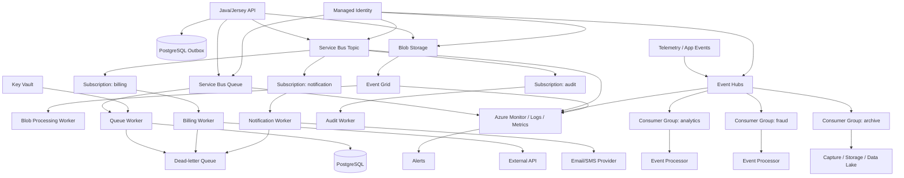

---

## 3. Decomposition Table - Practical Categories / Domain / Skills

| Area | Skill praktis | Kenapa penting |
|---|---|---|
| **1. Service Bus Queue** | Durable async command/job queue | Cocok untuk pekerjaan bisnis yang harus diproses setidaknya sekali, dengan DLQ, lock, retry, dan settlement eksplisit. Service Bus queues/topics/subscriptions adalah core messaging entities Azure Service Bus. ([Microsoft Learn](https://learn.microsoft.com/en-us/azure/service-bus-messaging/service-bus-queues-topics-subscriptions?utm_source=chatgpt.com)) |
| **2. Service Bus Topic & Subscription** | Publish/subscribe durable messaging | Satu message bisa dikirim ke banyak subscriber dengan filtering/routing per subscription. Cocok untuk domain event seperti `CaseSubmitted`. ([Microsoft Learn](https://learn.microsoft.com/en-us/azure/service-bus-messaging/service-bus-queues-topics-subscriptions?utm_source=chatgpt.com)) |
| **3. Dead-letter Queue / DLQ** | Menahan message gagal agar bisa dianalisis/resubmit | Service Bus queues dan topic subscriptions memiliki DLQ untuk message yang tidak bisa dikirim atau diproses. ([Microsoft Learn](https://learn.microsoft.com/en-us/azure/service-bus-messaging/service-bus-messaging-overview?utm_source=chatgpt.com)) |
| **4. Peek-lock & Settlement** | Receive, process, complete/abandon/dead-letter | Untuk mencegah message loss, message sebaiknya di-complete hanya setelah processing sukses; failure harus abandon/dead-letter secara eksplisit. ([Microsoft Learn](https://learn.microsoft.com/en-us/azure/service-bus-messaging/service-bus-message-loss-and-duplicates?utm_source=chatgpt.com)) |
| **5. Duplicate Detection** | MessageId-based duplicate suppression | Service Bus duplicate detection memungkinkan broker mengabaikan duplicate message dengan `MessageId` sama dalam detection window. ([Microsoft Learn](https://learn.microsoft.com/en-us/azure/service-bus-messaging/duplicate-detection?utm_source=chatgpt.com)) |
| **6. Sessions / Ordering** | Ordered processing per session key | Penting untuk workflow/order/case yang harus diproses berurutan per business key. |
| **7. Event Hubs** | High-throughput event streaming | Event Hubs dirancang untuk event stream, partitions, consumer groups, checkpointing, dan configurable retention. ([Microsoft Learn](https://learn.microsoft.com/en-us/azure/event-hubs/event-hubs-about?utm_source=chatgpt.com)) |
| **8. Event Hubs Partitioning** | Partition key, ordering per partition, consumer scaling | Consumer membaca event dari partitions; consumer group dan checkpointing dipakai untuk reliable processing. ([Microsoft Learn](https://learn.microsoft.com/en-us/azure/event-hubs/event-hubs-about?utm_source=chatgpt.com)) |
| **9. Event Processor Client** | Load balancing partitions dan checkpointing | Event processor client bisa menerima events dari multiple partitions dan load balance antar consumer instances dengan consumer group dan checkpoint store. ([Microsoft Learn](https://learn.microsoft.com/en-us/azure/event-hubs/event-processor-balance-partition-load?utm_source=chatgpt.com)) |
| **10. Event Grid** | Event notification, BlobCreated, resource events, push delivery | Cocok untuk “sesuatu terjadi”, misalnya blob uploaded, bukan durable command queue. Event Grid punya retry policy dan dead-lettering. ([Microsoft Learn](https://learn.microsoft.com/en-us/azure/event-grid/delivery-and-retry?utm_source=chatgpt.com)) |
| **11. Storage Queue** | Simple queue murah/sederhana | Cocok untuk queue sederhana; dibanding Service Bus, fiturnya lebih ringan. Storage queues punya visibility timeout yang bisa diset saat enqueue/dequeue. ([Microsoft Learn](https://learn.microsoft.com/en-us/azure/service-bus-messaging/service-bus-azure-and-service-bus-queues-compared-contrasted?utm_source=chatgpt.com)) |
| **12. Retry Strategy** | Immediate retry, delayed retry, exponential backoff, DLQ | Retry tanpa batas menyebabkan duplicate processing dan overload downstream. |
| **13. Idempotency** | MessageId, idempotency key, processed-message table | Karena async processing umumnya at-least-once, worker harus aman terhadap duplicate message. |
| **14. Outbox Pattern** | Transaction DB + publish event secara reliable | Menghindari masalah DB commit sukses tapi message publish gagal, atau sebaliknya. |
| **15. Worker Runtime** | Container Apps, AKS, Functions, App Service WebJobs | Pilih runtime berdasarkan durasi, throughput, event source, operational model, dan deployment pattern. |
| **16. Backpressure** | Bounded concurrency, max active messages, DB pool budget | Worker scale harus tunduk pada kapasitas PostgreSQL/external API, bukan hanya panjang queue. |
| **17. Poison Message Handling** | Detect gagal permanen, dead-letter, inspect, fix, replay | Message yang selalu gagal tidak boleh membuat queue macet tanpa observability. |
| **18. Observability** | Queue depth, DLQ count, processing latency, lag, failures | Tanpa metrics, async system terlihat “tenang” padahal backlog tumbuh. |

---

## 4. Pilih Service yang Tepat

| Kebutuhan | Pilihan default | Kenapa |
|---|---|---|
| Durable business command | **Service Bus Queue** | Butuh reliable queue, lock, DLQ, settlement |
| Durable publish/subscribe | **Service Bus Topic** | Banyak subscriber independent |
| High-volume telemetry/clickstream/log stream | **Event Hubs** | Streaming, partitions, retention, consumer groups |
| React to Azure resource event / BlobCreated | **Event Grid** | Push event notification dengan retry/dead-letter |
| Queue sederhana, low-cost, low feature | **Storage Queue** | Simpler queue, visibility timeout |
| Large file uploaded then process | **Blob Storage + Event Grid + Worker** | Upload object, event triggers processing |
| Workflow step/job dispatch | **Service Bus Queue** | Message harus diproses reliable |
| Fan-out business event | **Service Bus Topic** | Billing, audit, notification bisa subscribe terpisah |
| Stream analytics pipeline | **Event Hubs** | Multiple consumers read stream independently |

Rule praktis:

```text id="azmsg-rule-choice"
Command yang harus dikerjakan → Service Bus Queue.
Business event untuk beberapa subscriber → Service Bus Topic.
Telemetry/event stream besar → Event Hubs.
Resource notification → Event Grid.
Queue sederhana → Storage Queue.
```

---

## 5. Messaging vs Eventing vs Streaming

### Messaging / Command

```text id="azmsg-command"
SubmitCaseCommand
GenerateInvoiceCommand
SendNotificationCommand
ProcessUploadedDocumentCommand
```

Ciri:

```text id="azmsg-command-char"
Ada pekerjaan yang harus dilakukan.
Biasanya satu owner/handler utama.
Failure harus bisa retry/DLQ.
Message merepresentasikan intent.
```

Pilihan umum: **Service Bus Queue**.

---

### Domain Event

```text id="azmsg-domain-event"
CaseSubmitted
DocumentUploaded
InvoiceGenerated
OrderActivated
CustomerSuspended
```

Ciri:

```text id="azmsg-event-char"
Sesuatu sudah terjadi.
Banyak subscriber boleh bereaksi.
Publisher tidak perlu tahu semua consumer.
Event tidak memerintah consumer.
```

Pilihan umum: **Service Bus Topic** untuk durable enterprise pub/sub.

---

### Resource Event

```text id="azmsg-resource-event"
BlobCreated
BlobDeleted
KeyVaultSecretNearExpiry
ResourceGroupWriteSuccess
```

Ciri:

```text id="azmsg-resource-char"
Event berasal dari Azure resource/platform.
Subscriber merespons event.
```

Pilihan umum: **Event Grid**.

---

### Streaming Event

```text id="azmsg-stream"
TelemetryEvent
ClickEvent
AuditStreamEvent
DeviceSignal
High-volume integration event
```

Ciri:

```text id="azmsg-stream-char"
Volume tinggi.
Retention window.
Multiple consumer groups.
Partition-based ordered processing.
Checkpointing.
```

Pilihan umum: **Event Hubs**.

---

## 6. Azure Service Bus Queue

Service Bus Queue cocok untuk pekerjaan async yang reliable:

```text id="azmsg-sbq-use"
generate report
process document
send notification
submit workflow task
sync data to external system
retryable integration call
```

Core concepts:

```text id="azmsg-sbq-core"
Queue
Message
Receiver
Peek-lock
Complete
Abandon
Dead-letter
Lock duration
Delivery count
Scheduled message
Duplicate detection
```

Service Bus queues menyediakan point-to-point brokered messaging, sementara topics/subscriptions menyediakan publish-subscribe durable messaging. ([Microsoft Learn](https://learn.microsoft.com/en-us/azure/service-bus-messaging/service-bus-queues-topics-subscriptions?utm_source=chatgpt.com))

### Flow worker yang benar

```text id="azmsg-worker-flow"
Receive message in peek-lock
  → validate message
  → check idempotency
  → process business logic
  → commit result
  → complete message
```

Jika gagal sementara:

```text id="azmsg-worker-temp-fail"
abandon message
or let lock expire
or retry with backoff/scheduled retry
```

Jika gagal permanen:

```text id="azmsg-worker-perm-fail"
dead-letter message with reason and error description
```

Microsoft guidance untuk mencegah message loss/duplicate processing menekankan peek-lock, explicit settlement, lock duration yang benar, dan complete message hanya setelah processing sukses. ([Microsoft Learn](https://learn.microsoft.com/en-us/azure/service-bus-messaging/service-bus-message-loss-and-duplicates?utm_source=chatgpt.com))

---

## 7. Azure Service Bus Topic & Subscription

Gunakan **Topic** saat satu event harus dikonsumsi oleh banyak subscriber.

Contoh:

```text id="azmsg-topic"
Topic: case-events

Message:
  eventType = CaseSubmitted
  caseId = C-123

Subscriptions:
  billing-subscription
  notification-subscription
  audit-subscription
  workflow-subscription
```

Kelebihan:

```text id="azmsg-topic-adv"
publisher tidak tahu subscriber
subscriber bisa independent
tiap subscription punya DLQ sendiri
filtering bisa per subscription
fan-out durable
```

Pattern:

```text id="azmsg-topic-pattern"
Java/Jersey API publishes CaseSubmitted
  → billing worker creates charge
  → notification worker sends email
  → audit worker records event
  → workflow worker advances BPMN
```

Rule:

```text id="azmsg-topic-rule"
Kalau ada lebih dari satu consumer bisnis untuk event yang sama,
pakai topic/subscription, bukan satu queue yang dibaca ramai-ramai.
```

---

## 8. Service Bus DLQ

DLQ adalah tempat message yang tidak bisa diproses agar tidak hilang dan tidak memblokir queue utama. Service Bus queues dan topic subscriptions memiliki secondary subqueue bernama dead-letter queue untuk message yang tidak bisa dikirim atau diproses. ([Microsoft Learn](https://learn.microsoft.com/en-us/azure/service-bus-messaging/service-bus-messaging-overview?utm_source=chatgpt.com))

DLQ harus diperlakukan sebagai operational queue:

```text id="azmsg-dlq-needs"
monitor count
alert jika naik
inspect message
kategorikan error
fix bug/config/data
resubmit jika aman
archive jika tidak bisa diproses
```

Jangan:

```text id="azmsg-dlq-bad"
DLQ dibiarkan menumpuk selama berbulan-bulan.
```

DLQ message harus punya metadata:

```json id="azmsg-dlq-meta"
{
  "messageId": "case-123-submit-v1",
  "correlationId": "trace-abc",
  "eventType": "CaseSubmitted",
  "businessKey": "case-123",
  "deadLetterReason": "VALIDATION_FAILED",
  "deadLetterDescription": "Missing required document type",
  "attempt": 5
}
```

---

## 9. Duplicate Detection dan Idempotency

Service Bus duplicate detection dapat mengabaikan duplicate message dengan `MessageId` yang sama dalam configured detection window. ([Microsoft Learn](https://learn.microsoft.com/en-us/azure/service-bus-messaging/duplicate-detection?utm_source=chatgpt.com))

Namun duplicate detection **bukan pengganti idempotency**.

Kenapa?

```text id="azmsg-dup-limits"
Duplicate detection window terbatas.
Duplicate bisa terjadi dari consumer retry, bukan hanya send retry.
Worker bisa crash setelah side effect tapi sebelum complete.
Message bisa diproses ulang setelah lock expired.
```

Idempotency tetap wajib:

```text id="azmsg-idempotency"
processed_message table
unique business key
idempotency key
upsert
natural unique constraint
state machine guard
outbox/inbox pattern
```

Contoh PostgreSQL table:

```sql id="azmsg-processed-table"
CREATE TABLE processed_message (
    consumer_name TEXT NOT NULL,
    message_id TEXT NOT NULL,
    processed_at TIMESTAMPTZ NOT NULL DEFAULT now(),
    business_key TEXT,
    PRIMARY KEY (consumer_name, message_id)
);
```

Worker flow:

```text id="azmsg-idem-flow"
Begin transaction
  → insert processed_message
  → if conflict, skip as duplicate
  → apply business change
Commit
Complete message
```

---

## 10. Ordering dengan Service Bus Sessions

Ordering global biasanya mahal dan tidak scalable. Yang sering dibutuhkan adalah ordering **per business key**.

Contoh:

```text id="azmsg-ordering"
case-123:
  CaseCreated
  DocumentUploaded
  CaseSubmitted
  CaseApproved

case-456:
  CaseCreated
  CaseCancelled
```

Gunakan session key / partitioning by business key:

```text id="azmsg-session-key"
sessionId = caseId
```

Mental model:

```text id="azmsg-session-mental"
Messages dengan sessionId sama diproses berurutan oleh satu session receiver.
Messages dengan sessionId berbeda bisa diproses paralel.
```

Rule:

```text id="azmsg-order-rule"
Butuh ordering per case/order/customer → session/partition by business key.
Butuh total global ordering → pertanyakan ulang requirement.
```

---

## 11. Azure Event Hubs

Event Hubs cocok untuk event streaming high-throughput.

Contoh:

```text id="azmsg-eh-use"
application telemetry
audit event stream
clickstream
IoT/device signal
integration event firehose
large-scale activity log
```

Event Hubs event flow mencakup producer mengirim events ke event hub, events disimpan dengan configurable retention, lalu consumer membaca dari partitions menggunakan consumer groups dan checkpointing. ([Microsoft Learn](https://learn.microsoft.com/en-us/azure/event-hubs/event-hubs-about?utm_source=chatgpt.com))

Core concepts:

```text id="azmsg-eh-core"
namespace
event hub
partition
partition key
consumer group
offset
checkpoint
event processor
retention
capture
```

Event Hubs bukan queue command biasa. Jangan gunakan Event Hubs jika Anda butuh per-message DLQ command processing seperti Service Bus Queue.

---

## 12. Event Hubs Partitions dan Consumer Groups

Partition menentukan parallelism dan ordering scope.

```text id="azmsg-eh-partitions"
partition key = customerId / caseId / tenantId
```

Ordering hanya dijamin dalam partition yang sama. Consumer group memungkinkan beberapa aplikasi membaca stream yang sama secara independen.

Contoh:

```text id="azmsg-eh-cg"
Event Hub: audit-stream

Consumer groups:
  analytics
  fraud-detection
  compliance-archive
  operational-dashboard
```

Setiap consumer group punya checkpoint sendiri. Event processor client membantu load balancing partitions antar instances dalam consumer group dan checkpointing. ([Microsoft Learn](https://learn.microsoft.com/en-us/azure/event-hubs/event-processor-balance-partition-load?utm_source=chatgpt.com))

Practical warning:

```text id="azmsg-eh-warning"
Jumlah consumer aktif efektif dalam satu consumer group tidak boleh melebihi partitions secara berlebihan.
Jika lebih banyak consumer daripada partitions, sebagian consumer idle.
```

---

## 13. Event Grid

Event Grid cocok untuk event notification, terutama dari Azure resources seperti Blob Storage.

Contoh:

```text id="azmsg-eg-use"
BlobCreated
BlobDeleted
Storage account event
Key Vault event
Resource group event
custom application event
```

Event Grid melakukan delivery ke subscriber endpoint dengan retry policy. Jika dead-lettering tidak dikonfigurasi, Event Grid dapat drop event pada kondisi tertentu; Microsoft menyarankan dead-lettering jika tidak ingin event yang gagal dikirim hilang. ([Microsoft Learn](https://learn.microsoft.com/en-us/azure/event-grid/delivery-and-retry?utm_source=chatgpt.com))

Pattern upload file:

```text id="azmsg-eg-blob-pattern"
Client uploads blob
  → BlobCreated event
  → Event Grid
  → Function / Container Apps / AKS endpoint
  → validate file
  → update PostgreSQL metadata
```

Important:

```text id="azmsg-eg-not-queue"
Event Grid bukan queue command durable untuk business processing kompleks.
Event Grid event adalah signal; worker tetap harus cek actual resource state.
```

---

## 14. Storage Queue

Storage Queue adalah queue sederhana untuk menyimpan banyak message yang bisa diakses via HTTP/HTTPS. ([Microsoft Learn](https://learn.microsoft.com/en-us/azure/storage/queues/?utm_source=chatgpt.com))

Cocok untuk:

```text id="azmsg-storageq-use"
simple background task
low-cost queue
basic async processing
simple retry via visibility timeout
```

Dibanding Service Bus Queue, Storage Queue lebih sederhana. Microsoft comparison menekankan Storage Queue memiliki visibility timeout yang bisa diatur saat enqueue/dequeue, sedangkan Service Bus memakai lock timeout pada metadata queue dan dapat renew lock. ([Microsoft Learn](https://learn.microsoft.com/en-us/azure/service-bus-messaging/service-bus-azure-and-service-bus-queues-compared-contrasted?utm_source=chatgpt.com))

Gunakan Service Bus jika butuh:

```text id="azmsg-use-sb-over-storageq"
topics/subscriptions
sessions/ordering
duplicate detection
DLQ richer semantics
transactions
AMQP/JMS enterprise patterns
advanced filtering/routing
```

---

## 15. Decision Matrix

| Requirement | Service Bus Queue | Service Bus Topic | Event Hubs | Event Grid | Storage Queue |
|---|---:|---:|---:|---:|---:|
| Durable command/job | ✅ | ⚠️ | ❌ | ❌ | ✅ sederhana |
| Pub/sub durable business event | ⚠️ | ✅ | ⚠️ stream | ⚠️ notification | ❌ |
| High-throughput streaming | ❌ | ❌ | ✅ | ❌ | ❌ |
| Azure resource event | ❌ | ❌ | ❌ | ✅ | ❌ |
| DLQ per consumer | ✅ | ✅ subscription DLQ | ❌ native queue-like | ✅ dead-letter destination | manual/simple |
| Ordering per key | ✅ sessions | ✅ sessions | ✅ per partition | ❌ | limited |
| Multiple independent consumers | ❌ competing | ✅ | ✅ consumer groups | ✅ subscribers | ❌ competing |
| Simple cheap queue | ⚠️ | ❌ | ❌ | ❌ | ✅ |
| Enterprise messaging | ✅ | ✅ | ⚠️ | ⚠️ | ❌ |

Legend:

```text id="azmsg-legend"
✅ strong fit
⚠️ possible but validate carefully
❌ not the right default
```

---

## 16. Java Client Pattern - Service Bus Sender

Conceptual dependency:

```xml id="azmsg-sb-dep"
<dependency>
  <groupId>com.azure</groupId>
  <artifactId>azure-messaging-servicebus</artifactId>
  <version><!-- use approved/latest compatible version --></version>
</dependency>

<dependency>
  <groupId>com.azure</groupId>
  <artifactId>azure-identity</artifactId>
  <version><!-- use approved/latest compatible version --></version>
</dependency>
```

Sender dengan managed identity:

```java id="azmsg-sb-sender"
import com.azure.identity.DefaultAzureCredential;
import com.azure.identity.DefaultAzureCredentialBuilder;
import com.azure.messaging.servicebus.ServiceBusClientBuilder;
import com.azure.messaging.servicebus.ServiceBusMessage;
import com.azure.messaging.servicebus.ServiceBusSenderClient;

public final class CaseCommandPublisher implements AutoCloseable {

    private final ServiceBusSenderClient sender;

    public CaseCommandPublisher(String namespace, String queueName) {
        DefaultAzureCredential credential = new DefaultAzureCredentialBuilder().build();

        this.sender = new ServiceBusClientBuilder()
                .fullyQualifiedNamespace(namespace)
                .credential(credential)
                .sender()
                .queueName(queueName)
                .buildClient();
    }

    public void publishProcessDocument(String messageId, String caseId, String documentId) {
        String body = """
                {
                  "caseId": "%s",
                  "documentId": "%s"
                }
                """.formatted(caseId, documentId);

        ServiceBusMessage message = new ServiceBusMessage(body)
                .setMessageId(messageId)
                .setCorrelationId(caseId)
                .setSubject("ProcessDocument")
                .setContentType("application/json");

        sender.sendMessage(message);
    }

    @Override
    public void close() {
        sender.close();
    }
}
```

Practical notes:

```text id="azmsg-sender-notes"
Set MessageId untuk idempotency/duplicate detection.
Set CorrelationId untuk tracing.
Set Subject/EventType untuk routing/diagnostic.
Jangan kirim payload besar; simpan di Blob lalu kirim reference.
```

---

## 17. Java Worker Pattern - Service Bus Processor

```java id="azmsg-sb-processor"
import com.azure.identity.DefaultAzureCredential;
import com.azure.identity.DefaultAzureCredentialBuilder;
import com.azure.messaging.servicebus.*;

import java.time.Duration;

public final class DocumentWorker {

    private final ServiceBusProcessorClient processor;

    public DocumentWorker(String namespace, String queueName) {
        DefaultAzureCredential credential = new DefaultAzureCredentialBuilder().build();

        this.processor = new ServiceBusClientBuilder()
                .fullyQualifiedNamespace(namespace)
                .credential(credential)
                .processor()
                .queueName(queueName)
                .maxConcurrentCalls(8)
                .disableAutoComplete()
                .processMessage(this::processMessage)
                .processError(this::processError)
                .buildProcessorClient();
    }

    public void start() {
        processor.start();
    }

    public void stop() {
        processor.close();
    }

    private void processMessage(ServiceBusReceivedMessageContext context) {
        ServiceBusReceivedMessage message = context.getMessage();

        try {
            String messageId = message.getMessageId();
            String body = message.getBody().toString();

            // 1. Check idempotency using messageId.
            // 2. Process business logic.
            // 3. Commit DB transaction.
            // 4. Complete message only after success.

            context.complete();
        } catch (IllegalArgumentException permanentFailure) {
            context.deadLetter(new DeadLetterOptions()
                    .setDeadLetterReason("VALIDATION_FAILED")
                    .setDeadLetterErrorDescription(permanentFailure.getMessage()));
        } catch (Exception transientFailure) {
            context.abandon();
        }
    }

    private void processError(ServiceBusErrorContext errorContext) {
        // Log namespace/entity/error source/correlation.
        System.err.println("Service Bus error: " + errorContext.getException());
    }
}
```

Important:

```text id="azmsg-worker-java-note"
disableAutoComplete agar message tidak selesai sebelum business transaction commit.
Dead-letter hanya untuk failure yang dianggap permanen.
Abandon/retry untuk transient failure.
```

---

## 18. Worker Runtime Choice

| Worker type | Runtime cocok |
|---|---|
| Queue worker sederhana | Azure Functions / Container Apps |
| Containerized Java worker | Container Apps |
| Banyak worker dengan platform Kubernetes | AKS |
| Scheduled finite job | Container Apps Job / Functions Timer |
| Long-running Camunda external worker | Container Apps / AKS |
| High-throughput stream processor | AKS / Container Apps / dedicated workers |
| Legacy worker | VM / App Service WebJob |

Decision rule:

```text id="azmsg-worker-runtime-rule"
Jika sudah containerized dan tidak butuh Kubernetes → Container Apps.
Jika organisasi punya platform Kubernetes matang → AKS.
Jika function kecil event-driven → Azure Functions.
```

---

## 19. Retry Strategy

Retry harus dibedakan:

| Failure | Retry? | Contoh |
|---|---|---|
| Network timeout sementara | Ya | External API timeout |
| DB transient failover | Ya terbatas | PostgreSQL connection reset |
| Rate limit downstream | Ya dengan backoff | HTTP 429 |
| Validation error | Tidak | Missing required field |
| Permission denied | Tidak langsung | 403 karena config/role |
| Business invariant gagal | Tidak | Case already closed |
| Poison data | DLQ | Invalid payload schema |

Retry policy:

```text id="azmsg-retry-policy"
bounded
exponential backoff
jitter
dead-letter after max attempts
idempotent processing
do not retry permanent validation errors
```

Bad:

```text id="azmsg-retry-bad"
catch Exception
  → abandon
  → message loops forever
```

Better:

```text id="azmsg-retry-good"
Classify failure:
  transient → retry
  permanent → dead-letter
  unknown repeated → dead-letter after threshold
```

---

## 20. Backpressure dan Concurrency

Worker tidak boleh autoscale tanpa memperhatikan downstream.

Example:

```text id="azmsg-backpressure-example"
10 worker replicas
× maxConcurrentCalls 16
× DB pool 10
= potential concurrency tinggi sekali
```

Bound concurrency:

```text id="azmsg-backpressure-rule"
max_worker_replicas
× maxConcurrentCalls
× DB/API concurrency per message
<= downstream safe capacity
```

Checklist:

```text id="azmsg-backpressure-check"
Service Bus maxConcurrentCalls
Container Apps/AKS replicas
DB pool size
PostgreSQL max safe connections
External API rate limit
Message lock duration
Average processing time
DLQ threshold
```

---

## 21. Message Payload Design

Jangan kirim payload besar di message.

Bad:

```json id="azmsg-payload-bad"
{
  "caseId": "case-123",
  "pdfBase64": "very large base64..."
}
```

Better:

```json id="azmsg-payload-good"
{
  "eventId": "evt-789",
  "eventType": "DocumentUploaded",
  "caseId": "case-123",
  "documentId": "doc-456",
  "blobContainer": "case-documents",
  "blobName": "cases/2026/07/case-123/doc-456.pdf",
  "contentSha256": "..."
}
```

Rule:

```text id="azmsg-payload-rule"
Message membawa intent/reference.
Payload besar disimpan di Blob Storage.
Business metadata/source of truth disimpan di PostgreSQL.
```

---

## 22. Message Envelope Standard

Gunakan envelope konsisten.

```json id="azmsg-envelope"
{
  "messageId": "case-123-document-456-process-v1",
  "correlationId": "trace-abc",
  "causationId": "request-xyz",
  "eventType": "DocumentUploaded",
  "schemaVersion": 1,
  "occurredAt": "2026-07-13T10:15:00+07:00",
  "producer": "case-api",
  "tenantId": "tenant-001",
  "businessKey": "case-123",
  "payload": {
    "caseId": "case-123",
    "documentId": "document-456"
  }
}
```

Field penting:

| Field | Fungsi |
|---|---|
| `messageId` | Idempotency/dedup |
| `correlationId` | Trace end-to-end |
| `causationId` | Event mana yang memicu event ini |
| `eventType` | Routing/deserialization |
| `schemaVersion` | Compatibility |
| `occurredAt` | Event time |
| `producer` | Ownership |
| `businessKey` | Ordering/session/partition key |
| `tenantId` | Multi-tenant boundary |
| `payload` | Data minimal |

---

## 23. Outbox Pattern

Problem klasik:

```text id="azmsg-outbox-problem"
DB commit sukses,
tapi publish message gagal.

Atau:

Message terkirim,
tapi DB transaction rollback.
```

Outbox pattern:

```text id="azmsg-outbox-flow"
Within same DB transaction:
  update business table
  insert outbox_event

Separate publisher:
  read unsent outbox_event
  publish to Service Bus/Event Hubs
  mark as published
```

Table contoh:

```sql id="azmsg-outbox-table"
CREATE TABLE outbox_event (
    event_id UUID PRIMARY KEY,
    aggregate_type TEXT NOT NULL,
    aggregate_id TEXT NOT NULL,
    event_type TEXT NOT NULL,
    schema_version INT NOT NULL,
    payload JSONB NOT NULL,
    status TEXT NOT NULL,
    created_at TIMESTAMPTZ NOT NULL DEFAULT now(),
    published_at TIMESTAMPTZ
);
```

Invariant:

```text id="azmsg-outbox-invariant"
Business state dan event intent commit atomically.
Publishing boleh retry.
Consumer tetap idempotent.
```

---

## 24. Inbox Pattern

Untuk consumer yang memproses message ke DB:

```text id="azmsg-inbox-flow"
Receive message
  → begin transaction
  → insert inbox/processed_message(messageId)
  → if duplicate, skip
  → apply business change
  → commit
  → complete message
```

Table:

```sql id="azmsg-inbox-table"
CREATE TABLE inbox_message (
    consumer_name TEXT NOT NULL,
    message_id TEXT NOT NULL,
    received_at TIMESTAMPTZ NOT NULL DEFAULT now(),
    processed_at TIMESTAMPTZ,
    status TEXT NOT NULL,
    PRIMARY KEY (consumer_name, message_id)
);
```

Ini penting karena Service Bus/Event Grid/Event Hubs dapat menghasilkan duplicate processing dalam kondisi retry/failure.

---

## 25. Ordering, Partitioning, dan Business Key

Ordering harus dipilih berdasarkan kebutuhan bisnis.

| Kebutuhan | Strategy |
|---|---|
| Case events harus urut per case | sessionId/partitionKey = caseId |
| Customer balance updates harus urut per customer | key = customerId |
| Semua events global urut | Hindari; tidak scalable |
| Worker bebas paralel | No session/key strict |
| Stream analytics per tenant | partitionKey = tenantId |

Caveat:

```text id="azmsg-order-caveat"
Ordering per key mengurangi parallelism untuk key tersebut.
Jika satu case/customer sangat panas, ia bisa menjadi bottleneck.
```

---

## 26. Event Hubs Processing Pattern

Event Hubs consumer biasanya memakai checkpointing.

Flow:

```text id="azmsg-eh-flow"
Receive batch from partition
  → process events
  → commit output/state
  → checkpoint offset
```

Risk:

```text id="azmsg-eh-risk"
Checkpoint terlalu cepat:
  event dianggap processed padahal side effect gagal.

Checkpoint terlalu jarang:
  duplicate reprocessing lebih banyak saat restart.
```

Rule:

```text id="azmsg-eh-checkpoint-rule"
Checkpoint setelah side effect durable.
Consumer harus idempotent.
Partition key harus sesuai ordering dan load distribution.
```

---

## 27. Event Grid Processing Pattern

Event Grid delivery adalah push ke endpoint. Event Grid punya retry policy dan dead-lettering; tanpa dead-lettering, event bisa drop pada kondisi tertentu. ([Microsoft Learn](https://learn.microsoft.com/en-us/azure/event-grid/delivery-and-retry?utm_source=chatgpt.com))

Event Grid handler harus:

```text id="azmsg-eg-handler"
respond fast
validate event type
check actual resource state
enqueue durable command jika processing panjang
be idempotent
log correlation
```

Pattern bagus:

```text id="azmsg-eg-good-pattern"
Event Grid BlobCreated
  → lightweight handler
  → validate event
  → send ProcessDocumentCommand to Service Bus
  → worker does heavy processing
```

Jangan:

```text id="azmsg-eg-bad-pattern"
Event Grid endpoint melakukan OCR 10 menit langsung dalam HTTP delivery.
```

---

## 28. Poison Message Runbook

DLQ message harus punya runbook.

```text id="azmsg-poison-runbook"
1. Alert DLQ count > threshold.
2. Inspect message body/properties.
3. Identify error class:
   - schema issue
   - validation issue
   - missing dependency
   - downstream outage
   - bug
   - poison data
4. Fix root cause.
5. Decide:
   - replay
   - correct data then replay
   - archive
   - manual resolution
6. Record resolution.
```

Replay harus aman:

```text id="azmsg-replay"
Replay only if consumer idempotent.
Do not blindly replay permanent invalid messages.
Preserve original messageId/correlationId or record replay linkage.
```

---

## 29. Observability

Metrics yang harus dipantau:

| Service | Metrics penting |
|---|---|
| Service Bus Queue | Active messages, scheduled messages, dead-letter count, incoming/outgoing messages |
| Service Bus Subscription | Active count, DLQ count per subscription |
| Event Hubs | Incoming events, outgoing events, consumer lag/checkpoint age, throughput |
| Event Grid | Delivery success/failure, dead-lettered events, retry count |
| Storage Queue | Queue length, approximate age, poison retry count |
| Worker | Messages processed/sec, success/failure, processing latency |
| Database | Connection pool, transaction latency, lock wait |
| External API | HTTP 429/5xx, latency, timeout |
| DLQ | Count, oldest message age, top dead-letter reason |

Async-specific SLO:

```text id="azmsg-slo"
time-to-process-message
oldest-active-message-age
DLQ rate
retry rate
consumer lag
message loss count
duplicate-skip count
```

---

## 30. Security & Identity

Recommended identity model:

```text id="azmsg-identity"
Producer app:
  Azure Service Bus Data Sender

Consumer worker:
  Azure Service Bus Data Receiver

Admin/operator:
  scoped management role, time-bound

Event Hubs producer:
  Azure Event Hubs Data Sender

Event Hubs consumer:
  Azure Event Hubs Data Receiver

Storage Queue/Blob:
  Storage Queue Data Contributor / Storage Blob Data Contributor as needed
```

Principles:

```text id="azmsg-sec-principles"
Use managed identity/workload identity.
Do not use connection strings in code.
Separate sender and receiver identities.
Scope access to namespace/entity when possible.
Do not give runtime app Owner/Contributor.
Private endpoint if sensitive/internal.
```

---

## 31. Java/Jersey API Pattern

For synchronous request that triggers async processing:

```text id="azmsg-api-pattern"
POST /cases/{caseId}/documents/{documentId}/process

API:
  authenticate + authorize
  validate case/document state
  insert command/outbox record
  publish Service Bus message or let outbox publisher publish
  return 202 Accepted
```

Response:

```http id="azmsg-202"
HTTP/1.1 202 Accepted
Location: /cases/{caseId}/documents/{documentId}/processing-status
```

Why `202 Accepted`?

```text id="azmsg-202-why"
Request diterima untuk diproses async.
Hasil belum selesai.
Client bisa poll status atau menerima callback/event.
```

Avoid:

```text id="azmsg-avoid-sync"
HTTP request menunggu worker selesai 5 menit.
```

---

## 32. Camunda Integration Pattern

Untuk Camunda/Workflow:

| Scenario | Pattern |
|---|---|
| BPMN service task async | Camunda worker consumes job, sends command to Service Bus |
| External system callback | API validates callback, publishes event/command |
| Document processing step | BlobCreated → command queue → worker → complete Camunda task |
| Long-running integration | Service Bus command + status table + Camunda message correlation |
| Retryable business task | Let Camunda retry or Service Bus retry, but don’t duplicate retry blindly |

Important:

```text id="azmsg-camunda-warning"
Jangan biarkan Camunda retry dan Service Bus retry saling memperbanyak tanpa batas.
Tentukan satu layer utama untuk retry policy, dan layer lain harus bounded.
```

---

## 33. Storage Blob Upload Event Pattern

Recommended flow:

```text id="azmsg-blob-flow"
1. API creates document metadata status=UPLOAD_URL_ISSUED.
2. Client uploads directly to Blob.
3. BlobCreated event goes to Event Grid.
4. Event Grid handler enqueues ProcessUploadedDocumentCommand to Service Bus.
5. Worker validates blob: size, checksum, content type, malware scan.
6. Worker updates PostgreSQL status=ACCEPTED or REJECTED.
7. Worker emits DocumentAccepted event if needed.
```

Why not process directly inside Event Grid handler?

```text id="azmsg-blob-reason"
Event Grid delivery endpoint should be fast.
Heavy processing belongs to durable queue worker.
Service Bus gives better retry/DLQ/settlement semantics for business processing.
```

---

## 34. Failure Modes

| Symptom | Kemungkinan root cause |
|---|---|
| Message processed twice | Worker crash after side effect before complete; lock expired; retry |
| Message stuck active | Worker too slow, lock lost, no completion |
| DLQ count naik | Poison data, validation bug, downstream permanent failure |
| Queue depth naik | Worker down, scale insufficient, downstream slow |
| DB overload | Worker concurrency too high |
| External API rate limited | No backpressure, retry storm |
| Event Hubs consumer lag | Partitions overloaded, consumer slow, checkpoint issue |
| Event Grid dropped events | No dead-lettering, endpoint unavailable beyond retry behavior |
| Storage Queue message reappears | Visibility timeout expired before processing finished |
| Outbox grows | Publisher stopped or cannot send |
| Message order wrong | No session/partition key by business key |
| Duplicate ignored incorrectly | MessageId reused for different payload |
| Replay creates duplicate side effects | Consumer not idempotent |
| Worker OOM | Message payload too large or batch too large |

---

## 35. CLI Cheatsheet

### Service Bus namespaces

```bash id="azmsg-cli-sbns"
az servicebus namespace list --output table
```

### Service Bus queues

```bash id="azmsg-cli-sbq"
az servicebus queue list \
  --resource-group "<rg>" \
  --namespace-name "<namespace>" \
  --output table
```

### Service Bus topics

```bash id="azmsg-cli-sbt"
az servicebus topic list \
  --resource-group "<rg>" \
  --namespace-name "<namespace>" \
  --output table
```

### Service Bus subscriptions

```bash id="azmsg-cli-sbsub"
az servicebus topic subscription list \
  --resource-group "<rg>" \
  --namespace-name "<namespace>" \
  --topic-name "<topic>" \
  --output table
```

### Event Hubs namespaces

```bash id="azmsg-cli-ehns"
az eventhubs namespace list --output table
```

### Event Hubs list

```bash id="azmsg-cli-eh"
az eventhubs eventhub list \
  --resource-group "<rg>" \
  --namespace-name "<namespace>" \
  --output table
```

### Event Grid subscriptions

```bash id="azmsg-cli-eg"
az eventgrid event-subscription list --output table
```

### Storage queues

```bash id="azmsg-cli-storageq"
az storage queue list \
  --account-name "<storage-account>" \
  --auth-mode login \
  --output table
```

### Assign Service Bus sender

```bash id="azmsg-cli-sb-sender"
az role assignment create \
  --assignee "<principal-id>" \
  --role "Azure Service Bus Data Sender" \
  --scope "/subscriptions/<sub>/resourceGroups/<rg>/providers/Microsoft.ServiceBus/namespaces/<namespace>"
```

### Assign Service Bus receiver

```bash id="azmsg-cli-sb-receiver"
az role assignment create \
  --assignee "<principal-id>" \
  --role "Azure Service Bus Data Receiver" \
  --scope "/subscriptions/<sub>/resourceGroups/<rg>/providers/Microsoft.ServiceBus/namespaces/<namespace>"
```

---

## 36. Anti-pattern yang Harus Dihindari

| Anti-pattern | Risiko |
|---|---|
| Menggunakan HTTP sync untuk pekerjaan 5-10 menit | Timeout, bad UX, resource blocking |
| Message besar berisi file/base64 | Broker cost/limit/memory issue |
| Worker auto-complete message sebelum DB commit | Message loss |
| Tidak ada idempotency | Duplicate side effects |
| Retry semua exception | Poison message loop |
| Tidak monitor DLQ | Failure tersembunyi |
| Event Grid dipakai untuk heavy processing langsung | Delivery timeout/retry/drop risk |
| Event Hubs dipakai seperti command queue | Tidak cocok dengan DLQ/settlement per command |
| Service Bus topic dipakai tanpa subscription ownership jelas | Event hilang secara operasional |
| Queue depth jadi satu-satunya metric | Latency/age/DLQ bisa terlewat |
| Worker concurrency tanpa DB/API budget | Downstream overload |
| Connection string disimpan di repo/env plain | Secret leak |
| No outbox untuk critical domain event | DB/message inconsistency |
| No schema version | Consumer rusak saat payload berubah |
| Global ordering requirement tanpa alasan | Bottleneck besar |

---

## 37. Production Readiness Checklist

### A. Service Selection

```text id="azmsg-check-service"
Command/job pakai Service Bus Queue.
Business pub/sub pakai Service Bus Topic.
Streaming pakai Event Hubs.
Resource notification pakai Event Grid.
Simple queue pakai Storage Queue hanya jika fitur cukup.
```

### B. Message Contract

```text id="azmsg-check-contract"
Envelope standard.
MessageId unique dan meaningful.
CorrelationId/causationId ada.
Schema version ada.
Payload kecil dan referential.
Business key jelas.
```

### C. Processing

```text id="azmsg-check-processing"
Manual settlement.
Complete after commit.
Idempotency table.
Bounded retry.
Dead-letter on permanent failure.
Graceful shutdown.
Lock duration sesuai processing time.
```

### D. Scaling

```text id="azmsg-check-scaling"
Worker concurrency bounded.
Replica max sesuai DB/API capacity.
Backpressure strategy.
Poison message tidak memblokir queue.
Lag/oldest message age monitored.
```

### E. Security

```text id="azmsg-check-security"
Managed identity/workload identity.
Sender/receiver roles terpisah.
No connection string in repo/image.
Private endpoint jika sensitive/internal.
Least privilege scope.
```

### F. Reliability

```text id="azmsg-check-reliability"
DLQ alert.
Replay runbook.
Outbox untuk critical domain events.
Consumer idempotent.
Event Grid dead-letter configured jika event tidak boleh drop.
Checkpoint strategy untuk Event Hubs.
```

### G. Observability

```text id="azmsg-check-observability"
Queue depth.
Oldest active message age.
DLQ count and reason.
Processing latency.
Retry count.
Duplicate skip count.
Consumer lag.
Correlation ID end-to-end.
```

---

## 38. Practical Design Template

```text id="azmsg-template"
Use case:
  Document upload processing for case management

API:
  Java/Jersey
  POST upload request
  stores metadata in PostgreSQL
  returns upload instruction/SAS

Storage:
  Blob container: case-documents

Eventing:
  BlobCreated
    → Event Grid
    → lightweight handler

Messaging:
  Handler sends ProcessDocumentCommand to Service Bus Queue

Worker:
  Container Apps / AKS Java worker
  manual settlement
  idempotency table
  validates blob
  scans document
  updates PostgreSQL status
  emits DocumentAccepted event to Service Bus Topic

Topic:
  case-events
  subscriptions:
    audit
    notification
    workflow

Security:
  managed identity
  Storage Blob Data Contributor
  Azure Service Bus Data Sender/Receiver
  no connection strings

Reliability:
  DLQ monitored
  replay runbook
  outbox for critical events
  bounded retry
  duplicate-safe worker
```

---

## 39. Mental Model Final

```text id="azmsg-final"
Service Bus Queue
  = durable command/job processing

Service Bus Topic
  = durable enterprise pub/sub

Dead-letter Queue
  = operational safety net for unprocessable messages

Duplicate Detection
  = broker-side duplicate suppression aid, not full idempotency

Idempotency
  = application-side correctness requirement

Event Hubs
  = partitioned high-throughput event streaming

Event Grid
  = event notification and delivery, not heavy processing engine

Storage Queue
  = simple queue with simpler feature set

Outbox
  = reliable DB-to-message bridge

Inbox
  = reliable message-to-DB dedup bridge

Backpressure
  = prevent async workers from killing downstream systems
```

Kalimat kunci:

```text id="azmsg-key"
Async architecture yang sehat bukan hanya “kirim message lalu worker consume”.
Ia membutuhkan pemilihan service yang tepat, message contract yang stabil,
idempotency, bounded retry, DLQ runbook, ordering key yang benar,
backpressure terhadap database/downstream, managed identity, dan observability end-to-end.
```

---

# Status

**Azure Seri 15/18 selesai.**

## Rekomendasi materi berikutnya

**Azure Seri 16 - CI/CD & IaC on Azure: GitHub Actions, Azure DevOps, Bicep, Terraform, environment promotion, workload identity federation, deployment approval, secretless pipeline, dan release governance.**

---

**Sources:**

- [Azure Service Bus Queues, Topics, and Subscriptions](https://learn.microsoft.com/en-us/azure/service-bus-messaging/service-bus-queues-topics-subscriptions?utm_source=chatgpt.com)

## Response:
7/13/2026, 8:37:07 PM

Lanjut ke **Seri 16/18**. Fokusnya pipeline dan infrastructure-as-code: GitHub Actions/Azure DevOps, Bicep/Terraform, secretless deployment, environment promotion, approval, rollback, dan release governance.

# Azure Seri 16/18 - CI/CD & IaC on Azure

## 1. Introduction

Seri ini membahas bagaimana software engineer mengelola **build, test, packaging, infrastructure provisioning, deployment, approval, promotion, rollback, dan governance** di Azure.

Untuk stack Anda, CI/CD & IaC biasanya menyentuh:

```text id="azcicd-intro"
Java 17+ / Maven
Docker / ACR
GitHub Actions / Azure DevOps
Bicep / Terraform
App Service / Container Apps / AKS
PostgreSQL migration
Key Vault
Service Bus / Storage
Environment promotion: dev → test → staging → prod
Approval / audit / rollback
```

Mental model utama:

```text id="azcicd-mental"
CI = prove artifact is correct.
CD = safely promote artifact to environment.
IaC = make infrastructure reproducible.
Release governance = make production changes controlled, auditable, and reversible.
```

Untuk Azure modern, gunakan **secretless pipeline** dengan OIDC/workload identity federation jika memungkinkan. Microsoft Learn mendokumentasikan Azure Login Action dengan OpenID Connect untuk GitHub Actions agar workflow bisa authenticate ke Azure tanpa menyimpan long-lived credential, dan Microsoft Entra workload identity federation mendukung skenario seperti GitHub Actions, Kubernetes, dan workload di luar Azure tanpa mengelola secrets. ([Microsoft Learn](https://learn.microsoft.com/en-us/azure/developer/github/connect-from-azure-openid-connect?utm_source=chatgpt.com))

---

## 2. Diagram - Azure CI/CD & IaC Map

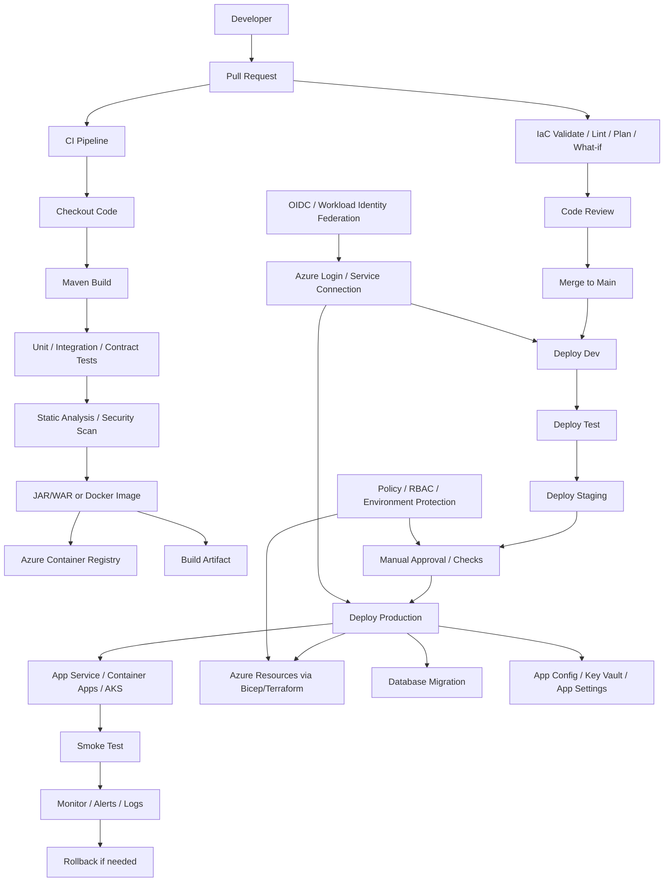

---

## 3. Decomposition Table - Practical Categories / Domain / Skills

| Area | Skill praktis | Kenapa penting |
|---|---|---|
| **1. CI Mental Model** | Build, test, verify, scan, package | CI membuktikan source code layak menjadi artifact. Jangan deploy artifact yang belum diuji. |
| **2. CD Mental Model** | Deploy, promote, approve, rollback, observe | CD bukan hanya auto-deploy; ia harus aman untuk dev/test/staging/prod. |
| **3. GitHub Actions for Azure** | Workflow, job, step, environment, OIDC, Azure Login | GitHub Actions for Azure mendukung workflow untuk build, test, package, release, dan deploy ke Azure services. ([Microsoft Learn](https://learn.microsoft.com/en-us/azure/developer/github/github-actions?utm_source=chatgpt.com)) |
| **4. Azure DevOps Pipelines** | Stage, job, deployment job, environment, service connection | Azure Pipelines menyediakan CI/CD dengan stages, deployment jobs, environments, approvals, dan service connections. ([Microsoft Learn](https://learn.microsoft.com/en-us/azure/devops/pipelines/process/environments?view=azure-devops&utm_source=chatgpt.com)) |
| **5. Workload Identity Federation** | Secretless GitHub/Azure DevOps authentication ke Azure | Menghindari long-lived client secret di pipeline; GitHub OIDC dan Azure service connections bisa memakai federated credential. ([GitHub Docs](https://docs.github.com/actions/security-for-github-actions/security-hardening-your-deployments/configuring-openid-connect-in-cloud-providers?utm_source=chatgpt.com)) |
| **6. GitHub Environments** | Required reviewers, environment secrets, deployment rules | GitHub environments mendukung environment secrets dan deployment protection rules; environment secrets hanya tersedia untuk job yang mereferensikan environment dan approval bisa mengontrol akses. ([GitHub Docs](https://docs.github.com/actions/deployment/targeting-different-environments/using-environments-for-deployment?utm_source=chatgpt.com)) |
| **7. Azure DevOps Approvals** | Manual approvals/checks untuk production stage | Azure DevOps approvals/checks umum dipakai untuk mengontrol kapan stage production boleh berjalan. ([Microsoft Learn](https://learn.microsoft.com/en-us/azure/devops/pipelines/process/approvals?view=azure-devops&utm_source=chatgpt.com)) |
| **8. Bicep** | Declarative Azure IaC, modules, parameters, what-if | Bicep adalah bahasa deklaratif untuk deploy Azure resources dan dapat dipakai sebagai alternatif ARM JSON dengan syntax yang lebih mudah. ([Microsoft Learn](https://learn.microsoft.com/en-us/azure/azure-resource-manager/bicep/?utm_source=chatgpt.com)) |
| **9. Terraform on Azure** | Provider, state, plan, apply, modules, backend | Terraform memakai declarative configuration untuk mengelola Azure resources secara repeatable dan predictable. ([Microsoft Learn](https://learn.microsoft.com/en-us/azure/developer/terraform/overview?utm_source=chatgpt.com)) |
| **10. What-if / Plan** | Preview change sebelum apply | Bicep/ARM what-if memprediksi resource changes tanpa membuat perubahan; Terraform plan punya fungsi serupa di ekosistem Terraform. ([Microsoft Learn](https://learn.microsoft.com/en-us/azure/azure-resource-manager/bicep/deploy-what-if?utm_source=chatgpt.com)) |
| **11. Deployment Stacks** | Managed lifecycle resource deployment/deletion dengan Bicep | Microsoft merekomendasikan deployment stacks untuk skenario delete resource dibanding ARM/Bicep complete mode. ([Microsoft Learn](https://learn.microsoft.com/en-us/azure/azure-resource-manager/bicep/deployment-stacks?utm_source=chatgpt.com)) |
| **12. Environment Promotion** | Dev → test → staging → prod | Artifact yang sama harus dipromosikan, bukan rebuild ulang berbeda untuk tiap environment. |
| **13. Infrastructure Promotion** | IaC parameter per env, module reuse, approvals | Mencegah drift dan memastikan resource prod dibuat dengan cara yang sama seperti non-prod, tetapi dengan parameter/security berbeda. |
| **14. Secretless Pipeline** | OIDC, federated app registration/service connection, least privilege | Mengurangi risiko kebocoran secret pipeline dan membuat akses Azure lebih mudah diaudit. |
| **15. Runtime vs Deployment Identity** | Pipeline identity ≠ app runtime identity | Pipeline deploy resource; runtime app mengakses Key Vault/Storage/Service Bus. Blast radius harus dipisah. |
| **16. Database Migration in Release** | Liquibase/Flyway, expand-contract, migration gate | Deployment aplikasi Java/MyBatis harus kompatibel dengan schema DB. |
| **17. Rollback Strategy** | App rollback, infra rollback, data rollback, traffic rollback | Tidak semua rollback sama. DB rollback sering paling sulit. |
| **18. Release Governance** | PR review, approvals, audit, policy check, signed artifact | Production change harus traceable dari commit → build → artifact → deployment → runtime. |

---

## 4. CI/CD Mental Model

CI/CD yang sehat punya beberapa boundary:

```text id="azcicd-boundaries"
Source code
  → build artifact
  → deployable artifact
  → environment configuration
  → infrastructure state
  → runtime state
  → business data state
```

Jangan campur semuanya.

| Boundary | Contoh | Prinsip |
|---|---|---|
| Source code | Java, YAML, IaC | Di-review lewat PR |
| Build artifact | JAR/WAR | Immutable |
| Container artifact | Docker image digest | Immutable dan traceable |
| Config | env-specific settings | Tidak dibake ke artifact |
| Secret | Key Vault | Tidak masuk repo/image |
| Infra | Bicep/Terraform | Repeatable |
| Data | PostgreSQL schema/data | Perlu migration strategy |
| Runtime | App Service/ACA/AKS | Deployment + observability |

Kalimat penting:

```text id="azcicd-key-separation"
Build once, promote many.
Configure per environment.
Deploy with least privilege.
Observe after deployment.
Rollback with known mechanism.
```

---

## 5. Recommended Pipeline Flow untuk Java/Jersey

```text id="azcicd-flow"
Pull Request:
  - compile
  - unit test
  - integration test
  - OpenAPI/contract validation
  - static analysis
  - dependency scan
  - IaC validate/plan/what-if
  - code review

Merge to main:
  - build final artifact
  - build Docker image if containerized
  - push image to ACR
  - capture digest
  - deploy to dev
  - smoke test

Promotion:
  - deploy same artifact to test
  - run integration/regression tests
  - deploy to staging
  - run smoke/performance checks
  - production approval
  - deploy prod
  - monitor
```

Untuk App Service, GitHub Actions deployment bisa deploy ke deployment slot menggunakan parameter `slot-name`, sehingga flow staging slot → smoke test → swap production bisa diotomasi. ([Microsoft Learn](https://learn.microsoft.com/en-us/azure/app-service/deploy-github-actions?utm_source=chatgpt.com))

---

## 6. GitHub Actions for Azure

GitHub Actions workflow terdiri dari workflow, jobs, steps, actions, triggers, permissions, dan environments. Untuk Azure, flow umum:

```text id="azcicd-gha-flow"
GitHub Actions
  → azure/login using OIDC
  → az CLI / Bicep / Terraform / deploy action
  → Azure target
```

Microsoft Learn menjelaskan Azure Login action mendukung authentication ke Azure dari GitHub Actions; OIDC adalah pendekatan yang direkomendasikan untuk menghindari secret credential jangka panjang. ([Microsoft Learn](https://learn.microsoft.com/en-us/azure/developer/github/connect-from-azure?utm_source=chatgpt.com))

### Minimal GitHub Actions skeleton

```yaml id="azcicd-gha-basic"
name: ci-cd-case-api

on:
  pull_request:
  push:
    branches:
      - main

permissions:
  contents: read
  id-token: write

jobs:
  build:
    runs-on: ubuntu-latest

    steps:
      - uses: actions/checkout@v4

      - uses: actions/setup-java@v4
        with:
          distribution: temurin
          java-version: "17"

      - name: Build and test
        run: mvn -B clean verify
```

GitHub OIDC memungkinkan workflow mendapatkan token OIDC dan authenticate ke cloud provider tanpa menyimpan long-lived credential sebagai GitHub secret. ([GitHub Docs](https://docs.github.com/en/actions/concepts/security/openid-connect?utm_source=chatgpt.com))

---

## 7. GitHub Actions Secretless Azure Login

Contoh konseptual:

```yaml id="azcicd-gha-oidc"
permissions:
  id-token: write
  contents: read

jobs:
  deploy-dev:
    runs-on: ubuntu-latest
    environment: dev

    steps:
      - uses: actions/checkout@v4

      - name: Azure login with OIDC
        uses: azure/login@v2
        with:
          client-id: ${{ vars.AZURE_CLIENT_ID }}
          tenant-id: ${{ vars.AZURE_TENANT_ID }}
          subscription-id: ${{ vars.AZURE_SUBSCRIPTION_ID }}

      - name: Show account
        run: az account show
```

Design yang benar:

```text id="azcicd-oidc-design"
GitHub environment dev
  → federated credential for dev deployment identity
  → role scoped to dev RG/subscription

GitHub environment prod
  → federated credential for prod deployment identity
  → approval required
  → role scoped to prod RG/subscription
```

GitHub environment secrets hanya tersedia untuk job yang mereferensikan environment tersebut, dan jika environment membutuhkan approval, job tidak dapat mengakses environment secrets sampai reviewer menyetujui. ([GitHub Docs](https://docs.github.com/en/actions/reference/workflows-and-actions/deployments-and-environments?utm_source=chatgpt.com))

---

## 8. Azure DevOps Pipelines

Jika perusahaan memakai Azure DevOps, mental modelnya mirip tetapi istilahnya berbeda:

```text id="azcicd-ado-model"
Pipeline
  → Stage
      → Job / Deployment Job
          → Steps / Tasks
  → Environment
  → Service Connection
  → Approvals and Checks
```

Azure DevOps environments merepresentasikan logical deployment target seperti Dev, Test, QA, Staging, dan Production. Deployment job adalah jenis job khusus yang menjalankan steps secara berurutan terhadap environment, dan mendukung strategy seperti `runOnce`, `rolling`, dan `canary`. ([Microsoft Learn](https://learn.microsoft.com/en-us/azure/devops/pipelines/process/environments?view=azure-devops&utm_source=chatgpt.com))

### Azure DevOps skeleton

```yaml id="azcicd-ado-basic"
trigger:
  branches:
    include:
      - main

stages:
  - stage: Build
    jobs:
      - job: MavenBuild
        steps:
          - task: JavaToolInstaller@0
            inputs:
              versionSpec: '17'
              jdkArchitectureOption: 'x64'
              jdkSourceOption: 'PreInstalled'

          - script: mvn -B clean verify
            displayName: Build and test

  - stage: DeployDev
    dependsOn: Build
    jobs:
      - deployment: DeployDev
        environment: dev
        strategy:
          runOnce:
            deploy:
              steps:
                - script: echo "Deploy to dev"
```

Azure DevOps approvals and checks dapat dipakai untuk mengontrol stage, terutama deployment ke production. ([Microsoft Learn](https://learn.microsoft.com/en-us/azure/devops/pipelines/process/approvals?view=azure-devops&utm_source=chatgpt.com))

---

## 9. Azure DevOps Workload Identity Federation

Azure DevOps Resource Manager service connection dapat dikonfigurasi memakai workload identity federation sehingga service connection tidak bergantung pada secret. Microsoft Learn mendokumentasikan konversi service connection yang ada ke workload identity federation dan pembuatan service connection baru dengan workload identity federation. ([Microsoft Learn](https://learn.microsoft.com/en-us/azure/devops/pipelines/library/connect-to-azure?view=azure-devops&utm_source=chatgpt.com))

Pattern:

```text id="azcicd-ado-wif"
Azure DevOps pipeline
  → ARM service connection with workload identity federation
  → Azure deployment identity
  → RBAC scoped to target
```

Prinsip:

```text id="azcicd-service-connection-rule"
Service connection dev tidak boleh deploy prod.
Service connection prod harus approval-gated.
Service connection tidak boleh Owner kecuali benar-benar dibutuhkan.
```

---

## 10. Bicep for Azure IaC

**Bicep** cocok jika organisasi fokus Azure-native IaC. Bicep adalah bahasa deklaratif untuk deploy Azure resources dan dapat digunakan sebagai alternatif ARM templates JSON. ([Microsoft Learn](https://learn.microsoft.com/en-us/azure/azure-resource-manager/bicep/?utm_source=chatgpt.com))

Contoh Bicep sederhana:

```bicep id="azcicd-bicep-basic"
param location string = resourceGroup().location
param appName string
param environment string

resource appInsights 'Microsoft.Insights/components@2020-02-02' = {
  name: 'appi-${appName}-${environment}'
  location: location
  kind: 'web'
  properties: {
    Application_Type: 'web'
  }
}
```

### Bicep cocok untuk

```text id="azcicd-bicep-use"
Azure-native resource deployment
Platform team yang standard Azure
Modular IaC dengan Azure Resource Manager
Policy/role/resource deployment native
What-if sebelum deploy
```

### Bicep module strategy

```text id="azcicd-bicep-modules"
modules/
  app-service.bicep
  container-app.bicep
  aks.bicep
  postgres.bicep
  key-vault.bicep
  storage.bicep
  service-bus.bicep
  monitoring.bicep

env/
  dev.bicepparam
  test.bicepparam
  prod.bicepparam
```

---

## 11. Bicep What-if

Sebelum deploy Bicep, gunakan **what-if** untuk melihat perubahan resource yang akan terjadi. Azure Resource Manager what-if memprediksi resource yang akan dibuat, diubah, atau dihapus tanpa membuat perubahan aktual. ([Microsoft Learn](https://learn.microsoft.com/en-us/azure/azure-resource-manager/bicep/deploy-what-if?utm_source=chatgpt.com))

Command:

```bash id="azcicd-bicep-whatif"
az deployment group what-if \
  --resource-group rg-case-api-dev-sea-001 \
  --template-file main.bicep \
  --parameters @env/dev.bicepparam
```

Deploy:

```bash id="azcicd-bicep-deploy"
az deployment group create \
  --resource-group rg-case-api-dev-sea-001 \
  --template-file main.bicep \
  --parameters @env/dev.bicepparam
```

Production invariant:

```text id="azcicd-whatif-rule"
Production IaC deployment harus punya preview/plan/what-if stage sebelum apply.
```

---

## 12. ARM Deployment Mode: Incremental vs Complete

Untuk Bicep/ARM deployment, **incremental mode** meninggalkan resource yang tidak disebut di template tetap ada. Microsoft menyatakan incremental mode adalah recommended deployment mode. **Complete mode** tidak direkomendasikan; jika butuh delete resource sebagai bagian deployment, gunakan Deployment Stacks. ([Microsoft Learn](https://learn.microsoft.com/en-us/azure/azure-resource-manager/templates/deployment-modes?utm_source=chatgpt.com))

Practical implication:

```text id="azcicd-mode"
Incremental:
  good default
  add/update resources
  does not delete unspecified resources

Complete:
  dangerous
  can delete resources not in template
  avoid for normal production pipeline

Deployment Stacks:
  better lifecycle/delete management
```

Anti-pattern:

```text id="azcicd-complete-bad"
Run ARM/Bicep complete mode di production RG
tanpa what-if dan tanpa memahami resource yang tidak ada di template.
```

---

## 13. Deployment Stacks

Deployment Stacks membantu mengelola lifecycle resource yang dideploy melalui Bicep, termasuk skenario update/delete resource secara lebih terkontrol. Microsoft Learn menjelaskan deployment stack dapat dibuat/update menggunakan Azure CLI, PowerShell, atau portal dengan Bicep files, dan stack dapat dibuat pada resource group, subscription, atau management group scope. ([Microsoft Learn](https://learn.microsoft.com/en-us/azure/azure-resource-manager/bicep/deployment-stacks?utm_source=chatgpt.com))

Use case:

```text id="azcicd-stacks-use"
Temporary environment
Preview environment
Managed app resource set
Controlled deletion
Team-owned resource group lifecycle
```

Rule:

```text id="azcicd-stack-rule"
Gunakan deployment stacks untuk lifecycle/delete yang disengaja.
Jangan mengandalkan complete mode sebagai cleanup tool utama.
```

---

## 14. Terraform on Azure

**Terraform** cocok jika organisasi multi-cloud, sudah punya Terraform standard, atau ingin provider/ecosystem HashiCorp. Terraform memakai declarative configuration untuk mengelola Azure resources secara repeatable dan predictable. ([Microsoft Learn](https://learn.microsoft.com/en-us/azure/developer/terraform/overview?utm_source=chatgpt.com))

Terraform mental model:

```text id="azcicd-tf-model"
provider
resource
data source
module
variable
output
state
plan
apply
destroy
```

Contoh struktur:

```text id="azcicd-tf-structure"
infra/
  modules/
    app-service/
    container-app/
    aks/
    postgres/
    key-vault/
    storage/
  envs/
    dev/
      main.tf
      variables.tf
      terraform.tfvars
    prod/
      main.tf
      variables.tf
      terraform.tfvars
```

Command flow:

```bash id="azcicd-tf-flow"
terraform fmt
terraform validate
terraform plan -out tfplan
terraform apply tfplan
```

Production invariant:

```text id="azcicd-tf-state"
Terraform state adalah sensitive operational artifact.
Jaga backend state, locking, access control, dan secret leakage di state.
```

---

## 15. Bicep vs Terraform Decision

| Kriteria | Bicep | Terraform |
|---|---|---|
| Azure-native | Sangat kuat | Kuat |
| Multi-cloud | Tidak | Ya |
| State management | ARM/Resource Manager model | Terraform state eksplisit |
| Azure feature freshness | Sering cepat untuk Azure resources | Tergantung provider support |
| Module ecosystem | Azure-focused | Sangat luas |
| Team skill | Azure/platform team | IaC/multi-cloud team |
| Drift detection | What-if/Resource Manager | Plan/state-based |
| Delete lifecycle | Deployment Stacks | Terraform destroy/state |
| Policy integration | Azure-native | Bisa, tapi lewat provider/modules |

Decision praktis:

```text id="azcicd-iac-decision"
Azure-only, Azure platform team, ingin native → Bicep.
Multi-cloud/on-prem/provider ecosystem, existing Terraform standard → Terraform.
Jangan campur Bicep dan Terraform untuk resource yang sama kecuali boundary sangat jelas.
```

---

## 16. IaC Boundary Design

Jangan satu repo/file mengelola semua hal tanpa boundary.

### Possible boundaries

```text id="azcicd-boundary"
platform-infra:
  management groups
  policy
  landing zone
  hub network
  shared observability
  ACR

app-infra:
  app resource group
  App Service / ACA / AKS namespace
  Key Vault
  Storage
  Service Bus
  PostgreSQL
  App Insights

app-deploy:
  Java artifact/image
  app settings
  Kubernetes Helm release
  Container Apps revision
```

### Ownership

| Boundary | Owner |
|---|---|
| Landing zone/platform | Platform/cloud team |
| Shared network/security | Platform/security team |
| App infra | App team + platform guardrail |
| App code deploy | App team |
| DB schema migration | App/data team |
| Production approval | Service owner / ops / compliance |

Rule:

```text id="azcicd-iac-boundary-rule"
Satu resource hanya boleh punya satu source of truth IaC.
```

---

## 17. Environment Promotion

Jangan rebuild artifact untuk prod jika artifact test sudah lulus.

Bad:

```text id="azcicd-rebuild-bad"
dev build image A
test build image B
prod build image C
```

Better:

```text id="azcicd-promote-good"
build once:
  case-api@sha256:abc

deploy same digest:
  dev → test → staging → prod
```

Manfaat:

```text id="azcicd-promote-benefit"
Artifact yang diuji adalah artifact yang diprodkan.
Audit lebih kuat.
Rollback lebih jelas.
Supply chain lebih aman.
```

Environment config boleh berbeda:

```text id="azcicd-env-config"
dev:
  POSTGRES_HOST=psql-case-dev
  KEYVAULT_URL=kv-case-dev

prod:
  POSTGRES_HOST=psql-case-prod
  KEYVAULT_URL=kv-case-prod
```

Artifact tidak boleh mengandung config environment-specific yang sensitif.

---

## 18. GitHub Environment Promotion Example

```yaml id="azcicd-gha-promotion"
name: deploy-case-api

on:
  workflow_dispatch:
    inputs:
      image_digest:
        required: true
        description: "Image digest to deploy"

permissions:
  contents: read
  id-token: write

jobs:
  deploy-dev:
    runs-on: ubuntu-latest
    environment: dev
    steps:
      - uses: actions/checkout@v4
      - uses: azure/login@v2
        with:
          client-id: ${{ vars.AZURE_CLIENT_ID }}
          tenant-id: ${{ vars.AZURE_TENANT_ID }}
          subscription-id: ${{ vars.AZURE_SUBSCRIPTION_ID }}
      - run: ./scripts/deploy-container-app.sh dev "${{ inputs.image_digest }}"

  deploy-prod:
    needs: deploy-dev
    runs-on: ubuntu-latest
    environment: prod
    steps:
      - uses: actions/checkout@v4
      - uses: azure/login@v2
        with:
          client-id: ${{ vars.AZURE_CLIENT_ID }}
          tenant-id: ${{ vars.AZURE_TENANT_ID }}
          subscription-id: ${{ vars.AZURE_SUBSCRIPTION_ID }}
      - run: ./scripts/deploy-container-app.sh prod "${{ inputs.image_digest }}"
```

GitHub deployment protection rules/environment required reviewers dapat digunakan untuk production approval sebelum job mengakses environment secrets atau berjalan penuh. ([GitHub Docs](https://docs.github.com/actions/deployment/targeting-different-environments/using-environments-for-deployment?utm_source=chatgpt.com))

---

## 19. Application Deployment Patterns

### App Service

```text id="azcicd-appservice"
Build JAR/WAR/container
  → deploy to staging slot
  → smoke test
  → swap to production
```

GitHub Actions App Service deployment mendukung deployment slot melalui `slot-name`. ([Microsoft Learn](https://learn.microsoft.com/en-us/azure/app-service/deploy-github-actions?utm_source=chatgpt.com))

### Container Apps

```text id="azcicd-aca"
Build image
  → push ACR
  → update container app
  → new revision
  → traffic split/promote
  → rollback traffic if needed
```

### AKS

```text id="azcicd-aks"
Build image
  → push ACR
  → helm upgrade
  → rollout status
  → smoke test through ingress/APIM
  → rollback helm/kubectl if needed
```

### Infrastructure

```text id="azcicd-infra"
Bicep what-if / Terraform plan
  → approval if prod
  → apply
  → verify resource state
```

---

## 20. Database Migration in Pipeline

Untuk Java/Jersey + MyBatis + PostgreSQL, migration harus jadi bagian release governance.

Recommended:

```text id="azcicd-db-flow"
1. Validate migration in CI against test DB.
2. Run migration in dev/test.
3. Check backward compatibility.
4. For prod:
   - backup/PITR readiness checked
   - migration reviewed
   - maintenance/approval if needed
5. Apply migration.
6. Deploy app version compatible with migration.
7. Monitor DB locks/errors/latency.
```

Expand-contract pattern:

```text id="azcicd-expand-contract"
expand:
  add nullable column/new table/new index

deploy:
  app writes both old/new if needed

backfill:
  migrate data safely

contract:
  remove old column/code after all old versions retired
```

Anti-pattern:

```text id="azcicd-db-bad"
Drop/rename column in same release where rollback still needs old column.
```

---

## 21. Secretless Pipeline vs Runtime Secret

Pisahkan tiga jenis secret/access:

| Kategori | Contoh | Pattern |
|---|---|---|
| Pipeline Azure access | deploy infra/app | OIDC/workload identity federation |
| Runtime app secret | DB password/API key | Key Vault + managed identity |
| Build-time secret | private Maven repo token | GitHub/Azure DevOps secret, scoped minimal |

Rule:

```text id="azcicd-secret-rule"
Production runtime secrets tidak boleh masuk Docker image.
Pipeline identity tidak boleh menjadi runtime identity.
Runtime identity tidak boleh punya permission deploy infra.
```

OIDC/federation mengurangi kebutuhan menyimpan cloud credential jangka panjang di GitHub Actions. ([GitHub Docs](https://docs.github.com/actions/security-for-github-actions/security-hardening-your-deployments/configuring-openid-connect-in-cloud-providers?utm_source=chatgpt.com))

---

## 22. Identity Matrix

| Identity | Dipakai untuk | Role minimal |
|---|---|---|
| `github-case-api-dev-deploy` | Deploy dev | Contributor/custom role pada dev RG, AcrPush jika build |
| `github-case-api-prod-deploy` | Deploy prod | Minimal deploy role pada prod RG, approval-gated |
| `mi-case-api-prod` | Runtime app | Key Vault Secrets User, Storage/Service Bus role sesuai kebutuhan |
| `aks-kubelet-prod` | Pull image | AcrPull/repository reader |
| `mi-camunda-worker-prod` | Worker runtime | Service Bus Receiver, Key Vault Secrets User |
| `platform-iac-prod` | Landing zone/shared infra | Scoped platform role, often privileged/time-bound |

Anti-pattern:

```text id="azcicd-identity-bad"
Satu service principal:
  Owner subscription
  push ACR
  deploy infra
  read Key Vault
  runtime app identity
  semua environment
```

Risiko: blast radius sangat besar, audit buruk, rotation sulit, least privilege gagal.

---

## 23. Approval & Checks

Production deployment harus punya approval/checks yang relevan.

| Check | Tujuan |
|---|---|
| PR review | Human review source/IaC/policy |
| CI required checks | Test/scan harus lulus sebelum merge |
| Environment approval | Prod deploy butuh reviewer |
| What-if/plan review | Infra change terlihat sebelum apply |
| Change window | Deployment hanya di window tertentu |
| Manual validation | Smoke test / business approval |
| Security gate | Vulnerability/policy gate |
| Observability gate | Alerts normal sebelum lanjut |

Azure DevOps approvals and checks dapat mengontrol kapan stage berjalan, umum untuk production environment. ([Microsoft Learn](https://learn.microsoft.com/en-us/azure/devops/pipelines/process/approvals?view=azure-devops&utm_source=chatgpt.com))

---

## 24. Policy & Governance in Pipeline

Pipeline harus gagal jika melanggar guardrail.

Contoh gate:

```text id="azcicd-gates"
Maven test fails → block
Dependency critical CVE → block or exception
Docker scan critical → block
Bicep/Terraform validate fails → block
What-if shows unexpected delete → block
Policy deny from Azure → block
No approval for prod → block
DB migration destructive → block unless approved
Smoke test fails → rollback/block promotion
```

Practical rule:

```text id="azcicd-gate-rule"
Pipeline bukan hanya automation.
Pipeline adalah enforcement point.
```

---

## 25. Rollback Strategy

Rollback harus dibedakan per layer.

| Layer | Rollback mechanism |
|---|---|
| App Service | Slot swap back |
| Container Apps | Traffic back to previous revision |
| AKS | `kubectl rollout undo` / Helm rollback |
| ACR image | Redeploy previous digest |
| APIM policy | Revert policy revision/IaC commit |
| Infrastructure | Reapply previous IaC version; careful with deleted resources |
| Database schema | Usually forward fix; destructive rollback risky |
| Data corruption | PITR/restore/reconciliation, not simple rollback |

Rule:

```text id="azcicd-rollback-rule"
App rollback mudah jika DB migration backward-compatible.
DB rollback sulit; desain migration agar app rollback tetap aman.
```

---

## 26. Release Metadata

Setiap deployment harus bisa menjawab:

```text id="azcicd-metadata-q"
Commit apa?
Build run apa?
Artifact/image digest apa?
IaC commit apa?
Siapa approve?
Kapan deploy?
Ke environment mana?
Resource apa berubah?
Migration apa berjalan?
Smoke test hasilnya apa?
Rollback target apa?
```

Metadata minimum:

| Metadata | Contoh |
|---|---|
| Git SHA | `8f3a9c1` |
| Build run | `github-run-381` |
| Image digest | `sha256:...` |
| Chart version | `case-api-1.4.2` |
| IaC commit | `infra@3ab91ef` |
| Environment | `prod` |
| Approver | `platform-owner` |
| Deployment ID | `deploy-20260713-001` |
| Migration version | `V20260713_01` |
| Runtime target | `aca-case-api-prod` |

---

## 27. Observability After Deploy

Deployment belum selesai saat command deploy sukses. Deployment selesai setelah health terbukti.

Post-deploy checks:

```text id="azcicd-post-deploy"
health endpoint OK
APIM/gateway route OK
5xx not spiking
latency acceptable
logs normal
DB connection pool healthy
no migration lock issue
queue/DLQ normal
error budget acceptable
```

Smoke test harus lewat jalur user sebenarnya, bukan hanya direct pod/app.

```text id="azcicd-smoke-path"
Client path:
  APIM / Gateway / Ingress
  → App runtime
  → DB/Key Vault/dependency
```

---

## 28. Pipeline Repo Structure

Untuk service Java:

```text id="azcicd-repo"
case-api/
  src/
  pom.xml
  Dockerfile
  openapi/
    case-api-v1.yaml
  db/
    migrations/
      V20260713_01__add_case_status.sql
  infra/
    bicep/
      main.bicep
      modules/
      params/
        dev.bicepparam
        prod.bicepparam
    terraform/
      modules/
      envs/
  helm/
    Chart.yaml
    values-dev.yaml
    values-prod.yaml
  .github/
    workflows/
      ci.yml
      deploy.yml
```

Rule:

```text id="azcicd-repo-rule"
Application code, DB migration, deployment config, and IaC may live together if ownership aligns.
Shared platform IaC should usually live in separate platform repo.
```

---

## 29. GitHub Actions Full Skeleton - Java + ACR + ACA

```yaml id="azcicd-gha-full"
name: build-and-deploy-case-api

on:
  push:
    branches:
      - main

permissions:
  contents: read
  id-token: write

env:
  ACR_NAME: acrplatformprodsea001
  IMAGE_REPO: regulatory/case-api

jobs:
  build:
    runs-on: ubuntu-latest
    outputs:
      image-tag: ${{ github.sha }}

    steps:
      - uses: actions/checkout@v4

      - uses: actions/setup-java@v4
        with:
          distribution: temurin
          java-version: "17"

      - name: Maven verify
        run: mvn -B clean verify

      - name: Azure login
        uses: azure/login@v2
        with:
          client-id: ${{ vars.AZURE_CLIENT_ID }}
          tenant-id: ${{ vars.AZURE_TENANT_ID }}
          subscription-id: ${{ vars.AZURE_SUBSCRIPTION_ID }}

      - name: Build image in ACR
        run: |
          az acr build \
            --registry $ACR_NAME \
            --image $IMAGE_REPO:${{ github.sha }} \
            .

  deploy-dev:
    needs: build
    runs-on: ubuntu-latest
    environment: dev

    steps:
      - uses: actions/checkout@v4

      - uses: azure/login@v2
        with:
          client-id: ${{ vars.AZURE_CLIENT_ID }}
          tenant-id: ${{ vars.AZURE_TENANT_ID }}
          subscription-id: ${{ vars.AZURE_SUBSCRIPTION_ID }}

      - name: Deploy ACA dev
        run: |
          az containerapp update \
            --resource-group rg-case-api-dev-sea-001 \
            --name ca-case-api-dev \
            --image $ACR_NAME.azurecr.io/$IMAGE_REPO:${{ needs.build.outputs.image-tag }}

  deploy-prod:
    needs: deploy-dev
    runs-on: ubuntu-latest
    environment: prod

    steps:
      - uses: actions/checkout@v4

      - uses: azure/login@v2
        with:
          client-id: ${{ vars.AZURE_CLIENT_ID }}
          tenant-id: ${{ vars.AZURE_TENANT_ID }}
          subscription-id: ${{ vars.AZURE_SUBSCRIPTION_ID }}

      - name: Deploy ACA prod
        run: |
          az containerapp update \
            --resource-group rg-case-api-prod-sea-001 \
            --name ca-case-api-prod \
            --image $ACR_NAME.azurecr.io/$IMAGE_REPO:${{ needs.build.outputs.image-tag }}
```

Production improvements:

```text id="azcicd-gha-improve"
capture image digest
scan image
deploy by digest
run smoke test
traffic split for Container Apps revision
rollback on failed smoke
separate dev/prod Azure identities
```

---

## 30. Bicep Pipeline Skeleton

```yaml id="azcicd-bicep-pipeline"
name: infra-deploy

on:
  pull_request:
    paths:
      - "infra/bicep/**"
  push:
    branches:
      - main
    paths:
      - "infra/bicep/**"

permissions:
  contents: read
  id-token: write

jobs:
  validate:
    runs-on: ubuntu-latest

    steps:
      - uses: actions/checkout@v4

      - uses: azure/login@v2
        with:
          client-id: ${{ vars.AZURE_CLIENT_ID }}
          tenant-id: ${{ vars.AZURE_TENANT_ID }}
          subscription-id: ${{ vars.AZURE_SUBSCRIPTION_ID }}

      - name: Bicep build
        run: az bicep build --file infra/bicep/main.bicep

      - name: What-if dev
        run: |
          az deployment group what-if \
            --resource-group rg-case-api-dev-sea-001 \
            --template-file infra/bicep/main.bicep \
            --parameters infra/bicep/params/dev.bicepparam

  deploy-prod:
    needs: validate
    runs-on: ubuntu-latest
    environment: prod

    steps:
      - uses: actions/checkout@v4

      - uses: azure/login@v2
        with:
          client-id: ${{ vars.AZURE_CLIENT_ID }}
          tenant-id: ${{ vars.AZURE_TENANT_ID }}
          subscription-id: ${{ vars.AZURE_SUBSCRIPTION_ID }}

      - name: What-if prod
        run: |
          az deployment group what-if \
            --resource-group rg-case-api-prod-sea-001 \
            --template-file infra/bicep/main.bicep \
            --parameters infra/bicep/params/prod.bicepparam

      - name: Deploy prod
        run: |
          az deployment group create \
            --resource-group rg-case-api-prod-sea-001 \
            --template-file infra/bicep/main.bicep \
            --parameters infra/bicep/params/prod.bicepparam
```

---

## 31. Terraform Pipeline Skeleton

```yaml id="azcicd-terraform-pipeline"
name: terraform

on:
  pull_request:
    paths:
      - "infra/terraform/**"
  push:
    branches:
      - main
    paths:
      - "infra/terraform/**"

permissions:
  contents: read
  id-token: write

jobs:
  plan:
    runs-on: ubuntu-latest
    defaults:
      run:
        working-directory: infra/terraform/envs/prod

    steps:
      - uses: actions/checkout@v4

      - uses: azure/login@v2
        with:
          client-id: ${{ vars.AZURE_CLIENT_ID }}
          tenant-id: ${{ vars.AZURE_TENANT_ID }}
          subscription-id: ${{ vars.AZURE_SUBSCRIPTION_ID }}

      - uses: hashicorp/setup-terraform@v3

      - name: Terraform init
        run: terraform init

      - name: Terraform fmt
        run: terraform fmt -check -recursive

      - name: Terraform validate
        run: terraform validate

      - name: Terraform plan
        run: terraform plan -out=tfplan

  apply:
    needs: plan
    runs-on: ubuntu-latest
    environment: prod
    defaults:
      run:
        working-directory: infra/terraform/envs/prod

    steps:
      - uses: actions/checkout@v4
      - uses: azure/login@v2
        with:
          client-id: ${{ vars.AZURE_CLIENT_ID }}
          tenant-id: ${{ vars.AZURE_TENANT_ID }}
          subscription-id: ${{ vars.AZURE_SUBSCRIPTION_ID }}
      - uses: hashicorp/setup-terraform@v3
      - run: terraform init
      - run: terraform apply -auto-approve
```

Catatan: untuk production, biasanya `plan` artifact harus disimpan/di-review, dan `apply` memakai plan yang sama agar tidak ada perubahan tak terlihat antara plan dan apply.

---

## 32. Common Failure Modes

| Symptom | Kemungkinan root cause |
|---|---|
| Pipeline gagal login Azure | OIDC federated credential salah, audience/subject mismatch, client-id/tenant-id salah |
| Dev deploy sukses, prod gagal | Prod identity role kurang, approval/environment berbeda, policy lebih ketat |
| Terraform plan selalu berubah | Provider/default value drift, resource manual change, unordered config |
| Bicep deploy gagal karena policy | Azure Policy deny, missing tag/region/SKU/private endpoint |
| Complete mode menghapus resource | Salah deployment mode; tidak pakai what-if/deployment stacks |
| App deploy sukses tapi API 500 | Config/secret/runtime dependency salah |
| AKS deploy rollout stuck | readiness gagal, image pull gagal, resource kurang |
| Container Apps revision tidak sehat | port/probe/env/identity salah |
| App Service slot swap error | slot-specific setting salah, DB migration incompatible |
| DB migration lock production | DDL blocking, index besar, transaction panjang |
| Rollback app gagal | Schema sudah destructive berubah |
| Pipeline secret bocor | Long-lived secret dipakai di workflow/log |
| ACR image tidak bisa dipull | AcrPull identity salah, private DNS/network salah |
| Prod drift | Manual portal changes tidak masuk IaC |
| Approval dilewati | Environment/checks tidak dikonfigurasi atau branch protection lemah |

---

## 33. Anti-pattern yang Harus Dihindari

| Anti-pattern | Risiko |
|---|---|
| Long-lived Azure client secret di GitHub/Azure DevOps | Credential leak |
| Satu service principal Owner untuk semua env | Blast radius besar |
| Rebuild artifact per environment | Prod artifact tidak sama dengan tested artifact |
| Deploy production tanpa approval/check | Governance lemah |
| IaC manual dari portal lalu lupa commit | Drift |
| Terraform dan Bicep mengelola resource yang sama | State conflict |
| ARM/Bicep complete mode untuk cleanup rutin | Accidental deletion |
| Production deploy tanpa what-if/plan | Perubahan tidak terlihat |
| Secret dimasukkan ke Docker image | Artifact compromise |
| DB migration destructive satu langkah | Rollback gagal |
| Smoke test direct backend, bukan via APIM/gateway | Policy/routing issue tidak terdeteksi |
| Tidak capture image digest | Audit/rollback lemah |
| Pipeline tidak membedakan runtime/deploy identity | Privilege berlebihan |
| Prod role assignment manual tanpa review | Access sprawl |

---

## 34. Production Readiness Checklist

### A. CI

```text id="azcicd-check-ci"
Maven clean verify.
Unit/integration/contract tests.
OpenAPI validation.
Static/security scan.
Docker build reproducible.
Image tagged unique.
Image digest captured.
```

### B. CD

```text id="azcicd-check-cd"
Artifact promoted, not rebuilt.
Dev/test/staging/prod flow clear.
Production approval/checks configured.
Smoke test after deploy.
Rollback mechanism tested.
Deployment metadata recorded.
```

### C. IaC

```text id="azcicd-check-iac"
Bicep/Terraform in repo.
Modules standardized.
Env parameters separated.
What-if/plan before prod.
No manual portal drift.
Complete mode avoided.
Deployment stacks/Terraform lifecycle used intentionally.
```

### D. Identity

```text id="azcicd-check-id"
OIDC/workload identity federation.
No long-lived Azure client secret.
Deployment identity per env.
Runtime identity per app.
Least privilege RBAC.
Prod identity approval-gated.
```

### E. Secrets

```text id="azcicd-check-secret"
Runtime secrets in Key Vault.
No prod secret in build artifact.
Pipeline only accesses needed secrets.
Environment secrets scoped.
Logs do not expose credentials.
```

### F. Database

```text id="azcicd-check-db"
Migration tested.
Expand-contract strategy.
Rollback compatibility checked.
PITR/backup readiness for risky migration.
Migration logs monitored.
```

### G. Governance

```text id="azcicd-check-gov"
Branch protection.
Required checks.
PR review.
Approvals/checks for prod.
Azure Policy compliance.
Audit trail from commit to deployment.
```

---

## 35. Practical Design Template

```text id="azcicd-template"
Service:
  case-api
  runtime: Java 17 + Jersey
  package: Docker image
  registry: ACR
  deploy target: Container Apps / AKS / App Service
  database: PostgreSQL
  migration: Flyway/Liquibase

CI:
  trigger: pull_request
  steps:
    - mvn clean verify
    - contract tests
    - docker build
    - image scan
    - IaC validate/plan/what-if

CD:
  trigger: main merge or manual promotion
  artifact:
    image digest
  flow:
    dev → test → staging → prod
  prod:
    approval required
    smoke test required
    rollback documented

IaC:
  tool: Bicep or Terraform
  modules:
    key vault
    storage
    service bus
    postgres
    app runtime
    monitoring
  plan:
    required before prod apply

Identity:
  GitHub/Azure DevOps deploy identity per env
  OIDC/workload identity federation
  runtime managed identity
  no long-lived client secret

Governance:
  branch protection
  environment approvals
  Azure Policy guardrails
  release metadata captured
```

---

## 36. Roadmap Belajar Singkat

```text id="azcicd-roadmap"
1. Pahami CI/CD mental model:
   artifact, config, infra, runtime, data.

2. Kuasai GitHub Actions atau Azure DevOps sesuai tool perusahaan:
   workflow/stage/job/environment/approval.

3. Pelajari OIDC/workload identity federation:
   hilangkan long-lived Azure secret dari pipeline.

4. Pilih dan kuasai IaC utama:
   Bicep untuk Azure-native atau Terraform untuk multi-cloud/standard org.

5. Terapkan environment promotion:
   build once, deploy same artifact digest.

6. Integrasikan database migration:
   expand-contract, backward compatibility, rollback safety.

7. Tambahkan governance:
   what-if/plan, approval, policy, scan, audit metadata.

8. Latih rollback:
   App Service slot, ACA revision, AKS rollout/Helm rollback, DB recovery scenario.
```

---

## 37. Mental Model Final

```text id="azcicd-final"
GitHub Actions / Azure DevOps
  = automation engine

OIDC / Workload Identity Federation
  = secretless cloud authentication

Bicep / Terraform
  = infrastructure as code

What-if / Plan
  = preview before change

Environment
  = deployment target + approval boundary

Artifact
  = immutable output of build

Promotion
  = move same artifact across environments

Deployment Identity
  = pipeline permission

Runtime Identity
  = application permission

Migration
  = data/schema release contract

Rollback
  = layer-specific recovery mechanism

Governance
  = make unsafe production change difficult
```

Kalimat kunci:

```text id="azcicd-key"
CI/CD & IaC yang sehat bukan hanya pipeline hijau.
Ia harus memastikan artifact immutable, infrastructure repeatable,
secretless authentication, least privilege, environment approval,
database migration aman, deployment observable, dan rollback realistis.
```

---

# Status

**Azure Seri 16/18 selesai.**

## Rekomendasi materi berikutnya

**Azure Seri 17 - Azure Observability: Azure Monitor, Application Insights, Log Analytics, metrics, alerts, distributed tracing, dashboard, SLO, incident diagnostics, dan production telemetry untuk Java/Jersey microservice.**

---

**Sources:**

- [Use the Azure Login action with OpenID Connect](https://learn.microsoft.com/en-us/azure/developer/github/connect-from-azure-openid-connect?utm_source=chatgpt.com)
- [Configuring OpenID Connect in cloud providers](https://docs.github.com/actions/security-for-github-actions/security-hardening-your-deployments/configuring-openid-connect-in-cloud-providers?utm_source=chatgpt.com)

## Response:
7/13/2026, 8:40:17 PM

# Azure Seri 17/18 - Azure Observability for Java/Jersey Microservices

## 1. Introduction

**Observability** adalah kemampuan memahami kondisi internal sistem dari telemetry yang dihasilkan: **logs, metrics, traces, events, alerts, dan dependency signals**. Untuk Java/Jersey microservice di Azure, observability bukan hanya “lihat log error”, tetapi kemampuan menjawab:

```text id="azobs-intro-q"
Request mana yang lambat?
Endpoint mana yang error?
Dependency mana yang gagal?
PostgreSQL query mana yang bottleneck?
Apakah Service Bus backlog naik?
Apakah retry menyebabkan overload?
Apakah deployment baru menaikkan 5xx?
Apakah incident berasal dari gateway, app, DB, network, atau downstream?
```

Azure Monitor adalah platform monitoring utama Azure untuk mengumpulkan dan menganalisis telemetry dari aplikasi, infrastructure, dan Azure resources. Log Analytics workspaces mengumpulkan log/trace data yang bisa dianalisis dengan Kusto Query Language/KQL, sedangkan Application Insights adalah fitur APM di Azure Monitor yang terintegrasi dengan OpenTelemetry untuk observability aplikasi. ([Microsoft Learn](https://learn.microsoft.com/en-us/azure/azure-monitor/fundamentals/overview?utm_source=chatgpt.com))

Mental model utama:

```text id="azobs-mental"
Metrics = angka/time series untuk alert cepat.
Logs = detail event/diagnostic.
Traces = perjalanan request lintas service/dependency.
Application Insights = APM untuk aplikasi.
Log Analytics = query engine untuk logs.
Alerts = signal → action.
Dashboards/Workbooks = situational awareness.
SLO = reliability target.
```

---

## 2. Diagram - Azure Observability Map

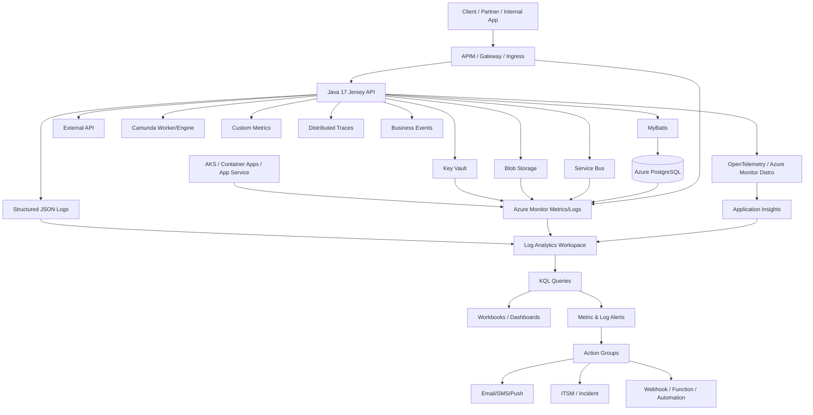

---

## 3. Decomposition Table - Practical Categories / Domain / Skills

| Area | Skill praktis | Kenapa penting |
|---|---|---|
| **1. Azure Monitor Mental Model** | Memahami metrics, logs, alerts, workbooks, Application Insights, Log Analytics | Azure Monitor menjadi platform utama untuk telemetry aplikasi dan resource Azure. Log Analytics workspace mengumpulkan log/trace dan dianalisis dengan KQL. ([Microsoft Learn](https://learn.microsoft.com/en-us/azure/azure-monitor/fundamentals/overview?utm_source=chatgpt.com)) |
| **2. Application Insights** | APM untuk request, dependency, exception, trace, app map | Application Insights adalah APM feature dari Azure Monitor dan mendukung OpenTelemetry untuk instrumentasi aplikasi. ([Microsoft Learn](https://learn.microsoft.com/en-us/azure/azure-monitor/app/app-insights-overview?utm_source=chatgpt.com)) |
| **3. OpenTelemetry** | Vendor-neutral instrumentation untuk traces, metrics, logs | Untuk aplikasi baru, Microsoft merekomendasikan Azure Monitor OpenTelemetry Distro untuk Application Insights. ([Microsoft Learn](https://learn.microsoft.com/en-us/azure/azure-monitor/app/application-insights-faq?utm_source=chatgpt.com)) |
| **4. Java Instrumentation** | Java agent / OpenTelemetry Distro, connection string, cloud role name | Application Insights Java dapat dikonfigurasi dengan Java agent; container bisa memakai `JAVA_TOOL_OPTIONS=-javaagent:/path/to/applicationinsights-agent.jar`. ([Microsoft Learn](https://learn.microsoft.com/en-us/azure/azure-monitor/app/java-standalone-config?utm_source=chatgpt.com)) |
| **5. Log Analytics** | Menulis query KQL, filter, aggregate, join, alert | Log Analytics adalah tool untuk menulis dan menguji query terhadap Azure Monitor Logs. ([Microsoft Learn](https://learn.microsoft.com/en-us/azure/azure-monitor/logs/log-analytics-overview?utm_source=chatgpt.com)) |
| **6. KQL** | Query telemetry, menemukan pola, anomaly, outlier | Azure Monitor Logs memakai Kusto Query Language untuk query log; KQL dirancang agar mudah dibaca dan digunakan untuk analisis besar. ([Microsoft Learn](https://learn.microsoft.com/en-us/azure/azure-monitor/logs/log-query-overview?utm_source=chatgpt.com)) |
| **7. Metrics** | CPU, memory, request rate, latency, 5xx, queue depth, DB connections | Metrics cocok untuk alert cepat dan trend time-series. Metric alerts mengevaluasi resource metrics secara regular interval. ([Microsoft Learn](https://learn.microsoft.com/en-us/azure/azure-monitor/alerts/alerts-overview?utm_source=chatgpt.com)) |
| **8. Log Alerts** | Alert berbasis KQL, error spike, DLQ growth, slow dependency | Berguna saat signal tidak tersedia sebagai metric bawaan atau butuh query kompleks. |
| **9. Action Groups** | Email, SMS, push, webhook, Function, automation | Action group menentukan siapa yang diberi notifikasi dan action apa yang dijalankan saat alert fires. ([Microsoft Learn](https://learn.microsoft.com/en-us/azure/azure-monitor/alerts/action-groups?utm_source=chatgpt.com)) |
| **10. Distributed Tracing** | `traceparent`, correlation ID, span, dependency trace | Menjawab request melewati gateway, Java API, PostgreSQL, Service Bus, Blob, dan external API. |
| **11. Structured Logging** | JSON logs, `traceId`, `spanId`, `userId`, `operation`, `caseId` | Log yang tidak structured sulit di-query dan sulit dikorelasikan. |
| **12. Dependency Observability** | PostgreSQL, Key Vault, Service Bus, Blob, external API latency/error | Banyak incident berasal dari dependency, bukan code endpoint itu sendiri. |
| **13. Runtime Observability** | App Service/Container Apps/AKS metrics, pod restart, OOM, probe failure | App bisa error karena runtime/container/platform, bukan business code. |
| **14. SLO & Error Budget** | Availability/latency target, burn rate, incident priority | Mengubah monitoring dari “banyak alert” menjadi reliability management. |
| **15. Dashboard / Workbook** | Golden signals, release view, dependency map, queue view | Workbooks/dashboards membantu on-call melihat kondisi cepat. |
| **16. Alert Hygiene** | Severity, routing, dedup, suppression, maintenance window | Alert yang terlalu bising akan diabaikan. |
| **17. Sensitive Data Filtering** | Jangan log token, password, PII, payload sensitif | Azure Monitor OpenTelemetry filtering guidance menekankan filtering health check noise, personal data, credentials, dan telemetry bernilai rendah. ([Microsoft Learn](https://learn.microsoft.com/en-us/azure/azure-monitor/app/opentelemetry-filter?utm_source=chatgpt.com)) |
| **18. Incident Diagnostics** | Triage path: gateway → runtime → app → dependency → DB → queue | Mempercepat root cause analysis dan recovery. |

---

## 4. Observability Pillars

### Metrics

```text id="azobs-metrics"
request rate
error rate
latency percentile
CPU/memory
DB connections
queue depth
DLQ count
pod restart count
```

Metrics menjawab: **“Apakah sistem sedang sehat?”**

### Logs

```text id="azobs-logs"
structured application logs
platform logs
audit logs
dependency error logs
migration logs
security logs
```

Logs menjawab: **“Apa yang terjadi?”**

### Traces

```text id="azobs-traces"
client request
  → APIM
  → Java/Jersey resource
  → service layer
  → MyBatis/PostgreSQL
  → Blob/Service Bus/external API
```

Traces menjawab: **“Request ini berjalan lewat mana dan lambat di mana?”**

### Events

```text id="azobs-events"
deployment event
feature flag change
schema migration
secret rotation
incident annotation
business event
```

Events menjawab: **“Perubahan apa yang mungkin menyebabkan gejala?”**

---

## 5. Azure Monitor vs Application Insights vs Log Analytics

| Komponen | Fungsi |
|---|---|
| **Azure Monitor** | Platform monitoring besar untuk metrics, logs, alerts, dashboards, resource monitoring |
| **Application Insights** | APM untuk aplikasi: request, dependency, exception, trace, app map, availability |
| **Log Analytics Workspace** | Tempat menyimpan/menganalisis logs dengan KQL |
| **KQL** | Bahasa query untuk logs/telemetry |
| **Alerts** | Rule yang mengubah signal menjadi notification/action |
| **Action Groups** | Target notification/action saat alert aktif |
| **Workbooks** | Dashboard/visualisasi interaktif berbasis query/metrics |

Azure Monitor overview terbaru menjelaskan Log Analytics workspace mengumpulkan log dan trace data yang dianalisis dengan KQL. Log Analytics sendiri adalah tool untuk menulis dan menguji query, termasuk untuk log search alerts dan workbooks. ([Microsoft Learn](https://learn.microsoft.com/en-us/azure/azure-monitor/fundamentals/overview?utm_source=chatgpt.com))

---

## 6. Application Insights untuk Java/Jersey

Untuk aplikasi Java/Jersey baru, arah modernnya adalah **OpenTelemetry-based instrumentation**. Microsoft FAQ menyatakan untuk monitoring aplikasi baru, gunakan Azure Monitor OpenTelemetry Distro atau current autoinstrumentation paths. ([Microsoft Learn](https://learn.microsoft.com/en-us/azure/azure-monitor/app/application-insights-faq?utm_source=chatgpt.com))

### Yang dikumpulkan

```text id="azobs-ai-collect"
HTTP requests
dependencies
exceptions
traces/logs
custom metrics
custom events
distributed traces
live metrics
```

Azure Monitor OpenTelemetry Distro menyertakan OpenTelemetry instrumentation libraries untuk mengumpulkan traces, metrics, logs, dan exceptions, serta mendukung custom telemetry dan Live Metrics. ([Microsoft Learn](https://learn.microsoft.com/en-us/azure/azure-monitor/app/opentelemetry-enable?utm_source=chatgpt.com))

---

## 7. Java Agent Pattern

Untuk containerized Java app, pola umum:

```text id="azobs-java-agent"
Application Insights Java agent
  → JVM argument / JAVA_TOOL_OPTIONS
  → telemetry dikirim ke Application Insights
```

Untuk container image yang tidak bisa dimodifikasi, Microsoft menyebut agent jar dapat di-mount dari luar container dan `JAVA_TOOL_OPTIONS` diset ke `-javaagent:/path/to/applicationinsights-agent.jar`. ([Microsoft Learn](https://learn.microsoft.com/en-us/azure/azure-monitor/app/java-get-started-supplemental?utm_source=chatgpt.com))

Contoh Dockerfile konseptual:

```dockerfile id="azobs-dockerfile"
FROM eclipse-temurin:17-jre

WORKDIR /app

COPY target/case-api.jar /app/case-api.jar
COPY applicationinsights-agent.jar /app/applicationinsights-agent.jar

ENV JAVA_TOOL_OPTIONS="-javaagent:/app/applicationinsights-agent.jar -XX:MaxRAMPercentage=75.0 -XX:+ExitOnOutOfMemoryError"

EXPOSE 8080

ENTRYPOINT ["java", "-jar", "/app/case-api.jar"]
```

Config environment:

```text id="azobs-ai-env"
APPLICATIONINSIGHTS_CONNECTION_STRING=InstrumentationKey=...;IngestionEndpoint=...
APPLICATIONINSIGHTS_ROLE_NAME=case-api
APPLICATIONINSIGHTS_ROLE_INSTANCE=<instance/pod/container>
```

Connection string menentukan resource Application Insights tujuan telemetry aplikasi. Microsoft juga mencatat connection string berisi instrumentation key dan ApplicationId; instrumentation key bukan security token atau security key. ([Microsoft Learn](https://learn.microsoft.com/en-us/azure/azure-monitor/app/connection-strings?utm_source=chatgpt.com))

---

## 8. Cloud Role Name & Service Identity

Dalam Application Insights, **cloud role name** sangat penting agar application map tidak kacau.

Bad:

```text id="azobs-role-bad"
cloud role name = unknown_service
cloud role name = java
cloud role name = app
```

Better:

```text id="azobs-role-good"
case-api
case-worker
document-worker
camunda-worker
report-api
```

Azure Monitor OpenTelemetry configuration docs menjelaskan cloud role name muncul di Application Map sebagai nama node dan bisa dioverride agar masuk akal untuk tim. ([Microsoft Learn](https://learn.microsoft.com/en-us/azure/azure-monitor/app/opentelemetry-configuration?utm_source=chatgpt.com))

Practical rule:

```text id="azobs-role-rule"
Set service.name/cloud role name explicitly.
Gunakan nama service stabil, bukan nama pod/container random.
```

---

## 9. Structured Logging Standard

Log yang bagus harus machine-queryable.

Contoh JSON log:

```json id="azobs-json-log"
{
  "timestamp": "2026-07-13T11:05:00+07:00",
  "level": "INFO",
  "service": "case-api",
  "env": "prod",
  "traceId": "4bf92f3577b34da6a3ce929d0e0e4736",
  "spanId": "00f067aa0ba902b7",
  "correlationId": "case-submit-req-123",
  "operation": "submitCase",
  "httpMethod": "POST",
  "path": "/v1/cases/{caseId}/submit",
  "statusCode": 202,
  "durationMs": 184,
  "caseId": "case-123",
  "userId": "user-456",
  "tenantId": "tenant-001"
}
```

Field minimal:

| Field | Kenapa |
|---|---|
| `timestamp` | Timeline |
| `level` | Filtering |
| `service` | Service ownership |
| `env` | Dev/test/prod separation |
| `traceId` / `spanId` | Distributed tracing |
| `correlationId` | Business/request correlation |
| `operation` | Search by operation |
| `statusCode` | Error grouping |
| `durationMs` | Latency |
| `businessKey` | Case/order/customer tracing |
| `exceptionClass` | Error classification |

Jangan log:

```text id="azobs-log-no"
password
token
authorization header
full SAS URL
PII tanpa governance
credit card / national ID
raw confidential payload
secret values
```

Filtering telemetry penting untuk mencegah personal data dan credentials ikut terkumpul. ([Microsoft Learn](https://learn.microsoft.com/en-us/azure/azure-monitor/app/opentelemetry-filter?utm_source=chatgpt.com))

---

## 10. Correlation ID dan Distributed Trace

Gunakan W3C Trace Context:

```text id="azobs-trace-context"
traceparent
tracestate
```

Tambahan umum:

```text id="azobs-corr-headers"
X-Correlation-ID
X-Request-ID
X-Forwarded-For
X-Forwarded-Proto
```

Flow:

```text id="azobs-trace-flow"
Client
  → APIM sets/preserves correlation
  → Java API logs traceId
  → MyBatis DB dependency span
  → Service Bus message carries correlationId
  → Worker continues trace/correlation
```

Rule:

```text id="azobs-corr-rule"
Satu request harus bisa ditelusuri dari gateway sampai dependency.
Async message harus membawa correlationId dan causationId.
```

Message envelope:

```json id="azobs-message-corr"
{
  "messageId": "case-123-submit-v1",
  "correlationId": "trace-abc",
  "causationId": "http-request-xyz",
  "eventType": "CaseSubmitted",
  "businessKey": "case-123"
}
```

---

## 11. Golden Signals

Untuk service Java/Jersey, pantau minimal:

| Signal | Contoh metric |
|---|---|
| **Traffic** | request/sec, message/sec |
| **Errors** | 5xx, exception rate, DLQ growth |
| **Latency** | p50/p95/p99 request duration |
| **Saturation** | CPU, memory, thread pool, DB pool |
| **Dependency** | PostgreSQL latency, Service Bus latency, Key Vault failure |
| **Availability** | health check, uptime test |
| **Backlog** | queue depth, oldest message age |
| **Correctness** | business failure rate, duplicate skip, validation failure |

Untuk APIM, Azure docs mendeskripsikan observability sebagai kemampuan memahami internal state sistem dari data yang dihasilkan; APIM cocok sebagai single point of entry API traffic untuk observability API. ([Microsoft Learn](https://learn.microsoft.com/en-us/azure/api-management/observability?utm_source=chatgpt.com))

---

## 12. Metrics yang Wajib untuk Java/Jersey

### HTTP/API

```text id="azobs-http-metrics"
request_count
request_duration_p50/p95/p99
5xx_rate
4xx_rate
timeout_count
payload_too_large_count
auth_failure_count
```

### JVM

```text id="azobs-jvm-metrics"
heap_used
heap_max
gc_pause_duration
thread_count
blocked_threads
classloader/metaspace
cpu_process
```

### DB/MyBatis

```text id="azobs-db-metrics"
db_pool_active
db_pool_idle
db_pool_pending
query_duration
slow_query_count
transaction_duration
deadlock_count
connection_timeout_count
```

### Worker

```text id="azobs-worker-metrics"
messages_processed
message_processing_duration
retry_count
dead_letter_count
duplicate_skipped
oldest_message_age
worker_concurrency
```

### Deployment

```text id="azobs-deploy-metrics"
current_version
image_digest
revision
pod_restart_after_deploy
5xx_after_deploy
latency_after_deploy
```

---

## 13. Log Analytics & KQL Basics

KQL digunakan untuk mengambil, memfilter, menggabungkan, dan menganalisis log di Azure Monitor Logs. Microsoft menjelaskan KQL sebagai tool kuat untuk mengeksplorasi data, menemukan pola, anomaly/outlier, dan membuat analisis statistik. ([Microsoft Learn](https://learn.microsoft.com/en-us/kusto/query/?view=microsoft-fabric&utm_source=chatgpt.com))

### Query error request

```kusto id="azobs-kql-5xx"
requests
| where timestamp > ago(1h)
| where cloud_RoleName == "case-api"
| where resultCode startswith "5"
| summarize count() by resultCode, operation_Name
| order by count_ desc
```

### Query exception

```kusto id="azobs-kql-exception"
exceptions
| where timestamp > ago(1h)
| where cloud_RoleName == "case-api"
| summarize count() by type, outerMessage
| order by count_ desc
```

### Query dependency latency

```kusto id="azobs-kql-dependency"
dependencies
| where timestamp > ago(1h)
| where cloud_RoleName == "case-api"
| summarize p95=percentile(duration, 95), failures=countif(success == false), total=count()
  by type, target
| order by p95 desc
```

### Query trace by correlation

```kusto id="azobs-kql-correlation"
union requests, dependencies, exceptions, traces
| where timestamp > ago(24h)
| where operation_Id == "<trace-or-operation-id>"
| order by timestamp asc
```

---

## 14. KQL untuk Release Regression

Cari apakah deployment baru menaikkan error:

```kusto id="azobs-kql-release-error"
requests
| where timestamp > ago(6h)
| where cloud_RoleName == "case-api"
| summarize total=count(), errors=countif(resultCode startswith "5")
  by bin(timestamp, 5m)
| extend errorRate = todouble(errors) / todouble(total)
| order by timestamp asc
```

Jika Anda menyimpan version sebagai custom dimension:

```kusto id="azobs-kql-version"
requests
| where timestamp > ago(24h)
| where cloud_RoleName == "case-api"
| summarize total=count(), errors=countif(resultCode startswith "5"),
            p95=percentile(duration, 95)
  by tostring(customDimensions["app.version"])
| extend errorRate = todouble(errors) / todouble(total)
| order by errorRate desc
```

Production rule:

```text id="azobs-release-rule"
Setiap deployment harus punya app.version/imageDigest/revision di telemetry.
```

---

## 15. Alerts: Metric vs Log

| Alert type | Cocok untuk |
|---|---|
| **Metric alert** | CPU, memory, response time, request count, queue depth, platform metric |
| **Log search alert** | Exception spike, custom business error, complex KQL, correlation-based signal |
| **Activity log alert** | Resource change, service health, policy/security operation |
| **Availability alert** | Endpoint synthetic check |
| **Smart detection/anomaly** | Jika tersedia dan sesuai kebutuhan |

Azure Monitor alerts overview menjelaskan metric alerts mengevaluasi resource metrics secara regular interval; alert rule menggabungkan resource, monitoring data, condition, dan action group. ([Microsoft Learn](https://learn.microsoft.com/en-us/azure/azure-monitor/alerts/alerts-overview?utm_source=chatgpt.com))

---

## 16. Action Groups

Action group menentukan siapa diberi notifikasi dan action apa yang dijalankan saat alert fires. Action group mendukung notification seperti email/SMS/push/voice dan automated action seperti webhook atau Azure Function. ([Microsoft Learn](https://learn.microsoft.com/en-us/azure/azure-monitor/alerts/action-groups?utm_source=chatgpt.com))

Contoh routing:

| Severity | Action |
|---|---|
| Sev0 | Pager/on-call + incident channel |
| Sev1 | On-call + team channel |
| Sev2 | Team channel + ticket |
| Sev3 | Ticket/backlog |
| Informational | Dashboard only |

Action group pattern:

```text id="azobs-action-group"
ag-prod-critical
ag-prod-warning
ag-platform-network
ag-data-postgres
ag-security
```

Alert hygiene:

```text id="azobs-alert-hygiene"
alert harus actionable
alert harus punya owner
alert harus punya runbook
alert harus punya severity
alert harus punya threshold realistis
alert noise harus dikurangi
```

---

## 17. Alert Minimum untuk Java/Jersey API

| Alert | Contoh condition |
|---|---|
| High 5xx rate | 5xx rate > 2% selama 5-10 menit |
| Latency p95 tinggi | p95 > SLA threshold |
| Availability failure | health endpoint gagal dari synthetic check |
| Exception spike | exception count naik signifikan |
| DB dependency latency | PostgreSQL p95 > threshold |
| DB connection pool pending | pending threads > 0 sustained |
| Service Bus DLQ | DLQ count > 0 / oldest DLQ age |
| Queue backlog | active message age > threshold |
| Container restart | restart count naik |
| OOMKilled | pod/container killed karena memory |
| Key Vault failure | secret get failure/403 spike |
| Storage failures | blob 5xx/403 spike |
| Deployment regression | error rate naik setelah version baru |

---

## 18. Dashboard / Workbook Layout

Dashboard production sebaiknya answer-first.

### Page 1 - Service Health

```text id="azobs-dashboard-health"
Availability
Request rate
Error rate
p95/p99 latency
Current version
Recent deployments
Top failing operations
```

### Page 2 - Dependency

```text id="azobs-dashboard-dep"
PostgreSQL latency/errors
Service Bus queue depth/DLQ
Blob failures
Key Vault failures
External API 429/5xx
```

### Page 3 - Runtime

```text id="azobs-dashboard-runtime"
App Service/ACA/AKS instance count
CPU/memory
Pod/container restart
JVM heap/GC
Thread pool
DB pool
```

### Page 4 - Business Flow

```text id="azobs-dashboard-business"
cases submitted
documents uploaded
documents accepted/rejected
workflow failures
async processing age
duplicate skipped
```

### Page 5 - Release

```text id="azobs-dashboard-release"
version distribution
error rate by version
latency by version
logs by deployment ID
rollback target
```

---

## 19. Observability per Azure Runtime

### App Service

Pantau:

```text id="azobs-appservice"
HTTP 5xx
response time
CPU/memory
app restarts
deployment slot swap
health check status
App Service platform metrics
Application Insights request/dependency telemetry
```

Application Insights FAQ mencatat perbedaan penting: Application Insights mengumpulkan telemetry request yang sampai ke aplikasi; jika failure terjadi di Web Apps/web server sebelum request mencapai user application, Application Insights mungkin tidak memiliki telemetry untuk request itu. ([Microsoft Learn](https://learn.microsoft.com/en-us/azure/azure-monitor/app/application-insights-faq?utm_source=chatgpt.com))

### Container Apps

Pantau:

```text id="azobs-aca"
revision health
replica count
scale events
CPU/memory
container restart
ingress 5xx
logs per revision
```

### AKS

Pantau:

```text id="azobs-aks"
pod readiness
restart count
OOMKilled
node pressure
HPA desired/current
cluster autoscaler
ingress 5xx/latency
namespace resource quota
```

### APIM

Pantau:

```text id="azobs-apim"
gateway 4xx/5xx
backend 5xx
policy errors
latency gateway vs backend
rate-limit hits
subscription/product traffic
```

---

## 20. Dependency Observability

### PostgreSQL

```text id="azobs-pg"
connection count
active/idle connections
slow query
lock wait
deadlock
CPU/storage/IO
replication lag if replica
```

### Service Bus

```text id="azobs-sb"
active messages
scheduled messages
DLQ count
oldest active message age
incoming/outgoing messages
processing latency
retry count
```

### Blob Storage

```text id="azobs-blob"
upload failure
download failure
403/404/5xx
latency
capacity
lifecycle side effects
```

### Key Vault

```text id="azobs-kv"
secret get failures
403/404
latency
throttling
unexpected principal
delete/disable/purge operations
```

### External API

```text id="azobs-external"
HTTP 429
HTTP 5xx
timeout
latency
circuit breaker open
retry count
```

---

## 21. OpenTelemetry Configuration Strategy

Untuk Java/Jersey, pilih salah satu:

| Pattern | Cocok untuk |
|---|---|
| Java agent auto-instrumentation | Cepat, minim code change |
| Code-based OpenTelemetry | Butuh custom spans/metrics/events |
| Hybrid | Agent + custom instrumentation untuk business flow |
| OTel Collector | Multi-cloud/on-prem routing, filtering, enrichment |

Azure Monitor OpenTelemetry enable docs menyatakan Distro membantu install, connect ke Application Insights resource, dan verify telemetry flows. Distro juga mendukung automatic telemetry dan custom telemetry. ([Microsoft Learn](https://learn.microsoft.com/en-us/azure/azure-monitor/app/opentelemetry-enable?utm_source=chatgpt.com))

Practical recommendation:

```text id="azobs-otel-reco"
Mulai dengan Java agent untuk request/dependency/exception.
Tambahkan custom spans/metrics untuk business-critical flow.
Filter health check/noise/sensitive data.
Set service name/cloud role.
```

---

## 22. Custom Spans & Business Telemetry

Tambahkan custom telemetry untuk proses penting:

```text id="azobs-business-telemetry"
submitCase
validateDocument
generateInvoice
publishCaseEvent
completeCamundaTask
processServiceBusMessage
```

Contoh span attributes:

```text id="azobs-span-attrs"
case.id
tenant.id
operation.name
workflow.processInstanceId
message.id
message.type
db.mapper
external.partner
```

Rule:

```text id="azobs-custom-rule"
Business telemetry harus membantu diagnosis,
bukan menyimpan data sensitif.
```

---

## 23. Sensitive Data Filtering

Yang harus difilter:

```text id="azobs-sensitive"
Authorization header
JWT token
SAS URL
password
API key
secret value
PII
full request/response payload sensitif
national ID / credit card
```

Azure Monitor OpenTelemetry filtering guidance menyebut alasan filtering antara lain mengurangi health check noise, memastikan personal data dan credentials tidak dikumpulkan, dan mengoptimalkan performance/telemetry value. ([Microsoft Learn](https://learn.microsoft.com/en-us/azure/azure-monitor/app/opentelemetry-filter?utm_source=chatgpt.com))

Practical rule:

```text id="azobs-filter-rule"
Default jangan log body.
Log metadata aman.
Payload sensitif hanya boleh masuk audit store yang memang designed untuk itu.
```

---

## 24. SLO Design

Contoh SLO untuk `case-api`:

| SLO | Target |
|---|---|
| Availability | 99.9% successful non-5xx requests per 30 days |
| Latency | 95% `GET /cases/{id}` < 300 ms |
| Write latency | 95% `POST /cases/{id}/submit` < 1 s |
| Async freshness | 99% document processing < 5 minutes |
| Error budget | 0.1% monthly allowed failure |

SLO harus mengukur user-visible reliability, bukan hanya resource uptime.

Bad SLO:

```text id="azobs-bad-slo"
CPU below 80%
```

Better SLO:

```text id="azobs-good-slo"
99.9% API requests return successful response under defined latency target.
```

CPU adalah diagnostic metric, bukan user outcome.

---

## 25. Incident Triage Flow

Saat incident terjadi:

```text id="azobs-triage"
1. Scope:
   service mana, env mana, sejak kapan?

2. User impact:
   availability, latency, correctness, async backlog?

3. Recent changes:
   deployment, config, secret rotation, migration, policy, infra?

4. Entry point:
   APIM/gateway 4xx/5xx/latency?

5. Runtime:
   container/pod/app restart, OOM, CPU/memory?

6. App:
   exception, logs, traces, top failing operation?

7. Dependency:
   PostgreSQL, Key Vault, Blob, Service Bus, external API?

8. Data:
   DB locks, pool exhaustion, queue backlog, DLQ?

9. Mitigation:
   rollback, scale, disable feature, drain queue, failover, hotfix?

10. RCA:
   permanent fix, alert improvement, dashboard gap.
```

---

## 26. Common KQL Incident Queries

### Top failing operations

```kusto id="azobs-kql-top-fail"
requests
| where timestamp > ago(1h)
| where cloud_RoleName == "case-api"
| where success == false
| summarize failures=count() by operation_Name, resultCode
| order by failures desc
```

### Latency by operation

```kusto id="azobs-kql-latency-op"
requests
| where timestamp > ago(1h)
| where cloud_RoleName == "case-api"
| summarize p50=percentile(duration, 50),
            p95=percentile(duration, 95),
            p99=percentile(duration, 99),
            count=count()
  by operation_Name
| order by p95 desc
```

### Dependency failure

```kusto id="azobs-kql-dep-fail"
dependencies
| where timestamp > ago(1h)
| where cloud_RoleName == "case-api"
| where success == false
| summarize failures=count() by type, target, name
| order by failures desc
```

### Exceptions around deployment

```kusto id="azobs-kql-deploy-ex"
exceptions
| where timestamp between (datetime(2026-07-13T03:00:00Z) .. datetime(2026-07-13T04:00:00Z))
| where cloud_RoleName == "case-api"
| summarize count() by type, outerMessage
| order by count_ desc
```

---

## 27. Observability untuk Async Workers

Worker-specific telemetry:

```text id="azobs-worker-telemetry"
messageId
correlationId
queue/topic/subscription
deliveryCount
lockLostCount
processingDuration
retryReason
deadLetterReason
businessKey
consumerName
duplicateSkipped
```

KQL example:

```kusto id="azobs-kql-worker"
traces
| where timestamp > ago(1h)
| where cloud_RoleName == "document-worker"
| where customDimensions["event"] == "message_processed"
| summarize processed=count(),
            failures=countif(tostring(customDimensions["status"]) == "FAILED"),
            p95=percentile(todouble(customDimensions["durationMs"]), 95)
  by bin(timestamp, 5m)
```

SLO async:

```text id="azobs-async-slo"
99% of uploaded documents become ACCEPTED/REJECTED within 5 minutes.
DLQ count must be zero for >15 minutes.
Oldest active message age < 10 minutes.
```

---

## 28. Observability untuk Camunda

Jika memakai Camunda, tambahkan correlation:

```text id="azobs-camunda-fields"
processInstanceId
businessKey
activityId
workerName
jobType
jobKey
retryCount
incidentId
durationMs
```

Trace flow:

```text id="azobs-camunda-flow"
HTTP submit
  → create/update domain record
  → correlate BPMN message / start process
  → worker handles service task
  → external API/DB
  → complete/fail job
```

Alert:

```text id="azobs-camunda-alerts"
incident count spike
job failure rate
worker no progress
job retry exhaustion
process stuck age
external task backlog
```

---

## 29. Availability Tests

Untuk public/internal APIs, gunakan synthetic checks sesuai topology:

```text id="azobs-availability"
GET /health/live
GET /health/ready
GET /v1/cases/ping through APIM
POST synthetic lightweight transaction if allowed
```

Readiness vs liveness:

```text id="azobs-health"
liveness = process alive
readiness = ready to serve traffic
synthetic availability = user path works
```

Jangan hanya ping app container langsung jika real traffic lewat APIM/App Gateway/Ingress.

---

## 30. Alert Anti-noise Strategy

Alert yang baik:

```text id="azobs-alert-good"
actionable
severity jelas
owner jelas
runbook link
threshold realistis
deduplicated
suppression saat maintenance
```

Alert yang buruk:

```text id="azobs-alert-bad"
CPU 70% selama 1 menit
tanpa impact
tanpa owner
tanpa runbook
setiap pod restart minor langsung page
```

Gunakan alert processing rules untuk menambah/mengubah action groups atau suppression behavior pada alert sources tertentu. ([Microsoft Learn](https://learn.microsoft.com/en-us/azure/azure-monitor/alerts/alerts-processing-rules?utm_source=chatgpt.com))

---

## 31. Production Telemetry Contract

Setiap service harus punya telemetry contract:

```text id="azobs-contract"
service.name
service.version
environment
region
instance/pod
traceId
spanId
correlationId
operation
businessKey
tenantId
status
durationMs
errorCode
dependencyName
dependencyDurationMs
```

Untuk async message:

```text id="azobs-contract-msg"
messageId
correlationId
causationId
eventType
schemaVersion
businessKey
deliveryCount
consumerName
processingDurationMs
result
```

Telemetry contract harus stabil seperti API contract.

---

## 32. Observability as Code

Observability resource sebaiknya juga IaC:

```text id="azobs-iac"
Application Insights
Log Analytics Workspace
Diagnostic Settings
Alerts
Action Groups
Workbooks
Dashboards
Data Collection Rules
Retention settings
```

Kenapa?

```text id="azobs-iac-why"
environment konsisten
prod tidak bergantung manual portal setup
reviewable lewat PR
rollback-able
audit-able
```

---

## 33. Retention & Cost

Telemetry bisa mahal jika tidak dikontrol.

Cost driver:

```text id="azobs-cost"
log volume
trace sampling
dependency telemetry
request body logging
debug logs in prod
health check noise
retention period
high-cardinality custom dimensions
```

Tactics:

```text id="azobs-cost-tactics"
sample high-volume traces carefully
filter health checks
avoid full payload logs
use INFO sparingly in prod
set retention by compliance need
move audit archive separately if required
control custom metric cardinality
```

Application Insights/OpenTelemetry filtering guidance explicitly includes filtering health check telemetry and low-value telemetry to reduce noise and optimize performance. ([Microsoft Learn](https://learn.microsoft.com/en-us/azure/azure-monitor/app/opentelemetry-filter?utm_source=chatgpt.com))

---

## 34. Security & Compliance

Observability systems often become sensitive data stores.

Security checklist:

```text id="azobs-sec"
No tokens/passwords/secrets in logs.
No full sensitive payloads by default.
Role-based access to Log Analytics/Application Insights.
Audit access to logs.
Separate prod vs non-prod telemetry.
Retention aligned with compliance.
Mask or hash user identifiers if required.
Protect webhook/action group endpoints.
```

Connection strings for Application Insights contain instrumentation key and ApplicationId; they are not security tokens, but authenticated ingestion with Microsoft Entra can ensure only authenticated telemetry is ingested. ([Microsoft Learn](https://learn.microsoft.com/en-us/azure/azure-monitor/app/connection-strings?utm_source=chatgpt.com))

---

## 35. CLI Cheatsheet

### List Application Insights resources

```bash id="azobs-cli-appi-list"
az resource list \
  --resource-type "Microsoft.Insights/components" \
  --output table
```

### Show Log Analytics workspaces

```bash id="azobs-cli-law"
az monitor log-analytics workspace list --output table
```

### Query Log Analytics

```bash id="azobs-cli-query"
az monitor log-analytics query \
  --workspace "<workspace-id>" \
  --analytics-query "requests | take 10"
```

### List alert rules

```bash id="azobs-cli-alerts"
az monitor metrics alert list \
  --resource-group "<rg>" \
  --output table
```

### Create action group conceptually

```bash id="azobs-cli-action-group"
az monitor action-group create \
  --resource-group "<rg>" \
  --name "ag-prod-critical" \
  --short-name "prodcrit"
```

### Diagnostic settings list

```bash id="azobs-cli-diag-list"
az monitor diagnostic-settings list \
  --resource "<resource-id>"
```

### Create diagnostic settings conceptually

```bash id="azobs-cli-diag-create"
az monitor diagnostic-settings create \
  --name "send-to-law" \
  --resource "<resource-id>" \
  --workspace "<log-analytics-workspace-resource-id>" \
  --logs '[{"categoryGroup":"allLogs","enabled":true}]' \
  --metrics '[{"category":"AllMetrics","enabled":true}]'
```

---

## 36. Common Failure Modes

| Symptom | Kemungkinan root cause |
|---|---|
| Tidak ada telemetry di Application Insights | Connection string salah, agent tidak loaded, firewall/egress blocked, wrong resource |
| Requests ada, dependencies tidak ada | Instrumentation dependency tidak aktif atau library tidak terdeteksi |
| Semua service muncul sebagai satu node | Cloud role name/service name tidak diset |
| Trace putus di async worker | CorrelationId/trace context tidak dipropagate ke message |
| Log sulit dicari | Unstructured text logs, tidak ada traceId/businessKey |
| Alert terlalu banyak | Threshold terlalu sensitif, tidak ada aggregation/suppression |
| Alert tidak masuk on-call | Action group salah atau alert processing rule salah |
| 5xx terlihat di gateway tapi tidak di App Insights | Request gagal sebelum mencapai aplikasi |
| Cost telemetry naik | Debug logs, health check noise, payload logging, high cardinality |
| PII muncul di logs | No filtering/redaction |
| Dashboard hijau tapi user mengeluh | Dashboard hanya infrastructure metric, tidak ada user/business signal |
| Queue backlog tidak terdeteksi | Tidak ada alert oldest message age/DLQ |
| Incident RCA lambat | Deployment/version metadata tidak ada di telemetry |

---

## 37. Anti-pattern yang Harus Dihindari

| Anti-pattern | Risiko |
|---|---|
| Observability baru dipasang setelah incident | RCA lambat |
| Hanya mengandalkan logs, tanpa metrics/traces | Diagnosis parsial |
| Log plain text tanpa traceId | Sulit korelasi |
| Log full request/response payload | PII/secret leak |
| Health check selalu 200 | Dashboard hijau palsu |
| Alert CPU saja | User impact tidak terlihat |
| Tidak monitor dependency | Root cause tersembunyi |
| Tidak monitor DLQ/backlog | Async failure diam-diam |
| Tidak set service name/cloud role | App map kacau |
| Tidak record deployment version | Release regression sulit dibuktikan |
| Alert tanpa owner/runbook | Alert fatigue |
| Dashboard terlalu banyak panel tanpa prioritas | On-call bingung |
| Sampling tanpa memahami impact | Trace penting hilang |
| Logs prod dan non-prod bercampur tanpa filter | Analisis dan access control buruk |

---

## 38. Production Readiness Checklist

### A. Instrumentation

```text id="azobs-check-inst"
Application Insights/OpenTelemetry enabled.
Cloud role/service name explicit.
Connection string configured per environment.
Request/dependency/exception telemetry visible.
Custom business telemetry for critical flows.
```

### B. Logging

```text id="azobs-check-log"
Structured JSON logs.
traceId/spanId/correlationId included.
No secret/token/PII leakage.
Log levels controlled.
ErrorCode standardized.
```

### C. Metrics

```text id="azobs-check-metrics"
Golden signals defined.
JVM metrics visible.
DB pool metrics visible.
Queue/backlog metrics visible.
Runtime metrics visible.
Dependency metrics visible.
```

### D. Tracing

```text id="azobs-check-tracing"
Distributed trace across gateway → app → DB/dependency.
Async correlation through messages.
Business key searchable.
Dependency spans meaningful.
```

### E. Alerts

```text id="azobs-check-alerts"
5xx, latency, availability.
DB dependency failures.
Queue/DLQ/backlog.
Runtime restarts/OOM.
Key Vault/Storage/Service Bus failures.
Action groups configured.
Runbook attached.
```

### F. Dashboards

```text id="azobs-check-dashboard"
Service health.
Dependency health.
Runtime health.
Async processing.
Release/version view.
Business flow health.
```

### G. Governance

```text id="azobs-check-gov"
Observability resources managed as IaC.
Access controlled.
Retention configured.
Cost monitored.
PII/secret filtering reviewed.
Incident review feeds alert/dashboard improvements.
```

---

## 39. Practical Design Template

```text id="azobs-template"
Service:
  case-api
  runtime: Java 17 + Jersey
  deployment: Container Apps / AKS / App Service
  dependencies:
    PostgreSQL
    Key Vault
    Blob Storage
    Service Bus
    APIM

Instrumentation:
  Azure Monitor OpenTelemetry / Application Insights Java agent
  service.name/cloud role: case-api
  environment: prod
  version: image digest or app version

Logs:
  JSON structured
  traceId/spanId/correlationId
  caseId/businessKey
  operation
  durationMs
  errorCode
  no secrets/PII

Metrics:
  request rate
  p95/p99 latency
  5xx rate
  DB pool active/pending
  dependency latency
  queue depth/DLQ
  JVM heap/GC

Traces:
  APIM → Java API → PostgreSQL
  API → Service Bus
  Worker → Blob/PostgreSQL/Camunda

Alerts:
  5xx spike
  p95 latency breach
  availability failure
  DB dependency failure
  DLQ count > 0
  oldest queue message age
  runtime restart/OOM
  Key Vault 403/timeout spike

Dashboard:
  service health
  dependency health
  async backlog
  release regression
  business flow

SLO:
  99.9% availability
  p95 read latency < 300ms
  p95 write latency < 1s
  99% async document processing < 5 minutes
```

---

## 40. Roadmap Belajar Singkat

```text id="azobs-roadmap"
1. Pahami Azure Monitor, Application Insights, Log Analytics, KQL.
2. Pasang OpenTelemetry/Application Insights pada Java/Jersey service.
3. Standardisasi structured logging dan correlation ID.
4. Buat KQL query dasar untuk request, exception, dependency, dan release regression.
5. Buat dashboard golden signals.
6. Tambahkan dependency metrics: PostgreSQL, Service Bus, Blob, Key Vault.
7. Buat alert actionable dengan action group dan runbook.
8. Definisikan SLO untuk API dan async processing.
9. Kelola observability resource sebagai IaC.
10. Review setiap incident: alert apa yang telat, dashboard apa yang kurang, telemetry apa yang hilang.
```

---

## 41. Mental Model Final

```text id="azobs-final"
Azure Monitor
  = platform observability Azure

Application Insights
  = APM untuk aplikasi

OpenTelemetry
  = standard instrumentation modern

Log Analytics
  = log query workspace

KQL
  = bahasa diagnosis telemetry

Metrics
  = alert cepat dan trend

Logs
  = detail kejadian

Traces
  = end-to-end request journey

Action Groups
  = notification/action target

Workbooks
  = dashboard diagnosis

SLO
  = reliability target berbasis user impact

Correlation ID
  = benang merah antar service, queue, DB, worker
```

Kalimat kunci:

```text id="azobs-key"
Observability production yang sehat bukan sekadar mengirim log ke Azure.
Ia harus membuat engineer bisa menjawab dengan cepat:
apa yang rusak, siapa terdampak, sejak kapan, dependency mana yang gagal,
deployment mana yang berubah, bagaimana mitigasinya, dan alert/dashboard apa yang perlu diperbaiki.
```

---

# Status

**Azure Seri 17/18 selesai.**

## Rekomendasi materi berikutnya

**Azure Seri 18 - Azure Production Readiness: security, reliability, cost, backup/DR, runbook, incident response, capacity planning, compliance guardrails, operational checklist, dan go-live readiness untuk Java/Jersey microservice.**

---

**Sources:**

- [Azure Monitor overview](https://learn.microsoft.com/en-us/azure/azure-monitor/fundamentals/overview?utm_source=chatgpt.com)

## Response:
7/13/2026, 8:43:33 PM

# Azure Seri 18/18 - Azure Production Readiness for Java/Jersey Microservices

## 1. Introduction

**Production readiness** adalah kondisi ketika service tidak hanya “berhasil deploy”, tetapi siap dioperasikan dengan aman, reliable, observable, scalable, recoverable, dan cost-aware.

Untuk stack Anda:

```text
Java 17+ / Jersey / JAX-RS
Maven / Docker / GitHub Actions
App Service / Container Apps / AKS
PostgreSQL / MyBatis / PL/pgSQL
Key Vault / Storage / Service Bus
APIM / Networking / Private Endpoint
Azure Monitor / Application Insights / Log Analytics
```

Azure Well-Architected Framework memakai lima pilar utama: **Reliability, Security, Cost Optimization, Operational Excellence, dan Performance Efficiency**. Seri ini memakai lima pilar tersebut sebagai kerangka final untuk go-live readiness. ([Microsoft Learn](https://learn.microsoft.com/en-us/azure/well-architected/?utm_source=chatgpt.com))

---

## 2. Diagram - Production Readiness Map

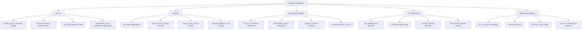

---

## 3. Decomposition Table - Practical Categories / Domain / Skills

| Area | Readiness skill | Yang harus siap |
|---|---|---|
| **1. Security Baseline** | Zero Trust, IAM, segmentation, encryption, secrets, monitoring | Azure Well-Architected security checklist menekankan baseline security, secure development lifecycle, data classification, segmentation, IAM, traffic control, encryption, hardening, secret protection, monitoring, testing, dan incident response. ([Microsoft Learn](https://learn.microsoft.com/en-us/azure/well-architected/security/checklist?utm_source=chatgpt.com)) |
| **2. Reliability Baseline** | Availability target, recovery target, failure mode analysis | Reliability checklist Azure meminta desain berdasarkan target availability/recoverability dan strategi failure recovery. ([Microsoft Learn](https://learn.microsoft.com/en-us/azure/well-architected/reliability/checklist?utm_source=chatgpt.com)) |
| **3. Operational Excellence** | IaC, CI/CD, monitoring, incident process, safe deployment | Operational Excellence checklist menekankan standardisasi, IaC, automated pipelines, telemetry, incident management, automation, dan safe deployment practices. ([Microsoft Learn](https://learn.microsoft.com/en-us/azure/well-architected/operational-excellence/checklist?utm_source=chatgpt.com)) |
| **4. Cost Optimization** | Cost model, budget, guardrail, environment cost, data cost | Cost Optimization checklist menekankan cost model, daily cost review, spending guardrails, environment cost, data cost, scaling cost, dan personnel/time efficiency. ([Microsoft Learn](https://learn.microsoft.com/en-us/azure/well-architected/cost-optimization/checklist?utm_source=chatgpt.com)) |
| **5. Performance Efficiency** | Performance target, capacity planning, scaling, data optimization | Performance checklist menekankan numerical performance targets, capacity planning, right services, consistent measurement, scaling, production-like testing, and continuous optimization. ([Microsoft Learn](https://learn.microsoft.com/en-us/azure/well-architected/performance-efficiency/checklist?utm_source=chatgpt.com)) |
| **6. Backup & DR** | Backup, PITR, restore drill, RPO/RTO | Azure DR guidance menekankan backup strategy, regular drills, current/actionable plans, dan accessibility during outages. ([Microsoft Learn](https://learn.microsoft.com/en-us/azure/well-architected/reliability/disaster-recovery?utm_source=chatgpt.com)) |
| **7. Observability** | Metrics, logs, traces, alerts, action groups | Azure Monitor alerts use alert rules and action groups; action groups define who is notified and what action runs when alert fires. ([Microsoft Learn](https://learn.microsoft.com/en-us/azure/azure-monitor/alerts/alerts-overview?utm_source=chatgpt.com)) |
| **8. Advisor & Continuous Review** | Advisor score, recommendations, review cadence | Azure Advisor helps review reliability, security, performance, operational excellence, and cost recommendations; Advisor Score summarizes improvement opportunities. ([Microsoft Learn](https://learn.microsoft.com/en-us/azure/advisor/advisor-overview?utm_source=chatgpt.com)) |

---

## 4. Production Readiness Mental Model

Gunakan model ini:

```text
Production-ready service
  = secure by default
  + observable by default
  + recoverable by design
  + deployable safely
  + scalable within limits
  + cost-governed
  + owned by a team
  + documented with runbooks
```

Bukan production-ready jika hanya:

```text
mvn clean package berhasil
docker build berhasil
deployment sukses
health endpoint 200
```

Karena production failure biasanya muncul dari kombinasi:

```text
identity salah
secret expired
DNS/private endpoint salah
DB pool overload
migration tidak backward-compatible
queue backlog tidak dimonitor
alert tidak actionable
rollback gagal karena schema
cost naik karena log/retention/idle resource
```

---

## 5. Go-live Readiness Scorecard

Gunakan scorecard sederhana ini sebelum service masuk production.

| Dimension | Minimum untuk go-live | Status |
|---|---|---|
| **Ownership** | Service owner, on-call, escalation path jelas | ☐ |
| **Architecture** | Diagram current-state, dependency map, data flow, trust boundary | ☐ |
| **Security** | Managed identity, Key Vault, least privilege, private access jika perlu | ☐ |
| **API Exposure** | APIM/gateway/WAF/rate limit/auth/versioning sesuai kebutuhan | ☐ |
| **Runtime** | App Service/ACA/AKS sizing, health probe, graceful shutdown | ☐ |
| **Database** | Pool sizing, migration strategy, backup/PITR, slow query visibility | ☐ |
| **Messaging** | Idempotency, DLQ, retry, queue depth alert | ☐ |
| **Observability** | Logs, metrics, traces, dashboards, alerts, action groups | ☐ |
| **CI/CD** | Build once, promote artifact, approval, rollback path | ☐ |
| **DR** | RPO/RTO defined, restore tested, runbook available | ☐ |
| **Cost** | Tags, budget, retention, autoscale limit, cost review | ☐ |
| **Incident** | Runbooks, severity model, comms channel, postmortem process | ☐ |

Go-live rule:

```text
Jika security, backup/restore, observability, rollback, dan ownership belum jelas,
service belum layak production walaupun deployment berhasil.
```

---

## 6. Security Readiness

### A. Identity & Access

Checklist:

```text
☐ Runtime app memakai managed identity / workload identity.
☐ Pipeline identity berbeda dari runtime identity.
☐ Runtime identity tidak punya Contributor/Owner.
☐ Role scoped minimal: Key Vault Secrets User, Storage Blob Data Contributor, Service Bus Sender/Receiver.
☐ Production access via group/PIM/time-bound process.
☐ Break-glass account/process terdokumentasi.
☐ Access review berkala.
```

Anti-pattern:

```text
Satu service principal Owner dipakai untuk:
  deploy infra,
  push image,
  read Key Vault,
  run application,
  semua environment.
```

---

### B. Secret & Certificate

Checklist:

```text
☐ Secret di Key Vault, bukan repo/image/plain env.
☐ Secret rotation runbook tersedia.
☐ Certificate expiry alert aktif.
☐ Key Vault diagnostic logs aktif.
☐ Private endpoint untuk Key Vault jika workload sensitive.
☐ App tidak membaca Key Vault per request.
☐ Secret value tidak pernah masuk log/error.
```

---

### C. Network & Exposure

Checklist:

```text
☐ Public endpoint hanya jika memang dibutuhkan.
☐ Backend tidak bisa bypass APIM/gateway.
☐ Private endpoint/private DNS tervalidasi dari runtime.
☐ Egress path jelas: NAT Gateway / Azure Firewall / controlled outbound.
☐ NSG/UDR/firewall rule terdokumentasi.
☐ Ingress TLS policy/certificate lifecycle jelas.
☐ CORS, upload size, timeout, WebSocket/long polling behavior divalidasi jika relevan.
```

---

### D. Application Security

Checklist:

```text
☐ JWT/authentication divalidasi.
☐ Backend tetap melakukan domain authorization.
☐ Object-level permission dicek.
☐ Input validation aktif.
☐ Error response tidak membocorkan stack trace/SQL/secret.
☐ Dependency/container scan dilakukan.
☐ Image digest traceable.
☐ Rate limit untuk endpoint risk tinggi.
```

---

## 7. Reliability Readiness

Reliability bukan hanya “server tidak mati”, tetapi kemampuan workload tetap memenuhi target ketika dependency gagal, traffic naik, deployment terjadi, atau region/service bermasalah. Azure reliability guidance menekankan desain berdasarkan availability dan recoverability target metrics. ([Microsoft Learn](https://learn.microsoft.com/en-us/azure/well-architected/reliability/checklist?utm_source=chatgpt.com))

### A. Target

Definisikan:

```text
Availability target:
  contoh 99.9%

RTO:
  berapa lama boleh down?

RPO:
  berapa banyak data boleh hilang?

Latency SLO:
  p95/p99 per endpoint penting

Async SLO:
  contoh 99% document processing selesai < 5 menit
```

Contoh:

| Flow | Availability | Latency / Freshness | RPO | RTO |
|---|---:|---:|---:|---:|
| Read case | 99.9% | p95 < 300 ms | N/A | 30 min |
| Submit case | 99.9% | p95 < 1 s | < 5 min | 30 min |
| Upload document | 99.5% | accepted < 5 min | < 15 min | 1 h |
| Nightly report | 99% | selesai sebelum 06:00 | 1 day | 4 h |

---

### B. Timeout, Retry, Circuit Breaker

Checklist:

```text
☐ HTTP client timeout eksplisit.
☐ DB connection timeout eksplisit.
☐ Query timeout eksplisit.
☐ Retry bounded + exponential backoff + jitter.
☐ Tidak retry non-idempotent write tanpa idempotency key.
☐ Circuit breaker untuk external dependency jika diperlukan.
☐ Bulkhead/semaphore untuk membatasi dependency concurrency.
☐ Graceful degradation didefinisikan.
```

Anti-pattern:

```text
retry semua exception
tanpa limit
oleh semua pod
ke dependency yang sedang down
```

Dampaknya: retry storm.

---

### C. Health Probe

Minimum endpoint:

```text
/health/live
/health/ready
```

Rule:

```text
Liveness:
  proses aplikasi masih hidup.

Readiness:
  instance siap menerima traffic.

Synthetic check:
  jalur user/gateway benar-benar bekerja.
```

Jangan membuat liveness bergantung ke PostgreSQL. Kalau DB down, semua pod bisa restart loop, padahal proses aplikasi masih sehat.

---

## 8. Backup, Restore, and Disaster Recovery

Azure business continuity guidance membedakan **backup**, **high availability**, dan **disaster recovery**; backup diperlukan ketika automatic failover tidak cukup atau terjadi data corruption. ([Microsoft Learn](https://learn.microsoft.com/en-us/azure/reliability/concept-business-continuity-high-availability-disaster-recovery?utm_source=chatgpt.com))

### A. PostgreSQL

Checklist:

```text
☐ Backup retention sesuai RPO.
☐ PITR pernah diuji.
☐ Restore menghasilkan server baru dipahami.
☐ Cutover connection string/Key Vault/DNS terdokumentasi.
☐ Migration risky punya backup/rollback plan.
☐ Restore drill dilakukan berkala.
```

Runbook PITR:

```text
1. Tentukan waktu insiden.
2. Freeze write traffic jika corruption masih berjalan.
3. Restore PostgreSQL ke server baru.
4. Validasi data.
5. Update Key Vault/config/DNS.
6. Smoke test.
7. Cutover traffic.
8. Reconcile event/message/object storage side effects.
```

---

### B. Blob Storage

Checklist:

```text
☐ Soft delete/versioning dievaluasi.
☐ Lifecycle policy tidak melanggar retention.
☐ Critical document container punya redundancy sesuai requirement.
☐ Restore/delete recovery diuji.
☐ Archive tier tidak dipakai untuk hot operational path.
```

---

### C. Messaging

Checklist:

```text
☐ DLQ monitored.
☐ Replay runbook tersedia.
☐ Message contract punya schemaVersion.
☐ Consumer idempotent.
☐ Outbox untuk critical domain event.
☐ Event Grid dead-lettering jika event tidak boleh hilang.
```

---

### D. DR Reality Check

Penting:

```text
Database restore tidak otomatis restore:
  Service Bus messages
  Blob files
  external API side effects
  Camunda workflow state
  cache state
  APIM/gateway config
```

Jadi DR harus didesain sebagai **system recovery**, bukan database-only recovery.

---

## 9. Operational Excellence Readiness

Operational Excellence checklist Azure menekankan standard practices, IaC, predictable pipelines, monitoring stack, incident management, automation, dan safe deployment. ([Microsoft Learn](https://learn.microsoft.com/en-us/azure/well-architected/operational-excellence/checklist?utm_source=chatgpt.com))

### A. Ownership

Checklist:

```text
☐ Service owner jelas.
☐ Primary/secondary on-call jelas.
☐ Escalation path jelas.
☐ Dependency owner diketahui.
☐ Business owner diketahui.
☐ Runbook link tersedia di dashboard/alert.
```

RACI contoh:

| Area | Responsible | Accountable | Consulted | Informed |
|---|---|---|---|---|
| App runtime | Backend team | Service owner | Platform | Support |
| PostgreSQL | Backend/Data team | Service owner | DBA/Platform | Support |
| AKS/ACA/App Service platform | Platform team | Platform owner | Backend | Support |
| APIM policy | API platform/backend | Service owner | Security | Consumers |
| Incident response | On-call | Incident commander | Platform/Security | Stakeholders |

---

### B. CI/CD & IaC

Checklist:

```text
☐ Infrastructure via Bicep/Terraform.
☐ Manual portal change dibatasi.
☐ What-if/plan sebelum production.
☐ GitHub/Azure DevOps OIDC federation.
☐ Production approval enabled.
☐ Artifact immutable.
☐ Deployment metadata tersimpan.
☐ Rollback tested.
```

---

### C. Safe Deployment

Pattern yang direkomendasikan:

```text
App Service:
  staging slot → smoke test → swap

Container Apps:
  new revision → traffic split → promote/rollback

AKS:
  rolling update / canary / Helm rollback

APIM:
  revision for non-breaking change
  version for breaking change
```

Deployment gate:

```text
☐ Unit/integration tests pass.
☐ Contract tests pass.
☐ Security scan pass.
☐ Image scan pass.
☐ DB migration validated.
☐ Smoke test through gateway pass.
☐ Alerts normal after deploy.
```

---

## 10. Observability & Incident Readiness

Azure Monitor alert rules combine monitored resources, data, conditions, and action groups; action groups define notifications/actions when alerts fire. ([Microsoft Learn](https://learn.microsoft.com/en-us/azure/azure-monitor/alerts/alerts-overview?utm_source=chatgpt.com))

### A. Minimum Alerts

| Alert | Severity |
|---|---|
| API 5xx spike | Sev1/Sev2 |
| API p95 latency breach | Sev2 |
| Health endpoint unavailable | Sev1 |
| PostgreSQL connection exhaustion | Sev1 |
| PostgreSQL CPU/storage high sustained | Sev2 |
| Service Bus DLQ > 0 for critical queue | Sev1/Sev2 |
| Oldest message age > threshold | Sev2 |
| Key Vault 403/timeout spike | Sev1/Sev2 |
| Container restart/OOM spike | Sev2 |
| APIM backend 5xx spike | Sev1/Sev2 |
| Certificate expiry < 30 days | Sev2 |
| Budget anomaly/spend threshold | Sev3/Sev2 depending impact |

---

### B. Dashboard Minimum

Dashboard harus punya:

```text
Service health:
  request rate, 5xx, p95/p99 latency, availability

Runtime:
  CPU, memory, restart, replica/pod count

Dependencies:
  PostgreSQL, Key Vault, Storage, Service Bus, external API

Async:
  queue depth, DLQ, oldest message age, processing latency

Release:
  current version, image digest, recent deployments, error by version

Business:
  submitted cases, processed documents, failed workflows
```

---

### C. Incident Runbook Template

```text
Runbook: case-api high 5xx

1. Confirm scope:
   env, region, service, since when.

2. Check recent changes:
   app deploy, migration, APIM policy, secret rotation, infra change.

3. Check gateway:
   APIM/backend latency, 4xx/5xx, policy error.

4. Check app runtime:
   container restart, OOM, health probe, CPU/memory.

5. Check app logs/traces:
   top exception, failing endpoint, correlation ID.

6. Check dependencies:
   PostgreSQL, Key Vault, Service Bus, Blob, external API.

7. Mitigate:
   rollback app/revision/slot,
   reduce traffic,
   scale if safe,
   disable feature,
   pause worker,
   failover/restore if needed.

8. Communicate:
   incident channel, stakeholder update, ETA if known.

9. Recover:
   verify SLO/alerts normal.

10. Postmortem:
   root cause, contributing factors, prevention, alert/dashboard gaps.
```

---

## 11. Performance & Capacity Readiness

Performance Efficiency checklist Azure menekankan numerical performance targets, capacity planning, service selection, measurement, scaling/partitioning, testing di production-like environment, dan continuous optimization. ([Microsoft Learn](https://learn.microsoft.com/en-us/azure/well-architected/performance-efficiency/checklist?utm_source=chatgpt.com))

### A. Capacity Model

Untuk Java/Jersey + PostgreSQL:

```text
max_app_replicas × db_pool_max_per_replica
  <= safe_postgres_connection_budget
```

Contoh:

```text
AKS HPA max pods: 10
HikariCP maxPoolSize: 8
Potential DB connections: 80
```

Lakukan juga untuk worker:

```text
max_worker_replicas × maxConcurrentCalls × downstream_call_per_message
  <= downstream safe capacity
```

---

### B. Load Test Readiness

Checklist:

```text
☐ Test p50/p95/p99 latency.
☐ Test peak traffic.
☐ Test slow dependency.
☐ Test DB pool exhaustion behavior.
☐ Test queue backlog recovery.
☐ Test failover/restart behavior.
☐ Test large upload/download.
☐ Test rollback under load.
☐ Test migration with realistic data volume.
```

Performance targets harus numerical dan tied to workload flows, bukan sekadar “cepat”. ([Microsoft Learn](https://learn.microsoft.com/en-us/azure/well-architected/performance-efficiency/checklist?utm_source=chatgpt.com))

---

## 12. Cost Readiness

Cost Optimization checklist Azure menekankan cost model, daily cost data, budget/alerts, spending guardrails, environment optimization, data cost, scaling cost, dan regular optimization. ([Microsoft Learn](https://learn.microsoft.com/en-us/azure/well-architected/cost-optimization/checklist?utm_source=chatgpt.com))

### A. Cost Checklist

```text
☐ Required tags enforced: app, env, owner, costCenter, criticality.
☐ Budget alert per subscription/RG/workload.
☐ Cost owner jelas.
☐ Log retention dikontrol.
☐ Blob lifecycle policy aktif.
☐ Non-prod schedule/scale-down jika sesuai.
☐ AKS node pool utilization dimonitor.
☐ App Service Plan sharing/isolasi disadari.
☐ Container Apps min/max replicas disetel.
☐ PostgreSQL SKU/storage/backup retention disadari.
☐ Advisor recommendations direview berkala.
```

Azure Advisor provides recommendations including cost, reliability, performance, operational excellence, and security; Advisor Score helps prioritize improvements. ([Microsoft Learn](https://learn.microsoft.com/en-us/azure/advisor/advisor-overview?utm_source=chatgpt.com))

---

### B. Cost Anti-pattern

```text
debug log aktif terus di prod
retention Log Analytics terlalu panjang tanpa alasan
Blob temp/export tidak pernah dihapus
AKS node idle besar
PostgreSQL overprovision tanpa baseline
ACR image lama tidak dipurge
non-prod selalu running 24/7 tanpa kebutuhan
private endpoint/NAT/logging dibuat tanpa ownership
```

---

## 13. Data & Migration Readiness

Untuk PostgreSQL/MyBatis/PL/pgSQL:

```text
☐ Migration tool standard: Liquibase/Flyway.
☐ Migration tested di data volume realistis.
☐ Expand-contract dipakai untuk breaking schema.
☐ Rollback compatibility dicek.
☐ Long-running DDL strategy ada.
☐ Index creation/backfill aman.
☐ Runtime role ≠ migration role.
☐ Slow query monitoring aktif.
☐ Lock/deadlock alert tersedia.
☐ Backup/PITR ready sebelum risky migration.
```

Rule penting:

```text
App rollback hanya aman jika schema masih kompatibel.
DB destructive change harus dipisah dari app release.
```

---

## 14. API & Integration Readiness

Untuk APIM/Jersey API:

```text
☐ OpenAPI contract tersedia.
☐ APIM policy as code.
☐ Versioning strategy jelas.
☐ JWT validation / mTLS / subscription model sesuai sensitivity.
☐ Rate limit per consumer/endpoint.
☐ Backend tidak bisa bypass APIM.
☐ Error response standar.
☐ Correlation ID diteruskan.
☐ Upload/download pattern validated.
☐ External API timeout/retry/circuit breaker.
```

Untuk async integration:

```text
☐ Message envelope standard.
☐ Idempotency.
☐ DLQ.
☐ Replay runbook.
☐ Schema version.
☐ Outbox/inbox untuk critical flow.
☐ Backpressure.
```

---

## 15. Environment Readiness

Minimum environment separation:

```text
dev
test
staging
prod
```

Checklist:

```text
☐ Prod resource group/subscription terpisah dari dev/test.
☐ Prod Key Vault terpisah.
☐ Prod identity terpisah.
☐ Prod database terpisah.
☐ Prod APIM/product/policy controlled.
☐ Non-prod mirip production untuk test penting.
☐ Config per environment, artifact sama.
☐ No prod secret accessible by default from dev identity.
```

---

## 16. Azure Service-specific Production Checklist

### App Service

```text
☐ Deployment slot.
☐ Health check.
☐ Managed identity.
☐ VNet integration/private dependency access.
☐ Access restriction.
☐ Application Insights.
☐ Autoscale.
☐ App settings slot-specific.
```

### Container Apps

```text
☐ Revision rollback.
☐ Min/max replicas.
☐ Managed identity.
☐ ACR pull via identity.
☐ Internal/external ingress defined.
☐ Scale rule.
☐ Logs/metrics.
☐ DB pool budget vs max replicas.
```

### AKS

```text
☐ System/user node pool separation.
☐ Requests/limits.
☐ Probes.
☐ HPA/cluster autoscaler.
☐ Workload identity.
☐ Network policy.
☐ PDB.
☐ Rollout/rollback.
☐ Container insights/logs/traces.
```

### PostgreSQL

```text
☐ Private access/private endpoint.
☐ Backup/PITR.
☐ HA if critical.
☐ Pool sizing.
☐ Monitoring alerts.
☐ Slow query visibility.
☐ Migration safety.
```

### Key Vault

```text
☐ RBAC model.
☐ Managed identity access.
☐ Diagnostic logs.
☐ Secret/cert expiry alerts.
☐ Rotation runbook.
☐ Private endpoint if required.
```

### Service Bus

```text
☐ Sender/receiver identity separated.
☐ DLQ alert.
☐ Duplicate/idempotency strategy.
☐ Lock/retry settings.
☐ Queue depth/oldest age alert.
```

---

## 17. Operational Runbooks Required

Minimum runbooks:

```text
1. High 5xx / API outage
2. High latency
3. PostgreSQL connection exhaustion
4. PostgreSQL restore / PITR
5. Bad deployment rollback
6. Bad database migration mitigation
7. Service Bus DLQ replay
8. Blob upload processing stuck
9. Key Vault access failure
10. Certificate expiry/rotation
11. AKS pod CrashLoopBackOff / ImagePullBackOff
12. Container Apps revision unhealthy
13. App Service slot swap rollback
14. External dependency outage
15. Cost spike investigation
```

Each runbook should include:

```text
symptoms
dashboards/queries
commands
decision tree
mitigation
rollback
escalation
owner
post-incident tasks
```

---

## 18. Severity Model

| Severity | Definition | Example |
|---|---|---|
| **Sev0** | Major business outage/data loss/security incident | Production unavailable, data corruption, secret leak |
| **Sev1** | Critical production functionality broken | Submit case fails for many users |
| **Sev2** | Degraded but workaround exists | Document processing delayed |
| **Sev3** | Minor issue / isolated impact | One partner integration delayed |
| **Sev4** | Non-urgent improvement | Dashboard missing field |

Severity should drive:

```text
notification
incident commander
stakeholder update
response time
postmortem requirement
```

---

## 19. Final Go-live Gate

Gunakan ini sebagai gate final.

```text
GO if:
  security baseline passed
  observability baseline passed
  rollback tested
  backup/restore tested or accepted with documented risk
  runbooks available
  owner/on-call clear
  SLO defined
  cost guardrails active
  migration reviewed
  production approval recorded

NO-GO if:
  no owner
  no alert
  no rollback
  no backup/restore story
  no secret rotation story
  public backend bypasses gateway
  DB migration destructive without rollback plan
  runtime identity overprivileged
  no DLQ monitoring for async critical flow
```

---

## 20. Anti-pattern yang Harus Dihindari

| Anti-pattern | Risiko |
|---|---|
| “Sudah deploy berarti production-ready” | Incident tidak terkendali |
| Runtime identity Contributor/Owner | Blast radius besar |
| Backend public bisa bypass APIM | Security/rate limit/logging bypass |
| No restore drill | Backup hanya asumsi |
| No DLQ alert | Async failure tersembunyi |
| No runbook | MTTR tinggi |
| No correlation ID | RCA lambat |
| Health check selalu 200 | False healthy |
| Autoscale tanpa DB capacity | PostgreSQL overload |
| Migration destructive satu langkah | Rollback gagal |
| Alert tanpa owner/runbook | Alert fatigue |
| Logs berisi token/PII | Security/compliance incident |
| Non-prod/prod pakai secret sama | Data/security risk |
| Cost tanpa budget/tag | Spend tidak terkendali |
| Manual portal changes tanpa IaC | Drift |

---

## 21. Practical Production Readiness Template

```text
Service:
  name: case-api
  owner:
  on-call:
  business owner:
  environment:
  region:

Runtime:
  App Service / Container Apps / AKS:
  image digest / version:
  health endpoints:
  autoscale min/max:

Security:
  managed identity:
  Key Vault:
  RBAC:
  private endpoint:
  APIM/gateway:
  authn/authz:

Data:
  PostgreSQL server:
  backup retention:
  PITR tested:
  migration tool:
  pool max:
  HA:

Messaging:
  queues/topics:
  DLQ alert:
  idempotency:
  replay runbook:

Observability:
  Application Insights:
  Log Analytics:
  dashboard:
  alerts:
  action group:
  SLO:

CI/CD:
  pipeline:
  IaC tool:
  production approval:
  rollback:
  artifact promotion:

Cost:
  tags:
  budget:
  retention:
  Advisor review cadence:

Runbooks:
  outage:
  rollback:
  DB restore:
  DLQ replay:
  secret rotation:
```

---

## 22. Mental Model Final

```text
Production readiness
  = engineering discipline before go-live
  + operational discipline after go-live

Security
  = identity, secrets, network, authorization, supply chain

Reliability
  = target, redundancy, retry, backup, restore, failure handling

Operational Excellence
  = IaC, CI/CD, observability, runbooks, incident process

Cost Optimization
  = budget, tags, lifecycle, scaling, review cadence

Performance Efficiency
  = targets, capacity, load test, query tuning, scaling control
```

Kalimat kunci:

```text
Production-ready bukan berarti sistem tidak akan gagal.
Production-ready berarti ketika sistem gagal,
tim bisa mendeteksi cepat, memahami dampak, memitigasi aman,
memulihkan data jika perlu, menjelaskan root cause,
dan mencegah failure yang sama terjadi lagi.
```

---

# Status

**Azure Seri 18/18 selesai. Seluruh seri Azure selesai.**

## Ringkasan seluruh seri Azure yang sudah selesai

1. Azure Mental Model  
2. Azure Identity & Access  
3. Azure Landing Zone & Governance  
4. Azure Networking Core  
5. Azure Edge & Traffic Routing  
6. Azure Compute Decision Model  
7. Azure App Service for Java/Jersey Applications  
8. Azure Container Apps for Microservices & Workers  
9. AKS for Java Microservices  
10. Azure Container Registry & Container Supply Chain  
11. Azure PostgreSQL Flexible Server  
12. Azure Storage  
13. Azure Key Vault & Secret Management  
14. Azure API Management for JAX-RS/Jersey APIs  
15. Azure Messaging & Eventing  
16. CI/CD & IaC on Azure  
17. Azure Observability  
18. Azure Production Readiness  

## Rekomendasi materi berikutnya

Lanjut paling natural setelah Azure adalah **“End-to-End Reference Architecture: Java/Jersey Microservice on Azure”** - menggabungkan APIM, Container Apps/AKS/App Service, PostgreSQL, Key Vault, Storage, Service Bus, Observability, CI/CD, dan Production Readiness dalam satu blueprint praktis.

---

**Sources:**

- [Azure Well-Architected Framework](https://learn.microsoft.com/en-us/azure/well-architected/?utm_source=chatgpt.com)


---
Powered by [ChatGPT Exporter](https://www.chatgptexporter.com)